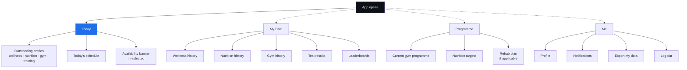

# 02. Information Architecture

## 1. Source material

There are now **two** sources, and they disagree. Read both before changing navigation.

| Source | What it is | Authority |
|---|---|---|
| `app layout.pdf` | The hand-drawn navigation map, transcribed below. Written before any code. | Intent |
| `docs/source/training-report-screenshot.png` | A screenshot of the **existing, working Next.js staff web app**, supplied by the client. | Reality |

The drawing describes what was wanted. The screenshot describes what has been built. Where
they conflict, the screenshot wins for the staff web app, because it is shipped code that
staff are presumably already using. It does not win for the athlete mobile app, because no
athlete-app evidence has been supplied.

The design system in `docs/source/design-system-content.txt` states it was "extracted from
`web/src/app/globals.css`", which confirms the web app exists as source. See `CLAUDE.md` §8.

### Verbatim transcription

```
All pages group separations                    [written down the right margin]

Fixtures ──────────► training sessions
Schedule ──────────► MD-1
Dashboard ─┬───────► Squad ──► Compliance / Availability
           ├───────► Timetable
           ├───────► Flags ──┬─► Flags
           │                 ├─► Wellness      } All separate tabs
           │                 ├─► Gym
           │                 └─► GPS
           └───────► Injury dash ──► Corner group allocation
Squad
Dashboard
Reports
GYM PROGRAMME
Nutrition ─────────► Whole squad
Leaderboard ───────► Everything
Analytics ─┬───────► Training
           ├───────► Gym
           └───────► Wellness
Settings ──┬───────► Thresholds
           ├───────► Passwords
           ├───────► Log out
           └───────► Exports

[long curved arrow from the Dashboard cluster down to:]
           ┌───────► Training
           ├───────► Wellness      ──► Compliance / availability ──► Day or week view
           ├───────► Nutrition
           ├───────► Gym
           └───────► Testing ──► Log results
                              ──► Left / right reports

[arrow from that cluster back up-left to:]
"create general programme and tailor to specific athletes"
```

### Interpretation notes

Four things in the drawing need a decision rather than a transcription:

1. **"All pages group separations"** is a global rule, not a screen. Formalised as the
   group filter rule in `CLAUDE.md` §3.
2. **The lower cluster** (Training / Wellness / Nutrition / Gym / Testing) appears twice:
   once as top-level destinations and once as the target of an arrow from the Dashboard.
   Read as: these are *domains*, reachable both as primary destinations and by drilling
   down from a dashboard card. Same screens, two entry points.
3. **"Left / right reports"** is read as horizontal swipe navigation between report views
   within a domain, not a separate screen.
4. **"Corner group allocation"** is **RESOLVED**. The client confirmed on 5 August 2026
   that it means **allocating players to specific teams**, for example 1st XV, 2nd XV,
   Colts. It sits off the injury dashboard because availability is what determines who can
   be allocated. Specified in `docs/screens/team-allocation.md`, schema in
   `04-data-model.md` §17.13. The earlier reading, allocation into rehabilitation groups,
   was wrong and has been withdrawn. Rehabilitation grouping survives as a smaller,
   medical-owned feature inside `docs/screens/injury-dashboard.md`.

---

## 2. The problem with the drawn structure

**The drawing has ten top-level destinations.** A mobile tab bar holds five before it
becomes unusable, and the ten include items of wildly different weight: `Settings` is a
rarely-visited utility, `Dashboard` is opened every day.

More importantly, the drawing is a **staff** navigation map. An athlete needs almost none
of it. Building one navigation for both roles produces an athlete app that is mostly
disabled menu items, which is the fastest way to lose the compliance that the whole product
depends on.

**Therefore: two distinct navigation structures, one per role class.** Same codebase, same
screens where they overlap, different shells.

**Amendment after the screenshot.** The ten-destination problem is a *phone* problem. The
existing staff web app does not have it, because a left sidebar has no five-item ceiling: it
already carries fifteen items flat. The reasoning above therefore applies only to staff on a
phone, and staff on a phone may not be a thing that needs to exist (O-6, O-725). The athlete
argument is unchanged.

---

## 3. Athlete navigation

Four tabs. Nothing else. Every athlete action must be reachable in at most two taps.



**Tab 1, Today** is the default landing screen and carries the entire compliance burden.
It shows what is outstanding, in priority order, with a one-tap entry point for each. When
nothing is outstanding it shows the day's schedule and confirms the athlete is up to date.

**Tab 2, My Data** is history and trends. Segmented by domain.

**Tab 3, Programme** is what the athlete has been prescribed.

**Tab 4, Me** is profile and settings.

---

## 4. Staff navigation

Staff navigation has two forms. The **web sidebar in §4.1 is the real one and it already
exists in code.** The five-tab phone structure in §4.6 is a proposal that has never been
built and may never need to be.

### 4.1 The staff web sidebar

**Set by the client on 6 August 2026. Nine rows.** This supersedes both the hand-drawn map
and the fifteen-row sidebar in the screenshot of the existing app.

| # | Row | What it holds |
|---|---|---|
| 1 | **Dashboard** | Availability, attention list, timetable, today's sessions, compliance |
| 2 | **Squad overview** | The roster. Every player, groups, and the way into one athlete's profile |
| 3 | **Schedule** | The calendar, fixtures, sessions, the MD-n planner, testing sessions |
| 4 | **Reports** | Training report, squad weekly, compliance, injury and availability, testing results |
| 5 | **Nutrition** | Targets, guidance, meal ideas, body composition |
| 6 | **Gym programme** | Programmes, the builder, the exercise library |
| 7 | **Leaderboard** | Configurable boards |
| 8 | **Analytics** | Presets and the custom builder |
| 9 | **Settings** | Thresholds, imports, exports, account, users, groups, sign out |

**The five rows that were removed, and where they went.** Nothing is deleted, it moves.

| Was a sidebar row | Now lives in | Why that is the right home |
|---|---|---|
| Fixtures | **Schedule** | A fixture is a scheduled thing. The hand-drawn map already had "Fixtures leads to training sessions". |
| Training report | **Reports** | It is a report. It stays the most-used one, so it is the default view when Reports opens. |
| Testing | **Schedule** to run a session, **Reports** to read the results | A testing session is a session. Its output is a report. |
| Import GPS | **Settings** | See the warning below. This one is not free. |
| Thresholds | **Settings** | Exactly where the original hand-drawn map put it. |

**Warning on Import GPS.** `16-strength-conditioning-brief.md` and `14-sports-science-brief.md`
both describe importing a GPS file as a **four-times-a-week task**, done in a hurry, by a
person who is not an administrator. Burying it in Settings puts a routine job in the drawer
where you keep annual jobs. Two options that keep the nine rows: put an import action on the
**Reports** page next to the training report it feeds, or surface it on the **Dashboard** on
days a pitch session has GPS data expected and none imported. I recommend the first. O-1100.

**Flags and the injury board still have no row.** They did not have one before either
(O-723), and with nine rows it now matters more, not less. See §4.2.

---

### 4.2 Medical staff and the dashboard

**Decided 6 August 2026: no medical row. O-1101 resolved, option three.** Physios reach
injuries, availability and rehab through the dashboard, like everyone else. The sidebar stays
at nine rows for every role.

**The risk this accepts, recorded so it is not rediscovered later.** The physio is the only
role that can set availability, and availability is the field the coach's dashboard is built
on. If the physio disengages because the tool has no front door for their work, the
availability board goes stale and the coach's dashboard becomes wrong. The failure is silent
and it shows up as staff saying "the app is out of date" rather than as anything you can see
in the data.

**One mitigation, and it costs nothing.** The dashboard's panels are the same for everyone,
but **their order is resolved from the signed-in user's role**:

| Role | Panel order, top to bottom |
|---|---|
| Coach / S&C | Availability, attention list, today's sessions, compliance |
| **Medical** | **Injury board and availability, expanded**, then their own flags (soreness, wellness), then today's sessions |
| Admin | Compliance and usage, then availability at count level only |

Medical lands on their work without a new row, and a physio opening Fydr sees the injury
board first rather than scrolling past a coach's attention list to find it. The panels
themselves are unchanged, so this is ordering, not a second dashboard.

**Checkpoint.** Ask the pilot club's physio, at week four, whether they are using Fydr or
still keeping their own notes. If it is the latter, revisit this and add the medical row. That
question belongs in the pilot review in `10-roadmap.md` §11.

### 4.3 Sidebar item to specification file

| Sidebar item | Spec screen | File | Reconciliation |
|---|---|---|---|
| My dashboard | 8 Staff dashboard | `dashboard.md` | **Name mismatch.** "My" implies a per-user surface. `dashboard.md` specifies a squad exception list identical for every coach. Either the built screen is personalised, or "My" is decoration. O-720. |
| Squad overview | 9 Squad status **and** 19 Squad list | `squad-status.md`, `squad-list.md` | **One sidebar item, two spec screens.** The spec deliberately splits "who needs attention" from "the roster". The sidebar does not. O-721. |
| Fixtures | 17 Fixture detail | `fixture-detail.md` | **Partial.** No fixtures *list* screen is specified. The spec nests fixtures under Schedule; the app promotes them to top level, matching the drawing. A list screen is now missing. |
| Reports | 28 Reports | `reports.md` | Match. |
| Training report | none | `training-report.md` **(new)** | **Was missing.** Now specified from the screenshot. |
| Leaderboard | 26 Leaderboards | `leaderboards.md` | Match. Rename the spec to the singular to follow the app. |
| Analytics | 27 Analytics | `analytics.md` | Match. Note O-7: the app keeps Reports and Analytics separate, so the drawing's split has survived into code. |
| Testing | 25 Testing | `testing.md` | Match. |
| Nutrition | 24 Nutrition plans | `nutrition-plans.md` | Probable match. The bare label may also cover the squad nutrition view drawn as "Nutrition → whole squad". O-726. |
| Schedule | 15 Schedule / calendar | `schedule.md` | Match. |
| Import GPS | 34 GPS data import | `imports.md` | Match on function, not on label. The spec calls it "Import"; the app names the data source. |
| Gym programme | 23 Gym programmes | `gym-programmes.md` | Match. Singular in the app, matching the drawing's `GYM PROGRAMME`. Whether the programme *builder* (22) is a separate destination or lives inside this one is not visible. |
| Thresholds | 30 Thresholds | `thresholds.md` | Match on screen, mismatch on placement. Top-level in the app, under Settings in the spec. |
| ~~Flight control~~ | none | **removed** | Deleted at client instruction. See §4.4. |
| Account · Sports s… | 29 Settings | `settings.md` | Partial. The footer merges identity, role, and settings entry into one row. |
| Sign out | 29 Settings | `settings.md` | Partial. Promoted to navigation, not nested. |

**Specified screens with no sidebar entry.** Expected for drill-downs, unexpected for the rest.

| Screen | File | Why it is probably absent |
|---|---|---|
| 10 Flags | `flags.md` | Not a drill-down in the spec. Its absence is material. O-723. |
| 12 Injury dashboard | `injury-dashboard.md` | Same. Possibly not built, possibly medical-role-only and the screenshot user is sports science. O-723. |
| 11 Timetable | `timetable.md` | Plausibly folded into Schedule. |
| 13 Injury record, 14 Team allocation, 42 Rehab groups | `injury-record.md`, `team-allocation.md`, `rehab-groups.md` | Drill-downs from the injury dashboard. |
| 16 Session detail, 17 Fixture detail, 18 MD-n planner | `session-detail.md`, `fixture-detail.md`, `md-planner.md` | Drill-downs from Schedule and Fixtures. |
| 20 Athlete profile | `athlete-profile.md` | Drill-down from any athlete row. |
| 21 Groups, 31 Exports, 32 User management | `groups.md`, `exports.md`, `user-management.md` | Plausibly inside the Account footer. Not visible. |
| 22 Programme builder | `programme-builder.md` | Plausibly inside Gym programme. |
| 33 Onboarding | `onboarding.md` | Not a navigable destination. |

### 4.4 Flight control, removed

`Flight control` appeared as sidebar item 14 in the screenshot of the existing app, with a
sparkle icon. No specification described it and the client has since confirmed it should be
removed.

**Action for the existing web app**: delete the sidebar entry, the route, and the page
component. Check for any data it wrote before deleting, and if it wrote nothing, there is
nothing to migrate. Do not reintroduce it under another name.

Open question O-722 is closed.


### 4.5 Mapping the drawing onto the built structure

Every item in the original drawing still has a home. The right-hand column now records where
it landed in the **shipped web app** where that is known, and where it landed in the proposed
structure where it is not.

| Drawn item | Proposed home, five-tab structure | In the built web app |
|---|---|---|
| Fixtures → training sessions | Schedule → Fixtures | Sidebar 3, `Fixtures`, top-level |
| Schedule → MD-1 | Schedule → MD-n planner | Presumed inside sidebar 10, `Schedule`. Not visible. |
| Dashboard | Dashboard (tab 1) | Sidebar 1, `My dashboard` |
| Dashboard → Squad → Compliance/Availability | Dashboard → Squad status | Presumed sidebar 2, `Squad overview`. O-721. |
| Dashboard → Timetable | Dashboard → Today's timetable | Presumed inside `Schedule`. Not visible. |
| Dashboard → Flags (+ 4 tabs) | Dashboard → Flags, four segmented tabs | **No sidebar entry.** O-723. |
| Dashboard → Injury dash | Dashboard → Injury dashboard | **No sidebar entry.** O-723. |
| Injury dash → Corner group allocation | Injury dashboard → Team allocation | Not visible. Depends on O-723. |
| Squad | Squad (tab 3) | Sidebar 2, `Squad overview` |
| Reports | More → Reports | Sidebar 4, `Reports`, top-level. Plus sidebar 5, `Training report`, which the drawing does not contain. |
| Gym programme | Programmes → Gym programmes | Sidebar 12, `Gym programme`, top-level, no `Programmes` parent |
| Nutrition → whole squad | Programmes → Nutrition plans, and Squad → domain view | Sidebar 9, `Nutrition`, top-level. O-726. |
| Leaderboard → everything | More → Leaderboards | Sidebar 6, `Leaderboard`, top-level |
| Analytics → training/gym/wellness | More → Analytics | Sidebar 7, `Analytics`, top-level |
| Settings → thresholds | More → Settings → Thresholds | Sidebar 13, `Thresholds`, **top-level, not under Settings** |
| Settings → passwords | More → Settings → Account security | Presumed inside the `Account` footer |
| Settings → log out | More → Settings → Log out | Footer, `Sign out`, one click from anywhere |
| Settings → exports | More → Settings → Exports | Not visible. Presumed inside `Account` or per-screen export. |
| Training/Wellness/Nutrition/Gym cluster | Domain screens, reachable from Dashboard cards and Squad → athlete | Partially: `Training report` and `Nutrition` are top-level. No wellness destination is visible, which is notable given wellness carries the compliance thesis. O-729. |
| Compliance/availability | Dashboard → Squad status, and per-domain compliance view | Presumed inside `Squad overview` |
| Day or week view | View toggle on every domain screen | Not visible. `Training report` uses date chips instead. |
| Left/right reports | Horizontal swipe between report views within a domain | Not visible on web. Reads as a phone gesture. |
| Testing → log results | More → Testing → session → log results | Sidebar 8, `Testing`, top-level |
| Create general programme, tailor to athletes | Programmes → Programme builder | Presumed inside `Gym programme` |
| (not drawn) | n/a | Sidebar 11, `Import GPS`, top-level |
| (not drawn) | n/a | Sidebar 14, `Flight control`. **Removed at client instruction, O-722 closed.** |

### 4.6 Staff mobile, committed

**Status: COMMITTED, 5 August 2026.** The client confirmed staff need a phone app as well as
the web dashboard. O-6, O-24 and O-725 are resolved: **both**. A fifteen-item flat sidebar
will not fit a tab bar, and this is the grouping that solves it.

**What this costs, stated here because it is the largest single scope decision in the
project.** The staff phone app is not a responsive version of the web dashboard. It is a
second navigation shell, a second set of layouts for roughly twenty staff screens, a second
offline story (staff currently have none, O-14), and a second set of store submissions. See
`10-roadmap.md` §2. The honest figure is **8 to 12 additional weeks**, which is comparable to
the whole of Phase 2.

**Consequence for build order.** Do not build staff mobile alongside staff web. Build web
first, learn what coaches actually do at a desk versus pitchside, then build the phone app
for the subset that is genuinely pitchside work: attendance, flags, availability, and reading
the dashboard. Building both at once doubles the surface area of every change while the
product is still moving.

The sidebar collapses into five tabs as follows. This is the only
place in the specification where the `Dashboard`, `Programmes`, and `More` parents exist; they
are a phone affordance, not a concept in the product.

```mermaid
graph TD
    S[Staff phone app] --> D[Dashboard]
    S --> SC[Schedule]
    S --> SQ[Squad]
    S --> PR[Programmes]
    S --> MO[More]

    D --> D1[Squad overview<br/>compliance + availability]
    D --> D2[Flags]
    D --> D3[Today's timetable]
    D --> D4[Injury dashboard]

    D2 --> F1[All flags]
    D2 --> F2[Wellness flags]
    D2 --> F3[Gym flags]
    D2 --> F4[GPS flags]

    D4 --> I1[Availability board]
    D4 --> I2[Team allocation]

    SC --> SC1[Calendar day week month]
    SC --> SC2[Fixtures]
    SC --> SC3[Training sessions]
    SC --> SC4[MD-n planner]
    SC --> SC5[Testing sessions]

    SQ --> SQ1[Squad list]
    SQ --> SQ2[Athlete profile]
    SQ --> SQ3[Groups]
    SQ2 --> SQ4[Wellness Nutrition Gym<br/>Training GPS Testing Injury]

    PR --> PR1[Gym programme]
    PR --> PR2[Nutrition]
    PR --> PR3[Rehab programmes]
    PR --> PR4[Programme builder]

    MO --> MO1[Analytics]
    MO --> MO2[Reports and Training report]
    MO --> MO3[Leaderboard]
    MO --> MO4[Testing]
    MO --> MO5[Thresholds]
    MO --> MO6[Import GPS]
    MO --> MO7[Account and settings]

    style D fill:#1f6fea,color:#ffffff
    style S fill:#182241,color:#ffffff
```



`Flight control` is absent from this diagram because it has been removed from the product.

**The open question is whether any of this is needed.** O-6 and O-24 already ask it; the
screenshot strengthens the case for answering it no, because a staff web app that works
exists today and no staff phone app does. See O-725.

---

## 5. Complete screen inventory

`A` = athlete, `C` = coach/S&C, `M` = medical, `X` = admin.

**Status column**, added after the screenshot:

| Marker | Meaning |
|---|---|
| *(blank)* | Specified in `docs/screens/`. |
| **NEW** | Identified from the screenshot of the existing app. Specification written from that evidence. |
| **UNSPEC** | Identified from the screenshot of the existing app. **No specification exists and none should be invented.** Needs a client answer first. |
| **RESERVED** | Referenced by `10-roadmap.md` but never added to this inventory and never specified. Listed here so the numbering does not collide. |

| # | Screen | Roles | File | Status |
|---|---|---|---|---|
| 1 | Today (athlete home) | A | `today.md` | |
| 2 | Wellness entry | A | `wellness-entry.md` | |
| 3 | Nutrition guidance | A | `nutrition-guidance.md` | Replaces `nutrition-entry.md`, superseded 5 Aug 2026 |
| 4 | Gym session logging | A | `gym-logging.md` | |
| 5 | Training RPE entry | A | `training-entry.md` | |
| 6 | My data / history | A | `my-data.md` | |
| 7 | My programme | A | `my-programme.md` | |
| 8 | Staff dashboard | C M | `dashboard.md` | |
| 9 | Squad status | C M | `squad-status.md` | |
| 10 | Flags | C M | `flags.md` | |
| 11 | Timetable | C M | `timetable.md` | |
| 12 | Injury dashboard | C M | `injury-dashboard.md` | |
| 13 | Injury record | M | `injury-record.md` | |
| 14 | Team allocation | C M | `team-allocation.md` | The whiteboard's "corner group allocation", resolved 5 Aug 2026 |
| 15 | Schedule / calendar | C M | `schedule.md` | |
| 16 | Session detail | C M | `session-detail.md` | |
| 17 | Fixture detail | C M | `fixture-detail.md` | |
| 18 | MD-n planner | C M | `md-planner.md` | |
| 19 | Squad list | C M | `squad-list.md` | |
| 20 | Athlete profile | C M | `athlete-profile.md` | |
| 21 | Groups management | C M X | `groups.md` | |
| 22 | Programme builder | C M | `programme-builder.md` | |
| 23 | Gym programmes | C M | `gym-programmes.md` | |
| 24 | Nutrition plans | C M | `nutrition-plans.md` | |
| 25 | Testing | C M | `testing.md` | |
| 26 | Leaderboards | A C M | `leaderboards.md` | |
| 27 | Analytics | C M | `analytics.md` | |
| 28 | Reports | C M | `reports.md` | |
| 29 | Settings | all | `settings.md` | |
| 30 | Thresholds | C | `thresholds.md` | |
| 31 | Exports | C M X | `exports.md` | |
| 32 | User management | X | `user-management.md` | |
| 33 | Onboarding | all | `onboarding.md` | |
| 34 | GPS data import | C M | `imports.md` | |
| 35 | Audit log viewer | X | *(none)* | **BUILT**, ahead of its reserved phase — `/settings/audit`, `lib/queries/auditLog.ts`. `01-roles-and-permissions.md` §2 already granted admins access with no screen; this closed that gap directly rather than waiting on the phase it was filed against. |
| 36 | Athlete report a problem | A | *(none)* | **RESERVED** (`10-roadmap.md` §4) |
| 37 | Training report | C M | `training-report.md` | **NEW** |
| ~~38~~ | ~~Flight control~~ | n/a | *(none)* | **REMOVED** at client instruction, 5 Aug 2026. Do not build. |
| 39 | My dashboard | C M | *(none, or `dashboard.md`)* | **UNSPEC**. Sidebar item 1. May be screen 8 renamed, may be a personalised variant. O-720. |
| 40 | Squad overview | C M | *(none, or `squad-status.md` + `squad-list.md`)* | **UNSPEC**. Sidebar item 2. One built screen against two specified screens. O-721. |
| 41 | Fixtures list | C M | *(none)* | **UNSPEC**. Sidebar item 3. Only `fixture-detail.md` exists; the list it is reached from was never specified. |
| 42 | Rehabilitation grouping | M C | `rehab-groups.md` | Medical-owned. Not the whiteboard item, but a real feature backed by `rehab_assignments.rehab_group_id` |
| 43 | Privacy and my data | A | *(none, or `settings.md` §"Privacy and my data")* | **RESERVED** (`10-roadmap.md` §12). Athlete rights surface: consent state, export, erasure, account deletion. Phase 1a. |
| 44 | Data requests | X | *(none)* | **PARTLY BUILT**, ahead of its reserved phase — `/settings/subject-access` is a real admin queue for the subject-access half (request → medical review → admin release, real `sar_request` status tracking). Erasure and objection requests are not built; this is Article 15 only, not the full row. |
| 45 | Nutrition weekly check-in | A | `nutrition-checkin.md` | Bottom sheet over Today. O-890 resolved 5 Aug 2026: one question, once a week. Not an entry screen for meals or macros. Phase 2. |

---

## 6. Global elements

Present on every screen where relevant, implemented once.

### Group filter

A persistent control in the staff header. Selection is global state and survives
navigation between screens and app restarts. Options: `All squad`, then every group
defined by the organisation. Multi-select.

When a group filter is active, the header shows it explicitly. There must never be a
situation where a coach is reading partial data and does not know it.

**As built.** The design system specimen shows this as a row of pills, `All squads`,
`Forwards`, `Backs`, `Half backs`, using `.squad-chip` with a single filled `.squad-chip.active`
marking the selection. That is single-select, not multi-select as specified above. The
training report screenshot shows the same chip component used for **dates** instead, and no
group chips are visible on that screen. Either the group filter is not on that screen, or the
chip row is contextual per screen. Confirm alongside O-724.

### Date / period selector

Every screen showing time-series data has a period control. Standard options: `Today`,
`This week`, `Last 7 days`, `Last 28 days`, `Season`, `Custom`. Like the group filter, the
selection persists across navigation.

The 28-day default window is the analysis default because acute:chronic workload ratios
conventionally use a 7:28 day comparison.

### Day / week toggle

Domain screens (training, wellness, nutrition, gym) toggle between a single-day detail view
and a week grid. Drawn on the whiteboard as "day or week view".

### Horizontal report swipe

Within a domain screen, reports are arranged in a horizontal pager. Swiping left and right
moves between report views without returning to a menu. Drawn as "left/right reports".

---

## 7. Navigation rules

1. **Maximum depth is three levels** from a tab root. If a screen needs a fourth, the
   hierarchy is wrong.
2. **Every drill-down preserves context.** Navigating from a flag to an athlete carries the
   date and domain with it. The athlete screen opens on the relevant tab, not the default.
3. **Back always returns to the originating screen**, not a canonical parent. An athlete
   profile opened from a flag returns to flags, not to the squad list.
4. **Deep links resolve to the correct role shell.** A push notification opening a flag must
   land a coach on flags and must never be delivered to an athlete.
5. **No modal traps.** Every modal has a visible dismiss. Data entry modals confirm before
   discarding unsaved input.

---

## 8. Open questions

- **O-5**: **RESOLVED, 5 August 2026.** "Corner group allocation" means allocating players
  to specific teams. See `docs/screens/team-allocation.md`.
- **O-6**: **RESOLVED, 5 August 2026. Both.** Staff get a phone app as well as the web dashboard. Roadmap Phase 2m, 10 weeks, built after staff web. Original text: Does staff need a phone app at launch, or is web-only acceptable for staff with
  the phone app athlete-only? Web-only for staff halves the v1 build. I have specified both,
  but recommend athlete-mobile plus staff-web for v1.
- **O-7**: Should `Reports` and `Analytics` be one destination? They overlap heavily. I
  have kept them separate to match the drawing, but suspect they should merge. **Partly
  answered by the screenshot**: the built app keeps them separate and adds a third,
  `Training report`. Confirm that is deliberate rather than accretion.

### Raised by the screenshot of the existing app

- **O-720**: Is `My dashboard` the same screen as 8 `dashboard.md`, or a personalised
  surface? "My" is doing work in that label or it is not. If it is personalised, say what
  varies by user: saved views, the groups they coach, their own outstanding actions. This
  changes whether `dashboard.md` is accurate or obsolete.
- **O-721**: `Squad overview` is one sidebar item. The specification has two screens,
  9 `squad-status.md` (compliance and availability, the exception counterpart) and 19
  `squad-list.md` (the roster). Which is the built screen, or is it both merged? If merged,
  one of the two spec files should be retired rather than left to rot.
- **O-722**: **CLOSED.** `Flight control` has been removed from the product at the client's
  instruction (5 August 2026). Remove the sidebar item, the route, and the page component from
  the existing web app. Nothing replaces it.

- **O-723**: `Flags` and `Injury dashboard` have no sidebar entry, yet `flags.md` and
  `injury-dashboard.md` are two of the most detailed screens in the specification and the
  flag system is described in `00-product-overview.md` as "the product". Three possibilities,
  and they have very different consequences: they are nested inside `My dashboard`, they are
  role-gated and invisible to the sports science account in the screenshot, or they are not
  built. Which?
- **O-724**: Fifteen flat sidebar items with no grouping. That is workable on a wide screen
  and is not a defect. Do you want it grouped, or is flat deliberate? Flat is faster for a
  daily user who knows the list and slower for a new one.
- **O-725**: Restates O-6 and O-24 with new evidence. A staff **web** app exists and works.
  No staff phone app exists. Is the staff phone app now out of scope entirely? If yes, the
  five-tab structure in §4.6 should be deleted rather than maintained, and ADR-002's scope
  shrinks.
- **O-726**: The sidebar has one `Nutrition` item and one `Gym programme` item. The
  specification splits each into plan authoring (23, 24) and a squad domain view. Does the
  built screen do both?
- **O-727**: `Fixtures` is top-level in the app and nested under `Schedule` in the
  specification. The drawing has it top-level, so the app matches the drawing. Confirm the
  specification should follow, and note that no fixtures **list** screen was ever specified,
  only `fixture-detail.md`. That is screen 41 in §5 and it needs writing.
- **O-728**: The footer reads `Account · Sports s…`, truncated. Is the second part the
  signed-in user's role ("Sports science"), the organisation name, or something else? It
  determines whether the footer is an identity display or an org switcher.
- **O-729**: There is no wellness destination in the sidebar. Wellness is the mechanism the
  entire compliance thesis rests on (`00-product-overview.md` core thesis 1). Is wellness
  reached only through `My dashboard` and `Squad overview`, or is the wellness loop not built
  on the web at all because it is an athlete-app concern?
