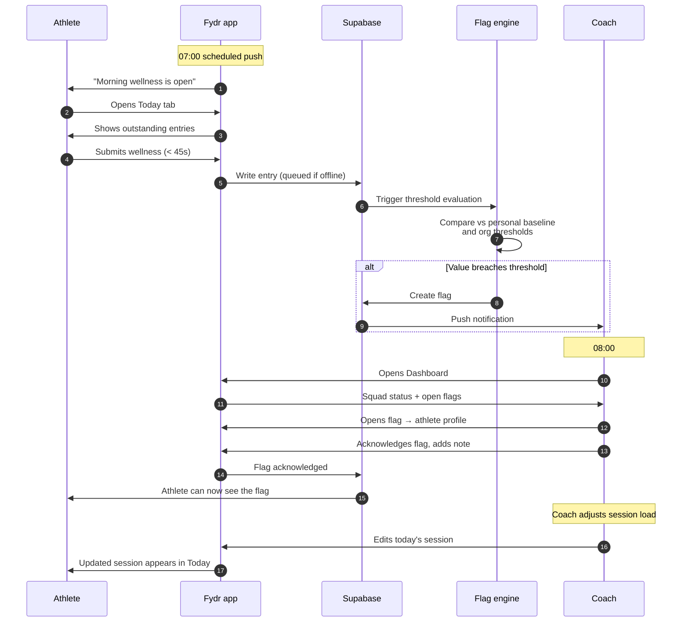
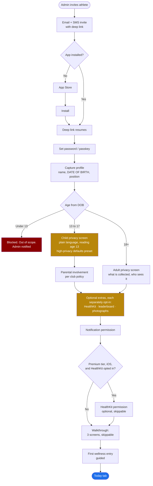
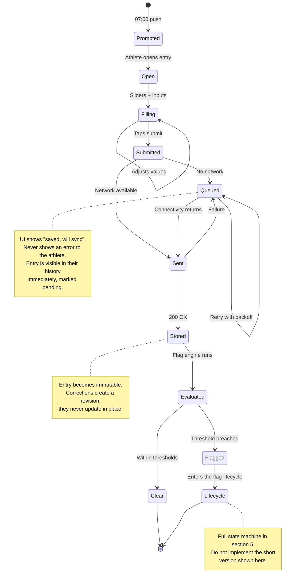
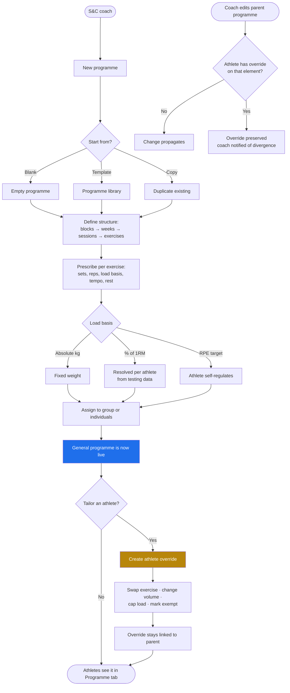
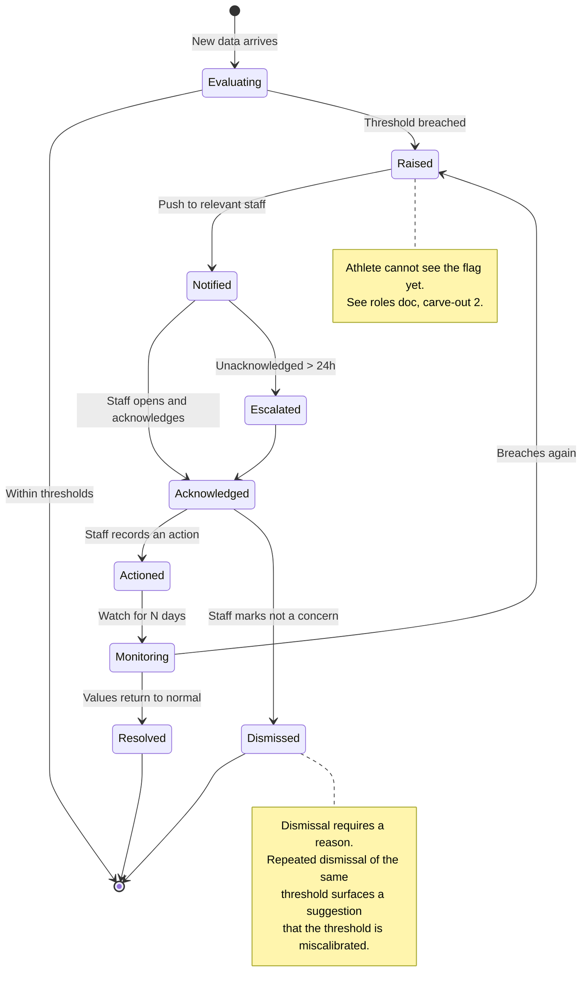
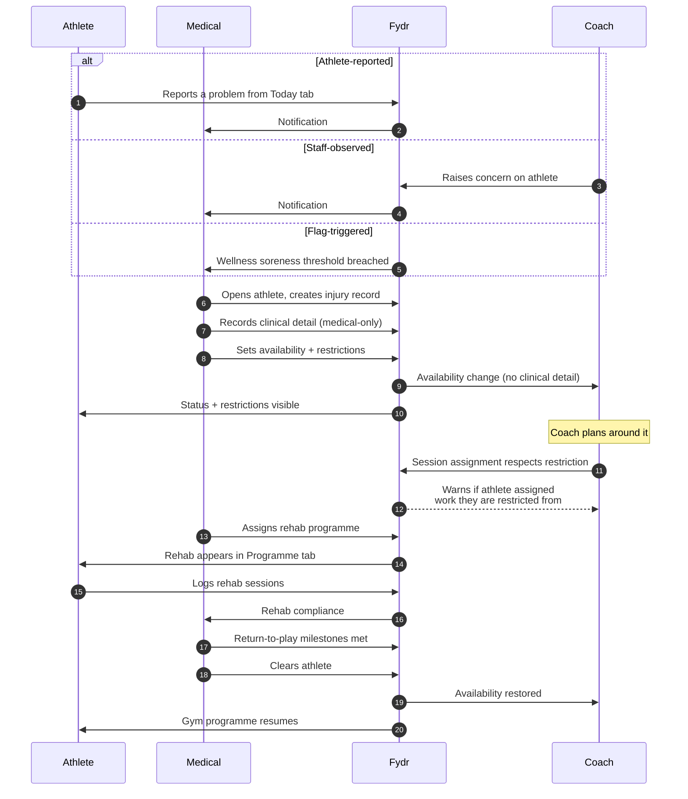
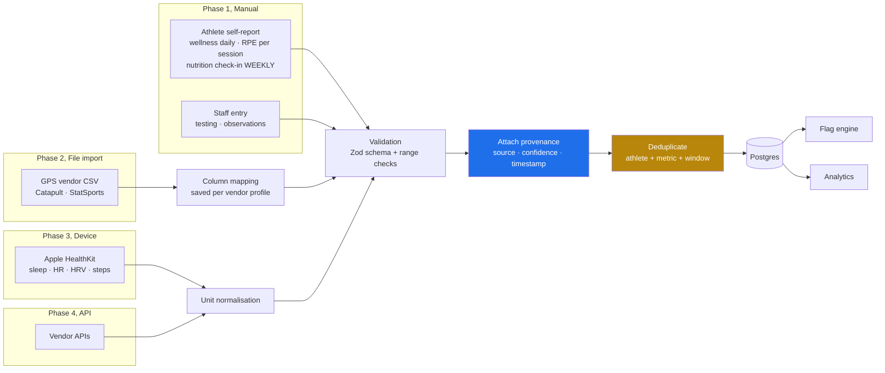
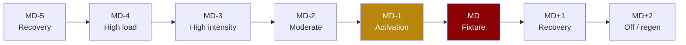
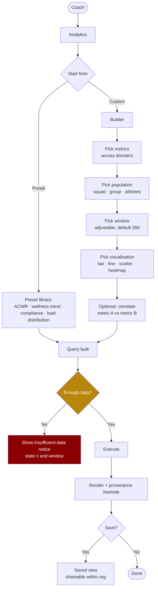
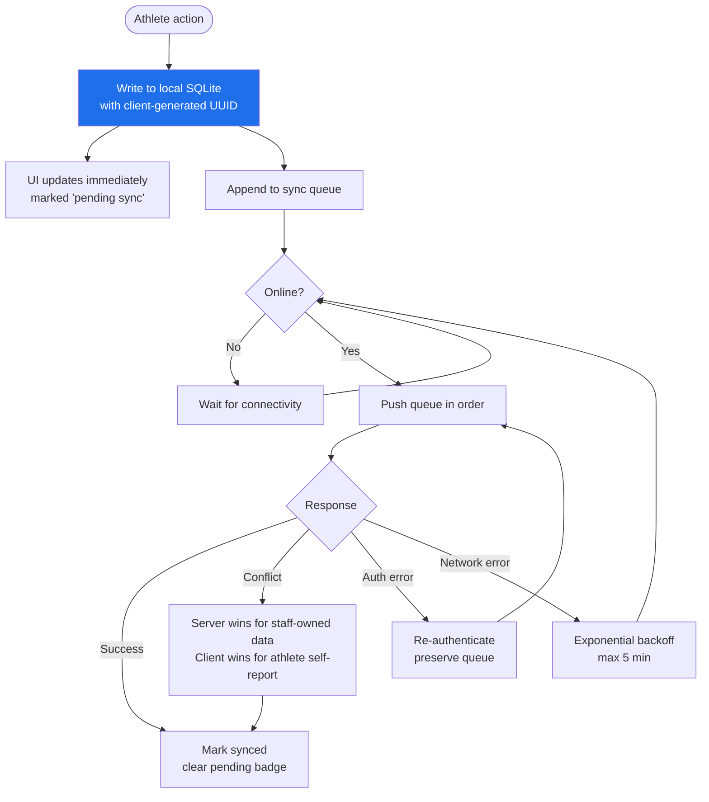

# 03. Application Flows

Every diagram here is normative. If the code does something different, one of the two is
wrong and it needs raising, not quietly reconciling.

---

## 1. The daily loop

The core rhythm of the product. Everything else is supporting infrastructure.

**Design consequence**: the flag engine must complete within a few seconds of submission.
A coach arriving at 08:00 must see flags from a 07:15 submission. Run it as a Postgres
trigger calling an Edge Function, not a nightly batch.

---

## 2. Athlete first-run and onboarding

**Correction, 5 August 2026. An earlier version of this flow gated the whole account on a
consent screen, with "consent declined" producing an inactive account. That was wrong and it
contradicted `09-security-and-compliance.md` §3.**

**Consent is not the lawful basis for the core processing.** An athlete cannot freely refuse
their coach. Consent that is not freely given is not consent, and it is invalid from the
moment it is collected. The core processing rests on the club's legitimate interests plus an
Article 9 condition, not on the athlete ticking a box. See `09-security-and-compliance.md` §3
for the full basis stack.

**So what the athlete actually sees is a privacy screen, not a consent gate.** It tells them
in plain English what is collected, who in the club can see it, that clinical notes are not
visible to their coach, and that they can export or request erasure. There is no "decline"
that switches the account off, because there is nothing to decline at that point.

**Consent applies only to the genuinely optional extras**, and each is separately opt-in and
separately withdrawable: HealthKit and device sync, appearing on leaderboards, and
photographs. Declining any of them leaves a fully working account.

**Age determines the flow, and date of birth is therefore captured, not confirmed.** Under-18
athletes are in scope (`09-security-and-compliance.md` §4), so the Children's Code applies in
full. Minors get child-facing privacy language written at a reading age of about 13,
high-privacy defaults preset rather than offered, parental involvement per club policy, and
leaderboards off unless actively opted in. Under-13s are blocked at invite: Article 8 requires
parental consent below 13 and Fydr does not model it. See O-961.

**An athlete cannot be activated without a date of birth**, because the age branch cannot be
resolved without one. `04-data-model.md` §17.16 enforces this at invite rather than with a
`not null` column, so staff can still add a squad member before they have full details.

### Staff first-run

Not diagrammed because it is short: invite, set password, multi-factor enrolment (mandatory
for staff, `09-security-and-compliance.md` §8), role confirmation, done. Staff have no consent
screen because they are not the data subject of the performance data. They do get a privacy
notice covering their own account data.

> **Real divergence, recorded per CLAUDE.md §5 rather than silently followed** (login-security
> checklist item 3): this build has no onboarding wizard at all — an admin-created account
> starts `active` immediately (`lib/queries/userManagement.ts`'s own header has always said
> so), and the person's first action is just signing in at the one real `/login` screen, not a
> guided multi-step sequence with an "MFA enrolment" step 2b to hook into. MFA enrollment
> instead lives in Settings (`MfaEnrollment.tsx`), reachable any time after first sign-in, and
> is a strong, undismissable prompt for coach/medical/admin rather than something that blocks
> progress the way this section's "mandatory" and the onboarding table below ("Staff without
> MFA: Cannot proceed. Sign-out is the only exit.") describe — see
> `09-security-and-compliance.md`'s implementation-status note for exactly why a hard block
> wasn't safe to ship in this pass. Also wrong below, independent of that design choice:
> item 19's "Recovery codes are the route back" — Supabase's TOTP MFA API has no recovery-code
> concept at all, checked against the shipped SDK types before writing any of this, so no
> implementation of this flow against this vendor could offer that. The real recovery path is
> `UserDetailPanel.tsx`'s admin-only "Remove MFA factor" action.

The shell they land in, athlete or staff, is resolved server-side from their roles. A user
holding both roles gets the staff shell with their own athlete data inside it, never two apps.

---

## 3. Wellness submission, including offline

**Non-negotiable**: the athlete never sees a network error. The entry is saved locally the
instant they submit, appears in their history, and syncs when it can. The submission is a
local write with a background sync, not a network request with a spinner.

---

## 4. Programme creation and tailoring

The whiteboard instruction: *"create general programme and tailor to specific athletes"*.

**The critical mechanic** is the override model. A general programme is the parent. An
athlete-specific change creates an override record on a single element, not a full copy.
When the coach edits the parent, unmodified elements update everywhere and overridden
elements are preserved.

The alternative, copying the programme per athlete, means a coach editing one exercise
has to repeat it 30 times. That is the failure mode of every spreadsheet-based system Fydr
is replacing, so it cannot be reproduced.

**Rehab exception**: a medical-assigned rehab programme overrides a gym programme entirely
for that athlete. The gym programme is marked suspended, not deleted, and resumes on
clearance.

---

## 5. Flag lifecycle

**Deliberate feature**: if a threshold is dismissed repeatedly, Fydr suggests recalibrating
it. Alert fatigue is what kills monitoring systems. A flag nobody acts on is worse than no
flag, because it teaches staff to ignore the badge.

---

## 6. Injury and availability

**Hard rule enforced in code**: the system warns when a coach assigns an athlete work that
their restrictions prohibit. It warns rather than blocks, coaches overrule physios
constantly and a hard block gets the product uninstalled, but the override is logged.

---

## 7. Data ingestion by source

**Deduplication matters more than it looks.** Sleep can arrive from a self-reported wellness
entry and from HealthKit for the same night. These are different measurements of the same
thing with different reliability. Rules:

1. Device data wins over self-report for objective metrics (sleep duration, heart rate)
2. Self-report wins for subjective metrics (sleep *quality*, soreness, mood, stress)
3. Both are retained; the resolution picks which is displayed and which feeds analytics
4. The display always shows provenance so a coach knows what they are reading

---

## 8. Weekly planning around MD-n

MD-n is the scheduling spine. Everything anchors to distance from the next fixture.

**How it works in the product:**

1. The coach enters fixtures for the season
2. Fydr computes the MD-n label for every day between fixtures automatically
3. A **week template** defines what happens at each MD-n position: session types, expected
   load, which entries are required from athletes
4. Applying a template to a week generates the sessions, and the coach adjusts from there
5. Compliance expectations follow the template, no wellness entry is expected on a day
   the template marks as off

**Consequence**: compliance is measured against what was *expected that day*, never against
a flat "every athlete every day". An athlete is not marked non-compliant on a rest day. Get
this wrong and every compliance figure in the product is meaningless.

**Edge cases to handle:**
- Two fixtures in one week: MD-n labels are relative to the *next* fixture; the days after
  a fixture carry both MD+n and MD-n labels and the UI shows both
- No fixture scheduled: days are labelled by training week position instead
- Fixture postponed: MD-n labels recompute, and already-logged sessions keep their original
  label recorded alongside the new one

---

## 9. Analytics query flow

**The guard is a product feature, not a technicality.** A correlation computed on nine data
points from one athlete will look convincing and mean nothing. Fydr states sample size and
window on every analytical output, and refuses to draw a correlation below a minimum n.

> **Open question O-8**: minimum n before a correlation is displayed. I have set 20 paired
> observations as a placeholder. This needs your sports science judgement, not mine.

---

## 10. Offline and sync

**Client-generated UUIDs are required.** They make sync idempotent: replaying a queue after
a crash cannot create duplicate entries. Do not use server-generated sequential IDs for any
row an athlete can create offline.

**Queue survives**: app termination, device restart, and reinstall-with-same-account is a
loss (documented, accepted). The queue is persisted, not in memory.
