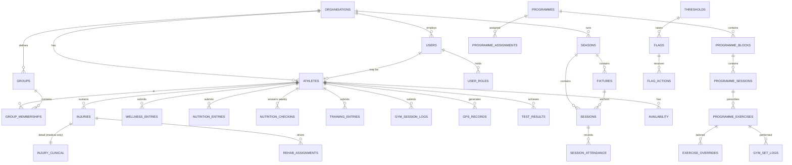

# 04. Data Model

Postgres, via Supabase. This document is the source of truth for the schema. Migrations
must match it, and a change to the schema requires a change here in the same commit.

---

## 1. Conventions

Applied to every table without exception.

| Rule | Detail |
|---|---|
| Primary keys | `uuid`, default `gen_random_uuid()`. Client-generated for offline-created rows. |
| Tenancy | Every club-data table has `org_id uuid not null references organisations(id)`. |
| Timestamps | `created_at timestamptz not null default now()`, `updated_at timestamptz not null default now()` maintained by trigger. |
| Soft delete | `deleted_at timestamptz`: null means live. Every read filters it. |
| Authorship | `created_by uuid references users(id)` on anything a human creates. |
| Naming | `snake_case`, plural table names, singular column names. |
| Enums | Postgres enum types, not free text, not integer codes. |
| Money | Never floats. `numeric(12,2)`. |
| Measurements | `numeric`, with the unit fixed by the column and documented. Never store a unit string alongside a value. |
| JSON | `jsonb` only where the shape is genuinely open (programme structure, analytics definitions). Never as a shortcut to avoid designing a table. |

**Units are canonical and non-negotiable:** mass in kilograms, distance in metres, speed in
metres per second, duration in seconds, time of day as `time`, dates as `date`, everything
else `timestamptz` in UTC. Convert at the presentation layer. A unit conversion bug in a
load-monitoring product produces confidently wrong training decisions.

---

## 2. Entity overview



---

## 3. Tenancy and identity

```sql
create table organisations (
  id            uuid primary key default gen_random_uuid(),
  name          text not null,
  sport         org_sport not null,                 -- rugby_union, rugby_league, football...
  timezone      text not null default 'Europe/London',
  country_code  char(2) not null default 'GB',
  tier          subscription_tier not null default 'core',   -- core | performance
  settings      jsonb not null default '{}'::jsonb,
  created_at    timestamptz not null default now(),
  updated_at    timestamptz not null default now(),
  deleted_at    timestamptz
);

create table users (
  id            uuid primary key,                   -- mirrors auth.users.id
  org_id        uuid not null references organisations(id),
  email         citext not null,
  full_name     text not null,
  phone         text,
  avatar_url    text,
  status        user_status not null default 'invited',  -- invited|active|suspended|deactivated
  last_seen_at  timestamptz,
  created_at    timestamptz not null default now(),
  updated_at    timestamptz not null default now(),
  deleted_at    timestamptz,
  unique (org_id, email)
);

-- Roles are additive. A user can be both coach and medical.
create table user_roles (
  id        uuid primary key default gen_random_uuid(),
  org_id    uuid not null references organisations(id),
  user_id   uuid not null references users(id) on delete cascade,
  role      app_role not null,                      -- athlete|coach|medical|admin
  granted_by uuid references users(id),
  granted_at timestamptz not null default now(),
  unique (user_id, role)
);

create table athletes (
  id              uuid primary key default gen_random_uuid(),
  org_id          uuid not null references organisations(id),
  user_id         uuid unique references users(id),  -- null = squad member with no login yet
  first_name      text not null,
  last_name       text not null,
  date_of_birth   date,
  position        text,
  squad_number    int,
  dominant_side   dominant_side,                     -- left|right|both
  height_cm       numeric(5,1),
  status          athlete_status not null default 'active',  -- active|injured_long_term|left_club
  joined_at       date,
  left_at         date,
  consent_given_at timestamptz,
  consent_version  text,
  created_at      timestamptz not null default now(),
  updated_at      timestamptz not null default now(),
  deleted_at      timestamptz
);
```

**Note on `athletes.user_id` being nullable**: staff must be able to add a squad member and
start recording data for them before that person has downloaded the app. Forcing an account
to exist first blocks onboarding on the slowest possible dependency.

**Note on `date_of_birth` being nullable, which it no longer is in practice.** Under-18
athletes are in scope as of 5 August 2026 (`09-security-and-compliance.md` §4), so age decides
which protections apply and cannot be unknown for anyone with an account. The column stays
nullable so a squad member can be created from a team sheet with nothing but a name, and
**§17.16 adds the constraints that stop that athlete being invited or activated without one**,
plus `athlete_is_minor()`. Read §17.16 before writing anything that reads this column.

**Note on `height_cm` but no `weight`**: body mass changes and belongs in a time series
(`body_composition`, §7), not on the athlete record. Height is effectively static for a
senior squad. For an academy with growing athletes it is not, which is open question O-9.

```sql
create table groups (
  id          uuid primary key default gen_random_uuid(),
  org_id      uuid not null references organisations(id),
  name        text not null,
  description text,
  colour      text,                                  -- hex, for UI consistency
  group_type  group_type not null default 'custom',  -- positional|training|rehab|age|custom
  sort_order  int not null default 0,
  created_at  timestamptz not null default now(),
  deleted_at  timestamptz,
  unique (org_id, name)
);

create table group_memberships (
  id         uuid primary key default gen_random_uuid(),
  org_id     uuid not null references organisations(id),
  group_id   uuid not null references groups(id) on delete cascade,
  athlete_id uuid not null references athletes(id) on delete cascade,
  added_at   timestamptz not null default now(),
  removed_at timestamptz,
  unique (group_id, athlete_id, added_at)
);
```

`group_memberships` is history-preserving deliberately. "Show me the forwards' load in
March" must use March's membership, not today's.

---

## 4. Schedule

```sql
create table seasons (
  id         uuid primary key default gen_random_uuid(),
  org_id     uuid not null references organisations(id),
  name       text not null,                          -- '2026/27'
  starts_on  date not null,
  ends_on    date not null,
  is_current boolean not null default false,
  created_at timestamptz not null default now()
);

create table fixtures (
  id           uuid primary key default gen_random_uuid(),
  org_id       uuid not null references organisations(id),
  season_id    uuid not null references seasons(id),
  opponent     text not null,
  kickoff_at   timestamptz not null,
  venue        text,
  home_away    home_away not null,                   -- home|away|neutral
  competition  text,
  importance   fixture_importance not null default 'normal',  -- friendly|normal|key|cup_final
  status       fixture_status not null default 'scheduled',   -- scheduled|played|postponed|cancelled
  result       text,
  created_at   timestamptz not null default now(),
  updated_at   timestamptz not null default now(),
  deleted_at   timestamptz
);

create table sessions (
  id              uuid primary key default gen_random_uuid(),
  org_id          uuid not null references organisations(id),
  season_id       uuid not null references seasons(id),
  fixture_id      uuid references fixtures(id),      -- the fixture this session is anchored to
  session_type    session_type not null,             -- training|gym|match|testing|recovery|meeting|rehab
  title           text not null,
  starts_at       timestamptz not null,
  duration_min    int,
  location        text,
  md_offset       int,                               -- -5, -1, 0, +1 ... computed, stored for history
  planned_rpe     numeric(3,1),                      -- expected session RPE 1-10
  planned_load    numeric(8,1),                      -- planned_rpe * duration_min
  notes           text,
  requires_wellness  boolean not null default true,
  requires_rpe       boolean not null default true,
  -- DEAD. Nutrition is guidance only, nothing is logged, so nothing can be expected.
  -- Retained so an existing migration does not need reversing. Always false. Never read.
  requires_nutrition boolean not null default false,
  status          session_status not null default 'planned',  -- planned|completed|cancelled
  created_by      uuid references users(id),
  created_at      timestamptz not null default now(),
  updated_at      timestamptz not null default now(),
  deleted_at      timestamptz
);

create table session_participants (
  id          uuid primary key default gen_random_uuid(),
  org_id      uuid not null references organisations(id),
  session_id  uuid not null references sessions(id) on delete cascade,
  athlete_id  uuid references athletes(id),
  group_id    uuid references groups(id),            -- assign a whole group
  check (num_nonnulls(athlete_id, group_id) = 1)
);

create table session_attendance (
  id           uuid primary key default gen_random_uuid(),
  org_id       uuid not null references organisations(id),
  session_id   uuid not null references sessions(id) on delete cascade,
  athlete_id   uuid not null references athletes(id),
  attendance   attendance_status not null,           -- full|modified|absent|excused
  modified_reason text,
  recorded_by  uuid references users(id),
  recorded_at  timestamptz not null default now(),
  unique (session_id, athlete_id)
);
```

**`md_offset` is stored, not only computed.** If a fixture is postponed the historical
sessions must keep the MD-n label they were actually planned and executed under. Recomputing
it retroactively rewrites history and corrupts every MD-n analysis.

### Week templates

```sql
create table week_templates (
  id         uuid primary key default gen_random_uuid(),
  org_id     uuid not null references organisations(id),
  name       text not null,                          -- 'Standard 1-game week'
  structure  jsonb not null,                         -- see below
  created_at timestamptz not null default now(),
  deleted_at timestamptz
);
```

`structure` shape:

```json
{
  "days": [
    { "md_offset": -5, "sessions": [{"type":"recovery","title":"Recovery","duration_min":45,"planned_rpe":3}],
      "requires": {"wellness": true, "rpe": true, "nutrition": false} },
    { "md_offset": -4, "sessions": [{"type":"gym","title":"Lower body","duration_min":60,"planned_rpe":8},
                                    {"type":"training","title":"Conditioning","duration_min":90,"planned_rpe":8}],
      "requires": {"wellness": true, "rpe": true, "nutrition": true} },
    { "md_offset": -1, "sessions": [{"type":"training","title":"Captain's run","duration_min":45,"planned_rpe":4}],
      "requires": {"wellness": true, "rpe": true, "nutrition": true} },
    { "md_offset": 0,  "sessions": [{"type":"match","title":"Fixture"}],
      "requires": {"wellness": true, "rpe": true, "nutrition": false} }
  ]
}
```

---

## 5. Athlete-submitted data

All four entry tables share a common shape so that compliance, provenance, and revision
handling can be implemented once.

```sql
-- Common columns on every *_entries table:
--   id, org_id, athlete_id, entry_date (date), submitted_at (timestamptz),
--   source data_source, superseded_by uuid, revision_of uuid, created_by, created_at

create type data_source as enum
  ('self_report','staff_entered','device_sync','file_import','vendor_api','computed');

create table wellness_entries (
  id            uuid primary key default gen_random_uuid(),
  org_id        uuid not null references organisations(id),
  athlete_id    uuid not null references athletes(id),
  entry_date    date not null,

  sleep_hours     numeric(3,1),        -- 0.0 - 14.0
  sleep_quality   int,                 -- 1-5, subjective
  fatigue         int,                 -- 1-5, 5 = fresh
  soreness        int,                 -- 1-5, 5 = no soreness
  soreness_areas  text[],              -- body areas, optional
  stress          int,                 -- 1-5, 5 = relaxed
  mood            int,                 -- 1-5, 5 = very positive
  resting_hr      int,                 -- bpm, optional
  body_mass_kg    numeric(5,2),        -- optional morning weight
  comment         text,

  readiness_score numeric(5,2),        -- computed, see below
  source          data_source not null default 'self_report',
  submitted_at    timestamptz not null default now(),
  revision_of     uuid references wellness_entries(id),
  superseded_by   uuid references wellness_entries(id),
  created_by      uuid references users(id),
  created_at      timestamptz not null default now(),
  unique (athlete_id, entry_date, revision_of)
);
```

**Scale direction is a real trap.** Every 1-5 scale in Fydr runs *5 = best*. Fatigue 5 means
fresh, soreness 5 means no soreness. This is counter-intuitive for "soreness" specifically
and is the single most likely source of an inverted-chart bug. It is fixed this way so that
`readiness_score` is a simple sum and every chart points the same direction. Label the UI
explicitly at both ends of every slider.

`readiness_score` is computed on write:

```
readiness_score = (sleep_quality + fatigue + soreness + stress + mood) / 25 * 100
```

Producing 0-100 where higher is better. Missing components are excluded and the divisor
adjusts. This is a deliberately simple composite; the analytics layer is where nuance lives.

> **Open question O-10**: is a flat unweighted sum acceptable, or do you want configurable
> per-organisation weights? Your sports science judgement. Flat sum assumed for v1.

```sql
-- DORMANT IN V1. Athletes do not log nutrition (O-11 resolved, 5 Aug 2026).
-- Fydr provides guidance only. See docs/screens/nutrition-guidance.md.
-- Retained for the periodic weighed-intake audit option, which is not in v1 scope.
-- Do not build UI against this table. Do not include it in compliance calculations.
create table nutrition_entries (
  id             uuid primary key default gen_random_uuid(),
  org_id         uuid not null references organisations(id),
  athlete_id     uuid not null references athletes(id),
  entry_date     date not null,
  meal_slot      meal_slot,                 -- breakfast|lunch|dinner|snack|pre|intra|post
  protein_g      numeric(6,1),
  carbs_g        numeric(6,1),
  fat_g          numeric(6,1),
  energy_kcal    numeric(7,1),
  fluid_ml       numeric(7,1),
  supplements    text[],
  photo_url      text,
  comment        text,
  source         data_source not null default 'self_report',
  submitted_at   timestamptz not null default now(),
  revision_of    uuid references nutrition_entries(id),
  superseded_by  uuid references nutrition_entries(id),
  created_by     uuid references users(id),
  created_at     timestamptz not null default now()
);

create table nutrition_targets (
  id            uuid primary key default gen_random_uuid(),
  org_id        uuid not null references organisations(id),
  athlete_id    uuid references athletes(id),
  group_id      uuid references groups(id),
  md_offset     int,                        -- targets can vary by day in the week
  protein_g     numeric(6,1),
  carbs_g       numeric(6,1),
  fat_g         numeric(6,1),
  energy_kcal   numeric(7,1),
  fluid_ml      numeric(7,1),
  effective_from date not null,
  effective_to   date,
  created_by    uuid references users(id),
  check (num_nonnulls(athlete_id, group_id) = 1)
);

create table training_entries (
  id            uuid primary key default gen_random_uuid(),
  org_id        uuid not null references organisations(id),
  athlete_id    uuid not null references athletes(id),
  session_id    uuid references sessions(id),
  entry_date    date not null,
  rpe           numeric(3,1) not null,      -- 1-10 Borg CR10
  duration_min  int not null,
  session_load  numeric(8,1),               -- rpe * duration_min, computed
  comment       text,
  source        data_source not null default 'self_report',
  -- When the athlete rated. The arrival time by default; the outbox sends
  -- the time it queued the rating and 0105's trigger keeps that only when it
  -- is earlier than arrival and within 24 hours of it (§0ad, 2026-09-12) —
  -- a rating made offline in time is not a miss, and a phone's clock is not
  -- trusted further than a day. Compliance judges this on the original row.
  submitted_at  timestamptz not null default now(),
  revision_of   uuid references training_entries(id),
  superseded_by uuid references training_entries(id),
  created_by    uuid references users(id),
  created_at    timestamptz not null default now()
);
```

**RPE collection timing**: session RPE should be collected at least 30 minutes after the
session ends, because RPE taken immediately is biased by the final drill. The notification
scheduler enforces this. See `08-notifications.md`.

---

## 6. Programmes

The override model from `03-flows.md` §4 made concrete.

```sql
create table exercises (
  id             uuid primary key default gen_random_uuid(),
  org_id         uuid references organisations(id),  -- null = global library
  name           text not null,
  category       exercise_category not null,   -- squat|hinge|push|pull|carry|olympic|plyo|core|mobility|conditioning
  primary_muscle text,
  equipment      text[],
  is_unilateral  boolean not null default false,
  video_url      text,
  cues           text,
  created_at     timestamptz not null default now(),
  deleted_at     timestamptz
);

create table programmes (
  id            uuid primary key default gen_random_uuid(),
  org_id        uuid not null references organisations(id),
  name          text not null,
  programme_type programme_type not null,      -- gym|rehab|conditioning|nutrition
  description   text,
  goal          text,
  duration_weeks int,
  is_template   boolean not null default false,
  parent_id     uuid references programmes(id),  -- if duplicated from another
  status        programme_status not null default 'draft',  -- draft|active|archived
  created_by    uuid references users(id),
  created_at    timestamptz not null default now(),
  updated_at    timestamptz not null default now(),
  deleted_at    timestamptz
);

create table programme_blocks (
  id            uuid primary key default gen_random_uuid(),
  org_id        uuid not null references organisations(id),
  programme_id  uuid not null references programmes(id) on delete cascade,
  name          text not null,                 -- 'Accumulation'
  sequence      int not null,
  duration_weeks int not null default 4,
  focus         text
);

create table programme_sessions (
  id          uuid primary key default gen_random_uuid(),
  org_id      uuid not null references organisations(id),
  block_id    uuid not null references programme_blocks(id) on delete cascade,
  name        text not null,                   -- 'Lower A'
  week_number int not null,
  day_number  int,                             -- within the week
  md_offset   int,                             -- alternative anchoring to MD-n
  sequence    int not null
);

create table programme_exercises (
  id                uuid primary key default gen_random_uuid(),
  org_id            uuid not null references organisations(id),
  programme_session_id uuid not null references programme_sessions(id) on delete cascade,
  exercise_id       uuid not null references exercises(id),
  sequence          int not null,
  superset_group    text,                      -- exercises sharing a label are supersetted
  sets              int not null,
  reps_min          int,
  reps_max          int,
  load_basis        load_basis not null,       -- absolute|percent_1rm|percent_bw|rpe|none
  load_value        numeric(6,2),              -- kg, or %, or target RPE
  tempo             text,                      -- '3-1-X-0'
  rest_seconds      int,
  notes             text
);

-- Tailoring. One row per element a coach changes for one athlete.
create table exercise_overrides (
  id                    uuid primary key default gen_random_uuid(),
  org_id                uuid not null references organisations(id),
  programme_exercise_id uuid not null references programme_exercises(id) on delete cascade,
  athlete_id            uuid not null references athletes(id),
  override_type         override_type not null,  -- substitute|volume|load_cap|exempt|note
  substitute_exercise_id uuid references exercises(id),
  sets                  int,
  reps_min              int,
  reps_max              int,
  load_value            numeric(6,2),
  reason                text,
  created_by            uuid references users(id),
  created_at            timestamptz not null default now(),
  expires_at            timestamptz,
  unique (programme_exercise_id, athlete_id, override_type)
);

create table programme_assignments (
  id            uuid primary key default gen_random_uuid(),
  org_id        uuid not null references organisations(id),
  programme_id  uuid not null references programmes(id),
  athlete_id    uuid references athletes(id),
  group_id      uuid references groups(id),
  starts_on     date not null,
  ends_on       date,
  status        assignment_status not null default 'active',  -- active|suspended|completed|cancelled
  suspended_reason text,
  assigned_by   uuid references users(id),
  created_at    timestamptz not null default now(),
  check (num_nonnulls(athlete_id, group_id) = 1)
);
```

### Logged gym work

```sql
create table gym_session_logs (
  id                   uuid primary key default gen_random_uuid(),
  org_id               uuid not null references organisations(id),
  athlete_id           uuid not null references athletes(id),
  programme_session_id uuid references programme_sessions(id),  -- null = ad-hoc session
  session_id           uuid references sessions(id),
  entry_date           date not null,
  started_at           timestamptz,
  completed_at         timestamptz,
  session_rpe          numeric(3,1),
  total_volume_kg      numeric(10,1),         -- DEAD as a source since 0106: the view derives it
  status               gym_log_status not null default 'in_progress',  -- in_progress|complete|abandoned
  comment              text,
  source               data_source not null default 'self_report',
  created_at           timestamptz not null default now()
);

create table gym_set_logs (
  id                    uuid primary key default gen_random_uuid(),
  org_id                uuid not null references organisations(id),
  gym_session_log_id    uuid not null references gym_session_logs(id) on delete cascade,
  programme_exercise_id uuid references programme_exercises(id),
  exercise_id           uuid not null references exercises(id),
  set_number            int not null,
  reps_completed        int,
  load_kg               numeric(6,2),
  rpe                   numeric(3,1),
  rir                   int,                  -- reps in reserve
  side                  body_side,            -- left|right|bilateral
  is_warmup             boolean not null default false,
  volume_kg             numeric(10,2) generated always as
                          (coalesce(reps_completed,0) * coalesce(load_kg,0)) stored,
  logged_at             timestamptz not null default now()
);
```

**Set-level logging, not session-level.** Storing "3x8 @ 80kg" as a string makes volume,
intensity, and progression analysis impossible. One row per set is more data, and it is the
data the entire gym analytics layer depends on.

---

## 7. Testing and body composition

```sql
create table test_definitions (
  id            uuid primary key default gen_random_uuid(),
  org_id        uuid references organisations(id),   -- null = global standard test
  name          text not null,                       -- 'CMJ height', '10m sprint', '1RM back squat'
  test_category test_category not null,   -- strength|power|speed|endurance|mobility|body_comp|skill
  unit          text not null,                        -- 'cm', 's', 'kg', 'ml/kg/min'
  higher_is_better boolean not null default true,
  protocol      text,
  equipment     text,
  created_at    timestamptz not null default now(),
  deleted_at    timestamptz
);

create table test_results (
  id                 uuid primary key default gen_random_uuid(),
  org_id             uuid not null references organisations(id),
  athlete_id         uuid not null references athletes(id),
  test_definition_id uuid not null references test_definitions(id),
  session_id         uuid references sessions(id),
  test_date          date not null,
  value              numeric(10,3) not null,
  attempt_number     int not null default 1,
  is_best            boolean not null default false,
  side               body_side,
  conditions         text,
  source             data_source not null default 'staff_entered',
  recorded_by        uuid references users(id),
  created_at         timestamptz not null default now(),
  deleted_at         timestamptz
);

create table body_composition (
  id            uuid primary key default gen_random_uuid(),
  org_id        uuid not null references organisations(id),
  athlete_id    uuid not null references athletes(id),
  measured_on   date not null,
  body_mass_kg  numeric(5,2),
  body_fat_pct  numeric(4,1),
  lean_mass_kg  numeric(5,2),
  method        text,                        -- 'skinfold', 'DEXA', 'BIA'
  sum_skinfolds_mm numeric(6,1),
  recorded_by   uuid references users(id),
  created_at    timestamptz not null default now()
);
```

`percent_1rm` load prescriptions resolve against the most recent `test_results` row for the
matching 1RM test. If none exists, the app prompts the coach rather than silently falling
back to a default.

---

## 8. GPS and external metrics

Phase 2 onwards. Designed now so the schema does not need reworking later.

```sql
create table gps_records (
  id                  uuid primary key default gen_random_uuid(),
  org_id              uuid not null references organisations(id),
  athlete_id          uuid not null references athletes(id),
  session_id          uuid references sessions(id),
  record_date         date not null,
  vendor              text,                    -- 'catapult','statsports','polar'
  device_id           text,
  duration_s          int,
  total_distance_m    numeric(10,1),
  high_speed_distance_m numeric(10,1),
  sprint_distance_m   numeric(10,1),
  max_speed_ms        numeric(5,2),
  accelerations       int,
  decelerations       int,
  player_load         numeric(10,2),
  impacts             int,
  metabolic_power_avg numeric(8,2),
  raw                 jsonb,                   -- vendor columns not mapped to a field
  source              data_source not null default 'file_import',
  import_batch_id     uuid references import_batches(id),
  created_at          timestamptz not null default now()
);

create table import_batches (
  id            uuid primary key default gen_random_uuid(),
  org_id        uuid not null references organisations(id),
  filename      text,
  vendor_profile_id uuid references vendor_profiles(id),
  row_count     int,
  accepted_count int,
  rejected_count int,
  errors        jsonb,
  imported_by   uuid references users(id),
  created_at    timestamptz not null default now()
);

create table vendor_profiles (
  id            uuid primary key default gen_random_uuid(),
  org_id        uuid not null references organisations(id),
  vendor        text not null,
  column_map    jsonb not null,      -- {"Total Distance (m)": "total_distance_m"...}
  unit_map      jsonb not null default '{}'::jsonb,
  athlete_match_column text not null default 'Player Name',
  created_at    timestamptz not null default now()
);

create table device_metrics (
  id            uuid primary key default gen_random_uuid(),
  org_id        uuid not null references organisations(id),
  athlete_id    uuid not null references athletes(id),
  metric_date   date not null,
  metric_type   device_metric_type not null,  -- sleep_duration|sleep_stages|resting_hr|hrv|steps|active_energy|workout
  value         numeric(12,3),
  unit          text not null,
  period_start  timestamptz,
  period_end    timestamptz,
  source        data_source not null default 'device_sync',
  source_detail text,                          -- 'Apple Watch Series 9'
  raw           jsonb,
  created_at    timestamptz not null default now(),
  unique (athlete_id, metric_date, metric_type, period_start)
);
```

**`vendor_profiles` exists so a coach maps a vendor's CSV columns once, not every week.**
Vendors change their export headers between software versions, so the mapping is data, not
code.

---

## 9. Injury and availability

The clinical/non-clinical split is enforced by putting them in different tables. See
`01-roles-and-permissions.md` §4.

```sql
create table injuries (
  id                uuid primary key default gen_random_uuid(),
  org_id            uuid not null references organisations(id),
  athlete_id        uuid not null references athletes(id),
  -- Non-clinical: visible to coaching staff
  body_area         body_area not null,
  side              body_side,
  onset_date        date not null,
  status            injury_status not null default 'open',  -- open|rehab|return_to_play|closed
  expected_return   date,
  actual_return     date,
  session_id        uuid references sessions(id),          -- session it occurred in
  occurred_in       occurrence_context,                     -- training|match|gym|other|unknown
  reported_by       uuid references users(id),
  created_at        timestamptz not null default now(),
  updated_at        timestamptz not null default now()
);

-- Medical role only. Separate RLS policy. Never joined into coach-facing queries.
create table injury_clinical (
  injury_id         uuid primary key references injuries(id) on delete cascade,
  org_id            uuid not null references organisations(id),
  diagnosis         text,
  mechanism         text,
  severity          injury_severity,            -- minor|moderate|severe
  tissue_type       text,
  imaging           text,
  referral          text,
  clinical_notes    text,
  treatment_plan    text,
  updated_by        uuid references users(id),
  updated_at        timestamptz not null default now()
);

create table availability (
  id             uuid primary key default gen_random_uuid(),
  org_id         uuid not null references organisations(id),
  athlete_id     uuid not null references athletes(id),
  status         availability_status not null,   -- available|modified|unavailable
  restrictions   text[],                          -- 'no contact','no sprinting','upper body only'
  reason_category availability_reason,            -- injury|illness|personal|suspension|
                                                   -- load_management|academic|representative|other
  injury_id      uuid references injuries(id),
  effective_from timestamptz not null default now(),
  effective_to   timestamptz,
  set_by         uuid not null references users(id),
  note           text,                            -- non-clinical, coach-visible
  created_at     timestamptz not null default now()
);
```

**Write access is split by whether a row is injury-linked, not by table.** Medical may
insert or close any row. A coach may insert or close a row only when `injury_id is null`
and `reason_category` is not `'injury'` — a non-injury absence (illness, personal,
academic, representative, other), which needs no medical involvement at all.
`academic`, `representative` and `other` were added to `availability_reason` for exactly
this case (migration 0040). See `01-roles-and-permissions.md` §4 and
`decisions/adr-008-coach-non-injury-availability.md` for the reasoning and the RLS
policies (migration 0041). This does not change anything about `injuries` or
`injury_clinical`; a coach still has no write access to either, under any circumstance.

```sql
create table rehab_assignments (
  id            uuid primary key default gen_random_uuid(),
  org_id        uuid not null references organisations(id),
  injury_id     uuid not null references injuries(id),
  athlete_id    uuid not null references athletes(id),
  programme_id  uuid references programmes(id),
  rehab_group_id uuid references groups(id),      -- rehabilitation grouping, see
                                                  -- injury-dashboard.md "Rehabilitation grouping"
  phase         text,                             -- 'Phase 2 - loading'
  starts_on     date not null,
  ends_on       date,
  milestones    jsonb,                            -- [{name, target_date, met_on, criteria}]
  assigned_by   uuid references users(id),
  created_at    timestamptz not null default now()
);
```

**`availability` is an event log, not a mutable status.** The current status is the most
recent row with `effective_to` null. This gives free availability history, which is what
every end-of-season report needs.

---

## 10. Thresholds and flags

```sql
create table thresholds (
  id              uuid primary key default gen_random_uuid(),
  org_id          uuid not null references organisations(id),
  name            text not null,
  domain          flag_domain not null,          -- wellness|gym|gps|nutrition|compliance|testing
  metric          text not null,                 -- 'sleep_hours','readiness_score','acwr','protein_g'
  comparison      threshold_comparison not null, -- below|above|pct_change_below|pct_change_above|z_score
  value           numeric(10,3) not null,
  baseline_type   baseline_type not null default 'absolute',  -- absolute|personal_rolling|squad_mean
  baseline_days   int default 28,
  consecutive_days int not null default 1,       -- must breach N days running
  severity        flag_severity not null default 'medium',   -- low|medium|high
  applies_to_group_id uuid references groups(id), -- null = whole squad
  notify_roles    app_role[] not null default '{coach}',
  is_active       boolean not null default true,
  created_by      uuid references users(id),
  created_at      timestamptz not null default now(),
  updated_at      timestamptz not null default now()
);

create table flags (
  id            uuid primary key default gen_random_uuid(),
  org_id        uuid not null references organisations(id),
  athlete_id    uuid not null references athletes(id),
  threshold_id  uuid references thresholds(id),
  domain        flag_domain not null,
  metric        text not null,
  observed_value numeric(10,3),
  expected_value numeric(10,3),
  flag_date     date not null,
  severity      flag_severity not null,
  status        flag_status not null default 'raised',
    -- raised|notified|acknowledged|actioned|monitoring|resolved|dismissed
  raised_at     timestamptz not null default now(),
  acknowledged_at timestamptz,
  acknowledged_by uuid references users(id),
  resolved_at   timestamptz,
  athlete_visible_at timestamptz,       -- set when acknowledged; see roles doc carve-out 2
  created_at    timestamptz not null default now()
);

create table flag_actions (
  id          uuid primary key default gen_random_uuid(),
  org_id      uuid not null references organisations(id),
  flag_id     uuid not null references flags(id) on delete cascade,
  action_type flag_action_type not null,   -- note|load_adjusted|referred_medical|athlete_spoken_to|dismissed
  note        text,
  dismiss_reason text,
  taken_by    uuid not null references users(id),
  taken_at    timestamptz not null default now()
);
```

### Baseline types explained

- `absolute`: fires when the raw value crosses a fixed number. "Sleep below 6 hours."
- `personal_rolling`: fires against the athlete's own rolling mean over `baseline_days`.
  "Readiness more than 1.5 standard deviations below this athlete's own 28-day norm."
- `squad_mean`: fires against the squad average for that day.

`personal_rolling` is the one that matters. An athlete who consistently sleeps 6.5 hours is
not in trouble; an athlete who normally sleeps 8.5 and slept 6.5 is. Absolute thresholds
generate noise on the first group and miss the second. Default new organisations to
personal-rolling thresholds with sensible starting parameters.

---

## 11. Compliance

Compliance is derived, not stored, but the expectation is stored.

```sql
create table compliance_expectations (
  id            uuid primary key default gen_random_uuid(),
  org_id        uuid not null references organisations(id),
  athlete_id    uuid not null references athletes(id),
  expectation_date date not null,
  domain        compliance_domain not null,      -- wellness|training_rpe|gym
                                                 -- 'nutrition' retained in the enum and
                                                 -- still never generated. O-11 removed daily
                                                 -- logging; O-890 added a weekly check-in
                                                 -- (§17.15) which is deliberately not a
                                                 -- compliance domain. See nutrition-checkin.md.
  session_id    uuid references sessions(id),
  is_required   boolean not null default true,
  waived_reason text,
  created_at    timestamptz not null default now(),
  unique (athlete_id, expectation_date, domain, session_id)
);
```

Expectations are generated nightly from the schedule and week template for the following
day. Compliance is then `count(entries matched to expectations) / count(expectations)`.

**Real implementation, `public.generate_compliance_expectations(org, date)`, migration
0044**: `training_rpe` and `gym` follow this rule exactly — one row per resolved
participant of a same-day, non-cancelled session with `requires_rpe = true`
(`training_rpe`), plus one row per resolved participant of a same-day `gym`-type session
(`gym`, checked against `gym_session_logs` rather than RPE). `wellness` diverges: one row
per active athlete per organisation per day, unconditional on the schedule, rather than
gated on a same-day session with `requires_wellness = true`. This matches
`supabase/seed.sql`'s own §11 bulk insert (the reference implementation this migration
was built against) rather than `03-flows.md`'s rest-day language, and is a deliberate,
documented judgement call — see migration 0044's own header for the full reasoning,
including why a session-gated rule would currently leave the whole compliance product
dark (this build's live schedule has no sessions at all past its seed window for either
organisation). A true week-template-aware rest-day rule for wellness is a real product
decision this migration does not make. Scheduled via `pg_cron`
(`generate-compliance-expectations`, hourly at :05, matching `05-architecture.md` §7's
job table exactly) — not an Edge Function, and not Vercel Cron: `pg_cron` was already
installed and already running a job in this project (migration 0033) before this one.

**Waivers exist so absence is not punished as non-compliance.** An athlete on leave, or
unavailable through injury with wellness not required, has the expectation waived with a
reason rather than deleted. Note that migration 0044's generation function does not
itself perform this waiving — it inserts every row as `is_required = true` by default and
leaves waiving to the existing coach-facing waive action (`squad-list.md`) and to
session-cancellation (`session-detail.md`), both of which write `waived_reason` after the
fact and are never overwritten by a later generation run.

---

## 12. Analytics and reporting

```sql
create table saved_views (
  id            uuid primary key default gen_random_uuid(),
  org_id        uuid not null references organisations(id),
  name          text not null,
  view_type     view_type not null,          -- analytics|report|leaderboard
  definition    jsonb not null,              -- metrics, population, window, viz, filters
  is_shared     boolean not null default false,
  created_by    uuid not null references users(id),
  created_at    timestamptz not null default now(),
  updated_at    timestamptz not null default now(),
  deleted_at    timestamptz
);

create table report_runs (
  id            uuid primary key default gen_random_uuid(),
  org_id        uuid not null references organisations(id),
  saved_view_id uuid references saved_views(id),
  parameters    jsonb,
  file_url      text,
  format        text,                        -- 'pdf','csv','xlsx'
  run_by        uuid references users(id),
  created_at    timestamptz not null default now()
);
```

### Materialised views

Rebuild nightly, plus on-demand after bulk import. These exist because computing them per
request will not survive a season of data.

| View | Contents |
|---|---|
| `mv_daily_athlete_summary` | One row per athlete per day: readiness, load, compliance flags, availability |
| `mv_acute_chronic_load` | 7-day and 28-day rolling load, ACWR, per athlete per day |
| `mv_wellness_baselines` | Rolling mean and standard deviation per athlete per metric |
| `mv_compliance_rates` | Compliance by athlete, group, domain, and week |
| `mv_squad_daily` | Squad-level aggregates for dashboard cards |

---

## 13. Audit log

```sql
create table audit_log (
  id            bigserial primary key,
  org_id        uuid references organisations(id),
  actor_id      uuid references users(id),
  actor_role    app_role,
  action        text not null,             -- 'availability.set','injury_clinical.read','export.run'
  entity_type   text not null,
  entity_id     uuid,
  athlete_id    uuid references athletes(id),
  metadata      jsonb,
  ip_address    inet,
  occurred_at   timestamptz not null default now()
);
```

**Mandatory audit events**: any read of `injury_clinical`, any change to `availability`,
any change to `user_roles`, any export, any support-role access, any consent change, any
erasure. Append-only, no update or delete grants on this table for any application role.

Added 2026-08-30 with migration `0058_coach_only_entry_correction.sql`: **any staff correction of
an athlete entry** — `entry_revision.created`, written inside `revise_wellness_entry` /
`revise_training_entry` rather than by the caller, carrying the prior value of each field that
changed. Correction of a wellness or RPE entry is a staff-only power over an athlete's own
self-report, which puts it in the same class as the events above. The companion
`entry_revision.view` event (a coach expanding a revision history) is *not* mandatory in the same
sense; it exists because `decisions/adr-005-immutable-entries.md` O-28 asks for it.

Added 2026-09-12 with migration `0104_audit_sessions.sql` (§0al, decided 2026-09-11): **any
change to the schedule** — `sessions.create`, `sessions.update` (`metadata.changed` holds
`{field: {from, to}}` for exactly the fields that moved; an `updated_at`-only touch writes
nothing), `sessions.delete` (`soft: true` for the app's `deleted_at` removal, `soft: false` for
a hard delete below the app), `session_participants.add` and `session_participants.remove`
(`via_cascade` when the session itself was hard-deleted). Written by AFTER row triggers of the
same shape as `0097`/`0099`, so the schedule grid's publish, the full-screen forms and the
week-template apply are all covered without any of them calling `audit_log`. Title and location
are recorded in full — staff-authored scheduling facts, which is what the log exists to answer —
while `notes` is recorded as presence and length only. Both tables refuse `TRUNCATE`.

---

## 14. Row-level security

Every table has RLS enabled. The pattern:

```sql
alter table wellness_entries enable row level security;

-- Athletes read their own
create policy wellness_athlete_select on wellness_entries for select
  using (
    org_id = auth_org_id()
    and athlete_id = auth_athlete_id()
  );

-- Staff read the whole org
create policy wellness_staff_select on wellness_entries for select
  using (
    org_id = auth_org_id()
    and auth_has_any_role(array['coach','medical']::app_role[])
  );

-- Athletes insert only for themselves, only self_report
create policy wellness_athlete_insert on wellness_entries for insert
  with check (
    org_id = auth_org_id()
    and athlete_id = auth_athlete_id()
    and source = 'self_report'
  );

-- Nobody updates. Corrections are new revision rows.
```

Helper functions, defined once as `security definer` and marked `stable`:

```sql
auth_org_id()      -- uuid, from the JWT claim
auth_user_id()     -- uuid
auth_athlete_id()  -- uuid or null
auth_roles()       -- app_role[]
auth_has_any_role(app_role[]) -- boolean
```

**Roles must be present in the JWT as a custom claim**, populated by a Supabase auth hook.
Querying `user_roles` inside every policy causes recursive policy evaluation and destroys
query performance.

**Clinical detail policy**: the one to get right:

```sql
alter table injury_clinical enable row level security;

create policy clinical_medical_only on injury_clinical for all
  using (
    org_id = auth_org_id()
    and auth_has_any_role(array['medical']::app_role[])
  );

create policy clinical_athlete_own on injury_clinical for select
  using (
    org_id = auth_org_id()
    and exists (
      select 1 from injuries i
      where i.id = injury_clinical.injury_id
        and i.athlete_id = auth_athlete_id()
    )
  );
-- Note: athlete-visible columns are exposed through a view that excludes
-- clinical_notes. See 09-security-and-compliance.md.
```

---

## 15. Indexing

Minimum set. Add more when a query proves slow, not speculatively.

```sql
-- Tenancy: every table
create index on <table> (org_id) where deleted_at is null;

-- Time series: the dominant access pattern
create index on wellness_entries (athlete_id, entry_date desc);
create index on nutrition_entries (athlete_id, entry_date desc);
create index on training_entries (athlete_id, entry_date desc);
create index on gym_session_logs (athlete_id, entry_date desc);
create index on gps_records (athlete_id, record_date desc);
create index on test_results (athlete_id, test_definition_id, test_date desc);
create index on device_metrics (athlete_id, metric_date desc, metric_type);

-- Schedule
create index on sessions (org_id, starts_at);
create index on sessions (fixture_id);
create index on fixtures (org_id, kickoff_at);

-- Flags: the dashboard query
create index on flags (org_id, status, flag_date desc) where status in ('raised','notified');
create index on flags (athlete_id, flag_date desc);

-- Availability: current status lookup
create index on availability (athlete_id, effective_from desc) where effective_to is null;

-- Group membership as at a date
create index on group_memberships (group_id, athlete_id) where removed_at is null;

-- Set logs: volume aggregation
create index on gym_set_logs (gym_session_log_id);
create index on gym_set_logs (exercise_id, logged_at desc);

-- Audit
create index on audit_log (org_id, occurred_at desc);
create index on audit_log (athlete_id, occurred_at desc);
```

---

## 16. Open questions

- **O-9**: Academy athletes grow. Should `height_cm` move to `body_composition` as a time
  series? Costs nothing now, painful later. I recommend moving it.
- **O-10**: Readiness score weighting: flat sum or configurable weights?
- **O-11**: **RESOLVED, 5 August 2026.** No athlete nutrition logging. Guidance only:
  targets, meal plan ideas, and training-day fuelling. `nutrition_entries` is dormant.
  See `docs/screens/nutrition-guidance.md`, including §9 on what this costs the
  cross-domain correlation.
- **O-12**: **RESOLVED, 5 August 2026. Out of scope.** Menstrual cycle tracking is not in
  Fydr. Do not add fields, do not infer it, do not build a hidden version of it. If it is
  ever reconsidered it is special category data requiring its own consent basis and its own
  DPIA section, so it is a product decision and not an incremental feature.
- **O-13**: Retention period for athlete data after they leave a club. Affects the erasure
  process and the contract you sign with clubs.

---

## 17. Additions required by screen specifications

Everything in this section is required by a screen specification in `docs/screens/` or by
`07-integrations.md`, and was proposed there before it was recorded here. Sections 1 to 16
above remain the base schema. This section is the delta, kept separate so the origin of each
change is traceable, and it is subject to the same conventions as §1: `uuid` primary keys,
`org_id` on every club-data table, `created_at` and `updated_at`, `deleted_at` for soft
delete, `snake_case`, and Postgres enum types rather than free text.

**On enums.** Several screen specifications write these columns as `text` with the permitted
values in a trailing comment. Convention §1 requires Postgres enum types, and per
`CLAUDE.md` §5 this document is the source of truth for the schema, so they are defined as
enums here. Where a screen shows `text`, read it as the enum of the same name below.

---

### 17.1 Programmes and prescription

Required by `programme-builder.md` §"Schema additions required", `gym-programmes.md`,
`gym-logging.md` and `my-programme.md`.

```sql
create type programme_change_scope as enum ('programme','block','session','exercise');

alter table exercises
  add column one_rm_test_definition_id uuid references test_definitions(id),
  add column default_load_basis        load_basis;

alter table programme_sessions
  add column estimated_duration_min int;

-- The persisted record of a parent-programme edit: what changed, who changed it,
-- and how many assigned athletes did not receive the change because of an override.
create table programme_change_events (
  id            uuid primary key default gen_random_uuid(),
  org_id        uuid not null references organisations(id),
  programme_id  uuid not null references programmes(id) on delete cascade,
  change_scope  programme_change_scope not null,
  entity_id     uuid not null,
  before        jsonb not null,
  after         jsonb not null,
  affected_athlete_count int not null default 0,
  diverged_athlete_count int not null default 0,
  acknowledged_at timestamptz,
  acknowledged_by uuid references users(id),
  changed_by    uuid not null references users(id),
  created_by    uuid references users(id),
  created_at    timestamptz not null default now(),
  updated_at    timestamptz not null default now(),
  deleted_at    timestamptz
);

-- One row per athlete per element that did not receive a parent change.
create table programme_change_divergences (
  id            uuid primary key default gen_random_uuid(),
  org_id        uuid not null references organisations(id),
  event_id      uuid not null references programme_change_events(id) on delete cascade,
  athlete_id    uuid not null references athletes(id),
  programme_exercise_id uuid not null references programme_exercises(id) on delete cascade,
  override_id   uuid references exercise_overrides(id) on delete set null,
  override_type override_type not null,
  created_at    timestamptz not null default now()
);
```

`exercises.one_rm_test_definition_id` is what makes a `percent_1rm` prescription resolvable.
§7 above says `percent_1rm` resolves "against the most recent `test_results` row for the
matching 1RM test", and without this column "matching" is a name match, which fails silently.
`programme-builder.md` blocks a `percent_1rm` prescription when it is null rather than
guessing. The policy question of which exercises get a linked test is **O-254**.

---

### 17.2 Testing

Required by `testing.md` §"Schema changes required", and by `leaderboards.md` for the
body-composition exclusion.

```sql
create type side_mode as enum ('bilateral','per_side');

alter table test_definitions
  add column default_attempts     int not null default 1,
  add column side_mode            side_mode not null default 'bilateral',
  add column decimal_places       int not null default 1,
  add column min_plausible        numeric,
  add column max_plausible        numeric,
  add column leaderboard_eligible boolean not null default true,
  add column sort_order           int not null default 0;

create table test_batteries (
  id          uuid primary key default gen_random_uuid(),
  org_id      uuid not null references organisations(id),
  name        text not null,
  description text,
  created_by  uuid references users(id),
  created_at  timestamptz not null default now(),
  updated_at  timestamptz not null default now(),
  deleted_at  timestamptz,
  unique (org_id, name)
);

create table test_battery_items (
  id         uuid primary key default gen_random_uuid(),
  org_id     uuid not null references organisations(id),
  battery_id uuid not null references test_batteries(id) on delete cascade,
  test_definition_id uuid not null references test_definitions(id),
  sequence   int not null,
  attempts   int,                    -- overrides default_attempts for this battery
  created_at timestamptz not null default now(),
  unique (battery_id, test_definition_id)
);

create table session_tests (
  id         uuid primary key default gen_random_uuid(),
  org_id     uuid not null references organisations(id),
  session_id uuid not null references sessions(id) on delete cascade,
  test_definition_id uuid not null references test_definitions(id),
  sequence   int not null,
  attempts   int,
  created_at timestamptz not null default now(),
  unique (session_id, test_definition_id)
);

alter table test_results
  add constraint test_results_natural_key
  unique (athlete_id, test_definition_id, test_date, attempt_number, side);
```

`side_mode` declares whether a test *should* have sides. `test_results.side` already exists
but nothing said whether a null there was correct or a missing measurement.
`leaderboard_eligible` is forced false by trigger for `test_category = 'body_comp'`: see
§17.4 and `leaderboards.md`. The natural key on `test_results` is what makes offline replay
idempotent per `03-flows.md` §10.

---

### 17.3 Nutrition targets

Required by `nutrition-plans.md` §"Schema changes required". The existing `nutrition_targets`
definition in §5 has three defects: a check constraint that forbids a squad-wide default, and
no `created_at`, `updated_at` or `deleted_at`, contrary to §1.

```sql
alter table nutrition_targets
  drop constraint nutrition_targets_check,
  add constraint nutrition_targets_scope_check
    check (num_nonnulls(athlete_id, group_id) <= 1),
  add column org_default   boolean not null default false,
  add column reason        text,
  add column tolerance_pct numeric(4,1),
  add column created_at    timestamptz not null default now(),
  add column updated_at    timestamptz not null default now(),
  add column deleted_at    timestamptz,
  add constraint nutrition_targets_default_check
    check (org_default = (athlete_id is null and group_id is null));
```

The relaxation from `= 1` to `<= 1` allows a row with both `athlete_id` and `group_id` null:
the **organisation default**. `org_default` states that intent explicitly rather than leaving
it inferred from two nulls, and the second check keeps the two facts from disagreeing. Without
this, a coach must assign every athlete to a group before setting any nutrition target at all.

Resolution order is athlete, then group, then organisation default, each optionally narrowed
by `md_offset`. `nutrition-plans.md` specifies `resolve_nutrition_targets` as a
set-returning function taking arrays, for the N+1 reason in ADR-006.

Also required: an `organisations.settings.nutrition` object holding the default tolerance
bands and whether fluid counts toward compliance.

---

### 17.4 `metric_definitions`, the shared metric catalogue

**This table is load-bearing.** It is the single catalogue that keeps a metric meaning the
same thing on a leaderboard, in an analytics chart, and in a threshold. Defined in
`leaderboards.md`, consumed by `analytics.md` and `thresholds.md`. Without it, "highest CMJ"
on a board, "CMJ" on a chart, and a CMJ threshold are three independent string literals that
will drift, and the first inconsistency will be discovered by a coach, not by a test.

```sql
create type metric_aggregation as enum ('best','latest','mean','total','count');

create table metric_definitions (
  key                  text primary key,   -- 'testing.cmj_height', 'gym.total_volume'
  domain               flag_domain not null,
  label                text not null,
  unit                 text not null,
  higher_is_better     boolean not null,
  source_table         text not null,
  aggregations         metric_aggregation[] not null,
  leaderboard_eligible boolean not null default false,
  ineligible_reason    text,
  analytics_eligible   boolean not null default true,
  threshold_eligible   boolean not null default true,
  min_population       int not null default 3,
  requires_tier        subscription_tier,
  created_at           timestamptz not null default now(),
  updated_at           timestamptz not null default now()
);
```

Three deliberate deviations from §1, each for a reason:

1. **The primary key is a text natural key, not a `uuid`.** Metric keys appear in saved view
   definitions, threshold rows, and leaderboard configuration. A stable readable key is what
   makes a stored `jsonb` analytics definition legible and diffable, and every consumer
   references `metric_key text references metric_definitions(key)`.
2. **There is no `org_id`.** This is a platform catalogue seeded by migration, not club data,
   so the §1 tenancy rule does not apply and no RLS `org_id` predicate is possible. Whether an
   organisation may define its own metrics is **O-503** below.
3. **There is no `deleted_at`.** A metric is never deleted, because rows elsewhere reference
   its key. Retiring one sets `analytics_eligible`, `leaderboard_eligible` and
   `threshold_eligible` to false.

`leaderboard_eligible` defaults to **false**. Eligibility is opt-in, deliberately: a new
metric is not leaderboardable until someone decides it is. `ineligible_reason` is shown to the
coach rather than the metric being silently absent from the picker. `analytics.md` §"Query
safety" relies on this table being a closed set: metric keys are looked up here, never
interpolated into SQL.

---

### 17.5 Leaderboards

Required by `leaderboards.md`. Also read by `settings.md` for the opt-out count.

```sql
create type leaderboard_visibility   as enum ('staff','published');
create type leaderboard_population   as enum ('squad','group','selected');
create type leaderboard_window       as enum ('days','season','all_time','custom');
create type leaderboard_athlete_view as enum ('full','top_n_plus_self');
create type opt_out_source           as enum ('athlete','medical','admin');

create table leaderboards (
  id              uuid primary key default gen_random_uuid(),
  org_id          uuid not null references organisations(id),
  name            text not null,
  metric_key      text not null references metric_definitions(key),
  test_definition_id uuid references test_definitions(id),  -- when metric_key is a test
  aggregation     metric_aggregation not null,
  population_type leaderboard_population not null,
  group_id        uuid references groups(id),
  athlete_ids     uuid[],
  exclude_unavailable boolean not null default false,
  min_records     int not null default 1,
  window_type     leaderboard_window not null,
  window_days     int,
  window_from     date,
  window_to       date,
  visibility      leaderboard_visibility not null default 'staff',
  athlete_view    leaderboard_athlete_view not null default 'top_n_plus_self',
  top_n           int not null default 10,
  allow_opt_out   boolean not null default true,
  created_by      uuid not null references users(id),
  created_at      timestamptz not null default now(),
  updated_at      timestamptz not null default now(),
  deleted_at      timestamptz,
  unique (org_id, name),
  check (population_type <> 'group'    or group_id    is not null),
  check (population_type <> 'selected' or athlete_ids is not null)
);

create table leaderboard_opt_outs (
  id             uuid primary key default gen_random_uuid(),
  org_id         uuid not null references organisations(id),
  athlete_id     uuid not null references athletes(id),
  leaderboard_id uuid references leaderboards(id) on delete cascade,  -- null = all boards
  opted_out_by   uuid not null references users(id),
  opt_out_source opt_out_source not null,
  reason         text,
  created_at     timestamptz not null default now(),
  ended_at       timestamptz,
  unique (athlete_id, leaderboard_id)
);
```

A board is not a `saved_views` row with `view_type = 'leaderboard'`, because publication
state, opt-outs and eligibility need columns and constraints rather than a `jsonb` blob.

`visibility` defaults to `staff`: a board is unpublished until a coach publishes it.
`opt_out_source = 'medical'` is the medical suppression path in `leaderboards.md`, and it is
the reason `leaderboard_opt_outs.reason` must never be surfaced to a coach: a physio's reason
for suppressing a board is clinical context by implication.

---

### 17.6 Threshold revisions

Required by `thresholds.md` §"Schema changes required" and by `flags.md`.

```sql
create type threshold_source as enum ('default','custom','recalibrated');

alter table thresholds
  add column description text,
  add column min_baseline_observations int not null default 10,
  add column cooldown_days int not null default 3,
  add column source threshold_source not null default 'custom',
  add column deleted_at timestamptz;

create table threshold_revisions (
  id            uuid primary key default gen_random_uuid(),
  org_id        uuid not null references organisations(id),
  threshold_id  uuid not null references thresholds(id) on delete cascade,
  before        jsonb,                 -- null on create
  after         jsonb not null,
  change_reason text,
  changed_by    uuid not null references users(id),
  created_at    timestamptz not null default now()
);

alter table flags
  add column threshold_revision_id uuid references threshold_revisions(id);
```

`flags.threshold_revision_id` is the point of the table. A threshold is edited over a season,
and without pinning each flag to the rule version that raised it, a flag from June cannot be
explained in September and the recalibration statistics in `thresholds.md` compare rules that
are not the same rule. It is nullable only for rows created before this migration.

`min_baseline_observations` stops a `personal_rolling` threshold firing against a baseline
built from two data points, which is the failure mode that makes a new athlete look alarming
in their first week. `cooldown_days` stops a persistent condition raising an identical flag
every day, which is the mechanism behind the alert fatigue argument in `03-flows.md` §5.

---

### 17.7 Report schedules and export jobs

Required by `reports.md` and `exports.md`. `report_runs` is a formatted document; an export
job is a long-running task with progress, scope, retention and an audit obligation. They are
separate tables because they have separate lifecycles.

```sql
create type report_cadence    as enum ('weekly','fortnightly','monthly','after_fixture');
create type report_run_status as enum ('queued','running','complete','failed','expired');
create type export_type       as enum ('staff_scoped','athlete_portability','sar_pack',
                                       'org_full','erasure_record');
create type export_status     as enum ('queued','running','complete','failed',
                                       'expired','cancelled');
create type clinical_review_status as enum ('pending','complete');
create type sar_review_decision    as enum ('include','withhold');

create table report_schedules (
  id            uuid primary key default gen_random_uuid(),
  org_id        uuid not null references organisations(id),
  saved_view_id uuid not null references saved_views(id) on delete cascade,
  name          text not null,
  cadence       report_cadence not null,
  day_of_week   int,                          -- 1 = Monday, for weekly
  day_of_month  int,
  send_at_local time not null default '09:00',
  formats       text[] not null default '{pdf}',
  scope         jsonb not null,               -- group ids, athlete ids, period rule
  recipients    jsonb not null,               -- [{type:'user'|'email'|'role', value}]
  is_active     boolean not null default true,
  last_run_at   timestamptz,
  next_run_at   timestamptz,
  created_by    uuid not null references users(id),
  created_at    timestamptz not null default now(),
  updated_at    timestamptz not null default now(),
  deleted_at    timestamptz
);

alter table report_runs
  add column schedule_id  uuid references report_schedules(id) on delete set null,
  add column report_type  text,
  add column status       report_run_status not null default 'queued',
  add column error        text,
  add column completed_at timestamptz,
  add column expires_at   timestamptz,
  add column byte_size    bigint,
  add column page_count   int;

create table export_jobs (
  id             uuid primary key default gen_random_uuid(),
  org_id         uuid not null references organisations(id),
  requested_by   uuid not null references users(id),
  export_type    export_type not null,
  scope          jsonb not null,      -- tables, population, period, options
  subject_athlete_id uuid references athletes(id),   -- SAR and portability
  format         text not null,       -- 'csv' | 'xlsx' | 'json'
  status         export_status not null default 'queued',
  progress_pct   int not null default 0,
  row_count      bigint,
  byte_size      bigint,
  file_path      text,                -- storage object key, never a public URL
  error          text,
  contains_clinical boolean not null default false,
  clinical_review_status clinical_review_status,
  started_at     timestamptz,
  completed_at   timestamptz,
  expires_at     timestamptz,
  downloaded_at  timestamptz,
  download_count int not null default 0,
  created_at     timestamptz not null default now(),
  updated_at     timestamptz not null default now()
);

create table export_job_downloads (
  id            uuid primary key default gen_random_uuid(),
  org_id        uuid not null references organisations(id),
  export_job_id uuid not null references export_jobs(id) on delete cascade,
  downloaded_by uuid not null references users(id),
  ip_address    inet,
  user_agent    text,
  downloaded_at timestamptz not null default now()
);

create table sar_clinical_reviews (
  id            uuid primary key default gen_random_uuid(),
  org_id        uuid not null references organisations(id),
  export_job_id uuid not null references export_jobs(id) on delete cascade,
  injury_id     uuid not null references injuries(id),
  decision      sar_review_decision not null,
  reason        text,                -- required when withholding
  reviewed_by   uuid not null references users(id),
  reviewed_at   timestamptz not null default now()
);
```

Also required: an `organisations.settings.exports` object with `file_retention_days`
(default 7) and `max_export_rows` (default 5,000,000).

`export_jobs.file_path` is a storage object key. It is never a public URL, and the download is
issued as a short-lived signed URL and recorded in `export_job_downloads` with IP and user
agent, per `09-security-and-compliance.md`.

---

### 17.8 GPS and import

Required by `07-integrations.md` §3.10 and §10, and by `screens/imports.md`
§"Schema changes required". Those documents list the rest of the import pipeline
(`import_batch_rows`, `athlete_import_aliases`, the `import_batch_status`, `import_row_status`
and `alias_match_method` enums, `external_credentials`, `sync_runs`, `webhook_endpoints`,
`webhook_deliveries`, `device_sync_status`, and columns on `vendor_profiles` and
`import_batches`), which land with Phase 2 and Phase 4 respectively. The columns below are
the ones that change tables already defined in this document.

```sql
alter table gps_records
  add column row_hash        text,
  add column external_id     text,     -- vendor primary key, when the source provides one
  add column external_source text,     -- 'catapult_openfield', 'statsports_sonra'...
  add column superseded_by   uuid references gps_records(id),
  add column deleted_at      timestamptz;

alter table device_metrics
  add column deleted_at timestamptz;
```

`gps_records.superseded_by` points at the row that replaced this one, matching the direction
used by the entry tables in §5. A superseded row is soft-deleted and retained, so "kept in
history" is a claim the schema can actually support.

`deleted_at` on both tables is not optional: `07-integrations.md` §3.10 supersede handling
soft-deletes the superseded row, the duplicate-detection unique index is partial on
`deleted_at is null`, and HealthKit sample deletion needs it. Neither table had it, and the
index in §3.10 would not have compiled.

`external_id` is populated by the Phase 4 API adapters and left null by CSV import. It exists
now so that a club switching from CSV to a vendor API reconciles against the vendor's own
identifiers rather than duplicating a season of data.

---

### 17.9 Current-revision views

Defined in `decisions/adr-005-immutable-entries.md` rule 3 and read by every athlete-facing
and staff-facing screen, but never recorded here. Recorded now, because a schema document that
omits the objects the application actually queries is incomplete.

```sql
create view wellness_entries_current   with (security_invoker = true) as
  select * from public.wellness_entries   where superseded_by is null;

create view nutrition_checkins_current with (security_invoker = true) as
  select * from public.nutrition_checkins where superseded_by is null;

create view training_entries_current   with (security_invoker = true) as
  select * from public.training_entries   where superseded_by is null;
```

Every read of "current" data goes through these views rather than the base tables. They are
`security_invoker`, so the base table policies in §14 apply unchanged.

**`gym_session_logs_current` and `gym_set_logs_current`** (0045) are the gym pair. Since
0106 (§0at, 12 September 2026) `gym_session_logs_current.total_volume_kg` is **derived, not
stored**: the sum of the live sets' `volume_kg` over the sets that carry both reps and a
load, null when none does. The base column `gym_session_logs.total_volume_kg` is dead as a
source — it was written only by 0045's correction RPC and by nothing on ordinary logging,
so 41 of 45 complete sessions on scratch carried a null. One source of truth, nothing to
backfill; measured at 0.5 ms for a whole org through the view.

Nutrition's own current-revision view sits over `nutrition_checkins`, not `nutrition_entries` —
this section used to name the latter, which was never actually built. `nutrition_entries` is
dormant (rule 8, `CLAUDE.md` §2) and has no current-revision view because nothing ever writes to
it; `nutrition_checkins` (the real weekly one-tap check-in) is what every screen actually reads.
`adr-005-immutable-entries.md` rule 3 already draws this distinction correctly — this section had
drifted from it.

---

### 17.10 Additional materialised views

Added to the set in §12. Same refresh contract: rebuilt nightly by `refresh_analytics_views`,
plus on demand after a bulk import, with the current day read live and unioned so today is
never stale.

| View | Contents | Required by |
|---|---|---|
| ~~`mv_nutrition_daily`~~ (do not build: nothing is logged) | One row per athlete per day: summed macros, fluid, entry count, source array | `nutrition-plans.md`, `analytics.md`, `reports.md` |
| `mv_programme_adherence` | `programme_id`, `athlete_id`, `iso_week`, `prescribed_sessions`, `completed_sessions` | `gym-programmes.md`, `analytics.md`, `reports.md` |

`schedule.md` §"Performance" mentions a possible `mv_schedule_day_labels`. It is explicitly
conditional on the query plan degrading and is **not** part of the required set. Do not build
it speculatively.

---

### 17.11 Indexes

```sql
-- Programmes
create index on programme_change_events (programme_id, created_at desc)
  where acknowledged_at is null;
create index on programme_change_divergences (event_id);
create index on exercise_overrides (athlete_id) where expires_at is null;

-- Testing
create index on test_results (test_definition_id, test_date desc)
  where deleted_at is null and is_best;
create index on test_results (athlete_id, test_definition_id, side, value)
  where deleted_at is null;
create index on session_tests (session_id, sequence);

-- Nutrition targets: one live organisation default per MD-n, one live row per scope
create unique index nutrition_targets_one_default
  on nutrition_targets (org_id, coalesce(md_offset, -999))
  where org_default and deleted_at is null and effective_to is null;
create unique index nutrition_targets_one_live_per_scope
  on nutrition_targets (org_id, coalesce(athlete_id, group_id),
                        coalesce(md_offset, -999))
  where deleted_at is null and effective_to is null;

-- Leaderboards
create index on leaderboards (org_id, visibility) where deleted_at is null;
create index on leaderboard_opt_outs (athlete_id) where ended_at is null;

-- Thresholds and flags
create index on threshold_revisions (threshold_id, created_at desc);
create index on thresholds (org_id, domain) where is_active and deleted_at is null;
create index on flags (threshold_id, flag_date desc);

-- Reporting and export
create index on report_runs (org_id, created_at desc);
create index on report_runs (schedule_id, created_at desc);
create index on report_schedules (next_run_at) where is_active and deleted_at is null;
create index on export_jobs (org_id, created_at desc);
create index on export_jobs (status) where status in ('queued','running');
create index on export_jobs (subject_athlete_id, created_at desc);
create index on export_jobs (expires_at) where status = 'complete';

-- GPS duplicate detection
create unique index gps_records_dedupe
  on gps_records (org_id, row_hash) where deleted_at is null;

-- Plus the §15 tenancy index on every new club-data table:
--   create index on <table> (org_id) where deleted_at is null;
```

Indexes for `teams` and `team_allocations` are defined with those tables in §17.13, because
the exclusivity index is part of the argument for the table existing at all.

---

### 17.12 Row-level security for the new tables

The §14 pattern applies unchanged: every policy opens with `org_id = auth_org_id()`, roles
come from the JWT claim, and staff roles are resolved with `auth_has_any_role`. The
non-obvious cases:

| Table | Select | Insert / update | Note |
|---|---|---|---|
| `metric_definitions` | All authenticated users | No application role. Seeded by migration | Platform catalogue, no `org_id`, so no tenancy predicate exists. It holds no club data |
| `programme_change_events` | `coach`, `medical` | `coach`; `medical` for `rehab` programmes | **Never readable by an athlete** |
| `programme_change_divergences` | `coach`, `medical` | Written by the change function only | **Never readable by an athlete.** See below |
| `test_batteries`, `test_battery_items`, `session_tests` | `coach`, `medical` | `coach`, `medical` | Athletes read their own results, not the battery definitions |
| `nutrition_targets` | `coach`, `medical`; athlete through a resolving view for their own targets only | Insert and update `coach`; `medical` only where the athlete has an open `injuries` row | Per `nutrition-plans.md` |
| `leaderboards` | `coach`, `medical` see all; athlete sees `visibility = 'published'` boards whose population includes them | `coach`, `medical` | Admin gets aggregate counts through a function, never athlete-level rows |
| `leaderboard_opt_outs` | Athlete reads their own; `coach`, `medical`, `admin` read all | Athlete inserts their own with `opt_out_source = 'athlete'`; `medical` and `admin` insert others | `reason` is **not** exposed to `coach` where `opt_out_source = 'medical'`. See below |
| `thresholds`, `threshold_revisions` | `coach` | `coach` | `medical` has no threshold access per the matrix in `01-roles-and-permissions.md` §2. Raised as O-53, O-366 and O-392 |
| `report_schedules` | `coach`, `medical` | `coach`, `medical` | A schedule whose `saved_view_id` is a medical report may not have non-medical recipients: enforced in the Edge Function, per `reports.md` |
| `export_jobs`, `export_job_downloads` | Requester, plus `admin` for the organisation | Requester | `contains_clinical = true` may be created only by `medical`. Every row writes an audit event |
| `sar_clinical_reviews` | `medical`, `admin` | `medical` only | The withhold decision is a clinical judgement |
| `gps_records`, `device_metrics` | Unchanged from §14 | Unchanged | The new columns carry no new access implications |
| `teams`, `team_allocations` | See §17.13 | See §17.13 | A draft allocation is never readable by an athlete. Policies are stated with the tables |
| `nutrition_checkins` | See §17.15 | See §17.15 | Athlete inserts their own only, inside a three-week window, and no role updates. Policies are stated with the table |

Two of these carry a leak that is not obvious from the column names:

**Divergences describe who is injured.** `programme_change_divergences` is one row per athlete
who did not receive a parent change, and the commonest reason for an override is a physical
restriction. The set of divergences on a programme is therefore a readable list of which
athletes in the squad are carrying something. `my-programme.md` already states that an athlete
must never be able to enumerate `exercise_overrides`; the same reasoning applies here and is
stronger, because a divergence row names the athlete and the element together.

**A medical opt-out reason is clinical by implication.** When
`leaderboard_opt_outs.opt_out_source = 'medical'`, the `reason` is a physio's explanation for
suppressing a board, and a coach reading it learns something about the athlete's condition.
Coaches see that an athlete is not ranked. They do not see why. This is the same boundary as
`01-roles-and-permissions.md` §4 and it is resolved the same way: less access.

**Audit.** Add to the mandatory audit events in §13: any `export_jobs` insert, any
`export_job_downloads` insert, any `sar_clinical_reviews` write, any `threshold_revisions`
write, and any read of an export whose `contains_clinical` is true.

---

### 17.13 Teams and team allocation

Required by `team-allocation.md` (screen 14) and referenced by `fixture-detail.md` and
`squad-list.md`. Added after the client resolved O-5: "Corner group allocation" on the
hand-drawn navigation map means **allocating players to specific teams**, not allocating
injured athletes into rehabilitation groups. It hangs off the injury dashboard because
availability is what drives the allocation.

#### The decision: a new table rather than `group_type = 'team'`

Two concepts are needed and they are different things.

| Concept | What it is | How often it changes |
|---|---|---|
| **Team** | A standing entity in the club: 1st XV, 2nd XV, Colts, Academy. An athlete has a default team. | Once a season, or less |
| **Team allocation** | Which athletes are allocated to which team for one week or one fixture. | Every week |

**The case for reusing `groups`.** A team looks like a group. It is a named subset of the
squad, it wants a colour, it wants an ordering, and `group_type` already carries
`positional|training|rehab|age|custom`, so adding `team` is a one-value enum change plus
nothing else. Reusing `groups` means teams appear in the global group filter for free
(`CLAUDE.md` §3), inherit history-preserving membership through `group_memberships`, can be
assigned to a session through `session_participants.group_id`, and can be assigned a
programme. That is a large amount of behaviour for no new tables.

**The case against, which wins.** Four properties of team allocation cannot be expressed by
`group_memberships` without corrupting what `groups` means:

1. **Exclusivity.** `groups` is deliberately non-exclusive: an athlete is in Forwards and S&C
   Group A and Under 20 at the same time, and `groups.md` treats that as the normal case. An
   athlete plays for exactly one team on a given weekend. Enforcing that on
   `group_memberships` means a partial unique index scoped to one `group_type`, which
   requires `group_type` denormalised onto the membership table. That is already an open
   problem for rehab groups (previously O-338) and doing it for teams as well makes a hot
   table carry a copy of another table's classification.
2. **A period.** A membership row has `added_at` and `removed_at`, an open interval. An
   allocation is for a **named week**, and two allocations for the same athlete in
   consecutive weeks are two distinct facts, not one interval that opened and closed. Coping
   with that on `group_memberships` means writing a removal every Sunday night for every
   athlete in the squad, which destroys the membership history the table exists to keep.
3. **A status per allocation.** An allocation is `draft` until it is published, and
   publication is what makes it visible to athletes. `group_memberships` has no status column
   and should not gain one: a group membership that is invisible to the athlete because a
   coach has not pressed a button is not a group membership.
4. **Provenance per allocation.** Who allocated, from what source (manual, copied from last
   week, the athlete's default team), what the athlete's availability was at the time, and
   the override reason when an unavailable athlete was allocated anyway. These are properties
   of a decision, not of a membership.

**Decision: two new tables, `teams` and `team_allocations`.** `group_type` does **not** gain
a `team` value, so there is one place a team is defined and no ambiguity about whether a
"team" row in `groups` is the real one.

**The cost, stated plainly.** Teams do not appear in the global group filter for free. The
filter must read from two sources and render Teams as a separate section above Groups. That
is a change to the global control described in `CLAUDE.md` §3 and
`02-information-architecture.md` §6, and it is raised as O-808. A club that wants "the 1st XV
squad" as a persistent filter for wellness and load screens is asking for the current team
allocation, which is a query over `team_allocations`, not a group membership. This is more
work than overloading `groups` and it is the right trade: a filter that reads two sources is
a UI concern, while an exclusivity rule enforced by convention in application code is a
correctness problem that shows up as two athletes named on two team sheets.

#### Tables

```sql
create type team_status as enum ('active','dormant','archived');
create type team_allocation_status as enum ('draft','published','withdrawn');
create type team_allocation_source as enum ('manual','copied_from_week','default_team','import');

-- The standing entity. '1st XV', '2nd XV', 'Colts', 'Development'.
create table teams (
  id                  uuid primary key default gen_random_uuid(),
  org_id              uuid not null references organisations(id),
  season_id           uuid references seasons(id),   -- null = the team persists across seasons
  name                text not null,                 -- '1st XV'
  short_name          text,                          -- '1XV', used in dense lanes and on chips
  description         text,
  colour              text,                          -- hex, from the palette in groups.md
  rank                int not null default 0,        -- 1 is the highest team. Drives ordering
                                                     -- and the 'stepped up' derivation
  squad_size_starting int,                           -- null falls back to organisations.settings
  squad_size_bench    int,
  status              team_status not null default 'active',
  sort_order          int not null default 0,
  created_by          uuid references users(id),
  created_at          timestamptz not null default now(),
  updated_at          timestamptz not null default now(),
  deleted_at          timestamptz
);

-- An athlete's standing team. Nullable: a new squad member has no team yet, and a club
-- with one team never sets it.
alter table athletes
  add column default_team_id uuid references teams(id);

-- One athlete allocated to one team for one week. This is the weekly decision.
create table team_allocations (
  id              uuid primary key default gen_random_uuid(),
  org_id          uuid not null references organisations(id),
  team_id         uuid not null references teams(id),
  athlete_id      uuid not null references athletes(id),
  season_id       uuid references seasons(id),
  week_start      date not null,                     -- ISO Monday in the organisation timezone
  fixture_id      uuid references fixtures(id),      -- the fixture this allocation is for,
                                                     -- null when the team has no fixture that week
  status          team_allocation_status not null default 'draft',
  source          team_allocation_source not null default 'manual',
  -- The athlete's availability at the moment of allocation, snapshotted so that a later
  -- change is visible as a change rather than rewriting what the coach decided against.
  availability_at_allocation availability_status,
  override_reason text,                              -- required when allocating an athlete
                                                     -- who is not 'available'
  note            text,                              -- coach-visible, never clinical
  published_at    timestamptz,
  published_by    uuid references users(id),
  -- History preserving. A change writes a new row and points the old one at it.
  revision_of     uuid references team_allocations(id),
  superseded_by   uuid references team_allocations(id),
  created_by      uuid references users(id),
  created_at      timestamptz not null default now(),
  updated_at      timestamptz not null default now(),
  deleted_at      timestamptz,
  check (status <> 'published' or published_at is not null),
  check (availability_at_allocation = 'available' or override_reason is not null
         or availability_at_allocation is null)
);
```

**Why `week_start` and not only `fixture_id`.** Not every team plays every week, and a club
allocates its 3rd XV for a weekend on which that team has no fixture in Fydr. Keying on the
week means the board always has a column to draw. `fixture_id` is set where a fixture exists,
which is what makes the load-management and conflict rules work.

**Why allocation is separate from `fixture_selections`.** `fixture_selections`
(`fixture-detail.md`, O-232) answers "who starts and who is on the bench for this fixture".
`team_allocations` answers "which team is this athlete playing for this weekend". A 2nd XV
athlete allocated to the 1st XV for one week then appears in the 1st XV's fixture selection.
Merging the two would mean a club with three teams could not record an allocation until a
fixture existed for every team, which is not how a Saturday morning works. Whether an
allocation without a matchday selection is meaningful at all is O-802.

#### Indexes

```sql
-- Teams
create unique index teams_unique_name
  on teams (org_id, coalesce(season_id, '00000000-0000-0000-0000-000000000000'::uuid), lower(name))
  where deleted_at is null;
create index on teams (org_id) where deleted_at is null;
create index on teams (org_id, rank) where deleted_at is null and status = 'active';
create index on athletes (default_team_id) where deleted_at is null;

-- Team allocations
-- The exclusivity rule, and the whole reason this is not group_memberships:
-- an athlete has at most one live allocation for a week.
create unique index team_allocations_one_team_per_week
  on team_allocations (athlete_id, week_start)
  where deleted_at is null and superseded_by is null and status <> 'withdrawn';

create index on team_allocations (org_id, week_start) where deleted_at is null;
create index on team_allocations (team_id, week_start)
  where deleted_at is null and superseded_by is null;
create index on team_allocations (athlete_id, week_start desc) where deleted_at is null;
create index on team_allocations (fixture_id) where deleted_at is null;
create index on team_allocations (org_id, week_start)
  where status = 'draft' and deleted_at is null and superseded_by is null;
```

The exclusivity index is a partial unique index rather than a trigger deliberately. Two
coaches allocating the same athlete to two teams at the same moment is the exact race this
must survive, and a database constraint is the only thing that survives it.

#### Row-level security

The §14 pattern applies unchanged: every policy opens with `org_id = auth_org_id()` and staff
roles resolve through `auth_has_any_role`.

| Table | Select | Insert / update | Note |
|---|---|---|---|
| `teams` | `coach`, `medical`, `admin`. Athlete reads teams referenced by their own **published** allocations, and their own `default_team_id` | `coach` and `admin`. Not `medical` | Squad structure. `admin` manages it without gaining any performance data, matching `01-roles-and-permissions.md` §1 |
| `team_allocations` | `coach`, `medical`. Athlete reads **their own rows where `status = 'published'`**, and no other athlete's row at any status | `coach` only. `medical` has read access for context and cannot allocate | An athlete must never be able to read a `draft` row. A coach half way through picking sides is not communicating a decision |
| `team_allocations`, delete | No policy | No policy | Withdrawal sets `status = 'withdrawn'` and supersession sets `superseded_by`. Rows are never deleted (`CLAUDE.md` §2 rule 4) |

Three properties a reviewer must check:

1. **No athlete-readable path to another athlete's allocation, published or not.** The
   published team sheet an athlete sees is their own row plus the team name. Whether an
   athlete may see the whole published team list is a product decision, not a default, and it
   is O-804.
2. **`medical` cannot insert.** Allocation is a coaching decision. Medical's power over it is
   availability, which they already own (`01-roles-and-permissions.md` §4), and which the
   board reads.
3. **`override_reason` is coach-authored and coach-visible and is never a clinical field.**
   The editor labels it as such, the same control used on `availability.note`.

**Audit.** Add to the mandatory audit events in §13: any `team_allocations` insert where
`override_reason is not null`, and every publish, recorded as `team_allocation.published`
with the team, the week, and the count. Publishing is the moment a selection becomes a
communication to athletes, and "who published the side" is the first question asked when it
is wrong.

---

### 17.15 Nutrition weekly check-in

Required by `nutrition-checkin.md` (screen 45). Added after the client resolved **O-890** on
5 August 2026: option 2 from `nutrition-guidance.md` §9 is commissioned. Athletes still do not
log meals or macros. Once a week they answer one question, "did you hit your protein target
most days this week?", with three permitted answers.

> **Numbering.** §17.14 is referenced by `nutrition-guidance.md` for `nutrition_guidance` and
> `meal_ideas` and was never written. That gap predates this section and is unresolved as
> **O-971**. This section takes 17.15 rather than 17.14 so the existing references do not move.

#### The table

```sql
create type nutrition_checkin_answer as enum ('yes','roughly','no');

-- One live row per athlete per ISO week. Immutable: a correction is a revision row,
-- per ADR-005 and CLAUDE.md rule 6 — and ONE correction only: revise_nutrition_checkin
-- refuses to revise a revision (entry_already_corrected, migration 0107, 12 Sept 2026).
create table nutrition_checkins (
  id             uuid primary key default gen_random_uuid(),  -- client-generated offline
  org_id         uuid not null references organisations(id),
  athlete_id     uuid not null references athletes(id),

  -- The week being reported on, not the week the answer was given in.
  week_start     date not null,        -- ISO Monday, organisation timezone
  iso_year       int  not null,
  iso_week       int  not null,

  answer         nutrition_checkin_answer not null,
  note           text,                 -- optional, athlete-authored, 280 characters

  -- Provenance of the question, so a stored answer stays interpretable after a coach
  -- changes the target. The athlete answered about this number, not today's number.
  nutrition_target_id uuid references nutrition_targets(id),
  protein_target_g    numeric(6,1),

  source         data_source not null default 'self_report',
  submitted_at   timestamptz not null default now(),
  revision_of    uuid references nutrition_checkins(id),
  superseded_by  uuid references nutrition_checkins(id),
  created_by     uuid references users(id),
  created_at     timestamptz not null default now(),
  updated_at     timestamptz not null default now(),
  deleted_at     timestamptz,

  check (week_start = date_trunc('week', week_start)::date),
  check (iso_year = extract(isoyear from week_start)::int),
  check (iso_week = extract(week    from week_start)::int),
  check (note is null or char_length(note) <= 280)
);
```

**Why `week_start` and the ISO parts both.** `week_start` is the key and the thing every query
joins on. `iso_year` and `iso_week` are stored because every staff-facing label and every CSV
export says "week 32", and deriving that at read time in three places is how "week 32" comes to
mean two different weeks either side of a new year. The check constraints keep the three
columns from disagreeing.

**Why a target snapshot.** The question is relative to a number a coach set. If the coach raises
the protein target in October, an answer of `yes` recorded in September did not mean the October
number. Without `protein_target_g` the historical series silently changes meaning. Both columns
are nullable: an athlete with no target set is asked the question anyway, because the guidance
screen still tells them roughly what to aim at, and the null is honest about what they were
answering against.

**Why an enum rather than an integer.** Convention §1. The ordinal encoding used by analytics
(`no` = 0, `roughly` = 1, `yes` = 2) lives in `metric_definitions` and in the metric dispatcher,
not in the storage, so the encoding can be argued about without a migration.

#### Indexes

```sql
-- One live check-in per athlete per week. This is the "one row per athlete per week" rule,
-- enforced by the database rather than by the client, because an offline queue replaying
-- twice is the exact race it must survive.
create unique index nutrition_checkins_one_live_per_week
  on nutrition_checkins (athlete_id, week_start)
  where deleted_at is null and superseded_by is null;

create index on nutrition_checkins (org_id, week_start) where deleted_at is null;
create index on nutrition_checkins (athlete_id, week_start desc) where deleted_at is null;
create index on nutrition_checkins (org_id) where deleted_at is null;   -- §15 tenancy index
```

#### The allowed submission window

An athlete may submit for the **ISO week just ended and the two ISO weeks before it**, and never
for a future week. Anything older is refused and the gap stays a gap.

Three reasons for a bounded window rather than free backfill:

1. **Recall.** "Most days this week" answered five weeks late is not a measurement, it is a
   guess. Accepting it would put invented data into a variable that is already coarse.
2. **Symmetry with daily entries.** ADR-004 caps backdating at 14 days (O-27). Three ISO weeks
   is the same bound expressed at weekly grain.
3. **Backfill under pressure.** An unbounded window lets a coach ask an athlete to fill in a
   season on the last day of the pilot, which produces a compliant-looking dataset made of
   fiction.

The window cannot be a check constraint, because it depends on `now()` and check constraints
must be immutable. It is enforced in the insert policy below, which is the only write path.

#### Row-level security

The §14 pattern applies unchanged. One new helper is required:

```sql
-- Returns organisations.timezone for the caller's org. stable, security definer,
-- alongside auth_org_id() and the rest in §14.
auth_org_timezone()   -- text, e.g. 'Europe/London'
```

```sql
alter table nutrition_checkins enable row level security;

-- Athletes read their own.
create policy nutrition_checkins_athlete_select on nutrition_checkins for select
  using (
    org_id = auth_org_id()
    and athlete_id = auth_athlete_id()
  );

-- Staff read the organisation.
create policy nutrition_checkins_staff_select on nutrition_checkins for select
  using (
    org_id = auth_org_id()
    and auth_has_any_role(array['coach','medical']::app_role[])
  );

-- Athletes insert only for themselves, only self_report, only inside the window.
create policy nutrition_checkins_athlete_insert on nutrition_checkins for insert
  with check (
    org_id     = auth_org_id()
    and athlete_id = auth_athlete_id()
    and source     = 'self_report'
    and created_by = auth_user_id()
    and week_start = date_trunc('week', week_start)::date
    and week_start <= date_trunc(
          'week', (now() at time zone auth_org_timezone()))::date
    and week_start >= date_trunc(
          'week', (now() at time zone auth_org_timezone()))::date - interval '14 days'
  );

-- No update policy on any role. A correction inserts a revision row and the revise
-- function stamps superseded_by, exactly as revise_wellness_entry does in ADR-005.
-- No delete policy. CLAUDE.md rule 4.
```

| Table | Select | Insert / update | Note |
|---|---|---|---|
| `nutrition_checkins` | Athlete reads their own. `coach` and `medical` read the organisation | Athlete inserts their own only, `source = 'self_report'`, `week_start` inside the three-week window. **No staff insert. No update by anyone** | `admin` has no access, matching `01-roles-and-permissions.md` §1 for athlete-submitted data |

Four properties a reviewer must check:

1. **`athlete_id = auth_athlete_id()` in the insert policy is the whole submit-for-someone-else
   defence.** A client that posts another athlete's id is rejected by the database, not by a
   handler. Add it to the cross-tenant suite as a named case: athlete A posting a check-in with
   athlete B's `athlete_id` must fail, in the same organisation and across organisations.
2. **No staff insert path exists, deliberately.** Every other entry table permits
   `source = 'staff_entered'` so a coach can record on an athlete's behalf. This one does not.
   A coach guessing whether a player hit their protein target is not a self-report, and a
   variable that mixes the two is worse than a variable with gaps in it.
3. **The window is enforced on write, not filtered on read.** A row outside the window must not
   exist, rather than exist and be hidden.
4. **`note` is athlete-authored free text visible to coaching staff.** It is not a clinical
   field and the sheet labels it as coach-visible, per the same rule as
   `team_allocations.note`.

#### What this table is not in

- It generates **no `compliance_expectations` rows**, and `compliance_domain` keeps `nutrition`
  unused. A missed check-in is not non-compliance. The argument is in `nutrition-checkin.md`
  §"Compliance" and it is a decision, not an oversight.
- It is **not in `mv_compliance_rates`**, does not feed `compliance.overall_pct`, and never
  triggers `staff.compliance.low`.
- Coverage is reported as a **response rate** on analytics and staff nutrition surfaces, which
  is a description of the data, not a score attached to an athlete.

**Audit.** No new mandatory audit events. The table holds no clinical data and staff reads of it
are ordinary performance reads.

---

### 17.16 Children's Code: age, minority, and parental involvement

Required by `09-security-and-compliance.md` §4 following the client decision of 5 August 2026
that under-18 athletes are in scope. The Code cannot be applied to a child the system has not
identified, so age stops being optional data and becomes a precondition of having an account.

#### Why `date_of_birth` is not simply `not null`

`athletes.date_of_birth` is nullable in §3 and the temptation is to add `not null` and move on.
That breaks the workflow the nullable `user_id` in §3 exists to support: an admin adds a squad
member from a team sheet on a Tuesday, with a name and nothing else, and fills in the details
when they have them. A `not null` constraint turns squad creation into a data entry exercise and
clubs will type 01/01/1990 forty times to get past it, which is worse than null because it is a
wrong answer that looks like a right one.

**The rule is therefore about lifecycle, not about the column.** An athlete may exist without a
date of birth. An athlete may not be **invited** or **activated** without one.

```sql
-- 1. An athlete linked to a login must have a date of birth. This is activation.
--    An athlete row with no user_id is a squad member the club has not invited yet
--    and may have nothing but a name (§3).
alter table athletes
  add constraint athletes_dob_required_when_linked
  check (user_id is null or date_of_birth is not null);

-- 2. Sanity bounds. A date of birth outside these is a typo, not a veteran.
alter table athletes
  add constraint athletes_dob_plausible
  check (date_of_birth is null
         or (date_of_birth > current_date - interval '80 years'
             and date_of_birth < current_date));
```

The second constraint uses `current_date`, so it is not immutable and Postgres will not accept it
on a table with existing rows without a validation pass. Apply it as `not valid` and then
`validate constraint` in the same migration, which is the standard additive pattern
(`CLAUDE.md` §5).

#### Invite is the enforcement point

The constraint above catches activation. Invitation happens before a `users` row exists, so it
needs its own rule, and it is also where the under-13 exclusion in
`09-security-and-compliance.md` §4.4 is enforced.

```sql
create or replace function invites_require_age()
returns trigger language plpgsql as $$
declare
  dob date;
begin
  if new.athlete_id is null then
    return new;                                   -- staff invite, no athlete record
  end if;

  select a.date_of_birth into dob
    from athletes a where a.id = new.athlete_id;

  if dob is null then
    raise exception 'athlete % has no date of birth, which is required before an invite '
                    'can be sent (09-security-and-compliance.md 4.3)', new.athlete_id
      using errcode = 'check_violation';
  end if;

  if dob > current_date - interval '13 years' then
    raise exception 'athlete % is under 13 and Fydr is not offered to under-13s '
                    '(09-security-and-compliance.md 4.4)', new.athlete_id
      using errcode = 'check_violation';
  end if;

  return new;
end $$;

create trigger invites_require_age_trg
  before insert on invites
  for each row execute function invites_require_age();
```

A trigger rather than a check constraint because the rule spans two tables. The `invite-create`
Edge Function performs the same two checks and returns a readable message to the admin, and the
trigger is the backstop that survives someone calling PostgREST directly.

#### Minority is derived, never stored

A stored `is_minor boolean` is wrong for one reason that is sufficient on its own: it is correct
until midnight on a birthday, at which point it silently becomes a lie, and nothing in the system
will notice. A nightly job to recompute it is a nightly job that can fail. Derive it.

```sql
-- Age in whole years at a given moment, in the organisation's timezone.
-- 'stable', not 'immutable': it depends on the clock, which is exactly why the
-- result must never be persisted, indexed, or used in a generated column.
create or replace function athlete_age_years(p_dob date, p_at date default current_date)
returns int language sql stable as $$
  select case when p_dob is null then null
              else extract(year from age(p_at, p_dob))::int end;
$$;

create or replace function athlete_is_minor(p_athlete_id uuid)
returns boolean language sql stable security definer set search_path = public as $$
  select case
    when a.date_of_birth is null then true          -- fail safe: unknown age is treated
                                                    -- as a child until proven otherwise
    else athlete_age_years(a.date_of_birth) < 18
  end
  from athletes a
  where a.id = p_athlete_id;
$$;
```

**The null case defaults to `true` deliberately.** An athlete with no date of birth cannot be
invited or activated, so the only way to reach this function with a null is a data path that
should not exist. When that happens, applying the stricter defaults is the failure that costs a
leaderboard entry rather than the failure that puts a 15 year old on a public ranking. `[high]`

`athlete_is_minor()` is `security definer` because RLS policies and views call it for athletes
the caller may not otherwise be able to read a full row for. It exposes one boolean about one
athlete id and nothing else.

```sql
-- The view screens read. It never exposes date_of_birth to anything that only needs
-- to know whether protections apply.
create or replace view athlete_age_view as
  select a.id            as athlete_id,
         a.org_id,
         athlete_age_years(a.date_of_birth) as age_years,
         (athlete_age_years(a.date_of_birth) < 18
           or a.date_of_birth is null)      as is_minor,
         (athlete_age_years(a.date_of_birth) < 13
           or a.date_of_birth is null)      as is_under_13
  from athletes a
  where a.deleted_at is null;
```

Views do not have their own RLS. `athlete_age_view` is defined over `athletes`, which does, and
it must be created **without** `security definer` so the caller's policies apply, per the §14
pattern. A reviewer should check this specifically: a view is the classic way an RLS policy gets
bypassed by accident.

#### Columns the Code work needs

```sql
alter table athletes
  -- Age assurance record. The club asserts the date of birth at invite and this is the
  -- evidence of who asserted it, per 09-security-and-compliance.md 4.3.
  add column dob_asserted_by  uuid references users(id),
  add column dob_asserted_at  timestamptz,

  -- Set when an account cannot be activated for a reason the athlete must not be shown
  -- in raw form. 'under_13' is the only value at v1.
  add column activation_blocked_reason text,

  -- Parental involvement, where the organisation requires it (settings.md,
  -- children.parental_involvement_required). Recorded by an admin against a club
  -- process. There is no parent login: 09-security-and-compliance.md 4.7.
  add column parental_consent_recorded_at timestamptz,
  add column parental_consent_recorded_by uuid references users(id),
  add column parental_consent_method      parental_consent_method;

create type parental_consent_method as enum
  ('club_registration_form','written_confirmation','in_person','not_required');
```

**No `is_minor`, no `age_group`, no `is_academy` column.** Age grade is a `groups` concern
(`group_type = 'age'`, §3) and duplicating it on the athlete row creates two answers to one
question.

The notice audience enum gains a value, because the child version of the transparency notice is a
separate versioned artefact acknowledged separately (`screens/onboarding.md` step 5c):

```sql
alter type notice_audience add value 'athlete_child';
```

`alter type ... add value` cannot run inside a transaction block in older Postgres versions and
cannot be reversed. Both are acceptable here and both are worth knowing before the migration runs
in CI.

#### Where minority changes behaviour in the database

Three places, and they are enforced server-side rather than in the client, because a default that
lives in the app is a default that a direct API call ignores.

| Rule | Mechanism |
|---|---|
| A minor is never on a leaderboard unless they granted `leaderboard_visibility` themselves | The ranking query excludes any athlete where `athlete_is_minor(id)` and there is no live grant. Specified in `screens/leaderboards.md`, and it is a `where` clause, not a UI filter |
| A minor's optional consents cannot be granted while the org requires parental involvement and none is recorded | `consent-set` rejects it, and a check on `athlete_consents` insert. The org setting is read at write time, not cached |
| `athlete.flag.shared` cannot be locked on for a minor at org level | The notification resolution order (`08-notifications.md` §5.1) treats the minor case as a floor the org lock cannot raise |

#### Audit

Add to the mandatory audit events in §13:

- Any change to `athletes.date_of_birth` after `dob_asserted_at` is set, recorded with both
  values. Age drives protection, so a change to it is a change to what the child is entitled to.
- Every write to `parental_consent_recorded_at`, with the method and the recording admin.
- Every consent grant or withdrawal on an athlete where `athlete_is_minor()` is true, tagged as
  such, so the DPIA can be evidenced from the log rather than from an assertion.

#### Indexes

```sql
-- Age filtering happens on squad-sized populations, so date_of_birth needs no index of
-- its own. This one supports the admin work queue for athletes held before activation.
create index on athletes (org_id)
  where activation_blocked_reason is not null and deleted_at is null;

create index on athletes (org_id)
  where parental_consent_recorded_at is null and deleted_at is null;
```

Do not index on computed age. It changes every day and the index would be wrong by definition.

> **Open question O-968**: which timezone computes age? `athlete_age_years()` uses the server's
> `current_date`, which is UTC. For an athlete whose birthday is today in Europe/London this is
> right for all but an hour of the year, and for an overseas club it is wrong for a day. The clean
> fix is to pass the organisation's timezone in. I have not done it because it complicates every
> call site for a case that changes one boolean for at most 24 hours, and I would rather you knew
> the trade-off than found it. `[medium]`
>
> **O-969**: should `athlete_is_minor()` returning `true` for a null date of birth be a hard error
> instead? Failing safe is right for defaults and it hides a data problem. My position is that the
> constraint above makes the case unreachable, so a monitoring alert on any athlete row with a
> `user_id` and a null date of birth is the better answer than an exception in a hot path.
