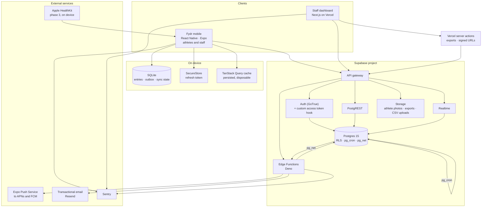
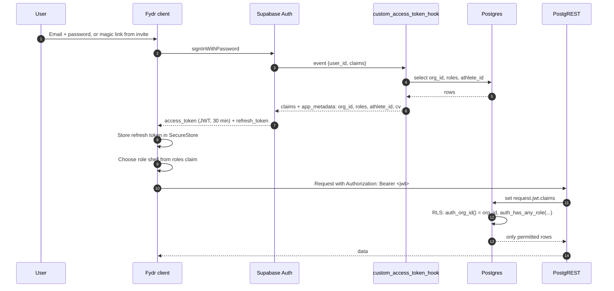
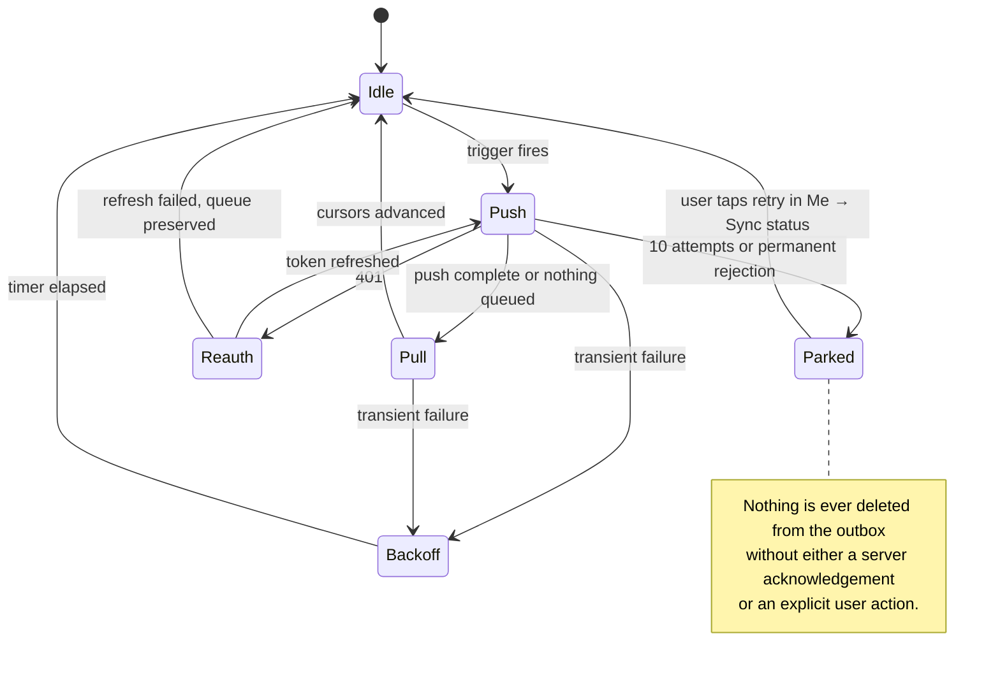
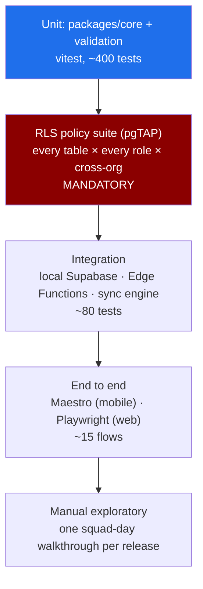
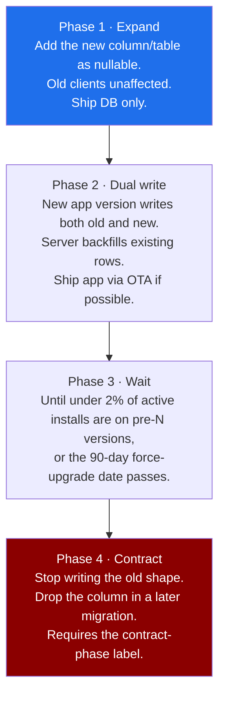

# 05 · Architecture

How Fydr is built, deployed, and operated. This document is normative for infrastructure,
authentication, sync, jobs, and release process. Where it conflicts with an ADR in
`docs/decisions/`, the ADR holds the reasoning and this document holds the implementation.

Two constraints shape every decision below and are worth stating before the diagrams:

1. **Fydr is built and operated by one developer.** Anything that multiplies operational
   work by the number of customers is a structural problem, not a preference.
2. **The athlete write path must work with no network.** That is not a nice-to-have, it is
   the mechanism by which compliance survives contact with a training ground.

---

## 1. System topology



### What talks to what, and why

| Path | Transport | Reason it exists |
|---|---|---|
| Mobile → PostgREST | HTTPS, user JWT | Ordinary reads and simple writes. RLS is the authorisation boundary. |
| Mobile → Edge Function `sync-push` | HTTPS, user JWT | Batched offline queue drain. One round trip instead of N on bad signal. |
| Mobile → SQLite | Local | Every athlete write lands here first. Source of truth until acknowledged. |
| Web → PostgREST | HTTPS, user JWT | Dashboard reads. Same policies as mobile, no separate API surface. |
| Web → Vercel server action | HTTPS, session cookie | Only where a secret is needed: export generation, signed Storage URLs. |
| Postgres → Edge Function | `pg_net` + shared secret header | Flag evaluation on insert, notification dispatch, anything needing outbound HTTP. |
| Edge Function → Expo Push | HTTPS | Push delivery. See `08-notifications.md`. |
| Realtime → clients | WebSocket | Flags and availability only. See §8. |

### What is deliberately absent

- **No separate API server.** PostgREST plus Edge Functions is the API. Adding a Node
  service would mean a second authorisation implementation, which is the exact failure mode
  `01-roles-and-permissions.md` §6 exists to prevent.
- **No GraphQL.** The query shapes are known and small in number. A key factory over
  PostgREST is less machinery for the same result.
- **No message broker.** `pg_cron` and `pg_net` cover scheduling and fan-out at this scale.
  Revisit if a single organisation exceeds roughly 200 athletes or GPS imports become
  continuous rather than weekly.
- **No Redis.** TanStack Query on the client and materialised views in Postgres cover the
  caching need. See §9.

---

## 2. Monorepo structure

pnpm workspaces, TypeScript project references, Turborepo for task caching.

```
fydr/
├── pnpm-workspace.yaml
├── turbo.json
├── tsconfig.base.json
├── .env.example
├── apps/
│   ├── mobile/                     # Expo. ONE binary, TWO shells: athlete and staff
│   │   ├── app/                    # expo-router file routes
│   │   │   ├── (athlete)/          # athlete tab shell: today, my-data, programme, me
│   │   │   ├── (staff)/            # staff tab shell: dashboard, schedule, squad, programmes, more
│   │   │   ├── (auth)/             # sign-in, invite acceptance, optional-extras opt-ins
│   │   │   └── _layout.tsx         # role shell resolution, see §5
│   │   ├── src/
│   │   │   ├── db/                 # SQLite: schema, migrations, DAO
│   │   │   ├── sync/               # outbox, sync engine, conflict rules
│   │   │   ├── features/           # one folder per screen in 02-information-architecture §5
│   │   │   │                       #   athlete/ and staff/ subtrees, shared components below
│   │   │   ├── components/
│   │   │   └── lib/                # supabase client, sentry, notifications
│   │   ├── app.config.ts
│   │   └── eas.json
│   └── web/                        # Next.js App Router, staff only
│       ├── app/
│       │   ├── (dashboard)/
│       │   └── api/
│       └── src/
├── packages/
│   ├── core/                       # pure domain logic, zero I/O
│   │   ├── readiness.ts            # readiness_score composite
│   │   ├── load.ts                 # session load, ACWR, rolling windows
│   │   ├── md-offset.ts            # MD-n labelling from fixtures
│   │   ├── programme.ts            # override resolution, see ADR-006
│   │   ├── compliance.ts           # expectation matching
│   │   └── thresholds.ts           # threshold evaluation, shared with Edge Functions
│   ├── validation/                 # Zod schemas, single definition of every payload
│   │   ├── entries.ts
│   │   ├── programmes.ts
│   │   ├── sync.ts                 # sync-push request and response contracts
│   │   └── index.ts
│   ├── types/                      # generated DB types + hand-written domain types
│   │   ├── database.generated.ts   # supabase gen types typescript
│   │   └── domain.ts
│   ├── queries/                    # TanStack Query hooks + key factory
│   │   ├── keys.ts
│   │   ├── wellness.ts
│   │   ├── flags.ts
│   │   └── ...
│   ├── design-tokens/              # colour, spacing, type scale. See 06-design-system.md
│   └── config/                     # eslint, tsconfig, prettier presets
└── supabase/
    ├── config.toml
    ├── migrations/                 # timestamped SQL, never rewritten
    ├── functions/                  # Deno Edge Functions
    │   ├── _shared/                # cors, auth guard, sentry, service client
    │   ├── sync-push/
    │   ├── evaluate-thresholds/
    │   ├── dispatch-notifications/
    │   ├── generate-expectations/
    │   ├── import-gps-csv/
    │   ├── run-export/
    │   └── admin-set-role/
    ├── tests/
    │   ├── rls/                    # pgTAP, mandatory suite
    │   └── functions/
    └── seed.sql
```

### Package dependency rules

Enforced by `eslint-plugin-boundaries` and by CI, not by convention.

| Package | May depend on | May never depend on |
|---|---|---|
| `core` | nothing outside itself | React, Supabase, fetch, Date-of-now |
| `validation` | `zod`, `core` types | React, Supabase |
| `types` | nothing | anything |
| `queries` | `types`, `validation`, `core`, `@tanstack/react-query`, `@supabase/supabase-js` | React Native, Next.js |
| `design-tokens` | nothing | anything |
| `apps/*` | any package | another app |
| `supabase/functions` | `core`, `validation`, `types` via a Deno-compatible import | `queries`, any app |

**One binary carries both shells, and this is a structural commitment, not a packaging
convenience.** The staff phone app is roadmap Phase 2m, 10 weeks, built after staff web
(`02-information-architecture.md` §4.6, `10-roadmap.md` §2, ADR-002). Three consequences fall
out of it and are specified where they land:

- The shell is resolved server-side from roles on every token issue, never from a client
  toggle or a build flavour (§5).
- A push token is registered per shell, not per user, so a staff notification cannot arrive on
  a device sitting in the athlete shell (`08-notifications.md` §8.2).
- Every release ships both shells to both audiences at once (§14). There is no staff-only
  release train.

**Two shells is not two apps.** Splitting into `apps/mobile-athlete` and `apps/mobile-staff`
was considered and rejected: it doubles the store submissions, the EAS configuration, the
Sentry projects and the release process, in order to avoid shipping code a user cannot reach.
The dead code costs bundle size, which §11 budgets, and the split costs operational work every
week, which is the constraint at the top of this document. A user holding both roles would
also need two installed apps, which is absurd for a player-coach.

**`core` must be pure.** No clock reads, no random, no network. Every function takes `now`
as an argument. This is what makes threshold evaluation testable and lets the same code run
in the app, in an Edge Function, and in a backfill script without three implementations
drifting.

**Edge Functions import shared packages, they do not copy them.** Deno resolves the
workspace via `deno.json` import maps pointing at the built `dist` of `core` and
`validation`. If a threshold rule exists twice, one of them is wrong and nobody will notice
for months.

---

## 3. Environments and deployment topology

Three environments. No fourth. A per-developer cloud environment is not worth the cost when
the local stack runs the whole system.

| | Local | Staging | Production |
|---|---|---|---|
| Postgres / Auth / Storage | `supabase start`, Docker | Supabase project `fydr-staging` | Supabase project `fydr-prod` |
| Region | localhost | eu-west-2 (London) | eu-west-2 (London) |
| Mobile | Expo dev client, Metro | EAS `preview` channel, internal distribution | EAS `production` channel, App Store / Play |
| Web | `next dev` | Vercel preview deployment per PR | Vercel production, `app.fydr.io` |
| Migrations applied by | `supabase db reset` | CI on merge to `main` | CI on tag, with manual approval |
| Data | `seed.sql`, synthetic squad of 40 | Synthetic squads. **Never production data.** | Real |
| Point-in-time recovery | none | 1 day | 7 days minimum, plus nightly logical dump to object storage |
| Sentry environment | `local` (disabled) | `staging` | `production` |
| Log retention | n/a | 7 days | 90 days |

**Staging never receives a copy of production data.** Restoring a club's squad into an
environment with looser access is the cheapest possible way to cause a reportable breach.
Where a production bug needs realistic data, reproduce it with a generated squad of the same
shape, and if that fails, use a time-limited support grant against production per
`01-roles-and-permissions.md` §7.

### Environment variables

Every variable lives in `.env.example` with a comment. Nothing else is acceptable.

| Variable | Where | Notes |
|---|---|---|
| `EXPO_PUBLIC_SUPABASE_URL` | mobile | Public. Baked into the binary, so a change requires a store build unless read from a config endpoint. |
| `EXPO_PUBLIC_SUPABASE_ANON_KEY` | mobile | Public by design. Safe only because RLS is correct. |
| `EXPO_PUBLIC_ENV` | mobile | `local` \| `staging` \| `production` |
| `EXPO_PUBLIC_SENTRY_DSN` | mobile | Public |
| `NEXT_PUBLIC_SUPABASE_URL` | web | Public |
| `NEXT_PUBLIC_SUPABASE_ANON_KEY` | web | Public |
| `SUPABASE_SERVICE_ROLE_KEY` | web server, CI | **Bypasses RLS.** Server-side only. Never in a client bundle, never in an `EXPO_PUBLIC_` or `NEXT_PUBLIC_` name. |
| `SUPABASE_DB_URL` | CI | Migration application |
| `EDGE_SHARED_SECRET` | Postgres, Edge Functions | Header checked by functions invoked from `pg_net`, so an unauthenticated caller cannot trigger a job |
| `EXPO_ACCESS_TOKEN` | Edge Functions, CI | Push delivery and EAS |
| `RESEND_API_KEY` | Edge Functions | Transactional email |
| `SENTRY_AUTH_TOKEN` | CI | Source map upload |

**Because `EXPO_PUBLIC_SUPABASE_URL` is compiled into the binary**, pointing an installed app
at a different backend is not possible without a store release. That is acceptable because
ADR-001 is settled: one pooled database, one project per environment, and no pre-login lookup
step to decide which backend a user belongs to. Nothing in the client branches on tenancy
model, and nothing should be built that does.

---

## 4. Deployment pipeline

```mermaid
graph LR
    PR["Pull request"] --> CI["CI: lint · typecheck · unit · RLS suite"]
    CI --> PREV["Vercel preview<br/>+ EAS preview build if mobile changed"]
    PREV --> RV["Review"]
    RV --> M["Merge to main"]
    M --> STG["Deploy staging:<br/>migrations · functions · web · EAS preview channel"]
    STG --> SMOKE["Smoke tests against staging"]
    SMOKE --> TAG["Tag release"]
    TAG --> APPR{"Manual approval"}
    APPR --> PRODDB["Apply migrations to production"]
    PRODDB --> PRODFN["Deploy Edge Functions"]
    PRODFN --> PRODWEB["Promote Vercel build"]
    PRODWEB --> MOB{"Mobile change type"}
    MOB -->|JS only| OTA["EAS Update to production channel"]
    MOB -->|Native or config| BUILD["EAS Build then store submission"]

    style APPR fill:#b8860b,color:#fff
    style PRODDB fill:#8b0000,color:#fff
```



**Order is fixed: database, then functions, then web, then mobile.** Every deployment step
must leave the previous client version working, which is what §14 is about.

---

## 5. Authentication and authorisation

### The claim model

Authorisation reads three facts from the JWT and nothing else: `org_id`, `roles`,
`athlete_id`. They are placed there by a Supabase custom access token hook so that RLS
policies never query `user_roles`, which would recurse and destroy query planning
(`04-data-model.md` §14).



### The hook

```sql
-- Runs inside Supabase Auth on every access token issue.
create or replace function auth_hooks.custom_access_token_hook(event jsonb)
returns jsonb
language plpgsql
stable
security definer
set search_path = public, auth_hooks
as $$
declare
  v_claims     jsonb := coalesce(event->'claims', '{}'::jsonb);
  v_user_id    uuid  := (event->>'user_id')::uuid;
  v_org_id     uuid;
  v_roles      text[];
  v_athlete_id uuid;
  v_cv         int;
  v_status     public.user_status;
begin
  select u.org_id, u.status, u.claims_version
    into v_org_id, v_status, v_cv
  from public.users u
  where u.id = v_user_id
    and u.deleted_at is null;

  -- Unknown or deactivated user: issue a token with no authority at all.
  if v_org_id is null or v_status in ('suspended', 'deactivated') then
    return jsonb_set(event, '{claims,app_metadata}',
      jsonb_build_object('org_id', null, 'roles', '[]'::jsonb, 'athlete_id', null, 'cv', 0));
  end if;

  select coalesce(array_agg(ur.role::text order by ur.role), '{}')
    into v_roles
  from public.user_roles ur
  where ur.user_id = v_user_id;

  select a.id into v_athlete_id
  from public.athletes a
  where a.user_id = v_user_id and a.deleted_at is null;

  v_claims := jsonb_set(v_claims, '{app_metadata}', jsonb_build_object(
    'org_id',     v_org_id,
    'roles',      to_jsonb(v_roles),
    'athlete_id', v_athlete_id,
    'cv',         coalesce(v_cv, 1)
  ), true);

  return jsonb_set(event, '{claims}', v_claims);
end;
$$;

grant usage on schema auth_hooks to supabase_auth_admin;
grant execute on function auth_hooks.custom_access_token_hook to supabase_auth_admin;
revoke execute on function auth_hooks.custom_access_token_hook from authenticated, anon, public;
grant select on public.users, public.user_roles, public.athletes to supabase_auth_admin;
```

The helper functions declared in `04-data-model.md` §14 read only from the claim:

```sql
create or replace function public.auth_org_id() returns uuid
language sql stable as $$
  select nullif(current_setting('request.jwt.claims', true)::jsonb
           #>> '{app_metadata,org_id}', '')::uuid
$$;

create or replace function public.auth_athlete_id() returns uuid
language sql stable as $$
  select nullif(current_setting('request.jwt.claims', true)::jsonb
           #>> '{app_metadata,athlete_id}', '')::uuid
$$;

create or replace function public.auth_roles() returns public.app_role[]
language sql stable as $$
  select coalesce(
    array(select jsonb_array_elements_text(
      current_setting('request.jwt.claims', true)::jsonb #> '{app_metadata,roles}'
    )::public.app_role),
    '{}'::public.app_role[])
$$;

create or replace function public.auth_has_any_role(p public.app_role[]) returns boolean
language sql stable as $$ select public.auth_roles() && p $$;
```

### Claim staleness, and how it is handled

A JWT is a snapshot. If an admin revokes a coach role, that user keeps coach access until
their token expires. This is the standard cost of claim-based authorisation and it must be
handled explicitly rather than hoped away.

| Control | Setting | Effect |
|---|---|---|
| Access token TTL | 30 minutes | Worst-case window of stale authority |
| `users.claims_version` | integer, bumped by trigger on `user_roles` change | Detectable staleness |
| Forced refresh | Realtime broadcast on `user:{user_id}` topic when `claims_version` bumps; client calls `supabase.auth.refreshSession()` | Typical propagation under 5 seconds when online |
| Hard revocation | `admin-set-role` Edge Function calls the Auth admin API to sign the user out of all sessions when a role is **removed** or the user is suspended | Immediate, at the cost of forcing a re-login |
| Server-side backstop | `claims_version` in the JWT compared against `users.claims_version` inside `auth_has_any_role` for destructive operations only | Prevents a stale token performing a role change or an export |

**Role removal forces sign-out. Role addition does not.** Adding a role with a stale token
means the user briefly lacks an ability, which is an annoyance. Keeping a removed role means
someone reads data they should not, which is an incident.

### Role shell resolution

```ts
// apps/mobile/src/lib/session.ts
import { z } from 'zod';

export const AppMetadata = z.object({
  org_id: z.string().uuid().nullable(),
  roles: z.array(z.enum(['athlete', 'coach', 'medical', 'admin'])),
  athlete_id: z.string().uuid().nullable(),
  cv: z.number().int(),
});
export type AppMetadata = z.infer<typeof AppMetadata>;

/**
 * Which navigation shell the user sees. A user holding both athlete and staff
 * roles gets the staff shell with a switcher; see 02-information-architecture.md §3.
 * This is presentation only. It grants nothing.
 */
export function resolveShell(meta: AppMetadata): 'athlete' | 'staff' | 'blocked' {
  if (!meta.org_id || meta.roles.length === 0) return 'blocked';
  const isStaff = meta.roles.some((r) => r === 'coach' || r === 'medical' || r === 'admin');
  return isStaff ? 'staff' : 'athlete';
}
```

**Never gate data on `resolveShell`.** It decides which tab bar renders. Every byte of data
is gated by RLS, and the RLS test suite in §12 is what proves it.

**A user holding both athlete and staff roles gets the staff shell with a switcher.** The
switcher changes the rendered navigator and nothing else. It does not re-issue a token, it does
not change the claims, and a coach who is also a player sees their own entries in the athlete
shell through exactly the same policies that would apply if they had no staff role at all.

**The resolved shell is registered alongside the push token**, not inferred at delivery time.
`push_tokens.shell` records which shell the device was last signed into, so the dispatcher can
address `staff.*` notifications to devices that can actually open the route
(`08-notifications.md` §7 resolution rule 4, §8.2). Two consequences worth stating: a device
that switches shell re-registers rather than mutating in place, so a stale row can never route
a flag to a phone showing the athlete tab bar; and the shell on the token is a routing hint,
never an authorisation input. The audience resolver still selects recipients from roles held
server-side.

### Service role rules

`service_role` bypasses RLS entirely. Three rules, no exceptions:

1. Edge Functions invoked by a user create their client with the caller's JWT
   (`Authorization` header forwarded), not the service key.
2. Only scheduled jobs and admin functions use `service_role`, and each one filters `org_id`
   explicitly in every statement.
3. Any function using `service_role` carries a comment naming the check it is performing in
   place of RLS. A reviewer must be able to find the authorisation logic in five seconds.

```ts
// supabase/functions/_shared/clients.ts
export function callerClient(req: Request) {
  const auth = req.headers.get('Authorization');
  if (!auth) throw new HttpError(401, 'missing_authorization');
  return createClient(env.SUPABASE_URL, env.SUPABASE_ANON_KEY, {
    global: { headers: { Authorization: auth } },
    auth: { persistSession: false },
  });
}

/** RLS is bypassed. Every query made with this client must filter org_id itself. */
export function serviceClient() {
  return createClient(env.SUPABASE_URL, env.SUPABASE_SERVICE_ROLE_KEY, {
    auth: { persistSession: false },
  });
}
```

---

## 6. Offline sync engine

This is the most intricate subsystem in Fydr and the one most likely to produce data loss if
built casually. ADR-004 records why it exists and what it costs.

### Scope boundary

| Surface | Shell | Offline behaviour |
|---|---|---|
| Athlete entry submission (wellness, RPE, gym sets, the weekly nutrition check-in) | Athlete | **Full offline write.** Never blocks, never errors. |
| Athlete read: today's schedule, outstanding entries, current programme, own recent history | Athlete | **Full offline read** from SQLite, refreshed when online. |
| Athlete read: leaderboards, long history, test trends | Athlete | Online only. Shows a cached snapshot with an age label if stale. |
| Staff: attendance marking, availability read, flag acknowledgement | Staff | Offline read; **queued write for attendance only**. |
| Staff: programme editing, threshold editing, schedule editing | Staff | Online only. Editing a shared plan offline creates conflicts nobody can adjudicate. |
| Staff web dashboard | n/a | Online only. |
| Analytics, reports, exports | Both | Online only. |

**The sync engine is not athlete-only, and the boundary is about authorship rather than about
which shell you are in.** The staff shell ships in the same binary and uses the same SQLite
database, the same outbox, and the same push contract. What it does not get is offline
authoring of shared documents. Two coaches editing the same programme offline produces a merge
problem with no correct answer; an athlete entry and an attendance mark each have exactly one
author, which is why both queue safely.

**Staff writes stay online except attendance.** Attendance is queued because it is taken
pitchside, which is precisely where the signal is worst. Whether that is enough for coaches is
O-14, and it is a question to answer before Phase 2m starts, not during it.

**The nutrition check-in is the only nutrition write in the outbox.** It is one row per athlete
per ISO week, one question, three answers (`screens/nutrition-checkin.md`). `nutrition_entries`
is dormant per `CLAUDE.md` §2 rule 8, so there is no daily nutrition entry to queue, no
per-meal payload, and no photograph upload path in the sync engine.

### Local schema

`expo-sqlite` (async API), plain SQL, hand-written migrations. No ORM: the schema is small
and an ORM's migration story on a device the developer cannot inspect is a liability.

```sql
-- apps/mobile/src/db/migrations/001_init.sql

-- Mirror tables. Column names match Postgres exactly so payloads need no mapping.
create table wellness_entries (
  id              text primary key,      -- client-generated UUID v4
  org_id          text not null,
  athlete_id      text not null,
  entry_date      text not null,         -- ISO date, device-local day
  sleep_hours     real,
  sleep_quality   integer,
  fatigue         integer,
  soreness        integer,
  soreness_areas  text,                  -- JSON array
  stress          integer,
  mood            integer,
  resting_hr      integer,
  body_mass_kg    real,
  comment         text,
  readiness_score real,
  source          text not null default 'self_report',
  submitted_at    text not null,         -- device clock at submit
  revision_of     text,
  superseded_by   text,
  sync_status     text not null default 'pending',  -- pending|syncing|synced|parked
  server_version  text                                -- server submitted_at once acknowledged
);
create index wellness_entries_date on wellness_entries (athlete_id, entry_date desc);
create index wellness_entries_pending on wellness_entries (sync_status) where sync_status != 'synced';

-- Same shape for nutrition_checkins, training_entries, gym_session_logs, gym_set_logs.
-- nutrition_checkins is one row per athlete per ISO week: week_start, answer, submitted_at.
-- There is no local nutrition_entries table. Athletes do not log meals.

-- Read-only cache of server-owned data needed offline.
create table cached_sessions            (id text primary key, org_id text, payload text, fetched_at text);
create table cached_expectations        (id text primary key, athlete_id text, expectation_date text, domain text, payload text);
create table cached_programme           (id text primary key, athlete_id text, payload text, fetched_at text);
create table cached_availability        (athlete_id text primary key, payload text, fetched_at text);

-- The outbox. One row per operation, not per entity.
create table outbox (
  seq             integer primary key autoincrement,  -- FIFO order, device-local
  op_id           text not null unique,               -- client UUID, the idempotency key
  entity          text not null,                      -- 'wellness_entry' | 'gym_set_log' | ...
  entity_id       text not null,                      -- the row's client UUID
  operation       text not null,                      -- 'insert' | 'revise'
  depends_on      text,                               -- op_id that must succeed first
  payload         text not null,                      -- JSON, validated by a Zod schema before enqueue
  created_at      text not null,
  attempts        integer not null default 0,
  next_attempt_at text not null,
  last_error      text,
  status          text not null default 'queued'      -- queued|inflight|done|parked
);
create index outbox_ready on outbox (status, next_attempt_at);

create table sync_state (
  resource      text primary key,        -- 'sessions','expectations','programme','availability'
  cursor        text,                    -- server updated_at high-water mark
  last_pull_at  text,
  last_push_at  text
);
```

**There is no `update` and no `delete` operation.** The outbox carries `insert` and `revise`
only, because entries are immutable (ADR-005). A `revise` is an insert of a new row carrying
`revision_of`. This removes the entire class of update-ordering conflicts.

### The sync cycle



Triggers for a sync attempt:

| Trigger | Condition |
|---|---|
| Immediately after a local write | Always, fire and forget |
| Connectivity regained | `expo-network` state change to connected |
| App foregrounded | Always |
| Periodic while foregrounded | Every 5 minutes |
| Background fetch | `expo-background-task`, minimum interval 15 minutes, best effort on iOS |
| Manual | Pull to refresh, and a retry button on the sync status screen |

### Push contract

One Edge Function, one round trip, per-item results. The batch is not a transaction: a poison
item must not block the twelve good items behind it.

```ts
// packages/validation/sync.ts
import { z } from 'zod';

export const SyncOp = z.object({
  op_id: z.string().uuid(),
  entity: z.enum(['wellness_entry', 'nutrition_checkin', 'training_entry',
                  'gym_session_log', 'gym_set_log', 'session_attendance']),
  entity_id: z.string().uuid(),
  operation: z.enum(['insert', 'revise']),
  client_submitted_at: z.string().datetime(),
  payload: z.record(z.unknown()),        // narrowed per entity by the server
});

export const SyncPushRequest = z.object({
  device_id: z.string().uuid(),
  app_version: z.string(),
  client_now: z.string().datetime(),     // for clock-skew detection
  ops: z.array(SyncOp).max(200),
});

export const SyncOpResult = z.object({
  op_id: z.string().uuid(),
  status: z.enum(['applied', 'duplicate', 'superseded', 'rejected', 'retry']),
  server_id: z.string().uuid().optional(),
  server_submitted_at: z.string().datetime().optional(),
  error_code: z.string().optional(),     // stable machine code, see table below
  message: z.string().optional(),        // never shown raw to an athlete
});

export const SyncPushResponse = z.object({
  results: z.array(SyncOpResult),
  server_now: z.string().datetime(),
  min_supported_build: z.number().int(), // piggybacked version gate, see §14
});
```

Server handling, per operation:

```ts
// supabase/functions/sync-push/index.ts (core of it)
for (const op of body.ops) {
  try {
    const schema = entitySchemas[op.entity];              // Zod, from packages/validation
    const parsed = schema.parse(op.payload);

    // Authorisation: the caller's JWT client. RLS rejects anything not theirs.
    // We do NOT trust athlete_id or org_id from the payload; both are overwritten.
    const row = {
      ...parsed,
      id: op.entity_id,
      org_id: claims.org_id,
      athlete_id: op.entity === 'session_attendance' ? parsed.athlete_id : claims.athlete_id,
      source: 'self_report' as const,
      submitted_at: new Date().toISOString(),
      client_submitted_at: op.client_submitted_at,
    };

    const { error } = await caller
      .from(tableFor(op.entity))
      .insert(row);

    if (!error) { results.push({ op_id: op.op_id, status: 'applied', server_id: row.id }); continue; }
    if (error.code === '23505') {                          // unique_violation on primary key
      results.push({ op_id: op.op_id, status: 'duplicate', server_id: row.id }); continue;
    }
    if (isPermanent(error)) {
      results.push({ op_id: op.op_id, status: 'rejected', error_code: mapError(error) }); continue;
    }
    results.push({ op_id: op.op_id, status: 'retry', error_code: mapError(error) });
  } catch (e) {
    results.push({ op_id: op.op_id, status: 'rejected', error_code: 'validation_failed' });
  }
}
```

**Idempotency comes from the primary key, not from a separate ledger.** The client generates
the UUID, the server inserts with it, and a replay produces `23505` which the client treats
as success. This is the single most important property of the design: a crash mid-push, a
timeout after the server committed, or a duplicated background task can never create two
entries.

### Conflict resolution rules

| Situation | Rule | Rationale |
|---|---|---|
| Same `id` already on server | `duplicate` → client marks synced | Replay, not a conflict |
| Same `(athlete_id, entry_date)`, different `id`, athlete is the author of both | Later `client_submitted_at` becomes a revision of the earlier: server sets `revision_of` and `superseded_by` | Athlete edited offline on two devices. Both are their own truth; the later one is what they meant. Nothing is lost. |
| Athlete entry vs a staff-entered entry for the same day | Athlete self-report wins for subjective fields, staff entry retained as a superseded revision with `source = 'staff_entered'` | Matches the provenance rules in `03-flows.md` §7 |
| Device metric vs self-report for the same objective metric | Device wins for display and analytics, both retained | `03-flows.md` §7 rule 1 |
| Gym set log whose `programme_exercise_id` no longer exists | Accept, null the reference, set `orphaned_from` to the original UUID, warn the coach | An athlete who trained on Tuesday did the work whether or not the coach deleted the plan on Wednesday |
| Entry for a session that was cancelled while offline | Accept. Compliance expectation is waived, not the entry deleted | Deleting an athlete's work because a plan changed teaches them not to bother |
| Two `nutrition_checkin` rows for the same `(athlete_id, week_start)` from two devices | The later `client_submitted_at` becomes a revision of the earlier, same rule as an entry date | One live row per week is a unique index in `04-data-model.md` §17.15. The second answer is the athlete's latest view of the same week, not a second week |
| `entry_date` in the future relative to server date + 1 day | `rejected` with `error_code: 'date_out_of_range'` | Device clock is wrong; asking the athlete beats storing nonsense |
| `entry_date` more than 14 days in the past | `rejected` with `error_code: 'date_too_old'`, surfaced as "this entry is too old to submit" | Beyond this, backdating corrupts trend analysis silently |
| Server-owned data changed while client offline (schedule, programme, availability) | **Server always wins.** The pull phase overwrites the local cache without merge | The client has no authority over these rows and never edits them |
| 401 during push | Refresh token, retry once, then park the batch and preserve it | A re-login must never lose queued entries |

**Clock skew** is measured on every push: `server_now - client_now`. If the absolute skew
exceeds 10 minutes the client records it in Sentry as a breadcrumb and switches to displaying
server-derived dates. `entry_date` still comes from the device, because only the athlete knows
which day they meant, but the guards above bound the damage.

### Backoff

```ts
const BASE_MS = 5_000;
const MAX_MS = 300_000;      // 5 minutes
const MAX_ATTEMPTS = 10;

export function nextAttemptDelay(attempts: number, rand: () => number): number {
  const exp = Math.min(BASE_MS * 2 ** attempts, MAX_MS);
  const jitter = 0.8 + rand() * 0.4;      // ±20%, so a squad returning to wifi together
  return Math.round(exp * jitter);        // does not arrive as one thundering herd
}
```

After `MAX_ATTEMPTS` the op is `parked`, not deleted. Parked ops appear on **Me → Sync
status** with a plain-language explanation and a retry button, and a Sentry event is raised
with the error code but never the entry values. A parked entry still shows in the athlete's
history marked as not submitted.

### What the athlete sees

Restating the rule from `03-flows.md` §3 because it is easy to lose during implementation:
the athlete never sees a network error. Submission is a local write plus an enqueue, the UI
confirms immediately, and the entry appears in history with a small pending indicator. The
only place sync failure is ever surfaced is the sync status screen, and only after parking.

### Local schema migrations

The device database has its own migration chain, independent of Postgres, in
`apps/mobile/src/db/migrations/`. Rules:

1. `user_version` pragma tracks the applied version. Migrations run on app start before any
   query, inside a transaction.
2. Migrations are additive: add columns, add tables. Never drop a column that a queued
   outbox payload might reference.
3. **The outbox is never cleared by a migration.** If a payload shape changes, the migration
   rewrites queued payloads into the new shape or leaves them alone and the server accepts
   both shapes for one release cycle.
4. If a migration throws, the app does not wipe and continue. It parks in a recovery screen
   that offers to export the outbox as a file and contact support. Silently discarding a
   week of an athlete's entries is worse than a broken screen.

---

## 7. Background jobs and scheduled functions

Scheduling is `pg_cron` inside Postgres. Jobs that need outbound HTTP call an Edge Function
through `pg_net` with the `EDGE_SHARED_SECRET` header. Jobs that are pure SQL stay in SQL,
because a job that cannot fail on a network is a job that cannot fail.

| Job | Schedule (UTC) | Implementation | What it does |
|---|---|---|---|
| `generate_compliance_expectations` | `5 * * * *` (hourly, :05) | SQL | For every organisation whose local time is 02:00, generate tomorrow's `compliance_expectations` from `sessions` and the applied week template. Idempotent via the unique key. |
| `refresh_analytics_views` | `20 * * * *` (hourly, :20) | SQL | For organisations at local 03:00, `refresh materialized view concurrently` for `mv_daily_athlete_summary`, `mv_acute_chronic_load`, `mv_wellness_baselines`, `mv_compliance_rates`, `mv_squad_daily`. |
| `refresh_views_after_import` | on demand | Edge Function → SQL | Called at the end of `import-gps-csv`. Same refresh, scoped to the affected organisation. |
| `escalate_flags` | `*/15 * * * *` | SQL + `pg_net` | Flags in `notified` for more than 24 hours move to `escalated` and notify the next role per `08-notifications.md`. |
| `dispatch_notifications` | `*/5 * * * *` | Edge Function | Drains `notification_queue` for rows whose `send_at` has passed. Handles the 07:00 wellness push in each organisation's timezone and RPE prompts 30 minutes after session end. |
| `close_stale_gym_logs` | `0 4 * * *` | SQL | `gym_session_logs` left `in_progress` for over 24 hours become `abandoned`. Sets do not move. |
| `recompute_md_offsets` | `10 4 * * *` plus trigger on `fixtures` | SQL | Recomputes `md_offset` for **future** sessions only. Past sessions keep the label they were executed under (`04-data-model.md` §4). |
| `evaluate_daily_thresholds` | `30 4 * * *` | Edge Function | Thresholds that need a window rather than a single value: consecutive-day breaches, ACWR, compliance-rate rules. Per-entry thresholds fire on insert instead, see below. |
| `retention_review` | `30 4 * * 0` (Sundays) | SQL | Lists athlete records past the organisation's retention period into `retention_candidates`. **Never deletes.** Deletion is an explicit audited admin action. |
| `archive_audit_log` | `0 5 1 * *` (monthly) | Edge Function | Moves `audit_log` rows older than 13 months to compressed object storage, then deletes the moved rows. Append-only within the retention window. |
| `sync_health_report` | `0 6 * * *` | Edge Function | Counts parked outbox reports received in the last 24 hours per app version. Alerts if above threshold. |
| `expire_support_grants` | `*/10 * * * *` | SQL | Revokes `platform_support` grants past `expires_at`. |

### Per-entry threshold evaluation is not a cron job

`03-flows.md` §1 requires a flag from a 07:15 submission to be visible at 08:00. That is a
trigger, not a batch:

```sql
create or replace function public.on_entry_inserted()
returns trigger
language plpgsql
security definer
as $$
begin
  perform net.http_post(
    url     := current_setting('app.edge_base_url') || '/evaluate-thresholds',
    headers := jsonb_build_object(
                 'Content-Type', 'application/json',
                 'x-edge-secret', current_setting('app.edge_shared_secret')),
    body    := jsonb_build_object(
                 'entity',     tg_argv[0],
                 'entry_id',   new.id,
                 'org_id',     new.org_id,
                 'athlete_id', new.athlete_id,
                 'entry_date', new.entry_date),
    timeout_milliseconds := 3000
  );
  return new;
end;
$$;

create trigger wellness_entries_evaluate
  after insert on public.wellness_entries
  for each row execute function public.on_entry_inserted('wellness_entry');
```

`pg_net` is asynchronous, so the insert does not wait on the HTTP call and an athlete's
submission is never slowed or failed by the flag engine. The cost is that a dropped call
means a missed flag, which is why `evaluate_daily_thresholds` at 04:30 re-evaluates the
previous day as a sweep and is idempotent through a unique key on
`(athlete_id, threshold_id, flag_date)`.

### Job observability

Every job writes one row to `job_runs (job_name, started_at, finished_at, org_id, rows_affected, status, error)`.
A job that has not succeeded within twice its interval raises an alert (§10). A job with no
recorded runs is treated as failing, because a `pg_cron` schedule silently lost during a
database restore is a realistic failure and produces no error anywhere.

---

## 8. Realtime

Realtime is used sparingly. Every subscription is a persistent connection with an RLS check
behind it, and the failure mode of over-subscribing is a dashboard that gets slower as the
club grows.

| Surface | Realtime? | Mechanism | Reason |
|---|---|---|---|
| Staff, open flags (web and the staff shell) | Yes | Broadcast on `org:{org_id}:flags` | A flag arriving while a coach is looking at the board is the product working |
| Staff, availability changes (web and the staff shell) | Yes | Broadcast on `org:{org_id}:availability` | A physio changing availability during a session must reach the coach immediately |
| Athlete Today tab, session changes for today | Yes | Broadcast on `org:{org_id}:schedule`, filtered client-side to today | A coach cancelling a session must not leave 40 athletes travelling to it |
| Athlete forced token refresh | Yes | Broadcast on `user:{user_id}` | Role and status changes, see §5 |
| Squad status compliance counts | No | Poll via TanStack Query, `refetchInterval` 60s while focused | Changes constantly, nobody needs sub-minute accuracy |
| Entry streams, history, analytics | No | Query on demand | Nothing consumes them live |
| Gym logging | No | Local first | The athlete's own writes need no round trip |
| Leaderboards | No | Query, 5 minute `staleTime` | Live leaderboards create the wrong incentives and a lot of traffic |

**Broadcast from triggers, not `postgres_changes`.** `postgres_changes` evaluates RLS per
subscriber per change, which does not scale and leaks table structure into the client.
Instead a trigger emits a deliberately shaped, minimal payload:

```sql
create or replace function public.broadcast_flag()
returns trigger language plpgsql security definer as $$
begin
  perform realtime.send(
    jsonb_build_object(
      'flag_id',    new.id,
      'athlete_id', new.athlete_id,
      'domain',     new.domain,
      'severity',   new.severity,
      'flag_date',  new.flag_date),
    'flag_raised',
    'org:' || new.org_id::text || ':flags',
    true                                   -- private channel, authorised below
  );
  return new;
end;
$$;

create trigger flags_broadcast after insert on public.flags
  for each row execute function public.broadcast_flag();

-- Only staff of that organisation may subscribe.
create policy realtime_org_flags on realtime.messages for select
  to authenticated
  using (
    topic = 'org:' || public.auth_org_id()::text || ':flags'
    and public.auth_has_any_role(array['coach','medical']::public.app_role[])
  );
```

The payload carries no wellness values and no clinical fields. A realtime message is a signal
to invalidate a query, not a data channel. On receipt the client calls
`queryClient.invalidateQueries({ queryKey: qk.flags.list(orgId) })` and refetches through the
normal RLS-checked path.

**Connection budget**: one Realtime connection per client, multiplexing all channels.
Subscriptions are torn down when the app backgrounds and re-established on foreground, with
a query invalidation on reconnect to cover the gap.

---

## 9. Caching and TanStack Query conventions

### Two caches, different jobs

| Cache | Contains | Authoritative? | Survives reinstall? |
|---|---|---|---|
| SQLite | Athlete-authored entries and the outbox | **Yes**, until acknowledged by the server | No (documented loss, `03-flows.md` §10) |
| TanStack Query, persisted to AsyncStorage | Server-owned reads: squad lists, flags, schedule, analytics | No. Disposable at any moment. | No |

If code ever has to ask which cache is right, the answer is SQLite for anything an athlete
created and the server for everything else.

### Key factory

Keys are constructed only through the factory in `packages/queries/keys.ts`. A hand-written
array literal in a component is a review rejection, because it is how invalidation quietly
stops working.

```ts
// packages/queries/keys.ts
export const qk = {
  all: ['fydr'] as const,

  org: (orgId: string) => [...qk.all, 'org', orgId] as const,

  squad: {
    list: (orgId: string, groupIds: string[]) =>
      [...qk.org(orgId), 'squad', 'list', { groupIds: [...groupIds].sort() }] as const,
    athlete: (orgId: string, athleteId: string) =>
      [...qk.org(orgId), 'squad', 'athlete', athleteId] as const,
  },

  wellness: {
    all: (orgId: string) => [...qk.org(orgId), 'wellness'] as const,
    history: (orgId: string, athleteId: string, range: DateRange) =>
      [...qk.wellness.all(orgId), 'history', athleteId, range.from, range.to] as const,
    squadDay: (orgId: string, day: string, groupIds: string[]) =>
      [...qk.wellness.all(orgId), 'squad-day', day, { groupIds: [...groupIds].sort() }] as const,
  },

  flags: {
    all: (orgId: string) => [...qk.org(orgId), 'flags'] as const,
    list: (orgId: string, status: FlagStatus[], groupIds: string[]) =>
      [...qk.flags.all(orgId), 'list', { status: [...status].sort(), groupIds: [...groupIds].sort() }] as const,
    detail: (orgId: string, flagId: string) => [...qk.flags.all(orgId), 'detail', flagId] as const,
  },

  schedule: {
    all: (orgId: string) => [...qk.org(orgId), 'schedule'] as const,
    week: (orgId: string, isoWeek: string) => [...qk.schedule.all(orgId), 'week', isoWeek] as const,
    session: (orgId: string, sessionId: string) => [...qk.schedule.all(orgId), 'session', sessionId] as const,
  },

  programme: {
    all: (orgId: string) => [...qk.org(orgId), 'programme'] as const,
    resolvedForAthlete: (orgId: string, athleteId: string, on: string) =>
      [...qk.programme.all(orgId), 'resolved', athleteId, on] as const,
  },

  analytics: {
    all: (orgId: string) => [...qk.org(orgId), 'analytics'] as const,
    run: (orgId: string, definitionHash: string) => [...qk.analytics.all(orgId), 'run', definitionHash] as const,
  },
} as const;
```

Rules that make this work:

1. **`orgId` is the second segment of every key.** Sign-out clears the whole cache, but this
   also means a cache entry can never be read under a different organisation even if a clear
   is missed.
2. **Filter objects are sorted before being placed in a key.** `['a','b']` and `['b','a']`
   must produce one cache entry. The group filter is multi-select, so this is not theoretical.
3. **Date ranges go in the key as ISO strings**, never as `Date` objects, which do not
   structurally compare.
4. **Analytics keys use a stable hash of the view definition**, computed by
   `hashDefinition()` in `packages/core`, because the definition is an arbitrary JSON object.

### Freshness policy

| Data | `staleTime` | `gcTime` | Refetch on focus | Notes |
|---|---|---|---|---|
| Flags (open) | 0 | 10 min | Yes | Invalidated by realtime as well |
| Squad status | 60 s | 10 min | Yes | Polled at 60 s while the screen is focused |
| Schedule (this week) | 5 min | 24 h | Yes | Persisted; athletes need it offline |
| Athlete profile and groups | 10 min | 24 h | No | Changes rarely |
| Programme (resolved) | 15 min | 24 h | No | Invalidated by push on programme change |
| Own entry history | 0 (SQLite is the source) | n/a | n/a | Not a query cache concern |
| Analytics run | 15 min | 30 min | No | Expensive; the user re-runs deliberately |
| Leaderboards | 5 min | 30 min | No | |
| Exercise library | 24 h | 7 days | No | Effectively static |

Mutations use optimistic updates only for staff actions with a trivially reversible effect
(acknowledging a flag, toggling attendance). Athlete entry submission is not a mutation in the
TanStack sense at all: it is a local write plus an enqueue, and the UI reads back from SQLite.

### Server-side caching

- **Materialised views** carry the analytical load (`04-data-model.md` §12). Any dashboard
  query that scans raw entry tables for more than one athlete is a bug.
- **PostgREST response caching is not used.** Responses are per-user by construction and a
  shared cache in front of RLS is a breach waiting for a cache key mistake.
- **Next.js**: staff dashboard pages are dynamic. No ISR on anything containing club data.
  Static rendering is limited to marketing and legal pages.

---

## 10. Error handling and observability

### Error taxonomy

| Class | Example | Client behaviour | Reported? |
|---|---|---|---|
| Expected domain rejection | `date_too_old`, threshold already dismissed | Plain-language message, no retry | No |
| Transient network | Timeout, 5xx, DNS | Silent retry with backoff. Athlete sees nothing. | Only if it parks |
| Auth | 401, refresh failure | Silent refresh, then a re-login prompt that preserves the outbox | Aggregate counts only |
| Authorisation | 403 or an empty result where rows were expected | Generic "you do not have access". **Never** reveals whether the row exists. | Yes, as a warning: it usually means a UI bug |
| Programming error | Undefined property, failed invariant | Error boundary, screen-level fallback with a retry | Yes, with stack |
| Data integrity | Constraint violation the client should have prevented | Park the operation, keep the data | Yes, high priority |

### Logging

**Edge Functions** log one structured JSON line per invocation, and nothing else:

```ts
log.info({
  request_id: crypto.randomUUID(),
  fn: 'sync-push',
  org_id: claims.org_id,           // identifier only
  user_id: claims.sub,             // identifier only
  app_version: body.app_version,
  op_count: body.ops.length,
  applied: counts.applied,
  rejected: counts.rejected,
  duration_ms: Date.now() - t0,
});
```

**Never logged, anywhere, in any environment**: entry values, comment text, clinical fields,
athlete names, email addresses, tokens, photographs, file contents. Identifiers only. A log
line that lets you reconstruct an athlete's soreness score is health data sitting in a log
aggregator with different retention and different access control from the database.

**Postgres**: `log_min_duration_statement = 1000`. Anything above one second is captured and
reviewed weekly. Statement text may contain literals, so database logs are treated as
sensitive and stay inside the Supabase project.

### Sentry

Configured in all three runtimes: React Native (`@sentry/react-native`), Next.js
(`@sentry/nextjs`), Edge Functions (`@sentry/deno`). Release names match the app version and
the git SHA so a stack trace maps to a source map.

Scrubbing is allowlist-based, not denylist-based:

```ts
Sentry.init({
  dsn: process.env.EXPO_PUBLIC_SENTRY_DSN,
  environment: process.env.EXPO_PUBLIC_ENV,
  tracesSampleRate: process.env.EXPO_PUBLIC_ENV === 'production' ? 0.1 : 1.0,
  sendDefaultPii: false,
  beforeSend(event) {
    // Strip everything, then add back only what is safe.
    delete event.user;
    delete event.request;
    event.contexts = {
      app: event.contexts?.app,
      device: { model: event.contexts?.device?.model, family: event.contexts?.device?.family },
      os: event.contexts?.os,
    };
    event.tags = {
      ...pick(event.tags ?? {}, ['release', 'environment', 'shell', 'org_id']),
    };
    event.extra = pick(event.extra ?? {}, ALLOWED_EXTRA_KEYS); // ['error_code','entity','op_count'...]
    return event;
  },
  beforeBreadcrumb(b) {
    if (b.category === 'console') return null;       // console lines carry entry values
    if (b.category === 'xhr' || b.category === 'fetch') {
      delete (b.data as Record<string, unknown>)?.body;
      return b;
    }
    return b;
  },
});
```

Session Replay is off. It would record the wellness form.

### Alerting

The distinction that matters: what wakes a solo developer up, and what waits until morning.

| Condition | Severity | Channel |
|---|---|---|
| RLS test suite fails in CI | Block merge | CI status, blocking |
| Cross-organisation read detected in production (canary query, hourly) | Page | Phone, immediately |
| Auth hook failing (login success rate below 90% over 15 min) | Page | Phone |
| `sync-push` 5xx rate above 5% over 15 minutes | Page | Phone |
| Postgres connection saturation above 85% | Page | Phone |
| Any job in `job_runs` overdue by twice its interval | Warn | Email, hourly digest |
| Flag engine latency p95 above 30 s | Warn | Email |
| Parked outbox reports above 20 in 24 h, or concentrated on one app version | Warn | Email |
| Sentry: new issue affecting more than 5 users in an hour | Warn | Email |
| Storage above 80% of plan | Warn | Email |
| Individual athlete's entry rejected | None | Recorded only |

**A canary query runs hourly**: a synthetic user in organisation A attempts to read known
rows belonging to organisation B, through the ordinary client path, and asserts zero rows.
This is the same assertion as the CI suite, run against production, because a policy can be
correct at merge time and wrong after a migration.

---

## 11. Performance budgets

Budgets, not aspirations. A pull request that regresses one of these is not merged without an
explicit decision recorded in the PR.

| Path | Budget | Device / condition | Measured by |
|---|---|---|---|
| Cold start to Today tab interactive | 2.0 s p50, 3.5 s p95 | iPhone 11, Pixel 6a, no network | Sentry app-start transaction |
| Warm start to Today | 800 ms p95 | Same | Sentry |
| Wellness form open | 200 ms p95 | Same | Custom span |
| Submit tap to confirmation | 300 ms p95 | Offline | Custom span. It is a local write; anything slower is a rendering fault. |
| Full wellness entry, open to submitted | **Under 45 s median** | Real users | In-app timing, reported as a product metric (`00-product-overview.md`) |
| Screen transition | 250 ms p95 | Same | Custom span |
| Staff dashboard first meaningful paint, 40 athletes | 1.5 s p95 | Desktop broadband | Vercel Web Vitals |
| Cold start to staff shell dashboard, 40 athletes | 2.5 s p50, 4.0 s p95 | Same devices, poor signal | Sentry app-start transaction, filtered on the `shell` tag. Slower than the athlete budget because the first screen is a squad aggregate rather than one athlete's day, and it is still a budget |
| Squad status query (server time) | 150 ms p95 | Materialised-view backed | PostgREST timing header |
| Any single API query (server time) | 400 ms p95, 1 s hard ceiling | | Postgres slow log |
| Analytics run, 40 athletes × 28 days | 3 s p95 | | Custom span |
| Submission to flag row visible | 5 s p95, 30 s hard ceiling | | `flags.raised_at - entries.submitted_at` |
| Sync push, 20 queued ops | 2 s p95 | 4G | Edge Function duration |
| Nightly view refresh, whole fleet | Under 15 min | | `job_runs` |
| JS bundle, Android | Under 4 MB | | EAS build output |
| OTA update payload | Under 2 MB typical | | EAS Update |

**The 45-second figure is the only one that is a product requirement rather than an
engineering target.** Everything else exists to protect it.

Scale assumption behind these numbers: 60 organisations, 40 athletes each, roughly 2,400
athletes, producing on the order of 3,000 entry rows and 15,000 gym set rows per day across
the fleet. That is small. If any of these budgets is hard to meet at that volume, the cause
is a query shape, not capacity, and adding compute will hide it rather than fix it.

---

## 12. Testing strategy



| Layer | Tool | Scope | Runs |
|---|---|---|---|
| Unit | Vitest | `core` (readiness, ACWR, MD-n, override resolution, threshold evaluation, backoff), `validation` schemas | Every commit, under 20 s |
| Component | jest-expo + React Native Testing Library | Entry forms, the group filter, offline indicators | Every commit |
| **RLS policy** | **pgTAP against local Supabase** | **Every table, every role, every organisation boundary** | **Every commit, blocking** |
| Integration | Vitest + local Supabase | Sync push contract, idempotency, revision chains, flag trigger, expectation generation | Every commit |
| Contract | Vitest | `SyncPushRequest` / `SyncPushResponse` shapes shared between app and function | Every commit |
| E2E web | Playwright | Sign in, dashboard, flag acknowledgement, programme assignment, export | On merge to `main` |
| E2E mobile, athlete shell | Maestro | Onboarding, wellness entry, **offline entry then reconnect**, gym logging, weekly nutrition check-in | On merge to `main` |
| E2E mobile, staff shell | Maestro | Sign in as staff and land on the staff tab bar, pitchside attendance offline then reconnect, flag acknowledgement, **a `/staff/...` deep link opened by an athlete-only session lands on the athlete home rather than anywhere** | On merge to `main` |
| Load | k6 | Dashboard query at 60 concurrent coaches, sync push at 200 concurrent athletes | Before each production release |

### The mandatory RLS suite

`01-roles-and-permissions.md` §6 makes this the one suite that blocks merge. It is generated
from a table list rather than hand-written, so a new table cannot be forgotten.

```sql
-- supabase/tests/rls/010_cross_org_isolation.sql
begin;
select plan(4 * count(*)::int) from tenant_tables();

-- Fixtures: two organisations, four users each, created in 000_fixtures.sql
-- tenant_tables() returns every table carrying org_id.

do $$
declare
  t record;
  r text;
  n int;
begin
  for t in select table_name from tenant_tables() loop
    foreach r in array array['athlete','coach','medical','admin'] loop
      -- Authenticate as org A's user holding role r
      perform test_helpers.authenticate_as('org_a', r);
      execute format('select count(*) from public.%I where org_id = $1', t.table_name)
        into n using test_helpers.org_id('org_b');
      perform is(n, 0,
        format('%s: role %s in org A reads 0 rows from org B', t.table_name, r));
    end loop;
  end loop;
end $$;

select * from finish();
rollback;
```

A second file asserts the positive cases, because a policy that returns nothing to everyone
also passes an isolation test:

```sql
-- supabase/tests/rls/020_role_matrix.sql
-- Every cell of the permission matrix in 01-roles-and-permissions.md §2.
select is(count(*)::int, 1, 'athlete reads own wellness entry')
  from (select test_helpers.as_role('org_a','athlete_1'),
               (select count(*) from wellness_entries where athlete_id = test_helpers.athlete_id('athlete_1'))) s;

select is(count(*)::int, 0, 'athlete cannot read a teammate wellness entry') ...
select is(count(*)::int, 0, 'coach cannot read injury_clinical') ...
select is(count(*)::int, 1, 'medical can read injury_clinical') ...
select is(count(*)::int, 0, 'admin cannot read wellness_entries') ...
select throws_ok($$ update wellness_entries set fatigue = 1 $$, null,
                 'nobody can update a wellness entry');
```

Rules for this suite:

1. **A new table requires a new policy and new assertions in the same pull request.** CI fails
   if a table with `org_id` has no coverage. This check is a query against
   `information_schema`, not a convention.
2. **Assertions are written before the policy**, per `CLAUDE.md` §5.
3. The suite runs against a local Supabase instance with the same migrations as production.
4. Tests authenticate by setting `request.jwt.claims` exactly as PostgREST does, so a policy
   passing here passes in production.

### What is deliberately not tested

Chart rendering pixel output, styling, and copy. They break visibly and cost more to test
than to fix. Time is spent instead on the paths where failure is silent: authorisation,
sync, unit conversion, and MD-n labelling.

---

## 13. CI/CD

GitHub Actions. Four workflows.

| Workflow | Trigger | Steps |
|---|---|---|
| `ci.yml` | Every PR and push | Install (pnpm, frozen lockfile) → Turbo lint + typecheck → unit tests → start local Supabase → apply migrations → pgTAP RLS suite → integration tests → check migration is additive → check every `org_id` table has RLS coverage |
| `preview.yml` | PR touching `apps/mobile` | EAS build for internal distribution, comment the install link on the PR |
| `staging.yml` | Merge to `main` | Apply migrations to staging → deploy Edge Functions → Vercel deploy → `eas update --channel preview` → smoke tests |
| `release.yml` | Tag `v*` | Manual approval → apply migrations to production → deploy Edge Functions → promote Vercel → then either `eas update --channel production` or `eas build --profile production` + `eas submit` |

Guard steps worth naming explicitly:

```yaml
- name: Reject edits to applied migrations
  run: |
    # Any file under supabase/migrations that exists on main and differs is a hard failure.
    git diff --name-status origin/main...HEAD -- supabase/migrations \
      | awk '$1 != "A" { print "Modified applied migration: " $2; found=1 } END { exit found }'

- name: Reject destructive DDL without an approved label
  run: |
    if grep -riE '^\s*(drop (table|column)|alter table .* drop column|alter table .* rename)' \
         $(git diff --name-only origin/main...HEAD -- 'supabase/migrations/*.sql'); then
      echo "Destructive DDL present. Requires the 'contract-phase' PR label and §14 sign-off."
      exit 1
    fi

- name: Every tenant table has RLS coverage
  run: pnpm --filter @fydr/db test:rls-coverage
```

Migrations are applied to production before the client that needs them ships, never after.
The expand/contract discipline in §14 is what makes that safe.

---

## 14. Release and migration process

The hard part of shipping a mobile app is that **old clients keep running**. An athlete who
has not opened the App Store in four months is still submitting wellness entries against the
current database, and there is no way to force them to stop.

### Two release channels

| Change type | Mechanism | Reaches users |
|---|---|---|
| JS, styling, copy, screen logic, bug fixes, most feature work | `eas update` (OTA) | Next app launch, or the launch after if downloaded in the background |
| New native module, Expo SDK upgrade, permission string, app icon, splash, deep link scheme, anything in `app.config.ts` affecting the native build | `eas build` + store submission | Days (review) plus user update behaviour |
| Database schema, Edge Functions, web dashboard | Deployment pipeline (§4) | Immediately, for all clients at once |

### One binary, two audiences

The mobile release process ships **both shells to everybody, every time**. There is no
staff-only build, no athlete-only build, and no feature flag separating them, because the shell
is resolved from server-side roles at token issue (§5). What follows is not optional detail, it
is the part of Phase 2m most likely to be discovered late:

| Consequence | What it means in practice |
|---|---|
| A staff-only change reaches every athlete | An OTA fixing a coach's schedule screen is downloaded by 40 players who cannot open it. Harmless, but it counts against the OTA payload budget in §11, and a staff-heavy release must still be measured against the athlete cold-start budget. |
| A crash in the staff shell is an athlete-app crash statistic | Sentry crash-free sessions are reported per release, not per shell. Tag every event with `shell` (§10 already allows-lists that tag) or the two audiences' quality is indistinguishable and a staff regression looks like an athlete regression. |
| Store review sees both shells | App Review will sign in with whatever demo account is supplied. Supply **two** review accounts, athlete and staff, and say in the review notes that the interface differs by role. A reviewer who sees only the athlete tab bar and reads a staff-facing description is a rejection. |
| The version gate applies to both | `min_supported_build` blocks a coach and a player identically. Raising it on a matchday morning blocks the coach who needed the attendance screen, which is the §14 announcement rule doing real work. |
| Rollback is joint | `eas update:rollback` reverts both shells. There is no way to roll back a staff regression while keeping an athlete fix. Ship them as separate updates if both are in flight. |

**The 10% OTA rollout is not stratified by shell.** A 10% rollout of a staff change may reach
very few staff, because staff are a small minority of installs. For a staff-shell change, watch
the absolute count of staff sessions on the new update rather than the percentage, and hold at
10% until it is a meaningful number rather than for a fixed 24 hours.

**Runtime version is pinned to the native build.** `app.config.ts` sets
`runtimeVersion: { policy: 'appVersion' }`. An OTA update is only delivered to a binary with a
matching runtime version, which means an OTA can never ship JS that calls a native module the
installed binary does not have. That failure mode produces a crash loop with no recovery path
other than a store release, so the pinning is not optional.

**OTA rollout policy**: publish to a 10% rollout, watch Sentry crash-free sessions for 24
hours, then promote to 100%. `eas update:rollback` restores the previous update within
minutes, which is the main reason to prefer OTA where a change qualifies.

### Handling a schema change that breaks an old client

The rule is that **no migration may break a client version that is still in use**. This is
enforced by expand and contract, over three releases, with a version gate as the backstop.



Worked example. `wellness_entries.soreness` needs to become per-body-area rather than a single
1 to 5 value.

| Phase | Migration / release | Old client (v1.4) | New client (v1.6) |
|---|---|---|---|
| 1 | `add table wellness_soreness_areas`. `soreness` untouched. | Works, writes `soreness` | n/a |
| 2 | Backfill: for every existing row, one `wellness_soreness_areas` row with `area = 'general'`. Trigger keeps `soreness` populated as the minimum of the per-area values, so old reads stay correct. | Works, writes `soreness`, trigger fans it out | Writes areas; trigger derives `soreness` |
| 3 | No schema change. Monitor `app_version` distribution from `sync-push`. | Still works | Still works |
| 4 | `alter table wellness_entries drop column soreness`, drop the trigger. | **Breaks**, and by now is below the gate | Works |

Rules that make phase 4 safe:

1. **Never rename.** A rename is add, dual write, backfill, drop, across three releases.
2. **Never add a `not null` column without a default** on a table an old client inserts into.
   The old client does not send the column and its inserts start failing, which means athletes'
   queued entries get rejected in bulk with no way to recover them.
3. **Never tighten a check constraint** in the same release as the client change that respects
   it. Queued offline entries created before the client update will violate it on arrival.
4. **Never drop or narrow an enum value.** Adding is safe, removing is not.
5. After any DDL, reload the PostgREST schema cache (`notify pgrst, 'reload schema'`), which
   the migration workflow does automatically. Forgetting produces confusing "column does not
   exist" errors against a column that plainly does.

### The version gate

```sql
create table app_versions (
  platform            text primary key,     -- 'ios' | 'android'
  min_supported_build int not null,
  latest_build        int not null,
  gate_message        text not null,
  updated_at          timestamptz not null default now()
);
```

Every `sync-push` response carries `min_supported_build` (§6), and the client also checks on
launch and on foreground. Behaviour:

| Client build | Behaviour |
|---|---|
| Above or equal to `min_supported_build` | Normal |
| Below `min_supported_build` | **Blocking screen** with a store link. The outbox is preserved and drains after upgrade. |
| Version check fails (offline, error) | **Fail open.** The app runs. An athlete on a coach with no signal must still be able to submit. |
| Previously seen as unsupported, cached locally | Blocking screen even when offline, because the server has already said these writes will be rejected |

`min_supported_build` is raised only after phase 3 measurement, never speculatively, and never
by more than one supported version at a time. Announce it to club admins two weeks ahead by
email so a coach is not blocked on a matchday morning.

### Rollback

| Layer | Rollback | Time |
|---|---|---|
| OTA update | `eas update:rollback` | Minutes |
| Store build | Cannot be rolled back. Ship a fix forward, or use the gate to force upgrade past the bad build. | Hours to days |
| Edge Functions | Redeploy the previous version from the tagged commit | Minutes |
| Web | Vercel instant rollback to the previous deployment | Seconds |
| Migration | **Forward-only.** Write a compensating migration. Never `down`. | Depends |
| Data corruption | PITR restores the whole project, so it is the last resort. For a single organisation, restore to a scratch project and copy that organisation's rows back by `org_id`. | Hours |

**There are no down migrations.** A down migration that has been applied to production is a
second untested code path executed under pressure, and applying one to a database that clients
are writing to loses data. If a migration is wrong, the fix is another migration.

---

## 15. Open questions

- **O-14**: Staff offline scope. **The staff phone app itself is no longer in question**: it is
  committed, it is the second shell in the same binary, and it is roadmap Phase 2m. What is
  still open is how much of it works without signal. I have specified read-mostly, with
  attendance as the only queued write (§6). If coaches expect to build or amend sessions on a
  coach without signal, that changes the sync engine materially, because shared documents have
  no single author and therefore no defensible conflict rule. Decide before Phase 2m starts,
  not during it. `[high confidence that read-mostly is right, medium on whether coaches will
  accept it once they have the app in their hand]`
- **O-15**: Data residency. I have assumed eu-west-2 (London) for both Supabase projects. If
  any prospective club requires contractual UK-only storage, confirm that Supabase's stated
  region guarantees plus its subprocessor list satisfy it. This no longer reopens ADR-001: the
  pooled project is in London, and a club that needs something else is a new ADR against a real
  contract, not a branch carried in the codebase.
- **O-16**: Push delivery route. Expo Push Service is the easy path, and it means device
  tokens and notification titles pass through Expo's infrastructure. Notification bodies will
  therefore never contain health content (`08-notifications.md` will state this), but if a club
  objects to the routing at all, direct APNs and FCM is roughly a week of extra work. Confirm
  whether that is a real objection or a hypothetical one.
- **O-17**: Whether staff web needs a session-replay style debugging tool. It would help
  support enormously and it records athlete data on screen. I have assumed off. If it goes on,
  it needs its own DPIA entry.
- **O-18**: Force-upgrade window. I have assumed 90 days between shipping a version and it
  becoming the minimum supported. Clubs on old club-owned devices may need longer.
- **O-19**: Analytics read replica. Not needed at the stated scale. The trigger to revisit is
  a single organisation exceeding 200 athletes, or the nightly refresh exceeding 15 minutes.
  Recording it so it is a measurement rather than a surprise.
- **O-983**: Staff shell store review accounts. §14 requires two demo accounts, athlete and
  staff, submitted with every store review. Those accounts have to exist in production with
  real-looking data and they cannot be a real club's. I have assumed a dedicated Fydr-owned
  demo organisation, seeded and reset before each submission. Confirm, because the alternative,
  pointing App Review at a pilot club, puts a reviewer inside a real squad's data.
- **O-984**: Whether an athlete under 18 may hold a staff role. The shell resolver allows any
  role combination and the Children's Code minor defaults are keyed off the athlete record, not
  off the shell. A 17 year old player-coach would therefore get the staff shell and the minor
  privacy floor at the same time, which is the behaviour I have specified. It is probably
  right and it is not something I should decide alone.
- **O-20**: Android background sync when the app is force-stopped. Android will not run
  background tasks for a force-stopped app, so an athlete who swipes the app away and never
  reopens it will not sync. Mitigations are a persistent notification (intrusive) or accepting
  it and relying on the next app open. I have assumed the latter. Confirm.

---

## Related documents

- Schema, indexes, RLS policy shapes → `04-data-model.md`
- Who may see what → `01-roles-and-permissions.md`
- Sync behaviour as a user journey → `03-flows.md` §10
- Notification scheduling and content → `08-notifications.md`
- Decisions and their reasoning → `decisions/README.md`
