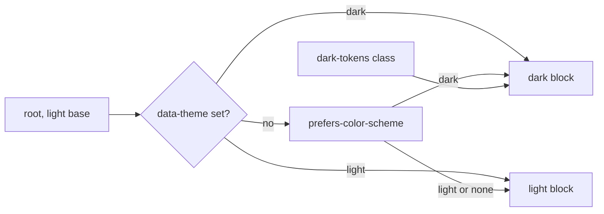
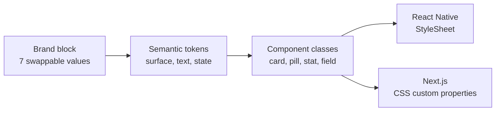
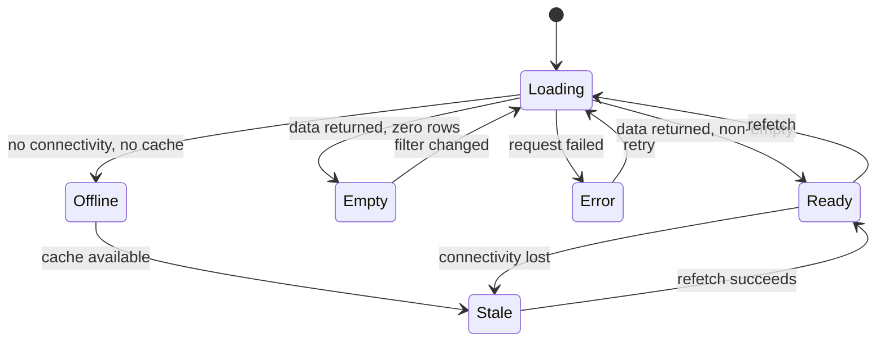

# 06: Design System

> Heading style note: this file uses a colon rather than the dash separator used by its
> siblings, because the client has ruled out em-dashes in all Fydr documentation.

## 0. Source of truth

This document is derived from the client's **real** design system, extracted from
`web/src/app/globals.css`. It is not a proposal and it is not a placeholder.

- The source artefact is preserved at `docs/source/fydr-design-system.html`.
- The token and component CSS is extracted to `docs/source/design-system-tokens.css`, verbatim
  apart from the base64 font payloads, which are stripped.
- The annotated page copy is extracted to `docs/source/design-system-content.txt`.

**Where this document and the source CSS disagree, the source CSS wins and this document
must be corrected.** That rule is absolute. If you find a value here that the CSS does not
support, do not implement the value in this document: change this document.

There are two categories of statement below, and they are labelled throughout:

| Label | Meaning |
|---|---|
| **Source** | Present in the client's CSS or page copy. Not negotiable, not invented. |
| **Derived** | Not in the source. Computed or specified here because the app needs it and the source does not cover it. Every derived value shows its working and is raised as an open question in §15. |

An earlier revision of this file invented an accent ramp, a system-font typography stack, a
four-point spacing scale, a five-level elevation scale, and a status palette in green, amber
and red. **All of that is now wrong and has been deleted.** What survived is the parts that
were never about brand: accessibility rules, the four states, data visualisation honesty
rules, numeric formatting, colour-blind safety, the wellness slider specification, and
component behaviour. Those sections have been re-pointed at the real tokens.

---

## 1. Design principles

Six principles, derived from `00-product-overview.md` and specialised for the interface
layer. When two conflict, the lower number wins.

### 1.1 Athlete speed beats everything

The 45-second wellness submission is a product survival constraint, not a nicety. On athlete
surfaces:

- No screen may require more than one scroll to complete a task.
- No control may require precision. Everything is a large tap or a coarse drag.
- No submission may block on the network. The submit button never shows a spinner that waits
  on a server, per `03-flows.md` §3.
- No decorative animation on the critical path. The source motion budget is already this
  tight: 0.15s for state, 0.08s for press. Nothing on the wellness flow exceeds 0.15s.

Budget for the wellness entry, which the build must hold to:

| Step | Target |
|---|---|
| Open app to entry screen | 3 s |
| 5 subjective scales | 20 s |
| Sleep hours | 5 s |
| Optional fields, skipped by most | 0 s |
| Review and submit | 5 s |
| Confirmation and dismissal | 2 s |
| **Total** | **35 s, with 10 s of headroom** |

### 1.2 Staff surfaces are glanceable before they are complete

The first screenful of any staff surface answers "who needs attention" and nothing else.
Detail is one tap below. A coach must be able to identify the three athletes needing
attention in under 15 seconds, measured from the first viewport alone.

The source already encodes this: `.load-row.flag-high` puts a severity wash on the row
before the reader has parsed a single number.

### 1.3 Density is a property of the platform, not the brand

The same data is shown at three densities. The component API is identical; only the density
token changes. The source system is a web dashboard at one density, so the compact and dense
variants are **derived**.

| Context | Density | Row height | Base text | Numbers per row |
|---|---|---|---|---|
| Athlete mobile | `comfortable` | 56 pt | 15 pt body, per the source scale | 1 to 2 |
| Staff mobile | `compact` | 44 pt | 14 pt | 3 to 4 |
| Staff web | `dense` | 36 px | 13 px | 6 to 10 |

Density never drops below the accessibility floor in §11. A dense web table still has 44 px
hit targets for its interactive elements even where the visual row is 36 px, achieved with
padding and hit slop, not with a taller row.

### 1.4 Status is never colour alone

Roughly 8% of men have a colour vision deficiency, and squad sports in the target market are
heavily male. Every colour-coded status in Fydr carries at least one non-colour channel: a
distinct glyph shape, a text label, or both.

This is not a preference in the Fydr palette, it is a load-bearing requirement. §4 shows
that the old cyan `--good` and `--accent2` were 11.7 ΔE00 apart in normal vision, 8.8 apart
under deuteranopia, and 2.6 apart as pill fills. The teal `--good` fixes that pair, and it does
not remove the requirement: `--warn` against `--bad` is still 6.5 ΔE00 as a 22% fill. Without
the glyph channel those two states are the same colour to a large fraction of the squad.

### 1.5 Provenance and uncertainty are visible

Every chart states its window and sample size, every aggregate that excludes missing values
says how many it excluded, and every value that came from a device or an import is marked. A
number with no context is a number that will be misread by a coach at 7 a.m.

### 1.6 Missing is not zero

An unsubmitted wellness entry is not a wellness score of zero. A missing GPS file is not zero
distance. This distinction has its own token, its own glyph, and its own rules in §6.4, and
confusing the two is treated as a correctness bug rather than a display issue.

---

## 2. The real token block

### 2.1 Fonts

**Source.** Two families, no others.

| Role | Family | Weights actually loaded | CSS variable | Applied by |
|---|---|---|---|---|
| UI and display | **Sora** | 400, 600, 700, 800 | `--font-sora` | body default |
| Every number and data label | **DM Mono** | 400, 500 | `--font-mono` | the `.mono` class |

Both are loaded through `next/font/google` on web. The source page declares exactly four
Sora faces and two DM Mono faces. The stated range "400 to 800" therefore means four
discrete weights, not five: **there is no Sora 500**. Do not write `font-weight: 500` against
Sora; it will synthesise.

```css
/* the shape of it, from the source */
.ds   { --font-sora: "Sora"; --font-mono: "DM Mono";
        font-family: "Sora", system-ui, sans-serif; line-height: 1.5; }
.mono { font-family: "DM Mono", ui-monospace, monospace; }
:root { --code: var(--font-mono); }
```

**The `.mono` rule.** Every number and every data label uses DM Mono. In the source this
covers stat values, table values, hex codes, section numbers, scale metadata, and the
`.tok-name` token names. Body prose never uses it.

**Derived, React Native.** The athlete app is Expo, so `next/font/google` does not apply.
Sora and DM Mono ship as bundled assets loaded with `expo-font`, with the same four plus two
weights, and the app does not render text until both families are resolved or a 3 second
timeout expires, after which the platform font is used. A training ground on 2G must never
see a blank frame. Raised as O-607.

### 2.2 Brand and semantic colours

**Source.** Single values. **Not theme-split.** The same hex in light and dark.

| Token | Value | Role in the source |
|---|---|---|
| `--accent` | `#1f6fea` | Primary action and data |
| `--accent2` | `#33b6ff` | Bright: "now", progress |
| `--good` | `#4dcbb2` | Positive, done |
| `--warn` | `#f6ab2f` | Caution, behind |
| `--bad` | `#f15a4a` | Critical, at risk |
| `--highlight` | `#f5c518` | Sparing only: Ready, PB, the logo dot |
| `--highlight-text` | `#3a2e00` | Text on a solid highlight fill |
| `--avatar-bg` | `#1a2340` | Avatar plate |
| `--avatar-text` | `#6f9bff` | Avatar initials and active tab |
| `--tab-active` | `#6f9bff` | Active tab label |
| `--tab-inactive` | `#4a5578` | Inactive tab label |
| `--node-empty-border` | `#313c60` | Empty node outline |
| `--accent-rgb` | `31,111,234` | Channel triplet for alpha tints |
| `--accent2-rgb` | `51,182,255` | Channel triplet for alpha tints |

The `*-rgb` pair exists so tints can be built as `rgba(var(--accent-rgb), 0.14)` without
restating the hex. **The source only provides this for `--accent` and `--accent2`**, which is
why the status pills and the `.flag-high` stripe fall back to hard-coded
`rgba(241,90,74,.16)` and `rgba(77,203,178,.16)`. That is a raw hex in disguise and it
violates the system's own rule. See §14.

### 2.3 Theme tokens

**Source.** Light is the base. Every surface and text colour has two values.

| Token | Light | Dark | Role |
|---|---|---|---|
| `--bg` | `#eaedf1` | `#182241` | App background |
| `--surf` | `#ffffff` | `#171e36` | Card surface |
| `--surf2` | `#f3f5f8` | `#1a2340` | Row hover, inset |
| `--elev` | `#ffffff` | `#1a2340` | Raised control |
| `--text` | `#13161c` | `#e9edfa` | Primary text |
| `--muted` | `#5b636e` | `#a6b3d2` | Secondary text |
| `--faint` | `#929aa5` | `#6472a0` | Labels, hints |
| `--border` | `rgba(16,18,23,0.085)` | `#232c4a` | Hairline border |
| `--hair` | `rgba(16,18,23,0.05)` | `rgba(255,255,255,0.055)` | Internal rule |
| `--track` | `rgba(16,18,23,0.07)` | `rgba(255,255,255,0.12)` | Track, well |
| `--field` | `#f0f2f5` | `#1a2340` | Input fill |
| `--shadow` | `0 1px 3px rgba(16,18,23,.08)` | `0 1px 2px rgba(0,0,0,.4)` | The one elevation |

Note that in dark, `--surf2`, `--elev`, `--field` and `--avatar-bg` are all `#1a2340`. There
is one raised surface in dark, not a scale.

### 2.4 How dark is delivered

**Source.** Three routes, all carrying the identical block:

1. `.dark-tokens` as an explicit class, for a subtree.
2. `@media (prefers-color-scheme: dark)` scoped to `:root:not([data-theme])`, so the OS
   preference applies only when the user has not chosen.
3. `:root[data-theme="dark"]`, the explicit user choice.

`:root[data-theme="light"]` restates the light block so an explicit light choice beats the OS
preference. Light is the base at `:root`.



Both themes ship. This closes the old open question about dark theme priority: the client's
system already delivers dark three ways, so it is not deferrable.

### 2.5 Type scale

**Source.** There is no bare `h1` or `h2`. Headings are semantic classes.

| Role | Selector | Size and weight | Notes |
|---|---|---|---|
| Page title | `.page-head h1` | 22px rising to 30px on desktop, weight 800 | The only page-level title |
| Section title | `display` | 24 / 800 | Letter-spacing -0.02em in the source |
| Card title | `.card-title` | 15 / 700 | |
| Body | body default | 15 / 400 | line-height 1.5 |
| Caption | `.import-sub` | 12.5, `--muted` | The sub-line under a title |
| Eyebrow | `.eyebrow` | 11, letter-spacing 0.12em, uppercase, weight 600 | |
| Numbers | `.mono` | DM Mono, tabular | Every numeral, every data label |

**Derived sizes** used by components the source page does not contain: `.stat-val` is 28/800
in the source and is adopted as the large metric size; a hero metric at 40/800 and a table
numeral at 14/500 are derived, both in DM Mono. See §6.

### 2.6 Radius

**Source.** Radius scales with the element's size.

| Radius | Applies to |
|---|---|
| 9 | Toggle |
| 12 | Button, field |
| 14 | Tab, tile |
| 16 | Stat |
| 18 | Card |
| 20 | Pill, chip |

One inconsistency to be aware of: in the source page the theme `.toggle` control is itself
20px, and 9px appears only on the numbered step marker. The 9px entry describes an in-app
toggle, not the page's theme switch. Build to the table.

### 2.7 Spacing

**Source.** Layout drives spacing with `gap`, not margins. There is no numeric spacing scale
and none should be invented.

| Use | Value |
|---|---|
| Stack gap | 14px |
| Card padding | 16px |
| Field padding | 12px vertical, 14px horizontal |
| Two-column and tile grid gap | 12px |

The source page's own `.card` uses 18px padding while the documented recipe in the same page
says 16px. **16px is canonical**, because that is what the copy block hands to an implementer.
Likewise the page's `.two` grid uses 14px while the documented two-column gap is 12px; the
tile grids in the page do use 12px. Build to the table, and raise it if the app's CSS
disagrees.

**Rule**: if a gap is not 12 or 14, and a padding is not 16 or 12/14, it needs a comment
saying why.

### 2.8 Motion

**Source.** Restrained. Two timings do almost all the work, and there is exactly one keyframe.

| Use | Value |
|---|---|
| State transition: colour, border, background | `0.15s ease` |
| Press | `transform 0.08s ease` to `scale(0.97)` |
| Draw-in, the only keyframe | `ring-in`, `0.9s cubic-bezier(.22,.8,.36,1)`, a score ring sweeping to value on mount |

The source implements `ring-in` as `@keyframes ds-ring { from { stroke-dashoffset: 251 } }`
on the page. Name the app keyframe `ring-in`.

`@media (prefers-reduced-motion: reduce)` in the source disables **all** animation and
transition globally. Keep that, and see §11.4 for what replaces each animation.

Nothing else animates. No count-ups, no page transitions with movement, no shimmer.

### 2.9 Rules for consuming tokens

**Source, and a hard rule.**

> Style through the token, never a raw hex. That is what makes the light and dark themes free.

> To pivot the identity, change only the brand block: `--accent`, `--accent2`, `--good`,
> `--highlight`, `--avatar-text`, `--tab-active`. Roughly seven values reskin the entire app.

Both statements are preserved verbatim as build rules. Concretely:

1. A hex code in a component file fails review. The only hex codes in the codebase live in
   the token block.
2. A component never reads a theme token's *value*, only its name.
3. Anything that needs an alpha tint of a brand colour reads a `*-rgb` triplet. Where one
   does not exist yet, add it to the token block rather than hard-coding the channels. See
   §14.1.
4. The reskin set is exactly six named tokens plus `--tab-active`, which tracks
   `--avatar-text`. A change to any other token is a change to the system, not a reskin.
5. Both themes are mandatory at all times. A token added to one and not the other is a build
   error.



### 2.10 One definition, two clients

Tokens live in the shared workspace package, per `CLAUDE.md` §4, and the web app emits them
as the CSS custom properties above. The source of the values is the token module; the CSS
block is generated from it, so there is never a second definition to drift.

```
packages/ui/src/tokens/
  brand.ts       the 14 brand and semantic values, single-valued
  theme.ts       the 12 theme tokens, light and dark
  type.ts        Sora and DM Mono roles, the seven type roles
  radius.ts      9 / 12 / 14 / 16 / 18 / 20
  space.ts       14 / 16 / 12-14 / 12
  motion.ts      0.15s, 0.08s, ring-in
  derived.ts     everything in §3.7, §9.4 and §14 that the source does not cover
  index.ts       barrel, theme resolution
```

`derived.ts` is deliberately a separate file so that what the client supplied and what Fydr
added are never confused. When the client extends the real system, values move out of
`derived.ts` and into the file they belong in.

---

## 3. Contrast audit

Nothing in this section is asserted. Every number was computed from the real token values
with the WCAG 2.x relative luminance formula, alpha fills composited in sRGB the way a
browser composites them, and the results are reproduced by the CI test in §3.8.

Targets: **4.5:1** for body text, **3:1** for text at 24px or 19px bold and above, and **3:1**
for non-text UI components and meaningful graphical objects, per WCAG 2.2 SC 1.4.3, 1.4.6 and
1.4.11.

### 3.1 Method

- Relative luminance: `L = 0.2126R + 0.7152G + 0.0722B` on linearised sRGB channels.
- Contrast: `(Llighter + 0.05) / (Ldarker + 0.05)`.
- Alpha fills: composited over the actual surface token, in gamma space, as CSS does.
- Perceptual distance: CIEDE2000 in CIE Lab, D65.
- Colour vision simulation: Viénot, Brettel and Mollon 1999 LMS transform for protanopia and
  deuteranopia, Brettel for tritanopia.

### 3.2 Light theme, text on surfaces

Surfaces: `--bg` #eaedf1, `--surf` #ffffff, `--surf2` #f3f5f8, `--field` #f0f2f5.

| Foreground | on `--bg` | on `--surf` | on `--surf2` | on `--field` | Verdict |
|---|---|---|---|---|---|
| `--text` #13161c | 15.43 | 18.12 | 16.59 | 16.15 | AAA |
| `--muted` #5b636e | 5.18 | 6.08 | 5.57 | 5.42 | AA |
| `--faint` #929aa5 | 2.42 | 2.84 | 2.60 | 2.53 | **Fails 4.5 and 3.0** |
| `--accent` #1f6fea | 3.96 | 4.65 | 4.25 | 4.14 | **Fails 4.5 except on white** |
| `--accent2` #33b6ff | 1.93 | 2.26 | 2.07 | 2.02 | **Fails 4.5 and 3.0** |
| `--good` #4dcbb2 | 1.70 | 2.00 | 1.83 | 1.78 | **Fails 4.5 and 3.0** |
| `--warn` #f6ab2f | 1.66 | 1.95 | 1.78 | 1.74 | **Fails 4.5 and 3.0** |
| `--bad` #f15a4a | 2.84 | 3.33 | 3.05 | 2.97 | **Fails 4.5** |
| `--highlight` #f5c518 | 1.39 | 1.63 | 1.49 | 1.45 | **Fails 4.5 and 3.0** |
| `--avatar-text` / `--tab-active` #6f9bff | 2.29 | 2.69 | 2.46 | 2.40 | **Fails 4.5 and 3.0** |
| `--tab-inactive` #4a5578 | 6.25 | 7.34 | 6.72 | 6.54 | AA |

**Reading of this table**: in the light theme, *every* brand and semantic colour fails as
body text, and five of them fail even the 3:1 large-text and non-text floor. `--faint` fails
at 2.84 on white, which matters because it carries `.field-help`, `.load-head`, `.mpos` and
every chart footnote in the source.

`--accent` at 4.65 on `--surf` is the single passing case, and it fails on `--bg` at 3.96, so
the same accent link is compliant inside a card and non-compliant outside one.

### 3.3 Dark theme, text on surfaces

Surfaces: `--bg` #182241, `--surf` #171e36, and `--surf2` / `--elev` / `--field` #1a2340.

| Foreground | on `--bg` | on `--surf` | on `#1a2340` | Verdict |
|---|---|---|---|---|
| `--text` #e9edfa | 13.36 | 14.08 | 13.22 | AAA |
| `--muted` #a6b3d2 | 7.44 | 7.84 | 7.36 | AAA |
| `--faint` #6472a0 | 3.32 | 3.49 | 3.28 | **Fails 4.5**, passes 3.0 |
| `--accent` #1f6fea | 3.36 | 3.54 | 3.33 | **Fails 4.5**, passes 3.0 |
| `--accent2` #33b6ff | 6.90 | 7.27 | 6.83 | AA |
| `--good` #4dcbb2 | 7.81 | 8.23 | 7.73 | AAA |
| `--warn` #f6ab2f | 8.02 | 8.46 | 7.94 | AAA |
| `--bad` #f15a4a | 4.69 | 4.94 | 4.64 | AA |
| `--highlight` #f5c518 | 9.59 | 10.10 | 9.48 | AAA |
| `--avatar-text` / `--tab-active` #6f9bff | 5.81 | 6.12 | 5.75 | AA |
| `--tab-inactive` #4a5578 | 2.13 | 2.24 | 2.11 | **Fails 4.5 and 3.0** |

**Reading of this table**: the palette was designed dark-first and it shows. Dark is broadly
compliant. Two failures matter:

1. `--accent` as text on dark, at 3.54, is a body-text failure. Anything that renders an
   accent-coloured label, link or section number on a dark surface is non-compliant. The
   source page does exactly this with `.sec-num`.
2. `--tab-inactive` #4a5578 at 2.24 is an inactive **tab label**, which is text, and it fails
   by a wide margin. WCAG makes no exemption for inactive tabs: they are readable content, not
   disabled controls.

### 3.4 Tinted pills

The source pill recipe is: fill = the state colour at 16% alpha, text = the state colour at
full strength, 11px weight 700, radius 20.

Computed with the fill composited over the surface the pill sits on.

**Light theme**

| Pill | Text | Fill over `--surf` | Ratio on `--surf` | Fill over `--bg` | Ratio on `--bg` | Verdict |
|---|---|---|---|---|---|---|
| accent | #1f6fea | #dbe8fc | **3.75** | #cad9f0 | **3.25** | Fail |
| accent2 | #33b6ff | #def3ff | **1.98** | #cde4f3 | **1.72** | Fail |
| good | #4dcbb2 | #e3f7f3 | **1.80** | #d1e8e7 | **1.56** | Fail |
| warn | #f6ab2f | #fef2de | **1.76** | #ece2d2 | **1.52** | Fail |
| bad | #f15a4a | #fde5e2 | **2.77** | #ebd5d6 | **2.38** | Fail |
| highlight | #f5c518 | #fdf6da | **1.50** | #ece7ce | **1.31** | Fail |
| avatar-text | #6f9bff | #e8efff | **2.33** | #d6e0f3 | **2.03** | Fail |

**Every status pill in the light theme fails**, and four of the seven are below 2:1. A
`--good` pill reading "On track" at 1.80:1 is, for practical purposes, unreadable.

**Dark theme**

| Pill | Text | Fill over `--surf` | Ratio on `--surf` | Ratio on `--bg` | Verdict |
|---|---|---|---|---|---|
| accent | #1f6fea | #182b53 | **2.99** | **2.85** | Fail |
| accent2 | #33b6ff | #1b3656 | 5.43 | 5.10 | Pass |
| good | #4dcbb2 | #203a4a | 5.95 | 5.66 | Pass |
| warn | #f6ab2f | #3b3535 | 6.17 | 5.90 | Pass |
| bad | #f15a4a | #3a2839 | **4.09** | **3.91** | Fail |
| highlight | #f5c518 | #3b3931 | 7.10 | 6.80 | Pass |
| avatar-text | #6f9bff | #253256 | 4.68 | **4.44** | Fail on `--bg` |

Dark passes for four of seven. The "At risk" pill, which is the single most consequential
pill in the product, is one of the failures at 4.09 and 3.91.

Also note the fill itself: at 16% alpha the fill is between 1.06:1 and 1.42:1 against its
surface. The pill's **shape** is therefore not perceivable as a distinct object, only its
text is. That is acceptable because the text carries the meaning, but it means the pill can
never be reduced to a colour swatch with no label.

**This table audits the source recipe at 16%. The recipe Fydr ships is §4.4's, at 22% with a
2 px edge and re-derived text tokens.** At 22% the fill sits between 1.09:1 and 1.66:1 against
its surface, so the sentence above holds unchanged: a deeper tint does not make the shape
perceivable, it only makes the text harder to read, which is what §4.4 resolves.

### 3.5 Solid fills

| Combination | Ratio | Verdict |
|---|---|---|
| `#fff` on `--accent` (`.btn-primary`, `.squad-chip.active`) | **4.65** | Pass at 4.5, no margin |
| `--accent` solid vs `--bg` light | 3.96 | Pass 3:1, the button boundary is visible |
| `--accent` solid vs `--bg` dark | 3.36 | Pass 3:1 |
| `#fff` on `--accent2` | 2.26 | Fail |
| `#fff` on `--good` | 2.00 | Fail |
| `#fff` on `--warn` | 1.95 | Fail |
| `#fff` on `--bad` | 3.33 | Fail |
| `#fff` on `--highlight` | 1.63 | Fail |
| `--highlight-text` #3a2e00 on `--highlight` | 8.20 | Pass, and this is why the token exists |
| `--text` #13161c on `--accent2` | 8.00 | Pass |
| `--text` #13161c on `--good` | 9.06 | Pass |
| `--text` #13161c on `--warn` | 9.30 | Pass |
| `--text` #13161c on `--bad` | 5.44 | Pass |
| `--text` #13161c on `--highlight` | 11.11 | Pass |
| `--text` #13161c on `--accent` | 3.90 | Fail |

**Rule that follows**: `--accent` is the only brand colour that takes white text. Every other
brand colour takes dark text on a solid fill, exactly as `--highlight-text` already
demonstrates. A white-on-warn or white-on-bad button is prohibited.

`#fff` on `--accent` at 4.65 passes with 0.15 of margin. It is not safe to darken the button
background on press by more than about 2%, and the existing `scale(0.97)` press affordance is
the right one precisely because it does not touch the colour.

### 3.6 Non-text and UI components

| Object | Ratio against its surface | Target | Verdict |
|---|---|---|---|
| `--border` light, `rgba(16,18,23,.085)` over `--surf` | 1.19 | 3:1 where it is the only boundary | **Fail** |
| `--border` dark, `#232c4a` on `--surf` | 1.20 | 3:1 | **Fail** |
| `--border` dark, `#232c4a` on `--bg` | 1.14 | 3:1 | **Fail** |
| `--track` light over `--surf` | 1.16 | 3:1 if it encodes a value | **Fail** |
| `--track` dark over `--surf` | 1.44 | 3:1 | **Fail** |
| `.load-row.flag-high` stripe light, `rgba(241,90,74,.06)` | 1.07 | 3:1 if it is the only severity signal | **Fail** |
| `.load-row.flag-high` stripe dark | 1.06 | 3:1 | **Fail** |
| `--accent` focus border on light `--field` | 4.14 | 3:1 | Pass |
| `--accent` focus border on dark `--field` | 3.33 | 3:1 | Pass, thin margin |
| `--node-empty-border` #313c60 on dark `--bg` | 1.45 | 3:1 | **Fail** |
| `--avatar-text` on `--avatar-bg` | 5.75 | 4.5:1 | Pass |

Three of these are genuine defects and two are not:

- **Not a defect**: `--border` and `--hair` used as decorative separation between a card and
  its background. WCAG does not require 3:1 for a purely decorative divider when the surfaces
  differ.
- **A defect**: `--border` used as the *only* boundary of an input. `.field` in the source has
  `--field` fill and a `--border` outline, and in the dark theme `--field` and `--surf2` are
  the same colour, so a text input sitting on `--surf2` is delimited by a 1.20:1 line and
  nothing else. That is SC 1.4.11 and it fails.
- **A defect**: `.load-row.flag-high` at 1.07:1 conveys severity by wash alone. In the source
  the row also carries `⚠` next to the value, which saves it. **The wash may never be the only
  signal**, and this is now a rule, not an observation.
- **A defect**: `--track` when it encodes a value, for example a progress bar's unfilled
  portion. Where the track is only a groove, it is decorative and fine.

### 3.7 The tokens the audit forces

The source's "single value, not theme-split" rule holds for **fills and marks**. It cannot
hold for **text**, because the same hue cannot clear 4.5:1 against both #ffffff and #171e36.
This is not a criticism of the palette, it is arithmetic.

So: the brand tokens stay single-valued and keep driving fills, marks, borders and the
seven-value reskin. A small set of **text-role** tokens is derived alongside them, theme-split,
each one the same hue and chroma as its parent with only L* moved until it clears the target.
The reskin still works: these are computed from the brand block, not chosen independently.

**This table is the single definition of these tokens.** §4.5 states the rule that governs
them and the `*-rgb` triplets that go with them, and it does not restate any value. There is
one definition per token name and it is here.

**Derived: `--*-text` tokens for a coloured label on a plain surface.** Target 4.5:1 against
the **worst surface in the theme**, which is `--bg` #eaedf1 in light and #1a2340 in dark, not
`--surf`. Deriving against `--surf` alone is the mistake that produced the earlier, failing
set: a token at 4.60 on white sits at 3.92 on `--bg`, and `--bg` is what a chip outside a card
sits on.

| Parent | Token | Light | On `--bg` | On `--surf` | Dark | On #1a2340 |
|---|---|---|---|---|---|---|
| `--accent` | `--accent-text` | `#0065de` | 4.57 | 5.36 | `#4f85ff` | 4.51 |
| `--accent2` | `--accent2-text` | `#0070b3` | 4.51 | 5.29 | `#33b6ff` unchanged | 6.83 |
| `--good` | `--good-text` | `#007967` | 4.55 | 5.34 | `#4dcbb2` unchanged | 7.73 |
| `--warn` | `--warn-text` | `#995d00` | 4.56 | 5.36 | `#f6ab2f` unchanged | 7.94 |
| `--bad` | `--bad-text` | `#c6332b` | 4.57 | 5.37 | `#f15a4a` unchanged | 4.64 |
| `--highlight` | **`--highlight-fg`** | `#876600` | 4.55 | 5.34 | `#f5c518` unchanged | 9.48 |
| `--avatar-text` | `--avatar-text-fg` | `#2a68c6` | 4.59 | 5.39 | `#6f9bff` unchanged | 5.75 |

**The highlight token is named `--highlight-fg`, not `--highlight-text`.** `--highlight-text`
is already taken by §2.2, where it is `#3a2e00`, the dark text that sits on a **solid**
`--highlight` fill. Two different colours for two different jobs cannot share a name. The
`-fg` suffix is used for the avatar pair as well, because `--avatar-text-text` is not a name
anyone should have to type.

`--good` light moved from `#007499` to `#007967` on 5 August 2026. The old value was derived
from the old cyan `--good` `#4fd6ff` and sat at hue 244 in Lab, nowhere near the teal it was
supposed to be a label for.

**Derived: `--*-pill-text` tokens for text on that colour's own **22%** tint** (target 4.5:1
against the tint composited over both `--surf` and `--bg`). 22% is the alpha §4.4 adopts, and
this table is derived at it. The pair of ratios is `--surf` then `--bg`; `--bg` is the binding
one, because a pill outside a card sits on it.

| Pill | Light text | on `--surf` | on `--bg` | Dark text | on `--surf` | on `--bg` |
|---|---|---|---|---|---|---|
| accent | `#0051c6` | 5.21 | 4.54 | `#699bff` | 4.77 | 4.53 |
| accent2 | `#0064a6` | 5.20 | 4.55 | `#33b6ff` unchanged | 4.76 | 4.51 |
| good | `#00705c` | 5.19 | 4.56 | `#4dcbb2` unchanged | 5.20 | 4.94 |
| warn | `#905600` | 5.16 | 4.52 | `#f6ab2f` unchanged | 5.41 | 5.17 |
| bad | `#b31e1e` | 5.20 | 4.53 | `#ff7460` | 4.72 | 4.52 |
| highlight | `#7f6000` unchanged | 5.25 | 4.61 | `#f5c518` unchanged | 6.10 | 5.83 |

The good row previously carried two candidates, one for cyan and one for teal. §4.2 settled
that: `--good` is teal, so there is one row.

**This table was re-derived on 5 August 2026 and the previous 16% set is withdrawn.** §4.4's
22% fill was published while these tokens were still derived at 16%, and at 22% the old set
failed: `accent` 4.18 on `--bg` light, `accent2` 4.37, `good` 4.36, `warn` 4.44, `bad` 4.26,
and in dark `accent` 4.25 and `bad` 4.21. Seven of the twelve were below 4.5 against `--bg`,
which is the surface that decides it. The resolution is in §4.4: the alpha stays at 22% and
the text tokens move. Five light values and two dark values changed; `highlight` light and
four dark values already passed at 22% and are untouched, so the diff is deliberately small.

Each new value holds its parent's hue and chroma and moves only L\*, the same method as the
`--*-text` set above. Hue drift from the parent is at most 15 degrees in Lab, and only where
the sRGB gamut forces chroma down (`accent2`, `warn`, `highlight` in light), which is the same
compromise the existing set already makes.

In dark, four of six pills need no change at all. In light, all six do. Keeping the
token colour as the tint and darkening only the text preserves the pill's colour identity
exactly: the fill a reader sees is still `rgb(var(--accent2-rgb) / 0.22)`.

The alternative, lowering the alpha until the untouched token passes, does not work: the
solver returns "no alpha satisfies 4.5:1" for every colour in light, because the token fails
against the bare surface before any tint is added.

**Derived: `--border-strong`**, for any border that is the sole boundary of an interactive
control.

| Theme | Value | Ratio |
|---|---|---|
| Light | `rgba(16,18,23,0.52)` | 3.20 |
| Dark | `#657199` | 3.22 |

`--border` keeps its current value for decorative rules. `--border-strong` applies to
`.field`, to any control whose only edge is a line, and to a selected state boundary.

### 3.8 Automated check

`packages/ui/src/tokens/__tests__/contrast.test.ts` recomputes every ratio in §3.2 to §3.7 on
each CI run and fails the build if any drops below its target. The test also asserts that no
component file contains a hex literal.

**The tables above are not generated. They are transcribed, and they have drifted before.**
When `--good` moved from `#4fd6ff` to `#4dcbb2` on 5 August 2026 the figures for the old cyan
stayed in §3.2, §3.3, §3.4, §3.5 and §3.7 under the new token's name, which is worse than
having no figures at all. They were recomputed and corrected on the same date. Until the test
emits these tables and a CI step fails on any difference between its output and this file,
treat every number here as a claim that a token change can invalidate, and recompute §3.2 to
§3.7 whenever a value in §2.2 or §2.3 changes. Making the tables genuinely generated is the
fix, and it is not done.

---

## 4. The `--good` collision, and the resolution

The brief flagged this as a suspicion. It was worse than suspected, it has been measured,
and it is now **resolved by a one-token change**.

### 4.1 What was wrong

`--good` was `#4fd6ff`, a cyan. Measured with CIEDE2000 against Brettel dichromatic
simulation, at full strength:

| Pair, original palette | Normal | Deuteranopia | Protanopia |
|---|---|---|---|
| `--accent2` vs `--good` | 11.7 | **8.8** | **9.5** |
| `--accent2` vs `--avatar-text` | 14.0 | **4.1** | **6.6** |
| `--good` vs `--avatar-text` | 23.0 | 12.8 | 15.9 |
| `--warn` vs `--highlight` | 10.7 | **4.3** | **6.4** |
| `--warn` vs `--bad` | 32.4 | 13.4 | 23.3 |

For reference: ΔE00 of about 2.3 is the just-noticeable difference for adjacent patches, 10
is "clearly different in isolation", and 20 or more is what a categorical palette needs when
the patches are small, separated in space, and read at a glance.

As 16% pill fills, every pair collapsed. `--accent2` vs `--avatar-text` measured **0.1**.
Not similar: identical.

### 4.2 The resolution

Three changes. Only one of them is a colour.

**Change 1. `--good` moves from `#4fd6ff` to `#4dcbb2`.** A teal. It keeps the original
system's deliberate and correct choice to avoid green for "good", which is what makes this
palette safer than the usual red/amber/green, while moving far enough round the hue circle
to separate from the brand blues.

| Pair | Before, deut | After, deut |
|---|---|---|
| `--good` vs `--accent2` | 8.8 | **23.5** |
| `--good` vs `--avatar-text` | 12.8 | **25.6** |
| `--good` vs `--accent` | 27.7 | **34.8** |

**Change 2. `--warn` stays at `#f6ab2f`.** Moving it was tried and made things worse: warn is
squeezed between yellow and red, and every hue that separates it from `--highlight` pushes it
toward `--bad`. An optimiser given free rein returned `#ffeb33`, which separates beautifully
from red and is then indistinguishable from the yellow highlight.

**Change 3, and it is the real fix. `--highlight` is decorative only and must never encode
status.** The `warn` vs `highlight` collision is unfixable by hue, because orange and yellow
converge under deuteranopia whatever you do. So stop asking two warm colours to carry two
different states. Concretely: the "Ready" pill in the source moves from `--highlight` to
`--good`. `--highlight` keeps only the logo dot and the personal-best marker, neither of
which is a state.

### 4.3 The resolved palette, verified

Semantic colours are `--good`, `--warn`, `--bad`. These three encode state and must be
mutually distinguishable. Floors: 15 ΔE00 normal, 10 under dichromacy.

| Pair | Normal | Deuteranopia | Protanopia | Verdict |
|---|---|---|---|---|
| `--good` vs `--warn` | 42.3 | 29.9 | 21.8 | PASS |
| `--good` vs `--bad` | 62.2 | 26.5 | 25.6 | PASS |
| `--warn` vs `--bad` | 32.4 | 13.4 | 23.3 | PASS |

Semantic against brand, so a "good" pill never reads as an accent chip. Lowest value in the
whole matrix is 23.5.

| | `--accent` | `--accent2` | `--avatar-text` |
|---|---|---|---|
| `--good` | 34.8 | 23.5 | 25.6 |
| `--warn` | 77.8 | 65.7 | 68.9 |
| `--bad` | 67.5 | 58.9 | 61.3 |

**One honest caveat.** `--warn` vs `--bad` under **tritanopia** measures 7.0, which is below
the floor. Tritanopia affects roughly 0.01% of people, and the mandatory glyph set in §5
covers it. It is recorded rather than fixed because fixing it would break the deuteranope
case, which affects 8% of men. That is the correct trade, and it is a trade, not a win.

### 4.4 The pill recipe has to change too

Even with the palette fixed, a 16% tint on white cannot carry status. Measured, deuteranope,
as fills:

| Pair | 16% fill | 22% fill | Full strength |
|---|---|---|---|
| good vs warn | 11.4 | 14.5 | 29.9 |
| good vs bad | 6.7 | 8.7 | 26.5 |
| warn vs bad | 5.2 | 6.5 | 13.4 |

The fill will always be the weakest signal, because tinting pulls every colour toward the
surface. **Stop making the fill carry the distinction.**

Revised `.pill` recipe:

```css
.pill {
  font-size: 11px; font-weight: 700;
  padding: 3px 10px 3px 8px;
  border-radius: 20px;
  background: rgb(var(--state-rgb) / 0.22);   /* was 0.16 */
  color: var(--state-pill-text);               /* the tint-aware set in §3.7 */
  border-left: 2px solid rgb(var(--state-rgb));/* solid edge at full chroma */
  display: inline-flex; align-items: center; gap: 5px;
}
.pill::before { content: var(--state-glyph); } /* see §5, never colour alone */
```

Separation is now carried by the text and the 2 px edge, both at full chroma, where the
worst semantic pair is 13.4 rather than 5.2.

#### The 22% fill against pill-text contrast, resolved

Raising the fill from 16% to 22% deepens the tint, and the tint is what the pill's own text
sits on. Measured over the composited fill, with the `--*-pill-text` set as it stood when it
was derived at 16%:

| Pill | 16% on `--bg` | 22% on `--bg` | At 22% |
|---|---|---|---|
| accent light `#0057cd` | 4.52 | **4.18** | Fails |
| accent2 light `#0067a9` | 4.56 | **4.37** | Fails |
| good light `#007362` | 4.51 | **4.36** | Fails |
| warn light `#925700` | 4.58 | **4.44** | Fails |
| bad light `#b82421` | 4.55 | **4.26** | Fails |
| highlight light `#7f6000` | 4.71 | 4.61 | Passes |
| accent dark `#6195ff` | 4.55 | **4.25** | Fails |
| accent2 dark `#33b6ff` | 5.11 | 4.51 | Passes, barely |
| good dark `#4dcbb2` | 5.66 | 4.94 | Passes |
| warn dark `#f6ab2f` | 5.92 | 5.17 | Passes |
| bad dark `#ff6856` | 4.58 | **4.21** | Fails |
| highlight dark `#f5c518` | 6.79 | 5.83 | Passes |

Seven of twelve below 4.5 against `--bg`, on ratios that had only 0.01 to 0.2 of margin to
begin with. Three ways out, and only one of them survives contact with §4.2:

1. **Drop back to 16%.** Every ratio passes again and nothing else changes. Rejected: the
   16% fill measures 6.7 ΔE00 between `good` and `bad` under deuteranopia and 5.2 between
   `warn` and `bad`. Both are below the 10 floor in §4.3, so a 16% fill is not merely a weaker
   signal, it is a wrong one for the two pairs a coach reads fastest.
2. **Change the construction**, for example a solid fill with dark text as §3.5 permits.
   Rejected: it makes every status pill a solid block, and forty solid blocks on a squad list
   is exactly the shouting dashboard §1.2 exists to prevent. It also discards the source's own
   visual language for no accessibility gain the other options do not already deliver.
3. **Keep 22% and re-derive the text tokens.** Adopted.

**Adopted: the fill stays at 22%, and `--*-pill-text` is re-derived against the 22% tint.**
The new values are in §3.7 and they are the only definition. All twelve clear 4.5:1 against
the tint over both `--surf` and `--bg`, with the worst at 4.51. Seven values move; five are
untouched. The moves are small: five light tokens drop between 0.5 and 2.2 L\*, and the two
dark ones rise by 2.0 and 2.2. That is at or under the just-noticeable difference of about 2.3
for adjacent patches (§4.1), so nobody reading a pill will see it. The CI test in §3.8 will.

**What each layer of the pill is actually doing**, stated because it is easy to assume the
edge is carrying more than it is:

| Layer | Job | Carries status? |
|---|---|---|
| 22% fill | Colour identity and the pill's silhouette | No. At 22% the fill is 1.09:1 to 1.66:1 against its surface, up from 1.06:1 to 1.42:1 at 16% and still nowhere near perceivable as a shape |
| 2 px full-chroma edge | Categorical separation for anyone who can see the hue: 13.4 ΔE00 on the worst semantic pair rather than 6.5 at the tint | Reinforces, never alone. Against a light surface the edge itself is 1.63:1 to 4.65:1, so it does not meet 3:1 for a non-text object either |
| `--*-pill-text` label | The status, in words, at 4.5:1 minimum | **Yes** |
| `::before` glyph | The status, in a shape, per §5 | **Yes** |

The text and the glyph are the two mandatory carriers. The fill and the edge are identity and
reinforcement. That ordering is why 22% is affordable at all: the deepened tint costs contrast
on a layer that is not allowed to be the only signal, and buys separation on a layer that helps
the largest group of affected users.

`[high on the arithmetic, medium on the choice: dropping to 16% and living with a weaker fill
is defensible if the client prefers not to move seven token values]`

### 4.5 Tokens this forces

The source hard-codes `rgba(241,90,74,.16)`, which is why the stated "swap seven values to
reskin" promise does not actually hold. Add the triplets:

```css
--good-rgb: 77,203,178;
--warn-rgb: 246,171,47;
--bad-rgb: 241,90,74;
--highlight-rgb: 245,197,24;
```

And the accessible text tokens. **Their values live in §3.7 and nowhere else.** An earlier
draft of this section restated them, computed against `--surf` #ffffff only, and produced a
second and conflicting set under the same token names: `--good-text: #268371` reaches 4.60 on
white and only 3.92 on `--bg` #eaedf1, so it failed on the surface most chips actually sit on.
That set is withdrawn. §3.7 derives every one of them against the worst surface in the theme,
and it is the only definition.

Two naming points that fall out of it:

- The highlight label token is **`--highlight-fg`**. `--highlight-text` is §2.2's `#3a2e00`,
  the dark text for a solid `--highlight` fill, and it keeps that meaning and that value.
- The pill recipe in §4.4 reads `--*-pill-text`, the tint-aware set in §3.7, not `--*-text`.
  The two targets differ: one is text on a plain surface, the other is text on a **22%** tint
  of itself, which is the alpha §4.4 adopts and the alpha §3.7 derives against.

None of the raw brand colours pass as text on white: `--good` is 2.00:1, `--warn` 1.95:1,
`--highlight` 1.63:1. On `--bg` they are worse still, at 1.70, 1.66 and 1.39.

**Rule.** `--good`, `--warn`, `--bad` and `--highlight` are fill and edge colours. They are
never text. `--*-text`, `--*-pill-text` and `--highlight-fg` are text and never a fill. A
component that uses the wrong one fails the contrast check in §3.8.

### 4.6 What changes in the existing code

| File | Change |
|---|---|
| `web/src/app/globals.css` | `--good: #4dcbb2`. Add four `*-rgb` triplets, the fourteen label-text tokens in §3.7 (seven per theme), and the twelve `--*-pill-text` tokens in §3.7 (six per theme, derived at 22%). |
| `.pill` | New recipe, §4.4: 22% fill, 2 px full-chroma inline-start edge, `--*-pill-text` label, mandatory glyph. Replace hard-coded `rgba(241,90,74,.16)` with `rgb(var(--bad-rgb) / 0.22)`. |
| "Ready" pill | Move from `--highlight` to `--good`, per §4.2 change 3 and the glyph table in §5.2 |
| Any status text | Point at `--*-text` on a plain surface and `--*-pill-text` inside a pill, never the raw token |

One colour value, four triplets, twenty-six text tokens, one component. Everything else is
unchanged, and the seven-value reskin promise starts being true.


## 5. Status semantics and the mandatory glyph set

### 5.1 The rule

> Colour is always a redundant channel. Every status is identifiable with the colour removed.

The Fydr palette makes this a better story than the red-and-green convention it replaces.
A teal "good", an orange "warn" and a red "bad" separate on the yellow-blue axis,
which dichromats retain, rather than the red-green axis, which they do not. `--good` versus
`--bad` measures 26.5 ΔE00 under deuteranopia and 25.6 under protanopia (§4.3); a conventional
green `#12694A` against a conventional red `#B3261E` measures about 15 under protanopia. The
Fydr palette is roughly 1.7 times better separated on the pair that matters most.
`[the 26.5 and 25.6 figures are §4.3's, recomputed for the teal --good. The green-and-red
comparison figure is carried over and is indicative]`

That is a real advantage and it should be said. **It does not remove the glyph requirement.**
Three reasons:

1. `--warn` versus `--bad` still converges under deuteranopia, at 13.4 at full strength, and
   as pill fills at 5.2 at 16% and 6.5 at the adopted 22% (§4.4). Amber and red are the pair a
   coach reads fastest and confuses most, and no pill fill separates them.
2. Roughly 8% of the male user base has a colour vision deficiency, and the deficiency is not
   uniform: anomalous trichromats sit between normal vision and the dichromatic simulations
   above, and the simulations are the optimistic end for them.
3. Clubs print the availability board and pin it in the physio room, frequently in greyscale.

A `Status` component that receives a colour but no glyph fails a unit test. The test asserts
that every status variant renders a non-empty `icon` name.

### 5.2 The glyph set

The source already ships two glyphs, and they define the family the rest is built from:

| Source glyph | Source meaning |
|---|---|
| `⚠` | A load spike: the value is above its upper threshold |
| `▽` | Undertraining: the value is below its lower threshold |

Read together, those two are **band position** glyphs, not severity glyphs and not direction
glyphs. Building outward from them gives four silhouette families that never collide:

| Family | Silhouette | Encodes | Members |
|---|---|---|---|
| **Triangles** | Angular | Position relative to a threshold band | `⚠` above upper, `▽` below lower, nothing when inside the band |
| **Arrows** | Linear with a head | Direction of change over time | `↑` `↗` `→` `↘` `↓` |
| **Rings** | Circular | Availability and compliance | `●` `◐` `⊘` `✓` `◑` `✕` `⊖` `◌` |
| **Bars** | Stacked rectangles | Ordinal severity | one, two or three filled bars |

Each is drawn as an icon on the 24px Lucide grid, per §13.1. The characters above are the
documentation shorthand and the plain-text fallback, not the shipped asset.

**The complete status glyph table.** Every status in Fydr appears here. If a status is not in
this table it does not exist yet.

| Status | Glyph | Silhouette | Text label | Colour role |
|---|---|---|---|---|
| Above upper threshold, load spike | `⚠` | Filled triangle, exclamation | "Spike" | `--bad` |
| Below lower threshold, undertraining | `▽` | Hollow inverted triangle | "Under" | `--warn` |
| Inside the band | none | none | the value alone | `--text` |
| Available | `●` | Filled circle with a tick | "Available" | `--good` |
| Modified | `◐` | Circle, left half filled, horizontal bar | "Modified" | `--warn` |
| Unavailable | `⊘` | Hollow circle with a diagonal bar | "Unavailable" | `--bad` |
| On track | `✓` | Tick | "On track" | `--good` |
| Needs attention | `⚠` | Filled triangle, exclamation | "Needs attention" | `--warn` |
| At risk | `⊗` | Circle with a cross | "At risk" | `--bad` |
| Ready | `★` | Star | "Ready" | `--good`. **Moved off `--highlight` by §4.2 change 3.** The star silhouette is what distinguishes Ready from On track, not the colour |
| Premium | `◆` | Diamond | "Premium" | `--accent` |
| Compliance complete | `✓` | Filled ring with a tick | "Complete" | `--good` |
| Compliance partial | `◑` | Ring filled to the fraction | "3 of 5" | `--warn` |
| Compliance missing | `✕` | Hollow ring with a diagonal bar | "Missing" | `--bad` |
| Compliance waived | `⊖` | Hollow ring with a minus | "Waived" | `--muted` |
| Compliance pending | `◌` | Dashed ring | "Due" | `--faint` |
| Severity low | one bar | 1 of 3 bars filled | "Low" | `--accent` |
| Severity medium | two bars | 2 of 3 | "Medium" | `--warn` |
| Severity high | three bars | 3 of 3 | "High" | `--bad` |
| Sync pending | `↑` in a cloud | Cloud with an up arrow | "Will sync" | `--faint` |
| Sync offline | cloud, slash | Cloud with a diagonal bar | "Offline" | `--faint` |
| Sync blocked | cloud, `!` | Cloud with an exclamation | "Sign in again" | `--warn` |

Rules attached to this table:

1. `⚠` appears twice, for "spike" and for "needs attention", and that is deliberate: they are
   the same meaning at two scopes, one for a value and one for an athlete. No other glyph is
   reused.
2. `⊘` and `✕` are distinct: `⊘` is a state of a person, `✕` is a state of an expected record.
3. Severity is the only ordinal status, so it gets the only ordinal glyph. Colour is not
   ordinal and cannot carry it.
4. Low severity is `--accent` blue, not `--good`. Green or cyan would read as "fine", and a
   low-severity flag is not fine, it is a mild problem.
5. **`--highlight` encodes no status at all.** It appears exactly twice in the whole product,
   the personal-best marker and the logo dot, and neither is a state. §4.2 change 3 is the
   reason: at 4.3 ΔE00 from `--warn` under deuteranopia, orange and yellow cannot both carry
   meaning, and no amount of hue rotation fixes it. "Ready" used to be the third use and it
   moved to `--good`. A new status rendered in `--highlight` fails review.

### 5.3 Availability

From `availability_status` in `04-data-model.md`. Shown to all staff roles. Coaching staff see
this and never the diagnosis, per `CLAUDE.md` §2 rule 3.

The three silhouettes differ in fill proportion (full, half, none) as well as in the internal
mark (tick, bar, slash). Fill proportion survives greyscale printing.

`AvailabilityPill` always renders glyph plus text. The bare glyph is permitted only in the
squad grid, where a per-column header supplies the meaning and every cell has a screen reader
label and a long-press tooltip. See O-614.

### 5.4 Flag severity and compliance

**Severity** (`flag_severity`: `low` / `medium` / `high`) uses the three-bar meter.

**Compliance** is derived, not stored, and has the five display states in the glyph table.
`waived` and `pending` are `--muted` and `--faint` by design. Neither is a failure and neither
should draw the eye on a dashboard whose job is to surface exceptions. The `waived` state
always exposes the reason on tap, because an unexplained waiver is how compliance data
quietly rots.

### 5.5 Trend direction and valence

This is the one place where a naive colour mapping is actively wrong. A higher resting heart
rate is worse, higher sleep is better, and higher body mass is neither without context. So
Fydr separates the two facts:

- **Direction** is what the number did. Encoded by **arrow shape**, per §5.2.
- **Valence** is whether that is good. Encoded by **arrow fill and colour**: solid and
  `--good` for favourable, hollow outline and `--bad` for unfavourable, solid and `--muted`
  for neutral.

Note the trap: the `soreness` **field** is `higherIsBetter`, because every 1 to 5 scale in
Fydr runs 5 = best and soreness 5 means *no soreness*. Being more sore is worse; a higher
`soreness` value is better. Valence is resolved from the field's metadata, never from the
English meaning of the field's name.

```ts
export type MetricDirection = 'higherIsBetter' | 'lowerIsBetter' | 'contextual';

export function resolveValence(
  delta: number,
  direction: MetricDirection,
  meaningfulThreshold: number,
): 'favourable' | 'unfavourable' | 'neutral' {
  if (Math.abs(delta) < meaningfulThreshold) return 'neutral';
  if (direction === 'contextual') return 'neutral';
  const improving = direction === 'higherIsBetter' ? delta > 0 : delta < 0;
  return improving ? 'favourable' : 'unfavourable';
}
```

`contextual` metrics (body mass, training load, session count) render neutral always. A load
increase is neither good nor bad without the plan behind it, and colouring it red would train
coaches to distrust the colour everywhere else.

Every trend also carries a screen reader label that states both facts in words, for example
"Soreness, down 1.2 since last week, worse". A Settings option, "Never colour trends", renders
valence as that trailing word instead of colour, for anyone who prefers it.

---

## 6. Typography and numerals

### 6.1 Families in practice

| Platform | UI | Numbers | Loading |
|---|---|---|---|
| Web | Sora, fallback `system-ui, sans-serif` | DM Mono, fallback `ui-monospace, monospace` | `next/font/google` to `--font-sora` and `--font-mono` |
| iOS and Android | Sora, bundled | DM Mono, bundled | `expo-font`, with the 3 second timeout in §2.1 |

`font-display: swap` on web. The fallback chain in the source is `system-ui, sans-serif`, so
a failed Sora load produces readable text at slightly different metrics, never a blank frame.

DM Mono ships tabular lining figures natively, which is the reason the source uses it for
every number rather than styling Sora with `font-variant-numeric`. This removes an entire
class of Android font-substitution bug that a proportional-figure UI font would create.

### 6.2 Tabular figures

> Any number that appears in a column, a grid, a table, or a value that updates in place uses
> `.mono`. No exceptions.

Proportional Sora figures are permitted only for a number embedded in a sentence, for example
"You have logged 12 sessions this month".

Two mechanisms, applied together:

1. `.mono` (DM Mono) plus `font-variant-numeric: tabular-nums`, exactly as `.load-val` does in
   the source.
2. Numeric table cells are fixed width and right-aligned, sized to the widest value the column
   can hold. The source's `.load-row` grid is `1fr 62px 66px` with the value columns
   right-aligned, which is this rule already implemented.

All numeric rendering goes through one component. A bare `<Text>{value}</Text>` for a number
fails review.

```tsx
// packages/ui/src/components/Numeric.tsx
export type NumericProps = {
  value: number | null | undefined;
  metric: MetricKey;              // drives precision and unit, see §6.3
  /** 'missing' when a value was expected, 'notApplicable' when none was expected. */
  absence?: 'missing' | 'notApplicable';
  showUnit?: boolean;
  align?: 'left' | 'right';       // right in tables, left in prose
  size?: 'hero' | 'stat' | 'body' | 'cell';   // 40/800, 28/800, 15/400, 14/500, all DM Mono
  pending?: boolean;              // queued locally, not yet synced
};
```

### 6.3 Precision per metric type

Precision is a property of the metric, defined once, never at the call site.

```ts
// packages/ui/src/format/metricFormat.ts
import type { MetricDirection } from '../trend/valence';   // defined in §5.5

export type MetricFormat = {
  decimals: number;
  unit: string;
  /** Keep trailing zeros in tables so decimal points align. Strip them in prose. */
  padDecimalsInTables: boolean;
  thousands: boolean;
  direction: MetricDirection;
  /** Below this absolute change, a trend is reported as flat. */
  meaningfulThreshold: number;
};

export const metricFormats = {
  // Wellness
  sleep_hours:      { decimals: 1, unit: 'h',    padDecimalsInTables: true,  thousands: false, direction: 'higherIsBetter',  meaningfulThreshold: 0.5 },
  sleep_quality:    { decimals: 0, unit: '/5',   padDecimalsInTables: false, thousands: false, direction: 'higherIsBetter',  meaningfulThreshold: 1 },
  fatigue:          { decimals: 0, unit: '/5',   padDecimalsInTables: false, thousands: false, direction: 'higherIsBetter',  meaningfulThreshold: 1 },
  soreness:         { decimals: 0, unit: '/5',   padDecimalsInTables: false, thousands: false, direction: 'higherIsBetter',  meaningfulThreshold: 1 },
  stress:           { decimals: 0, unit: '/5',   padDecimalsInTables: false, thousands: false, direction: 'higherIsBetter',  meaningfulThreshold: 1 },
  mood:             { decimals: 0, unit: '/5',   padDecimalsInTables: false, thousands: false, direction: 'higherIsBetter',  meaningfulThreshold: 1 },
  readiness_score:  { decimals: 0, unit: '',     padDecimalsInTables: false, thousands: false, direction: 'higherIsBetter',  meaningfulThreshold: 5 },
  resting_hr:       { decimals: 0, unit: 'bpm',  padDecimalsInTables: false, thousands: false, direction: 'lowerIsBetter',   meaningfulThreshold: 3 },
  body_mass_kg:     { decimals: 1, unit: 'kg',   padDecimalsInTables: true,  thousands: false, direction: 'contextual',      meaningfulThreshold: 0.5 },

  // Gym
  load_kg:          { decimals: 1, unit: 'kg',   padDecimalsInTables: true,  thousands: false, direction: 'higherIsBetter',  meaningfulThreshold: 2.5 },
  reps:             { decimals: 0, unit: '',     padDecimalsInTables: false, thousands: false, direction: 'higherIsBetter',  meaningfulThreshold: 1 },
  volume_kg:        { decimals: 0, unit: 'kg',   padDecimalsInTables: false, thousands: true,  direction: 'contextual',      meaningfulThreshold: 250 },
  rpe:              { decimals: 1, unit: '',     padDecimalsInTables: true,  thousands: false, direction: 'contextual',      meaningfulThreshold: 0.5 },
  rir:              { decimals: 0, unit: '',     padDecimalsInTables: false, thousands: false, direction: 'contextual',      meaningfulThreshold: 1 },
  estimated_1rm:    { decimals: 1, unit: 'kg',   padDecimalsInTables: true,  thousands: false, direction: 'higherIsBetter',  meaningfulThreshold: 2.5 },

  // Nutrition. These format TARGETS and guidance, never logged intake: athletes do not log
  // nutrition (CLAUDE.md §2 rule 8). The weekly check-in has three answers and no number.
  protein_g:        { decimals: 0, unit: 'g',    padDecimalsInTables: false, thousands: false, direction: 'contextual',      meaningfulThreshold: 10 },
  carbs_g:          { decimals: 0, unit: 'g',    padDecimalsInTables: false, thousands: false, direction: 'contextual',      meaningfulThreshold: 20 },
  fat_g:            { decimals: 0, unit: 'g',    padDecimalsInTables: false, thousands: false, direction: 'contextual',      meaningfulThreshold: 10 },
  energy_kcal:      { decimals: 0, unit: 'kcal', padDecimalsInTables: false, thousands: true,  direction: 'contextual',      meaningfulThreshold: 200 },
  fluid_ml:         { decimals: 0, unit: 'ml',   padDecimalsInTables: false, thousands: true,  direction: 'higherIsBetter',  meaningfulThreshold: 250 },

  // Training and GPS
  session_rpe:      { decimals: 1, unit: '',     padDecimalsInTables: true,  thousands: false, direction: 'contextual',      meaningfulThreshold: 0.5 },
  duration_min:     { decimals: 0, unit: 'min',  padDecimalsInTables: false, thousands: false, direction: 'contextual',      meaningfulThreshold: 5 },
  distance_m:       { decimals: 0, unit: 'm',    padDecimalsInTables: false, thousands: true,  direction: 'contextual',      meaningfulThreshold: 200 },
  distance_km:      { decimals: 2, unit: 'km',   padDecimalsInTables: true,  thousands: false, direction: 'contextual',      meaningfulThreshold: 0.2 },
  max_speed_ms:     { decimals: 1, unit: 'm/s',  padDecimalsInTables: true,  thousands: false, direction: 'higherIsBetter',  meaningfulThreshold: 0.2 },
  acwr:             { decimals: 2, unit: '',     padDecimalsInTables: true,  thousands: false, direction: 'contextual',      meaningfulThreshold: 0.10 },

  // Derived
  compliance_pct:   { decimals: 0, unit: '%',    padDecimalsInTables: false, thousands: false, direction: 'higherIsBetter',  meaningfulThreshold: 5 },
  change_pct:       { decimals: 0, unit: '%',    padDecimalsInTables: false, thousands: false, direction: 'contextual',      meaningfulThreshold: 5 },
  z_score:          { decimals: 2, unit: 'SD',   padDecimalsInTables: true,  thousands: false, direction: 'contextual',      meaningfulThreshold: 0.5 },
} as const satisfies Record<string, MetricFormat>;

export type MetricKey = keyof typeof metricFormats;
```

Additional rules:

- **Locale**: `en-GB`. Thousands separator is a comma, decimal separator is a full stop. The
  source's own board renders `1,204`, which is this rule.
- **Durations** longer than 90 minutes display as `1h 52m`, never `112 min`. Set rest timers
  display as `mm:ss`.
- **Signed deltas** always carry an explicit sign, including positives: `+3`, `-1.2`. A change
  of zero renders as `0`, not `+0`.
- **Percentages** are rendered as `72%`. Percentage-point differences are written as `+4 pts`,
  never `+4%`, because compliance moving from 70% to 74% is not a 4% rise.
- **Rounding** is half-away-from-zero, applied at display only. Never round before storing,
  never round before aggregating.
- **Ratios** near a decision boundary (`acwr` in particular) show two decimals, because 1.49
  and 1.51 sit on opposite sides of a common threshold. The source shows `1.24`, `1.18`,
  `1.62`, `0.74`, all at two decimals, which confirms it.

### 6.4 Missing versus zero versus not applicable

Three distinct states. Confusing them produces wrong analysis, so they get distinct glyphs,
distinct colours, and distinct screen reader labels.

| State | Condition | Renders as | Colour | Screen reader | In aggregates |
|---|---|---|---|---|---|
| **Zero** | A real measurement whose value is 0 | `0`, formatted with the metric's precision and unit, for example `0.0 kg` | `--text` | "zero kilograms" | Included |
| **Missing** | A value was expected and is absent | `-` (hyphen-minus) | `--faint` | "no data" | Excluded, and counted in the excluded total |
| **Not applicable** | No value was expected: not scheduled, waived, before the athlete joined | `·` (middle dot, U+00B7) | `--faint` | "not applicable" | Excluded, and not counted as missing |
| **Pending** | Submitted locally, not yet synced | The value, followed by a 6 pt hollow dot | `--text` | "…, pending sync" | Included, marked provisional |

Missing and not-applicable share `--faint`, which is why their glyphs must differ. Note that
`--faint` fails 4.5:1 in the light theme (§3.2), so these two glyphs use `--muted` in light
until `--faint` is corrected. Raised as O-601.

Enforcement:

```ts
// Never write this:
const display = value ?? 0;               // silently invents data

// Write this:
const display = value ?? absenceFor(ctx); // 'missing' | 'notApplicable'
```

A lint rule flags `?? 0` and `|| 0` in any file under `components/` or `format/`. The
`Numeric` component throws in development if `value` is `null` and `absence` was not supplied,
because that combination means the caller has not decided which of the two it is.

Two consequences that must hold everywhere:

1. **A blank cell is never used for any of these.** Blank reads as a rendering bug and gets
   ignored, which is exactly wrong for a missing entry that a coach should chase.
2. **A chart never plots a missing value as zero.** It breaks the line. See §9.5.

---

## 7. Components

### 7.1 The real classes

**Source.** These exist, with this CSS. Everything Fydr builds composes from them.

| Class | Definition | Notes |
|---|---|---|
| `.btn-primary` | `background: var(--accent); color:#fff; border:none; border-radius:12px; padding:13px 22px; font-size:15px; font-weight:700; transition: transform .08s ease` and `:active { transform: scale(.97) }` | The only white-on-colour button in the system, per §3.5 |
| `.btn-ghost` | `background:none; color:var(--muted); border:1px solid var(--border); border-radius:12px; padding:11px 20px; font-size:13px; font-weight:600` | Secondary action |
| `.signout-btn` | `background:var(--elev); color:var(--muted); border:1px solid var(--border); border-radius:20px; padding:7px 14px; font-size:12px; font-weight:600` with a hover to `rgba(var(--accent-rgb),.4)` border | Header-scale utility button |
| `.squad-chip` | `padding:6px 14px; border-radius:20px; border:1px solid var(--border); color:var(--muted); background:transparent` | The group filter |
| `.squad-chip.active` | `background:var(--accent); border-color:var(--accent); color:#fff` | Exactly one filled chip marks the selection |
| `.pill` | `font-size:11px; font-weight:700; padding:3px 10px; border-radius:20px; display:inline-block` | Shape only. Colour is applied per state |
| `.field` | `background:var(--field); border:1px solid var(--border); border-radius:12px; padding:12px 14px; font-size:15px; outline:none` and `:focus { border-color: var(--accent) }` | Plus `.field-label` 12/600 muted and `.field-help` 11.5 faint |
| `.stat` | `background:var(--surf); border:1px solid var(--border); border-radius:16px; padding:14px; box-shadow:var(--shadow)`, with `.stat-val` 28/800 and `.stat-label` 12 muted | Big mono number plus a label |
| `.card` | `background:var(--surf); border:1px solid var(--border); border-radius:18px; padding:16px; box-shadow:var(--shadow)` | The workhorse |
| `.load-row` | `display:grid; grid-template-columns:1fr 62px 66px; gap:8px; border-top:1px solid var(--border)` | The data board row |
| `.load-row.flag-high` | `background: rgba(241,90,74,.06)` | Severity stripe |
| `.load-val` | right-aligned, `font-weight:700`, `font-variant-numeric: tabular-nums` | Value cell |

**The group filter is `.squad-chip`.** `CLAUDE.md` §3 requires a global group filter on every
multi-athlete screen, and the source already has the control: "All squads / Forwards / Backs /
Half backs", exactly one filled chip marking the selection. Fydr's `GroupFilter` component is
this control bound to global state, not a new one.

**The status pill is one shape coloured by state.** The source states: "the same shape,
coloured by state", with a tinted fill at 16% alpha and solid coloured text. The five real
states in the source are On track, Needs attention, At risk, Ready, Premium. §3.4 shows this
recipe fails contrast in the light theme. **§4.4 is the recipe that ships**: the same shape,
the fill raised to 22%, a 2 px full-chroma inline-start edge, the `--*-pill-text` tokens from
§3.7, and a mandatory glyph. The "same shape" principle is unchanged; the fill alone no longer
carries the state. "Ready" is `--good`, not `--highlight` (§5.2).

**The stat tile** carries a big mono number plus a label, for example "1.24 / ACWR (load
ratio)" and "82 / Wellness today". The number is `.mono`, the label is 12px `--muted`.

### 7.2 Conventions for Fydr components

All live in `packages/ui/src/components/` and are shared by both clients.

- Every interactive component takes `testID` and `accessibilityLabel`.
- Every component accepts `density`, defaulting from context.
- No component fetches data. Loading and error are props, driven by TanStack Query at the
  screen level.
- Press feedback is `transform 0.08s ease` to `scale(0.97)`, the source's press timing. On
  rows and cards that cannot scale, it is a `--surf2` wash at `0.15s ease`.
- Every component composes from §7.1. A component that introduces a new radius, a new shadow
  or a new padding needs a comment saying why.

### 7.3 AthleteCard

**Purpose**: identify one athlete and their current state at a glance. The atom of every staff
list. Built on `.card` at 18 radius, or on `.load-row` in a dense board.

**Used in**: squad list, squad status, flags, injury dashboard, rehab group allocation,
leaderboards, group management.

```ts
export type AthleteCardProps = {
  /**
   * photoUrl is always null for an athlete under 18 and the server does not send one.
   * The card renders initials on --avatar-bg and offers no way to add a photograph.
   * See §11.6 and 09-security-and-compliance.md §4.6.
   */
  athlete: { id: string; displayName: string; photoUrl?: string | null; squadNumber?: number | null };
  availability: AvailabilityStatus | null;
  /** Highest open flag severity, or null when clear. */
  topSeverity: FlagSeverity | null;
  flagCount: number;
  compliance?: { state: ComplianceState; completed: number; expected: number };
  /** Right-hand slot: a MetricTile, a TrendSparkline, or nothing. */
  trailing?: React.ReactNode;
  /** Group chips beneath the name, as .squad-chip at rest. Truncated to two plus a count. */
  groups?: Array<{ id: string; name: string }>;
  onPress?: (athleteId: string) => void;
  selected?: boolean;
  selectable?: boolean;
  density?: Density;
  loading?: boolean;
  disabled?: boolean;
};
```

**Layout**: avatar on `--avatar-bg` with `--avatar-text` initials (40 pt comfortable, 32 pt
compact, 24 px dense), then name and secondary line, then `trailing`, then a chevron when
pressable. The secondary line follows the source's `.mpos` pattern: 11px `--faint`, for
example "Scrum-half · gym 412". Availability glyph sits on the avatar's lower-right corner as
a bordered badge.

| State | Behaviour |
|---|---|
| default | As above |
| loading | Skeleton: circle plus two bars in the skeleton token from §14.4, shimmer suppressed under reduced motion |
| empty | Not applicable, a card always has an athlete |
| error | Not applicable, the list owns errors |
| disabled | Per §14.2, used for athletes who have left the club |

**Never** shows a diagnosis, an injury name, or a clinical note. Availability only, per
`CLAUDE.md` §2 rule 3.

### 7.4 MetricTile

**Purpose**: one number, its label, its unit, and optionally its trend. This is the source's
`.stat` with data rules attached.

```ts
export type MetricTileProps = {
  label: string;
  value: number | null;
  metric: MetricKey;
  absence?: 'missing' | 'notApplicable';
  size?: 'hero' | 'stat' | 'body';     // 40/800, 28/800 (the source .stat-val), 15/400
  trend?: { delta: number; window: string };
  /** Sample size and window footnote. Required when the value is an aggregate. */
  footnote?: string;
  source?: DataSource;
  status?: 'neutral' | 'available' | 'modified' | 'unavailable';
  onPress?: () => void;
  loading?: boolean;
  error?: boolean;
  pending?: boolean;
};
```

The number is always `.mono`. The unit renders at 60% of the number's size. Radius 16,
padding 14, `--shadow`, exactly as `.stat`.

| State | Behaviour |
|---|---|
| default | Number, then label beneath at 12 `--muted`, then trend and footnote |
| loading | Skeleton bar at the number's height, label rendered normally |
| empty | Number slot renders the missing or not-applicable glyph plus a one-line reason |
| error | Number slot renders `-` with "Could not load" and a retry affordance when `onPress` is given |
| disabled | Not applicable |

A `MetricTile` showing an aggregate without a `footnote` fails a unit test, per principle 1.5.

### 7.5 TrendSparkline

**Purpose**: shape of a metric over the selected window, in the space of a table cell. Shape
only, not precise reading.

```ts
export type TrendSparklineProps = {
  points: Array<{ date: string; value: number | null }>;  // nulls are gaps, never zeros
  metric: MetricKey;
  width?: number;                 // default 64 mobile, 96 web
  height?: number;                // default 24
  baseline?: number | null;       // dashed personal baseline
  showLast?: boolean;
  band?: { lower: number; upper: number } | null;
  valence?: 'favourable' | 'unfavourable' | 'neutral';
  minPoints?: number;             // default 3
};
```

Rules: no axes, no ticks, no interaction, no tooltip. Gaps in the line where values are null,
drawn as a dotted connector so the reader can see a gap existed. When `points` has fewer than
`minPoints` non-null values it renders the insufficient-data state (§9.5).

### 7.6 FlagBadge

**Purpose**: show that flags exist, how severe, and how many. The severity meter glyph is
always rendered; `showLabel` controls only the word.

```ts
export type FlagBadgeProps = {
  severity: FlagSeverity;
  count?: number;                 // omitted or 1 renders no numeral
  domain?: FlagDomain;
  status?: FlagStatus;
  variant?: 'solid' | 'tint' | 'bare';
  showLabel?: boolean;
  onPress?: () => void;
};
```

Acknowledged and later statuses render at `tint` with a reduced-weight glyph, so an actioned
flag stops shouting without disappearing. It renders nothing at all when `count` is 0. It
never renders "0 flags".

### 7.7 AvailabilityPill

`.pill` shape, availability semantics, glyph always present.

```ts
export type AvailabilityPillProps = {
  status: AvailabilityStatus;
  /** Coach-visible category only. Never a diagnosis. */
  reasonCategory?: AvailabilityReason | null;
  expectedReturn?: string | null;
  size?: 'sm' | 'md';
  variant?: 'tint' | 'solid' | 'glyphOnly';
  onPress?: () => void;
  editable?: boolean;             // medical role only
};
```

`tint` is the §4.4 recipe: 22% fill, 2 px full-chroma edge, and the `--*-pill-text` token from
§3.7. `solid` uses the full
colour with `--text` on it, never white, per §3.5. `glyphOnly` is permitted only in a grid
with a labelled column header.

### 7.8 ComplianceRing

**Purpose**: a completed fraction, at a glance. This is the component the source's `ring-in`
keyframe exists for.

```ts
export type ComplianceRingProps = {
  completed: number;
  expected: number;
  waived?: number;                // lighter arc, excluded from the denominator
  size?: 24 | 32 | 48 | 72;
  centre?: 'fraction' | 'percent' | 'glyph' | 'none';
  windowOpen?: boolean;
  label?: string;
  onPress?: () => void;
  loading?: boolean;
};
```

The ring is the only permitted circular part-to-whole chart in Fydr (§9.1), and only because
it encodes exactly one fraction. Stroke width is 3 pt at 24, 4 pt at 32 and 48, 6 pt at 72.
The arc starts at 12 o'clock and runs clockwise. `expected` of 0 renders the not-applicable
state, never a full ring and never a division by zero.

On mount it animates with `ring-in`: `0.9s cubic-bezier(.22,.8,.36,1)`, sweeping to value.
It does not re-animate on data refresh, and it renders complete under reduced motion.

### 7.9 GroupFilter

**Purpose**: the global squad-group filter required by `CLAUDE.md` §3. This is `.squad-chip`
bound to global context. One implementation, present in every staff header.

```ts
export type GroupFilterProps = {
  groups: Array<{ id: string; name: string; athleteCount: number }>;
  /** Empty array means All squad. */
  selectedIds: string[];
  onChange: (ids: string[]) => void;
  variant?: 'trigger' | 'inline';   // trigger on mobile, inline chip row on web
  disabled?: boolean;
  loading?: boolean;
};
```

Behaviour:

- Multi-select. Selecting nothing means `All squad`, and the source's "All squads" chip is
  that state made explicit.
- Exactly one chip is filled when a single group is selected. With more than one selected,
  every selected chip is filled and the header states the count.
- Selection persists across navigation and app restarts, via the global filter context backed
  by storage. The component holds no state of its own.
- Changing the filter never navigates and never clears an in-progress form.

| State | Behaviour |
|---|---|
| default | Chip row on web, trigger plus sheet on mobile |
| loading | Trigger reads "Loading groups", disabled |
| empty | Trigger reads "All squad"; opening it offers "Create a group" to roles that may |
| error | Trigger reads "All squad", a caption explains groups could not load, and filtering is disabled rather than silently wrong |
| disabled | Per §14.2, used on single-athlete screens |

### 7.10 PeriodSelector

```ts
export type Period =
  | { kind: 'today' } | { kind: 'thisWeek' } | { kind: 'last7' }
  | { kind: 'last28' } | { kind: 'season' } | { kind: 'custom'; from: string; to: string };

export type PeriodSelectorProps = {
  value: Period;
  onChange: (p: Period) => void;
  allowed?: Period['kind'][];
  variant?: 'segmented' | 'trigger';
  showResolvedRange?: boolean;
  disabled?: boolean;
};
```

Default is `last28`, matching the 7:28 acute-to-chronic convention and the source's own
"Squad workload · last 28 days" card. The resolved range is always shown somewhere on the
screen, because "Last 28 days" alone does not tell a coach whether today is included.

Rendered as `.squad-chip` in a row, so the period control and the group filter read as the
same kind of thing.

### 7.11 DayWeekToggle

Two segments, 44 pt tall, equal width, whole control minimum 160 pt, radius 14 per the
tab entry in §2.6. The choice persists per domain screen, not globally, because a coach
reasonably wants wellness by week and the schedule by day at the same time.

### 7.12 SliderInput

The wellness 1 to 5 control. Specified in full in §8.

```ts
export type SliderInputProps = {
  value: 1 | 2 | 3 | 4 | 5 | null;   // null is the initial state
  onChange: (v: 1 | 2 | 3 | 4 | 5) => void;
  label: string;
  lowLabel: string;                  // both anchors mandatory
  highLabel: string;
  stopLabels: [string, string, string, string, string];
  help?: string;
  required?: boolean;                // default true
  error?: string | null;
  disabled?: boolean;
  haptics?: boolean;                 // default true, follows the OS setting
};
```

### 7.13 NumberStepper

**Purpose**: enter a bounded number without opening a keyboard.

```ts
export type NumberStepperProps = {
  value: number | null;
  onChange: (v: number) => void;
  metric: MetricKey;
  min: number; max: number; step: number;
  accelerate?: boolean;              // long press: 1, then 2, then 5 per tick
  allowKeyboard?: boolean;           // off on the wellness flow
  lastValue?: number | null;         // one-tap chip of the athlete's last value
  disabled?: boolean;
  error?: string | null;
};
```

Minus and plus targets are 48 by 48 pt with 8 pt of separation from the value. The value is
`.mono` at 28/800. Holding accelerates after 500 ms. Reaching `min` or `max` disables that
side and fires no haptic.

### 7.14 SetLogRow

**Purpose**: log one set, with sweaty hands, between sets.

```ts
export type SetLogRowProps = {
  setNumber: number;
  target: { reps?: [number, number] | number; loadKg?: number; rpe?: number; tempo?: string } | null;
  logged: { reps: number | null; loadKg: number | null; rpe: number | null; rir: number | null } | null;
  side?: 'left' | 'right' | 'bilateral';
  isWarmup?: boolean;
  onChange: (patch: Partial<GymSetLog>) => void;
  onComplete: () => void;
  onRepeatPrevious?: () => void;
  state: 'pending' | 'active' | 'complete' | 'skipped';
  pendingSync?: boolean;
  disabled?: boolean;
};
```

Layout is a row: set number, reps stepper, load stepper, RPE stepper, then a 48 pt complete
button. Prescribed targets appear as ghost values inside the steppers, in `--faint`, which a
single tap accepts. The complete button is the largest target in the row because it is the
most-pressed.

| State | Behaviour |
|---|---|
| pending | Ghost targets, muted row |
| active | 2 pt `--accent` left edge bar, `--elev` background |
| complete | Tick glyph, values in `--text`, row at `--surf2` |
| skipped | Strikethrough values, `·` where nothing was logged |
| error | Row border in `--bad` with an inline message |
| disabled | Per §14.2, used when the programme assignment is suspended |

### 7.15 ProgrammeExerciseRow

An override is always visible as a `.pill` reading "Modified" with the reason on tap. Silently
applying a coach's override would make an athlete think the programme changed by itself.
Superset members share a left rule and a group letter.

```ts
export type ProgrammeExerciseRowProps = {
  exercise: { id: string; name: string; videoUrl?: string | null };
  prescription: { sets: number; repsMin?: number; repsMax?: number;
                  loadBasis: LoadBasis; loadValue?: number; tempo?: string; restSeconds?: number };
  override?: { type: OverrideType; reason?: string; substituteName?: string } | null;
  supersetGroup?: string | null;
  mode: 'read' | 'log' | 'build';
  progress?: { completedSets: number; totalSets: number };
  onPress?: () => void;
  onEdit?: () => void;
  disabled?: boolean;
};
```

### 7.16 SessionCard

The MD-n chip is always shown when known, because the schedule is the spine. Session type is
carried by a glyph as well as a label. Past sessions render at `--surf2` with the time in
`--faint`.

```ts
export type SessionCardProps = {
  session: {
    id: string; title: string; type: SessionType;
    startsAt: string; endsAt?: string | null; location?: string | null;
    mdOffset?: number | null;
  };
  attendance?: AttendanceStatus | null;
  /** No 'nutrition' member: there is no daily nutrition entry to be outstanding. */
  outstanding?: Array<'wellness' | 'rpe' | 'gym'>;
  /**
   * True when the session carries a GPS expectation. Renders the standing line
   * "This session is recorded by GPS." Mandatory for minors per §11.6, and shown
   * to everyone because there is no reason to tell an adult less.
   */
  gpsRecorded?: boolean;
  squadCounts?: { expected: number; available: number; modified: number; unavailable: number };
  onPress?: () => void;
  compact?: boolean;
  loading?: boolean;
};
```

Cancelled sessions render with a strikethrough title and a "Cancelled" pill, and stay
pressable, because the reason still matters.

### 7.17 CalendarStrip

Each day is a 44 by 56 pt target. Today carries a ring, the selected day a filled `--accent`
background with white text, which is the one white-on-accent case §3.5 permits. Marker dots
differ in shape as well as colour: session a filled dot, fixture a filled square, flag a
triangle, missing entry a hollow dot. Swiping moves by week and snaps.

```ts
export type CalendarStripProps = {
  selected: string;
  onSelect: (date: string) => void;
  rangeStart: string; rangeEnd: string;
  markers?: Record<string, Array<{ kind: 'session' | 'fixture' | 'flag' | 'missing' }>>;
  mdOffsets?: Record<string, number>;
  weekStartsOn?: 0 | 1;              // default 1, Monday
  disabled?: boolean;
};
```

### 7.18 EmptyState

One component for every "there is nothing here" case, so the tone and structure are
consistent.

```ts
export type EmptyStateProps = {
  kind: 'noData' | 'noResults' | 'notStarted' | 'allClear' | 'insufficientData'
      | 'error' | 'offline' | 'noPermission';
  title: string;
  body?: string;
  action?: { label: string; onPress: () => void };
  secondaryAction?: { label: string; onPress: () => void };
  illustration?: React.ReactNode;    // unused until the client supplies a style, O-610
  size?: 'inline' | 'block' | 'screen';
};
```

`allClear` is the state that matters most on staff surfaces: no flags is good news and should
read as good news, not as a failure to load. It is the only `kind` that renders in `--good`.

### 7.19 SyncStatusIndicator

Tells the athlete their data is safe without ever showing them a network error.

| State | Glyph | Copy | Tone |
|---|---|---|---|
| `synced` | Filled cloud with tick | "Up to date", or nothing at all after 3 s | Quiet, `--faint` |
| `pending` | Hollow cloud with an up arrow | "2 entries will sync" | Neutral, never alarming |
| `syncing` | Rotating arc, static under reduced motion | "Syncing" | Neutral |
| `offline` | Cloud with a slash | "Offline. Your entries are saved" | Neutral, `--faint` |
| `blocked` | Cloud with an exclamation | "Sign in again to sync" | `--warn`, the only state with a call to action |

Nothing here ever uses `--bad`: a queued entry is not an error.

### 7.20 ConfirmSheet

```ts
export type ConfirmSheetProps = {
  open: boolean;
  title: string;                   // states the consequence, not "Are you sure?"
  body?: string;
  confirmLabel: string;            // a verb, e.g. "Discard entry"
  cancelLabel?: string;            // default "Keep editing"
  tone?: 'default' | 'destructive';
  requireTyped?: string;
  onConfirm: () => void | Promise<void>;
  onCancel: () => void;
  busy?: boolean;
};
```

Cancel is always first in reading order and always the wider target. The confirm button
carries the verb, never "OK". Corrections to submitted entries state plainly that a revision
will be created and the original preserved, per `CLAUDE.md` §2 rule 6.

`tone: 'destructive'` needs a treatment the source does not define. See §14.3.

### 7.21 BottomSheet

Always has a visible grab handle and a close control, per `02-information-architecture.md` §7
rule 5. Radius 18 on the top corners, matching `.card`. Backdrop dismisses on tap unless
`dismissible` is false. Content is padded 16 and respects the bottom safe area plus 14.

```ts
export type BottomSheetProps = {
  open: boolean;
  onClose: () => void;
  snapPoints?: Array<number | 'content'>;   // default ['content', 0.9]
  title?: string;
  footer?: React.ReactNode;
  dismissible?: boolean;                    // false only mid-submission
  scrollable?: boolean;
  children: React.ReactNode;
};
```

The source has no sheet motion token. Presenting a sheet is the one place where 0.15s is too
fast to read as movement, so a derived `0.28s cubic-bezier(.22,.8,.36,1)` is used, reusing the
`ring-in` curve rather than inventing a second one. Instant under reduced motion. Raised as
O-606.

### 7.22 Component state matrix

| Component | Primary surface | Loading | Empty | Error | Disabled |
|---|---|---|---|---|---|
| AthleteCard | Staff lists | Yes | n/a | n/a | Yes |
| MetricTile | Dashboards | Yes | Yes | Yes | n/a |
| TrendSparkline | Cells and tiles | Yes | Yes | Yes | Yes |
| FlagBadge | Lists and headers | n/a | Renders nothing | n/a | Yes |
| AvailabilityPill | Everywhere | Yes | "Not set" | Yes | Yes |
| ComplianceRing | Dashboards | Yes | Yes | Yes | Yes |
| GroupFilter | Staff header | Yes | Yes | Yes | Yes |
| PeriodSelector | Any time series | n/a | n/a | n/a | Yes |
| DayWeekToggle | Domain screens | n/a | n/a | n/a | Yes |
| SliderInput | Wellness entry | n/a | Untouched is the initial state | Yes | Yes |
| NumberStepper | All entry forms | Yes | Yes | Yes | Yes |
| SetLogRow | Gym logging | Yes | n/a | Yes | Yes |
| ProgrammeExerciseRow | Programmes | Yes | n/a | n/a | Yes |
| SessionCard | Schedule | Yes | n/a | n/a | Cancelled variant |
| CalendarStrip | Date navigation | Yes | Yes | Yes | Yes |
| EmptyState | Every list and chart | n/a | Is the state | Is a kind | n/a |
| SyncStatusIndicator | Athlete shell | Is a state | n/a | Is a state | n/a |
| ConfirmSheet | Destructive actions | `busy` | n/a | Inline | Yes |
| BottomSheet | Mobile overlays | Content owns | Content owns | Content owns | `dismissible` |

---

## 8. The wellness slider

The single most-used control in Fydr. Five instances per athlete per day, roughly 200 per
athlete per season, times the whole squad. Every 2 seconds saved here is worth more than any
other optimisation in the product.

### 8.1 What it is and is not

It is a **five-stop discrete selector**, presented as a slider. It is not a continuous slider
and it is not the React Native `Slider`. A continuous control forces a precision task on a
person standing on one leg pulling a boot on, and produces a value the data model does not
want (`04-data-model.md` stores `int` 1 to 5).

Three input methods, all producing the same result:

1. **Tap a stop directly.** The fastest path and the one most athletes will use.
2. **Drag the thumb.** Snaps to the nearest stop on release, and updates live during the drag.
3. **Screen reader or keyboard adjust.** Increment and decrement by one stop.

### 8.2 Scale direction and labelling

Every 1 to 5 scale in Fydr runs **5 = best**, including soreness where 5 means no soreness.
This is counter-intuitive and it is the most likely source of an inverted-data bug in the
product, in the athlete's head as much as in the code.

Mitigations, all mandatory:

- **Both anchors are always visible**, beneath the ends of the track, at 12px `--muted`. They
  are never truncated, never revealed on interaction, and never abbreviated.
- **The selected stop's word is shown** above the track centre at 15/700, the `.card-title`
  role, so the athlete reads the meaning, not the numeral.
- **The numeral is secondary.** It appears at 12.5 `--muted` beside the word, in `.mono`, for
  example "No soreness · 5".
- **Anchor wording is written per metric**, not generically. "Very sore" to "No soreness", not
  "Low" to "High", because "high soreness" and "high score" point opposite ways.

| Metric | Low anchor (1) | Stop words 1 to 5 | High anchor (5) |
|---|---|---|---|
| Sleep quality | "Very poor" | Very poor, Poor, OK, Good, Very good | "Very good" |
| Fatigue | "Exhausted" | Exhausted, Tired, OK, Fresh, Very fresh | "Very fresh" |
| Soreness | "Very sore" | Very sore, Sore, Some soreness, Slight, No soreness | "No soreness" |
| Stress | "Very stressed" | Very stressed, Stressed, OK, Relaxed, Very relaxed | "Very relaxed" |
| Mood | "Very low" | Very low, Low, OK, Good, Very good | "Very good" |

The direction is reinforced once per screen, above the first slider: "On every scale, 5 is the
best you can feel." Repeating it per slider is noise.

### 8.3 Should it have a default position?

**No default. The control starts untouched.**

The argument for a default is speed: an athlete who agrees with the pre-set value taps submit
and finishes in 10 seconds.

The arguments against, which win:

1. **Anchoring bias.** A pre-set midpoint pulls responses toward it. The whole dataset then
   carries a systematic distortion that no analysis can remove, and the product's core claim
   is cross-domain correlation on this data.
2. **Untouched and deliberate become indistinguishable.** If the slider defaults to 3 and the
   athlete submits without touching it, the database stores a 3 that means "did not answer".
   That is a `missing` value recorded as data, and §6.4 exists precisely to stop that.
3. **It hides disengagement.** An athlete who stops engaging but keeps tapping submit produces
   a flat line of default values that looks like a healthy, stable athlete. This is the failure
   mode most likely to hurt a real athlete.

The untouched state is visually explicit: the track is `--track`, all five stops are hollow
with a `--border-strong` outline, there is no thumb, and the value area reads "Not set" in
`--muted`. Submit stays disabled until all required scales have been touched, with the count
shown on the button ("Submit, 2 to go").

**Speed is recovered elsewhere, not by pre-filling**: direct tap on a stop is a single
gesture, the five sliders sit in one non-scrolling viewport on a 390 pt wide phone, and the
keyboard is never summoned during the subjective section.

One controlled exception is offered for consideration rather than assumed: a "Same as
yesterday" action at the top of the form. It is honest because it is an explicit choice by the
athlete, and it would need a flag on the entry recording that it was used. Raised as O-611
rather than built.

### 8.4 Geometry, targets, and haptics

Measured at the default dynamic type size on a 390 pt wide viewport.

| Property | Value |
|---|---|
| Row total height | 104 pt (label 22, value 26, track area 40, anchors 16) |
| Track width | Screen width minus 2 by 16 pt inset, so 358 pt at 390 pt wide |
| Track height | 8 pt, fully rounded |
| Filled track | From stop 1 to the selected stop, in `--accent` |
| Stop dot, unselected | 12 pt diameter, hollow, 2 pt `--border-strong` |
| Stop dot, untouched control | 12 pt, hollow, `--border` |
| Thumb | 32 pt visible diameter, `--surf` fill, 2 pt `--accent` ring, `--shadow` |
| Thumb while dragging | Scales to 40 pt over 0.08s, the source press timing |
| Tap target per stop | 60 pt wide by 56 pt tall, centred on the stop, never overlapping neighbours |
| Thumb hit slop | Expanded to 56 by 56 pt |
| Gap between sliders | 20 pt |
| Minimum target, any dynamic type size | 44 by 44 pt, enforced |

Five stops across 358 pt gives 89.5 pt between centres, so the 60 pt stop targets have 29.5 pt
of clearance and cannot be mis-hit by a thumb that is roughly 45 pt wide at the contact patch.

**Haptics** (Expo Haptics, respecting the OS haptic setting, disabled when `haptics` is false):

| Event | Feedback |
|---|---|
| Thumb crosses into a new stop during a drag | `selectionAsync()` |
| Direct tap on a stop | `impactAsync(Light)` |
| Drag release and snap | none, the crossing already fired |
| Attempt to drag past stop 1 or 5 | `impactAsync(Soft)`, once, not repeating |
| Form submitted | `notificationAsync(Success)`, fired once at form level, not per slider |
| Validation blocks submit | `notificationAsync(Warning)` |

No haptic on drag start, because a haptic on touch-down makes the control feel like it has
already registered a value.

### 8.5 Colour

The track fills in `--accent`, one colour, at every value. It does **not** run red at 1 and
cyan at 5.

Reasons: a two-ended ramp tells the athlete which answers are "bad", which biases self-report
in a product whose value depends on honest self-report; it would have to invert for metrics
where the direction differs, which is how inverted-scale bugs get shipped; and in this
particular palette the warm end (`--bad`) and the cool end (`--good`) converge under
deuteranopia far more than §4 makes comfortable.

`--accent` on the filled track is 3.96:1 against `--bg` and 3.36:1 against dark `--bg`, both
above the 3:1 non-text floor, so the filled portion is distinguishable from the unfilled
portion without relying on the thumb.

### 8.6 Accessibility

```tsx
<Pressable
  accessible
  accessibilityRole="adjustable"
  accessibilityLabel="Soreness"
  accessibilityHint="Swipe up or down to change. 1 is very sore, 5 is no soreness."
  accessibilityValue={{
    min: 1, max: 5,
    now: value ?? undefined,
    text: value == null ? 'Not set' : `${value} of 5, ${stopLabels[value - 1]}`,
  }}
  accessibilityState={{ disabled }}
  onAccessibilityAction={handleIncrementDecrement}
/>
```

- VoiceOver and TalkBack increment and decrement by one stop.
- Web keyboard: left and right or up and down move one stop, Home selects 1, End selects 5,
  digits 1 to 5 jump directly.
- The focus ring is the `--focus` token from §14.1, 2 pt with a 2 pt offset, drawn outside the
  thumb. `.field { outline: none }` in the source must not be copied onto this control.
- Under reduced motion the thumb moves instantly and does not scale.
- At 200% dynamic type the anchor labels wrap to two lines and the row grows to 140 pt. The
  track never shortens below 240 pt; below that the layout switches to a vertical five-button
  list with the same semantics.

### 8.7 Validation and error

Errors appear only on submit, never while the athlete is choosing. An untouched required
slider gets a 2 pt `--bad` outline on its track area and the message "Choose a value" beneath,
and the form scrolls to the first one. The scroll is instant under reduced motion.

---

## 9. Data visualisation

### 9.1 Chart type by question

Choose from the question, not from preference.

| The question | Chart | Notes |
|---|---|---|
| How has one metric moved for one athlete? | Line with point markers | Points always drawn, so daily sampling is visible |
| How has one metric moved for the squad? | Line of the median with an interquartile band | Never a mean line alone, it hides the athlete in trouble |
| How does one athlete compare to the squad today? | Horizontal dot plot, athlete highlighted | Sorted by value, not alphabetically |
| Who are the outliers today? | Sorted horizontal bar, top and bottom five | The exceptions view, matching principle 1.2 |
| How is one metric distributed across the squad? | Jittered dot strip with a median rule | Box plots on web only, never on mobile |
| What is the composition of something? | Stacked horizontal bar | Never a pie chart |
| What fraction is complete? | `ComplianceRing` | The one permitted circular form, one fraction only |
| How does load vary by MD-n? | Grouped column, x axis ordered MD-6 to MD | The schedule is the spine |
| Is metric A related to metric B? | Scatter | Fit line only when n is 20 or more, always with n and r stated |
| How did a week compare with the previous week? | Slope chart or paired columns | Two points only, never a line implying continuity |
| How many, by category, over time? | Stacked column by week | Weeks, not days, beyond a 28-day window |
| Load and readiness together | Dual-axis line, web only | Both axes labelled with units and colour-keyed to their series. Prohibited on mobile |

Prohibited outright: pie charts with more than two slices, donut charts other than
`ComplianceRing`, 3D anything, radar and spider charts, gauges with coloured zones, dual axes
on mobile, and any chart with a truncated bar baseline.

### 9.2 Axis rules

1. **Bounded metrics always show their full range.** A 1 to 5 scale is drawn 1 to 5, a 0 to 100
   readiness score is drawn 0 to 100. Zooming a bounded scale to its data range manufactures
   drama out of a 0.3 point change.
2. **Bar and column charts always start at zero.** No exceptions, no axis breaks.
3. **Line charts of unbounded metrics may start off zero**, and when they do the axis is
   labelled and the first tick carries a break marker.
4. **Time runs left to right**, oldest to newest, always.
5. **Tick counts**: at most 4 y ticks and 6 x ticks on mobile; at most 6 and 12 on web.
6. **Every axis is labelled with its unit** on first appearance in a screen.
7. **Gridlines**: horizontal only, `--hair`, 1 px, and none at all below 3 y ticks.
8. **Reference lines** (personal baseline, squad mean, threshold) are dashed 4-2 in `--faint`
   and always carry an inline label at the right edge.
9. **Today** is marked with a vertical rule on any chart whose window includes it.
10. **MD-n markers** appear on the time axis of any training or load chart, beneath the date.
11. **Axis and tick labels are `.mono`.** They are numbers.

### 9.3 Sample size, window, and provenance

Every chart carries a footer line, at 11px in `--muted` (not `--faint`, per §3.2), containing
in order:

```
n = 24 athletes · 28 days to 5 Aug 2026 · 612 of 672 entries · Sources: self-report 94%, device 6%
```

| Element | Rule |
|---|---|
| `n` | The unit of the sample, always named: athletes, entries, sessions, sets |
| Window | Resolved dates, never only "Last 28 days" |
| Coverage | Present whenever any expected value is missing. Omitted when coverage is complete |
| Sources | Present whenever more than one `data_source` contributed. Percentages to 0 dp |

Provenance is not decoration. A readiness trend that is 60% staff-entered is a different
object from one that is 100% self-reported. When a single non-self-report source dominates,
the footer states it plainly: "Sources: file import 100%".

Aggregates additionally state exclusions: "4 athletes excluded, no data in window". They never
silently drop them.

### 9.4 The chart palette

**Derived.** The source has no chart palette. It has seven brand colours, and §4 established
that five of them sit on only two dichromatic poles. A categorical palette cannot therefore be
built from the brand hues at their brand lightnesses: `--accent`, `--accent2`, `--good` and
`--avatar-text` would be four shades of one thing.

**The working.**

1. **Constraint 1, contrast.** Every series mark must clear 3:1 against every surface in its
   theme, per SC 1.4.11. In light that caps L\* at about 57 against `#ffffff`. In dark it
   floors L\* at about 46 against `#171e36`. So each theme has roughly a 40-point L\* band to
   work in, and the palette must be theme-split.
2. **Constraint 2, separation.** Target a minimum CIEDE2000 of 15 between every pair under
   normal vision, deuteranopia and protanopia, with 20 as the goal. Below 15 the pair is a
   coin toss at chart-mark size.
3. **Constraint 3, provenance.** Every series hue must be a brand hue. Only lightness and, for
   the neutral, chroma may move.
4. **Method.** Take the five source hues (`--accent`, the cyan of `--accent2`/`--good`,
   `--warn`, `--bad`, and `--tab-inactive` as the neutral), hold each one's Lab hue angle, and
   search the L\* grid that satisfies constraint 1 for the assignment that maximises the worst
   pairwise ΔE00 across normal, deuteranope and protanope simulation. Because two hue families
   share a dichromatic pole, the optimiser is forced to separate those pairs by lightness. That
   is the whole trick: **hue carries what it can, lightness carries the rest.**

**Result, light theme.** Worst pair 19.8, which meets the goal.

| Slot | Hex | Source hue | L\* | Min contrast vs light surfaces |
|---|---|---|---|---|
| `chart.1` | `#3f7efc` | `--accent` | 55.1 | 3.19 |
| `chart.2` | `#003974` | `--accent2` / `--good` cyan | 24.3 | 9.73 |
| `chart.3` | `#5d2a00` | `--warn` | 23.6 | 9.95 |
| `chart.4` | `#e34d3f` | `--bad` | 54.0 | 3.31 |
| `chart.5` | `#676c82` | `--tab-inactive`, chroma reduced | 45.9 | 4.42 |

| Pair | Normal | Deuteranopia | Protanopia | Tritanopia |
|---|---|---|---|---|
| 1 / 2 | 27.8 | 28.0 | 29.4 | 23.6 |
| 1 / 3 | 53.1 | 64.4 | 63.3 | 65.6 |
| 1 / 4 | 45.2 | 66.0 | 54.9 | 76.1 |
| 1 / 5 | 20.9 | 21.5 | 22.0 | 18.6 |
| 2 / 3 | 39.6 | 50.5 | 46.1 | 59.9 |
| 2 / 4 | 48.8 | 64.2 | 47.6 | 83.0 |
| 2 / 5 | 21.7 | 22.2 | 20.8 | 23.2 |
| 3 / 4 | 31.0 | 29.9 | **19.8** | 39.9 |
| 3 / 5 | 34.7 | 38.5 | 38.1 | 42.9 |
| 4 / 5 | 34.1 | 40.5 | 31.0 | 53.0 |

**Result, dark theme.** Worst pair 20.0.

| Slot | Hex | Source hue | L\* | Min contrast vs dark surfaces |
|---|---|---|---|---|
| `chart.1` | `#5f8ef0` | `--accent` / `--avatar-text` | 59.9 | 4.87 |
| `chart.2` | `#64e7ff` | `--good` cyan | 85.5 | 10.61 |
| `chart.3` | `#a26500` | `--warn` | 48.2 | 3.24 |
| `chart.4` | `#ff8570` | `--bad` | 68.9 | 6.51 |
| `chart.5` | `#6c7187` | `--tab-inactive`, chroma reduced | 47.9 | 3.20 |

| Pair | Normal | Deuteranopia | Protanopia | Tritanopia |
|---|---|---|---|---|
| 1 / 2 | 30.7 | 21.4 | 24.4 | 17.9 |
| 1 / 3 | 52.2 | 64.1 | 62.6 | 68.3 |
| 1 / 4 | 42.8 | 59.0 | 47.8 | 75.8 |
| 1 / 5 | 20.3 | 20.1 | 20.6 | 18.4 |
| 2 / 3 | 54.1 | 56.0 | 54.7 | 59.0 |
| 2 / 4 | 63.7 | 45.2 | 37.7 | 60.8 |
| 2 / 5 | 38.7 | 29.9 | 32.3 | 25.6 |
| 3 / 4 | 29.3 | **20.0** | 20.2 | 20.9 |
| 3 / 5 | 35.4 | 40.3 | 38.7 | 46.9 |
| 4 / 5 | 36.1 | 42.0 | 32.4 | 57.0 |

**What this costs, stated honestly.** `chart.2` in light is a deep navy, not a cyan, and
`chart.3` in light is a deep amber that reads brown. At chart-mark size that is the correct
trade: a small mark on white cannot be both bright and legible. If the client wants brighter
chart colours, the price is either fewer series or a light-theme contrast exemption, and I
would take fewer series.

**Categorical series are capped at five.** Beyond five, use small multiples, or highlight one
series against `--faint` context lines. A six-colour legend is a reading task, not a chart.

**Colour is never the only channel**, even at ΔE00 20:

| Series slot | Line dash | Point marker |
|---|---|---|
| 1 | Solid | Circle |
| 2 | Dashed 6-3 | Square |
| 3 | Dotted 2-3 | Triangle |
| 4 | Dash-dot 8-3-2-3 | Diamond |
| 5 | Long dash 12-4 | Cross |

Additionally, **every multi-series line chart is directly labelled at the end of each line**
where horizontal space allows, and falls back to a legend only when it does not. Direct
labelling removes the legend lookup entirely, which helps everyone.

**Sequential ramps** use a single hue and are built from the brand tokens by alpha over the
surface, so they inherit the theme for free:

| Theme | Ramp | Stops |
|---|---|---|
| Light | `--accent` over `--surf` | 8%, 24%, 40%, 56%, 72%, 88%, 100% giving `#edf3fd`, `#c9dcfa`, `#a5c5f7`, `#82aef3`, `#5e97f0`, `#3a80ed`, `#1f6fea` |
| Dark | `--accent2` over `--surf` | 10%, 28%, 46%, 64%, 82%, 100% giving `#1a2d4a`, `#1f496e`, `#246492`, `#297fb7`, `#2e9bdb`, `#33b6ff` |

Cell labels on a sequential heatmap switch from `--text` to a light foreground at the point
where the ramp crosses 3:1 against `--text`: light stop 6 of 7, dark stop 4 of 6. Never a
red-to-green diverging ramp. Diverging data (change versus baseline) runs `--bad` to `--hair`
to `--good`, and always pairs the cell with a value or a glyph so the ramp is not doing the
work alone.

Raised for sign-off as O-608.

### 9.5 Insufficient data

Minimum sample sizes below which a chart renders the `insufficientData` state instead of a
misleading picture.

| Chart or statistic | Minimum | Rendered instead |
|---|---|---|
| Line or sparkline | 3 non-null points in window | "Not enough data. 1 of 3 entries so far." |
| Rolling 7-day mean | 4 of 7 days | The mean is suppressed, points still plot |
| Rolling 28-day chronic load | 21 of 28 days | ACWR is suppressed entirely, with a note |
| Squad distribution | 5 athletes with data | "Not enough athletes with data in this window." |
| Squad median band | 5 athletes | Median line only, no band |
| Scatter with a fit line | 20 paired observations | Scatter with no line, plus "Too few points for a trend line" |
| Correlation coefficient | 20 pairs | Suppressed, never shown with a caveat |
| z-score against a personal baseline | 10 prior observations | Absolute value only, no z-score |
| Week-on-week comparison | Both weeks with 3 or more entries | "Not comparable: 1 entry last week" |
| Leaderboard rank | 3 athletes with a qualifying result | "Not enough results to rank" |

The state always says three things: what is missing, how much exists, and how much is needed.
"No data" alone is useless to a coach deciding whether to chase an athlete.

Suppressed statistics are suppressed, not caveated. A correlation on 6 points with a footnote
saying "low confidence" will still be quoted in a team meeting.

### 9.6 Chart accessibility

Every chart has, without exception:

1. An `accessibilityLabel` that summarises the chart in one sentence: "Line chart. Readiness
   score, 28 days to 5 August. Ranges 61 to 88. Currently 74, down 6 since last week."
2. A **table alternative**, reachable from a "View as table" control on web and a long-press
   action on mobile, rendering the same data through the same formatting rules as §6.
3. Focusable data points on web, with arrow-key traversal and a live region announcing each
   point.
4. No information conveyed by colour alone, per §9.4.
5. No animation on data refresh. First mount may draw in with `ring-in`, and does not under
   reduced motion.

---

## 10. Layout

### 10.1 Mobile breakpoints

```ts
export const mobileBreakpoints = {
  xs: 0,      // 320 to 359 pt, iPhone SE and small Android
  sm: 360,    // 360 to 389
  md: 390,    // 390 to 429, the design target
  lg: 430,    // 430 to 599
  xl: 600,    // tablet, large foldable, split view
} as const;
```

- **xs**: single column, 12 px insets, 14 px body replaces 15 px, the wellness form scrolls
  rather than fitting one viewport. Nothing is removed.
- **sm and md**: single column, 16 px insets. All five wellness sliders fit without scrolling.
- **lg**: single column, 16 px insets, hero metric sizes permitted.
- **xl and above**: two columns on staff surfaces, master and detail on the schedule. Athlete
  surfaces remain single column and centred with a 560 pt maximum content width. A wellness
  form stretched across a tablet is worse, not better.

### 10.2 Web dashboard grid

The source page uses `max-width: 1080px` with 22 px horizontal padding, and a `.two` grid that
collapses at 720 px. The dashboard grid extends that rather than replacing it.

```ts
export const webBreakpoints = {
  sm: 640,    // not a supported dashboard size, renders the mobile layout
  md: 768,    // tablet, sidebar collapses to icons
  lg: 1024,   // smallest true dashboard
  xl: 1280,   // design target
  xxl: 1600,  // wide, content max-width caps
} as const;

export const webGrid = {
  columns: 12,
  gutter: 14,          // the source stack gap
  margin: 22,          // the source .wrap padding
  maxContentWidth: 1440,
  sidebarWidth: 248,
  sidebarCollapsedWidth: 64,
  headerHeight: 56,    // the source .ds-top is 14px padding plus content
} as const;
```

Standard compositions at `xl`:

| Surface | Composition |
|---|---|
| Staff dashboard | Flags 7 columns, availability and compliance 5 columns, timetable full width below |
| Squad list | Table full width, filters in a 3-column left rail at `xxl`, in the header below that |
| Athlete profile | Identity and availability 4 columns sticky, domain tabs and content 8 columns |
| Analytics | Query builder 4 columns, results 8 columns, stacking below `lg` |
| Programme builder | Library 3 columns, programme 6 columns, athlete overrides 3 columns |

The persistent left sidebar carries the flattened staff navigation from
`02-information-architecture.md` §4. The group filter and period selector sit in the top
header, visible on every screen, never scrolled away, following the source's sticky `.ds-top`.

The source's sticky header uses `backdrop-filter: blur(14px)` with `color-mix(in srgb,
var(--bg) 82%, transparent)`. Under `prefers-reduced-transparency` this must fall back to
solid `--bg`, which the source does not do. See §14.7.

### 10.3 Safe areas

**Derived. The source is a web page and has no safe-area handling at all.**

- Every screen uses `useSafeAreaInsets`. Hard-coded status bar or home indicator values are
  prohibited.
- Bottom-pinned primary actions sit at `insets.bottom + 14` from the screen edge, with a
  minimum of 16.
- Scrollable content adds `insets.bottom + 88` of bottom padding when a pinned action bar is
  present, so the last row is never trapped underneath it.
- On web, the equivalent is `env(safe-area-inset-*)` on the sticky header and any pinned bar,
  for iOS Safari with a home indicator.
- Landscape on phones is supported but not optimised. The wellness form switches to a
  two-column layout in landscape rather than scrolling.
- The tab bar respects the bottom inset and is 49 pt plus inset on iOS, 56 dp on Android.

Raised as O-607.

### 10.4 Keyboard avoidance

- Every screen with a text input wraps content in `KeyboardAvoidingView` with `behavior`
  `padding` on iOS and `height` on Android.
- Scroll views set `keyboardShouldPersistTaps="handled"` and
  `keyboardDismissMode="interactive"`.
- The focused input scrolls to at least 24 pt above the keyboard.
- A pinned primary action rides above the keyboard rather than being covered.
- **The best keyboard avoidance is no keyboard.** Numeric entry on athlete surfaces uses
  `NumberStepper`, not a text field. The wellness form summons the keyboard only if the athlete
  opens the optional comment, which is last in the form for exactly that reason.
- Where a keyboard is unavoidable, `inputMode="decimal"` and `returnKeyType="done"` are set,
  and a "Done" accessory bar appears on iOS.

### 10.5 One-handed reach

Assume a right-handed grip on a 390 by 844 pt phone, thumb pivoting from the lower right.

| Zone | Vertical range | Contents |
|---|---|---|
| Easy | Bottom 0 to 45% | Primary actions, submit, sliders, steppers, tab bar |
| Stretch | 45 to 75% | Secondary content, list rows, cards |
| Hard | Top 75 to 100% | Titles, read-only status, back navigation, rarely used icons |

Rules on athlete surfaces:

1. The primary action is always bottom-pinned and full width minus insets. Never top right.
2. The five wellness sliders occupy 30% to 80% vertically. Sliders are horizontal drags, so
   the sides matter more than the height, and they span the full inset width.
3. Destructive actions are never in the easy zone. Discard lives in the header, behind a
   `ConfirmSheet`.
4. Any bottom sheet with a list puts the most likely choice at the bottom, nearest the thumb.
5. Left-handed use is symmetric for everything above, because no primary control sits in a
   horizontal corner.

---

## 11. Accessibility

Target: WCAG 2.2 AA for the web dashboard, and the equivalent platform guidance for mobile.
Accessibility failures are treated as functional bugs, not polish.

The contrast work is in §3 and is not repeated here. §3 currently records **failures in the
shipped system**, and closing them is a v1 task, not a backlog item.

### 11.1 Touch targets

**Derived. The source specifies no minimum target.** Its own controls are below the floor:
`.pill` is 3px vertical padding on 11px text, roughly 17 px tall; `.squad-chip` is 6px on 12px
text, roughly 24 px tall; `.signout-btn` is roughly 26 px tall.

- Minimum 44 by 44 pt on iOS, 48 by 48 dp on Android. The build uses **48 as the single
  floor** on mobile and 44 px on web.
- Visual size may be smaller: `.pill` and `.squad-chip` keep their source dimensions and gain
  the target through `hitSlop` on native and padding on web. Do not make the chips taller.
- Minimum 8 pt of separation between adjacent targets. The source's 4 px `.ds-nav` gap is
  below this and is raised to 8.
- Dense web tables keep 44 px targets through row padding, even where the visual row is 36 px.
- An automated check in the component test suite asserts the measured target of every pressable
  in the library.

### 11.2 Dynamic type

- All text scales with the OS text size setting. `allowFontScaling` is never set to false for
  content.
- Supported range: 85% to 200%. Layouts are verified at 100%, 150%, and 200%.
- No fixed heights on any container holding text. Rows grow, they never clip. The source's
  `.load-row` fixed 62px and 66px value columns must become `minmax(62px, auto)` at large text
  sizes or the numbers will clip.
- At 200%: `AthleteCard` moves the trailing slot to a second line, `SetLogRow` becomes two
  rows, chart axis labels drop to every second tick, and the wellness slider follows §8.6.
- The only element excluded from scaling is a chart axis tick label, capped at 130%, because
  beyond that the ticks collide and the chart becomes unreadable rather than accessible. The
  table alternative in §9.6 is the accessible path at larger sizes.
- The page title's 22 to 30px jump is a viewport-width rule, not a type-size rule. The two
  compose: a 30px title at 200% is 60px and must be allowed to wrap.

### 11.3 Screen readers

Every status, every chart, and every number has an explicit label. No component relies on the
visual glyph being described by the platform, and the `⚠` and `▽` characters in particular
must never be read out as their Unicode names.

| Element | Label pattern | Example |
|---|---|---|
| AvailabilityPill | `{status}. {reason category}. {return}` | "Modified. Load management. Review 8 August." |
| FlagBadge | `{count} {severity} flags, {domain}` | "2 high severity flags, wellness" |
| ComplianceRing | `{completed} of {expected} complete, {label}` | "3 of 5 complete, wellness this week" |
| TrendSparkline | `{metric} {direction} {delta} over {window}, {valence}` | "Soreness down 1.2 over 7 days, worse" |
| MetricTile | `{label}, {value} {unit}. {trend}. {footnote}` | "Readiness, 74. Down 6 since last week. 24 athletes, 28 days." |
| Load spike `⚠` | `{value}, above threshold` | "1.62, above threshold" |
| Undertraining `▽` | `{value}, below threshold` | "0.74, below threshold" |
| Missing value | "no data" | |
| Not applicable | "not applicable" | |
| Pending sync | `{value}, pending sync` | "7.5 hours, pending sync" |
| Chart | Full summary sentence | See §9.6 |
| SyncStatusIndicator | Full state sentence | "Offline. Two entries saved and will sync." |

Additional requirements: a logical focus order matching visual order; headings marked with
`accessibilityRole="header"` and a correct `h1` to `h3` structure on web even though the visual
styles are class-driven and not element-driven; live regions for sync state changes and for
validation errors; a skip-to-content link on every web page; and no keyboard trap in any sheet,
dialogue, or chart.

The "no bare `h1` or `h2`" rule in §2.5 is a **styling** rule. The document outline must still
be semantically correct. `.page-head h1` is an `h1`; a `.card-title` that heads a region is an
`h2` or `h3` carrying the class.

### 11.4 Reduced motion

The source disables all animation and transition under `prefers-reduced-motion: reduce`, which
is the right default. What each animation becomes:

| Normally | Under reduced motion |
|---|---|
| `ring-in`, 0.9s | Ring renders complete, at value, no sweep |
| Press `scale(0.97)` over 0.08s | Instant colour change to `--surf2` instead, no scale |
| 0.15s colour and border transitions | Instant |
| Sheet present, 0.28s | Appears instantly |
| Skeleton shimmer | Static block, no shimmer |
| Slider thumb move and scale | Instant move, no scale |
| Sync spinner rotation | Static glyph plus text |
| Pull-to-refresh spinner | Retained, it communicates a state, and shortened |
| Number count-up | Never used anywhere, at any setting |

Note the one correction to the source's blanket rule: removing the press transition entirely
leaves a button with no press feedback at all, which is a usability regression. Substitute the
instant `--surf2` wash.

### 11.5 Other

- Focus is always visible, using the `--focus` token in §14.1. `.field { outline: none }` in
  the source removes the browser's focus ring and replaces it with a border colour change only,
  which is a 1.4.11 and 2.4.7 problem in its own right. It must be paired with the focus ring.
- Colour contrast is enforced by the CI test in §3.8.
- Forms label every field with a visible `.field-label`, never a placeholder alone.
- Errors are announced, associated with their field, and describe the fix.
- Time limits: none anywhere in the product. A session that expires mid-entry preserves the
  entry locally and re-authenticates afterwards.
- Motion-triggered actions: none. Nothing responds to shake or tilt.
- The availability board must remain readable when printed in greyscale, per §5.1.

### 11.6 Under-18 athletes

Under-18s are in scope (`09-security-and-compliance.md` §4, decided 5 August 2026), so the UK
Children's Code applies in full to every academy athlete. It sits in this section because it is
the same kind of obligation as the rest of §11: a design constraint with a legal floor under
it, not a preference. `09-security-and-compliance.md` §4.6 is normative. What follows is the
part a developer needs while building a screen.

**Three rules, and they are build rules.**

**1. High-privacy defaults are preset, and visibly so.** Standard 7. The minor defaults are
already listed in `09-security-and-compliance.md` §4.6 and each one is specified at the feature
it belongs to. What the design system adds is that the child must be able to *see* the setting
is on their side. A privacy control for a minor renders in three parts: the control, its
current state in words, and a one-line statement of what it means. "Leaderboards: off. Your
name does not appear on any board." Not a bare toggle. A toggle a 15 year old has to reason
about is a toggle that is not doing its job.

| Setting, minor | Renders as | Never renders as |
|---|---|---|
| Leaderboard visibility | Off, opt-in, with the consequence stated | A pre-ticked box, or on with an opt-out |
| Photograph | **Absent.** No control, no empty slot, no "add a photo" affordance. `AthleteCard` shows initials on `--avatar-bg` | A disabled upload control, which advertises a feature the child cannot have and invites them to ask why |
| Device and HealthKit sync | Off, opt-in, and the connection screen states the club's parental involvement rule where one is set | A "connect for better insights" card |
| Any future optional sharing | Off | On |

**2. No dark patterns, and no nudges towards sharing more.** Standard 13. This is a review
gate, not a tone note, and it is broader than the copy rules in §13.2:

| Prohibited | Why it is a pattern and not a preference |
|---|---|
| Visual emphasis on the "on" state of an optional toggle: a filled primary button for on and a plain link for off | The weighting is the nudge. Both options get the same visual weight |
| "Recommended", "most athletes turn this on", a completion meter that counts optional consents | Social proof and completion pressure, aimed at a child, to obtain data the club does not need |
| A dismiss control that is smaller, fainter, or lower-contrast than the accept control | Asymmetric affordance. Both meet §11.1's target floor and §3's contrast floor |
| Re-asking after a decline: an interstitial, a banner, a badge on the settings row | Ask once. A declined optional consent is not re-asked, ever (`08-notifications.md` §5.4) |
| Streaks, badges, consecutive-week counts, celebration on submission | Manufactured loss aversion. Already banned by §13.2 and `08-notifications.md` §2; for a minor it is a Code prohibition |
| An empty state that frames an off setting as something missing: "You are not on the leaderboard yet" | "Yet" is the nudge. `EmptyState` copy for an off-by-choice setting states the fact and stops |

**3. An always-on indicator wherever data is being collected about the child.** Standards 10
and 14. Fydr never requests device location (`09-security-and-compliance.md` §4.8), so this is
narrower than the standard's usual reading, and it is not nothing: club-issued GPS pods and a
connected phone or watch both collect while the child is doing something else.

| Condition | Indicator | Where |
|---|---|---|
| A session is being recorded by a GPS pod | A persistent line on the session card, in words: "This session is recorded by GPS." Present whenever the session carries a GPS expectation, whether or not data has arrived | `SessionCard`, athlete shell, and the session detail screen |
| Device or HealthKit sync is connected | A standing statement in the Me tab privacy section naming what is read and the last sample received per metric, plus a one-tap disconnect on the same screen | Me tab. Never buried a level down |
| Sync is active in the background | No transient indicator. A pulsing "syncing now" badge would be theatre: collection is continuous and best-effort, so a moment-in-time indicator would misrepresent it | n/a |

Rules on all three: the indicator is **not** a dialogue, is never dismissible, and is written
for a 13 year old to read once and understand. It states what is collected and by whom, never
"we value your privacy". `[medium: the standard is written for phone location and this is the
proportionate reading of it for club-issued pod data, matching 09-security-and-compliance.md
§4.8 point 5]`

**How a component knows.** Minor status comes from `athlete_is_minor()` on the server
(`04-data-model.md` §17.16) and arrives with the athlete record. It is never computed in the
client from a date of birth, and it is never a prop a parent component can override for
convenience in a story or a test. A component that renders a photograph slot without checking
it is a defect, and the check belongs in the component, not in the screen that uses it.

---

## 12. The four states

Every list, every chart, and every data-backed surface defines four states in addition to its
default. A screen specification is incomplete until all four are written.



### 12.1 Loading

| Rule | Detail |
|---|---|
| Skeletons, not spinners | Any surface whose shape is predictable renders skeleton blocks in that shape |
| Spinner only | For an action the user just triggered, inside the control that triggered it |
| No layout shift | The skeleton occupies the final layout's dimensions |
| Delay | Skeletons appear after 150 ms. Below that, nothing renders, to avoid a flash on a warm cache |
| Minimum display | 400 ms once shown, so it does not flicker |
| Stale-while-revalidate | Cached data renders immediately with a subtle refreshing indicator. It is never replaced by a skeleton |
| Reduced motion | No shimmer |

The skeleton fill token is derived in §14.4, because the source has none.

### 12.2 Empty

Empty is not one state. Distinguish the reasons, because the right action differs.

| Kind | Meaning | Copy pattern | Action |
|---|---|---|---|
| `notStarted` | Nothing has ever been created here | "No gym programmes yet." | "Create a programme" |
| `noData` | Nothing exists in the selected window | "No wellness entries between 9 July and 5 August." | "Change period" |
| `noResults` | A filter excluded everything | "No athletes in Forwards match this filter." | "Clear filter" |
| `allClear` | Nothing is wrong, which is good | "No open flags. The squad is within thresholds." | none |
| `insufficientData` | Some data, not enough to render | "Not enough data. 1 of 3 entries needed." | none |
| `noPermission` | The data exists, this role may not see it | "Injury detail is visible to medical staff only." | none |

`allClear` renders in `--good` with the tick glyph. Every other kind renders in `--muted` with
a neutral glyph. `noResults` always names the active filter, because the most common cause of
"the app is broken" is a group filter left on from yesterday.

### 12.3 Error

| Rule | Detail |
|---|---|
| Scope | Errors render at the smallest scope that failed. One failed chart does not blank a dashboard |
| Copy | States what could not be done and what happens next. No codes in the primary message |
| Retry | Always offered when retrying can help, and never auto-retries more than three times |
| Diagnostics | A correlation ID is available behind "Details", for support, never in the headline |
| Athlete surfaces | An athlete never sees a network error for a submission. Data entry failures become the offline state, not an error |
| Permission errors | Render as `noPermission` empty, not as an error. Nothing has gone wrong |
| Partial failure | Renders what loaded plus a caption naming what did not: "GPS data unavailable" |

Copy examples: "Could not load flags. Check your connection and try again." "This entry could
not be corrected. The original is unchanged." Never: "An error occurred", "Something went
wrong", "Error 500".

### 12.4 Offline

Offline is a normal operating mode and reads as such.

| Surface | Offline behaviour |
|---|---|
| Athlete entry forms | Fully functional. Submit writes locally and queues. Confirmation reads "Saved. Will sync when you're back online." |
| Athlete history | Renders from local cache, with pending entries marked by a hollow dot |
| Athlete Today | Fully functional from cache |
| Staff lists | Render the last cached data with a "Last updated 14:02" caption and a persistent offline pill |
| Staff charts | Render cached data with the same caption. Never render a partial window without saying so |
| Staff write actions | Disabled with the explanation "You are offline. This will be available when you reconnect." Staff writes are not queued in v1 |
| No cache at all | `EmptyState` of kind `offline`: "You are offline. This will load when you reconnect." |

Why staff writes are not queued while athlete writes are: an athlete's entry is their own
observation at a moment in time and cannot conflict. A coach's programme edit can conflict with
another coach's, and `03-flows.md` §10 resolves conflicts with server-wins for staff-owned
data. Queueing writes that will be silently discarded is worse than disabling them. This is a
deliberate asymmetry and is worth confirming: O-612.

The global connectivity indicator is `SyncStatusIndicator` in `banner` variant, pinned under
the header, dismissible for the session but reappearing on state change.

---

## 13. Iconography and voice

### 13.1 Icon set

| Property | Value |
|---|---|
| Library | Lucide, via `lucide-react-native` and `lucide-react`. ISC licence, actively maintained, consistent 24 px grid, tree-shakeable |
| Grid | 24 by 24 |
| Stroke | 2 px at 24, scaling proportionally (1.5 at 16, 2.5 at 32) |
| Caps and joins | Round, matching Sora's rounded terminals |
| Sizes | 16 (inline with 11 to 12.5px text), 20 (inline with 15px body), 24 (default, standalone), 32 (empty states and tiles) |
| Colour | Always a semantic token, inheriting the adjacent text colour unless the icon carries status |
| Alignment | Optically centred on the text baseline box, not the glyph bounding box |

**Custom Fydr icons** are drawn on the same grid with the same stroke, because Lucide has no
equivalent. They live in `packages/ui/src/icons/fydr/` and implement the glyph set in §5.2:

| Icon | Purpose |
|---|---|
| `band-above`, `band-below` | The source's `⚠` and `▽`, threshold band position |
| `availability-full`, `availability-part`, `availability-none` | The availability trio |
| `severity-1`, `severity-2`, `severity-3` | The severity meter |
| `compliance-complete`, `compliance-partial`, `compliance-missing`, `compliance-waived`, `compliance-pending` | Compliance ring states |
| `trend-up-solid`, `trend-up-hollow`, `trend-down-solid`, `trend-down-hollow`, `trend-flat` | Direction and valence |
| `status-ontrack`, `status-attention`, `status-atrisk`, `status-ready`, `status-premium` | The five source pill states |
| `md-marker` | The MD-n chip glyph |
| `source-self`, `source-staff`, `source-device`, `source-import` | Provenance chips |
| `value-missing`, `value-na` | The two absence glyphs |

Domain icons are fixed and never reused for another meaning: wellness a heart-pulse, gym a
dumbbell, nutrition a bowl, training a whistle, GPS a satellite, testing a stopwatch, injury a
cross, schedule a calendar, squad a group of people.

Rules: an icon never appears alone as the sole label of a destructive or ambiguous action; the
same icon never means two things anywhere in the product, with the single documented exception
of `⚠` in §5.2; and no icon is animated except the syncing arc.

**Open**: illustration style for empty states is undecided pending the client's design
material, so `EmptyState` ships with icons only and an illustration slot. See O-610.

### 13.2 Voice

Fydr talks like a competent S&C coach: brief, specific, and unsentimental. It does not
cheerlead, and it does not apologise.

| Rule | Do | Do not |
|---|---|---|
| Sentence case everywhere | "Log gym session" | "Log Gym Session" |
| British English | "Personalise", "colour", "programme" | "Personalize", "color", "program" |
| Address the athlete as "you" | "You have 2 entries to complete" | "The athlete has 2 entries" |
| Never say "user" | "athlete", "coach", "medical staff" | "user" |
| Verbs on buttons | "Save programme", "Assign programme" | "OK", "Submit", "Go" |
| No exclamation marks | "Entry saved." | "Nice work! Entry saved!" |
| No praise for compliance | "Wellness complete for today." | "Great job! You're on a 5-day streak!" |
| State the consequence | "Discard this entry? Nothing is saved." | "Are you sure?" |
| Never blame the athlete | "Wellness not submitted for 3 August." | "You failed to submit." |
| Numbers as digits | "3 flags", "7.5 hours" | "three flags" |
| 24-hour clock | "07:00", "14:30" | "7am", "2:30 PM" |
| Dates spelled short | "Wed 5 Aug", "5 August 2026" | "05/08/2026" |
| Relative time only within 7 days | "2 days ago", then "28 July" | "3 weeks ago" |
| Second person for athletes, third for staff | Athlete: "Your readiness". Staff: "Ellis Marsh, readiness 74" | |
| Medical language stays with medical staff | Coach view: "Unavailable, injury" | Coach view: "Grade 2 hamstring strain" |

The source's own copy is consistent with this: "Save programme", "Cancel", "Sign out", "Squad
workload · last 28 days", "EWMA acute:chronic ratio". Match it.

Specific copy that is fixed and must not be reworded without changing it here:

| Situation | Copy |
|---|---|
| Entry saved offline | "Saved. Will sync when you're back online." |
| Entry saved online | "Saved." |
| Nothing outstanding today | "You're up to date." |
| Correcting a submitted entry | "This creates a correction. The original entry is kept." |
| Group filter active | "Showing {group name} only" |
| No open flags | "No open flags. The squad is within thresholds." |
| Availability restricted, athlete view | "Your availability is set to {status}. Speak to medical staff." |
| Sign-in required to sync | "Sign in again to sync your entries. Nothing has been lost." |

Length limits: button labels at most 3 words, empty-state titles at most 6 words, empty-state
bodies at most 2 sentences, notification titles at most 40 characters, tooltips at most 1
sentence.

---

## 14. What the real system does not yet cover

Seven gaps. Each one is something the app needs on day one and the source does not contain.
Each has a proposed value derived from the existing tokens, so nothing here requires a new
brand decision. All are raised in §15.

### 14.1 Focus-visible

**Gap.** The source contains no `:focus-visible` rule anywhere, and `.field` sets
`outline: none`. The only focus affordance in the entire system is `.field:focus {
border-color: var(--accent) }`, which is a colour change on a 1 px line.

Why it matters: keyboard operation of the staff dashboard is a WCAG 2.4.7 requirement, and a
1 px border colour change does not meet 2.4.11 focus appearance. Coaches use the dashboard on a
laptop, frequently one-handed with a trackpad in a gym, and tab order is how power users move.

**Derived token.**

| Theme | `--focus` | Contrast against the surfaces it sits on |
|---|---|---|
| Light | `#1f6fea` (`--accent`) | 4.65 on `--surf`, 3.96 on `--bg`, 4.14 on `--field` |
| Dark | `#33b6ff` (`--accent2`) | 7.27 on `--surf`, 6.90 on `--bg`, 6.83 on `--field` |

`--accent` in dark is only 3.33 to 3.54, which passes 3:1 but with no margin against a
`--surf2` row, so dark uses `--accent2`. Both are existing brand values, so the reskin rule
holds.

Applied as a 2 px ring with a 2 px offset, drawn outside the control, never replacing the
border. Never removed. `:focus-visible` only, so a mouse press does not draw it.

### 14.2 Disabled

**Gap.** The source has no `:disabled` or `[disabled]` rule at all.

Why it matters: `GroupFilter`, `PeriodSelector`, `SetLogRow`, staff write actions offline, and
the wellness submit button all need a disabled appearance, and the naive answer, 40% opacity,
produces `#c1c4c8` in light at 1.76:1 and `#4d5771` in dark at 2.28:1. Both are illegible.

**Derived rule.** Disabled is a *token swap*, not an opacity multiplier:

| Property | Light | Dark |
|---|---|---|
| Text | `--faint` #929aa5 | `--faint` #6472a0 |
| Fill | `--surf2` | `--surf2` |
| Border | `--border` | `--border` |
| Cursor | `not-allowed` | `not-allowed` |

Contrast is 2.42 to 2.84 in light and 3.28 to 3.49 in dark. WCAG exempts disabled controls
from 1.4.3 and 1.4.11, so this is compliant, but it is deliberately kept near the floor rather
than below it. `--faint` is the correct token for this and it is the reason `--faint` failing
as body text in §3.2 matters: `--faint` should be a disabled and decorative colour, not a
content colour.

**A disabled control always states why**, in adjacent text or a tooltip. A greyed button with
no explanation is the single most common accessibility complaint in staff software.

### 14.3 Destructive actions

**Gap.** The source has one red, `--bad`, and it already means "critical / at risk". It does
not have a destructive-action treatment, and overloading `--bad` would make "delete this
programme" and "this athlete is at risk" the same colour.

**Derived rule.** Destructive is carried by **structure**, not by a second red:

1. Destructive actions never appear as `.btn-primary`. They appear as `.btn-ghost` with
   `--bad-text` (§3.7) text and a `--bad` border.
2. The confirm step is mandatory: `ConfirmSheet` with `tone: 'destructive'`, whose confirm
   button is the only place a solid `--bad` fill is permitted, with `--text` on it at 5.44:1,
   never white at 3.33:1.
3. Cancel is first in reading order and the wider target.
4. Irreversible organisation-level actions require typed confirmation.
5. Nothing destructive sits in the one-handed easy zone (§10.5).

This keeps `--bad` meaning exactly one thing at rest: something is wrong. It means "this will
destroy data" only inside a confirmation, where the surrounding copy disambiguates it.

### 14.4 Skeleton loaders

**Gap.** No skeleton token, no shimmer, nothing.

**Derived token.** `--skeleton` is `--track` composited over the surface, which gives
`#eeeeef` in light and `#33394e` in dark. It is deliberately low contrast: a skeleton is not
content and must not compete with the real content that replaces it.

Shimmer, where used, is a 1200 ms linear sweep of a `--hair` highlight, and is suppressed
entirely under reduced motion, leaving the static block. Skeleton blocks take the radius of
what they stand in for: 18 for a card, 16 for a stat, 20 for a pill, 12 for a field.

### 14.5 Mobile tokens

**Gap.** The source is a web page. It has no safe areas, no touch-target floor, no haptics, no
platform font loading, and no notion of a tab bar.

Everything the athlete app needs and the source does not have:

| Need | Value | Section |
|---|---|---|
| Safe area insets | `useSafeAreaInsets`, never hard-coded | §10.3 |
| Touch target floor | 48 dp mobile, 44 px web, achieved with hit slop not size | §11.1 |
| Target separation | 8 pt minimum | §11.1 |
| Font loading | `expo-font`, Sora 400/600/700/800 and DM Mono 400/500, 3 s timeout to platform font | §2.1 |
| Haptics | Expo Haptics map in §8.4 | §8.4 |
| Tab bar height | 49 pt plus inset iOS, 56 dp Android | §10.3 |
| Press feedback on a non-scaling row | `--surf2` wash at 0.15s, because `scale(.97)` on a full-width row looks broken | §7.2 |
| Elevation in dark | Dark `--shadow` is `0 1px 2px rgba(0,0,0,.4)` and is nearly invisible on `--bg`. Sheets and modals on dark separate by surface lightness plus a `--border-strong` edge, not by shadow | §7.21 |

The single largest of these is that **the source's one shadow token is not an elevation
scale**. A bottom sheet, a dropdown and a card all currently get the same `0 1px 3px`. On light
that reads as three cards stacked with no hierarchy; on dark the shadow is invisible against
`#182241` and the sheet has no edge at all. `--border-strong` on the sheet's top edge is the
minimum fix. Raised as O-606.

### 14.6 The missing `*-rgb` triplets

**Gap.** `--accent-rgb` and `--accent2-rgb` exist. `--good`, `--warn`, `--bad` and
`--highlight` have no triplet, which is why the source's own pills and `.flag-high` stripe
hard-code `rgba(241,90,74,.16)` and `rgba(77,203,178,.16)`. Those literals are raw hex values
in another notation and they will not follow a reskin: change `--bad` and the pill fill stays
red while the text turns another colour.

**Derived.** Add `--good-rgb: 77,203,178`, `--warn-rgb: 246,171,47`, `--bad-rgb: 241,90,74`,
`--highlight-rgb: 245,197,24`, and replace every literal. This is a mechanical change and it is
the difference between the seven-value reskin working and half-working.

### 14.7 Smaller gaps

| Gap | Consequence | Proposed |
|---|---|---|
| `--field` and `--surf2` are the same colour in dark | An input on an inset row has no fill contrast at all, only a 1.20:1 border | **Checked, not a gap.** `.field`'s border is already `--border-strong` (base.css), and the token collision itself is deliberate: tokens.css's own dark-theme block says so directly — "there is one raised surface, not a scale." A later session may still disagree, but it would be overturning a recorded decision, not filling a silent gap. |
| No `prefers-reduced-transparency` fallback | The sticky header's `backdrop-filter: blur(14px)` is a motion and legibility problem for some readers | **Checked, does not apply.** No `backdrop-filter` exists anywhere in the shipped CSS — `.topbar` isn't even `position: sticky`. This describes the source mockup, not this build; there is nothing here for a fallback to guard. |
| No RTL handling | The source uses `text-align: right` and left-edge bars directly | Logical properties: `text-align: end`, `border-inline-start` |
| No print styles | Clubs print the availability board | **Built.** `@media print` in tokens.css (theme-forcing) and base.css (layout — hides nav/chrome, drops the shadow token), triggered by `PrintButton` on Dashboard and Injuries, the two screens `screens/dashboard.md` and `screens/injury-dashboard.md` name explicitly. `screens/injury-dashboard.md`'s own further "9pt, one A4 page for 45 athletes" sizing target for that screen specifically is partly done (row sizing) and partly unverified (page-count fit — no way to render real pagination to check it here). |
| `.load-row` fixed 62px and 66px columns | Clips at large type sizes | `minmax(62px, auto)` above 130% |
| No selected-row treatment | Multi-select for group allocation has no visual | **Checked, not applicable.** The shipped team-allocation board isn't a multi-select grid — it's a one-team-picker-per-athlete row (`TeamAllocationBoard.tsx`), a deliberate simplification that also makes double-allocation structurally impossible. There is no selected-row state in that interaction model for a treatment to apply to. |

---

## 15. Open questions

### 15.1 Questions the real design system has answered

These were raised against the invented placeholder system and are now **closed**. They are
recorded here so the numbering history is traceable, and removed from `11-open-questions.md`.

| Was | Question | Now |
|---|---|---|
| O-30 | Typeface | **Answered.** Sora 400/600/700/800 for UI, DM Mono 400/500 for every number, via `next/font/google` on web. DM Mono has tabular lining figures, which was the specific worry. |
| O-31 | Brand colours | **Answered in part.** The palette is supplied and is applied. The half that survives is not "what are the colours" but "the supplied colours have contrast and colour-vision problems", which is O-600 to O-602. |
| O-35 | Dark theme priority | **Answered.** The source ships dark three ways, `.dark-tokens`, `prefers-color-scheme` and `[data-theme]`. It is not deferrable and both themes are v1. |

O-32, O-33, O-34, O-36, O-37, O-38 and O-39 are **not** answered by the design system and are
renumbered below with their content intact.

### 15.2 Live questions

- ~~**O-600** The `--good` and `--accent2` collision.~~ **Closed 5 August 2026.** The old cyan
  `--good` #4fd6ff sat 8.8 ΔE00 from `--accent2` under deuteranopia and was not distinguishable
  as a status colour. `--good` is now **#4dcbb2**, a teal, which moves that pair to 23.5 (§4.2,
  §4.3). It was a one-token change and no component code moved. The two things that came with
  it and are now rules rather than proposals: `--highlight` encodes no status (§5.2 rule 5),
  and the pill recipe carries status in the text and the edge, not the fill (§4.4).
- **O-601** Light-theme text contrast. Every brand colour fails 4.5:1 as text on a light
  surface, and `--faint` #929aa5 fails at 2.84 against white while carrying field help,
  column headers and chart footnotes. §3.7 derives a `--*-text` set, theme-split, same hue,
  L\* moved. Confirm you accept theme-split **text** tokens alongside single-valued **fill**
  tokens. The reskin still works because the text tokens are computed from the brand block.
- **O-602** The pill recipe. Every status pill in the source fails 4.5:1 in light, and the "At
  risk" pill fails in dark too. **Resolved in §4.4 rather than left open**: the fill goes to
  22%, a 2 px full-chroma edge and a mandatory glyph carry the categorical signal, and
  `--*-pill-text` is re-derived against the 22% tint in §3.7. All twelve now clear 4.5:1
  against the worst surface, worst case 4.51. What I still want confirmed is the trade itself:
  seven token values moved to keep a fill that is 2 ΔE00 better under deuteranopia. Dropping
  back to 16% is defensible and cheaper to review. Say if you prefer it.
- **O-603** Focus-visible. There is none in the source and `.field` sets `outline: none`. §14.1
  proposes `--accent` in light and `--accent2` in dark as a 2 px ring at 2 px offset. Confirm
  the visual, because it is the most visible addition to the system.
- **O-604** Disabled states. None in the source. §14.2 proposes a token swap to `--faint` on
  `--surf2` rather than an opacity multiplier, because 40% opacity produces 1.76:1 text.
  Confirm, and confirm that every disabled control must state why it is disabled.
- **O-605** Destructive actions. `--bad` already means "at risk". §14.3 proposes carrying
  destructive by structure rather than by a second red, with a solid `--bad` fill permitted only
  on a confirmation button. Confirm, or supply a destructive colour.
- **O-606** Elevation and sheets. The source has exactly one shadow, and in dark it is
  effectively invisible. A bottom sheet, a dropdown and a card currently look identical. Do you
  want a second elevation step, or is a `--border-strong` edge on overlays acceptable? Related:
  the source has no sheet motion, so §7.21 reuses the `ring-in` curve at 0.28s rather than
  inventing a second easing.
- **O-607** Mobile parity. The athlete app is React Native, and the source is web-only. It has
  no safe areas, no touch-target floor and no font loading strategy. §14.5 fills all three.
  Confirm that Sora and DM Mono may be bundled into the app binary, which needs a licence
  covering app embedding, and confirm the 48 dp target floor given `.pill` is currently about
  17 px tall.
- **O-608** Chart palette. §9.4 derives a five-series palette from the brand hues, theme-split,
  with a worst pair of 19.8 in light and 20.0 in dark under dichromatic simulation. The cost is
  that light-theme series 2 and 3 are deep, not bright. Sign it off, or accept fewer series and
  brighter colours. Related: `--warn` and `--highlight` are 4.3 ΔE00 apart under deuteranopia,
  which is why `--highlight` must stay restricted to Ready, PB and the logo dot.
- **O-609** The `*-rgb` triplets. `--good`, `--warn`, `--bad` and `--highlight` have none, so
  the source's own pills hard-code channel values. Adding four triplets is mechanical. Confirm
  I may edit the token block to add them, since it means touching `globals.css`.
- **O-610** Empty-state illustrations. Still open. The design material has not arrived, so I
  have not invented an illustration style. `EmptyState` currently renders an icon. Do you want
  illustrations at all? They cost design time and add app size, and clubs may find them
  frivolous. My assumption is icons only for v1. (Was O-32.)
- **O-611** "Same as yesterday" prefill on the wellness form. It would cut submission time
  materially, and it is honest because the athlete chooses it explicitly. It needs a column
  recording that an entry was prefilled, which `wellness_entries` does not currently have, so I
  have not built it. Do you want it, and do you accept the schema addition? (Was O-33.)
- **O-612** Offline writes for staff. The staff phone app is committed, so this is now a
  question about the staff shell rather than about whether staff have an app at all. Athlete
  entries queue offline and attendance queues with them; every other staff write is disabled
  offline because it can conflict and would be discarded on sync. Is that acceptable, or do
  coaches need to build programmes without signal? If yes, it needs a conflict resolution UI,
  which this document does not currently contain a component for. Same question as O-14 in
  `05-architecture.md`, kept here because the UI cost lands on this document. (Was O-34.)
- **O-613** Athlete photographs. `AthleteCard` assumes a photo with `--avatar-text` initials on
  `--avatar-bg` as the fallback, and the presence of those two tokens suggests initials are the
  norm in the existing app. Should photographs be an organisation-level setting, defaulting to
  off, given safeguarding concerns for academy athletes? (Was O-36.) **Half-answered 5 August
  2026**: under-18s are in scope, so for any athlete under 18 the photograph field is **absent,
  not off**, and no organisation setting can enable it (`09-security-and-compliance.md` §4.6,
  `screens/settings.md`). Initials are the only avatar a minor has. The open part is the adult
  default, and my recommendation is still off.
- **O-614** Squad grid glyph-only availability. Showing 40 athletes by 7 days requires
  glyph-only cells with no text label. §5.3 permits this given a labelled column header and
  screen reader labels. Confirm you are comfortable with that, or the grid drops to roughly 12
  athletes per screen. (Was O-37.)
- **O-615** Units. Everything here is metric: kilograms, metres, millilitres. Confirm no club in
  the target market wants imperial, including for body mass. Retro-fitting a unit system is a
  formatting layer change and a data model decision, so it is much cheaper to know now.
  (Was O-38.)
- **O-616** Leaderboard tone. §13.2 bans praise and streak language, which sits awkwardly with a
  leaderboard feature that exists to create competition. I have assumed leaderboards present
  rankings plainly with no celebration, badges, or streaks. Confirm, because gamification is a
  defensible product choice and it would change the voice rules. (Was O-39.)
- **O-617** Two internal inconsistencies in the source, which I have resolved one way and want
  confirming. First, `.card` padding: the page's CSS uses 18px, the page's own documented recipe
  says 16px, and I have taken 16px as canonical. Second, the radius scale lists "9 · toggle"
  but the page's `.toggle` is 20px and 9px appears only on a step marker; I have read 9 as an
  in-app toggle. Check both against `web/src/app/globals.css` and tell me which is right.

## Related documents

- Screens that consume these components → `02-information-architecture.md` §5
- Behaviour of the flows these components sit in → `03-flows.md`
- Enums behind every status token → `04-data-model.md`
- Offline and sync behaviour behind the sync indicator → `05-architecture.md`
- What coaching staff may and may not see → `01-roles-and-permissions.md`, `09-security-and-compliance.md`
- The preserved source artefact → `docs/source/fydr-design-system.html`
