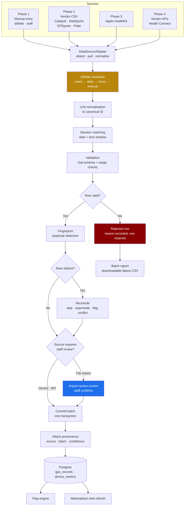
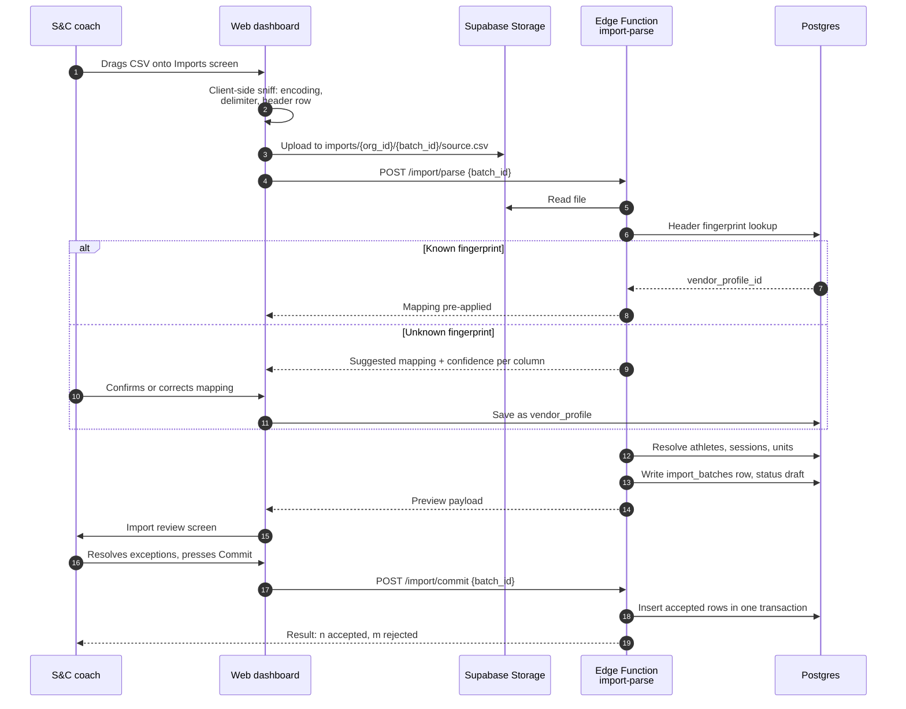
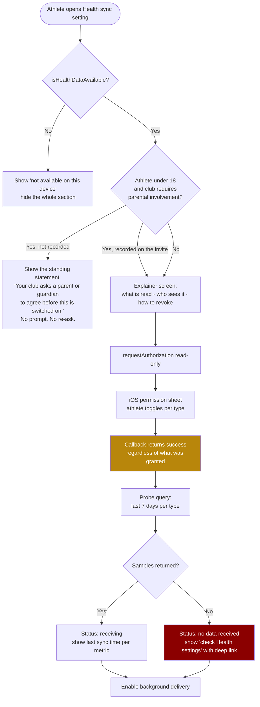

# 07 - Integrations

Everything that brings data into Fydr from outside the app, and everything that sends data
out of it. The phasing in `00-product-overview.md` is binding: this document specifies all
four phases, but only Phase 1 and Phase 2 are in scope for v1.

The governing constraint is `docs/00-product-overview.md` design principle 5: **data has
provenance**. Every row that arrives through an integration carries a `data_source`, a
timestamp, and enough detail to answer "where did this number come from" without a
database archaeology exercise.

---

## 1. Phasing

| Phase | Source | Mechanism | Tier | Status |
|---|---|---|---|---|
| 1 | Athlete self-report, staff entry | In-app forms | Club, Premium | v1 |
| 2 | GPS vendor exports: Catapult, StatSports, GPSports, Polar | CSV or XLSX upload, staff initiated | Premium | v1 |
| 3 | Apple HealthKit | Native iOS sync, athlete initiated | Premium | v1.1 |
| 4 | Catapult and StatSports APIs, Android Health Connect | Scheduled server-side pull | Premium | Deferred |

The two tiers are **`club` and `premium`** (`12-product-tiers.md`). Nothing here is gated on
any other name.

Phase 2 is the one that earns the Premium tier. It is also the only integration whose
success depends on a human being willing to do a weekly task, which is why most of this
document is about making that task take two minutes rather than twenty.

---

## 2. Ingestion pipeline

Every source, in every phase, goes through the same stages. Adding a source means writing
an adapter, not writing a pipeline.



**The review gate is only on file import.** Device and API sources commit automatically and
raise exceptions afterwards. A staff member is present at the moment of a CSV upload, so
that is the cheapest possible place to resolve ambiguity. Nobody is present when a
HealthKit background delivery fires at 04:00, so blocking on confirmation there would
simply stop the data arriving.

### Canonical units

Restated from `04-data-model.md` §1 because this is where unit bugs are actually
introduced. Conversion happens once, in the adapter, before validation.

| Quantity | Canonical unit | Column suffix |
|---|---|---|
| Distance | metres | `_m` |
| Speed | metres per second | `_ms` |
| Mass | kilograms | `_kg` |
| Duration | seconds | `_s` |
| Energy | kilocalories | `_kcal` |
| Heart rate | beats per minute | none, `resting_hr` |
| HRV | milliseconds | none, `hrv` |
| Time of day | `time` | none |
| Everything else | `timestamptz` in UTC | `_at` |

A vendor value that cannot be converted with certainty is not converted with a guess. It is
rejected with reason `unit_ambiguous` and surfaced to the person doing the import.

---

## 3. CSV and GPS import

### 3.1 Why CSV first and not the API

Every GPS vendor at this market tier exports CSV. Not every club has API access, and no
club below the elite tier will pay their vendor extra to get it. CSV import works on day
one for every customer Fydr is targeting. See §6 for what the API path actually costs.

### 3.2 Upload flow



Constraints:

- Maximum file size 25 MB, maximum 20,000 rows per file. A season export exceeding this is
  split by the uploader, with a clear message saying so.
- Accepted formats: `.csv`, `.txt` with any of comma, semicolon or tab delimiters, and
  `.xlsx` with a single sheet. XLSX is converted to rows server-side before parsing.
- Encoding is detected, not assumed. Vendor exports appear as UTF-8, UTF-8 with BOM, and
  Windows-1252. Windows-1252 is transcoded; the BOM is stripped. Getting this wrong turns
  `Ó Briain` into `Ã Briain` and breaks name matching silently, which is worse than failing.
- Decimal separator is a property of the vendor profile, not a guess per row. European
  exports use comma decimals with semicolon delimiters. `1,234` is either one thousand two
  hundred and thirty four or one point two three four, and the file does not tell you.
- The original file is retained in Storage for 90 days so an import can be re-run after a
  mapping correction.

### 3.3 Realistic vendor headers

These are representative, not authoritative. Vendor headers change between software
versions, which is exactly why the mapping is data rather than code.

**Catapult OpenField, activity export:**

```csv
Player Name,Position Name,Activity Name,Period Name,Period Number,Date,Start Time,Duration,Total Distance,Meterage Per Minute,Max Velocity,Velocity Band 5 Total Distance,Velocity Band 6 Total Distance,Acceleration B3 Efforts (Gen 2),Deceleration B3 Efforts (Gen 2),Total Player Load,Player Load Per Minute,Total IMA Events,Metabolic Power Average
SMITH, John,Back Row,Tue Pitch Session,Session,1,14/10/2026,10:32:00,1:28:14,6284.3,71.2,8.42,412.7,96.1,34,29,612.4,6.9,88,9.14
o'Neill  Padraig,Centre,Tue Pitch Session,Session,1,14/10/2026,10:32:00,1:28:14,7104.8,80.5,9.11,588.2,171.4,41,38,701.2,7.9,102,10.02
```

**StatSports Apex, Sonra session export:**

```csv
Player Display Name,Position,Squad Name,Session Title,Session Type,Date,Start Time,Duration,Total Distance (m),HSR Distance (m),Sprint Distance (m),Max Speed (m/s),Number of Accelerations,Number of Decelerations,Dynamic Stress Load,High Metabolic Load Distance (m),Distance Per Min (m/min)
J. Smith,BR,1st XV,Tuesday Field,Training,2026-10-14,10:32,88:14,6284.3,412.7,96.1,8.42,34,29,318.6,1204.9,71.2
P O'Neill,C,1st XV,Tuesday Field,Training,2026-10-14,10:32,88:14,7104.8,588.2,171.4,9.11,41,38,401.2,1488.3,80.5
```

Note what has already gone wrong across two files describing the same session: the name
format differs three ways, the date format differs, the duration format differs, and
Catapult's `Player Name` column contains a comma inside a quoted field which naive splitting
will destroy. All of this is normal.

### 3.4 Vendor profiles

`vendor_profiles` (defined in `04-data-model.md` §8) stores the mapping. A profile is
matched to an uploaded file by **header fingerprint**: the SHA-256 of the lowercased,
trimmed, sorted header row. Exact fingerprint match applies the profile silently. No match
triggers the mapping UI with per-column suggestions.

Mapping targets are either a `gps_records` column or one of the control targets below.

| Target | Meaning |
|---|---|
| `__athlete` | The column used for athlete resolution. Mirrors `vendor_profiles.athlete_match_column`. |
| `__record_date` | The date of the record. |
| `__start_time` | Local start time, used for session matching. |
| `__session_hint` | Free text session or activity name, used as a secondary session match signal. |
| `__period` | Period or split label. Rows where this is not the whole-session period are stored but excluded from daily totals. |
| `__device` | Maps to `gps_records.device_id`. |
| `__raw` | Kept, unmapped, inside `gps_records.raw`. |
| `__ignore` | Discarded. |

**Catapult profile:**

```json
{
  "vendor": "catapult",
  "version_hint": "OpenField Cloud activity export",
  "athlete_match_column": "Player Name",
  "delimiter": ",",
  "decimal_separator": ".",
  "date_format": "dd/MM/yyyy",
  "column_map": {
    "Player Name": "__athlete",
    "Date": "__record_date",
    "Start Time": "__start_time",
    "Activity Name": "__session_hint",
    "Period Name": "__period",
    "Duration": "duration_s",
    "Total Distance": "total_distance_m",
    "Velocity Band 5 Total Distance": "high_speed_distance_m",
    "Velocity Band 6 Total Distance": "sprint_distance_m",
    "Max Velocity": "max_speed_ms",
    "Acceleration B3 Efforts (Gen 2)": "accelerations",
    "Deceleration B3 Efforts (Gen 2)": "decelerations",
    "Total Player Load": "player_load",
    "Total IMA Events": "impacts",
    "Metabolic Power Average": "metabolic_power_avg",
    "Meterage Per Minute": "__raw",
    "Player Load Per Minute": "__raw",
    "Position Name": "__ignore",
    "Period Number": "__ignore"
  },
  "unit_map": {
    "duration_s": { "source_unit": "hh:mm:ss", "transform": "duration_string" },
    "total_distance_m": { "source_unit": "m", "transform": "identity" },
    "high_speed_distance_m": { "source_unit": "m", "transform": "identity" },
    "sprint_distance_m": { "source_unit": "m", "transform": "identity" },
    "max_speed_ms": { "source_unit": "m/s", "transform": "identity" }
  },
  "period_whole_session_values": ["Session", "Whole Session", "Full Session"]
}
```

**StatSports profile:**

```json
{
  "vendor": "statsports",
  "version_hint": "Sonra session export",
  "athlete_match_column": "Player Display Name",
  "delimiter": ",",
  "decimal_separator": ".",
  "date_format": "yyyy-MM-dd",
  "column_map": {
    "Player Display Name": "__athlete",
    "Date": "__record_date",
    "Start Time": "__start_time",
    "Session Title": "__session_hint",
    "Duration": "duration_s",
    "Total Distance (m)": "total_distance_m",
    "HSR Distance (m)": "high_speed_distance_m",
    "Sprint Distance (m)": "sprint_distance_m",
    "Max Speed (m/s)": "max_speed_ms",
    "Number of Accelerations": "accelerations",
    "Number of Decelerations": "decelerations",
    "Dynamic Stress Load": "player_load",
    "High Metabolic Load Distance (m)": "__raw",
    "Distance Per Min (m/min)": "__raw",
    "Position": "__ignore",
    "Squad Name": "__ignore",
    "Session Type": "__ignore"
  },
  "unit_map": {
    "duration_s": { "source_unit": "mm:ss", "transform": "duration_string" },
    "total_distance_m": { "source_unit": "m", "transform": "identity" },
    "max_speed_ms": { "source_unit": "m/s", "transform": "identity" }
  }
}
```

**`Dynamic Stress Load` mapped to `player_load` is a judgement call and it is documented as
one.** Catapult PlayerLoad and StatSports Dynamic Stress Load are both accumulated
accelerometry load, they are not the same computation, and they are not numerically
comparable. Fydr stores both in `player_load` because the column means "the vendor's
accelerometry load metric", and every chart that renders it carries the vendor label. Never
compare `player_load` across vendors, and never let a `squad_mean` threshold on
`player_load` span two vendors. This is enforced by a check in the flag engine, not by
convention.

### 3.5 Athlete name matching

The hardest part of the whole integration, and the one that will generate the most support
tickets if it is done lazily.

The three example names above are the same two athletes:

| Vendor value | Vendor | Squad record |
|---|---|---|
| `SMITH, John` | Catapult | John Smith |
| `J. Smith` | StatSports | John Smith |
| `o'Neill  Padraig` | Catapult | Pádraig O'Neill |
| `P O'Neill` | StatSports | Pádraig O'Neill |

**Never auto-create an athlete from an import.** A misspelled name creating a phantom squad
member, silently accumulating load data nobody looks at, is the single worst failure mode
available here.

#### Normalisation

Applied to both the vendor value and every squad name before comparison:

1. Unicode NFKD decomposition, strip combining marks. `Pádraig` becomes `Padraig`.
2. Lowercase.
3. If the value contains exactly one comma, treat it as `surname, forenames` and swap.
4. Strip anything in brackets, and strip a trailing or leading standalone integer, which is
   usually a squad number or a device number.
5. Replace apostrophes, hyphens and full stops with a space. `o'neill` and `oneill` and
   `o neill` converge.
6. Collapse whitespace, trim.
7. Store the result as `alias_normalised`.

#### Match ladder

Executed in order. The first stage that produces a result wins.

| Stage | Method | Outcome |
|---|---|---|
| 1 | Exact match on `athlete_import_aliases.alias_normalised` for this org and vendor | Auto-matched, confidence 1.0 |
| 2 | Exact match on normalised `first_name last_name` | Auto-matched, confidence 1.0 |
| 3 | Surname exact and forename initial matches | Suggested, confidence 0.9 |
| 4 | Trigram similarity via `pg_trgm` on full normalised name, plus Levenshtein on surname | Suggested, confidence = score |
| 5 | Nothing above 0.60 | Unmatched, requires manual selection |

The query for stage 4, with `pg_trgm` and `fuzzystrmatch` enabled:

```sql
select a.id,
       a.first_name,
       a.last_name,
       greatest(
         similarity(f_normalise_name(a.first_name || ' ' || a.last_name), $2),
         similarity(f_normalise_name(a.last_name || ' ' || a.first_name), $2)
       ) as trigram_score,
       levenshtein(f_normalise_name(a.last_name), split_part($2, ' ', -1)) as surname_distance
from athletes a
where a.org_id = $1
  and a.deleted_at is null
  and a.status <> 'left_club'
order by trigram_score desc, surname_distance asc
limit 5;
```

Scoring combines the two, because trigram similarity alone rewards common forenames far too
much:

```
score = 0.65 * trigram_score
      + 0.35 * max(0, 1 - surname_distance / max(4, length(surname)))
```

#### Confirmation and the alias table

**A fuzzy match is never committed without a human pressing a button.** The review screen
shows every athlete row with its resolution state. Suggested matches above 0.60 are
pre-selected but visibly marked as suggestions. The commit button is disabled while any row
sits in `unmatched`.

Once confirmed, the pairing is persisted. Next week's file from the same vendor resolves at
stage 1 with zero interaction, which is the entire point.

```sql
create type alias_match_method as enum
  ('exact','alias','initial','fuzzy','manual','bulk_confirmed');

create table athlete_import_aliases (
  id               uuid primary key default gen_random_uuid(),
  org_id           uuid not null references organisations(id),
  athlete_id       uuid not null references athletes(id) on delete cascade,
  vendor           text,                    -- null = applies to any vendor
  alias            text not null,           -- the raw vendor string, kept verbatim
  alias_normalised text not null,
  match_method     alias_match_method not null,
  match_score      numeric(4,3),
  confirmed_by     uuid references users(id),
  confirmed_at     timestamptz not null default now(),
  created_at       timestamptz not null default now(),
  deleted_at       timestamptz,
  unique (org_id, vendor, alias_normalised)
);

create index on athlete_import_aliases (org_id, alias_normalised)
  where deleted_at is null;
```

Aliases are manageable from Settings, because the first wrong confirmation would otherwise
be permanent. Deleting an alias does not touch already-imported rows; it only changes future
resolution. If an alias is deleted, the rows it produced keep their `athlete_id` and the
audit log records who broke the link and when.

**Transfers and departures**: a departing athlete's aliases stay. A new athlete arriving
with a similar name is the case that produces a genuinely dangerous mis-attribution, so
stage 4 refuses to suggest when two squad members score within 0.05 of each other. It
escalates to manual selection with both candidates shown side by side.

### 3.6 Unit detection and normalisation

Unit handling is profile-driven with a detection pass to catch a vendor changing its export
settings between weeks.

**Detection heuristics**, run on the parsed column before applying the profile:

| Target | Test | Inference |
|---|---|---|
| `max_speed_ms` | Median value between 6 and 11 | metres per second |
| `max_speed_ms` | Median value between 22 and 40 | kilometres per hour, factor 0.277778 |
| `max_speed_ms` | Median value between 14 and 25 | miles per hour, factor 0.44704 |
| `total_distance_m` | Median value between 2000 and 12000 | metres |
| `total_distance_m` | Median value between 2 and 12 | kilometres, factor 1000 |
| `duration_s` | Matches `^\d+:\d{2}(:\d{2})?$` | `hh:mm:ss` or `mm:ss`, disambiguated by magnitude |
| `duration_s` | Median value between 30 and 180 | minutes, factor 60 |
| `body_mass_kg` | Median value between 140 and 280 | pounds, factor 0.453592 |

Speed bands 22 to 25 km/h and 14 to 25 mph overlap. When two inferences are possible the
row set is **not** converted. The import stops with a mapping question: "Max Velocity looks
like km/h or mph. Which is it?" One question, once, saved to the profile. Silently guessing
here produces a max speed error of 60% and a sprint-distance threshold that never fires.

If the detected unit contradicts the saved profile, the import halts before commit and asks.
It does not override the profile automatically, because the more likely explanation is that
the coach exported the wrong thing.

`transform` values supported by the adapter:

| Transform | Behaviour |
|---|---|
| `identity` | Parse as numeric, no conversion |
| `scale` | Multiply by `factor` |
| `duration_string` | Parse `hh:mm:ss`, `mm:ss`, or `h:mm:ss.sss` to seconds |
| `percentage` | Divide by 100 |
| `boolean_flag` | Map a vendor truthy set to boolean |
| `reject` | Column present but explicitly unusable |

### 3.7 Session matching

A GPS row is far more useful attached to a `sessions` row, because that is what connects it
to RPE, to `md_offset`, and to the whole MD-n analysis in `03-flows.md` §8.

Algorithm, per row:

1. Build the candidate set: sessions for this org where `starts_at::date` equals
   `__record_date` in the org timezone, `session_type` in `training`, `match`, `testing`,
   `recovery`, and `deleted_at is null`.
2. If `__start_time` is present, keep candidates whose `starts_at` is within **90 minutes**
   of the row start time. GPS units are switched on before the warm-up and the vendor's
   recorded start is routinely earlier than the scheduled session start.
3. If more than one candidate remains, prefer the session where the athlete appears in
   `session_participants` directly or through a group.
4. If more than one still remains, score `__session_hint` against `sessions.title` with
   trigram similarity and take the best if it exceeds 0.4.
5. If exactly one candidate remains, attach it.
6. If zero candidates remain, the row is `session_unmatched`. It is **still importable**
   with `session_id` null. The review screen offers: attach to an existing session on a
   nearby date, create a session from the row, or import unattached.
7. If the tie is unbroken, the review screen asks. It never picks arbitrarily.

Rows with `__period` outside `period_whole_session_values` are stored with the period label
in `raw` and marked so daily aggregates do not double-count. A file containing both a
whole-session row and four period rows for the same athlete would otherwise report five
times the true distance.

### 3.8 Validation and range checks

Two tiers. **Hard reject** for physically impossible values, **warn** for implausible but
possible ones. A warned row imports; a rejected row does not.

| Field | Hard reject outside | Warn outside | Notes |
|---|---|---|---|
| `duration_s` | 0 to 18000 | 300 to 10800 | Under 5 min is usually a period fragment |
| `total_distance_m` | 0 to 30000 | 500 to 15000 | |
| `high_speed_distance_m` | 0 to `total_distance_m` | 0 to 3000 | Cross-field check |
| `sprint_distance_m` | 0 to `high_speed_distance_m` | 0 to 1200 | Cross-field check |
| `max_speed_ms` | 0 to 12.5 | 4 to 11 | 12.5 m/s is 45 km/h, faster than the world 100 m record average |
| `accelerations` | 0 to 1000 | 0 to 300 | |
| `decelerations` | 0 to 1000 | 0 to 300 | |
| `player_load` | 0 to 5000 | 50 to 1500 | Vendor-dependent scale, wide band deliberately |
| `impacts` | 0 to 5000 | 0 to 400 | |
| `metabolic_power_avg` | 0 to 40 | 3 to 20 | W/kg |
| `__record_date` | Future date, or before season start minus 30 days | More than 21 days old | Stale file re-upload is common |

The cross-field checks matter more than the absolute ones. A file where sprint distance
exceeds total distance means the columns are mapped wrong, and catching that at row 1 saves
the coach from discovering it in a chart in March.

Zod schema for the canonical GPS record, shared with the client:

```ts
export const GpsRecordInput = z
  .object({
    athleteId: z.string().uuid(),
    sessionId: z.string().uuid().nullable(),
    recordDate: z.string().date(),
    vendor: z.enum(['catapult', 'statsports', 'gpsports', 'polar', 'other']),
    deviceId: z.string().max(64).nullable(),
    durationS: z.number().int().min(0).max(18_000).nullable(),
    totalDistanceM: z.number().min(0).max(30_000).nullable(),
    highSpeedDistanceM: z.number().min(0).max(30_000).nullable(),
    sprintDistanceM: z.number().min(0).max(30_000).nullable(),
    maxSpeedMs: z.number().min(0).max(12.5).nullable(),
    accelerations: z.number().int().min(0).max(1_000).nullable(),
    decelerations: z.number().int().min(0).max(1_000).nullable(),
    playerLoad: z.number().min(0).max(5_000).nullable(),
    impacts: z.number().int().min(0).max(5_000).nullable(),
    metabolicPowerAvg: z.number().min(0).max(40).nullable(),
    raw: z.record(z.unknown()).default({}),
  })
  .superRefine((v, ctx) => {
    if (v.totalDistanceM != null && v.highSpeedDistanceM != null &&
        v.highSpeedDistanceM > v.totalDistanceM) {
      ctx.addIssue({
        code: 'custom',
        path: ['highSpeedDistanceM'],
        message: 'High speed distance exceeds total distance. Check the column mapping.',
      });
    }
    if (v.highSpeedDistanceM != null && v.sprintDistanceM != null &&
        v.sprintDistanceM > v.highSpeedDistanceM) {
      ctx.addIssue({
        code: 'custom',
        path: ['sprintDistanceM'],
        message: 'Sprint distance exceeds high speed distance. Check the column mapping.',
      });
    }
  });
```

### 3.9 Partial failure

**Rule: accept the good rows, report the bad ones, never silently drop anything.**

An import of 38 rows where 3 fail imports 35 rows and tells the coach exactly which 3
failed and why. It does not fail the whole file, because that means one typo costs a coach
their entire session's data and they stop using the feature. It does not import 35 rows and
say "done", because then three athletes are quietly missing from the load chart.

`import_batches.errors` shape:

```json
{
  "schema_version": 1,
  "rejected": [
    {
      "row": 14,
      "reason": "athlete_unmatched",
      "field": "Player Name",
      "value": "T. Fitzgeral",
      "message": "No squad member matched. Closest: Tom Fitzgerald, score 0.83.",
      "candidates": [
        { "athlete_id": "9a1e...", "name": "Tom Fitzgerald", "score": 0.83 }
      ]
    },
    {
      "row": 22,
      "reason": "range_hard",
      "field": "Max Velocity",
      "value": "84.2",
      "message": "Max speed 84.2 m/s is outside the accepted range 0 to 12.5. Column may be in the wrong unit."
    },
    {
      "row": 31,
      "reason": "cross_field",
      "field": "Sprint Distance (m)",
      "value": "1840",
      "message": "Sprint distance exceeds high speed distance 912."
    }
  ],
  "warnings": [
    {
      "row": 7,
      "reason": "range_soft",
      "field": "Total Distance (m)",
      "value": "16420",
      "message": "Unusually high for a training session. Imported."
    },
    {
      "row": 9,
      "reason": "session_unmatched",
      "message": "No session found on 14/10/2026 within 90 minutes of 10:32. Imported unattached."
    }
  ]
}
```

After commit the coach gets a result panel and a downloadable `failures.csv` containing the
original rows plus a `fydr_error` column. They fix it in Excel and re-upload, and duplicate
detection stops the successful rows importing twice.

### 3.10 Duplicate detection

Two mechanisms, because they catch different mistakes.

**Row fingerprint**, catching the same file uploaded twice:

```sql
alter table gps_records
  add column row_hash text,
  add column external_id text,          -- vendor primary key, when the source provides one
  add column external_source text;      -- 'catapult_openfield', 'statsports_sonra'...

create unique index gps_records_dedupe
  on gps_records (org_id, row_hash)
  where deleted_at is null;
```

`row_hash` is `encode(sha256(...), 'hex')` over a stable concatenation of
`athlete_id`, `record_date`, `vendor`, `coalesce(device_id,'')`, the period label, and
`duration_s`. Deliberately **not** over the metric values: a vendor re-export with a
corrected total distance for the same athlete and period is a revision, not a new record.

**Reconcile decision** when the fingerprint collides:

| Situation | Decision |
|---|---|
| Identical values | `skip`. Counted as `duplicate_skipped`, not as an error. |
| Values differ, new file is newer | `supersede`. The old row is soft-deleted, the new row references it. Shown in the review screen as "3 records will be updated". |
| Values differ, same vendor, no timestamp ordering available | `conflict`. Surfaced in the review screen, staff choose. |
| Same athlete and date from a **different** vendor | Both retained. This is a club running two systems, which happens, and the analytics layer must not silently sum them. |

`external_id` is populated by the Phase 4 API adapters and left null by CSV import. It
exists now so that when a club later switches from CSV to API, records already imported can
be reconciled against the vendor's own identifiers instead of duplicating a season.

### 3.11 The import review screen

The screen that decides whether Phase 2 works. Detailed in `docs/screens/imports.md` when
that is written; the behavioural contract is here.

Header: filename, detected vendor, row count, and four counters: **ready**, **needs
attention**, **will be updated**, **rejected**.

Three tabs, defaulting to whichever has exceptions:

1. **Needs attention**, opened by default when non-empty. One row per problem, grouped by
   problem type so a coach fixes all seven unmatched names in one pass rather than
   scrolling. Each unmatched name shows a searchable athlete picker with the top suggestion
   pre-selected and the score visible.
2. **Ready**, a preview table of what will be written, with converted values shown in
   canonical units and the original vendor value on hover. A coach who sees `8.42 m/s` next
   to `Max Velocity 8.42` can confirm the unit inference was right in half a second.
3. **Rejected**, with the reason and the raw row.

Rules:

- **Commit is disabled while any row is `athlete_unmatched`.** Session-unmatched rows do not
  block, because importing unattached is a legitimate outcome.
- A "match all remaining by suggestion" action exists and requires a typed confirmation,
  because it is the one action that can mis-attribute a whole squad's data at once. It
  records `bulk_confirmed` as the alias match method so bad bulk confirmations are traceable.
- Commit is a single transaction. A failure mid-commit leaves the batch in `draft`, not half
  written.
- The batch stays visible in the Imports list with its counters, and can be **reverted**
  within 24 hours. Revert soft-deletes every row created by that `import_batch_id` and is
  audited. Materialised views refresh after both commit and revert.

---

## 4. Apple HealthKit

Phase 3, Premium tier, iOS only.

### 4.1 What is read

Read-only. **Fydr never writes to HealthKit**, so `NSHealthUpdateUsageDescription` is not
needed and no share permissions are requested. This is worth stating in the consent copy:
athletes are markedly more willing to grant read access to an app that cannot write to their
health record.

| HealthKit identifier | Unit requested | Maps to | Watch required |
|---|---|---|---|
| `HKCategoryTypeIdentifierSleepAnalysis` | category values | `device_metrics.sleep_duration`, `sleep_stages` | Yes, in practice |
| `HKQuantityTypeIdentifierRestingHeartRate` | `HKUnit.count() / .minute()` | `device_metrics.resting_hr` | Yes |
| `HKQuantityTypeIdentifierHeartRateVariabilitySDNN` | `HKUnit.secondUnit(with: .milli)` | `device_metrics.hrv` | Yes |
| `HKQuantityTypeIdentifierStepCount` | `HKUnit.count()` | `device_metrics.steps` | No |
| `HKQuantityTypeIdentifierActiveEnergyBurned` | `HKUnit.kilocalorie()` | `device_metrics.active_energy` | No, but poor without |
| `HKQuantityTypeIdentifierBodyMass` | `HKUnit.gramUnit(with: .kilo)` | `device_metrics.body_mass` | No, needs a connected scale |
| `HKObjectType.workoutType()` | n/a | `device_metrics.workout` | No |

Deliberately **not** read in v1.1, and each for a reason:

- `HKQuantityTypeIdentifierHeartRate`: sample-level heart rate is thousands of samples per
  day per athlete. The aggregate value is already available through resting heart rate and
  workout summaries. Revisit only if a specific analysis needs it.
- `HKQuantityTypeIdentifierRespiratoryRate` and `HKQuantityTypeIdentifierOxygenSaturation`:
  clinically loaded, weak evidence base for training decisions, and they widen the consent
  conversation considerably for very little product value.
- `HKQuantityTypeIdentifierVO2Max`: an Apple estimate, not a test result. Mixing it with
  `test_results` from a real protocol produces a chart that lies. If it is added later it
  goes in `device_metrics` and never in `test_results`.
- Menstrual cycle categories: **out of scope, decided.** O-12 is closed. Fydr does not read
  them, does not store them, and does not infer them from anything else it reads. The
  HealthKit read set above is the whole set, and adding a cycle type to it is a product
  decision at ADR level, not an adapter change. `CLAUDE.md` §2 rule 9.

**Schema additions required** in `04-data-model.md` §8: add `body_mass` to the
`device_metric_type` enum. Device-measured body mass lands in `device_metrics`, not in
`body_composition`, which stays the staff-measured record. The athlete profile chart unions
both and labels the provenance of every point.

Requested types in the client:

```ts
export const HEALTHKIT_READ_TYPES = [
  'HKCategoryTypeIdentifierSleepAnalysis',
  'HKQuantityTypeIdentifierRestingHeartRate',
  'HKQuantityTypeIdentifierHeartRateVariabilitySDNN',
  'HKQuantityTypeIdentifierStepCount',
  'HKQuantityTypeIdentifierActiveEnergyBurned',
  'HKQuantityTypeIdentifierBodyMass',
  'HKWorkoutTypeIdentifier',
] as const;
```

### 4.2 Native requirements

HealthKit is a native framework. It requires a custom development client and an EAS build.
**It does not work in Expo Go**, and the athlete app cannot be a pure managed-workflow build
once Phase 3 lands. This is a build-pipeline consequence to plan for, not a runtime detail.

- Capability: HealthKit, enabled on the App ID.
- Entitlements: `com.apple.developer.healthkit`, and
  `com.apple.developer.healthkit.background-delivery` for background updates.
- Info.plist: `NSHealthShareUsageDescription`, written in plain English naming the club.
  "Fydr reads your sleep, resting heart rate, heart rate variability, steps and workouts so
  your S&C staff can see how you are recovering." App Review rejects vague strings here.
- Added through an Expo config plugin so the native change is reproducible and reviewable.
- HealthKit is unavailable on iPad in the relevant configurations, so
  `HKHealthStore.isHealthDataAvailable()` is checked before any UI referencing it renders.

### 4.3 Permission flow, and the part iOS will not tell you



**iOS does not tell you whether a read permission was denied.** This is deliberate on
Apple's part: revealing a denial leaks the fact that a health data type exists for that
user. `HKHealthStore.authorizationStatus(for:)` is meaningful only for **share** types. For
read types it returns `.sharingAuthorized` or `.sharingDenied` in a way that says nothing
about read access. `getRequestStatusForAuthorization(toShare:read:)` returns
`.shouldRequest` or `.unnecessary`, which tells you whether the prompt would appear, not
whether anything was granted.

The only usable signal is data. Consequences:

1. Never show "connected" after a successful `requestAuthorization` callback. Show
   "checking", run a probe query over the last 7 days per type, then show a per-metric
   status.
2. A metric with zero samples is **`unknown_no_data`**, never "denied". The athlete may have
   denied it, or may simply not own an Apple Watch. The UI must not accuse them.
3. The status screen lists each metric with its last received sample date, which is honest
   and self-explanatory in a way that a single connected toggle is not.
4. A "Fix this" action opens Settings via `x-apple-health://` with an instruction to check
   Sources, Fydr. There is no API to re-prompt: **iOS shows the permission sheet once.** A
   second `requestAuthorization` call for the same types does nothing visible.
5. Staff-facing screens never say "athlete X denied HealthKit". They say "no device data".
   The distinction matters because the first is a claim about an athlete's choices, which
   Fydr cannot substantiate, and which will start an unpleasant conversation.

#### Minors: the gate that sits before the prompt

Under-18 athletes are in scope (`09-security-and-compliance.md` §4), so standard 14 of the
Children's Code, connected toys and devices, applies to HealthKit, to Health Connect, and to
any vendor wearable feeding them. The rules below are additional to everything above, not
instead of it.

1. **The parental involvement gate runs before `requestAuthorization`, not after.** Where the
   club has set `children.parental_involvement_required` and the invite carries no record of
   it being satisfied, the athlete never reaches the iOS sheet. This ordering is not cosmetic:
   **iOS shows the permission sheet once**, so a prompt fired before the club's condition is
   met burns the only prompt the athlete will ever get and leaves them with no route back
   except the Settings app.
2. **The hold state is a plain statement, not an error and not a call to action.** "Your club
   asks a parent or guardian to agree before this is switched on." No "ask them now" button,
   no reminder, no badge. Chasing a child to obtain a parent's agreement to share more data is
   a standard 13 nudge with extra steps.
3. **Parental involvement is a club process recorded against the invite, not a login.** There
   is no parent role in v1 (`09-security-and-compliance.md` §4.7). Fydr reads a flag; it does
   not run the conversation, and it does not verify the parent.
4. **A decline is final.** If the athlete reaches the explainer and declines, or grants nothing
   at the iOS sheet, nothing re-asks. No interstitial, no banner, no settings-row badge. This
   is the same rule as `08-notifications.md` §5.4 and it applies to the integration surface.
5. **Device sync is never a precondition for anything**, for any athlete, and for a minor that
   is enforced rather than assumed: no screen may be blocked, degraded with a prompt to
   connect, or marked incomplete because a minor has not connected a device.
6. **The connection is visible and reversible in one place.** The Me tab shows what is read,
   the last sample received per metric, and a disconnect that stops future collection
   immediately. Disconnecting is one tap and does not ask why.
7. **Device data is never presented as authoritative about a child's health.** It is
   `device_metrics` with provenance, next to a self-report, exactly as §4.6 already specifies.
   The dedupe rules do not change for minors; the framing does.

The explainer copy for a minor is the adult copy in child-facing wording, not a second,
softer message. Where the club has parental involvement set, the explainer states it, per
`09-security-and-compliance.md` §4.6.

### 4.4 Background delivery

```swift
healthStore.enableBackgroundDelivery(
  for: HKCategoryType(.sleepAnalysis),
  frequency: .hourly
) { success, error in ... }
```

- `HKUpdateFrequency` options are `.immediate`, `.hourly`, `.daily`, `.weekly`. `.immediate`
  is honoured only for a small set of types and is not honoured for sleep. Requesting
  `.hourly` for everything is the honest setting.
- An `HKObserverQuery` per type must be registered **at every app launch**, inside
  `application(_:didFinishLaunchingWithOptions:)`, not on a screen. iOS relaunches the app
  in the background to deliver an update, and if no observer is registered by the time the
  launch completes the update is lost.
- The observer's completion handler must be called within roughly 30 seconds. Exceed it
  repeatedly and iOS throttles or stops delivery for the app. The handler therefore runs the
  anchored query, writes results to the local SQLite queue, calls the completion handler,
  and lets the normal sync queue from `03-flows.md` §10 push to Supabase. It does **not**
  await a network round trip inside the handler.
- Background delivery is best-effort. Devices deliver on their own schedule, and a device
  that has been off the network for two days delivers a burst. The sync must be idempotent,
  which it is via the unique constraint in §4.5.
- A foreground sync also runs on every app open, because background delivery cannot be
  relied on for a coach asking "why is yesterday missing".

### 4.5 Anchored object queries

Incremental sync uses `HKAnchoredObjectQuery`, one anchor per type, never a date-bounded
query. Date windows re-fetch the same samples forever and miss retroactive edits.

```ts
type HealthAnchorState = {
  [K in HealthKitReadType]?: {
    anchor: string;        // base64 NSKeyedArchiver representation of HKQueryAnchor
    lastRunAt: string;     // ISO 8601
    lastSampleAt: string | null;
  };
};
```

- Anchors are persisted in the app's local store, keyed by athlete id and type. They are
  device-local state, not server state: reinstalling the app resets the anchor, which
  triggers a bounded backfill rather than a full history pull.
- First sync backfills **60 days**, enough to establish the personal rolling baselines that
  `04-data-model.md` §10 depends on, and bounded so the first sync does not take minutes.
  See O-42.
- Paged with `limit: 1000`, looping until the returned sample array is empty.
- `deletedObjects` from the query result must be handled. A user deleting a sleep sample in
  the Health app has to remove the corresponding `device_metrics` row, or Fydr shows data
  the athlete has explicitly deleted. Deletion is a soft delete with `deleted_at`, per
  `CLAUDE.md` rule 4.
- For **cumulative** types, `HKStatisticsQuery` and `HKStatisticsCollectionQuery` with
  `.cumulativeSum` are used rather than summing raw samples. HealthKit holds overlapping
  step and energy samples from the iPhone and the Watch simultaneously, and summing samples
  naively double counts. The statistics API deduplicates across sources; hand-rolled summing
  does not.
- For **discrete** types like resting heart rate, prefer samples whose
  `HKDevice.model` is `Watch`. Where both a Watch and a third-party source have written the
  same day, the Watch wins and the alternative is retained in `device_metrics.raw`.

Idempotency is guaranteed server-side by the existing constraint:

```sql
unique (athlete_id, metric_date, metric_type, period_start)
```

Upserts use `on conflict do update` where the incoming sample has a later HealthKit
modification date, so a corrected sample overwrites and a replayed sample does not.

### 4.6 Deduplication against self-reported wellness

The rule from `03-flows.md` §7, made specific. Both rows are always retained. The resolution
decides which one is **displayed by default** and which one **feeds analytics**.

| Metric | Device | Self-report | Winner | Reasoning |
|---|---|---|---|---|
| Sleep duration | `sleep_duration` | `wellness_entries.sleep_hours` | **Device** | Athletes round to the nearest hour and systematically over-report |
| Sleep quality | `sleep_stages` | `wellness_entries.sleep_quality` | **Self-report** | Quality is subjective by definition. Deep-sleep minutes are not a measurement of how rested someone feels |
| Resting heart rate | `resting_hr` | `wellness_entries.resting_hr` | **Device** | Objective, and manual morning HR is taken inconsistently |
| HRV | `hrv` | none | Device | No self-report equivalent |
| Body mass | `body_mass` | `wellness_entries.body_mass_kg` | **Device**, if the sample is before 10:00 local | A connected scale is more reliable than a typed number, but an afternoon weigh-in is not a morning weight |
| Soreness, fatigue, stress, mood | none | wellness | **Self-report** | No device measures these. Any product claiming otherwise is selling something |
| Training load | `workout` | `training_entries.rpe` | **Self-report** | Session RPE is the validated internal load measure. A Watch workout calorie figure is not a substitute |

Implementation: a `resolved_metrics` view, not a mutation. Nothing is overwritten.

```sql
create view v_resolved_daily_metrics as
select
  a.id as athlete_id,
  d.metric_date,
  coalesce(dm_sleep.value, w.sleep_hours)                as sleep_hours,
  case when dm_sleep.value is not null
       then 'device_sync'::data_source else 'self_report'::data_source
  end                                                    as sleep_hours_source,
  w.sleep_quality,                                       -- always self-report
  'self_report'::data_source                             as sleep_quality_source,
  coalesce(dm_rhr.value, w.resting_hr)                   as resting_hr...
from ...;
```

Every chart that renders a resolved metric shows the source. A coach reading a sleep trend
where three nights came from a Watch and four from a typed number needs to know that, and
the mixed series must be visually distinguishable, not silently pooled.

**Disagreement is a signal, not a problem.** Where device sleep and self-reported sleep
differ by more than 90 minutes for the same night, that is worth surfacing on the athlete
profile. It usually means either the Watch was not worn or the athlete is not answering
honestly, and both are useful things for an S&C coach to know.

### 4.7 Timezone handling and sleep across midnight

The hardest correctness problem in HealthKit ingestion, and the one that produces the
"everyone slept zero hours on the night the clocks changed" bug.

Rules:

1. `period_start` and `period_end` are stored as `timestamptz` in UTC. No exceptions, per
   `CLAUDE.md` rule 5.
2. `metric_date` for a sleep record is the date the athlete **woke up**, computed in the
   athlete's local timezone at the time of the sample. A sleep period from 23:40 on the 13th
   to 07:10 on the 14th belongs to the 14th, because that is the morning the wellness entry
   is submitted and the day the load decision is made.
3. The local timezone comes from `HKMetadataKeyTimeZone` on the sample when present, falling
   back to the device timezone at sync time, falling back to `organisations.timezone`. Squad
   travel to a different timezone is exactly when this matters and exactly when the org
   timezone is wrong.
4. The attribution window is **18:00 local on day D-1 to 12:00 local on day D**. A main
   sleep period whose end falls in that window is attributed to day D.
5. Multiple sleep periods in one window are merged into one `sleep_duration` value when the
   gap between them is under 60 minutes, which is normal for a night with brief wakes.
6. A period under 90 minutes separated from the main sleep by more than 2 hours is a **nap**.
   It is stored as its own row with `raw.sleep_kind = 'nap'` and excluded from
   `sleep_duration`. A squad that naps before an evening fixture would otherwise appear to
   have slept 11 hours.
7. Sleep duration counts `AsleepCore`, `AsleepDeep`, `AsleepREM` and `AsleepUnspecified`. It
   does **not** count `InBed`, and it does not count `Awake`. Older watchOS versions and
   third-party apps write only `InBed`, so where a night contains `InBed` and nothing else,
   the value is stored with `raw.sleep_basis = 'in_bed'` and marked lower confidence rather
   than discarded. In-bed time overstates sleep by roughly 30 to 60 minutes and must not be
   pooled with asleep time in a baseline.
8. Daylight saving: because attribution is by local wake date and durations are computed
   from UTC instants, the clock change produces a genuinely 23 or 25 hour day and a
   correctly measured sleep duration. Do not compute duration by subtracting local times.

### 4.8 The athlete with no Apple Watch

The common case, not the edge case. An iPhone without a Watch provides:

| Metric | Available on iPhone alone |
|---|---|
| Step count | Yes, reasonably accurate when the phone is carried |
| Active energy | Technically yes, poor quality, effectively noise |
| Workouts | Only if manually logged or written by a third-party app |
| Body mass | Only with a connected smart scale |
| Sleep | Only manually entered, or from a third-party sleep app or ring |
| Resting heart rate | No |
| HRV | No |

Product consequences, all of them binding:

1. **No feature may require device data.** Wellness, RPE and gym are the spine, with the
   weekly nutrition check-in alongside them. HealthKit is a supplement that makes some of them
   more accurate.
2. **No default threshold may be defined on HRV or resting heart rate.** A default threshold
   that only fires for Watch owners produces a flag list that silently tracks who can afford
   a Watch. Those thresholds exist and can be enabled per organisation, and they are off by
   default.
3. The athlete's Health sync screen states plainly which metrics need a Watch, so an athlete
   without one does not conclude the app is broken.
4. Third-party sources that write into HealthKit, Oura, Whoop, Garmin and Polar among them,
   are read transparently. Fydr reads the HealthKit store, not the vendor. `source_detail`
   records the writing source so a coach can see that an athlete's HRV comes from an Oura
   ring rather than a Watch, and that HRV values from different devices are not
   interchangeable.

### 4.9 HealthKit does not work on the web

Stated explicitly because it changes the architecture, not just a feature.

HealthKit is an iOS framework with no web equivalent, no JavaScript API, and no server-side
API. There is no way for the Next.js dashboard to read from it.

- Device data reaches the web dashboard only after the athlete's phone has synced it to
  Postgres. The dashboard reads `device_metrics`, never a device.
- An athlete who uninstalls the app stops producing device data immediately. Historic rows
  remain.
- Latency between a Watch recording a value and a coach seeing it is the sum of Apple's
  background delivery schedule and the athlete's next app open. Design for hours, not
  minutes. Do not build a staff feature that assumes this morning's HRV is present at 08:00.
- The staff dashboard shows a per-athlete "last device sync" timestamp, because the first
  question a coach asks about a gap is whether the athlete or the system is at fault.

---

## 5. Android and Health Connect

**Health Connect is the Android equivalent and it is Phase 4. It is not in v1.**

Health Connect, `androidx.health.connect`, is the platform API on Android 14 and later and
an installable APK on Android 9 to 13. The equivalent record types:

| Fydr metric | Health Connect record | Notes |
|---|---|---|
| `sleep_duration`, `sleep_stages` | `SleepSessionRecord` | Stages available where the wearable writes them |
| `resting_hr` | `RestingHeartRateRecord` | |
| `hrv` | `HeartRateVariabilityRmssdRecord` | **RMSSD, not SDNN** |
| `steps` | `StepsRecord` | |
| `active_energy` | `ActiveCaloriesBurnedRecord` | |
| `workout` | `ExerciseSessionRecord` | |
| `body_mass` | `WeightRecord` | |

**The minor rules in §4.3 apply to Health Connect in full when it lands.** Android reports
granted permissions accurately, which removes the probe-query awkwardness but not the gate: the
parental involvement check still runs before the permission request, a decline is still final,
and Health Connect is still a standard 14 connected device. The only difference is that the
Android permission sheet can be shown again, which makes rule 4 a product rule rather than a
platform constraint. It is not weaker for being one.

Permissions are declared as `android.permission.health.READ_SLEEP`,
`READ_RESTING_HEART_RATE`, `READ_HEART_RATE_VARIABILITY`, `READ_STEPS`,
`READ_ACTIVE_CALORIES_BURNED`, `READ_EXERCISE`, `READ_WEIGHT`. Unlike iOS, Android **does**
report granted permissions accurately, and Google Play requires a health data declaration
and review before an app requesting them can be published.

### What omitting it actually costs

This needs stating without euphemism, because it is a real analytical problem rather than a
missing feature.

Fydr's target market is semi-professional squad sport in the UK and Ireland. A realistic
Android share of such a squad is **40% to 55%**. Deferring Health Connect therefore means:

1. **Device metrics cover roughly half the squad, and the half is not random.** Handset
   choice correlates with income and age. In a squad with an academy cohort and a senior
   cohort, the split is systematic.
2. **Any squad-level statistic computed on device metrics is biased**, and the bias is not
   correctable by increasing sample size, because the missingness is not random. A "squad
   mean HRV" over the iPhone owners is a mean over a self-selected subgroup. Presenting it
   as a squad figure is wrong, and it will be used to make training decisions about athletes
   who are not in it.
3. **`squad_mean` thresholds are the specific danger.** A threshold with
   `baseline_type = 'squad_mean'` on a device-sourced metric compares an Android athlete
   against an iPhone-owning baseline, or excludes them entirely and leaves them unmonitored.
   Both are defects.

Mitigations, binding from v1.1 when HealthKit ships and not deferred with Health Connect:

- Every chart, export and analytics output using a device metric carries the **coverage
  figure**: "18 of 34 athletes, 53%". The `03-flows.md` §9 insufficient-data guard is
  extended to cover coverage, not only n.
- `baseline_type = 'squad_mean'` is **blocked** for metrics in the device domain until
  coverage exceeds a configurable floor, placeholder 80%. See O-45.
- Device metrics default to **within-athlete** analysis only: an athlete against their own
  rolling baseline, which is unaffected by who else in the squad owns a Watch.
- The admin squad screen shows device coverage as a first-class number so a club can see
  what they are and are not getting before they draw conclusions from it.

RMSSD versus SDNN is a second, separate problem. They are different HRV computations, they
have different magnitudes, and they cannot share a column or a baseline. When Health Connect
lands, either `device_metrics.metric_type` gains a distinct `hrv_rmssd` member or every HRV
row carries its method in `raw`. Converting between them is not possible. See O-44.

---

## 6. Vendor APIs

Phase 4. Specified now only so the abstraction built in v1 survives contact with it.

### 6.1 What a Catapult or StatSports integration actually requires

**Commercially**, and this is the part that is usually underestimated:

- The club must hold a cloud subscription with the vendor. Catapult OpenField Cloud and
  StatSports Sonra are paid tiers, and not every semi-professional club has one. Some export
  from desktop software with no cloud account at all, in which case there is no API to
  integrate with regardless of what Fydr builds.
- API access is enabled by the vendor per customer, not self-service. There is a request, a
  commercial conversation, and often a fee.
- The vendor may require Fydr to be an approved integration partner, with a security review,
  a data processing agreement, and a contract. Vendors compete with Fydr's analytics layer,
  which does not make them enthusiastic about the request.
- Credentials belong to the club, not to Fydr. Fydr stores and uses them on the club's
  behalf, which is a processor relationship with its own DPA implications. See
  `09-security-and-compliance.md`.

**Technically**, the work per vendor:

- OAuth 2.0 client credentials or a long-lived token, per organisation, stored encrypted.
- Entity reconciliation between the vendor's athlete records and Fydr's `athletes`. The same
  name-matching problem as §3.5, once per vendor, plus a persisted external id mapping.
- Polling on a schedule. There are no reliable webhooks at this tier, so it is a scheduled
  pull with a cursor and rate limit handling.
- Vendor-specific metric taxonomies. Catapult velocity bands are configurable per club, so
  "Velocity Band 5" is not a fixed speed range and is not comparable between two Catapult
  customers, let alone between vendors.
- API versioning, deprecation, and breakage on the vendor's schedule rather than Fydr's.

### 6.2 Why it is deferred

1. It is gated on a commercial relationship Fydr cannot force at this market size.
2. CSV export exists for every vendor, every customer, every tier, today.
3. The realistic saving is one manual upload a week per club. That is genuine but it is not
   worth several weeks of engineering per vendor before there are customers asking.
4. The number of vendors is not two. Adding Catapult and StatSports invites GPSports, Polar,
   Playermaker, Wimu and others, each with its own contract and its own taxonomy.

Reconsider when a specific customer with an existing API-enabled subscription asks for it,
and treat the first one as a paid piece of work.

### 6.3 What is built now so nothing needs reworking later

| Built in v1 | Why it prevents a rewrite |
|---|---|
| `gps_records.external_id` and `external_source` | API rows reconcile against CSV rows already imported instead of duplicating a season of data |
| `gps_records.raw jsonb` | Vendor-specific metrics with no canonical column are retained rather than discarded, so a later mapping is possible retrospectively |
| `athlete_import_aliases` with a nullable `vendor` | The API adapter reuses the alias table the CSV import has already populated. Zero re-matching for existing clubs |
| `vendor_profiles.column_map` and `unit_map` | The API adapter's field mapping uses the same structure as the CSV mapping, so one mapping engine serves both |
| `import_batches` used for API sync runs too | One history, one error surface, one revert mechanism |
| `DataSourceAdapter`, §7 | A new source is an adapter, not a pipeline |
| `external_credentials` table, below | Credential storage and rotation exist before the first API needs them |

```sql
create table external_credentials (
  id            uuid primary key default gen_random_uuid(),
  org_id        uuid not null references organisations(id),
  provider      text not null,                 -- 'catapult_openfield','statsports_sonra'
  auth_type     text not null,                 -- 'oauth2_client_credentials','api_key'
  secret_ref    text not null,                 -- reference into Supabase Vault, never the secret
  scopes        text[],
  expires_at    timestamptz,
  last_ok_at    timestamptz,
  last_error    text,
  status        text not null default 'inactive',  -- inactive|active|error|revoked
  created_by    uuid references users(id),
  created_at    timestamptz not null default now(),
  updated_at    timestamptz not null default now(),
  unique (org_id, provider)
);

create table sync_runs (
  id            uuid primary key default gen_random_uuid(),
  org_id        uuid not null references organisations(id),
  adapter_id    text not null,
  trigger       text not null,                 -- 'schedule','manual','backfill'
  cursor_before text,
  cursor_after  text,
  started_at    timestamptz not null default now(),
  finished_at   timestamptz,
  status        text not null default 'running',  -- running|success|partial|failed
  records_seen  int not null default 0,
  records_written int not null default 0,
  errors        jsonb,
  import_batch_id uuid references import_batches(id)
);
```

**No secret is ever stored in `external_credentials`.** `secret_ref` points into Supabase
Vault. Per `CLAUDE.md` rule 8, credentials do not live in the repo either.

---

## 7. The DataSourceAdapter interface

Every source implements this. Manual entry implements it too, with a trivial `pull`, so the
validation, provenance and fingerprinting path is identical for a typed wellness entry and a
Catapult API record.

```ts
// packages/shared/src/integrations/adapter.ts

export type SourceKind = 'manual' | 'file_import' | 'device' | 'vendor_api';

export type CanonicalRecordType =
  | 'gps_record'
  | 'device_metric'
  | 'wellness_entry'
  | 'training_entry'
  | 'body_composition';

export interface SourceContext {
  orgId: string;
  /** Null for unattended runs: background device sync and scheduled API pulls. */
  actorUserId: string | null;
  /** IANA zone from organisations.timezone. Never a fixed offset. */
  timezone: string;
  /** Opaque, adapter-defined. HKQueryAnchor, vendor page token, or file byte offset. */
  cursor: string | null;
  since?: string;   // ISO 8601
  until?: string;   // ISO 8601
  /** vendor_profiles row, where the adapter uses one. */
  profile?: VendorProfile;
}

export interface AthleteRef {
  /** Verbatim vendor value. Never normalised at this layer. */
  raw: string;
  vendor?: string | null;
  externalId?: string | null;
}

export type AthleteResolution =
  | { state: 'resolved'; athleteId: string; method: AliasMatchMethod; score: number }
  | { state: 'suggested'; candidates: Array<{ athleteId: string; name: string; score: number }> }
  | { state: 'unmatched'; reason: 'no_candidate' | 'ambiguous' };

export interface Provenance {
  source: DataSource;                 // data_source enum from 04-data-model.md
  sourceDetail: string | null;        // 'Apple Watch Series 9', 'OpenField v6 export'
  importBatchId: string | null;
  observedAt: string;                 // when the measurement happened
  ingestedAt: string;                 // when Fydr received it
  confidence: 'high' | 'medium' | 'low';
}

export interface CanonicalRecord {
  type: CanonicalRecordType;
  athlete: AthleteRef;
  recordDate: string;                 // ISO date in the athlete's local zone
  sessionId?: string | null;
  values: Record<string, number | string | boolean | null>;
  provenance: Provenance;
  raw: Record<string, unknown>;
}

export interface PullPage<TRaw> {
  rows: TRaw[];
  cursor: string | null;
  hasMore: boolean;
}

export type ValidationResult =
  | { ok: true; warnings: IngestIssue[] }
  | { ok: false; errors: IngestIssue[]; warnings: IngestIssue[] };

export interface IngestIssue {
  row?: number;
  field?: string;
  value?: unknown;
  reason:
    | 'athlete_unmatched' | 'athlete_ambiguous' | 'session_unmatched'
    | 'range_hard' | 'range_soft' | 'cross_field'
    | 'unit_ambiguous' | 'parse_error' | 'missing_required'
    | 'duplicate' | 'permission_denied' | 'transport_error';
  message: string;
  candidates?: Array<{ athleteId: string; name: string; score: number }>;
}

export type ReconcileDecision =
  | { action: 'insert' }
  | { action: 'skip'; reason: 'identical' }
  | { action: 'supersede'; supersedesId: string }
  | { action: 'conflict'; existingId: string; fields: string[] };

export interface AdapterHealth {
  status: 'ok' | 'degraded' | 'failing' | 'not_configured';
  lastSuccessAt: string | null;
  lastErrorAt: string | null;
  lastError: string | null;
  detail?: Record<string, unknown>;
}

export interface DataSourceAdapter<TRaw = unknown> {
  /** Stable identifier. 'csv.catapult.openfield', 'device.healthkit', 'manual.wellness'. */
  readonly id: string;
  readonly vendor: string | null;
  readonly kind: SourceKind;
  readonly phase: 1 | 2 | 3 | 4;
  readonly produces: ReadonlyArray<CanonicalRecordType>;
  /** True when a human must approve the batch before commit. File imports only. */
  readonly requiresReview: boolean;

  /** Identify whether this adapter handles a sample: header fingerprint, payload shape. */
  detect(sample: SourceSample): Promise<{ matches: boolean; confidence: number; profileId?: string }>;

  /** Verify credentials or permissions without pulling data. */
  check(ctx: SourceContext): Promise<AdapterHealth>;

  /** Paged, cursor-based, resumable. Yields raw rows in source form. */
  pull(ctx: SourceContext): AsyncIterable<PullPage<TRaw>>;

  /** Raw to canonical: column mapping, unit conversion, date parsing. No database access. */
  normalise(rows: TRaw[], ctx: SourceContext): Promise<{
    records: CanonicalRecord[];
    issues: IngestIssue[];
  }>;

  /** Implemented once in a shared base class. Adapters override only to add vendor ids. */
  resolveAthlete(ref: AthleteRef, ctx: SourceContext): Promise<AthleteResolution>;

  /** Zod schema plus the range table in §3.8. */
  validate(record: CanonicalRecord): ValidationResult;

  /** Stable hash for duplicate detection. Must exclude metric values. */
  fingerprint(record: CanonicalRecord): string;

  reconcile(incoming: CanonicalRecord, existing: CanonicalRecord | null): ReconcileDecision;

  /** One transaction. Returns counts and the batch id. Never partially commits. */
  commit(records: CanonicalRecord[], ctx: SourceContext): Promise<{
    importBatchId: string;
    accepted: number;
    rejected: number;
    superseded: number;
    skipped: number;
  }>;
}
```

Adapters shipped or planned:

| Adapter id | Kind | Phase |
|---|---|---|
| `manual.wellness`, `manual.nutrition`, `manual.rpe`, `manual.gym` | manual | 1 |
| `staff.testing`, `staff.body_composition` | manual | 1 |
| `csv.catapult.openfield` | file_import | 2 |
| `csv.statsports.sonra` | file_import | 2 |
| `csv.gpsports.teamams` | file_import | 2 |
| `csv.polar.teampro` | file_import | 2 |
| `csv.generic` | file_import | 2 |
| `device.healthkit` | device | 3 |
| `device.healthconnect` | device | 4 |
| `api.catapult.openfield` | vendor_api | 4 |
| `api.statsports.sonra` | vendor_api | 4 |

`csv.generic` exists so a club with an unsupported vendor is not blocked. It is the mapping
UI with no prebuilt profile, and once a coach maps it and saves the profile, it behaves
exactly like a supported vendor.

---

## 8. Export integrations

Exports are the other half of the trust conversation. A club that believes it cannot get its
data out will not put its data in.

### 8.1 Formats

| Format | Generated by | Runtime | Use |
|---|---|---|---|
| CSV | Streaming, RFC 4180, UTF-8 with BOM | Supabase Edge Function | Any table or query result |
| XLSX | `exceljs` streaming workbook writer | Next.js route handler, Node runtime | Multi-sheet reports for staff |
| PDF | `@react-pdf/renderer` | Next.js route handler, Node runtime | Weekly squad report, athlete report, end-of-season report |
| JSON | Same serialiser as the read API | Edge Function | Full data export for portability requests |

Notes that matter:

- **UTF-8 with BOM on CSV** is not optional. Without it Excel on Windows renders every
  accented squad name incorrectly, and the first thing a coach does with a CSV is open it in
  Excel.
- **PDF cannot be generated in a Supabase Edge Function.** They run Deno with no Chromium,
  so anything requiring a headless browser is out. `@react-pdf/renderer` runs in the Node
  runtime on Vercel and shares the design tokens from `06-design-system.md`, which keeps the
  PDF looking like the product rather than like a different product.
- Artefacts are written to Storage at `reports/{org_id}/{report_run_id}.{ext}` with a signed
  URL valid for 7 days, and a `report_runs` row per `04-data-model.md` §12. Reports are not
  streamed straight to the browser, because a 40-athlete season report takes long enough to
  time out an HTTP request.
- Every export respects the caller's RLS context and the active group filter. **A medical
  export and a coach export of the same view are different files.** Clinical fields never
  appear in a coach's export, and this is tested, not assumed.
- Every export writes an `audit_log` row with `action = 'export.run'` and the row count. Per
  `04-data-model.md` §13 this is mandatory.

### 8.2 Report types

| Report | Format | Audience | Contents |
|---|---|---|---|
| Weekly squad report | PDF, XLSX | Coach, admin | Compliance, flags raised and resolved, load distribution by group, availability changes |
| Athlete report | PDF | Coach, athlete | Wellness trend, load, gym progression, testing history, availability timeline |
| Medical availability report | PDF | Medical | Injury list, availability history, rehab compliance. Clinical fields included, medical role only |
| Compliance export | CSV, XLSX | Coach, admin | Per athlete per day per domain, expected against submitted |
| Raw data export | CSV, JSON | Admin | Every table for the org, for portability and for exit |
| Athlete data export | JSON, PDF | Athlete | The athlete's own data, for a subject access request. See `09-security-and-compliance.md` |

### 8.3 Webhooks, Premium tier

Outbound webhooks let a club push Fydr events into whatever else they run.

```sql
create table webhook_endpoints (
  id            uuid primary key default gen_random_uuid(),
  org_id        uuid not null references organisations(id),
  url           text not null,
  secret_ref    text not null,          -- Vault reference for the HMAC signing key
  events        text[] not null,
  is_active     boolean not null default true,
  failure_count int not null default 0,
  disabled_at   timestamptz,
  created_by    uuid references users(id),
  created_at    timestamptz not null default now()
);

create table webhook_deliveries (
  id            uuid primary key default gen_random_uuid(),
  org_id        uuid not null references organisations(id),
  endpoint_id   uuid not null references webhook_endpoints(id) on delete cascade,
  event_type    text not null,
  payload       jsonb not null,
  attempt       int not null default 1,
  status_code   int,
  response_ms   int,
  error         text,
  delivered_at  timestamptz,
  next_retry_at timestamptz,
  created_at    timestamptz not null default now()
);
```

Event types:

| Event | Fires when |
|---|---|
| `flag.raised` | The flag engine creates a flag |
| `flag.acknowledged` | Staff acknowledges |
| `availability.changed` | A new `availability` row supersedes the current one |
| `injury.opened`, `injury.closed` | Non-clinical fields only. **Never clinical detail** |
| `import.completed`, `import.failed` | A batch commits or fails |
| `compliance.daily` | Nightly, per organisation |
| `session.completed` | A session moves to `completed` |

Payload and signing:

```http
POST /hooks/fydr HTTP/1.1
Content-Type: application/json
Fydr-Event: flag.raised
Fydr-Delivery: 9a4f1c2e-....
Fydr-Signature: t=1791043200,v1=6f3c9e...
```

```json
{
  "id": "evt_01JC8Y...",
  "type": "flag.raised",
  "created_at": "2026-10-14T06:41:22Z",
  "org_id": "b21c...",
  "data": {
    "flag_id": "f0a2...",
    "athlete_id": "9a1e...",
    "domain": "wellness",
    "metric": "readiness_score",
    "observed_value": 42.0,
    "expected_value": 71.5,
    "severity": "high",
    "flag_date": "2026-10-14"
  }
}
```

- `v1` is `HMAC-SHA256(secret, "{t}.{raw_body}")`, hex encoded. Consumers must reject a
  timestamp more than 5 minutes old to stop replay.
- Payloads carry **ids and non-clinical values only**. Never diagnosis, never clinical
  notes, never a full athlete record. A webhook is an outbound integration to a system Fydr
  does not control.
- Retries: 5 attempts at 1 minute, 5 minutes, 30 minutes, 2 hours, 12 hours. Any 2xx is
  success. 410 disables the endpoint immediately. After 5 consecutive days of total failure
  the endpoint is disabled and the org admin is emailed.
- Delivery is at-least-once. `Fydr-Delivery` is stable across retries so consumers can
  deduplicate.

### 8.4 Read API, Premium tier

A read-only REST API at `https://api.fydr.app/v1`, org-scoped API keys, not the raw Supabase
PostgREST endpoint.

- Keys are created by an admin, shown once, stored hashed, and scoped to a role so that an
  API key cannot read more than the role it was issued against. **There is no medical-scoped
  API key in v1.** Clinical data does not leave through an API.
- Endpoints: `/athletes`, `/sessions`, `/wellness`, `/training`, `/gps`, `/flags`,
  `/availability`, `/compliance`.
- Cursor pagination, `limit` capped at 500. Rate limit 60 requests per minute per key,
  `429` with `Retry-After`.
- Every request writes an `audit_log` row.

---

## 9. Error handling, retry, and observability

### 9.1 Retry matrix

| Integration | Failure | Behaviour | Athlete or staff sees |
|---|---|---|---|
| Manual entry | No network | Local write, queued, exponential backoff to 5 min, per `03-flows.md` §10 | "Saved, will sync". Never an error |
| Manual entry | Auth expired | Re-authenticate, queue preserved | Login prompt, no data loss |
| CSV upload | Storage upload fails | 3 retries, then a clear failure with the file still on the device | "Upload failed, try again" |
| CSV parse | Malformed file | No retry. Deterministic failure | Row and column of the first parse error |
| CSV commit | Transaction fails | No partial write. Batch stays `draft` | "Import not applied, nothing was changed" |
| HealthKit | Observer handler times out | iOS throttles. Foreground sync on next open compensates | Stale "last sync" timestamp |
| HealthKit | Permission never granted | No retry, no re-prompt possible | Per-metric "no data received" with a Settings link |
| HealthKit | Sync push fails | Local queue, standard backoff | Nothing. It is background work |
| Vendor API | 401 or 403 | Mark credential `error`, stop the schedule, email the admin | "Reconnect Catapult" on the Integrations screen |
| Vendor API | 429 | Honour `Retry-After`, else backoff to 30 min, resume from cursor | Nothing unless it persists past 24 h |
| Vendor API | 5xx | 5 attempts with jittered backoff, then `sync_runs.status = 'failed'` | Integration health badge turns amber |
| Webhook | Non-2xx | 5 retries per §8.3 | Delivery log on the Integrations screen |
| Export | Generation fails | 2 retries, then `report_runs` marked failed | "Report failed, we have been notified" |

Principles applied throughout:

1. **Never retry a deterministic failure.** A malformed CSV will be malformed on attempt 40.
2. **Never lose the input.** The source file, the local queue entry and the cursor all
   survive a failure, so a retry is always possible.
3. **Never silently succeed partially.** A partial result is reported as a partial result.
4. **Never surface an integration error to an athlete during data entry.** Athlete-facing
   failures are the fastest route to the compliance collapse described in
   `00-product-overview.md`.

### 9.2 Observability

| Signal | Where | Alert threshold |
|---|---|---|
| `import.batch.committed` with counts and duration | Structured log plus `import_batches` | Rejected rate above 20% on a saved profile suggests the vendor changed their export |
| `import.athlete_unmatched` rate | Metric per org | Above 10% of rows on a profile with existing aliases |
| `healthkit.sync.completed` with per-type sample counts | Structured log | Org-level device sync silence for 48 h |
| `healthkit.permission.no_data` per athlete per type | `device_sync_status` table | Informational, drives the athlete's own status screen |
| `device.coverage.pct` per org | Nightly metric | Below the `squad_mean` floor blocks those thresholds, §5 |
| `vendor_api.sync_run` status and duration | `sync_runs` | Two consecutive failures |
| `webhook.delivery` status and latency | `webhook_deliveries` | Failure rate above 25% over an hour |
| `export.run` duration and size | `report_runs`, `audit_log` | P95 above 60 s |
| Adapter `check()` result | Integrations screen health badge | Any adapter `failing` for over 6 h |

Every integration log line carries `org_id`, `adapter_id`, and `import_batch_id` or
`sync_run_id`. An integration problem is always a question about one club's data on one day,
and logs that cannot be filtered to that are useless.

**The Integrations screen** in the staff dashboard is the user-visible half of this: one row
per configured source, with status, last successful run, records in the last 7 days, and the
last error in plain English. A coach should be able to answer "is the GPS data in" without
asking anyone.

---

## 10. Schema additions required

These follow from this document and must land in `04-data-model.md` in the same commit as
the migration, per `CLAUDE.md` §5.

| Change | Table | Reason |
|---|---|---|
| New table `athlete_import_aliases` | new | §3.5 name matching |
| New enum `alias_match_method` | new | §3.5 |
| Add `row_hash`, `external_id`, `external_source` | `gps_records` | §3.10 duplicate detection, §6.3 forward compatibility |
| Add unique index on `(org_id, row_hash)` | `gps_records` | §3.10 |
| Add `deleted_at` | `gps_records`, `device_metrics` | Import revert and HealthKit sample deletion |
| Add `body_mass` to `device_metric_type` | enum | §4.1 |
| Add `delimiter`, `decimal_separator`, `date_format`, `header_fingerprint`, `period_whole_session_values` | `vendor_profiles` | §3.2, §3.4 |
| Add `status` and `committed_at` | `import_batches` | Draft, committed and reverted states |
| New tables `external_credentials`, `sync_runs` | new | §6.3 |
| New tables `webhook_endpoints`, `webhook_deliveries` | new | §8.3 |
| New table `device_sync_status` | new | Per athlete per metric last-sample tracking, §4.3 |

---

## 11. Open questions

- **O-40**: Which GPS vendors get prebuilt profiles at launch? Building four costs little
  more than building two, but each needs a real export file to build against. I need one
  genuine export per vendor from a club that uses it. Sample files invented from
  documentation will be wrong.
- **O-41**: Fuzzy match auto-accept. I have specified that no fuzzy match commits without
  confirmation. Should an admin be able to enable auto-accept above a score, say 0.95, for a
  club that imports daily? It saves clicks and it risks a silent mis-attribution.
- **O-42**: HealthKit first-sync backfill window. I have set 60 days as the placeholder,
  chosen to fill the 28-day rolling baselines with margin. Longer gives better history and a
  slower, more failure-prone first sync.
- **O-43**: Should device-measured sleep duration feed `readiness_score`, replacing the
  self-reported figure, or sit alongside it? Replacing it makes readiness scores
  non-comparable between Watch owners and everyone else, which is the §5 bias problem inside
  a single number. My recommendation is to leave `readiness_score` purely self-reported and
  surface device sleep separately.
- **O-44**: Health Connect reports HRV as RMSSD, HealthKit as SDNN. They are not
  interchangeable and cannot be converted. Options: a separate `hrv_rmssd` metric type,
  a method discriminator on every HRV row, or excluding Android HRV from thresholds
  entirely. Needs your sports science judgement.
- **O-45**: Minimum device-metric coverage before squad-level device analysis is permitted.
  I have used 80% as a placeholder for blocking `squad_mean` thresholds on device metrics.
- **O-46**: Do you want to open a Catapult partner conversation now, on the strength of a
  named pilot club, or wait until a customer asks? It is a long lead time, so starting early
  is cheap, but it commits you to a roadmap item.
- **O-47**: PDF report contents and branding. Which of the six report types in §8.2 are
  actually needed for v1, and does any of them need club branding rather than Fydr branding?
- **O-985**: Minors and HealthKit coverage. §4.3 gates the permission prompt behind the club's
  parental involvement rule, which is correct and which will mean an academy cohort with much
  lower device coverage than the senior squad. That reintroduces the §5 bias problem inside a
  single club rather than across platforms, and the mitigations there (coverage figures on
  every device-sourced output, `squad_mean` blocked below a coverage floor) apply unchanged. I
  have not added an age-stratified coverage figure. Say if you want one, because it is a
  reporting change rather than a data one. `[medium: the effect is real, the size of it depends
  entirely on how many clubs set parental involvement]`
- **O-48**: Premium tier data export: webhooks or read API first? They serve different
  customers. Webhooks suit a club with an existing dashboard; the API suits a club with an
  analyst. I would build the API first because it is also what an integration partner needs.
