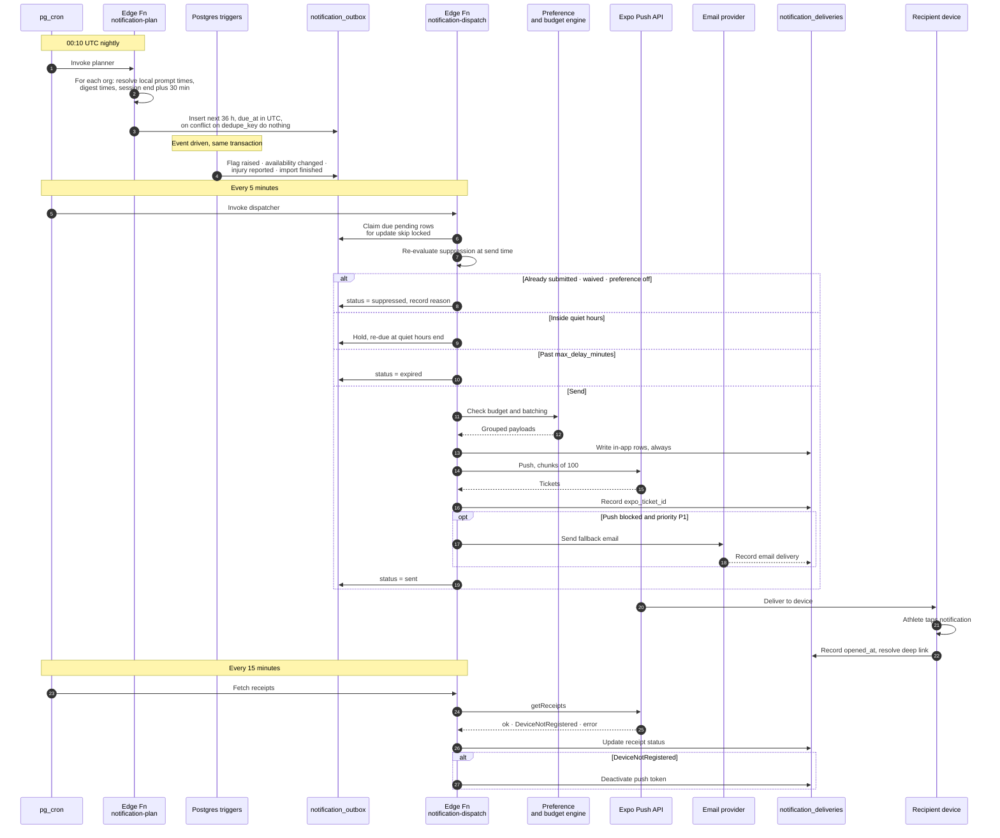

# 08 - Notifications

Push, in-app, and email. Who gets told what, when, and how the product avoids becoming the
app everyone mutes in week three.

---

## 1. Philosophy

Fydr lives or dies on two things: athlete compliance and staff attention. Notifications are
the primary lever on both, and over-notifying is the fastest way to destroy both at once.

The failure sequence is well understood and entirely predictable:

1. The app sends more notifications than the recipient acts on.
2. The recipient stops reading them, because ignoring them has no cost.
3. The recipient mutes the app at OS level, which is invisible to Fydr and irreversible
   without a conversation.
4. The morning wellness prompt stops arriving, compliance falls below the 80% target in
   `00-product-overview.md`, and every downstream analysis degrades.

Step 4 is the point. A muted notification is not a lost notification, it is a lost athlete.

### The four tests

**Every notification must pass all four before it ships.** A notification that fails any of
them is either an in-app inbox item, a badge, or nothing at all.

1. **Action.** Is there something the recipient should do, now, that they cannot do later
   just as well? "Your wellness entry is open" passes. "Your programme was updated" does not,
   unless it changes what they do today.
2. **Timeliness.** Does the moment matter? A high-severity flag at 07:15 changes today's
   session. The same flag at 18:00 does not.
3. **Discovery.** Would they miss it otherwise? A coach opens the dashboard every morning.
   Anything they will see there in an hour does not need a push at 06:00.
4. **Consequence.** What happens if it is ignored? If the honest answer is "nothing", it is
   not a notification.

### Budgets

Hard ceilings, enforced by the dispatcher, not by good intentions.

| Recipient | Push per day | Push per week |
|---|---|---|
| Athlete | 3 | 12 |
| Staff | 5, excluding priority P1 | 25, excluding P1 |

When the budget is exhausted, remaining notifications degrade to in-app only and are rolled
into the next digest. P1 always sends. If the budget is being hit routinely for a normal
club, the catalogue is wrong and needs cutting, not the budget raising.

### Three rules that follow

- **The in-app inbox is always written.** Every notification produces an inbox row
  regardless of channel preferences or delivery success. The inbox is the durable record;
  push and email are delivery mechanisms that may fail. Nothing is lost because a push was
  suppressed.
- **A notification names the athlete and the reason.** "Sam Okafor: readiness 42, down from
  a 71 baseline" is actionable. "You have a new flag" is a request to go and find out.
- **Notifications never carry clinical detail.** Per `CLAUDE.md` rule 3 and
  `09-security-and-compliance.md`. A push notification renders on a lock screen in a
  changing room. "Availability changed to unavailable" is fine. The diagnosis is not.

---

## 2. Notification catalogue

Priority: **P1** delivers immediately and bypasses budgets. **P2** delivers immediately,
subject to quiet hours and budget. **P3** is eligible for batching and digests.

"Disable" is what an individual user can do. An organisation can lock any non-mandatory
notification on, and can turn any notification off for the whole org.

### Athlete

| id | Trigger | Channel | Default timing | Can disable | Priority |
|---|---|---|---|---|---|
| `athlete.wellness.prompt` | A wellness expectation exists for today | Push, in-app | Org-configured, default 07:00 local | Yes | P2 |
| `athlete.wellness.nudge` | Wellness still outstanding | Push, in-app | Prompt time plus 3 h | Yes | P3 |
| `athlete.rpe.prompt` | Session with `requires_rpe` ends | Push, in-app | Session end plus 30 min | Yes | P2 |
| `athlete.rpe.nudge` | RPE still outstanding | Push, in-app | Session end plus 3 h | Yes | P3 |
| `athlete.nutrition.matchday` | The evening before a fixture, `md_offset = -1` | Push, in-app | Org-configured, default 20:00 local | Yes, **default off** | P3 |
| `athlete.nutrition.checkin` | The reported ISO week has ended and no live `nutrition_checkins` row exists for it | Push, in-app | Org-configured, default **Sunday 19:00 local** | Yes, default **on** | P3 |
| `athlete.programme.assigned` | A programme assignment starts | Push, in-app | On assignment, or 07:00 if it starts later | Yes | P2 |
| `athlete.programme.changed` | Assigned programme edited by staff | In-app, push if today's work changed | Next digest, or immediate if today | Yes | P3 |
| `athlete.rehab.assigned` | Medical assigns a rehab programme | Push, in-app | Immediate | Yes | P2 |
| `athlete.availability.changed` | An `availability` row changes their status | Push, in-app, email if push blocked | Immediate, bypasses quiet hours | **No** | P1 |
| `athlete.session.changed` | Today's or tomorrow's session moved or cancelled | Push, in-app | Immediate | Yes | P2 |
| `athlete.flag.shared` | Staff acknowledges a flag, making it athlete-visible | Push, in-app | Immediate | Yes, **default off** | P3 |
| `athlete.test.results` | Test results published for them | In-app, push | Next digest | Yes | P3 |
| `athlete.compliance.weekly` | Weekly personal summary | Push, in-app | Monday 09:00 local | Yes, **default off** | P3 |
| `athlete.leaderboard.weekly` | Weekly leaderboard published | In-app | Monday 09:00 local | Yes, **default off** | P3 |
| `athlete.consent.required` | New **privacy notice** version published. Not a consent request, see below | Push, in-app, email | Immediate | **No** | P1 |

**For an athlete under 18, four rows of that table are floors rather than defaults**, and an
organisation cannot raise them: `athlete.flag.shared`, `athlete.compliance.weekly`,
`athlete.leaderboard.weekly`, and the two nudges. See §5.4, which is the normative statement.

**`athlete.consent.required` is a legacy id and it does not mean what it says.** Consent is
**not** the lawful basis for the core monitoring (`09-security-and-compliance.md` §3,
`screens/onboarding.md`), so nothing in this catalogue asks an athlete to consent to being
monitored and no notification gates an account on consent. What this id carries is a **new
privacy notice version to acknowledge**. It is mandatory for the same reason a notice is:
telling someone what is done with their data is an obligation, not a preference. Consent
proper applies only to the three optional extras, HealthKit and device sync, leaderboard
appearance, and photographs, and **none of them has a notification**: they are asked once at
onboarding step 6 and, for a minor, never re-asked (§5.4). The id is kept rather than renamed
because it is referenced from `screens/onboarding.md` and `03-flows.md`; renaming it is a
find-and-replace across four documents and a migration, and it is worth doing before build.
Raised as O-986.

### Staff

Audience is the roles named on the threshold, the athlete's assigned staff, or the whole
role, as stated. Every staff notification respects the group filter: a coach whose scope is
the academy group does not receive flags for the senior squad. See O-3 in
`01-roles-and-permissions.md`, which this depends on.

**Staff push now has somewhere to land.** Staff have a phone app as well as the web dashboard
(`02-information-architecture.md` §4.6, roadmap Phase 2m), so a `staff.*` push opens the staff
shell of the same binary rather than a browser. Until Phase 2m ships, a staff push opens the
web dashboard through the universal link, which is why every route in §7 resolves on both.

| id | Trigger | Audience | Channel | Default timing | Can disable | Priority |
|---|---|---|---|---|---|---|
| `staff.flag.raised.high` | Flag created with `severity = 'high'` | `thresholds.notify_roles` | Push, in-app | Immediate | Yes | P1 |
| `staff.flag.digest` | Flags of medium or low severity pending | `thresholds.notify_roles` | Push, in-app | Org morning digest, default 07:45 local, then every 4 h if new | Yes | P2 |
| `staff.flag.escalation` | Flag unacknowledged 24 h after raise | Original audience plus admin | Push, in-app, email | 24 h after `raised_at` | **No** | P1 |
| `staff.availability.changed` | Availability status changes | Coach, S&C | Push, in-app | Immediate | Yes | P1 |
| `staff.injury.reported` | Athlete self-reports, or staff raises a concern | Medical | Push, in-app | Immediate, bypasses quiet hours | **No** | P1 |
| `staff.injury.rtp_due` | `expected_return` reached, still open | Medical | In-app, push | 09:00 local on the date | Yes | P3 |
| `staff.restriction.conflict` | Coach assigns work an athlete is restricted from | The assigning coach, medical | In-app, push | Immediate | Yes | P2 |
| `staff.compliance.weekly` | Weekly squad compliance digest | Coach, S&C, admin | Push, email, in-app | Monday 09:00 local | Yes | P2 |
| `staff.compliance.low` | Squad compliance below org floor 3 days running | Coach, admin | Push, in-app | 09:00 local | Yes | P2 |
| `staff.import.completed` | Import batch commits | The uploader only | In-app, push | Immediate | Yes | P2 |
| `staff.import.failed` | Import batch fails, or rejects over 20% of rows | The uploader only | Push, in-app, email | Immediate | Yes | P1 |
| `staff.programme.divergence` | A parent-programme edit did not reach every assigned athlete, because at least one has an override on the edited element | The editing coach, plus the programme owner if different | In-app, push | **Digest, 30 min after the last edit to that programme** | Yes | P3 |
| `staff.export.ready` | Report generation finishes | The requester only | In-app, push | Immediate | Yes | P3 |
| `staff.athlete.joined` | Athlete accepts an invite | Admin | In-app | Daily digest 17:00 local | Yes | P3 |
| `staff.consent.declined` | Athlete declines the privacy notice at onboarding step 5, so the account stays inactive. Legacy id, see the note above | Admin | In-app, email | Immediate | **No** | P2 |
| `staff.integration.failing` | Adapter `failing` over 6 h, per `07-integrations.md` §9.2 | Admin | In-app, email | Once per 24 h | Yes | P2 |
| `staff.device_sync.stalled` | Athletes with device sync silent over 7 days | S&C | In-app | Weekly, with the compliance digest | Yes | P3 |

### Deliberately absent

Stated so nobody adds them later assuming they were forgotten.

- **No notification when an athlete submits wellness.** Thirty athletes, thirty pushes. The
  dashboard is where that lives.
- **No "athlete opened the app" or engagement notifications.** Surveillance, not monitoring.
- **No streak or gamification pushes.** They inflate submission counts without improving
  data quality, and they punish an injured athlete for not training.
- **No marketing or product-update pushes on the athlete channel.** Ever.

---

## 3. Athlete notifications in detail

### 3.1 Morning wellness prompt

The single most important notification in the product. Everything downstream depends on it.

- Time is an organisation setting, `organisations.settings.notifications.wellness_prompt_at`,
  default `07:00`, resolved in the **organisation's** timezone. Per-athlete override is O-49.
- **It only fires when a `compliance_expectations` row exists** for that athlete, that date,
  domain `wellness`, with `is_required = true`. No prompt on a rest day the week template
  marks as off. Prompting for something not expected teaches athletes that the prompt is
  noise, and it directly contradicts the compliance rule in `03-flows.md` §8.
- Suppressed when the entry is already submitted, when the expectation is waived, and when
  the athlete's availability status is `unavailable` with the wellness expectation waived.
- Body names the outstanding items: "Morning check-in is open. Wellness, 45 seconds." When
  more than one entry is outstanding it becomes "Wellness and yesterday's RPE are waiting",
  one notification, not two.
- Deep links to `/athlete/today` with the wellness sheet already open. The athlete should be
  looking at the first slider one tap after the lock screen.

### 3.2 Session RPE prompt

- Fires at **session end plus 30 minutes**, computed as
  `sessions.starts_at + duration_min * interval '1 minute' + interval '30 minutes'`.
- The 30 minutes is not arbitrary and is not configurable downwards. RPE taken immediately
  after a session is biased by the final drill: a hard finisher inflates the rating, a
  cool-down deflates it. This is stated in `04-data-model.md` §5 and enforced here.
- If `duration_min` is null the prompt uses the org default session length. See O-50.
- Only sent to athletes with `session_attendance` of `full` or `modified`. An athlete marked
  `absent` or `excused` is never asked to rate a session they did not do.
- Two sessions ending within 90 minutes of each other produce **one** prompt listing both.
- Not sent after 21:00 local. An evening fixture ending at 21:30 prompts the next morning at
  the wellness prompt time, combined with it.

### 3.3 Matchday fuelling reminder

**Re-specified.** The daily nutrition reminder specified here previously was a logging prompt:
it fired on days with `requires_nutrition` and was "suppressed once a nutrition entry exists
for the day". Neither half survives. Athletes do not log nutrition, so there is no entry to
suppress on and no daily task to chase (`nutrition-guidance.md`). A reminder that nags an
athlete to do something they cannot do is worse than no reminder.

What replaces it is a single content pointer, `athlete.nutrition.matchday`:

- Fires on the evening before a fixture only, `md_offset = -1`, at the org-configured time,
  default 20:00 local. This is when an athlete can still act on it: what to eat tonight and
  what to eat before kick off.
- Deep links to the matchday plan in `nutrition-guidance.md`, not to any entry surface. There
  is no entry surface.
- Off by default at organisation level, and off by default per athlete. A club that has not
  authored matchday guidance must not push athletes to an empty screen, so the send is
  additionally skipped when no guidance exists for `md_offset` in (-1, 0) for that athlete.
- One per fixture, never one per meal slot. Two fixtures in a week produce two sends.
- **No suppression rule based on athlete input**, because there is none to read. Read receipts
  would give one, and whether to record them at all is O-895 in `nutrition-guidance.md`.
- The weekly one-tap check-in is now commissioned (O-890 resolved, 5 August 2026) and it has
  its own prompt on a weekly cadence, §3.7. It is not this notification and is not folded into
  it: this one points at content the evening before a fixture, that one asks a question the
  evening a week ends.

### 3.4 Programme assigned and changed

- `athlete.programme.assigned` fires on assignment, or at 07:00 on `starts_on` if the
  assignment is dated forward. Nobody needs to know at 22:40 that a block starts on Monday.
- `athlete.programme.changed` is **in-app only by default**. It escalates to a push only when
  the change affects work scheduled for today or tomorrow, which is the only case where
  timing matters. A coach editing week 6 of an eight-week block should not buzz 30 phones.
- Rehab assignment from medical is always a push, because it usually accompanies a change in
  what the athlete may do.

### 3.5 Availability changed

The one notification an athlete cannot turn off.

- Fires on any new `availability` row that changes their effective status.
- Carries the status and the restrictions, both of which are non-clinical and coach-visible
  already. It carries **no** diagnosis, no reason detail beyond `reason_category`, and no
  clinical note.
- Bypasses quiet hours. A status change made at 22:00 the night before a fixture is exactly
  the case where waking someone is correct.
- Falls back to email when push is blocked at OS level.
- **Rationale for making it mandatory**: an athlete who does not know they have been made
  unavailable may train, and an athlete who does not know they have been cleared may not
  turn up. Both are safety and selection consequences, not preferences.

### 3.6 The missed-entry nudge, and the rules that stop it nagging

A nudge is the notification most likely to cause the muting spiral, so it is the most
constrained thing in the catalogue.

| Rule | Value |
|---|---|
| Delay after the original prompt | 3 hours |
| Maximum nudges per outstanding entry | 1 |
| Maximum nudges per athlete per day | 1, across all domains |
| Maximum nudges per athlete per rolling 7 days | 3, and **2 for an athlete under 18** (§5.4) |
| Sent when the athlete is unavailable with the expectation waived | Never |
| Sent when the athlete opened the app after the prompt and did not submit | **No** |
| Sent outside quiet hours only | Yes |
| Cooling-off after three consecutive missed days | Nudges stop for 7 days. **Two days for an athlete under 18** (§5.4) |
| Tone | Neutral. "Wellness is still open for today." Never guilt, never streak language |

Two of those deserve explanation.

**No nudge if they opened the app and did not submit.** They know. Telling them again is
nagging, it is transparently automated, and it is the fastest route to a mute. The
non-submission is recorded as non-compliance, which is the correct consequence.

**Nudges stop after three consecutive missed days.** At that point the problem is not that
the athlete forgot, and a fourth push will not fix it. It is a conversation for a coach.
Instead the athlete appears in `staff.compliance.weekly` and on the compliance screen, and
the nudges resume after 7 days or immediately on their next submission. This is the
mechanism that stops Fydr from becoming an app that shouts at the people who have already
stopped listening.

**Tighter for minors, and why.** Under-18s are in scope (`09-security-and-compliance.md` §4), and
standard 13 of the Children's Code treats a repeated prompt aimed at a child to extract more data
as a nudge technique rather than a service reminder. The rule was already close to compliant
because §1 forbids nagging, so the change is two numbers rather than a redesign: two nudges a
week and cooling-off after two missed days. A chase mechanic aimed at a 16 year old is exactly
what the standard prohibits, and the compliance percentage, which is a coaching conversation, is
where a persistently missing child belongs. `[high on the direction, medium on the exact numbers,
they are a judgement rather than a threshold the Code states]`

### 3.7 Weekly nutrition check-in

`athlete.nutrition.checkin`. The prompt for screen 45, `nutrition-checkin.md`. One question,
three answers, under 10 seconds. Added when the client resolved O-890 on 5 August 2026.

#### Audience and eligibility

- Every athlete with an active squad membership. Not conditional on a nutrition target existing:
  the question is answerable without one and the sheet omits the target line.
- Suppressed when a live `nutrition_checkins` row already exists for the reported week.
- Not suppressed by availability. An injured athlete still eats. See O-974 in
  `nutrition-checkin.md`.
- Sent to athletes only. There is no staff equivalent and no staff notification when an athlete
  answers, per the "no notification when an athlete submits" rule in §2.

#### Timing, and why Sunday evening

Default **Sunday 19:00 in the organisation timezone**, held in
`organisations.settings.notifications.nutrition_checkin_at` alongside the day, which is also
configurable. One send per athlete per week.

Four reasons for Sunday evening specifically:

1. **The week being reported is complete.** The ISO week ends on Sunday, so `week_start` is
   unambiguous and "most days this week" refers to a closed set of days rather than a week the
   athlete is still in.
2. **Recall decays fast.** Answering on Sunday about the week just finished is a measurement.
   Answering on Wednesday about last week is a guess, and a guess in a three-level variable is
   indistinguishable from a real answer.
3. **It is the emptiest slot in the athlete's week.** The wellness prompt is 07:00 Monday, the
   RPE prompt follows sessions, and most clubs do not train Sunday evening. This notification
   competes with nothing, which is the only way a P3 prompt gets read.
4. **It is actionable at the moment it lands**, because the answer takes one tap. Test 1 in §1
   asks whether there is something the recipient should do now that they cannot do just as well
   later, and the honest answer is yes: later means worse recall.

**Sunday fixtures.** When the athlete has a fixture whose scheduled end is after the prompt
time, or that is in progress at it, the send defers to **Monday 09:00 local** and still reports
the completed week. Prompting a player about last week's protein while they are in a changing
room after a match is exactly the tone-deaf send that gets an app muted.

#### Against the four tests in §1

Stated explicitly, because §1 is strict and this is a new push on the athlete channel, which is
the channel the whole product depends on.

| Test | Verdict |
|---|---|
| **Action** | Passes. There is something only the athlete can do, it takes under 10 seconds, and doing it later is worse |
| **Timeliness** | Passes. The moment is the end of the week being reported. This is the strongest of the four |
| **Discovery** | Passes. There is no daily surface carrying it. Today lists compliance expectations and this deliberately is not one, so without a prompt it would be discovered by nobody |
| **Consequence** | **Weakest.** If it is ignored, one week has no data point and the response rate falls. That is a real consequence and a small one |

The fourth test is why this is **P3, disableable, once a week, with no nudge**, rather than P2
with a follow-up. A notification that only just passes the consequence test gets the least
aggressive delivery available.

#### Budget, batching and quiet hours

- **Budget**: one push per athlete per week, against a ceiling of 3 per day and 12 per week
  (§1). It is a 1/12 claim on the weekly athlete budget for a variable that is one twelfth of
  the athlete's data. When the budget is exhausted it degrades to in-app, like any other P3.
- **Batching**: P3 and batchable. Collector window is the daily digest slot, grouping key
  `recipient`. If any other P3 is pending for the same athlete in the same window it merges
  into one send: "One question about last week, plus your test results." It never merges with
  a P1 or P2, which deliver as themselves.
- **Quiet hours**: fully respected, never bypassed. Default quiet hours are 21:00 to 07:00
  (§5.3), so a 19:00 default sits comfortably inside the waking window. A club that configures
  quiet hours starting before the prompt time has the send **held and delivered at the end of
  quiet hours**, merged with whatever else is pending.
- **`max_delay_minutes` is 2,400**, forty hours. Held past Monday lunchtime the push is
  discarded and the in-app row carries it instead. The check-in window stays open for three
  weeks regardless (`nutrition-checkin.md`), so a discarded push loses a prompt, not the
  opportunity to answer.

#### No nudge, and no streak or guilt mechanics

**There is no `athlete.nutrition.checkin.nudge`.** One send per week, and if it is ignored
nothing chases it. §3.6 constrains nudges tightly for daily entries whose data actually matters
on the day; a weekly self-report does not earn one.

**This notification is aimed at children as well as adults.** Under-18 athletes are confirmed in
scope as of 5 August 2026 (O-886 resolved), so `09-security-and-compliance.md` §4 applies and
standard 13 of the Children's Code, nudge techniques, prohibits most of what a growth team would
put here. The tone rules are hard rules, not style preferences:

| Prohibited | Why |
|---|---|
| Streaks, counts of consecutive weeks, "don't break your run" | Manufactured loss aversion aimed at a child about their eating |
| "You missed last week", "you have not answered in 3 weeks" | Guilt, and it is also nagging by another name |
| Any praise or judgement attached to the answer | The app must not signal which answer it wants. That turns a self-report into self-presentation, per ADR-005 |
| Comparison to teammates or to a squad figure | This is not a leaderboard, and O-281 in `leaderboards.md` recommends prohibiting nutrition on boards outright |
| Emoji, exclamation marks, cheerleading copy | Reads as an app talking down to a 16 year old, and it is the fastest route to a mute |

Permitted copy, and close to the only copy:

> **Nutrition check-in**
> One question about last week. 10 seconds.

Deep links to `/athlete/today?open=nutrition_checkin&week={week_start}`, with the sheet already
open on the question. The athlete answers one tap after the lock screen.

This extends the standing rule in §2 "Deliberately absent": no streak or gamification pushes.
That rule was written about compliance and it applies here with more force, because the subject
is a child's eating rather than a form.

---

## 4. Staff notifications in detail

### 4.1 High-severity flags

- Immediate push per flag, no batching, to the roles in `thresholds.notify_roles`.
- The body carries the athlete, metric, observed value and baseline: "Sam Okafor: readiness
  42, 28-day baseline 71." A coach can triage from the lock screen without opening the app,
  which is the whole point.
- Two or more high-severity flags on the **same athlete** in one evaluation cycle produce one
  notification listing them. High-severity flags on different athletes are separate: they
  are separate decisions.
- Deep links straight to the flag, `/staff/flags/{flag_id}`, not to the flag list.

### 4.2 Unacknowledged escalation

- Fires 24 hours after `flags.raised_at` where `status` is still `raised` or `notified`.
- Goes to the original audience **and** every admin. Escalation that goes back only to the
  person already ignoring it is theatre.
- Cannot be disabled, because it is the control that makes the flag system trustworthy. It
  is also the notification most likely to be resented, so the escalation window is an
  organisation setting with a 24-hour default.
- Counts once per flag. A flag unacknowledged for a week escalates once, not seven times.
- **The escalation rate is a product health metric.** Sustained high escalation means the
  thresholds generate flags nobody thinks are worth acknowledging, which is the alert fatigue
  problem in `03-flows.md` §5. Surface it to the admin in the weekly digest.

### 4.3 Availability and injury

- `staff.availability.changed` goes to coaching staff with status and restrictions only.
  This is the boundary in `CLAUDE.md` rule 3 and it is enforced in the payload builder, not
  left to the template.
- `staff.injury.reported` goes to medical immediately and bypasses quiet hours, because an
  athlete reporting a problem from the Today tab at 21:30 after a match is the exact case it
  exists for.
- If no user holds the medical role, the notification routes to admins with a message saying
  the club has no medical user configured. Silent routing into nowhere is not acceptable for
  an injury report.

### 4.4 Weekly compliance digest

- Monday 09:00 in the organisation timezone, to coach, S&C and admin. Both push and email:
  push for the prompt, email because it is the one notification people actually want to read
  in full and forward.
- Contents: squad compliance by domain, week on week change, the five athletes with the
  lowest compliance, athletes with three or more consecutive missed days, athletes whose
  device sync has stalled, and the flag acknowledgement rate.
- Respects the group filter. A coach scoped to a group gets that group's figures.
- Sent even when compliance is good. A digest that only arrives when something is wrong
  trains people to dread it, and the good weeks are the evidence the product is working.

### 4.5 Import completed and failed

- Goes to the person who uploaded the file, and nobody else. An import is a task, not news.
- `staff.import.completed`: "Catapult import: 38 records added, 3 need attention." Deep links
  to the batch.
- `staff.import.failed` is P1 and adds email, because a failed GPS import on a Tuesday means
  no GPS data for that session unless someone notices the same day.
- Also fires when a batch commits but rejects more than 20% of rows, which usually means the
  vendor changed their export format. See `07-integrations.md` §9.2.

### 4.6 Programme divergence

`03-flows.md` §4 ends the propagation branch with "coach notified of divergence" and ADR-006
states that "the divergence notice is not optional. Silent non-propagation is how a coach ends
up believing 30 athletes are on 5×5 when six are not." The notice existed in the flow, in the
ADR and on the settings screen, and it did not exist in this catalogue. This is it.

**What fires it.** A `programme_change_events` row committed with `diverged_athlete_count > 0`.
The change function already writes that row and one `programme_change_divergences` row per
athlete per element that did not receive the change (`04-data-model.md` §17.1). No new
detection is needed and no new table is needed.

**Audience: the coach who made the edit, plus the programme owner where that is someone else.**
Not every coach, not the squad's coaching staff, and never the athlete. Three reasons:

1. It is feedback on an action, like an import result. The person who needs it is the person
   whose intent did not fully land.
2. The divergence set names who is injured. `04-data-model.md` §17.1 is explicit: an override
   usually exists because of a restriction, so the list of diverged athletes is a readable list
   of who is carrying something. Broadcasting that to every coach is a medical-adjacent
   disclosure with no operational need behind it. It is coach-and-medical readable on the
   screen; it is not pushed to people who did not ask for it.
3. Medical are not notified. A physio does not need telling that a coach's edit respected a
   restriction the physio put there. That is the system working.

**Timing, and why it must be a digest.** A coach editing a programme is not making one edit,
they are making twenty over a quarter of an hour, and a single edit to an exercise assigned to
forty athletes with six overrides produces six divergence rows in one transaction. Per-event
sending would put thirty pushes on one phone during one sitting, which is the exact failure
in §1.

| Control | Value |
|---|---|
| Collector window | 30 minutes, rolling, restarted by each further edit to the same programme |
| Grouping key | `recipient` plus `programme_id`. **Never** per athlete and never per element |
| Result | One notification per programme per editing session, however many elements moved |
| Ceiling | If the window is restarted continuously, the send is forced after 2 hours so a long session still reports before the coach leaves |
| Priority | P3, batchable, subject to quiet hours and the staff budget in §1 |
| `max_delay_minutes` | 1,440. A divergence a day old is still worth knowing; two days is a screen, not a push |

**Copy**, and it names the count rather than the athletes, because the athlete list is the part
that reads as a medical disclosure on a lock screen:

| Situation | Body |
|---|---|
| One athlete, one element | "Senior Strength: 1 athlete kept their own version of Back squat." |
| Several | "Senior Strength: 6 athletes kept their own version of 3 exercises." |
| Several programmes in one window | Never merged. One notification per programme, because the action is per programme |

Deep links to `/staff/programmes/{programme_id}/divergences`, which is the divergence view
behind the `⋯` menu in `screens/gym-programmes.md`. Tapping through is what clears the
unacknowledged badge, by setting `programme_change_events.acknowledged_at`.

**It can be disabled**, per the settings screen in `screens/settings.md`, which already lists
"Programme divergence" as push-on, email-off, with no organisation lock. That is the right
setting: it is useful, it is not safety-critical, and a coach who has decided they do not want
it will otherwise mute the app rather than the row. **It is not escalated** and there is no
unacknowledged chase. An unacknowledged divergence stays as a badge on the programme card
(`screens/gym-programmes.md`), which is where a coach will next be looking anyway.

**Against the four tests in §1.** Action: passes, the coach may want to override the override.
Timeliness: weakest of the four, which is why it is a 30-minute digest and not immediate.
Discovery: passes, the badge is on a screen a coach visits weekly at most, and silent
non-propagation is the failure ADR-006 exists to prevent. Consequence: passes, the coach
believes forty athletes are lifting something six of them are not.

---

## 5. Preferences, defaults, and quiet hours

### 5.1 The resolution order

Four layers, resolved in order, most specific last:

```
system default  ->  children's floor  ->  organisation default  ->  organisation lock
                ->  user preference
```

- **System default** is the catalogue in §2.
- **Children's floor** applies to any athlete where `athlete_is_minor()` is true
  (`04-data-model.md` §17.16). It is resolved second, before the organisation, because it is the
  one layer a club cannot raise. See §5.4.
- **Organisation default** lets a club change defaults for new users: prompt times, digest
  times, whether the matchday fuelling reminder exists at all.
- **Organisation lock** forces a notification on. A club can require that `staff.flag.digest`
  cannot be disabled by its coaches. An org **cannot** lock a notification for athletes
  beyond the mandatory set, and an org cannot lock a channel a user has revoked at OS level.
- **User preference** is per notification id and per channel. A user can keep push for flags
  and turn off email for the same flag.

```sql
create table notification_preferences (
  id                uuid primary key default gen_random_uuid(),
  org_id            uuid not null references organisations(id),
  user_id           uuid not null references users(id) on delete cascade,
  notification_id   text not null,             -- 'athlete.wellness.prompt'
  push_enabled      boolean,                   -- null = inherit
  email_enabled     boolean,
  in_app_enabled    boolean not null default true,   -- always true, column exists for symmetry
  quiet_hours_start time,                      -- null = inherit org
  quiet_hours_end   time,
  updated_at        timestamptz not null default now(),
  unique (user_id, notification_id)
);
```

### 5.2 The athlete mute rule

**An athlete can mute everything except `athlete.availability.changed` and
`athlete.consent.required`.** There is a single "pause all notifications" control on the
athlete settings screen, with an optional end date, and it does exactly what it says.

This is deliberate and it is a trade against compliance. The alternative, forcing prompts on
people who have asked for them to stop, produces an OS-level mute instead. An OS-level mute
is invisible to Fydr, permanent, and takes availability changes with it. An in-app mute is
visible, reversible, surfaced to staff as "notifications paused" on the compliance screen,
and leaves the two mandatory notifications working.

Giving athletes a real off switch is how the important notifications keep arriving.

### 5.3 Quiet hours

- Default 21:00 to 07:00 in the user's local timezone, falling back to the organisation
  timezone. Per-user configurable.
- Notifications generated inside quiet hours are **held**, not dropped, and delivered at the
  end of quiet hours, merged into whatever else is pending.
- Only these bypass quiet hours: `athlete.availability.changed`,
  `athlete.consent.required`, `staff.injury.reported`, `staff.flag.escalation`. Every one is
  P1 and every one has a consequence for tomorrow morning.
- A notification held past its usefulness is discarded rather than delivered late. Each
  catalogue entry has a `max_delay_minutes`; an RPE prompt held for eleven hours is deleted,
  not delivered at 07:00, because a `mark as done` on yesterday's RPE at breakfast is worse
  data than no RPE at all.
### 5.4 The children's floor

Added 5 August 2026 with the under-18 decision. Standard 13 of the Children's Code prohibits
nudging a child towards providing more data or weakening their privacy, and standard 7 requires
high-privacy defaults. Most of the catalogue already complies because §1 forbids nagging for
unrelated reasons. What follows is what actually changes.

| Rule for an athlete under 18 | Detail |
|---|---|
| Nudges per rolling 7 days | **2**, not 3 (§3.6) |
| Cooling-off | Starts after **2** consecutive missed days, not 3, and lasts 7 days |
| `athlete.flag.shared` | Default off, and the **organisation lock cannot raise it**. A child is not told by push that an alert was raised about them unless the club has decided that individually and the child knows why |
| `athlete.compliance.weekly`, `athlete.leaderboard.weekly` | Default off, and the organisation default cannot turn them on for minors. Both are engagement sends |
| `athlete.leaderboard.weekly` | Additionally unavailable while the athlete has not granted `leaderboard_visibility`, which for a minor is the normal state (`screens/leaderboards.md`) |
| Re-prompting a declined optional consent | **Never.** There is no notification for it and none may be added |
| Streaks, counts, praise, guilt, emoji, exclamation marks | Already banned by §2 and §13.2 of `06-design-system.md`. For minors it is a Code prohibition rather than a tone preference, so it is a review gate, not a style note |
| The mandatory set | Unchanged. `athlete.availability.changed` and `athlete.consent.required` still deliver, because both tell the child something that limits what they may do |

**Why the floor sits above the organisation and below the user.** A club cannot make a child's
experience noisier, and the child can still turn things off. A floor that the user could not
lower would mean a 16 year old could not mute a prompt, which is neither required by the Code nor
sensible.

**Verification, not assertion.** The pre-launch checklist in `09-security-and-compliance.md` §14
requires this to be checked in a live minor account rather than in code review. The failure mode
is a club-level default applied before the age is read, and it is invisible in a diff.

---

## 6. Batching and digests

The rule: **a coach gets one notification about six flags, not six notifications.**

### Collector windows

| Notification | Window | Grouping key |
|---|---|---|
| `staff.flag.digest` | 15 min rolling, then hourly | recipient plus date |
| `staff.flag.raised.high` | None, unless same athlete in one evaluation cycle | recipient plus athlete |
| `athlete.programme.changed` | Until the next daily digest slot | recipient |
| `staff.programme.divergence` | 30 min rolling, restarted by each further edit, forced at 2 h | recipient plus programme |
| `staff.athlete.joined` | Daily, 17:00 local | recipient |
| `athlete.test.results` | Daily digest slot | recipient |

Algorithm, run by the dispatcher every 5 minutes:

1. Select due, unsent outbox rows for a recipient whose notification id is batchable.
2. Group by `(recipient, notification_id, group_key)`.
3. If a group has one member, send it as itself.
4. If it has more than one, render the group template and send one notification, marking
   every member as `sent` with the same `delivery_id`.
5. If a group has more than 5 members, the body reports the count and the top 3 by severity,
   and the deep link goes to the filtered list rather than a single record.

Copy examples:

| Count | Body |
|---|---|
| 1 | "Sam Okafor: readiness 42, baseline 71." |
| 3 | "3 flags need review: Sam Okafor, Aoife Byrne, Tom Fitzgerald." |
| 9 | "9 flags need review. Highest: Sam Okafor readiness 42, Aoife Byrne sleep 4.1 h, Tom Fitzgerald ACWR 1.62." |

**Collapse identifiers** are set on the push payload so a second digest replaces the first
in the notification shade rather than stacking. Three unread flag digests on a lock screen is
the same failure as three separate flag pushes.

---

## 7. Deep linking

**Every notification carries a route.** A notification that opens the app home is a failed
notification: the recipient has to find the thing themselves, which is the work the
notification was supposed to save.

### Scheme

- Universal links: `https://app.fydr.co/...`, with the iOS associated domains file and the
  Android asset links file. Universal links open the app when installed and the web
  dashboard when not, which is the correct behaviour for a staff user on a laptop.
- Custom scheme `fydr://` as the fallback for contexts where universal links do not resolve.
- Routes are **role-namespaced**: `/athlete/...` and `/staff/...` are disjoint trees.

| Notification | Route |
|---|---|
| `athlete.wellness.prompt` | `/athlete/today?open=wellness` |
| `athlete.rpe.prompt` | `/athlete/today?open=rpe&session={session_id}` |
| `athlete.availability.changed` | `/athlete/availability` |
| `athlete.programme.assigned` | `/athlete/programme/{assignment_id}` |
| `staff.flag.raised.high` | `/staff/flags/{flag_id}` |
| `staff.flag.digest` | `/staff/flags?status=raised&date={date}` |
| `staff.availability.changed` | `/staff/athletes/{athlete_id}/availability` |
| `staff.injury.reported` | `/staff/medical/injuries/{injury_id}` |
| `staff.import.completed` | `/staff/imports/{import_batch_id}` |
| `staff.programme.divergence` | `/staff/programmes/{programme_id}/divergences` |
| `staff.compliance.weekly` | `/staff/compliance?window=last_week` |

### The push payload

The route and everything needed to resolve it travel in `data`. The visible title and body
carry no identifiers, and `data` carries no clinical or performance detail beyond what the
body already states.

```json
{
  "to": "ExponentPushToken[xxxxxxxxxxxxxxxxxxxxxx]",
  "title": "3 flags need review",
  "body": "Sam Okafor, Aoife Byrne, Tom Fitzgerald.",
  "sound": "default",
  "badge": 3,
  "channelId": "prompts",
  "priority": "high",
  "ttl": 14400,
  "collapseId": "staff.flag.digest:2026-10-14",
  "data": {
    "notification_id": "staff.flag.digest",
    "delivery_id": "3f0b7c1e-9d2a-4d61-9f0e-2c1b7a5e4d33",
    "org_id": "b21c9f4a-1d55-4a2e-9c33-77f0a1c9e210",
    "route": "/staff/flags?status=raised&date=2026-10-14",
    "required_roles": ["coach", "medical"],
    "entity_type": "flag",
    "entity_ids": [
      "f0a2c8d1-4b6e-4f21-9a77-0c3d5e8b1a44",
      "a71d3e90-2c48-4b0f-8e15-6d9f2a0c7b31",
      "c93f5b27-8a10-42dd-b6c4-51e07f2a9d68"
    ],
    "grouped_count": 3
  }
}
```

`ttl` is set per priority: 4 hours for P2 and P3, 24 hours for P1. A wellness prompt that
reaches a phone eleven hours late is worse than one that never arrives.

### Resolution rules

Applied in order on tap. Any failure lands on a sensible screen with an explanation, never a
blank screen and never a crash.

1. **Not authenticated**: store the route as pending, run the auth flow, resume afterwards.
   Survives an app cold start and an app install, which is how the invite deep link in
   `03-flows.md` §2 already works.
2. **Wrong organisation**: `data.org_id` is compared to the active session's org. A user with
   memberships in two organisations is switched, with a visible confirmation. A user with no
   membership in that org gets "this is no longer available to you" and lands on home.
3. **Role check**: `data.required_roles` is compared against the roles in the session. This
   is a client-side check for routing only. **It is not authorisation.** Per `CLAUDE.md`
   rule 2, the roles used for access are resolved server-side and RLS returns nothing for a
   user without permission regardless of what the router does.
4. **Shell selection**: the route prefix determines the shell. A `/staff/...` route in an
   athlete-only session has **no matching route in the athlete navigator at all**. This is
   the important part: a flag notification cannot open for an athlete because the athlete
   app does not contain that screen, not because a check happened to run. Structural, not
   defensive.
5. **Resource gone**: a deleted or RLS-invisible target renders an empty state on the
   nearest list screen: "That flag has been resolved." Not a 404, not a spinner.
6. **Tap tracking**: the tap writes `notification_deliveries.opened_at`. This is the only
   real measure of whether a notification was worth sending, and §9 depends on it.

**A flag notification must never open for an athlete.** It also must never be *sent* to one:
the audience resolver only ever selects staff roles for `staff.*` ids. Both defences exist
because either alone is one refactor away from failing.

---

## 8. Technical implementation

### 8.1 Expo Notifications

`expo-notifications`, with a custom development client and EAS builds. Push requires an APNs
key for iOS and FCM v1 credentials for Android, both held in EAS, not in the repo.

```ts
import * as Notifications from 'expo-notifications';
import * as Device from 'expo-device';
import { Platform } from 'react-native';

export async function registerForPush(
  userId: string,
  shell: 'athlete' | 'staff',      // from resolveShell(claims), never from a UI toggle
): Promise<string | null> {
  if (!Device.isDevice) return null;              // simulators cannot receive push

  if (Platform.OS === 'android') {
    await Notifications.setNotificationChannelAsync('critical', {
      name: 'Availability and injuries',
      importance: Notifications.AndroidImportance.MAX,
      sound: 'default',
      vibrationPattern: [0, 250, 250, 250],
    });
    await Notifications.setNotificationChannelAsync('prompts', {
      name: 'Daily prompts',
      importance: Notifications.AndroidImportance.DEFAULT,
    });
    await Notifications.setNotificationChannelAsync('digests', {
      name: 'Summaries',
      importance: Notifications.AndroidImportance.LOW,
    });
  }

  const existing = await Notifications.getPermissionsAsync();
  let status = existing.status;
  if (status !== 'granted') {
    // Only ask where the onboarding flow says to. Never on cold start.
    const asked = await Notifications.requestPermissionsAsync({
      ios: { allowAlert: true, allowBadge: true, allowSound: true },
    });
    status = asked.status;
  }
  if (status !== 'granted') {
    await markPushBlocked(userId);
    return null;
  }

  const token = (
    await Notifications.getExpoPushTokenAsync({
      projectId: Constants.expoConfig!.extra!.eas.projectId,
    })
  ).data;                                          // ExponentPushToken[xxxxxxxx]

  await upsertPushToken(userId, token, Platform.OS, shell, Device.modelName);
  return token;
}
```

**Android channels matter.** Without them every notification arrives at the same importance,
and an athlete who wants to silence the weekly leaderboard has to silence availability
changes too. Three channels: `critical`, `prompts`, `digests`.

**The permission prompt is asked once, at the right moment.** In onboarding it appears after
the consent screen and before the walkthrough, per `03-flows.md` §2, with a preceding
explainer screen. Asking on first launch, before the athlete knows what the app is, loses
roughly half the grants and cannot be re-asked.

### 8.2 Token registration and refresh

```sql
create table push_tokens (
  id            uuid primary key default gen_random_uuid(),
  org_id        uuid not null references organisations(id),
  user_id       uuid not null references users(id) on delete cascade,
  token         text not null,                   -- ExponentPushToken[...]
  platform      text not null,                   -- 'ios' | 'android'
  shell         text not null,                   -- 'athlete' | 'staff', resolved server-side
  device_name   text,
  app_version   text,
  is_active     boolean not null default true,
  invalidated_reason text,                       -- 'device_not_registered','permission_revoked','logout'
  last_used_at  timestamptz,
  created_at    timestamptz not null default now(),
  updated_at    timestamptz not null default now(),
  unique (token)
);

create index on push_tokens (user_id) where is_active;
```

- Registered after login and after onboarding permission grant.
- **Registration records the resolved shell**, `athlete` or `staff`, from
  `resolveShell(app_metadata)` in `05-architecture.md` §5. One binary carries both shells, so
  the token alone does not say which interface the device is signed into. Three rules follow:
  - The shell is taken from the **claims**, never from a client-supplied field. It is the same
    rule as `CLAUDE.md` §2 rule 2, applied to a row that decides routing.
  - Switching shell **re-registers** rather than updating in place, so a stale row cannot route
    a `staff.*` push to a device showing the athlete tab bar.
  - The dispatcher prefers tokens whose `shell` matches the notification's namespace. Where a
    user has no matching token, it sends anyway and the deep link resolves per §7: this is a
    routing preference, not an authorisation control, and suppressing a P1 availability change
    because of a shell mismatch would be a much worse failure than opening the wrong tab first.
- `Notifications.addPushTokenListener` handles rotation. Expo tokens change on reinstall, on
  restore from backup, and occasionally on OS update. Not handling rotation produces users
  who silently stop receiving push, which looks identical to a product that does not work.
- Multiple active tokens per user are normal: a coach with a phone and a tablet, or a
  player-coach signed into the staff shell on one device and the athlete shell on another. All
  active tokens receive the send, subject to the shell preference above.
- Logout deactivates that device's token only, with reason `logout`. A shared changing-room
  tablet must not keep receiving one athlete's notifications after they sign out.
- Tokens unused for 90 days are deactivated.

### 8.3 Scheduling architecture

Two mechanisms, because scheduled and event-driven notifications have genuinely different
shapes.

**Event-driven** notifications are enqueued by Postgres triggers into `notification_outbox`
in the same transaction as the change that caused them. A flag insert and its notification
row commit together or not at all. No polling for events, no missed notification because a
worker was down.

**Scheduled** notifications are materialised ahead of time. A nightly planner Edge Function
runs at 00:10 UTC, iterates organisations, and writes the next 36 hours of scheduled
notifications into the outbox with `due_at` resolved to UTC from local times.

Planning ahead rather than evaluating "is it 07:00 somewhere" every minute is the right call
for three reasons: it handles daylight saving correctly because the conversion happens once
against a real date; it makes tomorrow's notification schedule **inspectable**, which is
worth a great deal when a club says the prompt did not arrive; and it makes the dispatcher a
simple due-row query instead of a rules engine.

```sql
create type notification_status as enum
  ('pending','suppressed','sending','sent','failed','expired','cancelled');

create table notification_outbox (
  id                uuid primary key default gen_random_uuid(),
  org_id            uuid not null references organisations(id),
  recipient_user_id uuid not null references users(id) on delete cascade,
  notification_id   text not null,                -- catalogue id
  priority          int not null,                 -- 1 | 2 | 3
  due_at            timestamptz not null,
  expires_at        timestamptz,
  group_key         text,                         -- batching key
  payload           jsonb not null,               -- title, body params, route, required_roles
  entity_type       text,
  entity_id         uuid,
  status            notification_status not null default 'pending',
  suppressed_reason text,                         -- 'preference_off','already_submitted','budget','quiet_hours_expired','waived'
  dedupe_key        text,
  created_at        timestamptz not null default now(),
  unique (dedupe_key)
);

create index on notification_outbox (due_at)
  where status = 'pending';
create index on notification_outbox (recipient_user_id, notification_id, due_at desc);
```

`dedupe_key` is the safety net against double sends. For the wellness prompt it is
`athlete.wellness.prompt:{user_id}:{entry_date}`. If the planner runs twice, the second
insert conflicts and does nothing.

Cron, via `pg_cron` in Supabase:

```sql
-- Materialise the next 36 hours of scheduled notifications
select cron.schedule('notif-plan', '10 0 * * *',
  $$ select net.http_post(
       url := 'https://<project>.supabase.co/functions/v1/notification-plan',
       headers := '{"Authorization":"Bearer <service-role>"}'::jsonb
     ) $$);

-- Dispatch anything due
select cron.schedule('notif-dispatch', '*/5 * * * *',
  $$ select net.http_post(
       url := 'https://<project>.supabase.co/functions/v1/notification-dispatch',
       headers := '{"Authorization":"Bearer <service-role>"}'::jsonb
     ) $$);

-- Reconcile Expo delivery receipts
select cron.schedule('notif-receipts', '*/15 * * * *', $$ ... $$);

-- Escalate unacknowledged flags
select cron.schedule('flag-escalation', '*/30 * * * *', $$ ... $$);
```

The dispatcher, per run:

1. Claim due pending rows with `for update skip locked`, capped at 2000 per run. Concurrent
   invocations cannot double-send.
2. Re-evaluate suppression **at send time, not at plan time**. An athlete who submitted
   wellness at 06:40 must not receive the 07:00 prompt. This re-check is the difference
   between a product that feels attentive and one that feels automated.
3. Apply preferences, quiet hours, and budgets.
4. Group batchable rows per §6.
5. Send to Expo in chunks of 100.
6. Write `notification_deliveries` rows and update outbox status.

Chunking at 100 is the Expo push API limit. Payloads must stay under 4 KiB.

### 8.4 Delivery tracking

```sql
create table notification_deliveries (
  id                uuid primary key default gen_random_uuid(),
  org_id            uuid not null references organisations(id),
  outbox_id         uuid references notification_outbox(id) on delete set null,
  recipient_user_id uuid not null references users(id) on delete cascade,
  notification_id   text not null,
  channel           text not null,                -- 'push' | 'email' | 'in_app'
  push_token_id     uuid references push_tokens(id),
  expo_ticket_id    text,
  expo_receipt_status text,                       -- 'ok' | 'error'
  expo_error        text,                         -- 'DeviceNotRegistered','MessageTooBig','MessageRateExceeded','MismatchSenderId'
  grouped_count     int not null default 1,
  sent_at           timestamptz,
  delivered_at      timestamptz,
  opened_at         timestamptz,
  failed_at         timestamptz,
  created_at        timestamptz not null default now()
);
```

Expo returns a **ticket** on send, not a delivery confirmation. Receipts must be fetched
separately from `/push/getReceipts` at least 15 minutes later, which is what the
`notif-receipts` job does. Handling:

| Expo error | Action |
|---|---|
| `DeviceNotRegistered` | Deactivate the token, reason `device_not_registered`. Do not retry |
| `MessageTooBig` | Log and truncate the template. A code defect, not a runtime condition |
| `MessageRateExceeded` | Backoff and retry with jitter |
| `MismatchSenderId` | Alert. The Android FCM credentials are wrong for the build |
| `InvalidCredentials` | Alert immediately. All Android or all iOS push is down |

Metrics that actually get watched: send volume per notification id, open rate per
notification id, suppression reasons by count, and **mute rate**. An id whose open rate sits
below 10% over a month fails test 1 in §1 and is a candidate for deletion, not for a
rewritten subject line.

### 8.5 Revoked OS permission

Users revoke notification permission in Settings, and the app is not told.

- `getPermissionsAsync()` runs on every foreground transition. A `granted` to `denied`
  change deactivates the tokens with reason `permission_revoked` and sets
  `users.push_blocked_at`.
- **iOS never re-prompts.** A second `requestPermissionsAsync` does nothing. The only route
  is `Linking.openSettings()`, and only when the user asks for it.
- An in-app banner appears at most **once every 14 days**, on the Today tab, saying which
  notifications will not arrive. It is dismissible and it never blocks the screen. Nagging
  about notification permission is the same mistake as over-notifying, one level up.
- P1 notifications fall back to email. `athlete.availability.changed` reaching an athlete who
  blocked push is exactly why the email fallback exists.
- Staff screens show a "notifications off" indicator against the athlete on the compliance
  screen. It is a genuine predictor of falling compliance, and a coach who can see it can
  have the conversation before the data disappears.
- Blocked push does **not** disable the in-app inbox. Everything is still there when they
  open the app.

---

## 9. Email

### 9.1 When email is used

Email is not a second copy of push. It is used for four things:

1. **Fallback for P1** when push is blocked or has hard-failed.
2. **Content that is read rather than glanced at**: the weekly compliance digest, reports.
3. **Anything needed by someone not in the app**: invites, consent declined, an admin whose
   integration is failing.
4. **Records people forward**: a digest a head coach sends to a director of rugby.

Email is **never** used for the daily wellness prompt, the RPE prompt, or nudges. Daily
transactional email to an athlete is the fastest available route to a spam complaint, and a
spam complaint damages deliverability for every club on the platform.

Transactional provider with a real deliverability reputation, DKIM, SPF and DMARC on the
sending domain, and a dedicated subdomain such as `mail.fydr.co` so that a bounce problem in
one area cannot poison the primary domain. See O-54.

### 9.2 Templates

Built with React Email so the components share the tokens in `06-design-system.md`, rendered
server-side in the same Edge Function that dispatches.

| Template | Subject | Trigger |
|---|---|---|
| `invite-athlete` | "You have been added to {org_name} on Fydr" | Admin invites |
| `invite-staff` | "{inviter} has invited you to {org_name} on Fydr" | Admin invites |
| `availability-changed` | "Your availability has been updated" | P1 fallback |
| `flag-escalation` | "Unacknowledged flag: {athlete_name}, {metric}" | 24 h escalation |
| `injury-reported` | "{athlete_name} has reported a problem" | Medical, P1 fallback |
| `compliance-weekly` | "{org_name}: weekly compliance, w/c {date}" | Monday digest |
| `import-failed` | "GPS import failed: {filename}" | Import failure |
| `export-ready` | "Your {report_name} is ready" | Report generated |
| `consent-declined` | "{athlete_name} has declined consent" | Admin |
| `integration-failing` | "{provider} has stopped syncing" | Admin |
| `password-reset`, `email-verify` | Standard | Auth |

Rules for every template:

- Plain text alternative on every send. Some club email systems strip HTML entirely.
- The subject line carries the information. Someone triaging on a phone should not need to
  open it.
- **No clinical detail, and no athlete performance values in a subject line.** Subject lines
  appear in notification previews and on shared screens.
- One primary action button, deep linking to the same route as the push equivalent.
- Unsubscribe link on everything except P1 and auth. P1 emails carry a line explaining why
  they cannot be unsubscribed and how to change it in the app.
- Sent in the recipient's language and the organisation's timezone, with dates written out
  rather than `2026-10-14`, because a digest that says "Monday 14 October" is read faster.

---

## 10. Scheduling and delivery pipeline



---

## 11. Schema additions required

Per `CLAUDE.md` §5, these land in `04-data-model.md` in the same commit as the migration.

| Change | Table |
|---|---|
| New table `push_tokens`, including `shell` (`athlete` \| `staff`) | new |
| New table `notification_preferences` | new |
| New table `notification_outbox` | new |
| New table `notification_deliveries` | new |
| New enum `notification_status` | new |
| Add `push_blocked_at`, `notifications_paused_until` | `users` |
| Add `settings.notifications` object: prompt times, digest times, quiet hours, escalation window, locks | `organisations` |

RLS: a user reads only their own `notification_preferences`, `push_tokens`,
`notification_deliveries` and inbox rows. Admins read aggregate delivery counts for their
org through a view, never individual notification bodies, because a notification body can
name another athlete.

---

## 12. Open questions

- **O-49**: Should the morning wellness prompt time be per athlete rather than per
  organisation? A squad with shift workers and students has a genuinely wide spread of wake
  times, and a fixed 07:00 will be wrong for some of them. It is also one more setting on an
  onboarding flow that is supposed to be short.
- **O-50**: The RPE prompt needs a session end time. When `sessions.duration_min` is null,
  the options are: an org default session length, no prompt at all, or prompting at a fixed
  evening time. I have assumed an org default of 90 minutes.
- **O-51**: Should repeated athlete non-compliance escalate to a staff notification, and
  after how many consecutive missed days? I have not put one in the catalogue: the weekly
  digest covers it. If you want a coach told on day 3, say so, and say which role.
- **O-52**: Weekly digest day and time. Monday 09:00 local assumed. For a club whose week
  starts after a Saturday fixture, Sunday evening may be more useful.
- **O-53**: Should medical receive wellness soreness flags directly, or only through the
  coach? Currently `thresholds.notify_roles` allows either and the default is coach only.
  Routing soreness straight to a part-time physio may be the difference between catching a
  soft-tissue problem and not.
- **O-54**: Email provider and sending domain. Needs the club-facing domain decided, plus
  DKIM, SPF and DMARC records on it before the first invite is sent.
- **O-981**: The children's floor in §5.4 sets two nudges a week and two missed days before
  cooling-off. Those numbers are mine, not the Code's, and they trade compliance chasing against
  a standard that prohibits it. If the pilot shows minors dropping out of daily submission, the
  answer is a coach conversation rather than a third push, and I would want that confirmed before
  someone quietly raises the cap.
- **O-986**: Rename `athlete.consent.required` and `staff.consent.declined`. Both are about a
  privacy **notice**, not consent, and consent is not the lawful basis for the core monitoring.
  `athlete.notice.required` and `staff.notice.declined` say what they do. It is a find-and-replace
  across this document, `03-flows.md`, `screens/onboarding.md` and `screens/settings.md` plus a
  data migration on `notification_preferences.notification_id`, so it is cheap now and annoying
  after launch. I have not done it unilaterally because the ids appear in a flow diagram the
  client has already reviewed.
- **O-987**: Divergence notice audience (§4.6). I have sent it to the editing coach and the
  programme owner only, on the grounds that the diverged-athlete list is effectively a list of
  who is carrying a restriction. If a head coach expects to be told when their S&C coach's edit
  did not land, that is a different audience and it is a disclosure decision, not a preference.
  `[medium: ADR-006 requires the notice and does not say who receives it]`
- **O-55**: Do notification preferences need to survive an athlete moving between clubs?
  They are org-scoped as specified, so a transferring athlete starts from defaults. That is
  probably right, and it is worth confirming rather than assuming.
