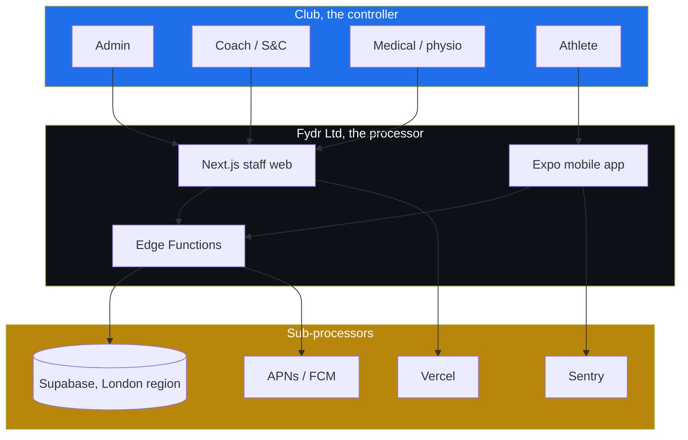
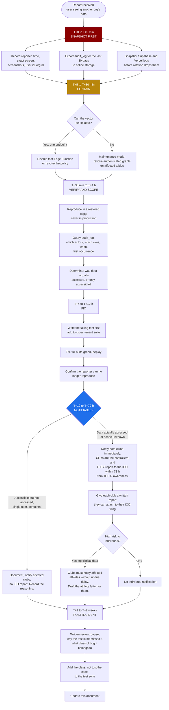

# 09: Security and Compliance

This document is normative. Where it conflicts with convenience, it wins.

Confidence tags are used throughout. `[high]` means I am confident and you can act on it.
`[medium]` means it is my considered reading and you should sanity-check it. `[low]` means
it needs a professional, a client, or a specific test before you rely on it. Nothing here
is legal advice, and I am not a solicitor.

---

## 1. The uncomfortable truth, first

Fydr processes special category health data about identifiable individuals, some of whom
will be under 18, on behalf of organisations that have no data protection capability of
their own. You are one person with no legal budget, no compliance function, and no second
pair of eyes on your row-level security policies.

That is not a reason not to build it. It is a reason to be precise about what the actual
exposure is, because the generic advice ("get a DPIA, appoint a DPO") is mostly wrong for
your situation and will waste money you do not have.

### What the real exposure is

Ranked by likelihood, not by headline size.

| Risk | Realistic likelihood | Realistic consequence |
|---|---|---|
| A cross-tenant RLS bug leaks one club's squad to another | Moderate. This is the single most likely serious failure. | Contract terminated, no reference, effectively unsellable in a small market where clubs talk to each other. |
| Coach sees a diagnosis they should not see | Moderate, via a careless join or a `select *` | Loss of the physio's trust, which is the person who signs off medical use. Possible ICO complaint. |
| Device or laptop loss with cached squad data | Moderate | Notifiable breach, manageable if the local store is encrypted and sessions are revocable. |
| Supabase or GitHub account takeover | Low, and catastrophic. Total data loss plus total data disclosure at the same time. | Business over. |
| ICO enforcement action | Low. The ICO's realistic response to a first breach by a micro-business acting in good faith is a reprimand and an action plan, not a fine. `[medium]` | Time cost, publication of the reprimand, and every future prospect asks about it. |
| Article 82 claim by an athlete | Low individually. UK courts set a de minimis threshold for distress claims (`Rolfe v Veale Wasbrough Vizards`), and `Lloyd v Google` closed off opt-out class actions. A squad-wide leak of injury diagnoses is a different matter. `[medium]` | Individually trivial, collectively existential. |
| Personal, unlimited liability because you never incorporated | Certain, if you have not incorporated | Your house. |

### The three things to do before signing a single club

1. **Incorporate.** A UK limited company costs £100 online and is registered within 24 hours. Signing a data
   processing agreement as a sole trader means your personal assets sit behind every
   clause. Do this first. `[high]`
2. **Register with the ICO and pay the data protection fee.** You will be a controller for
   your own business data (club contacts, staff logins, billing) regardless of your
   processor role for club data. Tier 1 is £52 a year, £47 by direct debit.
   Operating without registering is itself an offence with a fixed penalty. `[high, fee
   figure medium, it changes]`
3. **Buy cyber and professional indemnity insurance.** Clubs will ask, and a broker
   package for a micro-SaaS with health data is affordable relative to the risk. Budget
   £600 to £1,800 a year. `[cost: low confidence, get three quotes]`

Those three cost less than a week of your time and remove the categories of risk that
would end you personally rather than commercially.

### What you should not do

Do not appoint a Data Protection Officer. You almost certainly do not need one. Article 37
requires a DPO where the core activity involves large-scale processing of special category
data. As a **processor** whose core activity is writing software, and at the volumes
involved (tens of clubs, tens of athletes each), the threshold is not met. `[medium]` Do
not spend £5,000 on an outsourced DPO service to look serious to a semi-professional rugby
club. Spend it on a solicitor reviewing the one contract that matters.

---

## 2. Controller and processor: the most important distinction in this document

**The club is the controller. Fydr is the processor.** Get this right in writing and your
liability profile changes fundamentally.

### Why it matters

Under Article 82, a controller is liable for *any* damage caused by non-compliant
processing. A processor is liable only where it has failed a processor-specific obligation
under the Regulation, or where it acted outside or contrary to the controller's lawful
instructions. That is a much narrower door.

The controller also carries the obligations you cannot discharge: determining the lawful
basis, issuing the privacy notice, responding to data subject rights requests, notifying
the ICO within 72 hours of a breach, and running the DPIA. Those are the club's problems.
Your problem is having the mechanisms that let the club discharge them.

### Why the club is the controller

The club decides which athletes are monitored, which metrics are collected, what the
thresholds are, who on their staff sees what, and what they do with the output. That is
determination of purposes and means. Fydr provides the tooling.

### Where you accidentally become a controller

This is the trap. You become a joint controller, and inherit controller liability, the
moment you decide something the club did not ask for.

| Activity | Role | Note |
|---|---|---|
| Storing and serving club athlete data | Processor | The default |
| Running flag thresholds the club configured | Processor | Club sets the rule |
| Club billing contacts, admin logins, support tickets | Controller | Your own business data |
| Product analytics on staff usage of Fydr | Controller | Your purpose, not theirs |
| **Aggregating athlete data across clubs to build benchmarks** | **Controller, and a serious one** | Do not do this in v1. If you ever want to, it needs its own lawful basis, its own notice, and probably explicit consent. |
| **Using club data to train a model or improve flag defaults** | **Controller** | Same. Prohibit it in your own DPA so you cannot drift into it. |

Write into the DPA that Fydr will not process club data for any purpose other than
providing the service, and then honour it. The cross-club benchmark feature is the most
tempting product idea in this space and the most legally expensive.

### What being a processor actually requires of you

Article 28(3) sets out what the DPA must contain, and each clause is an operational
commitment, not a form of words:

| Article 28 requirement | What you must actually build or do |
|---|---|
| Process only on documented instructions | The product does what the contract says and nothing else. No silent data use. |
| Confidentiality commitments from personnel | You are the personnel. Sign it anyway. If you ever hire a contractor, they sign one. |
| Article 32 security measures | Everything in §7 to §10 of this document. |
| Sub-processor authorisation and notice | A published sub-processor list, with 30 days' notice before adding one. See §5. |
| Assist with data subject rights | The product features in §6. Not a manual database query at 11pm. |
| Assist with breach notification, DPIAs, prior consultation | The runbook in §11 and the template DPIA in §5. |
| Delete or return data at end of contract | An export-then-purge process, tested, with a stated timescale. |
| Make available information for audits | The ROPA, the sub-processor list, and a security summary. Clubs at this tier will not audit you, but one will ask for a questionnaire. |

### Trust boundaries



Every arrow crossing into `SUB` is a sub-processor relationship that must be named in the
DPA. Every arrow crossing out of `CLUB` is covered by the club's privacy notice, which you
will have to write for them because they will not write it themselves.

---

## 3. Lawful bases: Article 6 and Article 9

Health data requires **two** bases stacked: an Article 6 basis for processing personal data
at all, and an Article 9 condition for the special category element, plus in most cases a
Schedule 1 condition from the Data Protection Act 2018.

Almost everything Fydr collects is special category health data. Not just the injury
record. Sleep hours, fatigue, soreness, resting heart rate, body mass, body fat percentage,
and menstrual cycle data if you add it (open question O-12) are all data concerning health
under Article 4(15), because they reveal information about physical health status.
Nutrition macros on their own are probably not, but they sit in the same record and will be
treated as if they are. Assume the whole athlete record is Article 9 data. `[high]`

### Why consent is the wrong basis here

Recital 43 says consent is not a valid basis where there is a clear imbalance of power
between the data subject and the controller. The ICO applies that reasoning directly to the
employment relationship, and the same logic holds for a squad athlete and their coach.

Put concretely: an athlete who declines to submit wellness data will be perceived as
uncommitted. Whether or not the coach ever says so, the athlete knows selection is at that
coach's discretion. Consent that a person cannot refuse without consequence is not freely
given, and consent that is not freely given is not consent. It is invalid from the moment
it is given, which means every record collected under it was unlawfully processed.

The second problem is that consent is withdrawable at any time and withdrawal must be as
easy as giving it. If the club's entire monitoring programme rests on consent, any athlete
can switch it off mid-season and the club must comply immediately. That is not a system a
club can run on.

**Consequence for the product**: the consent screen in `03-flows.md` §2 stays, but it is
recharacterised. It is a **transparency and acknowledgement** screen, not a consent
mechanism. It informs, it records that the athlete has been informed and when, and it is
the athlete's entry point to their rights. Rename the fields accordingly:
`athletes.consent_given_at` and `consent_version` become `notice_acknowledged_at` and
`notice_version`. `[high, and it is a schema change, so raise it before Phase 0 ships]`

The exception is genuinely optional processing. HealthKit sync and leaderboard participation
are things an athlete can decline without any effect on their standing, and those *can* run on
consent because refusal is genuinely costless. Keep those as separate, granular, revocable
toggles.

A third item, nutrition photographs, stood here and has gone. Athletes do not log nutrition and
no meal photograph is captured (`screens/nutrition-guidance.md`), so there is no processing to
consent to and the toggle should not be built. The `consent_purpose` enum in `screens/onboarding.md`
has been reduced to two values accordingly.

### The recommended basis stack

| Data | Article 6 | Article 9 | DPA 2018 Sch 1 | Confidence |
|---|---|---|---|---|
| Injury record, clinical detail, availability decisions, rehab | 6(1)(f) legitimate interests, or 6(1)(b) contract for contracted players | 9(2)(h) preventive or occupational medicine, assessment of working capacity | Part 1 para 2, health or social care purposes | `[high]` |
| Wellness, load, RPE, gym, testing, body composition, viewed by coaching staff | 6(1)(f) legitimate interests | See below. This is the hard one. | See below | `[medium]` |
| HealthKit and wearable sync | 6(1)(a) consent | 9(2)(a) explicit consent | Not required | `[high]` |
| Nutrition targets and guidance assigned to an athlete | 6(1)(f) legitimate interests | Not engaged in my view: a coach-set macro target is a training instruction, not a health measurement, and nothing is collected back from the athlete. Where a target is set by medical staff during rehab it travels with the injury record and takes that row's bases. | Not required on this reading | `[low, see O-900]` |
| Leaderboard visibility of an athlete's name and metric to teammates | 6(1)(f), with a genuine opt-out | 9(2)(a) if the metric is health data | Not required | `[medium]` |
| Staff accounts, billing, support | 6(1)(b) and 6(1)(f) | Not applicable | Not applicable | `[high]` |

### The hard one, stated honestly

Article 9(2)(h) works cleanly for the physio, because Article 9(3) requires the processing
to be carried out by or under the responsibility of a professional subject to an obligation
of professional secrecy. A chartered physiotherapist qualifies. A strength and conditioning
coach does not.

So the question is: what is the Article 9 condition for a coach looking at an athlete's
sleep and soreness scores?

The options, none of them perfect:

- **9(2)(b), employment and social security law obligations**, paired with DPA Schedule 1
  Part 1 paragraph 1. This works where the athlete is an employee or worker and the
  processing is necessary for the club's health and safety obligations, which monitoring
  training load plausibly is. It requires an **appropriate policy document** under Schedule
  1 Part 4. It falls apart for genuinely amateur athletes who are not workers at all.
- **9(2)(h) with a stretched reading**, arguing the whole monitoring programme is under the
  responsibility of the club's medical staff even where a coach views the output. This is
  defensible if the physio actually has oversight of the programme and the thresholds. It
  is not defensible if the physio is a part-timer who has never seen the wellness
  configuration. `[medium, and it depends on facts about each club]`
- **9(2)(a) explicit consent**, which brings back the power imbalance problem.

**Practical recommendation**: build the product so the club can rely on 9(2)(b) plus
Schedule 1 Part 1 paragraph 1 where athletes are contracted, and 9(2)(h) with genuine
medical oversight elsewhere, and ship a template **appropriate policy document** to every
club as part of the onboarding pack. The appropriate policy document is a short document
stating the condition relied on, the retention policy, and the compliance procedures. It is
a page and a half, it is a statutory requirement that almost nobody at this tier has, and
producing it costs you an afternoon.

Then design so that the question matters less: minimise what coaches see, keep clinical
detail table-separated, honour objections, and make the athlete-facing transparency
genuinely good. A regulator looking at a well-designed system with an arguable Article 9
condition reaches a very different conclusion than one looking at a badly-designed system
with the same condition.

> **Open question O-950**: are the athletes at your target clubs employees, workers, or
> genuine amateurs? Semi-professional rugby and football sit across all three. The answer
> changes which Article 9 condition is available, and it may differ per club, which means
> the onboarding pack needs a decision point rather than a single answer.

### Automated decision-making

Article 22 restricts decisions based solely on automated processing that produce legal or
similarly significant effects. A flag is advisory: it raises, a human acknowledges, a human
decides. That is not solely automated, so Article 22 does not bite. `[high]`

This stops being true the moment a flag automatically changes an athlete's availability,
automatically removes them from a session, or feeds a selection algorithm. **Do not build
that.** Keep a human in the loop and document that you have, because deselection on
automated grounds would be a "similarly significant effect" and would need explicit consent
or contractual necessity plus safeguards.

---

## 4. Children

**Decided 5 August 2026: under-18s are in scope.** The client has confirmed that academy and
youth squads are part of the product. An earlier draft of this section offered a choice between
Option A, restricting Fydr to athletes aged 18 and over, and Option B, accepting under-18s and
building to the ICO's Age Appropriate Design Code. **Option A is closed. Option B is what gets
built.** O-886 is resolved.

Two consequences follow, and neither is negotiable.

1. **The Children's Code applies in full to every athlete under 18**, not only to under-13s. A
   16 or 17 year old is a child for this purpose. There is no partial compliance and no
   "academy-only" version of the product that sits outside it. `[high that it applies, medium
   on how strictly it would be enforced against a B2B tool used under a club's supervision]`
2. **Article 8 and the UK age of consent for information society services, 13, applies on top**
   to anything genuinely running on consent. See §4.4.

The Code is statutory guidance under section 123 of the Data Protection Act 2018. The ICO must
take it into account when enforcing UK GDPR, so failing it is not itself an offence, it is
evidence that Article 25 data protection by design has not been met. `[high]`

Fydr is not a social product and the Code was written mostly with social products in mind. That
cuts both ways: several standards are easy for a closed club roster, and two of them (detrimental
use, and profiling) are harder for Fydr than for a social app, because the flag system profiles
children and a coach acts on the output.

### 4.1 The fifteen standards as a build checklist

Every standard, what it means here, and what has to exist before an under-18 athlete is
onboarded. The ones marked **bites** are where Fydr has real work to do rather than a paragraph
to write.

| # | Standard | Status for Fydr | Where it is specified |
|---|---|---|---|
| 1 | Best interests of the child | **bites**, see §4.2 | this document, DPIA |
| 2 | Data protection impact assessments | **bites**, mandatory children's section, see §4.9 | §5, DPIA template |
| 3 | Age appropriate application | **bites**, needs age assurance, see §4.3 | `04-data-model.md` §17.16, `screens/onboarding.md` step 4 |
| 4 | Transparency | **bites**, child-facing notice, see §4.4 | `screens/onboarding.md` step 5c |
| 5 | Detrimental use of data | **bites**, the flag system, see §4.5 | `screens/flags.md`, DPA, terms |
| 6 | Policies and community standards | Uphold your own published terms | §5, `13-legal-and-trademark.md` §5 |
| 7 | Default settings | **bites**, see §4.6 | `screens/onboarding.md`, `screens/settings.md`, `screens/leaderboards.md` |
| 8 | Data minimisation | Already the design position, restated for children | §3, §7 |
| 9 | Data sharing | **bites**, who at the club sees what, and parents, see §4.7 | `01-roles-and-permissions.md` §4 |
| 10 | Geolocation | **bites**, GPS on a child, see §4.8 | `04-data-model.md` §8, `07-integrations.md` |
| 11 | Parental controls | **bites**, the child must be told, see §4.7 | `screens/onboarding.md` |
| 12 | Profiling | **bites**, off by default unless justified, see §4.5 | `screens/thresholds.md`, `screens/flags.md` |
| 13 | Nudge techniques | **bites**, cross-check the notification catalogue, see §4.6 | `08-notifications.md` |
| 14 | Connected toys and devices | HealthKit and wearables, see §4.4 and §4.6 | `07-integrations.md` |
| 15 | Online tools | Rights features must be usable by a child | §6, `screens/my-data.md` |

### 4.2 Best interests of the child, standard 1

This is the primary consideration, and it outranks the club's convenience when the two conflict.
It is also the standard most likely to be treated as a platitude, so state the concrete case:

**A coach wants data the child might not want shared.** In Fydr this is not hypothetical. A coach
can see wellness scores including stress and mood, soreness that is a proxy for injury, body
composition, and GPS output. The child cannot decline the core monitoring, because the lawful
basis is not consent (§3) and refusing would carry a perceived selection cost anyway.

The resolution the product takes, and the reasoning:

1. **The coach does not get everything.** Clinical detail stays with medical (`CLAUDE.md` rule 3).
   That separation was built for adults and it does more work for children.
2. **What the coach can see is stated to the child in words a child understands**, at the point
   of collection, not in a policy (§4.4). A child who knows their soreness score reaches their
   coach is in a different position from one who does not.
3. **Anything genuinely optional is off** (§4.6). Leaderboards, photographs, device sync and any
   sharing beyond the club default start off for a minor and stay off unless the child turns them
   on, with the club's involvement where the club requires it.
4. **Where the club's interest and the child's interest conflict and the product cannot resolve
   it, the child's interest wins and the feature does not ship for minors.** That is the rule that
   removed athlete photographs from the minor default and it is the rule to apply to the next
   feature that raises this. `[medium, this is my judgement, not a rule the Code states in these
   words]`

Do not read best interests as "children get less product". A child's interests include being
coached well and not being injured, which is what the monitoring is for. The Code's own framing
is that the child's development, health and wellbeing are what the assessment weighs. Say so in
the DPIA rather than treating it as a pure privacy calculation.

### 4.3 Age appropriate application and age assurance, standard 3

You cannot apply the Code to a child you have not identified. **`athletes.date_of_birth` therefore
stops being optional.** Specified in `04-data-model.md` §17.16: an athlete cannot be invited or
activated without one, enforced by a constraint and by the invite function, and minority is
derived from the date rather than stored as a flag that goes stale on a birthday.

**The age assurance approach: self-declared date of birth, entered by the club at squad creation
and confirmed by the athlete at onboarding.** No document check, no age estimation, no third party
verification service.

The justification, which needs stating because "self-declared" is the weakest form of age
assurance and the Code asks for a level of certainty proportionate to the risk:

- **Fydr is a closed roster, not an open service.** Nobody self-registers. An athlete exists
  because a club admin created them and sent an invite to a named person. The club knows the
  athlete's age because it registers them with a governing body and picks them for age-grade
  fixtures.
- **The risk the Code is guarding against is a child accessing an adult service undetected.**
  Here the direction of error is the opposite: a club has no incentive to understate an athlete's
  age, and understating it triggers *more* protection, not less.
- **The proportionality test therefore lands on self-declaration verified by the club**, with the
  club's confirmation recorded at invite. `[medium, this is the argument I would put to the ICO
  and I believe it holds for a closed B2B roster, it would not hold for a consumer app]`

Two things follow that are easy to miss:

1. **The club is asserting the age, so the club carries the consequence of getting it wrong.** Say
   this in the DPA. The invite screen states it in plain terms to the admin: "You are confirming
   this athlete's date of birth. It decides what protections apply to their account."
2. **A date of birth change after onboarding is staff-only and audited** (`screens/settings.md`),
   and crossing 18 changes defaults going forward only. It never retrospectively opens up data
   that was collected while the athlete was a minor. `[high]`

### 4.4 Transparency, standard 4, and Article 8 for under-13s

**Transparency.** A child-facing version of the privacy information, in plain language, presented
at the point the data is collected, not behind a link. The full copy is specified in
`screens/onboarding.md` step 5c and the same text is reachable at any time from the Me tab. The
target is a reading age of about 12, tested by reading it aloud, and the test of whether it works
is whether a 13 year old can say who sees their soreness score after reading it once.

Bite-sized transparency is also required in place: the wellness screen says who sees the entry,
the GPS card says the club recorded it, the leaderboard toggle says teammates will see the name.
One sentence each, at the control.

**Article 8 and under-13s.** The UK age at which a child can consent to an information society
service on their own is **13**. Below that, consent must be given or authorised by a holder of
parental responsibility, and reasonable efforts must be made to verify that. Because the core
monitoring does not run on consent (§3), this bites only on the genuinely consent-based extras:
HealthKit and wearable sync, leaderboard visibility, and photographs.

**The decision for v1: under-13 athletes are out of scope contractually, and it is enforced in
the product.** Reasoning:

- The consent-based extras are the only things affected, and all three are already off by default
  for every minor (§4.6). A compliant under-13 experience would therefore be an account with every
  optional feature permanently unavailable, plus a parental verification flow built to serve it.
- Verifiable parental consent is genuinely hard. Email to a parent's address is the common
  approach and it is weak. Anything stronger costs money per athlete.
- The commercial loss is small. The client's academy and youth interest is age-grade squads that
  sit above 13 in the sports concerned. **Confirm this, because if under-13 mini and junior squads
  are in scope the answer changes and the parental consent flow has to be built.** O-961.

Enforcement, so that "out of scope contractually" is not just a sentence in a contract:

1. The invite function rejects a date of birth that makes the athlete under 13 at the time of
   invite, with a message to the admin naming the reason.
2. A stored athlete who turns out to be under 13 cannot be activated. The account is held and the
   admin is notified, using the same holding path as a declined notice.
3. The club contract states the 13 minimum and places the age assertion on the club.
4. It is a **club-level** rule, not a per-athlete override. No setting turns it off.

`[medium on the whole under-13 position: it is defensible and it is a product decision rather
than a legal requirement. Nothing prevents you serving under-13s if you build the parental
consent flow.]`

### 4.5 Detrimental use, standard 5, and profiling, standard 12

**The flag system is profiling of children.** A threshold evaluates an athlete's data
automatically, classifies them, and raises an alert that a coach acts on. Calling it "monitoring"
does not change what it is. Standard 12 says profiling should be off by default unless there is a
compelling reason to turn it on, and there are appropriate measures to protect the child from
harmful effects.

**The compelling reason, stated so it can be tested rather than assumed:** flags exist to detect
accumulated fatigue, acute wellness drops, and load spikes that precede soft tissue injury in a
population of growing athletes who are poor at self-reporting risk. Turning profiling off for
minors would mean the injury-prevention purpose of the product does not apply to the group most
at risk from it. That is not in the child's best interests. **So profiling stays on for minors,
and it is the safeguards that carry the weight.** `[medium, and this is the single argument in
this document most likely to be challenged by a DPO, so it belongs in the DPIA in exactly these
terms rather than as an assertion]`

The safeguards, which are conditions of that conclusion and not optional extras:

1. **Advisory only, human in the loop, already required by §3 for Article 22.** For a minor,
   restate it as a contractual prohibition rather than a design note.
2. **Detrimental use is prohibited in the club contract.** Flags, compliance percentages, wellness
   scores and any derived score must not be used for deselection, release, contract or scholarship
   decisions, or academy exit. Add this to the DPA and to the terms as a children's data clause
   (`13-legal-and-trademark.md` §5). It is unenforceable in practice and it is still worth having,
   because it tells the club that the product is not for that and it gives the ICO something to
   read. `[medium on enforceability, high on it being the right clause]`
3. **The flag is explained to the child in child-facing words** when it becomes visible to them:
   what it is, what it is not, what happens next, and that a person decides.
4. **No score is shown to a minor that ranks them against teammates** unless they turned the
   leaderboard on themselves (§4.6).
5. **`athlete.flag.shared` stays default off for minors**, as it is for everyone
   (`08-notifications.md` §2), and it is the club's decision to enable it per athlete, not a
   squad-wide toggle. A child receiving a push saying a flag was raised about them, with no adult
   present, is the failure mode to design against.

**What would break this argument**: a club using flag counts in selection, or a "readiness score"
appearing on a team sheet. If either happens, profiling for minors has to be reconsidered and the
answer may be that flags for minors are staff-visible only.

### 4.6 Default settings, standard 7, nudge techniques, standard 13, and connected devices, standard 14

**High privacy by default, and the defaults differ for minors.** This is specified at each feature
as well as here, because a default written only in the security document is a default that does
not ship.

| Setting | Adult default | **Minor default** | Where specified |
|---|---|---|---|
| Leaderboard visibility | Opt-out, athlete is on the board | **Off. Opt-in only, and the athlete turns it on themselves** | `screens/leaderboards.md` |
| Athlete photograph | Org setting, off by default | **Off, and not overridable at org level for minors** | `06-design-system.md` O-613, `screens/settings.md` |
| Device and HealthKit sync | Off, opt-in | Off, opt-in, **and the consent screen names the parent involvement rule where the club sets one** | `screens/onboarding.md` step 6 and 8 |
| GPS output visible to the athlete's own screens | On | On, unchanged. Visibility to anyone beyond club staff: **off, no exceptions** | §4.8 |
| Flag visibility to the athlete (`athlete.flag.shared`) | Off | Off, **and org cannot lock it on for minors** | `08-notifications.md` §2 |
| Weekly personal summary push | Off | Off | `08-notifications.md` §2 |
| Leaderboard weekly push | Off | **Off and unavailable while leaderboard visibility is off** | `08-notifications.md` §2 |
| Any future optional sharing | Decide per feature | **Off. The default for a new optional feature for a minor is off** | this document |

**Nudge techniques, standard 13, and the notification cross-check.** The standard prohibits
nudging children towards lower privacy settings or towards providing more data than they need to.
Fydr's notification catalogue was written against a different rule (`08-notifications.md` §1, do
not nag) and it mostly lands in the right place already. The cross-check, done rather than
promised:

| Mechanic | Verdict against standard 13 |
|---|---|
| `athlete.wellness.prompt`, `athlete.rpe.prompt` | **Fine.** A prompt for an expected entry the club requires is not a nudge towards more data, it is the service. |
| `athlete.wellness.nudge`, `athlete.rpe.nudge` | **Fine as constrained.** §3.6 caps them at one per entry, one per day, three per rolling week, stops after three consecutive missed days, and forbids guilt and streak language. **Tighten for minors: two per rolling week, and the cooling-off starts after two consecutive missed days.** A compliance chase aimed at a 16 year old is the exact mechanic the standard is about. |
| Streaks, badges, celebration | **Already banned** (`08-notifications.md` §2 deliberately absent, `06-design-system.md` §13.2). Keep it banned and say why: it is a Children's Code prohibition now, not only a tone preference. |
| `athlete.compliance.weekly`, `athlete.leaderboard.weekly` | **Fine, both default off.** They must not be defaulted on for minors to drive engagement. |
| The optional extras screen at onboarding | **Watch this one.** Copy that presents an off toggle as something the athlete is missing out on is a nudge. `screens/onboarding.md` step 6 copy is neutral and must stay neutral. No "recommended", no pre-ticked box, no visual emphasis on the on state. |
| Any future re-prompt to reconsider a declined consent | **Prohibited for minors.** Ask once. A declined optional consent is not re-asked. |

**Connected toys and devices, standard 14.** HealthKit, Health Connect and vendor wearables are
in scope of this standard. The requirements Fydr must meet: the child is told what the device
shares before the connection is made, the connection is visible and reversible from the Me tab at
any time, disconnecting stops future collection immediately, and the product never presents
device data as authoritative about the child's health. `07-integrations.md` already specifies
read-only access and honest per-metric status, which is most of it. What is new for minors is
that the connection screen names the club's parental involvement rule where one is set, and that
device sync is never a precondition for anything.

### 4.7 Data sharing, standard 9, and parental controls, standard 11

**What the club can see is already the permission matrix** (`01-roles-and-permissions.md` §4) and
it does not change for minors. What changes is that it has to be **explained** to the child in
their own notice, and that the answer to "can a parent see this" needs stating, because clubs will
ask and the intuitive answer is wrong.

**Parents are not automatically entitled to see everything.** A holder of parental responsibility
has rights *in respect of* a young child's data, exercised on the child's behalf. As a child
matures the child's own rights take precedence, and by the mid-teens the ordinary UK position is
that a competent child exercises their own data rights and a parent does not get access simply by
asking. There is no fixed statutory age for this in data protection: the Scottish presumption
that a child of 12 or over is generally of sufficient maturity is the usual reference point, and
it is a presumption rather than a rule. `[medium, this is a genuinely grey area and it needs the
solicitor drafting the terms to confirm the position you take]`

The product position:

1. **There is no parent role and no parent login in v1.** A parent who wants information asks the
   club, and the club answers as controller. This is the honest reflection of who holds the
   relationship, and it avoids building an access path that would need its own permission model
   and its own abuse case.
2. **Where a club requires parental involvement for a minor's optional consents**, that is a club
   process at invite (a form, a conversation), recorded as a flag on the invite, and the product
   requires it before the optional toggles become available. It is not a login.
3. **If a parent or club is monitoring a child, the child is told.** Standard 11 is explicit about
   this. Where the club has set parental involvement on, the child's onboarding says so in the
   plain-English notice, and the Me tab shows it as a standing statement, not a one-off screen.
4. **A parental access request is a rights request to the club**, handled through the same
   decision-support screen as any other, with the child's view taken into account. This is a
   process, not a feature. `[medium]`

O-962 asks whether a parent role is needed at all in a later phase. My position is no, and that
the moment a parent gets a login the product becomes something else.

### 4.8 Geolocation, standard 10

The standard says geolocation should be off by default, that there must be an obvious sign to the
child when location is being tracked, and that any option that makes a child's location visible
to others must default back to off at the end of each session.

**The fact that changes the analysis: Fydr does not collect device location.** The mobile app has
no location permission and must not acquire one. `gps_records` (`04-data-model.md` §8) holds
**aggregated movement metrics** imported from a club-issued vendor pod: distances, speeds,
accelerations, player load. There are no coordinates and no trace of where the child was.

That is a materially weaker intrusion than the standard is aimed at, and it is not zero. It is
still automated tracking of a child's physical movement, gathered by a device the club puts on
them. So the rules, stated as rules:

1. **The app never requests location permission.** If a future feature needs it, it is a new DPIA
   and a decision at this level, not a library that quietly adds a permission string.
2. **`gps_records` for a minor is visible to club staff and the athlete, and to nobody else.** It
   is never exported to a third party, never leaderboarded outside the club, never in a public
   report.
3. **The athlete can see what was recorded about them**, on their own screens, in plain language.
   Data collected about a child that the child cannot see is the thing to avoid.
4. **If raw coordinate data is ever imported**, it is out of scope until it has its own
   assessment. Set the vendor profile allow-list to reject coordinate columns rather than storing
   them in `raw` (this is the children's-code reason to close O-58 the strict way).
5. **The obvious indicator**: where a session is being recorded by GPS, the athlete's session card
   says so. Not a permission dialogue, a plain statement on the screen where the session appears.
   `[medium, the standard is written for phone location and this is my proportionate reading of
   it for pod data]`

### 4.9 Online tools, standard 15, and the DPIA

**Online tools.** A child must be able to exercise their data rights easily, through a mechanism
suited to their age. Fydr's rights features already exist as product features (§6) and the change
for children is presentation, not plumbing: the Me tab's privacy section uses the child-facing
wording, the export is one action with a plain description of what it contains, and the wording
of the objection and deletion paths does not require a child to know the word "erasure". No
child-facing right may require an email to an address.

**The DPIA.** A Children's Code section in the DPIA is now **mandatory, not optional**. Standard 2
requires a DPIA that specifically addresses risks to children, and Article 35(3) is met several
times over here (§5). The children's section must contain, at minimum:

1. The age range actually served, and how age is established (§4.3).
2. The best interests assessment (§4.2), written as an assessment with a conclusion, not a
   statement of intent.
3. The profiling justification (§4.5), including what would invalidate it.
4. The default settings table (§4.6) as evidence of standard 7.
5. The parental involvement position (§4.7).
6. The geolocation analysis (§4.8), including the fact that no coordinates are held.
7. The risks accepted and the mitigations, with residual risk rated.

Write it as part of the template DPIA that goes to every club, not as a separate document. A club
adopting the DPIA is adopting the children's section with it, which is how the club ends up on
record about how it treats its academy.

### 4.10 What is still a judgement call

Stated plainly, because none of the above is legal advice and three parts of it are contestable.

- The age assurance argument in §4.3. Proportionate for a closed roster, and it is an argument
  rather than a settled position. `[medium]`
- The profiling justification in §4.5. It is the right answer for an injury-prevention product
  and a DPO may still say flags should be staff-only for minors. `[medium]`
- The parental access position in §4.7, which is the greyest thing in this section. `[medium]`

> **Open question O-960**: which age grades are actually in scope, per club? "Academy" means
> under-23 at one club and under-16 at another. The answer sets the age assurance risk, the
> under-13 rule in §4.4, and whether age-grade groups need to exist as a first-class concept
> rather than an ordinary group.
>
> **O-961**: are under-13 athletes in scope? §4.4 puts them out of scope and enforces 13 as the
> minimum. If mini and junior squads are wanted, the parental consent flow has to be built and
> that is a separate piece of work, not a setting.
>
> **O-962**: is a parent or guardian login ever wanted? My position is no. Confirm, because the
> answer changes the permission model rather than a screen.
>
> **O-963**: does any club intend to use Fydr output in selection, release, or scholarship
> decisions? If yes, say so now. The detrimental use prohibition in §4.5 is the load-bearing part
> of the profiling argument and a club that will not accept the clause is a club that cannot have
> minors on the platform.
>
> **O-964**: the child-facing notice copy in `screens/onboarding.md` step 5c needs a solicitor's
> read alongside the adult notice (O-319). It is the artefact the club relies on and it is the
> one deliverable in this workstream with an external dependency.

---

## 5. The documents you actually need

Eight documents. **One** needs a solicitor. One needs a cheap review. The other six you
write yourself from ICO templates. All figures in `13-legal-and-trademark.md`, which is the
source of truth for costs.

| Document | Who owns it | Lawyer needed? | Effort |
|---|---|---|---|
| Data Processing Agreement (Article 28) with each club | You provide, club signs | Reviewed once, then reused | 1 day to draft, £800 to £1,500 to review `[cost: low]` |
| Master services agreement / terms of service | You provide | **Yes.** This is the one. | £1,000 to £2,500 `[cost: low]` |
| Privacy notice for athletes | Club is the controller, so it is theirs. You write the template. | No | 1 day |
| Records of processing (Article 30(2), processor version) | You | No | Half a day |
| Data protection impact assessment | Club is the controller. You write the template. | No, but needs clinical input | 3 days, being 2 plus a day for the mandatory Children's Code section (§4.9) |
| Data breach response plan | You | No | Half a day, and see §11 |
| Appropriate policy document (DPA 2018 Sch 1 Part 4) | Club, template from you | No | 2 hours |
| Sub-processor list | You, published | No | 1 hour |

### Where the money should go

Not the DPA. Article 28 prescribes most of its content, good templates exist, and a club at
this tier will sign whatever you put in front of them.

**Spend the money on the master services agreement**, because that is where your commercial
liability lives: the liability cap, the indemnity position, the service level (or the
explicit absence of one), the termination and data return terms, and the clause that says
you are not providing medical advice. A solo developer signing an uncapped indemnity to a
club is the single most expensive mistake available in this project, and it is a mistake
made in a contract nobody reads.

**Important limit on liability caps**: a cap in your contract with the club binds the club.
It does not bind an athlete who brings an Article 82 claim directly, and it does not bind
the ICO. Caps manage commercial risk between the parties, not regulatory or data subject
risk. Do not let a favourable cap make you relaxed about the technical controls.

### Is a DPIA legally required?

**Yes, for the club, and you should write it for them.** `[high]`

Article 35(1) requires a DPIA where processing is likely to result in a high risk to rights
and freedoms. Article 35(3)(b) specifically names processing on a large scale of special
category data. Whether 40 athletes is "large scale" is arguable, but the ICO's screening
criteria are met on several counts independently:

- Special category data (health)
- Systematic monitoring of individuals
- Profiling with an effect on the individual (flags influencing load and selection)
- Vulnerable data subjects, because of the power imbalance and, since 5 August 2026, under-18s
  as a confirmed part of the population (§4)
- Innovative use of technology (device sync in later phases)

Meeting two of the ICO's criteria is enough to trigger a DPIA. Fydr meets four or five.

The obligation sits with the controller, so strictly it is the club's DPIA. Practically,
the club cannot write one. Write a template DPIA covering the standard deployment, hand it
to each club at onboarding, and have them review, adapt, and adopt it as theirs.

Do this early, not at launch. A DPIA written before the build shapes the design, which is
what Article 25 data protection by design actually requires. A DPIA written afterwards is
a document that justifies decisions already made, and it will be obvious.

It is also, unexpectedly, your best sales asset. Handing a club chairman a completed DPIA
is a stronger differentiator against a spreadsheet than any feature in the product.

### Sub-processor list

Publish it at a stable URL and reference it from the DPA. Minimum contents:

| Sub-processor | Purpose | Location | Transfer mechanism |
|---|---|---|---|
| Supabase | Database, auth, storage, functions | Choose the **London (eu-west-2)** region | UK, none needed for the data at rest. Supabase Inc is US-incorporated, so an International Data Transfer Addendum still applies to support access. `[medium]` |
| Vercel | Staff web hosting | Configure functions to a London or EU region | UK IDTA / UK Addendum to EU SCCs |
| Apple APNs, Google FCM | Push notification delivery | US | UK Addendum. Note push payloads must never contain health data. See §7. |
| Sentry or equivalent | Error monitoring | Use the EU region if you adopt it | UK Addendum |
| Expo / EAS | Build and over-the-air updates | US | UK Addendum. Also a supply chain risk. See §9. |
| Email provider (Resend, Postmark, similar) | Invites, reports, notifications | Check region | UK Addendum |

**Choose the London Supabase region at project creation.** You cannot change it later
without a migration, and "our data stays in the UK" removes an entire conversation with
every club. `[high]`

---

## 6. Athlete rights, as product features

Rights requests go to the controller, which is the club. Fydr's job is to make the club
able to answer one within the one-month statutory deadline without emailing you. Every
right below maps to a concrete feature, and if the feature does not exist the right cannot
be honoured.

### Article 15, right of access

**Feature**: an admin-triggered "generate subject access pack" action on the athlete
profile, producing a single archive containing every row referencing that athlete across
every table, plus the metadata Article 15 requires: purposes, categories, recipients,
retention periods, source of the data, and the existence of the other rights.

**The awkward part**: a subject access request captures the physio's clinical notes.
`01-roles-and-permissions.md` carve-out 1 hides those from the athlete in the UI. That
carve-out is a product decision, not a legal exemption. The athlete has a statutory right
to them unless an exemption applies.

The relevant exemption is the serious harm test in DPA 2018 Schedule 3 Part 2: health data
may be withheld where disclosure would be likely to cause serious harm to the physical or
mental health of the data subject or another person, and the controller must obtain the
opinion of an appropriate health professional before relying on it. `[medium]`

**Product consequence**: the SAR pack generation must route through the medical role.
Clinical notes are included by default, and the physio can mark specific notes as withheld
with a recorded reason before the pack is released. Withholding is the exception and
requires a positive act by a clinician. Do not build it the other way round, where clinical
notes are excluded by default and the athlete has to know to ask.

Log every SAR generation to `audit_log`.

### Article 20, right to data portability

**Feature**: an athlete-initiated "export my data" action in the Me tab, producing
structured JSON plus CSV.

**Scope is narrower than access, and the difference matters.** Portability covers only data
the athlete *provided*, processed by automated means, on the basis of consent or contract.
It does not cover derived or observed data. So:

| In scope for portability | Out of scope for portability (but in scope for access) |
|---|---|
| Wellness entries as submitted | `readiness_score` (derived) |
| Nutrition targets set for them | Flags raised against the athlete |
| Training RPE and duration | ACWR and rolling baselines |
| Gym set logs | Coach notes and overrides |
| Profile details they entered | Test results recorded by staff |
| HealthKit data they consented to sync | Availability decisions made by medical |

Build one export engine with two manifests. The athlete-facing export is the portability
set. The SAR pack is everything.

### Article 16, right to rectification, and the immutability rule

This is the interesting one, because CLAUDE.md rule 6 says entries are immutable and
corrections create revisions.

**Immutability and rectification are compatible, but only if you are careful about three
things.**

1. **The rectified value must be the one that is used everywhere.** A revision that appears
   in history but does not propagate into `mv_daily_athlete_summary`,
   `mv_wellness_baselines`, or a flag evaluation is not rectification. It is an annotation.
   Every read path, every materialised view, and every export must resolve to the live
   revision (`superseded_by is null`) by default. Superseded rows are visible only in an
   explicit "show revision history" view.
2. **Rectification of an inaccuracy is not the same as a correction of a genuine entry.**
   If an athlete mistyped 6 hours of sleep as 60, the revision chain is exactly right: both
   values are true records of what happened, one is a correction. If a coach recorded a
   staff-entered value that is simply wrong about the athlete, and the athlete objects, the
   original may need to stop existing as a readable value. A revision chain leaves the
   incorrect claim in the record.
3. **Therefore you need redaction as well as revision.** Add to every entry table:

```sql
-- Applied to wellness_entries, training_entries,
-- gym_session_logs, test_results, and injury_clinical.
alter table wellness_entries
  add column redacted_at        timestamptz,
  add column redacted_by        uuid references users(id),
  add column redaction_reason   redaction_reason;   -- rectification|erasure|error

create type redaction_reason as enum ('rectification','erasure','error');
```

Redaction nulls the payload columns while preserving the row skeleton: `id`, `org_id`,
`athlete_id`, `entry_date`, and the redaction metadata. This keeps referential integrity
and the audit trail intact while removing the data. It is the mechanism for both
rectification-by-removal and erasure (below). Redaction is an admin action, always audited,
and it is the only permitted mutation of an entry row.

Note the interaction with the RLS pattern in `04-data-model.md` §14, which says "nobody
updates". Redaction needs an update path. Implement it as a `security definer` function
with its own grant, not as a policy that opens general updates. `[high]`

### Article 17, right to erasure, and the tension with retention

**State the tension plainly, because a club will ask and you need a defensible answer.**

An athlete who leaves a club and asks for erasure is asking the club to delete records the
club may have a legitimate reason to keep. Article 17(3) provides the exceptions: erasure
does not apply where processing is necessary for compliance with a legal obligation, for
the establishment, exercise or defence of legal claims, or for reasons of public interest
in the area of public health including occupational medicine under Article 9(2)(h).

The defensible position, per data type:

| Data | Erasable on request? | Reason |
|---|---|---|
| Wellness, RPE, gym logs, GPS, test results | **Yes**, generally | Once the athlete has left, the club's legitimate interest in retaining their subjective wellness scores is weak and will not survive a balancing test. |
| Injury records and clinical detail | **No, generally not** | Article 17(3)(b) and (c). Occupational health records, and directly relevant to the establishment or defence of a personal injury claim. Retain per §7's schedule. |
| Availability history linked to injuries | **No** | Same reasoning. It is part of the injury record. |
| Identity and contact details | **Partially** | Retain the minimum needed to link retained injury records. Pseudonymise the rest. |
| Audit log entries | **No** | Article 17(3)(b). The log is the evidence that processing was lawful, including the erasure itself. |
| Backups | **Deferred, not exempted** | See below. |

**Backups.** You cannot surgically delete a row from a point-in-time backup. The ICO's
accepted position is that data put "beyond use", meaning no access, no further processing,
protected by appropriate technical measures, and deleted on the normal rotation, satisfies
the obligation. `[medium, but it is the established practical reading]` State this
explicitly in the privacy notice: "erasure takes effect on live systems immediately and on
backups within 30 days as they rotate".

**Feature**: an admin "process erasure request" flow on the athlete profile that shows
exactly what will be redacted and what will be retained, with the Article 17(3) reason
displayed against each retained category, requires confirmation, executes the redaction,
writes to the audit log, and produces a confirmation record the club can send to the
athlete. Not a delete button. A decision-support screen.

This is also where CLAUDE.md rule 4 ("athlete data is never hard-deleted") is satisfied:
erasure is redaction plus soft delete plus audit, never `DELETE FROM`.

### Article 21, right to object

Applies where processing is based on legitimate interests, which is most of Fydr. The
controller must stop unless it demonstrates compelling legitimate grounds that override the
athlete's interests.

**Feature**: per-domain processing suspension on the athlete record. An athlete who objects
to wellness monitoring but not gym logging gets wellness collection switched off, their
existing entries retained but excluded from squad views, and their compliance expectations
waived with reason `objection`. Not account deactivation. The all-or-nothing response
guarantees a complaint.

The worked example here used to be nutrition, and nutrition is now the one domain that cannot
appear on the objection list: Fydr publishes guidance to the athlete and collects nothing back,
so there is nothing to suspend. The domains that can be objected to are wellness, session RPE
and load, gym, GPS and testing.

Note this connects to the existing `compliance_expectations.waived_reason` field, which
already supports it.

### Article 7(3), withdrawal of consent

Only applies to the genuinely consent-based items: HealthKit, wearables, and leaderboards.
Withdrawal must be as easy as giving consent.

**Feature**: toggles in the athlete's Me tab, immediate effect, no confirmation friction,
and withdrawal stops future collection. It does not retroactively erase past collection,
which is correct: withdrawal is prospective, and the pre-withdrawal processing was lawful.
Say so in the UI in one sentence so nobody is surprised.

### Deadlines

One month from receipt, extendable by two further months for complex or numerous requests,
with the athlete informed of the extension within the first month. Build an internal
"requests" queue with due dates visible to the club admin, or the deadline will be missed
by a part-time club secretary who put the email in a folder.

---

## 7. Data retention schedule

Retention is a legal requirement (storage limitation, Article 5(1)(e)) and a risk control:
data you have deleted cannot leak. This schedule is the default; a club may contract for
different periods and the setting is per-organisation.

| Data | Retention | Clock starts | Justification |
|---|---|---|---|
| `injury_clinical` (diagnosis, notes, treatment) | 8 years. For athletes under 18 at the time of record: until their 25th birthday, or 8 years, whichever is longer. | Last treatment entry on the injury | Aligns with the NHS Records Management Code of Practice for adult health records and children's records. It is the defensible standard even though a club is not an NHS body, and it comfortably covers the Limitation Act three-year personal injury period (running from age 18 for minors). `[high on the standard, medium on its applicability to a semi-pro club]` |
| `injuries`, `availability`, `rehab_assignments` | As `injury_clinical` | Injury closure | Part of the same record. Splitting retention across the clinical boundary produces orphaned availability rows. |
| `wellness_entries`, `training_entries`, `gym_session_logs`, `gym_set_logs` | Current season plus 3 completed seasons | Season end | Multi-season load history has genuine analytical value. Beyond four years, squad turnover at this tier means the data describes athletes who have left. |
| `nutrition_entries` | No schedule needed | Not applicable | The table is dormant and holds no rows: athletes do not log nutrition (`screens/nutrition-guidance.md`). It stays in the schema for the periodic-audit option in §9 of that screen. If it is ever populated, it takes the row above. |
| `gps_records` | Current season plus 3 completed seasons | Season end | As above |
| `device_metrics` (HealthKit, wearables) | 24 months | `metric_date` | Higher sensitivity (continuous passive collection, collected off-duty) and shorter analytical shelf life. Shorter than self-reported data deliberately. `[high, and it is now the highest value line in this table]` |
| `test_results`, `body_composition` | Current season plus 5 completed seasons | Test date | Longitudinal benchmarks (a 1RM from four years ago is still a meaningful reference point). Lower volume, lower sensitivity. |
| `import_batches` raw uploaded files | 30 days | Upload | Retained only for reconciling a failed import. |
| `audit_log`, general events | 24 months | Event | Security investigation window. |
| `audit_log`, consent, erasure, SAR, clinical read, support access, role change | 6 years | Event | Evidence of compliance, aligned with the general contractual limitation period. |
| Auth logs, IP addresses, session records | 12 months | Event | Security monitoring. Longer is not justifiable. |
| Athlete identity and contact details | Duration of squad membership plus 12 months, then pseudonymise, retaining only the link needed for retained injury records | `athletes.left_at` | Contact for records and post-departure queries. |
| Deactivated staff accounts | 12 months, then anonymise | Deactivation | Preserves audit log attribution (`created_by`, `set_by`) without retaining a live identity. |
| Backups: Supabase PITR window | 30 days | Continuous | See §8.6 |
| Backups: independent weekly offsite | 90 days | Weekly | See §8.6 |
| Fydr's own sales and marketing contacts | 24 months from last meaningful contact | Contact | Fydr is controller here. |
| Terminated club: full data | Exported to the club within 30 days, purged within 60 days | Contract end | Article 28(3)(g). Put the exact days in the DPA. |

**The highest value line has changed, and it is worth saying which and why.** It used to be
nutrition photographs at 90 days, on the argument that a photo may contain faces, homes and
other people, and that deleting it early removed a disproportionate share of the total risk for
almost no analytical loss. No nutrition photograph is ever captured now, so that line has gone
rather than been shortened.

The line that now carries the same argument is **`device_metrics` at 24 months**. It is the only
category collected passively and continuously, including off-duty, without the athlete taking an
action each time. It is therefore the highest volume of the most sensitive data per athlete, and
its analytical shelf life is the shortest in the table, because a sleep series from three years
ago informs nothing a coach is deciding today. Same trade, same reasoning, different row. If one
retention period in this schedule is worth defending in a negotiation with a club that wants
everything kept forever, it is this one.

**Implementation**: a nightly Edge Function that applies the schedule per organisation,
redacts rather than deletes, writes a summary row to `audit_log`, and refuses to run
without a dry-run mode. Retention automation that silently destroys data is worse than no
automation. Run it in report-only mode for the first three months in production and read
the reports.

> **Open question O-52** (supersedes and specifies O-13): confirm the four-season retention
> for performance data and the eight-year retention for clinical data. Both are defaults
> that will end up in the club contract, and changing them later means renegotiating with
> every existing club.

---

## 8. Technical security controls

### 8.1 Authentication

Supabase Auth, email and password, with a magic-link fallback for athletes who forget
theirs (which will be most of them, most weeks).

| Control | Setting | Reason |
|---|---|---|
| Minimum password length | 12 characters | NCSC guidance. Length beats composition. |
| Composition rules | **None** | Forced symbols and mixed case produce `Password1!` and a sticky note. NCSC explicitly advises against them. |
| Breached password check | **On.** Supabase has HaveIBeenPwned integration on paid plans; otherwise call the k-anonymity range API yourself. | Credential stuffing is the realistic attack, not brute force. |
| Forced rotation | **Off** | NCSC advises against routine expiry. Rotate on evidence of compromise only. |
| Failed login lockout | Exponential backoff, plus CAPTCHA after 5 failures | Supabase has built-in rate limits; do not rely on them alone. |
| MFA for coach, medical, admin | **Mandatory** | See below. |
| MFA for athletes | Optional, encouraged, plus device biometric app lock | Mandating TOTP on 40 semi-pro athletes will destroy adoption, and their account only exposes their own data. |

**Enforcing staff MFA properly.** Supabase Auth supports TOTP factors and expresses
assurance level in the JWT `aal` claim. Do not enforce MFA in the UI, because the UI is not
the security boundary. Enforce it in RLS:

```sql
-- Helper, alongside those in 04-data-model.md §14
create or replace function auth_is_aal2() returns boolean
  language sql stable as $$
    select coalesce(auth.jwt() ->> 'aal', 'aal1') = 'aal2'
  $$;

-- Every staff-scope policy gains the check. Example, replacing
-- wellness_staff_select from 04-data-model.md §14:
create policy wellness_staff_select on wellness_entries for select
  using (
    org_id = auth_org_id()
    and auth_has_any_role(array['coach','medical']::app_role[])
    and auth_is_aal2()
  );
```

The result: a staff user who has not completed the second factor can authenticate but
cannot read squad data at the database level. That is a real control rather than a hidden
button. `[high]`

**Session lifetime.**

| Client | Access token | Refresh token | Rationale |
|---|---|---|---|
| Athlete mobile | 1 hour | 60 days, rotating | Compliance dies if athletes log in weekly. The device is the second factor in practice. |
| Staff web | 1 hour | 12 hours idle, 7 days absolute | Shared club laptops exist. A physio's browser session must not be open a week later. |
| Medical role, any client | 1 hour | 8 hours idle | Highest sensitivity, and physios are usually on their own device for a session at a time. |

**The access token is stateless and cannot be revoked.** This matters and is routinely
misunderstood. Revoking a refresh token or suspending a user stops the *next* refresh; it
does not invalidate a live JWT. With a 1 hour access token, worst-case exposure after
revocation is 60 minutes. Do not raise the access token TTL to reduce request volume. If
you need faster revocation than that, add a `users.session_epoch` integer checked in the
RLS helper, which costs a lookup per policy evaluation. Do not build that in v1. `[high]`

**Device trust.** v1 scope: a "signed-in devices" list in Settings showing device name,
platform, last seen, and location by IP; a "sign out this device" and "sign out everywhere"
action; and automatic sign-out-everywhere when an admin suspends a user. Do not build
device attestation or trusted-device enrolment.

### 8.2 Authorisation

Row-level security, per `04-data-model.md` §14, with roles carried in JWT custom claims.
Three additions to that specification.

**1. `service_role` is the real danger.** The Supabase `service_role` key bypasses RLS
entirely. Consequences to enforce:

- The service role key never appears in the mobile bundle, the Next.js client bundle, or
  any `EXPO_PUBLIC_*` or `NEXT_PUBLIC_*` variable. A CI check greps the built artefacts for
  it and fails the build.
- Edge Functions using the service role must apply `org_id` scoping in application code,
  explicitly, on every query. Every such function carries a comment stating why it needs
  the elevated key.
- Prefer passing the caller's JWT through to PostgREST so RLS still applies. Use the
  service role only where genuinely necessary: the nightly retention job, the compliance
  expectation generator, the materialised view refresh, and the flag engine.
- The anon key **is** public by design and its exposure is not a breach. It is safe only
  because RLS is correct. That is the whole security model, stated in one sentence, and it
  is why the test suite below is mandatory.

**2. The cross-tenant test suite.** `01-roles-and-permissions.md` §6 makes this mandatory.
Specification:

- Seeds two organisations, A and B, each with a complete data set: athletes, groups,
  sessions, entries across every domain, injuries with clinical detail, flags, programmes,
  saved views, audit entries.
- Creates one user per role in each organisation: eight users, plus an anonymous client and
  an authenticated user with no role at all.
- **Enumerates tables dynamically** from `information_schema.tables` rather than from a
  hard-coded list. A new table added without a policy must fail the suite by default. This
  is the single most important design choice in the harness.
- For every table and every user: asserts zero rows returned with a foreign `org_id`.
- For every table and every user: attempts `insert`, `update`, and `delete` with a foreign
  `org_id` and asserts failure.
- Asserts `rowsecurity = true` on every table in `pg_tables` for the public schema, and
  that every table has at least one policy.
- Asserts the specific carve-outs: a coach reading `injury_clinical` returns zero rows in
  their own organisation; an athlete reading `injury_clinical` for their own injury returns
  rows but not through a path exposing `clinical_notes`; an admin reading
  `wellness_entries` returns zero rows; a staff user without AAL2 returns zero rows.
- Asserts an athlete cannot insert a `wellness_entries` row with `source <> 'self_report'`
  or with another athlete's `athlete_id`.
- Runs against a real Postgres instance in CI, not a mock. Blocks merge on failure.

Write this in Phase 0, before the second table exists. Retrofitting it after 40 tables is a
week of work you will not do.

**3. Clinical data is separated at table level, not column level.** Already stated in
`01-roles-and-permissions.md` §4 and `04-data-model.md` §9. The reason, stated once
properly:

Column-level filtering means the sensitive value is present in every result set and is
removed by application logic. That works until one careless `select *`, one new endpoint
that forgets the projection, one debug log line, one error report to Sentry containing the
row, or one GraphQL-style client that requests fields dynamically. Every one of those is a
breach, and each is a single line of ordinary-looking code.

Table-level separation means the coach's query **cannot** return the diagnosis, because the
diagnosis is not in the table they are querying and the policy on the other table denies
them. The failure mode changes from "leaks silently" to "returns nothing". That is the
whole argument, and it is why the split is worth the join complexity.

**Additional control: revoke direct select on `injury_clinical`.** `04-data-model.md` §13
requires every read of clinical detail to be audited. RLS gives you no read hook, so a
plain PostgREST select cannot be logged. Therefore:

```sql
revoke all on injury_clinical from authenticated, anon;

create or replace function get_injury_clinical(p_injury_id uuid)
returns injury_clinical
language plpgsql security definer set search_path = public as $$
declare rec injury_clinical;
begin
  if not auth_has_any_role(array['medical']::app_role[]) then
    raise exception 'forbidden';
  end if;

  select ic.* into rec from injury_clinical ic
   where ic.injury_id = p_injury_id
     and ic.org_id = auth_org_id();

  if not found then raise exception 'not found'; end if;

  insert into audit_log (org_id, actor_id, actor_role, action, entity_type,
                         entity_id, athlete_id)
  select auth_org_id(), auth_user_id(), 'medical', 'injury_clinical.read',
         'injury_clinical', p_injury_id, i.athlete_id
    from injuries i where i.id = p_injury_id;

  return rec;
end $$;
```

All clinical reads go through the function. The RLS policy remains as a second layer, but
the access grant is what actually enforces it. `[high]`

### 8.3 Encryption

**In transit**: TLS 1.2 minimum, 1.3 preferred, everywhere. HSTS with `max-age=63072000;
includeSubDomains; preload` on the Vercel domain, and submit to the preload list. Android
network security config with `cleartextTrafficPermitted="false"`. iOS App Transport
Security left at its secure default with no exceptions.

**At rest**: Supabase encrypts storage volumes with AES-256. Be honest with clubs about
what that does and does not do. Disk encryption protects against physical media theft from
a data centre. It does not protect against a compromised application, a leaked service key,
or an RLS bug, which is where all of your realistic risk actually is. Do not let "encrypted
at rest" appear in a sales deck as though it were the security model. It is a checkbox, not
a control.

**Column-level encryption for `clinical_notes`: my recommendation is no, not in v1.**

The argument for: the most sensitive free text in the product would be unreadable to
anyone with raw database access, including a compromised Supabase account.

The argument against, which I think wins:

- The application must be able to decrypt it, so any compromise deep enough to read the
  table is usually deep enough to reach the key.
- pgsodium's transparent column encryption is deprecated in favour of Supabase Vault for
  secrets, so you would be building on a moving target. `[medium, verify current Supabase
  guidance before deciding]`
- It breaks search, indexing, and any future full-text feature on those notes.
- Key rotation with a solo operator and no runbook is a data-loss event waiting to happen.

Revisit if a club contractually requires it, or when you have a second person who can
operate a key rotation. Record the decision in `docs/decisions/`.

### 8.4 Secrets management

| Secret | Lives in | Rotation |
|---|---|---|
| Supabase `service_role` key | Supabase Edge Function secrets, Vercel environment variables (server-side only), GitHub Actions secrets | On any suspected compromise, and annually |
| Supabase `anon` key | Client bundles. Public by design. | Only if the project is rebuilt |
| Database connection string | Never in application code. Migrations run via CI with a scoped role. | Annually |
| Email provider API key | Vercel and Supabase secrets | Annually |
| APNs key, FCM service account | Supabase secrets | On compromise |
| Apple and Google store credentials | EAS secrets, and a password manager | On compromise |

Controls:

- `.env.example` documents every variable with a comment. No values.
- `gitleaks` runs in CI and as a pre-commit hook. GitHub secret scanning and push
  protection enabled on the repository.
- Anything prefixed `EXPO_PUBLIC_` or `NEXT_PUBLIC_` is public. Treat those prefixes as
  meaning "published on the internet", because that is what they mean.
- A written rotation runbook, because you will need it at a bad moment and will not
  remember the order.

**The highest-leverage control for a solo operator is account security, not application
security.** Compromise of your GitHub, Supabase, Vercel, Expo, Apple, or Google account
gives an attacker total control of every club's data, with no application vulnerability
required. Therefore: a password manager, unique passwords, and a **hardware security key**
on all six accounts. Not SMS, not TOTP alone. This costs £50 and closes the attack path
most likely to actually end the business.

### 8.5 Audit logging

The table is defined in `04-data-model.md` §13. What that specification needs added:

**Append-only, enforced.**

```sql
revoke update, delete on audit_log from authenticated, anon, service_role;

create or replace function audit_log_immutable() returns trigger
  language plpgsql as $$
  begin raise exception 'audit_log is append-only'; end $$;

create trigger audit_log_no_update before update or delete on audit_log
  for each row execute function audit_log_immutable();
```

**Written by a `security definer` function**, so an actor cannot suppress their own log
entry by manipulating the write path, and so that inserts succeed even where the actor has
no direct grant.

**Mandatory events**, extending `04-data-model.md` §13: every read of `injury_clinical`
(via the function in §8.2), every availability change, every `user_roles` change, every
export and SAR pack generation, every consent or objection change, every erasure or
redaction, every support-role access, every failed authorisation attempt at the RPC layer,
every retention job run, and every restriction override by a coach (the warned-but-proceeded
case in `03-flows.md` §6).

**What must never go in the audit log**: the values being read. `action:
'injury_clinical.read'` with an entity id is an audit record. The same record with the
diagnosis text in `metadata` is a second, less-protected copy of the clinical data. Log the
fact, never the payload.

**Retention**: per §7. Admin can view but never modify, per
`01-roles-and-permissions.md` §2.

### 8.6 Backup and recovery

Realistic targets for this product. Fydr is not life-critical. A day of lost wellness
entries is an annoyance; a lost injury record is a genuine problem; total data loss is the
end of the business.

| Target | Value | Justification |
|---|---|---|
| **RPO** (maximum acceptable data loss) | 5 minutes | Requires Supabase point-in-time recovery. Without PITR, RPO is 24 hours, which means a club could lose a full training day of squad data. That is a conversation you do not want to have in month two. |
| **RTO**, database corruption or accidental destructive migration | 4 hours in working hours, 12 hours out of hours | PITR restore to a new project plus DNS and environment cutover. The honest constraint is you, not the technology: you may be asleep. |
| **RTO**, Supabase regional outage | Whatever Supabase's is. You are not building multi-region. | Say so in the contract. Offering an availability SLA you cannot control is how solo developers acquire liabilities. |
| **RTO**, total Supabase account loss | 24 to 48 hours | Restoring from the independent offsite dump into a fresh project. Slow, survivable, and the whole reason the offsite dump exists. |
| Maximum tolerable outage before it is contractually a problem | 24 hours | Below that, a club uses paper for a day. Above that, they lose confidence. |

**Three requirements that are frequently skipped and should not be.**

1. **An independent offsite backup.** Supabase's own backups live inside the account that
   an attacker or a billing failure could take away. A weekly `pg_dump`, encrypted with
   `age` or GPG, pushed to object storage under a **different provider and a different
   account**, with a 90 day retention. This is your insurance against account takeover,
   accidental project deletion, and vendor failure. Automate it and alert on failure.
2. **Test the restore quarterly.** Restore into a scratch project, run the application
   against it, confirm row counts on the five largest tables, and time it. Write the time
   down. An untested backup is a belief, not a control. Put a recurring calendar entry in
   now.
3. **Storage bucket backups.** PITR covers Postgres. It does not cover Storage. Generated
   report files and imported raw files need their own sync, or an explicit written decision
   that they are not backed up. That decision is defensible for import files given their 30 day
   retention, and is not defensible for report files if clubs rely on them. Nutrition
   photographs were the third item here and no longer exist.

---

## 9. Application security

### 9.1 Input validation

Zod schemas shared between client and Edge Functions, per CLAUDE.md §4. Two rules:

- **Client validation is user experience, never security.** Every write revalidates
  server-side.
- **Validation is not enough on its own.** Range constraints belong in the database as
  `check` constraints too, because data arrives via imports, RPCs, and migrations, not only
  via the validated client path. `sleep_hours between 0 and 24`, `rpe between 1 and 10`,
  every 1 to 5 scale constrained to 1 to 5. A load-monitoring product with an RPE of 400 in
  it produces confidently wrong analysis, and it will happen via a CSV import.

### 9.2 CSV import (Phase 3)

The GPS import is the highest-risk untrusted input in the product: attacker-influenced,
large, and parsed with a library.

| Risk | Control |
|---|---|
| Oversized file, memory exhaustion | Hard cap 10 MB and 20,000 rows. Reject before parsing, by `Content-Length` and then by streaming count. |
| Parsing in the request path blocks and times out | Upload to a private Storage bucket, then process in a background Edge Function. The upload returns an `import_batches` row id immediately. |
| Malformed encoding, duplicate headers, ragged rows | Stream-parse, validate the header against the `vendor_profiles.column_map` before processing any row, reject the batch on structural failure rather than importing partial data. |
| Athlete name matching pulls in the wrong person | Match must be exact and unambiguous within the organisation. Ambiguous or unmatched rows go to `import_batches.errors` for manual resolution. Never fuzzy-match athletes silently. |
| The raw file is retained forever | 30 day retention per §7. |
| Zip or archive uploads | Not accepted. CSV only, validated by magic bytes and not by file extension. |

**CSV export injection is the risk people forget, and it points the other way.** A coach
exports squad data and opens it in Excel. A cell whose value begins with `=`, `+`, `-`,
`@`, tab, or carriage return is interpreted as a formula and can execute. The attacker
input arrives through an ordinary athlete `comment` field. Mitigation: prefix any exported
cell starting with those characters with a single quote, and quote all fields. Apply this
in the shared export engine, once. `[high]`

### 9.3 File upload

**No athlete-facing image upload exists.** This section previously specified controls for
nutrition photographs: EXIF stripping, magic-byte validation, a private bucket with 60 second
signed URLs, `org_id/athlete_id/uuid.jpg` paths under Storage RLS, and a 5 MB cap. Athletes do
not log nutrition and no meal photograph is captured (`screens/nutrition-guidance.md`), so none
of it is needed and none of it should be built.

Two upload paths do remain, and they carry the parts of that control set that still apply:

| Path | Controls |
|---|---|
| CSV and vendor file import (§9.2) | Validate by magic bytes, never by extension or client-supplied content type. Private bucket. 30 day retention per §7. |
| Generated report and export files | Private bucket, always. Access via short-lived signed URLs, 60 second TTL, generated per request. Object path is `org_id/...` with a Storage RLS policy matching `org_id` from the JWT against the first path segment. A public bucket URL is unauthenticated forever and will end up in someone's browser history and a shared screenshot. |

If an athlete-facing image upload is ever introduced, for a profile photograph or for the
periodic weighed-intake audit in `screens/nutrition-guidance.md` §9, reinstate the full control
set from this section's history. Server-side re-encode to strip metadata is the one that gets
forgotten, and a photograph geotagged to an athlete's home address is location data you did not
intend to hold and did not declare.

### 9.4 Rate limiting

Supabase Auth has built-in limits on sign-in, sign-up, and password reset. They are not
sufficient alone. Add per-user and per-IP limits at the Edge Function layer:

| Endpoint | Limit | Reason |
|---|---|---|
| Sign in, password reset, invite acceptance | Supabase defaults plus CAPTCHA after 5 failures | Credential stuffing |
| Export and SAR pack generation | 5 per user per hour | Expensive, and a bulk-exfiltration signal. Alert on breach of this limit, do not just block. |
| CSV import | 3 per organisation per hour | Resource exhaustion |
| **Analytics builder query** | 30 per user per hour, plus a hard `statement_timeout` | The most important one. See below. |
| Push notification send | Per-organisation daily cap | Prevents a scheduler bug notifying a squad 400 times |

**The analytics builder is a self-inflicted denial of service vector.** A custom
cross-domain correlation over a season, on the whole squad, with no window, is a query that
can consume the entire database. Set `statement_timeout` on the `authenticated` role to 10
seconds, set a longer timeout for the background report runner, and enforce the minimum-n
guard from `03-flows.md` §9 *before* execution rather than after.

### 9.5 The `jsonb` risk

`04-data-model.md` uses `jsonb` in seven places: `organisations.settings`,
`week_templates.structure`, `saved_views.definition`, `gps_records.raw`,
`rehab_assignments.milestones`, `vendor_profiles.column_map`, and `import_batches.errors`.
Each accepts client input. The risks are specific, not generic.

**1. `saved_views.definition` is the dangerous one, and it is dangerous for an unobvious
reason.** It drives query construction. If a metric name, column name, or filter operator
from that document is ever interpolated into SQL, you have stored SQL injection: an attacker
saves a malicious view once, and it fires whenever the view is run, potentially by a
different user with different privileges.

Controls:
- The definition **never contains SQL, table names, or column names**. It contains metric
  identifiers from a server-side allow-list, which resolve to parameterised query fragments
  in code. If a metric identifier is not in the allow-list, the query does not run.
- Validate with Zod on write **and on read**. A document written by an older version of the
  app, or by a direct API call, may not match the current schema. Code that trusts the
  shape of stored JSON because it validated it on the way in is the second most common
  jsonb bug.

**2. Unbounded size.** A client can `POST` a 50 MB jsonb document. There is no implicit
limit. Add a check constraint to every jsonb column:

```sql
alter table saved_views
  add constraint saved_views_definition_size
  check (octet_length(definition::text) < 100000);
```

**3. Never store authorisation-relevant identifiers inside jsonb.** An `org_id` inside a
JSON document is not enforced by RLS, not covered by a foreign key, and not indexed. RLS
keys off columns. Anything that decides who can see what is a column.

**4. `gps_records.raw` accumulates undeclared personal data.** Vendor CSV columns become
keys, and vendor exports contain fields you did not plan for: raw GPS coordinates, device
serial numbers, session location. That is personal data escaping into a column your
retention schedule and your records of processing do not describe. Control: allow-list the
keys retained in `raw` from the vendor profile, discard the rest at import, cap the
document size, and describe `raw` explicitly in the ROPA.

**5. Prototype pollution when deserialising.** `JSON.parse` alone is safe, but merging
untrusted parsed objects into configuration objects is not. Never spread a jsonb document
into an options object, and reject documents containing `__proto__`, `constructor`, or
`prototype` keys at the Zod layer.

**6. No unique constraints, no foreign keys, no type safety.** This is the reason CLAUDE.md
rule and `04-data-model.md` §1 already say jsonb is only for genuinely open shapes. Hold
that line. Every jsonb column added as a shortcut becomes an unvalidatable, unqueryable,
unmigratable liability in eighteen months.

### 9.6 Dependency and supply chain

- Renovate or Dependabot, grouped weekly, auto-merge patch updates only after CI passes
  including the cross-tenant suite.
- `osv-scanner` in CI. `npm audit` as advisory output only, not a merge blocker; its false
  positive rate on transitive React Native dependencies will train you to ignore it.
- Lockfile committed, `npm ci` in CI, never `npm install`.
- New dependency policy from CLAUDE.md §4 already requires stating what it does, what it
  replaces, and its maintenance status. Add: how many transitive dependencies it brings and
  when it was last published.

**The Expo over-the-air update channel is a supply chain risk specific to your stack.** EAS
Update ships JavaScript to installed apps without store review. That is excellent for fixing
a bug on a Saturday and it means a compromise of your Expo account pushes arbitrary code to
every athlete's phone, bypassing both stores. Controls: hardware key on the Expo account,
EAS updates published only from CI on a protected branch, and never from a laptop.

---

## 10. Mobile-specific security

### 10.1 Local storage

| Data | Where | Encrypted |
|---|---|---|
| Session tokens (access, refresh) | `expo-secure-store` (iOS Keychain, Android Keystore) | Yes, by the OS |
| Offline sync queue | SQLite | See below |
| Cached athlete data | SQLite | See below |
| Notification preferences, UI state | AsyncStorage | No, and nothing sensitive goes there |

**Configure Supabase's JS client to use SecureStore explicitly.** Its React Native default
is AsyncStorage, which is a plain file. A refresh token in AsyncStorage on a device backed
up to iCloud or Google Drive is a refresh token in someone else's cloud. This is one
configuration line and it is routinely missed. `[high]`

**Encrypting the local database: it depends on whose data is in it.**

- **Athlete app**: the local store contains only that athlete's own data, on their own
  device, protected by their device passcode and OS-level file encryption. Adding SQLCipher
  buys little and costs a native dependency and key management. **Do not encrypt in v1.**
  The rule that makes this safe: the athlete app never caches data the athlete cannot
  already see. No squad data, no other athletes, no leaderboard payloads beyond what is
  displayed.
- **Staff app**: the local store would contain the whole squad's health data, including
  availability and restrictions, on a coach's personal phone. That is a notifiable breach
  on device loss. If you build a staff mobile app that caches offline, it must use an
  encrypted database with the key in SecureStore.
- **Therefore**: the recommendation in `02-information-architecture.md` O-6 (athlete
  mobile, staff web for v1) is also the right security decision, not only the right scope
  decision. It removes an entire category of risk. Take it.

### 10.2 Certificate pinning: do not do it

**Recommendation: no pinning in v1.** `[high]`

What it buys: protection against a machine-in-the-middle using a user-installed or
enterprise root certificate. In practice that means corporate proxies, malware on the
device, and security researchers with an intercepting proxy.

What it costs: Supabase and Vercel rotate TLS certificates automatically, on their
schedule, without telling you. A pin to a leaf or intermediate certificate that rotates
bricks the app for every user until they install an update, and an app store update takes
days. For a solo developer, the realistic outcome of pinning is a self-inflicted total
outage, not a prevented attack.

Do instead: iOS App Transport Security at its default (already enforced), Android network
security config with cleartext traffic disabled, and TLS 1.2 minimum. Revisit pinning only
if a buyer contractually requires it, and then pin to a public key rather than a
certificate, with a backup pin, and with a remote kill switch.

### 10.3 Device loss

The runbook, in order:

1. Athlete or staff member tells the club. Club admin opens User management, selects the
   user, and uses "sign out everywhere", which revokes all refresh tokens.
2. If the device may be in hostile hands, the admin suspends the account
   (`users.status = 'suspended'`), which blocks refresh and is checked in the RLS helpers.
3. **Live access tokens remain valid for up to one hour.** Say this out loud to the club
   rather than letting them assume revocation is instant. This is why the access token TTL
   is one hour and not eight.
4. On next launch with an invalid session, the app purges the local SQLite store and the
   sync queue before showing the login screen. Purge on sign-out too.
5. Log the event to `audit_log`. Assess whether it is a notifiable breach: for an athlete's
   own device with only their own data and OS-level encryption, generally not. For a staff
   device with cached squad data, generally yes.

Additional cheap controls worth having:

- **Optional biometric app lock** (`expo-local-authentication`) on app resume. Mandatory
  for the medical role if a medical mobile app ever exists.
- **`FLAG_SECURE` on Android for the injury record screen**, which blocks screenshots. One
  line. It does not stop a determined person photographing the screen, but it does stop the
  real workflow risk: a physio screenshotting a diagnosis and putting it in a WhatsApp
  group. iOS cannot block screenshots; blur the app switcher preview instead.

### 10.4 Jailbreak and root detection: do not bother

**Recommendation: no.** `[high]`

The reasoning:

- It is trivially bypassable. Every root detection library has a public bypass, and the
  bypass is easier than the detection.
- The threat model does not hold. On the athlete app, the person with the rooted device is
  the data subject. They are not attacking themselves. On a staff device, root is not the
  attack path; a stolen unlocked phone is.
- It produces false positives on developer devices and on legitimately modified Android
  devices, generating support load you cannot absorb.
- It adds a native dependency to a managed Expo workflow for no measurable risk reduction.

Implement it only if a specific buyer's security questionnaire demands it, and then treat
it as a compliance feature rather than a security one, and be honest internally about which
it is.

---

## 11. Incident response

### 11.1 The rule that matters most

**Snapshot the evidence before you fix anything.**

At 2am, discovering that a coach at Club A can see Club B's squad, every instinct will be
to deploy a fix immediately. Resist for five minutes. If you fix first, you will not be
able to answer "how many records, whose, and who accessed them", and you will then have to
report the worst case to the ICO and to both clubs, which is far more damaging than the
actual incident.

Five minutes of evidence collection changes the notification from "an unknown quantity of
data may have been exposed" to "two records were viewed by one named individual, who has
confirmed deletion". Those are different outcomes for the business.

### 11.2 Runbook: suspected cross-tenant data leak



### 11.3 The 72 hour clock, precisely

**The 72 hour obligation is the controller's, not yours.** As processor, your Article 33(2)
duty is to notify the controller "without undue delay" after becoming aware. Their clock
starts when you tell them.

Practical consequence: telling the club late does not buy you time, it destroys their
ability to comply and makes their breach your fault. **Notify within 24 hours of
confirming a breach, even if the investigation is incomplete.** An initial notification
saying "we have identified a potential exposure, scope under investigation, next update in
12 hours" is correct and is what the DPA should commit you to. Put the 24 hour figure in
the DPA and honour it.

### 11.4 Contents of a breach notification to a club

Write the template now, so at 3am you fill in blanks rather than compose prose.

- What happened, in one paragraph, in plain English
- When it happened, when it was discovered, and how
- Categories and approximate number of athletes affected
- Categories and approximate number of records affected, and **specifically whether
  clinical data was involved**, because that changes the club's risk assessment entirely
- Whether data was accessed or merely accessible, and the evidence for that conclusion
- Likely consequences
- Measures taken and proposed
- Fydr's contact point (you, named, with a phone number)
- An explicit statement of what the club must now do and by when

### 11.5 Other scenarios worth a short runbook

Cross-tenant leak is the detailed one because it is the most likely. Write a page each for:

- Credential compromise of a staff account (revoke sessions, force reset, audit their reads
  from `audit_log`, notify the club)
- Supabase or GitHub account compromise (rotate everything, restore from the independent
  offsite backup, assume total disclosure)
- Ransomware or destructive action against the database (restore path, RTO per §8.6)
- A coach accessing clinical detail through a bug (contained but highly sensitive; the
  physio must be told first, not last)
- Lost staff device with cached data (§10.3)

---

## 12. Vulnerability disclosure

Publish a policy and a `security.txt`. It costs an hour and it means a researcher who finds
an RLS bug emails you instead of tweeting it.

`https://fydr.app/.well-known/security.txt` (and the legacy `/security.txt` path):

```
Contact: mailto:security@fydr.app
Expires: 2027-08-05T00:00:00.000Z
Preferred-Languages: en
Canonical: https://fydr.app/.well-known/security.txt
Policy: https://fydr.app/security-policy
```

**The `Expires` field is mandatory under RFC 9116 and an expired file is worse than none.**
Set a calendar reminder eleven months out. This is the single most common way a
`security.txt` fails.

The policy page needs four things:

1. **Scope**: the production domains, the mobile apps. Explicitly out of scope: denial of
   service testing, social engineering of club staff, physical access, and anything
   involving real athlete data.
2. **Safe harbour**: a plain statement that you will not pursue legal action against
   research conducted in good faith within the scope and reported privately.
3. **What you will do**: acknowledge within 5 working days, give an assessment within 15,
   and credit the reporter if they want it.
4. **What you will not do**: pay a bounty. Say so. A researcher who knows there is no money
   before they start will not be aggrieved after.

Run `security@fydr.app` to an inbox you actually read.

---

## 13. App Store and Play Store requirements

Health data attracts specific rules in both stores. Several of these are rejection causes
that will cost you a week each at exactly the wrong point in the schedule, so read this
before you build the HealthKit integration rather than at submission.

### 13.1 Apple: HealthKit rules

App Review Guideline 5.1.3 governs health and health research data. The rules that bite:

| Rule | What it means for Fydr |
|---|---|
| HealthKit data must not be used for advertising or use-based data mining, other than improving health, medical, and fitness management or for health research | No advertising SDKs, no analytics SDK that could receive health values, and **no cross-club benchmarking product built on HealthKit-derived data**. See §2. |
| HealthKit data must not be disclosed to third parties without explicit user consent | **This is the sharp edge for Fydr.** The whole point of the app is that the athlete's data becomes visible to their club's staff. From the athlete's perspective, the club is a third party. |
| Apps writing false or inaccurate data to HealthKit are rejected | Fydr reads only. Do not write back in v1. |
| A privacy policy is required | Publicly reachable URL, linked in App Store Connect and in-app. |
| HealthKit data must not be stored in iCloud | Do not put HealthKit-derived values in any iCloud-backed store, including certain default file locations. `[medium, verify current framework guidance at build time]` |

**The disclosure point is worth solving properly**, because a rejection here is a rejection
of the product concept and not of an implementation detail. Requirements:

- The HealthKit permission request is preceded by a Fydr-owned screen stating, in plain
  English: which data types will be read, that the data will be sent to Fydr's servers, and
  **that named staff roles at their club will be able to see it**.
- HealthKit sync is optional and skippable, per `03-flows.md` §2, and refusal has no
  consequence in the product.
- It is revocable from the Me tab, and revocation stops the sync immediately.
- The privacy policy states the same thing in the same words.

Request the minimum data types. Fydr needs sleep analysis, resting heart rate, HRV, and
active energy. It does not need workouts, steps, or menstrual data. Every additional type
is a reviewer question.

**Info.plist usage description strings.** These are shown to the user verbatim and generic
strings are a rejection cause. Not "Fydr needs access to your health data".

```
NSHealthShareUsageDescription:
  Fydr reads your sleep, resting heart rate, and heart rate variability so your
  recovery can be tracked alongside your training. Your coaching and medical staff
  at <club> will be able to see this data. You can turn this off at any time.

NSHealthUpdateUsageDescription:
  Fydr does not write any data to Health.
```

Include both keys if the HealthKit entitlement is present, even though Fydr only reads.
Note that HealthKit requires a development build and does not work in Expo Go, which
affects the Phase 3 development loop.

### 13.2 Apple: App Privacy nutrition labels

Declared in App Store Connect. Inaccuracy here is a compliance problem as well as a
rejection risk, because the label is a public statement about your processing.

| Data type | Collected | Linked to identity | Used for tracking |
|---|---|---|---|
| Health and Fitness: Health | Yes | Yes | **No** |
| Health and Fitness: Fitness | Yes | Yes | No |
| Contact Info: Name, Email, Phone | Yes | Yes | No |
| Identifiers: User ID | Yes | Yes | No |
| Diagnostics: Crash and performance data | Yes | No | No |
| Usage Data | Yes | Yes | No |

"Data Used to Track You" must be **None**. That means no advertising SDKs and no third
party analytics that shares identifiers across apps. Adding one later requires updating the
label, and doing it for health data would breach 5.1.3 anyway.

**Privacy manifests.** Since 2024 Apple requires a `PrivacyInfo.xcprivacy` file declaring
collected data types and reasons for using certain APIs (file timestamps, user defaults,
disk space, system boot time), and requires signatures and manifests for a list of
commonly-used third party SDKs. Expo supports privacy manifest generation and aggregation
from config plugins. Check every native dependency provides one before submission.
`[medium, this area changes; verify at build time]`

### 13.3 Google Play

- **Data safety section** in Play Console. Same content as the Apple label, different form.
  Must match your privacy policy or it is a policy violation in its own right.
- **Health Connect** (Phase 4) requires a declaration form and approval. Health Connect
  policy prohibits using the data for advertising, prohibits transfer to third parties for
  advertising, requires a privacy policy, and requires that the data is used only for
  features the user can see. The same club-visibility disclosure argument as HealthKit
  applies.
- **Sensitive data and permissions**: background location is not needed and must not be
  requested. Requesting it triggers a declaration you cannot justify.
- **Target API level** requirements move annually and will force an app update on a
  schedule you do not control. Budget for it.

### 13.4 The account deletion requirement, which will catch you out

Both stores now require that an app supporting account creation lets the user initiate
account deletion from within the app (Apple guideline 5.1.1(v); Google's equivalent under
Data safety, including a web-accessible deletion URL).

**This conflicts directly with Fydr's data model.** The athlete's account exists inside a
club's tenancy, the club is the controller, and the athlete cannot unilaterally destroy the
club's injury records.

The resolution, which both stores accept: the in-app action must exist and must genuinely
do something.

1. "Delete my account" in the Me tab.
2. It deletes the athlete's **login and personal profile data**: auth user, email, phone,
   avatar, notification preferences, device tokens.
3. It raises an erasure request routed to the club admin (§6), which follows the retention
   logic and the Article 17(3) exceptions.
4. It shows the athlete, before confirming, exactly what is deleted immediately and what is
   retained by the club with the reason.
5. A publicly reachable web URL does the same, for Google's requirement.

Build this in Phase 1, not at submission. A rejection on this ground arrives after you have
already told a pilot club the launch date.

### 13.5 Practical submission notes

- Provide a **demo account with realistic seeded data** in App Review notes, for both
  stores. A reviewer who logs into an empty app rejects it as incomplete. This is one of
  the most common causes of first-submission rejection for B2B apps.
- Include a one-paragraph explanation of the B2B model in the review notes: clubs buy,
  athletes are invited, there is no sign-up. Reviewers reject apps that appear to require an
  account they cannot obtain.
- Age rating: set it honestly. If under-18 athletes are in scope, revisit §4 first.
- First submission takes longer than you expect. Budget two weeks of wall-clock for the
  first one, not two days.

---

## 14. Pre-launch security checklist

Work through this before the first real athlete record exists. Nothing here is optional,
and none of it takes longer than a day.

### Legal and organisational

- [ ] Limited company incorporated
- [ ] ICO registration complete and fee paid
- [ ] Cyber and professional indemnity insurance in place
- [ ] Master services agreement reviewed by a solicitor
- [ ] Article 28 DPA drafted, and signed by the pilot club before any real data is entered
- [ ] Athlete privacy notice written, in plain English, at reading age
- [ ] Template DPIA written and handed to the pilot club
- [ ] Appropriate policy document (DPA 2018 Sch 1 Part 4) written
- [ ] Records of processing (Article 30(2)) complete
- [ ] Sub-processor list published, with a stable URL referenced in the DPA
- [ ] International transfer addenda in place for every US sub-processor
- [ ] Breach response plan written, with the notification template pre-drafted
- [ ] Age policy decided and enforced at invite: under-18s in scope, under-13 rejected (§4.3, §4.4)
- [ ] Child-facing privacy notice written and reviewed, separate from the adult notice (§4.4)
- [ ] Children's Code section of the DPIA written, including the best interests assessment and the profiling justification (§4.9)
- [ ] Minor defaults verified in a live account, not in code review: leaderboard off, photograph off, device sync off, flag push off (§4.6)
- [ ] Detrimental use clause in the DPA and the terms, and the club has read it (§4.5)

### Identity and access

- [ ] Hardware security key on GitHub, Supabase, Vercel, Expo, Apple, Google
- [ ] Password manager in use, no reused passwords across those six
- [ ] MFA mandatory for coach, medical, and admin roles, **enforced in RLS via `aal`**
- [ ] Breached password check enabled
- [ ] Session lifetimes configured per §8.1, access token TTL at 1 hour
- [ ] "Signed-in devices" list and "sign out everywhere" shipped
- [ ] Suspension of a user revokes refresh tokens

### Data protection in the database

- [ ] RLS enabled on **every** table, verified by an automated assertion, not by inspection
- [ ] Every table has at least one policy, verified automatically
- [ ] Cross-tenant test suite passing, enumerating tables dynamically, blocking merge
- [ ] Coach cannot read `injury_clinical`: tested
- [ ] Admin cannot read `wellness_entries`: tested
- [ ] Athlete cannot read another athlete's anything: tested
- [ ] Athlete cannot insert with a foreign `athlete_id` or a non-`self_report` source: tested
- [ ] Direct select on `injury_clinical` revoked; access via the audited function only
- [ ] `audit_log` append-only, enforced by trigger and revoked grants
- [ ] Check constraints on every measurement range
- [ ] Size constraints on every `jsonb` column
- [ ] `service_role` key absent from every client bundle, verified by a CI grep of build output

### Infrastructure

- [ ] Supabase project in the **London** region
- [ ] Point-in-time recovery enabled
- [ ] Independent weekly encrypted dump to a different provider and account, alerting on failure
- [ ] Storage bucket backup decided and documented
- [ ] **A restore tested end to end, and the time written down**
- [ ] All Storage buckets private, signed URLs with short TTL
- [ ] Storage RLS policies matching `org_id` on the object path
- [ ] HSTS with preload on the web domain
- [ ] Android cleartext traffic disabled, iOS ATS at default
- [ ] `gitleaks` in CI and pre-commit, GitHub push protection enabled
- [ ] `.env.example` complete, no secrets in the repository history (check history, not just HEAD)

### Application

- [ ] Zod validation on every write path, server-side
- [ ] CSV export escaping for formula injection
- [ ] File uploads: magic byte validation, EXIF stripping, re-encoding, size caps
- [ ] Rate limits on auth, export, import, and analytics
- [ ] `statement_timeout` set on the `authenticated` role
- [ ] Supabase client configured to use SecureStore, not AsyncStorage
- [ ] Local store purged on sign-out and on invalid session
- [ ] `FLAG_SECURE` on Android clinical screens, app switcher blurred on iOS
- [ ] No health data in push notification payloads (title and body are visible on a lock screen)

### Rights and retention

- [ ] Athlete data export (portability set) shipped
- [ ] SAR pack generation shipped, routed through the medical role for clinical content
- [ ] Erasure request flow shipped, showing retained categories and reasons
- [ ] Redaction columns and function shipped
- [ ] Per-domain objection toggle shipped
- [ ] Consent toggles for HealthKit and leaderboards, revocable
- [ ] Account deletion in-app and via web URL, per §13.4
- [ ] Retention job written, running in report-only mode, output being read

### Store submission

- [ ] Privacy policy live at a stable URL
- [ ] App Privacy labels completed and accurate
- [ ] Privacy manifest present, and every native dependency provides one
- [ ] HealthKit usage strings specific and mentioning club visibility (Phase 3)
- [ ] Play Data safety form completed and consistent with the privacy policy
- [ ] Demo account with seeded data supplied in review notes
- [ ] `security.txt` published with a future `Expires` date, and a calendar reminder set

---

## 15. Open questions

- **O-950**: Employment status of athletes at target clubs (employee, worker, or amateur).
  Determines the available Article 9 condition and may differ per club. See §3. Renumbered
  from O-50 on 5 August 2026: that ID was already in use in `08-notifications.md` and IDs are
  global, per `decisions/README.md`.
- **O-51**: **Resolved 5 August 2026.** Academy and youth are in scope, under-18s are accepted,
  and the Children's Code work has moved into Phase 1 (`10-roadmap.md` §4). The 16+ restriction
  is withdrawn. Replaced by O-960 to O-964 in §4.10, which are the questions the decision
  creates rather than the one it settles.
- **O-52**: Confirm the retention defaults in §7, particularly four seasons for performance
  data and eight years for clinical data. These end up in the club contract.
- **O-900**: The lawful basis row for **nutrition targets and guidance** in §3 is my reading,
  not advice, and it is the one row in that table marked `[low]`. My position is that a
  coach-set macro target is a training instruction rather than a health measurement, that
  Article 9 is not engaged by it on its own, and that a target set by medical staff during
  rehab travels with the injury record instead. The counter-argument is §3's own conclusion
  that the whole athlete record should be assumed to be Article 9 data because the categories
  sit together, and nutrition targets do sit next to wellness in the same record. I have taken
  the narrower reading because nothing is collected from the athlete, which is the fact that
  changed. Put this to the solicitor drafting the privacy notice rather than settling it here.
- **O-951**: `athletes.consent_given_at` and `consent_version` should be renamed to
  `notice_acknowledged_at` and `notice_version` to reflect that the athlete relationship is
  not consent-based. Confirm before Phase 0 schema is applied. See §3. Renumbered from O-53 on
  5 August 2026: that ID was already in use in `08-notifications.md` and IDs are global, per
  `decisions/README.md`.
- **O-54**: Menstrual cycle tracking (O-12 in `04-data-model.md`) would be the most
  sensitive data in the product and almost certainly requires explicit consent as its own
  basis, granular access control separate from the coach role, and a specific section in the
  DPIA. If it is in scope, it needs its own design pass, not a column.
- **O-55**: Will you offer a service level agreement to clubs? My recommendation is no
  availability SLA in v1, and an explicit statement that Fydr depends on third party
  infrastructure. A solo operator promising 99.9% is promising something they cannot
  deliver or measure.
- **O-56**: Do any target clubs have an existing occupational health provider or club
  doctor who would be a joint controller for the clinical record? If so, that is a
  three-party relationship and the DPA needs restructuring.
- **O-57**: Should the leaderboard show an athlete's name to teammates by default, or on
  opt-in? Default-on is better for the product and worse for the Children's Code
  "high privacy by default" standard. **Half-resolved 5 August 2026**: under-18s are in scope,
  so opt-in for minors is now specified in §4.6 and `screens/leaderboards.md`. The adult
  default remains opt-out and remains open.
- **O-58**: Retention of `raw` in `gps_records`: keep vendor columns not mapped to a field,
  or discard at import? Keeping is convenient and accumulates undeclared personal data. My
  recommendation is an allow-list per vendor profile. See §9.5.
- **O-59**: What happens to an athlete's data when they transfer between two clubs that both
  use Fydr? There is no lawful mechanism for the data to follow them automatically, and both
  clubs will ask for one. The only clean answer is: the athlete exports and the new club
  imports, as a data subject exercising portability. Confirm this is acceptable
  commercially, because "your data follows you" is an appealing feature that you should not
  build.
