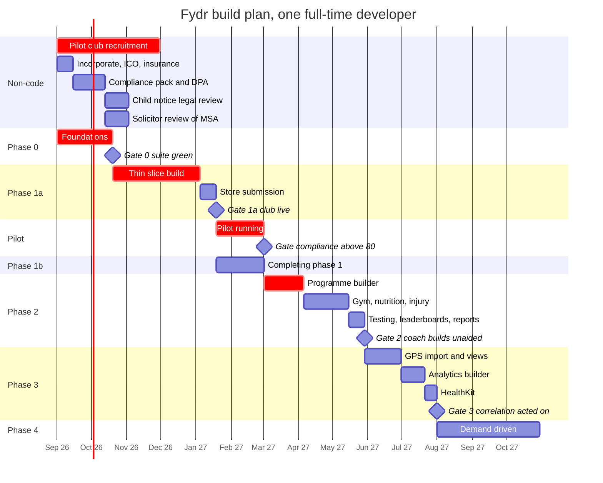
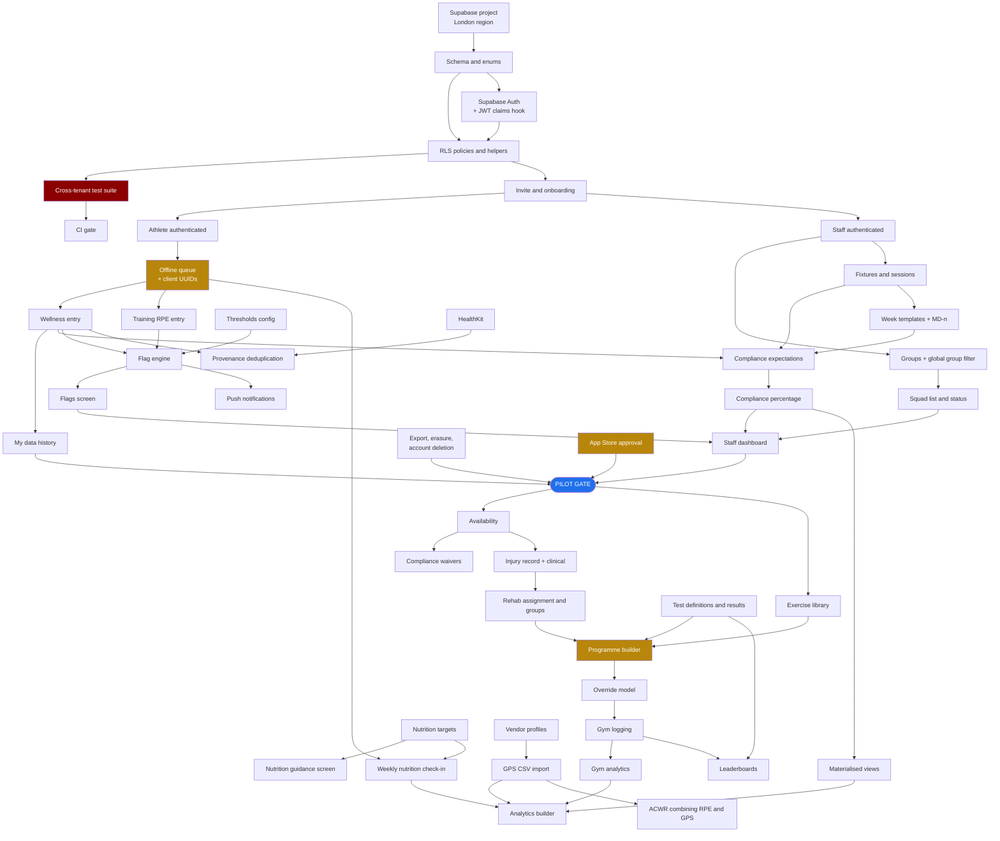

# 10: Roadmap

> **Current phase: Phase 0, not started.** Update this line when a phase opens or closes.
> CLAUDE.md §8 requires this file to be checked before starting work.

> ### Note: the phase ordering predates the evidence and needs revisiting
>
> This roadmap defers GPS to Phases 2 and 3: GPS import, GPS views, GPS flags, and the analytics
> that consume them all sit in Phase 3, gated behind a pilot club being on the Premium tier.
>
> **The existing staff web app contradicts that.** The client's screenshot
> (`docs/source/training-report-screenshot.png`) shows GPS as central and routine, not deferred:
>
> - `Import GPS` is a **top-level sidebar item**, one of fifteen, not buried in a settings area.
> - The `Training report` screen, which is one of two data screens visible in the evidence, is
>   **entirely GPS-derived**. All six of its metric columns come from GPS: total distance,
>   running distance, high speed running, high intensity efforts, maximum velocity, and
>   percentage of maximum velocity.
> - Three of its four summary tiles are GPS aggregates.
> - The design system positions the product for **professional rugby**
>   (`00-product-overview.md`, O-750), where GPS is not an upsell, it is the baseline.
>
> So Phase 3 contains work that appears to be partly done, and Phase 1's thin slice contains
> work that may not be. **The phase ordering, the tier gating of GPS in `00-product-overview.md`,
> and the Phase 3 entry criteria all need re-deriving against what already exists.**
>
> This note deliberately does not rewrite the phases. Doing that requires two answers that do
> not exist yet:
>
> 1. **O-750**, professional rugby or semi-professional clubs. It decides whether GPS is table
>    stakes or a Premium-tier feature, and therefore whether it is Phase 1 or Phase 3 work.
> 2. **How much of the existing app is real.** A rendered screen is not a shipped feature. The
>    import pipeline, the vendor profile mapping, the athlete matching, the unit normalisation,
>    and the controls in `09-security-and-compliance.md` §9.2 are the bulk of the 3-week GPS
>    import estimate, and none of them are visible in a screenshot of a report screen. Audit the
>    code before moving any estimate.
>
> Do not reorder the phases on the strength of one screenshot. Do not leave the ordering
> unexamined either. **O-770**: which of the Phase 3 GPS workstreams already exist in the
> running app, and to what depth?

---

## 1. The honest assessment of scope

Fydr as specified in `00` to `09` is roughly **44 developer-weeks of build to the end of
Phase 3**, before you add the non-code work: the compliance pack, store submission, pilot
support, and selling. Full time, with no day job, that is eleven to fourteen months.
Part time at fifteen hours a week it is closer to three years.

That is not the risk. The risk is this:

**You will build all of it before finding out whether an athlete will fill in a wellness
form on a wet Tuesday in February.**

The entire product rests on core thesis 1 in `00-product-overview.md`: collection must be
trivially easy or compliance collapses. Everything downstream, the flags, the analytics,
the cross-domain correlation that is supposedly the durable differentiator, is worthless if
weekly compliance sits at 45%. The programme builder is the single largest piece of work in
the product at around 13 weeks, and it is 13 weeks of work whose value is entirely
conditional on a hypothesis you can test in nine.

The correct move is not to build faster. It is to reorder so the cheapest test of the
riskiest assumption happens first. That is the thin slice in §10, and the argument for it is
the most important thing in this document.

### Secondary structural risks, stated up front

1. **The specification is complete, which makes it feel finished.** `04-data-model.md`
   describes about 40 tables. A complete spec invites building the whole schema before
   anything runs. Build the schema in full (it is cheap and migrations are additive), but
   do not build a screen for every table you have created.
2. **The staff web dashboard and the athlete mobile app are two products.** They share
   types and queries, not effort. Every "and the same on web" doubles a line item. This is
   why `02-information-architecture.md` O-6 (athlete-mobile plus staff-web only) is a
   recommendation you should accept: it is the largest single scope reduction available,
   and §10.1 of `09-security-and-compliance.md` shows it is also a security improvement.
3. **You are one person and you will be ill, or a client will need three days of support
   during the week you planned to build the flag engine.** Every estimate below assumes
   productive weeks. Plan on 42 productive weeks in a year, not 48.

### What the AI coding assistant actually changes

Be specific about this, because assuming a uniform 2x is how estimates go wrong.

| Work type | Realistic speed-up | Why |
|---|---|---|
| Migrations, RLS policies, Zod schemas, TypeScript types, CRUD screens, test scaffolding | 2x to 3x | High volume, low novelty, well-specified by `04-data-model.md` |
| Standard UI from a design system | 2x | Once the primitives exist |
| Offline sync, revision and conflict semantics, override propagation | 1.1x to 1.3x | Novel stateful logic. The assistant writes plausible code fast, and plausible-but-wrong sync code costs more than slow-and-correct. |
| RLS review and the cross-tenant suite | Roughly 1x, possibly slower | You must understand every policy yourself. Generated authorisation code you have not reasoned about is a liability, not a saving. |
| CSV vendor format handling | 1.5x | Real files differ from documented formats |
| App Store review, DPA negotiation, pilot recruitment | 1x | Wall-clock, not effort |

Net effect across the whole build: call it 1.6x versus writing it alone. The estimates
below already have that baked in. Do not apply it twice.

---

## 2. Phase structure at a glance

| Phase | Theme | Effort, likely | Range | Gate |
|---|---|---:|---|---|
| **0** | Foundations | 7 weeks | 5 to 10 | Cross-tenant suite green in CI |
| **1a** | **Thin slice: the compliance loop**, now including the Children's Code workstream | 11 weeks | 9 to 16 | One real club live |
| **1b** | Completing Phase 1 | 6 weeks | 4 to 9 | Compliance above 80% at four weeks |
| **2** | Programmes, gym, testing, injury, reports | 13 weeks | 10 to 19 | S&C coach builds and assigns unaided |
| **3** | GPS import, analytics, HealthKit | 9.5 weeks | 7.5 to 14.5 | A cross-domain correlation a coach acts on |
| | *(Phase 2m may run here instead, see below)* | | | |
| **2m** | **Staff phone app**, second shell over Phase 1 and 2 surfaces | 10 weeks | 8 to 12 | A coach takes attendance pitchside without opening a laptop |
| **4** | Vendor APIs, Health Connect, platform | 14 weeks | 10 to 22 | Demand-driven. Do not plan this. |

Cumulative to the end of Phase 3, **including staff mobile: 56.5 weeks likely, 43.5 to 80.5
range**. Without staff mobile it is 46.5 weeks. Add 4 weeks of non-code serial work
(compliance pack, first store submission, first terms negotiation) that sits outside the
build estimate and cannot be parallelised away.

**Read that as roughly a year, single-handed, if nothing goes wrong.** Nothing goes wrong is
not a plan. The range exists because two of the three risks in §9 landing is the normal case,
not the bad case.

**Three changes on 5 August 2026, all client decisions, all of them additive.**

1. **Phase 1a grew by 2 weeks.** Under-18 athletes are in scope, so the Children's Code work
   moved out of "a scoped later phase" into Phase 1a, where it cannot be deferred. See §4.
2. **Phase 2m added, 10 weeks.** Staff need a phone app as well as the web dashboard. This is
   the single largest scope decision in the project and it is deliberately a separate phase,
   not folded into Phase 2, so that it stays visible and cuttable. See `02-information-architecture.md` §4.6.
3. **1 week for the weekly nutrition check-in**, split across Phases 2 and 3.

**Net effect: 44 weeks became 56.5.** Twelve and a half weeks were added in a single
conversation, which is normal and is exactly why the range column exists. If that total is
unacceptable, the honest lever is Phase 2m, because it is the only large block that is not
load-bearing for the compliance loop.

**Why 2m sits after Phase 2 and not alongside it.** Building the staff phone app while the
staff web app is still moving means every change lands twice. Build web, put it in front of a
club, learn which jobs are actually pitchside, then build the phone app for those. If you
build both at once you will build phone screens for work coaches only ever do at a desk.

**Read the range, not the middle column.** The high figure is not pessimism, it is what
happens when two of the three risks in §9 land.

---

## 3. Phase 0: Foundations

Nothing user-visible ships. This is the phase most likely to be skipped in enthusiasm and
the phase whose absence costs the most later.

**Entry criteria**
- `04-data-model.md` accepted, including the open questions that affect the schema: O-9
  (height as a time series), O-951 (consent field renaming). Resolve these before the first
  migration, not after.
- Supabase project created **in the London region** (irreversible, see
  `09-security-and-compliance.md` §5).
- Decision recorded on `02-information-architecture.md` O-6 (staff web only for v1).

**What ships**

| Workstream | Contents |
|---|---|
| Repository | Monorepo: `apps/mobile` (Expo), `apps/web` (Next.js), `packages/shared` (types, Zod schemas, query logic). TypeScript strict. |
| Schema | Every table in `04-data-model.md`, as additive migrations. All 40-odd, even those with no UI until Phase 3. Tables are cheap; retrofitting `org_id` is not. |
| Enums and constraints | Every Postgres enum type, every range check constraint, every jsonb size constraint. |
| Auth | Supabase Auth, invite flow, password rules per `09` §8.1, JWT custom claims hook populating `org_id` and `roles`. |
| RLS | Helper functions (`auth_org_id`, `auth_athlete_id`, `auth_roles`, `auth_has_any_role`, `auth_is_aal2`). Policies on every table. `injury_clinical` grants revoked, audited read function built. |
| **Cross-tenant test suite** | Per `09` §8.2. Dynamic table enumeration. Blocks merge. |
| CI | GitHub Actions: typecheck, lint, migrations applied to a real Postgres, cross-tenant suite, `gitleaks`, service-role-key grep of build output. |
| Audit log | Table, append-only trigger, `security definer` write function. |
| Design system | Primitives only: typography, colour, spacing, buttons, inputs, sliders, cards. Per `06-design-system.md`. |
| App shells | Athlete four-tab shell and staff sidebar shell, navigating between empty screens. |
| Backup | PITR enabled, independent weekly encrypted dump running, one restore tested and timed. |

**Screens**: 33 Onboarding (auth portion only), 32 User management (invite and deactivate
only), 29 Settings (password change, log out only).

**Deliberately excluded**: every domain screen. No wellness entry, no dashboard. If you find
yourself building a screen in Phase 0 you have left the phase.

**Exit criteria**
- Cross-tenant suite green in CI, enumerating tables dynamically, with at least one
  deliberately-broken policy proven to make it fail (test the test).
- An admin can invite a user, the user can accept, authenticate, and receive correct JWT
  claims, on both mobile and web.
- Every table has RLS enabled and at least one policy, asserted automatically.
- A database restore has been performed into a scratch project and the elapsed time
  written down.
- `.env.example` complete, no secrets in git history.

**Effort: 7 weeks likely, 5 to 10.** The schema and policies are fast with an assistant. The
JWT claims hook, the auth flow across two clients, and the test harness are the slow parts,
and the harness is worth every day it takes.

---

## 4. Phase 1: the compliance loop

Split into **1a**, the thin slice that goes to a real club, and **1b**, everything else
that was scoped as Phase 1. The split exists so a pilot starts nine weeks after Phase 0
instead of fifteen.

### Phase 1a: thin slice

Full specification in §10. Summarised here for the phase table.

**What ships**: athlete wellness and session-RPE submission with offline queue, staff web
dashboard showing squad status and flags, threshold configuration, groups and the global
group filter, a simplified schedule, compliance expectations and compliance percentage,
push notifications for the morning prompt and flag notifications, athlete data export, and the
athlete rights features required by both app stores.

**Screens**: 1 Today, 2 Wellness entry, 5 Training RPE entry, 6 My data (wellness and
training tabs only), 8 Staff dashboard, 9 Squad status, 10 Flags, 15 Schedule (simplified),
16 Session detail, 17 Fixture detail, 19 Squad list, 20 Athlete profile (wellness and
training tabs only), 21 Groups, 29 Settings, 30 Thresholds, 31 Exports (CSV only), 33
Onboarding (complete, including both the adult and the child privacy notice screens, the age
branch, and the minor defaults). Plus the two screens added to
the inventory in `02-information-architecture.md` §5 for this phase: **43 Privacy and my
data** (athlete) and **44 Data requests** (admin). See §12.

**Deliberately excluded**: nutrition, gym, programmes, testing, leaderboards, analytics,
reports beyond CSV, injury clinical records, the MD-n planner, week templates, GPS,
HealthKit, staff mobile app.

**Effort: 11 weeks likely, 9 to 16.** Raised from 9 weeks likely, 7 to 13, on 5 August 2026 by
the Children's Code workstream below.

#### Children's Code workstream, moved into Phase 1a on 5 August 2026

**It cannot be deferred.** The client has confirmed academy and youth squads are in scope
(`09-security-and-compliance.md` §4, O-886 resolved). The Code applies to every athlete under 18,
so the first pilot club with an academy is a club Fydr cannot lawfully onboard without this. It
is not a hardening pass to do before the second club: the defaults it sets are the defaults the
first athlete gets, and retro-fitting high privacy after a squad is live means changing what
athletes have already been told.

| Item | What it is | Effort |
|---|---|---|
| Age model and constraints | `date_of_birth` required at invite and activation, under-13 rejection, `athlete_is_minor()`, the age view, audit events (`04-data-model.md` §17.16) | 2 days |
| Onboarding age branch | Step 4 becomes a branch, the under-13 block, the crossing-18 message (`screens/onboarding.md`) | 2 days |
| Child-facing notice | The copy exists (`screens/onboarding.md` step 5c). This is the screen, the second `notice_versions` audience, versioning and acknowledgement | 2 days |
| Minor defaults | Photographs absent, device sync off, the notification floor (`08-notifications.md` §5.4), the org settings `children` block | 3 days |
| Leaderboard opt-in | The rule inside `compute_leaderboard`, and the builder warning. **Ships with leaderboards in Phase 2**, because there are no boards in 1a. Specified now so it is built once, and it is half a day there rather than a retrofit | 0 in 1a |
| Parental involvement | The admin recording path, the locked optional extras, the standing statement in the Me tab | 2 days |
| DPIA children's section, plus the DPA and terms clause | Writing, not code. The detrimental use clause is the load-bearing part | 2 days |
| Review turnaround and rework | Solicitor read of the child notice alongside the adult one, then the rework it produces | 2 days of your time, spread |

**Effort: 2 weeks likely, 1.5 to 3.5.** The brief for this change estimated 1.5 to 2.5 weeks. I
have landed slightly higher, and the reason is specific: about six of the days above are writing
and defaults, which is the cheap part and matches that estimate, but the leaderboard opt-in and
the notification floor are not copy. They are rules enforced server-side, in a query and in the
notification resolution order, and each needs a test proving a direct API call cannot bypass
them. That is the same class of work as the cross-tenant suite and it is the part that runs long.
`[medium]`

**The range is asymmetric for one reason.** The high end is not more code, it is the solicitor
review of the child-facing notice (O-964). It is serial, it is outside your control, and if the
review comes back wanting a different structure rather than different words the screen is rebuilt.
Start that review the week the copy is written, not the week before launch.

**What it does not include**: parental logins (not being built,
`09-security-and-compliance.md` §4.7), an under-13 parental consent flow (out of scope, §4.4),
and age-grade groups as a first-class concept (O-960, an ordinary group covers it until told
otherwise).

### Phase 1b: completing Phase 1

**Entry criteria**: the pilot club is live and submitting. Phase 1b is built *while the
pilot runs*, informed by what the pilot tells you. Do not build it in advance.

**What ships**

| Item | Why it was not in 1a |
|---|---|
| Week templates and the MD-n planner | Compliance expectations in 1a run off a simple weekly pattern. Templates are the productivity feature, not the correctness feature. |
| Timetable view | Folded into the dashboard in 1a. **Built as both**: `/timetable` is its own full screen (real attendance capture, `session_attendance`) and the Dashboard's own timeline draws on the same real session/roster data — not a contradiction, the dashboard's timeline is a summarised read, `/timetable` is where attendance is actually recorded. |
| Availability status and the availability board | See the note below. |
| Athlete "report a problem" (new screen 36) | Route into medical, needed before the injury work in Phase 2. |
| Flag escalation, dismissal reason capture, threshold recalibration suggestion | `03-flows.md` §5 in full. 1a ships raise, notify, acknowledge, resolve only. |
| Compliance waivers | `04-data-model.md` §11. |
| Support access role (`platform_support`) | `01-roles-and-permissions.md` O-4 defers it to Phase 3. Move it to 1b: by the time a real club is live you will need to debug their data, and if this does not exist you will do it with the service role key and no audit trail. That is a worse outcome than building it. |
| Audit log viewer (new screen 35) | **Built ahead of this phase.** `01-roles-and-permissions.md` §2 grants admins access to the audit log and no screen existed — closed directly (`/settings/audit`) rather than waiting on 1b, the same call made for Timetable above. |

**Screens**: 11 Timetable (built), 12 Injury dashboard (availability board only), 18 MD-n planner,
35 Audit log (built), 36 Report a problem.

**A deviation from the phase definition, flagged deliberately.** The brief for this document
placed injury and availability in neither Phase 1 nor Phase 2. That is a gap. Availability
cannot wait: it drives compliance waivers, it appears on the athlete's Today screen as a
restriction banner, and the medical role is unusable without it. I have therefore split it:
**availability lands in Phase 1b, the clinical record and rehab land in Phase 2.** The
clinical tables and their RLS exist from Phase 0 and are covered by the cross-tenant suite
from day one regardless, which is what matters for the security design.

**Exit criteria for Phase 1 as a whole**
- Success criteria 2, 3, 4, and 6 from `00-product-overview.md` met at the pilot club. See
  §11.
- Compliance expectations generated correctly against week templates, verified against a
  manually-computed week.
- Zero cross-tenant findings after a second club is added to production.

**Effort: 6 weeks likely, 4 to 9.**

---

## 5. Phase 2: programmes, gym, testing, injury, reports

The largest phase and the one whose value is entirely conditional on Phase 1 succeeding.

**Entry criteria**
- Pilot club at or above 80% weekly wellness compliance for four consecutive weeks.
- At least one coach has acted on at least ten flags. If flags are being ignored, the
  problem is thresholds or trust, and fixing that is more valuable than building
  programmes.
- Open question O-8 (minimum n) resolved. **O-11 is resolved**, 5 August 2026: athletes do not
  log meals or macros, and the nutrition workstream below is the guidance screen, not an entry
  screen. See `screens/nutrition-guidance.md`. **O-890 is also resolved**, the same day: the
  weekly one-tap check-in is commissioned and is in the nutrition workstream below. It is not
  an entry criterion, because the guidance screen does not depend on it and it can be built in
  any week of the phase.

**What ships**

| Workstream | Contents | Effort |
|---|---|---|
| Programme builder and override model | `03-flows.md` §4 in full: blocks, weeks, sessions, exercises, prescription, load basis resolution against test results, assignment to groups and individuals, athlete overrides, parent-edit propagation with override preservation and divergence notice. | 5 weeks |
| Gym logging | Set-level logging on mobile, one-thumb, offline, with rest timers and previous-session reference. Volume aggregation. | 2 weeks |
| Nutrition guidance | Athlete read-only guidance screen: resolved targets by MD-n, around-training timing, meal ideas, matchday plan, offline cached. Staff authoring: targets by MD-n with the resolution order, a guidance content library and editor, a meal-idea library. Schema `04-data-model.md` §17.3 and §17.14. The `athlete.nutrition.matchday` push. **No meal or macro entry surface, no photo upload, no compliance grid.** | 1.5 weeks |
| Weekly nutrition check-in | **New, O-890 resolved 5 August 2026.** Screen 45 `nutrition-checkin.md`: the bottom sheet, the three tap targets, the optional note. Schema `04-data-model.md` §17.15 including the `auth_org_timezone()` helper, the three-week insert window and the cross-tenant case for submit-as-another-athlete. Offline queue path, reusing the wellness and RPE machinery. The revise function, per ADR-005. The `athlete.nutrition.checkin` push with the Sunday-fixture deferral. **Not** the analytics variable, which lands in Phase 3. | 0.5 weeks |
| Injury and rehab | Injury record with clinical detail (medical only, via the audited read function), rehab assignment, rehab group allocation, return-to-play milestones, the restriction-conflict warning from `03-flows.md` §6. | 2 weeks |
| Testing | Test definitions, result logging, left/right reporting, trend per athlete. | 1 week |
| Leaderboards and reports | Leaderboards with the consent and visibility rules from `09` §15 O-57. Reports as saved presets rendered to PDF and CSV. | 1 week |

**Screens**: 3 Nutrition guidance, 4 Gym session logging, 6 My data (all tabs), 7 My
programme, 12 Injury dashboard (complete), 13 Injury record, 42 Rehabilitation grouping,
20 Athlete profile (all tabs), 22 Programme builder, 23 Gym programmes, 24 Nutrition plans,
25 Testing, 26 Leaderboards, 28 Reports, **45 Nutrition weekly check-in**.

**Deliberately excluded**: GPS, HealthKit, the custom analytics builder (presets only in
Phase 2), vendor APIs, multi-org users, white label.

**Exit criteria**
- Success criterion 5: an S&C coach builds a gym programme and assigns it to 15 athletes in
  under 10 minutes, measured, without help.
- A coach edits a parent programme with three athlete overrides in place, and all three
  overrides survive intact and the coach is notified of the divergence.
- A physio creates an injury record, sets availability, and the coach sees the availability
  change and no clinical detail. Verified by a coach account, not by inspection.
- Gym logging completes a full session on a phone one-handed in under the time the athlete
  spends resting.

**Effort: 13 weeks likely, 10 to 19.** The half week saved by removing nutrition logging has
been spent on the weekly check-in, which puts the phase back where it started. The programme
builder alone is 5 of those and is still the single riskiest estimate in the document.

**Why the nutrition saving is only half a week, when a whole entry screen came out.** What was
removed is real: per-meal macro entry with its offline queue and revision handling, the photo
upload pipeline with EXIF stripping, magic-byte validation, signed URLs and a 90 day retention
job, and the squad grid of actuals against target. That is most of a week. What went in is also
real and was not in the original 2 weeks: a guidance content model, a staff authoring library
and editor for it, and a meal-idea library with images served through a CDN transform. Guidance
that nobody can author is not a feature. Anyone expecting this line to drop to half a week is
costing the deletion and not the replacement.

One thing sits outside this estimate. The **content workload** of writing the meal-idea library
is not engineering time and is unresolved in O-892: a library you write once and ship to every
club is a different commitment from a per-club library.

**The weekly check-in is 1 week in total, not two days, and it is split across two phases.**
The two-day figure in `nutrition-guidance.md` §9 costed the sheet and the table, and that part
is right: half a week in Phase 2 covers the bottom sheet, the schema, the RLS window, the
offline path and the push. It did not cost the analytics work, which is where a coarse variable
either gets caveated properly or gets quoted as if it were per-meal logging. The metric
definition, the grain and method guards, the variation and concentration guards, the fixed
coarseness note, preset 5 and the response-rate footer are another half week and they belong in
Phase 3 with the rest of the builder. **Confidence: medium** on the Phase 2 half, because it is
a form over one column and the offline machinery already exists; **low to medium** on the Phase
3 half, because guard work on this screen has historically expanded.

---

## 6. Phase 3: GPS import, analytics, HealthKit

> **See the note at the top of this file.** Parts of this phase appear to exist already in the
> staff web app, and the entry criterion below ("a pilot club is on the Premium tier") is
> written on a commercial model that O-750 has reopened. Audit before you plan. O-770.

**Entry criteria**
- A pilot club is on the Premium tier, or has committed to it. Building tier-gated
  features with nobody paying for the tier is speculative.
- You have at least three real GPS export files from at least two vendors. Not documentation
  of the format. Actual files, with real column headers and real edge cases.
- Vendor profile mapping design reviewed against those files.

**What ships**

| Workstream | Contents | Effort |
|---|---|---|
| GPS CSV import | Upload to private bucket, background parse, vendor profile column mapping, unit normalisation, athlete matching with unmatched-row resolution, import batch reporting, all the controls in `09` §9.2. Plus a new screen: **34 GPS data import**, `imports.md`. | 3 weeks |
| GPS views | GPS domain screen, GPS flags tab, load metrics on the athlete profile, ACWR computed off combined RPE and GPS load. | 1.5 weeks |
| Analytics builder | `03-flows.md` §9 in full: metric picker across domains, population, adjustable window, visualisation types, correlation with the minimum-n guard, saved views. Enforce the `jsonb` controls in `09` §9.5. | 3 weeks |
| Nutrition analytics variable | The Phase 3 half of O-890. `nutrition.protein_target_met_weekly` in `metric_definitions` and the metric dispatcher, the weekly-grain and Spearman-only guards, the variation and concentration guards, the fixed coarseness note as `ResolutionCaution`, preset 5 (nutrition check-in trend) and the response-rate footer. See `analytics.md`. | 0.5 weeks |
| HealthKit | Development build, permission flow with the club-visibility disclosure from `09` §13.1, sleep, resting HR, HRV, active energy, deduplication against self-report per `03-flows.md` §7, provenance display. | 1.5 weeks |
| Materialised views | The five in `04-data-model.md` §12, nightly refresh plus on-demand after import. Some of these will be needed earlier; build properly here. | Included above |

**Screens**: 27 Analytics, 34 GPS data import (new), GPS tabs added to 10 Flags and 20 Athlete
profile, HealthKit sections added to 29 Settings and 33 Onboarding.

**Deliberately excluded**: vendor APIs, Health Connect, any cross-club benchmarking (see
`09-security-and-compliance.md` §2, this is a controller-role trap and must not be built).

**Exit criteria**
- A coach imports a real vendor CSV they downloaded that morning, unassisted, and the data
  appears on the correct athletes.
- A coach builds a correlation between a wellness metric and a load metric, and it either
  renders with sample size and provenance stated, or refuses with an insufficient-data
  notice.
- HealthKit sleep duration and self-reported sleep hours for the same night both exist,
  resolve per the `03-flows.md` §7 rules, and display provenance.
- App Store approval with HealthKit entitlement.

**Effort: 9.5 weeks likely, 7.5 to 14.5.** The analytics builder is the open-ended one; see §9.

---

## 7. Phase 4: vendor APIs and platform

**Do not plan this phase. Sell it first.**

Every item in Phase 4 is a response to a specific demand, and building any of it
speculatively is the clearest scope-creep risk in the project.

| Item | Build when | Effort |
|---|---|---|
| Vendor APIs (Catapult, StatSports, Polar) | A club with an active vendor contract asks, and that vendor's API is actually accessible to a third party developer, which is not a given. Verify commercial access before estimating. | 3 weeks per vendor, plus unknown time obtaining API access |
| Android Health Connect | Android athlete share is material and someone asks. Requires the Play health declaration, `09` §13.3. | 2 weeks |
| Multi-org users | A physio contracting to multiple clubs asks. This breaks the "one user, one organisation" assumption in `01-roles-and-permissions.md` §6 and requires reworking the JWT claim, the RLS helpers, and every policy. It is not a feature, it is a tenancy model change. | 4 weeks, and revalidate the entire cross-tenant suite |
| Support access | **Moved to Phase 1b.** See §4. | Moved |
| White label | A club pays for it. Branding per organisation is cheap; a white-labelled app binary per club is expensive and multiplies store submissions. Offer branding-in-app, refuse app-per-club. | 2 weeks for branding, refuse the rest |

**Effort: 14 weeks likely if all of it is built, 10 to 22.** The honest answer is that you
will build two of these five and never the others.

---

## 8. Timeline

Calendar assumes a full-time start on 1 September 2026 and includes the pilot gate, which
is deliberate dead time in the build schedule and productive time in the validation
schedule.



Two things to read off this chart:

1. **Pilot club recruitment starts on day one**, in parallel with Phase 0. It has a
   three-month lead time and it is on the critical path. A finished thin slice with no club
   to put it in front of is a wasted quarter.
2. **Phase 1b runs during the pilot**, not before it. That is the point of the split.

---

## 9. Dependencies and critical path



### The critical path

```
Supabase project
  → schema
  → auth + JWT claims hook
  → RLS + cross-tenant suite
  → invite and onboarding
  → offline queue
  → wellness entry
  → flag engine
  → staff dashboard
  → App Store approval
  → PILOT GATE
  → programme builder
  → gym logging
```

Everything that is not on that path can slip a week without moving the end date. Everything
on it moves the end date one-for-one.

Note what is on the critical path that is not code: **App Store approval** and **pilot club
recruitment**. Both have wall-clock durations you cannot compress by working harder, which
is why both start before you need them.

Note also what is *not* on the critical path and feels like it should be: the schedule and
week templates. Compliance expectations in the thin slice run off a simple weekly pattern.
MD-n is the spine of the finished product and it is not the spine of the first release.

### The three things most likely to cause slippage

**1. The offline queue and its interaction with immutable entries. Risk: +3 to +6 weeks.**

This is the deepest piece of novel logic in the product and it is on the critical path.
`03-flows.md` §10 makes it look like a diagram; it is not. The hard parts:

- Client-generated UUIDs make replay idempotent, but a *revision* of an offline entry
  created before the original synced produces a revision chain pointing at a row the server
  has never seen. The queue must preserve ordering per entity, not globally, and must
  handle the parent-not-yet-synced case.
- CLAUDE.md rule 6 says entries are immutable once submitted. Locally, "submitted" happens
  before the server has seen it. Deciding what an athlete can do to a queued-but-unsynced
  entry is a product decision that is currently undefined. Edit in place before sync, or
  revision-only from the moment of local submit? The second is more consistent and worse UX.
- Conflict resolution per `03-flows.md` §10 says "client wins for athlete self-report". That
  is right, and it needs a rule for what happens when the server already has a row with the
  same `(athlete_id, entry_date, revision_of)` unique key from a staff-entered value.
- Testing it requires simulating network partition, app termination mid-queue, clock skew,
  and reinstall. None of that is fast to build and all of it is necessary, because a bug
  here silently corrupts athlete records and you will not notice for a month.

**Mitigation**: build the queue in week 1 of Phase 1a, not week 6. Write the state machine
tests before the implementation. Resolve the queued-entry-editability question before
starting, and record it in `docs/decisions/`.

**2. The programme builder and override propagation. Risk: +4 to +8 weeks.**

Five nested levels (programme, block, session, exercise, set prescription) with drag
reordering, load basis resolution against test results, group and individual assignment,
per-element overrides, and parent-edit propagation that preserves overrides and notifies of
divergence. It is the largest single UI surface in the product and it is on the web, on the
phone, and in the athlete's read-only view.

The estimate of 5 weeks assumes the override model is understood before building starts. It
is not currently specified to the level a builder needs: `03-flows.md` §4 defines the
mechanic, `04-data-model.md` §6 defines the storage, and neither defines what happens when a
coach deletes an exercise that has overrides on it, reorders exercises an override points
at, or archives a programme mid-block.

**Mitigation**: write `docs/screens/programme-builder.md` fully before Phase 2 starts, and
resolve the destructive-edit cases in it. Build the data operations and their tests first,
the UI second. Consider shipping assignment-without-override in the first two weeks of
Phase 2 so athletes see a programme early, then layering overrides.

**3. Everything that is not code. Risk: +3 to +8 weeks of wall clock.**

This is the one solo developers systematically miss, because it does not appear in any
estimate.

- **First App Store submission.** Budget two weeks, not two days. The likely rejection
  causes for Fydr specifically: no demo account, the account deletion requirement (`09`
  §13.4), a generic HealthKit usage string, and an incomplete privacy manifest. Each round
  trip is 2 to 5 days.
- **The first club's solicitor reads your DPA.** A club with a lawyer on the board will send
  back comments, and answering them without your own solicitor takes weeks of calendar time.
  This is why `09` §5 says spend the money on the MSA review up front.
- **Pilot club recruitment.** Three months of lead time, conversations that go quiet, a
  season that starts before you are ready, and a head coach who changes jobs.
- **Support during the pilot.** A live club generates real support load. Budget a day a week
  during Phase 1b and Phase 2, which is a 20% tax on those estimates that is not in the
  numbers above.

**Mitigation**: start recruitment and the compliance pack on day one of Phase 0. Submit a
skeleton build to TestFlight and to Play internal testing during Phase 0, so the account
setup, certificates, and store metadata are done before the app is finished.

**Honourable mentions**: the analytics builder has no natural scope boundary and will
expand to fill available time (fix it by shipping presets only and a builder with exactly
four visualisation types); MD-n edge cases (two fixtures in a week, postponement) are
fiddlier than `03-flows.md` §8 makes them look; and real GPS vendor CSVs differ from
documented formats in ways you cannot estimate until you have the files.

---

## 10. The thin slice

**Recommendation: build this, put it in front of one real club, and do not start Phase 2
until it has run for four weeks.**

### What it is

The smallest system that tests the riskiest assumption: **will athletes submit daily, and
does the flag system change what a coach does?**

| In | Out |
|---|---|
| Athlete: Today screen, wellness entry, session RPE entry, own history, offline queue | Nutrition guidance, the weekly nutrition check-in, gym logging, programmes, testing, leaderboards |
| Athlete: privacy and data screen, export, account deletion | Everything else in the Me tab beyond profile and notifications |
| Staff web: dashboard, squad status, flags, squad list, athlete profile (wellness and RPE tabs) | Staff mobile app entirely |
| Staff web: groups and the global group filter | Group-restricted staff access (O-3) |
| Staff web: fixtures, sessions, and a simple recurring weekly pattern | Week templates, MD-n planner, the full schedule UI |
| Thresholds configuration, personal-rolling baselines | Squad-mean baselines, threshold recalibration suggestions |
| Flags: raise, notify, acknowledge, action, resolve | Escalation after 24h, dismissal analysis |
| Compliance percentage per athlete, group, and week | Waivers, compliance trend analytics |
| Push: morning wellness prompt, post-session RPE prompt, flag notification to staff | Everything else in `08-notifications.md` |
| CSV export of everything | PDF reports, analytics builder |
| Availability as a simple three-state field a physio sets | Injury records, clinical detail, rehab, the injury dashboard |

**Roles**: athlete, coach, admin, and a physio who can only set availability. The full
medical role arrives in Phase 2.

**Effort: Phase 0 plus Phase 1a, so 16 weeks likely, 12 to 23.**

### What it deliberately does not test

Be honest about this, because it is the limitation of the approach.

The thin slice does not test **core thesis 3**, the cross-domain correlation that
`00-product-overview.md` calls the durable differentiator. It cannot: correlation needs gym,
testing and GPS data, all of which are out of scope. Note also that thesis 3's nutrition axis
is now a weekly three-level self-report and nothing stronger (O-11 removed logging, O-890 added
the check-in), and the check-in is not in the thin slice either, so the thin slice is not the
only reason thesis 3 is untested.

It tests willingness to pay **partially, not fully**. The pilot is paid, £500 for 12 weeks
(`12-product-tiers.md` §7.3), so it tests that a club will part with money for a thin slice on
the strength of a conversation. It does not test the annual band price, which is roughly an
order of magnitude larger and is bought on a season's evidence rather than on a pitch. Run the
explicit price conversation during the pilot as well: O-1 is unresolved, the £500 does not
resolve it, and the pilot is still the only place it can be resolved.

### Why ship it before Phase 2

Four arguments, in order of strength.

1. **If compliance fails, Phase 2 is worthless.** Weekly compliance below 60% invalidates
   the product thesis. Nothing in Phase 2 fixes it, because Phase 2 adds work for the
   athlete rather than removing it. Discovering this after 13 more weeks of building costs
   a quarter; discovering it in week 16 costs nothing and tells you exactly what to change.
2. **The 45-second target is a claim, not a measurement.** Success criterion 2 in
   `00-product-overview.md` is measurable only against real athletes on real phones with
   real signal in a real changing room. Every design decision on the athlete side is
   subordinate to it, per core thesis 1, which means every athlete-side design decision in
   Phase 2 is currently unvalidated.
3. **The thresholds are certainly wrong.** Default threshold parameters are a guess. Four
   weeks of real data tells you the false positive rate, and the recalibration mechanism in
   `03-flows.md` §5 exists precisely because it will need recalibrating. Better to learn
   this on wellness alone than across six domains at once.
4. **You need a reference customer more than you need features.** In a market of small clubs
   who talk to each other, one club saying "we use it every day" sells more than a feature
   matrix. That reference is available 28 weeks earlier this way.

### The counter-argument, stated fairly

A thin slice may look thin to a buyer. A club evaluating Fydr against a spreadsheet will ask
about gym programmes, and the answer "that is coming" loses deals.

**This is a real objection and it is why the pilot is a pilot, not a launch.** Position it as
a partnership: the club shapes what gets built next, and they get the full product first. That
is a much easier sell than a half-finished product sold as finished, and it is honest.

**The pilot is paid, £500 for 12 weeks, credited in full against the first annual invoice.**
This resolves a conflict: this section previously said "free during the pilot" while
`12-product-tiers.md` §7.3 specified £500. The tiers document is right and this one was wrong.

Three arguments for paid, in order of strength:

1. **A paying club turns up.** The pilot's entire dependency is staff attention: a named
   contact, the squad onboarded inside 14 days, a fortnightly call, a written debrief at week
   12 (`12-product-tiers.md` §7.3). A free pilot has no cost to deprioritise, and the failure
   mode is not a club that says no, it is a club that goes quiet in week three and leaves you
   with 40% compliance you cannot interpret. Was it the product or was it that nobody
   introduced it? A paid pilot with written obligations makes that question answerable.
2. **A paying club gives real feedback.** Free feedback is polite. A club that has spent money
   says what is wrong with the thing, which is the entire output of the exercise.
3. **It tests willingness to pay, which is the second-riskiest assumption in the project after
   compliance.** Everything else in this document assumes clubs at this level buy software of
   this kind at all. £500 is a small test of that and it is a real one, because it is a
   decision someone has to make rather than an opinion someone can offer. A free pilot leaves
   both the riskiest and the second-riskiest assumptions untested at the same time, and only
   one of them is being deliberately tested by the thin slice.

**The counter-argument, stated fairly.** Charging narrows the pool, and pilot recruitment is
already the highest-risk non-technical item on the plan (O-61) with a three-month lead time.
A free pilot is easier to sign. The answer is that a pilot you had to give away is weak
evidence about a product you intend to sell, and £500 is sized to come out of a coach's
discretionary budget without going near a committee, which is what keeps the pool from
narrowing much. **Confidence: medium.** The direction is right; the figure is O-853.

---

## 11. Validation milestones

**Added 6 August 2026.** At pilot week four, ask the club's physio directly: are you using
Fydr for injuries and availability, or still keeping your own notes? Medical staff have no
sidebar row of their own (`02-information-architecture.md` §4.2, O-1101 resolved as "leave
it"), and this is the question that tells you whether that decision held. If the physio is
still keeping their own notes, the availability data the whole coach dashboard rests on is
stale, and the medical row goes back on the table.


Tied directly to the success criteria in `00-product-overview.md` §"Success criteria for
v1". Each has a phase, a measurement method, and a decision attached. Instrument these in
the product; do not measure them by asking people.

| # | Success criterion | Measured at | How | If it fails |
|---|---|---|---|---|
| 1 | 40 athletes onboarded by an admin in under 30 minutes | Phase 1a, pilot day one | Time the pilot onboarding with a stopwatch. Watch, do not help. | Bulk CSV athlete import moves into Phase 1b. Currently not specified anywhere, which is a gap. |
| 2 | Median wellness submission under 45 seconds | Phase 1a, pilot week 1 | In-app timer from entry screen open to submit tap. Report the median and the 90th percentile; the 90th is what causes churn. | The wellness entry screen is redesigned before anything else is built. This is thesis 1 and it is non-negotiable. |
| 3 | Weekly wellness compliance above 80% after four weeks | Phase 1a, pilot week 4 | `mv_compliance_rates`, whole squad, excluding waived expectations. | **Stop. Do not start Phase 2.** Diagnose: is it the app, the notification timing, the coach's enforcement, or the athletes' belief that nobody reads it? Each has a different fix and only one of them is code. |
| 4 | Coach identifies the three athletes needing attention within 15 seconds of opening the app, with no manual filtering | Phase 1a, pilot week 2 | Observe three coaches, cold, on a Monday morning. Time from app open to them naming three athletes. | The dashboard is redesigned. This is thesis 2 and it is the difference between the flag system being the product and the dashboard being decoration. |
| 5 | S&C coach builds a programme and assigns it to 15 athletes in under 10 minutes | Phase 2 exit | Observed, unaided, first attempt on the real product. | Programme builder does not exit Phase 2. It is the phase's only real deliverable. |
| 6 | Zero cross-organisation data leaks under automated permission testing | Phase 0 exit, and every commit thereafter | The cross-tenant suite in CI. | Nothing ships. This is the one criterion with no negotiation. |

**What a paid pilot changes about these.** Two of the six move. Criterion 1, onboarding 40
athletes in 30 minutes, is now measured on a club that has paid and therefore has a written
14-day onboarding obligation, which makes a failure attributable to the product rather than to
apathy. Criterion 3, compliance above 80% at four weeks, gains the same property and it is the
important one: the failure branch says "diagnose whether it is the app, the notification
timing, the coach's enforcement, or the athletes' belief that nobody reads it", and a free
pilot adds a fifth possibility, "nobody cared enough to try", which is undiagnosable. Paying
removes it. The remaining four criteria are unaffected: a cross-tenant leak and a 45-second
median do not care who paid.

### Additional milestones worth measuring that are not in the success criteria

Three of these are new or changed because the pilot is paid.

| Milestone | Measured at | Why |
|---|---|---|
| **Invoice raised and paid** | Pilot week 0 and week 2 | The first real test of willingness to pay. Measure the elapsed time from agreement to payment and who had to approve it. A club that needs three signatures for £500 tells you what the annual invoice will need. **New, from the paid-pilot decision.** |
| **Conversion at week 12** | Pilot week 12 | Automatic roll to an annual Club subscription unless cancelled by week 10 (`12-product-tiers.md` §7.3). Conversion is the single strongest signal the pilot produces, and non-conversion with a stated reason is nearly as useful. **New.** |
| **Weekly nutrition check-in response rate** | Pilot weeks 4 and 12 | Decides whether the O-890 variable survives. Below roughly 50% of athlete-weeks over four weeks the honest move is to withdraw the axis rather than caveat a variable nobody answers. O-975 in `nutrition-checkin.md`. **New.** |
| Flag action rate: proportion of raised flags that receive an acknowledgement within 24 hours | Pilot week 4 | Below 50% means alert fatigue has already set in and thresholds are wrong. This is the leading indicator that thesis 2 is failing, and it fails earlier than compliance does. |
| Flag dismissal rate by threshold | Pilot week 4 | Feeds the recalibration suggestion. A threshold dismissed more than 70% of the time is noise. |
| Day-14 and day-28 athlete retention | Pilot weeks 2 and 4 | Core thesis 1 predicts drop-off at three weeks. Measure whether it happens and to whom. |
| Offline submissions as a proportion of total | Pilot week 4 | Validates that "offline is normal, not an edge case" is a real requirement rather than an assumption. If it is under 5%, the offline complexity was over-engineered and you can say so. |
| Support contacts per week per club | Ongoing from pilot | Determines how many clubs one person can carry, which is the real constraint on the business, not the code. |
| Price conversation outcome | Pilot week 6 | Moves O-1 forward. The £500 pilot fee does not resolve it: it tests that a club will pay something, not what a club will pay per athlete per season. Ask for the annual figure explicitly at week 6, before the week 10 cancellation point, so the answer is given while the evidence is fresh and the decision is not yet forced. |

---

## 12. Gaps in the specification found while writing this

Five screens were referenced by behaviour elsewhere in the docs and were missing from the
inventory in `02-information-architecture.md` §5. All five now sit in that inventory, at the
numbers below. Use these numbers and no others:

| # | Screen | Required by | Phase |
|---|---|---|---|
| 34 | GPS data import | `03-flows.md` §7, `04-data-model.md` §8 | 3 |
| 35 | Audit log viewer (admin) | `01-roles-and-permissions.md` §2 | 1b |
| 36 | Report a problem (athlete) | `03-flows.md` §6 | 1b |
| 43 | Privacy and my data (athlete) | `09-security-and-compliance.md` §6, store requirements §13.4 | **1a** |
| 44 | Data requests: SAR, erasure, objection (admin) | `09-security-and-compliance.md` §6 | **1a** |

Screens 43 and 44 are in Phase 1a and not later, because the account deletion requirement is
an App Store approval blocker and approval is on the critical path. They take fresh numbers at
the end of the inventory rather than 37 and 38, which are already taken by the training report
and by the removed flight control screen.

One further gap: **bulk athlete import** is required by success criterion 1 (40 athletes in
30 minutes) and is not specified anywhere. Either specify it, or accept that criterion 1
will fail and revise it.

---

## 13. What to cut if time runs short

In priority order. Cut from the bottom of the "keep" list upwards, and from the top of the
"cut" list downwards.

### Never cut

1. **The cross-tenant test suite.** It is the only mandatory test suite, and success
   criterion 6 has no negotiation. Cutting it does not save time, it defers a breach.
2. **The offline queue.** Core design principle 3. Training grounds have bad signal. A
   wellness form that fails on a pitch does not get resubmitted later, it gets abandoned.
3. **The clinical/availability table separation.** Cutting it to a single table with column
   filtering saves perhaps two days and creates the highest-consequence failure mode in the
   product.
4. **Athlete rights features: export, erasure, account deletion.** App Store blocker and
   legal obligation. Not optional.
5. **The audit log.** Required by `04-data-model.md` §13 and by every clinical read.

### Cut in this order

| Order | Cut | Saves | What you lose | Reversible? |
|---:|---|---:|---|---|
| 1 | **Staff mobile app.** Web only for staff. | 4 to 6 weeks | Coaches check the dashboard on a laptop, not pitchside. Acceptable: they do that anyway with a spreadsheet today. | Yes, easily |
| 2 | **PDF reports.** CSV export only. | 1.5 weeks | Reports look less polished. Every club opens them in Excel regardless. | Yes |
| 3 | **Custom analytics builder.** Ship presets only. | 2 to 3 weeks | The Premium tier differentiator weakens. Presets covering ACWR, wellness trend, compliance, and load distribution cover 80% of what coaches actually run. | Yes |
| 4 | **The meal-idea library.** Ship targets and around-training guidance only. | 0.5 weeks, plus the content workload in O-892 | Guidance becomes numbers and timing with no worked examples, which is the part athletes actually read. Restoring it is content work more than build work. | Yes, easily |
| 4a | **The nutrition analytics variable.** Ship the weekly check-in and store the answers, cut the metric, the guards, the coarseness note and preset 5 from Phase 3. | 0.5 weeks | Thesis 3 loses its nutrition axis again, having just got it back. The answers keep accumulating, so restoring it later is guard work over data that already exists rather than a cold start. Cut this before cutting the check-in itself: collecting cheaply and analysing later is the right order. | Yes, easily |
| 5 | **Leaderboards.** | 1 week | Loses an engagement feature that might materially help compliance. Cut it only if compliance is already healthy. | Yes |
| 6 | **Week templates.** Manual session creation only. | 2 weeks | Coaches build weeks by hand. Genuinely annoying, and the feature that a coach who has used it will not give up. Cut early, restore in Phase 2. | Yes |
| 7 | **HealthKit.** | 1.5 weeks, plus removes the App Store 5.1.3 review risk entirely | Premium tier loses a headline feature. Nobody at this market tier has yet asked for it in any evidence you hold. | Yes |
| 8 | **Nutrition guidance entirely.** Cut the weekly check-in with it, or the question refers to a target the athlete can no longer see. | 1.5 weeks, plus the 0.5 in row 4a and 0.5 for the check-in | A whole domain, and this time it does cost analytical power: thesis 3's nutrition axis goes with it, having been restored by O-890. Reach, coach goodwill and the axis, not just the first two. | Yes, but it is a visible retreat |
| 9 | **Testing module.** | 1 week | Breaks `percent_1rm` load resolution in the programme builder, which then needs a manual fallback. Cut only with that consequence understood. | Awkward |
| 10 | **Athlete override model.** Programmes assigned as-is. | 2 to 3 weeks | Reintroduces the exact failure mode of the spreadsheet system Fydr replaces (`03-flows.md` §4). Cut this only if the alternative is not shipping at all. | Painful. The data model supports it; the UI would need rebuilding. |

### Do not cut these to save time, because they do not save time

- **The schema.** Building 20 tables instead of 40 saves days and costs weeks of migrations
  later. Build it all in Phase 0.
- **The group filter.** CLAUDE.md §3 says implement it once as global context. Doing it
  per-screen later costs more than doing it properly now.
- **Provenance on every value.** Design principle 5. Adding it retroactively means
  backfilling every row with a guess.
- **Immutability and revisions.** Retrofitting immutability onto mutable tables means
  rewriting every write path and losing the history you did not keep.

---

## 14. Open questions

- **O-982**: The Children's Code workstream is estimated at 2 weeks inside Phase 1a. The part I
  am least sure of is the review loop on the child-facing notice, because it is the only item in
  the plan whose duration is set by someone else's diary. If the solicitor doing the master
  services agreement can read both notices in the same engagement, it collapses. If it is a
  separate instruction, add two weeks of elapsed time, not of effort. Worth asking when you
  instruct them.
- **O-60**: Are you building this full time or alongside employment? Every estimate in this
  document assumes full time. At fifteen hours a week, multiply calendar time by roughly
  three (not 2.7, because context reload between sessions is a real cost), which puts Phase
  3 completion in 2029. If it is part time, the thin slice stops being a recommendation and
  becomes the only viable plan.
- **O-61**: Do you have a pilot club identified? If not, recruitment starts today and the
  Phase 0 start date is irrelevant until it is done. This is the single highest-risk item on
  the plan and it is not a technical one.
- **O-62**: Confirm the phase placement of injury and availability: availability in 1b,
  clinical record and rehab in Phase 2. See §4.
- **O-63**: Confirm moving support access (`platform_support`) from Phase 3 to Phase 1b.
  This supersedes O-4 in `01-roles-and-permissions.md`. My recommendation is to move it: the
  alternative is debugging a live club with the service role key.
- **O-64**: Bulk athlete import is unspecified and success criterion 1 depends on it. Add
  it to Phase 1a, or revise the criterion. See §12.
- **O-65**: **RESOLVED, 5 August 2026. The pilot is paid.** £500 for 12 weeks, credited in
  full against the first annual invoice, per `12-product-tiers.md` §7.3. This document
  previously said "free during the pilot" in §10 and that was the error; the tiers document was
  right. §10 now carries the argument and §11 carries the two new milestones the decision
  creates. What remains open is the **figure**, not the principle: see O-853. Note the pilot
  tests willingness to pay something, not the annual band price, so O-1 stays open.
- **O-66**: Does the pilot club's season start align with the plan? A September start
  suits a September pilot. Starting a pilot in April, six weeks before the season ends, tests
  nothing and burns the reference customer.
- **O-67**: What is the acceptable ceiling on support load before you cannot take another
  club? This is the real scaling constraint for a solo operator, and the answer determines
  whether the roadmap after Phase 2 should be features or self-service onboarding and
  documentation. My instinct is that after five clubs the answer is documentation, not
  features.
