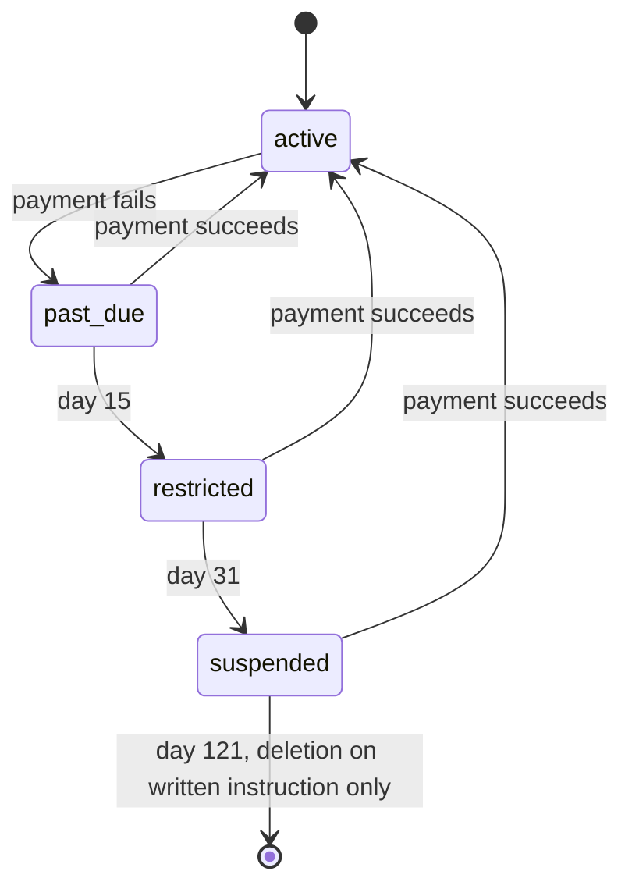
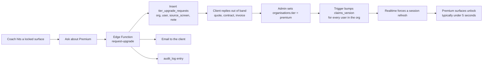

# 12. Product Tiers

The commercial packaging of Fydr: what is in each tier, why, what it costs, how the gate is
enforced, and what the split does to the roadmap.

**Status**: recommendation. Sections 5 (pricing) and 6 (free tier, trial, enterprise) are
commercial judgements and are tagged with confidence. Everything in section 7 (enforcement) is
a build instruction and is not optional once the tier split exists at all.

**Source of the two-tier decision**: the client, verbatim, "design basic plan for club level
plus premium level with gps". Two tiers. Base aimed at club level. Premium differentiated by
GPS. Everything below derives from that instruction.

---

## 1. What this resolves, and what it does not

The client's instruction partially answers **O-750** (`00-product-overview.md`), the blocking
question of whether Fydr targets professional rugby or small to mid-tier clubs.

| | Before | After |
|---|---|---|
| Base market | Unresolved between Position A and Position B | **Club level.** The client named it. |
| Premium market | Unresolved | The more serious end of club level, defined by owning GPS units |
| Price anchor | £1 per athlete per week, unattached to a market | Attached to the Club tier, at the semi-professional end |
| GPS | Contested: table stakes under Position A, upsell under Position B | **Upsell.** The client put it behind Premium explicitly. |

**What is still open.** "Club level" spans a range wide enough to change the product. A
National League 1 rugby union club with a paid director of rugby, a full-time S&C coach and
twenty GPS vests is club level. So is a Counties 2 side whose S&C coach is a volunteer with a
spreadsheet. Those two clubs differ by an order of magnitude in budget, in staff time available
to run the product, and in what they will tolerate in setup effort.

The instruction rules out the top of Position A: a Premiership club does not buy a tier whose
premium feature is the GPS import it already has from Catapult. It does not rule out the
overlap zone, and the overlap zone is where the price is decided.

**O-750 is therefore reduced from blocking to partially answered.** It no longer blocks Phase 1
scope, because Phase 1 is the same product either way. It still blocks the price, which is
O-851 below.

---

## 2. Tier names

**Recommendation: rename the schema enum to `club` and `premium`.**

| Where | Current | Recommended | Why |
|---|---|---|---|
| `subscription_tier` enum | `core`, `performance` | `club`, `premium` | Match the client's own words |
| UI label | "Core", "Performance" | "Club", "Premium" | Same |
| Docs | "Club tier", "Premium tier" | "Club tier", "Premium tier" | Same |

Three reasons to follow the client rather than keep the existing names:

1. **"Performance" is the wrong word in this product.** Fydr is an athlete *performance*
   management platform. A tier called Performance implies the other tier does not do
   performance, which is false and which undercuts the Club tier in the one sentence a buyer
   reads first. `CLAUDE.md` §6 already insists on consistent vocabulary for exactly this
   reason.
2. **"Core" reads as the cut-down version.** "Club" reads as the version for a club. The base
   tier has to be sellable on its own for roughly a year (section 9), so its name matters more
   than the premium tier's.
3. **The client will say "club" and "premium" in every conversation regardless.** A schema that
   says `performance` while the invoice says Premium is a translation layer that eventually
   produces a bug.

### 2.1 Migration

Postgres renames enum labels in place. The label OID does not change, so stored values, the
column default, indexes, and `metric_definitions.requires_tier` all follow automatically. This
is additive in the sense `CLAUDE.md` §5 requires: a new migration file, no rewrite of an
applied one.

```sql
-- supabase/migrations/<timestamp>_rename_subscription_tier_values.sql
-- Renames the subscription_tier labels to match the commercial names.
-- ALTER TYPE ... RENAME VALUE is transactional (Postgres 10+), unlike ADD VALUE
-- before Postgres 12, so this whole file runs in one transaction.

alter type public.subscription_tier rename value 'core' to 'club';
alter type public.subscription_tier rename value 'performance' to 'premium';

-- The column default is stored as a Const referencing the label OID, which is unchanged.
-- Re-declared here so a schema dump reads correctly and so the intent is explicit.
alter table public.organisations
  alter column tier set default 'club'::public.subscription_tier;
```

**What the rename does not reach, and must be changed by hand in the same commit:**

| Location | What breaks | Action |
|---|---|---|
| Zod schemas in `packages/core` | `z.enum(['core','performance'])` | Update. This is the one that will fail loudly, which is good. |
| Edge Functions comparing `tier === 'performance'` | Silently false. Every Premium check fails closed, so Premium orgs lose GPS. | Grep for the string literal across the monorepo before deploying. |
| Seed and fixture data | Insert fails on unknown label | Update |
| JWT claim value (section 7) | Stale tokens carry `'performance'` for up to 30 minutes | `auth_tier()` maps the old label to the new one for one release, then the mapping is deleted |
| Saved `jsonb` (analytics view definitions, org `settings`) | Any embedded tier string | Audit. Currently believed to be none. Verify before running. |

**Fail-closed rule.** Every tier comparison in TypeScript and SQL treats an unrecognised value
as `club`, never as `premium`. A rename bug then costs a Premium club its GPS screens for an
hour, which is a support call. The reverse costs every club free access to the only thing
Premium sells.

---

## 3. The split, feature by feature

`C` = Club, `P` = Premium, `Both` = in both tiers.

### 3.1 By screen

Every screen in the `02-information-architecture.md` §5 inventory.

| # | Screen | Tier | Reasoning |
|---|---|---|---|
| 1 | Today (athlete home) | Both | Carries the entire compliance burden. Gating it would gate the product's core thesis. |
| 2 | Wellness entry | Both | The compliance loop is the product. It is what the Club tier is sold on. |
| 3 | Nutrition guidance | Both | Athlete critical path. No marginal cost to serve. |
| 45 | Nutrition weekly check-in | Both | Athlete critical path, and the only source of the nutrition analytics variable. Gating collection behind Premium would mean Club-tier clubs generate no nutrition data at all, which makes an upgrade worthless on day one. Collect in both tiers, gate the *analysis* with the rest of the builder. |
| 4 | Gym session logging | Both | Athlete critical path. |
| 5 | Training RPE entry | Both | Athlete critical path, and the only load metric a club without GPS has. |
| 6 | My data / history | Both | An athlete's own history. Withholding it is indefensible and is an Article 15 problem. GPS tab exists only where GPS data exists. |
| 7 | My programme | Both | Athlete critical path. |
| 8 | Staff dashboard | Both | The exception list is the daily reason to open the product. GPS cards render only with GPS data. |
| 9 | Squad status | Both | Compliance and availability. Club tier's main staff surface. |
| 10 | Flags | Both | "The flag system is the product" (`00-product-overview.md`). The GPS flags tab is Premium because GPS data is. |
| 11 | Timetable | Both | Scheduling is infrastructure, not an upsell. |
| 12 | Injury dashboard | Both | Availability drives selection. Gating it makes the medical role unusable. |
| 13 | Injury record | Both | Clinical. Gating clinical safety behind a price is not defensible in any tier design. |
| 14 | Team allocation | Both | Selection depends on availability, and it depends on the group filter, which is a `CLAUDE.md` §3 global rule. |
| 15 | Schedule / calendar | Both | "The schedule is the spine" (design principle 4). Everything hangs off it. |
| 16 | Session detail | Both | Part of the spine. |
| 17 | Fixture detail | Both | Part of the spine. |
| 18 | MD-n planner | Both | The MD-n position is how every screen frames a week. Not separable. |
| 19 | Squad list | Both | The roster. Gating the roster is gating the tenancy. |
| 20 | Athlete profile | Both | GPS and load tab appears where GPS data exists. |
| 21 | Groups management | Both | The group filter rule makes groups load-bearing on every multi-athlete screen. |
| 22 | Programme builder | Both | The largest build in the product and it belongs in Club. See section 3.4. |
| 23 | Gym programmes | Both | Same. |
| 24 | Nutrition plans | Both | Same. |
| 25 | Testing | Both | A club without GPS still runs a CMJ and a 10m sprint. This is its objective data. |
| 26 | Leaderboards | Both | Athlete-visible and an engagement lever for compliance. Boards on GPS metrics require Premium via `metric_definitions.requires_tier`. |
| 27 | Analytics | **P** | **Amended 2026-09-01 — the screen is Premium.** This row said Both from the start, and §3.3 argued at length that only the *bar chart* was Premium. The club has since asked for the whole Analytics destination to be Premium: hidden from the sidebar on Basic and refused at the route, not shown with a locked panel inside it. That is what the code now does (`analytics/page.tsx`, `analytics/build/page.tsx`, `Sidebar.tsx`'s `PREMIUM_ONLY`). §3.3's reasoning is left below as the record of the earlier position, not as current behaviour. |
| 28 | Reports | Both | GPS sections of the load report render only with GPS data. |
| 29 | Settings | Both | Includes the tier display and the upgrade route. |
| 30 | Thresholds | Both | Flags are worthless without configurable thresholds. GPS-metric thresholds need Premium. |
| 31 | Exports | **Both** | Non-negotiable. See section 4.2. |
| 32 | User management | Both | Governance. Gating admin control over your own users is hostile. |
| 33 | Onboarding | Both | Success criterion 1 is a 30-minute onboarding. It cannot be a paid feature. |
| 34 | GPS data import | **P** | The premium hook. See section 5. |
| 35 | Audit log viewer | Both | Gating the audit trail undermines the compliance story that sells the product. |
| 36 | Report a problem | Both | Athlete safety route into medical. |
| 37 | Training report | **P** | All six metric columns and three of four summary tiles are GPS-derived. It is a GPS screen. |
| ~~38~~ | ~~Flight control~~ | n/a | **REMOVED from the product at client instruction, 5 Aug 2026.** Not tiered because it does not exist. |
| 39 | My dashboard | Both | Same treatment as 8, pending O-720. |
| 40 | Squad overview | Both | Same treatment as 9 and 19, pending O-721. |
| 41 | Fixtures list | Both | Part of the spine. |
| 42 | Rehabilitation grouping | Both | Clinical, and medical-owned. Gating it behind a price is no more defensible than gating 13. |
| 43 | Privacy and my data | Both | Article 15 and 20, and an App Store requirement. Not a feature and never a tier lever. |
| 44 | Data requests | Both | The controller-side counterpart of 43. Same reasoning. |

### 3.2 By capability

| Capability | Tier | Reasoning |
|---|---|---|
| Wellness monitoring | Both | The compliance thesis. Everything else is downstream of it. |
| Nutrition guidance, the weekly check-in, and plans | Both | Zero marginal cost, athlete-facing, and one of the few things nobody else at this price does. Nothing here is meal or macro tracking: the check-in is one question a week. |
| Gym programmes, builder, prescription, overrides | Both | The single largest build (13 weeks). Putting it in Premium would make Club unsellable and would strand the largest investment behind the smaller market. |
| Gym session logging | Both | Athlete critical path. |
| Training RPE and session load | Both | The load metric available to every club. Gating it leaves Club with no load data at all, which is exactly the crippling described in section 4. |
| Testing, batteries, results history, left/right | Both | The non-GPS objective measurement set. It is what makes Club credible. |
| Compliance expectations, percentage, waivers | Both | The Club tier's headline number. |
| Availability and injury records | Both | Clinical and selection-critical. |
| Rehab groups and allocation | Both | Depends on groups, which are global. |
| Scheduling, week templates, MD-n | Both | The spine. |
| Flags and thresholds | Both | Non-GPS domains. GPS-domain flags and thresholds are Premium because the data is. |
| Leaderboards | Both | GPS-metric boards Premium. |
| Reports, scheduled and formatted | Both | GPS sections absent without GPS data. |
| Analytics builder, presets, saved views | Both | Full builder in both tiers; GPS metrics only in Premium (none are built yet). **Amended 2026-08-30:** the *bar chart* visualisation is Premium — the builder is not. Saved views are not built in either tier. See 3.3. |
| Cross-domain correlation | Both | See 3.3. This is a deliberate change from the current spec. |
| Data export, CSV, XLSX, JSON | **Both** | Ethical and legal floor. Section 4.2. |
| Athlete portability export | Both | Article 20. Not a feature. |
| API export | P, when built | Deferred past v1 (O-225). A commitment on the tier table, not a shipped feature. |
| **GPS import, vendor CSV and XLSX** | **P** | The hook. Section 5. |
| GPS views, GPS flags, GPS leaderboards, training report | **P** | Downstream of the import. They render nothing without it. |
| ACWR from combined RPE and GPS load | P | Club gets ACWR computed from RPE and duration. Premium gets it from GPS load as well. The metric exists in both; the input set differs. |
| Apple HealthKit sync | **P** | See 3.4. O-862 **re-opened**: the club reversed its own 14 Aug decision on 30 Aug 2026 and HealthKit is Premium again. |
| Team and group allocation | Both | `CLAUDE.md` §3 makes groups global. Gating them breaks every multi-athlete screen. |
| Admin, user management, roles, audit log | Both | Governance. |
| Offline sync and queueing | Both | Infrastructure. A tiered offline mode is a support nightmare and an insult. |
| Push notifications and reminders | Both | Directly drives compliance, which is what the product is sold on. |
| Multi-squad within one organisation | Not built | If it is ever built it is a Premium line, because it is a professional-club need (O-860). |
| Vendor APIs (Catapult, StatSports, Polar) | P, Phase 4 | Only a club with a vendor contract wants this, and that club is by definition Premium. |
| Named support contact and response commitment | P | Honest differentiation and it costs real time. Club gets best-effort support, stated plainly rather than implied. |

### 3.3 Analytics: a recommended change to the current spec

> **STILL OPEN, AND NOT CONTRADICTED BY THE BUILD. Amended 2026-08-30.**
>
> An earlier pass of this build read the client's instruction — *"for the setting page
> move the analytics bar chart and apple health connection onto the premium plan
> side"* — as gating the whole `/analytics` route, closed O-854 as rejected on that
> basis, and struck this section through. **That has been reverted.** What ships now is
> the narrow reading the sentence actually supports: the **bar chart** is Premium, the
> screen is not. A `core` organisation keeps `/analytics` — every metric, the athlete
> and group pickers, every timeline, the trend chart, the athlete table and the day-by-
> day table — and sees a locked panel in the place the bar chart would have been.
>
> Two reasons the wide reading was wrong, recorded so it is not re-derived:
>
> 1. **It is wider than the instruction.** The same sentence names Apple Health, and the
>    Apple Health half was implemented narrowly — a plan-card column move plus a Locked
>    state on one Settings row, no route gated. Reading the two halves of one sentence at
>    two different scopes is a slip, not an interpretation.
> 2. **It deleted a shipped screen from existing customers**, which is precisely the
>    "highest-regret" move this section's own closing paragraph warns against
>    ("reversing it later is a downgrade for existing customers"). A downgrade of that
>    size is a commercial decision that needs the buyer's sign-off on the *scope*, not
>    only on the sentence. Nobody asked for it.
>
> So the recommendation below stands unchanged and **O-854 stays open**. Nothing in it is
> contradicted by the narrow gate: the recommendation is about which *metrics* and which
> *analysis capabilities* each tier gets, and the bar chart is a rendering of a metric
> both tiers can already read as a number.
>
> One correction to this section's framing, which is true either way: correlation,
> scatter, heatmap and saved views are **not built at all**, in either tier, so no tier
> can currently be sold on them. See `screens/analytics.md`'s own banner.

**Current spec** (`00-product-overview.md` tier table, `analytics.md` §"Tier gate"): Core gets
five presets plus a single-metric, single-domain builder with no correlation. Performance gets
multi-metric, cross-domain, correlation, scatter, heatmap and saved views.

**Recommendation: change this. Club gets the full analytics builder, including cross-domain
correlation and saved views, over the metrics the club actually has. Premium adds GPS metrics
to the same builder.**

The argument, in three steps:

1. `00-product-overview.md` core thesis 3 states that cross-domain correlation is "the durable
   differentiator". If it is the differentiator, then the tier without it is not the product.
   Selling a base tier that excludes the stated point of the product is selling a demo.
2. The gate becomes free. A Club organisation has no `gps_records` rows, so GPS metrics are
   absent from the metric picker without any tier logic at all. The lock is a property of the
   data, not a rule someone has to maintain across a builder with a `jsonb` definition format.
3. Two levers make the sales conversation about what is missing. One lever makes it about GPS.
   "Premium adds GPS" is a sentence a coach repeats to a committee. "Premium adds GPS,
   correlation, scatter charts and saved views" is a feature list that invites negotiation on
   each line.

**The cost of this recommendation, stated plainly.** The analytics builder is three weeks of
Phase 3 work with an open-ended tail. Giving it to Club means that work has to be justified by
Club revenue, and it removes a genuine upsell lever if Premium turns out to be too thin.
Reversing this later is a downgrade for existing customers, which is worse than never having
given it. **This is the highest-regret recommendation in this document.** O-854.

**Downstream edits required if accepted**: `analytics.md` §"Tier gate", its error table, its
edge cases 12 and 13, and the tier row in this document's own summary. Not made here.

### 3.4 HealthKit: Premium → Club → Premium again (O-862 re-opened)

HealthKit was Premium in the original spec, on a weak argument recorded rather than assumed:

| For Premium | For Club |
|---|---|
| It is objective device-derived load, the same category of data as GPS | Marginal cost per club is near zero once built |
| It gives Premium a second line so the tier is not literally one feature | It is athlete-initiated, and section 4.3 argues athlete features belong in both tiers |
| An Apple Watch is a proxy for the same spending pattern GPS units indicate | Sleep and HRV would materially improve the Club tier's readiness score |

**Decision 1 — 14 August 2026: Club.** O-862 asked the client to confirm, because the counter
was respectable, and the client chose the right-hand column. The original reasoning for gating
it (the athlete-features principle in section 4.3 is scoped to the athlete's critical path to
submitting an expected entry, and HealthKit is not on that path, so gating it doesn't break
compliance) was never wrong — it just wasn't a strong enough reason to keep it Premium once
asked directly. Shipped as commit `34a416e`.

**Decision 2 — 30 August 2026: Premium again. The club reversed its own decision.** This is
recorded as a reversal rather than written over the top of decision 1, because decision 1 was
not a mistake or a misreading — it was a considered call the customer made and then changed
their mind about, and the record of *why* it went the other way in August is exactly what stops
this question being re-litigated from scratch a third time. Shipped as the mirror image of
`34a416e`: `settings/page.tsx`'s Apple Health row is `isPremium()`-gated again and shows the
same `Locked` state the Catapult row shows on Basic; both plan-comparison lists and the plan
summary line moved the "Apple Health connection" line back to the Premium column.

**Nothing in the left-hand "For Premium" column got any stronger between the two dates, and
nothing in the right-hand column got weaker.** The reversal is a commercial preference, not a
new argument, and it should be described to a customer as one. If it is ever asked a third
time, the substantive case is still the table above, unchanged.

**Consistency note found while making this change**: section 8's `FEATURE_MIN_TIER` map in this
same document has said `'healthkit.sync': 'premium'` throughout — decision 1 never updated it,
and neither did section 9.4's "Settings, integrations | GPS and HealthKit sections render
locked". Those two were *wrong* between 14 and 30 August and are *right* again now, by accident
rather than by care. They are left as they stand because they now match the shipped gate.

---

## 4. The gating principle

### 4.1 What a tier split is for

A tier split exists to charge more to customers who get more value, without charging less to
everyone else. It does not exist to make the cheap tier unpleasant.

The failure mode is specific and common: the base tier is designed backwards, by taking the
full product and removing things until it hurts enough to force an upgrade. That produces a
base tier that does not work, which produces churn in month three, which is fatal for a
product whose entire value proposition depends on a behaviour change (athletes submitting
data) that takes four to eight weeks to establish.

**The base tier is what earns the club's trust.** A club that has run Fydr for a season, has
80% wellness compliance, and has a coach who checks the flag list every morning is a club that
will pay for GPS when it gets GPS units. A club that spent that season fighting a deliberately
limited product churns before the upsell is ever offered.

So the rule is:

> **Gate on cost to serve and on evidence of budget, never on pain.**

A feature belongs behind the paywall when it costs Fydr materially more to provide, or when
wanting it is itself proof that the club can pay. A feature must not be behind the paywall
merely because its absence would be annoying.

### 4.2 Data export is in both tiers, without exception

**This is the single hardest line in the document and it is not negotiable.**

Three separate reasons, any one of which is sufficient:

1. **UK GDPR Article 20.** The athlete has a right to receive the personal data they provided,
   in a structured, commonly used, machine-readable format. That right does not depend on what
   the club paid. `09-security-and-compliance.md` §"Article 20" already builds this as one
   export engine with two manifests. A tier gate on it would be a gate on a statutory right.
   Article 15 (subject access) is the same, and the SAR pack is generated by an admin.
2. **The club's own data.** Fydr is a processor for club data. Holding a club's wellness
   history hostage to an upgrade is the behaviour that makes buyers ask about data ownership
   before they ask about features (`00-product-overview.md`, Position A row "Who you sell to").
   The moment one club discovers it, every prospect hears about it.
3. **It is the cheapest possible trust signal.** "You can take your data out at any time, on
   any plan, in one click" is a sentence that closes deals against incumbents. Giving it away
   costs nothing because the export engine is built for Article 20 regardless.

**Corollary that matters more than the rule**: export stays available through payment failure,
through suspension, and through the retention window after cancellation. See section 7.6. A
club that stops paying still gets its data out. If it did not, the failure mode would be
"Fydr held our season hostage", which is unrecoverable.

The only defensible tier line near export is the **API**, and only because an API is an ongoing
operational and security cost (keys, rate limiting, versioning, support) rather than a file
download. It is deferred past v1 anyway (O-225).

### 4.3 Athlete-facing features are in both tiers

Precise statement of the rule:

> Everything on the athlete's critical path to submitting an expected entry is in both tiers.

Three reasons:

1. **Athlete compliance is the mechanism.** Core thesis 1: collection must be trivially easy or
   compliance collapses. Every friction added to the athlete side reduces the data that makes
   every staff-side feature work, including the Premium ones. Gating an athlete feature to
   pressure a staff-side purchase damages the asset being sold.
2. **The athlete is not the payer.** Degrading the experience of a nineteen-year-old academy
   player to extract money from the club treasurer punishes someone with no say in the
   transaction and no way to fix it.
3. **Re-onboarding on upgrade is a deal-killer.** If Premium changed what athletes see or how
   they log in, then upgrading would mean a squad-wide comms exercise mid-season. No coach
   volunteers for that in February. **An upgrade must be invisible to athletes**, except that
   new GPS numbers start appearing in My Data. That is a design constraint on the whole tier
   system, not a nice-to-have: no athlete-side migration, no re-consent, no re-install, no
   re-invite.

### 4.4 What is deliberately not a gate

Recorded so these are not reintroduced later.

| Rejected gate | Why it is rejected |
|---|---|
| Athlete count cap | Section 5.2. Corrupts the data and punishes academies. |
| History or retention window (for example, 90 days on Club) | The 7:28 day ACWR window and season-long trends are the analysis. A truncated history makes the product produce wrong answers rather than fewer answers, which is worse. |
| Number of staff seats | Encourages shared logins, which destroys the audit trail and breaches the medical data separation in `CLAUDE.md` rule 3. |
| Number of groups | The group filter is a global rule (`CLAUDE.md` §3). Capping it breaks every multi-athlete screen. |
| Offline sync | Training grounds have bad signal. A tiered offline mode means the Club tier loses entries, which loses compliance, which loses the club. |
| Push notifications | They are the compliance mechanism. Gating them gates the outcome the product is sold on. |
| Support at all | Club gets best-effort support and it is stated in writing. Premium gets a named contact and a response commitment. That is a difference in commitment, not a withdrawal of help. |

---

## 5. Why GPS is the right premium hook

### 5.1 The three tests

A good premium hook passes all three. GPS passes all three.

**Test 1: it costs materially more to serve.**

| Cost | Detail |
|---|---|
| Vendor formats | Catapult, StatSports, GPSports and Polar each export differently, and each changes without notice. `07-integrations.md` §3 exists almost entirely to handle this. |
| Column mapping and profiles | Per-vendor profile mapping, unit normalisation to canonical SI, and a rejection path for `unit_ambiguous` values |
| Athlete resolution | Exact, alias, fuzzy, then manual. A whole resolution UI in `imports.md`. |
| Storage volume | GPS is the highest-row-count data in the product by an order of magnitude. One session times one squad produces more rows than a month of wellness entries. |
| Support burden | Every failed import is a support call, and it happens on the day of the session, with a coach who wants the numbers before the review meeting. `07-integrations.md` §1 says this is the only integration whose success depends on a human doing a weekly task. |
| Build cost | 3 weeks for import plus 1.5 weeks for views, before the vendor-file surprises that `10-roadmap.md` warns about |

**Test 2: wanting it proves the budget exists.** A squad-wide GPS setup is roughly £8,000 to
£15,000 of hardware plus an annual vendor subscription. A club that has already made that
decision has a performance budget, a person whose job includes looking at the data, and a
reason to want it joined to wellness and injury. A club with no units cannot use the feature at
any price, so no revenue is lost by gating it.

**Test 3: its absence does not degrade the base product.** This is the one most premium hooks
fail. Fydr without GPS is a complete product: wellness, RPE load, gym, nutrition, testing,
compliance, availability, flags, reports and analytics. The Club tier is not Fydr-with-a-hole.
It is the product `00-product-overview.md` describes as replacing "the
spreadsheet-and-group-chat system". GPS is additive: it adds an external objective load source
to a load model that already works from RPE and duration.

### 5.2 Hooks considered and rejected

**Gating the number of athletes.** Rejected, and this is the most important rejection.

| Problem | Consequence |
|---|---|
| It punishes the club for having an academy | The clubs with the most athletes are the most invested clubs and the best references. Charging them most for their development pathway is backwards. |
| It creates an incentive to under-register | A club at a 30-athlete cap registers its 28 most important players and runs the rest on the old spreadsheet. |
| **Under-registration corrupts the data** | Compliance percentage is `submitted / expected`, and `expected` derives from the registered squad. A club that under-registers reports a compliance figure that is wrong, and compliance is the number the whole product is sold on and the number success criterion 3 is measured against. **The pricing model would be corrupting the primary product metric.** |
| It fights squad churn | Squad size moves weekly through injuries, dual registration, trialists and academy call-ups. A cap turns normal squad management into a billing event. |

Squad size still influences price, through **bands** (section 6), which is a different
mechanism: a band changes the invoice at renewal and never blocks a registration.

**Gating analytics entirely.** Rejected. Cross-domain correlation is the stated durable
differentiator. A base tier without it is not the product. See section 3.3.

**Gating the gym programme builder.** Rejected. It is the largest single build in the product
(13 weeks). Stranding it behind the smaller tier means the biggest investment serves the
smallest market, and it removes the feature most likely to make an S&C coach open the product
daily.

**Gating multi-user or multi-role staff access.** Rejected. It produces shared logins, which
destroys the audit trail and breaches medical data separation.

**Gating the mobile app, with Club as web-only.** Rejected outright. The mobile app is how
athletes submit. Web-only Club would have zero athlete submissions, which is not a cheaper
product, it is a different and useless one.

---

## 6. Pricing

**Confidence: low to medium.** These are reasoned recommendations built on one anchor supplied
by the client and on the cost structure of a one-developer product. They are not built on
market data, because none exists in the specification. Nobody has yet asked a real club what it
would pay. Section 6.5 says how to fix that before the first invoice.

### 6.1 Recommendation, in one line

**Banded flat annual fee per club, banded by registered squad size, billed per season. Not per
athlete.**

### 6.2 Per-athlete versus flat, argued

| | Per athlete | Flat, banded by squad size |
|---|---|---|
| Invoice predictability | Changes with every squad movement | Fixed for the season |
| Academy and development squads | Directly penalised | Absorbed within the band |
| Incentive to under-register | **Strong, and it corrupts compliance percentage** | None. Adding an athlete never changes this season's invoice. |
| Matches cost to serve | Poorly. Cost is driven by support and imports per club, not per athlete. | Well |
| Sales conversation | "It depends how many you register", then a spreadsheet | "£2,400 for the season" |
| Fits club budgeting | Poorly. Clubs budget annual line items, not variable monthly usage. | Well |
| Perceived fairness across club sizes | Good | Needs bands to stay fair, hence bands |

Per-athlete pricing is standard in this category and it is standard because it is easy to
explain, not because it is right. In a squad sport it fails on the one thing that matters here:
it makes registering an athlete cost money, and this product's primary metric is computed from
the registered squad. A pricing model that makes clubs shrink their registered squad makes the
product report better compliance than it achieved. That is worse than losing the revenue.

The £1 per athlete per week anchor is retained as a **sense check**, not as a mechanism. The
bands are set so that a mid-sized club lands near it.

### 6.3 The recommended bands

Billing period is twelve months, aligned to the club's season start rather than to a calendar
year.

| Band | Registered athletes | **Club** | **Premium** |
|---|---|---:|---:|
| **S** | up to 35 | £1,500 / year | £2,700 / year |
| **M** | 36 to 60 | £2,400 / year | £4,200 / year |
| **L** | 61 to 100 | £3,600 / year | £6,000 / year |
| **XL** | over 100 | Quoted. Likely more than one squad, which is not built. | Quoted |

Billing options:

| Option | Terms |
|---|---|
| Annual, paid up front | List price |
| Annual, two instalments | List price, split at season start and at the January point. No surcharge. Clubs at this level have seasonal cashflow and this removes a real objection at no cost. |
| Monthly | List price plus 15%. Priced to be the worse option, offered so that cash is never the reason for a no. |

**Band assignment rules, which exist to protect the data:**

1. Band is set at signup and reviewed only **at renewal**, from the peak registered athlete
   count during the completed period, using the `settings.md` billing count
   (`count(athletes) where status <> 'left_club'`).
2. Exceeding the band mid-season **never blocks a registration and never generates an
   invoice**. It changes the band at renewal.
3. A club within five athletes of a boundary at first renewal stays in the lower band for one
   further period. Sales discretion, recorded so it is applied consistently.

Rule 2 is the whole point. It removes every incentive to under-register while keeping price
proportional to size.

**Known defect of banding, stated plainly**: the boundary is a cliff. A club going from 60 to
61 athletes moves from £2,400 to £3,600, which is £1,200 for one player. Rules 1 and 3 blunt
it. They do not remove it. The alternative, a smooth per-athlete curve, reintroduces the
under-registration incentive, and a corrupted compliance metric is a worse defect than an
awkward conversation at renewal.

### 6.4 Indicative figures

| Club | Tier | Recommended annual | Effective per athlete per week | Against the £1 anchor |
|---|---|---:|---:|---|
| 30 athletes | Club | £1,500 | £0.96 | On anchor |
| 30 athletes | Premium | £2,700 | £1.73 | 1.8x anchor |
| 60 athletes | Club | £2,400 | £0.77 | 23% under anchor |
| 60 athletes | Premium | £4,200 | £1.35 | 1.35x anchor |

For comparison, the same clubs under a strict per-athlete model at the £1 anchor, with Premium
at £1.75:

| Club | Tier | Per-athlete model | Difference versus recommendation |
|---|---|---:|---:|
| 30 athletes | Club | £1,560 | £60 more |
| 30 athletes | Premium | £2,730 | £30 more |
| 60 athletes | Club | £3,120 | £720 more |
| 60 athletes | Premium | £5,460 | £1,260 more |

The banded model gives up revenue at the top of each band. That is the deliberate price of
removing the under-registration incentive, and it is also a volume discount that larger clubs
expect anyway.

**The Premium multiplier is roughly 1.75x Club.** Justification: a Premium club has already
spent £8,000 to £15,000 on GPS hardware plus a vendor subscription. An extra £1,200 to £2,400
per year for the software that makes that hardware's output usable alongside wellness and
injury data is a small fraction of a budget that already exists. If Premium is priced at only
1.2x Club it leaves money on the table from the only customers with a proven performance
budget. If it is priced at 3x it invites the club to keep using the vendor's own software and
keep the two data sets apart, which is the status quo Fydr is trying to displace.

### 6.5 How to validate this before invoicing anybody

**These numbers must be tested against what clubs will actually pay. They are a starting
position, not a price list.** The test is not "would you pay £2,400", to which everyone says
maybe. The test is:

1. Take the Club tier price to **five** clubs that match the target description.
2. Ask each for a signed letter of intent at that price, conditional on delivery. Not a
   verbal yes.
3. If five out of five sign, the price is too low. If zero sign, the market or the price is
   wrong and it is cheaper to find out now. Two or three is the signal to build.
4. Ask each of the five separately what they currently spend on performance software and on
   GPS. That number, not the anchor, should set the final price.

This is also the answer O-750 asked for: name the first club you expect to pay, state what they
currently use, state what you would charge them.

### 6.6 What voids these numbers

**If O-750 resolves toward professional rugby, every figure above is wrong by roughly an order
of magnitude**, and the tier design changes with it, because GPS stops being an upsell and
becomes table stakes (`00-product-overview.md`, Position A, GPS row). The client's instruction
points away from that, which is why these numbers are offered at all, but the dependency stands
and should be re-checked before a price list is published.

---

## 7. What is not in either tier

### 7.1 A free tier: no

| Argument | Assessment |
|---|---|
| Free clubs cost almost as much to support as paying ones | Decisive. Onboarding, imports, questions and bugs cost the same developer hours. Fydr is one person (`10-roadmap.md` §1). |
| Every free club carries the same legal weight | A free club still needs a DPA, still generates UK GDPR obligations, still creates breach exposure, and still holds special category data if injuries are recorded. Free does not reduce any of that. |
| Free-to-paid conversion is poor for club software | The buyer is a committee with an annual budget cycle. The moment to ask for money is the moment of decision, not eleven months later. |
| **A free club does not push its athletes** | This is the product-specific argument and it is the strongest. Compliance requires a coach to chase players. A coach chases players over something the club paid for. A free tool gets a shrug, produces 40% compliance, and then gets cited as evidence that the product does not work. |

**Verdict: no free tier.** Not now, not later, unless the business model changes to
volume-driven self-serve, which it is not.

### 7.2 A self-serve trial: no

A 14 or 30 day self-serve trial does not fit this product for a structural reason rather than a
commercial one. Fydr proves itself through a behaviour change measured at four weeks
(success criterion 3: compliance above 80% after four weeks). Onboarding a squad consumes the
first one to two weeks. A 30-day trial therefore ends at approximately the moment the product
starts producing its evidence, and it ends with a coach who has done the setup work and seen
none of the payoff. That is the worst possible impression.

Trials also carry the full support cost with none of the commitment that makes a club do the
onboarding work properly.

### 7.3 A time-limited pilot: yes, and it is paid

**Recommended instead of both, and confirmed by the client on 5 August 2026.** The roadmap's
thin slice explicitly needs a pilot club (`10-roadmap.md` §10, Phase 1a gate: "one real club
live"). The pilot is not a marketing programme, it is the mechanism by which the riskiest
assumption in the project gets tested.

> **Conflict resolved, 5 August 2026.** `10-roadmap.md` §10 said "free during the pilot" and
> that the pilot was "testing usage, not willingness to pay". This section said £500. **Paid
> wins**, and the roadmap has been corrected rather than this document. The argument is in
> `10-roadmap.md` §10 and the milestones it creates are in §11. O-65 is closed by it.

| Parameter | Recommendation | Reasoning |
|---|---|---|
| Length | 12 weeks | Long enough to clear onboarding and produce a four-week compliance figure with eight weeks of trend behind it. Matches the Phase 1 exit criteria. |
| Price | £500 for the 12 weeks, credited in full against the first annual invoice | **Paid, not free.** Three reasons, in order. A paying club turns up: staff attention is the entire dependency, and a free pilot's failure mode is a club that goes quiet in week three, leaving a compliance figure nobody can interpret. A paying club gives real feedback rather than polite feedback. And it tests willingness to pay, which is the second-riskiest assumption in the project after compliance itself. £500 is small enough to come out of a coach's discretionary budget without a committee. **Confidence: low on the figure, high on the principle.** It tests that a club will pay something, not what a club will pay per athlete per season, which stays O-1. |
| Tier | Club only | Premium does not exist until Phase 3. Section 9. |
| Club obligations, written | Squad onboarded within 14 days, a named staff contact, a fortnightly 20-minute call, and a written debrief at week 12 | The club is supplying the evidence, and the obligations should be explicit or they will not happen. |
| Fydr obligations, written | Named support, a response commitment for the pilot period, and full data export at any point including on exit | Reciprocity, and the export commitment removes the main reason to say no. |
| Conversion | Automatic roll to an annual Club subscription at the end of week 12 unless cancelled by week 10 | Decision at the point of maximum evidence. |

**Cap the pilot programme at two clubs concurrently.** A one-developer product supporting five
pilots builds nothing during the pilot period, and the pilots exist precisely so that building
can continue with better information.

### 7.4 An enterprise tier: no, not as a tier

A third "Enterprise, contact us" tier is Position A wearing a disguise. What a professional
club actually requires is not a tier, it is a different commercial relationship: a negotiated
contract, a completed security questionnaire, a negotiated DPA, penetration test evidence,
sub-processor disclosure, named support with response commitments, and probably vendor API
integrations. `00-product-overview.md` sets all of that out and `09-security-and-compliance.md`
is explicitly not written for it yet.

Publishing an enterprise tier that cannot be serviced produces enquiries that consume weeks and
end in a no, from exactly the buyers most likely to talk to each other.

**Verdict: no enterprise tier on the price list.** If a professional club approaches, price it
bespoke and treat it as a decision to reopen O-750, not as a sale. Revisit only when there is
a named professional club with a budget, and expect the compliance work to precede the contract
by several months.

---

## 8. Technical enforcement

**Client-side gating is a UI convenience. It is not a control.** A tier check in React hides a
menu item from an honest user. It is bypassed by anyone who opens the network tab. Every tier
rule that protects revenue must exist server-side, in RLS or in an Edge Function, and the
client check must be a mirror of it rather than the thing itself. This is the same rule as
`CLAUDE.md` rule 2 for roles, applied to tier.

### 8.1 Schema additions

Additions belong in `04-data-model.md` §17 as a follow-up delta. Recorded here as the origin.

```sql
-- Billing state is separate from tier. Overloading tier to express non-payment
-- would silently make a Premium club's GPS read-only with no explanation,
-- which is indistinguishable from data loss to the person looking at it.
create type billing_status as enum ('active','past_due','restricted','suspended');

alter table organisations
  add column billing_status    billing_status not null default 'active',
  add column tier_effective_from timestamptz not null default now(),
  add column billing_period_end  date,
  add column squad_band          text;   -- 'S' | 'M' | 'L' | 'XL', set at renewal

-- Who asked for an upgrade, from which screen. The screen matters: it tells you
-- which locked surface actually converts, which is the only real pricing data
-- you will have before the first renewal.
create table tier_upgrade_requests (
  id            uuid primary key default gen_random_uuid(),
  org_id        uuid not null references organisations(id),
  requested_by  uuid not null references users(id),
  from_tier     subscription_tier not null,
  to_tier       subscription_tier not null,
  source_screen text not null,          -- 'imports' | 'analytics' | 'settings' | ...
  note          text,
  status        text not null default 'open',   -- open | contacted | won | lost
  created_at    timestamptz not null default now(),
  updated_at    timestamptz not null default now(),
  deleted_at    timestamptz
);
```

### 8.2 The JWT claim

`organisations.tier` joins `org_id`, `roles` and `athlete_id` in `app_metadata`. Extend the
custom access token hook from `05-architecture.md` §5:

```sql
-- Inside auth_hooks.custom_access_token_hook, alongside the existing selects.
declare
  v_tier public.subscription_tier;
begin
  select o.tier into v_tier
  from public.organisations o
  where o.id = v_org_id and o.deleted_at is null;

  v_claims := jsonb_set(v_claims, '{app_metadata}', jsonb_build_object(
    'org_id',     v_org_id,
    'roles',      to_jsonb(v_roles),
    'athlete_id', v_athlete_id,
    'tier',       coalesce(v_tier::text, 'club'),   -- fail closed
    'cv',         coalesce(v_cv, 1)
  ), true);
```

`grant select on public.organisations to supabase_auth_admin;` is required alongside the
existing grants.

**Claim staleness on tier change**, following the `claims_version` model already specified:

| Event | Handling | Reasoning |
|---|---|---|
| Upgrade to Premium | Trigger on `organisations.tier` bumps `claims_version` for every user in the org. Realtime broadcast forces a session refresh. Typical propagation under 5 seconds. | The club just paid. Waiting 30 minutes for GPS to appear is a support call on day one. |
| Downgrade to Club | Same bump, same broadcast. **No forced sign-out.** | Unlike role removal, a stale Premium claim for up to 30 minutes is an annoyance, not an incident. Nobody sees data they should not: the data is the club's own. |
| Any write path | Reads `organisations.tier` from the table, not the claim | Writes are rare and cheap to check properly. A stale claim must never create billable data. |

That last row is the important one. **Read paths trust the claim. Write paths trust the
table.**

### 8.3 SQL: the helper and the policy pattern

```sql
-- Tier from the claim. Unknown or absent resolves to 'club'. Fail closed.
create or replace function public.auth_tier()
returns public.subscription_tier
language sql stable as $$
  select coalesce(
    nullif(current_setting('request.jwt.claims', true)::jsonb
             #>> '{app_metadata,tier}', ''),
    'club'
  )::public.subscription_tier
$$;

-- Ordered comparison. Tiers are a ladder, not a set, so new tiers slot in
-- without rewriting every policy.
create or replace function public.tier_rank(t public.subscription_tier)
returns int
language sql immutable as $$
  select case t when 'premium' then 2 else 1 end
$$;

create or replace function public.auth_has_tier(p public.subscription_tier)
returns boolean
language sql stable as $$
  select public.tier_rank(public.auth_tier()) >= public.tier_rank(p)
$$;

-- Authoritative check, read from the table rather than the claim.
-- Used on write paths only. security definer so it works under RLS.
create or replace function public.org_is_premium()
returns boolean
language sql stable security definer
set search_path = public as $$
  select exists (
    select 1 from public.organisations o
    where o.id = public.auth_org_id()
      and o.tier = 'premium'
      and o.billing_status <> 'suspended'
      and o.deleted_at is null
  )
$$;
revoke execute on function public.org_is_premium() from anon;
```

The tier-gated policy pattern, on `gps_records`:

```sql
alter table public.gps_records enable row level security;

-- READ: every tier, always. A downgraded or lapsed club keeps sight of its own
-- history. Read-only-on-downgrade is a property of the policy set, not a
-- separate mechanism someone has to remember to build.
create policy gps_records_select_staff on public.gps_records
  for select to authenticated
  using (
    org_id = public.auth_org_id()
    and public.auth_has_any_role(array['coach','medical']::public.app_role[])
  );

create policy gps_records_select_own on public.gps_records
  for select to authenticated
  using (
    org_id = public.auth_org_id()
    and athlete_id = public.auth_athlete_id()
  );

-- WRITE: Premium only, checked against the table.
-- org_is_premium() is wrapped in a scalar subquery so the planner hoists it to
-- an InitPlan and evaluates it once per statement rather than once per row.
-- A GPS import commits thousands of rows in one transaction and a per-row
-- function call there is a measurable cost.
create policy gps_records_insert on public.gps_records
  for insert to authenticated
  with check (
    org_id = public.auth_org_id()
    and public.auth_has_any_role(array['coach','medical']::public.app_role[])
    and (select public.org_is_premium())
  );

create policy gps_records_update on public.gps_records
  for update to authenticated
  using (
    org_id = public.auth_org_id()
    and public.auth_has_any_role(array['coach','medical']::public.app_role[])
  )
  with check ((select public.org_is_premium()));
```

Apply the identical shape to `gps_import_batches`, `device_metrics` (HealthKit), and any table
whose rows only exist under Premium.

**The mandatory test suite** in `05-architecture.md` §12 gains a tier dimension: for every
tier-gated table, assert that a Club-tier JWT can select existing rows and cannot insert,
update or delete, and that a Premium JWT can do all four. Per `CLAUDE.md` §5, write these
before the policies.

### 8.4 Edge Function enforcement

Every Edge Function that touches Premium data checks tier itself. It does not assume the client
checked, and it does not assume RLS covers it, because Edge Functions sometimes hold the
service role key and the service role bypasses RLS entirely (`05-architecture.md`
§"Service role rules").

```ts
// supabase/functions/_shared/requireTier.ts
import type { SupabaseClient } from '@supabase/supabase-js';
import type { Tier } from '@fydr/core';

const RANK: Record<Tier, number> = { club: 1, premium: 2 };

export class TierError extends Error {
  constructor(public readonly required: Tier) {
    super(`Requires the ${required} tier`);
  }
}

/**
 * Authoritative tier check. Reads organisations.tier, never the JWT claim,
 * because a claim is up to 30 minutes stale and this guards a write.
 * Throws rather than returning false so a forgotten check cannot fall through.
 */
export async function requireTier(
  admin: SupabaseClient,
  orgId: string,
  required: Tier,
): Promise<void> {
  const { data, error } = await admin
    .from('organisations')
    .select('tier, billing_status')
    .eq('id', orgId)
    .is('deleted_at', null)
    .single();

  if (error || !data) throw new TierError(required);

  const active = data.billing_status !== 'suspended';
  const rank = RANK[(data.tier as Tier) ?? 'club'] ?? RANK.club;
  if (!active || rank < RANK[required]) throw new TierError(required);
}
```

Called at the top of `import-parse`, `import-commit`, and any HealthKit ingestion function,
before any other work. A `TierError` returns HTTP 402 with a stable error code
`tier_required`, which the client maps to the locked state rather than to a generic failure.

### 8.5 Client: the hook and the component

Shared between the Next.js staff app and the Expo athlete app via the workspace package, per
the stack rules in `CLAUDE.md` §4.

```ts
// packages/core/src/tier/tiers.ts
export type Tier = 'club' | 'premium';

export const TIER_RANK: Readonly<Record<Tier, number>> = { club: 1, premium: 2 };

export type TierFeature =
  | 'gps.import'
  | 'gps.view'
  | 'gps.flags'
  | 'gps.leaderboard'
  | 'gps.thresholds'
  | 'analytics.gpsMetrics'
  | 'healthkit.sync'
  | 'export.api'
  | 'support.named';

/** Single source of truth for the split. Mirrors the SQL policies, never replaces them. */
export const FEATURE_MIN_TIER: Readonly<Record<TierFeature, Tier>> = {
  'gps.import': 'premium',
  'gps.view': 'premium',
  'gps.flags': 'premium',
  'gps.leaderboard': 'premium',
  'gps.thresholds': 'premium',
  'analytics.gpsMetrics': 'premium',
  'healthkit.sync': 'premium',
  'export.api': 'premium',
  'support.named': 'premium',
};

/** Unknown input resolves to the lowest tier. Fail closed. */
export function parseTier(value: unknown): Tier {
  return value === 'premium' ? 'premium' : 'club';
}
```

```ts
// packages/core/src/tier/useTier.ts
import { useMemo } from 'react';
import { useSession } from '../auth/useSession';
import { FEATURE_MIN_TIER, TIER_RANK, parseTier, type Tier, type TierFeature } from './tiers';

export interface TierState {
  tier: Tier;
  isPremium: boolean;
  /** True when the organisation's tier covers this feature. UI only. */
  has: (feature: TierFeature) => boolean;
  /** The tier a feature needs, for the locked-state copy. */
  requires: (feature: TierFeature) => Tier;
}

export function useTier(): TierState {
  const { claims } = useSession();
  const tier = parseTier(claims?.app_metadata?.tier);

  return useMemo<TierState>(() => ({
    tier,
    isPremium: tier === 'premium',
    has: (feature) => TIER_RANK[tier] >= TIER_RANK[FEATURE_MIN_TIER[feature]],
    requires: (feature) => FEATURE_MIN_TIER[feature],
  }), [tier]);
}
```

```tsx
// packages/ui/src/tier/TierGate.tsx
import type { ReactNode } from 'react';
import { useTier, type TierFeature } from '@fydr/core';
import { LockedPanel } from './LockedPanel';

export interface TierGateProps {
  feature: TierFeature;
  /** Where this gate sits. Recorded on an upgrade request so the client learns
   *  which locked surface converts. Must be stable across releases. */
  source: string;
  /** One plain sentence saying what the feature does and which tier has it.
   *  No marketing voice, no exclamation mark. See section 9.2. */
  explanation: string;
  children: ReactNode;
  /** Optional replacement for the default locked panel, for inline cases
   *  such as a single disabled chart type inside a working screen. */
  fallback?: ReactNode;
}

/**
 * Hides or locks UI by tier. This is a UI convenience and NOT a control:
 * the authoritative gate is the RLS policy and the Edge Function check.
 * Removing this component must never grant access to anything.
 */
export function TierGate({ feature, source, explanation, children, fallback }: TierGateProps) {
  const { has, requires } = useTier();

  if (has(feature)) return <>{children}</>;
  if (fallback !== undefined) return <>{fallback}</>;

  return <LockedPanel requiredTier={requires(feature)} explanation={explanation} source={source} />;
}
```

Usage:

```tsx
<TierGate
  feature="gps.import"
  source="imports"
  explanation="GPS import reads a file exported from your GPS vendor and matches each row to an athlete. It is part of the Premium plan."
>
  <ImportScreen />
</TierGate>
```

### 8.6 Downgrade behaviour

**Data is retained and made read-only. Nothing is deleted.** This follows `CLAUDE.md` rule 4
(athlete data is never hard-deleted) and it matches the behaviour `analytics.md` and
`settings.md` already specify for a Performance-to-Core downgrade.

| Surface | On downgrade |
|---|---|
| Existing GPS records | Retained, visible, read-only. Historic training reports still render. |
| GPS import | Locked. Existing batches remain viewable, cannot be reverted or re-run. |
| Saved analytics views on GPS metrics | Retained, open read-only with a plain caption. Not deleted. |
| GPS leaderboards | Unpublished automatically, retained. An athlete-visible board that stops updating is worse than one that goes away, because it silently misinforms. |
| GPS thresholds | Retained, stop evaluating. Existing GPS flags remain in history. |
| HealthKit | Sync stops. Delivered data retained. **The athlete is told the sync has stopped**, because their device permission is still granted and they would otherwise believe data is flowing. |
| Export | Unaffected, including export of GPS data. Section 4.2. |
| Athlete app | **No visible change.** No re-onboarding, no re-consent, no logout. Section 4.3. |

The read-only outcome falls out of the policy set in 8.3 rather than being a separate feature:
select policies have no tier predicate, write policies do.

### 8.7 Failed payment: the grace ladder

Never implement grace by flipping `tier` to `club`. That silently makes GPS read-only with no
explanation, which reads to the coach as data loss.



| State | Days | Staff experience | Athlete experience | Export |
|---|---|---|---|---|
| `active` | | Full | Full | Yes |
| `past_due` | 1 to 14 | Full function. A banner **visible to admins only**, plus email. | **No change.** | Yes |
| `restricted` | 15 to 30 | Read-only on staff screens. No new programmes, no imports, no threshold edits. Flags continue to evaluate. | **No change. Submission continues.** | Yes |
| `suspended` | 31 to 120 | Staff sign-in reaches a single screen: account status, contact, and export. | Athlete app read-only, with a plain message. Submission stops. | **Yes** |
| Deletion | after 120 | Only on written instruction from the club, following the audited erasure process in `09-security-and-compliance.md` | | |

Three rules inside that ladder, each deliberate:

1. **Athletes keep submitting through `past_due` and `restricted`.** Breaking athlete
   submission over a club's unpaid invoice destroys the compliance habit that took two months
   to build, punishes people who are not the payer, and makes recovery after payment worse than
   the original onboarding. The club's problem should not reach the squad until day 31.
2. **Billing state is never shown to athletes or to non-admin staff.** An athlete does not need
   to know their club has not paid. It is the club's commercial information, and surfacing it
   is a pressure tactic aimed at the wrong person.
3. **Export never stops.** Not at `restricted`, not at `suspended`, not during the 90-day
   retention window. Section 4.2.

**Confidence on the day counts: low.** 14 / 30 / 120 are conventional and defensible, not
derived. They should match whatever is written in the club contract, and the contract does not
exist yet. O-858.

---

## 9. The upgrade path in-product

### 9.1 Visible and locked, not absent

**This is a change to the current specification.** `imports.md` says the Imports route is
"absent rather than disabled" on the Club tier. That should change to visible and locked.

| Option | Assessment |
|---|---|
| Absent | The club never learns the feature exists. It cannot upgrade to something it has not seen. Discovery then depends entirely on a sales conversation that a one-person business does not have time to have with every club. |
| **Visible and locked, with an explanation** | **Recommended.** The item is present, marked, and clicking it explains what the feature does and how to get it. |
| Visible and dead | Worst of all. A menu item that does nothing reads as a bug, and the coach files a support ticket instead of an upgrade request. **Never ship this.** |

The counter-argument in `imports.md` is real: do not advertise what cannot be bought from
inside the product. It is answered rather than dismissed. Billing is deliberately out of band
in v1 (`00-product-overview.md` non-goals), so the locked screen does not end in a dead payment
button. It ends in "Ask about Premium", which sends a request to the client, who replies. That
is a working path, not an advert for a door that does not open.

### 9.2 What a locked surface looks like

Rules for `LockedPanel`, binding on every tier-gated surface:

1. **State what the feature does before stating that it is locked.** "GPS import reads a file
   exported from your GPS vendor and matches each row to an athlete." Then: "It is part of the
   Premium plan."
2. **Never use marketing voice.** No "Unlock", no "Upgrade now", no exclamation marks. The
   audience is one coach who is busy. `06-design-system.md` tone applies.
3. **Never imply the club is doing something wrong.** They are on the plan they chose.
4. **Show a real example where one exists.** A static screenshot of the training report with
   sample data explains GPS import faster than three paragraphs.
5. **One action: "Ask about Premium".** It opens a short form: an optional note, then submit.
6. **Confirm with a specific commitment**, "We will reply by email within two working days",
   and only if that is true.
7. **Never show a price on the locked screen.** Price is a conversation while banded pricing is
   still being validated (section 6.5). Revisit once the price is confirmed.

Locked surfaces, and where each appears:

| Surface | Locked presentation |
|---|---|
| `Import GPS` sidebar item | Present, with a lock affordance. Opens the locked panel. |
| `Training report` sidebar item | Present, opens the locked panel with a sample-data screenshot. |
| Analytics metric picker | GPS metrics listed and disabled, with "Needs Premium" against them. None are built yet, so nothing is listed today. **Amended 2026-08-30:** a Basic org *does* reach the picker — the route is not gated. The rule now also governs the **chart-type** control, where the Premium-only bar view stays choosable and marked `· Premium`, and selecting it renders the locked panel in place of the chart. Distinct from an *illegal* chart type (a trend over a single day), which is disabled with its reason (`analyticsBuilder.ts`'s `chartUnavailableReason`) — locked is purchasable, illegal is not. |
| Leaderboard metric picker | Same. |
| Thresholds, GPS domain | Domain tab present and locked. |
| Athlete profile, GPS tab | Tab present and locked. Staff only. |
| Settings, integrations | GPS and HealthKit sections render locked, per `settings.md` edge case 4. |
| Athlete app | **Nothing.** No athlete ever sees a locked surface. Athletes are not the buyer and section 4.3 applies. |

### 9.3 How the request reaches the client



Implementation notes:

- Rate limit to **one open request per organisation per 7 days**. A second attempt says a
  request is already open and when it was sent, rather than sending a duplicate.
- `source_screen` is required. It is the only pre-renewal signal about which locked surface
  actually converts, and that is real pricing data.
- Any staff role can request. Only an admin can be quoted. A coach asking is the useful signal;
  requiring admin rights to ask suppresses it.
- `organisations.tier` is writable only by the service role, never from the client, never by an
  org admin. Self-service upgrade is out of scope while billing is out of band.
- Log to `audit_log` per `04-data-model.md` §13.

---

## 10. Roadmap interaction

### 10.1 The plain consequence

**There is nothing to sell as Premium until Phase 3.**

| Phase | Effort | Cumulative | Premium sellable? |
|---|---:|---:|---|
| 0 Foundations | 7 weeks | 7 | No |
| 1a Thin slice | 9 weeks | 16 | No |
| 1b Completing Phase 1 | 6 weeks | 22 | No |
| 2 Programmes, gym, testing, injury, reports | 13 weeks | 35 | No |
| **3 GPS import, analytics, HealthKit** | 9 weeks | **44** | **Yes** |

On the roadmap's own likely estimates, Premium becomes sellable at roughly **week 44**, which
is eleven to fourteen months full time, and longer part time. Every Premium line in section 3
is GPS or downstream of GPS, so **the tier split earns nothing at all until then**.

Four consequences:

1. **The first clubs are sold Club tier or a pilot.** There is no other option. Premium is a
   forward commitment, not a product.
2. **Club tier pricing must carry the business alone for a year.** This is a direct argument
   against pricing Club as a loss leader that Premium later recovers. There is no "later" for
   roughly a year. It is a specific argument for the section 6.3 figures rather than something
   lower.
3. **Selling Premium before it exists is a pre-order, and should be written as one**, with a
   delivery date, a stated remedy if the date slips, and no revenue recognised until delivery.
   Taking money for GPS import in month three and shipping it in month twelve is how a
   one-person business acquires its first angry customer.
4. **The tier gate still gets built early.** The mechanism in section 8 lands in Phase 0
   alongside the RLS work, because retrofitting a tier predicate onto policies that already
   exist means reopening every policy and the entire cross-tenant suite. The mechanism is
   cheap now and expensive later. Only the gated features are late.

### 10.2 The circular entry criterion

`10-roadmap.md` §6 sets a Phase 3 entry criterion:

> A pilot club is on the Premium tier, or has committed to it. Building tier-gated features
> with nobody paying for the tier is speculative.

**As written this is circular.** No club can be on Premium before Phase 3, because Premium
consists entirely of things Phase 3 builds.

The "or has committed to it" clause is the escape, and it should be tightened into the actual
criterion:

> **A named club has committed in writing to pay the Premium price on delivery, has GPS units
> in use, and has supplied at least three real export files from at least two vendors.**

That is testable before Phase 3 starts, it preserves the intent (do not build a tier nobody
will buy), and the export-files requirement is already a separate Phase 3 entry criterion, so
it costs nothing to combine them. **Recommend amending `10-roadmap.md` §6.** Not amended here.

### 10.3 Should GPS move earlier?

**Recommendation: do not move it before Phase 1a. Do audit it immediately, and be ready to
move it into Phase 2 if the audit comes back positive.**

The evidence that it should move (already recorded at the top of `10-roadmap.md` and in
`02-information-architecture.md` §4.1):

- `Import GPS` is a top-level sidebar item in the shipped staff web app, one of fifteen.
- The `Training report` screen is entirely GPS-derived: all six metric columns and three of
  four summary tiles.
- The client's own framing puts GPS at the centre of the product.

The commercial argument to move it is strong: **Premium sellable at week 35 instead of week 44
is nine weeks of the higher-priced tier, on the customers with the proven budget.** On the
section 6.3 figures that is a material difference for a one-person business.

The argument against moving it in front of Phase 1a is stronger, and it is the argument the
whole roadmap rests on: the riskiest assumption is that athletes will submit a wellness entry
on a wet Tuesday in February. GPS does not test that. Displacing the thin slice to build the
premium feature means building the upsell before proving the product, which is the exact
inversion `10-roadmap.md` §1 warns against.

**So: sequence the decision on evidence.**

| Step | Action |
|---|---|
| 1 | Answer **O-770**: audit which Phase 3 GPS workstreams already exist in the running app, and to what depth. A rendered report screen is not an import pipeline. Specifically check the vendor profile mapping, athlete resolution, unit normalisation, and the controls in `09-security-and-compliance.md` §9.2. |
| 2 | If the import pipeline exists and works, the 3-week import estimate is wrong and **GPS import plus GPS views move to Phase 2**, which makes Premium sellable around week 35. |
| 3 | If only the report screen exists reading from a table someone populated by hand, GPS **stays in Phase 3**. |
| 4 | Either way, Phase 1a is unchanged. The thin slice ships first. |

This audit is cheap, it is the difference between a nine-week swing in when the higher tier
starts earning, and it is currently unanswered. It should be done in the first week of Phase 0.

---

## 11. Summary tier table

The condensed version. `00-product-overview.md` carries a copy of this and points here.

| | **Club** | **Premium** |
|---|---|---|
| Wellness, nutrition, gym, RPE, testing | Yes | Yes |
| Compliance, availability, injury, rehab | Yes | Yes |
| Scheduling, MD-n, fixtures | Yes | Yes |
| Programme builder and prescription | Yes | Yes |
| Flags, thresholds, leaderboards | Yes | Yes |
| Reports | Yes | Yes |
| Analytics builder | Yes, minus the bar chart | Yes, including the bar chart. Metric, athlete, group, timeline and chart-type pickers in both. *(Correlation and saved views are not built in either tier.)* |
| ACWR | From RPE and duration | From RPE, duration and GPS load |
| Data export, CSV, XLSX, JSON | **Yes** | **Yes** |
| Athlete app, offline, notifications | Yes | Yes |
| Admin, users, roles, audit log | Yes | Yes |
| Apple HealthKit sync | No | **Yes** |
| **GPS import** | No | **Yes** |
| GPS views, flags, leaderboards, training report | No | Yes |
| API export (post-v1) | No | Yes |
| Support | Best effort | Named contact, response commitment |

---

## 12. Downstream document edits required

Made in this commit:

| File | Change |
|---|---|
| `00-product-overview.md` | Tier table replaced with a condensed version plus a pointer here. O-750 entry updated to record the partial resolution. |

**Not made here.** Each needs a separate, reviewable change, and several depend on answers to
section 13.

| File | Change needed | Depends on |
|---|---|---|
| `04-data-model.md` §3, §17 | Enum rename, `billing_status`, `tier_effective_from`, `billing_period_end`, `squad_band`, `tier_upgrade_requests` | O-850 |
| `05-architecture.md` §5 | `tier` claim in the access token hook, `auth_tier()`, `org_is_premium()`, tier row in the claim-staleness table | O-850 |
| `07-integrations.md` §1 | Tier column values change from Core / Performance to Club / Premium | O-850 |
| `10-roadmap.md` §6 | Phase 3 entry criterion de-circularised (10.2). Possible move of GPS to Phase 2 (10.3). | O-770 |
| `analytics.md` | Tier gate section, error table, edge cases 12 and 13, if the section 3.3 recommendation is accepted | O-854 |
| `imports.md` | "Absent rather than disabled" becomes visible and locked (9.1) | O-855 |
| `exports.md` | Confirm CSV, XLSX and JSON in both tiers, and that export survives suspension | O-856 |
| `leaderboards.md`, `reports.md`, `thresholds.md`, `settings.md` | Tier label rename, and GPS-metric gating stated consistently | O-850 |
| All docs | "Club tier" and "Premium tier" to "Club tier" and "Premium tier" | O-850 |

---

## 13. Open questions

Raised by this document. Numbered from O-850 to keep clear of the existing ranges.

| ID | Question | Blocking? |
|---|---|---|
| **O-850** | Confirm the tier names `club` and `premium` and authorise the enum rename. Everything in section 12 waits on this one answer, and it costs nothing today and a migration plus a doc sweep in six months. | Yes, for the schema |
| **O-851** | Are the section 6.3 band prices right? They must be tested against five real clubs before an invoice is issued (6.5). What do the clubs you know currently spend on performance software and on GPS? | Yes, before selling |
| **O-852** | Are the band boundaries (35 / 60 / 100) right for rugby squad sizes including academy? A boundary in the wrong place creates a cliff where clubs actually cluster. | Yes, with O-851 |
| **O-853** | Pilot terms. **The paid-versus-free conflict is resolved, 5 August 2026: the pilot is paid.** `10-roadmap.md` §10 said "free during the pilot" and §7.3 here said £500; this document was right and the roadmap has been corrected, with the argument for paid recorded there and O-65 closed. What is still open is the shape, not the principle: is £500 for 12 weeks credited against the first invoice right, and is two concurrent pilots the right cap for one developer? | Before Phase 1a exit |
| **O-854** | **Accept or reject the analytics change in section 3.3.** *Briefly closed as "rejected" on 2026-08-30 and re-opened the same day.* The closure rested on reading *"move the analytics bar chart ... onto the premium plan side"* as an instruction to gate the whole `/analytics` route; that gate shipped, then was reverted, because it deleted a live screen from every existing `core` org — the exact "highest-regret" outcome §3.3 warns about — and because the Apple Health half of the same sentence was implemented at a far narrower scope. What ships is the narrow gate: the bar chart is Premium, the screen is not, which contradicts nothing in §3.3. **The question §3.3 actually asks is still unanswered and still needs the buyer.** Ask it separately from the bar chart, and ask explicitly whether removing analytics from existing Basic clubs is wanted — do not infer it. | **Open.** Before a price list is published |
| **O-855** | Confirm visible-and-locked over absent for Premium surfaces (9.1), against the existing `imports.md` rule. | Before Phase 3 |
| **O-856** | Confirm that export is available in every tier and in every billing state including suspension, and that this is written into the club contract rather than only into this document. | Yes, contract |
| **O-857** | Which athletes count for the band? `settings.md` uses `count(athletes) where status <> 'left_club'`. Do trialists, dual-registered players and long-term injured count? Does a separate academy squad count? | With O-851 |
| **O-858** | Confirm the grace ladder day counts, 14 / 30 / 120 (8.7). These must match the contract, which does not exist yet. | Before first invoice |
| **O-859** | Billing stays out of band in v1 (`00-product-overview.md` non-goal). At what customer count does that break, and is Stripe the intended answer? Manual invoicing is fine at five clubs and is a part-time job at forty. | Phase 4 |
| **O-860** | Is multi-squad within one organisation a Premium line if it is ever built? It is currently unbuilt and is a professional-club need. | Not now |
| **O-861** | The API export is a commitment on the tier table and not a shipped feature (O-225). Does it stay on the Premium column while unbuilt? Recommendation: yes, marked "planned", or remove it. Do not list it plainly. | Before publishing a price list |
| **O-862** | **Re-opened, 30 August 2026. Two decisions, both on the record — see 3.4.** (1) *Resolved 14 August 2026: HealthKit moved to Club/Basic*, on the counter-argument (near-zero marginal cost, athlete-initiated, sleep and HRV would materially improve the Club readiness score), shipped as `34a416e`. (2) *Reversed 30 August 2026 at the club's own request: HealthKit is Premium again*, shipped as the mirror of that commit. Decision 1 is deliberately **not** deleted: no new argument arrived, the club simply changed its commercial mind, and the reasoning that won in August is what stops this being argued from zero a third time. | **Re-opened.** Needs a written answer before a price list is published, because a feature that has moved tier twice in three weeks cannot be printed on one. |
| **O-863** | What support commitment is honest for Premium? A named contact is free to promise and expensive to keep for one person. State hours and a realistic response time, or do not sell it. | With O-851 |
| **O-864** | Is `tier` needed in the JWT at all? Read paths could look up `organisations.tier` directly at a small cost. Keeping it out of the claim removes the staleness case entirely. Recommendation: keep the claim for read paths and the table for write paths, as specified, but the simpler alternative is worth a decision rather than an assumption. | Phase 0 |
| **O-865** | How long is GPS data retained after a downgrade or a cancellation? Section 8.7 says 120 days before deletion on written instruction, which needs to agree with O-13 (data retention after an athlete leaves a club) and with the contract. | Before first Premium sale |
| **O-866** | **O-750 is partially answered, not closed.** "Club level" spans National League 1 to Counties 2, and those clubs differ by an order of magnitude in budget and in staff time. Name the first club you expect to pay, what they use now, and what you would charge them. Until that exists, the section 6 prices are reasoned guesses. | Yes, for pricing |
