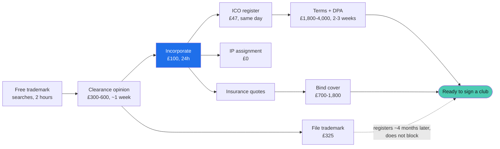

# 13. Legal: the bare minimum

Everything you must do before a real club uses Fydr with real athletes. Nothing else.

Fees verified 5 August 2026. They change, so re-check before paying.
This document is the **single source of truth for legal facts and figures**. Where
`09-security-and-compliance.md` gives a different number, this one wins.

**Not legal advice.** Two items below are worth paying a professional for and are marked.

---

## The four things that actually matter

Do these in order. The whole list is one week of your time plus about £1,200, then
roughly another £2,000 on contracts before the first club signs.

| # | Do this | Cost | Time | Why it cannot wait |
|---|---|---|---|---|
| 1 | **Incorporate a limited company** at Companies House, online | £100 | 24 hours | You are personally liable for everything until you do. A data breach reaches your own assets. |
| 2 | **Register with the ICO**, Tier 1, by direct debit | £47 | Same day | Processing personal data without paying the fee is an offence. You are probably already doing it. |
| 3 | **File the UK trademark** for Fydr | £325 | 3 to 4 months | You have published the brand. Anyone can file it, and then you infringe your own name. |
| 4 | **Insure**: professional indemnity plus cyber | £700 to £1,800/yr | 1 week | Clubs will ask. An uninsured breach is the end of the business. |

Then, before you sign the first club, one paid document: **your subscription terms**.
That is where the liability cap lives. See §5.

---

## 1. Company

- Companies House, online, **£100**, registered within 24 hours. Postal is £124 and takes 8 to 10 days.
- SIC code **62012**, business and domestic software development.
- Use a **registered office service**, £30 to £60 a year, or your home address goes on the public register.
- 100 ordinary £0.01 shares to you. Not 1 share, it makes any future split awkward.
- Model articles are fine. Do not pay for bespoke ones.
- **Do not register the name until the trademark search comes back clean** (§3).

Once it exists, sign everything as a director on behalf of the company, never personally.

**Same week**: assign your existing code and designs to the company in writing. You wrote the
web app as an individual, so the company does not own its own product until you do this.
If anyone else contributed code or the logo, they assign too.

## 2. ICO

- Tier 1, micro organisation: under £632,000 turnover **or** 10 or fewer staff. You qualify.
- **£52, less £5 for direct debit, so £47.** Annual.
- Register in the company's name, so do it after step 1, same day.
- Tier 2 is £78 and Tier 3 is £3,763. You will not reach Tier 2 for years.

## 3. Trademark

**Search first.** Free searches: UKIPO, EUIPO eSearch, WIPO Global Brand Database, Companies
House, domains and app stores, and a plain web search for unregistered UK use. Two hours.

**Then pay for a clearance opinion, £300 to £600.** `[worth paying for]` The free searches
tell you what exists. They do not tell you whether "FEEDR" in class 42 is a problem for
"Fydr" in class 42. That judgement is what you are buying, and Fydr is phonetically
identical to "Feeder", which is exactly the kind of similarity that gets refused.

**Then file.** UKIPO raised all trade mark fees 20 to 25% on 1 April 2026. Current figures:

| | Fee |
|---|---|
| First class | £205 |
| Each additional class | £60 |
| Renewal, 10 years, one class | £245 |

**File classes 9, 42 and 41: £325.**

- **9** downloadable software and mobile applications
- **42** software as a service, the core of what Fydr is
- **41** sports training information and coaching content, because the nutrition module
  provides guidance and meal ideas rather than logging
- **Not 44** (medical services). Fydr records availability, it does not provide healthcare.
  Filing there invites objection and implies a regulatory position you do not want.

Classes 9 and 42 alone cost £265 and protect the software. Adding 41 later means a fresh
£205 application, so £60 now saves £145 if you ever want it.

**Timeline**: examination 2 to 3 weeks, then publication, then a **2 month opposition
window**, then registration. **3 to 4 months** unopposed. Term 10 years, renewable.

**Priority date is the filing date, not the registration date.** That is why filing early
matters, and it opens a 6 month window to extend abroad on the same priority date. Diary
that deadline even if you think you will not use it.

**`™` is free to use today. `®` only once registered.** Using `®` before registration is a
criminal offence under section 95 of the Trade Marks Act 1994. Check the existing web app
and the design system file for any `®`.

**If the search comes back dirty**: a conflict in class 9 or 42 is serious and probably means
rebranding, but that call is what the clearance opinion is for, so take the advice rather
than the rule. A conflict in an unrelated class usually is not a problem. Either way decide
fast, because the cost of a rebrand today is a domain and an hour of find-and-replace. In
twelve months it is every club contract and every athlete's home screen.

## 4. Insurance

Get three quotes. A broker will not quote until the company exists.

| Cover | Indicative |
|---|---|
| Professional indemnity | £400 to £900 |
| Cyber liability | £300 to £900 |
| **Total** | **£700 to £1,800 a year** `[confidence: low on the exact figure, the range is right]` |

**Tell the broker you process special category health data about identifiable individuals,
including children.** Not "including under-18s if that applies": as of 5 August 2026 it applies
(O-886). Say it in the proposal form in those words, and say it again on renewal. Under-18s in
the data set change the underwriter's view of a breach, and a non-disclosure is how a policy gets
voided at the exact moment you need it. `[high]`

Two things to ask the broker while you have them, because they are cheap to ask and expensive to
discover: whether the cyber policy covers regulatory defence costs for an ICO investigation
involving children's data, and whether professional indemnity responds to a claim arising from
the club's use of Fydr output in a selection decision, which is the thing
`09-security-and-compliance.md` §4.5 prohibits in the contract and cannot prevent in fact.
`[medium, this is what I would ask, not a coverage opinion]`

## 5. Contracts and policies

| Document | Pay for it? | Cost |
|---|---|---|
| **Subscription terms / master services agreement** | **Yes. This is the one.** `[worth paying for]` | £1,000 to £2,500 |
| Data processing agreement with each club | Template, then one cheap review | £800 to £1,500 |
| Privacy notice for athletes | ICO template | £0 |
| **Child-facing privacy notice, under 18** | Copy written (`docs/screens/onboarding.md` step 5c). Review it in the same engagement as the terms | £0 if bundled |
| Privacy notice for staff | ICO template | £0 |
| Record of processing (ROPA) | ICO template | £0 |
| Sub-processor list (Supabase, Vercel, Expo, email) | Write it | £0 |
| Breach response plan | `09-security-and-compliance.md` | £0 |
| DPIA | `09-security-and-compliance.md` | £0 |

**Why the terms, and not the DPA.** Article 28 prescribes most of a DPA's content, good
templates exist, and a club at this level will sign what you put in front of them. Get it
reviewed once, cheaply, with one instruction: make sure it covers special category health
data and the medical-access separation in `01-roles-and-permissions.md`.

**Children's data clause, added 5 August 2026 (O-886).** Both the DPA and the subscription terms
now need one, and it is not boilerplate. It carries the argument in
`09-security-and-compliance.md` §4.5 that keeps the flag system defensible, so it goes on the
instruction list for the paid review rather than being drafted from a template. Minimum contents:

| Clause | What it must say | Why |
|---|---|---|
| Age assertion | The club asserts each athlete's date of birth and accepts the consequence of getting it wrong | Fydr's age assurance is self-declaration verified by the club (§4.3). That only works if the club has agreed to it in writing |
| Minimum age | No athlete under 13. Enforced in the product and stated in the contract | §4.4 |
| **Detrimental use prohibition** | Flags, compliance percentages, wellness scores and any derived score must not be used for deselection, release, contract or scholarship decisions, or academy exit | Standard 5 and standard 12. This is the load-bearing clause. A club that will not accept it cannot have minors on the platform, and better to find that out in the contract than in a complaint |
| Human decision | The club confirms a person, not the system, makes every decision affecting an athlete | Article 22, and it is the same point in different words for a different audience |
| Parental involvement | The club's own process, and that Fydr provides no parent login | §4.7 |
| DPIA adoption | The club reviews and adopts the template DPIA including its Children's Code section | Standard 2, and it is what puts the club on record |

**Cost impact: assume the DPA review lands at the top of its range**, so £1,500 rather than £800,
because the children's clause is the part that needs actual drafting attention rather than a
template check. That is the only figure in this document the decision moves. `[medium]`

**The child-facing privacy notice is a second deliverable, not a variant of the first.** Its copy
is written (`docs/screens/onboarding.md` step 5c) and it needs the same solicitor's eye as the
adult notice. Instruct both in one engagement. Instructed separately it is a second fee and a
second wait, and the wait is on the Phase 1a critical path (`10-roadmap.md` §4).

**The money goes on the master services agreement**, because that is where your commercial
liability actually lives: the liability cap, the indemnity position, the service level or
the explicit absence of one, termination and data return, and the clause saying you do not
provide medical advice. **A solo developer signing an uncapped indemnity to a club is the
single most expensive mistake available in this project**, and it is made in a contract
nobody reads.

**Legal spend: £2,100 to £4,600**, being the terms, the DPA review, and the clearance
opinion. Full analysis in `09-security-and-compliance.md` §5.

**The athlete privacy notice blocks the build.** The consent screen in
`docs/screens/onboarding.md` has to say what the privacy notice says, so draft the notice
before you build that screen, not after. **Since O-886 that is two notices, not one**, and the
child version blocks the same screen. Draft and instruct both together.

---

## Total cost

| | Low | High |
|---|---:|---:|
| Incorporation | £100 | £100 |
| ICO | £47 | £47 |
| Trademark clearance opinion | £300 | £600 |
| Trademark filing, 3 classes | £325 | £325 |
| Insurance, year one | £700 | £1,800 |
| Terms and DPA review | £1,800 | £4,000 |
| Registered office service | £30 | £60 |
| **Year one** | **£3,302** | **£6,932** |

Ongoing: roughly £800 to £2,000 a year, mostly insurance.

---

## Sequence

No calendar dates, because they slip and then the document is wrong. Sequence and
dependencies only.

**Critical path to signing a club**: searches, then opinion, then incorporate, then the terms and DPA.
Roughly 5 to 6 weeks of elapsed time, most of it waiting on other people. The trademark runs
alongside and does not block anything.

Start the searches today. Everything else waits on them.

---

## Open questions

| ID | Question |
|---|---|
| **O-880** | Are you employed, or were you while building the web app? Many contracts claim IP in work created during employment. Resolve before the assignment in §1. |
| **O-881** | Did anyone else contribute code, design or the logo? Each needs an assignment. |
| **O-882** | Class 41 in or out? £60 now versus £205 later. I recommend in. |
| **O-886** | **RESOLVED, 5 August 2026. Yes.** Academy and youth squads are in scope, so athletes under 18 will use Fydr. The Children's Code applies in full and Fydr builds to it. The 18+ and 16+ options are both withdrawn, the minimum age is 13, and the Code work has moved into Phase 1a (`10-roadmap.md` §4). Consequences for this document are in §4 and §5 below. Open questions the decision creates: O-960 to O-964 in `09-security-and-compliance.md` §4.10. |
