# 19. Page flows: what every page does when you click it

This document answers one question the client asked, in the client's words: *"a flow chart to
show how every page will work in simplest human form. For example dashboard has timetable and
player availability and both are clickable to expand with edit buttons in the frames."*

> **Where the technical binding lives.** This document deliberately contains no route paths,
> no table names and no field names, because its readers do not need them. They are in
> `20-route-map.md`, which binds every page here to a route, a spec file, a shell, a role set
> and, panel by panel, a component, a query and the tables it reads. When the two disagree,
> this document wins on intent and behaviour and `20-route-map.md` wins on naming. Anything a
> panel here needs that does not exist in the schema is listed in that file's gaps section
> rather than invented.

So this is a **click map**. For every page it says what is on it, what you can press, what
happens when you press it, what expands, what opens on top, and who is allowed to change it.
It is written for someone who has never built software. There are no table names and no field
names anywhere in it.

Two rules that run through the whole product and are worth reading before anything else:

1. **Coaching staff see what a player can do. Medical staff see why.** A coach sees the body
   area, whether the player is available, what he is restricted from, and when he is expected
   back. A coach never sees a diagnosis. A head injury shows to a coach as
   "return to play protocol, stage 3 of 6", which is a restriction, not a diagnosis.
2. **Only medical staff can change whether a player is available.** Not coaches, not the S&C
   staff, not the admin, and not on any page. There is no exception anywhere in this document.

Sources: the screen list in `02-information-architecture.md` §5, the real staff sidebar in
§4.1, the permission matrix in `01-roles-and-permissions.md` §2, the five role briefs in
`14-` to `18-`, and the three built mockups (`fydr-mockup.html`,
`fydr-mockup-roles.html`, `fydr-mockup-athlete.html`), which are the visual truth and which
these diagrams follow.

---

## 1. How to read this

Four shapes, and nothing else.

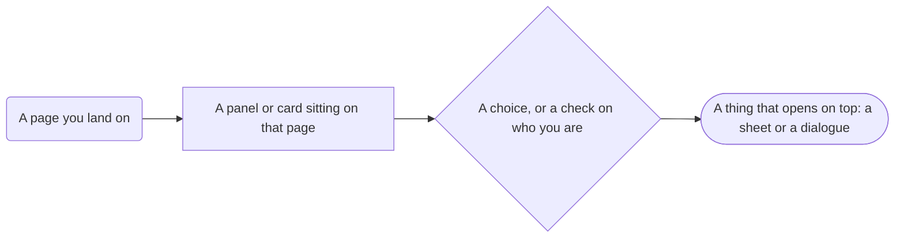

- **Rounded** is a page you land on. The address changes and Back brings you home.
- **Rectangle** is a panel or a card sitting on that page.
- **Diamond** is a choice, or a check on whether your role is allowed to do the thing.
- **Stadium**, the pill shape, is something that opens on top of what you were looking at: a
  sheet that slides up, or a dialogue box. You close it and you are back where you were.

Arrows are labelled with the thing you actually do, for example
`click a player's name` or `Edit, top right`.

---

## 2. The master map

Two shapes of product. Staff mostly work at a desk on the web dashboard. Athletes are only
ever on a phone. Staff also get a phone app, which is the same pages in a different shape,
covered in §2.3.

### 2.1 Staff, web dashboard

**Nine rows in the sidebar, set by the client on 6 August 2026. Nothing nests inside it.**
Everything else is reached by clicking something **on a page**, and appears as a panel, a tab
or a sheet inside that page.

This is a rule, not a description. If a new area is added it either earns a row of its own or
it lives inside a page. It never becomes an indented child of a sidebar row.

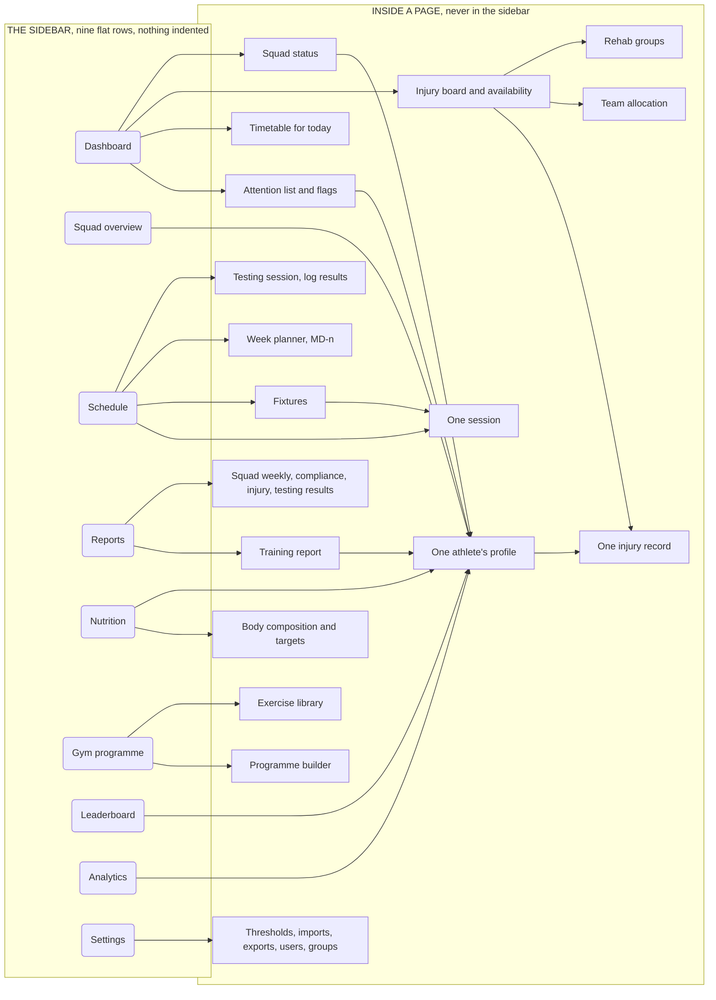

**Reading it in words.** Nine rows and nothing else. The dashboard is the front door, and
flags, the timetable, the injury board and squad status are four panels sitting on it, not
four menu items. The schedule holds fixtures, sessions, the week planner and testing.
Reports holds the training report and everything else you would print. Settings holds
thresholds, imports, exports and user management. Almost every list of players leads to one
athlete's profile.

**The header sits above every page**: the group filter and the date range. It stays put as you
move between pages, so a coach who has filtered to the forwards stays filtered.

**Two things this arrangement makes worse, both flagged in `02-information-architecture.md`
§4.1 and §4.2.** Importing a GPS file is a four-times-a-week job now sitting in Settings
(O-1100), and medical staff have no row at all for injuries and availability, which is their
entire job (O-1101).

### 2.2 Athlete, phone

Four tabs. Everything is at most two taps away.

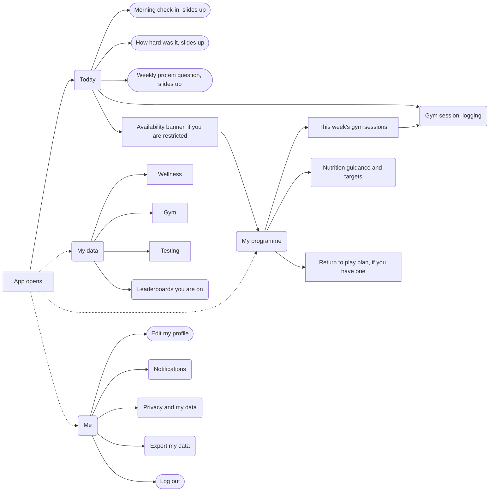

An athlete sees their own data and nothing else, with one exception: a leaderboard they are on.
Under-18 players start opted out of every leaderboard and have to turn each one on themselves.

### 2.3 Staff, phone

The staff phone app is the same information in five tabs, because a thirteen item sidebar does
not fit a phone. It is built after the web dashboard, and it is for the work that happens on a
pitch rather than at a desk: marking who turned up, reading the flags, checking availability.

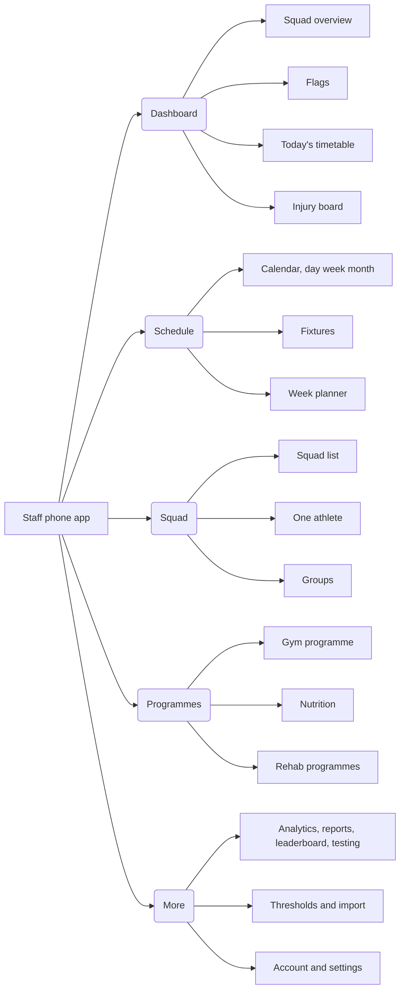

Where a page behaves differently on the phone, the page's own section below says so under the
heading **On the phone**.

---

## 3. Every page, one section each

The editing rules in §4 apply to every page below, so the diagrams do not repeat them. In
short: the edit control sits at the top right of the frame it edits, editing happens in place
or in a sheet, and a panel your role cannot edit shows no edit control at all.

Pages appear in the order of the screen list in `02-information-architecture.md` §5. Athlete
pages first, then staff pages.

---

### 3.1 Today, athlete

**What it is for:** "What have I got to do right now, what is on today, and where do I have to
be."

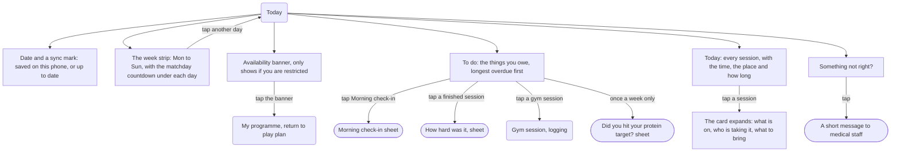

| What you see | Can you click it? | What happens | Who can edit |
|---|---|---|---|
| Date and sync mark | No | Tells you whether your entries have reached the club yet | Nobody, read only |
| Week strip with matchday countdown | Yes | Moves the day you are looking at | Nobody, read only. Staff set the schedule |
| Availability banner | Yes | Opens your return to play plan on the Programme tab | Medical staff only. You cannot change it and neither can your coach |
| To do list | Yes, each row | Opens the right sheet: morning check-in, session rating, gym logging, or the weekly protein question | You, for your own entries |
| Today's sessions | Yes, each card | Expands in place to show the detail. It does not leave the page | Coaches and S&C staff, on the Schedule page |
| Something not right? | Yes | Opens a short message to medical staff | You write it. Medical staff read it |

**On the phone:** this page only exists on a phone. Staff who are also players reach it through
"switch to my athlete view" in the staff app.

---

### 3.2 Morning check-in, athlete

**What it is for:** "Tell the club how I slept and how I feel, in under a minute, before I am
properly awake."

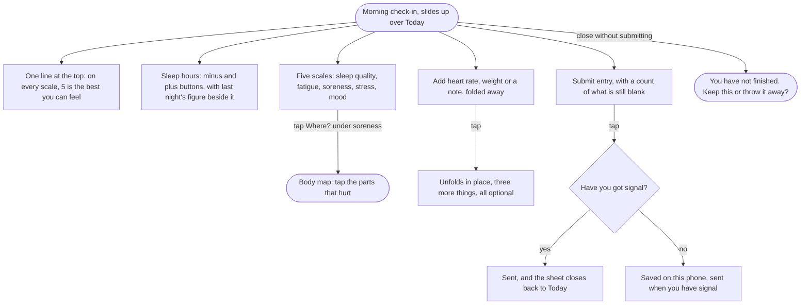

| What you see | Can you click it? | What happens | Who can edit |
|---|---|---|---|
| Direction line | No | Reminds you which end of every scale is good | Nobody, read only |
| Sleep hours stepper | Yes | Counts up and down in quarter hours | You, until you submit |
| Five feeling scales | Yes | Sets the value. Nothing shows you a total score while you do it | You, until you submit |
| Where? body map | Yes | Opens a body map on top. Tap the sore parts, close it, they appear on the row | You, until you submit |
| Optional block | Yes | Unfolds in place. Heart rate, body mass, a note your coach reads | You, until you submit |
| Submit entry | Yes | Sends it and closes the sheet | You |

**Once you have submitted, you cannot change it.** If you got something wrong you submit a
correction and both are kept, because a number that can be quietly changed later is no use for
spotting a trend.

---

### 3.3 Nutrition guidance, athlete

**What it is for:** "What should I be eating today, and why is it different from yesterday."

**Athletes do not log food.** There is no diary, no photographs of plates and no counting.
This page is something you read. The one thing you answer is a single question, once a week,
covered in §3.37.

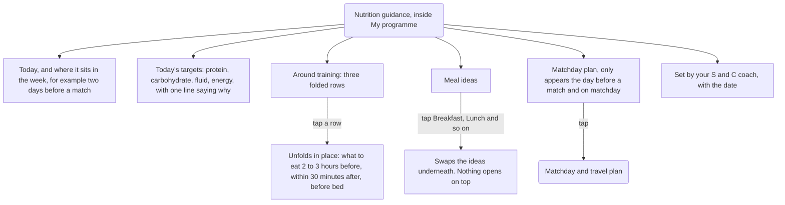

| What you see | Can you click it? | What happens | Who can edit |
|---|---|---|---|
| Today's targets | No | Your own numbers, worked out from your body mass and the day of the week | Nutrition and S&C staff (Coach role). Medical staff too, if you have an open injury |
| Around training | Yes | Unfolds in place, one row at a time | Nutrition and S&C staff |
| Meal ideas | Yes | The chips swap which meal you are looking at | Nutrition and S&C staff |
| Matchday plan | Yes | Opens the fuelling and travel plan for the game | Nutrition and S&C staff |
| Who set it and when | No | So you know whether it is current | Nobody, read only |

Nothing on this page is coloured green or red, there is no score and there is no streak.

---

### 3.4 Gym session, logging, athlete

**What it is for:** "What am I lifting, what did I lift last time, and tick it off as I go."

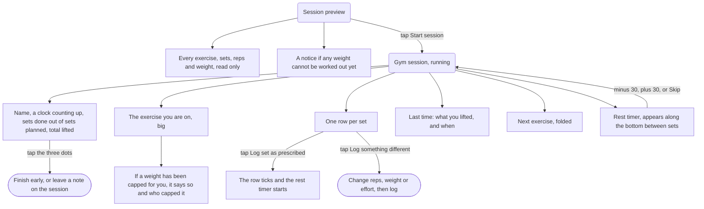

| What you see | Can you click it? | What happens | Who can edit |
|---|---|---|---|
| Exercise list before you start | Yes, Start session | Turns the preview into the live session | S&C staff, in the programme builder |
| The exercise you are on | No | Shows sets, reps, weight, tempo and why it was capped if it was | S&C staff |
| Set rows | Yes | Log as prescribed in one tap, or open a stepper and log what you actually did | You, for your own sets |
| Last time | No | What you lifted last time, without tapping anything | Nobody, read only |
| Rest timer | Yes | Add or take off 30 seconds, or skip it | You |
| Three dots menu | Yes | Finish early, or attach a note | You |

A set logged is a set logged. Corrections make a new version rather than overwriting the old
one.

**On the phone:** this is a phone screen. The S&C coach watches the same session from the
floor on a tablet, see §3.16.

---

### 3.5 How hard was it, athlete

**What it is for:** "Say how hard the session felt, thirty seconds after I have stopped
thinking about it."

It opens half an hour after the session ends, never immediately, because a hard last drill
makes everybody rate the whole session too high.

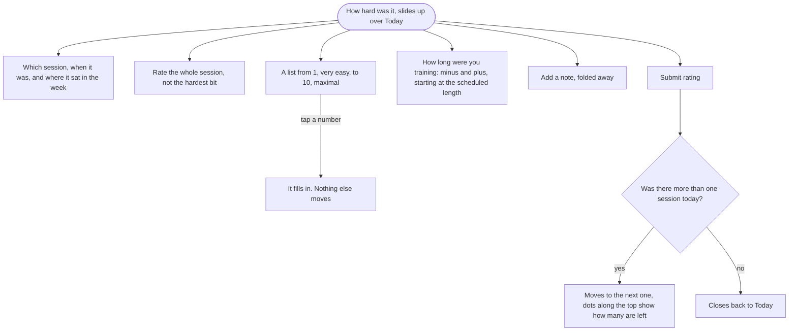

| What you see | Can you click it? | What happens | Who can edit |
|---|---|---|---|
| Session context line | No | Confirms which session you are rating | Coaches and S&C staff, on the Schedule |
| The 1 to 10 list | Yes | Picks your rating | You, until you submit |
| Duration stepper | Yes | Adjusts up or down from the planned length | You, until you submit |
| Add a note | Yes | Unfolds in place | You, until you submit |
| Submit rating | Yes | Sends it, then either moves to the next session or closes | You |

---

### 3.6 My data, athlete

**What it is for:** "Show me my own numbers, so the forty five seconds every morning is worth
something."

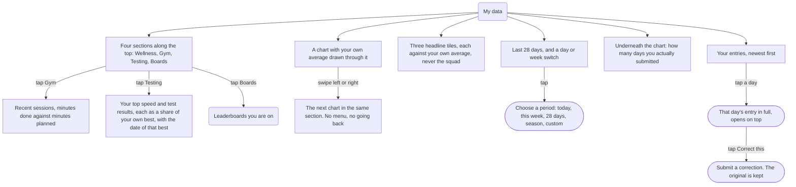

| What you see | Can you click it? | What happens | Who can edit |
|---|---|---|---|
| Section tabs | Yes | Swaps between wellness, gym, testing and boards | Nobody, read only |
| Period and day or week switch | Yes | Changes the window. It stays chosen as you move around | You, for yourself |
| Headline tiles | No | Each compares you against your own average, never against a teammate | Nobody, read only |
| Chart | Yes, swipe | Moves to the next chart in the section | Nobody, read only |
| Missing days | No | Drawn as a gap. A day you did not submit is blank, never a zero | Nobody, read only |
| Entry list | Yes | Opens one day in full, with a correct option | You, as a correction |
| Leaderboards | Yes | Opens the boards you are on. See §3.26 | You can leave a board in one tap |

You do not see a flag the moment it is raised. You see it after a staff member has looked at
it, so that you hear it from a person first. You never see the physio's own working notes.

---

### 3.7 My programme, athlete

**What it is for:** "What am I supposed to be doing this block, and if I am injured, when am I
back."

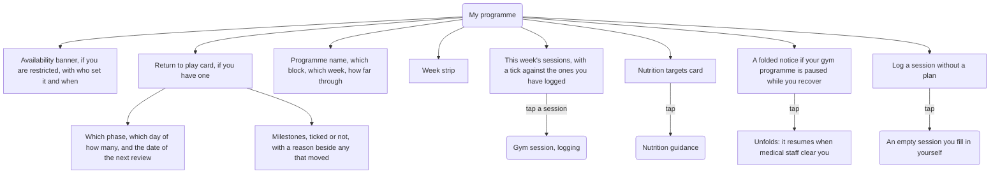

| What you see | Can you click it? | What happens | Who can edit |
|---|---|---|---|
| Availability banner | No | What you can and cannot do, in words | Medical staff only |
| Return to play card | No | Your phase, the day count and the next review date | Medical staff only. You cannot tick your own milestones |
| Milestones | No | Ticked ones show the date met. A moved target says why it moved | Medical staff only |
| Programme header and week strip | Yes, the strip | Moves between weeks of the block | S&C staff |
| This week's sessions | Yes | Opens that gym session to log | S&C staff set it, you log against it |
| Nutrition targets | Yes | Opens the guidance page | Nutrition and S&C staff |
| Paused notice | Yes | Unfolds to explain why | Medical staff decide when it resumes |
| Log a session without a plan | Yes | Opens an empty session | You |

Where your plan differs from the squad's, it says so and says why. A plan that quietly differs
without saying so is how a player stops trusting the app.

---

### 3.8 My dashboard, staff

**What it is for:** "Who do I need to speak to this morning." It is the front door, and it is
the client's own example: the timetable and player availability both sit on it, both open up,
and both carry their edit button inside their own frame.

It is a list of exceptions, not a wall of numbers. If you have to scan it, it has failed.

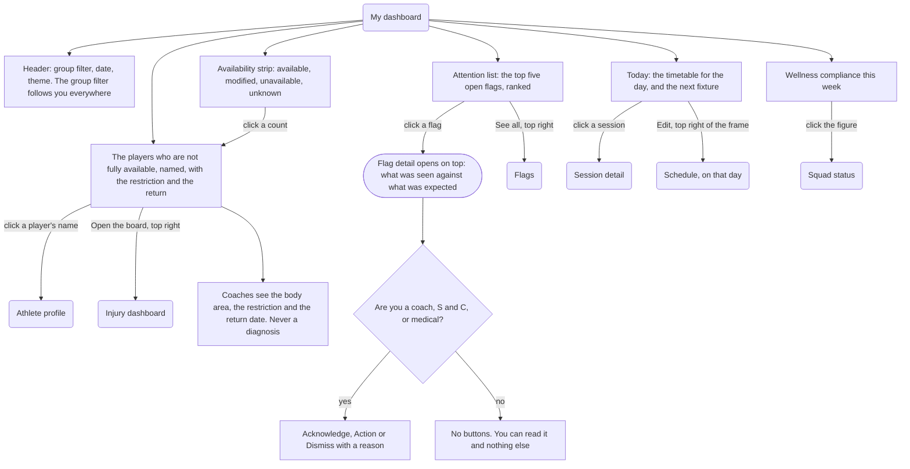

| What you see | Can you click it? | What happens | Who can edit |
|---|---|---|---|
| Group filter in the header | Yes | Narrows every page to that group and stays chosen as you move around | Coaches, S&C, medical and admin manage the groups themselves |
| Availability strip | Yes | Jumps to the matching list underneath | Medical staff only |
| Not fully available list | Yes, each name | Expands to the restriction and the expected return, then the name opens that player | Medical staff only. A coach reading this has no edit control at all |
| Attention list | Yes, each flag | Opens the flag on top, with acknowledge, action and dismiss | Coaches, S&C and medical can act on a flag. Nobody else |
| Today's timetable | Yes | Expands to the sessions. The Edit control at the top right of the frame opens the schedule on that day | Coaches, S&C and medical staff |
| Wellness compliance | Yes | Opens squad status for the same week | Nobody, read only. It is worked out from what was submitted |

**On the phone:** the dashboard is the first tab. The three side panels stack underneath the
attention list instead of sitting beside it.

---

### 3.9 Squad overview, staff

**What it is for:** "The state of the whole squad, everybody, not just the exceptions."

This is one sidebar item covering two things: who has submitted what (compliance) and who is
fit (availability). The roster itself is §3.19.

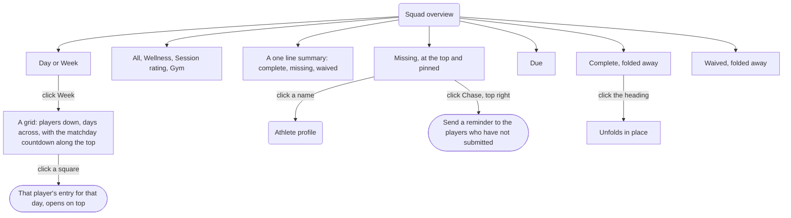

| What you see | Can you click it? | What happens | Who can edit |
|---|---|---|---|
| Day or Week switch | Yes | Swaps a single day for a week grid | Nobody, read only |
| Domain tabs | Yes | Filters to one kind of entry | Nobody, read only |
| Missing and Due lists | Yes, each name | Opens that player | Nobody. An entry belongs to the player who made it |
| Chase | Yes | Sends a reminder to the missing players | Coaches, S&C and medical staff |
| Complete and Waived | Yes, the heading | Unfolds in place | Coaches and S&C can waive an expectation, for example on a day off |
| Week grid squares | Yes | Opens that day's entry on top | Nobody, read only |

**Also on this page, for the head coach:** a plain "who I can pick" view. The squad by
positional unit, three words for each player, available, limited or out, the limit written out
in words, and a date for the return. No score anywhere, no chart, and it prints to one sheet of
A4. Whether that lives here or as its own sidebar item is still open (O-1040).

---

### 3.10 Flags, staff

**What it is for:** "Work through the alerts the system has raised and record what I did about
each one."

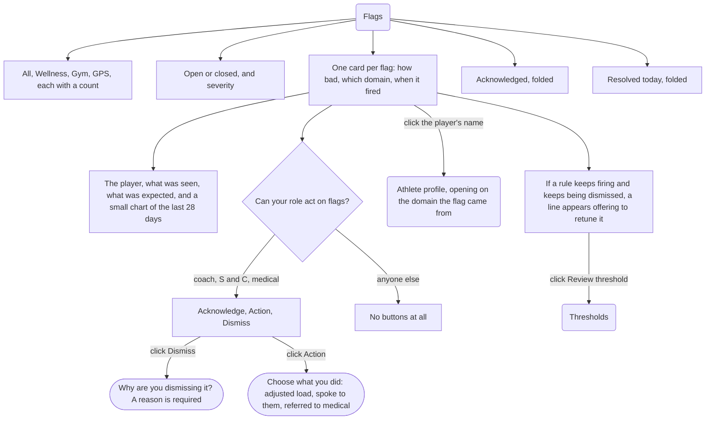

| What you see | Can you click it? | What happens | Who can edit |
|---|---|---|---|
| Domain tabs | Yes | Filters to wellness, gym or GPS flags | Nobody, read only |
| Flag card | Yes | Expands to the chart and the context | Nobody. A flag is raised by the rule, not typed in |
| Acknowledge | Yes | Marks it seen. The player can now see it too | Coaches, S&C and medical staff |
| Action | Yes | Records what you did about it | Coaches, S&C and medical staff |
| Dismiss | Yes | Closes it, and asks why first | Coaches, S&C and medical staff |
| Retune offer | Yes | Opens the rule that raised it | Coaches and S&C only. Medical staff cannot change the rules |

A player does not see a flag at the moment it fires. They see it once a staff member has
acknowledged it, so that they hear it from a person and not from a red badge at six in the
morning.

---

### 3.11 Timetable, staff

**What it is for:** "What is on today, and who actually turned up."

This page reads the schedule and takes the register. It does not create sessions.

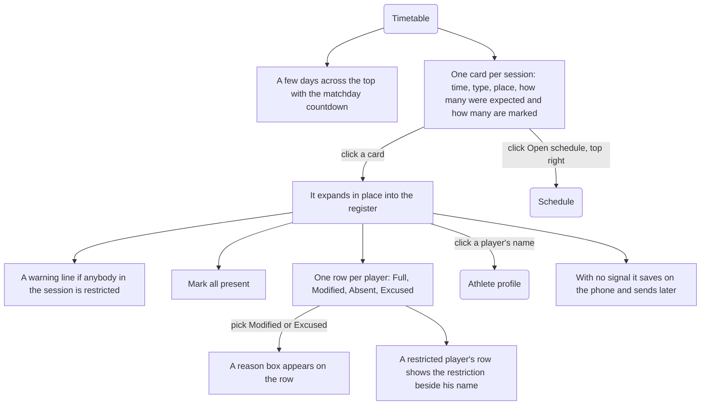

| What you see | Can you click it? | What happens | Who can edit |
|---|---|---|---|
| Day strip | Yes | Moves between days | Nobody, read only |
| Session card | Yes | Expands in place into the register | Coaches, S&C and medical staff, on the Schedule |
| Mark all present | Yes | Sets everybody to Full in one press, then you correct the exceptions | Coaches, S&C and medical staff |
| Attendance buttons | Yes | Records Full, Modified, Absent or Excused | Coaches, S&C and medical staff |
| Restriction line | No | Shows what a player is restricted from. It never says why | Medical staff only |
| Open schedule | Yes | Leaves the register and opens the planner | Coaches, S&C and medical staff |

**On the phone:** this is the page staff use standing on a pitch. The register is the whole
screen and it works with no signal.

---

### 3.12 Injury dashboard, staff

**What it is for:** "Who is fit, who is not, what they cannot do, and when they are back."

Two roles read the same board and see different columns, on purpose.

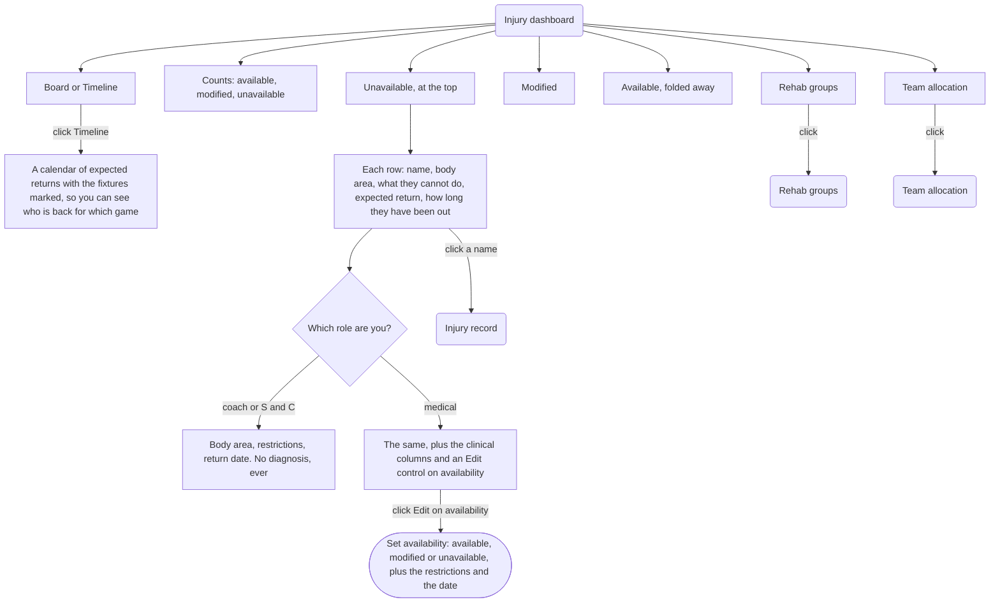

| What you see | Can you click it? | What happens | Who can edit |
|---|---|---|---|
| Board or Timeline | Yes | Swaps the list for a calendar of returns | Nobody, read only |
| Availability counts | Yes | Jumps to that section | Medical staff only |
| A player's row | Yes | Opens the injury record | Medical staff only |
| Body area and restrictions | No | Coaches see these. A head injury reads "return to play protocol, stage 3 of 6" and the reassessment date, which is a restriction and not a diagnosis | Medical staff only |
| Diagnosis and clinical notes | Not shown to coaches at all | Medical staff see them on the record | Medical staff only |
| Rehab groups, Team allocation | Yes | Open those pages | See §3.36 and §3.14 |

Admins see only the counts on this page, with no names.

---

### 3.13 Injury record, staff

**What it is for:** "Everything about one injury, with a hard line down the middle between what
the coaches see and what stays with the physio."

This is the most sensitive page in the product and it is laid out to make the line visible
rather than to hide things quietly.

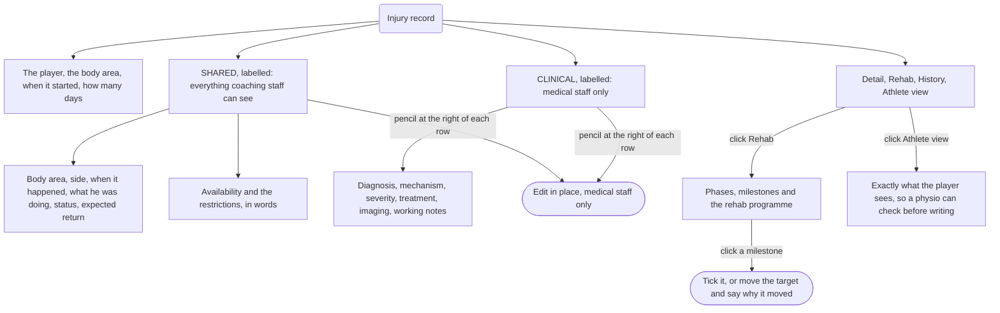

| What you see | Can you click it? | What happens | Who can edit |
|---|---|---|---|
| Shared block | Yes, the pencils | Edits in place | Medical staff only. A coach sees this block with no pencils at all |
| Clinical block | Not visible to coaches | Diagnosis, mechanism, treatment and notes | Medical staff only |
| Availability row | Yes, the pencil | Opens the availability sheet | Medical staff only |
| Rehab tab | Yes | Phases, milestones and the assigned plan | Medical staff only |
| Athlete view tab | Yes | Shows the physio exactly what the player will read | Nobody, read only. It is a preview |
| History tab | Yes | Every change, who made it and when | Nobody, read only |

Every time clinical detail is opened, it is recorded. An injury record is closed, never
deleted.

---

### 3.14 Team allocation, staff

**What it is for:** "Which players are in which team this week." The whiteboard called this
"corner group allocation" and it sits off the injury board because who is fit decides who can
be picked.

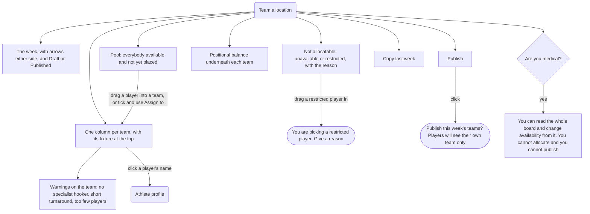

| What you see | Can you click it? | What happens | Who can edit |
|---|---|---|---|
| Week bar | Yes | Moves between weeks | Coaches and S&C |
| Pool | Yes, drag or tick | Puts a player in a team | Coaches and S&C |
| Not allocatable list | Yes | Picking one asks for a reason first | Availability itself: medical staff only |
| Team columns | Yes | Reorder, remove, open a player | Coaches and S&C |
| Warnings | No | Names, not counts. "W. Trent, 3 days since his last match" | Nobody, read only |
| Publish | Yes | Confirms, then each player sees their own team and nobody else's | Coaches and S&C only |
| Copy last week | Yes | Fills the board from last week as a starting point | Coaches and S&C |

---

### 3.15 Schedule, staff

**What it is for:** "Plan the week. Everything else in Fydr hangs off this."

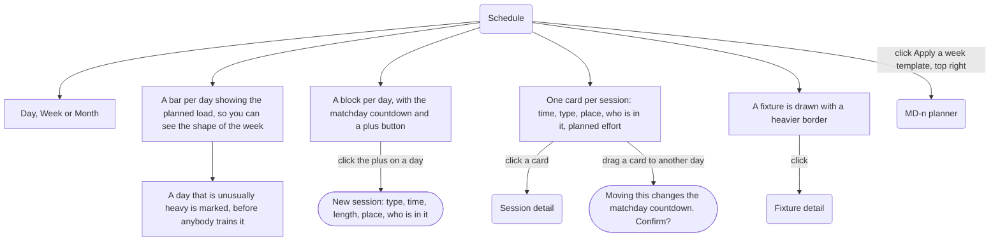

| What you see | Can you click it? | What happens | Who can edit |
|---|---|---|---|
| Day, Week, Month | Yes | Changes how much you see at once | Nobody, read only |
| Planned load bars | No | The shape of the week, drawn before it happens | Coaches and S&C, by changing the sessions |
| Plus on a day | Yes | Opens a new session sheet on that day | Coaches, S&C and medical staff |
| Session card | Yes | Opens the session. Dragging it asks before it moves the week | Coaches, S&C and medical staff |
| Fixture | Yes | Opens the fixture | Coaches and S&C |
| Apply a week template | Yes | Opens the week planner | Coaches and S&C |

Moving a fixture relabels every day around it. You always see what will change before you
confirm.

---

### 3.16 Session detail, staff

**What it is for:** "One session: what it is, who is in it, what it was meant to be, and what
it actually turned out to be."

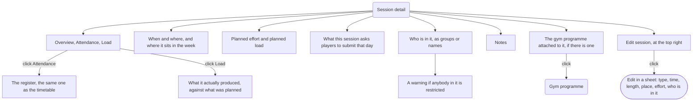

| What you see | Can you click it? | What happens | Who can edit |
|---|---|---|---|
| When and where | Yes, through Edit | Opens the edit sheet | Coaches, S&C and medical staff |
| Planned effort and load | Yes, through Edit | Same sheet | Coaches and S&C |
| Required entries | Yes, through Edit | Ticks which entries this session obliges | Coaches and S&C |
| Participants | Yes | Add or remove, and see who is restricted | Coaches, S&C and medical staff |
| Attendance tab | Yes | The register | Coaches, S&C and medical staff |
| Load tab | No | Planned against actual | Nobody, read only |

**The gym floor view.** For a live gym session, S&C staff open the same session on a tablet
propped on a rack: one row per player, name and weight large enough to read from two metres,
sets appearing as players log them on their phones. Tapping a row opens that player, showing
prescribed against completed set by set, with Change load, Add set, Swap exercise for today
only, and Note. Nothing on that screen re-sorts or animates while a session is running. A
permanent exercise swap is a different action and asks you to confirm.

---

### 3.17 Fixture detail, staff

**What it is for:** "One match: who we are playing, who is fit, and who is picked."

```mermaid
flowchart TD
    PG("Fixture detail")
    PG --> TABS["Details, Selection, Week"]
    PG --> CARD["Opponent, date, kick off, home or away, competition"]
    PG --> MDN["The days this fixture anchors, with the countdown"]
    PG --> AVL["Availability now: available, modified, unavailable, and who is expected back before kick off"]
    PG --> SEL["Selection: starting side, bench, and whether it has been published"]
    PG --> SESS["Sessions this week"]

    TABS -->|"click Selection"| SELP["Starting, Bench, Not selected"]
    SELP --> ROWW["A restricted player picked here is marked on his row"]
    SELP -->|"click Publish squad"| PUBC(["Publish? Players see their own selection only"])
    MDN -->|"click View the week"| SCH("Schedule")
    SESS -->|"click a session"| SD("Session detail")
    PG -->|"Edit, top right"| ED(["Edit the fixture. Moving it relabels the week, shown before you confirm"])
```

| What you see | Can you click it? | What happens | Who can edit |
|---|---|---|---|
| Fixture card | Yes, through Edit | Opponent, date, time, venue, competition | Coaches and S&C |
| The week it anchors | Yes | Opens the schedule for that week | Coaches and S&C |
| Availability counts | Yes | Opens the injury board filtered to this fixture | Medical staff only |
| Selection tab | Yes | Move players between starting, bench and not selected | Coaches and S&C |
| Publish squad | Yes | Confirms, then each player sees their own selection | Coaches and S&C |
| Sessions this week | Yes | Opens that session | Coaches, S&C and medical staff |

---

### 3.18 MD-n planner, staff

**What it is for:** "Define the shape of a training week once, then drop it onto a real week."

```mermaid
flowchart TD
    PG("Week templates")
    PG --> LIST["One card per template: how many days, how many sessions, total load, how often it has been used"]
    LIST -->|"click a template"| ED("Template editor")
    LIST -->|"click Apply"| APPLY("Apply to a week")

    ED --> NAME["Name, and whether it hangs off a fixture or not"]
    ED --> CHART["A chart of the resulting week, so you can see two hard days stacked together before anyone trains them"]
    ED --> ROWS["One block per day: the sessions on it, and what players must submit that day"]
    ROWS -->|"click plus session"| NS(["Add a session to that day"])
    ROWS -->|"click edit on a session"| ES(["Change time, length or effort"])

    APPLY --> PREV["A preview of the real week, against the real fixture"]
    PREV --> CLASH["Anything that clashes with what is already there is listed"]
    PREV -->|"click Commit"| DONE["The sessions are created. Nothing is written until you press this"]
```

| What you see | Can you click it? | What happens | Who can edit |
|---|---|---|---|
| Template list | Yes | Opens it to edit, or applies it | Coaches and S&C |
| Load chart | No | Shows the shape of the week before it exists | Nobody directly. It follows the sessions |
| Day blocks | Yes | Add or change sessions on that day of the week | Coaches and S&C |
| Required entries ticks | Yes | Decides what players are asked for on that day | Coaches and S&C |
| Preview and clashes | Yes | Adjust before committing | Coaches and S&C |
| Commit | Yes | Writes the week. Nothing exists until then | Coaches and S&C |

---

### 3.19 Squad list, staff

**What it is for:** "Show me everyone, sorted how I want, and let me do something to a group of
them at once."

```mermaid
flowchart TD
    PG("Squad list")
    PG --> SRCH["Search"]
    PG --> SORT["Sort and filters"]
    PG --> BANNER["A line saying which group you are looking at, if the filter is on"]
    PG --> ROWS["One row per player: number, name, position, availability, what they have submitted"]
    PG --> ADD["Add athlete"]

    ROWS -->|"click a name"| PROF("Athlete profile")
    ROWS -->|"click Select, top right"| SELM["Tick boxes appear on every row"]
    SELM --> BAR["An action bar along the bottom"]
    BAR --> A1["Add to a group"]
    BAR --> A2["Assign a programme"]
    BAR --> A3["Chase missing entries"]
    ADD -->|"click"| NEWA(["Add a player: name, number, position, groups"])
```

| What you see | Can you click it? | What happens | Who can edit |
|---|---|---|---|
| Search, sort, filters | Yes | Reorders and narrows the list | Nobody, read only |
| Player row | Yes | Opens that player | Coaches, S&C and admin can edit the player's basic details |
| Availability on the row | No | A word and a symbol, never colour on its own | Medical staff only |
| Select mode | Yes | Tick several players, then act on all of them | Coaches and S&C |
| Add to group | Yes | Puts the ticked players in a group | Coaches, S&C, medical and admin |
| Assign a programme | Yes | Puts the ticked players on a gym programme | Coaches and S&C |
| Add athlete | Yes | Opens a short form | Coaches, S&C and admin |

---

### 3.20 Athlete profile, staff

**What it is for:** "Everything we know about one player, in one place." Almost every list in
the staff app ends here.

It opens on the thing you clicked. Arrive from a wellness flag and it opens on wellness, not on
a summary you then have to click past.

```mermaid
flowchart TD
    PG("Athlete profile")
    PG --> ID["Name, position, age, team, squad number, and today's availability in words"]
    PG --> QUICK["Quick actions"]
    PG --> TABS["Overview, Wellness, Nutrition, Gym, Training, GPS, Testing, Injury, Programme"]
    PG --> B1["1. Load: daily effort with his own acute and chronic lines, and his own normal band"]
    PG --> B2["2. Wellness: his score against his own 14 day average and band"]
    PG --> B3["3. Prescribed against completed: what he was given against what he did"]
    PG --> B4["4. Injury and availability this season: days lost, episodes, recurrences"]
    PG --> TEST["Testing: each result as a share of his own best, with the date of that best"]
    PG --> RESTR["Restrictions: contact, scrummaging, running, gym, each in words"]
    PG --> FLAGS["Open flags"]

    B2 -->|"click Sub-metrics"| SUB["Unfolds in place: sleep hours, sleep quality, fatigue, soreness, stress, mood"]
    FLAGS --> FB{"Can your role act on flags?"}
    FB -->|"coach, S and C, medical"| FBY["Acknowledge, Action, Dismiss"]
    FB -->|"no"| FBN["No buttons"]
    QUICK --> Q1["Enter on behalf of the player, marked as staff entered"]
    QUICK --> Q2["Adjust his load"]
    QUICK --> Q3["Flag to medical"]
    QUICK --> Q4["Export this player's data"]
    RESTR --> WHOSET["Set by medical, with the date. Reviewed daily"]
    PG -->|"click Injury tab"| INJ("Injury record")
```

| What you see | Can you click it? | What happens | Who can edit |
|---|---|---|---|
| Identity block | Yes, the pencil | Name, number, position, groups | Coaches, S&C and admin |
| Availability line | No | Available, modified or unavailable, with the restriction | Medical staff only |
| Load block | No | His effort against his own normal band, not a generic band | Nobody, read only |
| Wellness block | Yes | Unfolds to the six components | Nobody. Entries belong to the player |
| Prescribed against completed | No | A blank means nothing was recorded, which is different from zero | Nobody, read only |
| Injury and availability | Yes | Opens the injury record, at the level your role is allowed | Medical staff only |
| Testing | Yes | Opens the test history. Bilateral tests show a left against right figure | Coaches, S&C and medical can log results |
| Restrictions | No | In words, with the date they were set | Medical staff only |
| Open flags | Yes | Acknowledge, action or dismiss | Coaches, S&C and medical staff |
| Quick actions | Yes | Enter on behalf, adjust load, flag to medical, export | Coaches, S&C and medical staff |

Coaching staff never see a diagnosis on this page, on any tab.

---

### 3.21 Groups, staff

**What it is for:** "Make the named sets of players that every other page filters by:
forwards, backs, academy, rehab, S&C group A."

```mermaid
flowchart TD
    PG("Groups")
    PG --> SRCH["Search, type filter, show archived"]
    PG --> SECT["Grouped by kind: positional, training, rehab"]
    PG --> CARDS["One card per group: name, colour, how many are in it"]
    PG --> FOOT["A line at the bottom: how many groups, how many players, how many are in no group"]
    PG --> NEW["New, top right"]

    CARDS -->|"click a group"| GD("Group detail")
    GD --> GTABS["Members, History, Settings"]
    GD --> MEM["Members as at today, with the date each one joined"]
    GD --> PAST["Past members, with the dates they were in it"]
    MEM -->|"click Add"| ADDS(["Pick players to add"])
    MEM -->|"click the minus on a row"| REM(["Remove from the group, from today"])
    GTABS -->|"click Settings"| GS["Name, colour, kind, archive"]
    FOOT -->|"click View"| NOGRP["The players who are in no group"]
```

| What you see | Can you click it? | What happens | Who can edit |
|---|---|---|---|
| Group card | Yes | Opens the group | Coaches, S&C, medical and admin |
| Members list | Yes | Add or remove, with the date recorded | Coaches, S&C, medical and admin |
| Past members | Yes | Re-add somebody who left | Coaches, S&C, medical and admin |
| Settings tab | Yes | Name, colour and archive | Coaches, S&C, medical and admin |
| Players in no group | Yes | Lists them so nobody is missed | Coaches, S&C, medical and admin |

A group's colour is chosen here once and is then the same colour everywhere it appears.
Membership keeps its history, so "the forwards in March" means who was a forward in March.

---

### 3.22 Programme builder, staff

**What it is for:** "Write the gym programme once, give it to a group, then change it for the
individuals who need it changed, without copying anything."

```mermaid
flowchart TD
    PG("Programme builder")
    PG --> HDR["Name, how many weeks, how many blocks, how many players are on it"]
    PG --> TABS["Structure, Assign, Tailor, Divergence"]
    PG --> LIB["Exercise library on the left"]
    PG --> TREE["The programme in the middle: blocks, weeks, sessions, exercises"]
    PG --> OVR["Who differs, on the right"]

    LIB -->|"drag an exercise in, or click plus"| TREE
    TREE -->|"click an exercise"| EX(["Edit it in place: sets, reps, how the weight is set, tempo, rest, notes"])
    EX --> APPLY["Apply to this week, or to every week in the block"]
    TABS -->|"click Assign"| AS["Pick groups or individuals"]
    TABS -->|"click Tailor"| TL["Pick one player and change his version"]
    TL --> TLW["Swap an exercise, cap the weight, cut the volume, mark him exempt, add a note"]
    TABS -->|"click Divergence"| DV["A list of everybody whose version differs from the parent, and why"]
    EX --> MISSING["If a weight is set as a share of a best lift, it says how many players have no best lift on file"]
```

| What you see | Can you click it? | What happens | Who can edit |
|---|---|---|---|
| Exercise library | Yes | Drag or click to add | Coaches and S&C |
| Programme tree | Yes | Opens the exercise editor in place | Coaches and S&C |
| Exercise editor | Yes | Sets, reps, weight basis, tempo, rest, note, then apply to one week or the block | Coaches and S&C |
| Assign tab | Yes | Puts groups or individuals on the programme | Coaches and S&C |
| Tailor tab | Yes | Changes one player's version only | Coaches and S&C |
| Divergence tab | No | Lists everybody who differs from the parent | Nobody, read only |

Medical staff write rehabilitation programmes, not gym programmes. They cannot edit a
programme owned by coaching staff.

---

### 3.23 Gym programme, staff

**What it is for:** "What is running right now, who is on it, and where are they up to."

```mermaid
flowchart TD
    PG("Gym programme")
    PG --> TABS["Active, Templates, Archived"]
    PG --> VIEW["By programme, or By athlete"]
    PG --> CARDS["One card per programme: name, weeks, which block, how far through, how many players, how many are tailored, how well it is being followed"]
    PG --> NEW["New programme, top right"]

    CARDS -->|"click Edit on the card"| PB("Programme builder")
    CARDS -->|"click the card body"| EXP["Expands to the assigned players"]
    VIEW -->|"click By athlete"| BYA["One row per player: which programme, which week, how many changes, how well they are following it"]
    BYA -->|"click a name"| PROF("Athlete profile")
    NEW -->|"click"| NEWM(["Blank, from a template, or duplicate an existing one"])
    CARDS -->|"click the three dots"| MORE(["Duplicate, archive, print"])
```

| What you see | Can you click it? | What happens | Who can edit |
|---|---|---|---|
| Active, Templates, Archived | Yes | Switches which programmes you are looking at | Coaches and S&C |
| Programme card | Yes | Expands to the players. Edit opens the builder | Coaches and S&C |
| By athlete view | Yes | Answers "who is on what" the other way round | Coaches and S&C |
| New programme | Yes | Blank, template or duplicate | Coaches and S&C |
| Three dots | Yes | Duplicate, archive or print | Coaches and S&C |

---

### 3.24 Nutrition, staff

**What it is for:** "Set what the squad should be eating, and see the two or three players I
need to speak to this week."

Players do not log food, so nothing on this page is a compliance score against a diary. The
main measure is body composition, measured properly and never ranked.

```mermaid
flowchart TD
    PG("Nutrition")
    PG --> M1["Unintentional mass change against load"]
    PG --> M2["Squad body composition"]
    PG --> M3["Squad target grid"]
    PG --> M4["Weekly protein check-in"]

    M1 --> M1A["Two stacked panels sharing one timeline: body mass on top, weekly load underneath"]
    M1 --> M1B["A band showing what is inside measurement error"]
    M1 --> M1C["Players in a declared mass change block are hidden, with a Show link and the reason"]
    M1 -->|"click a name"| PROF("Athlete profile")

    M2 --> M2A["One row per player, sorted by positional unit and squad number, and it stays that way"]
    M2 --> M2B["Method and site count are columns, not footnotes. Methods are never mixed in one line"]
    M2 --> M2C["A change too small to be real is drawn faint. Blank means not measured"]

    M3 --> M3A["Players down, days of the week across, grams per kilogram beside absolute grams"]
    M3 --> M3B["Explicit, inherited, and not reviewed in twelve weeks are marked differently"]
    M3 -->|"Edit, top right of the frame"| M3E(["Edit targets. Bulk edit acts on a whole column for a group"])

    M4 --> M4A["One question, three answers, and the number who did not answer, drawn blank"]
    M4 --> M4B["A prompt list: three names to ring on Wednesday"]
```

| What you see | Can you click it? | What happens | Who can edit |
|---|---|---|---|
| Mass against load | Yes, each name | Opens that player | Nobody, read only. Measurements are entered when they are taken |
| Suppressed players | Yes, Show | Reveals who is hidden and why | Nutrition and S&C staff (Coach role) |
| Squad body composition | No, and the columns do not sort | There is no squad average, no percentile and no ranking, deliberately | Nutrition staff, when recording a measurement |
| Target grid | Yes | Edit opens in place. Targets resolve player first, then group, then club default | Nutrition and S&C staff. Medical staff too, for a player with an open injury |
| Weekly protein check-in | Yes | The names behind each answer | Only the player answers. No staff member can answer for them |

Nothing on this page is coloured green, and there are no streaks, goals or progress rings on
anything to do with eating.

---

### 3.25 Testing, staff

**What it is for:** "Run a testing session, log thirty results fast standing on a pitch, and
read the history."

```mermaid
flowchart TD
    PG("Testing")
    PG --> TABS["Sessions, Log, Results, Tests"]
    PG --> UP["Upcoming sessions, with the battery of tests and how many results are in"]
    PG --> RC["Recent sessions"]

    UP -->|"click Log results"| LOG("Logging grid")
    UP -->|"click Edit battery"| BAT(["Choose which tests and who is in it"])
    UP -->|"click Print sheet"| PR["A paper fallback"]
    LOG --> MODE["By test, or by athlete"]
    LOG --> GRID["One row per player, one box per attempt, with best, personal best and change since last time"]
    GRID -->|"type a number"| SAVED["It saves as you go, and queues if there is no signal"]
    GRID -->|"click Excused on a row"| EXC["Marked excused, not zero"]
    TABS -->|"click Results"| RES["History for one test over time"]
    TABS -->|"click Tests"| DEF["The library: what the club measures, in what unit, and which direction is better"]
    DEF -->|"Edit, top right"| DEFE(["Add or change a test definition"])
```

| What you see | Can you click it? | What happens | Who can edit |
|---|---|---|---|
| Upcoming session | Yes | Log, edit the battery, or print | Coaches, S&C and medical staff |
| Logging grid | Yes | Type straight into the boxes, three attempts per test, best marked | Coaches, S&C and medical staff, on a player's behalf |
| Excused | Yes | Records that they did not test, which is not the same as a bad result | Coaches, S&C and medical staff |
| Results history | Yes | One test over time, per player | Nobody, read only |
| Test library | Yes | Add a test, set its unit and which direction is better | Coaches and S&C |

---

### 3.26 Leaderboard

**What it is for, staff:** "Rank the squad on something worth ranking, and publish it."
**What it is for, a player:** "See where I am on the boards I agreed to be on."

```mermaid
flowchart TD
    ST("Leaderboard, staff")
    ST --> BL["One card per board: metric, who is on it, over what window, published or not"]
    ST --> NEWB["New board, top right"]
    BL -->|"click a board"| BD("Board detail, full ranking")
    NEWB -->|"click"| BUILD(["Pick the metric, the group and the window"])
    BUILD --> REFUSE{"Is the metric allowed?"}
    REFUSE -->|"wellness, body composition, or who filled in the app"| NO["Refused, with the reason on screen"]
    REFUSE -->|"top speed, distance, lifts, test results"| YES["Allowed"]
    BD -->|"click Publish"| PUBC(["Publish to the squad, or keep it staff only"])
    BD -->|"medical only"| SUP(["Hide this board from one player, on clinical grounds"])

    AT("Leaderboards, athlete")
    AT --> MY["One card per board you are on: where you are, and whether you have moved"]
    MY -->|"tap a board"| ATD("The full ranking, with your own row picked out")
    ATD --> LEAVE["Leave this leaderboard"]
    LEAVE -->|"tap"| SILENT["You come off it. Nobody is told"]
    ATD --> MIN["A board with fewer than three people is not shown at all"]
```

| What you see | Can you click it? | What happens | Who can edit |
|---|---|---|---|
| Board list, staff | Yes | Opens the full ranking | Coaches, S&C and medical staff |
| New board | Yes | Choose metric, group and window | Coaches, S&C and medical staff |
| Refused metrics | No | Wellness, body composition and app usage cannot be ranked, and the screen says why | Nobody. It is a product rule |
| Publish | Yes | Makes it visible to the squad | Coaches, S&C and medical staff |
| Hide from one player | Yes | Takes one player off, quietly | Medical staff only |
| A player's own boards | Yes | Opens the ranking with their row marked | The player can leave in one tap |
| Leave this leaderboard | Yes | Removes them. Nothing is announced | The player only |

Under-18 players are off every board until they turn one on themselves. Admins see how many
boards there are and how many people are on them, and no names against values.

---

### 3.27 Analytics, staff

**What it is for:** "Answer a question that crosses two kinds of data, honestly."

Four questions are answered as ready-made panels. The builder sits behind them, because a
builder as a front door gets used twice and then never again.

```mermaid
flowchart TD
    PG("Analytics")
    PG --> P1["1. Who is drifting from their own baseline?"]
    PG --> P2["2. Does our week match the plan?"]
    PG --> P3["3. Load pattern before soft tissue injuries"]
    PG --> P4["4. Who is detraining?"]
    PG --> BUILD["Custom query builder, at the bottom"]

    P1 -->|"click Open"| P1D("Drift, ranked")
    P1D --> P1A["Each player against his own 28 day normal, in standard deviations"]
    P1D --> P1B["Split by positional unit, as small panels, because a prop and a winger do not share an axis"]
    P1D --> P1C["Where the numbers came from, listed. Sources are not mixed"]
    P1D -->|"click a name"| PROF("Athlete profile")
    P1D -->|"click Export rows"| CSV["The rows behind the chart, unrounded"]
    P1D -->|"click Open in builder"| BLD("Query builder, pre-filled")

    P4 --> REFUSED["Refused: not enough data to answer this honestly"]
    REFUSED --> WHY["It says what it needs, what exists, and offers to schedule testing or widen the window. There is no faint chart"]
    BUILD -->|"click Open builder"| BLD
    BLD --> STEPS["Pick what to measure, who, over what window, and how to draw it"]
    BLD --> CORR["Optionally compare one thing against another, with the strength and the number of pairs shown"]
```

| What you see | Can you click it? | What happens | Who can edit |
|---|---|---|---|
| The four preset panels | Yes | Opens that question in full | Coaches, S&C and medical staff can save their own views |
| A player in a result | Yes | Opens that player | Nobody, read only |
| Export rows | Yes | The rows behind the chart, unrounded | Coaches, S&C and medical staff |
| A refused answer | Yes, the suggestions | It refuses rather than drawing something misleading, and offers ways to get there | Nobody, read only |
| Custom builder | Yes | Build a question from scratch | Coaches, S&C and medical staff |

---

### 3.28 Reports, staff

**What it is for:** "Turn the same question into the same document every week, that I can hand
to somebody."

```mermaid
flowchart TD
    PG("Reports")
    PG --> CARDS["Five report cards: one athlete, squad weekly, compliance, injury and availability, testing"]
    PG --> SCHED["Schedules, top right"]
    PG --> RECENT["Recent runs"]

    CARDS -->|"click Run"| RUN(["Choose the group and the period, then generate"])
    CARDS -->|"click Schedule"| SCH(["Send it automatically, on a day and a time, to named people"])
    RUN --> VIEW("Report viewer")
    VIEW --> PAGER["Pages side by side, moved through with arrows or a swipe, never back through a menu"]
    VIEW --> EXP["Export as PDF, spreadsheet or rows"]
    RECENT -->|"click Open"| VIEW
```

| What you see | Can you click it? | What happens | Who can edit |
|---|---|---|---|
| Report cards | Yes | Runs it now, or sets it to run itself | Coaches, S&C and medical staff |
| Report viewer | Yes | Swipe or arrow between the pages of the report | Nobody, read only |
| Export | Yes | PDF for a person, rows for an analyst | Coaches, S&C and medical staff |
| Schedules | Yes | Add, change or stop a scheduled send | Coaches, S&C and medical staff |
| Injury and availability report | Yes | Coaches get the availability version. Medical staff get extra pages | Medical staff only, for the clinical pages |

A player can produce a report of their own data only. An admin gets club level totals with no
names.

---

### 3.29 Settings

**What it is for:** "Everything configurable, and the way out."

It is a list of destinations, and the list is different per role. A player does not see greyed
out doors they cannot open; they simply are not there.

```mermaid
flowchart TD
    PG("Settings")
    PG --> WHO{"Which role are you?"}
    WHO -->|"athlete, the Me tab"| A["Profile, notifications, appearance, privacy and my data, export my data, leaderboards, health app sync, delete my account, password, log out"]
    WHO -->|"coach or S and C"| C["Profile, notifications, appearance, thresholds, groups, club details, integrations, exports, password, log out"]
    WHO -->|"medical"| M["Profile, notifications, appearance, groups, exports, password, log out. No thresholds"]
    WHO -->|"admin"| X["All of the above plus users and roles, billing, data retention and erasure, and the audit log"]

    A -->|"tap Edit profile"| EP(["Change your name, contact details and photo"])
    A -->|"tap Leaderboards"| LB["Turn each board on or off for yourself"]
    A -->|"tap Delete my account"| DEL(["A confirmation, then it goes to your club"])
    A --> U18["If you are under 18, a standing line here says who at the club can see your data"]
    C -->|"click Thresholds"| TH("Thresholds")
    X -->|"click Users and roles"| UM("User management")
```

| What you see | Can you click it? | What happens | Who can edit |
|---|---|---|---|
| Profile | Yes | Name, contact details, photo | You, for your own profile |
| Notifications | Yes | Which messages you get and when | You, for yourself |
| Privacy and my data | Yes | What is collected, export it, delete the account | You, for yourself |
| Thresholds | Yes | Opens the rules page | Coaches and S&C only |
| Groups | Yes | Opens the groups page | Coaches, S&C, medical and admin |
| Club details, billing, retention, audit log | Yes | Opens each | Admin only |
| Users and roles | Yes | Opens user management | Admin only |
| Log out | Yes | Asks you to confirm, then signs you out | Everybody, for themselves |

---

### 3.30 Thresholds, staff

**What it is for:** "The rules that decide when the app raises a flag."

```mermaid
flowchart TD
    PG("Thresholds")
    PG --> CNT["How many rules are on, and how many flags they raised in the last 28 days"]
    PG --> RECAL["A notice at the top if a rule keeps firing and keeps being ignored"]
    PG --> SECT["Grouped by kind: wellness, gym, load, GPS"]
    PG --> ROWS["One row per rule, written as a sentence anybody can read"]
    PG --> NEW["New threshold, top right"]

    ROWS -->|"click Edit on the row"| ED(["Edit in a sheet"])
    ED --> S1["1. What to watch"]
    ED --> S2["2. Compare against: the player's own recent average, a fixed number, or the squad today"]
    ED --> S3["3. How long it has to last before it fires"]
    ED --> S4["4. How serious, and who gets told"]
    S2 --> EXPL["Each choice has a plain explanation of what it will and will not catch"]
    RECAL -->|"click Apply"| APPLIED["The suggested change is made"]
    RECAL -->|"click Not now"| DISM["It stops asking for a while"]
```

| What you see | Can you click it? | What happens | Who can edit |
|---|---|---|---|
| Rule rows | Yes | Opens the rule in a sheet | Coaches and S&C only |
| The sentence version | No | The rule written out in plain English, not as settings | Coaches and S&C only |
| Retune notice | Yes | Apply the suggestion, review it, or dismiss it | Coaches and S&C only |
| New threshold | Yes | Builds a rule in four steps | Coaches and S&C only |
| Restore defaults | Yes | Puts the shipped rules back | Coaches and S&C only |

**Medical staff cannot open this page**, which is counter-intuitive and deliberate. A physio
who wants a soreness rule asks a coach. Players never see the rules that flag them.

---

### 3.31 Exports

**What it is for, staff:** "Get the rows out, with a record of who took what."
**What it is for, a player:** "Take a copy of everything I have put in."

```mermaid
flowchart TD
    ST("Exports, staff")
    ST --> PICK["1. What to include, as tick boxes"]
    ST --> WHO2["2. Which players, using the group filter"]
    ST --> WHEN["3. Which period"]
    ST --> FMT["4. Which format"]
    ST --> HIST["History, on the right: running, ready, failed, expired"]
    PICK --> LOCK["Anything your role cannot read is not tickable, and shows a lock"]
    ST -->|"click Prepare"| GEN["It builds in the background and tells you when it is ready"]
    HIST -->|"click Download"| DL["The file, which expires after a few days"]

    AT("Export my data, athlete")
    AT --> IN["What is included, listed in plain words"]
    AT --> OUT["What is not included, listed just as plainly, with a line telling you how to ask the club for the rest"]
    AT -->|"tap Prepare my export"| APREP["Usually ready in under a minute"]
```

| What you see | Can you click it? | What happens | Who can edit |
|---|---|---|---|
| What to include | Yes | Ticks what goes in the file | Coaches, S&C, medical and admin, each within what they can read |
| Locked rows | No | Clinical detail is locked for everyone except medical staff | Medical staff only |
| History | Yes | Download, retry or see why it failed | The person who created it |
| Athlete export | Yes | One button, no configuration | The player, for themselves |

Every export is recorded, always, because it is the most likely way athlete data leaves the
club.

---

### 3.32 User management, admin

**What it is for:** "Who can sign in, what they are allowed to do, and which of them is a
player."

```mermaid
flowchart TD
    PG("Users")
    PG --> SRCH["Search, filter by role and status"]
    PG --> CNT["A line of counts: staff, players, invites pending, invites expired"]
    PG --> TBL["One row per person: name, email, roles, whether they are linked to a player record, status"]
    PG --> INV["Invite people, top right"]
    PG --> ORPH["A line at the bottom: player records with no account"]

    TBL -->|"click a person"| UD("One user")
    UD --> ROLES["Roles, as tick boxes. They add up rather than replace each other"]
    UD --> LINK["Athlete record: linked, or a Link button"]
    UD --> ACCT["When they were created, invited, accepted, last seen"]
    UD --> SEES["What this user can see, spelled out in plain rows"]
    UD --> DANGER["Deactivate. Signs them out and blocks sign in. Nothing is deleted"]
    ROLES --> NOTE["Removing a role signs that person out of every device straight away"]
    ORPH -->|"click Invite them"| INV
```

| What you see | Can you click it? | What happens | Who can edit |
|---|---|---|---|
| User table | Yes | Opens one person | Admin only |
| Roles tick boxes | Yes | A person can be both coach and medical and gets both sets of permissions | Admin only |
| Link to a player record | Yes | Joins the login to the squad member | Admin only |
| What this user can see | No | The permissions written out as plain rows, so an admin can check before saving | Admin only |
| Deactivate | Yes | Blocks sign in. Nobody is ever deleted | Admin only |

Every role change is written to the audit log.

---

### 3.33 Onboarding

**What it is for:** "Turn an invitation into a working account, and tell a player what is being
collected about them before they agree to anything."

```mermaid
flowchart TD
    ST("Invitation email or link") --> S1("1. Welcome, which club")
    S1 --> S2("2. Set a password, or use a passkey")
    S2 --> S3("3. Confirm your details, which the club filled in")
    S3 --> S4("4. Your position, number and groups")
    S4 --> S5("5. What is collected, who sees it, and what you can do about it")
    S5 --> U18{"Are you under 18?"}
    U18 -->|"yes"| S5C("5c. The same, in plainer words, plus: your parents do not have a login, your teammates see nothing, and alerts go to a named person")
    U18 -->|"no"| S6
    S5C --> S6("6. Optional extras, all of them off to begin with")
    S6 --> S7("7. Turn on reminders, or not")
    S7 --> FIN("Done, lands on Today")

    S6 --> DEF["For an under-18 the extras stay off until they are turned on, including every leaderboard"]
    S3 --> SKIP["Some steps can be skipped and finished later. The transparency step cannot"]
```

| What you see | Can you click it? | What happens | Who can edit |
|---|---|---|---|
| Password step | Yes | Sets a password, or a passkey, and optionally a face or fingerprint lock | You, for yourself |
| Confirm your details | Yes | Corrects what the club typed in | You, for yourself |
| What is collected | Yes, to continue | Cannot be skipped. It is the thing the club relies on later | Nobody, read only |
| Under-18 version | Yes, to continue | Plainer words, and the parent position stated | Nobody, read only |
| Optional extras | Yes | All off to start with. Under-18 defaults stay off | You, for yourself |
| Reminders | Yes | Choose what you get | You, for yourself |

There is no parent or guardian login. A parent who wants to know something asks the club.

---

### 3.34 Import GPS, staff

**What it is for:** "Turn the file the GPS vests produce into numbers against the right players
and the right session, without losing a row."

```mermaid
flowchart TD
    PG("Import GPS")
    PG --> DROP["Drag a file in, or choose one"]
    PG --> PREV["Previous imports, each still reversible"]

    DROP --> READ["It reads the file and says what it recognised: which vendor, how many rows, how many columns"]
    READ --> MATCH["Which session it matched, and how confident it is, with a Change session link"]
    READ --> UNITS["A units check: distance read as metres, speed read as metres per second, with the ranges that prove it"]
    UNITS -->|"click to change"| UFIX["Switch to kilometres or kilometres per hour"]
    READ --> ONLY["Only the exceptions are listed. The rows that worked are not shown"]
    ONLY --> E1["Unmatched names, with a suggested match to confirm once"]
    ONLY --> E2["Duplicates, showing the stored figure against this one, with Keep stored or Replace"]
    E1 -->|"confirm a name"| REM["The club remembers that alias for that player from then on"]
    READ --> CONF{"Confirm the import?"}
    CONF -->|"Import"| WRITE["Written. Nothing was written before this press"]
    CONF -->|"Discard"| GONE["Nothing happens at all"]
    PREV -->|"click Undo that import"| UNDO(["Undo the last import. Confirm first"])
```

| What you see | Can you click it? | What happens | Who can edit |
|---|---|---|---|
| Drop area | Yes | Reads the file and starts the checks | Coaches, S&C and medical staff |
| Matched session | Yes | Change it if it picked the wrong one | Coaches, S&C and medical staff |
| Units check | Yes | Correct the units before importing. A silent unit error is wrong by a factor of nearly four and looks plausible | Coaches, S&C and medical staff |
| Exceptions only | Yes | Every row that did not work is listed with a reason and stays fixable. No row is ever silently dropped | Coaches, S&C and medical staff |
| Import | Yes | Writes the rows. Nothing exists until you press it | Coaches, S&C and medical staff |
| Undo that import | Yes | Reverses the last one | Coaches, S&C and medical staff |

The group filter is switched off on this page, because an import is about a file, not a group.

---

### 3.35 Training report, staff

**What it is for:** "One session, every player, every running number, on one board."

This one is exhaustive on purpose. It is the opposite of the dashboard.

```mermaid
flowchart TD
    PG("Training report")
    PG --> EY["Which squad, which session, which date"]
    PG --> TILES["Four tiles: how many players, average distance, total high speed running, how many are flagged"]
    PG --> CHIPS["Date chips: the last few sessions, click to switch"]
    PG --> SEL["Which metric decides the shading"]
    PG --> TBL["The board: one row per player, grouped by positional unit"]
    PG --> EXP["Export, top right"]

    TBL --> SHADE["Each cell is shaded against that player's own history for the same kind of session, never against the squad"]
    TBL --> FAINT["The faint second figure in a cell is the same day last week, which is the only week on week comparison that means anything"]
    TBL --> PCT["Top speed is shown as a share of that player's own best over twelve months, never the squad's best"]
    TBL --> HATCH["A hatched cell is missing data, not zero"]
    TBL -->|"click a player's name"| PROF("Athlete profile, opening on GPS")
    CHIPS -->|"click another date"| PG
```

| What you see | Can you click it? | What happens | Who can edit |
|---|---|---|---|
| Four tiles | No | Headline numbers for the session | Nobody, read only |
| Date chips | Yes | Switches to another session | Nobody, read only |
| Metric selector | Yes | Changes what the shading is based on | Nobody, read only |
| The board | Yes, each name | Opens that player on his running data | Nobody, read only. It comes from the imported file |
| Export | Yes | The same rows as a spreadsheet | Coaches, S&C and medical staff |

Players cannot see this page. A squad wide comparison handed to players is a leaderboard
nobody agreed to.

---

### 3.36 Rehab groups, medical

**What it is for:** "Put the injured players who are at a similar stage into one session, so
one physio can run them together."

```mermaid
flowchart TD
    PG("Rehab groups")
    PG --> UN["Unallocated: injured players not yet in a group"]
    PG --> GRP["One column or card per group: its phase, when it meets, where, and how many sessions were done this week"]
    PG --> NEW["New group, top right"]

    UN -->|"drag a player into a group, or tick and use Assign to"| GRP
    GRP --> MEM["Members, each with the body area, the phase and their attendance"]
    MEM --> MIS["A player whose phase does not match the group's is marked"]
    GRP -->|"click Edit on the card"| ED(["Name, phase, when it meets, where, and the shared programme"])
    MEM -->|"click a name"| REC("Injury record")
    PG --> COACHV{"Are you a coach?"}
    COACHV -->|"yes"| CV["You can see who is in which group, when it meets and how big it is. Nothing else, and no buttons"]
```

| What you see | Can you click it? | What happens | Who can edit |
|---|---|---|---|
| Unallocated list | Yes, drag or tick | Puts a player into a group | Medical staff only |
| Group card | Yes | Opens it to edit its phase, schedule and shared plan | Medical staff only |
| Members | Yes | Opens that player's injury record | Medical staff only |
| Phase mismatch mark | No | Flags somebody training with a group at the wrong stage | Medical staff only |
| Assign a rehab programme | Yes | Puts the group on a plan | Medical staff only. Coaches cannot assign rehabilitation programmes anywhere |

---

### 3.37 Weekly protein question, athlete

**What it is for:** "One question, once a week, about eating. That is the whole thing."

```mermaid
flowchart TD
    SH(["Slides up over Today, once a week"])
    SH --> WK["Which week it is asking about"]
    SH --> Q["Did you hit your protein target most days this week?"]
    SH --> TGT["Your target, if you have one"]
    SH --> A["Three buttons: Yes, Roughly, No"]
    SH --> NOTE["Add a note, optional, folded away"]
    SH --> DONE["Done, greyed out until you pick one"]

    A -->|"tap one"| PICK["It fills in. None of the three is coloured, so none of them looks like the right answer"]
    SH -->|"swipe it away"| SKIP["Nothing happens. Missing it is not counted against you and nobody chases you"]
```

| What you see | Can you click it? | What happens | Who can edit |
|---|---|---|---|
| The question | No | The same question every week | Nutrition and S&C staff set the target it refers to |
| Yes, Roughly, No | Yes | Records your answer and enables Done | You only. No staff member can answer for you |
| Add a note | Yes | Unfolds in place | You |
| Done | Yes | Closes the sheet back to Today | You |
| Skipping it | Yes | Nothing is recorded, nothing is chased | Nobody |

Staff read the answers on the Nutrition page, where they are labelled as a weak signal and
drawn blank for anybody who did not answer.

---

## 4. Editing rules, stated once

These apply everywhere, which is why no diagram above repeats them.

1. **The edit control lives at the top right of the frame it edits.** Not at the top of the
   page, not at the bottom, and not floating. If a card has an Edit button, that button edits
   that card and nothing else. This is what the client asked for: "edit buttons in the frames".
2. **Editing happens where you are.** Either in place, so the row you were reading becomes the
   row you are typing in, or in a sheet that slides up over the page. Editing never sends you
   to a separate page and never loses your place.
3. **If your role cannot edit a panel, the panel has no edit control at all.** Not a greyed out
   button, not a button that explains why when you press it. Nothing. A screen full of locked
   doors tells a user the product was not built for them.
4. **Leaving with unsaved changes always asks.** Closing a sheet, pressing back, or clicking
   another page while something is half typed produces one question: keep this, or throw it
   away. There is never a silent loss and never a trap you cannot get out of.
5. **Nothing is written until you press the thing that writes it.** Imports, week templates and
   team publishing all show you what will happen first. Until you confirm, nothing has changed.
6. **Some things cannot be edited at all, only corrected.** A morning check-in, a logged set
   and a session rating are fixed once submitted. A correction creates a new version and both
   are kept, because a number that can be quietly changed later is worthless for spotting a
   trend.
7. **Availability is medical staff only, everywhere.** Every other rule above bends to this
   one. There is no page, no card and no shortcut where a coach can change whether a player is
   available.
8. **The group filter sits in the header of every staff page that shows more than one player,
   and it stays put as you move between pages.** When it is on, the header says so, so nobody
   ever reads partial data without knowing it.

---

## 5. Pages deliberately not covered

Eight rows of the screen list are missing from §3, and here is why.

| # | Screen | Why it is not here |
|---|---|---|
| 35 | Audit log viewer | **Built**, ahead of its reserved phase — `/settings/audit`. No flow diagram exists for it here because it was built directly from the real table and its RLS rather than from a drawing, the same route `training-report.md` took |
| 36 | Report a problem, athlete | Held back for a later phase. The way in exists on Today, the page it opens does not yet |
| 38 | Flight control | Removed from the product at the client's instruction on 5 August 2026. The sidebar entry and the page are to be deleted |
| 39 | My dashboard | Not a separate page. It is the sidebar name for the staff dashboard, drawn in §3.8 |
| 40 | Squad overview | Not a separate page. It is the sidebar name covering squad status and the squad list, drawn in §3.9 and §3.19 |
| 41 | Fixtures list | The list that fixture detail is reached from was never specified. Fixture detail itself is in §3.17 |
| 43 | Privacy and my data | Held back for a later phase. It is currently a section inside Settings, §3.29 |
| 44 | Data requests | Held back for a later phase. An admin queue with no specification yet |

Also not drawn: the daily nutrition diary. It was specified and then removed. Athletes read
guidance and answer one question a week, and there is no per meal logging anywhere in the
product.

---

## 6. The five questions this document does not answer

Recorded so they are not mistaken for oversights.

1. **Does the selection screen get its own place in the sidebar?** The head coach wants
   "who I can pick" one click from anywhere. It is drawn on the squad overview in §3.9 for now
   (O-1040).
2. **Where do flags and the injury board actually live?** Neither has a sidebar entry in the
   built app. They are drawn here as coming off the dashboard, which is what the drawing
   showed (O-723).
3. **Is the group filter one group at a time, or several?** The specification says several, the
   built component allows one (O-724).
4. **Is the return to play protocol stage the right compromise?** A coach seeing
   "protocol, stage 3 of 6" is route one of three, it is what the mockups do, and it needs a
   physio to sign it off (O-995, O-1043).
5. **Does the staff phone app get built at all?** A staff web app exists and works. A staff
   phone app does not. It is committed, and it is the largest single piece of scope in the
   project (O-725).
