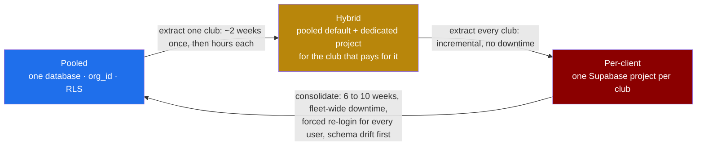

# ADR-001: Multi-tenancy model

## Status

**ACCEPTED, 5 August 2026.** One pooled database. Every table carries `org_id` and every
policy filters on it. Postgres row-level security is the isolation boundary.

The client initially preferred a separate database per client, was shown the analysis below,
and delegated the decision. The pooled model is adopted.

**The escape hatch is withdrawn for now.** Do not build per-client provisioning, do not
write code branching on tenancy model, and do not carry "if per-client is adopted" caveats
into new documents. If a club ever contractually requires physical isolation, that is a new
ADR against a real requirement, not a hypothetical the codebase carries the weight of. The
analysis below is retained because it is the reasoning, and because reversing this later
should not mean rediscovering it.

**Consequence for Claude Code**: `CLAUDE.md` §1 tells you to stop if you are about to
contradict an ADR. This ADR no longer contradicts anything. Build pooled.

---

## Context

Fydr sells to clubs. Each club is an organisation, and an organisation is the tenancy
boundary (`CLAUDE.md` §6). There is no legitimate cross-organisation read in the product
today (`01-roles-and-permissions.md` §6). So on the face of it, physically separating clubs
costs nothing and buys safety.

Four facts complicate that.

1. **Fydr is operated by one person.** Every operational task that scales with the number of
   customers competes directly with building the product. This is the dominant constraint and
   it is why the two models diverge so sharply.
2. **Supabase bills, and applies several of its add-ons, per project.** Point-in-time
   recovery in particular is priced per project, not per organisation.
3. **Supabase Auth is per project.** Identity does not span projects, so a per-client model
   needs a lookup step before login and a plan for a user who belongs to two clubs.
4. **A future product feature depends on pooling.** Cross-club benchmarking, "your squad's
   ACWR distribution against comparable clubs", is a plausible Premium-tier feature and is
   effectively impossible across sixty separate databases without building a data warehouse to
   re-pool what was deliberately split.

Scale assumptions used throughout, stated so they can be argued with:

| | Year 1 | Year 3 |
|---|---|---|
| Organisations | 20 | 60 |
| Athletes per organisation | 40 | 40 |
| Total athletes | 800 | 2,400 |
| Entry rows per day, fleet-wide | ~1,000 | ~3,000 |
| Gym set rows per day, fleet-wide | ~5,000 | ~15,000 |
| Total row count after 3 seasons | | roughly 40 to 60 million, dominated by gym sets and GPS |

**That is a small database.** 60 million rows on a properly indexed Postgres instance is not
a scaling problem. Whatever the argument for splitting is, it is not performance.

---

## Decision

**Recommended: a single pooled Postgres database, tenanted by `org_id`, isolated by
row-level security, with these conditions attached.**

The conditions are not decoration. The pooled model is only defensible if all of them hold.

1. Every table carrying club data has `org_id uuid not null`, with a foreign key to
   `organisations`. Enforced by a CI check against `information_schema`, not by discipline.
2. Every such table has RLS enabled and at least one policy, and every policy's `using`
   clause begins with `org_id = auth_org_id()`. Also CI-checked.
3. The RLS test suite (`05-architecture.md` §12) covers every table against every role and
   blocks merge. A table without coverage fails CI.
4. `org_id` is never read from a client payload. It is taken from the JWT claim and
   overwritten server-side on every write (`05-architecture.md` §5).
5. `service_role` is used only in scheduled jobs and admin functions, each of which filters
   `org_id` explicitly and carries a comment naming the check it performs in place of RLS.
6. An hourly production canary attempts a cross-organisation read through the ordinary client
   path and pages on any non-zero result.
7. ~~**The escape hatch**: any club that contractually requires a dedicated database gets one,
   as a separate Supabase project running the identical schema and identical migrations.~~
   **WITHDRAWN, 5 August 2026.** See the Status section. Nothing is built for it, no code
   branches on tenancy model, and no document carries an "if per-client is adopted" caveat.

Condition 7 was the part worth dwelling on, and it is the part that was withdrawn. The point
it made still stands as reasoning: pooling does not physically preclude isolating one club
later, and the migration table below prices that at roughly two weeks whenever it is actually
needed. What changed is that it is no longer a standing capability the codebase carries the
weight of. If a named club puts physical separation in procurement, that is a new ADR against
a real requirement (O-21).

---

## Consequences

### Pooled, adopted

**Good:**

- One migration run. One schema. One place a bug can exist, and one place it gets fixed.
- Infrastructure cost stays roughly flat as clubs are added. See the cost table below.
- Auth is simple: one project, one user pool, one JWT format, no pre-login lookup.
- Support is tractable: one dashboard, one log stream, one place to reproduce a bug.
- Cross-club analytics, benchmarking, and product usage measurement remain possible.
- The global exercise library and standard test definitions exist once, not sixty times.
- Moving a single club out later is straightforward. See "Migration cost" below.

**Bad, and these are real:**

- **A single RLS mistake is a fleet-wide breach.** Not one club seeing one club. Every club
  potentially seeing every club. This is the honest core of the client's objection and it
  should not be minimised. It is mitigated by conditions 1 to 6 and by the fact that RLS
  failures are testable in a way that application-layer filtering is not, but the blast radius
  is genuinely larger.
- **Noisy neighbour.** A club bulk-importing three seasons of GPS data consumes shared
  compute. Mitigated by running imports through a queued Edge Function with a per-organisation
  concurrency limit, not by architecture.
- **Restore granularity is poor.** Point-in-time recovery restores the whole project. To
  recover one club's data to a point in time, you restore to a scratch project and copy that
  organisation's rows back, filtered by `org_id`. That is a documented runbook and it takes
  hours, not minutes. Per-client databases make this trivially easy, and it is their strongest
  operational argument.
- **A commercial objection is possible.** Some buyers, particularly anyone with a procurement
  process, will ask whether their data is physically separated. Condition 7 answers it, but the
  conversation happens.
- **Accidental cross-tenant queries in analytics.** The analytics builder generates SQL. Every
  generated query must be constrained by `org_id` at construction time, and the RLS policy is
  the backstop rather than the primary control.

### Per-client, not adopted, and what that gave up

Retained as reasoning, not as a live option. Nothing below is a branch anything builds towards.

**Good:**

- Physical isolation. A bug in one club's data cannot expose another's, because the rows are
  not reachable from the same connection.
- Trivial per-club restore, export, and deletion. "Delete this club's data" is "delete this
  project".
- An easy answer to a procurement questionnaire.
- Noisy neighbours are impossible.
- Per-club data residency is possible without further work.

**Bad, and these compound:**

- **Migrations run N times.** Every schema change becomes a fleet operation with partial
  failure as a normal outcome. A migration that succeeds on 47 of 60 projects leaves a fleet
  in two states, and the app has to tolerate both until it is fixed. This requires an
  orchestrator with retry, state tracking, and drift detection, which is a piece of
  infrastructure that has to be built and maintained and is not the product.
- **Auth has to be redesigned.** Supabase Auth is per project, so a user cannot log in until
  the system knows which project they belong to. That needs a shared directory service mapping
  email to project, a login flow with an extra round trip, and a decision about what happens
  when someone typos their email (an enumeration oracle if handled carelessly). The mobile app
  also bakes `EXPO_PUBLIC_SUPABASE_URL` into the binary today (`05-architecture.md` §3), so it
  would need runtime client construction after the lookup.
- **Every operational task multiplies.** See the burden table below.
- **Cost multiplies**, and PITR in particular is priced per project.
- **Cross-club product analytics become a data-warehouse project.** You cannot answer "what is
  fleet-wide wellness compliance" without building an ETL that pools the data you split.
- **Support debugging is much slower.** Connecting to the right project, in the right region,
  with the right credentials, for every investigation.
- **Onboarding a club becomes a provisioning workflow** rather than an insert. Project
  creation, migration application, seed data, auth configuration, secrets, monitoring
  registration, and a rollback path if any step fails.

---

## Cost analysis

### Money

Figures are indicative as of mid-2026 and **must be re-checked before committing**. Supabase
has changed its pricing model more than once. What matters is not the exact figure but that
one column scales with customer count and the other does not.

| Line item | Pooled | Per-client, 20 orgs | Per-client, 60 orgs |
|---|---|---|---|
| Supabase organisation plan | $25/mo | $25/mo | $25/mo |
| Compute (production) | 1 × Small, ~$15/mo. Medium at ~$60/mo if needed by year 3. | 20 × Micro, ~$10/mo each = $200/mo | 60 × Micro = $600/mo |
| Point-in-time recovery add-on | 1 × ~$100/mo | 20 × ~$100/mo = $2,000/mo | 60 × ~$100/mo = $6,000/mo |
| Staging | 1 project | 1 project, but staging no longer resembles production | 1 project |
| Storage and egress | Shared, roughly linear with data either way | Same total, split | Same total, split |
| **Indicative monthly total** | **~$150 to $200** | **~$2,250** | **~$6,650** |

Against revenue: at the Club-tier anchor discussed in `00-product-overview.md` (subject to
O-1), 40 athletes at roughly £1 per athlete per week is about £173 per club per month.

| | Pooled | Per-client |
|---|---|---|
| Revenue at 20 orgs | ~£3,470/mo | ~£3,470/mo |
| Infrastructure | ~£120/mo, **3.5%** | ~£1,780/mo, **51%** |
| Revenue at 60 orgs | ~£10,400/mo | ~£10,400/mo |
| Infrastructure | ~£160/mo, **1.5%** | ~£5,270/mo, **51%** |

**The per-client model spends roughly half of gross revenue on infrastructure, permanently.**
PITR is the single largest driver. Dropping PITR to save money would mean the model chosen for
data safety has worse recovery than the pooled one, which defeats its own purpose.

If those figures are wrong, they are wrong in detail, not in shape. Anything billed per
project multiplies by customer count and the pooled column does not move.

### Operational burden on a solo developer

This is the argument I care about more than the money.

| Task | Pooled | Per-client, 60 orgs |
|---|---|---|
| Apply a schema migration | One command, one result | Orchestrated across 60, with partial-failure handling and drift detection |
| Verify a migration applied correctly | One check | 60 checks, or a monitoring system built to do it |
| Add a global exercise to the library | One insert | 60 inserts, or a sync mechanism that is itself a distributed systems problem |
| Investigate "athlete X's entry did not appear" | Connect, query | Identify the club, find the project, connect, query |
| Rotate a compromised key | Once | 60 times, and any missed project stays compromised |
| Postgres major version upgrade | One maintenance window | 60 windows, or 60 risks taken at once |
| Onboard a new club | Insert a row | Provisioning pipeline with rollback |
| Offboard a club | Soft delete, then audited erasure | Delete a project. **Genuinely easier.** |
| Restore one club to yesterday 14:00 | Restore to scratch, copy by `org_id`, hours | Restore that project, minutes. **Genuinely easier.** |
| Run the RLS test suite | Once, in CI, before anything ships | Still once. RLS is still needed inside each project for role separation. |
| Respond to an incident at 02:00 | One system to reason about | 60, and the first question is which ones are affected |
| Deploy an Edge Function | Once | Once per project, or a shared function that must authenticate against 60 databases |

Two rows in that table favour per-client, and both are recovery scenarios. They are real
advantages and the pooled model answers them with a runbook rather than with architecture,
which is a weaker answer. Every other row is work that arrives every time a customer is added,
forever, taken from the same person who is meant to be building the product.

### Migration cost, in each direction

This is the decisive asymmetry.

**Pooled → per-client** (extracting one club, or all of them):

| Step | Effort |
|---|---|
| Create the target project, apply the same migrations | Automated, minutes |
| `pg_dump` filtered by `org_id`, restore into the target | A script, roughly 2 days to write and test once |
| Migrate auth users for that organisation | Supabase Auth admin API, users re-set their password or receive a magic link. Roughly 2 days including the email flow. |
| Repoint the club: a per-org project mapping plus runtime client construction | Roughly 1 week, once |
| Verify and cut over | Hours per club |
| **Total, first club** | **Roughly 2 weeks of work, once** |
| **Total, each subsequent club** | **Hours** |

It is incremental. You can extract exactly one club, for the one contract that requires it,
without touching anything else. That is condition 7.

**Per-client → pooled** (consolidating):

| Step | Effort |
|---|---|
| Reconcile schema drift across 60 projects before anything else can begin | Unbounded. This is the step that ruins the estimate. |
| Merge 60 auth user pools into one, handling duplicate emails across clubs | 1 to 2 weeks, plus a forced password reset for the entire user base |
| Rewrite the login lookup layer back out | 1 week |
| Copy 60 databases into one, in dependency order, resolving `id` collisions (none expected, since UUIDs, but it must be verified for every table) | 1 to 2 weeks |
| Verify no data was lost, per club, per table | Days |
| Coordinate downtime across 60 clubs | Politically harder than technically |
| **Total** | **6 to 10 weeks, all-or-nothing, with a forced re-login for every user** |

**Pooled is the reversible decision. Per-client is not.** Choosing pooled now keeps the
per-client option open at a cost of about two weeks whenever it is needed. Choosing per-client
now closes the pooled option at a cost of two months and a fleet-wide disruption.

---

## Alternatives considered

### 1. Schema per client, one database

One Postgres instance, 60 schemas, `search_path` set per connection.

Rejected. It takes the migration multiplication of the per-client model and combines it with
the shared blast radius of the pooled model. A misconfigured `search_path` or a single
`security definer` function without a pinned path crosses the boundary just as thoroughly as
a bad RLS policy. Postgres also degrades with tens of thousands of tables in catalogue
operations and autovacuum scheduling. It looks like a compromise and behaves like the worst
half of each.

### 2. Pooled, with tenancy enforced in the application layer instead of RLS

Every query written to include `where org_id = $1`, no RLS.

Rejected. It relies on no developer ever forgetting a clause, in a codebase where an AI
assistant writes a substantial share of the queries, and it is untestable in the way that
matters: you cannot assert "no query anywhere can return another org's rows", you can only
review each one. RLS lets a test suite make that assertion against every table. It also fails
completely for PostgREST, since the client talks to the database directly.

### 3. Pooled with table partitioning by `org_id`

List partitioning on `org_id` for the large tables.

Rejected for now, as premature. It adds no isolation, since partitions are equally reachable,
and it complicates every foreign key and unique constraint. It is a performance tool, and at
60 million rows there is no performance problem to solve. Revisit if any single table passes
roughly 500 million rows.

### 4. Row-level isolation now, physical isolation as a paid tier

This was condition 7, stated as a commercial position: pooled by default, a dedicated instance
available as a priced option for a club that requires it. It converts an architectural cost
into a line item on a contract.

**Not adopted.** A capability offered but never sold still has to be kept working: the
provisioning path, the auth lookup, and the per-tenancy branching all have to exist and be
maintained before the first club asks. Until a club actually asks, that is cost with no
revenue against it. The reasoning is kept here because it is the shape of the answer if one
ever does.

---

## Open questions

- **O-21**: Has any prospective club actually asked for a dedicated database, or is this a
  precautionary preference? Still worth an answer, but it no longer changes the build: the
  escape hatch is withdrawn either way. A named club with physical separation in procurement
  opens a new ADR and roughly two weeks of extraction work, priced into that contract.
- **O-22**: Are cross-club benchmarks a product ambition? If "how does my squad compare to
  similar clubs" is on the roadmap, per-client makes it a data-warehouse project and that cost
  belongs in this comparison.
- **O-23**: What is the contractual RTO and RPO offered to clubs? Pooled with a 7-day PITR
  window and a per-organisation restore runbook gives an RPO of minutes and an RTO of hours.
  If a club is promised an RTO of minutes, that promise favours per-client and should be
  priced accordingly.
