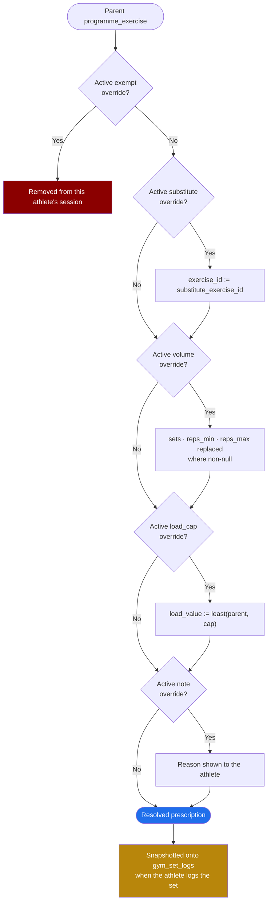

# ADR-006: Programme overrides rather than copies

## Status

**ACCEPTED.** 2026-08. Implements the mechanic drawn on the original whiteboard as *"create
general programme and tailor to specific athletes"* (`02-information-architecture.md` §1) and
specified as a flow in `03-flows.md` §4.

---

## Context

An S&C coach builds one gym programme for a squad and then changes parts of it for individual
athletes. This is not an edge case, it is the normal working pattern, and the reasons are
routine:

- An athlete with a shoulder restriction needs bench press swapped for a floor press
- An athlete returning from injury has their load capped at 70% for three weeks
- A 19-year-old academy player does three sets where the senior squad does five
- One athlete is exempt from Olympic lifts because nobody has taught them to clean safely
- A rehab programme temporarily replaces the gym programme entirely

Then, mid-block, the coach changes the parent programme: the squad's week 3 back squat goes
from 4×5 to 5×5.

The question this ADR answers is what happens to the 40 athletes assigned to that programme,
and specifically to the six who have tailored elements.

**This is the failure mode of the spreadsheet system Fydr replaces.** In a spreadsheet, a coach
copies the squad tab per athlete and edits each copy. A parent change means opening 40 tabs.
After two weeks nobody does it, the copies drift, and the coach no longer knows what any given
athlete is actually being asked to do. Reproducing that is not an acceptable outcome for a
product whose pitch is that it replaces the spreadsheet.

---

## Decision

**A programme is stored once. Athlete-specific tailoring is stored as override records against
individual programme elements. What an athlete sees is resolved at read time by applying their
overrides to the parent.**

The schema is in `04-data-model.md` §6. The essential part:

```sql
create table exercise_overrides (
  id                    uuid primary key default gen_random_uuid(),
  org_id                uuid not null references organisations(id),
  programme_exercise_id uuid not null references programme_exercises(id) on delete cascade,
  athlete_id            uuid not null references athletes(id),
  override_type         override_type not null,   -- substitute|volume|load_cap|exempt|note
  substitute_exercise_id uuid references exercises(id),
  sets                  int,
  reps_min              int,
  reps_max              int,
  load_value            numeric(6,2),
  reason                text,
  created_by            uuid references users(id),
  created_at            timestamptz not null default now(),
  expires_at            timestamptz,
  unique (programme_exercise_id, athlete_id, override_type)
);
```

### Resolution rules



Applied in this order, per exercise, per athlete:

| Order | Override type | Effect |
|---|---|---|
| 1 | `exempt` | The exercise is removed from that athlete's session. Nothing further applies. |
| 2 | `substitute` | `exercise_id` is replaced by `substitute_exercise_id`. Prescription carries over unless also overridden. |
| 3 | `volume` | `sets`, `reps_min`, `reps_max` replaced where non-null |
| 4 | `load_cap` | `load_value` becomes `least(parent_resolved_load, override.load_value)`. **A cap, not a set.** If the parent prescribes less than the cap, the parent wins. |
| 5 | `note` | Appended to the athlete's view. Changes nothing prescriptive. |

An override with `expires_at` in the past is ignored and the parent value applies again. This
is how "capped at 70% for three weeks" is expressed without anyone needing to remember to
remove it.

Resolution runs as a database function so that the app, the web dashboard, and any export all
produce the same answer:

```sql
create or replace function public.resolve_programme_session(
  p_programme_session_id uuid,
  p_athlete_id           uuid,
  p_on                   timestamptz default now()
)
returns table (
  programme_exercise_id uuid,
  sequence              int,
  exercise_id           uuid,
  sets                  int,
  reps_min              int,
  reps_max              int,
  load_basis            public.load_basis,
  load_value            numeric,
  tempo                 text,
  rest_seconds          int,
  is_overridden         boolean,
  override_reason       text
)
language sql
stable
security invoker
as $$
  with ov as (
    select o.*
    from public.exercise_overrides o
    join public.programme_exercises pe on pe.id = o.programme_exercise_id
    where pe.programme_session_id = p_programme_session_id
      and o.athlete_id = p_athlete_id
      and (o.expires_at is null or o.expires_at > p_on)
  )
  select
    pe.id,
    pe.sequence,
    coalesce(sub.substitute_exercise_id, pe.exercise_id),
    coalesce(vol.sets,     pe.sets),
    coalesce(vol.reps_min, pe.reps_min),
    coalesce(vol.reps_max, pe.reps_max),
    pe.load_basis,
    case
      when cap.load_value is not null then least(pe.load_value, cap.load_value)
      else pe.load_value
    end,
    pe.tempo,
    pe.rest_seconds,
    (sub.id is not null or vol.id is not null or cap.id is not null),
    coalesce(sub.reason, vol.reason, cap.reason, note.reason)
  from public.programme_exercises pe
  left join ov sub  on sub.programme_exercise_id  = pe.id and sub.override_type  = 'substitute'
  left join ov vol  on vol.programme_exercise_id  = pe.id and vol.override_type  = 'volume'
  left join ov cap  on cap.programme_exercise_id  = pe.id and cap.override_type  = 'load_cap'
  left join ov note on note.programme_exercise_id = pe.id and note.override_type = 'note'
  where pe.programme_session_id = p_programme_session_id
    and not exists (select 1 from ov e where e.programme_exercise_id = pe.id
                                        and e.override_type = 'exempt')
  order by pe.sequence;
$$;
```

The same rules exist in TypeScript in `packages/core/programme.ts` for offline resolution on
the device. **The two implementations are tested against a shared fixture set**, because two
copies of a rule is exactly the situation `05-architecture.md` §2 warns about, and here it is
unavoidable: the device must resolve programmes with no network.

### Propagation

`03-flows.md` §4 specifies it and it falls out of the model for free:

- Coach edits an element **no athlete has overridden** → the change reaches everyone
- Coach edits an element **some athletes have overridden** → those athletes keep their
  override, everyone else gets the change, and the coach is shown a divergence notice naming
  who diverged and on what

The divergence notice is not optional. Silent non-propagation is how a coach ends up believing
30 athletes are on 5×5 when six are not.

### The snapshot rule

**When an athlete logs a set, the resolved prescription is copied onto the log row.**

```sql
alter table gym_set_logs
  add column prescribed_sets      int,
  add column prescribed_reps_min  int,
  add column prescribed_reps_max  int,
  add column prescribed_load_kg   numeric(6,2),
  add column prescribed_source    text;   -- 'parent' | 'override:<override_id>'
```

This is the single most important consequence of choosing overrides, and it is easy to miss.
Without it, "was this athlete hitting their prescription in March?" is answered by resolving
today's parent programme against today's overrides, which may both have changed. The stored
programme describes intent now; the log must describe what was actually asked for then. The
snapshot makes adherence analysis correct and immune to later edits, consistent with ADR-005.

---

## Consequences

**Good:**

- **A coach edits once and 40 athletes are updated.** This is the entire point and it is what
  differentiates the product from the spreadsheet.
- Tailoring is explicit and enumerable. "Show me every athlete with an active load cap" is one
  query, which drives a genuinely useful screen for a coach returning athletes from injury.
- Overrides carry a `reason` and an author, so the record of why an athlete is doing something
  different survives the coach who decided it.
- `expires_at` makes temporary tailoring self-cleaning. Restrictions that should end actually
  end, rather than persisting because nobody remembered.
- Storage is small: one programme plus a handful of override rows, rather than 40 full copies.
- Divergence is detectable, so a coach can be told when their edit did not reach everyone.

**Bad, and accepted:**

- **Nothing can read the prescription directly.** Every consumer goes through resolution.
  Reading `programme_exercises` and showing it to an athlete is a bug, and it is a natural one
  to write. Mitigated by keeping resolution in a database function and marking the base tables
  as coach-authoring surfaces only.
- **N+1 risk.** Resolving a week for a squad is a session-by-athlete matrix. The function above
  resolves one session for one athlete; a squad view needs a set-returning variant taking
  arrays, and a naive loop in the client will be slow at 40 athletes × 4 sessions. The batch
  variant is required, not optional.
- **The rules exist twice**, in SQL and in TypeScript, for offline resolution. Shared fixtures
  and a test that runs both against them is the only defence, and it is a real ongoing cost.
- **Reasoning about interacting overrides is harder** than reading a copy. "Why is this athlete
  doing 3×8 at 60 kg?" requires understanding the resolution order. The athlete's programme
  screen therefore shows an explicit "adjusted for you" marker with the reason, and the coach's
  view shows parent and resolved side by side.
- **Deleting a parent element cascades.** `on delete cascade` removes the overrides with it,
  which is correct but silent. The UI warns when deleting an element that has overrides,
  naming the affected athletes.
- **Historical reconstruction depends on the snapshot rule.** Without those columns on
  `gym_set_logs`, past adherence is unanswerable. This is a genuine weakness of the model and
  the snapshot is the mitigation.
- **A heavily tailored athlete is awkward.** If a coach overrides nine of twelve exercises,
  the override model is doing more work than a copy would. This is rare, and the answer is a
  separate programme for that athlete rather than a special case in the model.

---

## Alternatives considered

### 1. Copy per athlete on assignment

Assigning a programme to 40 athletes creates 40 independent copies. Tailoring is ordinary
editing.

| | Copy per athlete | Overrides |
|---|---|---|
| Tailor one athlete | Edit their copy. Simple. | Create an override row |
| Edit the parent for everyone | **40 edits, or a merge tool nobody trusts** | One edit |
| Rows for a 12-week, 3-session, 8-exercise programme × 40 athletes | ~11,500 exercise rows | ~290 rows plus a handful of overrides |
| "Who is diverging from the plan?" | Diff 40 copies against a parent that no longer exists as a live thing | Select from `exercise_overrides` |
| Historical accuracy | Excellent. The copy is a snapshot. | Requires the snapshot rule |
| Read complexity | Trivial | Resolution required |
| Reproduces the spreadsheet failure mode | **Yes** | No |

Rejected on the second row. That is the exact behaviour Fydr exists to eliminate. The copy
model's genuine advantage, historical accuracy, is recovered by the snapshot rule at a fraction
of the cost.

### 2. Copy on assignment plus a "pull changes from parent" action

Copies, with a button that merges parent updates into an athlete's copy.

Rejected. It is the copy model with a three-way merge added, and a three-way merge over sets
and reps has no safe automatic resolution: the coach changed 4×5 to 5×5, the athlete's copy
says 3×5 because of a load cap, and no rule reliably produces the right answer. Every merge
becomes a decision, 40 times per parent edit, or it becomes an automatic rule that silently
overwrites a deliberate adjustment. That is worse than either pure model.

### 3. JSONB patch documents per athlete

Store the programme as JSONB and an RFC 6902 patch per athlete.

Rejected. Overrides stop being queryable, so "show every athlete with an active load cap"
becomes a scan with JSON path expressions. Patches are positional and break when the coach
reorders exercises, which coaches do constantly. It also cannot express `expires_at` per
adjustment without inventing structure inside the patch. Same idea as the chosen model with
worse ergonomics in every direction.

### 4. Inheritance chains: programme → athlete programme → session overrides

A general inheritance mechanism with arbitrary depth.

Rejected as over-general. Two levels, parent and athlete override, cover every observed use
case. Arbitrary depth introduces diamond inheritance (an athlete in two groups with conflicting
group-level overrides) with no natural precedence rule.

Worth noting: **group-level overrides are not in v1** for this reason. If a coach wants the
forwards on a different loading pattern, that is a different programme, not an override layer.
If group-level tailoring is later required, precedence must be defined explicitly, most likely
by group `sort_order`, and that is a change to this ADR.

---

## Open questions

- **O-29**: What happens to an active override when the athlete is reassigned to a different
  programme? Options: overrides are dropped, since they referenced elements of the old
  programme; or the coach is prompted to reapply comparable ones. Dropping is simpler and
  silently removes a load cap that may still be clinically necessary, which is a safety
  question rather than a modelling one. I have assumed drop-with-prompt, showing the coach the
  expiring overrides and requiring an acknowledgement. Confirm, because the rehab interaction
  in `03-flows.md` §4 makes this a live case.
