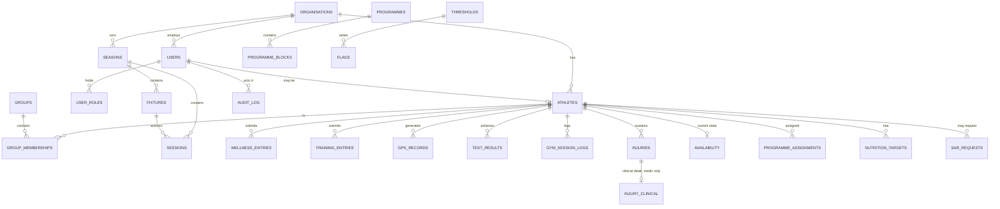
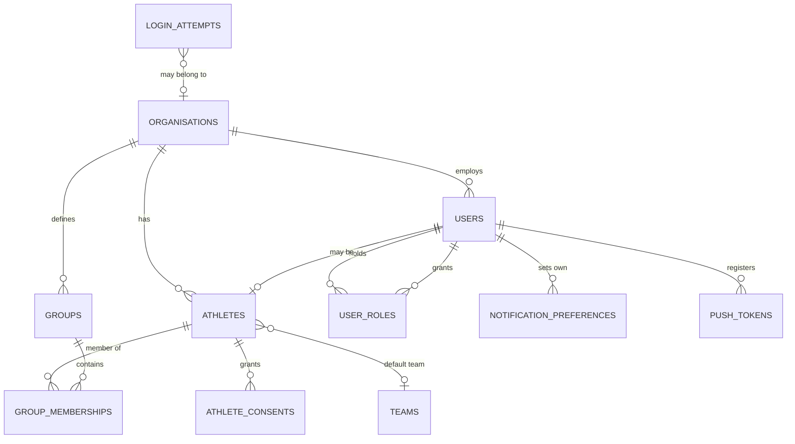
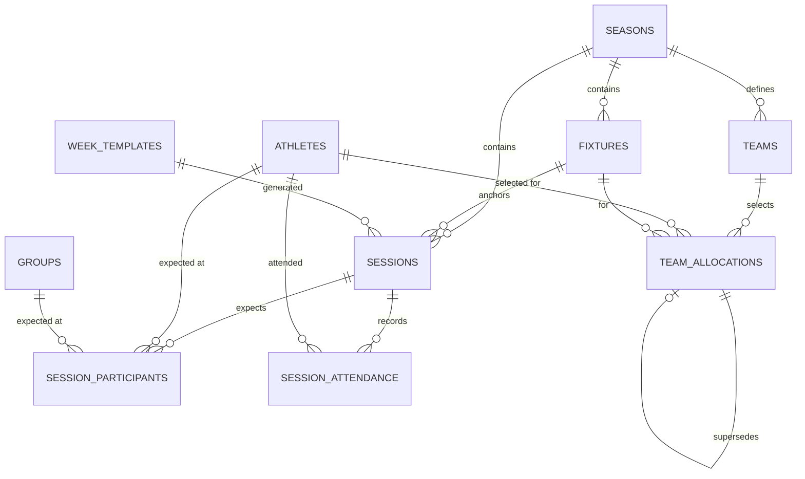
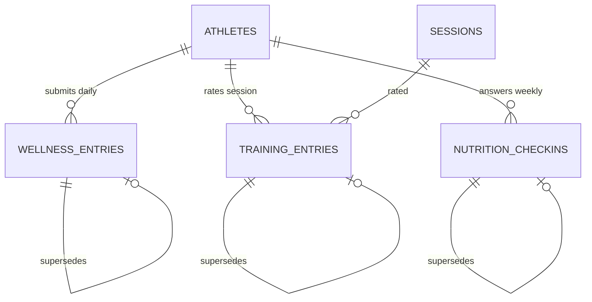
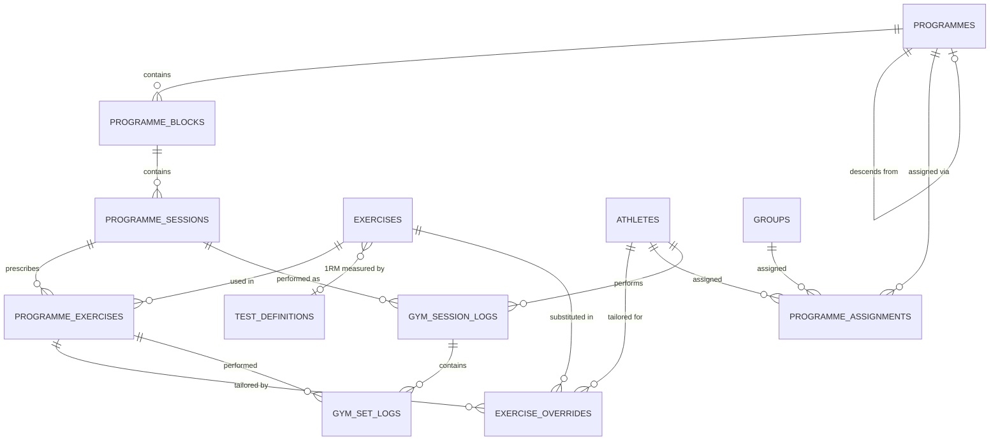
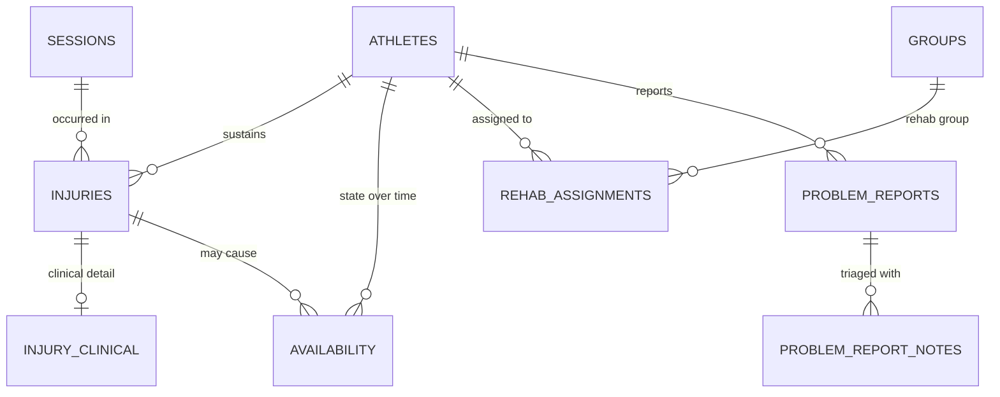
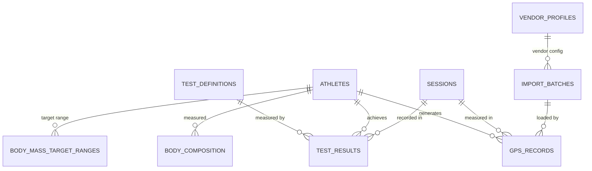
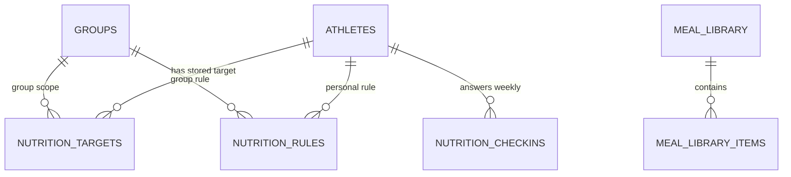
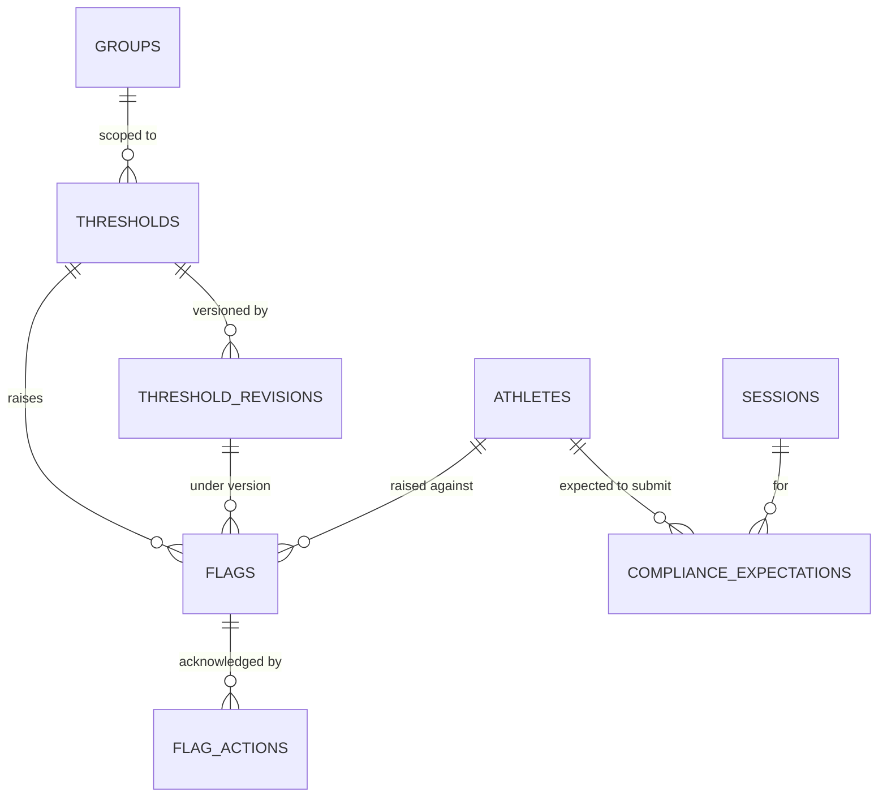
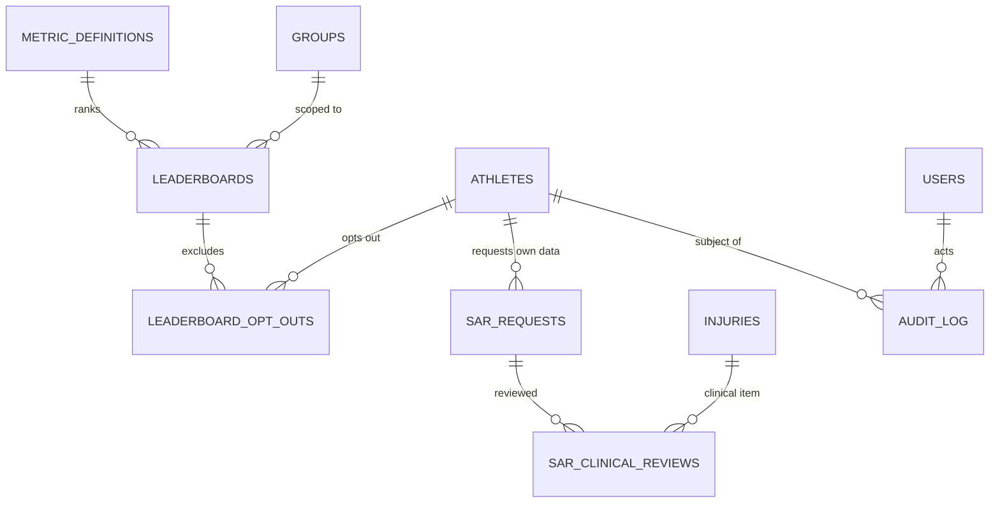

# Fydr: entity relationship diagram and data dictionary

Generated 4 September 2026 from `supabase/migrations/*.sql`, by parsing every
`create table` and `alter table ... add column` in all 62 migrations. **58
entities, 736 columns, 190 foreign keys.** Nothing here is from memory or from
prose: every field below is in a migration file.

---

## 0. Read this first

**This documents a system that is already built and running in production.** It
is not a proposal. The brief that produced it asked for an ERD "before any
schema or code gets written", which is not where Fydr is: the schema was written
between 6 August and 2 September 2026 and is live.

**An ERD already existed** and covers roughly 30 of the 58 entities, at
`docs/04-data-model.md` section 2. This one covers all 58 and adds the
sensitivity classification, which that one does not carry.

**One requirement in the brief does not exist in the system.** GPS was specified
as per-reading time-series with timestamp, latitude, longitude and speed, at
roughly a million readings per match. `gps_records` has none of those columns.
See section 6.

---

## 1. The role model

Confirmed 4 September 2026: **five staff roles, no admin.**

| Role | |
|---|---|
| Sport scientist | Everything, including what admin used to hold |
| Coach | Squad, schedule, reports, testing. Limited injury view |
| Medic | Everything a coach sees, plus the clinical record, which nobody else sees |
| Strength and conditioning coach | Gym programmes and physical development. Limited injury view |
| Nutritionist | Nutrition. **No injury or medical information anywhere** |

**Plus `athlete`, which is not a staff role but must remain in the schema.** It
is what gates the athlete app and what every athlete's own row-level security
keys off. Removing it would lock every athlete out of their own data.

**The code currently has four roles:** `athlete, coach, medical, admin`
(`supabase/migrations/0001_extensions_and_enums.sql:77`). The five-role model is
the target, tracked as gap G-02.

**Which policies must change.** Extracted from the migrations rather than
estimated. These 14 tables name `admin` in at least one policy and will need
rewriting when the role is removed:

`athlete_consents`, `athletes`, `audit_log`, `group_memberships`, `groups`,
`login_attempts`, `organisations`, `sar_clinical_reviews`, `sar_requests`,
`seasons`, `session_participants`, `teams`, `user_roles`, `users`.

---

## 2. How to read the dictionary

**Club-scoped** means the table carries `org_id` and its policies filter on it.
**56 of 58 tables are club-scoped.** The two that are not:

- `organisations` — it *is* the tenant
- `metric_definitions` — a platform-wide catalogue of rankable measures, the
  same for every club

**Sensitivity has three tiers**, taken from what the policies actually name:

| Tier | Meaning | Tables |
|---|---|---|
| **Clinical. Medic only** | The database refuses it to anyone who is not a medic, for every operation | `injury_clinical`, `problem_reports`, `problem_report_notes` |
| **Medical, limited view** | Coach, S&C and sport scientist see a reduced form. Nutritionist sees none | `injuries`, `availability`, `rehab_assignments`, `sar_clinical_reviews` |
| **General** | Club-scoped, role-gated, not medical | The other 51 |

**The clinical boundary is the strongest rule in the schema and it is
structural, not conventional.** An injury is split across two tables, not one
table with a flag. `injuries` holds what a coach may see; `injury_clinical`
holds diagnosis, mechanism, imaging, clinical notes and treatment plan, and its
policy is `for all` operations to the medical role only. A coach querying it
gets zero rows, not an error.

---

## 3. Entity relationship diagrams

58 entities in one diagram is unreadable, so this is one overview plus eight
domain diagrams. Every relationship shown is a real foreign key.

`org_id` is omitted from the diagrams. **Assume it on all 56 club-scoped
tables**; drawing 56 identical edges to `ORGANISATIONS` would hide the structure
that matters.

### 3.1 Overview



### 3.2 By domain

#### Tenancy and identity



#### Schedule



#### Athlete self-report



**All three are immutable.** A correction writes a new row and marks the old one
superseded. Nothing in the app has an UPDATE grant on these tables. Performance
data that can be silently edited is worthless for trend analysis.

#### Programmes and gym



**`exercises.one_rm_test_definition_id` is the link that makes percentage
prescriptions work.** Without it, an exercise written as "80 percent" has
nothing to be a percentage of, and the weight is marked unresolvable rather than
guessed.

#### Medical



**This is the block the nutritionist must not see, and where the strictest rule
lives.** `INJURY_CLINICAL`, `PROBLEM_REPORTS` and `PROBLEM_REPORT_NOTES` are
medic-only in the database. The one-to-one split between `INJURIES` and
`INJURY_CLINICAL` is what makes "coaching staff see availability, never
diagnosis" structural rather than a convention someone has to remember.

#### Measurement



**`GPS_RECORDS` is one cumulative row per athlete per session.** Not
time-series. See section 6.

#### Nutrition



**Two tables, one number.** `NUTRITION_RULES` holds the rule per kilogram of
body mass; `NUTRITION_TARGETS` holds the absolute grams an athlete sees,
computed from the rule at the moment a plan is assigned. They can drift: nothing
recomputes a target when the athlete's weight changes.

#### Monitoring



**A flag records which version of a rule raised it**, so a flag from last month
can still be read against the rule as it stood, not as it stands now.

#### Leaderboards and governance



**`METRIC_DEFINITIONS` is the one table with no `org_id`.** It is a
platform-wide catalogue: the definition of "total distance" is the same for
every club, and making it club-scoped would let two clubs disagree about what a
metric means.

---

## 4. Data dictionary

Every entity, in domain order. **Fields are the real column list** parsed from
the migrations. Foreign keys to `organisations` are omitted for the reason given
in section 3.

### Tenancy and identity

#### `organisations`

One rugby club. The tenancy boundary: every other table traces back here. Holds name, sport, timezone, country, subscription tier and an open settings object.

| | |
|---|---|
| Club-scoped | **No** |
| Sensitivity | General |
| Defined in | `0002_tenancy_and_identity.sql` |
| Columns | 11 |

<details><summary>Fields</summary>

```
id                         uuid primary key default gen_random_uuid()
name                       text not null
sport                      org_sport not null
timezone                   text not null default 'Europe/London'
country_code               char(2) not null default 'GB'
tier                       subscription_tier not null default 'core'
settings                   jsonb not null default '{}'::jsonb
created_at                 timestamptz not null default now()
updated_at                 timestamptz not null default now()
deleted_at                 timestamptz
logo_url                   text
```

</details>

#### `users`

An authentication identity. A person who can sign in. Separate from `athletes` because staff have no athlete profile and an athlete may exist before they are given a login.

| | |
|---|---|
| Club-scoped | Yes |
| Sensitivity | General |
| Defined in | `0002_tenancy_and_identity.sql` |
| Columns | 13 |

<details><summary>Fields</summary>

```
id                         uuid primary key
org_id                     uuid not null references organisations(id)
email                      citext not null
full_name                  text not null
phone                      text
avatar_url                 text
status                     user_status not null default 'invited'
last_seen_at               timestamptz
claims_version             int not null default 1
created_at                 timestamptz not null default now()
updated_at                 timestamptz not null default now()
deleted_at                 timestamptz
avatar_colour              text
```

</details>

#### `user_roles`

One row per role granted to a user in a club. A person holds several rows, so roles are additive. Records who granted it.

| | |
|---|---|
| Club-scoped | Yes |
| Sensitivity | General |
| Defined in | `0002_tenancy_and_identity.sql` |
| Columns | 6 |

**Relates to:** `user_id` → `users`, `granted_by` → `users`

<details><summary>Fields</summary>

```
id                         uuid primary key default gen_random_uuid()
org_id                     uuid not null references organisations(id)
user_id                    uuid not null references users(id) on delete cascade
role                       app_role not null
granted_by                 uuid references users(id)
granted_at                 timestamptz not null default now()
```

</details>

#### `athletes`

A player's profile: name, position, squad number, date of birth, status. Optionally linked to a `users` row; an athlete can exist without a login.

| | |
|---|---|
| Club-scoped | Yes |
| Sensitivity | General |
| Defined in | `0002_tenancy_and_identity.sql` |
| Columns | 26 |

**Relates to:** `user_id` → `users`, `dob_asserted_by` → `users`, `parental_consent_recorded_by` → `users`, `default_team_id` → `teams`

<details><summary>Fields</summary>

```
id                         uuid primary key default gen_random_uuid()
org_id                     uuid not null references organisations(id)
user_id                    uuid unique references users(id)
first_name                 text not null
last_name                  text not null
preferred_name             text
date_of_birth              date
position                   text
squad_number               int
dominant_side              dominant_side
height_cm                  numeric(5,1)
status                     athlete_status not null default 'active'
joined_at                  date
left_at                    date
consent_given_at           timestamptz
consent_version            text
dob_asserted_by            uuid references users(id)
dob_asserted_at            timestamptz
activation_blocked_reason  text
parental_consent_recorded_at timestamptz
parental_consent_recorded_by uuid references users(id)
parental_consent_method    parental_consent_method
created_at                 timestamptz not null default now()
updated_at                 timestamptz not null default now()
deleted_at                 timestamptz
default_team_id            uuid references teams(id)
```

</details>

#### `athlete_consents`

What an athlete has agreed to, per purpose. Drives leaderboard visibility for under 18s and any optional processing.

| | |
|---|---|
| Club-scoped | Yes |
| Sensitivity | General |
| Defined in | `0002_tenancy_and_identity.sql` |
| Columns | 9 |

**Relates to:** `athlete_id` → `athletes`

<details><summary>Fields</summary>

```
id                         uuid primary key default gen_random_uuid()
org_id                     uuid not null references organisations(id)
athlete_id                 uuid not null references athletes(id) on delete cascade
purpose                    consent_purpose not null
granted_at                 timestamptz
withdrawn_at               timestamptz
notice_version             text not null
created_at                 timestamptz not null default now()
updated_at                 timestamptz not null default now()
```

</details>

#### `groups`

A named subset of a squad: forwards, backs, academy, a rehab group. An athlete may be in several.

| | |
|---|---|
| Club-scoped | Yes |
| Sensitivity | General |
| Defined in | `0002_tenancy_and_identity.sql` |
| Columns | 10 |

<details><summary>Fields</summary>

```
id                         uuid primary key default gen_random_uuid()
org_id                     uuid not null references organisations(id)
name                       text not null
description                text
colour                     text
group_type                 group_type not null default 'custom'
sort_order                 int not null default 0
created_at                 timestamptz not null default now()
updated_at                 timestamptz not null default now()
deleted_at                 timestamptz
```

</details>

#### `group_memberships`

Which athletes are in which group, with history. The join table behind the global group filter.

| | |
|---|---|
| Club-scoped | Yes |
| Sensitivity | General |
| Defined in | `0002_tenancy_and_identity.sql` |
| Columns | 6 |

**Relates to:** `group_id` → `groups`, `athlete_id` → `athletes`

<details><summary>Fields</summary>

```
id                         uuid primary key default gen_random_uuid()
org_id                     uuid not null references organisations(id)
group_id                   uuid not null references groups(id) on delete cascade
athlete_id                 uuid not null references athletes(id) on delete cascade
added_at                   timestamptz not null default now()
removed_at                 timestamptz
```

</details>

#### `login_attempts`

Sign-in attempts, for lockout and for the audit trail. Not club data in the normal sense: a failed attempt may have no club yet.

| | |
|---|---|
| Club-scoped | Yes |
| Sensitivity | General |
| Defined in | `0048_login_attempts.sql` |
| Columns | 8 |

<details><summary>Fields</summary>

```
id                         uuid primary key default gen_random_uuid()
email                      citext not null
org_id                     uuid references public.organisations(id)
attempt_count              integer not null default 0
lock_count                 integer not null default 0
locked_until               timestamptz
last_attempt_at            timestamptz not null default now()
created_at                 timestamptz not null default now()
```

</details>

#### `notification_preferences`

One user's own notification switches. Nobody sets anybody else's.

| | |
|---|---|
| Club-scoped | Yes |
| Sensitivity | General |
| Defined in | `0008_notification_preferences_and_push_tokens.sql` |
| Columns | 11 |

**Relates to:** `user_id` → `users`

<details><summary>Fields</summary>

```
id                         uuid primary key default gen_random_uuid()
org_id                     uuid not null references organisations(id)
user_id                    uuid not null references users(id) on delete cascade
notification_id            text not null
push_enabled               boolean,          -- null = inherit
email_enabled              boolean,          -- null = inherit
in_app_enabled             boolean not null default true
quiet_hours_start          time,             -- null = inherit the organisation setting
quiet_hours_end            time
created_at                 timestamptz not null default now()
updated_at                 timestamptz not null default now()
```

</details>

#### `push_tokens`

Device tokens for push delivery, per user.

| | |
|---|---|
| Club-scoped | Yes |
| Sensitivity | General |
| Defined in | `0008_notification_preferences_and_push_tokens.sql` |
| Columns | 13 |

**Relates to:** `user_id` → `users`

<details><summary>Fields</summary>

```
id                         uuid primary key default gen_random_uuid()
org_id                     uuid not null references organisations(id)
user_id                    uuid not null references users(id) on delete cascade
token                      text not null
platform                   text not null
shell                      text not null
device_name                text
app_version                text
is_active                  boolean not null default true
invalidated_reason         text
last_used_at               timestamptz
created_at                 timestamptz not null default now()
updated_at                 timestamptz not null default now()
```

</details>

### Schedule

#### `seasons`

A club's competitive season. The container fixtures and sessions belong to.

| | |
|---|---|
| Club-scoped | Yes |
| Sensitivity | General |
| Defined in | `0003_schedule.sql` |
| Columns | 9 |

<details><summary>Fields</summary>

```
id                         uuid primary key default gen_random_uuid()
org_id                     uuid not null references organisations(id)
name                       text not null
starts_on                  date not null
ends_on                    date not null
is_current                 boolean not null default false
created_at                 timestamptz not null default now()
updated_at                 timestamptz not null default now()
deleted_at                 timestamptz
```

</details>

#### `fixtures`

A match: opponent, kick-off, venue, home or away, competition, importance. Anchors the matchday labels on the week around it.

| | |
|---|---|
| Club-scoped | Yes |
| Sensitivity | General |
| Defined in | `0003_schedule.sql` |
| Columns | 15 |

**Relates to:** `season_id` → `seasons`, `created_by` → `users`

<details><summary>Fields</summary>

```
id                         uuid primary key default gen_random_uuid()
org_id                     uuid not null references organisations(id)
season_id                  uuid not null references seasons(id)
opponent                   text not null
kickoff_at                 timestamptz not null
venue                      text
home_away                  home_away not null
competition                text
importance                 fixture_importance not null default 'normal'
status                     fixture_status not null default 'scheduled'
result                     text
created_by                 uuid references users(id)
created_at                 timestamptz not null default now()
updated_at                 timestamptz not null default now()
deleted_at                 timestamptz
```

</details>

#### `sessions`

A scheduled activity: training, gym, rehab, testing, recovery, meeting or match. May be anchored to a fixture.

| | |
|---|---|
| Club-scoped | Yes |
| Sensitivity | General |
| Defined in | `0003_schedule.sql` |
| Columns | 23 |

**Relates to:** `season_id` → `seasons`, `fixture_id` → `fixtures`, `created_by` → `users`, `applied_template_id` → `week_templates`

<details><summary>Fields</summary>

```
id                         uuid primary key default gen_random_uuid()
org_id                     uuid not null references organisations(id)
season_id                  uuid not null references seasons(id)
fixture_id                 uuid references fixtures(id)
session_type               session_type not null
title                      text not null
starts_at                  timestamptz not null
duration_min               int
location                   text
md_offset                  int
planned_rpe                numeric(3,1)
planned_load               numeric(8,1)
notes                      text
requires_wellness          boolean not null default true
requires_rpe               boolean not null default true
requires_nutrition         boolean not null default false
status                     session_status not null default 'planned'
created_by                 uuid references users(id)
created_at                 timestamptz not null default now()
updated_at                 timestamptz not null default now()
deleted_at                 timestamptz
template_key               text
applied_template_id        uuid references public.week_templates(id)
```

</details>

#### `session_participants`

Who is expected at a session, by group or by athlete. Expectation, not attendance.

| | |
|---|---|
| Club-scoped | Yes |
| Sensitivity | General |
| Defined in | `0003_schedule.sql` |
| Columns | 6 |

**Relates to:** `session_id` → `sessions`, `athlete_id` → `athletes`, `group_id` → `groups`

<details><summary>Fields</summary>

```
id                         uuid primary key default gen_random_uuid()
org_id                     uuid not null references organisations(id)
session_id                 uuid not null references sessions(id) on delete cascade
athlete_id                 uuid references athletes(id)
group_id                   uuid references groups(id)
created_at                 timestamptz not null default now()
```

</details>

#### `session_attendance`

Who actually attended, and in what state (full, modified, absent).

| | |
|---|---|
| Club-scoped | Yes |
| Sensitivity | General |
| Defined in | `0003_schedule.sql` |
| Columns | 8 |

**Relates to:** `session_id` → `sessions`, `athlete_id` → `athletes`, `recorded_by` → `users`

<details><summary>Fields</summary>

```
id                         uuid primary key default gen_random_uuid()
org_id                     uuid not null references organisations(id)
session_id                 uuid not null references sessions(id) on delete cascade
athlete_id                 uuid not null references athletes(id)
attendance                 attendance_status not null
modified_reason            text
recorded_by                uuid references users(id)
recorded_at                timestamptz not null default now()
```

</details>

#### `teams`

A named team within a season: 1st XV, 2nd XV, academy.

| | |
|---|---|
| Club-scoped | Yes |
| Sensitivity | General |
| Defined in | `0003_schedule.sql` |
| Columns | 16 |

**Relates to:** `season_id` → `seasons`, `created_by` → `users`

<details><summary>Fields</summary>

```
id                         uuid primary key default gen_random_uuid()
org_id                     uuid not null references organisations(id)
season_id                  uuid references seasons(id)
name                       text not null
short_name                 text
description                text
colour                     text
rank                       int not null default 0
squad_size_starting        int
squad_size_bench           int
status                     team_status not null default 'active'
sort_order                 int not null default 0
created_by                 uuid references users(id)
created_at                 timestamptz not null default now()
updated_at                 timestamptz not null default now()
deleted_at                 timestamptz
```

</details>

#### `team_allocations`

Which athletes are selected for which team, by week. Drafts until published, and revisions supersede rather than overwrite.

| | |
|---|---|
| Club-scoped | Yes |
| Sensitivity | General |
| Defined in | `0003_schedule.sql` |
| Columns | 21 |

**Relates to:** `team_id` → `teams`, `athlete_id` → `athletes`, `season_id` → `seasons`, `fixture_id` → `fixtures`, `published_by` → `users`, `revision_of` → `team_allocations`, `superseded_by` → `team_allocations`, `created_by` → `users`

<details><summary>Fields</summary>

```
id                         uuid primary key default gen_random_uuid()
org_id                     uuid not null references organisations(id)
team_id                    uuid not null references teams(id)
athlete_id                 uuid not null references athletes(id)
season_id                  uuid references seasons(id)
week_start                 date not null
fixture_id                 uuid references fixtures(id)
status                     team_allocation_status not null default 'draft'
source                     team_allocation_source not null default 'manual'
availability_at_allocation availability_status
override_reason            text
note                       text
published_at               timestamptz
published_by               uuid references users(id)
revision_of                uuid references team_allocations(id)
superseded_by              uuid references team_allocations(id)
created_by                 uuid references users(id)
created_at                 timestamptz not null default now()
updated_at                 timestamptz not null default now()
deleted_at                 timestamptz
or                         availability_at_allocation is null)
```

</details>

#### `week_templates`

A reusable week shape. Applying one creates real sessions from it; the sessions carry no link back.

| | |
|---|---|
| Club-scoped | Yes |
| Sensitivity | General |
| Defined in | `0003_schedule.sql` |
| Columns | 8 |

**Relates to:** `created_by` → `users`

<details><summary>Fields</summary>

```
id                         uuid primary key default gen_random_uuid()
org_id                     uuid not null references organisations(id)
name                       text not null
structure                  jsonb not null
created_by                 uuid references users(id)
created_at                 timestamptz not null default now()
updated_at                 timestamptz not null default now()
deleted_at                 timestamptz
```

</details>

### Athlete self-report

#### `wellness_entries`

The athlete's daily self-report: sleep quality and hours, fatigue, soreness, stress, mood, body mass. Readiness is computed from these by trigger. Immutable: a correction is a new revision.

| | |
|---|---|
| Club-scoped | Yes |
| Sensitivity | General |
| Defined in | `0004_athlete_entries.sql` |
| Columns | 21 |

**Relates to:** `athlete_id` → `athletes`, `revision_of` → `wellness_entries`, `superseded_by` → `wellness_entries`, `created_by` → `users`

<details><summary>Fields</summary>

```
id                         uuid primary key default gen_random_uuid()
org_id                     uuid not null references organisations(id)
athlete_id                 uuid not null references athletes(id)
entry_date                 date not null
sleep_hours                numeric(3,1)
sleep_quality              int
fatigue                    int,        -- 5 = fresh
soreness                   int,        -- 5 = no soreness
soreness_areas             text[]
stress                     int,        -- 5 = relaxed
mood                       int,        -- 5 = very positive
resting_hr                 int
body_mass_kg               numeric(5,2)
comment                    text
readiness_score            numeric(5,2)
source                     data_source not null default 'self_report'
submitted_at               timestamptz not null default now()
revision_of                uuid references wellness_entries(id)
superseded_by              uuid references wellness_entries(id) deferrable initially deferred
created_by                 uuid references users(id)
created_at                 timestamptz not null default now()
```

</details>

#### `training_entries`

The athlete's rating of a session: perceived exertion and duration. Session load is computed from these by trigger. Immutable, same revision model.

| | |
|---|---|
| Club-scoped | Yes |
| Sensitivity | General |
| Defined in | `0004_athlete_entries.sql` |
| Columns | 15 |

**Relates to:** `athlete_id` → `athletes`, `session_id` → `sessions`, `revision_of` → `training_entries`, `superseded_by` → `training_entries`, `created_by` → `users`

<details><summary>Fields</summary>

```
id                         uuid primary key default gen_random_uuid()
org_id                     uuid not null references organisations(id)
athlete_id                 uuid not null references athletes(id)
session_id                 uuid references sessions(id)
entry_date                 date not null
rpe                        numeric(3,1) not null
duration_min               int not null
session_load               numeric(8,1)
comment                    text
source                     data_source not null default 'self_report'
submitted_at               timestamptz not null default now()
revision_of                uuid references training_entries(id)
superseded_by              uuid references training_entries(id) deferrable initially deferred
created_by                 uuid references users(id)
created_at                 timestamptz not null default now()
```

</details>

#### `nutrition_checkins`

The weekly one-tap nutrition question. One question, once a week, three answers. Not a food diary.

| | |
|---|---|
| Club-scoped | Yes |
| Sensitivity | General |
| Defined in | `0004_athlete_entries.sql` |
| Columns | 18 |

**Relates to:** `athlete_id` → `athletes`, `revision_of` → `nutrition_checkins`, `superseded_by` → `nutrition_checkins`, `created_by` → `users`

<details><summary>Fields</summary>

```
id                         uuid primary key default gen_random_uuid()
org_id                     uuid not null references organisations(id)
athlete_id                 uuid not null references athletes(id)
week_start                 date not null
iso_year                   int not null
iso_week                   int not null
answer                     nutrition_checkin_answer not null
note                       text
nutrition_target_id        uuid
protein_target_g           numeric(6,1)
source                     data_source not null default 'self_report'
submitted_at               timestamptz not null default now()
revision_of                uuid references nutrition_checkins(id)
superseded_by              uuid references nutrition_checkins(id) deferrable initially deferred
created_by                 uuid references users(id)
created_at                 timestamptz not null default now()
updated_at                 timestamptz not null default now()
deleted_at                 timestamptz
```

</details>

### Programmes and gym

#### `programmes`

A gym programme. May descend from a parent programme.

| | |
|---|---|
| Club-scoped | Yes |
| Sensitivity | General |
| Defined in | `0021_programmes.sql` |
| Columns | 14 |

**Relates to:** `parent_id` → `programmes`, `created_by` → `users`

<details><summary>Fields</summary>

```
id                         uuid primary key default gen_random_uuid()
org_id                     uuid not null references organisations(id)
name                       text not null
programme_type             programme_type not null
description                text
goal                       text
duration_weeks             int
is_template                boolean not null default false
parent_id                  uuid references programmes(id)
status                     programme_status not null default 'draft'
created_by                 uuid references users(id)
created_at                 timestamptz not null default now()
updated_at                 timestamptz not null default now()
deleted_at                 timestamptz
```

</details>

#### `programme_blocks`

A time-bounded phase within a programme.

| | |
|---|---|
| Club-scoped | Yes |
| Sensitivity | General |
| Defined in | `0021_programmes.sql` |
| Columns | 7 |

**Relates to:** `programme_id` → `programmes`

<details><summary>Fields</summary>

```
id                         uuid primary key default gen_random_uuid()
org_id                     uuid not null references organisations(id)
programme_id               uuid not null references programmes(id) on delete cascade
name                       text not null
sequence                   int not null
duration_weeks             int not null default 4
focus                      text
```

</details>

#### `programme_sessions`

A session template within a block.

| | |
|---|---|
| Club-scoped | Yes |
| Sensitivity | General |
| Defined in | `0021_programmes.sql` |
| Columns | 8 |

**Relates to:** `block_id` → `programme_blocks`

<details><summary>Fields</summary>

```
id                         uuid primary key default gen_random_uuid()
org_id                     uuid not null references organisations(id)
block_id                   uuid not null references programme_blocks(id) on delete cascade
name                       text not null
week_number                int not null
day_number                 int
md_offset                  int
sequence                   int not null
```

</details>

#### `programme_exercises`

A prescribed exercise within a programme session: sets, reps, load basis, tempo, rest.

| | |
|---|---|
| Club-scoped | Yes |
| Sensitivity | General |
| Defined in | `0021_programmes.sql` |
| Columns | 14 |

**Relates to:** `programme_session_id` → `programme_sessions`, `exercise_id` → `exercises`

<details><summary>Fields</summary>

```
id                         uuid primary key default gen_random_uuid()
org_id                     uuid not null references organisations(id)
programme_session_id       uuid not null references programme_sessions(id) on delete cascade
exercise_id                uuid not null references exercises(id)
sequence                   int not null
superset_group             text
sets                       int not null
reps_min                   int
reps_max                   int
load_basis                 load_basis not null
load_value                 numeric(6,2)
tempo                      text
rest_seconds               int
notes                      text
```

</details>

#### `exercises`

The club's exercise library. Optionally names the test that measures the exercise's one repetition maximum, which is what makes percentage prescriptions resolvable.

| | |
|---|---|
| Club-scoped | Yes |
| Sensitivity | General |
| Defined in | `0021_programmes.sql` |
| Columns | 12 |

**Relates to:** `one_rm_test_definition_id` → `test_definitions`

<details><summary>Fields</summary>

```
id                         uuid primary key default gen_random_uuid()
org_id                     uuid references organisations(id)
name                       text not null
category                   exercise_category not null
primary_muscle             text
equipment                  text[]
is_unilateral              boolean not null default false
video_url                  text
cues                       text
created_at                 timestamptz not null default now()
deleted_at                 timestamptz
one_rm_test_definition_id  uuid references test_definitions(id)
```

</details>

#### `exercise_overrides`

A per-athlete adjustment to a prescribed exercise: exempt, substitute, volume, load cap or note. The mechanism that lets one programme serve a squad.

| | |
|---|---|
| Club-scoped | Yes |
| Sensitivity | General |
| Defined in | `0043_exercise_overrides_and_one_rm.sql` |
| Columns | 14 |

**Relates to:** `programme_exercise_id` → `programme_exercises`, `athlete_id` → `athletes`, `substitute_exercise_id` → `exercises`, `created_by` → `users`

<details><summary>Fields</summary>

```
id                         uuid primary key default gen_random_uuid()
org_id                     uuid not null references organisations(id)
programme_exercise_id      uuid not null references programme_exercises(id) on delete cascade
athlete_id                 uuid not null references athletes(id)
override_type              override_type not null
substitute_exercise_id     uuid references exercises(id)
sets                       int
reps_min                   int
reps_max                   int
load_value                 numeric(6,2)
reason                     text
created_by                 uuid references users(id)
created_at                 timestamptz not null default now()
expires_at                 timestamptz
```

</details>

#### `programme_assignments`

Which athletes or groups are on which programme, and when.

| | |
|---|---|
| Club-scoped | Yes |
| Sensitivity | General |
| Defined in | `0021_programmes.sql` |
| Columns | 11 |

**Relates to:** `programme_id` → `programmes`, `athlete_id` → `athletes`, `group_id` → `groups`, `assigned_by` → `users`

<details><summary>Fields</summary>

```
id                         uuid primary key default gen_random_uuid()
org_id                     uuid not null references organisations(id)
programme_id               uuid not null references programmes(id)
athlete_id                 uuid references athletes(id)
group_id                   uuid references groups(id)
starts_on                  date not null default current_date
ends_on                    date
status                     assignment_status not null default 'active'
suspended_reason           text
assigned_by                uuid references users(id)
created_at                 timestamptz not null default now()
```

</details>

#### `gym_session_logs`

An athlete's record of performing a gym session. Revisions supersede.

| | |
|---|---|
| Club-scoped | Yes |
| Sensitivity | General |
| Defined in | `0021_programmes.sql` |
| Columns | 15 |

**Relates to:** `athlete_id` → `athletes`, `programme_session_id` → `programme_sessions`, `session_id` → `sessions`, `revision_of` → `gym_session_logs`

<details><summary>Fields</summary>

```
id                         uuid primary key default gen_random_uuid()
org_id                     uuid not null references organisations(id)
athlete_id                 uuid not null references athletes(id)
programme_session_id       uuid references programme_sessions(id)
session_id                 uuid references sessions(id)
entry_date                 date not null default current_date
started_at                 timestamptz
completed_at               timestamptz
session_rpe                numeric(3,1)
total_volume_kg            numeric(10,1)
status                     gym_log_status not null default 'in_progress'
comment                    text
source                     data_source not null default 'self_report'
created_at                 timestamptz not null default now()
revision_of                uuid references public.gym_session_logs(id)
```

</details>

#### `gym_set_logs`

The individual sets within a logged gym session: weight, reps, and what was prescribed.

| | |
|---|---|
| Club-scoped | Yes |
| Sensitivity | General |
| Defined in | `0021_programmes.sql` |
| Columns | 15 |

**Relates to:** `gym_session_log_id` → `gym_session_logs`, `programme_exercise_id` → `programme_exercises`, `exercise_id` → `exercises`, `revision_of` → `gym_set_logs`

<details><summary>Fields</summary>

```
id                         uuid primary key default gen_random_uuid()
org_id                     uuid not null references organisations(id)
gym_session_log_id         uuid not null references gym_session_logs(id) on delete cascade
programme_exercise_id      uuid references programme_exercises(id)
exercise_id                uuid not null references exercises(id)
set_number                 int not null
reps_completed             int
load_kg                    numeric(6,2)
rpe                        numeric(3,1)
rir                        int
side                       body_side
is_warmup                  boolean not null default false
volume_kg                  numeric(10,2) generated always as
logged_at                  timestamptz not null default now()
revision_of                uuid references public.gym_set_logs(id)
```

</details>

### Medical

#### `injuries`

The coach-safe half of an injury: body area, side, onset, status, expected and actual return, and whether it happened in training or a match. Closed, never deleted.

| | |
|---|---|
| Club-scoped | Yes |
| Sensitivity | **Medical, limited view** |
| Defined in | `0005_injuries_and_availability.sql` |
| Columns | 15 |

**Relates to:** `athlete_id` → `athletes`, `session_id` → `sessions`, `reported_by` → `users`

<details><summary>Fields</summary>

```
id                         uuid primary key default gen_random_uuid()
org_id                     uuid not null references organisations(id)
athlete_id                 uuid not null references athletes(id)
body_area                  body_area not null
side                       body_side
onset_date                 date not null
status                     injury_status not null default 'open'
expected_return            date
actual_return              date
session_id                 uuid references sessions(id)
occurred_in                occurrence_context
reported_by                uuid references users(id)
created_at                 timestamptz not null default now()
updated_at                 timestamptz not null default now()
deleted_at                 timestamptz
```

</details>

#### `injury_clinical`

The medical half, one-to-one with an injury: diagnosis, mechanism, severity, tissue type, imaging, referral, clinical notes, treatment plan.

| | |
|---|---|
| Club-scoped | Yes |
| Sensitivity | **Clinical. Medic only** |
| Defined in | `0005_injuries_and_availability.sql` |
| Columns | 12 |

**Relates to:** `injury_id` → `injuries`, `updated_by` → `users`

<details><summary>Fields</summary>

```
injury_id                  uuid primary key references injuries(id) on delete cascade
org_id                     uuid not null references organisations(id)
diagnosis                  text
mechanism                  text
severity                   injury_severity
tissue_type                text
imaging                    text
referral                   text
clinical_notes             text
treatment_plan             text
updated_by                 uuid references users(id)
updated_at                 timestamptz not null default now()
```

</details>

#### `availability`

Whether an athlete can train and play right now, with the reason category and any restrictions. May be linked to an injury or stand alone.

| | |
|---|---|
| Club-scoped | Yes |
| Sensitivity | **Medical, limited view** |
| Defined in | `0005_injuries_and_availability.sql` |
| Columns | 12 |

**Relates to:** `athlete_id` → `athletes`, `injury_id` → `injuries`, `set_by` → `users`

<details><summary>Fields</summary>

```
id                         uuid primary key default gen_random_uuid()
org_id                     uuid not null references organisations(id)
athlete_id                 uuid not null references athletes(id)
status                     availability_status not null
restrictions               text[]
reason_category            availability_reason
injury_id                  uuid references injuries(id)
effective_from             timestamptz not null default now()
effective_to               timestamptz
set_by                     uuid not null references users(id)
note                       text
created_at                 timestamptz not null default now()
```

</details>

#### `rehab_assignments`

Which injured athletes are working in which rehab group.

| | |
|---|---|
| Club-scoped | Yes |
| Sensitivity | **Medical, limited view** |
| Defined in | `0018_rehab_assignments.sql` |
| Columns | 9 |

**Relates to:** `athlete_id` → `athletes`, `rehab_group_id` → `groups`, `set_by` → `users`

<details><summary>Fields</summary>

```
id                         uuid primary key default gen_random_uuid()
org_id                     uuid not null references organisations(id)
athlete_id                 uuid not null references athletes(id)
rehab_group_id             uuid references groups(id)
phase                      text
effective_from             timestamptz not null default now()
effective_to               timestamptz
set_by                     uuid not null references users(id)
created_at                 timestamptz not null default now()
```

</details>

#### `problem_reports`

Something an athlete has reported that nobody has yet turned into an injury record or dismissed. A triage queue.

| | |
|---|---|
| Club-scoped | Yes |
| Sensitivity | **Clinical. Medic only** |
| Defined in | `0040_problem_reports.sql` |
| Columns | 13 |

**Relates to:** `athlete_id` → `athletes`, `created_by` → `users`, `acknowledged_by` → `users`, `closed_by` → `users`

<details><summary>Fields</summary>

```
id                         uuid primary key default gen_random_uuid()
org_id                     uuid not null references organisations(id)
athlete_id                 uuid not null references athletes(id)
category                   problem_report_category
body                       text not null
status                     problem_report_status not null default 'open'
created_by                 uuid not null references users(id)
created_at                 timestamptz not null default now()
acknowledged_at            timestamptz
acknowledged_by            uuid references users(id)
closed_at                  timestamptz
closed_by                  uuid references users(id)
deleted_at                 timestamptz
```

</details>

#### `problem_report_notes`

Notes a medic adds while triaging a reported problem.

| | |
|---|---|
| Club-scoped | Yes |
| Sensitivity | **Clinical. Medic only** |
| Defined in | `0055_problem_report_notes.sql` |
| Columns | 7 |

**Relates to:** `report_id` → `problem_reports`, `created_by` → `users`

<details><summary>Fields</summary>

```
id                         uuid primary key default gen_random_uuid()
org_id                     uuid not null references organisations(id)
report_id                  uuid not null references problem_reports(id)
body                       text not null
created_by                 uuid not null references users(id)
created_at                 timestamptz not null default now()
deleted_at                 timestamptz
```

</details>

### Measurement

#### `gps_records`

One cumulative row per athlete per session from a GPS vendor: distances, max speed, accelerations, player load, duration. Not raw readings.

| | |
|---|---|
| Club-scoped | Yes |
| Sensitivity | General |
| Defined in | `0023_gps_records.sql` |
| Columns | 23 |

**Relates to:** `athlete_id` → `athletes`, `session_id` → `sessions`

<details><summary>Fields</summary>

```
id                         uuid primary key default gen_random_uuid()
org_id                     uuid not null references organisations(id)
athlete_id                 uuid not null references athletes(id)
session_id                 uuid references sessions(id)
record_date                date not null
vendor                     text
device_id                  text
duration_s                 int
total_distance_m           numeric(10,1)
running_distance_m         numeric(10,1)
high_speed_distance_m      numeric(10,1)
sprint_distance_m          numeric(10,1)
high_intensity_efforts     int
max_speed_ms               numeric(5,2)
accelerations              int
decelerations              int
player_load                numeric(10,2)
impacts                    int
metabolic_power_avg        numeric(8,2)
raw                        jsonb
source                     data_source not null default 'file_import'
import_batch_id            uuid
created_at                 timestamptz not null default now()
```

</details>

#### `import_batches`

One GPS file upload: filename, who, when, how many rows accepted and rejected.

| | |
|---|---|
| Club-scoped | Yes |
| Sensitivity | General |
| Defined in | `0023_gps_records.sql` |
| Columns | 10 |

**Relates to:** `imported_by` → `users`

<details><summary>Fields</summary>

```
id                         uuid primary key default gen_random_uuid()
org_id                     uuid not null references organisations(id)
filename                   text
vendor_profile_id          uuid
row_count                  int
accepted_count             int
rejected_count             int
errors                     jsonb
imported_by                uuid references users(id)
created_at                 timestamptz not null default now()
```

</details>

#### `vendor_profiles`

Per-vendor configuration for GPS ingestion. Linked from `import_batches`, not from `gps_records`: the vendor is a property of the upload, not of an individual row.

| | |
|---|---|
| Club-scoped | Yes |
| Sensitivity | General |
| Defined in | `0023_gps_records.sql` |
| Columns | 7 |

<details><summary>Fields</summary>

```
id                         uuid primary key default gen_random_uuid()
org_id                     uuid not null references organisations(id)
vendor                     text not null
column_map                 jsonb not null
unit_map                   jsonb not null default '{}'::jsonb
athlete_match_column       text not null default 'Player Name'
created_at                 timestamptz not null default now()
```

</details>

#### `test_definitions`

A standardised test the club runs, with its unit and which direction is better.

| | |
|---|---|
| Club-scoped | Yes |
| Sensitivity | General |
| Defined in | `0024_testing.sql` |
| Columns | 17 |

<details><summary>Fields</summary>

```
id                         uuid primary key default gen_random_uuid()
org_id                     uuid not null references organisations(id)
name                       text not null
test_category              test_category not null
unit                       text not null
higher_is_better           boolean not null default true
protocol                   text
equipment                  text
default_attempts           int not null default 1
side_mode                  side_mode not null default 'bilateral'
decimal_places             int not null default 1
min_plausible              numeric
max_plausible              numeric
leaderboard_eligible       boolean not null default true
sort_order                 int not null default 0
created_at                 timestamptz not null default now()
deleted_at                 timestamptz
```

</details>

#### `test_results`

One athlete's result for one test on one day. The best attempt per day is flagged.

| | |
|---|---|
| Club-scoped | Yes |
| Sensitivity | General |
| Defined in | `0024_testing.sql` |
| Columns | 16 |

**Relates to:** `athlete_id` → `athletes`, `test_definition_id` → `test_definitions`, `session_id` → `sessions`, `recorded_by` → `users`

<details><summary>Fields</summary>

```
id                         uuid primary key default gen_random_uuid()
org_id                     uuid not null references organisations(id)
athlete_id                 uuid not null references athletes(id)
test_definition_id         uuid not null references test_definitions(id)
session_id                 uuid references sessions(id)
test_date                  date not null
value                      numeric(10,3) not null
attempt_number             int not null default 1
is_best                    boolean not null default false
is_best_manual             boolean not null default false
side                       body_side
conditions                 text
source                     data_source not null default 'staff_entered'
recorded_by                uuid references users(id)
created_at                 timestamptz not null default now()
deleted_at                 timestamptz
```

</details>

#### `body_composition`

Recorded body composition measurements.

| | |
|---|---|
| Club-scoped | Yes |
| Sensitivity | General |
| Defined in | `0024_testing.sql` |
| Columns | 11 |

**Relates to:** `athlete_id` → `athletes`, `recorded_by` → `users`

<details><summary>Fields</summary>

```
id                         uuid primary key default gen_random_uuid()
org_id                     uuid not null references organisations(id)
athlete_id                 uuid not null references athletes(id)
measured_on                date not null
body_mass_kg               numeric(5,2)
body_fat_pct               numeric(4,1)
lean_mass_kg               numeric(5,2)
method                     text
sum_skinfolds_mm           numeric(6,1)
recorded_by                uuid references users(id)
created_at                 timestamptz not null default now()
```

</details>

#### `body_mass_target_ranges`

The agreed weight range for an athlete, allowed to move across a season.

| | |
|---|---|
| Club-scoped | Yes |
| Sensitivity | General |
| Defined in | `0060_body_mass_target_ranges.sql` |
| Columns | 12 |

**Relates to:** `athlete_id` → `athletes`, `set_by` → `users`

<details><summary>Fields</summary>

```
id                         uuid primary key default gen_random_uuid()
org_id                     uuid not null references organisations(id)
athlete_id                 uuid not null references athletes(id)
target_low_kg              numeric(5,2) not null
target_high_kg             numeric(5,2) not null
rationale                  text
set_by                     uuid not null references users(id)
set_at                     timestamptz not null default now()
effective_from             date not null default current_date
effective_to               date
updated_at                 timestamptz not null default now()
deleted_at                 timestamptz
```

</details>

### Nutrition

#### `nutrition_targets`

The stored absolute daily targets an athlete sees: protein, carbohydrate, fat, energy, fluid. Computed from a rule at the moment a plan is assigned.

| | |
|---|---|
| Club-scoped | Yes |
| Sensitivity | General |
| Defined in | `0019_nutrition_targets.sql` |
| Columns | 19 |

**Relates to:** `athlete_id` → `athletes`, `group_id` → `groups`, `created_by` → `users`

<details><summary>Fields</summary>

```
id                         uuid primary key default gen_random_uuid()
org_id                     uuid not null references organisations(id)
athlete_id                 uuid references athletes(id)
group_id                   uuid references groups(id)
org_default                boolean not null default false
md_offset                  int
energy_kcal                numeric(7,1)
protein_g                  numeric(6,1)
carbs_g                    numeric(6,1)
fat_g                      numeric(6,1)
fluid_ml                   numeric(7,1)
tolerance_pct              numeric(4,1)
reason                     text
effective_from             date not null default current_date
effective_to               date
created_by                 uuid references users(id)
created_at                 timestamptz not null default now()
updated_at                 timestamptz not null default now()
deleted_at                 timestamptz
```

</details>

#### `nutrition_rules`

The rule those targets are computed from, expressed per kilogram of body mass, scoped to club, group or athlete.

| | |
|---|---|
| Club-scoped | Yes |
| Sensitivity | General |
| Defined in | `0039_nutrition_rules.sql` |
| Columns | 17 |

**Relates to:** `athlete_id` → `athletes`, `group_id` → `groups`, `created_by` → `users`

<details><summary>Fields</summary>

```
id                         uuid primary key default gen_random_uuid()
org_id                     uuid not null references organisations(id)
athlete_id                 uuid references athletes(id)
group_id                   uuid references groups(id)
org_default                boolean not null default false
protein_g_per_kg           numeric(4,2) not null
carb_g_per_kg              numeric(4,2) not null
fat_g_per_kg               numeric(4,2) not null
fluid_ml_per_kg            numeric(5,1) not null
energy_kcal_cap            numeric(7,1)
reason                     text
effective_from             date not null default current_date
effective_to               date
created_by                 uuid references users(id)
created_at                 timestamptz not null default now()
updated_at                 timestamptz not null default now()
deleted_at                 timestamptz
```

</details>

#### `meal_library`

Meal ideas the nutritionist maintains.

| | |
|---|---|
| Club-scoped | Yes |
| Sensitivity | General |
| Defined in | `0051_meal_library.sql` |
| Columns | 7 |

**Relates to:** `created_by` → `users`

<details><summary>Fields</summary>

```
id                         uuid primary key default gen_random_uuid()
org_id                     uuid not null references organisations(id)
name                       text not null
time_label                 text not null
created_by                 uuid references users(id)
created_at                 timestamptz not null default now()
deleted_at                 timestamptz
```

</details>

#### `meal_library_items`

The food items making up a library meal.

| | |
|---|---|
| Club-scoped | Yes |
| Sensitivity | General |
| Defined in | `0051_meal_library.sql` |
| Columns | 10 |

**Relates to:** `meal_id` → `meal_library`

<details><summary>Fields</summary>

```
id                         uuid primary key default gen_random_uuid()
org_id                     uuid not null references organisations(id)
meal_id                    uuid not null references meal_library(id) on delete cascade
sequence                   int not null default 0
name                       text not null
qty                        numeric(7,2) not null
unit                       meal_unit not null
protein_g                  numeric(6,2) not null default 0
carb_g                     numeric(6,2) not null default 0
fat_g                      numeric(6,2) not null default 0
```

</details>

### Monitoring

#### `thresholds`

A club's own rule for when a flag is raised: which measure, what cutoff, absolute or against the athlete's own baseline, and who to notify.

| | |
|---|---|
| Club-scoped | Yes |
| Sensitivity | General |
| Defined in | `0006_thresholds_flags_compliance.sql` |
| Columns | 22 |

**Relates to:** `applies_to_group_id` → `groups`, `created_by` → `users`

<details><summary>Fields</summary>

```
id                         uuid primary key default gen_random_uuid()
org_id                     uuid not null references organisations(id)
name                       text not null
description                text
domain                     flag_domain not null
metric                     text not null
comparison                 threshold_comparison not null
value                      numeric(10,3) not null
baseline_type              baseline_type not null default 'absolute'
baseline_days              int default 28
consecutive_days           int not null default 1
min_baseline_observations  int not null default 10
cooldown_days              int not null default 3
severity                   flag_severity not null default 'medium'
applies_to_group_id        uuid references groups(id)
notify_roles               app_role[] not null default '{coach}'
source                     threshold_source not null default 'custom'
is_active                  boolean not null default true
created_by                 uuid references users(id)
created_at                 timestamptz not null default now()
updated_at                 timestamptz not null default now()
deleted_at                 timestamptz
```

</details>

#### `threshold_revisions`

The history of a threshold. Rules are versioned, not overwritten, so a flag raised last month can be read against the rule that raised it.

| | |
|---|---|
| Club-scoped | Yes |
| Sensitivity | General |
| Defined in | `0006_thresholds_flags_compliance.sql` |
| Columns | 8 |

**Relates to:** `threshold_id` → `thresholds`, `changed_by` → `users`

<details><summary>Fields</summary>

```
id                         uuid primary key default gen_random_uuid()
org_id                     uuid not null references organisations(id)
threshold_id               uuid not null references thresholds(id) on delete cascade
before                     jsonb,               -- null on create
after                      jsonb not null
change_reason              text
changed_by                 uuid not null references users(id)
created_at                 timestamptz not null default now()
```

</details>

#### `flags`

An automatically raised alert: which athlete, which rule, what was observed against what was expected.

| | |
|---|---|
| Club-scoped | Yes |
| Sensitivity | General |
| Defined in | `0006_thresholds_flags_compliance.sql` |
| Columns | 19 |

**Relates to:** `athlete_id` → `athletes`, `threshold_id` → `thresholds`, `threshold_revision_id` → `threshold_revisions`, `acknowledged_by` → `users`

<details><summary>Fields</summary>

```
id                         uuid primary key default gen_random_uuid()
org_id                     uuid not null references organisations(id)
athlete_id                 uuid not null references athletes(id)
threshold_id               uuid references thresholds(id)
threshold_revision_id      uuid references threshold_revisions(id)
domain                     flag_domain not null
metric                     text not null
observed_value             numeric(10,3)
expected_value             numeric(10,3)
flag_date                  date not null
severity                   flag_severity not null
status                     flag_status not null default 'raised'
raised_at                  timestamptz not null default now()
acknowledged_at            timestamptz
acknowledged_by            uuid references users(id)
resolved_at                timestamptz
athlete_visible_at         timestamptz
created_at                 timestamptz not null default now()
staff_note                 text
```

</details>

#### `flag_actions`

What staff did about a flag: acknowledged, noted, dismissed.

| | |
|---|---|
| Club-scoped | Yes |
| Sensitivity | General |
| Defined in | `0006_thresholds_flags_compliance.sql` |
| Columns | 8 |

**Relates to:** `flag_id` → `flags`, `taken_by` → `users`

<details><summary>Fields</summary>

```
id                         uuid primary key default gen_random_uuid()
org_id                     uuid not null references organisations(id)
flag_id                    uuid not null references flags(id) on delete cascade
action_type                flag_action_type not null
note                       text
dismiss_reason             text
taken_by                   uuid not null references users(id)
taken_at                   timestamptz not null default now()
```

</details>

#### `compliance_expectations`

One row per athlete per day per domain saying an entry was expected. Compliance is measured against these, not against the roster.

| | |
|---|---|
| Club-scoped | Yes |
| Sensitivity | General |
| Defined in | `0006_thresholds_flags_compliance.sql` |
| Columns | 9 |

**Relates to:** `athlete_id` → `athletes`, `session_id` → `sessions`

<details><summary>Fields</summary>

```
id                         uuid primary key default gen_random_uuid()
org_id                     uuid not null references organisations(id)
athlete_id                 uuid not null references athletes(id)
expectation_date           date not null
domain                     compliance_domain not null
session_id                 uuid references sessions(id)
is_required                boolean not null default true
waived_reason              text
created_at                 timestamptz not null default now()
```

</details>

### Leaderboards

#### `leaderboards`

A board's configuration: which measure, how summarised, over what period, for whom.

| | |
|---|---|
| Club-scoped | Yes |
| Sensitivity | General |
| Defined in | `0016_leaderboards.sql` |
| Columns | 21 |

**Relates to:** `metric_key` → `metric_definitions`, `group_id` → `groups`, `created_by` → `users`

<details><summary>Fields</summary>

```
id                         uuid primary key default gen_random_uuid()
org_id                     uuid not null references organisations(id)
name                       text not null
metric_key                 text not null references metric_definitions(key)
aggregation                text not null
population_type            text not null
group_id                   uuid references groups(id)
athlete_ids                uuid[]
min_records                int not null default 1
window_type                text not null
window_days                int
window_from                date
window_to                  date
visibility                 text not null default 'staff'
athlete_view               text not null default 'top_n_plus_self'
top_n                      int not null default 10
allow_opt_out              boolean not null default true
created_by                 uuid not null references users(id)
created_at                 timestamptz not null default now()
updated_at                 timestamptz not null default now()
deleted_at                 timestamptz
```

</details>

#### `metric_definitions`

The shared catalogue of rankable measures, with their units, direction and minimum population. The one table that is not club-scoped.

| | |
|---|---|
| Club-scoped | **No** |
| Sensitivity | General |
| Defined in | `0016_leaderboards.sql` |
| Columns | 11 |

<details><summary>Fields</summary>

```
key                        text primary key
domain                     flag_domain not null
label                      text not null
unit                       text not null
higher_is_better           boolean not null
source_table               text not null
aggregations               text[] not null
leaderboard_eligible       boolean not null default false
ineligible_reason          text
min_population             int not null default 3
created_at                 timestamptz not null default now()
```

</details>

#### `leaderboard_opt_outs`

An athlete's exclusion from a board or from all boards. The source and reason are never shown.

| | |
|---|---|
| Club-scoped | Yes |
| Sensitivity | General |
| Defined in | `0016_leaderboards.sql` |
| Columns | 9 |

**Relates to:** `athlete_id` → `athletes`, `leaderboard_id` → `leaderboards`, `opted_out_by` → `users`

<details><summary>Fields</summary>

```
id                         uuid primary key default gen_random_uuid()
org_id                     uuid not null references organisations(id)
athlete_id                 uuid not null references athletes(id)
leaderboard_id             uuid references leaderboards(id) on delete cascade
opted_out_by               uuid not null references users(id)
opt_out_source             text not null
reason                     text
created_at                 timestamptz not null default now()
ended_at                   timestamptz
```

</details>

### Governance

#### `audit_log`

Who did what, to whose data, when, from where, and in which role at the time. Append-only.

| | |
|---|---|
| Club-scoped | Yes |
| Sensitivity | General |
| Defined in | `0007_audit_log.sql` |
| Columns | 11 |

**Relates to:** `actor_id` → `users`, `athlete_id` → `athletes`

<details><summary>Fields</summary>

```
id                         bigserial primary key
org_id                     uuid references organisations(id)
actor_id                   uuid references users(id)
actor_role                 app_role
action                     text not null
entity_type                text not null
entity_id                  uuid
athlete_id                 uuid references athletes(id)
metadata                   jsonb
ip_address                 inet
occurred_at                timestamptz not null default now()
```

</details>

#### `sar_requests`

A subject access request: an athlete asking for their own data.

| | |
|---|---|
| Club-scoped | Yes |
| Sensitivity | General |
| Defined in | `0032_subject_access_pack.sql` |
| Columns | 10 |

**Relates to:** `athlete_id` → `athletes`, `requested_by` → `users`, `released_by` → `users`

<details><summary>Fields</summary>

```
id                         uuid primary key default gen_random_uuid()
org_id                     uuid not null references public.organisations(id)
athlete_id                 uuid not null references public.athletes(id)
requested_by               uuid not null references public.users(id)
requested_at               timestamptz not null default now()
due_at                     timestamptz not null
status                     text not null default 'pending_review'
released_by                uuid references public.users(id)
released_at                timestamptz
created_at                 timestamptz not null default now()
```

</details>

#### `sar_clinical_reviews`

A medic's review of the clinical part of a data pack before release.

| | |
|---|---|
| Club-scoped | Yes |
| Sensitivity | **Medical, limited view** |
| Defined in | `0032_subject_access_pack.sql` |
| Columns | 8 |

**Relates to:** `sar_request_id` → `sar_requests`, `injury_id` → `injuries`, `reviewed_by` → `users`

<details><summary>Fields</summary>

```
id                         uuid primary key default gen_random_uuid()
org_id                     uuid not null references public.organisations(id)
sar_request_id             uuid not null references public.sar_requests(id) on delete cascade
injury_id                  uuid not null references public.injuries(id)
decision                   text not null
reason                     text
reviewed_by                uuid not null references public.users(id)
reviewed_at                timestamptz not null default now()
```

</details>

---

## 5. Cardinality summary

Every relationship in the schema, by kind.

### One-to-one

| | |
|---|---|
| `injuries` → `injury_clinical` | The clinical record's primary key **is** the injury id. One injury has at most one clinical record. This is what makes the medical split enforceable: there is no way to attach clinical detail to anything except an injury, and no way to reach it except through a policy that names the medical role. |
| `users` → `athletes` | Optional in both directions. An athlete may have no login; a staff user has no athlete row. |

### One-to-many, the structural spine

`organisations` → everything (56 tables). `seasons` → `fixtures`, `sessions`,
`teams`. `fixtures` → `sessions`. `programmes` → `programme_blocks` →
`programme_sessions` → `programme_exercises`. `gym_session_logs` →
`gym_set_logs`. `thresholds` → `threshold_revisions` → `flags` →
`flag_actions`. `meal_library` → `meal_library_items`. `problem_reports` →
`problem_report_notes`. `sar_requests` → `sar_clinical_reviews`.

### Many-to-many, resolved through join tables

| Relationship | Join table | Carries |
|---|---|---|
| Athletes ↔ Groups | `group_memberships` | Validity window, so membership has history |
| Athletes ↔ Sessions (expected) | `session_participants` | May attach a group instead of an athlete |
| Athletes ↔ Sessions (actual) | `session_attendance` | Attendance state, who recorded it |
| Athletes ↔ Teams | `team_allocations` | Week, fixture, draft or published, revision chain |
| Athletes ↔ Programmes | `programme_assignments` | May assign a group instead of an athlete |
| Athletes ↔ Leaderboards | `leaderboard_opt_outs` | An exclusion, not an inclusion: absence means eligible |

**Two join tables accept either an athlete or a group.** `session_participants`
and `programme_assignments` both do this deliberately: expecting a group means
the expectation follows group membership as it changes, rather than freezing a
list of names at the moment somebody scheduled the session.

### Self-referencing

`programmes.parent_id`. And four revision chains: `wellness_entries`,
`training_entries`, `nutrition_checkins`, `team_allocations` and
`gym_session_logs` / `gym_set_logs` each carry `revision_of` and most carry
`superseded_by`. **This is the immutability model.** A correction is a new row
pointing at the old one, never an update.

---

## 6. The four hard requirements, audited against the schema

### 1. Multi-tenancy — met, and enforced below the application

**56 of 58 tables carry `org_id`.** The two that do not are `organisations`
itself and `metric_definitions`, a platform-wide catalogue.

Isolation is not "the app remembers to filter". Every table has row-level
security enabled and at least one policy, and the policies compare `org_id`
against a value taken from the signed-in user's token, not from anything the
client sends. A query that forgot its `where` clause returns that club's rows
and no others.

**The one structural weakness worth naming:** `org_id` is a column, not a
schema-per-tenant or a database-per-tenant boundary. A policy written wrongly on
one table would leak that table. The mitigation is that policies are the only
access path and there are no `service_role` reads in request handling.

### 2. Role-based access — met, but the model is mid-change

Medical separation is stronger than "flag the sensitive entities": it is a table
split, described in section 2. Three tables are medic-only in the database.

The move from four roles to five is gap **G-02**, and section 1 lists the 14
tables whose policies name `admin` and will need rewriting.

### 3. High-volume GPS time-series — **NOT MET. This does not exist**

The brief describes per-reading data: *"timestamp, lat/long, speed, distance,
acceleration"*, at *"over a million individual readings"* per match.

`gps_records` has **no timestamp, no latitude, no longitude, and no per-reading
anything**. It holds one cumulative row per athlete per session: total distance,
running distance, high-speed distance, sprint distance, high-intensity efforts,
max speed, accelerations, decelerations, player load, impacts, average metabolic
power, duration.

Data arrives by **CSV upload with ten fixed column headings**. There is no
vendor API and no ingestion pipeline. So the raw layer the brief separates from
the aggregate layer does not exist, because **only the aggregate layer was ever
built**.

**What building it would actually involve**, stated so the size is visible:

- A new `gps_readings` table, partitioned by time or by session, with a
  compression strategy. A million rows per match across a season is hundreds of
  millions of rows per club.
- An ingestion path that is not a CSV upload, because nobody uploads a million
  rows in a browser.
- A rollup from readings to the existing `gps_records` shape, so every screen
  that reads it today keeps working.
- A decision about retention: raw readings are the largest data the platform
  would hold and the least often read.

**None of that is a small change**, and the existing summary-only design may
well be the right one for the product. That is a decision for you, not a gap I
would file.

### 4. Audit trail — met, and stronger on medical than elsewhere

`audit_log` records actor, **the actor's role at the time**, action, entity type
and id, the athlete affected, arbitrary metadata, IP address and timestamp. The
role is stored rather than looked up later, so a subsequent role change does not
rewrite history.

Audited actions include `injury_clinical.read` — **reading a clinical record is
itself an audited event**, not only writing one. Also availability changes, role
grants, exports, consent changes, retention runs and subject access releases.

**Per-entity authorship is separate and near-universal:** 190 foreign keys
include `created_by`, `set_by`, `recorded_by`, `assigned_by`, `reported_by`,
`acknowledged_by`, `released_by`, `reviewed_by`, `granted_by`, `imported_by`,
`published_by`, `updated_by`, `opted_out_by`, `taken_by`, `changed_by`,
`closed_by`, `dob_asserted_by` and `parental_consent_recorded_by`. Who did what
is recorded on the row as well as in the log.

---

## 7. Product decisions I had to assume

Each of these is a real choice I made to finish the model. Correct any of them
and I will revise.

**1. `athlete` remains a role.** You listed five staff roles. I have kept
`athlete` as a sixth, non-staff role, because it gates the athlete app and every
athlete's own row-level security. Removing it locks every athlete out.

**2. This documents the built system, not a greenfield design.** The brief asked
for a model "before any schema gets written". I have described what exists,
marked where the brief and the system differ, and not invented a parallel model.
If you wanted a target-state design to migrate toward, this is the wrong
document and I should write a different one.

**3. GPS stays summary-only unless you say otherwise.** I have not designed the
raw readings table. Section 6 sets out what it would take. Designing it
speculatively would produce a large table nobody asked to build.

**4. Strength and conditioning maps onto the existing `coach` role for now.**
There is no `strength_and_conditioning` value in the enum today, and the seed
data records the S&C lead as holding `coach`. Until G-02 lands, S&C and coach
are indistinguishable to the database.

**5. Nutritionist exclusion from medical data is not enforced anywhere yet.**
The five-role model says a nutritionist sees no injury or medical information.
Today a nutritionist holds `coach` and therefore sees the limited injury view on
every screen that shows it. That is gap G-01 and it cannot be built before G-02.

**6. "Medical-sensitive" is three tiers, not two.** The brief implied a binary.
I found three distinct levels in the policies and have documented them as such,
because collapsing "medic only" and "limited view" would misrepresent what a
coach can actually see.

**7. `metric_definitions` stays platform-wide.** It is the one table without
`org_id`. I have treated that as correct rather than as a tenancy violation: the
definition of "total distance" should not differ between clubs. Flag it if you
disagree, because it is the single exception to requirement 1.

**8. Nothing here is verified against the production database.** Everything is
parsed from migration files. A migration that failed to apply, or a manual
change made directly to production, would not appear. I attempted to query the
live database for the club list and was blocked by a permission control, which I
did not work around.
