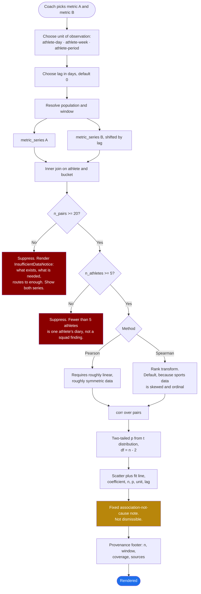

# Screen: Analytics

> **Layout status**: provisional. Awaiting client design photographs.

Screen 27 in the inventory (`02-information-architecture.md` §5). Reached from
`More → Analytics`. The whiteboard drew `Analytics ─┬─► Training ├─► Gym └─► Wellness`, three
domains. The product thesis in `00-product-overview.md` claim 3 requires a fourth thing the
drawing did not have: the join between them.

---

## Purpose

Answer questions that span more than one data source.

`00-product-overview.md` states the problem plainly: a club's data exists, but nobody can
answer a question that crosses two sources, so nobody asks it. "Is our loading pattern in the
week before a match associated with our soft-tissue injuries?" is the example given, and this
screen is where it gets asked.

Four jobs:

1. **Presets that answer the standard questions immediately.** ACWR, wellness trend,
   compliance, load distribution, nutrition check-in trend. A coach should not have to build a
   query to see an acute:chronic workload ratio.
2. **A custom builder**: pick metrics across domains, pick a population, pick a window
   defaulting to 28 days, pick a visualisation, and optionally correlate metric A against
   metric B.
3. **Cross-domain correlation done honestly.** This is the stated differentiator and it is also
   the easiest thing in the product to get catastrophically wrong. A correlation on nine data
   points looks convincing and means nothing.
4. **Save and share views** within the organisation.

**What this screen is not.** It is not reports (`reports.md`), which are formatted, scheduled
and exported. It is not a dashboard. It is exploratory, and per design principle 1 in
`00-product-overview.md`, exceptions come first and exploration is available on demand.

> `02-information-architecture.md` open question O-7 asks whether Analytics and Reports should
> merge. They should not, and this specification is the argument: Analytics is interactive,
> statistically guarded, and produces a view. Reports is scheduled, formatted, exported and
> produces a file. They share the query layer and nothing else.

---

## Roles and access

| Role | Access |
|---|---|
| Coach / S&C | Full. Presets, builder, correlation, save, share |
| Medical / Physio | Full, plus injury-domain metrics that coaches cannot use. A coach may correlate against **injury incidence** at the availability level, never against diagnosis or body area detail. See "Injury metrics and the clinical boundary" |
| Athlete | No access. `01-roles-and-permissions.md` §1 explicitly denies athletes squad-level analytics. Their own trends live in `my-data.md` |
| Admin | No access to athlete-level analytics. Aggregate compliance and usage statistics only, which live in `settings.md` |

> **AS BUILT, 2026-08-30 — the screen is on both plans; the BAR CHART is Premium.**
>
> The paragraph below (and the "Club tier" row in §Role-specific) describe a
> *partial* gate: Core gets the presets and a single-metric builder, Performance
> adds correlation, scatter, heatmap and saved views. That shape is intact. One
> line of it has moved, on the client's verbatim instruction: *"for the setting
> page move the analytics bar chart and apple health connection onto the premium
> plan side."* So the Club-tier row's "line **and bar** only" is now "line only",
> and the bar chart sits in Premium. Nothing else about the gate changed.
>
> Concretely, for a Basic (`core`) organisation: `/analytics` opens. Every metric
> in the catalogue, the athlete picker, the group filter, every timeline, the
> trend chart, the athlete table and the day-by-day table all work. Selecting
> "Bar, by athlete" — which stays choosable and is labelled `· Premium` — renders
> a locked panel in its place, naming what it is and pointing at the Table view,
> which carries the identical per-athlete numbers. The Settings plan card lists
> "Analytics · bar chart, by athlete" under Premium and "Analytics · metric
> builder, trends and table" under Basic, so the card and the real gate agree.
>
> **A route-level gate was built first and reverted.** An earlier pass read the
> same sentence as "gate `/analytics`" and rendered `PlanGate` over the whole
> screen for a `core` org. That was wider than the sentence — the Apple Health
> half of it was implemented as a plan-card move plus one Locked Settings row,
> with no route gated — and it deleted a live, shipped screen from existing
> customers, which `12-product-tiers.md` §3.3 names as the highest-regret class
> of change. **O-854 is therefore still open**, not answered: whether Club should
> lose analytics wholesale is a commercial question that needs asking on its own,
> not one to infer from an instruction about a bar chart.
>
> What Premium buys here today is narrower than this section promises, and the
> gap is deliberate, not pending: **no correlation, no scatter, no heatmap, no
> saved or shared views**, in either tier. `saved_views` does not exist in this
> schema. The shipped builder is one metric × one population × one window, drawn
> as a trend, a bar chart or a table. See `src/lib/analyticsBuilder.ts` for the
> metric catalogue and its `chartIsPremium()`, and
> `src/app/(staff)/analytics/page.tsx` for the gate.

**Tier gate.** `00-product-overview.md` sells "Limited presets" on Core and the "Full custom
builder" on Performance. Concretely: Core gets the five presets plus a single-metric,
single-domain builder with no correlation. Performance gets multi-metric, cross-domain,
correlation, scatter, heatmap and saved views. The gate is enforced server-side against
`organisations.tier`, and the UI shows the locked capability rather than hiding it.

---

## Entry points

| From | Lands on | Context carried |
|---|---|---|
| `More → Analytics` | Preset library | Group filter, period |
| `dashboard.md`, any metric card, "Explore" | Builder, that metric preselected, current window | `metric_key`, window, group filter |
| `flags.md`, a flag, "Why did this fire?" | Builder, that athlete, that metric, 28-day window, threshold line drawn | `athlete_id`, `metric_key`, `threshold_id` |
| `athlete-profile.md`, any domain tab, "Compare" | Builder, that athlete against the squad median | `athlete_id`, `metric_key` |
| `injury-dashboard.md`, "Load before injury" | ACWR preset, filtered to injured athletes, 56-day window | `athlete_ids[]` |
| `reports.md`, "Build from this report" | Builder, the report's definition loaded | `saved_view_id` |
| A shared saved view link | That view | `saved_view_id` |
| Deep link `fydr://analytics/view/<id>` | That view | `saved_view_id` |

---

## Layout

Per `06-design-system.md` §9.2, Analytics on web is "query builder 4 columns, results 8
columns, stacking below lg".

### Web, 1280 pt design target

```
┌──────────────────────────────────────────────────────────────────────────────────────────┐
│ Fydr  [Group filter: Forwards ▾]  [Period: Last 28 days ▾]                  Alex R  ▾    │
├────────────┬─────────────────────────────────────────────────────────────────────────────┤
│ Dashboard  │  Analytics                              [Presets] [Saved views (6)] [+ New] │
│ ...        │ ┌──────────────────────┬──────────────────────────────────────────────────┐│
│ More       │ │ Query                │  Sleep vs gym output                              ││
│  ▸ Analyt  │ │ ──────────────────── │  Forwards · 28 days to 5 Aug 2026                 ││
│  ▸ Reports │ │ 1 Metrics            │ ┌───────────────────────────────────────────────┐ ││
│            │ │  A [Sleep hours,     │ │  Gym volume, kg                                │ ││
│            │ │     nightly mean  ▾] │ │ 9k┤                              ·             │ ││
│            │ │  B [Gym session      │ │   │                      ·   ·  ·    ·         │ ││
│            │ │     volume        ▾] │ │ 7k┤              ·   · ·   ·· ·  ·             │ ││
│            │ │  [+ Add metric]      │ │   │        ·  · · ·· ·· ··  ·                  │ ││
│            │ │                      │ │ 5k┤    · ·  ·· ··· ·                            │ ││
│            │ │ 2 Correlate          │ │   │  ·  ··  ·                                   │ ││
│            │ │  [x] A against B     │ │ 3k┤ ·                                           │ ││
│            │ │  Method [Spearman ▾] │ │   └──────────────────────────────────────────── │ ││
│            │ │  Unit  [Athlete-week│ │     5.0   6.0   7.0   8.0   9.0  10.0           │ ││
│            │ │         ▾]           │ │     Sleep, hours per night                      │ ││
│            │ │  Lag   [ 0 days   ▾] │ │                                                 │ ││
│            │ │                      │ │  ρ = 0.41   n = 68 athlete-weeks   p = 0.001    │ ││
│            │ │ 3 Population         │ │  18 athletes · no trend line: see note          │ ││
│            │ │  (•) Group: Forwards │ └───────────────────────────────────────────────┘ ││
│            │ │  ( ) Whole squad     │  ⚠ Association, not cause. Athletes who sleep well ││
│            │ │  ( ) Selected        │    also attend more sessions. This is not evidence ││
│            │ │  [ ] Exclude         │    that sleep raises gym volume.                   ││
│            │ │      unavailable     │                                                   ││
│            │ │                      │  n = 18 athletes · 68 of 72 athlete-weeks ·       ││
│            │ │ 4 Window             │  28 days to 5 Aug 2026 · Sources: self-report 94%,││
│            │ │  [ 28 days       ▾]  │  device 6%                                        ││
│            │ │  Compare to previous │ ─────────────────────────────────────────────────  ││
│            │ │  [ ] period          │  [Save view]  [Share]  [Export ▾]  [Add to report]││
│            │ │                      │                                                   ││
│            │ │ 5 Visualisation      │                                                   ││
│            │ │  ( ) Line ( ) Bar    │                                                   ││
│            │ │  (•) Scatter         │                                                   ││
│            │ │  ( ) Heatmap         │                                                   ││
│            │ │                      │                                                   ││
│            │ │  [ Run query ]       │                                                   ││
│            │ └──────────────────────┴──────────────────────────────────────────────────┘│
└────────────┴─────────────────────────────────────────────────────────────────────────────┘
```

### The insufficient-data guard, rendered

```
┌───────────────────────────────────────────────────────────────────────────────┐
│  Sleep vs injury incidence                                                     │
│  Academy · 28 days to 5 Aug 2026                                               │
│ ┌───────────────────────────────────────────────────────────────────────────┐ │
│ │                                                                           │ │
│ │                        ⊘  Not enough data                                 │ │
│ │                                                                           │ │
│ │   A correlation needs 20 paired observations. This query has 9.            │ │
│ │                                                                           │ │
│ │   What exists:  11 athletes, 28 days, 9 athlete-weeks with both a          │ │
│ │                 sleep figure and an injury record.                         │ │
│ │   What is needed: 20 paired athlete-weeks.                                 │ │
│ │                                                                           │ │
│ │   Ways to get there:                                                       │ │
│ │     · Widen the window to 90 days           → about 29 pairs               │ │
│ │     · Change the population to Whole squad  → about 31 pairs               │ │
│ │     · Change the unit to athlete-day        → about 63 pairs, but see the  │ │
│ │       note on repeated measures                                            │ │
│ │                                                                           │ │
│ │   The underlying data is shown below. The correlation is not.              │ │
│ │                                             [Widen window] [Change scope]  │ │
│ └───────────────────────────────────────────────────────────────────────────┘ │
│  ┌── Sleep, hours per night ──────────────────────────────────────────────┐   │
│  │  ▁▃▅▆▄▃▅▆▇▆▅▄▃▄▅▆▇▆▅▅▄▃▄▅▆▆▅                                            │   │
│  └────────────────────────────────────────────────────────────────────────┘   │
│  ┌── Injury incidence, new injuries per week ─────────────────────────────┐   │
│  │  ▁▁▂▁▁▁▃▁▁▁▁▂▁▁                                                         │   │
│  └────────────────────────────────────────────────────────────────────────┘   │
│  n = 11 athletes · 28 days to 5 Aug 2026 · 9 of 44 athlete-weeks paired       │
└───────────────────────────────────────────────────────────────────────────────┘
```

The guard shows the component series and refuses the statistic. It does not show a scatter with
nine points and a caveat, per `06-design-system.md` §8.5: "suppressed statistics are suppressed,
not caveated".

### Preset library

```
┌────────────────────────────────────────────────────────────────────────────────────────┐
│ Presets                                                        [Saved views (6)]       │
├────────────────────────────────────────────────────────────────────────────────────────┤
│ ┌───────────────────────────┐ ┌───────────────────────────┐ ┌────────────────────────┐│
│ │ Acute:chronic workload    │ │ Wellness trend            │ │ Compliance             ││
│ │ 7-day load against 28-day │ │ Readiness against each    │ │ Entries submitted      ││
│ │ rolling load, per athlete │ │ athlete's own baseline    │ │ against expected, by   ││
│ │                           │ │                           │ │ athlete and domain     ││
│ │ Flags athletes above 1.5  │ │ Squad median with IQR     │ │                        ││
│ │ or below 0.8              │ │ band, outliers named      │ │ Heatmap, 28 days       ││
│ │              [Open]       │ │              [Open]       │ │              [Open]    ││
│ └───────────────────────────┘ └───────────────────────────┘ └────────────────────────┘│
│ ┌───────────────────────────┐ ┌───────────────────────────┐ ┌────────────────────────┐│
│ │ Load distribution by MD-n │ │ Sleep vs gym output       │ │ Load vs injury         ││
│ │ Where the week's load     │ │ Cross-domain              │ │ Cross-domain           ││
│ │ actually falls            │ │ Premium tier          │ │ Premium tier       ││
│ │ Grouped column, MD-6 to MD│ │              [Open]       │ │              [Open]    ││
│ │              [Open]       │ │                           │ │                        ││
│ └───────────────────────────┘ └───────────────────────────┘ └────────────────────────┘│
│ ┌───────────────────────────┐                                                          │
│ │ Nutrition check-in trend  │                                                          │
│ │ Weekly protein self-report│                                                          │
│ │ 3 levels · coarse measure │  <- resolution stated on the card, not only in the result │
│ │                           │                                                          │
│ │ Stacked column, 12 weeks  │                                                          │
│ │ Response rate 57%         │                                                          │
│ │              [Open]       │                                                          │
│ └───────────────────────────┘                                                          │
└────────────────────────────────────────────────────────────────────────────────────────┘
```

**The nutrition card states its resolution on the card.** A coach choosing between presets is
choosing between things of very different quality, and finding out that one of them is a
three-level weekly self-report only after opening it is how a weak variable gets quoted as a
strong one.

### Mobile, 390 pt

The builder is a web-first surface. Mobile gets the presets, saved views, and a reduced builder
with one metric, one population and one window. Correlation is not offered on mobile: a scatter
plot at 390 pt with a statistical guard attached is not a usable object, and the decision it
supports is not one made on a phone.

```
┌─────────────────────────────┐
│ ← Analytics          [All▾] │
├─────────────────────────────┤
│ Presets │ Saved (6)         │
│ ───────                     │
│ ┌─────────────────────────┐ │
│ │ Acute:chronic workload  │ │
│ │ 3 athletes above 1.5    │ │
│ │ ▁▂▃▅▆▅▄▃▄▅▆▇▆▅          │ │
│ └─────────────────────────┘ │
│ ┌─────────────────────────┐ │
│ │ Wellness trend          │ │
│ │ Squad median 71, ▼ 4    │ │
│ │ ▇▆▆▅▅▄▅▅▄▄▃▄▄▃          │ │
│ └─────────────────────────┘ │
│ ┌─────────────────────────┐ │
│ │ Compliance              │ │
│ │ 84% · ▲ 3 pts           │ │
│ └─────────────────────────┘ │
│ ┌─────────────────────────┐ │
│ │ Load distribution       │ │
│ │ MD-4 carries 38%        │ │
│ └─────────────────────────┘ │
├─────────────────────────────┤
│ Correlations are available  │
│ on the web dashboard.       │
└─────────────────────────────┘
```

---

## Components

| Component | Source | Purpose |
|---|---|---|
| `GroupFilter` | `06-design-system.md` §6.7 | Sets the default population. The builder's population control overrides it and says so |
| `PeriodSelector` | §6.8 | Sets the default window, overridden by the builder's window control |
| `MetricTile` | §6.2 | Preset summary figures |
| `TrendSparkline` | §6.3 | Preset cards and the component series under a suppressed correlation |
| `AthleteCard` | §6.1 | Outlier lists and population pickers |
| `EmptyState` | §6.16 | All kinds, including the `insufficientData` rendering above |
| `BottomSheet` | §6.19 | Metric picker, population picker on mobile |
| `ConfirmSheet` | §6.18 | Delete a saved view, unshare |
| `MetricPicker` | Shared with `leaderboards.md` | Domain then metric, from `metric_definitions` |
| `QueryBuilder` | New, this screen | The five-step left rail |
| `CorrelationPanel` | New, this screen | Method, unit of observation, lag, and the result with its statistics |
| `InsufficientDataNotice` | New, this screen | The guard rendering: what is missing, what exists, what is needed, and the routes to enough |
| `ChartFrame` | New, this screen | Wraps every visualisation with the title, provenance footer, table alternative and export |
| `ScatterChart`, `LineChart`, `BarChart`, `HeatmapChart` | New, `packages/ui/charts` | The four visualisations, obeying §8.1 and §8.2 |
| `SavedViewList` | New, this screen | Own and shared views with author and last-run |
| `AssociationCaution` | New, this screen | The fixed, non-dismissible note under every correlation |
| `ResolutionCaution` | New, this screen | The fixed, non-dismissible coarseness note under any result using a low-resolution metric. Currently one metric qualifies, `nutrition.protein_target_met_weekly`, and the component is driven by `metric_definitions` rather than by a hard-coded key |

---

## Data requirements

### The metric catalogue

Shared with `leaderboards.md` and `thresholds.md`. `metric_definitions.analytics_eligible`
governs availability here, and it is true for almost everything, including the wellness and body
composition metrics that are prohibited on leaderboards. **Analytics is staff-only, so the
disclosure argument that bars wellness from leaderboards does not apply.** A coach seeing the
squad's readiness distribution is the product working as designed.

Injury metrics are the exception and are covered below.

### Metrics available, by domain

| Domain | Metrics |
|---|---|
| Wellness | `sleep_hours`, `sleep_quality`, `fatigue`, `soreness`, `stress`, `mood`, `readiness_score`, `resting_hr`, `body_mass_kg` |
| Training | `rpe`, `duration_min`, `session_load`, `weekly_load`, `acute_load_7d`, `chronic_load_28d`, `acwr`, `monotony`, `strain`, `sessions_attended` |
| Gym | `total_volume_kg`, `session_rpe`, `sets_completed`, `programme_adherence_pct`, `est_1rm_by_exercise`, `sessions_completed` |
| GPS | `total_distance_m`, `high_speed_distance_m`, `sprint_distance_m`, `max_speed_ms`, `accelerations`, `decelerations`, `player_load`, `metabolic_power_avg` |
| Testing | any `test_definitions` row, aggregated as best or latest in window |
| Body composition | `body_mass_kg`, `body_fat_pct`, `lean_mass_kg`, `sum_skinfolds_mm` |
| Compliance | `wellness_pct`, `rpe_pct`, `gym_pct`, `overall_pct` |
| Availability | `days_available`, `days_modified`, `days_unavailable`, `availability_pct` |
| Injury | `new_injuries`, `injury_incidence_per_1000h`, `days_lost`, `recurrence_count` |
| Nutrition | `protein_target_met_weekly` **only**. Weekly grain, three levels, self-reported. See below |

### The nutrition variable, and exactly what it is worth

**Restored, 5 August 2026, when the client resolved O-890.** The weekly one-tap check-in is
commissioned (`nutrition-checkin.md`, schema `04-data-model.md` §17.15), so there is a nutrition
variable again. There is exactly one, and it is weak.

| Property | Value |
|---|---|
| Metric key | `nutrition.protein_target_met_weekly` |
| Label everywhere it appears | **"Protein target met, weekly self-report, 3 levels"**. Never "protein", never "nutrition" alone |
| Source | `nutrition_checkins.answer`, live rows only |
| Encoding | Ordinal: `no` = 0, `roughly` = 1, `yes` = 2. Held in `metric_definitions`, not in storage |
| Grain | **Weekly. There is no daily value and none can be derived** |
| Permitted units of observation | `athlete_week`, `athlete_period` |
| Prohibited unit | `athlete_day`, disabled in the builder with the reason stated |
| Permitted method | Spearman only. Pearson is disabled: three levels are not an interval scale |
| Provenance | 100% self-report, always, by construction. There is no device or staff path |
| Aggregations | `mean` and `latest` over a period. Never `total`, which would be meaningless |
| `analytics_eligible` | true |
| `leaderboard_eligible` | **false**, forced. See O-281 in `leaderboards.md` |
| `threshold_eligible` | **false**. A flag on a self-reported eating answer is a conversation, not an alert |

**What it can support.** A trend: the weekly distribution of Yes, Roughly and No across a squad
or a group over a season, which is a descriptive statement about answers and needs no
correlation machinery at all. And, at sufficient n, a weak association against a load, gym or
body-composition metric, subject to every guard on this screen plus the extra ones below.

**What it cannot support, stated so it does not get sold.** The Nutrition domain previously
specified here carried `protein_g`, `pct_of_target_protein` and five others, and the worked
example on this screen was a protein-against-gym-volume scatter with `compliance.nutrition_pct`
alongside it. **None of that is back.** A three-level weekly self-report cannot produce a gram
figure, cannot separate protein from energy or carbohydrate, cannot be dated to a day, and
cannot carry a "protein intake against lean mass" claim. That analysis needed per-meal logging
and per-meal logging is not coming back (O-11, `nutrition-guidance.md`).

Both halves of that are true at once. It is a real variable and it is a poor one. Anything
written about this screen that keeps only one half is wrong.

**Six structural weaknesses**, which the caveat text below is derived from:

1. **Coarse.** Three levels. Most pairs in any correlation will be tied, which attenuates
   Spearman's ρ towards zero. A weak coefficient is the expected result and a strong one should
   be treated as suspicious rather than as a finding.
2. **Self-reported, about behaviour the athlete knows a coach reads.** Social desirability bias
   pushes answers up. Direction of the bias is known; magnitude is not.
3. **Recall over seven days.** "Most days" is a judgement, not a count.
4. **Relative to a target that can move.** `nutrition_checkins.protein_target_g` snapshots the
   target so a series does not silently change meaning, and two athletes answering `yes` are
   answering about different numbers.
5. **Weekly, so n grows twelve times more slowly** than a daily metric. A 28-day window over
   20 athletes yields at most 80 pairs against 560 for a daily metric, and the 20-pair guard
   bites much sooner.
6. **Coverage is materially below 100% and always will be**, because a missed check-in is
   deliberately not non-compliance (`nutrition-checkin.md` §"Compliance"). The response rate is
   reported in the footer of every result that uses the variable.

### Extra guards that apply only to this variable

On top of every guard in §"Minimum n", which applies unchanged.

| Guard | Rule | Rendered instead |
|---|---|---|
| Grain | `athlete_day` unavailable | The unit control disables it with "This metric is weekly. There is no daily value." |
| Method | Pearson unavailable | Disabled with "Three levels are not an interval scale. Use Spearman." |
| Variation | Fewer than two distinct answer levels present in the paired data | Suppressed. "Every answer in this population and window is the same. A correlation cannot be computed." Extends edge case 5 |
| Concentration | One answer level holds more than 90% of observations | Rendered, with "94% of answers are 'Yes'. The coefficient is driven by very few contrasting observations." |
| Coverage | Response rate stated, always | "68 of 120 possible athlete-weeks answered, 57% response rate." Never omitted, never rounded up |
| Trend line | Not drawn on a scatter using this variable at any n | Points only. A fit line through three horizontal bands is a picture of a statistical artefact |
| Leaderboards, thresholds | Not offered | `leaderboard_eligible` and `threshold_eligible` are false in `metric_definitions` |

### The coarseness note

Any result that uses `nutrition.protein_target_met_weekly` carries this in addition to the
association caution in §"The association caution". It is **fixed, non-dismissible, and part of
the chart's accessible description**, for the same reason: it must survive being screenshotted
into a board meeting.

> **This is a coarse measure.** Nutrition here is one self-reported answer per athlete per week
> on a three-level scale: did you hit your protein target most days. It is not a record of what
> was eaten. It cannot separate protein from anything else, it cannot be attributed to a day,
> and it is subject to recall over a week and to athletes knowing that staff read it. Use it to
> ask a question, not to answer one.

Where the coarseness note and the association caution both apply, both render. They say
different things: one is about causation, the other is about measurement.

### Injury metrics and the clinical boundary

The product's headline claim correlates load against **injury incidence**. That requires injury
data in an analytics query used by coaches, and `01-roles-and-permissions.md` §4 says coaching
staff see what an athlete can do, never why.

The resolution:

| Available to coach | Available to medical only |
|---|---|
| `new_injuries`, count per athlete per period | `body_area` as a dimension |
| `days_lost`, from `availability` | `injury_severity` |
| `availability_pct` | `tissue_type`, `mechanism` |
| `injury_incidence_per_1000h` | Anything in `injury_clinical` |
| Recurrence as a count | Diagnosis text, ever |

Coach-facing injury metrics are computed from `injuries` and `availability`, never from
`injury_clinical`. The query layer for coach queries has no join to that table, per
`01-roles-and-permissions.md` §4: the tables are separate with distinct RLS policies precisely
so that this screen cannot leak through a careless select.

**Small-population re-identification.** An injury count of 1 in a group of 4 identifies the
injured athlete to anyone who knows the group. Analytics enforces a **minimum cell size of 5
athletes** for any injury-domain aggregate shown to a coach. Below that the cell is suppressed
with "fewer than 5 athletes, suppressed" rather than shown. This is standard statistical
disclosure control and it is not optional in a health context.

### Query: metric resolution

Every metric resolves through one dispatcher, so a metric means the same thing in analytics, on
a leaderboard, in a threshold and in a report.

```sql
create or replace function public.metric_series(
  p_metric_key  text,
  p_athlete_ids uuid[],
  p_from        date,
  p_to          date,
  p_grain       text default 'day'      -- 'day' | 'week' | 'md_offset' | 'period'
)
returns table (
  athlete_id  uuid,
  bucket      date,
  md_offset   int,
  value       numeric,
  n_records   int,
  sources     data_source[]
)
language plpgsql
stable
security invoker
as $$
begin
  -- Dispatches on p_metric_key to the correct source, applying:
  --   · org scoping through RLS on the source table
  --   · superseded_by is null on every entry table
  --   · deleted_at is null everywhere
  --   · the grain aggregation
  --   · provenance collection
  -- Materialised views are used where one covers the metric:
  --   mv_daily_athlete_summary, mv_acute_chronic_load,
  --   mv_wellness_baselines, mv_compliance_rates, mv_programme_adherence
  return query execute public.metric_sql(p_metric_key, p_grain)
    using p_athlete_ids, p_from, p_to;
end;
$$;
```

### Query: correlation

```sql
create or replace function public.compute_correlation(
  p_metric_a    text,
  p_metric_b    text,
  p_athlete_ids uuid[],
  p_from        date,
  p_to          date,
  p_unit        text,          -- 'athlete_day' | 'athlete_week' | 'athlete_period'
  p_method      text,          -- 'pearson' | 'spearman'
  p_lag_days    int default 0,
  p_min_pairs   int default 20
)
returns table (
  n_pairs        int,
  n_athletes     int,
  coefficient    numeric,
  p_value        numeric,
  method         text,
  sufficient     boolean,
  shortfall      int,
  pairs          jsonb
)
language plpgsql
stable
security invoker
as $$
declare
  v_grain text := case p_unit
                    when 'athlete_day'    then 'day'
                    when 'athlete_week'   then 'week'
                    else 'period' end;
begin
  return query
  with a as (
    select athlete_id, bucket, value
    from metric_series(p_metric_a, p_athlete_ids, p_from, p_to, v_grain)
    where value is not null
  ),
  b as (
    select athlete_id, bucket, value
    from metric_series(p_metric_b, p_athlete_ids,
                       p_from + p_lag_days, p_to + p_lag_days, v_grain)
    where value is not null
  ),
  paired as (
    select a.athlete_id, a.bucket, a.value as x, b.value as y
    from a
    join b on b.athlete_id = a.athlete_id
          and b.bucket = a.bucket + (p_lag_days || ' days')::interval
  ),
  ranked as (
    select athlete_id, bucket,
           case when p_method = 'spearman'
                then rank() over (order by x) else x end as x,
           case when p_method = 'spearman'
                then rank() over (order by y) else y end as y
    from paired
  ),
  stats as (
    select
      count(*)::int                     as n_pairs,
      count(distinct athlete_id)::int   as n_athletes,
      corr(x, y)                        as r
    from ranked
  )
  select
    s.n_pairs,
    s.n_athletes,
    case when s.n_pairs >= p_min_pairs then round(s.r, 3) end,
    case when s.n_pairs >= p_min_pairs
         then round(public.t_dist_p(
                abs(s.r) * sqrt((s.n_pairs - 2)::numeric / nullif(1 - s.r * s.r, 0)),
                s.n_pairs - 2), 4)
    end,
    p_method,
    (s.n_pairs >= p_min_pairs),
    greatest(p_min_pairs - s.n_pairs, 0),
    case when s.n_pairs >= p_min_pairs
         then (select jsonb_agg(jsonb_build_object(
                 'athlete_id', athlete_id, 'x', x, 'y', y))
               from paired)
    end
  from stats s;
end;
$$;
```

Note what the function does when there are too few pairs: it returns `n_pairs`, `sufficient =
false` and `shortfall`, and **null for the coefficient, the p-value and the point data**. The
guard is enforced in the database, not in the rendering layer. A client that forgot to check
`sufficient` still cannot draw a scatter, because it has no points.

### Writes

| Action | Write | Audit |
|---|---|---|
| Save a view | Insert `saved_views` with `view_type = 'analytics'`, `definition` as the query JSON | `analytics.save_view` |
| Update a view | Update `definition`, `updated_at` | `analytics.update_view` |
| Share a view | Update `is_shared = true` | `analytics.share_view` |
| Delete a view | Soft delete | `analytics.delete_view` |
| Run a query | No write. Optionally an `audit_log` row for injury-domain queries | `analytics.run_injury_query` |

Injury-domain analytics runs are audited even though nothing is written, because
`04-data-model.md` §13 requires an audit trail for reads that touch health data, and a coach
running a load-versus-injury correlation is reading injury data at aggregate level.

`saved_views.definition` shape:

```json
{
  "version": 1,
  "metrics": [
    { "slot": "A", "key": "wellness.sleep_hours", "aggregation": "mean" },
    { "slot": "B", "key": "gym.total_volume_kg", "aggregation": "total" }
  ],
  "correlate": { "a": "A", "b": "B", "method": "spearman",
                 "unit": "athlete_week", "lag_days": 0 },
  "population": { "type": "group", "group_id": "…", "exclude_unavailable": false },
  "window": { "type": "days", "days": 28, "compare_previous": false },
  "visualisation": "scatter",
  "options": { "show_squad_median": true, "highlight_athletes": [] }
}
```

Per `05-architecture.md` §9 rule 4, the query cache key is a stable hash of this object,
computed by `hashDefinition()` in `packages/core`.

Per `09-security-and-compliance.md` §9.5, this `jsonb` is validated against a Zod schema on
write and on read. A saved view is user-supplied JSON that becomes a query, and it is the
highest-value injection target in the product. **No part of the definition is ever interpolated
into SQL.** Metric keys are looked up in `metric_definitions`, which is a closed set;
population ids are bound parameters; the window is bound as dates; the visualisation is a
client-side choice with no query effect.

---

## The five presets

Presets are `saved_views` rows shipped with the product, `org_id`-scoped copies created on
organisation setup so a club can adapt them.

### Preset 1: Acute:chronic workload ratio

**Question**: who is loading faster than they have adapted to?

- Metric: `training.acwr`, from `mv_acute_chronic_load`.
- Definition: 7-day rolling load divided by 28-day rolling load, where load is
  `training_entries.session_load` summed per day, plus GPS `player_load` where available and
  the org has the Premium tier.
- Visualisation: line per athlete against time, with reference lines at 0.8 and 1.5, plus a
  sorted horizontal bar of today's values with the top and bottom five named.
- Window: 56 days minimum, because a 28-day chronic load needs 28 days before the first value.
- **Guard**: `mv_acute_chronic_load` suppresses ACWR entirely below 21 of 28 days of chronic
  data, per `06-design-system.md` §8.5. Suppressed, with a note, not estimated from what exists.
- **Honesty note, rendered under the chart, not dismissible**: "ACWR is a descriptive ratio.
  The evidence linking specific ACWR values to injury risk is contested, and the 0.8 to 1.5
  band is a convention rather than a validated threshold. Use it to find athletes whose load
  changed sharply, not to predict injury."

That note is unusual for a product to ship and it is correct. Selling ACWR as an injury
predictor to clubs without in-house sports science is the kind of confident nonsense that
product principle 5 exists to prevent.

### Preset 2: Wellness trend

**Question**: whose readiness has moved against their own norm?

- Metric: `wellness.readiness_score`, plus components on drill-down.
- Baseline: each athlete's own rolling mean and standard deviation from `mv_wellness_baselines`,
  matching the `personal_rolling` baseline type in `thresholds.md`.
- Visualisation: squad median line with an interquartile band, per §8.1, never a mean line
  alone. Athletes more than 1.5 SD below their own baseline are drawn as named outlier lines.
- Window: 28 days default.
- Guard: z-score suppressed below 10 prior observations for that athlete, per §8.5. The raw
  value still plots.

### Preset 3: Compliance

**Question**: who is not submitting, and in which domain?

- Metric: `compliance.*`, from `mv_compliance_rates`.
- Denominator is `compliance_expectations`, never a flat "every athlete every day", per
  `03-flows.md` §8. Waived expectations are excluded from both numerator and denominator.
- Visualisation: heatmap, athletes down, days across, one cell per athlete-day, single-hue ramp
  per §8.4. Domain selector above.
- Window: 28 days.
- Guard: an athlete with zero expectations in the window is excluded and counted in the
  footnote, never rendered as 0%.

### Preset 4: Load distribution by MD-n

**Question**: where in the week does the load actually fall, against where it was planned to?

- Metrics: `training.session_load` actual, and `sessions.planned_load`.
- Visualisation: grouped column, x axis ordered MD-6 to MD, per §8.1. Planned and actual side
  by side.
- Window: the last 4 completed match weeks, not a rolling day count, because MD-n is a weekly
  structure.
- Guard: weeks with no fixture are excluded and named in the footnote.

### Preset 5: Nutrition check-in trend

**Question**: across the squad, is the answer to the weekly protein question moving?

- Metric: `nutrition.protein_target_met_weekly`, from `nutrition_checkins`.
- Visualisation: stacked column, one column per ISO week, three segments in a fixed order
  (No, Roughly, Yes) using a single-hue ramp per §8.4, plus a separate line for the **response
  rate** on its own axis.
- Window: the last 12 completed ISO weeks, matching the pilot length.
- **This preset is descriptive and contains no statistic.** It reports what athletes answered.
  It makes no claim about anything else and needs no correlation guard, which is why it is the
  preset rather than a nutrition-against-something scatter.
- Guards: weeks with a response rate below 30% are drawn hatched and named in the footnote,
  because a week where 5 of 30 athletes answered is not a squad figure. Athletes with no
  answer are counted in the denominator and never rendered as `No`: missing is not zero, per
  §1.6, and here the difference is between "did not eat enough" and "did not answer".
- Available in **every tier**. It is a trend on one metric with no correlation, so nothing in
  the Premium gate applies to it.
- The coarseness note renders under it. The association caution does not, because there is no
  association being shown.

**Why the presets do not include a nutrition correlation.** The obvious preset is protein
self-report against gym volume, and a preset is an endorsement: it says the product thinks this
is a question worth asking by default. At 80 possible athlete-weeks per 28-day window, roughly
57% coverage, and three tied levels, the honest expectation is a suppressed result or a
coefficient near zero. Shipping that as a preset trains coaches to distrust the guard. A coach
who wants the correlation can build it, on Premium, with every caveat attached. That is **O-977**
if the client disagrees.

---

## The correlation feature, specified properly

This is the differentiator, so it gets the most specification and the most restraint.

### The pipeline



### The unit of observation

This is the control that most affects the answer and the one a coach is least likely to think
about, so the UI names it and explains it inline.

| Unit | One observation is | Typical n over 28 days, 20 athletes | Note shown |
|---|---|---|---|
| Athlete-day | One athlete, one day | up to 560 | "Days from the same athlete are not independent. A large n here overstates confidence." |
| Athlete-week | One athlete, one week | up to 80 | "Default. Smooths daily noise and reduces the repeated-measures problem." |
| Athlete-period | One athlete, whole window | up to 20 | "Each athlete contributes one point. Cleanest statistically, smallest n." |

**Athlete-week is the default.** Athlete-day inflates n dramatically, which makes the p-value
look impressive, and the observations are not independent, which makes the p-value wrong. A
product that defaults to the unit that produces the most flattering statistic is not being
honest, and the whole justification for this feature is honesty.

The repeated-measures caution on athlete-day is permanent and non-dismissible when that unit is
selected.

### Method

- **Spearman is the default.** Sports data is skewed, bounded and frequently ordinal (RPE is a
  1 to 10 scale, wellness is 1 to 5). Pearson assumes linearity and is sensitive to the
  outliers that a load-monitoring dataset is full of.
- **Pearson is available**, with the note "Assumes a straight-line relationship. Check the
  scatter before trusting it."
- **Kendall's tau is not offered.** It answers nearly the same question as Spearman and adding
  a third choice to a screen used by coaches without a statistics background is cost with no
  benefit.

### Lag

Load on Monday plausibly affects wellness on Tuesday, not on Monday. The lag control shifts
metric B forward by 0 to 14 days.

Two guards:

1. **The lag is stated in the output**, always: "ρ = 0.41, gym volume lagged 2 days behind
   sleep hours". A correlation with an unstated lag is unreproducible.
2. **No lag search.** The UI does not offer "find the best lag", and the API does not compute
   all lags and return the strongest. Scanning 15 lags and reporting the best one is
   multiple-comparison mining, and it will produce a "significant" result from noise roughly
   one time in two at p < 0.05. If a coach wants to try lags one at a time, that is their
   judgement, and the p-value shown is for the single comparison they asked for. See O-204.

### Minimum n

`06-design-system.md` §8.5 sets 20 paired observations for a correlation coefficient and 20 for
a scatter fit line. `03-flows.md` open question O-8 flags this as a placeholder awaiting sports
science judgement, and it is restated here as O-200.

Additional guards specified here:

| Guard | Minimum | Rendered instead |
|---|---|---|
| Correlation coefficient | 20 pairs | Suppressed. The notice, plus both component series |
| Scatter fit line | 20 pairs | Scatter with no line, plus "Too few points for a trend line" |
| Distinct athletes in a correlation | 5 | Suppressed. "Fewer than 5 athletes. This is one athlete's data, not a squad finding." |
| Injury-domain cell | 5 athletes | Suppressed cell. Disclosure control |
| p-value display | Same as the coefficient | Never shown without the coefficient |
| Any aggregate | Coverage stated | Always. §8.3 |

### What is always shown alongside a correlation

Non-negotiable, and rendered as part of the chart rather than as a caption that can be cropped
out of a screenshot:

1. The coefficient to 2 decimal places, with the method named: "Spearman ρ = 0.41".
2. `n`, with its unit named: "n = 68 athlete-weeks".
3. The number of distinct athletes: "18 athletes".
4. The window, as resolved dates: "28 days to 5 Aug 2026".
5. The lag, if non-zero.
6. Coverage: "68 of 72 possible athlete-weeks".
7. Provenance by source, per §8.3.
8. The association caution, below.
9. **The resolution of every metric in the pair**, where either is below daily grain or below
   an interval scale. In practice this means the nutrition metric renders as "Protein target
   met, weekly self-report, 3 levels" on the axis, in the title and in the accessible summary,
   and never as "Nutrition".
10. The coarseness note, where a low-resolution metric is in the pair.

### The association caution

A fixed, non-dismissible note under every correlation:

> **Association, not cause.** This shows that two measurements moved together in this
> population over this window. It does not show that one caused the other, and both may be
> driven by something not measured here. Athletes who sleep well also tend to attend more
> sessions, train more consistently, and be less injured, and those things are not separated
> in this figure.

Where the product can name a likely confounder for the specific metric pair, it does. A
confounder table maps common pairs to their most likely third variable: training exposure for
almost any load-versus-outcome pair, availability status for anything involving injury, and
compliance itself for any pair built from self-reported data.

**This note cannot be turned off.** A club will screenshot a correlation into a board meeting,
and the note goes with it. That is the intended behaviour.

### Simpson's paradox

Pooling athletes can reverse a relationship that holds within every athlete. The product does
one thing about it, cheaply: where the correlation is computed on `athlete_day` or
`athlete_week`, the panel also computes the **within-athlete** correlation for each athlete
with at least 10 pairs, and reports the median of those alongside the pooled figure.

```
Pooled:          ρ = 0.41   n = 68 athlete-weeks
Within athlete:  median ρ = 0.12   across 11 athletes with 10 or more weeks
```

When the two differ in sign, the panel says so plainly: "The pooled relationship runs in the
opposite direction to the typical within-athlete relationship. The pooled figure is being
driven by differences between athletes, not by changes within them." That single line is worth
more than the coefficient.

---

## States

### Default

Preset library. No query has been run. The five presets render with a live headline figure each,
from cached materialised views, so the screen is useful before anything is configured.

### Loading

Per §11.1, skeletons in the final layout. The chart area renders a skeleton at chart dimensions.
The builder is interactive during a run and the "Run query" button becomes a spinner in place,
per the rule that a spinner is only for an action the user just triggered.

Analytics runs have a 3-second p95 budget, so a progress indication is shown after 1 second
with the population and window restated: "Running: 38 athletes, 28 days".

### Empty

| Kind | Trigger | Copy | Action |
|---|---|---|---|
| `notStarted` | No saved views | "No saved views yet. Run a query and save it." | "Open a preset" |
| `noData` | Query returns nothing | "No data for readiness score between 9 July and 5 August." | "Widen the window", "Change population" |
| `noResults` | Population filter excludes everyone | "No athletes in Academy match this population." | "Clear filter" |
| `insufficientData` | Below any guard | The full notice specified above | "Widen window", "Change scope" |
| `noPermission` | Club-tier org selecting a correlation | "Cross-domain correlation is part of the Premium tier." | "See tiers" |
| `noPermission` | Coach selecting a clinical dimension | "Injury detail is visible to medical staff only. Injury counts and days lost are available." | none |

### Error

Per §11.3, at the smallest scope. A failed correlation leaves the component series rendered
with "Correlation could not be computed" in the statistic slot. A query that exceeds the 10-
second hard timeout returns "This query took too long. Narrow the window or the population."
with the specific suggestion computed from the query shape, not a generic message.

A query that would scan more than a configured row budget is rejected **before** running, with
"This query covers 60 athletes over 3 years at daily grain. Narrow it, or run it as a scheduled
report." That routes the genuinely large question to `reports.md`, which runs asynchronously.

### Offline

Presets render from cache with the offline chip and the cache timestamp. The builder is
disabled with "You are offline. Analytics runs when you reconnect." Saved views are listed from
cache and open to their last cached result with the run timestamp shown, per §11.4: never a
partial window without saying so.

### Role-specific

| Role | Difference |
|---|---|
| Coach / S&C | Full, minus clinical dimensions |
| Medical | Full, plus `body_area`, `severity`, `mechanism` and `tissue_type` as dimensions. Medical-only views are marked and cannot be shared to a coach. Sharing one attempts and is refused with an explanation |
| Club tier | Five presets, single-metric builder, ~~line and bar~~ **line only** — the bar chart moved to Premium on 2026-08-30, see the banner above §"Tier gate". Correlation, scatter, heatmap, multi-metric and saved views are visible and locked (none of them are built in either tier). The Club org **does** have this screen; only the bar view is locked, and the Table view carries the same per-athlete numbers. |
| Athlete, admin | Route not registered |

---

## Interactions

### Building a query

Five steps, in the order they constrain each other.

1. **Metrics.** Slot A required, slot B optional, up to four slots. Each slot has a domain, a
   metric and an aggregation. Metrics from different domains in different slots is the whole
   point and is not restricted.
2. **Correlate.** Available when two slots are filled. Method, unit of observation, lag.
3. **Population.** Squad, group, selected athletes. Defaults from the global group filter and
   states the inheritance: "Using the group filter: Forwards. [Change]".
4. **Window.** Days, season, custom, with "compare to previous period" producing a paired
   rendering rather than a single series.
5. **Visualisation.** Constrained by the query shape, per §8.1: a correlation offers scatter
   only, a single metric over time offers line, a single metric across athletes offers sorted
   bar, two categorical dimensions offer heatmap. Illegal combinations are disabled with the
   reason, not hidden.

**Run is explicit.** The query does not run on every control change. Analytics runs are
expensive and a coach changing four controls should pay for one query, not four. The button
shows the estimated scope: "Run: 38 athletes × 28 days".

### Reading a result

- **Point press** on a scatter names the athlete and the bucket: "S. Adeyemi, week of 21 July,
  sleep 7.8 h a night, gym volume 7,420 kg". This is the drill-down that makes a correlation
  actionable rather than decorative.
- **Athlete highlight** draws one athlete's points in `series[0]` and the rest in
  `chart.seriesMuted`, which is the standard treatment for more than five series per §8.4.
- **"View as table"** renders the underlying pairs, per §8.6, with the same formatting rules.
- **"Explain this"** opens a sheet with the metric definitions, the exact aggregation, the
  exclusions and the guard thresholds that applied. A coach quoting a number in a meeting can
  find out precisely what it counts.

### Saving and sharing

- **Save** stores the definition, not the result. Reopening re-runs against current data, so a
  saved view is a question, not an answer. The last run time is shown.
- **Share** sets `is_shared`, making it visible to every coach and medical user in the
  organisation. Sharing is org-wide, not per user: per-user sharing is an access-control surface
  and there is no requirement for it.
- **Shared views are read-only to non-authors**, with "Duplicate to edit".
- **Add to report** hands the definition to `reports.md`, which wraps it in a formatted,
  schedulable, exportable object. This is the intended path from exploration to routine.
- **Export** produces PNG or SVG of the chart, CSV of the underlying data, and always includes
  the provenance line in the exported file. A chart exported without its n and window is the
  main way a misleading figure escapes into a slide deck, so the footer is burned into the
  image.

---

## Validation rules

| Rule | Severity | Message |
|---|---|---|
| At least one metric | Block | "Pick a metric." |
| Metric is `analytics_eligible` | Block | Server-enforced from the catalogue |
| Correlation requires exactly two named slots | Block | "Pick which two metrics to correlate." |
| Correlation requires the Premium tier | Block | "Cross-domain correlation is part of the Premium tier." |
| Correlating a metric with itself | Block | "That is the same metric." |
| Lag 0 to 14 days | Block | "Lag must be between 0 and 14 days." |
| `athlete_day` unit with a weekly-grain metric | Block | "This metric is weekly. There is no daily value." |
| Pearson with a three-level ordinal metric | Block | "Three levels are not an interval scale. Use Spearman." |
| Lag on a weekly-grain metric that is not a multiple of 7 days | Block | "This metric is weekly. Lag must be 0, 7 or 14 days." |
| Window 1 to 730 days | Block | "The window must be between 1 day and 2 years." |
| Custom window `to` after `from` | Block | "The end date must be after the start date." |
| Population resolves to at least 1 athlete | Block | "No athletes in this population." |
| Estimated scan above the row budget | Block, with a suggestion | "This query covers 60 athletes over 3 years. Narrow it, or run it as a scheduled report." |
| Visualisation legal for the query shape | Block | "A heatmap needs two dimensions. This query has one." |
| Injury dimension selected by a coach | Block | "Injury detail is visible to medical staff only." |
| Saved view name 1 to 80 characters, unique per author | Block | "You already have a view called that." |
| Sharing a medical-only view | Block | "This view uses clinical dimensions and cannot be shared with coaching staff." |
| Definition JSON fails the Zod schema | Block, server-side | "This view could not be loaded." Logged with the correlation ID |

---

## Edge cases

1. **A metric with a mixed provenance.** Sleep can arrive from self-report and from HealthKit
   for the same night, per `03-flows.md` §7. The deduplication rules there decide which value
   feeds analytics: device wins for objective metrics, self-report for subjective ones. The
   footer states the split, and a query where more than 20% of values come from a non-primary
   source shows the caption prominently rather than only in the footer.
2. **An athlete with a gap in the middle of the window.** Gaps are gaps. Lines break, they are
   not interpolated, per §1.6: missing is not zero. The coverage figure in the footer counts
   them.
3. **An athlete who joined mid-window.** Included, with their partial data, and counted in
   coverage. For an `athlete_period` correlation their single point is computed over the days
   they were present, and the panel notes "3 athletes present for part of the window".
4. **Group membership changing mid-window.** `group_memberships` is history-preserving, so a
   group population resolves per bucket, not as at today. "The forwards' load in March" uses
   March's membership, which is exactly why the table is built that way.
5. **A correlation where one metric is constant.** `corr()` returns null on zero variance. The
   panel says "No variation in soreness across this population and window. A correlation cannot
   be computed." rather than showing an error.
6. **Two fixtures in one week** for an MD-n aggregation. The day carries two labels per
   `03-flows.md` §8, and the MD-n bucket uses the label recorded on `sessions.md_offset`, which
   is stored precisely so historical aggregation does not shift when a fixture moves.
7. **A postponed fixture.** Past sessions keep the `md_offset` they were executed under. An
   MD-n distribution chart is therefore stable across postponements.
8. **A correlation between two metrics with different natural grains**, for example a test
   result that occurs 4 times a season against a daily wellness score. The unit of observation
   forces both to the same bucket, and the sparse metric's aggregation determines the pairing.
   The panel warns: "CMJ height has 4 records in this window. Pairing at athlete-week gives 4
   pairs." which will then hit the guard.
9. **All athletes excluded by the population filter.** `noResults` naming the filter, per §11.2.
10. **A saved view whose metric has been retired**, for example a deleted test definition. The
    view opens with "This view uses a metric that no longer exists: 10 m sprint (deleted 4 Aug).
    [Edit view]". It does not silently substitute or fail.
11. **A saved view shared by a user who has since left the club.** Remains available, attributed
    to the former user, per soft-delete rules. Ownership can be claimed by any coach.
12. **A Club-tier organisation upgrading to Performance.** Locked capabilities unlock
    immediately. No saved views are lost, because Core cannot create them.
13. **A downgrade from Performance to Core.** Saved views are retained and open read-only with
    "Saved views are part of the Premium tier". They are not deleted, per `CLAUDE.md` rule 4
    in spirit: a club that pays again gets their work back.
14. **A correlation computed on a population of 5 athletes with 20 pairs.** Passes the pair
    guard, passes the athlete guard at exactly 5, and the panel notes "5 athletes. A finding
    from a small population." The guard is a floor, not a claim of adequacy.
15. **An injury-domain query on a group of 4.** Suppressed by disclosure control, with "Fewer
    than 5 athletes. Injury figures are suppressed to prevent identifying individuals."
16. **A nutrition correlation over 28 days.** 20 athletes at weekly grain give at most 80
    athlete-weeks, and at a 57% response rate roughly 45 of them are answered, so a pair also
    requires the other metric present. This will frequently hit the 20-pair guard, and the
    insufficient-data notice's suggested route is "widen the window to 90 days", which is the
    correct advice for a weekly metric. The guard is doing its job, not failing.
17. **Every athlete answers `yes` every week.** Zero variance. Suppressed by the variation
    guard with "Every answer in this population and window is the same." The trend preset still
    renders, because a squad that all answers `yes` is a legitimate description of the squad.
18. **A nutrition correlation where the answered weeks are not a random sample.** They are not,
    and there is no fixing it: athletes who answer are plausibly the athletes who eat well. The
    coarseness note and the response rate are the disclosure. Selection bias in a voluntary
    self-report is not solvable by a guard, only by stating it.
19. **An athlete revises a check-in after a query was run.** `nutrition_checkins` is
    immutable-with-revisions (ADR-005), the metric reads live rows only, and a saved view
    re-runs against current data. The result changes, which is correct and is why a saved view
    shows its last-run time.

---

## Performance notes

Budget from `05-architecture.md` §11: **analytics run, 40 athletes × 28 days, 3 s p95**. Hard
timeout 10 s, after which the query is cancelled and the user is told.

Rules:

1. **Materialised views carry the load.** `mv_daily_athlete_summary`, `mv_acute_chronic_load`,
   `mv_wellness_baselines`, `mv_compliance_rates`, plus `mv_programme_adherence` added by
   other screens. Per §9 of the architecture document, any
   query that scans raw entry tables for more than one athlete is a bug. Analytics is the screen
   most likely to commit it.
2. **Today is read live and unioned** onto the materialised view, so a coach analysing this
   morning's data is not looking at last night's refresh.
3. **A row budget is enforced before execution.** `athletes × days × metrics` above a configured
   ceiling (default 200,000 cells) is refused with a suggestion, not attempted.
4. **The correlation is computed in Postgres**, using `corr()` over a rank transform for
   Spearman. Shipping 560 athlete-days to the client to compute a coefficient in JavaScript is
   both slow and a disclosure surface.
5. **Only sufficient results ship point data.** When the guard fails, the function returns null
   points. The client cannot draw what it does not have.
6. **Query keys**: `qk.analytics.run(orgId, definitionHash)` per the existing factory, plus
   `qk.analytics.presets(orgId, groupIds)` and `qk.analytics.savedViews(orgId)`.
7. **Freshness**: analytics runs `staleTime` 15 min, `gcTime` 30 min, no refetch on focus, per
   the architecture table. A coach re-runs deliberately.
8. **Presets are prefetched** on entering the More tab, because they are the default view and
   their materialised-view reads are cheap.
9. **`refresh_views_after_import`** runs after a GPS import so a coach importing Saturday's data
   can analyse it immediately rather than waiting for the nightly job.
10. **Charts render at most 2,000 points.** Above that, points are binned and the binning is
    stated: "3,410 points, shown as 40 by 40 bins". Silently dropping points from a scatter is a
    correctness bug, not a performance optimisation.

---

## Accessibility

1. **Every chart has a one-sentence summary label** per §8.6: "Scatter plot. Sleep hours per
   night against gym session volume, 68 athlete-weeks across 18 athletes, 28 days to 5
   August. Spearman rho 0.41."
2. **Every chart has a table alternative**, reachable from "View as table" on web and a
   long-press on mobile, using the same formatting rules as §5.
3. **The insufficient-data notice is the primary content** when the guard fires, not an overlay,
   and it is announced as such. A screen reader user must not be told there is a chart when
   there is not.
4. **The association caution is part of the chart's accessible description**, so it is read with
   the result rather than skipped as decoration. **The coarseness note is too**, where it
   applies, and it is read before the coefficient rather than after it: a screen reader user
   should learn that the measure is three-level self-report before they learn what ρ is.
5. **Data points on web are focusable** with arrow-key traversal and a live region announcing
   each point, per §8.6 item 3.
6. **The builder is a form** with a fieldset per step, a legend per fieldset, and
   `aria-describedby` carrying the inline explanation of each control. The unit-of-observation
   explanation is part of the control's description, not a tooltip.
7. **Statistical output is text first.** The coefficient, n, p and window are rendered as text
   adjacent to the chart, not only inside it, so they survive any rendering path.
8. **No information by colour alone**, per §8.4. Series carry dash patterns and marker shapes.
9. **Dynamic type** to 200%. Charts scale; below a minimum legible size the chart is replaced by
   its table alternative rather than rendered unreadably.
10. **Reduced motion**: no draw-in animation, no transition on re-run.
11. **Focus is moved to the result region** when a query completes, with a polite announcement:
    "Query complete. Scatter plot, 68 athlete-weeks."

---

## Open questions

- **O-200**: Restates `03-flows.md` O-8. The minimum n for a correlation is set at 20 paired
  observations and 5 distinct athletes. Both need a sports science judgement. 20 pairs of
  athlete-weeks from 5 athletes is a very different object from 20 pairs of athlete-periods from
  20 athletes, and one threshold may not serve both.
- **O-201**: Should the within-athlete median correlation be shown always, or only when it
  differs materially from the pooled figure? Always is more honest and adds a number that most
  users will not understand. I have specified always, with the plain-English note when the signs
  disagree.
- **O-202**: Is the ACWR honesty note acceptable to ship? It tells a paying customer that a
  headline feature is contested. I believe it is necessary and it is also a commercial decision
  rather than a technical one.
- **O-203**: Should analytics be able to correlate against injury at all for coaches, given the
  re-identification risk in a 25-athlete squad? I have specified aggregate injury counts with a
  minimum cell size of 5. The stricter alternative is that injury correlation is medical-only,
  which weakens the product's headline claim considerably.
- **O-204**: Lag search is deliberately not offered, to avoid multiple-comparison mining. A
  coach will ask for it. The defensible version applies a correction across the lags tested and
  states it, which is more machinery and more explanation. Confirm the simple refusal is right.
- **O-205**: Should p-values be shown at all to an audience without a statistics background?
  The argument against is that "p = 0.001" will be read as importance rather than as evidence
  against a null hypothesis. The argument for is that omitting it while showing a coefficient is
  worse. I have specified showing it, with the coefficient, n and method always adjacent.
- **O-206**: What row budget should refuse a query outright? 200,000 cells is a guess. It needs
  measuring against real Supabase instance sizes once a pilot club has a season of data.
- **O-207**: Should saved views support parameters, so one view can be re-run for a different
  group without duplicating it? Useful, and it turns a saved view into a small programme with the
  validation surface that implies.
- **O-208**: Should Analytics and Reports merge, per `02-information-architecture.md` O-7? This
  specification argues no. If the answer is yes, this screen becomes the interactive mode of a
  single destination and `reports.md` becomes its scheduling and export tab.
- **O-977**: Should a nutrition correlation ship as a preset? I have specified no, and preset 5
  is a descriptive trend instead. A preset is an endorsement, and endorsing a query that will
  usually be suppressed teaches coaches to distrust the guard. Confirm, because a coach will ask
  why there is a nutrition axis and no nutrition correlation on the preset shelf.
- **O-978**: The 20-pair minimum was set for daily and weekly metrics generally. A weekly
  three-level metric reaches 20 pairs while carrying far less information than 20 pairs of a
  continuous daily metric, so the same floor is a weaker guarantee here. Should low-resolution
  metrics carry a higher floor, 40 pairs rather than 20? This is the same sports science
  judgement as O-200 and it should be answered with it.
- **O-979**: Should `nutrition.protein_target_met_weekly` be available in `reports.md` and in
  scheduled exports at all? The coarseness note travels with a chart on this screen. A CSV
  column headed `protein_target_met_weekly` in a spreadsheet has nothing attached to it, and a
  club's own analyst will do exactly what this screen refuses to. My recommendation is that the
  export carries the resolution in the column header and a caveat row in the file metadata, per
  the provenance rule in §8.3.
