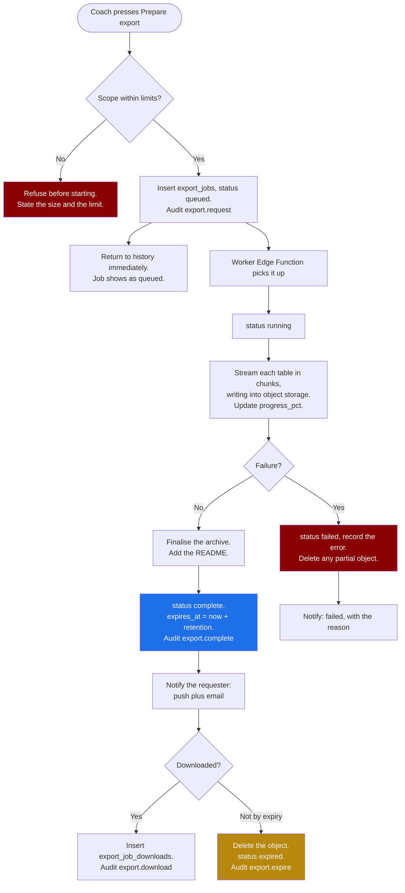

# Screen: Exports

> **Layout status**: provisional. Awaiting client design photographs.

Screen 31 in the inventory (`02-information-architecture.md` §5). Reached from
`More → Settings → Exports` for staff and from `Me → Export my data` for athletes. The
whiteboard drew `Settings ─► Exports`.

---

## Purpose

Get data out of Fydr, as rows, with a record of who took what.

Four jobs:

1. **Scoped bulk export** for staff: pick what, pick who, pick when, pick a format, get a file.
2. **The athlete data export**, which is a legal obligation rather than a feature. Article 20
   portability for the athlete themselves, and the Article 15 subject access pack that an admin
   generates on request.
3. **Asynchronous generation with notification**, because a season of set-level gym logs for 40
   athletes is not a file that renders while somebody waits.
4. **Audit every export**, without exception. `04-data-model.md` §13 lists exports among the
   mandatory audit events, and an export is the single most likely route for athlete data to
   leave the club's control.

**What this screen is not.** It is not `reports.md`, which produces formatted documents for
human readers on a schedule. An export is rows for a spreadsheet, a migration, or a lawyer. It
has no charts, no narrative, and no page layout.

The tier gate from `00-product-overview.md`: Core gets CSV, Performance gets CSV and API. The
API is out of scope for v1 and the row on the tier table is a commitment, not a shipped feature.
This screen is the CSV, XLSX and JSON path.

---

## Roles and access

| Role | Access |
|---|---|
| Athlete | Own data only. The portability export. One-tap, no configuration beyond format |
| Coach / S&C | Squad-wide export across every domain they can read. No clinical detail |
| Medical / Physio | Same, plus clinical injury detail. Medical exports are separately marked and separately audited |
| Admin | Organisation-wide export, plus the subject access pack, plus the erasure process. **Not** athlete-level performance detail by default, per `01-roles-and-permissions.md` §1 |

Per the permission matrix, "Export data" is `S` for athlete, `Y` for coach and medical, `Y` for
admin. The admin `Y` is organisation-wide data, and the deliberate friction described in
`01-roles-and-permissions.md` §1 applies: an admin who wants athlete performance detail must
also hold the coach role. That means an admin's export scope options are structurally different
from a coach's, not a filtered version of them.

---

## Entry points

| From | Lands on | Context carried |
|---|---|---|
| `settings.md → Exports` | Export builder, staff variant | Group filter, period |
| `Me → Export my data` (athlete) | Athlete export, one screen | None |
| `athlete-profile.md`, "Export this athlete" | Builder, scoped to that athlete | `athlete_id` |
| `athlete-profile.md`, "Generate subject access pack" (admin) | SAR flow | `athlete_id` |
| `athlete-profile.md`, "Process erasure request" (admin) | Erasure decision screen, specified in `09-security-and-compliance.md` §6 | `athlete_id` |
| `analytics.md`, "Export data" on a view | Builder, that view's population and window prefilled | `saved_view_id` |
| `reports.md`, "Use Exports for a raw extract" | Builder, that report's scope prefilled | scope |
| `testing.md`, a session, "Export" | Builder, testing domain, that session | `session_id` |
| Notification "Your export is ready" | Export history, that job, download available | `export_job_id` |
| Deep link `fydr://exports` | Builder | None |

---

## Layout

### Athlete, mobile, 390 pt

One screen, no configuration, because Article 20 says withdrawal and access must be easy and a
form with eight checkboxes is not easy.

```
┌─────────────────────────────┐
│ ← Export my data            │
├─────────────────────────────┤
│ You can take a copy of      │
│ everything you have put     │
│ into Fydr.                  │
│                             │
│ What is included            │
│  · Wellness entries         │
│  · Nutrition targets        │
│  · Training RPE entries     │
│  · Gym sessions and sets    │
│  · Your profile details     │
│  · Health app data you      │
│    chose to sync            │
│                             │
│ What is not included        │
│  · Scores Fydr worked out   │
│    from your entries        │
│  · Notes staff wrote        │
│  · Test results staff       │
│    recorded                 │
│  · Decisions about your     │
│    availability             │
│  ⓘ You have a right to see  │
│    these too. Ask your club │
│    for a full copy, and     │
│    they must provide it     │
│    within one month.        │
│              [ Learn more ] │
│                             │
│ Format   (•) CSV and JSON   │
│                             │
│ ┌─────────────────────────┐ │
│ │   Prepare my export     │ │
│ └─────────────────────────┘ │
│                             │
│ We will let you know when   │
│ it is ready. It usually     │
│ takes under a minute.       │
├─────────────────────────────┤
│ Previous exports            │
│  1 Jul 2026 · 2.1 MB        │
│  expired                    │
└─────────────────────────────┘
```

The "what is not included" section is unusual and it is required. Portability under Article 20
covers data the athlete provided, not data derived or observed, per the table in
`09-security-and-compliance.md` §6. An athlete who exports their data and finds no test results
will reasonably conclude the club is hiding something. Naming the gap, and naming the route to
closing it, is the honest version.

### Staff, web, 1280 pt

```
┌──────────────────────────────────────────────────────────────────────────────────────────┐
│ Fydr  [Group filter: All squad ▾]                                           Alex R  ▾    │
├────────────┬─────────────────────────────────────────────────────────────────────────────┤
│ ← Settings │  Exports                                                                    │
│            │  ┌────────────────────────────┬──────────────────────────────────────────┐ │
│  Account   │  │ New export                 │  History                                  │ │
│  Threshold │  │ ────────────────────────── │  ───────────────────────────────────────  │ │
│  Org       │  │ 1 What to include          │  ⟳ Season gym logs                        │ │
│  Exports ● │  │  [x] Wellness entries      │    running · 62% · started 14:02          │ │
│  About     │  │  [x] Nutrition targets     │                                           │ │
│            │  │  [x] Training RPE          │  ✓ Wellness Jul 2026                      │ │
│            │  │  [x] Gym session logs      │    4 Aug 09:12 · CSV · 840 KB             │ │
│            │  │  [x] Gym set logs          │    expires in 6 days      [Download]      │ │
│            │  │  [ ] GPS records           │                                           │ │
│            │  │  [x] Test results          │  ✓ Squad testing 13 Aug                   │ │
│            │  │  [ ] Body composition      │    13 Aug 17:40 · XLSX · 210 KB           │ │
│            │  │  [x] Attendance            │    expires in 8 days      [Download]      │ │
│            │  │  [x] Availability          │                                           │ │
│            │  │  [ ] Injury detail    🔒   │  ✗ Season GPS export                      │ │
│            │  │  [x] Programmes            │    2 Aug 11:20 · failed                   │ │
│            │  │  [x] Compliance            │    Too large. Narrow the period.          │ │
│            │  │  [ ] Flags                 │                        [Retry] [Details]  │ │
│            │  │  [ ] Audit log        🔒   │                                           │ │
│            │  │                            │  ⊘ Squad wellness season                  │ │
│            │  │ 2 Who                      │    1 Jul 08:00 · expired                  │ │
│            │  │  (•) Whole squad           │                       [Regenerate]        │ │
│            │  │  ( ) Group [ ▾ ]           │                                           │ │
│            │  │  ( ) Selected athletes     │                                           │ │
│            │  │  [ ] Include athletes who  │                                           │ │
│            │  │      have left             │                                           │ │
│            │  │                            │                                           │ │
│            │  │ 3 When                     │                                           │ │
│            │  │  ( ) Last 28 days          │                                           │ │
│            │  │  (•) This season           │                                           │ │
│            │  │  ( ) All time              │                                           │ │
│            │  │  ( ) Custom                │                                           │ │
│            │  │                            │                                           │ │
│            │  │ 4 Format                   │                                           │ │
│            │  │  (•) CSV, one file per     │                                           │ │
│            │  │      table, zipped         │                                           │ │
│            │  │  ( ) XLSX, one sheet per   │                                           │ │
│            │  │      table                 │                                           │ │
│            │  │  ( ) JSON, nested          │                                           │ │
│            │  │  [x] Include a README      │                                           │ │
│            │  │                            │                                           │ │
│            │  │ ── Scope ────────────────  │                                           │ │
│            │  │ 38 athletes · 1 Jul 2026   │                                           │ │
│            │  │ to 5 Aug 2026 · 9 tables   │                                           │ │
│            │  │ ~ 214,000 rows · ~ 18 MB   │                                           │ │
│            │  │                            │                                           │ │
│            │  │ ⚠ This export contains     │                                           │ │
│            │  │   personal data about 38   │                                           │ │
│            │  │   athletes. It will be     │                                           │ │
│            │  │   recorded in the audit    │                                           │ │
│            │  │   log against your name.   │                                           │ │
│            │  │                            │                                           │ │
│            │  │  [   Prepare export   ]    │                                           │ │
│            │  └────────────────────────────┴──────────────────────────────────────────┘ │
└────────────┴─────────────────────────────────────────────────────────────────────────────┘
```

### Admin, subject access pack

```
┌────────────────────────────────────────────────────────────────────────────────────────┐
│ Subject access pack: Sione Adeyemi                                                     │
│ Article 15, UK GDPR. Due within one month of the request.                              │
├────────────────────────────────────────────────────────────────────────────────────────┤
│ Request received   [ 28 Jul 2026 ]        Due [ 28 Aug 2026 ]   24 days remaining      │
│                                                                                        │
│ What the pack will contain                                                             │
│  Every row referencing this athlete, across every table:                               │
│   · Wellness 214 rows      · Nutrition targets 12   · Training RPE 141 rows            │
│   · Gym sessions 68        · Gym sets 1,204         · Test results 42                  │
│   · Body composition 6     · Attendance 174         · Availability 11                  │
│   · Injuries 3             · Flags 14               · Programme overrides 4            │
│   · Audit entries about them 312                    · Notifications sent 88            │
│   · Clinical notes 9       ⚠ requires medical review                                   │
│                                                                                        │
│  Plus the Article 15 information: purposes, categories, recipients, retention          │
│  periods, source of the data, and the athlete's other rights.                          │
│                                                                                        │
│ ⚠ Clinical notes                                                                       │
│  9 clinical notes reference this athlete. They are included by default: the athlete    │
│  has a statutory right to them.                                                        │
│                                                                                        │
│  A clinician may withhold a specific note where disclosure would be likely to cause    │
│  serious harm to the athlete or another person (DPA 2018 Sch 3 Pt 2). That requires    │
│  a positive decision by a health professional, recorded with a reason.                 │
│                                                                                        │
│  Sent to Dr Nia Hughes for review on 28 Jul. Status: 8 approved, 1 withheld.           │
│                                              [View review]  [Chase]                    │
│                                                                                        │
│ Identity verified   [x] Confirmed by Jo Patel on 28 Jul                                │
│                                                                                        │
│                                              [Cancel]  [Generate pack]                 │
└────────────────────────────────────────────────────────────────────────────────────────┘
```

### Mobile, staff, 390 pt

The builder is a stepped form, one step per screen, with the scope summary pinned. History is a
list. Downloads on mobile open in the OS share sheet rather than into an app sandbox, because a
CSV on a phone is only useful if it can be sent somewhere.

---

## Components

| Component | Source | Purpose |
|---|---|---|
| `GroupFilter` | `06-design-system.md` §6.7 | Prefills the population step. The builder's own control overrides it and says so |
| `PeriodSelector` | §6.8 | Prefills the period step |
| `AthleteCard` | §6.1 | Selected-athlete picker |
| `EmptyState` | §6.16 | `notStarted`, `noData`, `noPermission` |
| `ConfirmSheet` | §6.18 | Confirm a large export, confirm a medical export, delete a file early |
| `BottomSheet` | §6.19 | Format picker, athlete picker on mobile |
| `SyncStatusIndicator` | §6.17 | Not used. Export progress is its own indicator, driven by job state, not by the sync queue |
| `ExportBuilder` | New, this screen | The four-step form |
| `ScopeSummary` | New, this screen | Live row and size estimate with the personal-data warning |
| `ExportJobRow` | New, this screen | One job: state, progress, size, expiry, actions |
| `ContentSelector` | New, this screen | The table checklist with role locks and dependency hints |
| `SarPackBuilder` | New, this screen | The Article 15 flow with the clinical review gate |
| `ClinicalReviewPanel` | New, this screen | Medical-only: approve or withhold each clinical note with a reason |
| `AthleteExportCard` | New, this screen | The athlete's single-screen export with its included and excluded lists |

---

## Data requirements

### Schema additions required

`report_runs` is not the right table for this. A report run is a formatted document; an export
job is a long-running task with progress, scope, retention and an audit obligation.

```sql
create table export_jobs (
  id             uuid primary key default gen_random_uuid(),
  org_id         uuid not null references organisations(id),
  requested_by   uuid not null references users(id),
  export_type    text not null,      -- 'staff_scoped' | 'athlete_portability'
                                     -- | 'sar_pack' | 'org_full' | 'erasure_record'
  scope          jsonb not null,     -- tables, population, period, options
  subject_athlete_id uuid references athletes(id),   -- SAR and portability
  format         text not null,      -- 'csv' | 'xlsx' | 'json'
  status         text not null default 'queued',
                                     -- queued|running|complete|failed|expired|cancelled
  progress_pct   int not null default 0,
  row_count      bigint,
  byte_size      bigint,
  file_path      text,               -- storage object key, never a public URL
  error          text,
  contains_clinical boolean not null default false,
  clinical_review_status text,       -- null|pending|complete
  started_at     timestamptz,
  completed_at   timestamptz,
  expires_at     timestamptz,
  downloaded_at  timestamptz,
  download_count int not null default 0,
  created_at     timestamptz not null default now()
);

create table export_job_downloads (
  id            uuid primary key default gen_random_uuid(),
  org_id        uuid not null references organisations(id),
  export_job_id uuid not null references export_jobs(id) on delete cascade,
  downloaded_by uuid not null references users(id),
  ip_address    inet,
  user_agent    text,
  downloaded_at timestamptz not null default now()
);

create table sar_clinical_reviews (
  id            uuid primary key default gen_random_uuid(),
  org_id        uuid not null references organisations(id),
  export_job_id uuid not null references export_jobs(id) on delete cascade,
  injury_id     uuid not null references injuries(id),
  decision      text not null,        -- 'include' | 'withhold'
  reason        text,                 -- required when withholding
  reviewed_by   uuid not null references users(id),
  reviewed_at   timestamptz not null default now()
);

create index on export_jobs (org_id, created_at desc);
create index on export_jobs (status) where status in ('queued','running');
create index on export_jobs (subject_athlete_id, created_at desc);
create index on export_jobs (expires_at) where status = 'complete';
```

Also required: `organisations.settings.exports` with `file_retention_days` (default 7) and
`max_export_rows` (default 5,000,000).

### Exportable content, by role

| Content | Source tables | Athlete | Coach | Medical | Admin |
|---|---|:--:|:--:|:--:|:--:|
| Profile | `athletes`, `users` | Own | Yes | Yes | Yes |
| Wellness entries | `wellness_entries` | Own | Yes | Yes | no |
| ~~Nutrition entries~~ | `nutrition_entries` | **Not exportable.** The table is dormant and holds no rows, because athletes do not log nutrition (`nutrition-guidance.md`). It is listed struck through so nobody re-adds it, and so a subject access pack that finds rows in it is treated as a defect rather than as data. | | | |
| Nutrition targets | `nutrition_targets` | Own, resolved | Yes | Yes | no |
| Training RPE | `training_entries` | Own | Yes | Yes | no |
| Gym session logs | `gym_session_logs` | Own | Yes | Yes | no |
| Gym set logs | `gym_set_logs` | Own | Yes | Yes | no |
| GPS records | `gps_records` | Own | Yes | Yes | no |
| Device metrics | `device_metrics` | Own | Yes | Yes | no |
| Test results | `test_results` | Own, SAR only | Yes | Yes | no |
| Body composition | `body_composition` | Own, SAR only | Yes | Yes | no |
| Attendance | `session_attendance` | Own | Yes | Yes | no |
| Sessions and fixtures | `sessions`, `fixtures` | no | Yes | Yes | Yes |
| Availability | `availability` | Own, SAR only | Yes | Yes | Aggregate |
| Injuries, non-clinical | `injuries` | Own, SAR only | Yes | Yes | Aggregate |
| Injury clinical detail | `injury_clinical` | SAR only, reviewed | **no** | Yes | no |
| Programmes and overrides | `programmes`, `programme_*`, `exercise_overrides` | Own, resolved | Yes | Yes | no |
| Compliance | `compliance_expectations` | Own | Yes | Yes | Aggregate |
| Flags | `flags`, `flag_actions` | Own, SAR only | Yes | Yes | no |
| Thresholds | `thresholds` | no | Yes | Yes | Yes |
| Groups | `groups`, `group_memberships` | Own | Yes | Yes | Yes |
| Users and roles | `users`, `user_roles` | no | no | no | Yes |
| Audit log | `audit_log` | Own, SAR only | no | no | Yes |
| Notification history | `notification_deliveries` | Own, SAR only | no | no | Aggregate |

The coach row for clinical detail is the one that matters. It is not a checkbox a coach can
tick. It is not in their content list at all, and the underlying query has no join to
`injury_clinical`, per `01-roles-and-permissions.md` §4.

### Query: scope estimate

Run live as the builder's selections change, so the coach sees the size before committing.

```sql
create or replace function public.estimate_export(
  p_tables      text[],
  p_athlete_ids uuid[],
  p_from        date,
  p_to          date
)
returns table (table_name text, row_count bigint, est_bytes bigint)
language plpgsql
stable
security invoker
as $$
begin
  -- Counts per selected table, RLS-scoped, with an average row width per table
  -- taken from pg_stats. Estimates only, labelled as such in the UI.
  return query
  select t.name, t.n, (t.n * t.avg_width)::bigint
  from public.export_table_counts(p_tables, p_athlete_ids, p_from, p_to) t;
end;
$$;
```

### Query: the athlete portability set

The narrower of the two athlete-facing exports. Only data the athlete provided.

```sql
-- One statement per table, streamed to file. Wellness shown as the pattern.
select
  w.entry_date,
  w.sleep_hours, w.sleep_quality, w.fatigue, w.soreness, w.soreness_areas,
  w.stress, w.mood, w.resting_hr, w.body_mass_kg, w.comment,
  w.source, w.submitted_at,
  case when w.revision_of is not null then 'correction' else 'original' end as revision,
  case when w.superseded_by is not null then true else false end as superseded
from wellness_entries w
where w.org_id = auth_org_id()
  and w.athlete_id = auth_athlete_id()
order by w.entry_date, w.submitted_at;
```

`readiness_score` is **not** in the select list. It is derived, which puts it outside Article 20
portability and inside Article 15 access, per the table in `09-security-and-compliance.md` §6.
The two manifests differ by exactly this kind of column, which is why the security document
specifies one export engine with two manifests rather than two engines.

Revisions are included, both the superseded and the current row, because the athlete provided
both and the correction history is theirs.

### The SAR pack manifest

Everything referencing the athlete, in every table, plus the Article 15 information. The
difference from portability:

| In the SAR pack, not in portability | Why |
|---|---|
| `readiness_score` and every derived value | Derived, not provided |
| `flags` and `flag_actions` | Observed and inferred about them |
| `test_results`, `body_composition` | Recorded by staff |
| `availability`, `injuries` | Decisions made about them |
| `exercise_overrides` with reasons | Staff notes about them |
| `audit_log` rows referencing them | Processing records about them |
| `notification_deliveries` to them | Processing records |
| `injury_clinical` including notes | Health data about them, subject to clinical review |
| Article 15 metadata document | Purposes, categories, recipients, retention, source, rights |

### Writes

| Action | Write | Audit action |
|---|---|---|
| Queue an export | Insert `export_jobs` | `export.request` |
| Generation starts | Update `status`, `started_at` | none |
| Progress | Update `progress_pct` | none |
| Completes | Update `status`, `file_path`, `row_count`, `byte_size`, `expires_at` | `export.complete` |
| Download | Insert `export_job_downloads`, update `downloaded_at`, `download_count` | `export.download` |
| Cancel | Update `status = 'cancelled'` | `export.cancel` |
| Expire | Job deletes the object, updates `status = 'expired'` | `export.expire` |
| SAR request | Insert `export_jobs` with `export_type = 'sar_pack'` | `sar.request` |
| Clinical review decision | Insert `sar_clinical_reviews` | `sar.clinical_review` |
| SAR pack released | Update, plus a release record | `sar.release` |

Every `audit_log` row for an export carries, in `metadata`: the tables, the population size, the
period, the format, the row count, and the athlete ids where the population is small enough that
naming them is meaningful. The athlete-level `audit_log.athlete_id` is set for athlete-scoped
exports so a future SAR can answer "who exported my data".

---

## States

### Default

Staff: the builder with the group filter and period prefilled, history alongside.
Athlete: the single export screen.

### Loading

The builder is interactive immediately. The scope estimate loads in and shows "estimating..."
rather than a zero, because a "0 rows" estimate that becomes 214,000 would lead a coach to
commit to something they did not intend.

History renders from cache. Running jobs poll for progress every 3 seconds while the screen is
focused and stop polling when it is not.

### Empty

| Kind | Trigger | Copy | Action |
|---|---|---|---|
| `notStarted` | No exports ever | "No exports yet." | none |
| `noData` | Scope resolves to zero rows | "No data matches this scope. 38 athletes, 1 to 5 July, gym set logs: nothing recorded." | "Widen the period" |
| `noResults` | Population filter excludes everyone | "No athletes in Academy." | "Clear filter" |
| `noPermission` | Athlete deep-linking the staff builder | "This is available to staff. You can export your own data from Me." | "Export my data" |
| `noData` | Athlete with no entries yet | "You have not submitted anything yet, so there is nothing to export." | none |

### Error

Per §11.3. Failures are specific, because "export failed" is useless:

| Failure | Message |
|---|---|
| Too large | "This export is about 2.1 GB, above the 500 MB limit. Narrow the period or the tables." |
| Timeout | "Generation took too long and was stopped. Try a shorter period." |
| Storage failure | "Could not save the file. Nothing was exported. Try again." |
| Permission changed mid-job | "Your access changed while this was running. Nothing was exported." |
| Partial data | Never. A partial export is a failed export. A CSV missing a month with no indication is worse than no CSV |

A failed job stays in history with its error and a retry, so a coach can see what happened
rather than wondering whether they imagined requesting it.

### Offline

History renders from cache. Already-downloaded files remain readable. Requesting an export is
disabled with "You are offline. Exports are prepared on the server." The athlete export screen
states the same. Queuing an export request offline is not offered: the file cannot be produced,
and a queued request that silently fires two days later when the athlete has forgotten about it
is worse than an honest refusal.

### Role-specific

| Role | Difference |
|---|---|
| Athlete | One screen, no builder, portability manifest, format fixed to CSV plus JSON |
| Coach | Full builder minus clinical detail and audit log |
| Medical | Full builder including clinical detail. Selecting it changes the confirmation, the file naming and the audit action |
| Admin | Organisation content: users, roles, groups, sessions, fixtures, thresholds, audit log, aggregate compliance. No athlete performance detail. Plus the SAR and erasure flows, which no other role has |

---

## Interactions

### Building an export

Four steps.

**1. What to include.** A checklist of tables, grouped by domain, with role locks shown rather
than hidden. Dependencies are stated: selecting gym set logs without gym session logs produces
rows that cannot be interpreted, so the UI says "Gym set logs reference gym sessions. Include
those too?" and offers to add them.

**2. Who.** Whole squad, a group, or selected athletes. "Include athletes who have left" is off
by default and, when turned on, warns: "Former athletes' data is subject to your retention
policy. 6 athletes left in this period."

**3. When.** Last 28 days, this season, all time, custom. "All time" shows the estimate
prominently, because it is the option that produces the failures.

**4. Format.**

| Format | Shape | Best for |
|---|---|---|
| CSV | One file per table, zipped, UTF-8 with BOM, RFC 4180 quoting, ISO 8601 dates | Spreadsheets, R, Python |
| XLSX | One workbook, one sheet per table, headers frozen, no merged cells in data | Reading in Excel |
| JSON | Nested by athlete, one document, newline-delimited above 100 MB | Migration to another system |

**The README is on by default** and is the difference between a usable export and a folder of
mystery columns. It contains: the scope as requested, the resolved date range, the row count per
file, a data dictionary for every column with its unit, the canonical units statement from
`04-data-model.md` §1, the scale-direction warning for wellness (5 is best, including for
soreness), the provenance value meanings, the note that superseded revisions are included and
how to filter them, and the generation timestamp with the generating user.

The scale-direction line in the README is not optional. `04-data-model.md` §5 identifies it as
the single most likely source of an inverted-chart bug, and an analyst opening a CSV outside
Fydr has none of the UI labelling that prevents it.

### The scope summary and the warning

Live, above the submit button:

```
38 athletes · 1 Jul 2026 to 5 Aug 2026 · 9 tables
~ 214,000 rows · ~ 18 MB

⚠ This export contains personal data about 38 athletes. It will be
  recorded in the audit log against your name.
```

The warning is permanent and non-dismissible. It is not a scare tactic: a coach exporting a
season of squad wellness data is creating an unmanaged copy of health data about 38 people, and
a one-line reminder that it is attributable is the cheapest control available.

### Generation and notification



Key behaviours:

1. **The user is not held on a spinner.** Pressing Prepare returns them to history with a queued
   job. Per `08-notifications.md` §4.5, the completion notification is the same pattern as
   import completion.
2. **Progress is real**, computed from rows written against rows estimated, not a fake
   indeterminate bar.
3. **Chunked streaming**, so no single Edge Function invocation holds a full season in memory
   and none approaches the function timeout.
4. **Failure deletes the partial object.** A half-written archive in storage is a data leak with
   no owner.
5. **Files expire**, default 7 days, configurable per organisation to a maximum of 30. Shorter
   than the report retention default because an export is raw personal data rather than a
   formatted summary. Expiry deletes the object and keeps the job row, so the audit trail
   survives the file.
6. **Download URLs are signed and short-lived**, per `09-security-and-compliance.md` §8.3, and
   are generated per download request rather than stored on the job. A permanent URL in a
   database row is a permanent leak.
7. **Every download is recorded**, not only the first. A file downloaded eleven times is a
   different fact from one downloaded once.

### The athlete export

One button. No scope, no population, no date range. Format is CSV plus JSON in one archive,
because an athlete does not know which they want and giving both costs nothing.

Rate-limited to one export per athlete per 24 hours, per `09-security-and-compliance.md` §9.4,
which is generous for a genuine right and tight enough to prevent it being used as a
denial-of-service against the worker.

Notification when ready is push plus email, and the email contains a link, never an attachment.

### The subject access pack

Admin-initiated, per `09-security-and-compliance.md` §6. It differs from every other export in
four ways:

1. **It is everything**, across every table, including derived values, staff notes, flags, audit
   entries and notifications sent.
2. **It carries the Article 15 metadata document**: purposes of processing, categories of
   personal data, recipients, retention periods, source of the data, and the existence of the
   other rights, in plain English.
3. **It routes through medical review** when clinical notes exist. Notes are included by
   default; a clinician may withhold a specific note under the DPA 2018 Schedule 3 Part 2
   serious-harm test, recorded with a reason. The pack cannot be released while review is
   pending. Withholding is the exception and requires a positive act by a clinician. It is not
   built the other way round, where notes are excluded by default and the athlete has to know to
   ask.
4. **It has a legal deadline.** One month from the request, extendable by two months for complex
   requests with the athlete informed within the first month. The screen shows the due date and
   the days remaining, and the request appears in the admin's requests queue with that date. Per
   §6 of the security document, without a visible queue the deadline is missed by a part-time
   club secretary who put the email in a folder.

Identity verification is a required checkbox with the verifier's name and date recorded. Sending
a complete health record to whoever emailed asking for it is the failure mode this step exists
to prevent.

### Erasure

Not an export, and reached from here because this is where data-lifecycle actions live. The flow
is specified in `09-security-and-compliance.md` §6: a decision-support screen showing exactly
what will be redacted and what will be retained, with the Article 17(3) reason against each
retained category, requiring confirmation, writing to the audit log, and producing a confirmation
record the club can send to the athlete. Not a delete button.

This screen links to it and does not reimplement it.

---

## Validation rules

| Rule | Severity | Message |
|---|---|---|
| At least one table selected | Block | "Choose what to include." |
| Population resolves to at least 1 athlete | Block | "No athletes in this population." |
| Custom period `to` after `from` | Block | "The end date must be after the start date." |
| Period at most 5 years | Block | "Export at most 5 years at a time." |
| Estimated rows within `max_export_rows` | Block | "About 6.2 million rows, above the 5 million limit. Narrow the scope." |
| Estimated size within 500 MB | Block | "About 2.1 GB, above the 500 MB limit." |
| Set logs without session logs | Warn, with a fix | "Gym set logs reference gym sessions. Include those too?" |
| Clinical detail selected by a non-medical user | Block, server-enforced | Not offerable in the UI |
| Audit log selected by a non-admin | Block, server-enforced | Not offerable in the UI |
| Including athletes who have left | Warn | "6 athletes left in this period. Their data is subject to your retention policy." |
| More than one export queued by the same user | Warn | "You already have an export running. Queue another?" |
| Athlete export within 24 hours of the last | Block | "You exported your data yesterday. You can do this again tomorrow." |
| SAR without identity verification | Block | "Confirm the requester's identity first." |
| SAR release with clinical review pending | Block | "1 clinical note is awaiting review by medical staff." |
| Withholding a clinical note without a reason | Block | "Record why this note is being withheld." |
| SAR past its due date | Warn, prominent | "This request was due on 28 August. It is 3 days overdue." |
| Retention setting above 30 days | Block | "Export files are kept for at most 30 days." |

---

## Edge cases

1. **An export requested by a user whose role changes before it completes.** The worker
   re-evaluates permissions at generation time under the requester's identity. A coach who lost
   the role gets a failed job reading "Your access changed while this was running." rather than
   a file they should not have.
2. **An athlete who leaves the club with an export file still live.** The file is deleted at its
   expiry as normal. Leaving the club does not accelerate expiry, and it does not extend it.
3. **An erasure processed while an export containing that athlete is live.** The export is
   invalidated and the file deleted, and the requester is told: "An erasure request means this
   export is no longer valid. It has been deleted." An erasure that leaves a copy of the erased
   data in a download folder is not an erasure.
4. **A SAR for an athlete with no `users` row**, a squad member added by staff who never
   downloaded the app. The pack generates normally from `athletes` and every referencing table.
   Delivery is out of band, because there is no account to notify.
5. **A SAR where the medical reviewer has left the club.** The review is reassigned to another
   medical user. If none exists, the pack cannot be released and the admin is told they need a
   clinician. The statutory deadline continues to run, which the screen states, because it is a
   real operational problem and the product should surface it rather than absorb it.
6. **Superseded revisions.** Included by default, both rows, with a `superseded` column. The
   README explains how to filter to current values. Silently exporting only current values loses
   the correction history, which is part of the athlete's record.
7. **Soft-deleted rows.** Excluded from staff exports. Included in a SAR pack, because a
   soft-deleted row is still personal data the club holds. Marked with `deleted_at`.
8. **An export spanning a group membership change.** Membership is history-preserving, and the
   export includes `group_memberships` rows with their `added_at` and `removed_at`, so the
   history is reconstructable rather than flattened to today.
9. **A CSV opened in Excel with a leading-zero squad number or a date-like text field.** UTF-8
   with BOM, and any field that Excel would coerce is quoted and prefixed per the README's
   guidance. This is the most common practical complaint about any CSV export and it is cheap to
   handle.
10. **A JSON export above 100 MB.** Switches to newline-delimited JSON, one object per line, and
    the README says so. A single 400 MB JSON document cannot be opened by most tools.
11. **Two exports of the same scope by two coaches on the same day.** Both run. No
    deduplication, because they are two separate disclosures with two separate audit entries and
    collapsing them would lose that.
12. **A download link forwarded to somebody outside the club.** Signed URLs are short-lived and
    single-purpose, and the download is recorded with IP and user agent. It is not
    unforwardable, and the audit trail makes it detectable.
13. **An export requested during a support-role access grant.** `platform_support` cannot export.
    It is read access for debugging, per `01-roles-and-permissions.md` §7, and export is not
    debugging.
14. **The worker crashing mid-job.** The job is picked up again by the next worker pass, restarts
    from the beginning rather than resuming, and deletes the partial object first. Resumable
    generation is not worth the complexity at this data volume.
15. **A club exporting everything before leaving Fydr.** This is a legitimate and expected use,
    it is the admin's organisation-wide export, and it should work well rather than being made
    awkward. A product that makes leaving difficult earns the reputation it deserves.

---

## Performance notes

| Path | Budget |
|---|---|
| Builder, scope estimate | 500 ms p95 |
| Job queued to worker start | 10 s p95 |
| Athlete portability export, one season | 20 s p95 |
| Squad export, 40 athletes, one season, 9 tables | 3 min p95, 10 min hard ceiling |
| SAR pack, one athlete, all time | 60 s p95 |
| Download start | 2 s p95 |

Rules:

1. **Generation never runs in a request.** It is always a queued job on a worker, even for a
   small athlete export, so there is one code path and no threshold at which behaviour changes
   surprisingly.
2. **Streamed and chunked.** Each table is read with a keyset-paginated cursor and written
   straight to the storage object. Nothing accumulates a full result set in memory.
3. **Estimates use `pg_stats`**, not `count(*)` over the full scope. An exact count of 6 million
   rows costs as much as the export.
4. **Row and size ceilings are checked before starting**, not discovered at 90% progress.
5. **Exports read replicas where available.** A season-wide scan must not compete with the
   athlete submission path, which has a 300 ms budget it cannot miss.
6. **Query keys**: `qk.exports.jobs(orgId, userId)`, `qk.exports.job(orgId, jobId)`,
   `qk.exports.estimate(orgId, scopeHash)`.
7. **Freshness**: job list 30 s, with 3-second polling only while a job is running and the
   screen is focused. Estimates are keyed on a hash of the scope and cached 5 minutes.
8. **Storage lifecycle** deletes objects past `expires_at`, run by a `pg_cron` job,
   `expire_exports`, hourly. A bucket that accumulates every export a club ever made is a
   compliance liability first and a cost second.
9. **Indexes**: those added above, plus the existing per-athlete time-series indexes from
   `04-data-model.md` §15, which are exactly the access pattern an export uses.

---

## Accessibility

1. **The builder is a form** with a fieldset and legend per step. The content checklist is a
   group of checkboxes with a group label, not a list of unassociated inputs.
2. **The scope summary is a polite live region**, announced on change with a debounce: "38
   athletes, 1 July to 5 August, 9 tables, about 214,000 rows, about 18 megabytes."
3. **The personal-data warning is part of the submit button's accessible description**, so it is
   heard at the moment of committing, not only when passing it visually.
4. **Job status is text**, never colour or glyph alone: "Complete", "Running, 62 percent",
   "Failed", "Expired".
5. **Progress uses `role="progressbar"`** with `aria-valuenow` and a text equivalent adjacent.
6. **Completion is announced** in a live region when the screen is open, in addition to the push
   notification.
7. **Locked content rows announce the lock and the reason**: "Injury detail, not available to
   your role."
8. **The athlete screen's included and excluded lists are real lists** with headings, so a
   screen reader user can navigate between them rather than hearing one run-on paragraph.
9. **Download is a link with a descriptive accessible name**: "Download Wellness July 2026, CSV,
   840 kilobytes", not "Download".
10. **The exported files are themselves accessible**: XLSX with header rows and no merged cells
    in data ranges, CSV with a single header row, README as plain text.
11. **Dynamic type** to 200%. The two-column web layout stacks above 150%.
12. **Reduced motion** removes the progress bar's indeterminate animation; the percentage still
    updates.

---

## Open questions

- **O-221**: Export file retention defaults to 7 days, maximum 30. `09-security-and-compliance.md`
  §7 sets a retention schedule for source data but not for generated files. A generated export is
  a full copy of athlete data in object storage and it needs its own line in that schedule, in
  the same commit as this screen's migration.
- **O-222**: Should coaches be able to export squad-wide raw data at all, or only through
  reports? Raw CSV export is the most common route for health data to leave a club's control,
  and it is also the feature that makes the product tolerable to anyone who wants to do their own
  analysis. I have specified it with warnings and full auditing.
- **O-223**: Should an athlete be notified when a staff member exports data that includes them?
  Transparency argues yes. Practicality argues that a coach exporting the squad's wellness weekly
  would generate 38 notifications a week and the setting would be turned off within a fortnight.
  A monthly digest of "your data was included in 4 exports" is a possible middle position.
- **O-224**: Should there be a squad-wide export approval step, so a second staff member
  authorises a large personal-data export? It is a meaningful control and it is friction on a
  legitimate action at a club with two part-time staff.
- **O-225**: The API export in the Premium tier is a commitment on the tier table in
  `00-product-overview.md` and is not specified anywhere. It needs a scope decision before it is
  sold: read-only REST over the same manifests, or something broader.
- **O-226**: Should exports be schedulable, in the way reports are? A weekly CSV to a club's own
  analyst is a plausible request and it is also a standing instruction to copy health data out of
  the system every week, which is a materially different risk from a one-off.
- **O-227**: Confirms the handling of `09-security-and-compliance.md` §6: the athlete's
  portability export excludes derived values, staff notes and test results, and the UI tells them
  those exist and how to get them. Confirm that naming the exclusions is the right call rather
  than quietly shipping the narrower set.
- **O-228**: Should the SAR request queue live here, on `user-management.md`, or on its own
  screen? It has a legal deadline, it needs to be visible to an admin who is not looking for it,
  and burying it inside Exports risks exactly the missed deadline that
  `09-security-and-compliance.md` §6 warns about. I suspect it belongs on the admin's dashboard.
