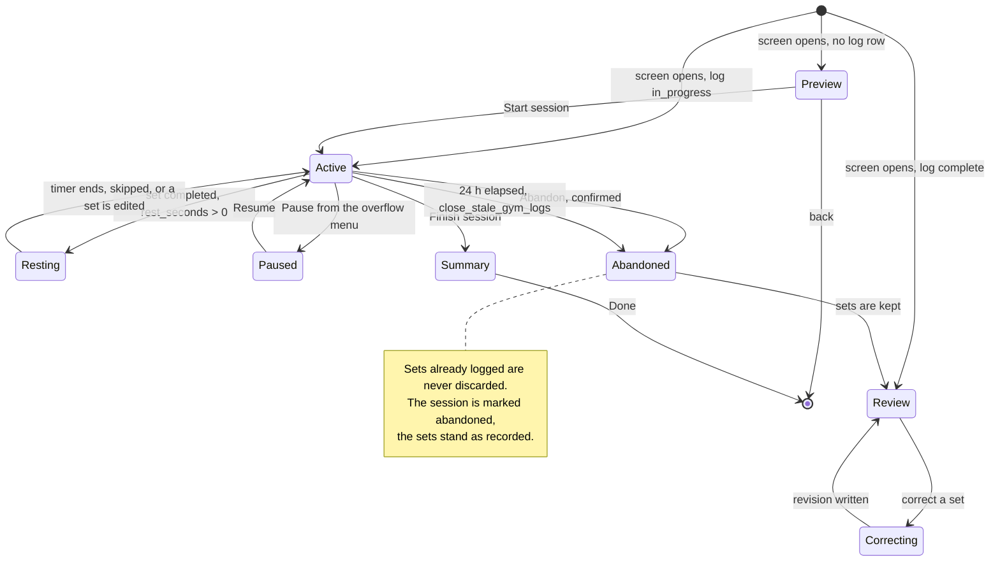

# Screen: Gym session logging

> **Layout status**: provisional. Awaiting client design photographs.

Screen 4 in `02-information-architecture.md` §5. A full-screen push from Today or My Programme,
not a bottom sheet.

Every layout decision below that would normally come from the client's designs is marked
**[Assumed, pending photographs]**. Nothing marked that way is settled.

---

## Purpose

This screen records what an athlete actually lifted, set by set, against what they were
prescribed. It resolves percentage-of-1RM loads into real kilograms from the athlete's own test
results, applies any coach overrides without pretending they are the parent plan, runs the rest
clock between sets, and shows what the athlete did last time so progression is visible in the
moment rather than in a report three weeks later.

It is used **mid-workout**, standing over a bar, with chalk or sweat on both hands, between
sets, under time pressure, frequently on a phone propped against a plate stack. It is the only
athlete screen in Fydr that is open for 45 minutes rather than 45 seconds, and it is the one
where a mis-tap costs the most, because a set logged at 150 kg instead of 105 kg corrupts a
volume trend and an estimated 1RM at the same time.

Set-level logging is not negotiable. Storing "3×8 @ 80kg" as a string makes volume, intensity
and progression analysis impossible (`04-data-model.md` §6), and the entire gym analytics layer
depends on one row per set.

---

## Roles and access

| Role | Access |
|---|---|
| Athlete | Full, for themselves. Writes `gym_session_logs` and `gym_set_logs` with `source = 'self_report'`. |
| Coach / S&C | Cannot use this screen. Staff log on behalf of an athlete from the web dashboard with `source = 'staff_entered'`, which is a different surface. |
| Medical | As coach. A rehab session assigned by medical is logged by the athlete through this same screen, because a rehab programme is a `programmes` row of type `rehab` and resolves identically. |
| Admin | No access. |

The athlete sees **their own resolved prescription only**. They never see that a teammate has a
different one, they never see the parent programme's unmodified values alongside theirs, and
they never see who else is assigned. An override is shown as "Modified" with its reason, which
tells the athlete their plan was tailored without telling them what anyone else is doing
(`06-design-system.md` §6.13).

---

## Entry points

| Entry point | Context carried | Landing behaviour |
|---|---|---|
| Today, To do row "Lower A" (not started) | `programme_session_id`, `session_id`, `entry_date` | Session preview state: exercise list, no log row created yet |
| Today, To do row "Lower A" (in progress) | `gym_session_log_id` | Resumes at the first incomplete set, scrolled to it |
| Today, `SessionCard` for a gym session | as above | Same |
| My Programme, a session in this week's plan | `programme_session_id` | Preview state. Starting from here creates the log with `session_id` null if no scheduled session matches. |
| My Programme, "Log a session" | none | Ad-hoc state: no programme, empty exercise list, library picker |
| My Data, gym tab, an in-progress log | `gym_session_log_id` | Resumes |
| My Data, gym tab, a completed log | `gym_session_log_id` | Read-only review with a correction action per set |
| Push `athlete.rehab.assigned` | `/athlete/programme/{assignment_id}` | Lands on My Programme, not here |

There is no deep link that starts a session automatically. Starting a session writes a row and
sets a clock running, and a notification tap must never do that by accident.

---

## Layout

### Web

Not applicable in v1.

### Why a full screen and not a sheet

A bottom sheet dims the screen behind it, invites a dismiss gesture on every downward swipe, and
frames the task as a short interruption. This task is 45 minutes long, involves scrolling
through a dozen exercises, and must survive the app being backgrounded when the athlete answers
a message. It is a screen with a back button and an explicit finish action.

### Mobile wireframe, active session

**[Assumed, pending photographs]** Row composition, the position of the rest timer, and the
superset rule treatment are recommendations.

```
┌──────────────────────────────────────────────┐
│ ‹        Lower A            42:18      ⋯     │ A  Header, 64 pt, sticky
│          8 of 24 sets · MD-1 · 4,180 kg      │
├──────────────────────────────────────────────┤
│ ▎A1  Back squat                  [Modified]  │ B  Exercise header, 72 pt
│ ▎    4 × 5 · 105 kg · 80% of 131 · 3-1-X-0  │    prescription line
│ ▎    ⓘ Load capped, returning from injury    │    override reason
│ ▎ ┌────────────────────────────────────────┐ │
│ ▎ │ 1  ✓   5 reps    105.0 kg    RPE 7.0  │ │ C  SetLogRow, complete, 64 pt
│ ▎ ├────────────────────────────────────────┤ │
│ ▎ │ 2  ✓   5 reps    105.0 kg    RPE 7.5  │ │
│ ▎ ├────────────────────────────────────────┤ │
│ ▎ │ 3  ▶  ⊖  5  ⊕  ⊖ 105.0 ⊕  ⊖ 8 ⊕   ✓  │ │ D  SetLogRow, active, 88 pt
│ ▎ ├────────────────────────────────────────┤ │
│ ▎ │ 4      5        105.0, │ │ E  SetLogRow, pending, 56 pt
│ ▎ └────────────────────────────────────────┘ │
│ ▎    Last time  5 × 100.0 kg · RPE 8.0       │ F  Previous session, 40 pt
│ ▎                 Mon 22 Jul                 │
├──────────────────────────────────────────────┤
│ ▎A2  Copenhagen plank            superset    │ G  Superset partner
│ ▎    3 × 20 s each side                      │
│ ▎ ...                                        │
├──────────────────────────────────────────────┤
│   B   Romanian deadlift                      │ H  Next exercise, collapsed
│       3 × 8 · RPE 8 target                   │
├──────────────────────────────────────────────┤
│   C   Split squat            [Exempt]        │ I  Exempt, 0.5 opacity
├──────────────────────────────────────────────┤
│ ┌──────────────────────────────────────────┐ │ J  Rest timer bar, 72 pt
│ │  Rest   01:47        ⊖30  ⊕30    Skip    │ │    replaces the finish bar
│ └──────────────────────────────────────────┘ │    while running
└──────────────────────────────────────────────┘
```

### Mobile wireframe, preview state (before starting)

```
┌──────────────────────────────────────────────┐
│ ‹        Lower A                             │
│          Wed 5 Aug · MD-1 · 24 sets · ~55 min│
├──────────────────────────────────────────────┤
│ A1  Back squat        4 × 5 · 105 kg  [Mod]  │  read-only rows,
│ A2  Copenhagen plank  3 × 20 s               │  ProgrammeExerciseRow
│ B   Romanian deadlift 3 × 8 · RPE 8          │  mode="read"
│ C   Split squat       Exempt                 │
│ D   Farmer carry      3 × 40 m · 2 × 32 kg   │
├──────────────────────────────────────────────┤
│ ⚠ Two loads need your coach                  │  unresolved 1RM notice
│   Back squat and Bench press have no 1RM     │
│   on file. Log what you lift and we will     │
│   record it.                                 │
├──────────────────────────────────────────────┤
│ ┌──────────────────────────────────────────┐ │
│ │              Start session               │ │
│ └──────────────────────────────────────────┘ │
└──────────────────────────────────────────────┘
```

### Region descriptions

| Ref | Region | Rules |
|---|---|---|
| A | Header | Sticky. Back chevron (leaves without ending the session), title, elapsed time, overflow menu. Second line: sets completed of total, MD-n chip, running volume. Elapsed time counts from `started_at` and keeps counting while the app is backgrounded. |
| B | Exercise header | Sequence label (A1, A2, B), exercise name at `bodyStrong`, override chip, prescription line, override reason when present. A superset group shares a 3 pt left rule in `accent.solid` and the same letter. |
| C | Complete set row | 64 pt. Tick glyph, logged values in `text.primary`, row at `surface.sunken`. Tapping re-opens it for correction. |
| D | Active set row | 88 pt, `accent` left edge bar 2 pt, elevation 2. Three steppers and a 56 pt complete button. This is the only row with editable controls. |
| E | Pending set row | 56 pt, muted, ghost target values in `text.tertiary`. Tapping makes it active. |
| F | Previous session line | Last completed instance of this exercise: top set or best set, load, reps, RPE or RIR, and the date. Absent with no history rather than showing zeros. |
| G to I | Following exercises | Collapsed to a header row until reached. Exempt exercises render at 0.5 opacity with an "Exempt" chip and no log affordance. |
| J | Bottom bar | Three mutually exclusive states: **Finish session** (default), **Rest timer** (while a timer runs), **Resume** (when the session is paused). Always pinned, always 72 pt plus safe area. |

### Sweaty-hands rules

These are constraints on the whole screen, not decoration. Every one exists because a wet or
chalked finger on a phone at arm's length behaves differently from a dry thumb on a sofa.

1. **The most-pressed control is the largest.** The set complete button is 56 by 56 pt inside a
   72 pt row, larger than every stepper on the same row.
2. **No primary action is a swipe.** Swipe gestures are unreliable on a wet screen. Every action
   that changes data is a tap on a visible target.
3. **No primary action is a long press.** A long press requires a stable contact patch for
   500 ms, which chalk defeats. Long press is used only for stepper acceleration, which is
   optional and has a tap alternative.
4. **No drag targets.** Reordering, and any control needing precision, is absent from this
   screen.
5. **Double-tap protection.** Every action button debounces at 350 ms and ignores a second
   press within that window. A double-tapped complete button must not complete two sets.
6. **Nothing destructive is in the thumb zone.** Delete a set, abandon the session, and discard
   all live in the overflow menu behind a `ConfirmSheet`.
7. **The screen stays awake** while a session is `in_progress`, via `expo-keep-awake`, released
   on finish, abandon, or background. A screen that sleeps between sets costs a face unlock with
   wet hands.
8. **Tap targets never overlap.** Minimum 8 pt separation, and the three steppers on an active
   row are separated by 12 pt rather than the default 8 pt.
9. **Values are large.** Logged numbers render at `metricM` (20 pt) minimum, readable from a
   phone on the floor.
10. **The active row is always scrolled into view** and is never under the rest timer bar. The
    scroll view carries `insets.bottom + 88` of bottom padding.

---

## Components

| Component | Source | Purpose here |
|---|---|---|
| `SetLogRow` | `06-design-system.md` §6.12 | One set. The component this screen exists around. |
| `ProgrammeExerciseRow` | §6.13 | Preview state and collapsed exercise headers, `mode="read"` and `mode="log"` |
| `NumberStepper` | §6.11 | Reps, load, RPE or RIR, inside `SetLogRow` |
| `ConfirmSheet` | §6.18 | Abandon session, delete a set, finish with sets outstanding, correct a completed set |
| `BottomSheet` | §6.19 | Exercise swap picker, ad-hoc exercise picker, session comment, exercise detail with video |
| `EmptyState` | §6.16 | `notStarted` for an ad-hoc session with no exercises, `noData` for an exercise with no history |
| `SyncStatusIndicator` | §6.17 | Header dot only, never a banner: a sync banner mid-set is noise |
| `Numeric` | §5.2 | Every value |
| `SessionCard` | §6.14 | Not used here. Recorded so it is not added: this screen is inside one session already. |

Screen-local compositions in `apps/mobile/src/features/gym/`:

| Composition | Purpose |
|---|---|
| `RestTimerBar` | Countdown, adjust, skip, and the local notification on completion |
| `ExerciseGroup` | Superset container: shared rule, letter, and round-based rest behaviour |
| `LoadResolutionNotice` | The unresolved-1RM banner and its per-exercise inline variant |
| `PreviousPerformance` | The "last time" line and its expanded comparison |
| `SessionSummary` | The finish screen: volume, duration, session RPE, per-exercise recap |

---

## Data requirements

### Resolving the prescription

The athlete's session is the parent programme with their overrides applied, resolved by
`resolve_programme_session(programme_session_id, athlete_id, on)` from ADR-006. The same rules
exist in `packages/core/programme.ts` for offline resolution, and the two implementations are
tested against a shared fixture set.

Override order, restated because getting it wrong changes what an athlete lifts:

| Order | Type | Effect |
|---|---|---|
| 1 | `exempt` | Exercise removed from this athlete's session. Nothing further applies. |
| 2 | `substitute` | `exercise_id` replaced. Prescription carries over unless also overridden. |
| 3 | `volume` | `sets`, `reps_min`, `reps_max` replaced where non-null |
| 4 | `load_cap` | `load_value := least(parent, cap)`. **A cap, not a set.** |
| 5 | `note` | Appended to the athlete's view, changes nothing prescriptive |

An override with `expires_at` in the past is ignored and the parent applies again. Exempt
exercises are still **rendered**, greyed with an "Exempt" chip, rather than hidden: an athlete
who sees four exercises where their programme card said five will assume the app lost one.

### Resolving load

| `load_basis` | Displayed as | Resolution |
|---|---|---|
| `absolute` | "105 kg" | `load_value` directly |
| `percent_1rm` | "105 kg · 80% of 131" | `round_to_increment(latest_1rm × load_value / 100)` |
| `percent_bw` | "62 kg · 70% of 88.4" | Latest body mass from `wellness_entries_current.body_mass_kg` or `body_composition`, whichever is more recent, with its date shown |
| `rpe` | "RPE 8 target" | No kilogram target. The load stepper opens at the athlete's last load for that exercise. |
| `none` | "As prescribed" | Bodyweight or unloaded work. The load stepper is absent. |

**Two schema additions are required.** Per `CLAUDE.md` §5 they land in `04-data-model.md` with
the migration.

```sql
-- 1. A percent_1rm prescription must know which test it is a percentage of.
--    Without this, resolution is guesswork across an exercise library of hundreds.
alter table exercises
  add column one_rm_test_definition_id uuid references test_definitions(id);

-- 2. Load rounding is a property of the equipment, not of the screen.
alter table exercises
  add column load_increment_kg numeric(4,2) not null default 2.5;
--    2.5 for a barbell with standard plates, 2.0 or 1.0 for a dumbbell rack,
--    0.5 for a cable stack, 5.0 for a leg press.
```

Resolution, in `packages/core/load.ts`, pure and shared with the Edge Functions:

```ts
export type LoadResolution =
  | { kind: 'resolved'; loadKg: number; basis: LoadBasis;
      reference?: { value: number; unit: string; testName?: string; onDate: string } }
  | { kind: 'rpeTarget'; targetRpe: number; suggestedKg: number | null }
  | { kind: 'unresolved'; reason: 'no_1rm' | 'no_body_mass' | 'no_test_link';
      exerciseName: string };

export function resolveLoad(args: {
  prescription: { loadBasis: LoadBasis; loadValue: number | null };
  latest1rm: { value: number; testName: string; testDate: string } | null;
  latestBodyMass: { value: number; onDate: string } | null;
  incrementKg: number;
  lastLoggedKg: number | null;
}): LoadResolution;

/** Half-away-from-zero to the nearest increment. Display-time only. */
export function roundToIncrement(kg: number, increment: number): number;
```

**When a 1RM is missing, the app does not guess.** `04-data-model.md` §7 requires that it
prompts the coach rather than falling back to a default. Concretely:

1. The exercise renders with the load slot showing `-` and the caption "No 1RM on file".
2. The preview state shows a single grouped notice listing every affected exercise.
3. The athlete can still log: the load stepper opens at their last logged load for that
   exercise, or empty if there is none, and the set is recorded normally with
   `prescribed_load_kg` null.
4. On starting the session, one notification is raised to the assigning coach:
   `staff.programme.load_unresolved`, in-app, batched daily, naming the athlete and the
   exercises. This is a **new catalogue entry** and needs adding to `08-notifications.md` §2.
5. Nothing is invented. A percentage of an unknown maximum is not a number.

### Previous performance

```sql
-- The last completed instance of this exercise for this athlete, before this session.
create or replace function public.previous_exercise_performance(
  p_athlete_id  uuid,
  p_exercise_id uuid,
  p_before      timestamptz
)
returns table (
  logged_on      date,
  top_set_reps   int,
  top_set_load   numeric,
  top_set_rpe    numeric,
  top_set_rir    int,
  total_volume   numeric,
  best_e1rm      numeric,
  set_count      int
)
language sql stable security invoker as $$
  with prior as (
    select gl.id, gl.entry_date
    from public.gym_session_logs gl
    join public.gym_set_logs sl on sl.gym_session_log_id = gl.id
    where gl.athlete_id = p_athlete_id
      and gl.status = 'complete'
      and gl.completed_at < p_before
      and sl.exercise_id = p_exercise_id
      and not sl.is_warmup
    group by gl.id, gl.entry_date
    order by gl.entry_date desc
    limit 1
  ),
  sets as (
    select sl.*, prior.entry_date
    from public.gym_set_logs sl
    join prior on prior.id = sl.gym_session_log_id
    where sl.exercise_id = p_exercise_id and not sl.is_warmup
  )
  select
    max(entry_date),
    (select reps_completed from sets order by load_kg desc nulls last, reps_completed desc limit 1),
    (select load_kg        from sets order by load_kg desc nulls last, reps_completed desc limit 1),
    (select rpe            from sets order by load_kg desc nulls last, reps_completed desc limit 1),
    (select rir            from sets order by load_kg desc nulls last, reps_completed desc limit 1),
    sum(volume_kg),
    max(case when reps_completed between 1 and 10
             then load_kg * (1 + reps_completed / 30.0) end),   -- Epley
    count(*)
  from sets;
$$;
```

Estimated 1RM uses Epley and is **capped at 10 reps**. Beyond that the formula's error exceeds
its usefulness and it must not be plotted. This is stated here because an uncapped e1RM chart is
a plausible-looking lie.

### What is written

```sql
-- On "Start session"
insert into gym_session_logs (id, org_id, athlete_id, programme_session_id, session_id,
                              entry_date, started_at, status, source)
values (:client_uuid, :org, :athlete, :programme_session_id, :session_id,
        :device_local_date, now(), 'in_progress', 'self_report');

-- On each set completion, one row, with the ADR-006 snapshot
insert into gym_set_logs (id, org_id, gym_session_log_id, programme_exercise_id, exercise_id,
                          set_number, reps_completed, load_kg, rpe, rir, side, is_warmup,
                          prescribed_sets, prescribed_reps_min, prescribed_reps_max,
                          prescribed_load_kg, prescribed_source, logged_at)
values (...);
```

**The snapshot rule is the most important consequence of the override model** (ADR-006). The
resolved prescription is copied onto the set row at the moment it is logged. Without it, "was
this athlete hitting their prescription in March?" is answered by resolving today's parent
against today's overrides, both of which may have changed. `prescribed_source` records
`'parent'` or `'override:<override_id>'`.

`volume_kg` is a generated column. `gym_session_logs.total_volume_kg` is computed on session
completion, server-side, and recomputed if a set is corrected.

### Hooks

```ts
// packages/queries/keys.ts additions
gym: {
  all: (orgId: string) => [...qk.org(orgId), 'gym'] as const,
  resolvedSession: (orgId: string, athleteId: string, programmeSessionId: string, on: string) =>
    [...qk.gym.all(orgId), 'resolved', athleteId, programmeSessionId, on] as const,
  log: (orgId: string, logId: string) => [...qk.gym.all(orgId), 'log', logId] as const,
  previous: (orgId: string, athleteId: string, exerciseId: string) =>
    [...qk.gym.all(orgId), 'previous', athleteId, exerciseId] as const,
  library: (orgId: string) => [...qk.gym.all(orgId), 'library'] as const,
},
```

```ts
// packages/queries/gym.ts
export function useResolvedGymSession(args: {
  orgId: string; athleteId: string; programmeSessionId: string; on: string;
}): UseQueryResult<ResolvedExercise[]>;

export function usePreviousPerformance(args: {
  orgId: string; athleteId: string; exerciseIds: string[];
}): UseQueryResult<Record<string, PreviousPerformance | null>>;   // batched, one round trip

export function useExerciseLibrary(args: { orgId: string }): UseQueryResult<Exercise[]>;
```

| Query | `staleTime` | `gcTime` | Persisted | Note |
|---|---|---|---|---|
| Resolved session | 15 min | 24 h | Yes | The programme must resolve with no network |
| Previous performance | 5 min | 24 h | Yes | Batched across the whole session in one call on mount |
| Exercise library | 24 h | 7 days | Yes | Effectively static |
| The log itself | n/a | n/a | SQLite | Never a query cache concern |

All set writes are local SQLite plus an outbox op. The set write and the session log write are
ordered by `outbox.depends_on`: a set op depends on its session op, so a set can never arrive
at a server that has no parent log row.

---

## States



### Preview

The resolved exercise list, read-only, with the estimated duration (sum of
`sets × (rest_seconds + 40 s)` rounded to five minutes) and the unresolved-load notice if any.
One action: "Start session".

### Active

One exercise is expanded, one set within it is active. Everything else is collapsed. The active
set is the first incomplete non-warmup set in sequence, and the screen scrolls it into view on
mount and after every completion.

### Resting

The bottom bar becomes the rest timer. The rest of the screen stays fully interactive: an
athlete must be able to correct set 2 while resting before set 3.

### Paused

Elapsed time stops. `gym_session_logs` is unchanged (there is no paused status in the enum);
pause is client-side and recorded in local state only. The bottom bar reads "Resume". Pause
exists because athletes get pulled into a conversation for twenty minutes and a session duration
of 78 minutes when 55 were worked distorts every session-RPE load calculation downstream.

### Summary

```
┌──────────────────────────────────────────────┐
│              Lower A complete                │
│         55 min · 24 sets · 9,240 kg          │
├──────────────────────────────────────────────┤
│ How hard was the session?                    │
│  ○────○────○────◉────○  ... 1 to 10          │  session RPE, Borg CR10
│ Very easy                        Maximal     │
├──────────────────────────────────────────────┤
│ Back squat      4×5 @ 105 kg    ▲ +5 kg      │  vs previous session
│ RDL             3×8 @ 90 kg     = same       │
│ Split squat     Exempt                       │
├──────────────────────────────────────────────┤
│ ⌄ Add a note                                 │
├──────────────────────────────────────────────┤
│ │                Done                      │ │
└──────────────────────────────────────────────┘
```

Session RPE here writes `gym_session_logs.session_rpe`. It is **not** the same value as
`training_entries.rpe`: this one rates the gym session, the other rates a pitch session, and a
gym session that also has a `sessions` row with `requires_rpe` produces a separate RPE prompt 30
minutes later (`training-entry.md`). The distinction is real and the copy makes it explicit:
"How hard was the session?" here, "How hard was the whole session?" there. O-255 asks whether they
should be unified.

### Review (completed session)

Read-only, every set shown with its logged and prescribed values side by side. Each set carries a
"Correct" action, permitted at any time — matching wellness/RPE, ADR-005 rejected a bounded
correction window on principle (§4: offline entries can arrive hours late, so "within N days" has
no unambiguous meaning) — which creates a revision.

### Loading

The resolved session is persisted, so on a normal open there is no loading state. On a first-ever
open with no cache: exercise header skeletons at 72 pt, set rows at 56 pt, three exercises deep.
The "Start session" button is disabled with the label "Loading your session".

### Empty

| Cause | State |
|---|---|
| Ad-hoc session, nothing added | `EmptyState` kind `notStarted`: "No exercises yet." Action "Add an exercise". |
| Every exercise exempt | `EmptyState` kind `allClear`: "Nothing prescribed today." Body "Every exercise in this session is marked exempt for you." No start action. |
| Programme assignment suspended (rehab active) | `EmptyState` kind `noData`: "This programme is paused." Body "Your rehab plan is active. Open My Programme." Action opens My Programme. |
| Exercise with no history | The "Last time" line is absent. No "no data" caption: an absent line needs no explanation. |

### Error

| Failure | Behaviour |
|---|---|
| Resolution query fails, cache present | Cached resolution is used with a caption "Showing your last saved plan." |
| Resolution query fails, no cache | `EmptyState` kind `error`: "Could not load your session. Check your connection and try again." with retry, plus a secondary action "Log without a programme" that starts an ad-hoc session. **The athlete is never prevented from training.** |
| 1RM lookup fails | Treated as `unresolved`, not as an error. Identical presentation to a missing 1RM. |
| Previous performance fails | The line is absent. |
| Local set write fails | The row keeps its editable state, an inline message appears, and a retry is offered. The session is not lost. |
| Set rejected on sync with `orphaned_from` | The set is kept, the reference is nulled server-side, and the coach is warned (`05-architecture.md` §6). The athlete sees nothing: they did the work. |

### Offline

The entire screen works offline: resolution from the persisted cache, previous performance from
the persisted cache, all writes local. The only degraded element is the exercise library search
in an ad-hoc session, which falls back to the cached library and states its age if older than
7 days.

---

## Interactions

### Set logging

| Gesture | Target | Result |
|---|---|---|
| Tap | Pending set row | Becomes the active row. The previously active row, if partially entered, keeps its values and returns to pending. |
| Tap ⊖ / ⊕ | Reps stepper | ±1 rep, min 0, max 100. `impactAsync(Light)`. |
| Tap ⊖ / ⊕ | Load stepper | ± the exercise's `load_increment_kg`. Min 0, max 500. `impactAsync(Light)`. |
| Long press | Load stepper | Accelerates: 1, then 2, then 5 increments per tick after 500 ms. Getting from 20 kg to 140 kg must not be 48 taps. |
| Tap | Load value | Numeric keypad, `inputMode="decimal"`, Done accessory. Permitted here, unlike the wellness form, because a three-digit load is faster typed than stepped when it is far from the prescription. |
| Tap | Ghost target value | Accepts the prescribed value in one tap. This is the fastest path and the one most sets will use. |
| Tap ⊖ / ⊕ | RPE stepper | ±0.5, range 1 to 10. Or RIR ±1, range 0 to 10, depending on org setting. |
| Tap | Complete button ✓ | Writes the set, marks it complete, starts the rest timer if `rest_seconds > 0`, advances the active row, scrolls it into view. `notificationAsync(Success)`. Debounced 350 ms. |
| Tap | A completed set row | Re-opens it as active for correction. The correction writes a revision, not an update. A `ConfirmSheet` is **not** shown for a set corrected within the same session: mid-session correction of a mis-tap is routine and confirming it every time is friction on the wrong thing. It **is** shown for a set from a previous session. |
| Tap | "Repeat previous set" | Copies the previous set's reps, load, and RPE into the active row. `impactAsync(Light)`. |
| Tap | Exercise header | Collapses or expands that exercise. Collapsing an exercise with an active set moves the active state to the next incomplete set. |
| Tap | Exercise name | Opens the exercise detail sheet: video, cues, equipment, full prescription, override reason. |
| Tap | Override chip "Modified" | Presents the reason: "Load capped at 105 kg, returning from injury. Set by Dan Reilly, 22 Jul." |
| Tap | "Add set" | Appends a set beyond the prescription. `prescribed_*` on that row is null and the summary notes "1 extra set". |
| Tap | Overflow ⋯ on a set | Menu: Mark as warm-up, Mark as skipped, Change side, Delete set. Delete is behind a `ConfirmSheet` and is the only destructive action available inside a session. |
| Tap | Side control | Cycles bilateral, left, right, for `exercises.is_unilateral` exercises. A unilateral exercise defaults to two rows per prescribed set, one per side. |

### Rest timer

| Behaviour | Rule |
|---|---|
| Start | Automatically on set completion, from the resolved `rest_seconds`. Zero or null means no timer and the bar stays as "Finish session". |
| Display | `mm:ss` counting down, `metricL`, in the bottom bar. Progress is also carried by a thin bar filling the width, so the state is readable without reading digits. |
| Adjust | ⊖30 and ⊕30 buttons, 48 pt each. Floor 0. |
| Skip | A 56 pt "Skip" target. Ends the timer immediately. |
| Completion | Haptic `notificationAsync(Success)`, a short sound if the device is not silenced, and the bar reverts to "Finish session". |
| Backgrounded | A local notification fires at the end: "Rest over. Back squat, set 4." Scheduled with `expo-notifications` at timer start and cancelled if the timer is skipped or adjusted. It uses the `prompts` Android channel and does not count against the athlete push budget, because it is a local notification the athlete started themselves. |
| Screen locked | Timer continues. It is computed from a wall-clock end timestamp, never from a JS interval, so a suspended app resumes with the correct remaining time or with the timer already finished. |
| Superset | The timer starts **only after the last exercise in the superset round**. Completing A1 set 2 advances to A2 set 2 with no rest; completing A2 set 2 starts the rest timer using A2's `rest_seconds`, or the longest in the group where they differ. |
| Two timers | Impossible. Starting a new one cancels the old one and its notification. |

### Supersets

Exercises sharing `programme_exercises.superset_group` are one group, labelled A1, A2, A3.
Behaviour:

1. They render inside a shared container with a 3 pt left rule and the group letter.
2. Set advancement runs across the group by round: A1 set 1, A2 set 1, A1 set 2, A2 set 2.
3. Rest applies at the end of a round, not between members.
4. If members have different set counts, the shorter one drops out of subsequent rounds and the
   group continues with the remainder.
5. An exempt member is removed from the group entirely, and a group reduced to one member renders
   as an ordinary exercise with no group rule.
6. The athlete can break the pattern: tapping any set makes it active regardless of round order.
   The app does not enforce the superset, it suggests it.

### Session lifecycle

| Gesture | Target | Result |
|---|---|---|
| Tap | "Start session" | Creates the `gym_session_logs` row with `started_at`, enables keep-awake, activates the first set |
| Tap | Back chevron | Leaves the screen. The session stays `in_progress` and appears on Today as "resume". No confirmation: leaving is not destructive. |
| Tap | Overflow ⋯, "Pause" | Stops the elapsed clock. Bar reads "Resume". |
| Tap | Overflow ⋯, "Abandon session" | `ConfirmSheet`: "Abandon this session? Your logged sets are kept." Sets `status = 'abandoned'`. |
| Tap | "Finish session" with sets outstanding | `ConfirmSheet`: "Finish with 6 sets not logged? They will be recorded as not done." Cancel first. |
| Tap | "Finish session" complete | Summary state. `completed_at` set, `total_volume_kg` computed, keep-awake released. |
| Tap | "Done" on the summary | Returns to Today. The gym row is gone. |
| App killed mid-session | System | Everything already written is in SQLite. Reopening resumes at the first incomplete set with the elapsed clock computed from `started_at`. |
| 24 hours elapse | `close_stale_gym_logs` | Status becomes `abandoned`. Sets do not move (`05-architecture.md` §7). |

### Ad-hoc sessions

An athlete training without a programme: extra conditioning, a session at a commercial gym, a
prehab circuit.

1. Entered from My Programme, "Log a session".
2. `gym_session_logs.programme_session_id` is null, `session_id` is null unless a scheduled
   `sessions` row of type `gym` exists for that athlete today, in which case it is linked
   automatically and stated: "Linked to Lower A, 17:00."
3. Exercises are added from the library picker: search by name, filter by `category`, recents
   first. Recents are the athlete's own last 20 distinct exercises, which covers almost every
   ad-hoc session in one tap.
4. Each added exercise starts with one set and no prescription. Sets are added as they are done.
   `prescribed_*` columns are null throughout, and the summary says "Ad-hoc session, no
   prescription".
5. An exercise not in the library cannot be created by an athlete. Free-text exercise names
   would destroy every aggregate in the gym analytics layer within a month. Instead the athlete
   picks the nearest match and adds a session note, and a "Suggest an exercise" action sends the
   name to the S&C coach as an in-app item. O-258 asks whether that is too strict.
6. Ad-hoc sessions count towards volume and load analytics, and are marked with their own
   provenance so a coach can separate prescribed work from extra work.

---

## Validation rules

| Field | Rule | Message or behaviour |
|---|---|---|
| `reps_completed` | 0 to 100, integer | Stepper clamps, `impactAsync(Soft)` at the limit |
| `reps_completed` of 0 | Permitted, marks the set as a failed attempt | The row shows "0 reps" and is included in set count, excluded from volume |
| `load_kg` | 0 to 500, multiples of `load_increment_kg` when stepped, any 0.5 when typed | Values off the increment are accepted: an athlete using a different bar is reporting reality |
| `load_kg` more than 30% above the prescribed load | Confirmed once per exercise per session | "That is 40% above your prescription. Is that right?" [Yes] [Change] |
| `load_kg` more than 30% above the athlete's previous best for that exercise | Confirmed once | "That is more than you have lifted before. Is that right?" |
| `rpe` | 1 to 10, steps of 0.5 | Stepper range |
| `rir` | 0 to 10, integer | Stepper range |
| RPE or RIR | Required per set when the org setting requires it, optional otherwise | The complete button is enabled either way by default; when required, it is disabled with "Add RPE" |
| Set completion | Requires `reps_completed` to be set | Complete button disabled with the label "Add reps" |
| Set completion | Load may be null for `load_basis = 'none'` exercises | No blocking |
| Session RPE | 1 to 10, required to finish | Finish is disabled with "Rate the session" |
| Session duration | Derived from `started_at` and `completed_at`, capped at 240 minutes | Above the cap, the athlete is asked to confirm the duration on the summary, with the elapsed value pre-filled and editable |
| `comment` | 500 characters | Counter at 450 |
| Correction | No bound — ADR-005 §4 rejected a time-limited correction window on principle | The action is always present; there is no "Too old to correct" state |

Database guards, because sets also arrive by import and by staff entry:

```sql
alter table gym_set_logs
  add constraint set_reps_range  check (reps_completed between 0 and 100),
  add constraint set_load_range  check (load_kg        between 0 and 500),
  add constraint set_rpe_range   check (rpe            between 1 and 10),
  add constraint set_rir_range   check (rir            between 0 and 10),
  add constraint set_number_pos  check (set_number     >= 1);
```

---

## Edge cases

1. **No 1RM on file for a `percent_1rm` exercise.** Covered above: the load renders unresolved,
   the athlete logs what they lift, and the coach is notified. Never a default percentage of a
   guessed maximum.
2. **The 1RM on file is two years old.** It resolves, and the reference line states its age:
   "80% of 131 · tested 14 Mar 2024". Beyond 12 months the age renders in `severity.medium`
   colours as a warning without blocking. A stale maximum is a coaching problem the coach must
   be able to see.
3. **A new 1RM is tested mid-block.** Loads re-resolve on the next session open. Sessions already
   logged keep their snapshot. This is precisely what the ADR-006 snapshot rule protects.
4. **`percent_bw` with no body mass on file.** Unresolved, same treatment as a missing 1RM, with
   the reason "No body mass on file" and a shortcut into the wellness optional block.
5. **The coach edits the parent programme mid-session.** The athlete's resolution is fetched at
   session start and pinned for the duration. Changing the prescription under an athlete
   mid-workout is worse than a stale plan. On the next open it re-resolves and the summary of the
   completed session shows the prescription it was performed against.
6. **The coach adds an override mid-session.** Same rule: pinned for the session.
7. **An override expires mid-session.** Pinned. It applies from the next session.
8. **The athlete is assigned a rehab programme mid-session.** The gym programme is suspended
   (`03-flows.md` §4), the current session finishes normally, and the next open shows the paused
   state.
9. **A superset where one member is exempt.** The group drops to the remaining members. A group
   of one renders as an ordinary exercise.
10. **A substitute override changes an exercise the athlete has already logged sets against**,
    because they resumed a session across a day boundary. The already-logged sets keep the
    original `exercise_id`. The remaining sets use the substitute, and the exercise renders as
    two blocks with a caption "Changed to Floor press". Rewriting logged sets to a different
    exercise would be a fabrication.
11. **The athlete logs the same exercise twice in one session** (it appears at A1 and again at
    D). Two `programme_exercise_id` values, two blocks, two independent set sequences. Previous
    performance is looked up by `exercise_id` and is identical in both, which is correct.
12. **A unilateral exercise.** Two rows per prescribed set, `side` of `left` and `right`.
    Volume sums both. The previous-performance line reports per side.
13. **The athlete does 6 reps where 5 were prescribed.** Recorded as 6. No warning, no
    correction prompt. Exceeding a prescription is information.
14. **The athlete does 3 sets where 4 were prescribed and finishes.** Confirmed once, then
    recorded. The missing set is recorded as not done, not as zero reps
    (`06-design-system.md` §1.6): a missing set and a failed set are different data.
15. **Two devices log the same session.** `gym_session_logs.id` is client-generated, so a second
    device starting the same programme session creates a second log. Both sync. The screen
    surfaces this on next open: "You have two logs for this session" with an action to open each.
    They are not merged automatically, because merging set sequences from two devices has no
    correct answer.
16. **The app is killed while the rest timer runs.** The local notification still fires: it was
    scheduled with the OS, not held in JS. Reopening shows the timer already elapsed.
17. **Airplane mode for the whole session.** Everything works. The outbox drains later. The
    header sync dot shows `pending` with a count; there is no banner.
18. **The athlete finishes at 23:58 and the summary is submitted at 00:01.** `entry_date` is
    taken from `started_at` in device-local time, not from the completion moment, so the session
    belongs to the day it was performed.
19. **A set is logged with a load 10× the intended value (105 typed as 1050).** The 500 kg
    constraint rejects it in the stepper and the keypad, and the 30% confirmation catches
    plausible-but-wrong values below that.
20. **The athlete corrects a set from three days ago.** Permitted — no time bound (ADR-005 §4). A
    revision row is created and `total_volume_kg` on the parent log is recomputed server-side.
21. **`close_stale_gym_logs` abandons a session the athlete is still in**, because they started
    it 25 hours ago and left the app open. On the next interaction the client detects the status
    change on pull, shows "This session was closed after 24 hours", and offers to start a new
    session carrying the remaining sets across. Logged sets are untouched.
22. **200% dynamic type.** `SetLogRow` becomes two rows: values on the first, controls on the
    second, with the complete button full width beneath
    (`06-design-system.md` §10.2). Exercise headers wrap. Nothing is removed.
23. **VoiceOver during a session.** Each set row is a group with a summary label, and each
    stepper is separately adjustable. The complete button announces the consequence: "Complete
    set 3. 5 reps at 105 kilograms, RPE 8. Button." The rest timer announces at start and at
    completion through a live region, and not every second.
24. **The athlete has notifications paused.** The rest timer's local notification still fires:
    it is a timer the athlete started, not a message from the club, and the pause control in
    `08-notifications.md` §5.2 governs server-sent notifications. This distinction is stated in
    the settings copy so it is not a surprise.

---

## Performance notes

| Path | Budget | How |
|---|---|---|
| Screen open to preview interactive | 300 ms p95 | Resolution comes from the persisted cache; previous performance is fetched in one batched call and fills in after |
| Set complete tap to next row active | 100 ms p95 | Local write plus a state transition. No query, no re-resolution. |
| Stepper tap to value update | Under one frame | Local component state, no re-render of the exercise list |
| Rest timer accuracy | ±1 s over 5 minutes | Computed from a wall-clock end timestamp, rendered on a 250 ms tick. Never accumulated from intervals. |
| Whole-session memory | Flat | The set list is not virtualised (at most ~40 rows), but collapsed exercises render a header only |
| Session summary | 400 ms p95 | Volume computed locally from local rows, not fetched |

Rules:

- **Previous performance is one batched call**, not one per exercise. Twelve exercises must not
  be twelve round trips on a gym's wifi.
- **The resolution is fetched once, at session start, and pinned.** No refetch on focus while
  `in_progress`.
- **Every set write is fire and forget.** The sync trigger is never awaited.
- **Keep-awake is scoped to the session**, released on finish, abandon, or background, so a
  forgotten screen does not drain a battery all afternoon.
- **The rest timer does not re-render the list.** It lives in its own subtree with its own
  ticker.

---

## Accessibility

| Element | Label pattern | Example |
|---|---|---|
| Header | Progress stated in words | "Lower A. 8 of 24 sets complete. 42 minutes elapsed." |
| Exercise header | Prescription and override | "A1. Back squat. 4 sets of 5 at 105 kilograms. Modified: load capped, returning from injury. Expanded." |
| Set row, complete | Values in full | "Set 2. Complete. 5 reps at 105 kilograms, RPE 7.5. Button, correct this set." |
| Set row, active | Controls announced individually | "Set 3, active. Reps, 5. Load, 105 kilograms. RPE, 8." |
| Complete button | States the consequence | "Complete set 3. Button." |
| Ghost target | Marked as a suggestion | "Prescribed, 5 reps. Double tap to use." |
| Previous performance | Full sentence | "Last time, 22 July. 5 reps at 100 kilograms, RPE 8." |
| Rest timer | Announced at start and end only | "Rest, 2 minutes." then "Rest over. Back squat, set 4." |
| Superset group | Membership stated | "Superset A. Two exercises. Back squat and Copenhagen plank." |
| Exempt exercise | Reason given | "Split squat. Exempt for you. Not logged." |
| Unresolved load | Honest about the cause | "Back squat. No one rep max on file. Log the load you lift." |
| Session RPE | Anchors at both ends | "How hard was the session? 1 is very easy, 10 is maximal." |

Requirements:

- 56 pt minimum on the complete button, 48 pt on every stepper button, 12 pt separation between
  steppers on an active row (above the 8 pt floor, for wet hands).
- Focus moves to the newly active set row after a completion, and the row is scrolled clear of
  the rest timer bar.
- Live regions announce set completion and rest start or end, politely, and are throttled so a
  fast circuit does not flood.
- Reduced motion: no scroll animation to the next set (instant), no timer bar animation (numeric
  only), no row transition.
- Colour is never the only channel: set state is carried by the tick glyph, row background, and
  text colour together; the active row has both a left bar and elevation.
- Dynamic type 85% to 200%, verified at 100%, 150%, 200%.
- The screen is usable one-handed: every control an athlete touches between sets sits in the
  lower 45% of the screen, with the exercise list scrolling above it.

---

## Open questions

- **O-252** RPE or RIR per set, and which is the default? The schema carries both. RIR is more
  reliable for trained athletes on compound lifts and is easier to answer honestly ("2 left in
  the tank"). RPE is more familiar to more coaches. I have assumed one control, org-configurable,
  defaulting to RPE, storing only what was entered and never converting between them. Confirm
  the default, and confirm that you do not want both collected per set, which would be a third
  stepper on the most crowded row in the product.
- **O-253** Should a set require RPE or RIR? Making it required doubles the reliability of the
  gym analytics and adds an interaction to every single set, which across 24 sets is a
  meaningful cost. I have assumed optional by default, org-configurable to required. This is a
  sports science judgement.
- **O-254** `exercises.one_rm_test_definition_id` is a required schema addition and it needs a
  policy: which exercises get a linked test, and what happens to the ones that do not. A club
  will not test a 1RM for 200 library exercises. My assumption is that `percent_1rm` is only
  permitted on exercises with a linked test, enforced in the programme builder, and every other
  exercise uses absolute load or an RPE target. Confirm, because it constrains how coaches write
  programmes.
- **O-255** Should gym session RPE and training session RPE be one value? Today a gym session
  collects `gym_session_logs.session_rpe` on the summary, and if that gym session also has a
  `sessions` row with `requires_rpe` the athlete gets a second prompt 30 minutes later for
  `training_entries.rpe`. That is two ratings of the same work. Options: suppress the training
  RPE prompt when a gym log for the same `session_id` already carries one, or keep both because
  the 30-minute delay produces a better number. I have assumed **suppress**, and the RPE prompt
  is skipped when `gym_session_logs.session_rpe` is present for that session. Confirm, because
  the alternative is defensible and produces better data at the cost of an extra prompt.
- **O-256** Load rounding increments. I have added `exercises.load_increment_kg` with a default of
  2.5 kg. Real gyms have odd equipment: a 20 kg fixed barbell rack, dumbbells that jump 4 kg at
  the top end, plate-loaded machines nobody has weighed. Should the increment be per exercise,
  per organisation, or per organisation per exercise? I have assumed per exercise with an org
  default.
- **O-257** Rest timer sound. A sound is the only signal that reaches an athlete who has put the
  phone down, and it is also the thing that makes a gym full of Fydr users unbearable. I have
  assumed: haptic always, local notification always, sound off by default with a per-athlete
  toggle. Confirm.
- **O-258** Can an athlete create an exercise? Currently no: they pick from the library or suggest
  one to the coach. This protects every gym aggregate from free-text pollution and it will
  annoy an athlete doing something unusual in a commercial gym. The middle option is a generic
  "Other, this session only" entry that records the work and is excluded from exercise-level
  analytics. Worth deciding before the pilot.
- **O-259** Should the athlete see their estimated 1RM? It is computed for the previous-performance
  comparison and it is the number athletes find most motivating. It is also a formula with real
  error, and an athlete who sees an e1RM of 140 kg will try to lift it. I have kept it off this
  screen and off My Data, using it only for the "vs last time" comparison arrows. Confirm.

---

## Related documents

- Override resolution, the snapshot rule, and propagation → `docs/decisions/adr-006-programme-override-model.md`
- Programme creation and tailoring → `03-flows.md` §4
- Set-level schema and why it exists → `04-data-model.md` §6
- `SetLogRow` and `ProgrammeExerciseRow` → `06-design-system.md` §6.12, §6.13
- 1RM resolution against test results → `04-data-model.md` §7
- Session RPE, the other one → `training-entry.md`
- The athlete's view of the plan → `my-programme.md`
- Stale session closure → `05-architecture.md` §7
