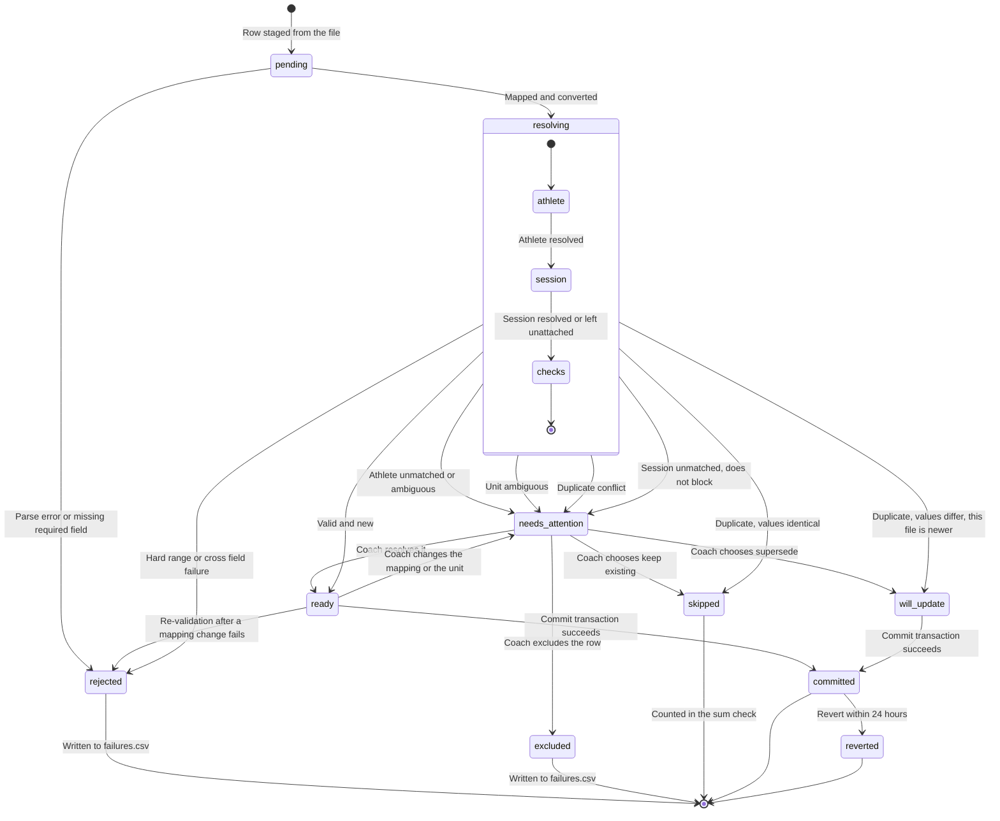

# Screen: GPS Data Import

> **Layout status**: provisional. Awaiting client design photographs.

Screen 34 in the inventory, named in `10-roadmap.md` §6 and **missing from
`02-information-architecture.md` §5**, which still lists 33. Adding it there is part of the
same commit as this file. Reached from `More → Imports`. Premium tier only.

`07-integrations.md` §3.11 calls this "the screen that decides whether Phase 2 works" and
fixes the behavioural contract: the header, the four counters, the three tabs, the commit
rules and the revert window. This file specifies the rest of it. Where the two disagree,
§3.11 wins and this file is wrong.

**The user, stated once and then designed for throughout.** An S&C coach, on a laptop, in a
portacabin, at 19:40, after a session. They have a 400-row CSV they exported from OpenField
four minutes ago. They want to be in the car in ten minutes. They will not read anything.
They will not investigate a warning they do not understand. If this screen asks them a
question they cannot answer, the file goes in a folder called `GPS` and never comes back.

---

## Purpose

Turn a vendor's export file into `gps_records` rows attached to the right athletes and the
right sessions, with every ambiguity resolved by a human before anything is written, and
nothing lost in either direction.

Six jobs:

1. **Accept the file** whatever encoding, delimiter, decimal separator and date format the
   vendor chose this week, without asking the coach to know any of those words.
2. **Recognise the vendor** by header fingerprint and apply a saved `vendor_profiles` row
   silently, so the second import from a club is a two-click operation and the twentieth is
   the same two clicks.
3. **Map an unrecognised export** once, with per-column suggestions, and save the result as a
   profile so it is never asked again.
4. **Resolve every athlete name to a squad member**, with fuzzy suggestion, explicit human
   confirmation, and a persisted alias so next week's file resolves with zero interaction.
5. **Show the coach exactly what is about to be written**, in canonical units, with the
   original vendor value one hover away, and let them commit it in one transaction.
6. **Be reversible.** A batch committed in error is revertible for 24 hours, and the revert is
   as auditable as the commit.

**What this screen is not.** It is not the GPS analysis surface: that is `analytics.md`, the
GPS tab on `athlete-profile.md`, and the GPS tab on `flags.md`. It is not a vendor API
connection: that is Phase 4, `07-integrations.md` §6, and it appears on `settings.md` under
Integrations, not here. It is not a general-purpose CSV importer for other domains; the
testing results import in `testing.md` reuses this screen's pipeline and mapping engine but
targets `test_results`.

### The pipeline this screen drives

The generic ingestion pipeline is `07-integrations.md` §2. This is that pipeline with the
file-import branch expanded, and it is the map of the whole screen: every blue node is a place
this screen asks the coach a question, and every one of them is a place a badly designed
question loses the club.

```mermaid
graph TD
    UP["Coach drops a file<br/>csv · txt · xlsx"] --> SNIFF["Client sniff<br/>encoding · delimiter · header row"]
    SNIFF --> STORE1["Upload to private Storage<br/>imports/org_id/batch_id/source"]
    STORE1 --> BATCH["Create import_batches<br/>status uploading"]
    BATCH --> FP["Header fingerprint<br/>sha256 of sorted header row"]
    FP --> KNOWN{"Profile match?"}
    KNOWN -->|Exact| APPLY["Apply vendor_profiles<br/>column_map · unit_map"]
    KNOWN -->|Near miss| PREFILL["Mapping UI prefilled<br/>differences highlighted"]
    KNOWN -->|None| MAPUI["Mapping UI<br/>suggestions with confidence"]
    PREFILL --> SAVEP
    MAPUI --> SAVEP["Save vendor_profile<br/>fingerprint · delimiter · decimals · dates"]
    SAVEP --> APPLY
    APPLY --> PARSE["Stream parse into<br/>import_batch_rows"]
    PARSE --> UNIT["Unit detection pass<br/>median heuristics per column"]
    UNIT --> UAMB{"Unit ambiguous or<br/>contradicts profile?"}
    UAMB -->|Yes| ASK["One question, once<br/>answer saved to the profile"]
    ASK --> NORM
    UAMB -->|No| NORM["Normalise to canonical SI"]
    NORM --> ATH["Athlete resolution<br/>alias · exact · initial · fuzzy"]
    ATH --> AOK{"Resolved?"}
    AOK -->|No| AFIX["Athlete picker<br/>blocking"]
    AFIX --> SES
    AOK -->|Yes| SES["Session matching<br/>date plus 90 minute window"]
    SES --> SOK{"Exactly one<br/>candidate?"}
    SOK -->|No| SFIX["Session picker<br/>non-blocking"]
    SFIX --> VAL
    SOK -->|Yes| VAL["Validate<br/>Zod · range · cross field"]
    VAL --> VOK{"Row valid?"}
    VOK -->|No| REJ["Rejected<br/>reason recorded, row retained"]
    VOK -->|Yes| HASH["Fingerprint row_hash"]
    HASH --> DUPQ{"Seen before?"}
    DUPQ -->|Identical| SKIP["Skipped<br/>counted, not an error"]
    DUPQ -->|Differs, newer| SUP["Will be updated<br/>supersede with a diff"]
    DUPQ -->|Differs, no ordering| CONF["Conflict<br/>blocking"]
    DUPQ -->|No| READY["Ready"]
    CONF --> REVIEW
    SUP --> REVIEW
    SKIP --> REVIEW
    REJ --> REVIEW
    READY --> REVIEW["Review screen<br/>four counters · three tabs"]
    REVIEW --> BLOCK{"Any blocking<br/>row left?"}
    BLOCK -->|Yes| REVIEW
    BLOCK -->|No| TX["Commit<br/>one transaction"]
    TX --> WROTE["gps_records written<br/>aliases persisted<br/>import_batches committed"]
    WROTE --> MV["refresh_views_after_import"]
    WROTE --> FLG["Flag engine"]
    WROTE --> RES["Result panel<br/>failures.csv"]
    WROTE --> UNDO["Revert available<br/>24 hours"]

    style MAPUI fill:#1f6feb,color:#fff
    style PREFILL fill:#1f6feb,color:#fff
    style AFIX fill:#1f6feb,color:#fff
    style SFIX fill:#1f6feb,color:#fff
    style ASK fill:#1f6feb,color:#fff
    style CONF fill:#1f6feb,color:#fff
    style REVIEW fill:#1f6feb,color:#fff
    style ATH fill:#b8860b,color:#fff
    style REJ fill:#8b0000,color:#fff
```



---

## Roles and access

| Role | Access |
|---|---|
| Coach / S&C | Full. Upload, map, save profiles, resolve, commit, revert, manage aliases |
| Medical / Physio | Full, identically. Medical staff have `Y` on "View other athletes' GPS" per `01-roles-and-permissions.md` §2, and in a small club the physio is often the person with the laptop. See O-443 |
| Athlete | No access. Route not registered. GPS data reaches an athlete through `my-data.md` only |
| Admin | No access to the screen, because admin has `no` on "View other athletes' GPS" and this screen displays athlete data on every row. Admin manages the Premium tier entitlement and nothing else here. See O-444 |

Tier gate: the route resolves only when the organisation is on the Premium tier. On the
Club tier `More → Imports` is absent rather than disabled, per `06-design-system.md` §11.2's
rule against advertising what cannot be bought from inside the product.

**The group filter is deliberately inert on this screen.** This is an exception to
`CLAUDE.md` §3 and it is argued rather than assumed: a filter that hides rows also hides
unmatched rows, and a coach would then face a disabled commit button with no visible cause
and no way to discover one. The header renders the filter control disabled with the caption
"Imports show every row in the file". See O-442.

---

## Entry points

| From | Lands on | Context carried |
|---|---|---|
| `More → Imports` | Imports list, most recent first | none |
| `settings.md → Integrations`, "Connect GPS import" | Imports list, upload panel focused | none |
| `athlete-profile.md → GPS tab`, `notStarted` empty state action "Import GPS data" | Imports list, upload panel focused | `athlete_id` for the post-commit return only |
| `session-detail.md`, "Import GPS for this session" | Upload panel, with the session preselected as the session-match hint | `session_id` |
| `dashboard.md`, an import notification | Batch detail for that batch | `import_batch_id` |
| `flags.md`, a GPS flag with `source = 'file_import'` | Batch detail, Ready tab, scrolled to the row | `import_batch_id`, `row_number` |
| Email "Import completed" per `08-notifications.md` | Batch detail | `import_batch_id` |
| Deep link `fydr://imports/<batch_id>` | Batch detail, or the review screen if the batch is still `draft` | `import_batch_id` |

A `draft` batch is resumable from every one of these. A coach who closes the laptop
mid-review reopens on the same screen with every resolution they had already made still
applied, because resolutions are persisted server-side per row and not held in component
state. This is the single most important robustness property of the screen.

---

## Layout

Web only at the 1280 pt design target. There is no mobile layout for the review screen and
this is a decision, not an omission: resolving 12 unmatched names against a 38-athlete squad
on a 390 pt screen is worse than not offering it, and nobody exports a CSV to a phone. The
mobile app shows the Imports list read-only, so a coach can check on a train whether Tuesday's
file went in.

### Imports list, the default screen

```
┌──────────────────────────────────────────────────────────────────────────────────────────┐
│ Fydr  [Group filter: disabled ⓘ]                                             Alex R  ▾    │
├────────────┬─────────────────────────────────────────────────────────────────────────────┤
│ Dashboard  │  Imports                                                                     │
│ Schedule   │  ┌───────────────────────────────────────────────────────────────────────┐  │
│ Squad      │  │                                                                       │  │
│ Programmes │  │            Drop a GPS export here, or [Choose a file]                  │  │
│ More       │  │            csv · txt · xlsx  ·  up to 25 MB  ·  up to 20,000 rows      │  │
│  ▸ Analyt  │  │            Catapult, StatSports, GPSports and Polar are recognised     │  │
│  ▸ Reports │  │            automatically. Anything else, you map it once.              │  │
│  ▸ Leader  │  └───────────────────────────────────────────────────────────────────────┘  │
│  ▸ Testing │                                                                              │
│  ▸ Imports │  Recent imports                              [Vendor: All ▾] [Last 90 days ▾]│
│  ▸ Setting │  ┌────────────────────────────────────────────────────────────────────────┐ │
│            │  │ tue-field-14oct.csv        Catapult · 38 rows                          │ │
│            │  │ Committed 14 Oct 19:52 by Alex R · 35 written · 3 rejected             │ │
│            │  │                                    [View]  [Failures.csv]  [Revert]    │ │
│            │  ├────────────────────────────────────────────────────────────────────────┤ │
│            │  │ sonra-export-11oct.csv     StatSports · 41 rows        ⚠ draft         │ │
│            │  │ Uploaded 11 Oct 18:20 by Sam R · 7 need attention · not committed      │ │
│            │  │                                    [Resume review]  [Discard]          │ │
│            │  ├────────────────────────────────────────────────────────────────────────┤ │
│            │  │ tue-field-07oct.csv        Catapult · 38 rows          ↩ reverted      │ │
│            │  │ Committed 07 Oct 19:40, reverted 08 Oct 09:12 by Alex R                │ │
│            │  │ Reason: "wrong week's file"                            [View]          │ │
│            │  └────────────────────────────────────────────────────────────────────────┘ │
└────────────┴─────────────────────────────────────────────────────────────────────────────┘
```

#### As built

The imports list above is shipped in reduced form at `/settings/imports`, as a table rather
than the card stack drawn here. What is real: file name, uploading user, accepted and rejected
counts, the import time rendered in the organisation's timezone, and a per-batch **CSV** export
of the `gps_records` rows that batch inserted, joined on `import_batch_id`
(`/settings/imports/[batchId]/export`). The list shows the 20 most recent batches with a
`?all=1` link to the complete history when there are more.

What is drawn here and still not built: the vendor and date-range filters, the draft/`Resume
review`/`Discard` states (there is no staging table — see `lib/queries/gpsImport.ts`), `Revert`
and the reverted state, and `Failures.csv`. That last one is not a deferred nicety but a
consequence of an earlier decision: rejected rows are never stored, only counted, so there is
nothing to write a failures file from. The per-batch export is therefore accepted rows only,
and both the screen and the exported file's caption say so rather than letting a coach
reconcile 47 exported rows against a 50-row source file and conclude the export lost three.

**The export is a record of what was imported, not an import file, and it says so in its own
caption.** It carries two columns the template does not (Squad Number, and Player Name split
into Last/First so a spreadsheet sorts like a team sheet) and three `#` caption lines above the
header row, so `parseGpsImportCsv` rejects it on the template check. That is deliberate:
round-tripping would cost the provenance caption and the squad number that disambiguates two
athletes sharing a name, and it would advertise a correct-and-re-import workflow this build
cannot support — there is no duplicate detection and no revert, so a re-imported export doubles
the batch instead of replacing it. A coach who wants an import-shaped file downloads the
template from the upload form.

Both the export query and the `?all=1` history are **paged** rather than relying on a single
select. PostgREST stops at `max_rows = 1000` without erroring, so a 3,000-row batch used to
download as a 1,000-row CSV captioned "1000 accepted rows exported" while the history table beside
it read Accepted = 3,000. Each pages with a total order (`record_date, id` and `created_at, id`);
a non-unique sort key lets `.range()` return a row on both sides of a page boundary or on neither.
The caption reports the true exported count and, when it differs from the batch's recorded
`accepted_count` (rows deleted since the import), says so in words on its own line.

The export is not tier-gated even though the import is. A club that drops from Premium to Basic
keeps the GPS data it already imported, and locking them out of exporting their own records
would be a data-portability problem rather than a monetisation one.

### Parsing

Between the drop and the review. It is a real wait, roughly 3 to 12 seconds for 400 rows, so
it is a stage rather than a spinner, and every line appears as it completes.

```
┌──────────────────────────────────────────────────────────────────────────────────────────┐
│  tue-field-14oct.csv · 412 KB                                              [Cancel]      │
├──────────────────────────────────────────────────────────────────────────────────────────┤
│   ✓ Uploaded                                                                             │
│   ✓ Read as UTF-8, comma delimited, 1 header row, 400 data rows                          │
│   ✓ Recognised: Catapult OpenField activity export                                       │
│       Profile "Catapult OpenField" saved 12 Aug, used 9 times                            │
│   ✓ 19 columns mapped, 2 kept as raw, 2 ignored                                          │
│   ⟳ Matching athletes                                     38 of 38                       │
│   · Matching sessions                                                                    │
│   · Checking values                                                                      │
│   · Checking for duplicates                                                              │
└──────────────────────────────────────────────────────────────────────────────────────────┘
```

### Column mapping, unrecognised export only

Shown only when the header fingerprint matches no profile. Three columns: the vendor's header
with three sample values, the suggested Fydr target with a confidence bar, and the control to
change it. Suggestions are sorted so the unconfident ones are at the top, because those are
the ones a coach must actually look at.

```
┌──────────────────────────────────────────────────────────────────────────────────────────┐
│ ← Map this export                              gpsports-oct.csv · 22 columns · 400 rows  │
├──────────────────────────────────────────────────────────────────────────────────────────┤
│ We have not seen this export before. Map it once and we will remember it.                │
│                                                                                          │
│ File settings   Delimiter [ , ▾]   Decimals [ 1.5 ▾]   Dates [ dd/MM/yyyy ▾]  ⓘ preview: │
│                 "14/10/2026" reads as 14 October 2026                                    │
├──────────────────────────────────────────────────────────────────────────────────────────┤
│ Column in your file          Sample values           Import as                  Confidence│
│ ────────────────────────────────────────────────────────────────────────────────────────│
│ ⚠ Work Rate                  71.2, 80.5, 64.9        [ Not imported        ▾]   ▁▁▁▁ 12% │
│ ⚠ Max Vel                    8.42, 9.11, 7.98        [ Max speed           ▾]   ▃▃▁▁ 48% │
│      ⓘ These look like m/s. Is that right?  ( ) m/s  ( ) km/h  ( ) mph                   │
│   Athlete                    SMITH, John             [ Athlete name ★      ▾]   ▇▇▇▇ 99% │
│   Sess Date                  14/10/2026              [ Date ★              ▾]   ▇▇▇▇ 97% │
│   Start                      10:32:00                [ Start time          ▾]   ▇▇▇▇ 94% │
│   Drill                      Tue Pitch Session       [ Session name        ▾]   ▇▇▇▇ 91% │
│   Split                      Session                 [ Period              ▾]   ▇▇▇▁ 88% │
│   Dist (m)                   6284.3                  [ Total distance      ▾]   ▇▇▇▇ 96% │
│   HSR (m)                    412.7                   [ High speed distance ▾]   ▇▇▇▁ 84% │
│   ... 13 more                                                        [Show all ▾]        │
├──────────────────────────────────────────────────────────────────────────────────────────┤
│ ★ required. Athlete name and Date must be mapped.                                        │
│ [ ] Save this as a profile named [ GPSports TeamAMS        ]  for next time               │
│                                                        [Back]   [Continue to review]     │
└──────────────────────────────────────────────────────────────────────────────────────────┘
```

### The review screen

The screen §3.11 specifies. Header: filename, detected vendor, row count, four counters. The
counters are buttons; clicking one opens its tab.

```
┌──────────────────────────────────────────────────────────────────────────────────────────┐
│ ← tue-field-14oct.csv        Catapult OpenField · 400 rows          Uploaded 19:44        │
│                                                                                           │
│  ┌──────────┐  ┌──────────────────┐  ┌──────────────────┐  ┌──────────┐                  │
│  │   380    │  │       12         │  │        5         │  │    3     │                  │
│  │  Ready   │  │ Needs attention  │  │ Will be updated  │  │ Rejected │                  │
│  │          │  │ 7 block commit   │  │                  │  │          │                  │
│  └──────────┘  └──────────────────┘  └──────────────────┘  └──────────┘                  │
│  380 + 12 + 5 + 3 = 400 rows. All rows accounted for. ✓                                  │
├──────────────────────────────────────────────────────────────────────────────────────────┤
│ │ Needs attention (12) │ Ready (380) │ Rejected (3) │                                     │
├──────────────────────────────────────────────────────────────────────────────────────────┤
│                                                                                          │
│  ▾ Unmatched athlete names · 7 rows · blocks commit                                      │
│  ┌────────────────────────────────────────────────────────────────────────────────────┐  │
│  │ Row 14  "T. Fitzgeral"        →  [ Tom Fitzgerald            ▾]  0.83  suggestion  │  │
│  │ Row 51  "T. Fitzgeral"           same name, resolved together                      │  │
│  │ Row 22  "o'Neill  Padraig"    →  [ Pádraig O'Neill           ▾]  0.91  suggestion  │  │
│  │ Row 30  "M Chen"              →  [ Choose an athlete         ▾]        no match    │  │
│  │ Row 33  "J Walsh"             →  ⚠ two athletes score within 0.05                  │  │
│  │                                  ( ) James Walsh  0.88   ( ) Jack Walsh  0.86      │  │
│  │ Row 47  "GUEST TRIALIST 4"    →  [ Choose an athlete         ▾]        no match    │  │
│  │                                  or  [Exclude these rows]                          │  │
│  └────────────────────────────────────────────────────────────────────────────────────┘  │
│    [Confirm all suggestions in this group]                                               │
│                                                                                          │
│  ▾ No session found · 4 rows · does not block commit                                     │
│  ┌────────────────────────────────────────────────────────────────────────────────────┐  │
│  │ 14 Oct, 10:32, "Tue Pitch Session", 4 athletes                                     │  │
│  │ No session on 14 October within 90 minutes of 10:32.                               │  │
│  │ ( ) Attach to: [ Tue AM field · 14 Oct 11:00 · 2h 8m away  ▾]                       │  │
│  │ ( ) Create a session from this file: "Tue Pitch Session", 14 Oct 10:32, 88 min     │  │
│  │ (•) Import without a session                                                        │  │
│  └────────────────────────────────────────────────────────────────────────────────────┘  │
│                                                                                          │
│  ▾ Unit question · 1 column · blocks commit                                              │
│  ┌────────────────────────────────────────────────────────────────────────────────────┐  │
│  │ "Max Velocity" median 8.42. This reads as m/s, but your saved profile says km/h.   │  │
│  │ ( ) m/s, the file changed          ( ) km/h, keep the profile and convert          │  │
│  │ We will not guess. A wrong answer here moves every max speed by 3.6 times.         │  │
│  └────────────────────────────────────────────────────────────────────────────────────┘  │
├──────────────────────────────────────────────────────────────────────────────────────────┤
│ 7 rows still block the commit.        [Download failures.csv]   [Discard]  [ Commit ]    │
│                                                                              (disabled)  │
└──────────────────────────────────────────────────────────────────────────────────────────┘
```

**Ready tab.** Canonical values, vendor original on hover, provenance of every resolution.

```
┌──────────────────────────────────────────────────────────────────────────────────────────┐
│ │ Needs attention (12) │ Ready (380) │ Rejected (3) │        [Columns ▾] [Search      ]  │
├──────────────────────────────────────────────────────────────────────────────────────────┤
│ Row │ Athlete          │ Match  │ Session           │ Dur   │ Dist m │ Max m/s │ Load    │
│ ────────────────────────────────────────────────────────────────────────────────────────│
│  2  │ John Smith       │ alias  │ Tue AM field      │ 88:14 │ 6284.3 │  8.42 ⓘ │  612.4  │
│  3  │ Pádraig O'Neill  │ alias  │ Tue AM field      │ 88:14 │ 7104.8 │  9.11   │  701.2  │
│  4  │ Tom Fitzgerald   │ manual │ Tue AM field      │ 88:14 │ 5981.0 │  8.05   │  588.1  │
│  5  │ Marcus Chen      │ exact  │ ⊘ none            │ 88:14 │ 6402.7 │  8.61   │  634.9  │
│  6  │ David Rahman     │ alias  │ Tue AM field      │ 12:04 │  844.2 │  6.10   │   71.3  │
│     │                  │        │ ⚠ short, period row "Warm Up", excluded from totals   │
│ ... 375 more                                                                             │
│                                                                                          │
│ ⓘ hovering 8.42 shows: Max Velocity "8.42" · m/s · identity · Catapult OpenField         │
├──────────────────────────────────────────────────────────────────────────────────────────┤
│ 5 rows will update existing records.  [Show them]                                        │
└──────────────────────────────────────────────────────────────────────────────────────────┘
```

**Will be updated**, reached from the third counter. A before and after diff, because
"supersede" is the one outcome where the coach loses a number they already had.

```
┌──────────────────────────────────────────────────────────────────────────────────────────┐
│ 5 records already exist for these athletes on 14 October and the values differ.          │
│ The new file is newer, so the old records will be superseded and kept in history.        │
│                                                                                          │
│ Row │ Athlete        │ Field            │ Existing   │ In this file │                    │
│  9  │ John Smith     │ Total distance   │  6180.0    │  6284.3      │ +104.3            │
│  9  │ John Smith     │ Player load      │   601.0    │   612.4      │  +11.4            │
│ 17  │ Marcus Chen    │ Max speed        │    8.40    │    8.61      │   +0.21           │
│ ... 2 more                                                                               │
│                                                                                          │
│ 3 identical rows were already imported on 14 Oct 18:02 and will be skipped.  [Show]      │
└──────────────────────────────────────────────────────────────────────────────────────────┘
```

**Rejected tab.** Reason in plain English, then the raw row exactly as it appeared.

```
┌──────────────────────────────────────────────────────────────────────────────────────────┐
│ These 3 rows will not be imported. Nothing is lost: the file is kept, and failures.csv   │
│ has these rows with the reason attached so you can fix them and upload again.            │
│                                                                                          │
│ ▾ Value out of range · 2 rows                                                            │
│   Row 22  Max Velocity "84.2"                                                            │
│     84.2 m/s is 303 km/h. The accepted range is 0 to 12.5 m/s. The column may be in the  │
│     wrong unit, or the device logged a GPS glitch.                                       │
│     Raw: o'Neill  Padraig,Centre,Tue Pitch Session,Session,1,14/10/2026,10:32:00,...     │
│                                                     [Fix the unit mapping]  [Exclude]    │
│   Row 31  Sprint Distance "1840"                                                         │
│     Sprint distance 1840 m exceeds high speed distance 912 m. Check the column mapping.  │
│                                                     [Fix the column mapping]  [Exclude]  │
│                                                                                          │
│ ▾ Could not read the row · 1 row                                                         │
│   Row 288  Duration ""                                                                   │
│     Duration is empty. A GPS record with no duration cannot be load-adjusted.            │
└──────────────────────────────────────────────────────────────────────────────────────────┘
```

### Commit result

```
┌──────────────────────────────────────────────────────────────────────────────────────────┐
│  ✓ Imported                                                                              │
│                                                                                          │
│  385 records written for 38 athletes across 1 session, 14 October 2026.                   │
│  5 records updated. 3 identical rows skipped. 3 rows rejected.                            │
│  2 new aliases saved: "T. Fitzgeral" → Tom Fitzgerald, "GUEST TRIALIST 4" excluded.       │
│  4 records imported without a session.                                                    │
│  2 flags raised. [View flags]                                                             │
│                                                                                          │
│  [Download failures.csv]   [View the data]   [Revert this import]   [Import another file] │
│                                                                                          │
│  You can revert this import until 15 Oct 19:52.                                           │
└──────────────────────────────────────────────────────────────────────────────────────────┘
```

---

## Components

| Component | Source | Purpose |
|---|---|---|
| `GroupFilter` | `06-design-system.md` §6.7 | Present in the header and **disabled**, with the reason in its tooltip. See O-442 |
| `PeriodSelector` | §6.8 | Filters the Imports list only, never the rows of a batch |
| `AthleteCard` | §6.1 | Compact variant inside the athlete picker's result list, so a coach disambiguating two Walshes sees squad number, position and photograph |
| `EmptyState` | §6.16 | Imports list, and each of the three tabs |
| `ConfirmSheet` | §6.18 | Discard a draft, exclude rows, revert a batch, overwrite a saved profile |
| `SyncStatusIndicator` | §6.17 | Not used. This screen is online-only and a queue indicator here would imply a resilience it does not have |
| `MetricTile` | §6.2 | The four header counters use the tile's numeral and label treatment at the large size, with the tile made interactive |
| `FileDropZone` | New, this screen | Drag target, file picker, type and size guard, paste support |
| `ImportProgressList` | New, this screen | The staged parse readout. Each stage resolves to a sentence, never a percentage alone |
| `ColumnMappingTable` | New, this screen | Vendor header, sample values, target selector, confidence bar, inline unit question |
| `MappingTargetSelect` | New, this screen | Grouped select: `gps_records` columns, then control targets, then Ignore. Shows the canonical unit next to each metric target |
| `ImportCounters` | New, this screen | The four counters plus the sum check line |
| `ExceptionGroup` | New, this screen | A collapsible group of rows sharing one problem, with a group-level bulk action and a blocking or non-blocking chip |
| `AthleteMatchPicker` | New, this screen | Searchable combobox over the squad, top suggestion preselected, score visible, ambiguous pairs rendered as a radio pair rather than a preselected guess |
| `SessionMatchPicker` | New, this screen | Three-option radio: attach to a candidate, create from the row, import unattached |
| `UnitQuestion` | New, this screen | The one-question-once control from `07-integrations.md` §3.6. Never a free text field |
| `ReviewTable` | New, this screen | Virtualised preview of the ready rows, canonical values, vendor original on hover |
| `ProvenanceHover` | New, this screen | Original header, original value, source unit, transform applied, profile name |
| `SupersedeDiff` | New, this screen | Existing against incoming, field by field, for the will-be-updated rows |
| `RejectedRowCard` | New, this screen | Plain-English reason, the raw row verbatim, and the action that fixes the class of problem |
| `TypedConfirmation` | New, this screen | Requires the user to type a specific word. Used by "match all remaining" and by revert |
| `ImportBatchCard` | New, this screen | One batch in the list: filename, vendor, counts, status, actions |

---

## Data requirements

### Reads

| Field | Source `table.column` | Transformation |
|---|---|---|
| Filename, row count | `import_batches.filename`, `.row_count` | Header, verbatim as uploaded |
| Batch status | `import_batches.status` | `draft` resumes the review, `committed` opens the batch detail, `reverted` is read-only |
| Vendor and profile name | `vendor_profiles.vendor`, `.version_hint` via `import_batches.vendor_profile_id` | "Catapult OpenField", plus "saved 12 Aug, used 9 times" from the profile's usage counter |
| Header fingerprint | `vendor_profiles.header_fingerprint` | SHA-256 of the lowercased, trimmed, sorted header row. Exact match applies the profile silently |
| Column mapping | `vendor_profiles.column_map` | Header string to `gps_records` column or a control target from `07-integrations.md` §3.4 |
| Unit mapping | `vendor_profiles.unit_map` | `{ source_unit, transform, factor }` per target. Drives the hover provenance string |
| File settings | `vendor_profiles.delimiter`, `.decimal_separator`, `.date_format` | Properties of the profile, never guessed per row |
| Period whole-session values | `vendor_profiles.period_whole_session_values` | A row whose `__period` is outside this set is stored and excluded from daily totals |
| Row number, raw cells | `import_batch_rows.row_number`, `.raw_row` | 1-indexed against the data rows, not the file lines, and the header row is row 0. A coach counting rows in Excel must land on the same row |
| Canonical values | `import_batch_rows.parsed` | Post-mapping, post-conversion. Rendered at `06-design-system.md` §5.3 precision |
| Athlete resolution | `import_batch_rows.athlete_id`, `.athlete_raw`, `.athlete_match_method`, `.athlete_match_score` | Method renders as a chip: exact, alias, initial, fuzzy, manual, bulk |
| Candidates | `import_batch_rows.athlete_candidates` | Top 5 from the trigram query, cached at parse so the picker opens instantly |
| Session resolution | `import_batch_rows.session_id`, `.session_match_method` | `date_time`, `participant`, `hint`, `manual`, `created`, `none` |
| Row status | `import_batch_rows.status` | Drives the counters, the tabs and the state diagram below |
| Issues | `import_batch_rows.issues` | Array of `IngestIssue` per `07-integrations.md` §7. Grouped by `reason` to build the exception groups |
| Duplicate target | `import_batch_rows.duplicate_of`, `.reconcile_action` | `insert`, `skip`, `supersede`, `conflict` |
| Existing record for the diff | `gps_records.*` where `id = duplicate_of` | Field-by-field comparison, only differing fields shown |
| Squad for the picker | `athletes.first_name`, `.last_name`, `.squad_number`, `.status` | Excludes `deleted_at is not null`. Includes `left_club` athletes behind a "show former squad members" toggle, because historical files exist |
| Existing aliases | `athlete_import_aliases.alias_normalised`, `.match_method` | Stage 1 of the match ladder. Shown in the resolution chip as "matched from a previous import" |
| Session candidates | `sessions.title`, `.starts_at`, `.session_type` | Per the §3.7 algorithm, with the time delta shown in the picker |
| Committer, times | `import_batches.imported_by`, `.created_at`, `.committed_at`, `.reverted_at` | Displayed in the org timezone per `CLAUDE.md` rule 5 |
| Revert eligibility | `now() - import_batches.committed_at < interval '24 hours'` | Computed server-side. A client clock does not decide this |

### Schema changes required

`07-integrations.md` §10 already lists most of these. Restated here with the two this screen
adds, which are the staging table and the profile usage counter.

| Change | Table | Why |
|---|---|---|
| Add `status import_batch_status not null default 'draft'`, `committed_at`, `reverted_at`, `reverted_by`, `revert_reason` | `import_batches` | Draft, committed and reverted are distinct and the list renders all three |
| Add `storage_path text`, `header_fingerprint text`, `encoding text`, `delimiter text`, `warning_count int`, `superseded_count int`, `skipped_count int` | `import_batches` | The counters must survive a page reload, and re-running an import after a mapping fix needs the retained file |
| Add `delimiter`, `decimal_separator`, `date_format`, `header_fingerprint`, `period_whole_session_values`, `version_hint` | `vendor_profiles` | `07-integrations.md` §3.2 and §3.4 |
| Add `use_count int not null default 0`, `last_used_at timestamptz` | `vendor_profiles` | The parse readout says "used 9 times", which is what tells a coach the recognition is real and not a coincidence |
| Add unique on `(org_id, header_fingerprint)` | `vendor_profiles` | Two profiles matching one file is a tie the pipeline must never have to break |
| New table `import_batch_rows` | new | Per-row staging. The reason the review survives a closed laptop, and the reason commit reads server state rather than trusting a client payload |
| New enum `import_row_status`, `import_batch_status` | new | Below |
| New table `athlete_import_aliases`, enum `alias_match_method` | new | `07-integrations.md` §3.5 |
| Add `row_hash`, `external_id`, `external_source`, `deleted_at` | `gps_records` | §3.10 duplicate detection and import revert |
| Add unique index on `(org_id, row_hash) where deleted_at is null` | `gps_records` | §3.10 |
| Add `superseded_by uuid references gps_records(id)` | `gps_records` | A superseded row must point at what replaced it, otherwise "kept in history" is a claim the schema cannot support |

```sql
create type import_batch_status as enum
  ('uploading','parsing','draft','committing','committed','reverted','failed','discarded');

create type import_row_status as enum
  ('pending','ready','needs_attention','will_update','skipped','rejected',
   'excluded','committed','reverted');

create table import_batch_rows (
  id                   uuid primary key default gen_random_uuid(),
  org_id               uuid not null references organisations(id),
  batch_id             uuid not null references import_batches(id) on delete cascade,
  row_number           int not null,
  raw_row              jsonb not null,          -- original cells, verbatim, header keyed
  parsed               jsonb,                   -- canonical values after map and convert
  record_date          date,
  athlete_raw          text,
  athlete_id           uuid references athletes(id),
  athlete_match_method alias_match_method,
  athlete_match_score  numeric(4,3),
  athlete_candidates   jsonb not null default '[]'::jsonb,
  session_id           uuid references sessions(id),
  session_match_method text,                    -- date_time|participant|hint|manual|created|none
  period_label         text,
  is_whole_session     boolean not null default true,
  row_hash             text,
  duplicate_of         uuid references gps_records(id),
  reconcile_action     text,                    -- insert|skip|supersede|conflict
  status               import_row_status not null default 'pending',
  blocks_commit        boolean not null default false,
  issues               jsonb not null default '[]'::jsonb,
  resolved_by          uuid references users(id),
  resolved_at          timestamptz,
  gps_record_id        uuid references gps_records(id),
  created_at           timestamptz not null default now(),
  unique (batch_id, row_number)
);

create index on import_batch_rows (batch_id, status);
create index on import_batch_rows (batch_id, athlete_raw)
  where status = 'needs_attention';
create index on import_batch_rows (org_id, row_hash);

alter table gps_records
  add column superseded_by uuid references gps_records(id),
  add column deleted_at    timestamptz;

create index on gps_records (import_batch_id) where deleted_at is null;
```

**`blocks_commit` is stored, not derived in the client.** The commit RPC checks it, the header
counts it, and the disabled commit button's tooltip names it. One source of truth for "why can
I not press the button" is the difference between a coach finishing the import and a coach
sending a support email.

### Query: the four counters and the sum check

```sql
select
  count(*)                                                    as row_count,
  count(*) filter (where status = 'ready')                    as ready,
  count(*) filter (where status = 'needs_attention')          as needs_attention,
  count(*) filter (where status = 'needs_attention'
                     and blocks_commit)                       as blocking,
  count(*) filter (where status = 'will_update')              as will_update,
  count(*) filter (where status in ('rejected','excluded'))   as rejected,
  count(*) filter (where status = 'skipped')                  as duplicate_skipped
from import_batch_rows
where org_id = auth_org_id()
  and batch_id = $1;
```

The screen renders `ready + needs_attention + will_update + rejected + duplicate_skipped` and
asserts it equals `row_count`. If it does not, the screen says so and blocks the commit:

> "400 rows in the file, 397 accounted for. Something is wrong with the parse and we are not
> going to import a file we cannot explain."

This is a cheap check that makes the §3.9 promise, never silently drop anything, structurally
verifiable rather than a matter of trust.

### Query: the Needs attention tab, grouped by problem

One query, grouped client-side by `reason`, ordered so blocking groups come first and, within
the unmatched-athlete group, identical raw names sort together so resolving one resolves all
of its rows.

```sql
select
  r.id, r.row_number, r.status, r.blocks_commit, r.issues,
  r.athlete_raw, r.athlete_id, r.athlete_match_score, r.athlete_candidates,
  r.session_id, r.session_match_method, r.record_date,
  r.parsed -> 'start_time'   as start_time,
  r.raw_row ->> $2           as session_hint,
  count(*) over (partition by f_normalise_name(r.athlete_raw)) as same_name_rows
from import_batch_rows r
where r.org_id = auth_org_id()
  and r.batch_id = $1
  and r.status = 'needs_attention'
order by r.blocks_commit desc,
         (r.issues -> 0 ->> 'reason'),
         f_normalise_name(r.athlete_raw),
         r.row_number;
```

### Query: athlete candidates for the picker

The stage 4 query from `07-integrations.md` §3.5, run at parse time and cached into
`athlete_candidates`, and re-run live when a coach types into the picker.

```sql
select a.id,
       a.first_name, a.last_name, a.squad_number, a.status,
       greatest(
         similarity(f_normalise_name(a.first_name || ' ' || a.last_name), $2),
         similarity(f_normalise_name(a.last_name || ' ' || a.first_name), $2)
       ) as trigram_score,
       levenshtein(f_normalise_name(a.last_name), split_part($2, ' ', -1)) as surname_distance
from athletes a
where a.org_id = $1
  and a.deleted_at is null
  and ($3::boolean or a.status <> 'left_club')
order by trigram_score desc, surname_distance asc
limit 5;
```

Combined score, restated because this screen renders it and a coach reads it as a number they
are trusting:

```
score = 0.65 * trigram_score
      + 0.35 * max(0, 1 - surname_distance / max(4, length(surname)))
```

**Ambiguity rule.** Where the top two candidates score within 0.05, the row is `unmatched`
with reason `athlete_ambiguous`, both candidates are shown side by side as an unselected radio
pair, and no suggestion is preselected. Preselecting either one is how a season of James
Walsh's data ends up on Jack Walsh.

### Query: session candidates for one row

The §3.7 algorithm, as a query, with the tie left unbroken for the UI rather than resolved
arbitrarily.

```sql
with cand as (
  select s.id, s.title, s.starts_at, s.session_type,
         abs(extract(epoch from (s.starts_at
              - ($2::date + $3::time) at time zone $4))) / 60.0 as minutes_apart,
         exists (
           select 1 from session_participants sp
           left join group_memberships gm
             on gm.group_id = sp.group_id and gm.removed_at is null
           where sp.session_id = s.id
             and coalesce(sp.athlete_id, gm.athlete_id) = $5
         ) as athlete_is_participant,
         similarity(s.title, coalesce($6, '')) as hint_score
  from sessions s
  where s.org_id = auth_org_id()
    and s.deleted_at is null
    and s.session_type in ('training','match','testing','recovery')
    and (s.starts_at at time zone $4)::date = $2::date
)
select *
from cand
where $3::time is null or minutes_apart <= 90
order by athlete_is_participant desc,
         hint_score desc,
         minutes_apart asc;
```

Attachment rule, applied by the parser: attach when exactly one candidate survives, or when
the top candidate has `athlete_is_participant` true and no other does, or when `hint_score`
exceeds 0.4 and beats the runner-up by more than 0.1. Otherwise the row is
`session_unmatched` and the UI asks. A row that reaches the coach with a session already
attached carries the method chip so they can see why.

### Query: the ready preview page

Keyset paginated on `row_number`, because a 400-row file is not large but a 20,000-row season
export is, and the same component renders both.

```sql
select r.row_number, r.parsed, r.record_date,
       a.first_name, a.last_name, a.squad_number,
       r.athlete_match_method, r.athlete_match_score,
       s.title as session_title, r.session_match_method,
       r.period_label, r.is_whole_session,
       r.reconcile_action, r.duplicate_of,
       r.raw_row
from import_batch_rows r
join athletes a on a.id = r.athlete_id
left join sessions s on s.id = r.session_id
where r.org_id = auth_org_id()
  and r.batch_id = $1
  and r.status in ('ready','will_update')
  and r.row_number > coalesce($2, 0)
order by r.row_number
limit 100;
```

### Query: the supersede diff

```sql
select r.row_number, a.first_name, a.last_name,
       k.field,
       to_jsonb(g) -> k.field   as existing_value,
       r.parsed -> k.field      as incoming_value
from import_batch_rows r
join gps_records g on g.id = r.duplicate_of
join athletes a on a.id = r.athlete_id
cross join lateral (
  select jsonb_object_keys(r.parsed) as field
) k
where r.org_id = auth_org_id()
  and r.batch_id = $1
  and r.reconcile_action = 'supersede'
  and to_jsonb(g) -> k.field is distinct from r.parsed -> k.field
order by r.row_number, k.field;
```

### Writes

| Action | Write | Notes |
|---|---|---|
| Upload a file | Object at `imports/{org_id}/{batch_id}/source.csv`, insert `import_batches` with `status = 'uploading'` | Private bucket, Storage RLS on the first path segment, per `09-security-and-compliance.md` §9.3 |
| Parse | Insert `import_batch_rows`, update `import_batches.status = 'draft'` and the counts | Background Edge Function. The upload response returns the batch id immediately |
| Save a mapping | Insert or update `vendor_profiles`, set `header_fingerprint` | Overwriting an existing profile requires confirmation and names how many past batches used it |
| Resolve an athlete | Update `import_batch_rows.athlete_id`, `.athlete_match_method = 'manual'`, `.resolved_by`, `.resolved_at`, recompute `status` and `blocks_commit` | Applies to every row in the batch with the same normalised raw name, and says so |
| Resolve a session | Update `.session_id`, `.session_match_method` | Offers to apply to every row with the same date, start time and session hint |
| Create a session from a row | Insert `sessions` with `session_type = 'training'`, `starts_at` from the row, title from `__session_hint` | Participants are the athletes in the file for that session. Audited as `session.create_from_import` |
| Exclude rows | Update `status = 'excluded'` with the actor | Excluded is not rejected. It appears in `failures.csv` with reason `excluded_by_staff` and the actor's name |
| Answer a unit question | Update `vendor_profiles.unit_map`, re-run the conversion and the range checks for that column only | Re-running is a row update, not a re-parse. The coach's other resolutions survive |
| Commit | `rpc_import_commit(batch_id)`. One transaction | Below |
| Revert | `rpc_import_revert(batch_id, reason)`. One transaction | Below |
| Discard a draft | Update `status = 'discarded'`, delete `import_batch_rows`, keep the batch row and the file | Auditable, and a discarded batch still proves a file was uploaded |

### Commit

One transaction, server-side, reading from `import_batch_rows` rather than from a client
payload. The client sends a batch id and an optimistic-lock token, nothing else. A client that
could post 400 rows of GPS data directly is a client that could post 400 rows of anything.

```sql
create or replace function public.rpc_import_commit(p_batch_id uuid, p_expected_updated_at timestamptz)
returns jsonb
language plpgsql
security definer
as $$
declare
  v_org uuid := auth_org_id();
  v_blocking int;
  v_accepted int := 0;
  v_superseded int := 0;
  v_skipped int := 0;
begin
  perform 1 from import_batches
   where id = p_batch_id and org_id = v_org and status = 'draft'
   for update;
  if not found then
    raise exception 'batch_not_draft';
  end if;

  select count(*) into v_blocking
  from import_batch_rows
  where batch_id = p_batch_id and org_id = v_org and blocks_commit;
  if v_blocking > 0 then
    raise exception 'batch_blocked:%', v_blocking;
  end if;

  -- Supersede first, so the partial unique index on row_hash is free for the insert.
  update gps_records g
     set deleted_at = now(),
         superseded_by = null
    from import_batch_rows r
   where r.batch_id = p_batch_id and r.org_id = v_org
     and r.reconcile_action = 'supersede'
     and g.id = r.duplicate_of
     and g.deleted_at is null;
  get diagnostics v_superseded = row_count;

  with ins as (
    insert into gps_records (
      org_id, athlete_id, session_id, record_date, vendor, device_id,
      duration_s, total_distance_m, high_speed_distance_m, sprint_distance_m,
      max_speed_ms, accelerations, decelerations, player_load, impacts,
      metabolic_power_avg, raw, source, import_batch_id, row_hash, external_source
    )
    select v_org, r.athlete_id, r.session_id, r.record_date,
           b.vendor, r.parsed ->> 'device_id',
           (r.parsed ->> 'duration_s')::int,
           (r.parsed ->> 'total_distance_m')::numeric,
           (r.parsed ->> 'high_speed_distance_m')::numeric,
           (r.parsed ->> 'sprint_distance_m')::numeric,
           (r.parsed ->> 'max_speed_ms')::numeric,
           (r.parsed ->> 'accelerations')::int,
           (r.parsed ->> 'decelerations')::int,
           (r.parsed ->> 'player_load')::numeric,
           (r.parsed ->> 'impacts')::int,
           (r.parsed ->> 'metabolic_power_avg')::numeric,
           jsonb_build_object('period', r.period_label,
                              'whole_session', r.is_whole_session)
             || coalesce(r.parsed -> 'raw', '{}'::jsonb),
           'file_import', p_batch_id, r.row_hash, b.external_source
    from import_batch_rows r
    join v_import_batch_vendor b on b.batch_id = r.batch_id
    where r.batch_id = p_batch_id and r.org_id = v_org
      and r.status in ('ready','will_update')
    returning id, row_hash
  )
  update import_batch_rows r
     set gps_record_id = ins.id, status = 'committed'
    from ins
   where r.batch_id = p_batch_id and r.row_hash = ins.row_hash;
  get diagnostics v_accepted = row_count;

  update gps_records g
     set superseded_by = n.id
    from import_batch_rows r
    join gps_records n on n.id = r.gps_record_id
   where g.id = r.duplicate_of and r.batch_id = p_batch_id;

  insert into athlete_import_aliases
    (org_id, athlete_id, vendor, alias, alias_normalised,
     match_method, match_score, confirmed_by)
  select distinct on (f_normalise_name(r.athlete_raw))
         v_org, r.athlete_id, b.vendor, r.athlete_raw,
         f_normalise_name(r.athlete_raw),
         r.athlete_match_method, r.athlete_match_score, auth_user_id()
  from import_batch_rows r
  join v_import_batch_vendor b on b.batch_id = r.batch_id
  where r.batch_id = p_batch_id and r.org_id = v_org
    and r.status = 'committed'
    and r.athlete_match_method in ('manual','fuzzy','initial','bulk_confirmed')
  on conflict (org_id, vendor, alias_normalised) do nothing;

  select count(*) into v_skipped
  from import_batch_rows
  where batch_id = p_batch_id and status = 'skipped';

  update import_batches
     set status = 'committed',
         committed_at = now(),
         accepted_count = v_accepted,
         superseded_count = v_superseded,
         skipped_count = v_skipped
   where id = p_batch_id;

  perform refresh_views_after_import(v_org, p_batch_id);

  return jsonb_build_object('accepted', v_accepted,
                            'superseded', v_superseded,
                            'skipped', v_skipped);
end;
$$;
```

Notes on the shape, because two of these are the difference between correct and nearly
correct:

- **Supersede before insert.** The partial unique index on `(org_id, row_hash)` covers
  non-deleted rows only, so soft-deleting the superseded row first is what allows the new row
  with the same fingerprint to be inserted at all. Doing it the other way round fails the
  whole transaction, and it fails only for clubs who re-export, which is the hardest kind of
  bug to catch before release.
- **Aliases are written inside the same transaction as the records.** If the commit rolls
  back, the confirmations roll back with it. A club that learned an alias from an import that
  did not happen would resolve next week's file against a decision nobody actually made.
- **`refresh_views_after_import` is inside the transaction boundary but is a `perform`, not a
  blocking concurrent refresh.** It enqueues. Holding the transaction open for a materialised
  view refresh turns a 2 second commit into a 40 second one.

### Revert

```sql
create or replace function public.rpc_import_revert(p_batch_id uuid, p_reason text)
returns jsonb
language plpgsql
security definer
as $$
declare
  v_org uuid := auth_org_id();
  v_batch import_batches;
  v_removed int;
begin
  select * into v_batch from import_batches
   where id = p_batch_id and org_id = v_org for update;

  if v_batch.status <> 'committed' then
    raise exception 'not_committed';
  end if;
  if now() - v_batch.committed_at > interval '24 hours' then
    raise exception 'revert_window_expired';
  end if;
  if coalesce(length(trim(p_reason)), 0) < 3 then
    raise exception 'reason_required';
  end if;

  update gps_records set deleted_at = now()
   where org_id = v_org and import_batch_id = p_batch_id and deleted_at is null;
  get diagnostics v_removed = row_count;

  -- Restore anything this batch superseded, unless a later batch superseded it again.
  update gps_records g set deleted_at = null, superseded_by = null
    from import_batch_rows r
   where r.batch_id = p_batch_id
     and g.id = r.duplicate_of
     and g.superseded_by = r.gps_record_id;

  update import_batch_rows set status = 'reverted' where batch_id = p_batch_id;

  update flags set status = 'retracted', retracted_reason = 'import_reverted'
   where org_id = v_org and source_batch_id = p_batch_id and status = 'open';

  update import_batches
     set status = 'reverted', reverted_at = now(),
         reverted_by = auth_user_id(), revert_reason = p_reason
   where id = p_batch_id;

  perform refresh_views_after_import(v_org, p_batch_id);
  return jsonb_build_object('removed', v_removed);
end;
$$;
```

**Revert restores what the batch superseded.** A revert that removed the new rows and left the
old ones deleted would silently destroy data the coach had before they ever opened this
screen, which is the worst possible outcome of an undo button. The guard on
`superseded_by = r.gps_record_id` means a row superseded again by a later batch is left alone.

**Revert retracts the flags the batch raised.** Retracted, not deleted, so a coach who saw the
flag can still find out what happened to it. Notifications already sent are not recalled, and
the flag detail says "this flag came from an import that was reverted".

---

## States

### The status of one row

Every row in the file is in exactly one of these states at every moment, the four counters are
a `group by` over them, and the sum check in the header is the assertion that no row has fallen
out of the set. This is the state machine the whole screen is a view onto.



Two properties of this machine are load-bearing:

- **No state is terminal without being reported.** `rejected`, `excluded` and `skipped` all
  leave through an exit that names them to the coach. There is no path by which a row is
  discarded quietly, which is `07-integrations.md` §3.9 expressed as a state machine rather
  than as a promise.
- **`needs_attention` is the only state a human can move a row out of**, and `blocks_commit`
  is a property of the row rather than of the state, so a session-unmatched row can sit in
  `needs_attention` without stopping the import.

### Default

Imports list, drop zone at the top, most recent batches below. A `draft` batch older than an
hour is pinned above the list with "You have an unfinished import from Tuesday" and a Resume
action, because an abandoned draft means a week of GPS data is not in the product and nobody
knows.

### Loading

| Surface | Behaviour |
|---|---|
| Imports list | Three `ImportBatchCard` skeletons. The drop zone is live immediately and accepts a file before the list has loaded |
| Parsing | `ImportProgressList`, stage by stage, each resolving to a sentence. Never a bare percentage: "68%" of an unknown process is not information a tired person can use |
| Review screen open | Counters render first from a single aggregate query, then the active tab's rows. The tab choice is made server-side from the counters, so the screen never flashes Ready before switching to Needs attention |
| Athlete picker | Opens instantly from the cached `athlete_candidates`. Typing queries live, debounced at 200 ms |
| Commit | Blocking modal with a determinate bar and the row count. Commit is the one action on this screen where a spinner is honest, because it is a single transaction and there is genuinely nothing to show |

### Empty

| Kind | Trigger | Copy | Action |
|---|---|---|---|
| `notStarted` | No imports ever | "No GPS data imported yet. Export a session from your GPS software and drop the file here. We handle Catapult, StatSports, GPSports and Polar, and anything else with a one-time setup." | "Choose a file" |
| `noData` | Imports list filtered to a vendor with no batches | "No Polar imports in the last 90 days." | "Clear filter" |
| `notStarted` | Needs attention tab, nothing needs attention | "Nothing needs your attention. 400 rows are ready." | "Go to Ready" |
| `notStarted` | Rejected tab, nothing rejected | "No rows were rejected." | none |
| `noData` | Will be updated, none | Counter renders 0 and is not clickable | none |
| `noResults` | Ready search matches nothing | "No rows match 'fitzg'." | "Clear search" |
| `noPermission` | Club tier org reaching the route by deep link | "GPS import is part of the Premium tier." | "Back to dashboard" |

### Error

Per `06-design-system.md` §11.3, at the smallest scope that still tells the truth. The scopes
here are unusually consequential, so each is named:

| Failure | Behaviour | Copy |
|---|---|---|
| Upload fails | 3 retries, then failure with the file still selected | "Upload failed. Nothing has been imported. Try again." |
| File is not a CSV, TXT or XLSX by magic bytes | Immediate reject, no upload | "That is a .zip. Export the session as CSV from your GPS software and try that." |
| Over 25 MB or over 20,000 rows | Reject before parsing | "This file has 41,200 rows. Export one month at a time and import them one after another." |
| Parse fails structurally: ragged rows, duplicate headers, no header | Batch goes `failed`, nothing staged | "Row 118 has 22 values but the header has 19. The file may have an unquoted comma in a name. Row 118 starts: `SMITH, John, Back Row...`" |
| Encoding undetectable | Batch goes `failed` | "We could not read the characters in this file. Re-export it as UTF-8 if your software offers it, and tell us which software it is." |
| Athlete resolution query fails | Rows land `needs_attention` with reason `transport_error`, retryable per group | "Could not check these 12 names. [Try again]" |
| Commit transaction fails | Batch stays `draft`. **Nothing written** | "Import not applied. Nothing was changed. Your resolutions are saved. [Try again]" |
| Commit succeeds, view refresh fails | Batch is `committed`. The import worked | "Imported. Charts may take a few minutes to catch up." |
| Revert fails | Batch stays `committed` | "Revert failed. The data is still there. [Try again]" |

The distinction between the last four is the whole point of the section. A coach must never be
left unsure whether the data is in.

### Offline

**This screen does not work offline and says so plainly.** Uploading a file, parsing it
server-side and running a fuzzy match against the squad are all network operations, and
pretending otherwise with a queue would mean a coach believes their data is imported when it
is not.

| Surface | Behaviour |
|---|---|
| Imports list | Cached and readable with the offline chip, so "did Tuesday's file go in" is answerable |
| Drop zone | Disabled with "You need a connection to import a file." The chosen file is retained so the import proceeds when the connection returns |
| Review screen | Read-only from cache. Resolutions are disabled rather than queued |
| Commit and revert | Disabled |

This is consistent with `06-design-system.md` §11.4 and is **not** an exception like the one
`testing.md` takes. Testing happens on a pitch with no signal. Importing happens on a laptop
that has just downloaded a file from the internet.

### Role-specific

| Role | Difference |
|---|---|
| Coach / S&C | Full |
| Medical | Identical. See O-443 |
| Athlete | Route not registered |
| Admin | Route not registered. `settings.md → Integrations` shows batch counts and status without athlete names, so an admin can see the integration is healthy without seeing whose data it is |

---

## Interactions

### The two-minute path

The path that has to work, end to end, with everything recognised:

1. Drag the file onto the window from anywhere on the Imports screen.
2. Watch four lines of parse readout. Recognised, mapped, matched, checked.
3. The review screen opens on **Ready**, because nothing needs attention.
4. Glance at the counters. 400 ready, 0 needing attention, 0 to update, 0 rejected.
5. Press Commit. Read one sentence. Close the laptop.

Every other interaction in this section exists to keep the exceptional case from destroying
that path for the normal one. A club that has imported four times has zero exceptions on the
fifth file, and that is the design target: **the second import is faster than the first, and
the tenth needs no decisions at all.**

### Upload

- Drag and drop anywhere on the screen, not only on the drop zone. The drop target expands to
  the full viewport on `dragenter` with a visible border, because a tired person aims badly.
- File picker as the equal alternative, keyboard reachable, not a fallback.
- Paste is supported: a coach who copies rows out of a spreadsheet and pastes into the drop
  zone gets a parse of the clipboard TSV. This is how a coach with a partial file recovers
  three missing athletes without opening their vendor software again.
- One file at a time in v1. See O-449.
- Validation happens client-side first for speed and again server-side for truth. Magic bytes,
  not extension, per `09-security-and-compliance.md` §9.2.
- The moment the upload completes the batch id exists, so a coach who closes the tab during
  parsing finds a draft waiting.

### Vendor detection

- The header fingerprint is the SHA-256 of the lowercased, trimmed, sorted header row. Sorted,
  so a vendor reordering columns between versions does not lose the profile.
- An exact fingerprint match applies the profile silently and says which profile, when it was
  saved and how many times it has been used. Silent application without that sentence is how a
  coach fails to notice a file was mapped by last season's profile.
- **A near miss is treated as a miss, and explained.** Where the fingerprint does not match but
  more than 70% of the headers match a saved profile, the mapping UI opens pre-filled from that
  profile with the differences highlighted: "This looks like your Catapult profile with 2 new
  columns and 1 renamed. Check these three and we will update the profile."
- Two profiles matching one fingerprint is impossible by unique constraint. Two profiles for
  one vendor is normal and fine: OpenField's activity export and its period export are
  different files.

### Column mapping

- Suggestions come from three signals, in order: exact header match against any profile in any
  organisation's standard library, a synonym table shipped with the product
  (`Total Distance`, `Dist (m)`, `TD`, `Distance Total`), and the shape of the sample values
  against the unit heuristics.
- Confidence is rendered as a bar and a percentage, and columns are ordered **lowest
  confidence first**. The coach reads down until the bars are full and stops.
- Every metric target names its canonical unit in the selector: "Total distance (m)", "Max
  speed (m/s)". A coach choosing a target is also confirming a unit.
- `__athlete` and `__record_date` are required. Continue is disabled without both, with the
  missing one named.
- Unmapped columns default to `__raw`, not `__ignore`. Keeping an unrecognised vendor column
  inside `gps_records.raw` costs nothing and means a club can retrospectively map "High
  Metabolic Load Distance" in six months without re-importing a season.
- The date format selector shows a live interpretation of the first value in the column:
  "14/10/2026 reads as 14 October 2026". `dd/MM` against `MM/dd` is the single most damaging
  silent error available in this file format, and it is invisible until the 13th of the month.
- Saving the profile is offered, checked by default, with a name prefilled from the detected
  vendor. Overwriting an existing profile requires confirmation naming how many past batches
  used it.

### Resolving athletes

The design assumption: **a coach resolves names in one pass, by name, not by row.** Seven
unmatched rows are usually three names.

- Rows are grouped by normalised raw name. Resolving one applies to every row sharing it,
  stated inline: "applies to 3 rows".
- The top suggestion is preselected and visibly marked as a suggestion, with its score. Above
  0.90 the chip reads "likely", 0.60 to 0.90 "possible", and below 0.60 nothing is preselected.
- The picker is a combobox over the squad, searchable by name, squad number and position.
  `↓` moves to the next unresolved group, `Enter` accepts, `Esc` clears. A coach can resolve
  the whole group without touching the mouse.
- **Ambiguous pairs are never preselected**, per the ambiguity rule above. Both candidates are
  shown with squad number and position, which is usually what disambiguates two brothers.
- "Match all remaining by suggestion" exists, sits below the group rather than beside it, and
  requires typing `MATCH ALL` into a field. It records `bulk_confirmed` as the match method, so
  a bad bulk confirmation is traceable to the decision rather than looking like 30 individual
  ones. It is disabled when any group is ambiguous.
- **Never auto-create an athlete.** The only options for an unrecognised name are: pick a squad
  member, exclude these rows, or leave it unresolved and be unable to commit. A trialist who is
  genuinely not in the squad gets excluded, and the excluded rows are named in the result panel
  so the decision is visible later.
- On commit, every non-exact resolution becomes an `athlete_import_aliases` row. The result
  panel names them. Next week's file resolves at stage 1.
- Aliases are managed from `settings.md`, and the review screen links to that management screen
  from the chip on any row matched by alias, so a coach who spots a wrong historical
  confirmation can fix its future behaviour immediately.

### Resolving sessions

- Session-unmatched rows **do not block commit**, per §3.11. They appear in Needs attention in
  a non-blocking group with a distinct chip, and the group's default is "Import without a
  session", already selected, so a coach who ignores this group entirely still gets their data.
- Rows are grouped by date, start time and session hint, so one decision covers all 38 rows
  from one training session.
- "Create a session from this file" builds a `sessions` row with the file's title, date, start
  time and duration, and adds the file's athletes as participants. This is offered second, not
  first, because a session created from a GPS file has no RPE, no plan and no `md_offset`
  intent, and creating one silently would fill `schedule.md` with sessions nobody scheduled.
- Attaching to a session more than 90 minutes away is possible from the picker, which lists all
  of that day's sessions with their time deltas, but is never the automatic choice.

### Reviewing values

- The Ready table shows canonical units. Hovering any value shows the original header, the
  original string, the source unit, the transform and the profile that decided it. This is the
  half-second unit check §3.11 asks for.
- Period rows are visible and marked. A row whose `__period` is outside
  `period_whole_session_values` shows its label and the caption "excluded from daily totals".
  A file with a whole-session row and four period rows per athlete would otherwise report five
  times the true distance, and the coach would find out in March.
- The column set is configurable and persisted per user, because a club that never looks at
  metabolic power should not scroll past it 400 times.

### Duplicates

- Identical duplicates are counted, listed on request, and skipped. They are not an error and
  are not presented as one. Re-uploading the same file is a normal thing to do when you are not
  sure whether the first upload worked.
- Differing duplicates default to supersede with a field-level diff. The coach can switch any
  of them to skip.
- `conflict` rows, where values differ and there is no ordering to decide which is newer, are
  blocking and appear in Needs attention with both versions side by side. See O-452.
- A different vendor for the same athlete and date is not a duplicate. Both are retained, and
  the result panel says so: "Marcus Chen has a StatSports record for 14 October as well. Both
  are kept and charts will label them separately."

### Commit

- Enabled only when `blocks_commit` is zero across the batch. The disabled button's tooltip
  names the reason and the count, and clicking the disabled button scrolls to the first
  blocking group rather than doing nothing.
- One transaction. A failure leaves the batch `draft` with every resolution intact.
- The result panel is the only place the coach is told what happened, so it states every
  outcome including the boring ones: written, updated, skipped, rejected, excluded, unattached,
  aliases learned, flags raised.
- `failures.csv` is the original rows plus a `fydr_error` column, in the original encoding and
  delimiter, so it opens in the same Excel that produced the file. Per
  `09-security-and-compliance.md` §9.2 every exported cell beginning `=`, `+`, `-`, `@`, tab or
  carriage return is prefixed with a single quote.

### Revert

- Available for 24 hours from `committed_at`, computed server-side.
- Requires a typed `REVERT` and a reason. The reason is stored on the batch and shown in the
  list, because "why is Tuesday's data gone" is asked a week later by someone else.
- Soft-deletes every row the batch created, restores anything it superseded, retracts the flags
  it raised, refreshes the views, and audits as `import.revert`.
- After 24 hours the action is replaced by "Delete individual records", which is the same soft
  delete one row at a time from the GPS tab on `athlete-profile.md`. A blanket undo of a
  fortnight-old batch that has since been superseded, flagged on and analysed is not an undo,
  it is a second data-changing event pretending to be a reversal.

---

## Validation rules

### File level

| Rule | Severity | Message |
|---|---|---|
| Extension in `.csv`, `.txt`, `.xlsx` **and** magic bytes agree | Block | "That is a .zip. Export as CSV and try again." |
| Size at or under the cap | Block | "This file is 31 MB. The limit is 25 MB. Export a shorter date range." See O-440 |
| At or under 20,000 data rows | Block | "This file has 41,200 rows. Import one month at a time." |
| XLSX has exactly one sheet | Block | "This workbook has 4 sheets. Export the one you want as CSV." |
| Encoding detected as UTF-8, UTF-8 with BOM, or Windows-1252 | Block on failure | "We could not read the characters in this file." |
| At least one data row | Block | "This file has a header and no data." |
| Header row has no duplicate names | Block | "Two columns are both called 'Distance'. Rename one and re-export." |
| Every data row has the header's column count | Block | Names the first offending row and shows its start |
| Fewer than 3 imports from this org in the past hour | Block | "You have imported 3 files in the last hour. Try again shortly." Per §9.4 |

### Mapping level

| Rule | Severity | Message |
|---|---|---|
| `__athlete` mapped | Block | "Tell us which column has the athlete's name." |
| `__record_date` mapped | Block | "Tell us which column has the date." |
| No target mapped twice | Block | "Two columns are both mapped to Total distance." |
| Date format parses the first 20 values | Block | "14/10/2026 does not parse as MM/dd/yyyy. Did you mean dd/MM/yyyy?" |
| Decimal separator produces numbers in the numeric columns | Block | "With a comma decimal, 'Total Distance' reads as 6 rather than 6284.3." |
| Detected unit contradicts the saved profile | Block, one question | "'Max Velocity' looks like m/s, your profile says km/h. Which is it?" |
| Unit inference ambiguous between two candidates | Block, one question | "'Max Velocity' is either km/h or mph. Which is it?" Reason `unit_ambiguous` |
| Profile name unique per org | Block | "A profile called 'Catapult' already exists. Overwrite it, or use another name." |

### Row level

The two-tier table from `07-integrations.md` §3.8 is authoritative and is not restated. What
this screen adds is how each tier presents:

| Tier | Row status | Presentation |
|---|---|---|
| Hard reject | `rejected` | Rejected tab, plain-English reason, raw row, and the action that fixes the class |
| Cross-field failure | `rejected` | Same, with the mapping fix offered first, because a cross-field failure is a mapping error far more often than a data error |
| Soft range warning | `ready` | Imported. Shown inline in the Ready tab with a ⚠ glyph and the reason. It does **not** appear in Needs attention, because a warning that blocks nothing but sits in a tab called Needs attention teaches the coach to ignore that tab |
| `athlete_unmatched`, `athlete_ambiguous` | `needs_attention`, blocking | Athlete group |
| `unit_ambiguous` | `needs_attention`, blocking | Unit question |
| `duplicate` with action `conflict` | `needs_attention`, blocking | Conflict group |
| `session_unmatched` | `needs_attention`, **non-blocking** | Session group, defaulted to import unattached |
| `duplicate` with action `supersede` | `will_update` | Diff view |
| `duplicate` with action `skip` | `skipped` | Counted in the sum check, listed on request |

Additional row rules specific to this screen:

| Rule | Severity | Message |
|---|---|---|
| Resolved athlete is `left_club` | Warn | "Tom Fitzgerald left the club in June. Import this anyway?" Historical files are legitimate |
| Resolved athlete is soft-deleted | Block | Not offered by the picker at all |
| `record_date` in the future | Reject | "This row is dated 3 November 2026, which is next month." |
| `record_date` more than 21 days old | Warn, batch level | "This file is from 11 September. Is it the right one?" Shown once for the batch, not once per row |
| `record_date` before the season start minus 30 days | Reject | Names the season |
| A row whose athlete already has a whole-session record from this file for the same session | Reject | "Two whole-session rows for Marcus Chen on 14 October. Check whether one is a period row." |
| Commit attempted with any `blocks_commit` row | Block | "7 rows still need a decision." Server-enforced in `rpc_import_commit`, not only client-side |
| Revert attempted after 24 hours | Block | "This import was committed 3 days ago and can no longer be reverted in one action." |
| Revert without a reason | Block | "Say why you are reverting this." |

---

## Edge cases

1. **The same file uploaded twice in five minutes.** Every row fingerprints identically, the
   counters read 0 ready, 0 needs attention, 0 to update, 0 rejected, 400 skipped, and the
   screen says "Every row in this file is already imported. Nothing to do." Commit is replaced
   by "Back to imports". This must be a calm outcome, not an error, because it is what a coach
   does when they are unsure whether the first attempt worked.
2. **The file contains both whole-session rows and period rows.** Detected by
   `period_whole_session_values`. Period rows import with the label in `raw` and
   `is_whole_session = false`, and are excluded from daily aggregates. The review screen states
   the split: "400 rows: 38 whole sessions and 362 periods." If the profile has no
   `period_whole_session_values` and a `__period` column exists with more than one distinct
   value, the batch blocks with a one-time question naming the distinct values and asking which
   mean the whole session.
3. **Two sessions in one file**, a morning field session and an afternoon gym GPS block. The
   session matcher groups by date and start time, so both resolve independently and the review
   screen shows two session groups. The result panel counts sessions, not just rows.
4. **The vendor changed their headers overnight.** The fingerprint misses, the near-miss path
   opens the mapping UI pre-filled from the old profile with two new columns highlighted, and
   saving updates the existing profile rather than creating a second one. Observability catches
   the systemic case: a rejected rate above 20% on a saved profile is the alert in
   `07-integrations.md` §9.2.
5. **A European export: semicolon delimited, comma decimals.** Delimiter is sniffed, decimal
   separator is a profile property. The mapping preview shows `6284,3` reading as 6284.3, and
   the coach confirms once. Getting this wrong turns every distance into a number two orders of
   magnitude out and every range check catches it, which is the intended safety net rather than
   the intended outcome.
6. **`Ó Briain` arrives as `Ã Briain`.** Windows-1252 mis-detected as UTF-8. The name matcher
   would fail on every accented athlete at once, which is the signature: where more than 30% of
   the file's names fail to match **and** the file contains the `Ã` sequence, the parser stops
   before staging and offers to re-read the file as Windows-1252 rather than presenting 12
   unmatched names as a matching problem.
7. **Two squad members named Walsh.** Stage 4 refuses to suggest when the top two scores are
   within 0.05. Both are shown with squad number, position and photograph. The coach chooses.
   No alias is written for the loser.
8. **A trialist in the file who is not in the squad.** Excluded, by name, with the exclusion
   recorded and reported. No athlete is ever created from an import. If the club wants the
   trialist's data they add the athlete on `squad-list.md` first and re-upload the file, which
   the retained source file makes a two-click operation.
9. **The coach closes the laptop halfway through resolving 12 names.** Every resolution is a
   server-side row update. Reopening from any entry point restores the exact state, including
   which tab was open and which group was expanded. The draft appears pinned on the Imports
   list the next day.
10. **Two coaches open the same draft batch.** The batch carries an `updated_at` and the commit
    RPC takes it as an optimistic lock. The second commit fails with "Sam Rees resolved 4 rows
    while you had this open. Reload to see them." Resolutions themselves are last-write-wins per
    row and are Realtime-invalidated, so the second coach sees the first coach's work appear.
11. **The commit transaction fails at row 380 of 400.** Nothing is written. The batch stays
    `draft` with every resolution intact and the message says "Nothing was changed". This is the
    single most important failure to get right, because a half-written import is undetectable
    from the outside and poisons every downstream number.
12. **A revert of a batch whose rows have since been superseded by a later import.** The later
    batch's rows are untouched. The reverted batch's rows are soft-deleted. Anything the
    reverted batch superseded is restored only where `superseded_by` still points at a row from
    the reverted batch. Stated in the confirmation: "3 of these records were already replaced by
    a later import and will be left alone."
13. **A revert after the flag engine raised three flags and one was acknowledged.** All three
    are retracted with `retracted_reason = 'import_reverted'`. The acknowledged one keeps its
    acknowledgement history. Push notifications already delivered are not recalled and the
    product does not pretend otherwise.
14. **An alias confirmed wrongly three weeks ago.** Every subsequent file has been matching
    "P O'Neill" to the wrong athlete at stage 1 with confidence 1.0, silently. The alias is
    deleted from `settings.md`, which changes future resolution only. Already-imported rows keep
    their `athlete_id`, and the audit log records who broke the link. Fixing the historical rows
    is a per-record reassignment on `athlete-profile.md`, and the alias management screen links
    to a list of the batches that used the alias so the coach can find them. This is deliberately
    not automatic: bulk-reassigning three weeks of load data on the strength of one deletion is a
    larger action than the one the coach took.
15. **A 20,000-row season backfill.** Parses in roughly 90 seconds, stages in one pass, and the
    review screen paginates. The athlete groups are still small, because 20,000 rows is still
    38 names. The Ready tab virtualises. Commit is one transaction of 20,000 inserts, which is
    within a single statement's comfortable range.
16. **A row for an athlete who is in the squad but not in any group.** Imports normally. The
    group filter does not apply here, so there is no way for this row to become invisible, which
    is one of the reasons the filter is inert.
17. **The organisation timezone changes between the export and the import**, for example a
    pre-season tour. `__record_date` is interpreted in the org timezone at parse time, and the
    session matcher compares against `starts_at at time zone` the org zone. A tour session
    recorded at 10:32 local in Spain and scheduled at 10:30 local in Spain matches. Where the
    club has not changed its org timezone for the tour, the session match fails by an hour and
    lands in the non-blocking session group, which is the correct place for a question the
    product cannot answer.
18. **A file with a `Duration` of `1:28:14` in one row and `88:14` in another**, because the
    vendor's export mixes formats across periods. `duration_string` disambiguates by magnitude:
    a first component above 24 is minutes, not hours. Where it cannot, the row is rejected with
    `unit_ambiguous` rather than guessed.

---

## Performance notes

| Path | Budget |
|---|---|
| Drop to upload complete, 400 rows, 400 KB | 1.5 s p95 |
| Upload complete to review screen open, 400 rows | 8 s p95, 20 s p99 |
| Upload complete to review screen open, 20,000 rows | 120 s p95 |
| Review screen open, counters rendered | 400 ms p95 from the aggregate query |
| Needs attention tab, 50 exception rows grouped | 500 ms p95 |
| Ready tab, first 100 rows | 500 ms p95 |
| Athlete picker open | 100 ms p95 from cached candidates |
| Athlete picker live search keystroke | 200 ms p95 |
| Resolve one name, applying to n rows | 300 ms p95 server, optimistic in the client |
| Commit, 400 rows | 3 s p95 |
| Commit, 20,000 rows | 30 s p95 |
| Revert, 400 rows | 2 s p95 |

Rules:

1. **Parsing never happens in the request path.** The upload returns a batch id, and an Edge
   Function parses in the background, per `09-security-and-compliance.md` §9.2. The screen
   subscribes to the batch row via Realtime for progress.
2. **The parse is streamed, not buffered.** A 25 MB file is never held in memory as a string.
   Rows are staged in batches of 500 inserts.
3. **The athlete match runs once per distinct normalised name, not once per row.** A 400-row
   file with 38 athletes runs 38 trigram queries, not 400. This is a 10x saving on the single
   most expensive stage and it is the reason the pipeline groups before it matches.
4. **Session candidates are resolved once per distinct date and start time**, for the same
   reason. One session, one query, 38 rows attached.
5. **Candidates are cached at parse time** into `import_batch_rows.athlete_candidates`, so the
   picker opens without a round trip. Live search re-queries only when the coach types.
6. **The Ready table virtualises above 50 rows** and paginates on `row_number` keyset rather
   than offset, so a 20,000-row batch pages at constant cost.
7. **Commit is one statement per operation**, not one per row: one insert-select, one update
   for the supersedes, one insert-select for the aliases. A per-row loop over 20,000 rows in
   plpgsql is the difference between 30 seconds and 20 minutes.
8. **`refresh_views_after_import` is enqueued, not awaited**, and runs concurrently. The
   result panel appears before the views finish and says so if they have not.
9. **Query keys**: `qk.imports.list(orgId, vendor, range)`, `qk.imports.batch(orgId, batchId)`,
   `qk.imports.counters(orgId, batchId)`,
   `qk.imports.rows(orgId, batchId, tab, cursor)`,
   `qk.imports.candidates(orgId, batchId, rawName)`,
   `qk.imports.sessionCandidates(orgId, date, startTime, athleteId)`,
   `qk.imports.profiles(orgId)`.
10. **Freshness**: the list 60 s, a `draft` batch 0 with Realtime invalidation on
    `import_batch_rows`, a `committed` batch infinite because it cannot change, profiles 24 h.
11. **Realtime** is subscribed to `import_batches` for the open batch id and to
    `import_batch_rows` filtered to that batch. Never squad-wide. Invalidations are debounced
    at 500 ms so a parse writing 400 rows causes a handful of refetches, not 400.
12. **Indexes**: the three on `import_batch_rows` above, the partial unique on
    `gps_records (org_id, row_hash)`, `gps_records (import_batch_id)` for the revert, and the
    existing `athlete_import_aliases (org_id, alias_normalised)`.
13. **Rate limit** 3 imports per organisation per hour, per `09-security-and-compliance.md`
    §9.4. The message explains rather than just refusing, because a coach re-uploading a fixed
    file three times in ten minutes is a legitimate user hitting a security control.

---

## Accessibility

1. **The whole flow is completable by keyboard alone.** Drop zone is a button as well as a drop
   target. Tab order runs counters, tabs, groups, rows, actions. This is not only an
   accessibility requirement: a coach resolving 12 names with a trackpad in a portacabin is
   slower than one pressing `↓` and `Enter`.
2. **The parse readout is a `role="log"` live region**, polite, one sentence per stage. A screen
   reader user hears "Recognised: Catapult OpenField activity export" rather than a progress bar
   moving silently.
3. **The four counters are buttons in a `role="group"` with an accessible name** of "Import
   summary", each labelled fully: "380 rows ready", "12 rows need attention, 7 of which block
   the import", "5 records will be updated", "3 rows rejected".
4. **The sum check is announced** when it fails, assertively, because it means the import is
   about to be refused and the reason is not visible in any one row.
5. **The athlete picker is a proper combobox**: `role="combobox"`, `aria-expanded`,
   `aria-activedescendant`, results in a `role="listbox"`. Each option's accessible name is
   "Tom Fitzgerald, squad number 7, back row, match score 0.83, suggested". The score is spoken,
   not only drawn as a bar.
6. **Resolution is announced and focus is managed.** Confirming a name announces "Tom
   Fitzgerald matched, 3 rows resolved, 4 rows still need attention" and moves focus to the next
   unresolved group rather than losing it to the document body.
7. **Match confidence is never colour alone.** Every score carries a word: likely, possible,
   uncertain, ambiguous. The bar is decorative and `aria-hidden`.
8. **Row status is never colour alone.** Ready, needs attention, will update and rejected each
   carry a glyph and a text label in the row, per `06-design-system.md` §4.1.
9. **The disabled commit button is not silently disabled.** It carries
   `aria-disabled="true"` with a `aria-describedby` pointing at "7 rows still block the commit",
   remains focusable, and moves focus to the first blocking group when activated. A button that
   does nothing and says nothing is the worst possible control on this screen.
10. **Typed confirmations are real labelled text inputs**, not a modal that traps focus without
    an accessible name. `ConfirmSheet` per §6.18, `role="alertdialog"`, focus on the input,
    `Esc` cancels.
11. **The commit result panel receives focus** and is announced in full. It is the only record
    of what happened and it must not be something a screen reader user has to go looking for.
12. **Tables are real tables** with `<th scope="col">` and a caption naming the batch. The Ready
    table's row header is the athlete name, not the row number, because "row 288" is not what a
    coach is looking for.
13. **Provenance on hover is also on focus**, and its content is available as visually hidden
    text in the cell, because a hover-only affordance makes the unit check keyboard-inaccessible
    and the unit check is the point of the tab.
14. **Dynamic type to 200%.** The Ready table drops to the four most important columns and
    offers the rest per row in a disclosure. The review screen does not attempt to remain a wide
    table at 200%.
15. **Reduced motion** removes the parse readout's stage animation and the counter count-up. The
    numbers appear at their final values.
16. **Error copy names the file, the row and the fix**, never a code. "Row 118 has 22 values but
    the header has 19" is actionable at 19:40. "Parse error: RaggedRowError" is not.

---

## Open questions

- **O-440**: The maximum file size is stated as 25 MB in `07-integrations.md` §3.2 and as 10 MB
  in `09-security-and-compliance.md` §9.2. The row cap agrees at 20,000. I have specified 25 MB
  in the copy above because a 20,000-row XLSX exceeds 10 MB routinely, but the security control
  is the one that was written deliberately. Pick one and I will make both documents agree.
- **O-441**: Source file retention is 90 days in `07-integrations.md` §3.2 and 30 days in
  `09-security-and-compliance.md` §9.2. Retention drives whether "re-run this import after
  fixing the mapping" works two months later. Same fix, one number.
- **O-442**: The group filter is inert on this screen, which is an exception to `CLAUDE.md` §3.
  The argument is that a filter which can hide an unmatched row produces a disabled commit
  button with no discoverable cause. Confirm the exception, or tell me to filter the Ready tab
  only and leave Needs attention unfiltered, which is the compromise I would pick if you want
  the filter present.
- **O-443**: Should medical staff be able to commit an import? They can already see GPS data,
  and in a club with one physio and one coach the physio is often the one at the laptop. I have
  given them full access. The argument against is that an import is a data-governance action
  rather than a viewing action.
- **O-444**: Should an org admin be able to manage vendor profiles and aliases without being
  able to see athlete data? Profile mapping is a configuration task and admins are the people
  who do configuration, but every screen where mapping happens shows sample values, which are
  athlete data. I have excluded admin entirely, which means mapping can only be done by
  somebody with GPS access.
- **O-445**: The 24 hour revert window. Long enough to survive a coach realising the next
  morning, short enough that reverting cannot silently rewrite analysis a week later. Should it
  be configurable per organisation, or a fixed product rule?
- **O-446**: Auto-accept of high-confidence fuzzy matches, which is O-41 in
  `07-integrations.md` restated at the screen level. If it is enabled above, say, 0.95, this
  screen needs a visible "3 names were matched automatically" section in the result panel, and
  I would want that section to be undoable in one click.
- **O-447**: "Create a session from this file" writes a `sessions` row with no `md_offset`
  intent, no plan and no RPE expectation, and it will appear on `schedule.md` and
  `timetable.md` alongside sessions the coach actually planned. Should imported sessions be
  visually distinguished there, and should they generate `compliance_expectations`? My
  inclination is: distinguished yes, expectations no.
- **O-448**: Period rows. I have specified storing them with the label in `raw` and excluding
  them from daily totals. The alternative is discarding them at import. Storing costs rows and
  keeps the possibility of per-drill analysis; discarding is simpler and loses it permanently.
  This depends on whether clubs at this tier export periods at all, which the real files in
  O-40 will answer.
- **O-449**: Multiple files in one drop. A club with four GPS pods per squad exports four
  files. One batch per file with a shared review, or four independent batches? Four independent
  batches is much simpler and means four commits, four reverts and four result panels for one
  session's data.
- **O-450**: Should vendor profiles be shareable across organisations as a Fydr-maintained
  standard library, so club number two with OpenField never sees the mapping UI at all? It is
  clearly better for the coach. It means Fydr maintains a mapping library against vendor
  releases it does not control, and a bad shipped profile is a bug in every club at once.
- **O-451**: How long do `import_batch_rows` live after commit? They are what makes
  `failures.csv`, the batch detail and the revert diff work, and they are roughly the size of
  the source file again. I would keep them for the same window as the source file and then
  purge, leaving `import_batches.errors` as the permanent record.
- **O-452**: A duplicate conflict, where the same fingerprint has different values and no
  ordering decides which is newer, currently blocks the commit. The alternative is defaulting to
  keep-existing and reporting it. Blocking is safer and it is also the case most likely to stop
  a tired coach at 19:50 with a question they cannot answer.
