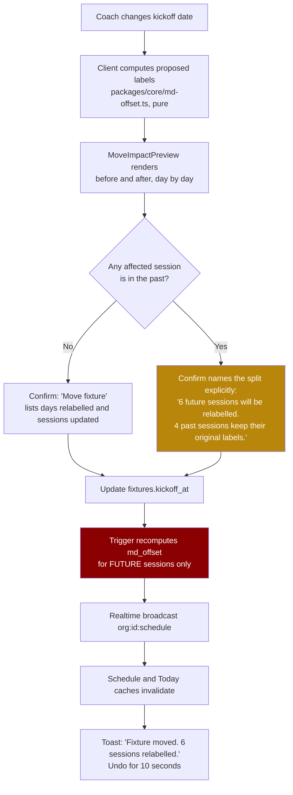
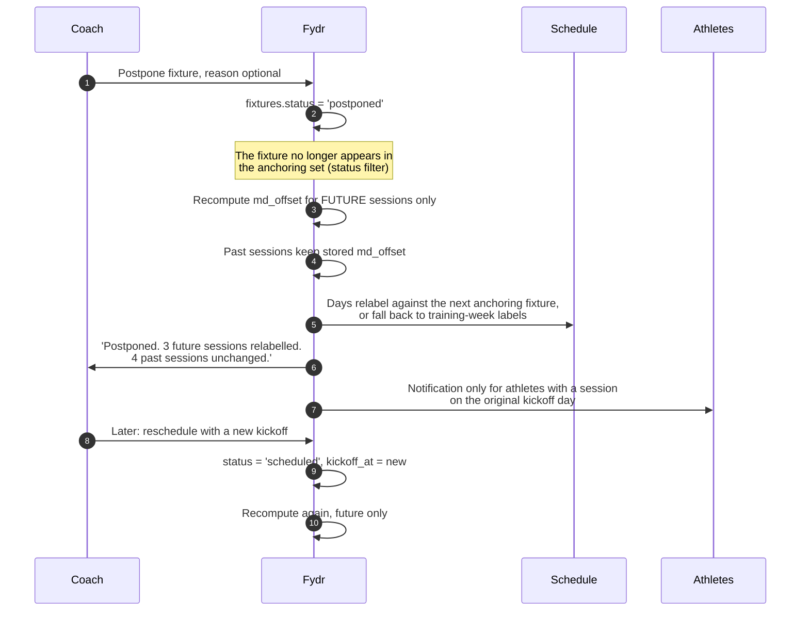

> **This file is not the specification.**
>
> It predates the build specification written on 4 September 2026 and is kept for
> its reasoning, not its instructions. Parts of it describe behaviour that has
> since been deliberately changed, and following it would rebuild things that were
> removed on purpose.
>
> **The binding specification for this screen is in `docs/screens/`, in the
> numbered files.** See `docs/screens/legacy/README.md` for how the two relate.

# Screen: Fixture detail

> **Layout status**: provisional. Awaiting client design photographs.

Screen 17 in the inventory (`02-information-architecture.md` §5). File: `docs/screens/fixture-detail.md`.

---

## Purpose

One fixture: who, when, where, what competition, how much it matters, whether it has been
played, and what the result was.

A fixture is not just a diary entry. It is the anchor of the MD-n spine. Creating one, moving
one, or postponing one changes the label on every day around it, changes which week template
applies, and changes what athletes are asked to submit. This screen is therefore responsible for
two things beyond the obvious:

1. **Showing the consequence of a change before it is made.** Moving a fixture from Saturday to
   Sunday relabels a week. The coach sees that before they confirm, not afterwards.
2. **Squad selection and availability at a glance.** Who is picked, who is fit, and where the
   two disagree. A coach picking a matchday squad needs availability in the same view as the
   selection, or they will pick an unavailable player.

---

## Roles and access

| Role | Access |
|---|---|
| Coach / S&C | Full read and write. Create, edit, move, postpone, cancel, record result, select the squad. |
| Medical / Physio | Full read, including selection and availability. Write on availability from this screen (the only role that can, per `01-roles-and-permissions.md` §4). No write on fixture fields or selection. |
| Admin | No access. |
| Athlete | Read-only, from Today. Sees opponent, kickoff, venue, home or away, competition, status, result, and **their own** selection status once the squad is published. Sees no other athlete's selection or availability. |

Selection visibility is the sensitive part. An athlete learning they have been dropped from a
push notification at 22:00 on a Thursday is a coaching problem Fydr should not create. Squad
selection is therefore **unpublished by default** and becomes athlete-visible only when a coach
explicitly publishes it. This is an assumption, raised as O-229.

---

## Entry points

| From | Route | Notes |
|---|---|---|
| Schedule, tap a fixture banner | `/schedule/fixture/{id}` | Drawer on web, full screen on mobile. |
| Schedule, "Add fixture" | `/schedule/fixture/new?date=...` | |
| Fixtures list (Schedule tab, Fixtures section) | `/schedule/fixtures` then a row | Season list of fixtures. |
| MD chip popover, "Open fixture" | `/schedule/fixture/{id}` | From any MD-n chip on any screen. |
| Session detail, the "Fixture" row | `/schedule/fixture/{id}` | |
| Dashboard, "Next fixture" card | `/schedule/fixture/{id}` | |
| Injury dashboard, "Available for Saturday" filter | `/schedule/fixture/{id}?tab=selection` | Opens on selection with availability sorted first. |
| Deep link from a weekly digest email | `https://app.fydr.io/schedule/fixture/{id}` | |

---

## Layout

### Mobile

```
+------------------------------------------------------+
| <  v Ashford RFC                          [ ... ]     |
|    Sat 8 Aug   15:00   HOME   League                  |
+------------------------------------------------------+
| [ Details ] [ Selection ] [ Week ]                    |
+------------------------------------------------------+
|                                                       |
|  +------------------------------------------------+   |
|  |            v ASHFORD RFC                       |   |
|  |            Saturday 8 August 2026              |   |
|  |            Kick off 15:00                      |   |
|  |            HOME    Memorial Ground             |   |
|  |            League    Key fixture               |   |
|  |            [ Scheduled ]                       |   |
|  +------------------------------------------------+   |
|                                                       |
|  MD-n                                                 |
|   This fixture anchors Mon 3 Aug to Sat 8 Aug         |
|   MD-5  MD-4  MD-3  MD-2  MD-1  MD                    |
|   [View the week]                                     |
|                                                       |
|  AVAILABILITY                          as at today    |
|   +----------+  +----------+  +----------+            |
|   | Available|  | Modified |  |Unavailable|           |
|   |    19    |  |     3    |  |     2     |           |
|   +----------+  +----------+  +----------+            |
|   2 expected back before kick off        >            |
|                                                       |
|  SELECTION                             23 of 23       |
|   Starting 15   Bench 8   Unavailable 2               |
|   Not published                                       |
|   [ Open selection ]                                  |
|                                                       |
|  SESSIONS THIS WEEK                            6      |
|   MD-5  Recovery            09:30    135              |
|   MD-4  Lower body          08:00    480              |
|   MD-4  Conditioning        18:00    720              |
|   MD-3  Team training       17:30    840              |
|   MD-2  Speed               09:00    450              |
|   MD-1  Captain's run       10:00    180              |
|   Week planned load 2805                              |
|                                                       |
|  RESULT                                               |
|   Not played yet                                      |
|                                                       |
+------------------------------------------------------+
|  [ Edit fixture ]                                     |
+------------------------------------------------------+
```

Selection tab:

```
+------------------------------------------------------+
| [ Details ] [ Selection ] [ Week ]                    |
+------------------------------------------------------+
| Starting 15 / 15    Bench 8 / 8      [Publish squad]  |
| [All squad v]   [Search]   [sort: position v]         |
+------------------------------------------------------+
| STARTING                                        15    |
|  1  Sam Okoye        Prop        Available            |
|  2  Ryan Doherty     Hooker      Modified: no contact |
|     (!) selected while restricted                     |
|  3  ...                                               |
+------------------------------------------------------+
| BENCH                                            8    |
| 16  Jack Whitlow     Hooker      Available            |
|  ...                                                  |
+------------------------------------------------------+
| NOT SELECTED                                    14    |
|     Tom Reeve        Lock        Unavailable          |
|                                  Return 15 Aug        |
|     ...                                               |
+------------------------------------------------------+
|  [ Save selection ]                                   |
+------------------------------------------------------+
```

### Web

```
+----------------------------------------------------------------------------------+
| <  v Ashford RFC    Sat 8 Aug 2026 15:00   [HOME]  League  [Key]  [Scheduled]     |
|                                     [Edit] [Postpone] [Record result] [ ... ]     |
+---------------------------------------------+------------------------------------+
| [ Details | Selection | Week | History ]    |  AVAILABILITY, as at 5 Aug          |
|                                             |   Available    19                   |
| DETAILS                                     |   Modified      3                   |
|  Opponent      Ashford RFC          [edit]  |   Unavailable   2                   |
|  Kick off      Sat 8 Aug 2026 15:00 [edit]  |   [############### |## | ##]        |
|  Venue         Memorial Ground      [edit]  |                                     |
|  Home or away  Home                 [edit]  |   Expected back before kick off  2  |
|  Competition   League               [edit]  |   [Open injury dashboard]           |
|  Importance    Key fixture          [edit]  |                                     |
|  Status        Scheduled            [edit]  |  SELECTION                          |
|  Season        2026/27                      |   Starting 15  Bench 8              |
|                                             |   Not published                     |
| MD-n IMPACT                                 |   Last changed 4 Aug, A Bell        |
|  Anchors 6 days: Mon 3 to Sat 8 August      |                                     |
|  18 sessions carry an MD-n from this fixture|  NEXT AND PREVIOUS                  |
|  [MD-5][MD-4][MD-3][MD-2][MD-1][MD]         |   Prev  v Rye, 1 Aug, W 24-17       |
|                                             |   Next  v Deal, 15 Aug              |
| WEEK SHAPE                                  |                                     |
|   1200 |        ##                          |  RESULT                             |
|    900 |        ##   ##                     |   Not played yet                    |
|    600 |   ##   ##   ##        ##           |   [Record result]                   |
|    300 |   ##   ##   ##   ##   ##           |                                     |
|      0 +--------------------------------    |                                     |
|         MD-5 MD-4 MD-3 MD-2 MD-1  MD        |                                     |
+---------------------------------------------+------------------------------------+
```

---

## Components

| Component | Source | Purpose |
|---|---|---|
| `FixtureHeader` | **New** | Opponent, date, time, home or away chip, competition, importance, status. Sticky. |
| `FixtureEditorSheet` | **New** | Create and edit form. |
| `MdImpactPanel` | **New** | Which days this fixture labels, how many sessions carry a label from it, and what a proposed change would do. The most important component on this screen. |
| `MoveImpactPreview` | **New** | Before-and-after day label comparison shown inside the move confirmation. |
| `MdChip` | **New**, see `schedule.md` | |
| `AvailabilityPill` | `06-design-system.md` §6.5 | Per athlete on the selection list. |
| `AvailabilityBar` | **New** | Stacked horizontal bar, three segments, per §8.1 "composition". Never a pie. |
| `SelectionList` | **New** | Three sections: Starting, Bench, Not selected. Drag between sections on web, action sheet on mobile. |
| `AthleteCard` | §6.1, `compact` | Rows in the selection list. |
| `LoadBar` | **New**, see `schedule.md` | The week-shape column chart, x axis ordered MD-5 to MD (§8.1). |
| `MetricTile` | §6.2 | Availability counts, week planned load. |
| `ConfirmSheet` | §6.18 | Move, postpone, cancel, publish squad. Postpone uses `tone: 'destructive'`. |
| `EmptyState` | §6.16 | No sessions in the week, no selection yet, no result. |
| `GroupFilter` | §6.7 | On the selection tab, because it is a multi-athlete surface (`CLAUDE.md` §3). |

---

## Data requirements

### Fields

| Field | Source | Transformation |
|---|---|---|
| Opponent | `fixtures.opponent` | Displayed with a leading "v ". |
| Kickoff | `fixtures.kickoff_at` | `at time zone org.timezone`. Date as "Sat 8 Aug 2026", time as "15:00". |
| Venue | `fixtures.venue` | Free text. Null renders the not-applicable glyph, not an empty string. |
| Home or away | `fixtures.home_away` | `home` \| `away` \| `neutral`, rendered as a chip with the word, not only a letter, outside dense contexts. |
| Competition | `fixtures.competition` | Free text in v1. See O-230. |
| Importance | `fixtures.importance` | `friendly` \| `normal` \| `key` \| `cup_final`. `key` and `cup_final` carry a filled marker. |
| Status | `fixtures.status` | `scheduled` \| `played` \| `postponed` \| `cancelled`. |
| Result | `fixtures.result` | Free text in v1, for example "W 24-17". See O-231. |
| Season | `fixtures.season_id` -> `seasons.name` | |
| Anchored sessions | `sessions.fixture_id = fixtures.id` | Count, and the list on the Week tab. |
| Days labelled | derived | Days whose computed `md_forward` resolves to this fixture, per the labelling rules in `schedule.md`. |
| Previous and next fixture | `fixtures` ordered by `kickoff_at` | For the "Prev / Next" panel and for computing the labelled range. |
| Availability counts | `availability` current rows for active athletes | Three counts. Computed as at today by default, with a toggle for "as at kick off" which uses `effective_to` and `injuries.expected_return`. |
| Expected back | `injuries.expected_return` | Count of athletes currently `unavailable` whose `expected_return <= kickoff date`. |
| Selection | `fixture_selections` (**new table**, see below) | Starting, bench, not selected, with shirt number and position. |
| Week planned load | `sessions.planned_load` summed by day within the anchored range | |

### Schema addition required: squad selection

There is no table for squad selection in `04-data-model.md`. `session_participants` on the match
session cannot carry a starting or bench distinction, a shirt number, or a published flag.

**Recommendation**, raised as O-232:

```sql
create type selection_status as enum ('starting','bench','reserve','not_selected','unavailable');

create table fixture_selections (
  id            uuid primary key default gen_random_uuid(),
  org_id        uuid not null references organisations(id),
  fixture_id    uuid not null references fixtures(id) on delete cascade,
  athlete_id    uuid not null references athletes(id),
  status        selection_status not null default 'not_selected',
  shirt_number  int,
  position      text,
  sequence      int not null default 0,          -- ordering within a section
  note          text,                            -- coach-visible, never clinical
  selected_by   uuid references users(id),
  created_at    timestamptz not null default now(),
  updated_at    timestamptz not null default now(),
  unique (fixture_id, athlete_id)
);

create index on fixture_selections (fixture_id, status);

-- Publication is a property of the fixture, not of each row.
alter table fixtures add column selection_published_at timestamptz;
alter table fixtures add column selection_published_by uuid references users(id);
```

Everything below assumes this table exists. Without it, the Selection tab cannot be built and
the screen reduces to Details plus Week.

### The primary query

```sql
-- Fixture detail. :fixture_id uuid
with org as (select id, timezone from organisations where id = auth_org_id()),
f as (
  select fx.*, o.timezone,
         (fx.kickoff_at at time zone o.timezone)::date as kickoff_date
  from fixtures fx cross join org o
  where fx.id = :fixture_id and fx.org_id = auth_org_id() and fx.deleted_at is null
),
neighbours as (
  select
    (select jsonb_build_object('id', p.id, 'opponent', p.opponent,
                               'kickoff_at', p.kickoff_at, 'result', p.result)
     from fixtures p, f
     where p.org_id = auth_org_id() and p.deleted_at is null
       and p.status in ('scheduled','played')
       and p.kickoff_at < f.kickoff_at
     order by p.kickoff_at desc limit 1)                     as previous_fixture,
    (select jsonb_build_object('id', n.id, 'opponent', n.opponent,
                               'kickoff_at', n.kickoff_at)
     from fixtures n, f
     where n.org_id = auth_org_id() and n.deleted_at is null
       and n.status in ('scheduled','played')
       and n.kickoff_at > f.kickoff_at
     order by n.kickoff_at asc limit 1)                      as next_fixture
),
-- Days this fixture labels: from the day after the previous fixture (or 9 days back,
-- whichever is later) up to and including kickoff day.
labelled_range as (
  select
    greatest(
      f.kickoff_date - 9,
      coalesce((select (p.kickoff_at at time zone f.timezone)::date + 1
                from fixtures p
                where p.org_id = auth_org_id() and p.deleted_at is null
                  and p.status in ('scheduled','played')
                  and p.kickoff_at < f.kickoff_at
                order by p.kickoff_at desc limit 1),
               f.kickoff_date - 9)
    )                       as from_date,
    f.kickoff_date          as to_date
  from f
),
anchored_sessions as (
  select s.id, s.title, s.session_type, s.starts_at, s.duration_min,
         s.md_offset, s.planned_rpe, s.planned_load, s.status,
         (s.starts_at at time zone f.timezone)::date as day
  from sessions s, f
  where s.org_id = auth_org_id()
    and s.deleted_at is null
    and s.fixture_id = f.id
),
active_athletes as (
  select a.id, a.first_name, a.last_name, a.squad_number, a.position
  from athletes a
  where a.org_id = auth_org_id() and a.deleted_at is null and a.status <> 'left_club'
),
availability_now as (
  select distinct on (av.athlete_id)
         av.athlete_id, av.status, av.reason_category, av.restrictions, av.injury_id
  from availability av
  join active_athletes aa on aa.id = av.athlete_id
  where av.org_id = auth_org_id()
    and av.effective_from <= now()
    and (av.effective_to is null or av.effective_to > now())
  order by av.athlete_id, av.effective_from desc
),
expected_back as (
  select count(*) as n
  from availability_now an
  join injuries i on i.id = an.injury_id
  where an.status = 'unavailable'
    and i.expected_return is not null
    and i.expected_return <= (select kickoff_date from f)
)
select
  (select to_jsonb(f) from f)                                        as fixture,
  (select to_jsonb(neighbours) from neighbours)                      as neighbours,
  (select to_jsonb(labelled_range) from labelled_range)              as labelled_range,
  (select count(*) from anchored_sessions)                           as anchored_session_count,
  (select jsonb_agg(to_jsonb(a) order by a.starts_at) from anchored_sessions a) as sessions,
  (select jsonb_build_object(
      'available',   count(*) filter (where coalesce(an.status,'available') = 'available'),
      'modified',    count(*) filter (where an.status = 'modified'),
      'unavailable', count(*) filter (where an.status = 'unavailable'),
      'total',       count(*))
   from active_athletes aa
   left join availability_now an on an.athlete_id = aa.id)           as availability_counts,
  (select n from expected_back)                                      as expected_back_count,
  (select jsonb_agg(jsonb_build_object(
      'athlete_id',   aa.id,
      'first_name',   aa.first_name,
      'last_name',    aa.last_name,
      'squad_number', aa.squad_number,
      'position',     aa.position,
      'availability', coalesce(an.status, 'available'),
      'restrictions', an.restrictions,
      'selection',    coalesce(fs.status, 'not_selected'),
      'shirt_number', fs.shirt_number,
      'sequence',     coalesce(fs.sequence, 999))
      order by coalesce(fs.sequence, 999), aa.last_name)
   from active_athletes aa
   left join availability_now an on an.athlete_id = aa.id
   left join fixture_selections fs
          on fs.fixture_id = :fixture_id and fs.athlete_id = aa.id)  as squad;
```

Week planned load by MD-n, for the week-shape chart:

```sql
select s.md_offset,
       sum(s.planned_load) as planned_load,
       count(*)            as session_count
from sessions s
where s.org_id = auth_org_id()
  and s.deleted_at is null
  and s.fixture_id = :fixture_id
  and s.status <> 'cancelled'
group by s.md_offset
order by s.md_offset;
```

Note this groups by the **stored** `md_offset`, not by a recomputed one. After a postponement
the chart therefore shows the week as it was planned, which is what a coach reviewing history
wants. A toggle switches to computed labels for a future fixture.

### Writes

| Action | Statement | Side effects |
|---|---|---|
| Create fixture | `insert into fixtures` | Trigger recomputes `md_offset` for all **future** sessions whose nearest anchoring fixture changes, and reassigns `sessions.fixture_id` where a session's nearest fixture is now this one. |
| Edit non-date fields | `update fixtures set opponent = ...` | None. |
| Move (change `kickoff_at`) | `update fixtures set kickoff_at = ...` | Same recompute as create. Preview shown first. |
| Postpone | `update fixtures set status = 'postponed'` | The fixture stops anchoring. Future sessions relabel against the next anchoring fixture. Past sessions keep their stored labels. |
| Reinstate a postponed fixture | `update fixtures set status = 'scheduled', kickoff_at = :new` | Requires a new kickoff. Treated as a create for recompute purposes. |
| Cancel | `update fixtures set status = 'cancelled'` | As postpone. Cancelled fixtures are never reinstated; create a new one. |
| Record result | `update fixtures set status = 'played', result = ...` | Marks anchored sessions on or before the kickoff date as `completed` where they are still `planned`. |
| Delete | `update fixtures set deleted_at = now()` | Permitted only when `status = 'scheduled'` and no session references it and no selection rows exist. Otherwise cancel. |
| Save selection | upsert `fixture_selections` | One row per athlete, batched into a single RPC. |
| Publish selection | `update fixtures set selection_published_at = now(), selection_published_by = auth_user_id()` | Makes selection visible to athletes and sends one notification per athlete, subject to quiet hours (`08-notifications.md` §5.3). |

The MD-n recompute is the same code path as the nightly `recompute_md_offsets` job
(`05-architecture.md` §7), invoked immediately by an `after update` trigger on `fixtures`. There
is one implementation and it lives in `packages/core/md-offset.ts` plus its SQL mirror.

---

## States

| State | Rendering |
|---|---|
| **Default, scheduled and future** | All tabs. Primary actions Edit, Postpone, Open selection. |
| **Default, played** | Result panel populated. Selection tab becomes read-only and is relabelled "Squad". Week tab shows planned against actual load per MD-n position. |
| **Postponed** | `severity.medium` banner across the top: "Postponed on 6 Aug by A Bell. This fixture no longer sets MD-n labels." All fields readable. Actions: Reschedule, Cancel. The MD-n impact panel shows what the postponement changed. |
| **Cancelled** | `status.unavailable` banner, everything read-only, no reschedule. |
| **Loading** | Skeleton header, three skeleton tiles, six skeleton session rows. |
| **Empty, no sessions in the week** | Week tab: `EmptyState` kind `notStarted`, "No sessions planned for this fixture." Actions "Apply a week template" and "Add session". |
| **Empty, no selection** | Selection tab: every athlete in "Not selected", with the caption "No squad selected yet." Action "Auto-fill from last fixture". |
| **Empty, no result** | "Not played yet" plus "Record result" for a past kickoff, or nothing for a future one. |
| **Error** | Section-scoped. A failed availability query leaves details and sessions readable with "Availability could not be loaded." |
| **Offline** | Read-only from cache with the standard offline banner. Selection editing disabled: it is a staff write and staff writes do not queue (`05-architecture.md` §6). |
| **Role: medical** | Fixture fields read-only. Availability panel gains an "Update availability" action. Selection read-only, with a "Flag a selection concern" action that notifies the coach. |
| **Role: athlete** | Details only, plus their own selection status if published, plus their own availability. |
| **Selection unpublished** | Chip "Not published" beside the selection summary. Publish action enabled for coaches. |
| **Selection published then changed** | Chip "Published, 2 changes since". Republish action. Athletes whose status changed are notified on republish, others are not. |

---

## Interactions

### Editing details

Inline edit on web, `FixtureEditorSheet` on mobile. Non-date fields save immediately and have no
side effects.

### Moving a fixture: the impact preview

This is the interaction that matters most on this screen, because it is the one that silently
changes the meaning of a week.



The preview is a two-row comparison, one column per affected day:

```
              Mon 3   Tue 4   Wed 5   Thu 6   Fri 7   Sat 8   Sun 9
  Now         MD-5    MD-4    MD-3    MD-2    MD-1     MD     MD+1
  After       MD-6    MD-5    MD-4    MD-3    MD-2    MD-1     MD
  Sessions      1       2       1       1       1       1       0
  Changed       y       y       y       y       y       y       y
```

Rules:

1. **Past days are shown but marked "keeps its label"** with the history glyph. The coach must
   be able to see that Fydr is not rewriting last Tuesday.
2. **The confirm copy states counts, not warnings.** "6 future sessions will be relabelled. 4
   past sessions keep their original labels." Never "Are you sure?" (`06-design-system.md` §12.2).
3. **Sessions whose nearest anchoring fixture changes are reassigned.** A move that puts a
   different fixture closer to a session updates that session's `fixture_id` as well as its
   `md_offset`. The preview names those sessions separately: "2 sessions will now be anchored to
   v Deal, 15 Aug."
4. **Undo is a compensating move**, not a snapshot restore. It reverses the kickoff change and
   re-triggers the recompute.
5. **Athletes are notified only when a session's date or time changes**, not when only its MD-n
   label changes. An athlete does not care about MD-n, they care about turning up at the right
   time.

### Postponement

Postponement is not deletion and it is not a move. It is the fixture ceasing to anchor while
staying on the record.



What the coach sees afterwards:

- The fixture stays in the fixtures list, struck through, with a "Postponed" chip and the
  original date in `text.tertiary`.
- The Schedule shows it in the all-day lane, struck through, and it contributes no MD-n label.
- Sessions that were planned for that week keep their stored `md_offset` and now display it
  alongside the day's new computed label, with the divergence glyph. The tooltip reads "Planned
  as MD-3 against v Ashford RFC, postponed 6 Aug."
- The match session, if one exists, is set to `cancelled`, not deleted, and its compliance
  expectations are waived with `waived_reason = 'fixture_postponed'`.

**Assumption**: postponing does not delete or move the training sessions around it. Coaches
usually keep the week's work and lose only the match. Offering to move the whole week is a
larger feature and is raised as O-233.

### Squad selection

| Action | Behaviour |
|---|---|
| Move an athlete between sections | Drag on web, "Move to..." action sheet on mobile. |
| Assign a shirt number | Inline numeric field on a starting or bench row. Duplicate numbers warn, do not block: some sports reuse numbers across a matchday squad. |
| Reorder within a section | Drag, or up and down actions. Order persists in `fixture_selections.sequence`. |
| Auto-fill from last fixture | Copies the selection of the most recent `played` fixture, then re-evaluates availability and moves anyone now unavailable to "Not selected" with a chip explaining why. |
| Select an unavailable athlete | Permitted. Row gains a `severity.medium` chip "selected while restricted", and the same override mechanic as `session-detail.md` applies: reason required, audit entry written, medical notified in their digest. Selection is a coaching decision and Fydr does not overrule it. |
| Sort | Position (default), squad number, surname, availability. |
| Filter | Group filter applies. Position filter local to the tab. |
| Publish squad | `ConfirmSheet`: "Publish the squad? 23 athletes will be able to see whether they are selected." Sends one notification each, respecting quiet hours. |
| Unpublish | Permitted before kickoff. Athletes are not notified of an unpublish, because a notification saying "your selection has been withdrawn from view" is worse than silence. |
| Export | Team sheet as PDF from the Reports pipeline. |

Counts against the sport's expected squad size come from `organisations.settings`. For rugby
union the default is 15 starting and 8 bench. A count over the expected size warns and does not
block, because friendlies and academy fixtures break every rule.

### Recording a result

- "Record result" opens a small form: result text, plus optional our score and their score.
- **v1 stores `fixtures.result` as free text**, per the schema. The form writes a normalised
  string, "W 24-17", from the two score fields, and keeps the free text field editable for
  results that do not fit, such as "Abandoned, 32 min". Structured scores are O-231.
- Recording a result sets `status = 'played'` and completes any still-planned sessions dated on
  or before the kickoff.

---

## Validation rules

| Rule | Enforcement | Message |
|---|---|---|
| Opponent required, 1 to 120 characters | Zod, `not null` | "Who is the fixture against?" |
| Kickoff required | Zod, `not null` | |
| Kickoff must fall inside the season | Server | "That date is outside the 2026/27 season." Offers to pick the correct season. |
| `home_away` required | Zod, enum | |
| Venue required when `home_away = 'neutral'` | Client | "A neutral fixture needs a venue." |
| Competition 0 to 80 characters | Zod | |
| Importance from the enum | Zod | |
| Status transitions restricted | Server | `scheduled -> played \| postponed \| cancelled`; `postponed -> scheduled \| cancelled`; `played -> scheduled` only with an explicit "correct this" action that clears the result; `cancelled` is terminal. |
| Result required when status becomes `played` | Client | "Record the result, or leave the fixture as scheduled." |
| Two fixtures on the same day | Warn, do not block | "There is already a fixture on 8 August." Double-headers exist. |
| Two fixtures within 48 hours | Warn | "This is 2 days after v Rye. Days between will carry both MD+n and MD-n labels." |
| Moving a fixture into the past | Warn, permit | "This date has passed. Past sessions keep their existing MD-n labels." |
| Deleting a fixture with sessions | Block | "3 sessions are anchored to this fixture. Cancel it instead, or move the sessions first." |
| Selection: shirt number 1 to 99 | Zod | |
| Selection: duplicate shirt number | Warn | "Number 9 is already used by Sam Okoye." |
| Selection: more than the expected starting count | Warn | "16 selected to start. Expected 15." |
| Publishing with zero selected | Block | "Select a squad before publishing." |
| Override reason required when selecting an unavailable athlete | Client and server | "Give a reason. This is recorded." |

---

## Edge cases

| Case | Behaviour |
|---|---|
| **Creating a fixture mid-week** | Days from the day after the previous fixture up to the new kickoff relabel immediately. Future sessions in that range get new `md_offset` values and, where the new fixture is now nearest, a new `fixture_id`. The creation confirm shows the same impact preview as a move. |
| **Creating a fixture in the past** | Permitted, for backfilling a season. It anchors nothing forward. Past sessions are **not** relabelled. A caption states that. |
| **Two fixtures in one week** | Days between carry `MD+n` from the first and `MD-n` from the second. Both fixtures' detail screens show a chip "Shares a week with v Rye, 5 Aug" and the MD-n impact panel shows the shortened labelled range. Week templates for such a week are handled in `md-planner.md`. |
| **Two fixtures on the same day** | Both anchor MD 0 for that day. Sessions are assigned to the fixture that is nearest in time, ties broken by `created_at`. The day chip reads "MD" once, and the fixture list shows both. |
| **Fixture postponed with a match session already played** | Not a real sequence, but reachable by a mis-click. The match session keeps `status = 'completed'` and its entries. The fixture shows a `severity.high` chip "Postponed after data was recorded" and the coach is prompted to correct one or the other. |
| **Fixture postponed, then a new fixture created earlier in the same week** | Recompute runs once against the new anchoring set. Days relabel to the new fixture. Past sessions unchanged. |
| **Fixture moved by 3 hours on the same day** | No MD-n change at all. No recompute, no notification other than to athletes with a session that day whose time is affected. |
| **Fixture moved across a DST boundary** | `kickoff_at` is `timestamptz`. The stored instant is preserved and the local time changes, which is wrong for a fixture: a 15:00 kickoff stays 15:00 local. The editor therefore captures local date and time and converts at write, and a move that crosses a DST boundary re-converts from the local wall time. This is easy to get wrong and must have a test. |
| **No previous fixture in the season** | The labelled range is capped at 9 days before kickoff. |
| **Next fixture is 3 weeks away** | Days beyond the 9-day horizon fall back to training-week labels, per `schedule.md`. The MD-n impact panel says "Labels 6 days. Earlier days have no fixture within 9 days." |
| **Fixture belongs to a previous season** | Read-only, with a chip "2025/26". Editing requires switching the active season. |
| **Athlete's availability changes after publication** | The selection row updates, the athlete stays selected, and the coach gets an in-app notification "Ryan Doherty is now unavailable and is selected for Saturday." Fydr never silently deselects. |
| **Athlete leaves the club between selection and kickoff** | Removed from the squad list, their `fixture_selections` row retained for history and shown in a "No longer at the club" section on a played fixture. |
| **Selection published, fixture postponed** | Athletes are notified of the postponement. The selection is retained and marked "For the original date". On reschedule the coach is asked whether to keep or clear it. |
| **Result recorded, then corrected** | Permitted. Writes an `audit_log` entry `fixture.result_corrected` with the old and new values, because results feed reports that may already have been circulated. |
| **Coach deletes a fixture that anchors nothing** | Soft delete, no recompute needed, no confirmation beyond the standard destructive sheet. |
| **Offline while selecting** | Selection editing is disabled offline. The tab renders the last known selection read-only. Queuing selection writes would create the exact conflict class `05-architecture.md` §6 excludes. |

---

## Performance notes

1. **One query for the whole screen**, as written above. The squad list is at most a few dozen
   rows.
2. **The recompute is the expensive operation, not the read.** It runs in a trigger over
   `sessions` filtered to `starts_at > now()` and to the affected date range only, never over the
   whole season. Bound it explicitly: sessions between the previous anchoring fixture and the
   next one, plus the 9-day horizon.
3. **The recompute must be idempotent**, because the nightly job runs the same logic. Running it
   twice produces the same `md_offset` values.
4. **Preview computation is client-side and pure.** `packages/core/md-offset.ts` takes the
   fixture list and a proposed change and returns the before and after labels. No round trip, so
   the preview updates as the coach scrolls a date picker.
5. **Indexes**: `fixtures (org_id, kickoff_at)` exists. Add
   `create index on fixture_selections (fixture_id, status)` and
   `create index on sessions (fixture_id)` (already specified in `04-data-model.md` §15).
6. **Availability counts** come from the indexed current-status partial index
   `availability (athlete_id, effective_from desc) where effective_to is null`.
7. **`staleTime`**: fixture 5 minutes, availability 60 seconds, selection 60 seconds. Subscribes
   to `org:{org_id}:availability` and invalidates the availability portion on message.
8. **Budget**: open to interactive under 500 ms p95 warm, 1.2 s cold. The recompute completes
   within 2 s for a season of 40 fixtures and 400 sessions; if it does not, it moves to an Edge
   Function with a progress state rather than blocking the confirm.

---

## Accessibility

- The impact preview is a `table` with row headers "Now" and "After" and column headers per day.
  It is not a graphic. A screen reader user gets the same information a sighted user gets from
  the two-row comparison.
- The confirm dialogue's body text repeats the counts in a sentence, so the decision does not
  depend on reading the table: "Moving this fixture relabels 6 days. 6 future sessions will be
  relabelled. 4 past sessions keep their original labels."
- Selection sections are `list` regions with headings carrying counts. Drag has a keyboard
  equivalent: focus a row, `Space` to pick up, arrows to move between sections and positions,
  `Enter` to drop, `Esc` to cancel, with each move announced.
- `AvailabilityBar` has a table alternative and an `accessibilityLabel`: "Availability. 19
  available, 3 modified, 2 unavailable, of 24 athletes."
- The week-shape chart follows §8.6: one-sentence label, table alternative, focusable columns on
  web, no colour-only encoding.
- Status chips carry words as well as colour: "Postponed", "Cancelled", "Played".
- Home and away is a word, not only the letters H and A, outside dense table contexts.
- The postponed banner is `role="status"`, announced on load, and is the first focusable region
  after the header.
- Dynamic type to 200%: the detail rows stack label above value, the impact preview scrolls
  horizontally with the day column header pinned.
- Touch targets 48 px, including the selection section move controls.

---

## Open questions

- **O-229** Should squad selection be published explicitly, or visible to athletes as soon as it
  is saved? I have assumed explicit publication with a per-athlete notification, because a coach
  half way through picking a side should not be broadcasting drafts. Confirm.
- **O-230** `fixtures.competition` is free text. Clubs will type "League", "league", and "Lge"
  in the same season and then ask why the report groups them separately. Do you want a
  `competitions` table per organisation? It is cheap now.
- **O-231** `fixtures.result` is free text. Structured scores (`score_for`, `score_against`,
  `outcome`) would let Fydr report on load against results, which is a question every coach
  eventually asks. I recommend adding them and keeping the free text as a display override.
- **O-232** `fixture_selections` does not exist in the data model. The Selection tab cannot be
  built without it. Confirm the table above, or tell me selection lives outside Fydr and I will
  cut the tab.
- **O-233** When a fixture is postponed, should Fydr offer to move the whole week's sessions
  with it? I have assumed not: coaches usually keep the training and lose the match. If you want
  it, it is a bulk reschedule with its own preview and undo.
- **O-234** Expected squad sizes per sport. I default to 15 starting and 8 bench for rugby
  union. Football is 11 and up to 9. Where should this live, `organisations.settings` or a per-
  competition setting?
- **O-235** Do you need opposition detail beyond a name: contact, ground address, travel time,
  kit clash? Clubs ask for this and it is scope creep towards a fixture-management product
  rather than a performance one. My assumption is a `venue` string and nothing more in v1.
- **O-236** Should availability "as at kick off" be the default view rather than "as at today"?
  It is more useful for selection and it is a projection, because it depends on
  `injuries.expected_return`, which is an estimate. I have defaulted to today, with a toggle,
  and labelled the projection clearly.

---

## Related documents

- The calendar → `schedule.md`
- Sessions anchored to this fixture → `session-detail.md`
- Week templates and the MD-n plan → `md-planner.md`
- Availability rules → `01-roles-and-permissions.md` §4
- MD-n rules and edge cases → `03-flows.md` §8
- Schema → `04-data-model.md` §4, §9
