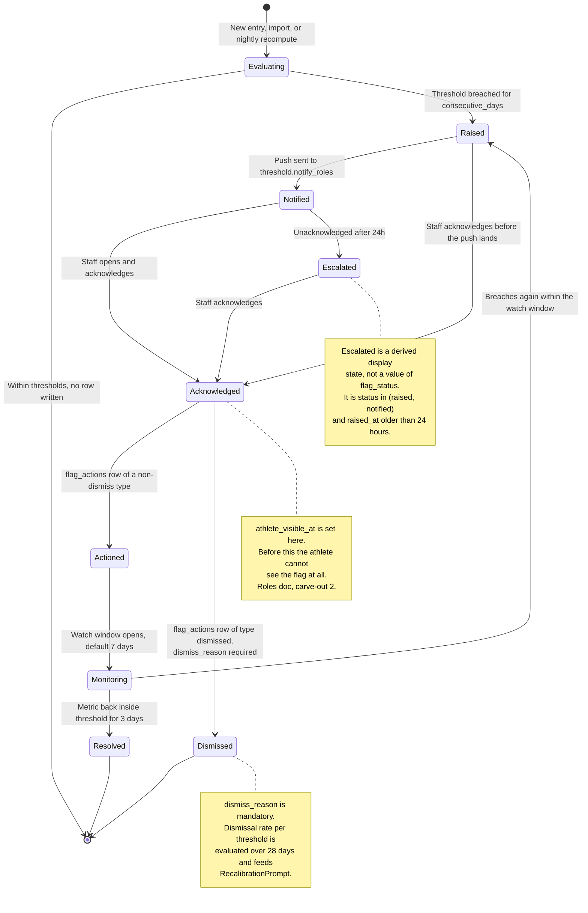

> **This file is not the specification.**
>
> It predates the build specification written on 4 September 2026 and is kept for
> its reasoning, not its instructions. Parts of it describe behaviour that has
> since been deliberately changed, and following it would rebuild things that were
> removed on purpose.
>
> **The binding specification for this screen is in `docs/screens/`, in the
> numbered files.** See `docs/screens/legacy/README.md` for how the two relate.

# Screen: Flags

> **Layout status**: provisional. Awaiting client design photographs.

Screen 10 in the inventory (`02-information-architecture.md` §5). Route `/staff/flags`.
Reached from the Dashboard tab. Drawn on the original navigation map as
`Dashboard → Flags` with four separate tabs: Flags, Wellness, Gym, GPS.

---

## Purpose

The flag system is the product. The dashboard is the packaging
(`00-product-overview.md` §"Core product thesis", claim 2). This screen is where a coach works
through the exceptions the engine has raised, decides what each one means, and records what they
did about it.

Four jobs:

1. List open flags across the filtered squad, ranked so the most urgent is first.
2. Show, per flag, what was observed against what was expected, and for whom.
3. Let staff acknowledge, action, or dismiss with a reason.
4. Detect when a threshold is producing flags nobody acts on, and offer to recalibrate it.

Job 4 is the one that determines whether the product survives contact with a real season. A flag
nobody acts on is worse than no flag, because it teaches staff to ignore the badge
(`03-flows.md` §5). Every monitoring system that has failed in this market failed here.

---

## Roles and access

| Role | Access | Notes |
|---|---|---|
| Coach / S&C | Full: view, acknowledge, action, dismiss. Also sets thresholds (screen 30). | |
| Medical | Full: view, acknowledge, action, dismiss. Cannot set thresholds (`01-roles-and-permissions.md` §2). | Medical additionally sees a "Refer to medical" action resolved to themselves and can convert a flag into an injury record. |
| Athlete | Their own flags only, and only after acknowledgement | Carve-out 2, `01-roles-and-permissions.md` §3. `flags.athlete_visible_at` is set on acknowledgement. Athletes reach their own flags through `my-data.md`, never this screen. |
| Admin | No access | `noPermission` empty state on direct navigation. |

**Group filter**: mandatory.

**Clinical boundary**: a flag never carries clinical detail. A `wellness.soreness` flag on an
athlete with an open injury shows the body area from `injuries.body_area` and nothing more. The
"Refer to medical" action creates a notification and a `flag_actions` row; it does not surface
any clinical field back to the coach who raised it.

---

## Entry points

| From | Trigger | Context carried |
|---|---|---|
| Dashboard, attention row long-press → "View flags" | Tap | Athlete pre-filtered |
| Dashboard, tap the flag badge on an attention row | Tap | Athlete pre-filtered, tab set to the flag's domain |
| Staff sidebar or tab bar | Direct | Tab "All", status `raised` and `notified` |
| Push `staff.flag.raised.high` | Tap | `/staff/flags/{flag_id}`, list opens with that flag expanded |
| Push `staff.flag.digest` | Tap | `/staff/flags?status=raised&date={date}` |
| Athlete profile, flags section | "View all flags" | Athlete pre-filtered |
| Thresholds screen (30) | "See flags from this threshold" | Threshold pre-filtered, status `all` |

Back always returns to the originating screen (`02-information-architecture.md` §7 rule 3).

---

## Layout

**Assumption, pending client design photographs.** The four segmented tabs are not an
assumption: they are transcribed from the drawing and confirmed in
`02-information-architecture.md` §4. What is assumed is that the first tab is called "All"
rather than "Flags". The drawing's first tab is labelled "Flags", which inside a screen already
called Flags reads as a tautology and will confuse. O-237 asks for confirmation.

### The four tabs

| Tab | Filter | Domains included |
|---|---|---|
| All | none | wellness, gym, gps, compliance, testing |
| Wellness | `domain = 'wellness'` | wellness |
| Gym | `domain = 'gym'` | gym |
| GPS | `domain = 'gps'` | gps |

Note that `flag_domain` has six values (`04-data-model.md` §10) and the drawing names three
tabs. Compliance and testing flags therefore appear only under "All". That is a real
gap and O-238 raises it. The sixth value, `'nutrition'`, never fires at all: nothing is logged,
no threshold writes to it, and it is retained in the enum only so the type does not have to be
rewritten (`nutrition-guidance.md` §9). It is not counted anywhere in this screen.

The tab bar is not extended unilaterally, because four segments is the transcribed design and a
six-segment control on a phone is unusable.

Tabs are a segmented control, not a scrollable tab bar. Each tab shows a count badge of open
flags in that domain, and a tab with zero open flags shows no badge rather than a zero
(`06-design-system.md` §6.4).

### Mobile, `md` 390 pt

```
┌────────────────────────────────────────────────┐
│ ‹  Flags          [All squad ▾]   [Today ▾]   │ 56 sticky
├────────────────────────────────────────────────┤
│ ┌────────────────────────────────────────────┐ │
│ │  All 7  │ Wellness 4 │  Gym 1  │  GPS 2   │ │ 44 segmented
│ └────────────────────────────────────────────┘ │
│  Open ▾   Severity ▾              7 open       │ 40 filter row
├────────────────────────────────────────────────┤
│  ┌──────────────────────────────────────────┐  │
│  │ ▮▮▮ HIGH        Wellness      07:14      │  │
│  │ S. Okafor  #7                            │  │ 128 pt card
│  │ Readiness      41  ↓  vs 70 expected     │  │
│  │ ▁▂▃▂▁▁▁ 28d ·  3rd consecutive day       │  │
│  │ ┌──────────┬──────────┬────────────────┐ │  │
│  │ │Acknowledge│ Action ▾ │   Dismiss     │ │  │ 48 pt actions
│  │ └──────────┴──────────┴────────────────┘ │  │
│  ├──────────────────────────────────────────┤  │
│  │ ▮▮▯ MED         Wellness      07:02      │  │
│  │ A. Byrne  #14                            │  │
│  │ Sleep hours   5.5  ↓  vs 7.8 expected    │  │
│  │ ▃▃▄▃▂▁▁ 28d                              │  │
│  │ [ Acknowledge ] [ Action ▾ ] [ Dismiss ] │  │
│  ├──────────────────────────────────────────┤  │
│  │ ▮▯▯ LOW         GPS           Yesterday  │  │
│  │ T. Fitzgerald  #3                        │  │
│  │ ACWR         1.62  ↑  vs 1.30 expected   │  │
│  │ ⚠ 4 of the last 5 flags from this        │  │ recalibration
│  │   threshold were dismissed.              │  │ prompt inline
│  │   [ Review threshold ]  [ Not now ]      │  │
│  └──────────────────────────────────────────┘  │
│                                                │
│  ACKNOWLEDGED (3)                        ⌄     │
│  RESOLVED TODAY (2)                      ⌄     │
└────────────────────────────────────────────────┘
```

### Web, `xl` 1280 px

Master and detail. The list occupies 5 columns and the selected flag's detail occupies 7,
because the detail panel carries the chart and the action history and a coach working through a
morning's flags wants to stay in the list.

```
┌────────┬──────────────────────────────────────────────────────────────────────┐
│        │ [All squad ▾] [Today ▾]                Tue 5 Aug · MD-4          ⚙︎ │
│ Fydr   ├──────────────────────────────────────────────────────────────────────┤
│        │  Flags     [ All 7 | Wellness 4 | Gym 1 | GPS 2 ]     Open ▾  ⤓      │
│ ▣ Dash │ ┌── 5 cols ─────────────┐ ┌── 7 cols ────────────────────────────┐  │
│  · Sqd │ │▮▮▮ S. Okafor      ▸   │ │ S. Okafor  #7          ▮▮▮ HIGH      │  │
│  · Flg │ │ Readiness 41 / 70     │ │ Wellness · readiness_score            │  │
│  · Tmt │ │ Wellness · 07:14      │ │ Raised 07:14, 3rd consecutive day     │  │
│  · Inj │ ├───────────────────────┤ │                                       │  │
│ ▤ Sched│ │▮▮▯ A. Byrne           │ │  100 ┤                                │  │
│ ▧ Squad│ │ Sleep 5.5 / 7.8       │ │      │ ╭──╮  personal 28d mean ─ ─ ─  │  │
│ ▨ Prog │ │ Wellness · 07:02      │ │   70 ┼─╯  ╰─╮ ─ ─ ─ ─ ─ ─ ─ ─ ─ ─ ─   │  │
│ ⋯ More │ ├───────────────────────┤ │      │       ╰──╮      threshold ····  │  │
│        │ │▮▯▯ T. Fitzgerald  ⚠   │ │   41 ┼· · · · · ╰●· · · · · · · · · ·  │  │
│        │ │ ACWR 1.62 / 1.30      │ │      └──────────────────────────────   │  │
│        │ │ GPS · Yesterday       │ │       9 Jul                   5 Aug    │  │
│        │ ├───────────────────────┤ │  n = 26 of 28 days · self-reported     │  │
│        │ │  ACKNOWLEDGED (3)  ⌄  │ │                                       │  │
│        │ │  RESOLVED TODAY(2) ⌄  │ │ Context                               │  │
│        │ │                       │ │  Availability  ● Available            │  │
│        │ │                       │ │  Load 7d       412 AU  ACWR 1.18      │  │
│        │ │                       │ │  Other flags   1 medium, gym          │  │
│        │ │                       │ │                                       │  │
│        │ │                       │ │ History                               │  │
│        │ │                       │ │  07:14 Raised by threshold "Readiness │  │
│        │ │                       │ │        drop, personal 28d"            │  │
│        │ │                       │ │  07:15 Notified: 2 coaches, 1 medical │  │
│        │ │                       │ │                                       │  │
│        │ │                       │ │ [Acknowledge] [Action ▾] [Dismiss]    │  │
│        │ └───────────────────────┘ └───────────────────────────────────────┘  │
└────────┴──────────────────────────────────────────────────────────────────────┘
```

### Grouping and ordering

Open flags are grouped by status, not by athlete, and ordered within the open group by:

1. Severity descending (`high`, `medium`, `low`)
2. Escalated before not escalated (unacknowledged for more than 24 hours)
3. `raised_at` ascending, oldest first
4. Athlete surname ascending

Ordering is deterministic and identical between clients. A coach who reads the list, walks to
the pitch, and reopens it must see the same order.

Acknowledged, monitoring, resolved, and dismissed flags live in collapsed sections beneath. They
are present because an acknowledged flag that vanishes leaves the coach unsure whether the tap
registered. They are collapsed because they are done.

---

## Components

| Component | Source | Purpose |
|---|---|---|
| `GroupFilter` | `06-design-system.md` §6.7 | Header |
| `PeriodSelector` | §6.8 | `allowed={['today','thisWeek','last7','last28','custom']}` |
| `SegmentedTabs` | Standard | The four tabs. 44 pt, equal width, count badges. |
| `FlagBadge` | §6.4 | Severity meter, count, domain glyph, status |
| `AthleteCard` | §6.1 | Athlete identity inside each flag card |
| `TrendSparkline` | §6.3 | Inline 28-day shape on the card, with `baseline` and `band` |
| `MetricTile` | §6.2 | Observed versus expected in the detail panel |
| `AvailabilityPill` | §6.5 | Context block in the detail panel |
| `ConfirmSheet` | §6.18 | Dismiss, which requires a reason and is behind a confirm |
| `BottomSheet` | §6.19 | Action picker on mobile |
| `EmptyState` | §6.16 | `allClear` when there are no open flags |
| `FlagCard` | **New**, this screen | The list row. Composition of the above. |
| `RecalibrationPrompt` | **New**, this screen | The alert-fatigue feature. See below. |

### `FlagCard`

```ts
export type FlagCardProps = {
  flag: {
    id: string; athleteId: string; domain: FlagDomain; metric: string;
    observedValue: number | null; expectedValue: number | null;
    severity: FlagSeverity; status: FlagStatus;
    flagDate: string; raisedAt: string;
    consecutiveDays: number;            // from the threshold's consecutive_days rule
    thresholdId: string | null; thresholdName: string | null;
  };
  athlete: { id: string; displayName: string; squadNumber?: number | null };
  /** 28-day series for the flagged metric. Nulls are gaps, never zeros. */
  series: Array<{ date: string; value: number | null }>;
  baseline: number | null;
  band: { lower: number; upper: number } | null;
  /** Set when this threshold has crossed the dismissal ratio. */
  recalibration?: RecalibrationSignal | null;
  onAcknowledge: (flagId: string) => void;
  onAction: (flagId: string, type: FlagActionType, note?: string) => void;
  onDismiss: (flagId: string, reason: string) => void;
  onOpenAthlete: (athleteId: string, domain: FlagDomain, date: string) => void;
  expanded?: boolean;
  busy?: boolean;
};
```

The observed-versus-expected line is the heart of the card and has a fixed grammar:

```
{Metric label}   {observed}  {direction glyph}  vs {expected} expected
```

Rendered with tabular figures at the metric's documented precision
(`06-design-system.md` §5.3). Direction uses the arrow shape and valence rules of §4.4:
readiness down is `unfavourable` and renders a hollow downward triangle, ACWR up is
`unfavourable` and renders a hollow upward triangle, and neither relies on colour.

When `baseline_type` is `personal_rolling`, the expected value is labelled "vs his 28-day norm"
rather than "vs expected", because the distinction between an absolute threshold and a personal
one is the distinction between noise and signal (`04-data-model.md` §10) and a coach must be
able to see which they are looking at.

### `RecalibrationPrompt`

The alert-fatigue feature, specified in `03-flows.md` §5 as a note on the `Dismissed` state and
built here.

```ts
export type RecalibrationSignal = {
  thresholdId: string;
  thresholdName: string;
  /** Flags raised by this threshold in the evaluation window. */
  raised: number;
  dismissed: number;
  actioned: number;
  windowDays: number;                 // default 28
  /** dismissed / raised, rounded to 2dp. */
  dismissalRate: number;
  /** Distinct athletes the dismissals covered. */
  athletesAffected: number;
  /** Most frequent dismiss_reason, with its count. */
  topReason: { reason: string; count: number } | null;
  /** Server-computed proposal. Null when no defensible suggestion exists. */
  suggestion: {
    kind: 'loosen_value' | 'increase_consecutive_days' | 'switch_to_personal_rolling'
        | 'restrict_to_group' | 'lower_severity' | 'deactivate';
    currentValue: string;             // human readable, e.g. "below 6.0 hours"
    proposedValue: string;            // e.g. "below 5.5 hours"
    projectedFlagsAvoided: number;    // recomputed against the same window
    projectedFlagsRetained: number;
  } | null;
};
```

**Trigger rule.** A recalibration signal is produced when, over a rolling 28 days:

- the threshold raised **at least 5** flags, and
- **at least 60%** of the resolved ones were dismissed rather than actioned, and
- the dismissals covered **at least 2** distinct athletes, and
- no recalibration prompt for this threshold has been shown in the last 14 days.

The distinct-athlete condition exists so that one athlete whose personal baseline is genuinely
unusual does not trigger a squad-wide threshold change. The 14-day cooldown exists so that a
coach who declines is not asked again tomorrow.

**Where it appears.** Inline on the first flag card raised by that threshold in the current
list, and as a persistent item at the top of the Thresholds screen (30). Not as a modal, not as
a toast, and never blocking the flag actions. A prompt that interrupts the morning's work will
be dismissed reflexively, which is the exact behaviour it exists to correct.

**Copy**, fixed:

> "4 of the last 5 flags from Sleep below 6 hours were dismissed, across 3 athletes. Most common
> reason: normal for this athlete. Loosening to 5.5 hours would have avoided 3 of them and kept
> 2."

Actions: "Review threshold" (navigates to screen 30 with the proposal pre-filled and editable),
"Not now" (14-day cooldown), "Never for this threshold" (permanent suppression, recorded on the
threshold row).

**The suggestion is never applied automatically.** Thresholds are a coach's clinical judgement
expressed as a rule, and a system that quietly loosens them is a system that stops raising the
flag that mattered. The proposal is arithmetic, the decision is not.

---

## Flag lifecycle

Normative. Extends `03-flows.md` §5 with the states actually stored in `flags.status` and the
transitions this screen performs.



**`Escalated` is not a stored status.** `flag_status` in `04-data-model.md` §10 is
`raised | notified | acknowledged | actioned | monitoring | resolved | dismissed`. Escalation is
computed, so a flag cannot be left in a stale escalated state by a failed job. The escalation
notification (`08-notifications.md` §4.2) is driven by the same predicate.

**Transitions this screen performs**, all through RPCs so the state machine is enforced
server-side rather than by the client sending a target status:

| RPC | From | To | Writes |
|---|---|---|---|
| `flag_acknowledge(flag_id)` | `raised`, `notified` | `acknowledged` | `acknowledged_at`, `acknowledged_by`, `athlete_visible_at` |
| `flag_action(flag_id, action_type, note)` | `acknowledged`, `monitoring` | `actioned` then `monitoring` | `flag_actions` row |
| `flag_dismiss(flag_id, reason)` | `raised`, `notified`, `acknowledged` | `dismissed` | `flag_actions` row with `dismiss_reason`, `resolved_at` |
| `flag_reopen(flag_id, reason)` | `dismissed`, `resolved` | `raised` | `flag_actions` note row. Undo path, see Interactions. |

An RPC receiving an invalid transition raises a domain rejection, which the client renders as a
plain-language message with no retry (`05-architecture.md` §10, expected domain rejection).

---

## Data requirements

### Field map

| Field | Source | Transformation |
|---|---|---|
| `flag_id` | `flags.id` | |
| `athlete_id`, `display_name`, `squad_number` | `athletes` | `left(first_name,1) \|\| '. ' \|\| last_name` |
| `domain` | `flags.domain` | Drives the tab filter and the domain glyph |
| `metric` | `flags.metric` | Mapped through the metric registry to a label, unit, precision, and `MetricDirection` |
| `observed_value` | `flags.observed_value` | Rendered at the metric's precision |
| `expected_value` | `flags.expected_value` | Label depends on `thresholds.baseline_type` |
| `severity` | `flags.severity` | Three-bar meter |
| `status` | `flags.status` | Section grouping |
| `escalated` | Derived: `status in ('raised','notified') and raised_at < now() - interval '24 hours'` | Sort key and badge |
| `raised_at` | `flags.raised_at` | "07:14" today, "Yesterday 18:30" within 7 days, then "28 July" |
| `threshold_name`, `baseline_type`, `consecutive_days` | `thresholds` | Explains why the flag exists |
| `series` | `mv_daily_athlete_summary` or the domain entry table | 28 points ending on `flag_date`, nulls preserved |
| `baseline`, `band` | `mv_wellness_baselines.mean`, `mean ± sd` | Only for `personal_rolling` thresholds |
| `availability_status` | `availability.status` latest open row | Context block |
| `other_open_flags` | `flags` count for the athlete excluding this one | Context block |
| `actions` | `flag_actions` | History list, with actor name and time |

**Not read**: any column of `injury_clinical`. The context block shows availability status and
body area only.

### List query

```sql
create or replace function public.flags_list(
  p_statuses   flag_status[] default array['raised','notified']::flag_status[],
  p_domains    flag_domain[] default null,
  p_group_ids  uuid[]        default '{}'::uuid[],
  p_athlete_id uuid          default null,
  p_from       date          default (current_date - 27),
  p_to         date          default current_date,
  p_limit      int           default 50,
  p_offset     int           default 0
)
returns table (
  flag_id uuid, athlete_id uuid, display_name text, squad_number int,
  domain flag_domain, metric text,
  observed_value numeric, expected_value numeric,
  severity flag_severity, status flag_status,
  flag_date date, raised_at timestamptz, escalated boolean,
  threshold_id uuid, threshold_name text, baseline_type baseline_type,
  consecutive_days int, availability_status availability_status,
  other_open_flags int, total_count bigint
)
language sql security invoker stable
as $$
with scoped as (
  select a.id, a.first_name, a.last_name, a.squad_number
  from athletes a
  where a.org_id = auth_org_id()
    and a.deleted_at is null
    and a.status <> 'left_club'
    and (p_athlete_id is null or a.id = p_athlete_id)
    and (cardinality(p_group_ids) = 0 or exists (
          select 1 from group_memberships gm
          where gm.athlete_id = a.id
            and gm.group_id = any (p_group_ids)
            and gm.removed_at is null))
),
base as (
  select f.*, count(*) over () as total_count
  from flags f
  join scoped s on s.id = f.athlete_id
  where f.org_id = auth_org_id()
    and f.status = any (p_statuses)
    and (p_domains is null or f.domain = any (p_domains))
    and f.flag_date between p_from and p_to
),
avail as (
  select distinct on (av.athlete_id) av.athlete_id, av.status
  from availability av
  where av.org_id = auth_org_id() and av.effective_to is null
  order by av.athlete_id, av.effective_from desc
)
select
  b.id, b.athlete_id,
  left(s.first_name,1) || '. ' || s.last_name,
  s.squad_number,
  b.domain, b.metric, b.observed_value, b.expected_value,
  b.severity, b.status, b.flag_date, b.raised_at,
  (b.status in ('raised','notified')
   and b.raised_at < now() - interval '24 hours') as escalated,
  t.id, t.name, t.baseline_type, t.consecutive_days,
  coalesce(av.status, 'available')::availability_status,
  (select count(*)::int from flags f2
    where f2.athlete_id = b.athlete_id
      and f2.id <> b.id
      and f2.status in ('raised','notified','acknowledged')),
  b.total_count
from base b
join scoped s     on s.id = b.athlete_id
left join thresholds t on t.id = b.threshold_id
left join avail av    on av.athlete_id = b.athlete_id
order by
  b.severity desc,
  (b.status in ('raised','notified')
   and b.raised_at < now() - interval '24 hours') desc,
  b.raised_at asc,
  s.last_name asc
limit p_limit offset p_offset;
$$;
```

### Series for the card sparkline

Fetched in one batched call for the whole visible page, not per card. Per-card fetching at 20
cards is 20 round trips and it is the most likely way this screen becomes slow.

```sql
select d.athlete_id, d.summary_date as date, d.readiness as value
from mv_daily_athlete_summary d
where d.org_id = auth_org_id()
  and d.athlete_id = any ($1::uuid[])
  and d.summary_date between $2 and $3
order by d.athlete_id, d.summary_date;
```

Metrics not held in the daily summary view (any `gps_records` or `gym_set_logs` derived metric)
read from `mv_acute_chronic_load` or a per-domain series function selected by
`metric_registry[metric].series_source`. The registry is a shared TypeScript constant in
`packages/core` and the mapping is a single source of truth for label, unit, precision,
direction, and series source.

### Recalibration query

```sql
create or replace function public.threshold_recalibration_signals(
  p_window_days int default 28
)
returns table (
  threshold_id uuid, threshold_name text,
  raised int, dismissed int, actioned int,
  dismissal_rate numeric, athletes_affected int,
  top_reason text, top_reason_count int
)
language sql security invoker stable
as $$
with resolved as (
  select f.threshold_id, f.athlete_id, f.status,
         fa.dismiss_reason
  from flags f
  left join lateral (
    select fa.dismiss_reason from flag_actions fa
    where fa.flag_id = f.id and fa.action_type = 'dismissed'
    order by fa.taken_at desc limit 1
  ) fa on true
  where f.org_id = auth_org_id()
    and f.threshold_id is not null
    and f.raised_at >= now() - make_interval(days => p_window_days)
),
agg as (
  select threshold_id,
         count(*)::int                                                as raised,
         count(*) filter (where status = 'dismissed')::int            as dismissed,
         count(*) filter (where status in ('actioned','monitoring','resolved'))::int as actioned,
         count(distinct athlete_id) filter (where status = 'dismissed')::int as athletes_affected
  from resolved
  group by threshold_id
),
reasons as (
  select distinct on (threshold_id)
         threshold_id, dismiss_reason,
         count(*)::int as reason_count
  from resolved
  where dismiss_reason is not null
  group by threshold_id, dismiss_reason
  order by threshold_id, count(*) desc
)
select a.threshold_id, t.name, a.raised, a.dismissed, a.actioned,
       round(a.dismissed::numeric / nullif(a.dismissed + a.actioned, 0), 2),
       a.athletes_affected, r.dismiss_reason, r.reason_count
from agg a
join thresholds t on t.id = a.threshold_id
left join reasons r on r.threshold_id = a.threshold_id
where a.raised >= 5
  and a.athletes_affected >= 2
  and a.dismissed::numeric / nullif(a.dismissed + a.actioned, 0) >= 0.60
  and not exists (
    select 1 from threshold_recalibration_prompts p
    where p.threshold_id = a.threshold_id
      and (p.suppressed_permanently
           or p.last_shown_at > now() - interval '14 days')
  );
$$;
```

The dismissal rate divides by resolved flags (`dismissed + actioned`), not by raised, so open
flags awaiting a decision do not drag the rate down and delay the prompt.

**Schema addition required**, and it belongs in this screen's migration:

```sql
create table threshold_recalibration_prompts (
  id                     uuid primary key default gen_random_uuid(),
  org_id                 uuid not null references organisations(id),
  threshold_id           uuid not null references thresholds(id) on delete cascade,
  last_shown_at          timestamptz not null default now(),
  shown_count            int not null default 1,
  outcome                recalibration_outcome,  -- reviewed|adjusted|declined|suppressed
  suppressed_permanently boolean not null default false,
  decided_by             uuid references users(id),
  decided_at             timestamptz,
  created_at             timestamptz not null default now(),
  unique (threshold_id)
);
```

The projected-impact figures in `RecalibrationSignal.suggestion` are computed by replaying the
proposed rule against the same 28-day window in an Edge Function, not in the list query. They
are expensive, they are only needed when a prompt is actually shown, and they are cached for
24 hours per threshold.

### Query keys

```ts
flags: {
  all: (orgId) => [...qk.org(orgId), 'flags'],
  list: (orgId, status, groupIds) => [...],       // exists in 05-architecture §9
  listFiltered: (orgId: string, p: {
    statuses: FlagStatus[]; domains: FlagDomain[] | null; groupIds: string[];
    athleteId: string | null; from: string; to: string;
  }) => [...qk.flags.all(orgId), 'list-filtered', {
    statuses: [...p.statuses].sort(), domains: p.domains ? [...p.domains].sort() : null,
    groupIds: [...p.groupIds].sort(), athleteId: p.athleteId, from: p.from, to: p.to,
  }] as const,
  detail: (orgId, flagId) => [...],               // exists
  series: (orgId: string, athleteIds: string[], metric: string, from: string, to: string) =>
    [...qk.flags.all(orgId), 'series', metric, from, to,
     { athleteIds: [...athleteIds].sort() }] as const,
  recalibration: (orgId: string) =>
    [...qk.flags.all(orgId), 'recalibration'] as const,
},
```

`staleTime` 0 for open flags, invalidated by realtime as well
(`05-architecture.md` §9). Recalibration signals: `staleTime` 1 hour.

---

## States

### Default

Tab "All", statuses `raised` and `notified`, period `Today`, group filter from global state.
Open flags listed, acknowledged and resolved sections collapsed beneath.

### Loading

Three skeleton flag cards at 128 pt. Tab counts render as skeleton pills, not zeros: a tab
showing "0" that then becomes "4" is worse than a tab showing nothing.

The sparkline inside each card has its own loading state and resolves after the list, because
the series query is batched separately. A card with a loaded metric and a loading sparkline is a
valid intermediate state and the card does not wait for it.

### Empty

| Condition | `kind` | Copy |
|---|---|---|
| No open flags, any tab, no filter | `allClear` | "No open flags. The squad is within thresholds." Fixed copy, `06-design-system.md` §12.2. |
| No open flags in this tab, others have some | `allClear` | "No open gym flags." Secondary action: "See all 7 flags". |
| Group filter excludes everyone with flags | `noResults` | "No open flags in Forwards." Action: "Clear filter". Names the filter, per §11.2. |
| No flags in the selected period | `noData` | "No flags between 9 July and 5 August." Action: "Change period". |
| No thresholds configured at all | `notStarted` | "No thresholds set. Flags are raised when a threshold is crossed." Action: "Set up thresholds" (coach only). |

The last one matters at onboarding: a new club with no thresholds sees an empty flags screen and
concludes the product does not work. The distinction between "nothing is wrong" and "nothing is
being watched" has to be visible.

### Error

| Failure | Behaviour |
|---|---|
| List query | Block error with retry: "Could not load flags. Check your connection and try again." |
| Series query | Cards render without sparklines and a single caption reads "Trends unavailable." The flags are still fully actionable, which is what matters. |
| Acknowledge mutation | Optimistic update rolls back, inline message on the card: "Could not acknowledge this flag. Try again." Retry offered. |
| Dismiss mutation | Rolls back. The reason the coach typed is preserved in the sheet, never discarded. |
| Invalid transition rejected | "This flag has already been acknowledged by Jamie Ellis." No retry. The list refetches so the coach sees the current state. |
| Recalibration query | Prompts simply do not appear. No error is shown: a missing suggestion is not a failure the coach can act on. Logged. |

### Offline

Cached flags render with "Last updated 07:48" and an offline chip. **All three actions are
disabled** with the explanation "You are offline. This will be available when you reconnect."
Staff writes are not queued in v1 (`06-design-system.md` §11.4). Acknowledging a flag offline
and having it silently discarded on reconnect would be materially worse than not offering it,
because the coach would believe the athlete had been told.

### Role-specific

| Role | Difference |
|---|---|
| Coach / S&C | Full actions. Recalibration prompt actions available, since only coaches set thresholds. |
| Medical | Full actions on flags. The recalibration prompt renders read-only with the copy "Ask a coach to review this threshold", because medical cannot set thresholds (`01-roles-and-permissions.md` §2). The action list gains "Create injury record", which opens `injury-record.md` in create mode pre-filled with the athlete and the flag reference. |
| Coach and medical | Union of both. |
| Athlete | Never reaches this screen. |

**Athletes under 18, added 5 August 2026.** The flag system is profiling of children under
standard 12 of the Children's Code (`09-security-and-compliance.md` §4.5). Profiling stays on for
minors, because turning it off would exclude the group most at risk of the injuries it exists to
predict, and that conclusion depends on three things that are specified elsewhere and are listed
here so they are not lost when this screen is built:

1. **`athlete.flag.shared` is default off for a minor and an organisation cannot lock it on**
   (`08-notifications.md` §5.4). A child learning by push that an alert was raised about them,
   with no adult present, is the failure mode.
2. **Where a flag is shared with a minor, it is explained in child-facing words**: what it is,
   what it is not, that a person decides what happens next, and that it is not used to decide
   selection. The wording is in `screens/onboarding.md` step 5c and the same words are reused
   here rather than rewritten.
3. **Detrimental use is prohibited in the club contract** (`13-legal-and-trademark.md` §5). If a
   club uses flag counts in selection, the profiling justification fails and flags for minors
   become staff-visible only. That is the trigger to watch for, and it is a commercial
   conversation before it is a product change. `[medium]`

---

## Interactions

| Action | Result |
|---|---|
| Tap a tab | Filters by domain. Selection persists per screen for the session. Counts update with the list. |
| Tap a flag card body | Mobile: expands the card to show the chart, context, and history. Web: selects it in the detail panel. |
| Tap the athlete name | Navigate to `athlete-profile.md`, the flag's domain tab, the flag's date. Back returns here. |
| **Acknowledge** | Optimistic. The card moves to the Acknowledged section with a 200 ms transition, or instantly under reduced motion. `athlete_visible_at` is set, so the athlete can now see it. A 5-second "Undo" appears in the same position. |
| **Action** | Opens a picker: "Load adjusted", "Spoke to athlete", "Referred to medical", "Note only". Each requires an optional note except "Note only", which requires text. Writes a `flag_actions` row and moves the flag to `monitoring` with a 7-day watch window. |
| **Add note** *(built 2026-08-30; the shipped, narrower form of "Action → Note only")* | Opens a textarea on the card. "Save note" appends the text to `flags.staff_note` and changes **nothing else** — no status transition, no `flag_actions` row, no 7-day monitoring window, and it is available on an **acknowledged** flag as well as an unacknowledged one, as many times as the coach wants. Notes **append** on their own line rather than overwriting, so the threshold engine's own explanation (migrations 0052/0053, which shares this column) survives and a flag can carry a short thread. A second button, "Save and acknowledge", keeps the old bundled behaviour for the common case. **Who the note is for is stated on the card, in full**: `flags_staff_select` (migration `0012`) grants SELECT on `flags` to coach **and** medical org-wide, so every coach and every clinician in the club reads it the moment it is saved, and the athlete joins that audience once acknowledgement sets `athlete_visible_at`. Earlier copy said the note "stays with the coaching staff", which named a narrower audience than the policy gives and read to a clinician as a confidentiality assurance about the one audience `CLAUDE.md` rule 3 keeps clinical detail away from. Medical staff can still write here — /flags is open to them, the UPDATE policy covers them, and non-clinical context from a physio is exactly what stops a coach chasing an athlete — but the card shows them an additional line: coaching staff read this field, so diagnosis and treatment detail belong on the injury record instead. That is a warning rather than a lock, because hiding the field from medical would not remove the hazard (the same column is writable through Acknowledge) while removing the useful half of the behaviour. The full **Action** picker above (four action types, `flag_actions` rows, `monitoring` and its watch window) is still **not built** — see `src/lib/queries/flags.ts`'s header. |
| **Dismiss** | Opens a `ConfirmSheet` requiring a reason. Reason is a picker with free text: "Normal for this athlete", "Known and expected", "Data error", "Already addressed", "Threshold too sensitive", "Other". "Other" requires text. Confirm label is "Dismiss flag", never "OK". |
| Undo, within 5 seconds | Reverses the transition and deletes the `flag_actions` row. After 5 seconds the only route back is "Reopen", which writes a new action rather than deleting history. |
| Reopen a dismissed flag | Available from the collapsed Dismissed section. Requires a reason. Returns the flag to `raised`. |
| Bulk select (web) | Checkbox per row, shift-click ranges. Bulk acknowledge is permitted. **Bulk dismiss is not.** A dismissal needs a reason per flag, and a single reason applied to twelve flags is a rubber stamp, which is the behaviour the recalibration feature exists to catch. |
| Tap "Review threshold" on a recalibration prompt | Navigate to `thresholds.md` with the threshold open and the proposal loaded into the editor, unapplied. Writes `outcome = 'reviewed'`. |
| Tap "Not now" | 14-day cooldown. Writes `outcome = 'declined'`, increments `shown_count`. |
| Tap "Never for this threshold" | Sets `suppressed_permanently`. Behind a `ConfirmSheet` stating the consequence: "This threshold will not be reviewed again automatically." |
| Change group filter | Refetch. Tab counts update. Selection in the web detail panel is cleared if the selected flag is no longer in the filtered set, and a caption explains why. |
| Realtime flag insert | New card animates in at its sorted position. The tab count increments. No sound, no toast. If the coach is mid-dismissal, the sheet is not disturbed. |
| Swipe a card left (mobile) | Reveals Acknowledge. Swipe right reveals Dismiss, which still opens the confirm sheet. Swipe is a shortcut to the buttons, never a way past the reason requirement. |

---

## Validation rules

| Rule | Enforcement |
|---|---|
| A dismissal must carry a reason | `flag_dismiss` RPC rejects a null or blank `reason`. The client disables Confirm until a reason is chosen. Both, because either alone is one refactor from failing. |
| "Other" requires free text of at least 3 characters | Client-side, with the message "Say why this flag is not a concern." |
| Only valid transitions are accepted | Enforced in the RPC by a `case` on the current status. The client never sends a target status, only an intent. |
| A flag cannot be acknowledged twice | The RPC is idempotent for the same actor and rejects a second actor with "Already acknowledged by {name} at 07:20." |
| `athlete_visible_at` is set only on acknowledgement | A trigger on `flags` asserts that `athlete_visible_at` is null whenever `status in ('raised','notified')`. Carve-out 2 is a permission rule and it deserves a database-level assertion. |
| Bulk dismiss is impossible | No RPC accepts an array for dismissal. Not a UI omission, an API one. |
| A recalibration proposal is never auto-applied | `threshold_recalibration_prompts.outcome` records `adjusted` only when a human saved a change on screen 30. |
| The observed value is rendered at the metric's precision | The metric registry supplies decimals. Rendering ACWR to four decimal places or sleep to zero both misrepresent the measurement. |
| A flag with a null `threshold_id` renders without a threshold name | Possible for engine-generated flags not tied to a configurable threshold. Renders "System rule" rather than a blank. |
| Escalation is computed, never stored | A migration adding an `escalated` column to `flags` should be rejected in review. |

---

## Edge cases

| Case | Handling |
|---|---|
| **Two staff acknowledge simultaneously.** | First write wins. The second gets a domain rejection and the list refetches. No error tone: "Jamie Ellis acknowledged this at 07:20." |
| **Coach dismisses, physio disagrees.** | Physio reopens with a reason. Both actions are in the history with actor and time. Nothing is lost and no one is overruled silently. |
| **A flag's athlete leaves the club.** | The flag remains and renders with the athlete card in its disabled state and a "Left club" chip. Open flags on departed athletes are excluded from the default list and available under "Include former athletes". |
| **A threshold is deleted while its flags are open.** | `flags.threshold_id` is nullable and the reference is not cascaded. The card renders "Threshold no longer exists" in place of the name. The flags remain actionable. |
| **A threshold is edited while its flags are open.** | Existing flags keep the `observed_value` and `expected_value` they were raised with. They are historical facts. Re-evaluating open flags against a changed rule would rewrite what a coach was told this morning. |
| **The metric has no series data**, for example a compliance flag. | Sparkline renders the insufficient-data state, a centred `·`. The card is otherwise complete. |
| **`consecutive_days` is 3 and the athlete missed a day in the middle.** | The flag engine's rule, not this screen's, but the card must say what happened: "3rd consecutive day, 1 day not submitted." Reading "3rd consecutive day" over a gap is misleading. |
| **A flag raised on an entry that was later corrected.** | A revision supersedes the entry; the engine re-evaluates and either resolves the flag automatically with `resolved_at` and an action row reading "Superseded by a correction", or raises a new flag. The original is never deleted. |
| **All flags in the list are from one threshold and all are dismissed.** | The recalibration prompt appears once, on the first card, not once per card. |
| **Recalibration prompt appears on a threshold a coach just created.** | The 5-flag and 2-athlete minimums make this unlikely, and the 28-day window makes it slow. If it happens, the prompt is correct: a brand new threshold firing five times and being dismissed five times is exactly the case worth flagging. |
| **A dismissed flag's threshold is loosened, and the same value is no longer a breach.** | Historical flags are unaffected. The next evaluation simply does not raise. |
| **Zero-severity or unknown severity.** | `flag_severity` is a non-null enum, so this cannot occur. A null arriving means a data integrity fault: render the card with a neutral badge, sort last, log at `error`. |
| **Push notification opens a flag that was resolved in the meantime.** | Resolution rule 5, `08-notifications.md` §7: the nearest list screen renders with "That flag has been resolved." Not a 404, not a spinner. |
| **28-day window contains a mid-season threshold change.** | The recalibration statistics mix flags raised under two rules. The prompt states the window and the raised count, and the threshold detail screen shows the change date. Splitting the window at the edit is more correct and is more complexity than the feature warrants at v1. Noted, not built. |

---

## Performance notes

| Concern | Approach |
|---|---|
| List query | Served by `create index on flags (org_id, status, flag_date desc) where status in ('raised','notified')`. The default filter matches that partial index exactly. Wider status filters fall back to `(athlete_id, flag_date desc)` plus the org index, which is acceptable because those queries are user-initiated and infrequent. |
| Count for tab badges | `count(*) over ()` in the same query, not a second round trip. Per-domain counts come from one grouped query issued in parallel with the list. |
| Series batching | One query for every athlete on the visible page. At 20 cards over 28 days this is 560 rows from a materialised view. Per-card fetching is banned by review. |
| Pagination | 50 per page, infinite scroll on mobile, explicit paging on web. `total_count` is returned so the header can say "7 open" without a second query. |
| Realtime | Subscribed to `flags` inserts and updates filtered by `org_id`, per `05-architecture.md` §8. The handler invalidates rather than patching, because sort position depends on server-side predicates. Invalidations are debounced at 500 ms so a bulk import raising 30 flags causes one refetch. |
| Optimistic updates | Acknowledge and bulk acknowledge are optimistic, per the mutation rule in `05-architecture.md` §9: trivially reversible staff actions only. Dismiss is not optimistic, because it requires a reason and a rollback would strand the typed text. |
| Recalibration | Signal query runs once per screen mount, `staleTime` 1 hour. The projected-impact replay runs only when a prompt is rendered, in an Edge Function, cached 24 hours per threshold. It is never on the critical path of the list. |
| Chart rendering | The detail chart draws 28 points. No animation on redraw. Sparklines are memoised on `athlete_id + metric + from + to`. |
| Budget | List query 200 ms p95 server time. Screen interactive 1.2 s p95 on desktop broadband, inside the 1.5 s dashboard budget since this screen carries less. |

---

## Accessibility

| Requirement | Implementation |
|---|---|
| Heading structure | `h1` "Flags", `h2` per status section, `h3` per flag card carrying the athlete name. |
| Tabs | `role="tablist"`, `aria-selected`, arrow-key navigation, `aria-controls` pointing at the panel. Count badges are inside the tab's accessible name: "Wellness, 4 flags". |
| Card label | `{severity} severity. {domain}. {athlete}. {metric} {observed}, expected {expected}. Raised {time}. {status}.` Example: "High severity. Wellness. S. Okafor. Readiness 41, expected 70. Raised 07:14. Open." |
| Sparkline label | Per `06-design-system.md` §10.3: "Readiness down 29 over 28 days, worse." |
| Action buttons | Labelled with the athlete: "Acknowledge flag for S. Okafor". Three identical "Acknowledge" buttons in a list are unusable with a screen reader. |
| Dismiss dialogue | Focus moves to the reason picker on open, returns to the dismiss button on cancel. No keyboard trap. The reason field is associated with its label and its error. |
| Live region | The list is `aria-live="polite"`. A realtime insert announces "New high severity flag: A. Byrne, wellness." A single new flag is worth announcing in full; more than two in one debounce window announce as a count. |
| Undo | The undo affordance is focusable and announced: "Flag acknowledged. Undo available for 5 seconds." Its timeout does not apply to keyboard users who have focused it, per the no-time-limits rule in `06-design-system.md` §10.5. |
| Recalibration prompt | `role="status"`, not `role="alert"`. It is information, not an interruption. Its full text is read including the numbers, because "4 of 5 dismissed" is the entire argument. |
| Severity without colour | Three-bar meter, one to three bars filled, plus the word. Verified in greyscale. |
| Touch targets | Action buttons 48 pt tall, 8 pt apart. Swipe actions are a shortcut and never the only route. |
| Dynamic type | At 200% the action row stacks vertically and the card grows. The observed-versus-expected line wraps after the observed value, keeping the number adjacent to its label. |
| Reduced motion | Card transitions become instant, the realtime insert does not animate, and the sparkline renders complete rather than drawing in. |
| Keyboard, web | `j` and `k` move selection, `a` acknowledges, `d` opens dismiss, `Enter` opens the athlete, `1` to `4` switch tabs. Discoverable through `?`. |

---

## Open questions

- **O-237**: Tab labelling. Your drawing labels the first tab "Flags" inside a screen called
  Flags. I have renamed it "All". Confirm, or tell me the drawing means something else by the
  nesting.
- **O-238**: `flag_domain` has six values (wellness, gym, gps, nutrition, compliance, testing)
  of which five can fire, and the drawing gives four tabs. Compliance and testing flags
  currently appear only under "All". Nutrition never fires. Options: leave it, add an overflow
  "More" segment, or make the tab set configurable per organisation. I recommend leaving it for v1 and revisiting once we see which
  domains actually fire.
- **O-239**: Recalibration trigger thresholds. I have set 5 flags, 60% dismissal, 2 distinct
  athletes, 28-day window, 14-day cooldown. These are defensible and they are guesses. Too
  sensitive and the prompt becomes its own alert fatigue; too lax and it never fires. Your
  judgement.
- **O-240**: Should a recalibration suggestion ever be applied automatically, with a
  notification, if a coach ignores the prompt three times? I have said no, on the grounds that
  silently loosening a safety threshold is indefensible. Worth confirming, because "the app
  keeps nagging me" is a real complaint.
- **O-241**: Watch window after an action. I have set 7 days of `monitoring` with resolution
  after 3 days inside the threshold. Both numbers need your sports science judgement, and they
  probably differ by domain: a sleep flag and an ACWR flag do not resolve on the same timescale.
- **O-242**: Dismiss reason list. The six options above are mine. A club will want to add their
  own. Should the list be organisation-configurable, and if so does that break the recalibration
  statistics, which key on reason text? I would key on a stable reason code with a
  club-editable label.
- **O-243**: Bulk acknowledge is permitted, bulk dismiss is not. This is a deliberate friction
  and coaches will ask for bulk dismiss on a Monday morning after a heavy weekend. Confirm you
  want the friction held, because removing it later is easy and adding it back is not.

---

## Related documents

- Lifecycle source → `03-flows.md` §5
- Threshold configuration → `thresholds.md` (screen 30)
- Where flags surface first → `dashboard.md`
- Notification behaviour and escalation → `08-notifications.md` §4.1, §4.2
- Flag and threshold schema → `04-data-model.md` §10
