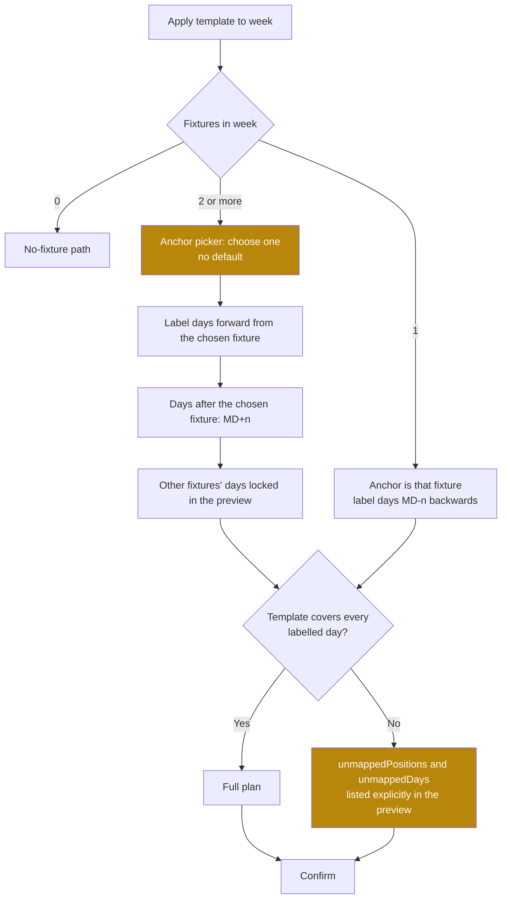

> **This file is not the specification.**
>
> It predates the build specification written on 4 September 2026 and is kept for
> its reasoning, not its instructions. Parts of it describe behaviour that has
> since been deliberately changed, and following it would rebuild things that were
> removed on purpose.
>
> **The binding specification for this screen is in `docs/screens/`, in the
> numbered files.** See `docs/screens/legacy/README.md` for how the two relate.

# Screen: MD-n planner

> **Layout status**: provisional. Awaiting client design photographs.

Screen 18 in the inventory (`02-information-architecture.md` §5). File: `docs/screens/md-planner.md`.
Drawn on the client's navigation map as `Schedule -> MD-1`.

---

## Purpose

The MD-n planner is where the shape of a training week is defined once and reused. It has two
modes in one screen:

1. **Builder**: define what happens at each MD-n position. Session types, titles, times,
   durations, planned RPE, and which entries athletes are required to submit. Save it as a
   reusable `week_templates` row.
2. **Applier**: point a template at a real week, see the sessions it would create against the
   real fixture, adjust, and commit.

Between the two sits the thing that makes the screen worth building: a **chart of the resulting
weekly load distribution**, drawn before anything is committed. A coach can see the shape of the
week, spot that they have stacked two RPE 8 sessions on MD-4, and fix it in the plan rather than
in the athletes.

This screen is the mechanism behind `03-flows.md` §8. It is also the mechanism behind compliance
being meaningful: `compliance_expectations` are generated from the sessions this screen creates,
so an athlete is never marked non-compliant on a day the template marks as off.

---

## Roles and access

| Role | Access |
|---|---|
| Coach / S&C | Full read and write. Create, edit, duplicate, archive templates. Apply to a week. |
| Medical / Physio | Read. May apply a template containing only `rehab` sessions. May not edit a training template. Consistent with O-110. |
| Admin | No access. |
| Athlete | No access. Athletes see the resulting sessions, never the template. |

Templates are organisation-scoped (`week_templates.org_id`). There is no global template library
in v1; a starter set is seeded per organisation at onboarding so a new club is not staring at an
empty screen. Raised as O-286.

---

## Entry points

| From | Route | Notes |
|---|---|---|
| Schedule tab, "MD-n planner" | `/schedule/planner` | Opens on the template list. |
| Schedule week header, "Apply template" | `/schedule/planner/apply?week={iso_week}` | Opens the applier for that week with the template picker open. |
| Schedule week footer, "Open in MD-n planner" | `/schedule/planner/apply?week={iso_week}` | |
| Fixture detail, "Apply a week template" | `/schedule/planner/apply?fixture={fixture_id}` | Resolves the week from the fixture. |
| Settings, "Week templates" | `/schedule/planner` | |
| Onboarding checklist, "Set up your training week" | `/schedule/planner/new` | |
| Template list, a row | `/schedule/planner/{template_id}` | Builder. |

---

## Layout

### Template list

```
+------------------------------------------------------+
| <  Week templates                          [ + New ]  |
+------------------------------------------------------+
|  Standard 1-game week                                 |
|  6 days planned   9 sessions   load 2805              |
|  MD-5 MD-4 MD-3 MD-2 MD-1 MD                          |
|  Used 14 times   Last used 3 Aug            [Apply]   |
+------------------------------------------------------+
|  Two-game week                                        |
|  7 days planned   7 sessions   load 2150              |
|  MD-3 MD-2 MD-1 MD MD+1 MD+2 MD                       |
|  Used 3 times    Last used 20 Jul           [Apply]   |
+------------------------------------------------------+
|  No-fixture week                                      |
|  5 days planned   8 sessions   load 3100              |
|  D1 D2 D3 D4 D5                                       |
|  Used 6 times    Last used 27 Jul           [Apply]   |
+------------------------------------------------------+
|  Pre-season loading                          Archived |
+------------------------------------------------------+
```

### Builder, mobile

```
+------------------------------------------------------+
| <  Standard 1-game week                    [Save]     |
+------------------------------------------------------+
| Name    Standard 1-game week                          |
| Anchor  Fixture (MD-n)          [Fixture][No fixture] |
| Covers  MD-6 to MD+2                        [edit]    |
+------------------------------------------------------+
| WEEKLY LOAD                              total 2805   |
|  1200 |             ##                                |
|   900 |             ##    ##                          |
|   600 |       ##    ##    ##          ##              |
|   300 |       ##    ##    ##    ##    ##              |
|     0 +---------------------------------------------  |
|        MD-6  MD-5  MD-4  MD-3  MD-2  MD-1   MD  MD+1  |
|         off   135  1200   840   450   180   600    0  |
|                     ^ highest                         |
+------------------------------------------------------+
| MD-6                                       [+ session]|
|   Off. Nothing scheduled.                             |
|   Required: none                                      |
+------------------------------------------------------+
| MD-5                                       [+ session]|
|  +------------------------------------------------+   |
|  | recovery  Recovery          09:30   45m  RPE 3 |   |
|  | load 135                              [edit]   |   |
|  +------------------------------------------------+   |
|   Required: [x] Wellness  [x] RPE  [ ] Nutrition      |
+------------------------------------------------------+
| MD-4                                       [+ session]|
|  +------------------------------------------------+   |
|  | gym       Lower body        08:00   60m  RPE 8 |   |
|  | load 480                              [edit]   |   |
|  +------------------------------------------------+   |
|  +------------------------------------------------+   |
|  | training  Conditioning      18:00   90m  RPE 8 |   |
|  | load 720                              [edit]   |   |
|  +------------------------------------------------+   |
|   Required: [x] Wellness  [x] RPE  [x] Nutrition      |
|   (!) 1200 is the heaviest day. Next heaviest 840.    |
+------------------------------------------------------+
| ...                                                   |
+------------------------------------------------------+
| MD  (matchday)                             [+ session]|
|  +------------------------------------------------+   |
|  | match     Fixture                   -     -    |   |
|  | Created from the fixture              [edit]   |   |
|  +------------------------------------------------+   |
|   Required: [x] Wellness  [x] RPE  [ ] Nutrition      |
+------------------------------------------------------+
```

### Builder, web

```
+----------------------------------------------------------------------------------+
| <  Standard 1-game week                    [Duplicate] [Archive] [Save changes]   |
+---------------------------------------------+------------------------------------+
| 8 columns                                   | 4 columns, sticky                   |
|                                             |                                     |
| MD-6  MD-5  MD-4  MD-3  MD-2  MD-1   MD  +1 |  WEEK SHAPE                         |
| +---+ +---+ +---+ +---+ +---+ +---+ +---+ + |   Total planned load     2805       |
| |   | |Rec| |Gym| |Trn| |Spd| |Cap| |MCH| | |   Sessions               9          |
| |   | |45m| |60m| |90m| |45m| |45m| |80m| | |   Training days          6          |
| |   | |R3 | |R8 | |R8 | |R6 | |R4 | | - | | |   Rest days              1          |
| |   | +---+ +---+ +---+ +---+ +---+ +---+ | |   Heaviest day        MD-4  1200    |
| |   |       |Cnd|                         | |   Lightest training   MD-1   180    |
| |   |       |90m|                         | |   Monotony              1.42        |
| |   |       |R8 |                         | |                                     |
| +---+ +---+ +---+ +---+ +---+ +---+ +---+ + |  COMPARISON                         |
|  off   135  1200   840   450   180   600  0 |   vs squad 4-week mean   +8%        |
| +---+ +---+ +---+ +---+ +---+ +---+ +---+ + |   vs 'Two-game week'    +30%        |
| | . | | W | | W | | W | | W | | W | | W | | |                                     |
| |   | | R | | R | | R | | R | | R | | R | | |  REQUIRED ENTRIES                   |
| |   | |   | | N | | N | |   | | N | |   | | |   Wellness   6 of 8 days            |
| +---+ +---+ +---+ +---+ +---+ +---+ +---+ + |   RPE        6 of 8 days            |
|                                             |   Nutrition  3 of 8 days            |
|  1200 |         ##                          |                                     |
|   900 |         ##   ##                     |  This template has been applied     |
|   600 |    ##   ##   ##         ##          |  14 times. Last on 3 Aug 2026.      |
|   300 |    ##   ##   ##   ##    ##          |                                     |
|     0 +--------------------------------     |                                     |
|       MD-6 MD-5 MD-4 MD-3 MD-2 MD-1  MD +1  |                                     |
+---------------------------------------------+------------------------------------+
```

### Applier

```
+----------------------------------------------------------------------------------+
| <  Apply template to Mon 3 Aug to Sun 9 Aug 2026                                  |
+----------------------------------------------------------------------------------+
| Template  [ Standard 1-game week            v ]                                   |
| Anchor    v Ashford RFC, Sat 8 Aug 15:00                    1 fixture this week    |
| Strategy  ( ) Add alongside  (o) Replace planned  ( ) Fill gaps only              |
+----------------------------------------------------------------------------------+
|          MON 3   TUE 4   WED 5   THU 6   FRI 7   SAT 8   SUN 9                    |
|          MD-5    MD-4    MD-3    MD-2    MD-1    MD      MD+1                     |
|          -------------------------------------------------------                  |
| Existing  Recov   -       Team    -       -      [FIX]    -                       |
|                           trng                                                    |
|          -------------------------------------------------------                  |
| Template  Recov   Gym     Team    Speed   Capt   Match    off                      |
|           09:30   08:00   17:30   09:00   run    15:00                            |
|                   Cond                    10:00                                   |
|          -------------------------------------------------------                  |
| Result    keep    +2 new  keep    +1 new  +1 new  keep    -                        |
|           1 kept          1 kept                  1 kept                          |
+----------------------------------------------------------------------------------+
| LOAD BEFORE AND AFTER                                                             |
|  1200 |            ##                                                             |
|   900 |            ##    ##                                                       |
|   600 |      ##    ##    ##          ##          before  after                    |
|   300 |      ##    ##    ##    ##    ##          975     2805                     |
|     0 +---------------------------------                                          |
|        MD-5  MD-4  MD-3  MD-2  MD-1   MD                                          |
|        [ ] before   [#] after                                                     |
+----------------------------------------------------------------------------------+
| 6 sessions will be created. 3 existing sessions kept. 0 removed.                   |
| Compliance expectations will be regenerated for 24 athletes, 3 to 9 August.        |
|                                        [ Cancel ]   [ Apply template ]            |
+----------------------------------------------------------------------------------+
```

---

## Components

| Component | Source | Purpose |
|---|---|---|
| `TemplateList` | **New** | Rows with summary, usage count, apply action. |
| `MdPositionColumn` | **New** | One MD-n position in the builder: header chip, session cards, required-entry toggles, day load total. |
| `TemplateSessionCard` | **New** | A planned session inside a template. Not `SessionCard`: it has no date, no participants, and no attendance. |
| `WeekLoadChart` | **New** | Grouped column chart, x axis ordered MD-6 to MD+2. Mandated form for "How does load vary by MD-n" (`06-design-system.md` §8.1). Zero-based y axis (§8.2 rule 2). |
| `LoadComparisonChart` | **New** | The applier's before-and-after variant: paired columns per MD-n position. Paired columns, not a line, because two points do not imply continuity (§8.1). |
| `RequiredEntriesRow` | **New**, shared with `schedule.md` | Wellness, RPE, nutrition toggles per MD-n position. |
| `AnchorPicker` | **New** | Fixture anchor selection in the applier, including the two-fixture and no-fixture cases. |
| `StrategyRadioGroup` | **New** | Add alongside, Replace planned, Fill gaps only. Never defaulted silently. |
| `ApplyPreviewGrid` | **New** | The three-row Existing / Template / Result comparison. |
| `MetricTile` | §6.2 | Summary statistics in the right rail. Aggregates carry footnotes. |
| `NumberStepper` | §6.11 | Duration and planned RPE. |
| `ConfirmSheet` | §6.18 | Apply, archive, discard unsaved template changes. |
| `EmptyState` | §6.16 | No templates, template with no sessions, week with no fixture. |
| `BottomSheet` | §6.19 | Session editor within the builder on mobile. |

---

## Data requirements

### Template storage

`week_templates.structure` is `jsonb` (`04-data-model.md` §4). The documented shape is missing
three things the builder needs: a start time per session, a location, and a version marker so
the shape can evolve without a migration guessing game.

**Recommended structure, version 2**, additive and backwards compatible with the documented
shape:

```json
{
  "version": 2,
  "anchor": "fixture",
  "covers": { "from": -6, "to": 2 },
  "days": [
    {
      "md_offset": -5,
      "label_override": null,
      "sessions": [
        {
          "key": "b3f1c2",
          "type": "recovery",
          "title": "Recovery",
          "start_time": "09:30",
          "duration_min": 45,
          "planned_rpe": 3,
          "location": "Pool",
          "is_contact": false,
          "participants": { "mode": "all_squad", "group_ids": [] },
          "notes": null
        }
      ],
      "requires": { "wellness": true, "rpe": true, "nutrition": false }
    }
  ]
}
```

| Field | Purpose |
|---|---|
| `version` | Read by the applier. Version 1 documents are upgraded in memory on read: `start_time` defaults to 09:00 for the first session of a day and increments by 3 hours for subsequent ones, `participants.mode` defaults to `all_squad`. |
| `anchor` | `fixture` or `training_week`. Determines whether `days[].md_offset` is an MD-n offset or a training-week day index. |
| `covers` | The MD-n range the template speaks to. A template covering MD-3 to MD is applied to only those days of the target week. |
| `days[].label_override` | Optional display label, for clubs with their own naming. |
| `sessions[].key` | Stable identifier within the template, used to match a created session back to its template origin for the "already applied" detection. Written to `sessions.notes`? No: written to a new column, see below. |
| `participants.mode` | `all_squad` \| `groups` \| `none`. `none` means the coach assigns on the day. |

**Schema addition recommended**: `sessions.template_key text` and
`sessions.applied_template_id uuid references week_templates(id)`. Without these, the applier
cannot tell whether a template has already been applied to a week, and duplicate application is
the most likely user error on this screen. Raised as O-287.

`structure` is `jsonb`, which `09-security-and-compliance.md` §9.5 warns about. It is validated
by a Zod schema in `packages/validation` on write **and** on read, and the Edge Function that
applies a template re-validates before creating anything. An unvalidated `jsonb` blob that
generates rows is a code path that will eventually create a session with a duration of
`"sixty"`.

### Fields

| Field | Source | Transformation |
|---|---|---|
| Template name | `week_templates.name` | Unique per organisation, enforced in the app; the schema has no unique constraint, so O-288 asks for one. |
| Template structure | `week_templates.structure` | Validated JSON, above. |
| Usage count | `sessions.applied_template_id` | `count(distinct week)` where the template produced sessions. |
| Last used | `max(sessions.created_at)` for that template | |
| Day planned load | derived | `sum(duration_min * planned_rpe)` per MD-n position. Sessions with no `planned_rpe` contribute 0 and are counted separately as "unscored". |
| Week total load | derived | Sum of day loads. |
| Monotony | derived | Weekly mean daily load divided by the standard deviation of daily load, over the days the template covers. Rest days count as 0 and are included in the calculation, which is the convention. Shown to 2 decimals. |
| Strain | derived | Weekly total load multiplied by monotony. Available on web only, behind "More statistics". |
| Comparison, squad 4-week mean | `mv_acute_chronic_load` | The squad median of the last 4 completed weeks' actual load. Labelled as actual against planned, because they are not the same measure. |
| Target week days | derived from `fixtures` | The MD-n label for each day of the target week, per the labelling rules in `schedule.md`. |
| Existing sessions | `sessions` in the target week | For the applier's Existing row. |
| Affected athletes | resolved participant set across the template's sessions | For the expectations count in the confirm copy. |

### Queries

**Template list:**

```sql
select
  wt.id, wt.name, wt.structure, wt.created_at,
  coalesce(u.apply_count, 0) as apply_count,
  u.last_applied_at
from week_templates wt
left join lateral (
  select count(distinct date_trunc('week', s.starts_at)) as apply_count,
         max(s.created_at)                               as last_applied_at
  from sessions s
  where s.org_id = auth_org_id()
    and s.applied_template_id = wt.id
    and s.deleted_at is null
) u on true
where wt.org_id = auth_org_id()
  and wt.deleted_at is null
order by u.last_applied_at desc nulls last, wt.name;
```

**Applier preview.** The preview is computed client-side, from two inputs already in the cache:
the template structure and the target week's existing sessions and day labels (the week query in
`schedule.md`). It is pure logic in `packages/core`, tested without a database. The server
re-runs the same logic before writing, because a client-computed plan is not authorisation.

```ts
// packages/core/week-template.ts
export type ApplyStrategy = 'add' | 'replace_planned' | 'fill_gaps';

export type ApplyPlan = {
  create: Array<{
    day: string;                 // ISO date
    mdOffset: number | null;
    templateKey: string;
    sessionType: SessionType;
    title: string;
    startsAtLocal: string;       // ISO local datetime, converted at write
    durationMin: number;
    plannedRpe: number | null;
    plannedLoad: number | null;
    location: string | null;
    requires: { wellness: boolean; rpe: boolean; nutrition: boolean };
    participants: { mode: 'all_squad' | 'groups' | 'none'; groupIds: string[] };
  }>;
  softDelete: Array<{ sessionId: string; reason: 'replaced_by_template' }>;
  keep: Array<{ sessionId: string; reason: 'has_data' | 'strategy_add' | 'gap_filled' }>;
  unmappedDays: Array<{ day: string; reason: 'no_md_position_in_template' }>;
  unmappedPositions: Array<{ mdOffset: number; reason: 'no_day_with_this_label' }>;
  warnings: ApplyWarning[];
  loadBefore: Record<string, number>;   // by ISO date
  loadAfter: Record<string, number>;
};

export function buildApplyPlan(
  template: WeekTemplate,
  week: { days: Array<{ day: string; mdForward: number | null; mdBack: number | null }>;
          sessions: ExistingSession[] },
  strategy: ApplyStrategy,
  now: Date,
): ApplyPlan;
```

**Apply, server side.** One Edge Function, one transaction.

```ts
// supabase/functions/apply-week-template/index.ts
// Caller's JWT client. RLS is the authorisation boundary; this function adds no privilege.
// Request: { template_id, week_start, strategy, anchor_fixture_id | null, overrides[] }
// Response: { created: n, soft_deleted: n, kept: n, expectations_regenerated: n, session_ids[] }
//
// Steps, all inside one transaction:
//   1. Load and Zod-validate the template structure.
//   2. Recompute the day labels server-side from fixtures. The client's labels are ignored.
//   3. Rebuild the plan with the same packages/core function the client used.
//   4. Reject with 409 if the recomputed plan differs materially from the client's
//      submitted plan hash. The week changed under the coach; they must see it again.
//   5. Soft-delete sessions in plan.softDelete, after re-checking each has no attendance,
//      no training_entries, and no gym_session_logs.
//   6. Insert sessions with applied_template_id and template_key.
//   7. Insert session_participants per session.
//   8. Call generate_expectations for the affected date range and athlete set.
//   9. Write one audit_log row: action 'week_template.applied'.
```

The plan hash in step 4 is the reason a coach never gets a surprise. If someone else added a
session to Thursday between preview and confirm, the apply fails cleanly and re-previews rather
than quietly making a different week.

---

## States

| State | Rendering |
|---|---|
| **Template list, default** | Rows as drawn. |
| **Template list, empty** | `EmptyState` kind `notStarted`: "No week templates yet." Body "A template describes what happens at each MD-n position, so you build a week once." Actions "Create a template", "Start from an example". |
| **Builder, default** | Columns for every position in `covers`. |
| **Builder, new** | Pre-populated with MD-6 to MD+2, all empty, matchday carrying a locked `match` session. |
| **Builder, unsaved changes** | Save button in `accent` solid, "Unsaved changes" caption, navigation guarded by `ConfirmSheet`. |
| **Builder, position with no sessions** | "Off. Nothing scheduled." with a `+` action. This is a valid, meaningful state: an off day is a plan and it suppresses compliance expectations. |
| **Builder, saving** | Save button shows an inline spinner. Nothing else blocks. |
| **Loading** | Skeleton columns, skeleton chart block of the final height so nothing shifts. |
| **Error, save failed** | Inline under the save button: "Could not save the template. Your changes are still here." Never discards the editor state. |
| **Applier, default** | Preview grid and comparison chart populated. |
| **Applier, no fixture in the target week** | Anchor picker shows "No fixture this week" and the template list filters to `anchor = 'training_week'` templates, with fixture-anchored templates available behind "Show all" and an explicit anchor choice. See Edge cases. |
| **Applier, two fixtures in the target week** | Anchor picker lists both, one must be chosen, and the preview shows the second fixture's day as a locked column. See Edge cases. |
| **Applier, template already applied** | `severity.medium` banner: "This template was applied to this week on 30 July. Applying again will duplicate sessions." Strategy defaults to `Fill gaps only`. |
| **Applier, nothing to do** | "Every position in this template already has sessions. Nothing would be created." Apply disabled. |
| **Applier, applying** | Progress state on the button. The preview freezes. On success, navigates to the Schedule week with a toast and Undo. |
| **Applier, 409 plan changed** | "This week changed while you were previewing. Here is the current week." Preview refreshes, apply re-enabled. |
| **Offline** | Whole screen read-only. Templates render from cache. Apply disabled with the standard offline copy. |
| **Role: medical** | Template list read-only except rehab-only templates. Apply disabled for training templates with the tooltip "Training templates are applied by coaching staff." |

---

## Interactions

### Building a template

| Action | Behaviour |
|---|---|
| Add a session to a position | Opens the template session editor: type, title, start time, duration, planned RPE, location, contact flag, participants mode. No date, because a template has no dates. |
| Edit a session | Same editor. Load recomputes live in the chart as the coach changes RPE or duration. |
| Drag a session between positions | Web: drag between columns. Mobile: "Move to..." action. The chart updates during the drag, which is the whole point of the chart being on the same screen. |
| Duplicate a session | Copies within the same position, or to another. |
| Delete a session | No confirmation. It is a template, nothing is lost that cannot be re-added, and a confirm on every deletion makes building tedious. |
| Toggle a required entry | Per position. Changes the `requires` object. |
| Change `covers` | Adds or removes positions. Removing a position with sessions warns and lists them. |
| Change anchor between fixture and training week | Converts `md_offset` values to day indices or back, one to one, preserving order. Warns that MD labels will change. |
| Rename | Inline. |
| Duplicate template | Creates "Standard 1-game week (copy)" and opens it. |
| Archive | Soft delete. Archived templates stay visible behind a filter and can be restored. Sessions already created from them are untouched. |
| Save | Validates, writes `week_templates.structure`, bumps `updated_at`. |

### Reading the chart

The `WeekLoadChart` is the reason this screen exists rather than a form.

- One column per MD-n position in `covers`, ordered MD-6 on the left to MD+2 on the right.
  Ordering by MD-n and not by weekday is deliberate: the spine is the fixture, not Monday.
- Y axis is planned load, zero based, no truncation.
- Each column is annotated with its numeric total beneath the axis.
- The heaviest day carries a caret and the label "highest".
- A dashed reference line at the squad's 4-week mean daily load, labelled at the right edge
  (§8.2 rule 8), so the plan is drawn against reality and not in a vacuum.
- Columns for positions with sessions but no planned RPE render in `chart.noData` hatch with the
  caption "unscored", never as a zero-height bar. A session with no RPE is not a session with no
  load (§1.6, missing is not zero).
- Footer line per §8.3: "8 positions, 9 sessions, planned only. Squad reference: median daily
  load, 4 weeks to 2 Aug 2026, n = 24 athletes."
- Tapping a column scrolls the builder to that position.

Statistics shown alongside, and what they are for:

| Statistic | Definition | Why a coach cares |
|---|---|---|
| Total planned load | Sum of session loads | The week's volume |
| Heaviest day | Max daily load and its position | Whether the peak is where it should be, usually MD-4 or MD-3 |
| Lightest training day | Min non-zero daily load | Whether the taper is real |
| Monotony | Mean daily load / SD of daily load | A flat week with no hard and easy days. Higher is worse. Above 2.0 warns |
| Strain | Total load × monotony | Available on web behind "More statistics" |
| Rest days | Count of positions with zero load | Whether there is any recovery in the plan |

Monotony and strain are shown because they are the standard way of describing week shape in the
literature this product's buyers read, and because a template screen is exactly where they are
actionable. They are **not** flagged automatically, and no threshold fires from a template. This
is a planning aid, not a monitoring system. Raised as O-289 for confirmation on the warning
threshold of 2.0.

### Applying a template

1. **Choose the week.** Defaulted from the entry point.
2. **Choose the template.** Filtered by anchor compatibility with the target week.
3. **Choose the anchor**, only where ambiguous: two fixtures, or a fixture-anchored template on a
   week with no fixture.
4. **Choose the strategy.** Three options, no default beyond the last one used, which is
   remembered per user.

   | Strategy | Behaviour |
   |---|---|
   | Add alongside | Nothing existing is touched. Template sessions are added. Produces duplicates if the week already has similar sessions, which is sometimes exactly what a coach wants when adding a gym block over an existing pitch plan. |
   | Replace planned | Existing sessions with `status = 'planned'`, no attendance, no training entries, and no gym logs are soft-deleted. Everything else is kept and listed as kept. |
   | Fill gaps only | Template sessions are created only on days that currently have no sessions at all. |

5. **Read the preview.** Three rows per day: Existing, Template, Result. Plus the before-and-after
   load chart.
6. **Adjust before committing.** Individual template sessions can be excluded from this
   application with a checkbox, and times can be nudged, without editing the template itself.
   Adjustments are recorded in the `overrides[]` array of the apply request and do not change
   `week_templates.structure`. A coach adjusting one week must not silently change the template
   for every future week; that is the single most likely cause of "the template changed itself".
   An explicit "Save these changes back to the template" checkbox is offered and defaults to off.
7. **Confirm.** `ConfirmSheet` stating counts and the compliance consequence: "Create 6 sessions.
   Remove 4 planned sessions. Keep 3. Compliance expectations will be regenerated for 24
   athletes, 3 to 9 August."
8. **Apply.** Navigates to the Schedule week with a success toast and Undo for 10 seconds.

**Undo** soft-deletes the created sessions and restores the soft-deleted ones by clearing
`deleted_at`, then regenerates expectations. It is one RPC, it is transactional, and it is
available for 10 seconds or until navigation.

---

## Validation rules

### Template

| Rule | Enforcement | Message |
|---|---|---|
| Name required, 1 to 80 characters | Zod | "Give the template a name." |
| Name unique per organisation | App check, plus the constraint requested in O-288 | "A template with that name already exists." |
| `covers.from` between -14 and 0, `covers.to` between 0 and 7 | Zod | |
| `covers.from <= covers.to` | Zod | |
| At least one day with at least one session | Zod | "A template needs at least one session." |
| Session type required, from the enum | Zod | |
| Session title 1 to 120 characters | Zod | |
| `start_time` valid `HH:MM` | Zod | |
| `duration_min` 5 to 480 | Zod | "Duration must be between 5 and 480 minutes." |
| `planned_rpe` 1.0 to 10.0, or null | Zod | "Planned RPE is on the 1 to 10 Borg scale." |
| Two sessions in one position may overlap | Warn only | "Lower body and Conditioning overlap at 08:30." Some clubs run parallel groups. |
| A `match` session may only sit at `md_offset = 0` | Zod | "A match can only be on matchday." |
| At most 4 sessions per position | Zod | "4 sessions is the maximum for one day." Beyond that the day view is unreadable and the plan is probably wrong. |
| Structure must parse against the version 2 Zod schema on read | Server and client | A template that fails validation renders read-only with "This template could not be read. It may have been created by a newer version." Never partially applied. |

### Apply

| Rule | Enforcement | Message |
|---|---|---|
| Target week must be inside the current season | Server | "That week is outside the 2026/27 season." |
| Fixture-anchored template on a week with no fixture requires an explicit anchor choice | Client and server | See Edge cases. |
| Two fixtures require an explicit anchor choice | Client and server | "This week has 2 fixtures. Which one does the template plan towards?" |
| Sessions with recorded data are never deleted | Server, always | Reported in the preview as kept. |
| Applying to a week entirely in the past | Warn, permit | "This week has already happened. New sessions will not change compliance for days that have passed." |
| Plan hash must match server recomputation | Server, 409 | "This week changed while you were previewing." |
| At most 40 sessions created in one apply | Server | Guards against a malformed template producing hundreds of rows. |
| Apply is audited | Server | `audit_log` action `week_template.applied` with the template id, week, strategy, and counts. Not a mandatory audit event under `09-security-and-compliance.md` §8.5, but it is a bulk write with squad-wide consequences and it costs one row. |

---

## Edge cases

The three the client called out, first and in full.

### Two fixtures in one week

The MD-n label of a day is ambiguous when a week contains two fixtures: Wednesday is both MD+2
from Saturday and MD-3 from Saturday next. `03-flows.md` §8 resolves this for display (show
both). Applying a template needs one more decision.

Behaviour:

1. The anchor picker lists both fixtures and requires a choice. There is no default, because
   guessing here produces a week planned towards the wrong match.
2. Once chosen, days are labelled forward from the chosen fixture. Days that fall **after** the
   chosen fixture and before the second one are labelled `MD+n` and are matched against the
   template's positive positions if it has any.
3. The second fixture's day is a **locked column** in the preview: the template cannot place
   sessions on it beyond the match itself, and the preview shows it greyed with the caption
   "Fixture, not planned by this template."
4. If the template covers positions that do not exist in the target week (for example MD-5 when
   the chosen fixture is only 3 days away), those positions appear in `unmappedPositions` and the
   preview lists them explicitly: "MD-5 and MD-6 have no matching day this week. 2 sessions will
   not be created."
5. The recommended pattern, offered as a hint the first time this is encountered, is to build a
   dedicated two-game-week template with a compressed shape rather than forcing a one-game
   template into a short turnaround.



### No fixture scheduled

1. Days carry training-week labels `D1` to `D7` (the fallback in `schedule.md`).
2. Templates with `anchor = 'training_week'` map directly: `D1` to `D1`.
3. Templates with `anchor = 'fixture'` cannot map without help. The applier offers two options
   and no default:

   | Option | Behaviour |
   |---|---|
   | Anchor to a virtual matchday | The coach picks a day of the week to treat as MD. The template maps backwards from it. Sessions are created with `md_offset` **null**, not with a fabricated offset, because there is no fixture and storing an MD-n against nothing is a lie the analytics layer will later believe. |
   | Map by weekday | MD-n positions map to weekdays by their usual position, taken from the template's most recent application. Crude, fast, and clearly labelled as such. |

4. The confirm copy states it plainly: "There is no fixture this week. Sessions will be created
   without an MD-n label."
5. `sessions.md_offset` null renders as the training-week chip on the Schedule, never as MD-0.

### Fixture postponed

Two distinct moments matter.

**Postponed before the template is applied.** The fixture is no longer in the anchoring set, so
the target week is now a no-fixture week (or anchors to the next fixture, if one is within the
9-day horizon). The applier re-resolves and the anchor picker updates. Nothing special is needed
beyond correct recomputation.

**Postponed after the template is applied.** This is the case `sessions.md_offset` exists for.

1. Sessions already created keep their stored `md_offset`. They are not rewritten.
2. Future sessions are relabelled by the trigger on `fixtures` plus the nightly job
   (`05-architecture.md` §7), which recomputes **future sessions only**.
3. The Schedule shows the divergence: the day column header carries the new computed label and
   each affected session block carries its stored label plus the history glyph.
4. The MD-n planner offers, on the affected week, a "Re-plan this week" action which opens the
   applier with the current week state and the new anchor resolved. It never re-plans
   automatically. A coach whose Saturday match is called off on Thursday morning does not want
   Fydr to have already rewritten Thursday.
5. If the fixture is rescheduled to a later date, the sessions between the original and the new
   date keep their original labels and the days around the new date get fresh ones. The result
   is a week where stored and computed labels differ for the older sessions, which is correct and
   is exactly what the analytics layer needs to interpret the block honestly.

### Other edge cases

| Case | Behaviour |
|---|---|
| **Template with a position the week does not have** | Listed in `unmappedPositions`, sessions not created, stated in the preview and the confirm copy. |
| **Week day with no matching template position** | Listed in `unmappedDays`. Existing sessions on that day are untouched by any strategy, including Replace planned. A strategy that deletes sessions on days the template says nothing about would be indefensible. |
| **Template applied to a partially past week** | Days in the past are excluded from creation. The preview greys them with "already happened". |
| **Applying the same template twice** | Detected through `sessions.template_key` and `applied_template_id`. Banner shown, strategy defaults to Fill gaps only. |
| **Session in the target week has attendance already** | Always kept, under every strategy. Listed as "kept, has data". |
| **Template session with no planned RPE** | Created with `planned_rpe` null and `planned_load` null. Contributes nothing to the load chart and is counted as unscored, never as zero. |
| **Template with 0 sessions on every day** | Cannot be saved. Validation blocks it. |
| **Template deleted while a coach has the applier open** | Apply fails with 404 and the copy "That template was deleted." The preview stays on screen so nothing is lost. |
| **Two coaches applying different templates to the same week at once** | The second apply fails the plan hash check and re-previews against the week the first coach created. |
| **Daylight saving inside the target week** | Times are stored as local wall times in the template and converted per day at write, so 09:30 is 09:30 on both sides of the transition. A template session landing in a non-existent local hour is shifted forward by one hour and reported in the preview warnings. |
| **Organisation week starts on Sunday** | The applier's week bounds follow `organisations.settings.week_starts_on`. MD-n mapping is unaffected: it is anchored to the fixture, not to the week boundary. |
| **Template covering more than 7 positions** | Permitted, for example MD-9 to MD+2 for a long gap. Only positions matching a day in the target week are applied. |
| **Expectations regeneration fails after sessions are created** | The whole apply is one transaction, so it does not half-happen. If expectation generation is deferred to the nightly job for a large squad, the confirm copy says so: "Expectations will update overnight." |

---

## Performance notes

1. **The preview is pure client-side computation** over data already fetched. No round trip per
   keystroke, no query per strategy change. `buildApplyPlan` is deterministic and takes `now` as
   an argument, per the `packages/core` purity rule (`05-architecture.md` §2).
2. **The chart recomputes from local state**, not from a query, so dragging a session between
   positions redraws in a frame.
3. **The apply is one Edge Function call and one transaction.** Not 9 inserts from the client:
   partial application after a dropped connection would leave a half-planned week that nobody can
   diagnose.
4. **Expectation regeneration is bounded** to the affected date range and athlete set. For a
   24-athlete squad and a 7-day week with 3 domains, that is at most a few hundred upserts,
   which is a single statement.
5. **The template list query** uses a lateral aggregate over `sessions (applied_template_id)`,
   which needs `create index on sessions (applied_template_id) where deleted_at is null`. Without
   it, the usage count scans the session table per template.
6. **Templates are cached aggressively**: `staleTime` 10 minutes, `gcTime` 24 hours. They change
   rarely.
7. **The squad reference line** comes from `mv_acute_chronic_load`, never from a live scan of
   `training_entries`.
8. **Budget**: builder interactive under 300 ms from cache. Preview recomputation under 16 ms so
   it can run on every drag frame. Apply under 3 s p95 for a 9-session week and a 40-athlete
   squad.

---

## Accessibility

- The builder is a `list` of `region`s, one per MD-n position, each labelled "MD minus 4, 2
  sessions, planned load 1200".
- Moving a session between positions has a keyboard path: focus the session, `Space` to pick up,
  left and right arrows to change position, `Enter` to drop, `Esc` to cancel. Each move is
  announced: "Moved Conditioning to MD minus 3. MD minus 3 planned load is now 1560."
- `WeekLoadChart` follows §8.6: a one-sentence `accessibilityLabel` ("Column chart. Planned load
  by MD-n position. Ranges 0 to 1200. Highest at MD minus 4."), a table alternative, focusable
  columns on web with arrow traversal, and no colour-only encoding. Unscored columns are hatched
  and labelled, not merely a different colour.
- The before-and-after comparison chart pairs columns with distinct fills **and** distinct
  hatching, and its table alternative has three columns: position, before, after.
- The apply preview grid is a real `table` with row headers Existing, Template, Result, and
  column headers per day carrying both the date and the MD-n label.
- The strategy control is a `radiogroup` with each option's consequence in its description, read
  by the screen reader: "Replace planned. Removes planned sessions that have no recorded data,
  then adds the template's sessions."
- The confirm sheet's counts are in prose as well as in the grid.
- Numbers use `Numeric` with tabular figures. Monotony shows 2 decimals; a value near a decision
  boundary must not round to look like a different number (§5.3).
- Dynamic type to 200%: builder columns become a vertical list of positions on web as well as
  mobile, and the chart drops to every second axis label.
- Reduced motion: no chart draw-in on data change, no column growth animation.
- Touch targets 48 px, including the required-entry toggles, which are small and frequently
  used.

---

## Open questions

- **O-286** Should Fydr ship a seeded set of starter templates per sport, or should a club start
  from an empty screen? I have assumed a small seeded set (one-game week, two-game week,
  no-fixture week) created at onboarding, because an empty planner is the point at which a club
  gives up on the feature. If you seed them, you are asserting a training philosophy in the
  product, which needs your sports science sign-off.
- **O-287** `sessions.template_key` and `sessions.applied_template_id` do not exist. Without them
  the applier cannot detect a repeat application or offer a useful undo. I recommend adding both.
- **O-288** `week_templates` has no unique constraint on `(org_id, name)`. Every other named
  entity in the schema has one. I recommend adding it.
- **O-289** Monotony warning threshold. I show monotony and warn above 2.0, which is a common
  convention. This is a sports science judgement, not an engineering one. What figure do you
  want, and do you want it to warn at all on a planning screen?
- **O-290** Should the load chart show planned load only, or planned against the squad's recent
  actual? I show planned columns with a dashed reference line at the squad's 4-week median daily
  actual load. Mixing planned and actual on one axis is a real risk of misreading, and the
  alternative is a second chart.
- **O-291** Do templates need to carry participants at all? I allow `all_squad`, `groups`, or
  `none`. Carrying group ids in a template makes it fragile: rename or delete a group and the
  template silently creates sessions with no one in them. My mitigation is to validate group ids
  at apply time and warn. Confirm you want group assignment in templates.
- **O-292** Should applying a template be able to create the fixture too? Some clubs would want
  "apply my one-game week to the next 6 fixtures" as a season-planning action. That is a bulk
  applier and a materially larger feature. Out of scope for v1 unless you say otherwise.
- **O-293** Nutrition targets by MD-n already exist in the schema (`nutrition_targets.md_offset`).
  Should the week template also set nutrition targets per position, so the whole day plan lives
  in one place? It is a natural fit and it widens the template's blast radius.
- **O-294** What should happen to `md_offset` when a template is applied to a week with no
  fixture? I store null rather than a fabricated offset, and label the day by training-week
  position. The alternative, storing an offset from a virtual matchday, would let those weeks
  appear in MD-n analytics, which I think would be actively misleading. Confirm.

---

## Related documents

- The calendar the template writes into → `schedule.md`
- The sessions it creates → `session-detail.md`
- The fixtures it plans towards → `fixture-detail.md`
- MD-n rules and the three edge cases → `03-flows.md` §8
- Compliance expectations generated from the plan → `04-data-model.md` §11
- Chart rules → `06-design-system.md` §8
