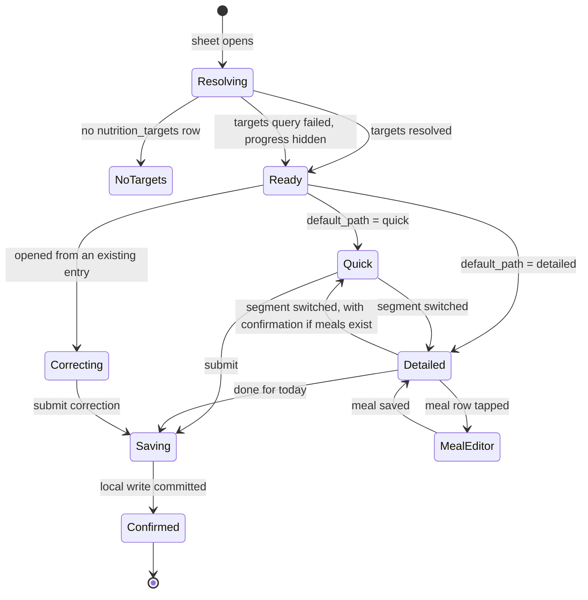

> **This file is not the specification.**
>
> It predates the build specification written on 4 September 2026 and is kept for
> its reasoning, not its instructions. Parts of it describe behaviour that has
> since been deliberately changed, and following it would rebuild things that were
> removed on purpose.
>
> **The binding specification for this screen is in `docs/screens/`, in the
> numbered files.** See `docs/screens/legacy/README.md` for how the two relate.

# Screen: Nutrition entry

> ## SUPERSEDED, 5 August 2026. DO NOT BUILD THIS SCREEN.
>
> Open question O-11 is resolved. Athletes **do not log nutrition**. Fydr provides guidance
> only: targets, meal plan ideas, and what to eat around training. This screen specified
> daily per-meal macro entry, which the client has ruled out.
>
> **Build `nutrition-guidance.md` instead.**
>
> This file is retained, not deleted, because the schema it describes (`nutrition_entries`)
> stays dormant in the data model for the periodic-audit option in `nutrition-guidance.md`
> §9, and because reversing this decision later should not mean rewriting the spec from
> scratch. Nothing here is current.


> **Layout status**: provisional. Awaiting client design photographs.

Screen 3 in `02-information-architecture.md` §5 is now `nutrition-guidance.md`. This file holds
no inventory number. It described a bottom sheet over Today.

Every layout decision below that would normally come from the client's designs is marked
**[Assumed, pending photographs]**. Nothing marked that way is settled.

---

## Purpose

Nutrition is the domain athletes abandon first. `08-notifications.md` §3.3 says so plainly and
turns its reminders off by default for that reason. This screen exists to record what an
athlete ate against what they were asked to eat, and its design problem is not information
architecture, it is attrition: a food diary that takes four minutes a day is abandoned inside a
fortnight, and an abandoned domain produces a compliance figure that makes the whole product
look broken.

So this screen offers **two paths against one data model**. The fast path records estimated
daily totals in about 20 seconds using hand portions. The detailed path records per-meal macros
in grams for athletes who are weighing food, working with a nutritionist, or in a body
composition block. Both write to `nutrition_entries`, both show progress against
`nutrition_targets`, and an athlete can move between them day to day without losing history.

---

## The open question this screen answers

`04-data-model.md` **O-11** asks whether per-meal macro entry is realistic daily. The honest
answer is no, not for a semi-professional squad, not every day, not for a season.

The evidence in the existing spec, not opinion:

- The whole athlete surface is built to a 45-second budget
  (`00-product-overview.md` success criterion 2). Per-meal macros for four meals is four times
  the wellness form.
- `08-notifications.md` §3.3 already refuses to send per-meal reminders, on the grounds that
  four pushes a day would consume the entire athlete notification budget on the domain with
  the weakest evidence of behaviour change.
- `04-data-model.md` §5 makes `meal_slot` nullable, so the schema already permits a daily total
  row without change.

**Therefore: the fast path is the default, per-meal entry is opt-in, and the schema is
untouched.** A club that genuinely wants per-meal data can set it as their organisation
default, and an individual athlete in a body composition block can switch to it for six weeks
and switch back. Neither decision is made once and permanently for the whole squad.

The one schema addition required is provenance, in §Data requirements: an entry estimated from
hand portions and an entry weighed on a scale are different measurements of the same thing, and
`00-product-overview.md` design principle 5 requires the difference to be visible.

---

## Roles and access

| Role | Access |
|---|---|
| Athlete | Full, for themselves only. `source = 'self_report'`, `athlete_id` from the JWT. |
| Coach / S&C | Cannot use this screen. Staff read nutrition through the squad and athlete profile screens, and can enter on behalf of an athlete on the web dashboard with `source = 'staff_entered'`. |
| Medical | As coach. |
| Admin | No access to nutrition data (`01-roles-and-permissions.md` §2). |

Within the screen, content varies by:

| Variable | Effect |
|---|---|
| Organisation default path (`organisations.settings.nutrition.default_path`) | Which path opens first |
| Whether targets exist for this athlete on this date | Progress section is present or absent |
| Photograph consent (`09-security-and-compliance.md` §3) | The camera affordance exists or does not. Photographs run on Article 9(2)(a) explicit consent, so an athlete who has not consented, or has withdrawn, sees no camera control at all rather than a disabled one. |
| Objection to nutrition processing (Article 21, §6 of the security doc) | The screen is not reachable. Today shows no nutrition row and the expectation is waived with reason `objection`. |

---

## Entry points

| Entry point | Context carried | Landing behaviour |
|---|---|---|
| Today, To do row "Nutrition" | `entry_date` | Sheet opens on the organisation's default path |
| Push `athlete.nutrition.reminder` | `/athlete/today?open=nutrition` | As above. One notification per day, default 20:00 local, never per meal. |
| Today, review mode, past day in the backdating window | `entry_date` = selected day | Opens with the date banner. Date is pinned. |
| My Data, nutrition tab, a day row | `entry_date` | Opens showing that day's existing entries and their totals |
| My Data, an entry row, "Correct this entry" | `original_entry_id` | Correction mode on that single entry row |
| My Programme, nutrition targets card, "Log today" | `entry_date` = today | Opens on the default path with the progress section expanded |
| Deep link `/athlete/today?open=nutrition&meal=lunch` | `meal_slot` | Opens the detailed path with that meal slot expanded. Used by nothing in v1; reserved. |

---

## Layout

### Web

Not applicable. Athlete surfaces are mobile only in v1.

### Structure

Two paths, one sheet, one segmented control at the top. The path choice is remembered per
athlete in local preferences, seeded from the organisation default, and it does not change the
date, the targets, or anything already logged.

### Mobile wireframe, fast path (default)

**[Assumed, pending photographs]** The hand-portion metaphor, tile layout, and progress bar
treatment are recommendations. The portion-to-gram constants in particular need a nutritionist's
sign-off, raised as O-305.

```
┌──────────────────────────────────────────────┐
│                   ▁▁▁▁▁                      │ A  Grab handle
│ ✕           Nutrition              Wed 5 Aug │ B  Header, 56 pt
├──────────────────────────────────────────────┤
│      [ Quick ]      Detailed                 │ C  Path segmented, 44 pt
├──────────────────────────────────────────────┤
│ Today's targets              MD-1            │ D  Progress block, 148 pt
│ Protein  ▓▓▓▓▓▓▓▓▓▓▓▓░░░░░  128 / 175 g     │
│ Carbs    ▓▓▓▓▓▓▓▓░░░░░░░░░  240 / 480 g     │
│ Fat      ▓▓▓▓▓▓▓▓▓▓▓▓▓▓▓░░   68 /  80 g     │
│ Energy   ▓▓▓▓▓▓▓▓▓▓░░░░░░░ 2,084 / 3,600    │
│ Fluid    ▓▓▓▓▓▓▓▓▓▓▓▓▓▓▓▓▓ 3,000 / 3,000 ml │
├──────────────────────────────────────────────┤
│ How much today?                              │ E  Portion entry, 3 rows
│                                              │
│ Protein            ⊖    5 palms    ⊕         │    ≈ 125 g
│ Carbs              ⊖    8 cupped   ⊕         │    ≈ 240 g
│ Fat                ⊖    6 thumbs   ⊕         │    ≈ 72 g
├──────────────────────────────────────────────┤
│ Fluid                                        │ F  Fluid, 88 pt
│  [ +250 ] [ +500 ] [ +750 ] [ +1000 ]        │    add-chips
│  Today: 3,000 ml                    ⊖  ⊕     │
├──────────────────────────────────────────────┤
│ ⌄ Add supplements, a photo or a note         │ G  Collapsed optional, 56 pt
├──────────────────────────────────────────────┤
│ ┌──────────────────────────────────────────┐ │ H  Pinned submit, 76 pt
│ │             Submit entry                 │ │
│ └──────────────────────────────────────────┘ │
└──────────────────────────────────────────────┘
```

### Mobile wireframe, detailed path

```
┌──────────────────────────────────────────────┐
│ ✕           Nutrition              Wed 5 Aug │ B
├──────────────────────────────────────────────┤
│        Quick      [ Detailed ]               │ C
├──────────────────────────────────────────────┤
│ Today's targets              MD-1            │ D  identical progress block
│ Protein  ▓▓▓▓▓▓▓▓▓▓▓▓░░░░░  128 / 175 g     │
│ ...                                          │
├──────────────────────────────────────────────┤
│ Meals                                        │ I  Meal list
│ ┌──────────────────────────────────────────┐ │
│ │ ✓ Breakfast      42 P · 80 C · 18 F    › │ │    logged, 64 pt
│ ├──────────────────────────────────────────┤ │
│ │ ✓ Lunch          51 P · 95 C · 22 F    › │ │
│ ├──────────────────────────────────────────┤ │
│ │ + Dinner                               › │ │    not logged
│ ├──────────────────────────────────────────┤ │
│ │ + Snack                                › │ │
│ ├──────────────────────────────────────────┤ │
│ │ + Pre / Intra / Post                   › │ │    grouped, expands to three
│ └──────────────────────────────────────────┘ │
├──────────────────────────────────────────────┤
│ Fluid                             3,000 ml   │ F  same fluid control
├──────────────────────────────────────────────┤
│ ⌄ Add supplements or a note                  │ G
├──────────────────────────────────────────────┤
│ │             Done for today               │ │ H
└──────────────────────────────────────────────┘
```

### Meal editor (detailed path, one meal slot)

Nested sheet at snap point 0.85.

```
┌──────────────────────────────────────────────┐
│ ‹ Back            Lunch                Done  │
├──────────────────────────────────────────────┤
│ Protein      ⊖         51          ⊕    g    │  step 5, keyboard allowed
│ Carbs        ⊖         95          ⊕    g    │  step 10
│ Fat          ⊖         22          ⊕    g    │  step 5
│ Energy                854 kcal               │  derived, read-only
│                                              │
│ [ Repeat yesterday's lunch ]                 │  one-tap prefill
├──────────────────────────────────────────────┤
│ ⌄ Photo · supplements · note                 │
├──────────────────────────────────────────────┤
│ │              Save meal                   │ │
└──────────────────────────────────────────────┘
```

### Region descriptions

| Ref | Region | Rules |
|---|---|---|
| A | Grab handle | Drag to dismiss, with discard confirmation when unsaved input exists |
| B | Header | Close on the left. Date on the right, showing the entry date, not today. |
| C | Path segmented | Two segments, 44 pt tall, minimum 160 pt total. Switching preserves everything already entered (see Interactions). |
| D | Progress block | Present only when targets resolve for this athlete on this date. Five rows: protein, carbs, fat, energy, fluid. Each is a horizontal bar with a target marker, the achieved value, the target, and the unit. Values include everything already logged for the day plus what is currently being entered, updating live. |
| E | Portion entry | Three `NumberStepper` rows in hand-portion units, with the gram equivalent beneath each in `caption`. This is the fast path's entire macro input. |
| F | Fluid | Four add-chips at 250, 500, 750 and 1000 ml, plus a stepper for correction. Chips add, they do not set. Present on both paths, because fluid is a daily total under either model. |
| G | Optional block | Collapsed. Supplements (multi-select from an org list plus free text), photograph (consent-gated), and a comment. Last in the form so the keyboard never covers the macro controls. |
| H | Submit bar | Pinned. On the fast path the label is "Submit entry". On the detailed path it is "Done for today", because meals are saved individually as they are entered and the bar closes the day rather than committing it. |
| I | Meal list | Six slots from the `meal_slot` enum. `pre`, `intra` and `post` are grouped behind one row, because most athletes use none of them and three empty rows in the primary list is noise. |

### Progress bars, specified

Macros are `contextual` metrics in `06-design-system.md` §5.3: more protein is not
self-evidently good and less fat is not self-evidently bad. Therefore:

- Bars render in `valence.neutral`, never green or red. The only exception is fluid, whose
  metric direction is `higherIsBetter`, and it still renders neutral because colouring one bar
  differently from four others invites the athlete to read the others as failures.
- The target marker is a 2 pt vertical rule at 100% in `chart.reference`, always labelled.
- Over-target renders as a distinct hatched segment beyond the marker, and the numeric value
  states it plainly: "204 / 175 g". It is never clamped at 100%, and it is never coloured as an
  error.
- With no target set, the row shows the achieved value only, right-aligned, with the target
  slot rendering the not-applicable glyph `·` and the caption "No target set". It never renders
  a bar at 0% against a zero target.
- The block states its own basis in a caption: "Targets for MD-1 · set 14 Jul". Provenance is
  not decoration (`06-design-system.md` §1.5).

---

## Components

| Component | Source | Purpose here |
|---|---|---|
| `BottomSheet` | `06-design-system.md` §6.19 | Host sheet and the nested meal editor |
| `NumberStepper` | §6.11 | Portions, grams, fluid. `metric` drives unit and precision. |
| `EmptyState` | §6.16 | `notStarted` when no targets exist, `allClear` when the day is complete, `noPermission` where photographs are not consented and a legacy photo exists |
| `ConfirmSheet` | §6.18 | Discard, correction, and photograph deletion |
| `Numeric` | §5.2 | Every number, including the derived energy value |
| `SyncStatusIndicator` | §6.17 | Confirmation state only |
| `MetricTile` | §6.2 | Not used. Progress rows are a screen-local composition, because a tile per macro would fill the viewport. |

Screen-local compositions in `apps/mobile/src/features/nutrition/`:

| Composition | Purpose |
|---|---|
| `MacroProgressBar` | One macro row: label, bar, marker, achieved, target, unit |
| `PortionStepper` | `NumberStepper` wrapper showing the gram equivalent beneath |
| `FluidControl` | Add-chips plus corrective stepper |
| `MealSlotRow` | One meal in the detailed path list |
| `PhotoCapture` | Consent-gated camera and library picker, with the fixed guidance copy |

---

## Data requirements

### Fields written

One row per submission. The fast path writes one row per day with `meal_slot` null. The
detailed path writes one row per meal slot.

| Field | Source | Fast path | Detailed path | Transformation |
|---|---|---|---|---|
| `id` | client UUID | yes | yes | Generated when the form or meal editor opens |
| `entry_date` | route param | yes | yes | Device local ISO date |
| `meal_slot` | fixed or picker | **null** | `breakfast` \| `lunch` \| `dinner` \| `snack` \| `pre` \| `intra` \| `post` | Enum from `04-data-model.md` §5 |
| `protein_g` | portions or grams | derived | direct | `numeric(6,1)` |
| `carbs_g` | portions or grams | derived | direct | `numeric(6,1)` |
| `fat_g` | portions or grams | derived | direct | `numeric(6,1)` |
| `energy_kcal` | derived | derived | derived | `4 × protein_g + 4 × carbs_g + 9 × fat_g`, rounded at display only |
| `fluid_ml` | fluid control | yes, on the daily row | yes, on the day's first row only | `numeric(7,1)`. Fluid is a daily total and is never split across meal rows. |
| `supplements` | picker plus free text | optional | optional | `text[]`, maximum 10 |
| `photo_url` | camera or library | optional | optional, per meal | Storage path `org_id/athlete_id/uuid.jpg`, private bucket, signed URL on read |
| `comment` | text | optional | optional | Trimmed, 500 characters |
| `estimation_method` | **new column, see below** | `portions` | `weighed` \| `label` \| `estimated` | Provenance of the macro numbers |
| `source` | fixed | `self_report` | `self_report` | |
| `revision_of` | correction mode | conditional | conditional | |

### Required schema addition

Per `CLAUDE.md` §5, this lands in `04-data-model.md` in the same commit as the migration.

```sql
create type nutrition_estimation_method as enum
  ('portions','weighed','label','estimated','photo_only');

alter table nutrition_entries
  add column estimation_method nutrition_estimation_method not null default 'estimated';

-- Range guards, per 09-security-and-compliance.md §9.1
alter table nutrition_entries
  add constraint nutrition_protein_range check (protein_g   between 0 and 1000),
  add constraint nutrition_carbs_range   check (carbs_g     between 0 and 2000),
  add constraint nutrition_fat_range     check (fat_g       between 0 and 500),
  add constraint nutrition_energy_range  check (energy_kcal between 0 and 15000),
  add constraint nutrition_fluid_range   check (fluid_ml    between 0 and 15000),
  add constraint nutrition_supplements_len check (coalesce(array_length(supplements,1),0) <= 10);
```

**Why this column is not optional.** An entry of 175 g protein estimated from five palms and an
entry of 175 g weighed on a scale are different measurements with different error bars. Without
the column, a nutritionist looking at a squad chart cannot tell which they are reading, and
`00-product-overview.md` design principle 5 says analysis that mixes sources without
distinguishing them produces confident nonsense. Every squad-level nutrition chart states the
mix, exactly as `06-design-system.md` §8.3 requires of every other provenance mix.

### Portion conversion

**[Assumed, pending nutritionist sign-off, O-305]** Conversion constants live in
`packages/core/nutrition.ts` and are overridable per organisation, never hard-coded in a
component.

```ts
// packages/core/nutrition.ts. Pure, no I/O.
export const DEFAULT_PORTION_GRAMS = {
  protein_palm:   25,   // one palm of cooked protein
  carbs_cupped:   30,   // one cupped hand of cooked carbohydrate
  fat_thumb:      12,   // one thumb of fat
} as const;

export function portionsToMacros(
  p: { proteinPalms: number; carbsCupped: number; fatThumbs: number },
  constants = DEFAULT_PORTION_GRAMS,
) {
  const protein_g = p.proteinPalms * constants.protein_palm;
  const carbs_g   = p.carbsCupped  * constants.carbs_cupped;
  const fat_g     = p.fatThumbs    * constants.fat_thumb;
  return { protein_g, carbs_g, fat_g, energy_kcal: 4 * protein_g + 4 * carbs_g + 9 * fat_g };
}
```

Two rules that follow:

1. **Grams are stored, portions are not.** The database holds `protein_g`, and
   `estimation_method = 'portions'` records how it was arrived at. Storing portion counts would
   make every cross-athlete comparison depend on hand size.
2. **The gram equivalent is always shown** beneath each portion stepper. An athlete who learns
   that five palms is about 125 g learns something useful, and an athlete who disagrees with the
   conversion can switch to the detailed path.

### Target resolution

`nutrition_targets` can be set per athlete or per group, optionally per `md_offset`, with an
effective date range. An athlete in three groups on a day with an MD-1 label can match several
rows, so resolution must be deterministic.

```sql
create or replace function public.resolve_nutrition_targets(
  p_athlete_id uuid,
  p_on         date,
  p_md_offset  int
)
returns table (
  protein_g numeric, carbs_g numeric, fat_g numeric,
  energy_kcal numeric, fluid_ml numeric,
  basis text,            -- 'athlete_md' | 'athlete' | 'group_md' | 'group'
  source_id uuid,        -- athlete_id or group_id the target came from
  effective_from date
)
language sql stable security invoker as $$
  with candidates as (
    select nt.*,
           case
             when nt.athlete_id is not null and nt.md_offset = p_md_offset then 1
             when nt.athlete_id is not null and nt.md_offset is null       then 2
             when nt.group_id   is not null and nt.md_offset = p_md_offset then 3
             else 4
           end as specificity,
           g.sort_order
    from public.nutrition_targets nt
    left join public.groups g on g.id = nt.group_id
    left join public.group_memberships gm
           on gm.group_id = nt.group_id
          and gm.athlete_id = p_athlete_id
          and gm.added_at::date <= p_on
          and (gm.removed_at is null or gm.removed_at::date > p_on)
    where (nt.athlete_id = p_athlete_id or gm.id is not null)
      and nt.effective_from <= p_on
      and (nt.effective_to is null or nt.effective_to >= p_on)
      and (nt.md_offset is null or nt.md_offset = p_md_offset)
  )
  select protein_g, carbs_g, fat_g, energy_kcal, fluid_ml,
         case specificity when 1 then 'athlete_md' when 2 then 'athlete'
                          when 3 then 'group_md'   else 'group' end,
         coalesce(athlete_id, group_id),
         effective_from
  from candidates
  order by specificity, effective_from desc, sort_order nulls last
  limit 1;
$$;
```

**One row wins outright. Targets are never merged across sources.** Taking protein from an
athlete-specific row and carbs from a group row produces a target combination nobody
prescribed. Ties beyond the ordering above are a configuration error and are surfaced to staff
on the nutrition plans screen, not resolved silently here.

### Reads

| What | Source | Purpose |
|---|---|---|
| Today's entries | local SQLite, then `nutrition_entries_current` for `entry_date` | Progress totals, meal list state |
| Targets | `resolve_nutrition_targets(athlete_id, entry_date, md_offset)` | Progress block |
| `md_offset` for the date | `sessions.md_offset` for that date, else computed from the next fixture | Target selection and the header chip |
| Yesterday's meal by slot | `nutrition_entries_current` where `entry_date = date - 1` | "Repeat yesterday's lunch" |
| Supplement list | `organisations.settings.nutrition.supplements` | Picker options |
| Photo consent | `athlete_consents` where `purpose = 'nutrition_photo'` | Whether the camera affordance exists |

```ts
// packages/queries/keys.ts additions
nutrition: {
  all: (orgId: string) => [...qk.org(orgId), 'nutrition'] as const,
  day: (orgId: string, athleteId: string, date: string) =>
    [...qk.nutrition.all(orgId), 'day', athleteId, date] as const,
  targets: (orgId: string, athleteId: string, date: string) =>
    [...qk.nutrition.all(orgId), 'targets', athleteId, date] as const,
},
```

```ts
// packages/queries/nutrition.ts
export function useNutritionDay(args: {
  orgId: string; athleteId: string; date: string;
}): UseQueryResult<{
  entries: NutritionEntry[];
  totals: { protein_g: number; carbs_g: number; fat_g: number;
            energy_kcal: number; fluid_ml: number };
  methods: NutritionEstimationMethod[];     // distinct, for the provenance caption
}>;

export function useNutritionTargets(args: {
  orgId: string; athleteId: string; date: string;
}): UseQueryResult<ResolvedNutritionTargets | null>;
```

`staleTime` 5 minutes for targets (they change weekly at most), 0 for the day's entries because
SQLite is the source and the query is a reconciliation read.

### Writes

Identical mechanism to `wellness-entry.md`: a local SQLite transaction plus an outbox enqueue,
never a network call in the confirmation path.

| Path | Operation |
|---|---|
| Fast path submit | One `insert` op, `meal_slot` null, `estimation_method = 'portions'` |
| Fast path submit when a daily row already exists | One `revise` op against the existing row |
| Detailed path, save meal | One `insert` op per meal slot, on saving that meal editor |
| Detailed path, edit a saved meal | One `revise` op for that meal's row |
| Fluid change | Written onto the day's daily row on the fast path; onto the earliest row of the day on the detailed path. A change is a `revise`. |
| Photograph | Uploaded to Storage first, path stored in the entry. If the upload has not completed, the entry is submitted without it and the photo is attached by a follow-up `revise` when the upload finishes. **The entry never waits on an image upload.** |

---

## States



### Default

The organisation's default path, targets resolved and shown, nothing entered. Submit is enabled
from the outset on the fast path only when at least one macro or fluid value is non-zero; see
Validation.

### Partially logged (the normal state on the detailed path)

Breakfast and lunch saved, dinner outstanding. The progress bars reflect what is saved. The
sheet can be closed and reopened all day without losing anything, because each meal is committed
on save rather than at the end. This is the main structural difference between the paths and it
is deliberate: an athlete logging four meals across twelve hours must never be holding unsaved
state.

### No targets set

Progress block is replaced by an `EmptyState` of kind `notStarted`, size `inline`:

> **No targets set.**
> Your coach has not set nutrition targets yet. What you log is still recorded.

Entry proceeds normally. A missing target must never block a submission.

### Complete

Once every macro is within 90% to 110% of target, or where no targets exist once any entry
exists, the sheet's confirmation on submit reads "Saved." and Today's nutrition row disappears.
There is no congratulation, no percentage score, and no ring
(`06-design-system.md` §12.2 bans praise for compliance).

### Loading

The form renders immediately. The progress block shows skeleton bars for at most 400 ms while
targets resolve, and the entry controls are live throughout. Targets are context, not a
prerequisite.

### Error

| Failure | Behaviour |
|---|---|
| Targets fail to resolve | Progress block is hidden with a one-line caption "Targets unavailable." Entry is unaffected. |
| Day's entries fail to load | Totals show the missing glyph rather than 0. The form opens blank and a submission is reconciled server-side as a revision if a row already exists. Never render `0 / 175 g` for an unknown total: that is missing presented as zero (`06-design-system.md` §1.6). |
| Local write fails | Same as `wellness-entry.md`: values preserved, inline retry, Sentry event with identifiers only. |
| Photo upload fails | The entry is already saved. A caption on the entry row in My Data reads "Photo not uploaded" with a retry. The macros are never at risk from an image. |
| Photo upload rejected for size or type | Inline in the capture sheet: "That image could not be used. Take another." Magic-byte validation is server-side (`09-security-and-compliance.md` §9.3). |

### Offline

Fully functional, including the detailed path. Photographs are captured, stored locally, and
uploaded when connectivity returns; the entry itself syncs first and the photo attaches by
revision. Confirmation copy is "Saved. Will sync when you're back online."

### Correction

Nutrition entries are immutable (ADR-005). Correcting a fast-path day opens the daily row
pre-filled; correcting a meal opens that meal's editor pre-filled. Both show the fixed banner
"This creates a correction. The original entry is kept." Fluid corrections revise the row that
carries the fluid value, not every row for the day.

### Photograph consent withdrawn

If consent is withdrawn after photographs were taken, the camera affordance disappears
immediately and existing photographs stop rendering, replaced by an `EmptyState` of kind
`noPermission`: "Photographs are turned off in your settings." The stored images are deleted on
the normal 90-day retention cycle or immediately by an erasure request; withdrawal is
prospective (`09-security-and-compliance.md` §6, Article 7(3)) and the UI says so in one line.

---

## Interactions

| Gesture | Target | Result |
|---|---|---|
| Tap | Path segment | Switches path. Anything already entered is preserved: portions convert to grams and populate an "All day" meal in the detailed path; grams from meals sum into the fast path's portion steppers, rounded to the nearest portion with the exact gram total retained underneath. |
| Tap | Path segment, detailed to quick, with two or more saved meals | `ConfirmSheet`: "Switch to quick entry? Your meals stay saved and today's totals move into one entry." Cancel is first. |
| Tap ⊖ / ⊕ | Portion stepper | One portion. `impactAsync(Light)`. Gram equivalent updates in the same frame, progress bars animate to the new value at `duration.fast`. |
| Long press ⊖ / ⊕ | Any stepper | Accelerates after 500 ms, throttled haptic at 150 ms |
| Tap | Portion value | Nothing. `allowKeyboard={false}` on the fast path: the whole point is that no keyboard appears. |
| Tap | Gram value, detailed path | Numeric keypad, `inputMode="decimal"`, Done accessory bar |
| Tap | Fluid add-chip | Adds that volume. `impactAsync(Light)`. Chips are cumulative and repeatable: four taps of +500 is 2,000 ml. |
| Tap ⊖ | Fluid stepper | Removes 250 ml, floor 0. For correcting an over-tap. |
| Long press | Fluid total | Presents a keypad to set an exact value. The only place fluid is set rather than added. |
| Tap | Meal row, not logged | Opens the meal editor for that slot |
| Tap | Meal row, logged | Opens the meal editor pre-filled, in correction mode, with the banner |
| Swipe left | Meal row, logged | Reveals "Correct". No delete: entries are immutable and a swipe-to-delete on a day's food log is a data loss affordance one bad thumb away. |
| Tap | "Pre / Intra / Post" grouped row | Expands into three rows in place. State persists for the session. |
| Tap | "Repeat yesterday's lunch" | Fills the editor with yesterday's values for that slot. `impactAsync(Light)`. Every value stays editable and the entry records `estimation_method` from the source entry. |
| Tap | Camera affordance | Presents the capture sheet with the fixed guidance copy "Photograph the food, not the room." (`09-security-and-compliance.md` §9.3). Offers camera and library. |
| Tap | An attached photo | Full-screen preview with a "Remove" action behind a `ConfirmSheet` |
| Tap | Supplement chip | Toggles. `selectionAsync()`. A free-text "Other" chip opens a single-line input. |
| Tap | Submit, fast path | Local write, confirmation, dismissal |
| Tap | "Done for today", detailed path | Closes the sheet. Nothing is written: meals were written on save. If no meal has been saved it behaves as a discard and confirms. |
| Tap ✕ / swipe down | With unsaved input | `ConfirmSheet`: "Discard this entry? Nothing is saved." On the detailed path the copy is "Discard this meal? Your saved meals are kept." |
| Tap | Progress bar | Expands to show the day's contributing entries by meal, with their estimation methods. Read-only. |

Haptics follow the same table as `wellness-entry.md`. There is no success haptic on saving an
individual meal, only on the day's submission, so that four meals do not produce four
celebrations.

---

## Validation rules

| Field | Rule | Message |
|---|---|---|
| Fast path submission | At least one of protein, carbs, fat, fluid must be greater than zero | Submit disabled, labelled "Add something to log" |
| Detailed path meal | At least one macro greater than zero | Save disabled, labelled "Add a macro" |
| `protein_g` | 0 to 1000 g | "Enter a value between 0 and 1000" |
| `carbs_g` | 0 to 2000 g | "Enter a value between 0 and 2000" |
| `fat_g` | 0 to 500 g | "Enter a value between 0 and 500" |
| `energy_kcal` | Derived, never entered | n/a |
| Derived energy above 8,000 kcal | Confirmed once, not blocked | "That is about 8,400 kcal. Is that right?" |
| `fluid_ml` | 0 to 15,000 ml | "Enter a value between 0 and 15,000" |
| Portions | 0 to 30 per macro | Stepper clamps, `impactAsync(Soft)` at the limit |
| `supplements` | Maximum 10, each 40 characters | "Up to 10 supplements" |
| `comment` | 500 characters | Counter at 450, hard stop at 500 |
| Photograph | 5 MB, image magic bytes, re-encoded server-side | "That image could not be used. Take another." |
| `entry_date` | Today minus 14 to today | Screen unreachable outside the window |
| `meal_slot` | One live entry per `(athlete_id, entry_date, meal_slot)` | A second save for the same slot becomes a revision, not a duplicate |

**No macro is validated against its target.** Being 300 g of carbohydrate under target is
information, not an input error, and a form that argues with an athlete about what they ate
gets fictional data.

---

## Edge cases

1. **The athlete logs nothing all day and opens the sheet at 23:55.** Normal submission,
   normal date. No cut-off within the day.
2. **The athlete logs breakfast on the detailed path, then switches to quick.** The saved
   breakfast row stays. The fast path's steppers are seeded from the day's totals, and
   submitting creates a second row with `meal_slot` null. Totals are the sum of both, which is
   double counting. **This is prevented**: on switching, the fast path opens with the saved
   meals shown as a locked "Already logged: 42 P · 80 C · 18 F" line, and its steppers record
   only what is additional. The submitted daily row carries the additional amount, not the
   total.
3. **Two devices log the same meal slot.** The later `client_submitted_at` becomes a revision of
   the earlier (`05-architecture.md` §6). One value survives as current, both are retained.
4. **Targets change mid-day.** The progress block re-resolves on the next focus. Already-logged
   entries are untouched; only the denominator moves. A caption appears for the rest of the day:
   "Targets updated at 14:02."
5. **The athlete's MD-n changes because a fixture was postponed.** `md_offset` for past days is
   preserved (`04-data-model.md` §4), so a past day's targets do not silently change. Today's do,
   and the caption explains it.
6. **The athlete belongs to two groups with conflicting targets and no athlete-specific row.**
   Resolution takes the lower `groups.sort_order`. The screen shows the winning basis in the
   caption ("Targets for Forwards"). The conflict is surfaced to staff elsewhere, never as a
   choice presented to the athlete.
7. **An athlete on a rehab or weight-making block has a target of zero for a macro.** Zero is a
   real target. The bar renders with the marker at zero and the achieved value beside it. This is
   the one place a zero denominator is legitimate, and it must not be treated as "no target".
   `ComplianceRing` is not used here for exactly this reason.
8. **Fluid logged on the detailed path with no meals.** Permitted. A fluid-only day writes one
   row with `meal_slot` null carrying only `fluid_ml`.
9. **The athlete taps +500 fluid eleven times by accident.** The stepper corrects downwards, and
   long-pressing the total sets an exact value. There is no undo stack; correction is by
   adjustment.
10. **A photograph contains other people.** Covered by the privacy notice, minimised by the
    90-day retention, and the capture sheet states "Photograph the food, not the room."
    (`09-security-and-compliance.md` §9.3). No face detection, no blurring, no automated
    checking: an automated content check on athlete photographs is a worse intrusion than the
    problem.
11. **EXIF contains the athlete's home coordinates.** Stripped server-side by re-encoding, before
    the object is written. The client also strips before upload, so the coordinates never leave
    the device, but the server-side strip is the control that is relied on.
12. **The athlete is under 18 and photographs are consent-based.** Updated 5 August 2026: the
    16-and-over restriction is withdrawn and under-18s are in scope
    (`09-security-and-compliance.md` §4), so this now arises as the normal case for an academy
    squad. **For an athlete under 18 the camera affordance is absent**, not disabled, and no
    organisation setting enables it (§4.6). Article 8 additionally applies to any consent-based
    photograph, and under-13s are out of scope entirely (§4.4).
13. **Supplements list is empty in org settings.** The picker shows only the free-text "Other"
    affordance. No empty list, no placeholder chips.
14. **A supplement name is 200 characters of nonsense.** Truncated at 40 by the input, validated
    at 40 by Zod, constrained at the database. Free text from an athlete ends up in a CSV export,
    so the export engine's formula-injection prefixing applies (`09-security-and-compliance.md`
    §9.2).
15. **The athlete objects to nutrition processing under Article 21.** The domain is switched off
    for them: no expectation, no Today row, no notification, and this screen is unreachable.
    Existing entries are retained but excluded from squad views. Not account deactivation.
16. **The organisation is on the Club tier.** Nutrition is included in both tiers
    (`00-product-overview.md`), so there is no tier gate on this screen.
17. **An entry exists for the day with `source = 'staff_entered'`.** It counts towards the day's
    totals and is labelled with the staff provenance chip. The athlete may still add their own
    entries; the two are not in conflict, they are different observations.
18. **200% dynamic type.** Progress rows become two lines each (label and bar, then values).
    Portion steppers stack the gram equivalent below rather than beside. The meal list rows grow.
    Nothing is removed.
19. **The athlete logs 6,000 kcal on a match day.** Accepted after one confirmation. Rugby
    forwards on a double-session day legitimately reach numbers that look like data entry errors.
20. **`estimation_method` differs across a day's rows.** The progress block's caption names the
    mix: "Estimated from portions and weighed". Squad charts state the mix per
    `06-design-system.md` §8.3.

---

## Performance notes

| Path | Budget | How |
|---|---|---|
| Sheet open to interactive | 200 ms p95 | Renders from local state; targets and totals fill in after |
| Target resolution | 100 ms p95 server time | Single function call, indexed on `nutrition_targets (athlete_id)` and `(group_id)`; add both indexes |
| Progress recalculation on a stepper tap | Under one frame | Pure function in `packages/core/nutrition.ts`, no query, no round trip |
| Fast path submit to confirmation | 300 ms p95 | Local write only |
| Meal save | 200 ms p95 | Local write only |
| Photo upload | Off the critical path entirely | Background upload, entry revised on completion |

Rules:

- Progress bars animate width only, never opacity or layout, and only at `duration.fast`.
- The meal list is not virtualised: it has at most eight rows.
- Photographs are re-encoded on device to a maximum dimension before upload, so a 12 MB camera
  original never reaches the 5 MB cap and never occupies the queue on a poor connection.
- `resolve_nutrition_targets` is cached for 5 minutes per date; a target change is not a
  real-time concern.

---

## Accessibility

| Element | Label pattern | Example |
|---|---|---|
| Path segmented | Standard tab semantics | "Quick entry. Selected. 1 of 2." |
| Progress row | Value, target, and shortfall in words | "Protein. 128 of 175 grams. 47 grams under target." |
| Progress row, over target | Stated plainly, not as an error | "Protein. 204 of 175 grams. 29 grams over target." |
| Progress row, no target | "Protein. 128 grams. No target set." | |
| Portion stepper | Portions and grams both announced | "Protein. 5 palms, about 125 grams. Decrease. Increase." |
| Fluid chip | Verb-first, additive made explicit | "Add 500 millilitres. Button." |
| Fluid total | "Fluid today. 3,000 millilitres." | |
| Meal row, logged | Contents summarised | "Lunch. Logged. 51 grams protein, 95 grams carbohydrate, 22 grams fat. Button." |
| Meal row, not logged | "Dinner. Not logged. Button." | |
| Derived energy | Marked as derived | "Energy, 854 kilocalories, calculated." |
| Photo affordance | "Add a photograph of this meal. Optional. Button." | |
| Submit, fast path | "Submit entry. Button." | |
| Done, detailed path | "Done for today. Button." | |

Requirements:

- 48 pt minimum targets throughout; fluid chips are 44 pt tall with 8 pt separation.
- Progress bars are not focusable as charts; each row is a single element whose label carries the
  full reading, so a screen reader user gets the number rather than a shape.
- Live region announces the progress change after each stepper tap, throttled to one
  announcement per 500 ms so a long press does not flood.
- Reduced motion: bars jump to their new width, the optional block expands without animation,
  and the nested meal sheet fades.
- Colour is never the only channel: over-target is carried by the hatched segment, the numeric
  values, and the screen reader text, not by colour.
- Dynamic type 85% to 200%, verified at 100%, 150%, 200%.

---

## Open questions

- **O-305** Portion constants need a nutritionist's sign-off. I have used 25 g protein per palm,
  30 g carbohydrate per cupped hand, and 12 g fat per thumb, which are the common coaching
  heuristics. They are wrong for a 120 kg prop and a 68 kg scrum-half in opposite directions.
  Options: keep them fixed and accept the error, scale them by body mass, or let each club set
  them. My assumption is fixed constants, org-overridable, with the gram equivalent always
  visible so the athlete can see what is being assumed.
- **O-306** Which path is the organisation default? I have assumed quick. A club with a
  performance nutritionist may want detailed as the default, in which case the same
  configuration flag covers it. This is a per-club setting, not a product-wide decision, so the
  real question is what a new organisation starts on.
- **O-307** Does nutrition compliance mean "any entry" or "entry within tolerance of target"?
  Currently an entry of any value satisfies the expectation, which is the only defensible
  definition: penalising an athlete for eating less than prescribed turns the log into fiction.
  Confirm, because it is the difference between a compliance figure that measures logging and
  one that measures eating.
- **O-308** Are meal photographs worth the risk? They cost a private bucket, signed URLs, EXIF
  stripping, re-encoding, a 90-day retention job, an explicit consent toggle, and a real
  possibility of photographs of other people and of homes
  (`09-security-and-compliance.md` §9.3). Their analytical value is modest: the macros are the
  durable record. My recommendation is to ship v1 **without** photographs and add them in v1.1
  if clubs ask. Confirm, because it removes a meaningful slice of your total data protection
  exposure.
- **O-309** Should fluid have its own reminder? It is the one nutrition metric with a genuinely
  time-sensitive pattern, and it is also the one most likely to trigger the muting spiral in
  `08-notifications.md` §1. I have not added one. If you want it, it needs to come out of the
  three-per-day athlete budget, replacing something.
- **O-310** Should supplements be a controlled list? Free text means an athlete can log anything,
  including a banned substance, in a field that a coach reads. A controlled list per organisation
  makes the data usable and creates an obligation for the club to maintain it. There is also an
  anti-doping dimension here that is outside my competence and needs the club's view.

---

## Related documents

- Nutrition granularity, the question this screen answers → `04-data-model.md` O-11
- Reminder policy → `08-notifications.md` §3.3
- Photograph handling, consent, and retention → `09-security-and-compliance.md` §6, §7, §9.3
- Targets as the athlete sees them → `my-programme.md`
- Immutability and corrections → `docs/decisions/adr-005-immutable-entries.md`
- Where this screen is opened from → `today.md`
