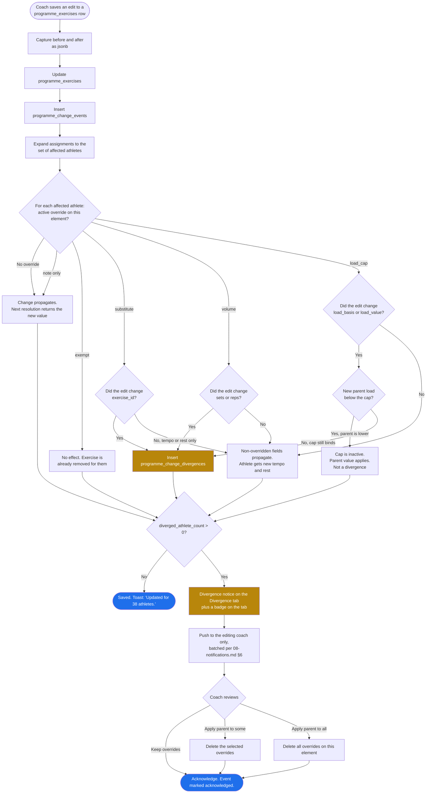

> **This file is not the specification.**
>
> It predates the build specification written on 4 September 2026 and is kept for
> its reasoning, not its instructions. Parts of it describe behaviour that has
> since been deliberately changed, and following it would rebuild things that were
> removed on purpose.
>
> **The binding specification for this screen is in `docs/screens/`, in the
> numbered files.** See `docs/screens/legacy/README.md` for how the two relate.

# Screen: Programme Builder

> **Layout status**: provisional. Awaiting client design photographs.

Screen 22 in the inventory (`02-information-architecture.md` §5). Reached from
`Programmes → Programme builder`. This is the screen the whiteboard instruction *"create
general programme and tailor to specific athletes"* refers to, and it is the screen that
justifies ADR-006.

---

## Purpose

One screen where an S&C coach authors a gym programme once, assigns it to a group or a set
of individuals, and then tailors individual athletes without copying anything.

It has three jobs, in this order of importance:

1. **Author the parent.** Build blocks, weeks, sessions and exercises, and prescribe sets,
   reps, load basis, tempo, rest and supersets against each exercise.
2. **Tailor athletes as overrides.** Substitute an exercise, change volume, cap load, mark
   exempt, or attach a note, each as one `exercise_overrides` row against one
   `programme_exercises` row for one athlete.
3. **Show divergence.** Make it visible, at all times, which athletes differ from the parent
   and why, so that a coach knows what the squad is actually being asked to do.

Success criterion 5 in `00-product-overview.md` is measured here: an S&C coach builds a gym
programme and assigns it to a group of 15 athletes in under 10 minutes.

**What this screen is not.** It is not where athletes log work (`gym-logging.md`), not where
programmes are browsed or archived (`gym-programmes.md`), and not where nutrition targets are
set (`nutrition-plans.md`). Rehab programmes are authored here too, but assigned from the
injury record by medical staff.

---

## Roles and access

| Role | Access |
|---|---|
| Coach / S&C | Full. Create, edit, assign, tailor, archive any programme of type `gym`, `conditioning`, `nutrition`. |
| Medical / Physio | Full authoring for `programme_type = 'rehab'`. Read-only for gym programmes, including the divergence view, for context. Cannot edit a coach-owned gym programme (`01-roles-and-permissions.md` §1). |
| Athlete | No access. Athletes see the resolved output in `my-programme.md`. |
| Admin | No access. Admin does not hold squad data access by default. |

Enforcement is RLS on `programmes`, `programme_blocks`, `programme_sessions`,
`programme_exercises`, `exercise_overrides` and `programme_assignments`, all keyed on
`org_id = auth_org_id()` plus `auth_has_any_role(array['coach','medical'])`. Write policies on
gym-type programmes additionally require the `coach` role. Client-side role checks hide the
edit affordances only.

**Assumption (layout)**: the builder is a web-first surface. A 12-week programme with four
sessions a week is a table-shaped authoring task and the web dashboard is where it belongs.
The mobile layout below is specified and buildable, but is a review-and-light-edit surface,
not the place a coach builds a block from scratch. This matches open question O-6, where the
recommendation is athlete-mobile plus staff-web for v1.

---

## Entry points

| From | Lands on | Context carried |
|---|---|---|
| `Programmes → Programme builder` | New programme chooser: blank, from template, duplicate existing | None |
| `gym-programmes.md`, "Edit" on a programme card | Builder, structure tab, that programme | `programme_id` |
| `gym-programmes.md`, "Create from template" | Builder, structure tab, new draft seeded from the template | `template_programme_id` |
| `athlete-profile.md → Gym tab → "Tailor programme"` | Builder, tailoring tab, filtered to that athlete | `programme_id`, `athlete_id` |
| `injury-record.md → "Assign rehab"` (medical) | Builder, rehab programme, assignment panel open | `athlete_id`, `injury_id` |
| Divergence notification deep link (`fydr://programme/<id>/divergence`) | Builder, divergence tab | `programme_id`, `edit_event_id` |
| `flags.md`, a gym-domain flag on a prescribed exercise | Builder, tailoring tab, that athlete and exercise focused | `programme_exercise_id`, `athlete_id` |

Per `02-information-architecture.md` §7 rule 3, Back returns to the originating screen.

---

## Layout

Four tabs within the builder: **Structure**, **Assign**, **Tailor**, **Divergence**. The tab
bar is the only navigation inside the screen, which keeps the depth at three levels from the
`Programmes` tab root.

### Web, 1280 pt design target

Per `06-design-system.md` §9.2 the programme builder composition is library 3 columns,
programme 6 columns, athlete overrides 3 columns.

```
┌──────────────────────────────────────────────────────────────────────────────────────────┐
│ Fydr    [Group filter: All squad ▾]   [Period: n/a]                        Alex R  ▾    │
├────────────┬─────────────────────────────────────────────────────────────────────────────┤
│            │  ← Programmes                                                               │
│ Dashboard  │  Pre-season Strength 2026          [Draft ▾]   [Duplicate] [Archive] [Save] │
│ Schedule   │  12 weeks · 3 blocks · 4 sessions/week · 38 athletes assigned                │
│ Squad      │ ┌─────────────────────────────────────────────────────────────────────────┐ │
│ Programmes │ │ Structure │ Assign (38) │ Tailor (6) │ Divergence (6) ●                 │ │
│  ▸ Gym     │ └─────────────────────────────────────────────────────────────────────────┘ │
│  ▸ Nutri   │                                                                             │
│  ▸ Rehab   │ ┌── Exercise library ──┐ ┌── Programme ─────────────────┐ ┌── Overrides ──┐ │
│  ▸ Builder │ │ [Search exercises  ] │ │ Block 1  Accumulation  4 wks │ │ On this       │ │
│ More       │ │ ─────────────────────│ │  ▾ Week 1                    │ │ exercise:     │ │
│            │ │ Filter: [Category ▾] │ │    ▾ Lower A     MD-4    ⠿   │ │               │ │
│            │ │        [Equipment ▾] │ │      ⠿ A1 Back squat         │ │ ● J. Okafor   │ │
│            │ │ ─────────────────────│ │         4×5 · 80% 1RM        │ │   load_cap    │ │
│            │ │ ▸ Squat              │ │         3-1-X-0 · 180s   [⋯] │ │   70% · to    │ │
│            │ │   Back squat      +  │ │      ⠿ A2 Nordic curl        │ │   12 Sep      │ │
│            │ │   Front squat     +  │ │         3×6 · bodyweight     │ │   "post-op    │ │
│            │ │   Split squat     +  │ │         X-3-X-0 · 90s    [⋯] │ │    knee"      │ │
│            │ │ ▸ Hinge              │ │      ⠿ B1 RDL                │ │               │ │
│            │ │   Romanian DL     +  │ │         3×8 · 65% 1RM    [⋯] │ │ ● T. Bennett  │ │
│            │ │   Trap bar DL     +  │ │      ⠿ B2 Copenhagen plank   │ │   substitute  │ │
│            │ │ ▸ Push               │ │         3×30s            [⋯] │ │   → Goblet    │ │
│            │ │   Bench press     +  │ │      + Add exercise          │ │     squat     │ │
│            │ │   Floor press     +  │ │    ▸ Upper A     MD-3        │ │               │ │
│            │ │ ▸ Olympic            │ │    ▸ Lower B     MD-2        │ │ [+ Add        │ │
│            │ │   Power clean     +  │ │    + Add session             │ │    override]  │ │
│            │ │ ─────────────────────│ │  ▸ Week 2  (copy of Week 1)  │ │               │ │
│            │ │ [+ New exercise]     │ │  ▸ Week 3                    │ │ ── Selected ──│ │
│            │ │                      │ │  ▸ Week 4  (deload)          │ │ A1 Back squat │ │
│            │ │                      │ │ ▸ Block 2 Intensification 4w │ │ Week 1 Lower A│ │
│            │ │                      │ │ ▸ Block 3 Realisation     4w │ │               │ │
│            │ │                      │ │ + Add block                  │ │               │ │
│            │ └──────────────────────┘ └──────────────────────────────┘ └───────────────┘ │
└────────────┴─────────────────────────────────────────────────────────────────────────────┘
```

Exercise prescription is edited inline in the centre column. Selecting an exercise row expands
it into an editor without navigating away:

```
┌── Programme ────────────────────────────────────────────────────────────────┐
│  ⠿ A1 Back squat                                          [Superset: A ▾] [⋯]│
│  ┌────────────────────────────────────────────────────────────────────────┐ │
│  │ Sets [ 4 ]  Reps [ 5 ] to [ 5 ]                                        │ │
│  │ Load basis  ( ) Absolute kg   (•) % of 1RM   ( ) % bodyweight          │ │
│  │             ( ) RPE target    ( ) None                                 │ │
│  │ Value [ 80 ] %   of  [1RM back squat ▾]                                │ │
│  │        ⓘ Resolves per athlete from their latest 1RM back squat result. │ │
│  │          34 of 38 assigned athletes have a result. 4 do not. [Review]  │ │
│  │ Tempo [ 3-1-X-0 ]   Rest [ 180 ] s                                     │ │
│  │ Notes [ Belt permitted from week 3.                                  ] │ │
│  │                                        [Cancel]  [Apply to this week]  │ │
│  │                                        [Apply to all weeks in block]   │ │
│  └────────────────────────────────────────────────────────────────────────┘ │
└─────────────────────────────────────────────────────────────────────────────┘
```

The **Tailor** tab replaces the centre and right columns with an athlete-by-exercise matrix:

```
┌── Tailor ───────────────────────────────────────────────────────────────────────────────┐
│ [Group filter: All squad ▾]  [Athlete search        ]  Show: (•) All  ( ) Only tailored  │
│ Week [ 1 ▾]  Session [ Lower A ▾ ]                                                       │
├──────────────┬──────────┬──────────┬──────────┬──────────┬──────────┬───────────────────┤
│ Athlete      │ A1 Back  │ A2 Nordic│ B1 RDL   │ B2 Copen.│ Status   │                   │
│              │ squat    │ curl     │          │ hagen    │          │                   │
├──────────────┼──────────┼──────────┼──────────┼──────────┼──────────┼───────────────────┤
│ J. Okafor    │ ▲ cap 70%│ parent   │ parent   │ parent   │ Modified │ [Edit tailoring]  │
│ T. Bennett   │ ⇄ Goblet │ parent   │ parent   │ parent   │ Available│ [Edit tailoring]  │
│ S. Adeyemi   │ parent   │ parent   │ ⊘ exempt │ parent   │ Available│ [Edit tailoring]  │
│ M. Price     │ parent   │ parent   │ parent   │ parent   │ Available│ [Tailor]          │
│ D. Rahman    │ ⊞ 3×5    │ parent   │ parent   │ parent   │ Available│ [Edit tailoring]  │
│ ...          │          │          │          │          │          │                   │
├──────────────┴──────────┴──────────┴──────────┴──────────┴──────────┴───────────────────┤
│ Legend  ⇄ substitute  ⊞ volume  ▲ load cap  ⊘ exempt  ✎ note                            │
│ 6 of 38 athletes tailored on this session · 9 active overrides                           │
└─────────────────────────────────────────────────────────────────────────────────────────┘
```

The **Divergence** tab:

```
┌── Divergence ───────────────────────────────────────────────────────────────────────────┐
│ Athletes whose prescription differs from the parent programme.                           │
│ [Group filter: All squad ▾]  [Type: All ▾]  [ ] Include expired   [Export CSV]           │
├──────────────────────────────────────────────────────────────────────────────────────────┤
│ ⚠ Your edit on 4 Aug did not reach 2 athletes                                            │
│   Week 1 · Lower A · A1 Back squat · 4×5 → 5×5                                           │
│   J. Okafor keeps load cap 70%. D. Rahman keeps volume 3×5.        [Review] [Dismiss]    │
├──────────────────────────────────────────────────────────────────────────────────────────┤
│ Athlete      │ Element                    │ Type      │ Parent   │ Resolved │ Reason  │Exp│
│ J. Okafor    │ W1 Lower A · A1 Back squat │ load_cap  │ 80% 1RM  │ 70% 1RM  │ post-op │12S│
│ T. Bennett   │ W1 Lower A · A2 Nordic     │ substitute│ Nordic   │ Goblet   │ ham str │ - │
│ S. Adeyemi   │ W1 Lower A · B1 RDL        │ exempt    │ 3×8 65%  │ removed  │ lumbar  │ - │
│ D. Rahman    │ W1 Lower A · A1 Back squat │ volume    │ 5×5      │ 3×5      │ academy │ - │
│ D. Rahman    │ W2 Lower A · A1 Back squat │ volume    │ 5×5      │ 3×5      │ academy │ - │
│ J. Okafor    │ W2 Lower A · A1 Back squat │ load_cap  │ 82% 1RM  │ 70% 1RM  │ post-op │12S│
└──────────────────────────────────────────────────────────────────────────────────────────┘
```

### Mobile, 390 pt design target

Single column. The three-column web composition collapses to a stack, and the library becomes
a bottom sheet triggered by "Add exercise".

```
┌─────────────────────────────┐
│ ←  Pre-season Strength      │
│    Draft · 12 wks · 38 ath  │
├─────────────────────────────┤
│ Structure Assign Tailor Div │
│ ───────                   ● │
├─────────────────────────────┤
│ ▾ Block 1 Accumulation 4wk  │
│   ▾ Week 1                  │
│     ▾ Lower A        MD-4   │
│       ┌───────────────────┐ │
│       │A1 Back squat      │ │
│       │4×5 · 80% 1RM      │ │
│       │3-1-X-0 · 180s     │ │
│       │● 2 tailored     ⋯ │ │
│       └───────────────────┘ │
│       ┌───────────────────┐ │
│       │A2 Nordic curl     │ │
│       │3×6 · bodyweight   │ │
│       │X-3-X-0 · 90s    ⋯ │ │
│       └───────────────────┘ │
│       [ + Add exercise ]    │
│     ▸ Upper A        MD-3   │
│     ▸ Lower B        MD-2   │
│     [ + Add session ]       │
│   ▸ Week 2                  │
│   ▸ Week 3                  │
│   ▸ Week 4  deload          │
│ ▸ Block 2 Intensification   │
│ ▸ Block 3 Realisation       │
│ [ + Add block ]             │
├─────────────────────────────┤
│        [ Save draft ]       │
└─────────────────────────────┘
```

Tailoring on mobile is a bottom sheet per athlete, not a matrix. The matrix does not survive
390 pt and forcing it produces horizontal scrolling on a data-entry surface, which is worse
than a list.

```
┌─────────────────────────────┐
│ Tailor · J. Okafor       ✕  │
├─────────────────────────────┤
│ Week 1 · Lower A            │
│                             │
│ A1 Back squat               │
│  Parent  4×5 · 80% 1RM      │
│  ▲ Load cap  70%            │
│    Reason: post-op knee     │
│    Expires: 12 Sep 2026     │
│                    [Edit]   │
│                             │
│ A2 Nordic curl              │
│  Parent  3×6 · bodyweight   │
│                  [Tailor ▾] │
│                             │
│ B1 RDL                      │
│  Parent  3×8 · 65% 1RM      │
│                  [Tailor ▾] │
├─────────────────────────────┤
│ Resolved for this athlete:  │
│ 3 exercises · est. 42 min   │
└─────────────────────────────┘
```

The "Tailor" action opens a second sheet with the five override types as a segmented choice,
each revealing only its own fields.

---

## Components

| Component | Source | Purpose |
|---|---|---|
| `ProgrammeExerciseRow` | `06-design-system.md` §6.13, `mode='build'` | One prescribed exercise with drag, edit, delete affordances and the override chip |
| `GroupFilter` | §6.7 | Global group filter, scopes the Assign, Tailor and Divergence tabs |
| `EmptyState` | §6.16 | All six empty kinds appear on this screen |
| `ConfirmSheet` | §6.18 | Destructive confirmations: delete an element with overrides, discard draft, unassign an athlete |
| `BottomSheet` | §6.19 | Exercise library, tailoring editor, assignment picker on mobile |
| `NumberStepper` | §6.11 | Sets, reps, rest seconds. Keyboard entry on web, stepper on mobile |
| `AthleteCard` | §6.1 | Assignment picker rows and the tailoring list |
| `AvailabilityPill` | §6.5 | Availability shown against every athlete in Assign and Tailor, so a coach sees restrictions before prescribing |
| `SessionCard` | §6.14 | Not used. Programme sessions are template rows, not scheduled sessions, and reusing the card implies a calendar entry that does not exist |
| `ExerciseLibraryPanel` | New, this screen | Searchable, category-grouped list of `exercises` with a add-to-session action |
| `ProgrammeTree` | New, this screen | The block / week / session / exercise outline with drag reordering and collapse state |
| `PrescriptionEditor` | New, this screen | Inline editor for one `programme_exercises` row, including the load basis radio group and the resolution preview |
| `LoadBasisPicker` | New, this screen | Five-way choice with the per-basis value field, unit label and resolution note |
| `SupersetGrouper` | New, this screen | Assigns a `superset_group` label and renders the shared left rule |
| `OverrideEditor` | New, this screen | Creates or edits one `exercise_overrides` row: type, values, reason, expiry |
| `TailoringMatrix` | New, this screen, web only | Athlete rows by exercise columns with override glyphs |
| `DivergenceList` | New, this screen | The parent-versus-resolved table and the post-edit divergence notice |
| `ResolutionPreview` | New, this screen | Renders `resolve_programme_session` output for a chosen athlete, so the coach sees what that athlete will actually see |
| `AssignmentPanel` | New, this screen | Group and individual assignment with start and end dates |

New components live in `packages/ui/src/components/programme/` and follow the conventions in
§6: no data fetching inside a component, `testID` and `accessibilityLabel` on every
interactive element, `density` from context.

---

## Data requirements

### Reads

| Field | Source `table.column` | Transformation |
|---|---|---|
| Programme name, type, status | `programmes.name`, `.programme_type`, `.status` | None |
| Duration | `programmes.duration_weeks` | Cross-checked against `sum(programme_blocks.duration_weeks)`; mismatch is a validation warning |
| Template flag | `programmes.is_template` | Drives the "Save as template" affordance |
| Block name, order, length | `programme_blocks.name`, `.sequence`, `.duration_weeks`, `.focus` | Ordered by `sequence` |
| Session name, week, day, MD anchor | `programme_sessions.name`, `.week_number`, `.day_number`, `.md_offset`, `.sequence` | Ordered by `week_number`, then `sequence` |
| Exercise prescription | `programme_exercises.sets`, `.reps_min`, `.reps_max`, `.load_basis`, `.load_value`, `.tempo`, `.rest_seconds`, `.superset_group`, `.notes`, `.sequence` | Ordered by `sequence`. `reps_min = reps_max` renders as a single number |
| Exercise identity | `exercises.name`, `.category`, `.is_unilateral`, `.video_url`, `.equipment` | Library grouped by `category` |
| Assignments | `programme_assignments.athlete_id`, `.group_id`, `.starts_on`, `.ends_on`, `.status` | Group assignments expand through `group_memberships` as at `starts_on` |
| Assigned athlete identity | `athletes.first_name`, `.last_name`, `.squad_number`, `.position` | Display as "T. Bennett" per §5 naming |
| Availability of assigned athletes | `availability.status`, `.restrictions` where `effective_to is null` | Most recent row per athlete. Drives the restriction warning |
| Overrides | `exercise_overrides.override_type`, `.substitute_exercise_id`, `.sets`, `.reps_min`, `.reps_max`, `.load_value`, `.reason`, `.expires_at` | Rows with `expires_at <= now()` are inactive and rendered greyed under "Include expired" |
| Resolved prescription per athlete | `resolve_programme_session(session_id, athlete_id, now())` | ADR-006 resolution order. Never resolved in the client from raw rows |
| 1RM availability | `test_results.value` for the linked `test_definitions.id`, latest `test_date` per athlete | Coverage count shown in the prescription editor. Missing athletes listed, never defaulted |
| Bodyweight for `percent_bw` | `body_composition.body_mass_kg`, latest `measured_on`; fallback `wellness_entries.body_mass_kg`, latest `entry_date` | Provenance labelled. If neither exists, prescription shows "bodyweight" without a kg figure |
| Divergence count badge | `count(*)` over active `exercise_overrides` for the programme | Distinct athletes, not distinct rows, in the tab badge |

### Schema additions required

Per `CLAUDE.md` §5, these land in `04-data-model.md` in the same commit as the migration.

| Change | Table | Why |
|---|---|---|
| Add `one_rm_test_definition_id uuid references test_definitions(id)` | `exercises` | A `percent_1rm` prescription needs to know which test defines the 1RM for that exercise. Without it, resolution is a name match, which will silently fail |
| Add `default_load_basis load_basis` | `exercises` | So adding "Back squat" to a session pre-selects `percent_1rm` rather than making the coach choose every time |
| New table `programme_change_events` | new | The persisted record of a parent edit, what changed, and who diverged. Drives the divergence notice and its dismissal |
| New table `programme_change_divergences` | new | One row per athlete per element that did not receive a parent change |
| Add `estimated_duration_min int` | `programme_sessions` | Computed on write from sets, reps, tempo and rest. Shown to the coach so a session that takes 95 minutes is visible at authoring time |

```sql
create table programme_change_events (
  id            uuid primary key default gen_random_uuid(),
  org_id        uuid not null references organisations(id),
  programme_id  uuid not null references programmes(id) on delete cascade,
  changed_by    uuid not null references users(id),
  change_scope  text not null,          -- 'exercise' | 'session' | 'block' | 'programme'
  entity_id     uuid not null,
  before        jsonb not null,
  after         jsonb not null,
  affected_athlete_count int not null default 0,
  diverged_athlete_count int not null default 0,
  acknowledged_at timestamptz,
  acknowledged_by uuid references users(id),
  created_at    timestamptz not null default now()
);

create table programme_change_divergences (
  id            uuid primary key default gen_random_uuid(),
  org_id        uuid not null references organisations(id),
  event_id      uuid not null references programme_change_events(id) on delete cascade,
  athlete_id    uuid not null references athletes(id),
  programme_exercise_id uuid not null references programme_exercises(id) on delete cascade,
  override_id   uuid references exercise_overrides(id) on delete set null,
  override_type override_type not null,
  created_at    timestamptz not null default now()
);

create index on programme_change_events (programme_id, created_at desc)
  where acknowledged_at is null;
create index on programme_change_divergences (event_id);
create index on exercise_overrides (athlete_id) where expires_at is null;
```

### Query: load the programme tree

One round trip. The tree is small, a few hundred rows at most for a 12-week programme, so it
is fetched whole rather than lazily per block.

```sql
select
  b.id                as block_id,
  b.name              as block_name,
  b.sequence          as block_sequence,
  b.duration_weeks,
  b.focus,
  s.id                as session_id,
  s.name              as session_name,
  s.week_number,
  s.day_number,
  s.md_offset,
  s.sequence          as session_sequence,
  s.estimated_duration_min,
  pe.id               as programme_exercise_id,
  pe.sequence         as exercise_sequence,
  pe.superset_group,
  pe.sets,
  pe.reps_min,
  pe.reps_max,
  pe.load_basis,
  pe.load_value,
  pe.tempo,
  pe.rest_seconds,
  pe.notes,
  e.id                as exercise_id,
  e.name              as exercise_name,
  e.category,
  e.is_unilateral,
  e.video_url,
  e.one_rm_test_definition_id,
  coalesce(ov.override_count, 0)   as override_count,
  coalesce(ov.athlete_count, 0)    as tailored_athlete_count
from programme_blocks b
left join programme_sessions s   on s.block_id = b.id
left join programme_exercises pe on pe.programme_session_id = s.id
left join exercises e            on e.id = pe.exercise_id
left join lateral (
  select count(*) as override_count,
         count(distinct o.athlete_id) as athlete_count
  from exercise_overrides o
  where o.programme_exercise_id = pe.id
    and (o.expires_at is null or o.expires_at > now())
) ov on true
where b.programme_id = $1
  and b.org_id = auth_org_id()
order by b.sequence, s.week_number, s.sequence, pe.sequence;
```

### Query: resolve one athlete's view, for the preview

Calls the ADR-006 function directly. The client never reimplements the resolution order.

```sql
select r.*, e.name as exercise_name, e.video_url
from resolve_programme_session($1::uuid, $2::uuid, now()) r
join exercises e on e.id = r.exercise_id
order by r.sequence;
```

### Query: batch resolution for the tailoring matrix

The N+1 warning in ADR-006 "Consequences" is real. The matrix needs one session resolved
against up to 60 athletes. This is the required set-returning variant.

```sql
create or replace function public.resolve_programme_session_batch(
  p_programme_session_id uuid,
  p_athlete_ids          uuid[],
  p_on                   timestamptz default now()
)
returns table (
  athlete_id            uuid,
  programme_exercise_id uuid,
  sequence              int,
  exercise_id           uuid,
  sets                  int,
  reps_min              int,
  reps_max              int,
  load_basis            public.load_basis,
  load_value            numeric,
  tempo                 text,
  rest_seconds          int,
  is_overridden         boolean,
  is_exempt             boolean,
  override_types        public.override_type[],
  override_reason       text
)
language sql
stable
security invoker
as $$
  with athletes_in as (
    select unnest(p_athlete_ids) as athlete_id
  ),
  pe as (
    select * from public.programme_exercises
    where programme_session_id = p_programme_session_id
  ),
  ov as (
    select o.*
    from public.exercise_overrides o
    join pe on pe.id = o.programme_exercise_id
    where o.athlete_id = any(p_athlete_ids)
      and (o.expires_at is null or o.expires_at > p_on)
  )
  select
    a.athlete_id,
    pe.id,
    pe.sequence,
    coalesce(sub.substitute_exercise_id, pe.exercise_id),
    coalesce(vol.sets,     pe.sets),
    coalesce(vol.reps_min, pe.reps_min),
    coalesce(vol.reps_max, pe.reps_max),
    pe.load_basis,
    case when cap.load_value is not null
         then least(pe.load_value, cap.load_value)
         else pe.load_value end,
    pe.tempo,
    pe.rest_seconds,
    (sub.id is not null or vol.id is not null or cap.id is not null),
    (ex.id is not null),
    array_remove(array[
      case when ex.id  is not null then 'exempt'::public.override_type end,
      case when sub.id is not null then 'substitute'::public.override_type end,
      case when vol.id is not null then 'volume'::public.override_type end,
      case when cap.id is not null then 'load_cap'::public.override_type end,
      case when nt.id  is not null then 'note'::public.override_type end
    ], null),
    coalesce(ex.reason, sub.reason, vol.reason, cap.reason, nt.reason)
  from athletes_in a
  cross join pe
  left join ov ex  on ex.programme_exercise_id  = pe.id and ex.athlete_id  = a.athlete_id
                   and ex.override_type  = 'exempt'
  left join ov sub on sub.programme_exercise_id = pe.id and sub.athlete_id = a.athlete_id
                   and sub.override_type = 'substitute'
  left join ov vol on vol.programme_exercise_id = pe.id and vol.athlete_id = a.athlete_id
                   and vol.override_type = 'volume'
  left join ov cap on cap.programme_exercise_id = pe.id and cap.athlete_id = a.athlete_id
                   and cap.override_type = 'load_cap'
  left join ov nt  on nt.programme_exercise_id  = pe.id and nt.athlete_id  = a.athlete_id
                   and nt.override_type  = 'note'
  order by a.athlete_id, pe.sequence;
$$;
```

Note the difference from the single-athlete function: exempt rows are **returned** with
`is_exempt = true` rather than filtered out, because the matrix must draw the ⊘ glyph in that
cell. The athlete-facing resolution still uses the filtering variant.

### Query: divergence view

```sql
select
  a.id                              as athlete_id,
  a.first_name, a.last_name,
  b.name        as block_name,
  s.week_number,
  s.name        as session_name,
  pe.sequence   as exercise_sequence,
  pe.superset_group,
  pe_ex.name    as parent_exercise_name,
  sub_ex.name   as substitute_exercise_name,
  o.override_type,
  o.sets, o.reps_min, o.reps_max, o.load_value,
  pe.sets       as parent_sets,
  pe.reps_min   as parent_reps_min,
  pe.reps_max   as parent_reps_max,
  pe.load_basis as parent_load_basis,
  pe.load_value as parent_load_value,
  o.reason,
  o.expires_at,
  u.full_name   as created_by_name,
  o.created_at
from exercise_overrides o
join programme_exercises pe on pe.id = o.programme_exercise_id
join exercises pe_ex        on pe_ex.id = pe.exercise_id
left join exercises sub_ex  on sub_ex.id = o.substitute_exercise_id
join programme_sessions s   on s.id = pe.programme_session_id
join programme_blocks b     on b.id = s.block_id
join athletes a             on a.id = o.athlete_id
left join users u           on u.id = o.created_by
where b.programme_id = $1
  and o.org_id = auth_org_id()
  and ($2::boolean or o.expires_at is null or o.expires_at > now())   -- $2 = include_expired
  and ($3::uuid[] is null or exists (
        select 1 from group_memberships gm
        where gm.athlete_id = a.id
          and gm.group_id = any($3::uuid[])
          and gm.removed_at is null))
order by a.last_name, b.sequence, s.week_number, pe.sequence;
```

### Query: 1RM coverage for a `percent_1rm` prescription

Run when the coach selects `percent_1rm`, and again before assignment. Never silently
defaulted, per `04-data-model.md` §7.

```sql
with assigned as (
  select distinct coalesce(pa.athlete_id, gm.athlete_id) as athlete_id
  from programme_assignments pa
  left join group_memberships gm
    on gm.group_id = pa.group_id and gm.removed_at is null
  where pa.programme_id = $1
    and pa.status = 'active'
),
latest as (
  select distinct on (tr.athlete_id)
    tr.athlete_id, tr.value, tr.test_date
  from test_results tr
  where tr.test_definition_id = $2
    and tr.athlete_id in (select athlete_id from assigned)
    and tr.deleted_at is null
    and tr.is_best
  order by tr.athlete_id, tr.test_date desc
)
select
  a.athlete_id,
  ath.first_name, ath.last_name,
  l.value      as one_rm_kg,
  l.test_date,
  (now()::date - l.test_date) as days_old,
  round(l.value * ($3::numeric / 100.0), 1) as prescribed_kg
from assigned a
join athletes ath on ath.id = a.athlete_id
left join latest l on l.athlete_id = a.athlete_id
order by (l.value is null) desc, ath.last_name;
```

Athletes with a null `one_rm_kg` sort first, because they are the ones the coach must act on.

### Writes

| Action | Write |
|---|---|
| Add exercise to session | Insert `programme_exercises`, `sequence = max + 1` |
| Edit prescription | Update `programme_exercises`, then insert `programme_change_events` and compute divergences |
| Reorder | Update `sequence` on affected rows in one statement, not one round trip per row |
| Delete element | Soft path: the row is deleted, `on delete cascade` removes its overrides. Preceded by a `ConfirmSheet` naming the affected athletes |
| Create override | Insert `exercise_overrides` with `created_by = auth_user_id()` |
| Remove override | Delete the row. Parent value applies immediately |
| Assign | Insert `programme_assignments`, one row per group or per athlete |
| Publish | Update `programmes.status` from `draft` to `active` |

Programme authoring rows are **not** subject to `CLAUDE.md` rule 6. That rule governs
submitted entries. A programme is intent, it is edited in place, and its history is captured
by `programme_change_events` plus the ADR-006 snapshot columns on `gym_set_logs`.

---

## States

### Default

Structure tab, first block expanded, first week expanded, remaining collapsed. Collapse state
persists per programme per user in local storage, because a coach working in week 7 does not
want to reopen six blocks every visit.

### Loading

Skeletons per `06-design-system.md` §11.1. The tree renders three skeleton block headers with
two skeleton session rows each, at the final layout's dimensions. The exercise library renders
its own skeleton independently, so a slow library does not delay the tree. Skeletons appear
after 150 ms and persist for at least 400 ms.

The tailoring matrix loads in two passes: athlete rows appear immediately from the cached
squad list, cells fill when `resolve_programme_session_batch` returns. Cells show a skeleton
dash, never a zero.

### Empty

| Kind | Trigger | Copy | Action |
|---|---|---|---|
| `notStarted` | New blank programme, no blocks | "This programme is empty. Start with a block, or build from a template." | "Add block" and "Use a template" |
| `notStarted` | Block with no sessions | "No sessions in Accumulation yet." | "Add session" |
| `notStarted` | Session with no exercises | "No exercises in Lower A yet." | "Add exercise" |
| `notStarted` | Assign tab, nothing assigned | "Nobody is assigned to this programme yet." | "Assign athletes" |
| `allClear` | Divergence tab, no overrides | "Every assigned athlete is on the parent programme." | none |
| `noResults` | Tailor tab, group filter excludes everyone | "No athletes in Forwards are assigned to this programme." | "Clear filter" |
| `noResults` | Library search returns nothing | "No exercises match 'nordik'." | "Create exercise" |
| `noData` | 1RM coverage panel, nobody tested | "No 1RM back squat results for any assigned athlete." | "Schedule a test" |

### Error

Errors render at the smallest failing scope (§11.3). A failed library fetch shows the error
inside the library column and leaves the tree usable. A failed save shows an inline banner on
the affected element reading "Could not save this exercise. Your change is still here. Try
again." with the local edit preserved, never discarded.

A failed `resolve_programme_session_batch` blanks the matrix cells and shows "Could not
resolve tailoring. Parent prescription is shown." The tailoring glyphs are suppressed rather
than guessed, because a matrix showing "parent" for an athlete who actually has a load cap is
a clinical safety problem, not a display bug.

### Offline

Per §11.4, staff write actions are disabled offline in v1. The builder renders the last cached
programme tree read-only with a persistent offline chip and a "Last updated 14:02" caption.
Every edit affordance is disabled with the explanation "You are offline. Editing will be
available when you reconnect." Draft edits are not queued, and the screen states that plainly
rather than accepting input it will drop.

### Role-specific

| Role | Difference |
|---|---|
| Coach / S&C | Full screen as specified |
| Medical | Gym programmes open read-only: no drag handles, no edit buttons, no assignment panel. The Divergence tab is fully available, because a physio needs to see whether their load cap survived a coach's edit. Rehab programmes are fully editable |
| Coach viewing a rehab programme | Read-only, with the banner "This is a rehabilitation programme. Only medical staff can edit it." rendered as `noPermission`, not as an error |
| Athlete, admin | Route is not registered in their shell. A deep link resolves to a `noPermission` state, never a 404, so a mis-sent notification does not look like a broken app |

---

## Interactions

### Building the structure

1. **Add block.** Inline row at the end of the tree. Name and `duration_weeks` required.
   `sequence` is `max + 1`.
2. **Add session to a week.** Name, and one of `day_number` or `md_offset`. The MD anchor is
   the recommended default, per design principle 4, because a gym session that should happen
   on MD-4 should stay on MD-4 when the fixture moves.
3. **Add exercise.** Drag from the library, or press `+` on a library row, which appends to
   the currently focused session. Keyboard: `/` focuses library search, `Enter` adds the top
   result to the focused session.
4. **Reorder.** Drag by the `⠿` handle. Web supports keyboard reorder with `Alt + ↑ / ↓` on a
   focused row. Reordering renumbers `sequence` contiguously in one update.
5. **Copy a week.** "Duplicate week" clones all sessions and exercises with new ids. Overrides
   are **not** cloned, because an override belongs to a specific parent element. The
   confirmation states this in one line.
6. **Progression helper.** "Duplicate week with progression" clones and applies a delta:
   `+5%` load, `+1` set, or `-1` rep. Explicitly a convenience over the clone, never applied
   automatically.

### Prescribing

The load basis choice determines everything else in the editor:

| Basis | Value field | Unit | Resolution | Athlete sees |
|---|---|---|---|---|
| `absolute` | Number | kg | None. Same for everyone | "80 kg" |
| `percent_1rm` | Number 1 to 100 | % | `test_results.value` for `exercises.one_rm_test_definition_id`, latest `is_best` row per athlete | "82.5 kg (80% of your 1RM, tested 12 Jun)" |
| `percent_bw` | Number 1 to 300 | % | Latest `body_composition.body_mass_kg`, falling back to `wellness_entries.body_mass_kg` | "68 kg (80% bodyweight)" |
| `rpe` | Number 1 to 10, 0.5 steps | RPE | None. The athlete self-regulates | "Work up to RPE 8" |
| `none` | Absent | | For bodyweight and mobility work | "Bodyweight" |

**The `percent_1rm` coverage check is a hard interaction, not a nicety.** On selecting
`percent_1rm`, the editor immediately shows how many assigned athletes have a resolvable 1RM
and lists those who do not, with a "Schedule a test" action linking to `testing.md`. A
prescription that cannot resolve for an athlete renders in their programme as "Load not set,
see your coach" and raises a `testing`-domain flag against that athlete. It never falls back
to a default weight.

**Staleness.** A 1RM older than the organisation's `settings.testing.one_rm_stale_days`
(default 120) resolves, but the prescription is annotated "1RM is 147 days old" in both the
coach's editor and the athlete's programme.

**Supersets.** Assigning the same `superset_group` label to two or more exercises in a session
groups them. The UI enforces contiguity: superset members must be adjacent in `sequence`, and
dragging a non-member between them either breaks the group with a confirmation or is rejected.
Labels are letters, assigned automatically as A, B, C, and displayed as the A1, A2 prefix.

**Tempo** is free text validated against the four-position pattern `N-N-N-N`, where each
position is a digit 0 to 9 or `X`. Rest is an integer 0 to 600 seconds.

**Estimated duration** is recomputed on every prescription change:
`sum(sets × (reps × tempo_seconds + rest_seconds))`, with supersets counting rest once per
round rather than per exercise, plus a fixed 8-minute warm-up allowance. It is a rough figure
and is labelled "estimated". Its value is that a coach sees a 95-minute session before the
squad does.

### Assigning

Assignment is to a group or to individuals, one `programme_assignments` row each, per
`04-data-model.md` §6. Group assignment expands through `group_memberships` at read time, so
an athlete added to Forwards next week picks up the programme automatically.

The panel shows, per athlete: name, availability pill, existing active programme assignments,
and any restriction that conflicts with an exercise in the programme.

**The restriction warning.** Per `03-flows.md` §6, the system warns and does not block when an
athlete is assigned work their restrictions prohibit. Matching is on
`availability.restrictions` against `exercises.category` and `exercises.equipment` through a
mapping table. The warning names the exercises: "S. Adeyemi is restricted from contact and
lower-body loading. This programme prescribes back squat, RDL and Nordic curl." The coach may
proceed. The override is written to `audit_log` with action `programme.assign_over_restriction`.

**Rehab precedence.** Per `03-flows.md` §4, a medical-assigned rehab programme suspends a gym
programme for that athlete. Assigning a gym programme to an athlete with an active rehab
assignment creates the row with `status = 'suspended'` and `suspended_reason = 'rehab_active'`,
and the panel says so. It resumes on clearance, it is not deleted.

### Tailoring

Five override types, matching the `override_type` enum, presented in the order of the ADR-006
resolution table so the coach learns the precedence by using the UI:

| Type | Fields | UI copy |
|---|---|---|
| `exempt` | Reason, expiry | "Remove this exercise for this athlete" |
| `substitute` | Replacement exercise, reason, expiry | "Swap this exercise for another" |
| `volume` | Sets, reps min, reps max, reason, expiry | "Change sets and reps" |
| `load_cap` | Value in the parent's unit, reason, expiry | "Cap the load. If the programme prescribes less, the programme wins." |
| `note` | Text, expiry | "Add a note this athlete will see" |

Constraints that follow from the model:

- One override of each type per athlete per element, enforced by the unique key. Creating a
  second of the same type edits the existing row and says so.
- `load_cap` is a ceiling, never a setting. The UI states this next to the field, because
  "cap at 70%" being read as "set to 70%" is the single most likely misunderstanding on this
  screen.
- `exempt` disables the other four in the editor, because nothing downstream applies.
- Reason is **required** on `exempt`, `substitute` and `load_cap`, optional on `volume` and
  `note`. An unexplained exemption is unreadable to the next coach.
- Expiry is optional but prompted. The picker offers "2 weeks", "4 weeks", "End of block",
  "No expiry", with "End of block" resolving to the block's last day.

After saving an override the `ResolutionPreview` updates in place, showing exactly what that
athlete will see. Nothing is applied that the coach has not been shown.

### Propagation on parent edit

This is the mechanic. When a coach edits a `programme_exercises` row that some athletes have
overridden, unmodified athletes receive the change, overridden athletes keep their override,
and the coach is told.



Details that the diagram compresses:

1. **Divergence is per field, not per row.** A coach who changes only `rest_seconds` on an
   exercise that an athlete has a `volume` override on has not diverged from that athlete:
   the rest change propagates, the volume override still stands. Reporting that as a
   divergence trains coaches to ignore the notice. The comparison is between the changed keys
   of `before` and `after` and the fields the override actually replaces.
2. **`load_cap` is conditional.** If the parent drops from 85% to 65% and an athlete is capped
   at 70%, the cap no longer binds and `least(65, 70)` gives 65. The athlete is now on the
   parent value and there is no divergence. The cap row remains, dormant, and re-binds if the
   parent rises again. This is the correct behaviour and it is invisible unless stated.
3. **`exempt` is not reported.** Editing an exercise an athlete is exempt from cannot diverge
   them, because they do not perform it. Listing them adds noise.
4. **The notice is per edit event, not per override.** One edit affecting six athletes
   produces one notice naming six athletes, not six notices.
5. **Only the editing coach is notified.** Other staff see the badge when they next open the
   programme. Pushing a programme edit to every coach in the club is exactly the alert fatigue
   `08-notifications.md` §1 exists to prevent.
6. **Athletes are notified separately**, per `08-notifications.md` §3.4, and only when their
   own resolved prescription actually changed. An athlete whose override absorbed the edit
   gets nothing, because nothing changed for them.
7. **Acknowledgement is required for the badge to clear.** An unacknowledged event stays
   visible indefinitely. Silent non-propagation is the failure this whole mechanic exists to
   prevent, so the notice does not auto-dismiss on a timer.

The divergence computation runs in the same transaction as the update, as a Postgres function,
so a coach never sees a stale count:

```sql
create or replace function public.record_programme_change(
  p_programme_exercise_id uuid,
  p_before jsonb,
  p_after  jsonb
)
returns uuid
language plpgsql
security invoker
as $$
declare
  v_event_id  uuid;
  v_prog_id   uuid;
  v_org_id    uuid;
  v_changed   text[];
begin
  select b.programme_id, pe.org_id
    into v_prog_id, v_org_id
  from public.programme_exercises pe
  join public.programme_sessions s on s.id = pe.programme_session_id
  join public.programme_blocks b   on b.id = s.block_id
  where pe.id = p_programme_exercise_id;

  select array_agg(key) into v_changed
  from jsonb_each(p_after) a
  where a.value is distinct from (p_before -> a.key);

  insert into public.programme_change_events
    (org_id, programme_id, changed_by, change_scope, entity_id, before, after)
  values
    (v_org_id, v_prog_id, auth_user_id(), 'exercise', p_programme_exercise_id,
     p_before, p_after)
  returning id into v_event_id;

  insert into public.programme_change_divergences
    (org_id, event_id, athlete_id, programme_exercise_id, override_id, override_type)
  select v_org_id, v_event_id, o.athlete_id, o.programme_exercise_id, o.id, o.override_type
  from public.exercise_overrides o
  where o.programme_exercise_id = p_programme_exercise_id
    and (o.expires_at is null or o.expires_at > now())
    and o.override_type <> 'note'
    and o.override_type <> 'exempt'
    and (
      (o.override_type = 'substitute' and 'exercise_id' = any(v_changed))
      or (o.override_type = 'volume'
          and (v_changed && array['sets','reps_min','reps_max']))
      or (o.override_type = 'load_cap'
          and (v_changed && array['load_basis','load_value'])
          and coalesce((p_after ->> 'load_value')::numeric, 0) > o.load_value)
    );

  update public.programme_change_events e
  set affected_athlete_count = (
        select count(distinct coalesce(pa.athlete_id, gm.athlete_id))
        from public.programme_assignments pa
        left join public.group_memberships gm
          on gm.group_id = pa.group_id and gm.removed_at is null
        where pa.programme_id = v_prog_id and pa.status = 'active'),
      diverged_athlete_count = (
        select count(distinct d.athlete_id)
        from public.programme_change_divergences d
        where d.event_id = v_event_id)
  where e.id = v_event_id;

  return v_event_id;
end;
$$;
```

### Publishing

A `draft` programme is invisible to athletes. "Publish" sets `status = 'active'` after running
the validation set below. Publishing an already-active programme is not a separate action:
edits to an active programme take effect on the next resolution, which is the point of the
model.

---

## Validation rules

Zod schemas shared between client and Edge Functions, per `CLAUDE.md` §4.

### Structure

| Rule | Severity | Message |
|---|---|---|
| Programme name 1 to 80 characters, unique per org among non-archived | Block | "A programme called 'Pre-season Strength 2026' already exists." |
| At least one block before publish | Block | "Add at least one block before publishing." |
| Block `duration_weeks` between 1 and 26 | Block | "A block runs from 1 to 26 weeks." |
| `sum(block.duration_weeks)` equals `programmes.duration_weeks` | Warn | "Blocks total 14 weeks, the programme says 12. Update the programme length?" |
| `programme_sessions.week_number` within its block's duration | Block | "Week 6 is outside Accumulation, which is 4 weeks long." |
| Exactly one of `day_number` or `md_offset` set per session | Block | "Anchor this session to a weekday or to MD-n, not both." |
| `md_offset` between -10 and +5 | Block | "MD offset runs from MD-10 to MD+5." |
| At least one exercise per session before publish | Block | "Lower A has no exercises." |

### Prescription

| Rule | Severity | Message |
|---|---|---|
| `sets` integer 1 to 20 | Block | "Sets must be between 1 and 20." |
| `reps_min` 1 to 100, `reps_max` >= `reps_min` | Block | "Maximum reps cannot be below minimum reps." |
| `load_basis = 'absolute'`: `load_value` 0.5 to 500 kg | Block | "Load must be between 0.5 and 500 kg." |
| `load_basis = 'percent_1rm'`: 1 to 100 | Block | "Percentage of 1RM must be between 1 and 100." |
| `percent_1rm` above 100 | Block | "Above 100% of 1RM is not prescribable here. Use absolute load with a note." |
| `load_basis = 'percent_bw'`: 1 to 300 | Block | "Percentage of bodyweight must be between 1 and 300." |
| `load_basis = 'rpe'`: 1 to 10 in 0.5 steps | Block | "RPE runs 1 to 10 in half-point steps." |
| `load_basis = 'none'`: `load_value` must be null | Block | Silent. The field is removed |
| `percent_1rm` chosen and `exercises.one_rm_test_definition_id` is null | Block | "Back squat has no linked 1RM test. Link one, or prescribe an absolute load." |
| `percent_1rm` chosen and no assigned athlete has a result | Warn | "No assigned athlete has a 1RM back squat result. They will see 'load not set'." |
| `percent_1rm` chosen and some athletes lack a result | Warn, with list | "4 of 38 athletes have no 1RM back squat. [Review]" |
| `tempo` matches `^[0-9X]-[0-9X]-[0-9X]-[0-9X]$` | Block | "Tempo has four positions, for example 3-1-X-0." |
| `rest_seconds` 0 to 600 | Block | "Rest must be between 0 and 600 seconds." |
| `superset_group` members adjacent in `sequence` | Block | "Superset A must be consecutive." |
| `superset_group` has at least two members | Warn | "Superset A has one exercise. Remove the label or add a second exercise." |
| Estimated session duration above 120 min | Warn | "Lower A is estimated at 138 minutes." |
| Same exercise twice in one session | Warn | "Back squat appears twice in Lower A. Intended?" |

### Overrides

| Rule | Severity | Message |
|---|---|---|
| Reason required on `exempt`, `substitute`, `load_cap` | Block | "Give a reason. The next coach reading this needs it." |
| Reason maximum 280 characters | Block | "Keep the reason under 280 characters." |
| `substitute_exercise_id` differs from the parent `exercise_id` | Block | "That is the same exercise." |
| `substitute` load basis compatibility | Warn | "RDL is prescribed at 65% of 1RM. Trap bar deadlift has no 1RM result for this athlete." |
| `load_cap` value in the parent's unit and range | Block | Same ranges as the parent basis |
| `load_cap` above the parent value | Warn | "A cap of 90% is above the prescribed 80%, so it has no effect today." |
| `volume` override with all fields null | Block | "Change at least one of sets, minimum reps or maximum reps." |
| `expires_at` in the future | Block | "The expiry date must be in the future." |
| `expires_at` beyond the programme end date | Warn | "This expires after the programme ends on 3 Nov." |
| Athlete is assigned to the programme | Block | "T. Bennett is not assigned to this programme." |

### Assignment

| Rule | Severity | Message |
|---|---|---|
| `starts_on` not before the season start | Warn | "This starts before the 2026/27 season." |
| `ends_on` after `starts_on` | Block | "The end date must be after the start date." |
| Athlete already on another active gym programme with overlapping dates | Warn, with the conflicting programme named | "J. Okafor is on 'Return to Play Strength' until 12 Sep. Overlapping gym programmes are allowed but load will be counted twice." |
| Athlete restriction conflicts with a prescribed exercise | Warn, logged to `audit_log` on proceed | See "The restriction warning" above |
| Assigning to a group with zero current members | Warn | "Academy has no members today. Nobody will receive this yet." |
| Publish with zero assignments | Warn | "Nobody is assigned. Publish anyway?" |

---

## Edge cases

1. **Deleting a parent element that has overrides.** `on delete cascade` removes the overrides
   silently, which is correct in the schema and dangerous in the UI. A `ConfirmSheet` names
   the affected athletes and the override types: "Deleting Back squat removes 2 tailoring
   records: J. Okafor load cap 70%, D. Rahman volume 3×5." Requires explicit confirmation.
2. **Reassigning an athlete to a different programme.** ADR-006 open question O-29. The
   assumed behaviour is drop-with-prompt: the coach is shown the overrides that will be lost,
   with reasons and expiry dates, and must acknowledge. A load cap with reason "post-op knee"
   that silently disappears is a safety problem. The acknowledgement is written to
   `audit_log`.
3. **Athlete leaves the group a programme is assigned to.** Their `group_memberships.removed_at`
   is set, they stop resolving the programme from tomorrow, their overrides remain on the
   parent elements and reactivate if they rejoin. Historical `gym_set_logs` are unaffected
   because of the snapshot rule.
4. **An override whose parent element was reordered.** Overrides key on
   `programme_exercise_id`, not on position, so reordering is safe. This is one of the reasons
   the JSONB patch alternative was rejected in ADR-006.
5. **A `percent_1rm` prescription for an athlete whose 1RM was recorded on a different side.**
   `test_results.side` may be `left`, `right` or `bilateral`. For a bilateral exercise, only
   `bilateral` results resolve. For a unilateral exercise (`exercises.is_unilateral`), the
   weaker side resolves, and the prescription is annotated with which side it came from.
6. **A 1RM recorded after the programme started.** Resolution uses the latest result at read
   time, so the athlete's prescribed weight goes up the day after a retest. This is intended
   and is stated in the athlete's programme view: "Updated after your 1RM test on 4 Aug."
   The `gym_set_logs` snapshot preserves what was prescribed on each earlier day.
7. **Rehab suspends the programme mid-block.** `programme_assignments.status` becomes
   `suspended` with `suspended_reason`. The builder's Assign tab shows suspended athletes in a
   separate section with the reason and expected return date, so a coach planning week 6 can
   see who will be back.
8. **Two coaches editing the same programme.** Last write wins at row level, but a version
   check on `programmes.updated_at` detects the collision and shows "Sam Rees changed this
   programme 40 seconds ago. Reload before saving." rather than silently overwriting. Realtime
   presence showing who else has the programme open is deferred, see O-333.
9. **A group with 60 athletes and a session with 12 exercises.** The matrix is 720 cells. Cell
   virtualisation and a hard cap of 40 athlete rows per page apply, see Performance notes.
10. **Expired overrides.** Resolution ignores them the instant they expire. The Tailor and
    Divergence tabs hide them behind the "Include expired" checkbox, greyed with the expiry
    date, so a coach can see that a cap ended rather than wondering where it went.
11. **A substitute exercise that is later soft-deleted from the library.** Resolution still
    returns the row because `exercises.deleted_at` does not cascade. The name renders with a
    "retired exercise" chip and the library search excludes it. Deleting an exercise that is
    referenced by any `programme_exercises` or `exercise_overrides` row prompts with the count
    first.
12. **A block duplicated into a new programme.** Overrides are not copied, assignments are not
    copied, and the new programme starts as `draft`. Stated on the duplicate confirmation.
13. **A session anchored to `md_offset` in a week with no fixture.** Per `03-flows.md` §8, days
    are labelled by training-week position instead. The programme session falls back to
    `day_number` if set, and otherwise appears as unscheduled with a warning on the coach's
    week view.
14. **Two fixtures in one week.** Two days may both carry the same MD-n label. A session
    anchored to MD-3 generates twice. The builder warns at assignment time, and the MD-n
    planner is where it is resolved.
15. **A load cap on a `rpe` basis prescription.** Capping an RPE target at 7 when the parent
    says 8 is meaningful and is permitted. `least()` works on the RPE number. The unit label
    changes from % to RPE in the editor.
16. **An override created on a draft programme that is then never published.** Harmless. It
    resolves to nothing because there are no active assignments. The Divergence tab shows the
    count with a "draft" chip.

---

## Performance notes

Budget: the programme builder is not in the `05-architecture.md` §11 table, so it inherits the
generic ceilings: any single API query 400 ms p95, 1 s hard, and screen transition 250 ms p95.
Two additional budgets apply to this screen specifically.

| Path | Budget | Rationale |
|---|---|---|
| Programme tree load, 12 weeks × 4 sessions × 8 exercises | 400 ms p95 server, 800 ms to interactive | 384 exercise rows. One query, one round trip |
| Tailoring matrix, 40 athletes × 12 exercises | 600 ms p95 server | 480 resolutions through the batch function, one call |

Rules:

1. **One query for the tree.** The nested shape is assembled in the client from a flat result
   set. A query per block, or per session, is the obvious wrong implementation and is
   explicitly prohibited.
2. **The batch resolver is mandatory**, per ADR-006. A loop calling
   `resolve_programme_session` per athlete is a review rejection. The matrix calls
   `resolve_programme_session_batch` once per visible session.
3. **Matrix virtualisation.** Rows virtualise above 25 athletes, columns above 10 exercises.
   Cells render as plain text and a glyph, never as a component with its own subscription.
4. **Optimistic updates for structure edits.** Reordering and prescription changes apply
   locally and reconcile. A drag that waits on a round trip feels broken, and reordering is
   the single most frequent action on this screen.
5. **Debounce.** Prescription number fields debounce at 400 ms before writing. Text fields
   write on blur. The estimated-duration recompute is local and immediate, not a server call.
6. **1RM coverage is cached per `test_definition_id` per programme** for the session, with a
   5-minute `staleTime`. It is recomputed on assignment change, not on every keystroke in the
   percentage field.
7. **Query keys** follow the factory in `05-architecture.md` §9. Additions:
   `qk.programme.tree(orgId, programmeId)`,
   `qk.programme.divergence(orgId, programmeId, groupIds)`,
   `qk.programme.matrix(orgId, sessionId, athleteIds)`,
   `qk.programme.oneRmCoverage(orgId, programmeId, testDefinitionId)`.
   Athlete id arrays are sorted before entering a key, per rule 2 of that section.
8. **Invalidation.** A prescription write invalidates the tree, the matrix for that session,
   the divergence list, and `qk.programme.resolvedForAthlete` for every affected athlete. The
   last of these is a broad invalidation and is the correct trade: a stale programme on an
   athlete's phone is worse than a refetch.
9. **Indexes.** `exercise_overrides (programme_exercise_id, athlete_id)` already exists through
   the unique key. Add `exercise_overrides (athlete_id) where expires_at is null` for the
   "every athlete with an active load cap" query that ADR-006 promises, and
   `programme_exercises (programme_session_id, sequence)`.
10. **The exercise library is effectively static**, `staleTime` 24 hours per §9, and is
    persisted so the builder opens instantly on a warm cache.

---

## Accessibility

Per `06-design-system.md` §10.

1. **Touch targets** are 44 pt minimum. The drag handle is 44 × 44 even though the glyph is
   smaller.
2. **Drag and drop has a keyboard equivalent and a non-drag alternative.** Web: focus a row,
   `Alt + ↑ / ↓` to move, with a live region announcing "Back squat moved to position 2 of 4".
   Mobile: the `⋯` menu on every row contains "Move up", "Move down", "Move to session".
   Reordering must never be drag-only.
3. **Screen reader labels** on every prescription row read the whole prescription in one
   phrase: "Back squat, exercise 1 of 4, superset A, 4 sets of 5 reps at 80 percent of one
   rep max, tempo 3 1 X 0, 180 seconds rest, 2 athletes tailored." Not four separate labels.
4. **The tailoring matrix is a real table** with `role="table"`, row and column headers, and
   `aria-describedby` on each cell giving the override in words: "J. Okafor, back squat, load
   capped at 70 percent, expires 12 September, reason post-op knee." Glyphs alone are not
   sufficient.
5. **Override status is never colour alone**, per §1.4. Every override carries a glyph and a
   text chip. The Divergence tab is a text table by construction.
6. **Focus management.** Opening the prescription editor moves focus to the sets field and
   traps it until dismissed. Closing returns focus to the row that opened it. Opening the
   library sheet moves focus to the search field.
7. **Dynamic type** to 200%. The matrix reflows to the mobile list layout above 150%, because a
   table of numbers at 200% on a phone is unreadable at any column width.
8. **Reduced motion** removes the drag ghost animation and the row-insert transition. The
   reorder still happens, it just does not animate.
9. **Error association.** Every validation message is bound to its field with
   `aria-describedby` and announced on blur, not on every keystroke.
10. **The divergence notice is a live region** with `aria-live="polite"`, announced once after
    a save completes. It is not a modal, because trapping a coach in a dialogue after every
    edit will get the notice dismissed reflexively.

---

## Open questions

- **O-326**: Should group-level overrides exist? ADR-006 rejects them for v1 because of
  diamond inheritance when an athlete is in two groups. In practice a coach will ask for
  "forwards do 5 sets, backs do 3" within one programme. The current answer is two programmes.
  Confirm that is acceptable, because if it is not, ADR-006 needs revising rather than
  patching this screen.
- **O-327**: Confirm O-29 from ADR-006: on reassignment, drop overrides with a prompt, or
  attempt to reapply comparable ones against the new programme's elements? I have specified
  drop-with-prompt.
- **O-328**: What is the correct staleness window for a 1RM before a `percent_1rm`
  prescription should stop resolving rather than resolving with a warning? I have set 120 days
  to warn and never to stop. A 1RM from 11 months ago is arguably worse than no number at all.
  This is a sports science judgement.
- **O-329**: For a unilateral exercise prescribed at `percent_1rm`, should the load resolve
  from the weaker side, the stronger side, or per side? I have assumed weaker side, on the
  basis that it is the conservative default, and annotated it.
- **O-330**: Should the progression helper offer autoregulation rules, for example
  "add 2.5 kg when the athlete hits the top of the rep range twice"? This is a genuinely
  useful feature and also a rules engine. Out of scope as specified.
- **O-331**: Should the builder support a set-level prescription, for example a ramping
  70/80/85/85 across four sets, rather than one prescription across all sets? The schema has
  one row per exercise, not per set, so this is a schema change. It is common practice in
  strength programming. Tell me if it is needed for v1.
- **O-332**: Estimated session duration uses a fixed 8-minute warm-up allowance and derives
  work time from tempo. Is that close enough to be useful, or should the coach enter an
  expected duration per session directly?
- **O-333**: Do two coaches editing one programme concurrently need realtime presence and
  locking, or is the stale-write warning enough? Presence is available through Supabase
  Realtime at low cost, but locking is a product decision about how these clubs work.
- **O-334**: Should a programme be publishable with unresolved `percent_1rm` prescriptions?
  Currently yes, with a warning, and the athlete sees "load not set, see your coach". The
  stricter alternative is to block publish. Blocking is safer and will be experienced as the
  product refusing to work on the day before pre-season starts.
