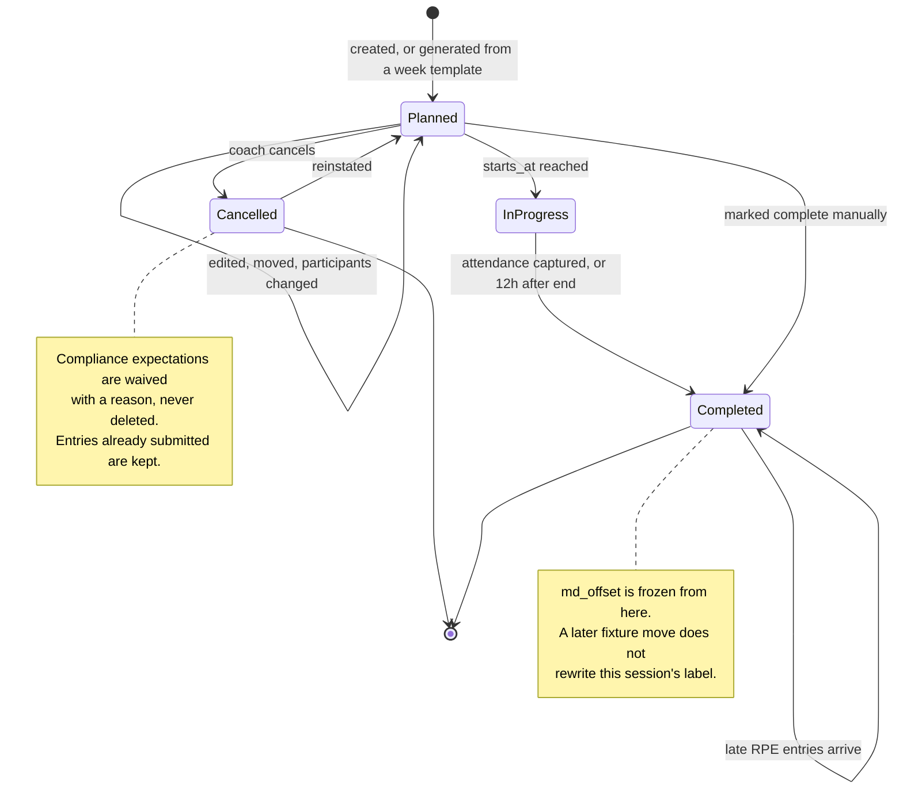
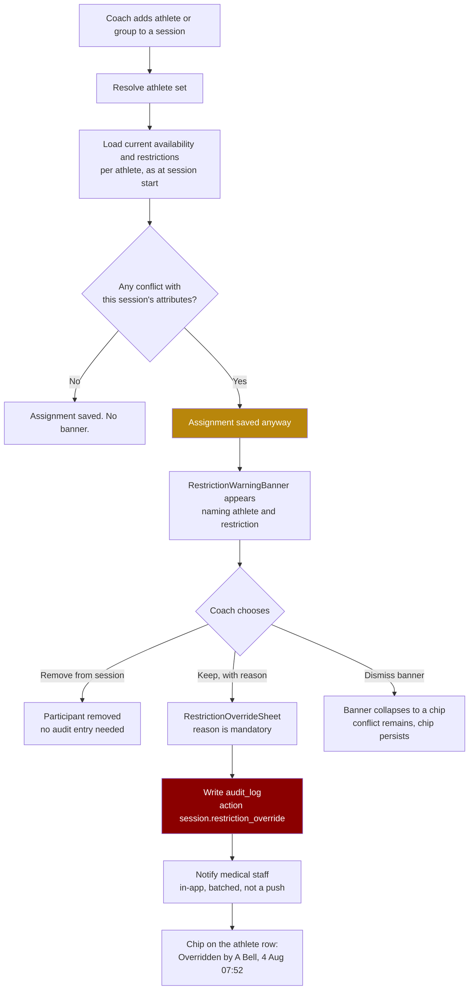

> **This file is not the specification.**
>
> It predates the build specification written on 4 September 2026 and is kept for
> its reasoning, not its instructions. Parts of it describe behaviour that has
> since been deliberately changed, and following it would rebuild things that were
> removed on purpose.
>
> **The binding specification for this screen is in `docs/screens/`, in the
> numbered files.** See `docs/screens/legacy/README.md` for how the two relate.

# Screen: Session detail

> **Layout status**: provisional. Awaiting client design photographs.

Screen 16 in the inventory (`02-information-architecture.md` §5). File: `docs/screens/session-detail.md`.

---

## Purpose

One session, everything about it, in one place: what it is, when and where, who is in it, what
load it was planned to produce, what entries it obliges athletes to submit that day, who
actually turned up, and what load it actually produced.

The screen serves three jobs that happen at three different times:

1. **Before**: plan it. Type, time, duration, location, participants, planned RPE and load,
   required entries. This is also the create form, so the same component builds a new session.
2. **During and immediately after**: capture attendance. This happens on a phone, at a pitch,
   often with no signal, which is why attendance is the one staff write that queues offline
   (`05-architecture.md` §6).
3. **After**: compare actual load against planned. This is the feedback loop that makes planned
   RPE worth entering at all.

It also carries the one safety-relevant interaction in the coaching flow: when an athlete is
assigned work their medical restrictions prohibit, Fydr warns. It does not block, and the
override is logged (`03-flows.md` §6).

---

## Roles and access

| Role | Access |
|---|---|
| Coach / S&C | Full read and write: create, edit, move, cancel, delete, manage participants, capture attendance, set planned load and required entries. |
| Medical / Physio | Full read. Write on `rehab` sessions. On any session, may remove an athlete from the participant list and may record attendance. May not edit type, time, load, or required entries on non-rehab sessions. See O-349 in `schedule.md`. |
| Admin | No access. |
| Athlete | A read-only variant reached from Today (`today.md`), showing title, type, time, location, their own attendance, their own outstanding entries, and their own restrictions. It shows no other athlete's name, availability, attendance, or load. Implemented as the same route with a role-resolved presentation, gated by RLS, not by a client flag. |

Two rules that are not negotiable on this screen:

- **Coaching staff see availability, never diagnosis** (`CLAUDE.md` §2 rule 3). The restriction
  warning names the restriction ("no contact") and the availability status. It never names the
  injury, the body area detail beyond what `injuries.body_area` already exposes to coaches, or
  any clinical field.
- **Every restriction override is written to `audit_log`** (`09-security-and-compliance.md`
  §8.5). Not optional, not sampled, not batched away.

---

## Entry points

| From | Route | Notes |
|---|---|---|
| Schedule, tap a session block | `/schedule/session/{id}` | Drawer on web over the week view, full screen push on mobile. Back returns to the originating view. |
| Timetable card on the staff dashboard | `/schedule/session/{id}?from=dashboard` | |
| Athlete profile, training tab, a session row | `/schedule/session/{id}?athlete={athlete_id}` | Opens with that athlete highlighted in the participant list and their row expanded. |
| Push `session.changed` or `session.starting` (staff) | `fydr://schedule/session/{id}` | |
| MD-n planner preview, a planned session | `/schedule/session/{id}?preview=1` | Read-only preview before the template is applied; the session does not exist yet and is rendered from the template payload. |
| Create, from Schedule | `/schedule/session/new?date=...&time=...` | Same component, `mode=create`. |
| Fixture detail, "Add session for this fixture" | `/schedule/session/new?fixture={fixture_id}` | Prefills `fixture_id` and the MD-n derived from the fixture date. |
| Injury record, "Add rehab session" | `/schedule/session/new?type=rehab&athlete={id}` | Medical entry point. |
| Deep link from the attendance reminder | `fydr://schedule/session/{id}?tab=attendance` | Opens directly on the attendance tab. |

---

## Layout

### Mobile

Three tabs. The default tab is chosen by time: Overview before the session starts, Attendance
from 15 minutes before the start until 12 hours after, Load after that. This is an
**assumption**, made because a coach opening a session at 09:05 for a 09:00 start wants the
register, not the description. Raised as O-357.

```
+------------------------------------------------------+
| <  Lower body                             [ ... ]     |
| gym   Tue 4 Aug   08:00 to 09:00   MD-4               |
+------------------------------------------------------+
| [ Overview ] [ Attendance ] [ Load ]                  |
+------------------------------------------------------+
|                                                       |
| WHEN AND WHERE                                        |
|   Tuesday 4 August 2026                               |
|   08:00 to 09:00        60 min                        |
|   Gym                                                 |
|   MD-4       Ashford RFC, Sat 8 Aug        >          |
|                                                       |
| PLANNED                                               |
|   +----------------+  +----------------+              |
|   | Planned RPE    |  | Planned load   |              |
|   |      8.0       |  |      480       |              |
|   +----------------+  +----------------+              |
|                                                       |
| REQUIRED THAT DAY                                     |
|   [x] Wellness      [x] Session RPE                   |
|   Applies to the 12 athletes in this session.         |
|                                                       |
| PARTICIPANTS                          12 athletes     |
|   [Forwards  x]  [+ Add]                              |
|   (!) 2 athletes have restrictions          >         |
|                                                       |
| NOTES                                                 |
|   Squat focus. Cap at 85% for the front row.          |
|                                                       |
| ATTACHED                                              |
|   Gym programme: Pre-season Block 2   >               |
|                                                       |
+------------------------------------------------------+
|  [ Edit session ]                                     |  pinned
+------------------------------------------------------+
```

Attendance tab:

```
+------------------------------------------------------+
| <  Lower body                             [ ... ]     |
| gym   Tue 4 Aug   08:00 to 09:00   MD-4               |
+------------------------------------------------------+
| [ Overview ] [ Attendance ] [ Load ]                  |
+------------------------------------------------------+
| 9 full  2 modified  1 absent  0 excused               |
| [Mark all full]                    [Search athletes]  |
+------------------------------------------------------+
| (!) 2 athletes have restrictions for this session  >  |
+------------------------------------------------------+
|  o  4  Ellis Marsh          [Full][Mod][Abs][Exc]     |
|        Available                        ^selected     |
+------------------------------------------------------+
|  o  7  Ryan Doherty         [Full][Mod][Abs][Exc]     |
|        Modified: no contact                  ^        |
|        Reason: upper body only  [edit]                |
+------------------------------------------------------+
|  o 12  Tom Reeve            [Full][Mod][Abs][Exc]     |
|        Unavailable, injury  Return 15 Aug        ^    |
|        (!) Assigned despite restriction: no loading   |
|            Overridden by you, 4 Aug 07:52             |
+------------------------------------------------------+
|  ...                                                  |
+------------------------------------------------------+
|  Saved locally. Will sync when you're back online.    |  offline only
+------------------------------------------------------+
```

Load tab:

```
+------------------------------------------------------+
| [ Overview ] [ Attendance ] [ Load ]                  |
+------------------------------------------------------+
| PLANNED vs ACTUAL                                     |
|                                                       |
|  Planned load   480     per athlete                   |
|  Actual load    512     median, 10 of 12 reported     |
|                +7%      above plan                    |
|                                                       |
|  Planned RPE    8.0                                   |
|  Actual RPE     8.5     median                        |
|                                                       |
|  0        200       400       600       800           |
|  |---------|---------|---------|---------|            |
|  Planned   [############        ]                     |
|  Actual    [##############      ]                     |
|                                                       |
| BY ATHLETE                     [sort: variance v]     |
|  Ryan Doherty      RPE 9.5  60 min   570   +19%       |
|  Ellis Marsh       RPE 8.5  60 min   510   +6%        |
|  Tom Reeve         RPE 5.0  30 min   150   -69%  mod  |
|  Jack Whitlow      -        -        -     not in     |
|  ...                                                  |
|                                                       |
| n = 10 of 12 athletes reported. 2 outstanding.        |
| Sources: self-report 100%.                            |
+------------------------------------------------------+
```

### Web

Right-hand drawer at 480 px over the schedule, or a full page at `/schedule/session/{id}` when
deep linked. Full page composition at `xl`:

```
+----------------------------------------------------------------------------------+
| <  Lower body                                     [Duplicate] [Cancel] [ ... ]    |
|    gym   Tuesday 4 August 2026   08:00 to 09:00   60 min   Gym   [MD-4]           |
+---------------------------------------------+------------------------------------+
| 8 columns                                   | 4 columns, sticky                   |
|                                             |                                     |
| [ Overview | Attendance | Load ]            |  PLANNED                            |
|                                             |  +---------+  +---------+           |
| WHEN AND WHERE                              |  |  RPE    |  |  Load   |           |
|  Date        Tuesday 4 August 2026   [edit] |  |   8.0   |  |   480   |           |
|  Time        08:00 to 09:00          [edit] |  +---------+  +---------+           |
|  Duration    60 minutes              [edit] |                                     |
|  Location    Gym                     [edit] |  ACTUAL                             |
|  Type        Gym                     [edit] |  +---------+  +---------+           |
|  Fixture     v Ashford RFC, Sat 8 Aug   >   |  |   8.5   |  |   512   |           |
|  MD-n        MD-4                           |  +---------+  +---------+           |
|                                             |  10 of 12 reported                  |
| REQUIRED THAT DAY                           |                                     |
|  [x] Wellness   [x] RPE                     |  ATTENDANCE                         |
|  From week template "Standard 1-game week"  |  9 full  2 mod  1 abs  0 exc        |
|                                             |  [ o o o o o o o o o o o o ]        |
| PARTICIPANTS                    12 athletes |                                     |
|  Groups     [Forwards x]  [+ Add group]     |  RESTRICTIONS                       |
|  Individual [+ Add athlete]                 |  (!) 2 athletes                     |
|                                             |   Ryan Doherty  no contact          |
|  (!) RESTRICTION CONFLICTS            2     |   Tom Reeve     no loading          |
|   Tom Reeve, no loading, gym session         |  [Review]                          |
|   [Remove from session] [Keep, with reason] |                                     |
|                                             |  HISTORY                            |
| NOTES                                       |  Created 28 Jul, A Bell             |
|  Squat focus. Cap at 85% for the front row. |  Moved 1 Aug, A Bell                |
|                                             |  Override 4 Aug, A Bell             |
+---------------------------------------------+------------------------------------+
```

---

## Components

| Component | Source | Purpose |
|---|---|---|
| `SessionEditorSheet` | **New**, shared with `schedule.md` | The create and edit form. Bottom sheet on mobile, drawer on web. |
| `MdChip` | **New**, see `schedule.md` | MD-n label, linked to the anchoring fixture. |
| `MetricTile` | `06-design-system.md` §6.2 | Planned RPE, planned load, actual RPE, actual load. Aggregates carry the mandatory footnote. |
| `AvailabilityPill` | §6.5 | On each participant row. Coach-visible status and reason category only. |
| `AttendanceSegment` | **New** | Four-option segmented control per athlete: Full, Modified, Absent, Excused. 48 px targets, one row per athlete. |
| `RestrictionWarningBanner` | **New** | The warning described below. `severity.medium` tint, never `unavailable` red: it is a warning, not a failure. |
| `RestrictionOverrideSheet` | **New** | Captures the override reason. Reason is mandatory. |
| `PlannedVsActualBar` | **New** | Two horizontal bars sharing one zero-based axis, per §8.2 rule 2. |
| `ParticipantRow` | **New** | Avatar, squad number, name, availability, restriction chip, attendance control, actual load. Reuses `AthleteCard` internals at `compact` density. |
| `GroupChip` | **New**, shared with `groups.md` | Group name in the group's assigned colour, with a remove affordance. |
| `NumberStepper` | §6.11 | Duration and planned RPE entry. No keyboard where a stepper will do (§9.4). |
| `EmptyState` | §6.16 | No participants, no attendance recorded, no actual load yet. |
| `ConfirmSheet` | §6.18 | Cancel session, delete session, remove a group of athletes, discard unsaved edits. |
| `SyncStatusIndicator` | §6.17 | Attendance queue state. |
| `TrendSparkline` | §6.3 | In the per-athlete load table, last 7 sessions of the same type. Web only. |

---

## Data requirements

### Fields

| Field | Source | Transformation |
|---|---|---|
| Title | `sessions.title` | |
| Type | `sessions.session_type` | Glyph plus label. |
| Start | `sessions.starts_at` | `at time zone org.timezone`, `HH:MM`. |
| End | derived | `starts_at + duration_min * interval '1 minute'`. |
| Duration | `sessions.duration_min` | Minutes. Over 90 displays as `1h 52m` (§5.3). |
| Location | `sessions.location` | Free text. |
| Stored MD-n | `sessions.md_offset` | Displayed as recorded. Never recomputed on read. |
| Anchoring fixture | `sessions.fixture_id` -> `fixtures` | Opponent, kickoff date, for the MD-n explanation. |
| Planned RPE | `sessions.planned_rpe` | 1 decimal. |
| Planned load | `sessions.planned_load` | Integer display. Derived on write from `planned_rpe * duration_min`. |
| Required entries | `sessions.requires_wellness`, `requires_rpe` | Two booleans. Editing them regenerates that day's `compliance_expectations` for the affected athletes. `sessions.requires_nutrition` still exists in the schema but is dormant and is not read or written here: athletes do not log nutrition, so no `'nutrition'` expectation is generated (`04-data-model.md` §11, `nutrition-guidance.md`). |
| Status | `sessions.status` | `planned` \| `completed` \| `cancelled`. |
| Notes | `sessions.notes` | Coach-visible. Not clinical. |
| Created by, at | `sessions.created_by`, `created_at` | History panel. |
| Participants, groups | `session_participants.group_id` -> `groups` | Group name and colour. |
| Participants, individuals | `session_participants.athlete_id` -> `athletes` | |
| Resolved athlete set | derived | Union of individually named athletes and members of named groups, membership resolved **as at `sessions.starts_at`** because `group_memberships` is historical. Zero participant rows means the whole squad. |
| Availability | `availability` where `effective_to is null` | Status, `reason_category`, `restrictions[]`, `expected_return` via `injuries.expected_return`. Never `injury_clinical`. |
| Restrictions | `availability.restrictions` | `text[]`. Matched against session attributes, see below. |
| Attendance | `session_attendance.attendance`, `modified_reason` | One row per athlete per session, unique. |
| Attendance recorded by | `session_attendance.recorded_by`, `recorded_at` | Shown on hover or long press. |
| Actual RPE | `training_entries.rpe` | Latest non-superseded revision per athlete per session. |
| Actual duration | `training_entries.duration_min` | The athlete's own reported duration, which can differ from the planned duration and usually does for a modified athlete. |
| Actual load | `training_entries.session_load` | `rpe * duration_min`, computed on write. |
| Gym actuals | `gym_session_logs.session_rpe`, `total_volume_kg` | Shown instead of, not as well as, training entries when `session_type = 'gym'` and a gym log exists. |
| GPS actuals | `gps_records` by `session_id` | Premium tier only. Total distance, high speed distance, player load. Rendered as a fourth tile row when present. |
| Override records | `audit_log` where `action = 'session.restriction_override'` and `entity_id = session.id` | Who overrode, when, and the reason from `metadata->>'reason'`. |

### Restriction matching

`availability.restrictions` is `text[]` with examples `'no contact'`, `'no sprinting'`,
`'upper body only'`. Free text cannot be matched reliably, so matching needs a controlled
vocabulary. **Assumption**: restrictions are chosen from a fixed list by medical staff, stored
as codes, and displayed through a label map. Raised as O-358, because it is a schema decision
and it changes the medical screens too.

Proposed vocabulary and the session attributes each conflicts with:

| Restriction code | Label | Conflicts with |
|---|---|---|
| `no_contact` | No contact | `session_type in ('training','match')` where `sessions.settings->>'contact'` is true, and any `match` session |
| `no_sprinting` | No sprinting | `session_type in ('training','match')` where planned RPE >= 7 |
| `no_loading` | No loading | `session_type in ('gym','testing')` |
| `upper_body_only` | Upper body only | `session_type = 'gym'` where the attached programme session contains a lower-body category exercise |
| `no_pitch_work` | No pitch work | `session_type in ('training','match')` |
| `modified_volume` | Reduced volume | Advisory only. Never blocks, always shown on the participant row |
| `no_jumping` | No jumping | `session_type = 'gym'` with a `plyo` category exercise, or `testing` with a CMJ test definition |
| `medical_clearance_required` | Clearance required | Every session type |

An athlete with `availability.status = 'unavailable'` conflicts with every session type
regardless of restriction codes. That is the strongest signal on the screen and it is the one
most likely to be overridden by a coach who has just spoken to the physio in the corridor,
which is precisely why the override is logged rather than prevented.

Where a restriction code is not in the vocabulary (legacy free text), it renders as an advisory
chip with no conflict evaluation, and the banner says "1 restriction could not be checked
automatically."

### The primary query

```sql
-- Session detail. :session_id uuid
with org as (select id, timezone from organisations where id = auth_org_id()),
s as (
  select se.*, o.timezone
  from sessions se cross join org o
  where se.id = :session_id
    and se.org_id = auth_org_id()
    and se.deleted_at is null
),
-- Resolve the athlete set. Zero participant rows means the whole squad.
resolved as (
  select distinct a.id as athlete_id
  from s
  join athletes a
    on a.org_id = auth_org_id()
   and a.deleted_at is null
   and a.status <> 'left_club'
  where not exists (select 1 from session_participants sp where sp.session_id = s.id)
  union
  select distinct coalesce(sp.athlete_id, gm.athlete_id) as athlete_id
  from s
  join session_participants sp on sp.session_id = s.id
  left join group_memberships gm
    on gm.group_id  = sp.group_id
   and gm.added_at <= s.starts_at
   and (gm.removed_at is null or gm.removed_at > s.starts_at)
  where coalesce(sp.athlete_id, gm.athlete_id) is not null
),
current_availability as (
  select distinct on (av.athlete_id)
         av.athlete_id, av.status, av.reason_category, av.restrictions,
         av.note, av.injury_id
  from availability av
  join resolved r on r.athlete_id = av.athlete_id
  where av.org_id = auth_org_id()
    and av.effective_from <= (select starts_at from s)
    and (av.effective_to is null or av.effective_to > (select starts_at from s))
  order by av.athlete_id, av.effective_from desc
),
attendance as (
  select sa.athlete_id, sa.attendance, sa.modified_reason, sa.recorded_by, sa.recorded_at
  from session_attendance sa
  where sa.session_id = :session_id and sa.org_id = auth_org_id()
),
-- Latest non-superseded training entry per athlete for this session.
actual_training as (
  select distinct on (te.athlete_id)
         te.athlete_id, te.rpe, te.duration_min, te.session_load, te.submitted_at, te.source
  from training_entries te
  where te.session_id = :session_id
    and te.org_id = auth_org_id()
    and te.superseded_by is null
  order by te.athlete_id, te.submitted_at desc
),
actual_gym as (
  select distinct on (gl.athlete_id)
         gl.athlete_id, gl.session_rpe, gl.total_volume_kg, gl.status as log_status
  from gym_session_logs gl
  where gl.session_id = :session_id
    and gl.org_id = auth_org_id()
  order by gl.athlete_id, gl.created_at desc
),
-- Expected entries generated for this session, for the compliance summary.
expectations as (
  select ce.athlete_id, ce.domain, ce.is_required, ce.waived_reason
  from compliance_expectations ce
  where ce.session_id = :session_id and ce.org_id = auth_org_id()
)
select
  (select to_jsonb(s) from s) as session,
  (select jsonb_agg(jsonb_build_object(
     'athlete_id',      a.id,
     'first_name',      a.first_name,
     'last_name',       a.last_name,
     'squad_number',    a.squad_number,
     'availability',    ca.status,
     'reason_category', ca.reason_category,
     'restrictions',    ca.restrictions,
     'attendance',      at.attendance,
     'modified_reason', at.modified_reason,
     'recorded_at',     at.recorded_at,
     'actual_rpe',      coalesce(ag.session_rpe, tr.rpe),
     'actual_duration', tr.duration_min,
     'actual_load',     tr.session_load,
     'actual_volume_kg',ag.total_volume_kg,
     'source',          tr.source)
     order by a.last_name, a.first_name)
   from resolved r
   join athletes a on a.id = r.athlete_id
   left join current_availability ca on ca.athlete_id = a.id
   left join attendance at          on at.athlete_id = a.id
   left join actual_training tr     on tr.athlete_id = a.id
   left join actual_gym ag          on ag.athlete_id = a.id
  ) as participants,
  (select jsonb_agg(jsonb_build_object('group_id', g.id, 'name', g.name, 'colour', g.colour))
   from session_participants sp
   join groups g on g.id = sp.group_id and g.deleted_at is null
   where sp.session_id = :session_id) as groups,
  (select jsonb_build_object(
     'expected',  count(*),
     'waived',    count(*) filter (where not is_required))
   from expectations) as expectation_summary;
```

Squad-level actual load figures use the **median**, never the mean, consistent with
`06-design-system.md` §8.1 which forbids a bare mean line for squad data. One athlete reporting
RPE 10 after a personal disaster should not move the session's headline number.

```sql
select
  percentile_cont(0.5) within group (order by session_load) as median_load,
  percentile_cont(0.5) within group (order by rpe)          as median_rpe,
  count(*)                                                  as reported_count
from training_entries
where session_id = :session_id and org_id = auth_org_id() and superseded_by is null;
```

### Writes

| Action | Statement | Notes |
|---|---|---|
| Create session | `insert into sessions` then `insert into session_participants` | One transaction via an RPC, so a session never exists with no participants when participants were chosen. |
| Edit fields | `update sessions set ...` | |
| Change required entries | `update sessions set requires_* ...` then regenerate expectations | Regeneration is an RPC that upserts `compliance_expectations` for the affected date and athletes. It never deletes an expectation that already has a matching entry. |
| Add or remove participants | insert / delete `session_participants` | Deleting a participant row does **not** delete attendance or entries already recorded for that athlete. |
| Record attendance | `insert into session_attendance ... on conflict (session_id, athlete_id) do update` | The one staff write that queues offline. Idempotent by the unique key. |
| Override a restriction | `insert into audit_log` via `log_audit_event()` plus `session_participants` insert | Both in one RPC so an override can never be recorded without the assignment, or an assignment made without the log. |
| Cancel | `update sessions set status='cancelled'` | Waives that session's expectations with `waived_reason = 'session_cancelled'`. |
| Complete | `update sessions set status='completed'` | Automatic at `starts_at + duration + 12h` by a nightly job, or manual. |
| Delete | `update sessions set deleted_at = now()` | Blocked when attendance or entries exist. |

---

## States

| State | Rendering |
|---|---|
| **Default, future session** | Overview tab active. Attendance tab present but shows "Attendance opens 15 minutes before the session." Load tab shows `EmptyState` kind `notStarted`: "No load recorded yet. Athletes submit RPE 30 minutes after the session." |
| **Default, in progress** | Attendance tab active. A live chip in the header reads "In progress". |
| **Default, past** | Load tab active if any actual data exists, otherwise Attendance. |
| **Loading** | Skeleton: header bar, two tile skeletons, six participant row skeletons. 150 ms delay, 400 ms minimum. |
| **Empty, no participants** | Participants section renders `EmptyState` kind `notStarted`: "No one assigned. This session is for the whole squad." with actions "Assign a group" and "Assign athletes". This is a valid configuration, so the copy states the consequence rather than implying an error. |
| **Empty, no attendance** | Attendance list renders every participant with no selection, and a caption "Attendance not recorded." Never pre-selects Full: a register that defaults to present is a register nobody reads. |
| **Empty, no actual load** | Load tab: `EmptyState` kind `noData`, "No RPE submitted yet. 12 athletes expected." |
| **Partial actual load** | Renders with the coverage footnote: "n = 10 of 12 athletes reported. 2 outstanding." Never extrapolates. |
| **Error** | Section-scoped. A failed actuals query leaves the Overview and Attendance tabs working, with "Load data could not be loaded. Retry." |
| **Offline, read** | Full render from cache with a "Last updated" caption. |
| **Offline, attendance write** | Fully functional. Selections write to SQLite and enqueue. Row shows a hollow pending dot. Footer reads "Saved locally. Will sync when you're back online." |
| **Offline, any other write** | Disabled with "You are offline. This will be available when you reconnect." |
| **Cancelled session** | Whole screen at 60% opacity behind a `severity.medium` banner: "This session was cancelled on 3 Aug by A Bell." Attendance and load remain readable. Editing is disabled except "Reinstate session". |
| **Role: medical, non-rehab session** | Fields read-only with a lock glyph. Attendance and participant removal enabled. Tooltip: "Training sessions are edited by coaching staff." |
| **Role: athlete** | Reduced layout: title, type, time, location, MD-n, their own attendance, their own outstanding entries, their own restrictions. No participant list, no squad load, no other names. |
| **Restriction conflicts present** | `RestrictionWarningBanner` pinned directly under the header on every tab until resolved or acknowledged. It does not auto-dismiss. |
| **Preview mode** | Read-only, header chip "Preview, not yet created", primary action "Apply template". |

Session lifecycle:



---

## Interactions

### Editing

- Every field on the Overview tab is inline-editable on web (click the value, edit in place,
  blur or `Enter` to save) and opens the `SessionEditorSheet` on mobile.
- Saves are per-field with an optimistic update and rollback on failure. A failed save reverts
  the field and shows an inline message; it never leaves the UI showing a value the server
  rejected.
- Changing `duration_min` or `planned_rpe` recomputes `planned_load` live, before save, with the
  new value shown in `text.secondary` until committed.
- Changing the date or time shows the resulting MD-n **before** saving: "This moves the session
  to MD-2." Moving a past session is blocked, per `schedule.md`.
- Changing `requires_*` shows the consequence: "This will require an RPE entry from 12
  athletes on 4 August." Confirm required, because it changes those athletes' compliance figures.

### Participants

| Action | Behaviour |
|---|---|
| Add group | Group picker, multi-select, showing each group's current member count and colour. |
| Add athlete | Athlete picker with search, showing availability. Athletes already included through a group are shown greyed with "already in via Forwards". |
| Remove group | `ConfirmSheet` stating how many athletes it removes and whether any of them have already recorded attendance or entries. |
| Remove athlete included via a group | Not possible by deleting a row. Instead an explicit exclusion is needed. **v1 behaviour**: the athlete is added as an individual exclusion, which requires a `session_participants.exclude boolean` column the schema does not have. Until that exists, the supported path is to remove the group and add the individuals, which is poor. Raised as O-359 with a recommendation to add `session_participants.is_excluded boolean not null default false`. |
| Tap an athlete | Expands the row: availability, restrictions, last 7 sessions of this type, their attendance, their actual load. |

### The restriction warning

The mechanic required by `03-flows.md` §6, in full.



Rules, stated plainly because they will be argued with during implementation:

1. **The assignment is never blocked.** The athlete is in the session the moment the coach adds
   them. `03-flows.md` §6: a hard block gets the product uninstalled.
2. **The warning is not a modal.** It is a persistent banner. A modal that must be dismissed
   before continuing is a block wearing a different hat, and it trains people to click through.
3. **Dismissing the banner does not clear the conflict.** The athlete's row keeps a
   `severity.medium` chip naming the restriction for as long as the conflict exists.
4. **The override reason is mandatory** and free text with a 200 character limit. The three most
   common reasons are offered as chips to tap: "Cleared verbally by physio", "Modified role
   only", "Non-contact participation". A chip fills the field and can be edited.
5. **The audit entry contains no clinical data.** `action = 'session.restriction_override'`,
   `entity_type = 'session'`, `entity_id`, `athlete_id`, and
   `metadata = {restriction_code, availability_status, reason}`. It never contains a diagnosis,
   because the coach never saw one (`09-security-and-compliance.md` §8.5).
6. **Medical staff are told.** An in-app notification, batched into the medical daily digest,
   not a push. A physio being paged at 07:00 because a coach put a modified player in a gym
   session is exactly the alert fatigue `03-flows.md` §5 warns about. Where the athlete's
   availability is `unavailable` rather than `modified`, it escalates to an immediate in-app
   notification. Raised as O-360 for confirmation.
7. **The override is per athlete per session**, not per athlete. Adding the same athlete to
   tomorrow's session warns again.
8. **A restriction added after the assignment** re-raises the warning. The physio setting
   `no_contact` at 10:00 on an athlete already in Thursday's contact session triggers the banner
   on that session, and a notification to the coach who created it.

### Attendance capture

| Action | Behaviour |
|---|---|
| Tap a status | Writes immediately. No save button. Optimistic, with a pending dot until synced. |
| "Mark all full" | Sets every athlete with no existing record to `full`. Never overwrites an existing selection. Shows an undo toast. |
| Select `modified` | Reveals a required `modified_reason` field, offered as chips: "Reduced volume", "Non-contact", "Rehab work only", "Left early", plus free text. |
| Select `absent` | No reason required. Absence is a fact, and demanding a reason makes coaches guess. |
| Select `excused` | Optional reason. Setting `excused` **waives that athlete's compliance expectations for that session** with `waived_reason = 'excused'`, which is the mechanic that stops absence being counted as non-compliance (`04-data-model.md` §11). |
| Search | Filters the list by name or squad number. |
| Sort | Squad number (default), surname, availability, attendance status. |
| Long press a row | Shows who recorded the attendance and when. |

Attendance recorded for an athlete whose availability is `unavailable` shows a quiet inline note
"Recorded as full while unavailable" and, like the assignment override, writes an audit entry.

### Load review

| Action | Behaviour |
|---|---|
| Sort the per-athlete table | Variance from plan (default), name, actual load, actual RPE. |
| Tap an athlete row | Opens the athlete profile on the training tab with this session's date selected. |
| "Chase outstanding" | Sends the RPE reminder to athletes with no entry, subject to the notification budget rules in `08-notifications.md`. Disabled if it would breach the daily budget, with the reason stated. |
| Toggle "Show planned line" | Adds a dashed reference line at planned load across the per-athlete bars, labelled at the right edge (§8.2 rule 8). |
| Long press the chart | "View as table", per §8.6. |

Actual load is **never** back-written into `sessions`. `planned_load` stays planned. The actual
figure is always computed from entries, so the plan and the outcome remain separable, which is
the entire point of recording both.

---

## Validation rules

| Rule | Enforcement | Message |
|---|---|---|
| Title 1 to 120 characters | Zod, `not null` | "Give the session a title." |
| Type required, from the enum | Zod, enum | |
| Start required, inside the season | Server | "That date is outside the 2026/27 season." |
| Duration 5 to 480 | Zod, check | "Duration must be between 5 and 480 minutes." |
| Planned RPE 1.0 to 10.0 | Zod, check | "Planned RPE is on the 1 to 10 Borg scale." |
| Planned RPE required when `requires_rpe` is true | Client | Warning, not a block: "No planned RPE. Athletes will still be asked for theirs." |
| Location 0 to 120 characters | Zod | |
| Notes 0 to 2000 characters | Zod | |
| A `match` session must have `fixture_id` | Check constraint | "A match session needs a fixture." |
| An athlete may appear once in the resolved set | Query `distinct` | Duplicate group membership is silently de-duplicated, not an error. |
| Attendance status required from the enum | Zod, enum | |
| `modified_reason` required when attendance is `modified` | Client and server | "Say what was modified." |
| `modified_reason` 1 to 200 characters | Zod | |
| Override reason required, 1 to 200 characters | Client and server | "Give a reason. This is recorded." |
| Attendance cannot be recorded for a session more than 14 days in the past | Server | "This session is too old to record attendance." Matches the entry backdating rule. |
| Attendance cannot be recorded for a future session | Server | Allowed from 15 minutes before `starts_at`. Before that: "Attendance opens 15 minutes before the session." |
| Attendance cannot be recorded for an athlete not in the resolved participant set | Server | Adding them to the session first is the supported path, and the UI offers it. |
| Deleting requires no attendance and no entries | Server, 409 | "This session has recorded data. Cancel it instead." |
| Changing `requires_*` after the day has passed | Server | Permitted, with the warning "This changes compliance figures for a day that has already happened." |

---

## Edge cases

| Case | Behaviour |
|---|---|
| **Athlete assigned work their restrictions prohibit** | Warns, does not block, logs the override. Specified in full above. This is the case the client called out and it is the one to get right. |
| **Athlete becomes unavailable after the session is planned** | Banner re-raises. The coach is notified once, batched. The athlete stays in the session until someone removes them. |
| **Athlete becomes available before the session** | Conflict clears automatically. The override chip remains on the row as history with the tooltip "Restriction lifted 3 Aug". |
| **Coach overrides, then removes the athlete** | The audit entry stands. It records what was decided at the time, and audit entries are never deleted (`09-security-and-compliance.md` §8.5). |
| **Restriction code not in the vocabulary** | Advisory chip, no automatic conflict, banner notes "1 restriction could not be checked automatically." |
| **Whole squad session, one athlete unavailable** | The banner names them individually. It never says "3 athletes have restrictions" without naming them, because a coach cannot act on a count. |
| **More than 5 conflicts** | Banner shows the first three by name plus "and 4 more", expanding to a full list. |
| **Attendance recorded offline, session cancelled while offline** | The attendance write is accepted on sync, matching the conflict rule "entry for a session that was cancelled while offline: accept" (`05-architecture.md` §6). The register is a record of what happened. |
| **Two coaches record different attendance for the same athlete** | Last write wins by `recorded_at`, and the row shows "Changed by A Bell at 09:14, previously Absent". The `session_attendance` unique key makes this an upsert, not a duplicate. |
| **Athlete submits RPE for a session they were marked absent from** | Both are kept. The row shows the entry with a `severity.low` chip "Marked absent, RPE submitted". The coach resolves it; Fydr does not guess. |
| **Athlete submits RPE with a duration very different from planned** | Kept as submitted. Their actual load uses their reported duration. The variance column makes it visible. Reported duration over 3 times planned is flagged in the row as "check duration", because it is usually a units mistake. |
| **Session moved after entries exist** | Permitted while future. Entries keep their `session_id` and their `entry_date`. If the move crosses a date boundary, the entry's `entry_date` no longer matches the session date; the load tab shows both and captions "Entry recorded on 4 Aug, session now on 5 Aug." |
| **Session's fixture is postponed** | `sessions.md_offset` recomputes only if the session is in the future. A completed session shows its stored label plus the history glyph. The Overview tab's "Fixture" row shows the fixture with a `postponed` chip. |
| **Session with no fixture in range** | MD-n row reads "No fixture within 9 days" and the chip falls back to the training-week label. |
| **Gym session with an attached programme** | Actuals come from `gym_session_logs` and `gym_set_logs`, showing session RPE and total volume rather than training-entry load. Both are shown when both exist, labelled by source. |
| **Testing session** | The Load tab is replaced by a Results tab summarising `test_results` recorded against `session_id`. |
| **Rehab session created by medical** | Coach sees it on the schedule and in this screen read-only, including the participant list, and cannot edit it. It carries a `rehab` glyph and the note "Assigned by medical staff". |
| **Zero participants resolved because a group is empty** | Renders `0` as a real zero with a `severity.medium` chip "No athletes in Forwards". Not a missing value. |
| **Athlete left the club between planning and the session** | Excluded from the resolved set. Their historical attendance and entries remain visible on the load tab with a "left club" chip. |
| **Duplicate to next week** | Copies title, type, time of day, duration, location, planned RPE, required entries, and participants. Does **not** copy attendance, entries, notes, or overrides. `md_offset` is recomputed for the new date. |
| **Session in a week with two fixtures** | The Overview MD-n row shows both labels and names both fixtures. |

---

## Performance notes

1. **One query for the whole screen.** The composite query above returns the session, the
   resolved participants with availability, attendance, and actuals in a single round trip.
   Twelve participants means twelve rows, not twelve queries.
2. **`distinct on` for availability and entries** avoids a window function over the whole table
   and uses the existing indexes `availability (athlete_id, effective_from desc) where
   effective_to is null` and `training_entries (athlete_id, entry_date desc)`. Add
   `create index on training_entries (session_id) where superseded_by is null` and
   `create index on session_attendance (session_id)`.
3. **Restriction evaluation is client-side** over data already fetched. It is pure logic in
   `packages/core`, so it also runs in the Edge Function that re-checks on save. No extra query.
4. **Attendance writes are individual and optimistic.** One `upsert` per tap, debounced at
   250 ms per athlete to absorb a double tap. Not batched on a timer: a coach who backgrounds
   the app mid-register must not lose the last three taps.
5. **The per-athlete load table is not virtualised** below 60 rows. Above that it virtualises
   with a fixed row height.
6. **Sparklines are fetched lazily**, only on web, only for rows in the viewport, batched into
   one query for the visible athlete ids.
7. **`staleTime`**: session detail 60 seconds, actuals 60 seconds, availability 60 seconds. The
   screen is often open while data arrives, so it also subscribes to the existing
   `org:{org_id}:availability` realtime channel and invalidates on message.
8. **Budget**: open to interactive under 400 ms p95 from a warm cache, under 1 s cold.

---

## Accessibility

- The tab set is a `tablist` with `tab` and `tabpanel` roles and arrow-key navigation.
- `AttendanceSegment` is a `radiogroup` per athlete, labelled "Attendance for Ellis Marsh",
  with four `radio` options. Arrow keys move within, `Tab` moves to the next athlete. Selection
  is announced: "Ellis Marsh, full attendance recorded."
- The restriction banner is `role="status"` with `aria-live="polite"` on first appearance, and
  is reachable in tab order immediately after the header so a screen reader user meets it before
  the participant list.
- Restriction chips announce the full sentence: "Warning. Tom Reeve, unavailable, restriction no
  loading, conflicts with this gym session."
- The override sheet traps focus, returns focus to the triggering control on close, and its
  reason field is `aria-required="true"` with the error announced on submit.
- Planned versus actual bars have a table alternative and an `accessibilityLabel`: "Planned load
  480. Actual load 512, median of 10 athletes. 7% above plan."
- Every number goes through `Numeric` with tabular figures. Missing actuals render the missing
  glyph and announce "no data", never zero (§5.4).
- Touch targets: the four attendance options are each at least 48 px wide at `compact` density;
  below 360 pt they wrap to two rows of two rather than shrinking.
- Colour is never the only channel: `modified` attendance carries the word and a half-filled
  glyph, matching the availability trio in §4.2.
- Dynamic type to 200%: participant rows become two rows, the attendance control moving beneath
  the name.
- Reduced motion: no tab slide, no bar animation on load.

---

## Open questions

- **O-357** Default tab by time. I open Overview before the session, Attendance from 15 minutes
  before until 12 hours after, and Load thereafter. It saves a tap on the most common action but
  it makes the screen behave differently at different times of day, which some people dislike.
  Confirm, or I will default to Overview always.
- **O-358** Restriction vocabulary. `availability.restrictions` is `text[]` and free text cannot
  be matched against session attributes reliably. I propose a fixed vocabulary of restriction
  codes chosen by medical staff, with a label map. This is a schema and medical-workflow
  decision, not just a display one. Which restrictions do your physios actually use? The list in
  this document is my guess.
- **O-359** Excluding one athlete from a group-assigned session. There is no way to do this
  today without removing the whole group. I recommend adding
  `session_participants.is_excluded boolean not null default false`. Confirm and I will add the
  migration.
- **O-360** Who is told when a coach overrides a restriction, and how loudly? I have medical
  staff notified in-app and batched into their daily digest, escalating to an immediate in-app
  notification when the athlete is `unavailable` rather than `modified`. Never a push, because
  push budget is finite (`08-notifications.md` §1).
- **O-361** Should an override expire? A coach overriding "no contact" on Tuesday says nothing
  about Thursday, and I currently re-warn every session. The alternative is an override that
  lasts until the restriction changes, which is fewer interruptions and more risk.
- **O-362** Contact flag on sessions. `no_contact` conflict detection needs to know whether a
  training session involves contact, and the schema has nowhere to record it. Options: a boolean
  on `sessions`, a value in `sessions.notes` (bad), or treating every `training` session as
  contact for rugby organisations (crude, and wrong for a running session). I recommend
  `sessions.is_contact boolean` defaulted from the week template.
- **O-363** Should attendance be capturable by an athlete, self-check-in? It would remove the
  coach's register entirely for well-organised clubs and it is trivially gamed. I have assumed
  staff only.
- **O-364** Actual load for athletes who submit no RPE. Currently they are excluded and reported
  as outstanding. Some systems impute the squad median so the session has a complete load figure.
  I am against imputation: it invents data, and product principle 5 requires provenance. Confirm
  you agree, because it changes every load aggregate in the product.

---

## Related documents

- The calendar this session sits in → `schedule.md`
- The fixture it is anchored to → `fixture-detail.md`
- Where its planned load came from → `md-planner.md`
- Restriction and availability rules → `01-roles-and-permissions.md` §4, `03-flows.md` §6
- Audit requirements → `09-security-and-compliance.md` §8.5
- Schema → `04-data-model.md` §4, §5, §9, §11
