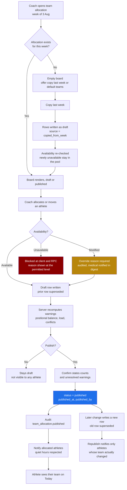

> **This file is not the specification.**
>
> It predates the build specification written on 4 September 2026 and is kept for
> its reasoning, not its instructions. Parts of it describe behaviour that has
> since been deliberately changed, and following it would rebuild things that were
> removed on purpose.
>
> **The binding specification for this screen is in `docs/screens/`, in the
> numbered files.** See `docs/screens/legacy/README.md` for how the two relate.

# Screen: Team allocation

> **Layout status**: provisional. Awaiting client design photographs.

Screen 14 in the inventory (`02-information-architecture.md` §5). Route
`/staff/team-allocation`. Drawn on the original navigation map as
`Dashboard → Injury dash → Corner group allocation`, which the client has confirmed means
allocating players to specific teams.

---

## Purpose

A club with more than one team (1st XV, 2nd XV, A team, development, academy) has to decide
every week which athletes play for which team. This screen is where that decision is made,
recorded, and published.

It sits off the injury dashboard because **availability is what drives the allocation**. A
coach picking three sides on a Thursday evening is answering one question repeatedly: who is
actually fit, and what are they allowed to do. Doing that by holding an availability board in
one window and a team sheet in another is the manual join Fydr exists to remove.

Four jobs:

1. Show every athlete with the four facts that decide an allocation: availability, restrictions,
   recent load, and days since their last match.
2. Allocate athletes to teams for a named week, by drag on web or tap on mobile.
3. Warn where the allocation is unsafe or incomplete: an unavailable athlete allocated, an
   athlete allocated twice, a restriction the fixture would breach, a team with no specialist
   hooker, an athlete playing a second match inside a short window.
4. Publish, which is the act that makes the allocation visible to athletes.

---

## Team, allocation, and group, stated explicitly

Three concepts that are easy to conflate. The full argument is in `04-data-model.md` §17.13.

| Concept | Table | Exclusive | Changes |
|---|---|---|---|
| **Team** | `teams` | An athlete has one `default_team_id` | Once a season |
| **Team allocation** | `team_allocations` | Yes, one team per athlete per week | Every week |
| **Group** | `groups` | No, deliberately | Rarely |

A **team** is a standing entity in the club. It persists, it has a rank (1st XV is rank 1), and
an athlete has a default team, which is where they normally play.

A **team allocation** is which athletes are allocated to which team for a specific week. It is
exclusive, it carries a status, and it is driven by availability and form. It is the subject of
this screen.

A **group** is a filter. Forwards, S&C Group A, Under 20. An athlete is in as many as apply and
membership grants nothing. Teams are not groups and `group_type` does not gain a `team` value.

**Consequence for the global filter.** Because teams are not groups, they do not appear in the
group filter for free. The filter renders a Teams section above Groups, reading from `teams`,
and selecting a team resolves to that team's **current published allocation**. This is a change
to the global control in `CLAUDE.md` §3 and it is O-808.

---

## Roles and access

| Role | Access |
|---|---|
| Coach / S&C | Full. Create allocations, move athletes, copy last week, override an unavailable selection with a reason, publish. The owner of this screen. |
| Medical / Physio | **Read, plus availability write.** Sees the whole board and every warning. Cannot allocate and cannot publish. May change an athlete's availability from the board, which is the only role that can (`01-roles-and-permissions.md` §4), and doing so re-raises every affected warning. |
| Athlete | No access to this screen. Once an allocation is published, the athlete sees **their own** team on Today and in `my-programme.md`. They see no other athlete's allocation at any status. |
| Admin / Club owner | Manages `teams` as squad structure: create, rename, rank, retire. No access to the allocation board itself, because the board carries availability and load. Renders the team management shell with `noPermission` on the athlete lists, consistent with `01-roles-and-permissions.md` §1. |

**The clinical boundary holds here without exception.** This is the invariant in
`01-roles-and-permissions.md` §4 and it is the single rule on this screen that is not
negotiable:

- Every role on this board, coach and medical alike, sees **availability status, reason
  category, restrictions, expected return, and body area**.
- **No role sees diagnosis, mechanism, clinical severity, tissue type, imaging, referral,
  clinical notes, or treatment plan on this screen.** Not coaches, and not medical either. A
  physio who needs a diagnosis opens `injury-record.md`, where the read is audited and
  unambiguous. Allocation decisions are made on restriction and availability, never on
  diagnosis, so putting diagnoses on an allocation board would turn every glance at a team
  sheet into an audited clinical read for no operational gain.
- The query on this screen **never references `injury_clinical`**. Enforced by the lint rule
  banning `.from('injury_clinical')` (`decisions/adr-007-clinical-data-separation.md`) and by
  the mandatory RLS test.

**What a coach must be able to conclude:** "Doherty is modified, no contact, so he is not
playing hooker for the 1sts on Saturday. Whitlow steps up."

**What a coach must not be able to conclude:** anything about grade, tissue, prognosis basis,
or the physio's opinion.

**Group filter**: mandatory, and it applies to the **unallocated pool only**. Team lanes and
their members always render in full. A coach filtered to Forwards still needs to see the whole
1st XV lane, because the point of the screen is moving athletes between lanes.

---

## Entry points

| From | Trigger | Context |
|---|---|---|
| Injury dashboard | "Team allocation" | Group filter, current week. **The path drawn on the navigation map.** |
| Injury dashboard, an athlete row | "Allocate" | That athlete pre-selected in the pool |
| Fixture detail, Selection tab | "Team allocation for this week" | Week derived from `fixtures.kickoff_at`, that fixture's team lane expanded |
| Fixture detail, availability panel | "Who is available for Saturday" | Week of the fixture, pool sorted by availability |
| Squad list, bulk selection | "Allocate to a team" | Selected athletes pre-marked in the pool |
| Squad list, an athlete row | Athlete profile then "Team history" | That athlete's allocation history |
| Schedule, a week | "Allocate teams" | That week |
| Staff sidebar | Direct | Current week, group filter |

**Relationship to `fixture-detail.md`.** Team allocation answers "which team is this athlete
playing for this weekend". Fixture selection answers "who starts and who is on the bench for
this fixture". Allocating an athlete to the 1st XV puts them in the 1st XV fixture's selection
pool; it does not select them. The two screens are linked in both directions and the overlap is
deliberate, not duplication. Whether an allocation without a matchday selection means anything
is O-802.

---

## Layout

**Assumption, pending client design photographs.** A pool-and-lanes allocation board: available
athletes on one side, teams as lanes or columns, drag on web and select-then-assign on mobile.
The drawing gives the phrase and the position in the hierarchy, nothing about form.

### Mobile, `md` 390 pt

Drag across columns does not work on a phone. Mobile uses select-then-assign, which is slower
per athlete and far more reliable.

```
┌────────────────────────────────────────────────┐
│ ‹  Team allocation   [All squad ▾]      ⚙︎    │ 56 sticky
├────────────────────────────────────────────────┤
│  ‹ Week of Mon 3 Aug ›            Draft        │ 44 week bar
│  31 athletes · 26 allocatable · 2 unallocated  │
│  [ Copy last week ]            [ Publish 3 ]   │ 48
├────────────────────────────────────────────────┤
│  UNALLOCATED, AVAILABLE (2)                    │
│  ┌──────────────────────────────────────────┐  │
│  │ ☐ ● E. Marsh   #4    Prop                │  │ 84 pt row
│  │     7d load 1840 · last match 6d         │  │
│  ├──────────────────────────────────────────┤  │
│  │ ☐ ● S. Okoye   #9    Scrum half          │  │
│  │     7d load 1420 · last match 13d        │  │
│  └──────────────────────────────────────────┘  │
│  [ Assign selected to… ]                       │ 48, enabled on select
│                                                │
│  NOT ALLOCATABLE (3)                     ⌄     │
│  ┌──────────────────────────────────────────┐  │
│  │ ○ T. Reeve     #12   Lock                │  │
│  │   Unavailable · Ankle R · back 15 Aug    │  │
│  │   Cannot be allocated                    │  │
│  ├──────────────────────────────────────────┤  │
│  │ ◑ R. Doherty   #7    Hooker              │  │
│  │   Modified · no contact · back Fri 8 Aug │  │
│  │   Allocate with a reason                 │  │
│  └──────────────────────────────────────────┘  │
│                                                │
│  TEAMS (3)                                     │
│  ┌──────────────────────────────────────────┐  │
│  │ 1st XV                     23 · v Ashford│  │
│  │ Sat 8 Aug 15:00 · Home                   │  │
│  │ ⚠ No specialist hooker allocated         │  │ positional warning
│  │ ─────────────────────────────────────────│  │
│  │ ● W. Trent   #5   Lock      3d ⚠         │  │ load warning
│  │ ● J. Whitlow #16  Hooker    9d           │  │
│  │ ● A. Bell    #10  Fly half  6d           │  │
│  │                                     ⌄    │  │
│  └──────────────────────────────────────────┘  │
│  ┌──────────────────────────────────────────┐  │
│  │ 2nd XV                     18 · v Deal   │  │
│  │ Sat 8 Aug 15:00 · Away                   │  │
│  │ ⚠ 18 allocated, 23 expected              │  │
│  └──────────────────────────────────────────┘  │
│  ┌──────────────────────────────────────────┐  │
│  │ Colts                       0 · No fixture│ │
│  │ No athletes. Assign to add.              │  │
│  └──────────────────────────────────────────┘  │
└────────────────────────────────────────────────┘
```

### Web, `xl` 1280 px

```
┌────────┬──────────────────────────────────────────────────────────────────────┐
│        │ [All squad ▾]           ‹ Week of Mon 3 Aug ›     Draft         ⚙︎  │
│ Fydr   ├──────────────────────────────────────────────────────────────────────┤
│        │  Team allocation   [Copy last week] [Compare to last week] [Publish] │
│ ▣ Dash │  31 athletes · 26 available · 3 modified · 2 unavailable             │
│  · Inj │ ┌── 3 cols ─────────┐ ┌── 9 cols, team lanes ───────────────────────┐│
│  · Tem │ │ POOL          2   │ │ 1st XV      │ 2nd XV      │ Colts           ││
│ ▤ Sched│ │ [avail ▾][pos ▾]  │ │ v Ashford H │ v Deal A    │ No fixture      ││
│ ▧ Squad│ │ ┌───────────────┐ │ │ 15 + 8 = 23 │ 18 of 23    │ 0               ││
│ ▨ Prog │ │ │● Marsh E   #4 │ │ │ ⚠ no hooker │ ⚠ 5 short   │                 ││
│ ⋯ More │ │ │ Prop          │ │ ├─────────────┼─────────────┼─────────────────┤│
│        │ │ │ 7d 1840  6d   │ │ │● Trent W #5 │● Nunn A #18 │                 ││
│        │ │ └───────────────┘ │ │ Lock        │ Flanker     │   Drop here     ││
│        │ │ ┌───────────────┐ │ │ 7d 2100 3d⚠ │ 7d 1200 21d │                 ││
│        │ │ │● Okoye S   #9 │ │ ├─────────────┼─────────────┤                 ││
│        │ │ │ Scrum half    │ │ │● Whitlow J  │● Price M #22│                 ││
│        │ │ │ 7d 1420  13d  │ │ │ #16 Hooker  │ Centre      │                 ││
│        │ │ └───────────────┘ │ │ 7d 1650 9d  │ 7d 990  14d │                 ││
│        │ │                   │ │ ├───────────┤ ├───────────┤                 ││
│        │ │ NOT ALLOCATABLE 3 │ │ │◑ Doherty R│ │           │                 ││
│        │ │ ┌───────────────┐ │ │ │ #7 Hooker │ │           │                 ││
│        │ │ │○ Reeve T  #12 │ │ │ │ no contact│ │           │                 ││
│        │ │ │ Unavailable   │ │ │ │ ⚠ override│ │           │                 ││
│        │ │ │ Ankle R 15 Aug│ │ └─────────────┴─────────────┴─────────────────┘│
│        │ │ └───────────────┘ │ ┌─────────────────────────────────────────────┐│
│        │ │ ┌───────────────┐ │ │ POSITIONAL BALANCE, 1st XV                  ││
│        │ │ │◑ Doherty R #7 │ │ │ Prop 2 ✓  Hooker 0 ⚠  Lock 2 ✓  SH 1 ✓      ││
│        │ │ │ Modified      │ │ │ FH 1 ✓  Back three 3 ✓  Centre 2 ✓          ││
│        │ │ └───────────────┘ │ └─────────────────────────────────────────────┘│
│        │ └───────────────────┘                                                │
└────────┴──────────────────────────────────────────────────────────────────────┘
```

Drag is an accelerator on web. Every drag has an equivalent through selection plus an "Assign
to" menu, and the keyboard path is specified under Accessibility. A drag-only board is unusable
with a keyboard and unusable on a phone, and this screen has to work on a tablet in a clubhouse.

### The athlete row

Every athlete tile carries the same four decision facts in the same place, whether it is in the
pool or in a lane:

```
● E. Marsh    #4    Prop                     availability glyph, name, number, position
  7d load 1840 · last match 6d               recent load, days since last match
  no contact                                 restrictions, only when present
```

The order is deliberate. Availability decides whether an allocation is legal, position decides
where they fit, load and days since last match decide whether it is wise.

### Unavailable athletes are visible, not hidden

Athletes who cannot be allocated render in a **Not allocatable** section of the pool with their
reason at the level the viewing role may see. They are never removed from the board.

A coach who cannot see that Tom Reeve exists asks where Tom Reeve is. A coach who can see that
Tom Reeve is unavailable with a right ankle injury and is expected back on 15 August plans the
following three weeks without asking anybody. That is the whole argument for showing them.

| Status | Rendering | Allocatable |
|---|---|---|
| `available` | Normal tile in the pool | Yes |
| `modified` | Tile with restrictions listed, in `severity.medium` tint | Yes, with a reason |
| `unavailable` | Tile at 70% opacity in Not allocatable, drag handle absent | No |
| Not set (data fault) | Tile with "Availability not set" | No. Logged at `warn` |

---

## Components

| Component | Source | Purpose |
|---|---|---|
| `GroupFilter` | `06-design-system.md` §6.7 | Header. Filters the pool only. |
| `PeriodSelector` | §6.8 | Not used. The week bar replaces it, because allocation is weekly by definition. |
| `AthleteCard` | §6.1 | Every athlete tile. `selectable` for multi-select, `compact` in lanes. |
| `AvailabilityPill` | §6.5 | Status on each tile, `size="sm"` |
| `MetricTile` | §6.2 | Header counts |
| `TrendSparkline` | §6.3 | Optional 7-day load trend on an expanded tile |
| `EmptyState` | §6.16 | Empty lanes, empty pool, no teams yet, offline |
| `ConfirmSheet` | §6.18 | Publish, unpublish, override an unavailable allocation, clear a week |
| `BottomSheet` | §6.19 | "Assign to" picker on mobile, override reason, athlete detail |
| `SessionCard` | §6.14 | The team's fixture in the lane header |
| `GroupChip` | shared with `groups.md` | Group membership on an expanded tile |
| `WeekStepper` | **New**, this screen | Previous and next week, with a draft or published state marker |
| `TeamLane` | **New**, this screen | Lane header, fixture, warnings, member list, drop target |
| `AllocationPool` | **New**, this screen | Available and not-allocatable sections with multi-select |
| `PositionalBalancePanel` | **New**, this screen | Required positions against allocated positions, per team |
| `PublishBar` | **New**, this screen | Publish state, unresolved warning count, publish and unpublish actions |
| `AllocationWarningChip` | **New**, this screen | One warning with its severity, reason, and resolution action |

### `TeamLane`

```ts
export type TeamLaneProps = {
  team: {
    id: string; name: string; shortName?: string | null;
    colour?: string | null; rank: number;
    squadSizeStarting?: number | null; squadSizeBench?: number | null;
  };
  /** The fixture this team plays in the allocated week, if any. */
  fixture: {
    id: string; opponent: string; kickoffAt: string;
    homeAway: HomeAway; importance: FixtureImportance;
  } | null;
  members: Array<{
    athleteId: string; displayName: string; squadNumber?: number | null;
    position?: string | null;
    availability: AvailabilityStatus;
    restrictions: string[];
    /** Non-clinical only. Never a diagnosis. */
    bodyArea?: BodyArea | null;
    expectedReturn?: string | null;
    acuteLoad7d?: number | null;
    daysSinceLastMatch?: number | null;
    isDefaultTeam: boolean;
    steppedUp: boolean;              // allocated above their default team's rank
    warnings: AllocationWarning[];
    overrideReason?: string | null;
  }>;
  balance: PositionalBalance;
  status: 'draft' | 'published' | 'mixed';
  readOnly: boolean;                  // true for medical, true when the week is in the past
  onDrop?: (athleteId: string) => void;
  onRemove?: (athleteId: string) => void;
};

export type AllocationWarning = {
  code:
    | 'unavailable_allocated'
    | 'restriction_breach'
    | 'double_allocated'
    | 'short_turnaround'
    | 'position_missing'
    | 'squad_size'
    | 'availability_changed_since_publish';
  severity: 'low' | 'medium' | 'high';
  /** One sentence, already resolved to names and numbers. */
  message: string;
  athleteId?: string;
};
```

Warnings are computed server-side and returned with the board, not assembled in the client.
Two clients computing "is this a short turnaround" from different rounding rules produces two
different team sheets, and the publish confirm has to state a count that matches what the board
showed.

---

## Data requirements

### Field map

| Field | Source | Transformation |
|---|---|---|
| Team id, name, short name, colour, rank | `teams` where `deleted_at is null and status = 'active'` | Ordered by `rank`, then `sort_order` |
| Team fixture | `fixtures` in the allocated week, matched through `team_allocations.fixture_id` or the team's own fixture where modelled | Null renders "No fixture" |
| Expected squad size | `teams.squad_size_starting + squad_size_bench`, falling back to `organisations.settings` | Rugby union default 15 and 8 (`fixture-detail.md` O-234) |
| Allocation | `team_allocations` for `week_start`, live rows only | `superseded_by is null and deleted_at is null and status <> 'withdrawn'` |
| Allocation status | `team_allocations.status` | `draft` until published |
| Athlete name, number, position | `athletes` | Position free text in v1, O-807 |
| Default team | `athletes.default_team_id` | Drives "stepped up" and the copy-forward default |
| Availability status, reason, restrictions | `availability`, latest row with `effective_to is null` | |
| Body area, side, expected return | `injuries` via `availability.injury_id` | **Non-clinical only** |
| 7-day load | `mv_acute_chronic_load.acute_load` for the athlete on the most recent day | Rounded to whole units. Null renders "no load data", never 0 |
| ACWR | `mv_acute_chronic_load.acwr` | Behind a column toggle. Suppressed below 21 of 28 days of data |
| Days since last match | Derived, see below | Null renders "no match recorded" |
| Warnings | Derived server-side | See Validation rules |

**Not read**: any column of `injury_clinical`, for any role, on this screen.

### Days since last match

The load-management fact the whole screen turns on. Derived from actual match participation,
not from allocation, because an athlete allocated to a team they did not end up playing for has
not played a match.

```sql
-- Most recent completed match an athlete actually took part in.
create or replace view v_athlete_last_match as
select
  sa.athlete_id,
  max((s.starts_at at time zone o.timezone)::date) as last_match_date
from session_attendance sa
join sessions s on s.id = sa.session_id
join organisations o on o.id = s.org_id
where s.session_type = 'match'
  and s.status = 'completed'
  and s.deleted_at is null
  and sa.attendance in ('full','modified')
group by sa.athlete_id;
```

`days_since_last_match` is `week_start - last_match_date`, computed against the **allocated
week**, not against today, so stepping forward a week updates every figure on the board
correctly.

### Positional balance

A rugby team needs specific positions filled. The board warns when a team has no specialist in
a required position. **This is a warning and never a block**, because a hooker plays flanker in
a friendly and a club with 28 fit players fields a side regardless.

Positions are derived from `athletes.position`, which is free text in v1
(`04-data-model.md` §3). The screen therefore normalises before it compares:

1. Trim, lowercase, and collapse whitespace.
2. Map through a per-organisation alias table held in `organisations.settings.positions`,
   defaulting to the rugby union map below.
3. Anything that does not map is counted as `unclassified` and named in the panel, so a club
   that types "Number 8" and "No.8" sees why its count looks wrong rather than distrusting the
   screen.

Default rugby union requirement map, `organisations.settings.positions.required`:

| Requirement | Minimum | Matching positions | Severity when unmet |
|---|---|---|---|
| Loosehead or tighthead prop | 2 | prop, loosehead, tighthead | high |
| Specialist hooker | 1 | hooker | **high** |
| Lock | 2 | lock, second row | medium |
| Back row | 3 | flanker, openside, blindside, number 8 | medium |
| Specialist scrum half | 1 | scrum half, halfback, 9 | **high** |
| Fly half | 1 | fly half, outside half, 10 | medium |
| Centre | 2 | centre, inside centre, outside centre | low |
| Back three | 3 | wing, winger, full back, fullback | low |

Hooker and scrum half are `high` because they are the two positions a side genuinely cannot
improvise, which is why the client named them. Front row cover is a safety matter in contested
scrums, and it is O-806 whether the map should be per competition rather than per organisation.

The panel renders per team as counts against the requirement, never as a pass or fail badge for
the team as a whole. "Hooker 0" is actionable. "Team invalid" is not.

### Board query

```sql
create or replace function public.team_allocation_board(
  p_week_start date,
  p_group_ids  uuid[] default '{}'::uuid[]
)
returns table (
  team_id uuid, team_name text, team_short_name text, team_colour text, team_rank int,
  team_expected_size int,
  fixture_id uuid, fixture_opponent text, fixture_kickoff_at timestamptz,
  fixture_home_away home_away,
  athlete_id uuid, display_name text, squad_number int, position text,
  default_team_id uuid, stepped_up boolean,
  availability_status availability_status,
  reason_category availability_reason,
  restrictions text[],
  body_area body_area, side body_side, expected_return date,
  acute_load_7d numeric, acwr numeric,
  days_since_last_match int,
  allocation_id uuid, allocation_status team_allocation_status,
  allocation_source team_allocation_source,
  override_reason text,
  is_allocated boolean, is_allocatable boolean
)
language sql security invoker stable
as $$
with scoped as (
  select a.id, a.first_name, a.last_name, a.squad_number, a.position, a.default_team_id
  from athletes a
  where a.org_id = auth_org_id()
    and a.deleted_at is null
    and a.status <> 'left_club'
),
-- The group filter narrows the pool, never the lanes. Membership is resolved as at the
-- allocated week, because group_memberships is history preserving.
in_filter as (
  select s.id
  from scoped s
  where cardinality(p_group_ids) = 0
     or exists (
        select 1 from group_memberships gm
        where gm.athlete_id = s.id
          and gm.group_id = any (p_group_ids)
          and gm.added_at <= (p_week_start + 7)::timestamptz
          and (gm.removed_at is null or gm.removed_at > p_week_start::timestamptz))
),
avail as (
  select distinct on (av.athlete_id)
         av.athlete_id, av.status, av.reason_category, av.restrictions, av.injury_id
  from availability av
  join scoped s on s.id = av.athlete_id
  where av.org_id = auth_org_id()
    and av.effective_to is null
  order by av.athlete_id, av.effective_from desc
),
alloc as (
  select ta.id, ta.team_id, ta.athlete_id, ta.status, ta.source, ta.override_reason,
         ta.fixture_id
  from team_allocations ta
  where ta.org_id = auth_org_id()
    and ta.week_start = p_week_start
    and ta.deleted_at is null
    and ta.superseded_by is null
    and ta.status <> 'withdrawn'
),
load as (
  select distinct on (acl.athlete_id)
         acl.athlete_id, acl.acute_load as acute_load_7d, acl.acwr
  from mv_acute_chronic_load acl
  join scoped s on s.id = acl.athlete_id
  where acl.org_id = auth_org_id()
    and acl.day <= p_week_start
  order by acl.athlete_id, acl.day desc
),
last_match as (
  select lm.athlete_id, lm.last_match_date
  from v_athlete_last_match lm
  join scoped s on s.id = lm.athlete_id
),
team_fixture as (
  select t.id as team_id, f.id as fixture_id, f.opponent, f.kickoff_at, f.home_away
  from teams t
  left join lateral (
    select f.* from fixtures f
    join alloc a2 on a2.fixture_id = f.id and a2.team_id = t.id
    where f.org_id = auth_org_id() and f.deleted_at is null
    order by f.kickoff_at limit 1
  ) f on true
  where t.org_id = auth_org_id()
    and t.deleted_at is null
    and t.status = 'active'
)
select
  tf.team_id, t.name, t.short_name, t.colour, t.rank,
  coalesce(t.squad_size_starting, 0) + coalesce(t.squad_size_bench, 0),
  tf.fixture_id, tf.opponent, tf.kickoff_at, tf.home_away,
  s.id,
  left(s.first_name,1) || '. ' || s.last_name,
  s.squad_number, s.position,
  s.default_team_id,
  (dt.rank is not null and t.rank is not null and t.rank < dt.rank) as stepped_up,
  coalesce(av.status, 'available')::availability_status,
  av.reason_category, av.restrictions,
  i.body_area, i.side, i.expected_return,
  l.acute_load_7d, l.acwr,
  case when lm.last_match_date is not null
       then (p_week_start - lm.last_match_date)::int end,
  a.id, a.status, a.source, a.override_reason,
  (a.id is not null) as is_allocated,
  (coalesce(av.status, 'available') <> 'unavailable') as is_allocatable
from scoped s
join in_filter fl on fl.id = s.id
left join alloc a          on a.athlete_id = s.id
left join team_fixture tf  on tf.team_id = a.team_id
left join teams t          on t.id = tf.team_id
left join teams dt         on dt.id = s.default_team_id
left join avail av         on av.athlete_id = s.id
left join injuries i       on i.id = av.injury_id
left join load l           on l.athlete_id = s.id
left join last_match lm    on lm.athlete_id = s.id
order by t.rank nulls last, s.position, s.last_name;
$$;
```

Teams with no allocated athletes do not appear in this result, because it is driven from
athletes. The client issues a second, trivial query so an empty lane renders as a drop target:

```sql
select t.id, t.name, t.short_name, t.colour, t.rank, t.sort_order,
       t.squad_size_starting, t.squad_size_bench
from teams t
where t.org_id = auth_org_id()
  and t.deleted_at is null
  and t.status = 'active'
order by t.rank, t.sort_order, t.name;
```

### Allocation write

```sql
create or replace function public.allocate_to_team(
  p_athlete_ids     uuid[],
  p_team_id         uuid,          -- null = return to the pool
  p_week_start      date,
  p_fixture_id      uuid default null,
  p_override_reason text default null,
  p_source          team_allocation_source default 'manual'
)
returns int
language plpgsql security invoker
as $$
declare
  v_org     uuid := auth_org_id();
  v_count   int  := 0;
  v_athlete uuid;
  v_avail   availability_status;
begin
  if not auth_has_any_role(array['coach']::app_role[]) then
    raise exception 'coach_role_required' using errcode = '42501';
  end if;

  if p_week_start <> date_trunc('week', p_week_start::timestamptz)::date then
    raise exception 'week_start_must_be_monday' using errcode = '22007';
  end if;

  if p_team_id is not null then
    perform 1 from teams
     where id = p_team_id and org_id = v_org and deleted_at is null and status = 'active';
    if not found then
      raise exception 'team_not_found' using errcode = 'P0002';
    end if;
  end if;

  foreach v_athlete in array p_athlete_ids loop
    select coalesce(av.status, 'available') into v_avail
      from availability av
     where av.athlete_id = v_athlete and av.org_id = v_org and av.effective_to is null
     order by av.effective_from desc limit 1;

    if p_team_id is not null and v_avail = 'unavailable' then
      raise exception 'athlete_unavailable' using errcode = '23514';
    end if;

    if p_team_id is not null and v_avail <> 'available'
       and coalesce(btrim(p_override_reason), '') = '' then
      raise exception 'override_reason_required' using errcode = '23514';
    end if;

    -- History preserving: the existing live allocation is superseded, never updated
    -- in place and never deleted.
    update team_allocations ta
       set superseded_by = gen_random_uuid()  -- replaced below by the real id
     where false;                             -- placeholder, see the two-step below

    with prior as (
      select id from team_allocations
       where athlete_id = v_athlete and org_id = v_org
         and week_start = p_week_start
         and deleted_at is null and superseded_by is null
         and status <> 'withdrawn'
       for update
    ),
    inserted as (
      insert into team_allocations (
        org_id, team_id, athlete_id, week_start, fixture_id,
        status, source, availability_at_allocation, override_reason,
        revision_of, created_by)
      select v_org, p_team_id, v_athlete, p_week_start, p_fixture_id,
             'draft', p_source, v_avail, nullif(btrim(p_override_reason), ''),
             (select id from prior), auth_user_id()
      where p_team_id is not null
      returning id
    )
    update team_allocations t
       set superseded_by = coalesce((select id from inserted), t.superseded_by),
           status        = case when p_team_id is null then 'withdrawn' else t.status end,
           updated_at    = now()
      from prior
     where t.id = prior.id;

    v_count := v_count + 1;
  end loop;

  return v_count;
end;
$$;
```

The `for update` on the prior row plus the partial unique index
`team_allocations_one_team_per_week` are what make two coaches allocating the same athlete at
the same moment resolve to one allocation rather than two. The index is the control; the lock
turns a constraint violation into a clean wait.

### Copy last week

```sql
create or replace function public.copy_team_allocation(
  p_from_week date,
  p_to_week   date
)
returns table (copied int, skipped_unavailable int, skipped_existing int)
language plpgsql security invoker
as $$
declare
  v_org uuid := auth_org_id();
begin
  if not auth_has_any_role(array['coach']::app_role[]) then
    raise exception 'coach_role_required' using errcode = '42501';
  end if;

  return query
  with source as (
    select ta.team_id, ta.athlete_id
    from team_allocations ta
    where ta.org_id = v_org and ta.week_start = p_from_week
      and ta.deleted_at is null and ta.superseded_by is null
      and ta.status <> 'withdrawn'
  ),
  current_avail as (
    select distinct on (av.athlete_id) av.athlete_id, av.status
    from availability av
    where av.org_id = v_org and av.effective_to is null
    order by av.athlete_id, av.effective_from desc
  ),
  existing as (
    select ta.athlete_id from team_allocations ta
    where ta.org_id = v_org and ta.week_start = p_to_week
      and ta.deleted_at is null and ta.superseded_by is null
      and ta.status <> 'withdrawn'
  ),
  eligible as (
    select s.team_id, s.athlete_id
    from source s
    left join current_avail ca on ca.athlete_id = s.athlete_id
    where coalesce(ca.status, 'available') <> 'unavailable'
      and s.athlete_id not in (select athlete_id from existing)
  ),
  ins as (
    insert into team_allocations (org_id, team_id, athlete_id, week_start,
                                  status, source, availability_at_allocation, created_by)
    select v_org, e.team_id, e.athlete_id, p_to_week, 'draft', 'copied_from_week',
           coalesce(ca.status, 'available'), auth_user_id()
    from eligible e
    left join current_avail ca on ca.athlete_id = e.athlete_id
    returning 1
  )
  select
    (select count(*) from ins)::int,
    (select count(*) from source s
      left join current_avail ca on ca.athlete_id = s.athlete_id
      where coalesce(ca.status, 'available') = 'unavailable')::int,
    (select count(*) from source s where s.athlete_id in (select athlete_id from existing))::int;
end;
$$;
```

Copy is a **starting point, not a repeat**. Athletes who have become unavailable since last
week are left in the pool rather than copied forward, and the result sheet names them. Copying
an unavailable athlete into a team sheet and relying on a warning to catch it later is how an
injured player ends up on a team sheet pinned to a clubhouse wall.

Copy never overwrites. An athlete already allocated for the target week is skipped and counted.

### Publish

```sql
create or replace function public.publish_team_allocation(
  p_week_start date,
  p_team_ids   uuid[] default '{}'::uuid[]   -- empty = every team for the week
)
returns int
language plpgsql security invoker
as $$
declare
  v_org uuid := auth_org_id();
  v_n   int;
begin
  if not auth_has_any_role(array['coach']::app_role[]) then
    raise exception 'coach_role_required' using errcode = '42501';
  end if;

  update team_allocations ta
     set status       = 'published',
         published_at = now(),
         published_by = auth_user_id(),
         updated_at   = now()
   where ta.org_id = v_org
     and ta.week_start = p_week_start
     and ta.deleted_at is null
     and ta.superseded_by is null
     and ta.status = 'draft'
     and (cardinality(p_team_ids) = 0 or ta.team_id = any (p_team_ids));

  get diagnostics v_n = row_count;

  insert into audit_log (org_id, actor_id, actor_role, action, entity_type, metadata)
  values (v_org, auth_user_id(), 'coach', 'team_allocation.published', 'team_allocations',
          jsonb_build_object('week_start', p_week_start,
                             'team_ids', p_team_ids,
                             'count', v_n));
  return v_n;
end;
$$;
```

Publication is per team, not only per week, so a club can publish the 1st XV on Wednesday and
the 2nd XV on Friday. Unpublishing is the same function inverted, sets `status` back to
`draft`, clears `published_at`, and writes `team_allocation.unpublished`. Athletes are **not**
notified of an unpublish, for the same reason as `fixture-detail.md`: a message saying "your
selection has been withdrawn from view" is worse than silence.

### Query keys

```ts
teamAllocation: {
  all: (orgId: string) => [...qk.org(orgId), 'team-allocation'] as const,
  board: (orgId: string, weekStart: string, groupIds: string[]) =>
    [...qk.teamAllocation.all(orgId), 'board', weekStart,
     { groupIds: [...groupIds].sort() }] as const,
  teams: (orgId: string) => [...qk.teamAllocation.all(orgId), 'teams'] as const,
  history: (orgId: string, athleteId: string) =>
    [...qk.teamAllocation.all(orgId), 'history', athleteId] as const,
},
```

`staleTime` 60 s. Realtime on `availability` inserts, because an athlete becoming unavailable
on a Thursday evening is precisely the event that changes a team sheet, and on
`team_allocations` inserts, because two coaches picking sides in the same hour is normal at a
club with four teams.

---

## States

### Default

Current week, draft. Pool first on mobile, left on web. Teams ordered by `rank`, so the 1st XV
is always the leftmost lane.

### Loading

Pool renders two skeleton tiles. Each lane renders its header skeleton plus three member
skeletons. Lanes render before members resolve, so the board shape is stable and the coach's
target does not move under the pointer.

### Empty

| Condition | `kind` | Copy |
|---|---|---|
| No teams defined | `notStarted` | "No teams yet. Teams are your club's standing sides: 1st XV, 2nd XV, Colts." Action "Create a team" for coach and admin. |
| One team defined | inline | "You have one team. Allocation is most useful with two or more." The board still renders, because a club with one team still publishes a squad. |
| No allocation for this week | `notStarted` | "No allocation for the week of 3 August." Actions "Copy last week" and "Start from default teams". |
| Pool empty, every athlete allocated | inline | "Every available athlete is allocated." One line above the lanes, not a full empty state. |
| A lane has no athletes | inline | "No athletes. Drag here or use Assign to." Medical and past weeks: "No athletes allocated." |
| A team has no fixture that week | inline | "No fixture this week." Allocation is still permitted, see O-802. |
| Whole squad unavailable | `noData` | "No athletes are available this week." Renders with the Not allocatable list in full, because that list is the answer. |
| Medical view, no allocation yet | `noData` | "The coaching staff have not allocated teams for this week." |

### Error

| Failure | Behaviour |
|---|---|
| Board query | Screen error with retry. |
| Teams list | Board renders athletes grouped by whatever allocation resolved, captioned "Team names could not be loaded." |
| Load or last-match data | Tiles render "load unavailable" and "no match data" in `text.tertiary`. **Never 0 and never a dash that reads as zero.** Allocation still works and the load warnings are suppressed with a caption saying so, because a load warning computed from missing data is worse than no warning. |
| Positional balance | Panel renders the error state. Allocation still works. |
| Allocation write | Optimistic move rolls back with an animated return to origin, instant under reduced motion, plus "Could not move E. Marsh to 1st XV. Try again." |
| Publish | Nothing is published. The confirm stays open with "Publishing failed. Nothing was published and no athlete was notified." A partial publish is the one outcome that must not happen silently. |

### Offline

Board renders from cache with "Last updated 08:12" and an offline chip. **All allocation and
publishing are disabled** with "You are offline. Allocation will be available when you
reconnect." Per `06-design-system.md` §11.4 and `05-architecture.md` §6: staff writes do not
queue, and an allocation queued offline could publish a side another coach has already changed.

### Role-specific

| Role | Behaviour |
|---|---|
| Coach | Full allocation and publishing. |
| Medical | Read-only board with every warning visible, plus the availability editor on each tile. No drag handles, no checkboxes, no publish. An explicit caption reads "Team allocation is managed by coaching staff." rather than showing disabled controls. |
| Coach and medical | Coach behaviour plus the availability editor. |
| Admin | Team management shell only. `noPermission` on the pool and lanes: "Athlete availability and load are visible to coaching and medical staff." |
| Past week | Read-only for every role, with the banner "Week of 27 July. Published 25 July by A Bell." Historical allocations are a record, not a draft. |

---

## Interactions

| Action | Result |
|---|---|
| Step the week | `WeekStepper` moves one ISO week. The board refetches, every load and last-match figure recomputes against the new week, and the publish state marker updates. Future weeks are allocatable up to 8 weeks ahead. |
| Drag an athlete to a lane (web) | Optimistic move. Calls `allocate_to_team`. A drop onto the pool withdraws the allocation. |
| Select athletes and tap "Assign to…" | `BottomSheet` listing teams plus "Return to pool". Multi-select assigns all in one RPC. |
| Allocate a `modified` athlete | Override sheet: the restrictions are listed, a reason is required, and the confirm names the consequence: "R. Doherty is modified: no contact. Allocating with a reason is recorded and medical staff are notified in their digest." |
| Attempt to allocate an `unavailable` athlete | Blocked at the client and at the RPC. The sheet explains and offers "Open injury dashboard" and, for medical, "Change availability". |
| Tap an athlete tile | Coach: opens the athlete detail sheet, non-clinical, with load history, match history, and allocation history. Medical: same sheet plus the availability editor. |
| Tap a warning chip | Expands to the reason and its resolution action. A short-turnaround warning offers "Show their last four weeks". |
| Tap "Copy last week" | Confirm states what will happen before it happens: "Copy 41 allocations from the week of 27 July. 3 athletes are now unavailable and will stay in the pool. 2 are already allocated and will be skipped." Result sheet names all three groups. |
| Tap "Start from default teams" | Allocates every available athlete to their `default_team_id`. Athletes with no default team stay in the pool and are counted. Offered only when the week is empty. |
| Tap "Compare to last week" | Overlays a change marker on each tile: stepped up, stepped down, new, dropped out. This is the view a coach uses to sanity-check a copied week. |
| Tap "Publish" | `ConfirmSheet` stating counts and unresolved warnings: "Publish 3 teams for the week of 3 August? 64 athletes will be able to see which team they are in. 2 warnings are unresolved: 1st XV has no specialist hooker, W. Trent plays 3 days after his last match." Publishing with unresolved warnings is permitted. |
| Tap "Unpublish" | Permitted before the week's first kickoff. Athletes are not notified. |
| Change availability from a tile (medical) | Writes a new `availability` row and closes the previous one (`04-data-model.md` §9). Every affected allocation re-raises its warning immediately and the coach sees an in-app notice: "R. Doherty is now unavailable and is allocated to the 1st XV." **Fydr never silently de-allocates.** |
| Change group filter | Filters the pool. Lanes and their members are unaffected, with the caption "Pool filtered to Forwards. All teams shown." |
| Realtime allocation by another coach | The tile moves with a brief highlight and a live-region announcement naming who did it: "S. Okoye moved to 2nd XV by J. Kerr." |

### Allocation and publish flow



### What an athlete sees on publication

Nothing at all until a coach publishes. On publication:

- One notification per allocated athlete, subject to quiet hours (`08-notifications.md` §5.3):
  "You are in the 1st XV squad for Saturday 8 August."
- Their team on the Today screen for that week, and on `my-programme.md` where the week's
  sessions are shown.
- **Their own allocation only.** Whether an athlete may see the full published team list is a
  product decision and is O-804. The default is no, on the same reasoning as
  `fixture-detail.md` §"Roles and access": an athlete should learn they have been dropped from
  a coach, not from a list.
- An athlete who is **not** allocated receives no notification. A push at 22:00 saying "you are
  not in a team this week" is a coaching failure Fydr should not automate.
- On republication, only athletes whose team actually changed are notified. An athlete whose
  allocation is unchanged is not messaged again.

---

## Validation rules

| Rule | Enforcement |
|---|---|
| Only coaches allocate and publish | RLS on `team_allocations` insert and update, plus the role check in the RPCs. |
| Medical cannot allocate | No insert policy for `medical`. The client renders no controls, and the policy is the control. |
| An athlete has at most one live allocation per week | Partial unique index `team_allocations_one_team_per_week`. Database-enforced, not procedural, because this is the exclusivity property the whole table exists for. |
| `week_start` is an ISO Monday | Check in the RPC. A board keyed on inconsistent week starts silently splits one week into two. |
| An `unavailable` athlete cannot be allocated | Client and RPC. Rejected with `athlete_unavailable`. |
| A `modified` athlete needs an override reason | Client and RPC, `override_reason_required`. Written to the row, audited, surfaced on the tile, and included in medical's digest. |
| Allocation history is preserved | A change supersedes: the prior row keeps `superseded_by` set, and rows are never deleted. There is no delete policy and no delete grant on `team_allocations`. |
| Publishing an empty week is blocked | "Allocate at least one athlete before publishing." |
| Publishing with unresolved warnings is permitted | Warnings are advice. A coach who knows the hooker is playing flanker does not need Fydr's permission. The confirm states the count. |
| A team must be `active` to receive an allocation | RPC check `team_not_found`. |
| Past weeks are read-only | Server-side, on `week_start < date_trunc('week', now())`. Correcting a past allocation is a separate, audited action, O-812. |
| No clinical field is read | Query never references `injury_clinical`. Lint rule plus the mandatory RLS test. |
| A draft allocation is never readable by an athlete | RLS predicate `status = 'published' and athlete_id = auth_athlete_id()`. Deserves a test of its own, per `CLAUDE.md` §5. |

### Conflicts and warnings

Every warning is computed server-side and returned with the board. None of them blocks.

| Code | Trigger | Severity | Message and resolution |
|---|---|---|---|
| `double_allocated` | An athlete has a live allocation to two teams for the same `week_start` | **high** | Prevented by the unique index in the normal path. It can still appear where two fixtures fall in one week and a coach has allocated across them. "S. Okoye is allocated to the 1st XV and the 2nd XV for the week of 3 August." Resolution: pick one, both tiles offer it. |
| `unavailable_allocated` | An allocated athlete's availability became `unavailable` **after** the allocation was written | **high** | "T. Reeve is now unavailable and is allocated to the 2nd XV." Fydr never silently de-allocates. Resolution: "Return to pool". Raised in-app to the allocating coach immediately, and on the board with a persistent chip. |
| `restriction_breach` | An allocated athlete carries a restriction that the team's fixture would breach | **high** | Matched from the controlled restriction vocabulary (`injury-dashboard.md` O-270) against the fixture: `no contact`, `no loading`, `individual work only`, and `non-contact training only` all breach a match. "R. Doherty is allocated to the 1st XV with a no-contact restriction. The fixture is a match." Free-text restrictions never match a rule and never warn. |
| `short_turnaround` | `days_since_last_match` for the allocated week is below the organisation's minimum, default 6 | medium | "W. Trent plays 3 days after his last match." Resolution: "Show their last four weeks". The window is O-805. |
| `position_missing` | A required position has fewer allocated specialists than its minimum | high for hooker, prop, and scrum half. medium or low otherwise | "1st XV has no specialist hooker allocated." Resolution: the panel lists every unallocated athlete whose position matches, wherever they currently sit. |
| `squad_size` | Allocated count differs from the team's expected size | low | "2nd XV: 18 allocated, 23 expected." Never a block. Friendlies and academy fixtures break every rule (`fixture-detail.md`). |
| `availability_changed_since_publish` | Availability changed after publication | medium | "Availability changed for 2 athletes since this was published on 5 August." Offers republication and names exactly who would be notified. |

**Why none of these blocks.** A coach picking sides on Thursday evening knows things Fydr does
not: that the hooker is playing flanker, that the second row has been cleared verbally, that
the fixture is a friendly. A board that refuses to record the real team sheet gets replaced by
a WhatsApp message, and then Fydr holds no allocation at all. Warn, state the reason, record
the override, and let the coach decide.

---

## Edge cases

| Case | Handling |
|---|---|
| **A club has exactly one team.** | The board renders one lane. Allocation still has value, because it records who was in the squad each week, and publication still tells athletes. The screen says so once and does not nag. |
| **A club adds a fourth team mid-season.** | New lane appears from the next board load. Past weeks are unaffected: their allocations reference the teams that existed then. |
| **A team is retired mid-season.** | `teams.status = 'archived'`. The lane disappears from future weeks. Past allocations still resolve the team name, because the row is soft-deleted and never removed. |
| **An athlete has no `default_team_id`.** | Normal for a new squad member. "Start from default teams" leaves them in the pool and counts them: "3 athletes have no default team." |
| **An athlete is allocated above their default team.** | "Stepped up" marker on the tile, derived from `teams.rank`. Informational, never a warning: stepping a player up is the point of having more than one team. |
| **Two fixtures in one week for the same team.** | The lane shows both fixtures and the allocation covers the week, not one fixture. `team_allocations.fixture_id` carries the first. A club that genuinely fields different sides on Saturday and Sunday is O-811. |
| **An athlete plays for the 2nd XV on Saturday and is called up to the 1sts on Sunday.** | Not expressible in the current model. The unique index prevents it. This is the honest limitation of a week-keyed allocation and it is O-811, not a bug to route around in the client. |
| **An athlete becomes unavailable after publication.** | `unavailable_allocated` warning, in-app notice to the allocating coach, chip on the tile, and the athlete is **not** silently removed. The coach decides and republishes. |
| **An athlete is cleared to play after publication.** | They appear in the pool with a highlight. No automatic allocation: being fit is not being picked. |
| **A coach allocates a modified athlete, then medical clears them.** | The override reason stays on the row as a record of the decision at the time. The warning clears. `availability_at_allocation` still reads `modified`, which is correct and is why it is snapshotted. |
| **A coach publishes, then changes one athlete.** | The old row is superseded, a new draft row is written. The lane shows "Published, 1 change since". Republishing notifies only the athletes whose team changed. |
| **Two coaches publish the same week seconds apart.** | The first publishes every draft row. The second finds no draft rows and reports "Nothing to publish. This week was published by J. Kerr at 18:42." No duplicate notifications, because notification is driven by the rows the publish actually updated. |
| **Copy last week when last week was never allocated.** | The action is disabled with the reason: "The week of 27 July has no allocation to copy." |
| **Copy last week, then the coach changes nothing.** | Perfectly valid. A settled squad allocates the same way for eight weeks and the copy is the whole feature. |
| **An athlete's position is blank.** | They allocate normally and appear in the positional panel's `unclassified` count with their name. A blank position is a data gap, not a reason to hide someone. |
| **A club types positions inconsistently.** | "No.8", "Number 8", and "8" all normalise through the alias map. Anything unmatched is named in the panel rather than silently dropped, which is what makes the gap fixable. |
| **A team has 8 forwards and no hooker.** | `position_missing` at high severity, and the panel lists every unallocated hooker in the club with where they currently are. |
| **The whole squad is unavailable.** | Valid during an illness outbreak. Every lane is empty, the Not allocatable list is the board, and nothing renders as an error. |
| **Allocation for a week with no fixtures at all.** | Permitted. Lanes show "No fixture this week". Load and turnaround warnings still compute, positional balance still computes, and the record is still useful for "who was in which squad". |
| **A past week is opened.** | Read-only, with who published it and when. Editing a past allocation rewrites what a club believes happened and is a separate audited correction, O-812. |
| **An athlete leaves the club mid-week while allocated.** | Excluded from the board. The allocation row is retained and renders on the past-week view in a "No longer at the club" section, matching `fixture-detail.md`. |
| **An athlete is in a rehab group and available.** | Allocatable. Rehabilitation grouping (`injury-dashboard.md`) and team allocation are independent, and an athlete finishing rehab who is cleared to play can be picked. |

---

## Performance notes

| Concern | Approach |
|---|---|
| Population size | 30 to 120 athletes across 2 to 5 teams at a semi-professional club. One board is a few hundred rows at the outside. |
| Board query | One RPC. One `distinct on` per athlete against the existing partial index `availability (athlete_id, effective_from desc) where effective_to is null`, plus indexed lookups on `team_allocations (org_id, week_start)`. |
| Load and ACWR | Read from `mv_acute_chronic_load`, never computed from raw entries. A board that scans `training_entries` for 120 athletes is the bug `05-architecture.md` §9 names explicitly. |
| Days since last match | `v_athlete_last_match` is a grouped view over `session_attendance` joined to match sessions. If it degrades past two seasons of data, it becomes a materialised view refreshed with the nightly set (`04-data-model.md` §12), not an inline aggregate per row. |
| Warnings | Computed once server-side with the board, not per tile in the client. Recomputed on write, returned with the mutation response so the board does not need a second round trip to update its chips. |
| Positional balance | Counts over the allocated set, at most a few hundred rows. Computed in the same statement. |
| Drag performance | Native drivers on native, pointer events on web. Tiles memoised on `athleteId + teamId + availability + warningCount`. |
| Optimistic allocation | The move renders immediately, the RPC confirms, warnings arrive with the response. A rollback animates the tile back, or moves it instantly under reduced motion. |
| Realtime | `availability` inserts and `team_allocations` inserts for the visible week, both filtered by `org_id` and debounced 500 ms. |
| Publish | One statement over the week's draft rows. Notifications are enqueued from the returned row set in an Edge Function, never one round trip per athlete. |
| Payload | Under 60 KB for 120 athletes across 5 teams. |
| Virtualisation | Lanes virtualise above 40 members. Below that, plain lists: virtualising a 23-athlete lane costs more than it saves. |
| Budget | Board query 200 ms p95. Allocation write 200 ms p95. Publish 400 ms p95 excluding notification delivery. Screen interactive 1.0 s p95. |

---

## Accessibility

| Requirement | Implementation |
|---|---|
| Drag is never the only path | Every allocation is achievable through selection plus "Assign to". This is the first requirement of this screen and it is also what makes it work on a phone and on a tablet in a clubhouse. |
| Keyboard allocation, web | Focus a tile, `Space` to pick up, arrow keys to move between lanes, `Space` to drop, `Escape` to cancel. Announced at every step: "E. Marsh picked up. 2nd XV, 18 athletes. Press space to drop." |
| Heading structure | `h1` "Team allocation", `h2` "Unallocated", "Not allocatable", and one per team name, `h3` per lane sub-block. |
| Lane label | "1st XV. Playing Ashford RFC at home, Saturday 8 August, 15:00. 23 athletes allocated of 23 expected. 1 warning: no specialist hooker allocated." |
| Athlete tile label | "E. Marsh, 4. Prop. Available. Seven-day load 1840. Last match 6 days ago. In the pool." |
| Restricted athlete label | "R. Doherty, 7. Hooker. Modified, no contact, expected back Friday 8 August. Allocated to the 1st XV with a recorded reason. Warning: no-contact restriction and the fixture is a match." |
| Unavailable athlete label | "T. Reeve, 12. Lock. Unavailable, right ankle, expected back 15 August. Cannot be allocated." The reason is spoken at the level the role may see, and never includes a diagnosis. |
| Warnings | Glyph plus text, never colour alone. Every warning chip is a real button with the reason as its accessible name, not a tooltip. |
| Positional balance | A real `table` with position, allocated count, required count, and state as a word. Not a graphic and not colour-coded squares. |
| Selection | Real checkboxes with `aria-checked`. Selecting announces the running count: "3 athletes selected." |
| Week stepper | Announces the resolved range and state: "Week of Monday 3 August to Sunday 9 August. Draft." |
| Publish confirm | The counts and the unresolved warnings are read as a sentence in the dialogue body, so the decision never depends on reading the warning chips. |
| Live region | Allocation announces "E. Marsh moved to 1st XV." A realtime availability change announces "R. Doherty is now unavailable and is allocated to the 1st XV." |
| Touch targets | Athlete tiles 84 pt on mobile. Checkboxes 48 pt with 8 pt separation from the tile's own press area. Web drag handles 24 px visually with 44 px targets. |
| Dynamic type | At 150% the web board drops from three lanes to two with horizontal scroll. At 200% it becomes a single-column stacked list, which is the mobile layout, and allocation is selection-only. |
| Reduced motion | Tiles move instantly. A rejected drop returns instantly. No highlight pulse on a realtime change: the announcement carries it. |
| Colour independence | Team colour is decorative. Team identity is carried by its name, always rendered. Availability uses the glyph trio from `06-design-system.md` §4.2. |
| Read-only clarity, medical | The absence of controls is explained in words: "Team allocation is managed by coaching staff." A screen reader user gets that sentence in the region label, not an unexplained lack of buttons. |
| Print | The published board prints as one team sheet per team: name, number, position, and availability status. Never load, never restrictions, never body area. A printed sheet leaves the building and nobody controls who reads it, which is the same rule as `injury-dashboard.md`. |

---

## Open questions

- **O-800**: Is the **week** the right unit? I have keyed allocation on an ISO week, with an
  optional fixture, because not every team plays every week and a board needs a column
  regardless. Keying purely on the fixture is simpler and cannot express "the Colts squad this
  week, no game". Confirm the week, or tell me allocation only exists where a fixture exists.
- **O-801**: **Are teams fixed per season or fluid?** `teams.season_id` is nullable, which
  currently supports both: a null season means the team persists across seasons, and a set
  season means it is re-created each year. That is a fudge and it should be a decision. Fixed
  per season gives clean year-on-year reporting and means somebody re-creates four teams every
  July. Fluid means "1st XV" is one row forever and a season comparison has to be derived from
  allocation dates. This is genuinely yours to decide and it changes the unique constraint.
- **O-802**: **Can an athlete be allocated to a team without being selected in a matchday
  squad?** I have assumed yes: allocation is squad membership for the week and selection is the
  team sheet, and a 30-man 1st XV squad producing a 23-man matchday squad is the normal
  pattern. If allocation and selection are the same act at your club, then this screen and the
  Selection tab in `fixture-detail.md` should merge and `fixture_selections` becomes the only
  table. That is a materially smaller build, so it is worth answering early.
- **O-803**: Who may publish? I have said any coach. Clubs with a director of rugby may want
  publication restricted to one named person while assistant coaches build the draft. That is a
  new permission, not a new role, and it is cheap now.
- **O-804**: On publication, does an athlete see **only their own allocation**, or the whole
  team list? I have defaulted to their own, matching squad selection in `fixture-detail.md`.
  Some clubs post the full team sheet publicly and would want it in the app.
- **O-805**: The short-turnaround window. I have used 6 days, warning below it, as an
  organisation setting. Your sports science staff should own this number, and it may differ
  between the 1st XV and the Colts.
- **O-806**: The positional requirement map. I have specified a rugby union default with hooker
  and scrum half at high severity, which is what the client named. Should it be per competition
  rather than per organisation, so a sevens fixture does not warn about a missing second lock?
- **O-807**: `athletes.position` is free text (`04-data-model.md` §3), and positional balance is
  derived from it. The alias map makes it work, but a `positions` reference table per sport
  would make it correct. I recommend the table. Free text plus aliases is a workaround that
  every club will have to maintain individually.
- **O-808**: Teams are not groups, so they do not appear in the global group filter for free.
  I have specified a Teams section in the filter, resolving to the current published allocation.
  Confirm, because it changes a global control described in `CLAUDE.md` §3, or tell me a team
  should never be a filter and the filter stays groups-only.
- **O-809**: Should an available athlete who is deliberately not allocated get an explicit
  state, "not required this week", rather than sitting in the pool? A pool that never empties
  looks like unfinished work. An explicit state is honest and is also a record that a coach
  left someone out, which some clubs will not want written down.
- **O-810**: Should allocation drive session participation automatically, so that allocating an
  athlete to the 1st XV adds them to that team's training sessions
  (`session_participants.group_id` has no team equivalent)? It is the obvious next step and it
  is also the step that makes a mis-allocation change an athlete's whole week. I have not
  specified it.
- **O-811**: A club that fields sides on Saturday **and** Sunday, or runs a midweek cup tie,
  cannot express two allocations in one week under the current unique index. Is that a real case
  for you? If yes, the key becomes `(athlete_id, fixture_id)` with a week fallback, and the
  exclusivity rule becomes per fixture rather than per week.
- **O-812**: Correcting a past allocation. I have made past weeks read-only, because an editable
  record of who played for whom is a record nobody can rely on. Clubs will want to fix a
  Saturday they got wrong on the Monday. An audited "correct this allocation" action with a
  reason is the middle path. Confirm you want it.

---

## Related documents

- The question this screen resolves → `02-information-architecture.md` §8, O-5
- Availability board and the drawn entry point → `injury-dashboard.md`
- Rehabilitation grouping, the smaller medical feature → `injury-dashboard.md` §"Rehabilitation grouping"
- Matchday selection for one fixture → `fixture-detail.md`
- The roster and bulk actions → `squad-list.md`
- Groups, and why teams are not groups → `groups.md`, `04-data-model.md` §17.13
- Who sees what → `01-roles-and-permissions.md` §4
- Schema: `teams`, `team_allocations` → `04-data-model.md` §17.13
- Publication notifications and quiet hours → `08-notifications.md` §5.3
