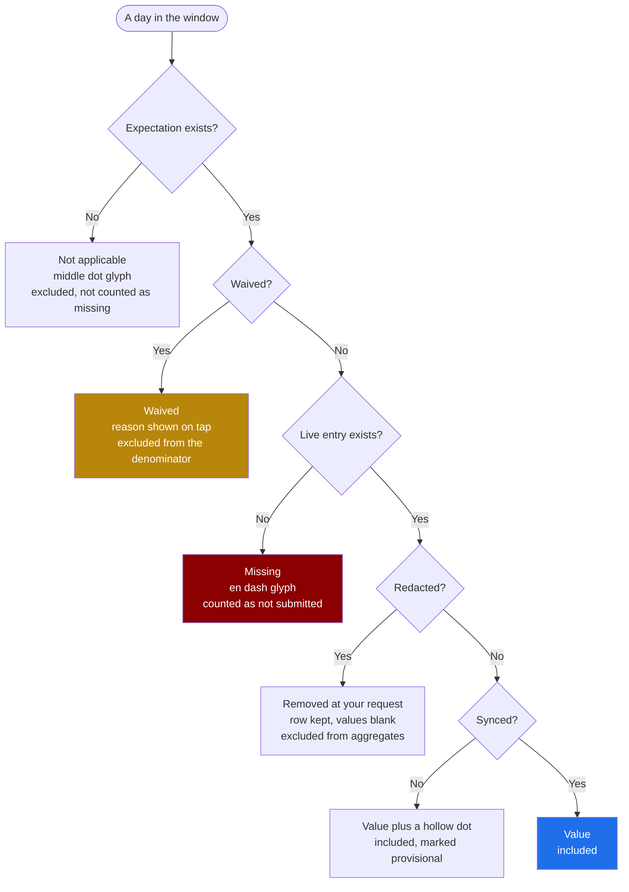

# Screen: My Data

> **Layout status**: provisional. Awaiting client design photographs.

Screen 6 in `02-information-architecture.md` §5. Tab 2 of the athlete shell.

Every layout decision below that would normally come from the client's designs is marked
**[Assumed, pending photographs]**. Nothing marked that way is settled.

---

## Purpose

My Data is the athlete's answer to "what have I actually been doing". It holds their complete
history across wellness, training, nutrition, testing and gym, segmented by domain, with a period
selector, and it is the only place an athlete can review, correct, and export their own record.

**The Nutrition segment holds the weekly check-in, and nothing else.** Athletes do not log
nutrition daily, so there is no daily nutrition history to review, correct or export; their
targets and the guidance built on them live on the Programme tab (`nutrition-guidance.md`),
which is reference content rather than a record. A segment showing a target with no actual
against it is a chart of one line, and it belongs where the guidance is. What the segment DOES
hold is `CLAUDE.md` rule 8's one exception: `TABS` in `src/app/(athlete)/my-data/page.tsx`
includes `'nutrition'`, `NutritionTab` lists the athlete's `nutrition_checkins` answers, and
`me/export/route.ts` exports them as `nutritionCheckins`. Consistent with §"What is built"
below, which counts Nutrition among the four tabs the shared period model drives.

It has a second job that is easy to underrate: it is the visible return on the 45 seconds they
spend every morning. An athlete who submits wellness for six weeks and never sees anything come
back concludes they are filling in a form for someone else's benefit, and compliance decays
accordingly. This screen is where the data comes back to them.

It has a third job that is legal rather than product: Article 15 access and Article 20
portability (`09-security-and-compliance.md` §6) are exercised from here, through "Export my
data" in the Me tab, and this screen is where an athlete discovers what there is to export.

It is deliberately **not** a dashboard, not a score, and not a comparison against teammates
except where a leaderboard already exists.

---

## Roles and access

| Role | Access |
|---|---|
| Athlete | Their own complete history across every domain (`01-roles-and-permissions.md` §1), with the two carve-outs below |
| Coach / S&C | Not this screen. Staff read the same data through `athlete-profile.md` (screen 20), which adds squad context, flags, and comparison. |
| Medical | As coach |
| Admin | No access to individual athlete data |

Carve-outs that apply here (`01-roles-and-permissions.md` §3):

1. **Clinical notes are not shown.** The athlete sees availability, restrictions, expected
   return, and their rehab programme. The physio's free-text working notes are not in this
   screen and are not in the athlete's export from this screen.
2. **Flags are shown only after staff acknowledge them.** An unacknowledged flag does not appear
   in any domain view. An acknowledged one appears as a dated marker on the relevant chart with
   the staff note, if any.

The group filter does not apply. This screen shows exactly one athlete, so `GroupFilter` is
absent rather than disabled.

---

## Entry points

| Entry point | Context carried | Landing behaviour |
|---|---|---|
| Tab bar, My Data | none | Last used segment and period, restored from local preferences. First ever open lands on Wellness, last 28 days. |
| Today, all-done state, "See your history" (if enabled, O-405 in `today.md`) | `domain` | That segment |
| Today, review mode, "See all entries for this day" | `date`, `domain` | Day view for that date |
| Confirmation toast after a submission, "View" | `domain`, `entry_id` | That segment, scrolled to the entry, briefly highlighted |
| My Programme, "See your gym history" | `domain: gym` | Gym segment |
| Push `athlete.test.results` | `/athlete/my-data?segment=testing` | Testing segment |
| Me tab, "Export my data" | none | Does not land here. Recorded so it is not assumed. |
| Deep link `/athlete/my-data?segment=&period=&date=` | as given | Any segment and period, used by support |

Segment and period selections persist across navigation and app restarts. Period is the global
period context described in `02-information-architecture.md` §6, shared with any other athlete
screen that shows a time series.

---

## Period control

**Built.** This section replaces the earlier state of the screen, which had a **fixed 42-day
window and no control at all** — a `WINDOW_DAYS = 42` constant in `my-data/page.tsx` bounding
all five tabs, with the coverage footer literally printing the constant ("24 of 42 days
logged"). That was a Phase-1a scoping cut taken when this screen had two tabs; it has five now,
and both this file and `20-route-map.md` §4.7 have specified a `PeriodSelector` here throughout.

### What is built

One `PeriodSelector` (`src/components/PeriodSelector/PeriodSelector.tsx`, over the shared model
in `src/lib/period.ts`) above the tab content, driving **four** of the five tabs — Wellness,
Training, Nutrition and Gym — from one resolved window. It writes `?period=`, and the resolved
window is printed beneath it as real dates plus a day count, per region C's rule that "the
resolved range is mandatory".

| Option | State here | Why |
|---|---|---|
| Today (`day`) | **Disabled, with the reason in the label** | The readiness chart is a line plus a 14-day rolling mean and ±1SD band, computed from the points inside the window with no runway fetched outside it. One day is one point and no band, so the one question the tab exists to answer ("is today normal *for me*") becomes unanswerable. Disabled rather than hidden, per `analytics.md`'s rule. |
| Last 7 days (`week`) | Offered | |
| Last 28 days (`month`) | Offered, and the **default** | See below |
| This season (`season`) | Offered, **absent** when the club has no current season row | The different-in-kind case: it is not illegal on this screen, it does not exist for this organisation. Matches `/analytics`. Resolved through `fetchCurrentSeason`, which filters `deleted_at` (the `seasons_one_current` index is partial). |
| Last 365 days (`year`) | Offered | |
| All on record (`all`) | Offered, capped at `MAX_WINDOW_DAYS` (730) | Anchored on the athlete's **own** earliest record across wellness, training, gym and nutrition — one date for all four tabs, so "All on record" does not mean a different span depending on which chip is open. A window the 730-day cap clipped says so. |

Both illegal cases are coerced **server-side** as well as disabled in the control, and the page
states which coercion happened — a hand-typed `?period=day` renders 28 days with a line saying
why, rather than silently.

### The default is 28 days, not 42

Deliberate, and narrower than what the screen showed before, so it is recorded rather than left
to be discovered:

- **42 was never specified.** It was an unreferenced constant in the page. This file says 28 in
  five places: the wireframe caption, the entry-point table ("First ever open lands on Wellness,
  last 28 days"), edge case 1 and its "7 of 28 days" coverage line, the accessibility table's
  spoken label, and the performance budget's "a single athlete over 28 days". Per CLAUDE.md §5,
  42 was the undocumented deviation.
- 28 is `ACWR_CHRONIC_WINDOW_DAYS`, which is what `month` resolves from, so the athlete's default
  window and the chronic-load window on the staff screens are one number.
- The 14 days are recoverable and visible: the window is stated on screen, every wider option is
  one click away, and the choice sticks via the `fydr-period` cookie.
- Keeping 42 was not expressible. It is not a `RangeKey`, and a `PeriodSelector` whose `value`
  matches no option silently displays a different option from the one that rendered.

### Testing is all-time, and now says so

The Testing tab was **already** all-time before this change — `fetchMyTestSummary` has no
`test_date` lower bound — while its four siblings were on 42 days, on the same screen, with
nothing on screen explaining the difference. It stays all-time, and the fix is the label:

- **A personal best is all-time or it is not a personal best.** Bounding `test_date` to the
  window would relabel "the best you have ever done" as "your best in the last 28 days", which
  for most athletes is a *lower* number than the truth. That is the exact "phantom PB
  regression" `fetchMyTestSummary`'s own header records having been fixed once already (a 41.6
  all-time best displayed as 31.0), reintroduced deliberately instead of by accident.
- O-296 in this file answers "how much history should an athlete see" with full history, and the
  role table scopes this tab as "history, personal bests".

On the Testing tab the control is therefore **absent**, replaced by the words "Period: all
time", and the tab's copy says what is and is not bounded. An option-level disable is the wrong
tool here: that rule governs options inside a control that still applies to the screen, and a
control none of whose options would be true is worse present than absent. Switching tabs
preserves the period, so nothing is lost by its absence. The staff notes shown on that tab do
follow the period, and the copy says so.

### Row caps, and why the tables stop at 60

The period widening multiplies rows, so every read on this page was audited against PostgREST's
silent 1000-row ceiling. Three reads are now capped for **rendering** rather than correctness —
a 730-row table is not something anyone reads, and this file's own performance section already
draws that line ("the entry list is virtualised beyond 60 rows"). Virtualisation does not exist
here, so each table stops at 60 rows and **says** it stopped, with the chart and the coverage
footer still spanning the full window.

60 is above every previous cap, so nothing visible before is hidden now. In particular the
Training tab previously took `fetchAthleteRecentSessions`'s default `limit` of **eight**, which
means its "*n* of *m* sessions rated in this window" footer was counting out of 8 while naming a
42-day window. It now counts out of the window, up to the cap.

---

## Layout

### Web

Not applicable in v1.

### Mobile wireframe, Wellness segment, 28-day period

**[Assumed, pending photographs]** Segment order, the choice of a summary tile row above the
chart, and the horizontal pager for secondary views are recommendations.

```
┌──────────────────────────────────────────────┐
│ My data                          ☁ Up to date│ A  Header, 56 pt
├──────────────────────────────────────────────┤
│ [Wellness] Gym  Testing  Boards              │ B  Segments, 44 pt, scrollable
├──────────────────────────────────────────────┤
│ Last 28 days ▾            9 Jul to 5 Aug     │ C  PeriodSelector, 44 pt
│                             [ Day | Week ]   │    + DayWeekToggle
├──────────────────────────────────────────────┤
│ Readiness      Sleep         Soreness        │ D  Summary tiles, 96 pt
│    74            7.4 h          3.2          │
│  ▼ 6 worse     ▲ 0.3 better   ▬ same         │
├──────────────────────────────────────────────┤
│ Readiness score                     ● ○ ○ ○  │ E  Chart card, 260 pt
│ 100 ┤                                        │    pager dots for the
│     │      ╭─╮                               │    horizontal report swipe
│  75 ┤──────╯ ╰──╮   ╭──── ← 28-day mean      │
│     │           ╰─╌╌╯                        │
│  50 ┤              ┊ gap                     │
│     └──┬────┬────┬────┬────┬──               │
│      9 Jul  16   23   30  5 Aug              │
│      MD-3   MD   MD-2  MD                    │
│ n = 24 entries · 28 days to 5 Aug ·          │ F  Provenance footer
│ 24 of 28 days · self-report 100%             │
├──────────────────────────────────────────────┤
│ Entries                                      │ G  List header
│ ┌──────────────────────────────────────────┐ │
│ │ Wed 5 Aug   74   7.5h  ●●●○○   Edited  › │ │ H  Entry row, 64 pt
│ │ Tue 4 Aug   68   6.0h  ●●○○○         ○ › │ │    ○ = pending sync
│ │ Mon 3 Aug, -, Missing   │ │    missing, not zero
│ │ Sun 2 Aug    ·    ·      ·     Rest day  │ │    not applicable
│ └──────────────────────────────────────────┘ │
├──────────────────────────────────────────────┤
│  Today   [My Data]   Programme   Me          │ I  Tab bar
└──────────────────────────────────────────────┘
```

### Region descriptions

| Ref | Region | Rules |
|---|---|---|
| A | Header | Title at `title2`, `SyncStatusIndicator` chip on the right. Not sticky. |
| B | Segments | Five segments, horizontally scrollable on narrow devices, never truncated to icons. Selected segment in `accent` tint with a `semibold` label. |
| C | Controls | `PeriodSelector` in `trigger` variant with the resolved range always shown beside it, and `DayWeekToggle` where the segment supports it. The resolved range is mandatory: "Last 28 days" alone does not tell the athlete whether today is included (`06-design-system.md` §6.8). |
| D | Summary tiles | Three `MetricTile`s at size `m`, horizontally scrollable beyond three. Each carries a trend with its window, and a footnote stating the sample. Metrics per segment are listed below. |
| E | Chart card | One chart, full width minus insets, 220 pt tall plus a 40 pt footer. Horizontally swipeable between report views within the domain, which is the "left/right reports" behaviour from the original drawing (`02-information-architecture.md` §6). Pager dots at the top right. |
| F | Provenance footer | Mandatory on every chart (`06-design-system.md` §8.3): sample size with its unit named, resolved window, coverage when anything is missing, and the source mix when more than one `data_source` contributed. |
| G to H | Entry list | Reverse chronological, one row per day (day mode) or per week (week mode). Missing days render the missing glyph and the word "Missing"; days with no expectation render the not-applicable glyph and a reason. Never blank, never zero. |

### Report views per segment (the horizontal pager)

| Segment | View 1 | View 2 | View 3 | View 4 |
|---|---|---|---|---|
| Wellness | Readiness score over time, with the personal baseline band | The five components as small multiples | Sleep hours with the device comparison where HealthKit is connected | Soreness areas frequency, if O-78 keeps the body map |
| Gym | Weekly volume by exercise category | Estimated 1RM trend per key lift (O-97 permitting) | Sessions completed against prescribed | Set-level detail for a chosen exercise |
| Testing | Each test's result over time, one card per test | Left versus right asymmetry where `side` is recorded | Result against the squad range, where the athlete already appears on a leaderboard for it | none |
| Boards | The leaderboards the athlete appears on | none | none | none |

Every view obeys the chart rules in `06-design-system.md` §8: bounded metrics show their full
range, bars start at zero, time runs left to right, missing values break the line rather than
plotting as zero, and any chart below its minimum sample renders the `insufficientData` state
instead of a misleading picture.

### Day and week modes

`DayWeekToggle` applies to the entry list, not to the chart. In week mode the list collapses to
one row per week with the week's mean or total and its coverage ("5 of 7 days"). Tapping a week
expands it to days. The chart's granularity follows the period, not the toggle: beyond 28 days
the chart aggregates to weeks automatically and says so in the footer.

---

## Components

| Component | Source | Purpose here |
|---|---|---|
| `PeriodSelector` | `06-design-system.md` §6.8 | Global period control, `trigger` variant, `showResolvedRange` |
| `DayWeekToggle` | §6.9 | Entry list granularity, persisted per segment |
| `MetricTile` | §6.2 | Summary tiles. Every aggregate carries a `footnote` or it fails a unit test. |
| `TrendSparkline` | §6.3 | Inside tiles and inside testing cards |
| `ComplianceRing` | §6.6 | Compliance view within each segment, showing completed against expected for the period |
| `EmptyState` | §6.16 | `noData`, `insufficientData`, `notStarted`, `offline`, `error` |
| `CalendarStrip` | §6.15 | Day mode navigation when the period is `today` or `thisWeek` |
| `SyncStatusIndicator` | §6.17 | Header chip, and a per-row pending dot |
| `AvailabilityPill` | §6.5 | Availability history strip beneath the wellness chart |
| `ConfirmSheet` | §6.18 | Correction confirmation |
| `Numeric` | §5.2 | Every number, with `absence` supplied explicitly on every nullable value |

Screen-local compositions in `apps/mobile/src/features/my-data/`:

| Composition | Purpose |
|---|---|
| `DomainSegments` | The five-segment control and its persistence |
| `ReportPager` | The horizontal report swipe and its dots |
| `EntryList` | Day and week rows, with correction affordances |
| `EntryDetailSheet` | One entry in full, with its revision history |
| `TestResultCard` | One test, its history, and its personal best |

---

## Data requirements

### The materialised view problem, stated once

`04-data-model.md` §12 defines five materialised views that carry the analytical load.
**Materialised views do not support row-level security.** An athlete must therefore never query
them directly, or the anon key plus a crafted request returns the whole squad.

Two rules:

1. Every athlete-facing read of a materialised view goes through a `security invoker` view or a
   `security definer` function that filters on `auth_athlete_id()` and `auth_org_id()`.
2. `revoke all on mv_* from authenticated, anon` is applied in the same migration that creates
   each view, and the cross-tenant test suite asserts it (`09-security-and-compliance.md` §8.2
   enumerates tables dynamically, and the view enumeration must be added alongside).

```sql
-- Example. One per view that athletes can see through.
revoke all on mv_daily_athlete_summary from authenticated, anon;

create or replace function public.my_daily_summary(p_from date, p_to date)
returns setof mv_daily_athlete_summary
language sql stable security definer set search_path = public as $$
  select *
  from mv_daily_athlete_summary m
  where m.org_id     = auth_org_id()
    and m.athlete_id = auth_athlete_id()
    and m.day between p_from and p_to;
$$;
revoke execute on function public.my_daily_summary(date, date) from anon;
```

### Fields by segment

| Segment | Field | Source | Transformation |
|---|---|---|---|
| Wellness | `readiness_score` | `wellness_entries_current.readiness_score` | Plotted 0 to 100, full range, never zoomed |
| Wellness | 5 components | `wellness_entries_current.{sleep_quality,fatigue,soreness,stress,mood}` | Plotted 1 to 5, full range |
| Wellness | `sleep_hours` | `wellness_entries_current.sleep_hours` | 1 dp. Where HealthKit is connected, `device_metrics.sleep_duration` is plotted as a second series with a provenance key, never merged |
| Wellness | baseline band | `mv_wellness_baselines` via `my_wellness_baselines()` | Rolling mean ±1 SD over 28 days. Suppressed below 10 prior observations (`06-design-system.md` §8.5) |
| Wellness | `resting_hr`, `body_mass_kg` | `wellness_entries_current` union `device_metrics`, `body_composition` | One chart, points marked by source |
| Wellness | availability strip | `availability` | A horizontal band beneath the chart, coloured by status, so a dip in readiness can be read against a period of modified availability |
| Gym | session volume | `gym_session_logs.total_volume_kg` | Weekly totals beyond 28 days |
| Gym | volume by category | `gym_set_logs` joined to `exercises.category` | Stacked horizontal bar, never a pie |
| Gym | prescription adherence | `gym_set_logs.prescribed_*` against logged | Percentage of prescribed sets completed, from the ADR-006 snapshot, not from today's programme |
| Gym | per-exercise history | `previous_exercise_performance()` extended over the window | Set-level table plus a load line |
| Testing | results | `test_results` where `deleted_at is null` | One card per `test_definition_id`. Direction from `test_definitions.higher_is_better`. |
| Testing | personal best | `test_results` where `is_best` | Marked on the chart with a labelled reference line |
| Testing | asymmetry | `test_results.side` | Left against right, with the difference as a percentage, only where both sides exist on the same date |
| All | compliance | `compliance_expectations` against entries | `ComplianceRing` per segment for the period |
| All | flags | `flags` where `athlete_visible_at is not null` | Dated markers on the chart with the staff note. Unacknowledged flags are not returned by the query at all. |

### Hooks

```ts
// packages/queries/keys.ts additions
myData: {
  all: (orgId: string) => [...qk.org(orgId), 'my-data'] as const,
  domain: (orgId: string, athleteId: string, domain: Domain, range: DateRange) =>
    [...qk.myData.all(orgId), domain, athleteId, range.from, range.to] as const,
  entry: (orgId: string, entryId: string) =>
    [...qk.myData.all(orgId), 'entry', entryId] as const,
  revisions: (orgId: string, entryId: string) =>
    [...qk.myData.all(orgId), 'revisions', entryId] as const,
},
```

```ts
// packages/queries/myData.ts
export function useMyDomainHistory(args: {
  orgId: string; athleteId: string;
  domain: 'wellness' | 'gym' | 'testing';
  range: DateRange;
  granularity: 'day' | 'week';
}): UseQueryResult<{
  series: Array<{ date: string; values: Record<string, number | null> }>;
  aggregates: Record<string, { value: number | null; delta: number | null; n: number }>;
  coverage: { expected: number; submitted: number; waived: number };
  sources: Array<{ source: DataSource; pct: number }>;
  baselines?: Record<string, { mean: number; sd: number; n: number }>;
}>;

export function useEntryRevisions(args: {
  orgId: string; entryId: string;
}): UseQueryResult<EntryRevision[]>;
```

| Query | `staleTime` | `gcTime` | Persisted | Note |
|---|---|---|---|---|
| Domain history, current period | 60 s | 24 h | Yes | Reconciled against SQLite so a pending entry appears immediately |
| Domain history, past periods | 15 min | 24 h | Yes | Historical data does not change except by correction |
| Revisions | 5 min | 1 h | No | Rarely opened |
| Testing | 15 min | 24 h | Yes | Changes only when staff log results |

**Local entries win for the current period.** An entry submitted five minutes ago and not yet
synced must appear in this list, marked pending, exactly as `03-flows.md` §3 requires. The
reconciliation is the same union used on Today.

### Series construction rules

1. **A missing day is a null, never a zero.** The series contains one point per day in the
   window, with null where no live entry exists. Charts break the line at nulls and draw a
   dotted connector so the gap is visible (`06-design-system.md` §6.3).
2. **A waived day is not a missing day.** It is excluded from the coverage denominator and
   rendered with the not-applicable glyph in the list.
3. **Superseded revisions are excluded** from every series. Only `superseded_by is null` rows
   are read, through the `_current` views (ADR-005 rule 3).
4. **Provenance is carried per point**, not per series, so a sleep chart with three
   device-derived points and twenty-one self-reported ones can mark them.
5. **Aggregates state their exclusions**: "4 days excluded, no entry" appears in the footer, and
   the mean is computed over the remainder rather than over a denominator that includes them.

### How one day resolves to one display state

This is the decision `06-design-system.md` §5.4 exists to protect, applied to this screen. Every
day in the window resolves to exactly one of six outcomes, and confusing any two of them is a
correctness bug rather than a display issue.



A zero is not on this diagram because a zero is a seventh outcome that only arises when a real
measurement was zero, and it renders as `0` with the metric's unit. It is never produced by any
of the branches above.

---

## States

### Default

A segment, a period, a chart, and a list. The most common real state for an athlete four weeks
into a season.

### Loading

Skeletons in the shape of the final layout: three tile blocks, one 220 pt chart block, five list
rows. Appear after 150 ms, minimum 400 ms. Cached data is never replaced by a skeleton; a 2 pt
indeterminate bar under the header indicates revalidation.

### Empty, by cause

| Cause | Kind | Copy |
|---|---|---|
| No entries ever in this domain | `notStarted` | "Nothing logged yet." Body "Your wellness entries appear here once you start submitting." No action, because the action is on Today. |
| No entries in the selected window | `noData` | "No wellness entries between 9 July and 5 August." Action "Change period". |
| Some entries, below the chart minimum | `insufficientData` | "Not enough data to show a trend. 2 of 3 entries needed." The list still renders every entry that exists. |
| Athlete joined mid-window | `noData` with an explanation | "You joined on 22 July. Showing 14 days." The window is clamped and the clamp is stated. |
| Testing with no results | `notStarted` | "No test results yet. Your coach records these after a testing session." |
| Leaderboards with no qualifying board | `noData` | "You are not on a leaderboard yet." |

The `insufficientData` state always says three things: what is missing, how much exists, and how
much is needed (`06-design-system.md` §8.5). "No data" alone is useless.

### Error

Errors render at the smallest scope that failed. A failed chart does not blank the list, and a
failed tile does not blank the chart.

| Failure | Behaviour |
|---|---|
| Domain history fails, cache present | Cached content with a caption "Last updated 07:12." and a retry |
| Domain history fails, no cache | `EmptyState` kind `error` in the content area, segments and period control still usable |
| Baseline fails | Band is absent, line still plots, footer notes "Baseline unavailable" |
| One report view in the pager fails | That page shows the error, the others do not |
| Testing fails but wellness is cached | Only the testing segment is affected |

### Offline

| Sub-state | Behaviour |
|---|---|
| Recent history, cached | Full function. Charts and lists render from cache with the age caption. |
| Long history or a period not cached | `EmptyState` kind `offline`: "You're offline. This will load when you reconnect." The current period stays available. |
| Pending entries | Rendered in the list with a hollow dot and the label "Pending sync". Included in the series, marked provisional in the footer. |
| Parked entries | Rendered with the label "Not submitted" and a link to the sync status screen. They are **not** included in aggregates. |

`05-architecture.md` §6 restricts long history and test trends to online, so the offline
boundary is at the persisted window, currently the last 28 days plus the current season's test
results.

### Correction

> **AMENDED 2026-08-30.** "Every entry row carries a Correct affordance" is no longer true, and
> was never true of every row. What is true now, per
> `decisions/adr-005-immutable-entries.md` §"Who may correct what":
>
> - **Wellness and Training rows have no Correct affordance at all.** The column that held it was
>   removed rather than emptied — a column of blanks headed "Actions" reads as broken. One line of
>   copy under each table says the entry cannot be edited and that a coach can record a correction
>   from the athlete's profile. Migration `0058_coach_only_entry_correction.sql` is the gate; the
>   link was removed so the athlete is never offered a control the database will refuse.
> - **Those same two rows DO carry a `Corrected` marker when a coach has corrected them**, with the
>   staff member's name, the date, and the previous values shown open beneath the row. Built at the
>   same time as the copy above, because that copy promises it: "the original is kept" is a claim
>   about what the athlete can see, and for a short window it was made on five screens while no
>   athlete screen showed anything of the sort. See the "Revision marker" section below.
> - **Nutrition and Gym rows keep theirs.** Neither table has a staff write path, so removing the
>   athlete's would leave them correctable by nobody. Both sections say on screen that they are
>   the exception, so the difference is stated rather than discovered.
>
> The 14-day window below is aspirational in both directions and is still enforced nowhere in SQL
> (`0045` lines 66-72 admits this); the coach's correction card shows 28 days, and the athlete
> tables show whatever the period control resolved — 28 days by default, up to 730 at "All on
> record". This line used to read "the athlete tables show a fixed 42-day window"; see "Period
> control" above.

### Revision marker

**Built 2026-08-30, closing ADR-005 O-32.** The revision history for an edited entry was specified
as available from an entry detail sheet. That sheet still does not exist; the marker does not need
it, and waiting for it was what left the athlete with nothing while a coach could change their
numbers.

What is built, on the Wellness and Training tables only (the two domains a coach can correct):

- A `Corrected` pill on any row whose live entry carries `revision_of`.
- Directly beneath it, always open rather than behind a disclosure: "Corrected by *name* on
  *date*", then the previous values, oldest first. The staff panel hides this behind a "History"
  button because a coach scans thirty athletes and wants the current number by default; this is one
  person's own record, a correction is rare, and it is not something the athlete should have to go
  looking for.
- If the superseded row falls outside the resolved window (42 days when this was written; now
  whatever the period control resolved), the marker still shows — `revision_of` being non-null is
  what marks it, not the presence of the parent — and says the earlier version is older than the
  window. Widening the period genuinely recovers those earlier versions rather than only relabelling
  them, because the revision chain is read over the same window as everything else.
- **No audit event.** The staff side writes `entry_revision.view` on expansion; the athlete side
  writes nothing. That event records one person reading another person's revised self-report, and
  the subject of the data is not a third party looking in.

Backed by `lib/queries/entryRevisions.ts`, the same functions the coach's panel uses —
`wellness_athlete_select` / `training_athlete_select` (`0012`) scope them to the athlete's own rows
and place no `superseded_by` filter on them, so the athlete gets their own chains in full and
cannot reach anyone else's.

The fuller side-by-side comparison below remains unbuilt, and belongs to the entry detail sheet
rather than to this list:

```
Wed 5 Aug · Wellness
Submitted 07:12 · Edited 07:41

Current                        Original
Sleep quality  Good · 4        OK · 3
Fatigue        Fresh · 4       Fresh · 4
...
```

Both versions are shown side by side. Hiding the original would reintroduce at the interface
layer exactly the trust problem ADR-005 exists to prevent.

---

## Interactions

| Gesture | Target | Result |
|---|---|---|
| Tap | Segment | Switches domain. Period and day/week selections persist. The chart pager resets to view 1. |
| Swipe horizontally | Segment strip | Scrolls the strip. Does not change segment. |
| Swipe horizontally | Chart card | Moves between report views within the domain. Snaps. Dots update. This is the "left/right reports" behaviour from the original drawing. |
| Tap | `PeriodSelector` | Presents the period sheet. Custom opens a two-date picker with the resolved range shown live. |
| Tap | `DayWeekToggle` | Switches list granularity. Disabled when the period is `today`. |
| Tap | A chart point | Presents a value tooltip with the date, value, and provenance. Dismissed by tapping elsewhere. |
| Long press | Chart | Presents "View as table", the mandatory accessible alternative (`06-design-system.md` §8.6), rendering the same data through the same formatting rules. |
| Tap | Summary tile | Switches the chart pager to the view that tile summarises |
| Tap | Entry row | Presents the entry detail sheet: every field, provenance, revision history, and the correction action |
| Tap | "Correct" | Opens the domain entry screen in correction mode, after the `ConfirmSheet` |
| Swipe left | Entry row | Nothing. There is no swipe action anywhere in My Data: entries are immutable and a swipe-to-delete on a season of history is a data-loss affordance nobody needs. |
| Tap | A flag marker on a chart | Presents the flag: metric, observed value, baseline, the date, and the staff note. Only acknowledged flags are ever present. |
| Tap | Availability band | Presents that availability period: status, restrictions, dates. Never a diagnosis. |
| Tap | Test result card | Expands to the full history for that test, with attempts, conditions, and the personal best marked |
| Pull down | Screen body | Refresh. Refetches the current segment and triggers a sync attempt. |
| Tap | Tab bar My Data while on My Data | Scrolls to top. Second tap within 1 s resets the period to the default. |

---

## Validation rules

My Data has one input, the custom period range.

| Rule | Behaviour |
|---|---|
| `from` must not be after `to` | The picker swaps them silently and shows the resolved range |
| Range maximum 2 years | Longer ranges are clamped with the caption "Showing the last 2 years" |
| `to` may not be in the future | Clamped to today |
| `from` before the athlete's `joined_at` | Permitted, and the chart states "You joined on 22 July" rather than showing empty space as though data were missing |
| Range crossing a season boundary | Permitted. A season marker is drawn on the time axis. |

Everything else on this screen is read-only, and the correction path validates in the entry
screen it opens.

---

## Edge cases

1. **An athlete with one week of history opens the 28-day view.** The chart renders the seven
   points it has, the window is stated in full, and the coverage line reads "7 of 28 days". The
   line is not stretched to fill the axis and the missing days are visible as gaps.
2. **An athlete with three entries opens a trend.** Three is the minimum for a line
   (`06-design-system.md` §8.5). At two, the `insufficientData` state appears with "2 of 3
   entries".
3. **The baseline band has fewer than 10 prior observations.** The band is suppressed and the
   line plots alone, with the footer noting "Baseline needs 10 entries, you have 6". A band drawn
   from four observations is a confident-looking fiction.
4. **The athlete has both a self-reported and a device sleep value for the same night.** Both are
   retained. The device value is used for analytics per `03-flows.md` §7 rule 1, and the chart
   plots both as separate series with a direct label on each, never averaged.
5. **An entry was corrected.** The series shows the current revision only. **Built**, with two
   changes from the wording here: the list row is marked `Corrected`, not "Edited" — since 0058
   only a coach can have done it, and "edited" would imply the athlete did — and the previous
   values are shown inline beneath the row rather than in a detail sheet, which does not exist.
   See §"Revision marker".
6. **An entry was redacted** under a rectification or erasure request
   (`09-security-and-compliance.md` §6). The row remains with the fields blank and the label
   "Removed at your request, 14 July". It is excluded from every aggregate and the coverage
   footer counts it as excluded, not missing.
7. **The athlete changed clubs and has history at both.** Out of scope: a user belongs to exactly
   one organisation in v1 (`01-roles-and-permissions.md` §6). The screen shows the current
   organisation's data only, and there is no cross-org read anywhere in Fydr.
8. **The athlete left the club and their account is still active.** History remains readable until
   the retention schedule redacts it (`09-security-and-compliance.md` §7). A banner states
   "You are no longer in the squad. Your data is kept until 5 August 2028."
9. **A test definition is deleted.** `test_definitions.deleted_at` is set; existing results stay
   and the card renders with the name it had. Results are never orphaned.
10. **A test has one result.** The card shows the value and the date with no trend, no sparkline,
    and no arrow. A single point is not a direction.
11. **Left and right results exist on different dates.** No asymmetry figure is computed. The
    asymmetry view requires both sides on the same `test_date`, and says so.
12. **The athlete appears on no leaderboard.** The Boards segment shows the `noData` state. It is
    not hidden: hiding a segment based on data makes the app's shape change under the athlete.
13. **A leaderboard the athlete appears on has fewer than 3 qualifying results.** It is not
    ranked (`06-design-system.md` §8.5) and shows "Not enough results to rank".
14. **Gym prescription adherence for a session logged before an override was added.** Computed
    from the snapshot on the set rows (ADR-006), so it reflects what was prescribed at the time,
    not what would be prescribed today.
15. **An ad-hoc gym session with no prescription.** Included in volume, excluded from adherence,
    and the adherence footer states "3 ad-hoc sessions excluded".
16. **A season boundary inside the window.** A vertical rule marks it, labelled with the season
    name. Aggregates spanning the boundary are permitted and the footer names both seasons.
17. **28 days with zero entries and zero expectations** (long-term injury with everything waived).
    The `noData` state's body explains it: "No entries were expected in this period." That is a
    materially different message from "you submitted nothing", and it matters to the athlete
    reading it.
18. **200% dynamic type.** Tiles stack to one per row, chart axis labels drop to every second
    tick (capped at 130% scaling, per `06-design-system.md` §10.2), and the table alternative
    becomes the primary path for chart content. List rows wrap.
20. **VoiceOver on a chart.** The chart is one element with a full summary sentence, and the table
    alternative is reachable by a long press. Individual points are not focusable on mobile;
    they are on web when the athlete client eventually exists there.
21. **The athlete exports their data while offline.** The export action lives in the Me tab and is
    disabled offline with the explanation "Available when you reconnect", because it is generated
    server-side.

---

## Performance notes

| Path | Budget | How |
|---|---|---|
| Tab tap to first paint | 400 ms p95 | Last segment and period are known locally; cached series render immediately |
| Segment switch | 250 ms p95 | Each segment's current period is prefetched on tab mount, in one batched request |
| Period change | 600 ms p95 | Cached where the range has been seen; otherwise one query |
| Domain history query | 400 ms p95 server time | Indexed on `(athlete_id, entry_date desc)` per `04-data-model.md` §15. A single athlete over 28 days is a small scan; no materialised view is needed below a 12-month window. |
| 12 months or longer | 1 s p95 | Served from `my_daily_summary()` over the materialised view rather than the base tables |
| Chart render | 16 ms per frame | Series are downsampled to at most 120 points before rendering; beyond that the period aggregates to weeks |

Rules:

- **Aggregate on the server, not the client.** Twelve months of set logs is tens of thousands of
  rows and must never be sent to a phone to be summed.
- **The entry list is virtualised** beyond 60 rows. **Not built.** The lists instead stop at 60
  rows and say they stopped ("Showing the 60 most recent sessions in this window"). A stated cut
  is honest; a silent one is not.
- **Every read whose window can widen pages, or is provably bounded.** PostgREST returns at most
  1000 rows and does not error at the ceiling, so widening a window is how a screen starts
  quietly showing wrong numbers. As built: `fetchWellnessWithRevisions`,
  `fetchTrainingRevisionChains`, `fetchMyVisibleFlags`, `fetchMyTestSummary`,
  `fetchSessionsBetween` and the three athlete-scoped reads inside
  `fetchAthleteRecentSessions` all page via `fetchAllPaged` with an `id` tiebreak;
  `fetchWellnessByAthlete` and `fetchRecentCheckins` are left unpaged against a written proof
  (their `_current` views carry a one-live-per-day and one-live-per-week unique index, so 730
  days is at most 730 and ~105 rows respectively); the gym set-count read is bounded by capping
  its session list in the database rather than paging tens of thousands of set rows to count
  them.
- **Charts do not animate on data refresh.** First mount may draw in at `duration.slow`, and does
  not under reduced motion (`06-design-system.md` §8.6).
- **Prefetch the adjacent report view** in the pager, one either side, so a swipe is instant.
- **No polling.** Nothing on this screen changes without the athlete's own action or a staff
  action that already produces a notification.

---

## Accessibility

| Element | Label pattern | Example |
|---|---|---|
| Segments | Standard tab semantics | "Wellness. Selected. Tab 1 of 5." |
| Period control | Resolved range spoken | "Period. Last 28 days, 9 July to 5 August. Button." |
| `MetricTile` | Pattern from `06-design-system.md` §10.3 | "Readiness, 74. Down 6 since last week, worse. 24 entries, 28 days." |
| Chart | Full summary sentence | "Line chart. Readiness score, 28 days to 5 August. Ranges 61 to 88. Currently 74, down 6 since last week. 4 days with no entry." |
| Chart alternative | Reachable by long press | "View as table. Button." |
| Entry row, present | Values in full | "Wednesday 5 August. Readiness 74. Sleep 7.5 hours. Soreness 3 of 5. Edited. Button." |
| Entry row, missing | Stated as missing, not zero | "Monday 3 August. No data." |
| Entry row, not applicable | "Sunday 2 August. Not applicable. Rest day." | |
| Entry row, pending | "…, pending sync" appended | "Tuesday 4 August. Readiness 68. Pending sync." |
| Flag marker | Non-clinical, plain | "Flag. 22 July. Sleep 4.1 hours against a baseline of 7.8. Note from your coach." |
| Availability band | Status and dates | "Modified availability, 18 to 26 July. No contact." |
| Revision comparison | Both values | "Sleep quality. Now Good, 4. Originally OK, 3." |

Requirements:

- Every chart has an `accessibilityLabel`, a table alternative, and no information conveyed by
  colour alone (`06-design-system.md` §8.6).
- Focus order: header, segments, period controls, tiles, chart, list.
- Live region announces the period change and the resulting sample size, so a screen reader user
  learns immediately that the new window has three entries rather than twenty-four.
- Reduced motion: no chart draw-in, no pager animation (instant page change), no skeleton
  shimmer.
- Dynamic type 85% to 200%, verified at 100%, 150%, 200%. Chart tick labels cap at 130% and the
  table alternative carries the accessible path beyond that.
- Touch targets: 48 pt minimum on segments, period control, list rows, and pager dots. Chart
  points are not tap targets; the tooltip is opened by tapping anywhere on the chart and reading
  the nearest point.

---

## Open questions

- **O-295** Should the athlete see their readiness baseline and their z-score against it? The
  band makes the chart much more informative and it also tells the athlete precisely what the
  flag engine is measuring, which some clubs will consider helpful transparency and others will
  consider an invitation to manage the number. I have included the band and excluded the z-score.
  Confirm.
- **O-296** How much history should an athlete be able to see? I have assumed everything the
  retention schedule keeps, which is the current season plus three completed seasons for
  performance data. The alternative is the current season only, which is simpler, cheaper, and
  will be read as the club hiding something. My recommendation is full history.
- **O-297** Should acknowledged flags appear on the athlete's charts? `01-roles-and-permissions.md`
  carve-out 2 makes them visible after acknowledgement, and this is the natural place for them.
  It also means an athlete scrolling their history sees every time they were flagged, which is a
  different experience from being told once. This is the same underlying decision as O-70 in
  `today.md` and should be answered once for both.
- **O-298** Does the athlete need a comparison against the squad anywhere other than leaderboards?
  A "you are in the top third for sleep" line is motivating and it is also a comparison an athlete
  cannot opt out of, unlike a leaderboard. I have not included any. Confirm.
- **O-299** Should the Boards segment live here at all? `02-information-architecture.md` §3 puts
  leaderboards under My Data, and screen 26 specifies them separately. Keeping them here as a
  fifth segment matches the drawing; moving them to their own destination would make My Data
  purely personal, which reads more coherently. I have followed the drawing. It is worth a
  second look now that the segment list is five items long on a 320 pt phone.

---

## Related documents

- Athlete navigation → `02-information-architecture.md` §3, §6
- Chart rules, insufficient data thresholds, provenance footers → `06-design-system.md` §8
- Missing versus zero versus not applicable → `06-design-system.md` §5.4
- Materialised views → `04-data-model.md` §12
- Access rights and export → `09-security-and-compliance.md` §6
- Revisions → `docs/decisions/adr-005-immutable-entries.md`
- The staff equivalent → `athlete-profile.md`
- Leaderboards → `leaderboards.md`
