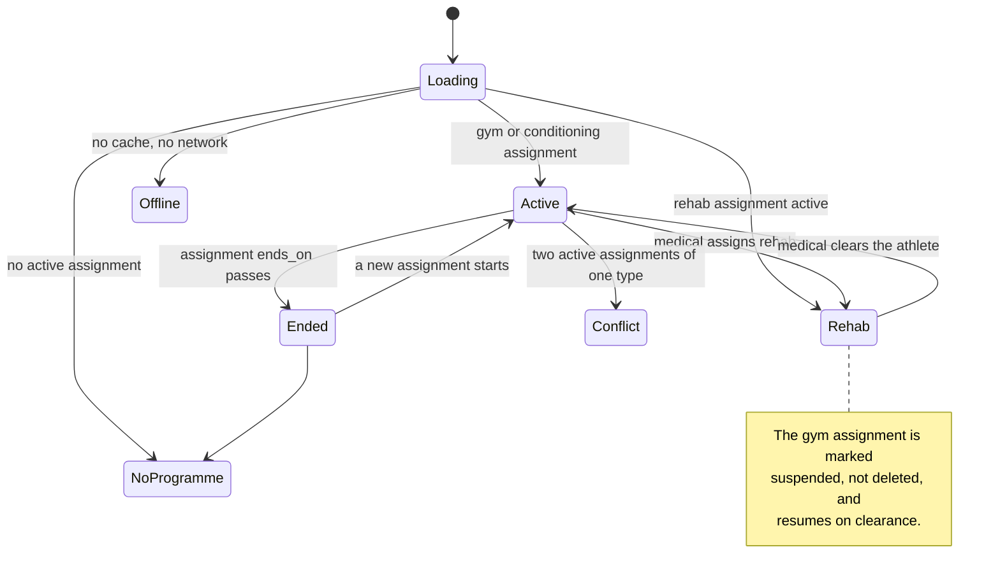

# Screen: My Programme

> **Layout status**: provisional. Awaiting client design photographs.

Screen 7 in `02-information-architecture.md` §5. Tab 3 of the athlete shell.

Every layout decision below that would normally come from the client's designs is marked
**[Assumed, pending photographs]**. Nothing marked that way is settled.

---

## Purpose

My Programme is the athlete's answer to "what am I supposed to be doing". It holds their current
gym programme, their nutrition targets, and their rehabilitation plan if medical staff have
assigned one, all resolved to **their** version: parent prescription with their overrides
applied, in kilograms rather than percentages, with the exercises they are exempt from clearly
marked rather than quietly missing.

It is a reference screen rather than a task screen. Today tells the athlete what to do now; this
tells them what the block is, where they are in it, and what is coming. Athletes open it before
a session to see what is planned, at the start of a block to understand the shape of it, and
when a coach mentions a change.

Its second job is a confidentiality constraint. The athlete must see that their plan has been
tailored, because a plan that silently differs from what a coach told the squad reads as a bug
(`06-design-system.md` §6.13). They must **not** see what anyone else was prescribed, or be able
to infer it. Those two requirements are in tension and §Resolution and confidentiality resolves
them.

---

## Roles and access

| Role | Access |
|---|---|
| Athlete | Their own resolved programme, nutrition targets, and rehab plan. Nothing about any other athlete, and no parent-programme values other than their own resolved ones. |
| Coach / S&C | Not this screen. Staff see the parent programme, every athlete's overrides, and the divergence notices through `gym-programmes.md` and `programme-builder.md`. |
| Medical | Not this screen. Medical assign rehab through `injury-record.md` and `rehab-groups.md`. |
| Admin | No access. |

RLS consequences, which the cross-tenant suite asserts:

- `programme_exercises` is readable by an athlete only for programmes assigned to them, directly
  or through a group they were a member of on the relevant date.
- `exercise_overrides` is readable by an athlete only where `athlete_id = auth_athlete_id()`.
  An athlete must never be able to enumerate overrides, because the set of overrides on a
  programme is a description of who in the squad is carrying an injury.
- `programme_assignments` rows for other athletes are not readable. This is the one that leaks
  most easily, because a naive policy on `programmes` alone would let an athlete count the
  assignments.

---

## Entry points

| Entry point | Context carried | Landing behaviour |
|---|---|---|
| Tab bar, Programme | none | Current assignment, current week, scrolled to today's session |
| Today, `SessionCard` for a gym session, "See the plan" | `programme_session_id` | Session detail within this screen |
| Push `athlete.programme.assigned` | `/athlete/programme/{assignment_id}` | That assignment, week 1 |
| Push `athlete.rehab.assigned` | `/athlete/programme/{assignment_id}` | The rehab plan, which is the top card |
| Push `athlete.programme.changed` | `/athlete/programme` | Current assignment with the changed session marked "Updated" for 24 hours |
| My Data, gym segment, "See your programme" | none | Gym section |
| Nutrition guidance, targets caption, "About these targets" | none | Nutrition targets card, expanded |
| Availability screen, "Your rehab plan" | none | Rehab card |

---

## Layout

### Web

Not applicable in v1.

### Mobile wireframe, normal state

**[Assumed, pending photographs]** Card order, the week strip treatment, and the placement of
the nutrition card are recommendations.

```
┌──────────────────────────────────────────────┐
│ My programme                    ☁ Up to date │ A  Header, 56 pt
├──────────────────────────────────────────────┤
│ Pre-season strength                          │ B  Programme header, 88 pt
│ Accumulation · Week 3 of 4 · ends 24 Aug     │
│ ▓▓▓▓▓▓▓▓▓▓▓▓░░░░  11 of 16 sessions          │
├──────────────────────────────────────────────┤
│  W1   W2  [W3]  W4                           │ C  Week strip, 44 pt
├──────────────────────────────────────────────┤
│ This week                                    │ D  Session list
│ ┌──────────────────────────────────────────┐ │
│ │ Mon  Lower A       ✓ Logged · 9,240 kg › │ │    64 pt rows
│ │ Tue  Upper A       ✓ Logged            › │ │
│ │ Wed  Lower B       Today · 24 sets     › │ │    today highlighted
│ │ Fri  Upper B       Not started         › │ │
│ └──────────────────────────────────────────┘ │
├──────────────────────────────────────────────┤
│ Nutrition targets                    MD-1  › │ E  Nutrition card, 148 pt
│ Protein 175 g · Carbs 480 g · Fat 80 g       │
│ Energy 3,600 kcal · Fluid 3,000 ml           │
│ Targets change by matchday. Tap to see all.  │
├──────────────────────────────────────────────┤
│ [        Log a session without a plan      ] │ F  Ad-hoc action, 56 pt
├──────────────────────────────────────────────┤
│  Today   My Data   [Programme]   Me          │ G  Tab bar
└──────────────────────────────────────────────┘
```

### Mobile wireframe, rehab assigned

A rehab assignment overrides the gym programme entirely for that athlete
(`03-flows.md` §4, "Rehab exception"). The gym programme is marked suspended, not deleted, and
resumes on clearance.

```
┌──────────────────────────────────────────────┐
│ My programme                                 │
├──────────────────────────────────────────────┤
│ ◑ Modified availability                      │ H  Availability banner
│ No contact · No sprinting                    │
├──────────────────────────────────────────────┤
│ Rehab · Left hamstring                       │ I  Rehab card, primary
│ Phase 2, loading · started 22 Jul            │
│                                              │
│ Mon  Isometrics + bike        ✓ Logged     › │
│ Wed  Nordic progression       Today        › │
│ Fri  Return to running 1      Not started  › │
│                                              │
│ Milestones                                   │
│ ✓ Pain-free walking          met 24 Jul      │
│ ✓ Single-leg bridge × 20     met 29 Jul      │
│ ○ 80% eccentric strength     target 8 Aug    │
│ ○ Return to running          target 15 Aug   │
├──────────────────────────────────────────────┤
│ ⏸ Pre-season strength is paused              │ J  Suspended gym, collapsed
│   It resumes when medical staff clear you. › │
├──────────────────────────────────────────────┤
│ Nutrition targets                          › │ E
└──────────────────────────────────────────────┘
```

### Session detail (pushed screen)

```
┌──────────────────────────────────────────────┐
│ ‹  Lower B                    Wed 5 Aug      │
│    24 sets · about 55 min · MD-1             │
├──────────────────────────────────────────────┤
│ ▎A1  Back squat                  [Modified]  │
│ ▎    4 × 5 · 105 kg · tempo 3-1-X-0          │
│ ▎    Rest 180 s                              │
│ ▎    ⓘ Load capped while you return from     │
│ ▎      injury. Set by Dan Reilly, 22 Jul.    │
│ ▎    ▶ Watch the movement                    │
│ ▎                                            │
│ ▎A2  Copenhagen plank            superset    │
│ ▎    3 × 20 s each side                      │
├──────────────────────────────────────────────┤
│   B   Romanian deadlift                      │
│       3 × 8 · RPE 8 target · rest 120 s      │
├──────────────────────────────────────────────┤
│   C   Split squat            [Exempt]        │
│       Not part of your session               │
├──────────────────────────────────────────────┤
│ ┌──────────────────────────────────────────┐ │
│ │             Start session                │ │
│ └──────────────────────────────────────────┘ │
└──────────────────────────────────────────────┘
```

### Region descriptions

| Ref | Region | Rules |
|---|---|---|
| A | Header | Title, sync chip. Not sticky. |
| B | Programme header | Programme name, current block name, week position, block end date, and a progress bar of completed against prescribed sessions **for this athlete**, counting only sessions they were not exempt from. |
| C | Week strip | One cell per week in the current block. Past weeks are tappable and read-only. Future weeks are tappable and show the plan. The current week is filled. Beyond 8 weeks the strip scrolls. |
| D | Session list | The selected week's sessions, ordered by `day_number` or by `md_offset` where the programme is MD-anchored. Each row: day, session name, state, and a trailing figure where one exists. |
| E | Nutrition card | The targets in force for today, the basis (MD-n or default), and an expand affordance showing every MD-n variant. Absent when no targets resolve. |
| F | Ad-hoc action | Always present, even when a programme is assigned. Athletes do extra work and it is better recorded than not. |
| H | Availability banner | Same component and rules as Today. Present only when status is `modified` or `unavailable`. |
| I | Rehab card | Primary position when a rehab assignment is active. Phase, start date, this week's rehab sessions, and the milestone list from `rehab_assignments.milestones`. |
| J | Suspended programme | Collapsed to a single row with the reason and no start affordance. Tapping expands it read-only, so the athlete can still see what they will return to. |

---

## Resolution and confidentiality

### What is resolved

Everything the athlete sees is the output of
`resolve_programme_session(programme_session_id, athlete_id, on)` from ADR-006, plus load
resolution from `packages/core/load.ts` as specified in `gym-logging.md`. The athlete sees:

| Shown | Not shown |
|---|---|
| Their resolved sets, reps, and load in kilograms | The parent programme's values |
| "Modified" with the reason and who set it | That any other athlete has an override |
| "Exempt" on exercises removed for them | How many athletes are exempt |
| The substitute exercise, named | The exercise it replaced, unless the reason says so |
| Their load cap as a resolved kilogram figure | The percentage cap, unless it is their own basis |
| The programme name and block structure | The assignment list, group assignments, or squad counts |

### The confidentiality rule

> An athlete sees their own prescription and the fact that it was tailored. They never see
> another athlete's prescription, and nothing on this screen allows them to infer one.

Concretely:

1. **No comparative language anywhere.** Never "the squad does 5×5, you do 4×5". Never "reduced
   from". Never "standard". The override chip says "Modified" and the reason says why, in the
   coach's words.
2. **Reasons are athlete-facing text.** `exercise_overrides.reason` is written by a coach and
   shown verbatim to the athlete. The programme builder must say so at the point of writing, so
   a coach does not type "keep him off it, his shoulder is a mess" expecting it to be private.
   This is a change to `programme-builder.md` and it is raised as O-302.
3. **No counts.** The screen never shows how many athletes are on the programme, and the query
   never returns a count it could display.
4. **A substitution names only the exercise the athlete does.** "Floor press" with the reason
   "Shoulder restriction" is enough. Naming the bench press it replaced is fine where the coach's
   reason says so, and is never generated automatically.
5. **Exempt exercises are shown, not hidden**, with the fixed copy "Not part of your session".
   Hiding them makes the athlete's session list disagree with the whiteboard in the gym, which
   produces a conversation in which the athlete is told the app is wrong.
6. **A rehab plan reveals medical involvement, which is unavoidable and correct.** It shows the
   body area and the phase, both of which are non-clinical and already visible to the athlete
   (`01-roles-and-permissions.md` §4). It never shows diagnosis, mechanism, or clinical notes.

### Multiple assignments

An athlete can hold several active `programme_assignments`: a gym programme from an S&C coach, a
conditioning programme, and a rehab programme from medical. Precedence:

| Precedence | Type | Effect |
|---|---|---|
| 1 | `rehab`, status `active` | Becomes the primary card. Every `gym` assignment is shown as suspended. |
| 2 | `gym`, status `active` | Primary card when no rehab is active |
| 3 | `conditioning`, status `active` | Secondary card beneath the primary |
| 4 | `nutrition` | Always a separate card; it does not compete for the primary slot |

Two active assignments of the same type is a configuration error. The screen shows both, most
recent `starts_on` first, with a caption "You have two programmes assigned. Ask your coach which
applies." It does not choose one silently.

---

## Components

| Component | Source | Purpose here |
|---|---|---|
| `ProgrammeExerciseRow` | `06-design-system.md` §6.13 | Every exercise, `mode="read"`. Override chip, superset rule, exempt state. |
| `SessionCard` | §6.14 | Not used. Programme sessions are not calendar sessions; they are plan items, and using `SessionCard` would imply a scheduled time this screen does not have. |
| `ComplianceRing` | §6.6 | Block progress in the programme header, `centre="fraction"` |
| `AvailabilityPill` | §6.5 | Availability banner in the rehab state |
| `EmptyState` | §6.16 | `notStarted` with no programme, `noData` for an empty week, `offline`, `error` |
| `PeriodSelector` | §6.8 | Not used. The week strip is the navigation, because a programme is structured in blocks and weeks, not in date ranges. |
| `BottomSheet` | §6.19 | Exercise detail with video and cues, override reason, nutrition target variants |
| `Numeric` | §5.2 | Every load, every rep count |
| `SyncStatusIndicator` | §6.17 | Header chip |

Screen-local compositions in `apps/mobile/src/features/programme/`:

| Composition | Purpose |
|---|---|
| `BlockHeader` | Programme name, block, week position, progress |
| `WeekStrip` | Week navigation within the current block |
| `ProgrammeSessionRow` | One session in the week list, with the athlete's own state |
| `NutritionTargetCard` | Today's targets and the MD-n variants |
| `RehabCard` | Phase, sessions, and milestones |
| `SuspendedProgrammeRow` | The collapsed paused-programme row |

---

## Data requirements

### Fields

| Field | Source | Transformation |
|---|---|---|
| Assignment | `programme_assignments` where `athlete_id = me` or `group_id` in my live memberships, `status = 'active'`, `starts_on <= today`, `ends_on is null or >= today` | Precedence table above |
| Programme name, goal | `programmes.name`, `goal` | Shown verbatim |
| Block | `programme_blocks.name`, `sequence`, `duration_weeks`, `focus` | Current block is derived from `starts_on` and elapsed weeks |
| Week position | computed | `floor((today - starts_on) / 7) + 1`, clamped to the block's `duration_weeks` |
| Sessions in the week | `programme_sessions` where `block_id` and `week_number` | Ordered by `day_number` then `sequence`, or by `md_offset` when the programme is MD-anchored |
| Exercises | `resolve_programme_session(programme_session_id, athlete_id, now())` | ADR-006 override resolution |
| Resolved load | `packages/core/load.ts` `resolveLoad()` | Percentages become kilograms, rounded to `exercises.load_increment_kg` |
| Override reason | `exercise_overrides.reason`, `created_by`, `created_at` | Shown with the coach's name and date |
| Exercise media | `exercises.video_url`, `cues` | Video opens in a sheet, never autoplays |
| Session state | `gym_session_logs` for this athlete and `programme_session_id` | `not started`, `in progress`, `logged`, `abandoned` |
| Nutrition targets | `resolve_nutrition_targets(athlete_id, today, md_offset)` plus all variants for the current week | Card and its expanded variants |
| Rehab assignment | `rehab_assignments` where `athlete_id = me`, `ends_on is null or >= today` | Phase, dates, milestones |
| Milestones | `rehab_assignments.milestones` jsonb | `[{name, target_date, met_on, criteria}]`. `criteria` is shown to the athlete; it is a functional target, not a clinical note. |
| Availability | latest `availability` row with `effective_to is null` | Banner |
| Injury body area | `injuries.body_area`, `side` | Rehab card title only. Non-clinical and already athlete-visible. |

**Never queried by this screen**: `injury_clinical`, any other athlete's rows, any aggregate over
assignments. The RLS suite asserts that a coach's clinical fields are unreachable and that a
cross-athlete override read returns zero rows.

### Server contract

```sql
-- One call. Resolution runs server-side so the app, the web dashboard,
-- and any export produce the same answer (ADR-006).
create or replace function public.get_my_programme(
  p_athlete_id uuid,
  p_on         date default current_date
)
returns jsonb
language sql stable security invoker as $$
  with assignments as (
    select pa.id, pa.programme_id, pa.starts_on, pa.ends_on, pa.status,
           pa.suspended_reason, p.name, p.programme_type, p.goal, p.duration_weeks
    from public.programme_assignments pa
    join public.programmes p on p.id = pa.programme_id
    left join public.group_memberships gm
           on gm.group_id = pa.group_id
          and gm.athlete_id = p_athlete_id
          and gm.added_at::date <= p_on
          and (gm.removed_at is null or gm.removed_at::date > p_on)
    where (pa.athlete_id = p_athlete_id or gm.id is not null)
      and pa.status in ('active','suspended')
      and pa.starts_on <= p_on
      and (pa.ends_on is null or pa.ends_on >= p_on)
      and p.deleted_at is null
  )
  select jsonb_build_object(
    'assignments', (select jsonb_agg(to_jsonb(a)) from assignments a),
    'rehab',       (select to_jsonb(r) from public.rehab_assignments r
                     where r.athlete_id = p_athlete_id
                       and (r.ends_on is null or r.ends_on >= p_on)
                     order by r.starts_on desc limit 1),
    'nutrition',   (select to_jsonb(n) from public.resolve_nutrition_targets(
                        p_athlete_id, p_on, public.md_offset_for(p_athlete_id, p_on)) n),
    'availability',(select to_jsonb(av) from public.availability av
                     where av.athlete_id = p_athlete_id and av.effective_to is null
                     order by av.effective_from desc limit 1),
    'generated_at', now()
  );
$$;
```

Session-level exercise resolution is a second call, made per session when it is opened, and
prefetched for the current week on mount.

### Hooks

```ts
// packages/queries/keys.ts, extending the existing qk.programme
programme: {
  all: (orgId: string) => [...qk.org(orgId), 'programme'] as const,
  mine: (orgId: string, athleteId: string, on: string) =>
    [...qk.programme.all(orgId), 'mine', athleteId, on] as const,
  resolvedForAthlete: (orgId: string, athleteId: string, on: string) =>
    [...qk.programme.all(orgId), 'resolved', athleteId, on] as const,
  session: (orgId: string, athleteId: string, programmeSessionId: string, on: string) =>
    [...qk.programme.all(orgId), 'session', athleteId, programmeSessionId, on] as const,
},
```

```ts
// packages/queries/programme.ts
export function useMyProgramme(args: {
  orgId: string; athleteId: string; on: string;
}): UseQueryResult<MyProgramme>;

export function useResolvedProgrammeSession(args: {
  orgId: string; athleteId: string; programmeSessionId: string; on: string;
}): UseQueryResult<ResolvedExercise[]>;
```

| Option | Value | Reason |
|---|---|---|
| `staleTime` | 15 min | Programmes change weekly at most (`05-architecture.md` §9) |
| `gcTime` | 24 h | Persisted. The athlete must see their plan with no network. |
| `refetchOnWindowFocus` | false | |
| Invalidation | Push `athlete.programme.changed`, and on any realtime programme broadcast | The athlete must not train from a plan the coach replaced yesterday |

The resolved current week is written into `cached_programme` in SQLite
(`05-architecture.md` §6), so gym logging can start offline.

---

## States



### Active

The normal state. Programme header, week strip, this week's sessions, nutrition card, ad-hoc
action.

### No programme assigned

`EmptyState` kind `notStarted`, size `block`:

> **No programme assigned.**
> Your coach has not assigned a gym programme yet. You can still log a session.
> [ Log a session without a plan ]

The nutrition card is still shown if targets resolve, because nutrition targets are assigned
independently of a gym programme. The screen is never entirely empty for an onboarded athlete.

### Rehab active

Rehab card primary, gym card collapsed and suspended, availability banner at the top. The
suspended row carries `programme_assignments.suspended_reason` if it is athlete-appropriate, and
the fixed fallback copy otherwise: "It resumes when medical staff clear you."

### Programme ending

In the final week of an assignment, the header shows "Last week of this block" and, where a
follow-on assignment exists with a future `starts_on`, a line reading "Next: Intensification,
from 25 Aug". Where no follow-on exists, nothing is said: speculating about what a coach will do
next is worse than silence.

### Future assignment only

An assignment with `starts_on` in the future and nothing active now:

> **Starts Monday 11 August.**
> Pre-season strength, 8 weeks. You can look at it now.
> [ See the plan ]

Read-only. Starting a session is not possible before `starts_on`.

### Loading

Skeletons in layout shape: an 88 pt header block, a 44 pt strip, four 64 pt rows, a 148 pt card.
Cached content is never replaced by a skeleton.

### Error

| Failure | Behaviour |
|---|---|
| `get_my_programme` fails, cache present | Cached plan renders with a caption "Last updated Mon 09:12." and a retry |
| `get_my_programme` fails, no cache | `EmptyState` kind `error`: "Could not load your programme. Check your connection and try again." Secondary action "Log a session without a plan", so the athlete can still train. |
| Session resolution fails for one session | That row shows "Could not load" and remains tappable to retry. The rest of the week is unaffected. |
| Load resolution unresolved (no 1RM) | Not an error. The exercise shows "No 1RM on file" and the same grouped notice as `gym-logging.md`. |
| Nutrition targets fail | The card is absent with a one-line caption. The gym plan is unaffected. |

### Offline

Fully functional from the persisted cache for the current block. Past and future blocks beyond
the cached window show the `offline` empty state. Exercise videos are online only and their
affordance is disabled with "Available when you reconnect".

---

## Interactions

| Gesture | Target | Result |
|---|---|---|
| Tap | Week cell | Selects that week. Past weeks are read-only with logged state shown; future weeks are read-only with no start affordance. |
| Swipe horizontally | Week strip | Scrolls weeks. Does not change block. |
| Tap | Session row | Pushes session detail |
| Tap | "Start session" in session detail | Pushes `gym-logging.md` and creates the log row. Present only for today's session, or for a past session inside the 14-day backdating window. |
| Tap | Exercise row | Presents the exercise sheet: video, cues, equipment, full prescription, and the override reason if present |
| Tap | "Modified" chip | Presents the reason, the coach's name, and the date. Never the parent value. |
| Tap | "Exempt" chip | Presents the fixed copy "This exercise is not part of your session." plus the reason if the coach gave one |
| Tap | Play affordance on an exercise | Opens the video in a sheet. Never autoplays, never plays sound by default. |
| Tap | Nutrition card | Expands to show every MD-n variant for the week, with the current day marked |
| Tap | Suspended programme row | Expands it read-only |
| Tap | Rehab milestone | Presents the milestone's criteria and dates. Read-only: an athlete cannot mark a milestone met. |
| Tap | "Log a session without a plan" | Pushes `gym-logging.md` in ad-hoc mode |
| Pull down | Screen body | Refresh |
| Tap | Tab bar Programme while on Programme | Scrolls to top, then resets to the current week on a second tap within 1 s |
| Long press | Anything | Nothing. No hidden actions on a reference screen. |

Haptics are limited to `impactAsync(Light)` on week selection and sheet presentation. There is no
success haptic on this screen because nothing is submitted from it.

---

## Validation rules

My Programme has no inputs. The rules that apply are gating rules.

| Rule | Behaviour |
|---|---|
| A session may be started only on its scheduled day, or within the 14-day backdating window | Outside that, the start affordance is absent with the caption "Too late to log this session" |
| A session may not be started before `programme_assignments.starts_on` | Affordance absent |
| A session may not be started while the assignment is `suspended` | Affordance absent, with the suspension reason shown |
| A session with every exercise exempt may not be started | Row reads "Nothing prescribed for you" and is not tappable |
| Rehab milestones are read-only to the athlete | No affordance exists |
| A future week's session may not be started | Affordance absent |

---

## Edge cases

1. **The coach edits the parent programme.** Unmodified elements update for this athlete;
   overridden elements are preserved (`03-flows.md` §4). The athlete sees the new values on the
   next fetch, and the affected session is marked "Updated" for 24 hours so the change is not
   silent.
2. **The coach edits a session the athlete has already logged this week.** The logged session's
   detail shows what was prescribed at the time, from the ADR-006 snapshot on the set rows, not
   the new prescription. The plan row for the next occurrence shows the new one.
3. **An override expires mid-week.** Resolution is evaluated at `now()`, so the exercise reverts
   to the parent value from the moment it expires. The chip disappears. This is correct and it is
   also surprising, so an expiring override shows its end date on the chip while it is active:
   "Modified until 8 Aug".
4. **A load cap where the parent prescribes less than the cap.** The cap does not apply
   (`least(parent, cap)`), the parent value shows, and no "Modified" chip appears for that
   exercise, because nothing was modified in effect. The override still exists and will bite when
   the parent rises. This is deliberate: a chip on an exercise whose numbers are unchanged is
   noise.
5. **Every exercise in a session is exempt.** The session row reads "Nothing prescribed for you"
   and is not startable. It stays in the list, because its absence would make the week disagree
   with what the coach told the squad.
6. **An exercise is substituted for one the athlete has never done.** The row shows the
   substitute's name, and the exercise sheet shows its video and cues. Previous performance is
   absent, which is correct.
7. **The athlete has a rehab plan and no gym programme.** Rehab is the only card. The suspended
   row is absent rather than showing an empty placeholder.
8. **Medical clears the athlete mid-block.** The rehab assignment ends, the gym assignment
   returns to `active`, and the screen shows the gym programme at its current week, which may be
   several weeks ahead of where the athlete left it. A caption states "This block has moved on to
   week 6 while you were out." The screen does not silently restart the block, and it does not
   decide to rewind it: that is a coaching decision.
9. **Two active gym assignments.** Both shown, most recent first, with the caption "You have two
   programmes assigned. Ask your coach which applies." Never resolved silently.
10. **A group assignment where the athlete left the group mid-block.** `group_memberships` is
    history-preserving, so the assignment applies for the dates they were a member and not
    afterwards. Sessions already logged remain visible in My Data.
11. **An assignment with `ends_on` in the past.** Not returned. The screen falls to the
    no-programme state, or to the next assignment.
12. **A programme with no blocks, or a block with no sessions.** `EmptyState` kind `noData`:
    "This programme has no sessions yet." This is a staff-side configuration problem and the
    copy does not blame the athlete for it.
13. **A programme longer than its assignment.** Weeks beyond `ends_on` are not shown, and the
    strip stops at the last week that falls inside the assignment.
14. **`md_offset`-anchored sessions in a week with two fixtures.** MD-n labels are relative to the
    next fixture and the days after a fixture carry both labels (`03-flows.md` §8). Session rows
    show both, for example "MD+1 · MD-3".
15. **A fixture is postponed and MD-n recomputes.** Future sessions re-anchor; past sessions keep
    the label they were executed under (`04-data-model.md` §4). The week list shows the recomputed
    labels for future days only.
16. **Nutrition targets exist with no gym programme.** The nutrition card renders alone above the
    no-programme empty state.
17. **A coach writes an override reason that should not be athlete-facing.** The reason is shown
    verbatim. There is no filtering, no redaction, and no review step. This is why O-302 exists:
    the programme builder must state at the point of writing that the athlete reads this text.
18. **The rehab milestone list is empty.** The milestone section is absent, not an empty list.
19. **200% dynamic type.** Session rows wrap to two lines, the week strip cells grow and scroll,
    exercise rows put the prescription line beneath the name, and the nutrition card becomes one
    macro per line. Nothing is removed.
20. **VoiceOver.** The week strip is a tab list. Each session row announces its state. Override
    chips are separately focusable so the reason is reachable without opening the exercise sheet.

---

## Performance notes

| Path | Budget | How |
|---|---|---|
| Tab tap to first paint | 400 ms p95 | Persisted cache renders immediately |
| `get_my_programme` server time | 250 ms p95 | Single function, indexed on `programme_assignments (athlete_id)` and `(group_id)`; both indexes must exist |
| Session resolution | 200 ms p95 | `resolve_programme_session` is a single query per session; the current week's sessions are prefetched in parallel on mount, capped at 6 |
| Week switch | Instant from cache | Weeks within the current block are fetched together |
| Video open | Not budgeted | Streamed, never preloaded, never autoplayed |

Rules:

- **Resolution happens server-side and is cached.** Resolving 12 exercises across 4 sessions on
  the device on every render is wasteful and risks the TypeScript and SQL implementations
  diverging in what the athlete sees.
- **The current week is written to SQLite** so gym logging can start with no network.
- **Exercise media is lazy.** Video URLs are resolved on demand and thumbnails are not fetched
  for the list.
- **The week strip is not a carousel.** It is a scroll view of small cells; no virtualisation and
  no gesture handler beyond scrolling.

---

## Accessibility

| Element | Label pattern | Example |
|---|---|---|
| Programme header | Position stated in words | "Pre-season strength. Accumulation block, week 3 of 4. Ends 24 August. 11 of 16 sessions logged." |
| Week cell | Position and state | "Week 3. Current. Selected. 3 of 4." |
| Session row | Name and state | "Wednesday. Lower B. Today. 24 sets. Not started. Button." |
| Exercise row | Full prescription | "A1. Back squat. 4 sets of 5 at 105 kilograms. Tempo 3-1-X-0. Rest 180 seconds. Modified." |
| Override chip | Reason reachable | "Modified. Load capped while you return from injury. Set by Dan Reilly, 22 July. Button." |
| Exempt exercise | Stated plainly | "Split squat. Not part of your session." |
| Superset | Membership stated | "Superset A. Back squat and Copenhagen plank." |
| Nutrition card | Values and basis | "Nutrition targets for MD minus 1. Protein 175 grams. Carbohydrate 480 grams. Fat 80 grams. Energy 3,600 kilocalories. Fluid 3,000 millilitres. Button, see all days." |
| Rehab card | Phase and area | "Rehabilitation. Left hamstring. Phase 2, loading. Started 22 July." |
| Milestone, met | Date included | "Pain-free walking. Met 24 July." |
| Milestone, open | Target stated | "80 percent eccentric strength. Target 8 August. Not yet met." |
| Suspended programme | Reason given | "Pre-season strength is paused. It resumes when medical staff clear you. Button." |

Requirements:

- Touch targets 48 pt minimum throughout; week cells are 44 by 44 pt with hit slop to 48.
- Focus order: header, week strip, session list, nutrition card, ad-hoc action.
- Override chips are focusable elements, not decorations, because the reason is content.
- Reduced motion: week switching is instant, card expansion is instant, no sheet slide.
- Colour is never the only channel: "Modified" and "Exempt" are words with glyphs, the suspended
  state carries a pause glyph and a sentence, and milestone state carries a tick or a hollow ring.
- Dynamic type 85% to 200%, verified at 100%, 150%, 200%.
- Video content, when a club supplies it, must carry captions or the screen must state that it
  has none. An uncaptioned coaching video is inaccessible to a deaf athlete, and clubs will
  upload phone footage with a voiceover. Raised as O-304.

---

## Open questions

- **O-300** How much of the programme should the athlete see ahead? I have shown the whole
  current block, past and future weeks, read-only. Some coaches will want only the current week
  visible, on the grounds that athletes who see week 6 start training week 6 in week 3. Others
  will want the whole programme, because an athlete who understands the block trains it better.
  This is a coaching philosophy decision and it should be an organisation setting rather than a
  product default. Tell me which default.
- **O-301** Should the athlete see the block's intent? `programmes.goal` and
  `programme_blocks.focus` are free text written by the coach and currently shown. They may
  contain internal language ("deload the ones we are worried about"). Same class of problem as
  O-302. My assumption is to show `focus` and hide `goal`, on the basis that focus describes the
  training and goal describes the plan for the squad.
- **O-302** `exercise_overrides.reason` is shown to the athlete verbatim. That is the right
  behaviour, because an unexplained change is worse than an awkward one, but it is not currently
  stated anywhere that a coach writing an override is writing to the athlete. This needs a change
  to `programme-builder.md`: label the field "Reason, shown to the athlete" and add a second,
  optional staff-only note field. That second field is a schema addition
  (`exercise_overrides.staff_note`). Confirm and I will add both.
- **O-303** Should the athlete be able to see their previous blocks' programmes? Currently the
  screen shows the current assignment only, and history lives in My Data as what they actually
  did rather than what they were asked to do. Keeping the plan history would let an athlete
  compare prescriptions across blocks, which is useful and is also another surface where an old
  override reason resurfaces. My assumption is current assignment only.
- **O-304** Exercise video. `exercises.video_url` exists and clubs will populate it with phone
  footage. Three questions follow that I cannot answer for you: where the files are hosted
  (Storage costs money and bandwidth), whether videos need captions to be accessible, and whether
  an athlete on a training-ground connection should be able to download them for offline use. My
  assumption for v1 is external URLs only, streamed, online only, no captions requirement, with a
  note in the exercise library that videos should be short and silent.

---

## Related documents

- Override model, resolution order, and the snapshot rule → `docs/decisions/adr-006-programme-override-model.md`
- Programme creation and tailoring → `03-flows.md` §4
- Rehab precedence and clearance → `03-flows.md` §6
- Programme schema → `04-data-model.md` §6
- `ProgrammeExerciseRow` → `06-design-system.md` §6.13
- Logging against this plan → `gym-logging.md`
- Nutrition targets in use → `nutrition-guidance.md`
- The staff side → `programme-builder.md`, `gym-programmes.md`, `nutrition-plans.md`
