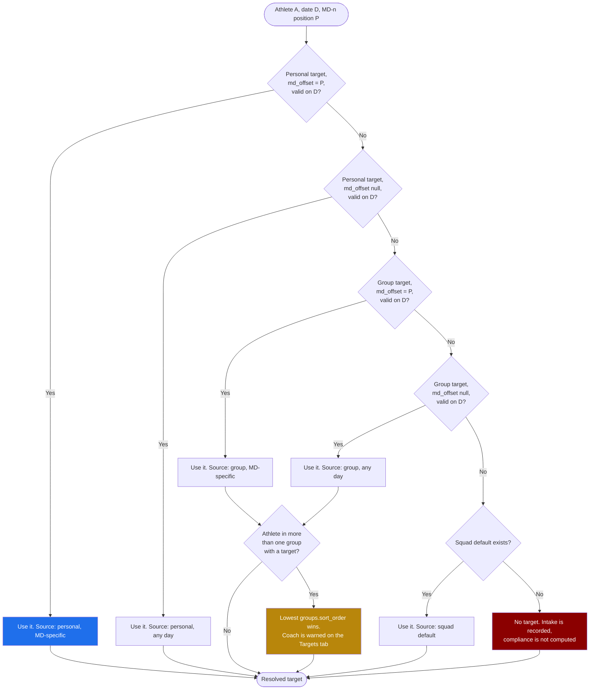

# Screen: Nutrition Plans

> **Layout status**: provisional. Awaiting client design photographs.

Screen 24 in the inventory (`02-information-architecture.md` §5). Reached from
`Programmes → Nutrition plans`. The whiteboard drew this as `Nutrition ─► Whole squad`, and
the whole-squad framing is load-bearing: the default view is the squad, not one athlete.

---

## Purpose

Set nutrition targets, and show whether the squad is hitting them.

Three jobs:

1. **Set targets that vary by MD-n.** `nutrition_targets.md_offset` exists because carbohydrate
   requirements on MD-1 are not the requirements on MD+2. A single flat daily target is
   nutritionally wrong and coaches know it, so the product must express the week shape.
2. **Show the whole squad against those targets on one screen.** Per the drawing. A grid of
   athletes by day, coloured by compliance against their own resolved target.
3. **Make target resolution legible.** An athlete may have a personal target, or inherit a
   group target, or inherit the squad default, and it may or may not be MD-n specific.
   A coach must be able to see which target applies to whom, and why.

**What this screen is not.** It is not a food database and not a meal planner. It is the
authoring side of nutrition. The athlete-facing read of it is `nutrition-guidance.md`, and per
`CLAUDE.md` §7 Fydr is not a dietetics product.

> **Scope note, superseded. O-11 is RESOLVED, 5 August 2026: athletes do not log nutrition.**
> Half of this screen survives and half does not, and the split is worth stating before anyone
> builds from it.
>
> **Survives**: setting targets, varying them by MD-n, target resolution and its precedence
> rule, the authoring and expiry model, and the RLS position. Those are the parts of job 1 and
> job 3 above.
>
> **Does not survive**: job 2, the squad-by-day grid coloured by compliance against target, and
> everything downstream of it. There are no actuals. `nutrition_entries` is dormant, no
> `'nutrition'` compliance expectation is generated (`04-data-model.md` §11), and a grid with
> nothing in it is not a smaller version of the specified screen, it is a different one.
>
> **Treat every reference below to entries, actuals, meal splits, supplements or photographs as
> not applicable to v1**, whether or not it carries an individual marker. The data-requirement
> rows, the empty states and the build instructions that would have created something have each
> been marked; the illustrative SQL and the intake edge cases have been left as written. They
> are retained rather than deleted because option 3 in `nutrition-guidance.md` §9, a periodic
> weighed-intake audit run twice a season, would use exactly this grid and exactly these
> queries. Nothing here ships until that option is commissioned.
>
> Athlete-facing guidance content is specified in `nutrition-guidance.md`, not here.

---

## Roles and access

| Role | Access |
|---|---|
| Coach / S&C | Full. Create, edit, expire targets for athletes and groups. View squad compliance |
| Medical / Physio | Read-only on targets. Full view of compliance. May set targets where an athlete has an active injury, because return-to-play nutrition is a medical concern. See O-312 |
| Athlete | No access to this screen. Athletes see their own resolved targets in `my-programme.md` and the guidance built on them in `nutrition-guidance.md`. They log nothing against them. |
| Admin | No access |

`nutrition_targets` carries no `created_by` restriction in the schema, so enforcement is RLS:
select for `coach` and `medical`, insert and update for `coach`, and for `medical` only where
the athlete has an open `injuries` row. Athletes select their own resolved targets through a
view, never the table.

---

## Entry points

| From | Lands on | Context carried |
|---|---|---|
| `Programmes → Nutrition plans` | Squad tab, current week | Group filter, period |
| `dashboard.md`, nutrition compliance card | Squad tab, that week | Week, group filter |
| `athlete-profile.md → Nutrition tab`, "Targets" | Targets tab, that athlete's card expanded | `athlete_id` |
| `groups.md`, "Nutrition targets for this group" | Targets tab, that group's card expanded | `group_id` |
| `flags.md`, a `nutrition`-domain flag | Squad tab, that athlete's row focused, that date selected | `athlete_id`, `flag_date` |
| `md-planner.md`, "Nutrition by MD-n" | Targets tab, MD-n editor open | `md_offset` |
| Deep link `fydr://nutrition/plans` | Squad tab | None |

---

## Layout

Three tabs: **Squad**, **Targets**, **Athlete**. Squad is the default and matches the drawing.

### Web, 1280 pt design target

**Squad tab.** Athletes down, days across, one week at a time, with the MD-n label under each
date because the schedule is the spine.

```
┌──────────────────────────────────────────────────────────────────────────────────────────┐
│ Fydr  [Group filter: All squad ▾]  [Period: This week ▾]                    Alex R  ▾    │
├────────────┬─────────────────────────────────────────────────────────────────────────────┤
│ Dashboard  │  Nutrition plans                                        [+ New target ▾]    │
│ Schedule   │  ┌──────────────────────────────────────────────────────────────────────┐  │
│ Squad      │  │ Squad │ Targets (6) │ Athlete                                         │  │
│ Programmes │  └──────────────────────────────────────────────────────────────────────┘  │
│  ▸ Gym     │  Metric: [Protein ▾]   ◄ Week of 3 Aug 2026 ►    [Day] [Week]   [Export]   │
│  ▸ Nutri   │                                                                             │
│  ▸ Rehab   │        │ Mon 3 │ Tue 4 │ Wed 5 │ Thu 6 │ Fri 7 │ Sat 8 │ Sun 9 │  Week      │
│ More       │        │ MD-5  │ MD-4  │ MD-3  │ MD-2  │ MD-1  │  MD   │ MD+1  │  mean      │
│            │ ───────┼───────┼───────┼───────┼───────┼───────┼───────┼───────┼──────────  │
│            │ Target │ 150 g │ 170 g │ 170 g │ 160 g │ 160 g │ 180 g │ 170 g │            │
│            │ ───────┼───────┼───────┼───────┼───────┼───────┼───────┼───────┼──────────  │
│            │ Adeyemi│ ●148  │ ●172  │ ●165  │ ○ -   │ ●158  │ ●181  │ ◐122  │  94%  ▲    │
│            │ Bennett│ ◐118  │ ◐131  │ ●168  │ ●162  │ ●161  │ ●177  │ ●170  │  91%       │
│            │ Chen   │ ○ -   │ ○ -   │ ○ -   │ ○ -   │ ○ -   │ ○ -   │ ○ -   │  no data   │
│            │ Okafor │ ●155  │ ●168  │ ●174  │ ●164  │ ●159  │ ●183  │ ●168  │  101% ▲    │
│            │ Price  │ ◐134  │ ●166  │ ◐140  │ ●158  │ ◐129  │ ●176  │ ◐141  │  87%       │
│            │ Rahman │ ●151  │ ●169  │ ●171  │ ◐138  │ ●157  │ ●179  │ ●166  │  97%       │
│            │ ───────┼───────┼───────┼───────┼───────┼───────┼───────┼───────┼──────────  │
│            │ Squad  │  86%  │  91%  │  88%  │  79%  │  92%  │  97%  │  84%  │  88%       │
│            │ median │                                                                     │
│            │                                                                             │
│            │ ● within 10% of target  ◐ 10 to 25% under  ▲ over target  ○ no entry        │
│            │ n = 38 athletes · 7 days to 9 Aug 2026 · 218 of 266 entries ·               │
│            │ Sources: self-report 100%                                                   │
└────────────┴─────────────────────────────────────────────────────────────────────────────┘
```

Switching the metric selector to Energy, Carbohydrate, Fat or Fluid redraws the same grid.
"All macros" renders a compact four-bar cell per athlete per day instead of a number.

**Targets tab.** Every target set in the organisation, grouped by scope.

```
┌────────────────────────────────────────────────────────────────────────────────────────┐
│ Targets (6)                                    [+ New target ▾]  [ ] Show expired      │
├────────────────────────────────────────────────────────────────────────────────────────┤
│ ┌── Squad default ────────────────────────────────────────────────── [Edit] [⋯] ─────┐│
│ │ Applies to: everyone without a group or personal target                             ││
│ │ Effective 1 Jul 2026, no end date · set by Sam Rees                                 ││
│ │                                                                                     ││
│ │  MD-n   │ Energy │ Protein │ Carbs │ Fat  │ Fluid                                   ││
│ │  any    │ 3200   │ 160 g   │ 400 g │ 90 g │ 3000 ml   ← fallback                    ││
│ │  MD-4   │ 3600   │ 170 g   │ 500 g │ 95 g │ 3500 ml                                 ││
│ │  MD-1   │ 3400   │ 160 g   │ 520 g │ 80 g │ 3500 ml                                 ││
│ │  MD     │ 3800   │ 180 g   │ 560 g │ 90 g │ 4000 ml                                 ││
│ │  MD+1   │ 3300   │ 170 g   │ 380 g │ 95 g │ 3500 ml                                 ││
│ │  [+ Add an MD-n row]                                                                ││
│ └─────────────────────────────────────────────────────────────────────────────────────┘│
│ ┌── Group: Forwards ──────────────────────────────────────────────── [Edit] [⋯] ─────┐│
│ │ 18 athletes · Effective 1 Jul 2026, no end date · overrides squad default           ││
│ │  MD-n   │ Energy │ Protein │ Carbs │ Fat   │ Fluid                                  ││
│ │  any    │ 3800   │ 190 g   │ 440 g │ 105 g │ 3500 ml                                ││
│ │  MD     │ 4200   │ 200 g   │ 600 g │ 105 g │ 4500 ml                                ││
│ └─────────────────────────────────────────────────────────────────────────────────────┘│
│ ┌── Athlete: J. Okafor ───────────────────────────────────────────── [Edit] [⋯] ─────┐│
│ │ Effective 28 Jul 2026 to 7 Sep 2026 · overrides Forwards and squad default          ││
│ │ Reason: return to play, energy reduced during limited training                      ││
│ │  MD-n   │ Energy │ Protein │ Carbs │ Fat   │ Fluid                                  ││
│ │  any    │ 3200   │ 200 g   │ 340 g │ 100 g │ 3500 ml                                ││
│ └─────────────────────────────────────────────────────────────────────────────────────┘│
│                                                                                        │
│ 4 athletes are on the squad default with no group target.  [Review]                    │
└────────────────────────────────────────────────────────────────────────────────────────┘
```

**Athlete tab.** One athlete, targets resolved, intake against target over the period.

```
┌────────────────────────────────────────────────────────────────────────────────────────┐
│ [Athlete: J. Okafor ▾]                          [Mass trend: This season ▾]            │
│ Resolved target source: personal (28 Jul to 7 Sep) → Forwards → squad default          │
├────────────────────────────────────────────────────────────────────────────────────────┤
│  Protein          Carbohydrate       Fat               Fluid          Energy           │
│  ▓▓▓▓▓▓▓▓░ 96%    ▓▓▓▓▓▓░░░ 74%     ▓▓▓▓▓▓▓▓▓ 103%   ▓▓▓▓▓▓▓░ 88%   ▓▓▓▓▓▓▓░ 87%      │
│  192/200 g        252/340 g          103/100 g        3080/3500 ml    2784/3200 kcal    │
│  28d mean         28d mean           28d mean         28d mean        28d mean          │
├────────────────────────────────────────────────────────────────────────────────────────┤
│  Intake against target, by MD-n position                                                │
│  Carbohydrate, g                                                                        │
│  600┤                                          ╌╌╌╌╌ target                             │
│     │        ╌╌╌╌╌╌                                                                     │
│  400┤ ╌╌╌╌╌╌      ╌╌╌╌╌╌╌╌╌╌╌╌╌╌╌╌╌                                                     │
│     │  ███    ███    ███    ███    ███    ███    ███                                    │
│  200┤  ███    ███    ███    ███    ███    ███    ███                                    │
│     │  ███    ███    ███    ███    ███    ███    ███                                    │
│    0└──MD-5───MD-4───MD-3───MD-2───MD-1────MD───MD+1──                                  │
│       n=4    n=4    n=4    n=4    n=4    n=4    n=4     mean of 4 weeks                 │
│  n = 1 athlete · 28 days to 5 Aug 2026 · 24 of 28 entries · Sources: self-report 100%  │
├────────────────────────────────────────────────────────────────────────────────────────┤
│  Meal distribution, 28d mean               Compliance by day                            │
│  Breakfast ▓▓▓▓ 22%                        Logged 24 of 28 days · 86%                   │
│  Lunch     ▓▓▓▓▓▓ 31%                      Missed: 12, 19, 26 Jul, 2 Aug                │
│  Dinner    ▓▓▓▓▓▓▓ 34%                     All four were MD+2, a rest day                │
│  Snacks    ▓▓ 13%                                                                       │
└────────────────────────────────────────────────────────────────────────────────────────┘
```

### Mobile, 390 pt design target

The squad grid does not fit at 390 pt and must not scroll horizontally on a monitoring screen.
Mobile shows one day at a time, athletes as a sorted list, worst first.

```
┌─────────────────────────────┐
│ Nutrition            [All▾] │
├─────────────────────────────┤
│ Squad │ Targets │ Athlete   │
│ ─────                       │
│ ◄ Wed 5 Aug · MD-3 ►        │
│ Metric: [Protein ▾]         │
├─────────────────────────────┤
│ Squad median  88% of target │
│ 31 of 38 logged             │
├─────────────────────────────┤
│ ┌─────────────────────────┐ │
│ │ M. Chen            ○    │ │
│ │ no entry                │ │
│ │ target 170 g            │ │
│ └─────────────────────────┘ │
│ ┌─────────────────────────┐ │
│ │ M. Price           ◐    │ │
│ │ 140 g of 170 g   82%    │ │
│ │ ▓▓▓▓▓▓▓▓░░              │ │
│ └─────────────────────────┘ │
│ ┌─────────────────────────┐ │
│ │ S. Adeyemi         ●    │ │
│ │ 165 g of 170 g   97%    │ │
│ │ ▓▓▓▓▓▓▓▓▓░              │ │
│ └─────────────────────────┘ │
│ ┌─────────────────────────┐ │
│ │ J. Okafor          ▲    │ │
│ │ 174 g of 170 g  102%    │ │
│ │ ▓▓▓▓▓▓▓▓▓▓              │ │
│ └─────────────────────────┘ │
│           ...               │
├─────────────────────────────┤
│ n = 38 · 5 Aug 2026 ·       │
│ 31 of 38 entries            │
└─────────────────────────────┘
```

The Targets tab on mobile is a list of collapsed target cards; expanding one shows the MD-n
table as a vertical list of rows rather than a grid. Editing opens a full-screen form, not a
sheet, because there are five numeric fields per MD-n row.

---

## Time controls — two of them, and they are not interchangeable

**AS BUILT.** This screen carries two independent time controls, both on the URL at once. The
component row above used to describe them as one ("Window for the Athlete tab and the week
navigation on Squad"), which is two different things sharing a name.

**`?period=` — the body-mass trend.** Was a silent, hardcoded `today - 90`. Now a `PeriodSelector`
over `month | season | year | all`. `day` and `week` render **disabled with their reason**, not
hidden: the trend is a line through weekly weigh-ins against a mean ± 1 SD band
(`lib/nutritionRules.ts`), and one day or one week is one or two points — not a band, and not a
trend. `season` is **absent** when the org has no current season row. `all` anchors on the org's
real earliest weigh-in (`fetchEarliestBodyCompositionDate`), so the label does not promise more
than it shows.

**Its default is `season`, not the app-wide `month`** (`MASS_TREND_FALLBACK`, and `year` for a club
with no season row). Making the window selectable briefly handed it the global 28-day default, which
is too narrow for what this window actually feeds: `computeMassBand` is a mean ± 1 SD over *one
weigh-in per ISO week* and returns null below two of them, so a monthly-weighing club got no band,
no range bar and no in-range count at all; and the 12-week change is computed inside the trend
window on purpose, so at 28 days it was unconditionally null. The screen default is applied **before**
the clamp — `clampPeriod` substitutes only for an *illegal* key, and `month` is legal here, so a
fallback applied after it would never have fired.

Because that default is the screen's and not the coach's, `PeriodSelector` is passed
`sticky={periodIsChoice}`: merely opening /nutrition must not write `season` into the account-wide
`fydr-period` cookie and re-scope every other screen. Same rule as `periodSticky()`
(`lib/reportPeriod.server.ts`) and /dashboard.

**`?week=` — the week strip.** A prev/next week navigator, Monday-anchored (`mondayOf`), clamped
forward to the current week. Deliberately **not** a period selector: "how many of the last 7 days
did he weigh in on" is a question about *one week*, and widening it to a season would not answer it
more fully, it would replace it with a different question and make this a different screen. Before
this the week was always *this* week with no prev/next at all, so last week was unreachable.

The navigator's links are rebuilt from the live search params, never from a fixed list of keys, so
`?groups=` and `?period=` survive a week step (CLAUDE.md §3 — the group filter must not be dropped
by a navigation control).

**What each drives:**

| Panel | Control |
|---|---|
| Selected athlete's mass sparkline, trend band, 7-day and 12-week change | `?period=` |
| Weigh-in strip ("n of 7 days weighed in") | `?week=` |
| Weekly check-in strip | `?week=` (its 7-week lookback is anchored on the selected week) |
| "Needs a word" chase list | Both — the mass-down reason from `?period=`, the under-logging reason from `?week=` |
| Plans, targets table, meal card | Neither. Not windowed. Each athlete's current mass is their **latest weigh-in, unclipped** — clipping it at the trend window took a monthly-weighing club's macro targets, scaled portions and plan reference mass away the day a weigh-in aged past the window. |
| Weight-trend indicator (nutrition staff only) | Neither. A **fixed trailing 90 days** (`MASS_TREND_FLAG_WINDOW_DAYS`), passed as `flagFrom` by both screens that render it. It has its own band and its own 7-day change, separate from the trend's: `/nutrition/new` has no period control, so keying the flag off `?period=` let the two screens disagree about who was flagged. |

The sparkline's x-axis used to be hardcoded "12 weeks ago → today", which was only true while the
window was a fixed 90 days. It now names the real first and last weigh-in dates in the window.

---

## Components

| Component | Source | Purpose |
|---|---|---|
| `GroupFilter` | `06-design-system.md` §6.7 | Scopes the squad grid and target coverage counts |
| `PeriodSelector` | §6.8 | Window for the selected athlete's body-mass trend **only**. `?period=`, `allowed={['month','season','year','all']}`; `day` and `week` disabled with their reason. Labelled "Mass trend", not "Period", so it cannot be read as moving the week strip. |
| Week navigator | New, this screen | `?week=`, prev/next, Monday-anchored, clamped forward to the current week. Drives the weigh-in strip, the weekly check-in panel and the "needs a word" list. **Not** a PeriodSelector — see below. |
| `DayWeekToggle` | §6.9 | The "day or week view" from the drawing |
| `AthleteCard` | §6.1 | Mobile squad rows |
| `MetricTile` | §6.2 | The five macro tiles on the Athlete tab |
| `TrendSparkline` | §6.3 | Week-mean trend per athlete in the grid's right column |
| `ComplianceRing` | §6.6 | Logging compliance on the Athlete tab |
| `NumberStepper` | §6.11 | Target entry on mobile |
| `EmptyState` | §6.16 | All kinds |
| `ConfirmSheet` | §6.18 | Expiring or deleting a target, overwriting a personal target |
| `BottomSheet` | §6.19 | Metric picker, athlete picker, cell detail on mobile |
| `NutritionGrid` | New, this screen | Athletes by days, coloured cells against resolved target |
| `TargetCard` | New, this screen | One target scope with its MD-n rows |
| `MdOffsetTargetTable` | New, this screen | The MD-n by macro editor grid |
| `TargetResolutionTrace` | New, this screen | "personal → Forwards → squad default", showing which target won and why |
| `MacroBarSet` | New, this screen | The four-bar compact cell used by the "All macros" metric |
| `MealDistributionBar` | New, this screen | Stacked horizontal bar of energy by `meal_slot`, per §8.1 |

---

## Data requirements

### Reads

| Field | Source `table.column` | Transformation |
|---|---|---|
| Target macros | `nutrition_targets.energy_kcal`, `.protein_g`, `.carbs_g`, `.fat_g`, `.fluid_ml` | None. Units fixed by column per `04-data-model.md` §1 |
| Target scope | `nutrition_targets.athlete_id`, `.group_id` | Exactly one is non-null, by check constraint |
| Target MD-n | `nutrition_targets.md_offset` | Null means "any day", the fallback within a scope |
| Target validity | `nutrition_targets.effective_from`, `.effective_to` | A target applies on date D when `effective_from <= D and (effective_to is null or effective_to >= D)` |
| Target author | `nutrition_targets.created_by` → `users.full_name` | Displayed on the card |
| Actual intake | **Not applicable.** Nutrition is guidance only, nothing is logged | Was `nutrition_entries`. Dormant. See `nutrition-guidance.md` §9 |
| Meal split | **Not applicable**, same reason | |
| Provenance | **Not applicable**, same reason | |
| Supplements | **Not applicable**, same reason. Supplement duty of care is covered in `nutrition-guidance.md` §10 | |
| Photo present | **Not applicable.** No nutrition photograph is ever captured or stored | |
| MD-n label for a date | `sessions.md_offset` for that org and date | Falls back to computing from the next `fixtures.kickoff_at` when no session exists that day |
| Athlete identity | `athletes.first_name`, `.last_name`, `.squad_number` | Sorted by compliance ascending on mobile, alphabetically on web |
| Expected days | **Not applicable.** No `'nutrition'` expectation is ever generated (`04-data-model.md` §11) | |
| Group membership | `group_memberships` as at the displayed date | History-preserving, per `04-data-model.md` §3 |

### Target resolution

The precedence rule, which is the conceptual core of this screen:



Two decisions in that diagram are assumptions and need confirming:

- **MD-specific beats general within a scope, and scope beats MD-specificity across scopes.**
  A personal any-day target beats a group MD-4 target. The alternative, where the most specific
  MD-n row wins regardless of scope, means a coach who sets one personal target for an injured
  athlete still has that athlete picking up the squad's MD match-day carbohydrate load. That is
  the wrong outcome, so scope wins. See O-311.
- **Multi-group ties break on `groups.sort_order`.** This mirrors the precedence note in
  ADR-006's rejected alternative 4. It is deterministic, and it is surfaced as a warning rather
  than left silent.

There is no squad-level row type in the schema. The "squad default" is modelled as a
`nutrition_targets` row with **both** `athlete_id` and `group_id` null, which the existing
check constraint `num_nonnulls(athlete_id, group_id) = 1` forbids.

### Schema changes required

| Change | Table | Why |
|---|---|---|
| Relax the check to `num_nonnulls(athlete_id, group_id) <= 1` | `nutrition_targets` | Allows a squad default row with both null. Without it, a coach must assign every athlete to a group before setting any target |
| Add `org_default boolean not null default false` | `nutrition_targets` | Explicit rather than inferring the default from two nulls. Partial unique index enforces one live default per MD-n |
| Add `reason text` | `nutrition_targets` | Personal targets need a why, exactly as `exercise_overrides.reason` does |
| Add `updated_at timestamptz`, `deleted_at timestamptz` | `nutrition_targets` | The table currently has neither, contrary to `04-data-model.md` §1 conventions |
| Add `tolerance_pct numeric(4,1)` | `nutrition_targets` | Per-target compliance band, defaulting from org settings. See "Compliance bands" below |
| Add `organisations.settings.nutrition` object | `organisations` | Org-wide default tolerance bands and whether fluid counts toward compliance |

```sql
alter table nutrition_targets
  drop constraint nutrition_targets_check,
  add constraint nutrition_targets_scope_check
    check (num_nonnulls(athlete_id, group_id) <= 1),
  add column org_default   boolean not null default false,
  add column reason        text,
  add column tolerance_pct numeric(4,1),
  add column updated_at    timestamptz not null default now(),
  add column deleted_at    timestamptz,
  add constraint nutrition_targets_default_check
    check (org_default = (athlete_id is null and group_id is null));

create unique index nutrition_targets_one_default
  on nutrition_targets (org_id, coalesce(md_offset, -999))
  where org_default and deleted_at is null and effective_to is null;

create unique index nutrition_targets_one_live_per_scope
  on nutrition_targets (org_id, coalesce(athlete_id, group_id),
                        coalesce(md_offset, -999))
  where deleted_at is null and effective_to is null;

create index on nutrition_targets (org_id, effective_from desc)
  where deleted_at is null;
create index on nutrition_entries (athlete_id, entry_date desc)
  where superseded_by is null;
```

### Query: resolve targets for the squad over a week

```sql
create or replace function public.resolve_nutrition_targets(
  p_athlete_ids uuid[],
  p_from        date,
  p_to          date
)
returns table (
  athlete_id    uuid,
  target_date   date,
  md_offset     int,
  energy_kcal   numeric,
  protein_g     numeric,
  carbs_g       numeric,
  fat_g         numeric,
  fluid_ml      numeric,
  tolerance_pct numeric,
  source_scope  text,          -- 'personal' | 'group' | 'squad_default' | 'none'
  source_id     uuid,
  md_specific   boolean
)
language sql
stable
security invoker
as $$
  with days as (
    select d::date as target_date
    from generate_series(p_from, p_to, interval '1 day') d
  ),
  md as (
    -- One MD-n label per date, from the day's sessions, else null
    select d.target_date,
           (select s.md_offset from sessions s
            where s.org_id = auth_org_id()
              and s.starts_at::date = d.target_date
              and s.deleted_at is null
              and s.md_offset is not null
            order by s.starts_at limit 1) as md_offset
    from days d
  ),
  ath as (select unnest(p_athlete_ids) as athlete_id),
  candidates as (
    select
      a.athlete_id, m.target_date, m.md_offset, t.*,
      case
        when t.athlete_id is not null and t.md_offset is not null then 1
        when t.athlete_id is not null                             then 2
        when t.group_id  is not null and t.md_offset is not null then 3
        when t.group_id  is not null                             then 4
        when t.org_default and t.md_offset is not null           then 5
        else 6
      end as precedence,
      coalesce(g.sort_order, 0) as group_sort
    from ath a
    cross join md m
    join nutrition_targets t
      on t.org_id = auth_org_id()
     and t.deleted_at is null
     and t.effective_from <= m.target_date
     and (t.effective_to is null or t.effective_to >= m.target_date)
     and (t.md_offset is null or t.md_offset = m.md_offset)
     and (
          t.athlete_id = a.athlete_id
       or (t.group_id is not null and exists (
             select 1 from group_memberships gm
             where gm.athlete_id = a.athlete_id
               and gm.group_id = t.group_id
               and gm.added_at::date <= m.target_date
               and (gm.removed_at is null or gm.removed_at::date > m.target_date)))
       or t.org_default
     )
    left join groups g on g.id = t.group_id
  ),
  ranked as (
    select *, row_number() over (
      partition by athlete_id, target_date
      order by precedence, group_sort, effective_from desc
    ) as rn
    from candidates
  )
  select
    r.athlete_id, r.target_date, r.md_offset,
    r.energy_kcal, r.protein_g, r.carbs_g, r.fat_g, r.fluid_ml,
    coalesce(r.tolerance_pct,
             (select (settings #>> '{nutrition,tolerance_pct}')::numeric
              from organisations where id = auth_org_id()),
             10) as tolerance_pct,
    case
      when r.athlete_id is not null and r.precedence <= 2 then 'personal'
      when r.precedence <= 4 then 'group'
      when r.precedence <= 6 then 'squad_default'
      else 'none'
    end as source_scope,
    coalesce(r.id) as source_id,
    (r.precedence in (1,3,5)) as md_specific
  from ranked r
  where r.rn = 1;
$$;
```

### Query: the squad grid

```sql
with intake as (
  select
    ne.athlete_id,
    ne.entry_date,
    sum(ne.protein_g)   as protein_g,
    sum(ne.carbs_g)     as carbs_g,
    sum(ne.fat_g)       as fat_g,
    sum(ne.energy_kcal) as energy_kcal,
    sum(ne.fluid_ml)    as fluid_ml,
    count(*)            as entry_count,
    bool_or(ne.photo_url is not null) as has_photo,
    array_agg(distinct ne.source) as sources
  from nutrition_entries ne
  where ne.org_id = auth_org_id()
    and ne.athlete_id = any($1::uuid[])
    and ne.entry_date between $2::date and $3::date
    and ne.superseded_by is null
  group by ne.athlete_id, ne.entry_date
),
targets as (
  select * from resolve_nutrition_targets($1::uuid[], $2::date, $3::date)
),
expected as (
  select athlete_id, expectation_date, is_required, waived_reason
  from compliance_expectations
  where org_id = auth_org_id()
    and domain = 'nutrition'
    and athlete_id = any($1::uuid[])
    and expectation_date between $2::date and $3::date
)
select
  a.id as athlete_id, a.first_name, a.last_name, a.squad_number,
  t.target_date, t.md_offset,
  t.protein_g as target_protein_g, i.protein_g as actual_protein_g,
  t.carbs_g   as target_carbs_g,   i.carbs_g   as actual_carbs_g,
  t.fat_g     as target_fat_g,     i.fat_g     as actual_fat_g,
  t.energy_kcal as target_energy_kcal, i.energy_kcal as actual_energy_kcal,
  t.fluid_ml  as target_fluid_ml,  i.fluid_ml  as actual_fluid_ml,
  t.tolerance_pct, t.source_scope, t.md_specific,
  i.entry_count, i.has_photo, i.sources,
  coalesce(e.is_required, false) as was_expected,
  e.waived_reason,
  case
    when i.entry_count is null and coalesce(e.is_required,false) then 'missing'
    when i.entry_count is null                                   then 'not_expected'
    when t.protein_g is null                                     then 'no_target'
    when i.protein_g >= t.protein_g * (1 + t.tolerance_pct/100.0) then 'over'
    when i.protein_g >= t.protein_g * (1 - t.tolerance_pct/100.0) then 'within'
    when i.protein_g >= t.protein_g * 0.75                        then 'under'
    else 'well_under'
  end as protein_band
from athletes a
join targets t on t.athlete_id = a.id
left join intake i on i.athlete_id = a.id and i.entry_date = t.target_date
left join expected e on e.athlete_id = a.id and e.expectation_date = t.target_date
where a.org_id = auth_org_id()
  and a.deleted_at is null
  and a.status <> 'left_club'
order by a.last_name, t.target_date;
```

### Compliance bands

| Band | Rule | Glyph | Colour role |
|---|---|---|---|
| `over` | Actual >= target × (1 + tolerance) | ▲ | `valence` neutral, not unfavourable. See below |
| `within` | Within ± tolerance of target | ● | `status.available` |
| `under` | Between 75% and (1 − tolerance) of target | ◐ | `status.modified` |
| `well_under` | Below 75% of target | ◑ | `status.unavailable` |
| `missing` | No entry, and one was expected | ○ | `text.tertiary`, hollow |
| `not_expected` | No entry, none expected | blank | `surface.muted` |
| `no_target` | Entry exists, no target resolves | ◇ | `text.tertiary` |

Default tolerance is 10%, per-target overridable, org default configurable in
`organisations.settings.nutrition.tolerance_pct`.

**Over target is not rendered as a failure.** Exceeding a carbohydrate target on MD-4 is
usually fine and occasionally deliberate. Rendering it in the same red as a large deficit
teaches coaches that the grid is noise. Over is marked and neutral. Energy specifically has an
upper band configurable separately, off by default, see O-315.

**Fluid is excluded from the composite compliance figure by default.** Self-reported fluid is
the least reliable field in the entry form and including it drags every athlete's figure down
for a reason nobody acts on. `organisations.settings.nutrition.fluid_counts` defaults false and
is configurable.

### Writes

| Action | Write | Audit |
|---|---|---|
| Create a target | Insert `nutrition_targets` | `nutrition_target.create` |
| Edit a target | **Expire and replace**: set `effective_to = current_date - 1` on the old row, insert a new row with `effective_from = current_date`. Never update macros in place | `nutrition_target.revise` |
| End a target | Set `effective_to` | `nutrition_target.expire` |
| Delete a target | Soft delete, `deleted_at`. Only permitted when `effective_from` is in the future, so history is never removed | `nutrition_target.delete` |
| Copy a target to another scope | Insert with a new scope | `nutrition_target.copy` |
| Add an MD-n row | Insert a sibling row with the same scope and a set `md_offset` | `nutrition_target.create` |

**Targets are versioned by validity period, not edited in place.** A compliance figure for
12 July must be computed against the target that was in force on 12 July. Updating the row
retroactively rewrites every historical compliance number, which is the same class of error
that `CLAUDE.md` rule 6 prevents for entries.

---

## States

### Default

Squad tab, current week, protein metric, week view, group filter applied. Web opens on the
grid, mobile on today.

**Assumption**: protein is the default metric because it is the macro most clubs monitor first
and the one with the clearest target. The default is configurable per organisation in
`organisations.settings.nutrition.default_metric`.

### Loading

Grid skeleton at final dimensions: athlete names render from the cached squad list immediately,
cells render as skeleton blocks. The target row above the grid loads with the cells, because a
grid showing actuals against a skeleton target invites misreading.

### Empty

| Kind | Trigger | Copy | Action |
|---|---|---|---|
| `notStarted` | No `nutrition_targets` rows at all | "No nutrition targets set. Athletes see guidance without numbers until you set them." | "Set a squad default" |
| `noResults` | Group filter excludes everyone | "No athletes in Academy have nutrition targets." | "Clear filter" |
| `noPermission` | Medical attempting to edit a non-injured athlete's target | "Nutrition targets for available athletes are set by coaching staff." | none |

**Four empty states have been removed**, and none of them is replaceable. The two that keyed on
entries, the `noData` for a week with no entries and the `insufficientData` for an athlete trend,
and the `allClear` for everyone logged and within target, all described a state that cannot
occur: there are no entries. The second `notStarted`, "targets are set but nobody has logged",
described the permanent state of the product rather than a startup condition. See
`nutrition-guidance.md` §9.

The remaining distinction that matters is between `notStarted` and `noResults`: one is a coach
setup problem and the other is a filter problem, and the copy must not blur them.

### Error

Per §11.3. A failed target resolution blanks the target row and every cell renders the raw
intake with a caption "Targets unavailable, showing intake only". Cells do not band without a
target, they show numbers. Guessing a band against a stale target is worse than showing none.

A failed save on a target edit preserves the form input and states "Could not save this target.
Nothing was changed." Because edits are expire-and-replace inside a transaction, that statement
is true.

### Offline

Cached grid with the offline chip and last-updated caption. All target editing disabled with
the standard copy. The Athlete tab renders from cache. Per §11.4 no partial window is rendered
without saying so, so a cached week that predates today shows its own date range in the footer,
not today's.

### Role-specific

| Role | Difference |
|---|---|
| Coach / S&C | Full |
| Medical | Targets tab is read-only except for athletes with an open `injuries` row, where `[Edit]` is enabled and the saved row carries `reason` prefilled with "medical". Squad and Athlete tabs identical |
| Athlete, admin | Route not registered. Deep link resolves to `noPermission` |

---

## Interactions

### Setting a target

`[+ New target ▾]` offers three scopes, in order of how often they are used:

1. **Group.** Picker over `groups`, then the MD-n table.
2. **Athlete.** Picker over the squad, then the MD-n table, plus a required reason.
3. **Squad default.** Only offered when no live default exists; otherwise the existing default
   card is the edit path.

The MD-n table opens with one row, `md_offset = null`, labelled "any day". Adding an MD-n row
opens a picker of MD-6 to MD+3 plus "any day", excluding offsets already present in that scope.

Per-row entry is five numeric fields. Two conveniences, both explicit and never automatic:

- **Energy is derived on request.** A `[Calculate from macros]` action sets
  `energy_kcal = protein_g × 4 + carbs_g × 4 + fat_g × 9`. It is a button, not a live binding,
  because clubs set energy first and macros second at least as often as the reverse.
- **Per-kilogram entry.** A toggle switches protein and carbohydrate fields to g/kg, resolved
  against each athlete's most recent `body_composition.body_mass_kg` at save time and stored as
  absolute grams. Group targets in g/kg resolve per athlete, which means the stored row cannot
  hold one number, so g/kg entry is available on **athlete-scoped targets only**. Attempting it
  on a group target explains why and offers to create per-athlete targets from the group in one
  action. See O-313.

### Copying targets

A coach setting up a season should not enter five numbers seven times per group. Three actions:

- **Copy across MD-n.** Duplicate a row to other MD-n positions with an optional percentage
  delta, for example "MD-1 carbohydrate at 130% of the any-day value".
- **Copy across scopes.** "Apply the Forwards target to Backs", which creates a new row set.
- **Copy from last season.** Picker over expired targets, creating new rows effective today.

### Reading the grid

- **Cell press** opens a detail sheet: the day's entries by meal, the resolved target with its
  source trace, the photo if present, and a link to `athlete-profile.md → Nutrition`.
- **Row press** switches to the Athlete tab for that athlete, preserving the period.
- **Column press** switches to day view for that date.
- **Target row press** opens the resolved target for that day with the resolution trace, and
  states plainly when different athletes in the view have different targets: "3 different
  targets apply on this day. [Show by athlete]".

That last behaviour matters. A single "Target 170 g" row above a grid where 18 forwards are on
190 g is a lie. When targets diverge within the visible population, the row renders the median
with a "varies" chip and the number is never presented as a single squad target.

### Compliance summary

The right-hand "Week mean" column is the athlete's mean percentage of target over the days
where a target resolved and an entry exists. Days with no entry are excluded from the mean and
counted separately in the logging-compliance figure, per design principle 6 in
`06-design-system.md` §1.6: missing is not zero. An athlete who logged three days at 100% has a
week mean of 100% and a logging compliance of 43%, and both numbers are shown. Averaging the
missing days as zero would produce 43% and hide which of the two problems exists.

### Flags

Nutrition thresholds are configured on `thresholds.md` with `domain = 'nutrition'` and
`metric` in `protein_g`, `carbs_g`, `energy_kcal`, `fluid_ml`, `pct_of_target`. The last is the
useful one and requires the flag engine to resolve targets, which it does through
`resolve_nutrition_targets`. Recommended starting default, argued in `thresholds.md`:
protein below 80% of target for 3 consecutive days, severity medium, notify coach.

---

## Validation rules

| Rule | Severity | Message |
|---|---|---|
| At least one macro or fluid value per target row | Block | "Set at least one target value." |
| `energy_kcal` 800 to 8000 | Block | "Energy target must be between 800 and 8000 kcal." |
| `protein_g` 20 to 500 | Block | "Protein target must be between 20 and 500 g." |
| `carbs_g` 0 to 1200 | Block | "Carbohydrate target must be between 0 and 1200 g." |
| `fat_g` 10 to 300 | Block | "Fat target must be between 10 and 300 g." |
| `fluid_ml` 500 to 10000 | Block | "Fluid target must be between 500 and 10000 ml." |
| Macro-derived energy within 15% of stated energy | Warn | "Your macros total 3050 kcal but energy says 3600. Intended?" |
| `md_offset` between -10 and +5 | Block | "MD offset runs from MD-10 to MD+5." |
| `effective_from` not before the season start | Warn | "This starts before the 2026/27 season." |
| `effective_to` after `effective_from` | Block | "The end date must be after the start date." |
| One live target per scope per `md_offset` | Block, enforced by index | "A Forwards MD-4 target already exists. Editing it will end the current one today." |
| Personal target requires a reason | Block | "Give a reason. A personal target that nobody can explain gets copied forward for years." |
| Reason maximum 280 characters | Block | "Keep the reason under 280 characters." |
| `tolerance_pct` 1 to 50 | Block | "Tolerance must be between 1 and 50 percent." |
| Target set for a group with no current members | Warn | "Academy has no members today. Nobody will receive this yet." |
| Athlete in two groups that both have targets | Warn, on the Targets tab | "M. Price is in Forwards and Rehab group, both with targets. Forwards applies, because it sorts first." |
| Deleting a target that is currently in force | Block | "End this target instead. Deleting would change past compliance figures." |
| Protein target below 1.2 g per kg of the athlete's most recent body mass | Warn | "160 g is 1.1 g/kg for J. Okafor. Low for a training athlete." |

The last rule is the only nutritional-judgement validation in the product and it is a warning,
not a block. Fydr is not a dietetics tool and must not appear to be prescribing. See O-316.

---

## Edge cases

1. **No MD-n label for a date.** Per `03-flows.md` §8, days with no upcoming fixture are
   labelled by training-week position. Target resolution falls through to the any-day row for
   that scope. The grid column header shows the training-week label instead of MD-n.
2. **Two fixtures in one week.** A day carries both MD+n and MD-n labels. Resolution uses the
   MD-n label, because nutrition targets are prospective preparation. The column header shows
   both, per the flows document.
3. **An athlete added to Forwards mid-week.** `group_memberships` is history-preserving, so
   Monday resolves against the squad default and Thursday against the Forwards target. The
   grid shows the change with a subtle rule between the two target regimes and a caption on
   hover.
4. **A target created with `effective_from` in the future.** It appears on the Targets tab with
   a "starts 1 Sep" chip and does not affect any current cell. It may be deleted outright,
   because it has never been in force.
5. **An athlete with no target at all.** Cells render intake with the `no_target` glyph and no
   band. The Targets tab footer counts them: "4 athletes have no nutrition target." This is a
   setup gap and is surfaced, not hidden behind a blank cell.
6. **Per-meal entries that partially cover a day.** Summed as they are. A day with only a
   breakfast entry shows 22% of target and bands as `well_under`, which is correct: the athlete
   logged only breakfast, so either they ate only breakfast or they logged incompletely. The
   entry count on the cell distinguishes the two for a coach who looks.
7. **A corrected entry.** `nutrition_entries.superseded_by` is excluded from the sum, so only
   the live revision counts. The cell shows a revision glyph when any contributing entry has a
   `revision_of`, per the provenance principle.
8. **An athlete who objects to nutrition processing** under Article 21, per
   `09-security-and-compliance.md` §6. Their `compliance_expectations` are waived with reason
   `objection`, their existing entries are retained but excluded from squad views, and their
   row is removed from the grid with a footnote "1 athlete excluded at their request". They are
   not silently dropped, and the reason is not stated in a way that identifies the objection to
   other athletes, because only staff see this screen.
9. **A rest day with nutrition not required.** `compliance_expectations.is_required` is false,
   the cell is blank rather than a hollow miss glyph, and the day is excluded from the
   compliance denominator. Per `03-flows.md` §8, this is the difference between a meaningful
   compliance figure and a meaningless one.
10. **A group target set in g/kg.** Not permitted. The UI explains why and offers to expand it
    into per-athlete targets, computed once at creation time and stored as grams. Those become
    ordinary personal targets and do not track body mass changes automatically. See O-313.
11. **An athlete with no recorded body mass.** g/kg entry and the low-protein warning are
    unavailable for them, stated inline: "No body mass recorded for M. Chen."
12. **60 athletes over a 7-day week.** 420 cells with five macros each. The grid virtualises
    rows and fetches one metric at a time, not all five, unless "All macros" is selected, which
    caps at 28 days.
13. **A target edited twice in one day.** The first edit sets `effective_to = current_date - 1`
    on the original, creating a same-day replacement. A second edit would try to expire a row
    whose `effective_from` is today, producing `effective_to < effective_from`. The write path
    detects this and updates the row created today in place rather than versioning it, because
    a target that never applied to a completed day has no history to preserve.
14. **Squad default deleted while group targets exist.** Permitted. Athletes not in a group
    with a target fall to `no_target`. The confirmation names the count.

---

## Performance notes

| Path | Budget |
|---|---|
| Squad grid, 40 athletes × 7 days, one metric | 400 ms p95 server |
| Squad grid, 60 athletes × 28 days, one metric | 800 ms p95 server |
| Athlete tab, 28 days | 300 ms p95 server |
| Target resolution for the squad for one week | 150 ms p95, inside the grid query |

Rules:

1. **`resolve_nutrition_targets` is a set-returning function taking arrays**, for exactly the
   N+1 reason set out in ADR-006. Resolving per athlete per day in the client is the wrong
   implementation and is a review rejection.
2. **Daily intake aggregation, not applicable and not to be built.** This rule specified
   `mv_nutrition_daily` in `04-data-model.md` §12, one row per athlete per day with summed
   macros. There is no intake to aggregate: nothing is logged and `nutrition_entries` is
   dormant. Do not create the view. It would refresh nightly over an empty table and every
   consumer of it would read zeroes as though they were data.
3. **One metric at a time.** The grid fetches the selected metric plus the target. Fetching all
   five macros for 60 athletes over 28 days to render one of them is 8,400 unused numbers.
4. **Grid virtualisation** above 25 rows. Cells are text plus a glyph, not components with
   their own subscriptions.
5. **Query keys**: `qk.nutrition.grid(orgId, metric, from, to, groupIds)`,
   `qk.nutrition.targets(orgId)`,
   `qk.nutrition.athlete(orgId, athleteId, range)`,
   `qk.nutrition.resolve(orgId, athleteIds, from, to)`.
   Arrays sorted before entering the key.
6. **Freshness**: grid `staleTime` 60 s, targets 10 min, athlete detail 60 s. Targets change
   rarely and are cheap to hold.
7. **Invalidation**: any target write invalidates `qk.nutrition.targets`, `qk.nutrition.grid`
   and `qk.nutrition.resolve` for the org, and `qk.programme.resolvedForAthlete` for affected
   athletes, because the athlete's Programme tab shows nutrition targets.
8. **Indexes**: the `nutrition_targets` indexes in the schema block above. The partial index
   on `nutrition_entries` specified here is not applicable, because the table takes no writes.
9. **Export** of the grid is generated asynchronously through `exports.md` above 40 athletes ×
   28 days, not rendered client-side into a CSV.

---

## Accessibility

1. **The grid is a real table.** `role="table"` with row headers (athlete names) and column
   headers (date plus MD-n label). Each cell's accessible name is a full sentence: "S. Adeyemi,
   Wednesday 5 August, MD-3. Protein 165 grams of a 170 gram target, 97 percent, within
   target."
2. **Bands are never colour alone**, per §1.4. Every cell carries a glyph and the numeric value.
   The legend is text, and it is present on the screen rather than in a tooltip.
3. **Grid navigation** by arrow keys on web, with a live region announcing the focused cell.
   `Home` and `End` move to the start and end of a row, `Ctrl+Home` to the first cell.
4. **Missing versus zero** is announced distinctly: "no entry" not "0 grams", per §1.6.
5. **The target row** announces variance when it exists: "Target varies. Median 170 grams
   across 38 athletes. 3 different targets apply."
6. **Charts** on the Athlete tab carry the one-sentence summary label and a "View as table"
   alternative, per §8.6.
7. **The MD-n editor** groups its five numeric fields in a `fieldset` with a legend naming the
   MD-n position, so a screen reader user knows which row they are editing.
8. **Units are in the accessible name of every field**, "protein target in grams", not in a
   visually adjacent label only.
9. **Touch targets** 44 pt. Grid cells on mobile are full-width rows, which removes the
   small-target problem entirely.
10. **Dynamic type** to 200%. Above 150% the web grid reflows to the mobile day list.
11. **Resolution trace** is a text list, not a diagram, in the accessible rendering: "Target
    source: personal target set 28 July, which overrides the Forwards group target and the
    squad default."

---

## Open questions

- **O-311**: Target resolution precedence: I have specified that scope beats MD-specificity,
  so a personal any-day target beats a group MD-4 target. The alternative is that the most
  MD-specific row wins regardless of scope. This changes what an injured athlete on a reduced
  personal target eats on match day, so it needs a decision rather than an assumption.
- **O-312**: Should medical be able to set nutrition targets for injured athletes? I have said
  yes, scoped to athletes with an open injury record. It is defensible and it also puts a
  clinical role into a coaching workflow, which may not be how these clubs operate.
- **O-313**: Per-kilogram targets are athlete-scoped only, because a group target in g/kg
  cannot be stored as one number. The alternatives are to store the g/kg basis on the target
  and resolve per athlete at read time, which is more correct and more work, or to expand a
  group g/kg target into per-athlete rows at creation, which drifts as body mass changes. I
  have specified expansion with a warning. The correct long-term answer is probably resolution
  at read time.
- **O-314**: What tolerance band is right? I have set ± 10% by default. Sports nutritionists
  will have a view, and it may differ by macro: protein tolerance is usually tighter than
  carbohydrate tolerance.
- **O-315**: Should energy have an upper band that bands as unfavourable, for athletes where
  overconsumption is the concern? Off by default as specified. Turning it on makes the screen
  usable for body-composition management and also makes it a screen that tells athletes they
  ate too much, which is a duty-of-care question as much as a product one.
- **O-316**: Should Fydr warn on nutritionally questionable targets at all, for example
  protein below 1.2 g/kg? One warning is specified. Any more and the product starts to look
  like it is giving dietary advice, with the regulatory exposure that implies.
- **O-317**: Does the whole-squad grid need a "by meal" dimension, so a coach can see that the
  squad's post-training protein is the gap rather than the daily total? It is the most
  actionable cut of this data and it is a third axis on an already dense grid.
