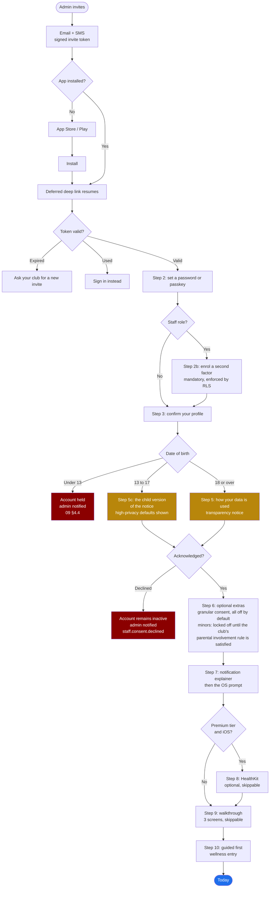

# Screen: Onboarding

> **Layout status**: provisional. Awaiting client design photographs.

Screen 33 in `02-information-architecture.md` §5. All roles. A sequence of screens inside the
`(auth)` route group, not a single screen.

Every layout decision below that would normally come from the client's designs is marked
**[Assumed, pending photographs]**. Nothing marked that way is settled.

---

## Purpose

Onboarding turns an invite into an active account, and it is the only point in the product where
Fydr tells an athlete what is being collected about them, who can see it, and what they can do
about it. That makes it the highest-stakes sequence in the app for two independent reasons.

Commercially: `00-product-overview.md` success criterion 1 requires a squad of 40 to be
onboarded in under 30 minutes, which is roughly 45 seconds of admin time per athlete plus
whatever the athlete does on their own phone. Every step that loses athletes here loses them
permanently, because a club will not chase the same person three times.

Legally: this is special category health data under UK GDPR
(`09-security-and-compliance.md` §3). The transparency screen in step 5 is the document the club
relies on to show it told the athlete what it was doing. It is not a checkbox in a wall of text,
and it is not a consent screen, for reasons set out below that materially change what it says
and how it behaves.

Target: **under 4 minutes** from tapping the invite to landing on Today, including the guided
first wellness entry.

---

## Roles and access

Onboarding is the one sequence every role passes through. The path branches.

| Step | Athlete | Coach / S&C | Medical | Admin |
|---|:--:|:--:|:--:|:--:|
| 1 Invite | Yes | Yes | Yes | Yes |
| 2 Credentials | Yes | Yes | Yes | Yes |
| 2b Multi-factor enrolment | Optional | **Mandatory** | **Mandatory** | **Mandatory** |
| 3 Profile confirmation | Yes, full | Name and contact only | Name and contact only | Name and contact only |
| 4 Age branch | Yes | No | No | No |
| 5 Transparency notice | Yes, athlete version, **or the child version if under 18** | Yes, staff version | Yes, staff version plus the clinical handling summary | Yes, staff version plus the controller summary |
| 6 Optional consents | Yes, **all locked off for a minor until the club's parental involvement rule is satisfied** | No | No | No |
| 7 Notification permission | Yes | Yes | Yes | Yes |
| 8 HealthKit | Premium tier, iOS only | No | No | No |
| 9 Walkthrough | Yes, 3 screens | Yes, 3 screens (staff web) | Yes | Yes |
| 10 Guided first wellness entry | Yes | No | No | No |

Staff multi-factor enrolment is mandatory and is enforced at the database, not in the UI: a
staff user who has not completed a second factor authenticates successfully but every staff-scope
RLS policy returns zero rows because `auth_is_aal2()` is false
(`09-security-and-compliance.md` §8.1). Onboarding therefore cannot be skipped past for staff;
skipping it produces an account that can log in and see nothing, and the screen says so.

---

## Entry points

| Entry point | Context | Behaviour |
|---|---|---|
| Email invite link | Signed token in the URL | Universal link. Opens the app if installed, otherwise the App Store or Play with the token preserved. |
| SMS invite link | Same token | Same. SMS exists because club email addresses at this tier are frequently wrong or unread. |
| App Store install after tapping an invite | Deferred deep link | Resumes at the step the token resolves to |
| App opened with an invite already redeemed | Token | Lands on sign-in with the email pre-filled, and the message "This invite has already been used. Sign in instead." |
| Expired token | Token | "This invite has expired. Ask your club to send another." with a "Request a new invite" action that notifies the inviting admin |
| Re-authentication after a role change forced sign-out | none | Sign-in only, not onboarding. Profile, notice acknowledgement, and consents are already recorded. |
| A new notice version is published | Push `athlete.consent.required`, P1 | Lands on step 5 only, as a blocking interstitial over the app. Nothing else in onboarding repeats. |
| Admin re-invites a user whose account is inactive | New token | Resumes at the step they stopped on |

---

## The sequence



### Divergence from `03-flows.md` §2, stated explicitly

`03-flows.md` §2 draws step 5 as a **consent** screen with a consent/decline branch.
`09-security-and-compliance.md` §3 concludes that consent is the wrong lawful basis for the core
monitoring, because an athlete cannot refuse it without perceived consequence to selection, and
consent that is not freely given is invalid from the moment it is given.

**The specification here follows the security document.** Step 5 is a transparency and
acknowledgement screen. The behavioural branch from `03-flows.md` is preserved (an athlete who
will not proceed gets an inactive account and the admin is told), because that is the right
product behaviour whatever the lawful basis is: a club must find out that an athlete has a
problem with the monitoring, and it must find out from the system rather than from silence.

`03-flows.md` §2 should be amended in the same commit as this file, per `CLAUDE.md` §5.

---

## Layout

### Web

Staff onboarding runs on the web dashboard as well as on mobile, because a coach invited on a
Tuesday afternoon will open the email on a laptop. The sequence is identical; the layout is a
560 px centred column on `surface.canvas` with the same step indicator. Athlete onboarding is
mobile only, and an athlete who opens the invite on a laptop gets a page explaining that Fydr
for athletes is an app, with store links and a "send this link to my phone" action.

### Shared chrome

**[Assumed, pending photographs]** Step indicator style, illustration policy, and the position of
the skip affordance are recommendations.

```
┌──────────────────────────────────────────────┐
│ ‹                                    Step 3/7│ A  Header, 56 pt
│ ▓▓▓▓▓▓▓▓▓▓▓▓░░░░░░░░░░░░░░░░                 │ B  Progress, 2 pt
├──────────────────────────────────────────────┤
│                                              │
│  Confirm your details                        │ C  Title, display
│  Your club added these. Change anything       │ D  Body, bodyCompact
│  that is wrong.                              │
│                                              │
│  ...step content...                          │ E  Content
│                                              │
├──────────────────────────────────────────────┤
│  Skip for now                                │ F  Secondary, where allowed
│ ┌──────────────────────────────────────────┐ │ G  Primary, pinned, 76 pt
│ │                Continue                  │ │
│ └──────────────────────────────────────────┘ │
└──────────────────────────────────────────────┘
```

Rules for every step:

1. One decision per screen. Steps that combine two decisions get split.
2. The primary action is bottom-pinned and full width minus insets.
3. Back is available on every step except the transparency notice and the credential step, and it
   never loses entered data.
4. Progress is shown as a step count and a bar. The count reflects the branch actually being
   taken, so an athlete on the Club tier never sees "step 6 of 9" and then skips two.
5. No step blocks on the network except credential creation and the notice acknowledgement, both
   of which must be recorded server-side before proceeding.

### Step 1: Invite

Not a screen in the app. Delivered as email and SMS. The link carries a signed, single-use token.

| Property | Value |
|---|---|
| Token | Opaque, 32 bytes, base64url, stored hashed |
| Lifetime | 14 days |
| Uses | One. Redemption is atomic. |
| Contents | `invite_id` only. No email, no org name, no role in the URL. |
| Resolution | The app exchanges the token for the invite's display fields over HTTPS before rendering anything |
| Rate limit | 5 resolution attempts per token, 20 per IP per hour |
| Enumeration | An invalid, expired, and already-used token produce three distinct messages, deliberately, because these are one-time tokens the recipient possesses rather than user identifiers. An unknown **email** at sign-in produces one generic message. |

### Step 2: Credentials

```
  Set your password
  You will use this with dan.reilly@ashfieldrfc.co.uk

  ┌────────────────────────────────────────┐
  │ ••••••••••••••                     👁  │   12 characters minimum
  └────────────────────────────────────────┘
  ▓▓▓▓▓▓▓▓▓▓░░░░  Long enough

  ☐ Use Face ID next time                     biometric app lock

  [ Use a passkey instead ]

  ┌────────────────────────────────────────┐
  │              Continue                  │
  └────────────────────────────────────────┘
```

| Rule | Value | Source |
|---|---|---|
| Minimum length | 12 characters | `09-security-and-compliance.md` §8.1, NCSC guidance |
| Composition rules | **None** | Forced symbols produce `Password1!` and a sticky note |
| Breached password check | On, k-anonymity range API | Credential stuffing is the realistic attack |
| Strength meter | Length-based only, three states: too short, long enough, strong | A meter that demands symbols contradicts the rule above |
| Passkey | Offered, not required | Platform authenticator via `expo-passkeys` or the WebAuthn flow on web |
| Biometric app lock | Offered here, stored as a local preference | Not a second factor. It locks the app, it does not gate the session. |
| Show password | Eye toggle, defaults hidden | An athlete typing on a phone in a car park needs it |
| Email | Displayed, not editable | Changing the address at redemption would let a forwarded invite be redirected |

### Step 2b: Multi-factor enrolment, staff only

TOTP through Supabase Auth's factor API, producing `aal2`. QR code plus a manual key, six-digit
verification, and ten single-use recovery codes presented once with a copy action and an explicit
"I have saved these" confirmation.

Copy is direct about the consequence, because a staff member who skips this will otherwise
conclude the product is broken:

> **You need a second step to sign in.**
> Coaching and medical accounts see the whole squad's data, including health information.
> Without this, you can sign in but you will not be able to see any athlete data.

There is no skip affordance. The only exit is back to sign-out.

### Step 3: Profile confirmation

Pre-filled from the `athletes` row the admin created. The athlete confirms or corrects.

| Field | Editable | Notes |
|---|---|---|
| First name, last name | Yes | Pre-filled |
| Preferred name | Yes | **New column, `athletes.preferred_name`.** Clubs enter formal names; athletes are called something else. Used everywhere the athlete's own name is displayed to them. |
| Date of birth | Yes, once | **Required, and the invite could not have been sent without one** (`04-data-model.md` §17.16). Pre-filled from what the club entered. Drives the age branch. After onboarding it becomes staff-editable only. |
| Position | Yes | Free text, seeded from the sport's positions |
| Squad number | No | Club-owned |
| Height | Yes | Optional. cm. |
| Dominant side | Yes | Optional |
| Mobile number | Yes | Optional. Used for invite resend and nothing else in v1. |
| Photograph | Depends | Gated by the organisation setting in `06-design-system.md` O-36. Where photographs are off, the field is absent. |

### Step 4: Age branch

**Changed 5 August 2026.** This step used to be a gate that blocked anyone under 16. Under-18s are
now in scope (`09-security-and-compliance.md` §4), so it is a branch, not a gate, and the minor
path is a main path rather than an exception. It is never a visible screen in its own right. It
runs on the date of birth confirmed in step 3, computed against the organisation's timezone, and
it decides three things: which notice is shown at step 5, which defaults are preset at step 6, and
whether the account can be created at all.

| Age at onboarding | Notice shown | Optional extras | Account |
|---|---|---|---|
| **Under 13** | None | None | **Blocked.** See below |
| **13 to 17** | Step 5c, the child version | Present, **all off, and locked until the club's parental involvement rule is satisfied where the club sets one** | Created |
| **18 and over** | Step 5, the adult version | Present, all off | Created |

**Under 13.** `09-security-and-compliance.md` §4.4 puts under-13s out of scope contractually, so
this state should be unreachable: the invite function rejects an under-13 date of birth before an
invite is sent. It is specified anyway because the athlete can correct a wrong date of birth at
step 3, and a club that entered 2015 as 2005 will find out here.

> **We cannot set up your account yet.**
> Fydr is for athletes aged 13 and over. Your club has been told, and they will be in touch.
> Nothing you have typed has been saved.

`users.status` stays `invited`, `athletes.activation_blocked_reason` is set to `under_13`, the
admin gets an in-app and email notification, and the profile fields entered in step 3 are
discarded rather than retained. That last part matters: holding a 12 year old's data because they
tapped an invite is the failure the rule exists to prevent.

**Minority is derived, never stored.** The client computes it for display from
`athletes.date_of_birth` and the server computes it from `athlete_is_minor()`
(`04-data-model.md` §17.16). No `is_minor` boolean exists to go stale at midnight on a birthday.

**Crossing 18 during a season** changes defaults going forward only, and it changes nothing on its
own. The athlete is told once, in the Me tab: "You are 18 now. You can turn on leaderboards and
other optional extras if you want to. Nothing has changed unless you change it." Adult defaults
are not silently applied to an account that was set up as a child's. `[medium, this is a product
judgement, the Code does not require the notice, and telling someone their protections have
relaxed without asking them would be worse]`

### Step 5: The transparency notice

This is the legally significant screen. It is specified in more detail than any other step
because it is the artefact the club relies on.

```
┌──────────────────────────────────────────────┐
│                                    Step 5/7  │
├──────────────────────────────────────────────┤
│  How Ashfield RFC uses your data              │
│                                              │
│  ── What is collected ──────────────────     │
│  ♥  How you feel each morning: sleep,        │
│     fatigue, soreness, stress, mood          │
│  🏋 What you lift, and how hard sessions     │
│     felt                                      │
│  🍽 What you eat and drink, if your club      │
│     asks for it                               │
│  🩹 Injuries, availability, and your rehab    │
│     plan                                      │
│  📏 Test results and body measurements        │
│                                              │
│  ── Who can see it ─────────────────────     │
│  Your coaches and S&C staff see everything    │
│  above except your physio's clinical notes.   │
│  Your physio sees everything, including       │
│  clinical notes.                              │
│  Club administrators see whether you are      │
│  submitting, not what you submitted.          │
│  No one at another club can ever see it.      │
│  Fydr never sells it or uses it for anything  │
│  except running this service.                 │
│                                              │
│  ── Why the club is allowed to ─────────     │
│  Ashfield RFC has a legitimate interest in    │
│  managing training load and keeping you       │
│  safe, and a legal basis for handling health  │
│  information for occupational health          │
│  purposes.                                    │
│  Ashfield RFC decides what is collected.      │
│  Fydr stores it for them.                     │
│                                              │
│  ── How long it is kept ────────────────     │
│  Training and wellness data: this season      │
│  and three more.                              │
│  Injury records: 8 years.                     │
│                                              │
│  ── What you can do ────────────────────     │
│  Download everything held about you, any      │
│  time, from the Me tab.                       │
│  Ask for anything wrong to be corrected.      │
│  Ask for your data to be deleted when you     │
│  leave. Some injury records are kept.         │
│  Object to any part of it, and the club       │
│  must consider it.                            │
│  Complain to the ICO at ico.org.uk.           │
│                                              │
│  Contact: dpo@ashfieldrfc.co.uk               │
│  [ Read the full privacy notice ]             │
│                                              │
├──────────────────────────────────────────────┤
│  I do not agree to this                       │
│ ┌──────────────────────────────────────────┐ │
│ │        I have read and understood        │ │
│ └──────────────────────────────────────────┘ │
└──────────────────────────────────────────────┘
```

Binding rules for this screen:

1. **It is scrollable and the primary action is enabled from the start.** A forced scroll-to-end
   is a dark pattern in reverse: it produces a record that the athlete scrolled, not that they
   read, and it teaches them to scroll fast. What is recorded is that the notice was shown, which
   version, and when.
2. **It is written in plain English at roughly a reading age of 12.** No "data subject", no
   "processing", no "controller" except where naming the club as the one that decides. The
   sample copy above is the standard of plainness required, not a placeholder.
3. **It is club-specific.** Organisation name, contact address, and any club-configured
   variations are substituted. A notice that says "your organisation" is not a notice.
4. **It is versioned.** `notice_versions` holds the text, the version string, and the publication
   date. The acknowledgement records the version. Publishing a new version triggers
   `athlete.consent.required` (P1, cannot be disabled) and the notice appears as a blocking
   interstitial on next open.
5. **Its full text is retrievable** from the Me tab at any time, with the version and date the
   athlete acknowledged, and the current version if it has changed.
6. **It never asks for consent to the core monitoring**, because consent is not the basis and
   asking for it would create a right of withdrawal the club cannot honour
   (`09-security-and-compliance.md` §3). The button says "I have read and understood", not
   "I agree" or "I consent".
7. **The decline path is real.** "I do not agree to this" is not hidden, not greyed, and not
   phrased to shame. It presents a confirmation explaining what happens:

   > **Your account will stay inactive.**
   > Nothing will be collected. Ashfield RFC will be told that you have concerns so they can talk
   > to you. You can come back to this at any time from your invite link.
   > [ Go back ] [ Yes, tell the club ]

   On confirmation: `users.status` stays `invited`, `athletes.notice_declined_at` is set,
   `staff.consent.declined` fires to admins in-app and by email
   (`08-notifications.md` §2), and the app returns to a holding screen with a "Read it again"
   action. **No entry screens become reachable and no data is collected.**
8. **Acknowledgement is recorded server-side before proceeding.** It is not a local flag. If the
   write fails the athlete stays on this screen with a retry, because an unrecorded
   acknowledgement is the one thing in onboarding that cannot be reconstructed later.
9. **Every acknowledgement and every decline is written to `audit_log`**
   (`09-security-and-compliance.md` §8.5, mandatory events).

### Step 5c: The child version of the notice, under 18

Shown instead of step 5, never as well as it. Same legal function, same versioning, same
acknowledgement record, same decline path, different words. It exists because standard 4 of the
Children's Code requires privacy information a child can actually understand, presented at the
point of collection rather than behind a link (`09-security-and-compliance.md` §4.4).

Written for a 13 year old to read once and be able to answer "who sees my soreness score". Short
sentences, second person, no defined terms, no "processing", no "data subject", no "legitimate
interests". It is longer on the screen than the adult version because it is broken up more, and
it is fewer words.

**The copy. This is the text, not a description of it.** Club name, contact and retention
periods are substituted per organisation exactly as in step 5.

```
┌──────────────────────────────────────────────┐
│                                    Step 5/7  │
├──────────────────────────────────────────────┤
│  Your data at Ashfield RFC                    │
│                                              │
│  This app helps your coaches keep you fit    │
│  and safe. To do that, it keeps information  │
│  about you. Here is exactly what, and who    │
│  can see it.                                 │
│                                              │
│  ── What the app keeps ─────────────────     │
│  · How you feel each morning: your sleep,    │
│    how tired and sore you are, your stress   │
│    and your mood                             │
│  · How hard your sessions felt               │
│  · What you lift in the gym                  │
│  · Injuries, whether you can train, and      │
│    your plan for getting back                │
│  · Test results, like a jump or a sprint     │
│  · If your club uses GPS trackers, how far   │
│    and how fast you ran in a session         │
│                                              │
│  ── Who can see it ─────────────────────     │
│  Your coaches see all of it, except your     │
│  physio's notes.                             │
│  Your physio sees all of it, including       │
│  their notes.                                │
│  Club office staff can see whether you       │
│  filled things in. They cannot see your      │
│  answers.                                    │
│  Nobody at another club can ever see any     │
│  of it.                                      │
│  Your teammates see nothing, unless you      │
│  choose to join a leaderboard.               │
│                                              │
│  ── About your parents or carers ───────     │
│  They do not get a login and they cannot     │
│  see this app.                               │
│  If they want to know something, they ask    │
│  the club, and the club decides. We will     │
│  always tell you here if that changes.       │
│  [ Your club asks a parent or carer to say   │
│    yes before you turn on extras. ]          │
│                                              │
│  ── About alerts ───────────────────────     │
│  The app watches for big changes, like       │
│  being much more tired than usual, and       │
│  tells a coach.                              │
│  It is only a heads up. A person always      │
│  decides what happens next, never the app.   │
│  It is there to stop you getting injured.    │
│  It is not there to decide who gets picked,  │
│  and your club has promised not to use it    │
│  that way.                                   │
│                                              │
│  ── What you get to choose ─────────────     │
│  Leaderboards are off. Your name and score   │
│  are not shown to anyone unless you turn     │
│  them on.                                    │
│  Your photo is off.                          │
│  Sharing from your watch or phone health     │
│  app is off.                                 │
│  You can turn any of these on later, and     │
│  off again whenever you want.                │
│                                              │
│  ── How long it is kept ────────────────     │
│  Training and how you feel: this season      │
│  and three more.                             │
│  Injury records: 8 years, because that is    │
│  what the rules say for health records.      │
│                                              │
│  ── What you can do ────────────────────     │
│  See everything the app holds about you,     │
│  any time, in the Me tab.                    │
│  Get a copy of it to keep.                   │
│  Tell us if something is wrong and get it    │
│  fixed.                                      │
│  Say you are not happy with part of it. We   │
│  have to listen and the club has to reply.   │
│  Ask for it to be deleted when you leave.    │
│  Some injury records have to be kept.        │
│                                              │
│  If you are worried about any of this, talk  │
│  to someone at the club, or email            │
│  dpo@ashfieldrfc.co.uk.                      │
│  You can also tell the people whose job it   │
│  is to check on this, at ico.org.uk.         │
│                                              │
│  [ Read the longer version ]                 │
│                                              │
├──────────────────────────────────────────────┤
│  I am not happy with this                     │
│ ┌──────────────────────────────────────────┐ │
│ │           I have read this                │ │
│ └──────────────────────────────────────────┘ │
└──────────────────────────────────────────────┘
```

Binding rules specific to this version. Rules 1 to 9 of step 5 apply unchanged in addition.

1. **The parent or carer line is conditional.** The bracketed sentence appears only where the
   organisation has parental involvement switched on. Where it is off, the paragraph says the
   first two sentences and stops. A notice that describes a rule the club does not have is a
   notice the child will learn to ignore.
2. **The alerts paragraph is not optional and is not softened.** It is how standard 5 and standard
   12 are met in front of the child (`09-security-and-compliance.md` §4.5). If the club will not
   accept the "not there to decide who gets picked" promise, the club cannot have minors on the
   platform, and that is a sales conversation rather than a copy change.
3. **The defaults paragraph states facts, not offers.** "Leaderboards are off" is a statement.
   Rewriting it as "You could join a leaderboard" is a nudge and is prohibited by standard 13.
4. **The decline wording is softer and the outcome is the same.** "I am not happy with this" leads
   to the same confirmation sheet as step 5, worded for a child:

   > **Nothing will be saved yet.**
   > We will tell Ashfield RFC that you want to talk about this first. Your account will wait
   > until then. You can come back to this whenever you like.
   > [ Go back ] [ Yes, tell the club ]

5. **The reading level is a requirement, not a target.** The test before it ships: read it aloud
   to a 13 year old and ask them who sees their soreness score and what happens when the app
   raises an alert. If they cannot answer both, it fails. `[high on the requirement, medium on
   whether this copy passes, it has not been tested on an actual child]`
6. **It is a separate `notice_versions` row**, with `audience = 'athlete_child'`, versioned and
   acknowledged separately from the adult text. An athlete who turns 18 is not re-served the adult
   notice, because they were told the same facts in simpler words and re-serving it would be a
   change of nothing dressed as a change of something.
7. **It needs the same solicitor review as the adult notice** (O-319 and O-964). Plain words do
   not reduce the legal weight of the artefact.

### Step 6: Optional extras

The genuinely consent-based processing, separated from the notice because these are the things an
athlete can decline at no cost (`09-security-and-compliance.md` §3). **All default to off.**

```
  A few optional extras

  Leaderboards                              ○ off
  Your name and result appear on club
  leaderboards your coaches publish.
  Teammates see them.

  Health app sync (iPhone)                  ○ off
  Fydr reads sleep, resting heart rate and
  workouts from Apple Health. It never
  writes anything to Apple Health.

  You can change any of these later in the
  Me tab, and turning one off stops future
  collection straight away.

  [                Continue               ]
```

Rules:

1. **Off by default, always.** High-privacy defaults are a Children's Code standard and a
   data-minimisation obligation, and they are also just correct: an athlete who wants a
   leaderboard will turn it on.
2. **Each toggle is a separate `athlete_consents` row**, with its own purpose, version, grant
   timestamp, and withdrawal timestamp. They are never bundled.
3. **Withdrawal is as easy as granting**, in the Me tab, with no confirmation friction and
   immediate effect, and the UI states in one sentence that withdrawal is prospective.
4. **The screen is skippable in full.** "Continue" with everything off is the expected outcome.
5. **The HealthKit toggle here only records consent.** The OS permission sheet is step 8, and
   consent without permission produces no data, which the status screen explains honestly.
6. **No toggle is emphasised, recommended, pre-ticked, or shown as an opportunity being missed.**
   Standard 13 of the Children's Code prohibits nudging a child towards weaker privacy settings,
   and the same restraint applies to adults here because a differently-worded screen per age would
   be worse than one neutral screen (`09-security-and-compliance.md` §4.6).
7. **A declined optional consent is never re-asked for a minor.** No re-prompt, no reminder, no
   "you can still turn this on" banner. It stays available in the Me tab and the athlete goes to
   it or does not.

**For an athlete under 18, this screen changes.** The toggles are present, off, and disabled,
with the reason stated, where the organisation has parental involvement switched on:

```
  A few optional extras

  Your club asks a parent or carer to say
  yes before you turn these on. They have
  been sent a form. Once it comes back, you
  can turn any of these on in the Me tab.

  Leaderboards                        ○ off
  Your name and result would appear on
  club leaderboards. Teammates would see
  them.

  Health app sync (iPhone)            ○ off
  Fydr would read sleep, resting heart rate
  and workouts from Apple Health. It never
  writes anything to Apple Health.

  Nothing here is needed to use Fydr.

  [                Continue               ]
```

Rules for the minor variant:

1. **Parental involvement is an organisation setting, not a per-athlete one**
   (`screens/settings.md`, `children.parental_involvement_required`, default **on**). Where it is
   off, the minor sees the ordinary step 6 screen with the toggles enabled and still off.
2. **It is a club process, not a login.** The club sends and collects whatever form it uses. An
   admin records the outcome against the athlete, which unlocks the toggles. There is no parent
   account, and `09-security-and-compliance.md` §4.7 explains why not.
3. **The athlete is told it is happening**, in the words above. Standard 11 requires that a child
   knows when an adult is involved in their account. Unlocking must never be silent.
4. **Nothing is gated behind it except the optional extras.** Core use of Fydr does not wait on a
   parent, because the core monitoring is not consent-based and stalling a child's account on a
   form nobody returned would punish the child for an adult's inaction.
5. **Photographs are absent for a minor**, not off. The field is not rendered at all
   (`09-security-and-compliance.md` §4.6).

### Step 7: Notification permission

An explainer screen before the OS prompt, never the prompt on cold start. iOS never re-prompts,
so a denial here is permanent until the athlete goes to Settings
(`08-notifications.md` §8.1, §8.5).

```
  One reminder a day

  Fydr sends a reminder each morning when
  your wellness entry opens, and one after
  a session to rate how hard it was.

  Three a day at most. You can pause them
  whenever you like.

  Two things always come through, because
  they change what you are allowed to do:
  your availability being changed, and a
  change to this notice.

  [ Not now ]
  [           Turn on reminders            ]
```

"Not now" proceeds without prompting the OS at all. Asking and being denied is worse than not
asking, because the denial is sticky. An athlete who chooses "Not now" gets a single reminder on
the Today tab at most once every 14 days.

### Step 8: HealthKit, Premium tier and iOS only

Skipped entirely on Android, on the Club tier, on iPad, and where
`HKHealthStore.isHealthDataAvailable()` is false (`07-integrations.md` §4.2). Skipped where the
step 6 toggle was left off, with the toggle reachable from the Me tab afterwards.

Explainer, then `requestAuthorization` read-only, then the probe query:

```
  Connect Apple Health

  Fydr reads:
   · Sleep
   · Resting heart rate
   · Heart rate variability
   · Steps and active energy
   · Workouts
   · Body mass

  Fydr never writes anything to Apple Health.

  You choose what to share on the next
  screen, and you can change it in the
  Health app at any time.

  [ Skip ]
  [             Continue                   ]
```

**iOS does not report whether a read permission was denied** (`07-integrations.md` §4.3). The
callback returns success regardless. Therefore:

1. Never show "connected" after the callback. Show "Checking".
2. Run a probe query over the last 7 days per type.
3. Report per metric: "Receiving" with the last sample date, or "No data received" with a "Check
   Health settings" link.
4. A metric with no samples is `unknown_no_data`, never "denied". The athlete may simply not own
   an Apple Watch, and the UI must not accuse them.
5. Background delivery is enabled regardless of the probe result, because data may start
   arriving later.

### Step 9: Walkthrough

Three screens, skippable from the first, with a persistent "Skip" in the header. Content:

| Screen | Message |
|---|---|
| 1 | "Today shows what you owe." One screenshot of the Today tab with the To do section highlighted. |
| 2 | "45 seconds each morning." One screenshot of the wellness sliders, with the direction rule stated: 5 is the best you can feel. |
| 3 | "It works without signal." One line about entries saving locally and syncing later. |

No account creation upsell, no feature tour of staff screens, no video. Three screens is the
maximum that gets read.

### Step 10: Guided first wellness entry

The last step, and the one that determines whether the athlete ever submits a second one.

The real wellness entry screen, with a coach-mark overlay:

1. The direction rule is emphasised once, over the first slider: "5 is always the best you can
   feel, even for soreness."
2. The first slider is highlighted. Once touched, the overlay is dismissed and the rest of the
   form behaves normally.
3. The submit bar's remaining count is explained on first appearance.
4. The entry submitted is a **real entry** for today, not a practice one. It is written, synced,
   and counted. A fake first entry would teach the athlete that the app has a practice mode.
5. If today's entry already exists, or no wellness expectation exists today (a rest day, or an
   athlete onboarded at 21:00), this step is replaced by a short screen: "You are set up. Your
   first wellness entry opens at 07:00 tomorrow." followed by Today.
6. It is skippable. "Skip for now" lands on Today with the wellness row outstanding.

---

## Components

| Component | Source | Purpose here |
|---|---|---|
| `EmptyState` | `06-design-system.md` §6.16 | Expired invite, declined holding screen, under-13 block, offline |
| `ConfirmSheet` | §6.18 | Decline confirmation, "I have saved my recovery codes" |
| `BottomSheet` | §6.19 | Full privacy notice, recovery codes, HealthKit per-metric status |
| `NumberStepper`, `SliderInput` | §6.11, §6.10 | Inside step 10, which is the real wellness form |
| `SyncStatusIndicator` | §6.17 | Step 10 only, on the confirmation |
| `AvailabilityPill`, `MetricTile`, `SessionCard` | n/a | Not used. Onboarding shows no athlete data because there is none yet. |

Screen-local compositions in `apps/mobile/src/features/onboarding/`:

| Composition | Purpose |
|---|---|
| `OnboardingShell` | Header, progress, pinned actions, back handling, branch-aware step numbering |
| `InviteResolver` | Token exchange, error states, deferred deep link handling |
| `CredentialForm` | Password, strength, breached check, passkey, biometric preference |
| `MfaEnrolment` | TOTP QR, verification, recovery codes |
| `NoticeScreen` | The versioned transparency notice and its acknowledgement |
| `ConsentToggles` | The granular consents |
| `PermissionExplainer` | Shared pattern for notifications and HealthKit |
| `Walkthrough` | Three-screen pager |
| `GuidedEntry` | Coach-mark overlay over the wellness form |

---

## Data requirements

### Schema

Three additions and one rename. Per `CLAUDE.md` §5 these land in `04-data-model.md` with the
migration.

```sql
-- 1. Rename, per 09-security-and-compliance.md §3 and its O-951.
--    The athlete relationship is not consent-based, and the column names must not imply it is.
alter table athletes rename column consent_given_at to notice_acknowledged_at;
alter table athletes rename column consent_version  to notice_version;
alter table athletes add column notice_declined_at timestamptz;
alter table athletes add column preferred_name text;

-- 1b. Children's Code. Full specification, including the constraints and the
--     athlete_is_minor() function, is 04-data-model.md §17.16.
alter table athletes add column activation_blocked_reason text;   -- 'under_13', etc
alter table athletes add column parental_consent_recorded_at timestamptz;
alter table athletes add column parental_consent_recorded_by uuid references users(id);

-- 2. Versioned notice text, so an acknowledgement can be tied to what was actually shown.
create table notice_versions (
  id            uuid primary key default gen_random_uuid(),
  org_id        uuid references organisations(id),   -- null = platform default text
  audience      notice_audience not null,            -- athlete | athlete_child | staff
  version       text not null,                       -- '2026.1'
  body          text not null,                       -- markdown, plain English
  full_notice_url text,
  published_at  timestamptz not null default now(),
  created_by    uuid references users(id),
  unique (org_id, audience, version)
);

-- 3. Granular, revocable consents for the genuinely optional processing only.
create type consent_purpose as enum
  ('healthkit_sync','leaderboard_visibility');
-- 'nutrition_photo' was specified here and has been removed before first migration.
-- Athletes do not log nutrition and no meal photograph is ever captured, so there is
-- no optional processing to consent to. See docs/screens/nutrition-guidance.md.

create table athlete_consents (
  id            uuid primary key default gen_random_uuid(),
  org_id        uuid not null references organisations(id),
  athlete_id    uuid not null references athletes(id) on delete cascade,
  purpose       consent_purpose not null,
  granted_at    timestamptz,
  withdrawn_at  timestamptz,
  notice_version text not null,
  created_at    timestamptz not null default now(),
  unique (athlete_id, purpose)
);

-- 4. Invites.
create table invites (
  id            uuid primary key default gen_random_uuid(),
  org_id        uuid not null references organisations(id),
  email         citext not null,
  phone         text,
  roles         app_role[] not null,
  athlete_id    uuid references athletes(id),
  token_hash    text not null unique,
  expires_at    timestamptz not null,
  redeemed_at   timestamptz,
  redeemed_by   uuid references users(id),
  revoked_at    timestamptz,
  attempts      int not null default 0,
  invited_by    uuid not null references users(id),
  created_at    timestamptz not null default now()
);
create index on invites (org_id, email) where redeemed_at is null and revoked_at is null;
```

`athlete_consents` is a current-state table with a withdrawal timestamp rather than an event log,
because withdrawal is prospective and only the current state governs collection. Every grant and
withdrawal is additionally written to `audit_log`, which is where the history lives
(`09-security-and-compliance.md` §8.5).

### Server contracts

Onboarding writes go through Edge Functions, not PostgREST, because the caller is
unauthenticated or partly authenticated at several points and each write has an authorisation
rule that is not expressible as RLS on the caller's own row.

| Function | Auth | Purpose |
|---|---|---|
| `invite-resolve` | Anonymous, token | Exchanges a token for `{ orgName, displayName, email, roles, athleteId, expiresAt }`. Never returns anything else. Rate limited. |
| `invite-redeem` | Anonymous, token plus credentials | Atomically creates the auth user, links `users` and `athletes`, marks the invite redeemed, and issues a session. Uses `service_role` with explicit `org_id` scoping and a comment naming the check it performs in place of RLS (`05-architecture.md` §5). |
| `notice-acknowledge` | Authenticated | Writes `notice_acknowledged_at`, `notice_version`, and the audit row. Returns the activated user status. |
| `notice-decline` | Authenticated | Writes `notice_declined_at`, keeps `users.status = 'invited'`, enqueues `staff.consent.declined`, writes the audit row. |
| `consent-set` | Authenticated | Sets or withdraws one `athlete_consents` row and writes the audit row. One purpose per call. |

```ts
// packages/validation/onboarding.ts
export const RedeemInviteRequest = z.object({
  token:    z.string().min(32),
  password: z.string().min(12).max(200).optional(),   // absent when a passkey is used
  passkey:  PasskeyAttestation.optional(),
}).refine((v) => !!v.password !== !!v.passkey, 'exactly one credential');

export const ProfileConfirmation = z.object({
  first_name:     z.string().trim().min(1).max(80),
  last_name:      z.string().trim().min(1).max(80),
  preferred_name: z.string().trim().max(80).nullable().optional(),
  date_of_birth:  z.string().date(),                   // required, never nullable, drives step 4
  position:       z.string().trim().max(60).nullable().optional(),
  height_cm:      z.number().min(120).max(230).nullable().optional(),
  dominant_side:  z.enum(['left','right','both']).nullable().optional(),
  phone:          z.string().trim().max(32).nullable().optional(),
});

export const NoticeAcknowledgement = z.object({
  notice_version: z.string().min(1),
  audience:       z.enum(['athlete','athlete_child','staff']),
});
```

**The account is not active until the notice is acknowledged.** `users.status` moves from
`invited` to `active` inside `notice-acknowledge`, not inside `invite-redeem`. Until then the
custom access token hook issues claims with a role set that reaches no data
(`05-architecture.md` §5), so an athlete who abandons at step 4 has an account that exists and
sees nothing.

### Reads

| What | Source | Step |
|---|---|---|
| Invite display fields | `invite-resolve` | 1 |
| Org name, timezone, tier | `organisations` via the invite response | throughout |
| Athlete pre-fill | `athletes` row created by the admin | 3 |
| Notice body | `notice_versions` where `org_id` matches, else the platform default, latest `published_at` for the audience | 5 |
| Existing consents | `athlete_consents` | 6, and on every later open |
| HealthKit availability | `HKHealthStore.isHealthDataAvailable()` | 8 |
| Today's wellness expectation | `compliance_expectations` | 10 |

---

## States

| State | Where | Behaviour |
|---|---|---|
| Resolving an invite | Step 1 | Full-screen spinner with the club name once known. This is the one place a spinner is correct, because nothing can be rendered until the token resolves. |
| Invalid token | Step 1 | "This link is not valid. Ask your club to send a new invite." with a "Request a new invite" action |
| Expired token | Step 1 | "This invite has expired." Same action. |
| Already redeemed | Step 1 | "This invite has already been used. Sign in instead." with the email pre-filled |
| Revoked | Step 1 | Same message as invalid. A revoked invite must not confirm that it once existed. |
| Offline at any step | all | Steps 3, 6, 9 work offline and their writes queue. Steps 1, 2, 2b, 5 require connectivity and say so plainly: "You need a connection for this step. Your details are saved." |
| Resuming | any | The app records the furthest completed step locally and in `users`. Reopening resumes there, with everything already entered pre-filled. |
| Declined | after step 5 | Holding screen: "Your account is inactive. Ashfield RFC has been told. [Read the notice again]" No tabs, no data, no entry screens. |
| Under 13 | after step 4 | Holding screen as specified in step 4. Profile fields discarded, not retained |
| Minor, awaiting parental involvement | after step 6 | Full use of Fydr. Optional extras disabled with the reason shown, in step 6 and in the Me tab. Never a blocking screen |
| Staff without MFA | after step 2b | Cannot proceed. Sign-out is the only exit. |
| New notice version | post-onboarding | Blocking interstitial over whatever screen the user opened, showing only step 5. Declining from here does not delete anything; it sets `notice_declined_at`, deactivates the account, and notifies the admin. |
| Error writing acknowledgement | Step 5 | Stays on the screen with "Could not save that. Try again." and a retry. Never proceeds optimistically. |
| Error redeeming | Step 2 | "Could not finish setting up your account. Try again." with a correlation id behind "Details". The invite is not consumed on a failed redemption. |

---

## Interactions

| Gesture | Target | Result |
|---|---|---|
| Tap | Invite link | Opens the app, or the store with the token preserved |
| Tap | "Continue" | Advances. Disabled where the step's requirements are unmet, with the reason in the label. |
| Tap | Back chevron | Returns one step, preserving input. Absent on steps 2 and 5. |
| Tap | "Skip for now" | Present on steps 6, 7, 8, 9, 10 only. Never on 2, 2b, 3, 5. |
| Tap | Eye toggle | Reveals the password while held, hides on release |
| Tap | "Use a passkey instead" | Switches the credential method. The password field is cleared. |
| Tap | "Read the full privacy notice" | Presents the full text in a sheet with a share action, so an athlete can send it to a parent or a representative |
| Tap | "I have read and understood" | Writes the acknowledgement, then advances. The button shows an in-button spinner while writing, which is correct here: this write must complete. |
| Tap | "I do not agree to this" | Presents the decline confirmation. Cancel is first and wider. |
| Tap | A consent toggle | Toggles locally. Written on "Continue", in one call per changed purpose. |
| Tap | "Turn on reminders" | Presents the OS prompt |
| Tap | "Not now" | Advances without prompting the OS at all |
| Tap | "Continue" on the HealthKit explainer | Presents the OS HealthKit sheet, then the probe |
| Swipe horizontally | Walkthrough | Moves between the three screens. Dots update. |
| Tap | Coach mark | Dismisses it. The first slider touch also dismisses it. |
| System back (Android) | any step | Same as the back chevron. On a step with no back, it is consumed with no effect rather than exiting the app mid-onboarding. |
| App killed mid-sequence | system | Resumes at the furthest completed step |

Haptics: `impactAsync(Light)` on step advancement, `notificationAsync(Success)` once on completing
the sequence, `notificationAsync(Warning)` on a validation failure. No haptic on the notice
acknowledgement: a celebratory buzz on a legal acknowledgement is the wrong register.

---

## Validation rules

| Field | Rule | Message |
|---|---|---|
| Password | Minimum 12 characters | "Use at least 12 characters" |
| Password | Not in the breached-password set | "That password has appeared in a data breach. Choose another." |
| Password | No composition requirement | n/a |
| Password | Maximum 200 characters | Hard stop |
| TOTP code | 6 digits, verified server-side | "That code did not work. Check the time on your phone and try again." |
| Recovery codes | Must be confirmed saved | Continue disabled until the confirmation is ticked |
| First and last name | Required, 1 to 80 characters | "Add your name" |
| Preferred name | Optional, up to 80 | |
| Date of birth | Required, valid date, age between 13 and 70 | Under 13: the block in step 4. Over 70: accepted with a confirmation, because a veterans side is a real customer. |
| Date of birth | 13 to 17 routes to step 5c and the minor defaults | No message. The athlete is not told they have been categorised, they are told what is off and why in the notice |
| Date of birth | Not in the future | "Check that date" |
| Height | Optional, 120 to 230 cm | "Enter a height between 120 and 230 cm" |
| Phone | Optional, E.164 after normalisation | "Check that number" |
| Notice acknowledgement | Required to activate | Continue is the only path forward besides declining |
| Consents | All optional | none |
| Invite token | Single use, 14 days, 5 attempts | Distinct messages per failure mode, as specified |

---

## Edge cases

1. **The athlete opens the invite on a laptop.** A web page explains that Fydr for athletes is an
   app, offers store links, and offers to send the link by SMS to the number on the invite. Staff
   invites open the web dashboard and complete there.
2. **The athlete installs the app but never taps the link again.** The deferred deep link covers
   the common case. Where it fails, signing in with the invited email and a password reset works,
   because the auth user is created only at redemption. Until then, the sign-in screen offers
   "I have an invite" which accepts a 6-character code printed in the invite email as a fallback.
3. **Two people redeem the same invite.** Impossible: redemption is atomic on `token_hash` with
   `redeemed_at is null` as the guard. The second attempt gets the already-used message.
4. **The admin revokes an invite mid-onboarding.** The next server call fails with a specific
   code and the app shows "This invite is no longer valid. Ask your club." Anything already
   entered locally is discarded.
5. **The email address on the invite is wrong and belongs to someone else.** They can redeem it.
   This is a real risk and it is mitigated by the invite naming the club and the athlete
   ("You have been added to Ashfield RFC as Dan Reilly") so a wrong recipient knows immediately,
   and by the single-use token limiting the blast radius. It is not fully solvable at this tier
   without identity verification. Raised as O-321.
6. **An athlete already has an account at the same club** (re-invited after leaving). The invite
   carries the existing `athlete_id`. Redemption links to the existing athlete rather than
   creating a duplicate, the profile step pre-fills from history, and the notice is re-acknowledged
   at the current version.
7. **The athlete abandons at step 3 and returns a week later.** Resumes at step 3. The invite is
   already redeemed, so the resume path is a normal sign-in followed by the remaining steps.
8. **The athlete abandons after acknowledging the notice.** The account is active. Today shows the
   outstanding wellness row. Steps 6 to 10 are offered once more on the next open and then never
   again, reachable from the Me tab.
9. **Notification permission was granted at the OS level before onboarding** (a reinstall). The
   explainer still shows, the OS prompt is skipped, and the button reads "Continue".
10. **The athlete denies the OS notification prompt.** `users.push_blocked_at` is set. The
    sequence proceeds. The Today banner rule (once per 14 days) applies afterwards.
11. **HealthKit is granted but the athlete has no Apple Watch.** The probe returns no samples for
    sleep, resting heart rate, and HRV, and those metrics show "No data received", never
    "Denied" (`07-integrations.md` §4.3).
12. **The org is on the Club tier.** Step 8 does not exist and the step count reflects it. The
    HealthKit toggle in step 6 is absent, not disabled: offering a switch that does nothing is
    worse than not offering it.
13. **A new notice version is published mid-season.** `athlete.consent.required` fires (P1,
    bypasses quiet hours, cannot be disabled). The interstitial blocks the app until acknowledged
    or declined. Entries already submitted are unaffected.
14. **A user holds both athlete and staff roles.** They take the staff branch, including mandatory
    MFA, and additionally see the athlete transparency notice and the optional consents, because
    they are the subject of athlete data as well as a viewer of it. They land on the staff shell
    with the athlete switcher available.
15. **The device clock is wrong during MFA enrolment.** TOTP fails. The error message says so
    explicitly and suggests enabling automatic time, because "invalid code" sends people round in
    circles.
16. **The athlete completes onboarding at 22:00 on a rest day.** Step 10 is replaced by the "You
    are set up" screen. No wellness entry is created and none is expected.
17. **The athlete completes onboarding at 09:00 on a training day, after the prompt time.** Step
    10 runs, the entry counts for today, and the expectation is satisfied.
18. **The athlete declines and the club talks them round.** The admin re-invites. The new token
    resumes at step 5, `notice_declined_at` is cleared on acknowledgement, and both events remain
    in `audit_log`.
19. **A staff member enrols MFA and immediately loses the phone.** Recovery codes are the route
    back. If those are lost too, an admin can reset the factor, which is itself an audited action
    and is specified in `user-management.md`.
20. **Someone forwards the invite email.** The token is single use and the invite names the person
    it is for. Beyond that, see O-321.
21. **200% dynamic type on the notice screen.** It scrolls further. Nothing is truncated, no
    section is collapsed behind a "read more", and the primary action stays pinned. A legal notice
    that hides its content behind a disclosure at large text sizes is not a notice.
22. **VoiceOver on the notice screen.** Each section is a heading, so the notice is navigable by
    heading rather than linearly. The two actions are labelled with their consequences.

---

## Performance notes

| Path | Budget | How |
|---|---|---|
| Invite tap to first rendered step | 2 s p95 on 4G | `invite-resolve` is one small request. The app renders the club name as soon as it lands. |
| `invite-redeem` | 1.5 s p95 | One Edge Function, one transaction: auth user, `users`, `athletes` link, invite redemption |
| Notice render | Instant after fetch | Notice bodies are small markdown documents, cached per version for 24 hours |
| Whole sequence | Under 4 minutes | Measured as a Sentry transaction spanning the sequence, with a span per step, so drop-off is attributable to a step rather than to "onboarding" |
| Step transition | 250 ms p95 | Cross-fade, instant under reduced motion |

Rules:

- **Instrument drop-off per step.** The single most valuable number in the product's first six
  months is which step athletes abandon at. Every step opens and closes a span with the step name
  and the branch taken. No personal data is attached.
- **Prefetch the next step's content** while the current step is being completed, so the notice
  is already loaded when the profile step is submitted.
- **Do not preload the walkthrough screenshots** until step 8 completes; they are the largest
  assets in the sequence and most athletes reach them 90 seconds in.
- **The wellness form in step 10 is the real form**, already prefetched by that point.

---

## Accessibility

| Element | Label pattern | Example |
|---|---|---|
| Step header | Position announced | "Step 3 of 7. Confirm your details." |
| Progress bar | `accessibilityRole="progressbar"` with a value | "Onboarding progress, 43 percent." |
| Password field | Requirement stated, not only shown | "Password. At least 12 characters. Secure text field." |
| Strength meter | Word, not colour | "Long enough." |
| Recovery codes | Read individually, with a copy action | "Recovery code 1 of 10. 4F2K-9QM3. Button, copy all codes." |
| Notice sections | `accessibilityRole="header"` on each | "Heading. Who can see it." |
| Notice actions | Consequence in the label | "I have read and understood. Continue setting up your account. Button." and "I do not agree to this. Your account will stay inactive. Button." |
| Consent toggle | State and effect | "Leaderboards. Off. Your name and result appear on club leaderboards. Switch." |
| Permission explainer | What is being asked | "Turn on reminders. Allows Fydr to send up to three notifications a day. Button." |
| HealthKit metric status | Honest about the cause | "Sleep. No data received. This may mean you have not shared it, or that your device has no sleep data." |
| Walkthrough | Position announced | "1 of 3. Today shows what you owe." |
| Coach mark | Dismissible and announced | "Tip. On every scale, 5 is the best you can feel. Button, dismiss." |

Requirements:

- **The notice screen is the accessibility priority in the whole product.** It must be fully
  readable by a screen reader, fully navigable by heading, legible at 200% dynamic type without
  truncation, and available as a shareable full document. An athlete who cannot read the notice
  has not been informed, whatever the record says.
- Touch targets 48 pt minimum throughout. The decline action is a full-width 48 pt target, not a
  small text link: making the unwanted option hard to hit is a dark pattern.
- Focus moves to the step title on every transition and is announced.
- Reduced motion: step transitions cross-fade at 100 ms, the walkthrough pages without animation,
  the progress bar jumps.
- Colour is never the only channel: the password strength meter carries a word, consent toggles
  carry on and off states in text, and HealthKit status carries a word per metric.
- No time limits anywhere. An athlete can leave the notice screen open for an hour.
- Dynamic type 85% to 200%, verified at 100%, 150%, 200%.

---

## Open questions

- **O-318** **Resolved 5 August 2026.** Under-18s are in scope. The 16-and-over restriction is
  withdrawn, step 4 is a branch rather than a gate, the child version of the notice is step 5c,
  and the minor defaults are specified at step 6. The minimum age is now 13
  (`09-security-and-compliance.md` §4.4). Remaining questions are O-960 to O-967.
- **O-319** The notice text itself needs writing and reviewing. The sample above is the standard
  of plainness required and it is not legally reviewed copy. It needs: the club's actual lawful
  basis (which per `09-security-and-compliance.md` §3 may differ per club depending on whether
  athletes are employees, workers, or amateurs), the club's contact address, and a solicitor's
  eye on the retention and rights sections. I can draft it; it should not ship unreviewed.
- **O-320** Should there be a "decline" path at all? The security document's position is that the
  core monitoring runs on legitimate interests plus an Article 9 condition, not consent, which
  means an athlete cannot withhold consent because none is being sought. They can object under
  Article 21, which is a different mechanism with a different outcome. The decline button as
  specified is really "I am not willing to proceed", and it produces an inactive account and a
  conversation. That is good product behaviour and it may create a misleading impression that
  consent is the basis. The alternative is to replace it with "I have concerns about this", which
  notifies the club, records an objection, and lets the athlete continue or not. I lean towards
  the second wording. This needs your view and probably a solicitor's.
- **O-321** Invite delivery and identity. The invite names the athlete and the club and carries a
  single-use token, and a wrong or forwarded email can still be redeemed by the wrong person.
  Options: require a second factor from the invite (last four digits of the phone number on
  file), require an admin to approve the first sign-in, or accept the risk. I have accepted the
  risk in v1 on the basis that a club of 40 knows everyone. Confirm.
- **O-322** Should the guided first wellness entry be mandatory? Making it skippable respects the
  athlete and loses some of them permanently, because the first submission is the strongest
  predictor of the second. Making it mandatory means an athlete onboarded at 22:00 submits a
  morning wellness entry at 22:00, which is bad data. I have made it skippable and replaced it
  with a scheduling message outside the wellness window. Confirm.
- **O-323** Multi-factor for athletes. Currently optional, with a device biometric app lock
  offered instead (`09-security-and-compliance.md` §8.1). Mandating TOTP for 40 semi-professional
  athletes would damage adoption badly and their account exposes only their own data. Confirm you
  accept that asymmetry, because it will appear on a security questionnaire eventually.
- **O-324** Should staff onboarding be web-only? `02-information-architecture.md` O-6 recommends
  athlete-mobile plus staff-web for v1. If that is confirmed, the staff branch of this sequence
  lives entirely on the web dashboard and the mobile app never renders it, which removes the MFA
  enrolment screens from the app build. That is a meaningful scope reduction and it depends on a
  decision that is still open.
- **O-965** How does a club record parental involvement, and what counts as recording it? I have
  specified an admin action against the athlete, with the club running whatever form it already
  uses for age-grade registration, because clubs already collect parent signatures for fixtures
  and asking them to run a second process through Fydr will not happen. The weaker reading is
  that an admin ticking a box is not evidence of anything. If you want an uploaded form or a
  parent email confirmation, say so, because it is a file upload path and a mail flow rather than
  a checkbox. `[medium]`
- **O-966** Does the child version of the notice need its own acknowledgement age split, so a 13
  year old and a 17 year old see different words? I have specified one child version for the whole
  13 to 17 range on the basis that two child versions doubles the copy, doubles the review cost,
  and the 17 year old is not harmed by clear writing. A DPO may argue the Code's age brackets (13
  to 15, 16 to 17) require differentiation. `[medium]`
- **O-967** Should a minor's decline at step 5c notify a safeguarding contact rather than the club
  admin? `staff.consent.declined` currently goes to admins. For a child who says they are not
  happy with being monitored, the right recipient may be the club's designated safeguarding
  officer, who is a role Fydr does not model. This is a real gap and I have not invented a role to
  close it.
- **O-325** What happens to an athlete who acknowledges the notice and later objects to everything
  under Article 21? `09-security-and-compliance.md` §6 specifies per-domain processing suspension
  rather than account deactivation, which is right. There is no screen for it yet: the athlete
  currently has to ask a person. A "how my data is used" screen in the Me tab, with per-domain
  objection controls that notify the club, would close the loop. It is a new screen, not a change
  to this one, so I have not assumed it.

---

## Related documents

- The flow this specifies → `03-flows.md` §2, which needs amending per the divergence note above
- Why consent is the wrong basis, and what replaces it → `09-security-and-compliance.md` §3
- Children and the Age Appropriate Design Code, which drives steps 4, 5c and 6 →
  `09-security-and-compliance.md` §4
- Date of birth constraints and `athlete_is_minor()` → `04-data-model.md` §17.16
- Athlete rights as product features → `09-security-and-compliance.md` §6
- Password, MFA, and session rules → `09-security-and-compliance.md` §8.1
- Auth, claims, and role shell resolution → `05-architecture.md` §5
- Notification permission timing → `08-notifications.md` §8.1, §8.5
- HealthKit permission and the probe → `07-integrations.md` §4.3
- The form step 10 uses → `wellness-entry.md`
- Where onboarding ends → `today.md`
