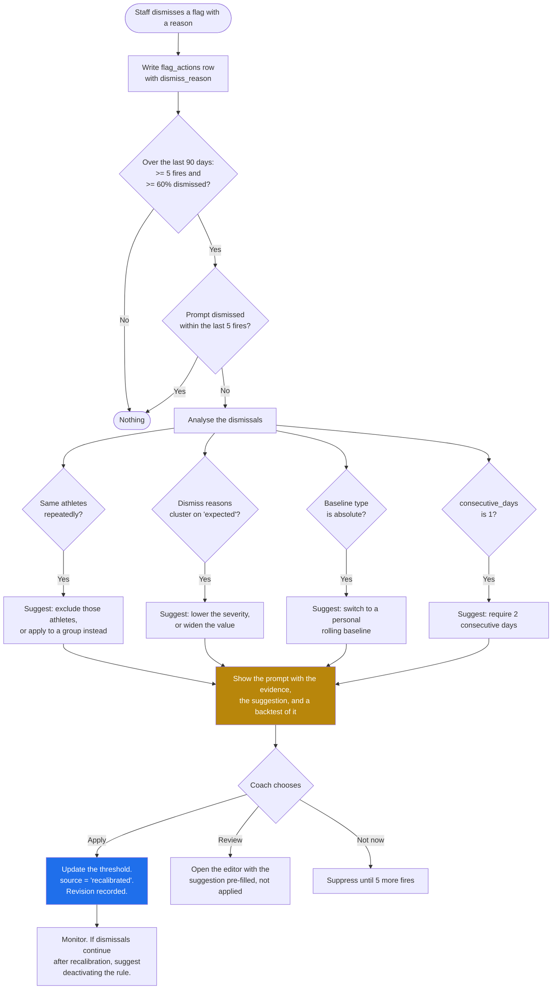

# Screen: Thresholds

> **Layout status**: provisional. Awaiting client design photographs.

Screen 30 in the inventory (`02-information-architecture.md` §5). Reached from
`More → Settings → Thresholds`. The whiteboard drew `Settings ─► Thresholds` and nothing else
about it, which understates it: this screen configures the rule engine that produces the flags,
and `00-product-overview.md` claim 2 says the flag system is the product.

---

## Purpose

Configure the rules that raise flags.

A threshold is a rule: a metric, a comparison, a value, a baseline to compare against, a
persistence requirement, a severity, a population, and a set of roles to notify. When incoming
data breaches it, the flag engine writes a `flags` row and the daily loop in `03-flows.md` §1
begins.

Four jobs:

1. **Make the rules legible.** A coach must be able to read a threshold and know what it will
   do. "Readiness, below, 1.5, personal rolling, 28 days, 2 consecutive days" is not a sentence
   anybody can act on, so the UI renders it as one.
2. **Explain the baseline types**, because the choice between absolute, personal rolling and
   squad mean is the difference between a monitoring system that works and one that gets
   muted.
3. **Ship sensible defaults**, so a new organisation has a working flag engine on day one
   without a sports scientist configuring it.
4. **Recalibrate when a threshold is not working.** Per `03-flows.md` §5, repeated dismissal of
   the same threshold surfaces a suggestion. Alert fatigue is what kills monitoring systems, and
   a flag nobody acts on is worse than no flag because it teaches staff to ignore the badge.

**What this screen is not.** It is not `flags.md`, where flags are read and acted on. It does
not raise, acknowledge or resolve anything. It configures.

---

## Roles and access

| Role | Access |
|---|---|
| Coach / S&C | Full. Create, edit, activate, deactivate, delete, test, recalibrate |
| Medical / Physio | **No access**, per the permission matrix in `01-roles-and-permissions.md` §2, where "Set thresholds" is `Y` for coach and blank for medical |
| Athlete | No access. Athletes never see the rules that flag them |
| Admin | No access |

The medical exclusion is worth stating plainly because it is counter-intuitive and it has a
consequence: a physio who wants a soreness rule cannot create one. They must ask a coach. That
is either a deliberate separation of duties or an oversight in the matrix, and it is
`08-notifications.md` open question O-53 seen from this side. Restated as O-392.

Medical **is** in the notify list of several default thresholds, so they receive flags they
cannot configure.

---

## Entry points

| From | Lands on | Context carried |
|---|---|---|
| `settings.md → Thresholds` | Threshold list | None |
| `flags.md`, a flag, "Adjust this threshold" | That threshold's editor | `threshold_id` |
| `flags.md`, the recalibration prompt | That threshold's editor, recalibration panel open | `threshold_id`, dismissal statistics |
| `onboarding.md`, club setup step | Default threshold set, review mode | None |
| `dashboard.md`, "No flags configured" prompt | Threshold list, `notStarted` | None |
| `analytics.md`, "Create a threshold from this" | New threshold, metric and window prefilled | `metric_key`, window |
| Deep link `fydr://settings/thresholds/<id>` | That threshold | `threshold_id` |

---

## Layout

### Web, 1280 pt design target

```
┌──────────────────────────────────────────────────────────────────────────────────────────┐
│ Fydr  [Group filter: All squad ▾]                                           Alex R  ▾    │
├────────────┬─────────────────────────────────────────────────────────────────────────────┤
│ ← Settings │  Thresholds                          [Restore defaults]  [+ New threshold]  │
│            │  12 active · 2 inactive · 34 flags raised in the last 28 days                │
│  Account   │  Domain: [All ▾]   Group: [All ▾]   [ ] Show inactive                        │
│  Thresholds│                                                                              │
│  Org       │  ⚠ 1 threshold may need recalibrating                                        │
│  Data      │  ┌─────────────────────────────────────────────────────────────────────────┐│
│  About     │  │ "Sleep below 6 hours" has been dismissed 7 of the last 8 times it fired.││
│            │  │ Athletes flagged: 5. Median sleep for those athletes: 6.4 h.            ││
│            │  │ Suggested: switch to a personal rolling baseline, 1.5 SD below own norm.││
│            │  │                                        [Review] [Apply] [Not now]       ││
│            │  └─────────────────────────────────────────────────────────────────────────┘│
│            │                                                                              │
│            │  WELLNESS (5)                                                                │
│            │  ┌─────────────────────────────────────────────────────────────────────────┐│
│            │  │ ● Readiness drop                                          high   [Edit] ││
│            │  │   Flags an athlete whose readiness is more than 1.5 standard deviations ││
│            │  │   below their own 28-day average, on 2 days running.                    ││
│            │  │   All squad · notifies Coach, Medical · 6 flags in 28 days · 5 actioned ││
│            │  ├─────────────────────────────────────────────────────────────────────────┤│
│            │  │ ● Sleep below 6 hours                                     medium  [Edit]││
│            │  │   Flags an athlete who sleeps under 6 hours, on 1 day.                  ││
│            │  │   All squad · notifies Coach · 8 flags in 28 days · 7 dismissed  ⚠      ││
│            │  ├─────────────────────────────────────────────────────────────────────────┤│
│            │  │ ● Soreness spike                                          high   [Edit] ││
│            │  │   Flags an athlete whose soreness is 2 or more points below their own   ││
│            │  │   14-day average, on 1 day.                                             ││
│            │  │   All squad · notifies Coach, Medical · 3 flags · 3 actioned            ││
│            │  ├─────────────────────────────────────────────────────────────────────────┤│
│            │  │ ○ Mood sustained low                                      low    [Edit] ││
│            │  │   Inactive since 12 Jul                                                 ││
│            │  └─────────────────────────────────────────────────────────────────────────┘│
│            │  LOAD (3)  ·  COMPLIANCE (2)  ·  TESTING (1)                                │
└────────────┴─────────────────────────────────────────────────────────────────────────────┘
```

### The editor

```
┌────────────────────────────────────────────────────────────────────────────────────────┐
│ Edit threshold                                              [Delete] [Cancel] [Save]   │
├────────────────────────────────────────────────────────────────────────────────────────┤
│ Name        [ Readiness drop                                              ]            │
│                                                                                        │
│ 1  What to watch                                                                       │
│    Domain   [ Wellness ▾ ]      Metric  [ Readiness score ▾ ]     0 to 100, higher     │
│                                                                    is better           │
│ 2  Compare against                                                                     │
│    (•) The athlete's own recent average       ← recommended                            │
│        Over the last [ 28 ] days                                                       │
│        ⓘ Fires when this athlete's value moves away from what is normal for them.      │
│          An athlete who always sleeps 6.5 hours is not in trouble. An athlete who      │
│          normally sleeps 8.5 and slept 6.5 is. This is the setting that catches the    │
│          second one and leaves the first alone.                                        │
│                                                                                        │
│    ( ) A fixed number                                                                  │
│        ⓘ Fires when the raw value crosses a line, the same line for everyone.          │
│          Simple and predictable. Generates constant noise from athletes whose normal   │
│          sits near the line, and misses a large drop in an athlete whose normal is     │
│          well above it.                                                                │
│                                                                                        │
│    ( ) The squad average today                                                         │
│        ⓘ Fires when this athlete is out of step with the rest of the squad on the      │
│          same day. Useful after a hard session, when everyone is tired and you want    │
│          the one who is more tired than the session explains. Useless when the whole   │
│          squad is affected together.                                                   │
│                                                                                        │
│ 3  The rule                                                                            │
│    Fires when readiness is  [ more than ▾ ]  [ 1.5 ]  [ standard deviations ▾ ]        │
│                             [ below ▾ ] the athlete's 28-day average                   │
│    for  [ 2 ]  consecutive days                                                        │
│                                                                                        │
│    ── In plain English ──────────────────────────────────────────────────────────────  │
│    Flags an athlete whose readiness is more than 1.5 standard deviations below their   │
│    own 28-day average, on 2 days running.                                              │
│                                                                                        │
│ 4  Who it applies to                                                                   │
│    (•) Whole squad     ( ) Group [ ▾ ]                                                 │
│                                                                                        │
│ 5  Severity and notification                                                           │
│    Severity  ( ) Low   ( ) Medium   (•) High                                           │
│    Notify    [x] Coach / S&C   [x] Medical   [ ] Admin                                 │
│    ⓘ High severity notifies immediately and overrides quiet hours. Medium and low are  │
│      batched into the next digest.                                                     │
│                                                                                        │
│ ── Test against history ──────────────────────────────────────────────────────────────│
│ [ Run against the last 90 days ]                                                       │
│                                                                                        │
│   Would have fired 11 times, on 7 athletes, over 90 days.                              │
│   That is 0.12 flags per athlete per month.                                            │
│                                                                                        │
│   T. Bennett   3 times   12 Jun, 4 Jul, 28 Jul                                         │
│   M. Price     2 times   19 Jun, 22 Jul                                                │
│   ... 5 more                                                                           │
│                                                                                        │
│   ✓ Within a workable range. Above about 1 flag per athlete per month, staff stop      │
│     reading them.                                                                       │
└────────────────────────────────────────────────────────────────────────────────────────┘
```

### Mobile, 390 pt

```
┌─────────────────────────────┐
│ ← Thresholds            [+] │
│ 12 active · 34 flags 28d    │
├─────────────────────────────┤
│ ⚠ 1 needs recalibrating     │
│   "Sleep below 6 hours"     │
│   dismissed 7 of 8 times    │
│                  [Review]   │
├─────────────────────────────┤
│ WELLNESS                    │
│ ┌─────────────────────────┐ │
│ │ ● Readiness drop   high │ │
│ │ More than 1.5 SD below  │ │
│ │ own 28-day average, 2   │ │
│ │ days running            │ │
│ │ All squad · 6 flags     │ │
│ └─────────────────────────┘ │
│ ┌─────────────────────────┐ │
│ │ ● Sleep below 6h  med ⚠ │ │
│ │ Under 6 hours, 1 day    │ │
│ │ All squad · 8 flags     │ │
│ │ 7 dismissed             │ │
│ └─────────────────────────┘ │
│ ┌─────────────────────────┐ │
│ │ ● Soreness spike   high │ │
│ │ 2+ points below own     │ │
│ │ 14-day average          │ │
│ └─────────────────────────┘ │
│ LOAD                        │
│ ┌─────────────────────────┐ │
│ │ ● ACWR above 1.5   high │ │
│ └─────────────────────────┘ │
└─────────────────────────────┘
```

The editor on mobile is a full-screen stepped form, one numbered step per screen, with the
plain-English sentence pinned at the foot and updating live. A single scrolling form with nine
controls at 390 pt produces thresholds nobody understands.

---

## Components

| Component | Source | Purpose |
|---|---|---|
| `GroupFilter` | `06-design-system.md` §6.7 | Filters the list by which group a threshold applies to. Note this is a different meaning from the usual "which athletes am I looking at", and the header says so |
| `FlagBadge` | §6.4 | Severity indicator on each row, reusing the flag treatment so severity means the same thing here and on `flags.md` |
| `EmptyState` | §6.16 | `notStarted`, `noResults`, `noPermission` |
| `ConfirmSheet` | §6.18 | Delete, deactivate, restore defaults, apply a recalibration |
| `BottomSheet` | §6.19 | Metric picker, group picker, severity picker on mobile |
| `NumberStepper` | §6.11 | Value, baseline days, consecutive days |
| `AthleteCard` | §6.1 | Rows in the backtest results |
| `ThresholdCard` | New, this screen | One rule, rendered as a sentence, with its stats and status |
| `ThresholdEditor` | New, this screen | The five-step form |
| `BaselineTypePicker` | New, this screen | Three options, each with its explanation inline and permanently visible |
| `RuleSentence` | New, this screen | The plain-English rendering. Live, and the single source of truth for how a rule reads anywhere in the product |
| `BacktestPanel` | New, this screen | Runs the rule against history and reports what it would have done |
| `RecalibrationPrompt` | New, this screen | The dismissal-driven suggestion with the evidence behind it |
| `ThresholdStats` | New, this screen | Fired, acknowledged, actioned, dismissed, resolved, over a window |

`RuleSentence` being shared is deliberate. The sentence in the editor, the sentence on the card,
the sentence in the flag detail on `flags.md`, and the sentence in a notification body must be
generated by one function. Three hand-written descriptions of one rule is three chances to
describe it wrongly.

---

## Data requirements

### Reads

| Field | Source `table.column` | Transformation |
|---|---|---|
| Name | `thresholds.name` | Falls back to the generated sentence if blank |
| Domain | `thresholds.domain` | Groups the list |
| Metric | `thresholds.metric` | Resolved against `metric_definitions` for label, unit and direction |
| Comparison | `thresholds.comparison` | `below`, `above`, `pct_change_below`, `pct_change_above`, `z_score` |
| Value | `thresholds.value` | Unit depends on comparison and baseline type |
| Baseline type | `thresholds.baseline_type` | `absolute`, `personal_rolling`, `squad_mean` |
| Baseline days | `thresholds.baseline_days` | Only meaningful for `personal_rolling` |
| Persistence | `thresholds.consecutive_days` | 1 means fire on a single breach |
| Severity | `thresholds.severity` | Drives notification urgency per `08-notifications.md` §4 |
| Population | `thresholds.applies_to_group_id` | Null means whole squad |
| Notify roles | `thresholds.notify_roles` | `app_role[]` |
| Active | `thresholds.is_active` | |
| Author and dates | `thresholds.created_by`, `.created_at`, `.updated_at` | |
| Fire count | `count(flags)` by `threshold_id` over the window | |
| Outcome breakdown | `flags.status` and `flag_actions.action_type` | Acknowledged, actioned, dismissed, resolved |
| Dismissal reasons | `flag_actions.dismiss_reason` where `action_type = 'dismissed'` | Grouped, drives the recalibration prompt |
| Athletes affected | `count(distinct flags.athlete_id)` | |
| Time to acknowledge | `flags.acknowledged_at - flags.raised_at` | Median, a secondary fatigue signal |

### Schema additions required

| Change | Table | Why |
|---|---|---|
| Add `description text` | `thresholds` | A free-text note about why the rule exists, separate from the generated sentence |
| Add `min_baseline_observations int not null default 10` | `thresholds` | A `personal_rolling` rule must not fire against a baseline built from 2 data points |
| Add `cooldown_days int not null default 3` | `thresholds` | Suppresses a re-fire on the same athlete and threshold within N days of a resolution. Without it a persistent condition raises a flag every single day |
| Add `deleted_at timestamptz` | `thresholds` | The table has none, contrary to `04-data-model.md` §1 |
| Add `source text` | `thresholds` | `'default'`, `'custom'`, `'recalibrated'`, for reporting on whether clubs actually tune them |
| New table `threshold_revisions` | new | Before and after on every edit, so a flag raised in June can be explained by the rule as it was in June |

```sql
alter table thresholds
  add column description text,
  add column min_baseline_observations int not null default 10,
  add column cooldown_days int not null default 3,
  add column deleted_at timestamptz,
  add column source text not null default 'custom';

create table threshold_revisions (
  id           uuid primary key default gen_random_uuid(),
  org_id       uuid not null references organisations(id),
  threshold_id uuid not null references thresholds(id) on delete cascade,
  before       jsonb,
  after        jsonb not null,
  changed_by   uuid not null references users(id),
  change_reason text,
  created_at   timestamptz not null default now()
);

alter table flags
  add column threshold_revision_id uuid references threshold_revisions(id);

create index on threshold_revisions (threshold_id, created_at desc);
create index on thresholds (org_id, domain) where is_active and deleted_at is null;
create index on flags (threshold_id, flag_date desc);
```

`flags.threshold_revision_id` is the important one. A coach looking at a June flag and a July
threshold needs to know the rule changed in between, and without the link the flag becomes
unexplainable. It is the same principle as the snapshot rule in ADR-006.

### Query: the threshold list with outcome statistics

```sql
select
  t.id, t.name, t.description, t.domain, t.metric, t.comparison, t.value,
  t.baseline_type, t.baseline_days, t.consecutive_days, t.min_baseline_observations,
  t.cooldown_days, t.severity, t.notify_roles, t.is_active, t.source,
  g.name as group_name, g.colour as group_colour,
  u.full_name as created_by_name, t.created_at, t.updated_at,
  md.label as metric_label, md.unit, md.higher_is_better,
  coalesce(s.fired, 0)       as fired,
  coalesce(s.acknowledged,0) as acknowledged,
  coalesce(s.actioned, 0)    as actioned,
  coalesce(s.dismissed, 0)   as dismissed,
  coalesce(s.resolved, 0)    as resolved,
  coalesce(s.athletes, 0)    as athletes_affected,
  s.median_ack_minutes,
  case
    when coalesce(s.fired,0) >= 5
     and s.dismissed::numeric / nullif(s.fired,0) >= 0.6 then true
    else false
  end as needs_recalibration
from thresholds t
left join groups g  on g.id = t.applies_to_group_id
left join users u   on u.id = t.created_by
left join metric_definitions md on md.key = t.domain || '.' || t.metric
left join lateral (
  select
    count(*)                                                        as fired,
    count(*) filter (where f.status in
      ('acknowledged','actioned','monitoring','resolved'))          as acknowledged,
    count(*) filter (where exists (
      select 1 from flag_actions fa
      where fa.flag_id = f.id and fa.action_type <> 'dismissed'))   as actioned,
    count(*) filter (where f.status = 'dismissed')                  as dismissed,
    count(*) filter (where f.status = 'resolved')                   as resolved,
    count(distinct f.athlete_id)                                    as athletes,
    percentile_cont(0.5) within group (
      order by extract(epoch from (f.acknowledged_at - f.raised_at))/60)
                                                                    as median_ack_minutes
  from flags f
  where f.threshold_id = t.id
    and f.flag_date >= current_date - $1::int
) s on true
where t.org_id = auth_org_id()
  and t.deleted_at is null
  and ($2::boolean or t.is_active)
  and ($3::flag_domain is null or t.domain = $3::flag_domain)
order by
  t.domain,
  case t.severity when 'high' then 1 when 'medium' then 2 else 3 end,
  t.name;
```

### Query: backtest

Runs the proposed rule against history and reports what it would have done. This is the control
that makes threshold configuration something other than guesswork.

```sql
create or replace function public.backtest_threshold(
  p_domain          flag_domain,
  p_metric          text,
  p_comparison      threshold_comparison,
  p_value           numeric,
  p_baseline_type   baseline_type,
  p_baseline_days   int,
  p_consecutive_days int,
  p_min_baseline_obs int,
  p_group_id        uuid,
  p_days            int default 90
)
returns table (
  athlete_id   uuid,
  first_name   text,
  last_name    text,
  fire_dates   date[],
  fire_count   int
)
language sql
stable
security invoker
as $$
  with population as (
    select a.id, a.first_name, a.last_name
    from athletes a
    where a.org_id = auth_org_id()
      and a.deleted_at is null
      and a.status <> 'left_club'
      and (p_group_id is null or exists (
            select 1 from group_memberships gm
            where gm.athlete_id = a.id and gm.group_id = p_group_id
              and gm.removed_at is null))
  ),
  series as (
    select m.athlete_id, m.bucket as day, m.value
    from population p
    cross join lateral metric_series(
      p_domain::text || '.' || p_metric,
      array[p.id],
      current_date - p_days,
      current_date,
      'day') m
    where m.value is not null
  ),
  baselined as (
    select
      s.athlete_id, s.day, s.value,
      case p_baseline_type
        when 'absolute' then null
        when 'personal_rolling' then avg(s.value) over w
        when 'squad_mean' then avg(s.value) over (partition by s.day)
      end as baseline,
      case p_baseline_type
        when 'personal_rolling' then stddev_samp(s.value) over w
        else null
      end as baseline_sd,
      case p_baseline_type
        when 'personal_rolling' then count(*) over w
        else null
      end as baseline_n
    from series s
    window w as (
      partition by s.athlete_id order by s.day
      range between (p_baseline_days || ' days')::interval preceding
                and '1 day'::interval preceding
    )
  ),
  breaches as (
    select
      b.athlete_id, b.day,
      case
        when p_baseline_type = 'personal_rolling'
             and coalesce(b.baseline_n, 0) < p_min_baseline_obs then false
        when p_comparison = 'below'  then b.value < p_value
        when p_comparison = 'above'  then b.value > p_value
        when p_comparison = 'z_score'
          then (b.value - b.baseline) / nullif(b.baseline_sd, 0) <= -abs(p_value)
        when p_comparison = 'pct_change_below'
          then b.value <= b.baseline * (1 - p_value / 100.0)
        when p_comparison = 'pct_change_above'
          then b.value >= b.baseline * (1 + p_value / 100.0)
      end as breached
    from baselined b
  ),
  runs as (
    select
      athlete_id, day, breached,
      row_number() over (partition by athlete_id order by day)
        - row_number() over (partition by athlete_id, breached order by day) as grp
    from breaches
  ),
  fires as (
    select athlete_id, min(day) as fire_date, count(*) as run_length
    from runs
    where breached
    group by athlete_id, grp
    having count(*) >= p_consecutive_days
  )
  select
    p.id, p.first_name, p.last_name,
    array_agg(f.fire_date order by f.fire_date),
    count(*)::int
  from population p
  join fires f on f.athlete_id = p.id
  group by p.id, p.first_name, p.last_name
  order by count(*) desc, p.last_name;
$$;
```

The backtest is an approximation, and the panel says so in one line: it evaluates against
today's group membership and today's data, and it does not model the cooldown. It is close
enough to tell a coach whether a rule will fire 11 times or 400 times, which is the question
being asked.

### Writes

| Action | Write | Audit |
|---|---|---|
| Create | Insert `thresholds`, plus a `threshold_revisions` row with `before = null` | `threshold.create` |
| Edit | Update `thresholds`, insert `threshold_revisions` | `threshold.update` |
| Activate or deactivate | Update `is_active`, insert a revision | `threshold.toggle` |
| Delete | Soft delete. Existing flags keep their `threshold_id` | `threshold.delete` |
| Restore defaults | Insert any missing default thresholds. Never overwrites an edited one | `threshold.restore_defaults` |
| Apply a recalibration | Update, insert a revision with `change_reason = 'recalibration'`, `source = 'recalibrated'` | `threshold.recalibrate` |
| Dismiss a recalibration prompt | Records the dismissal so the prompt does not reappear until another 5 fires | `threshold.recalibration_dismissed` |

---

## Baseline types, explained

The single most important explanatory content on this screen. `04-data-model.md` §10 states the
rule; this is how it is presented to a coach.

### Personal rolling, the recommended default

**What it does.** Compares each athlete's value against their own average over the last N days.

**The plain-English version shown in the UI**: "Fires when this athlete's value moves away from
what is normal for them."

**Why it is the default.** From `04-data-model.md` §10, and it is worth quoting because it is
the whole argument: an athlete who consistently sleeps 6.5 hours is not in trouble; an athlete
who normally sleeps 8.5 and slept 6.5 is. An absolute threshold at 7 hours flags the first
athlete every single day, and misses the second entirely.

That produces two failures at once:

- **False positives on the low-normal athlete.** They get flagged daily, the coach dismisses
  daily, and within two weeks the coach stops reading wellness flags. This is the alert fatigue
  that `03-flows.md` §5 exists to guard against.
- **False negatives on the high-normal athlete.** The athlete whose sleep collapsed by two hours
  is the one the system exists to catch, and an absolute rule at 7 hours never sees them.

Squads are heterogeneous. A 19-year-old academy player and a 34-year-old front-rower with two
children do not share a normal, on any wellness metric. A rule that assumes they do is not
measuring the athlete, it is measuring the difference between the athlete and an average that
does not describe anybody.

**The cost of the default.** Three things, all handled:

1. **It needs history.** A new athlete has no baseline. `min_baseline_observations` defaults to
   10 and the rule does not fire below it. New athletes are covered by absolute safety-net
   thresholds instead, which is why the default set contains both.
2. **It normalises a decline.** An athlete whose readiness falls steadily over six weeks moves
   their own baseline down with them, and a personal rolling rule may never fire. The default
   set includes an absolute floor for exactly this, and the trend is visible on
   `analytics.md`'s wellness preset.
3. **It is harder to explain.** Which is why this screen renders the sentence and shows the
   backtest.

**Recommended parameters**: 28 days of baseline, 1.5 standard deviations, 2 consecutive days.
28 days matches the analysis default in `02-information-architecture.md` §6 and the ACWR
convention. 1.5 SD fires on roughly the worst 7% of an athlete's own days, which at 2
consecutive days lands around one flag per athlete per month. Above about one flag per athlete
per month, staff stop reading them.

### Absolute

**What it does.** Compares the raw value against a fixed number, the same for everyone.

**The plain-English version**: "Fires when the raw value crosses a line, the same line for
everyone."

**When it is right.** Three cases, and they are genuine:

1. **Safety floors.** Sleep under 4 hours is a problem regardless of who it is and what their
   normal is. An absolute floor is the correct tool and it should be set well below the
   population's normal range so it fires rarely and means something when it does.
2. **New athletes.** Before a personal baseline exists, absolute is the only option.
3. **Externally defined limits.** A return-to-play criterion, an asymmetry limit, a compliance
   percentage the club has committed to. These are policy numbers, not statistical ones.

**When it is wrong.** As a general monitoring rule on a heterogeneous squad, for the reasons
above.

### Squad mean

**What it does.** Compares the athlete against the squad average on the same day.

**The plain-English version**: "Fires when this athlete is out of step with the rest of the
squad on the same day."

**When it is right.** After a shared stimulus. Everyone is tired the day after a hard session,
and a personal rolling rule fires on half the squad, which tells the coach nothing they did not
already know. A squad mean rule finds the athlete who is more tired than the session explains,
which is the useful signal.

**When it is wrong.** When the whole squad is affected together, which is precisely the case it
handles well for one metric and badly for another. A squad-wide dip in mood during a losing run
produces no flags at all under a squad mean rule, because everybody moved together. It is a
relative measure and it cannot see an absolute problem.

**Practical note**: squad mean is sensitive to who submitted that day. On a day when 8 of 38
athletes logged wellness, the "squad mean" is 8 people. The engine therefore requires a minimum
of 5 contributing athletes on the day, and does not fire below it. The UI states this.

### Comparison of the three

| | Absolute | Personal rolling | Squad mean |
|---|---|---|---|
| Needs athlete history | No | Yes, 10 observations minimum | No |
| Needs same-day squad data | No | No | Yes, 5 athletes minimum |
| Handles a heterogeneous squad | Poorly | Well | Moderately |
| Catches a gradual decline | Yes | Poorly | Only if the squad does not decline together |
| Catches a sudden individual change | Only if it crosses the line | Well | Well |
| Catches a squad-wide problem | Yes | Partly | No |
| Explains itself to an athlete | Easily | With effort | With difficulty |
| Noise on a low-normal athlete | High | None | Depends |

**Recommendation, stated in the UI**: use personal rolling for the main monitoring rules, and a
small number of absolute rules as safety floors underneath them. Use squad mean sparingly, for
specific questions, on days with a shared stimulus.

---

## Default threshold set for a new organisation

> **Build status, 30 August 2026 — five of these eleven now ship; the other six cannot yet.**
>
> Until migration `0059_default_thresholds.sql` the sentence below ("Seeded at organisation
> setup") was **not true of any code**. Nothing in the schema had ever inserted a `thresholds`
> row for a real organisation: the only threshold rows that had ever existed were hand-written
> demo fixtures in `supabase/seed.sql` and `supabase/tests/000_setup_test_helpers.sql`, keyed to
> hard-coded org UUIDs, and there is no organisation-creation code path in the app at all. A
> new club therefore landed on an empty `/settings/thresholds` **and** — the part that was not
> visible anywhere — a nightly flag engine (migration `0052`) with no rules to evaluate, raising
> zero flags forever while its Flags screen looked reassuringly calm. Recorded per `CLAUDE.md`
> §8: the doc asserted a mechanism, the code never had one, and the code was the fact.
>
> **What now ships** is `public.default_threshold_set()`, applied to a club by
> `public.seed_default_thresholds(org_id)` and offered to a coach as "Start with the default
> set" on the empty state of this screen. It is **rules 1, 3, 5, 7 and 10 of the table below,
> at the values already proven against the demo club**, not the eleven as specified:
>
> | # below | Ships as | At the values | Divergence from the row below |
> |---|---|---|---|
> | 1 | Readiness below personal norm | z_score −1.5, personal rolling 28d, 2 days, high, coach+medical | none |
> | 3 | Sleep dropped | pct_change_below 20%, personal rolling 28d, 2 days, medium, coach | `pct_change_below`, not `z_score` |
> | 5 | Soreness elevated | below 2, absolute, 3 days, medium, coach+medical | absolute, not a 14-day rolling percentage |
> | 7 | Acute chronic ratio high | above 1.30, **absolute**, 1 day, high, coach | 1.30, not 1.50 — 1.30 is the number the running app already quotes everywhere (audit finding S1) — **and absolute, not personal rolling** |
> | 10 | Wellness compliance low | below 4 submissions in 7 days, absolute, low, coach, **ships inactive** | a count over 7 days on `compliance.wellness_7d`, not a percentage on `wellness_pct` — **and it arrives switched off** |
>
> **Two of those five diverge from the row below in ways that change behaviour, not just
> numbers, and both were review corrections to the first version of `0059`:**
>
> *Rule 7 is `absolute`, not `personal rolling`.* `above` and `below` are flat comparisons
> in the evaluator (`_threshold_breach_on_day`, migration `0052`): they compare the raw
> value against the rule's own `value` and never read a mean or an SD. Pairing `above 1.30`
> with `personal_rolling` therefore changed nothing about when the rule trips, and did one
> thing only — it gated the rule behind `min_baseline_observations = 14`, so it could not
> fire for an athlete's first 14 ACWR observations, which no screen said. Its shipped
> description ("Seven to twenty eight day EWMA load ratio above own 1SD band") described a
> `z_score` rule against a personal band, which it has never been. It is now an absolute
> 1.30 cutoff with a description that says so. New clubs are still protected, by a stronger
> gate: ACWR is suppressed entirely until 21 of the trailing 28 days carry a training entry.
>
> *Rule 10 arrives inactive.* `compliance.wellness_7d` is a **count**, so a club that has
> never submitted anything evaluates to 0 — a real observation of "fewer than four", not a
> gap — and 0 < 4 breaches for every athlete on every day of the club's pre-history. No
> parameter on the rule can prevent that: `min_baseline_observations` counts non-null daily
> values and this metric is never null, `consecutive_days` is satisfied because every prior
> day breaches too, and edge case 8's gap tolerance does not apply because a count has no
> gaps. As an active default it would have flagged every athlete in every new club on the
> first nightly sweep. It therefore ships switched off, visible on this screen with an
> Activate button and a description that explains the wait. Making it safe to ship live is
> an **evaluator** change, not a threshold one: `_threshold_metric_raw` would have to return
> NULL rather than 0 for an athlete with no wellness history at all. That is the follow-up.
>
> **Why not the other six.** Rules 2, 4, 6, 8, 9 and 11 sit on metric keys that migration
> `0052`'s `_threshold_metric_value()` cannot evaluate — `mood`, `weekly_load`, `wellness_pct`
> and `consecutive_missed` have no evaluator branch, and rules 2/4/8 are absolute variants that
> would need one too. Shipping them would put six rules in front of a coach that are
> configured, active, visible, and permanently incapable of firing, which is a worse failure
> than five honest rules: a silent dead rule is indistinguishable from a rule that simply has
> not tripped. The five that ship are, exactly and with nothing left over, the five metrics the
> engine actually supports. **Extending the default set is downstream of extending the
> evaluator, not independent of it** — that is the real prerequisite, and it is the follow-up.
>
> **Also not built: the `[Restore defaults]` toolbar button** drawn in the wireframe above and
> specified at the end of this section as "adds back what is missing and never overwrites an
> edited rule". `seed_default_thresholds()` is deliberately **all-or-nothing**: it acts only on
> a club that has **never had a threshold row at all**, and returns 0 otherwise. Per-rule
> restore-what-is-missing needs identity matching on rule name, and its natural consequence is
> reinstating a default a coach deleted on purpose — the one outcome worth designing against
> here. So the affordance is offered on the empty state only, where the intent is unambiguous.
>
> This paragraph used to end "it needs a real answer to 'how do we tell a rule you never had
> from a rule you removed', which the schema does not currently record." **That was wrong, and
> the correction matters**: the schema records it exactly. Rules are never hard-deleted
> (`CLAUDE.md` rule 4 — there is no delete grant on `thresholds` at all); retiring one sets
> `deleted_at`, so a removed rule is still a row and a never-configured club has none. The
> first version of `0059` guarded on `deleted_at is null`, which read a club that had retired
> *every* rule as never-configured — and its backfill, which runs as the migration owner
> across every organisation with no human involved, would have handed that club five live
> rules and a flag engine raising the flags they had switched off. The guard now asks whether
> **any** row exists, retired included. The cost is stated rather than hidden: a club that
> retired everything can no longer be re-provisioned by this function and authors a rule by
> hand instead, which is a deliberate act rather than a silent reinstatement.

Seeded at organisation setup, `source = 'default'`. Four of the five arrive active; wellness
compliance arrives inactive for the reason given in the banner above. The set is deliberately
small.
Eleven rules that fire occasionally beat thirty that fire constantly, and a club can add more
once they have seen how these behave.

| # | Name | Domain | Metric | Rule | Baseline | Persist | Severity | Notify |
|---|---|---|---|---|---|---|---|---|
| 1 | Readiness drop | wellness | `readiness_score` | z_score, 1.5 below | personal rolling 28d | 2 days | high | coach, medical |
| 2 | Readiness floor | wellness | `readiness_score` | below 40 | absolute | 1 day | high | coach, medical |
| 3 | Sleep sharply down | wellness | `sleep_hours` | z_score, 1.5 below | personal rolling 28d | 2 days | medium | coach |
| 4 | Sleep floor | wellness | `sleep_hours` | below 4 | absolute | 1 day | high | coach |
| 5 | Soreness spike | wellness | `soreness` | pct_change_below 25% | personal rolling 14d | 1 day | high | coach, medical |
| 6 | Sustained low mood | wellness | `mood` | below 2 | absolute | 3 days | medium | coach, medical |
| 7 | ACWR high | training | `acwr` | above 1.5 | absolute | 1 day | high | coach |
| 8 | ACWR low | training | `acwr` | below 0.8 | absolute | 3 days | low | coach |
| 9 | Weekly load spike | training | `weekly_load` | pct_change_above 40% | personal rolling 28d | 1 day | medium | coach |
| 10 | Wellness compliance | compliance | `wellness_pct` | below 60 | absolute | 7 days | medium | coach |
| 11 | Missed entries run | compliance | `consecutive_missed` | above 3 | absolute | 1 day | low | coach |

Notes on the choices:

- **Rules 1 and 2 are a pair**, and that pattern is the recommendation in miniature: a personal
  rolling rule that catches individual change, and an absolute floor underneath it that catches
  the gradual decline the rolling rule would normalise away, and that covers new athletes with
  no baseline. Rules 3 and 4 are the same pair for sleep.
- **Rule 5 uses percentage change, not z-score**, because soreness is a 5-point ordinal scale
  and a standard deviation on five points is not meaningful. 25% of a 5-point scale is
  approximately one point, which is what a coach means by a soreness spike. Note the scale
  direction trap from `04-data-model.md` §5: soreness 5 means no soreness, so "worse" is
  *below*.
- **Rule 6 is absolute at 3 consecutive days** rather than rolling, because a persistently low
  mood is a concern regardless of whether it is normal for that athlete. "Normal for them" is
  not a reason not to look. It notifies medical as well as coach.
- **Rules 7 and 8 use absolute ACWR bands** because 0.8 and 1.5 are the conventional bands, and
  because the honesty note from `analytics.md` applies: they are a convention, not a validated
  threshold. Rule 8 is deliberately low severity, because an ACWR below 0.8 usually means the
  athlete is being managed, not that something is wrong.
- **Rule 11** catches disengagement, which is the leading indicator of an athlete about to stop
  using the product entirely, and product success criterion 3 depends on it.
- **No GPS rules by default**, because GPS is Premium tier and not every organisation has
  it. A GPS default set is added when an import is first configured.
- **No testing rules by default**, because a testing threshold needs the club's own tests to
  exist first.
- **No nutrition rules by default, and none available.** A "protein under target" rule was
  specified here and has been removed. Athletes do not log nutrition, so `pct_of_target_protein`
  has no source and the rule would have fired never or always depending on how the null was
  handled. `'nutrition'` remains a `flag_domain` value (`04-data-model.md` §11) but nothing
  writes to it. See `nutrition-guidance.md` §9.

Everything in the table is editable and deletable. "Restore defaults" adds back what is missing
and never overwrites an edited rule.

---

## The recalibration suggestion

`03-flows.md` §5 specifies it: repeated dismissal of the same threshold surfaces a suggestion
that the threshold is miscalibrated. Made concrete.



The prompt always shows its evidence, because a suggestion a coach cannot check is a suggestion
they will not trust:

```
"Sleep below 6 hours" may need recalibrating.

  Fired 8 times in the last 28 days. 7 were dismissed.
  Dismiss reasons:  "normal for this athlete" × 5
                    "already knew" × 2
  Athletes flagged: 5. Three of them were flagged more than once.
  Median sleep for those athletes over 28 days: 6.4 hours.

  Suggestion
  Switch from a fixed 6-hour line to each athlete's own average.
  Fires when an athlete sleeps more than 1.5 standard deviations
  below their own 28-day norm, on 2 days running.

  Backtested over the last 90 days:
    Current rule:   26 fires, 9 athletes
    Suggested rule:  7 fires, 5 athletes
    Of the 7, 5 are days the current rule also flags.

                      [Review]  [Apply]  [Not now]
```

The five dismissals reading "normal for this athlete" are the diagnosis, and they are the exact
argument for personal rolling baselines that this screen makes in the abstract. The
recalibration feature is where that argument becomes evidence from the club's own data.

**Escalation.** If dismissals continue above 60% after a recalibration has been applied, the
next prompt suggests deactivating the rule rather than tuning it again. A rule that cannot be
tuned into usefulness should be turned off, and the product should say so rather than offering
a third adjustment.

---

## States

### Default

List grouped by domain, ordered by severity within a domain, active only. Recalibration prompts
pinned at the top.

### Loading

Threshold rows render from cache immediately. Fire counts and outcome statistics load in a
second pass, showing a skeleton rather than a zero, because "0 flags in 28 days" is a
meaningfully different statement from "not loaded yet".

### Empty

| Kind | Trigger | Copy | Action |
|---|---|---|---|
| `notStarted` | No thresholds at all | "No thresholds set. Nothing will be flagged until at least one exists." | "Add the recommended set", "Create one" |
| `notStarted` | A domain with no rules | "No load thresholds." | "Add one" |
| `noResults` | Domain or group filter excludes all | "No wellness thresholds apply to Academy." | "Clear filter" |
| `allClear` | Active rules, none fired in the window | "12 thresholds active. Nothing has been flagged in the last 28 days." | none |
| `noData` | Backtest returns no fires | "This rule would not have fired at all in the last 90 days. That may be too strict." | "Loosen the value" |
| `noPermission` | Medical or admin deep link | "Thresholds are configured by coaching staff." | "Back to settings" |

The `notStarted` copy is blunt on purpose. A club that has deleted every threshold has silently
turned off the feature the product is built around, and the screen should say so.

### Error

Per §11.3. A failed statistics load leaves the rules readable with "Statistics unavailable". A
failed backtest shows the error inside the panel and does not block saving, because a rule can
be saved without being backtested.

A failed save preserves the form and states "Could not save this threshold. The existing rule is
unchanged." The last clause matters: a coach must know whether a half-saved rule is now live.

### Offline

Rules render from cache read-only with the offline chip. All editing is disabled with the
standard copy. The backtest is unavailable and says so specifically: "Testing against history
needs a connection."

### Role-specific

Only coaches reach this screen. Medical and admin get `noPermission` on a deep link. There is no
partially-enabled variant, because a read-only view of the rules for a role that receives their
flags is arguably useful and is not specified. See O-392.

---

## Interactions

### Creating and editing

The five-step form, in the order shown. Each step constrains the next: the metric determines
which comparisons are legal, the comparison determines the unit of the value, and the baseline
type determines whether `baseline_days` and `min_baseline_observations` are meaningful.

**Legal combinations**, enforced:

| Comparison | Legal baseline types | Value unit |
|---|---|---|
| `below`, `above` | absolute | The metric's own unit |
| `z_score` | personal_rolling, squad_mean | Standard deviations |
| `pct_change_below`, `pct_change_above` | personal_rolling, squad_mean | Percent |

Choosing `below` with `personal_rolling` is not offerable, because "below 6 hours compared to
the athlete's own average" is not a coherent rule. The picker disables the combination and says
why, rather than accepting it and producing a rule that never fires.

**The sentence updates live** at every change and is pinned at the foot of the mobile form. A
coach who cannot read the sentence and recognise their intent has not built the rule they meant
to build.

### The backtest

Runs the proposed rule against the last 90 days and reports fires, athletes and dates, with the
per-athlete breakdown. It is the difference between configuring a threshold and guessing at one.

The panel interprets the result rather than only reporting it:

| Fires per athlete per month | Interpretation shown |
|---|---|
| 0 | "This rule would not have fired at all. That may be too strict." |
| Under 0.2 | "Rarely. Good for a safety floor, may miss things as a main rule." |
| 0.2 to 1.0 | "Within a workable range." |
| 1.0 to 3.0 | "Frequent. Staff may start ignoring these." |
| Above 3.0 | "Too frequent. This will be muted within a fortnight." |

The one-flag-per-athlete-per-month figure is an assumption drawn from the alert fatigue argument
in `03-flows.md` §5 rather than from evidence, and it is flagged as O-395.

### Cooldown

Without a cooldown, a persistent condition raises a flag every day. An athlete with a genuine
long-term sleep problem generates 28 flags a month from one rule, and the dashboard becomes
unusable.

`cooldown_days` defaults to 3: after a flag on the same athlete and threshold resolves or is
dismissed, the rule does not re-fire for that athlete for 3 days. The flag lifecycle in
`03-flows.md` §5 already has a `Monitoring` state that watches for N days, and the cooldown is
the configuration behind it.

The UI explains it as: "After a flag on the same athlete is closed, this rule waits 3 days
before flagging them again."

### Severity and notification

| Severity | Notification behaviour, per `08-notifications.md` §4 |
|---|---|
| High | Immediate push to `notify_roles`. Overrides quiet hours. Escalates after 24 hours unacknowledged |
| Medium | Batched into the next collector window. Respects quiet hours |
| Low | Weekly digest only. No push |

The editor states this next to the severity control, because "high" meaning "will wake somebody
up" is not obvious from the word.

`notify_roles` defaults to `{coach}`. Adding `medical` is the right choice for soreness and mood
rules and is the subject of `08-notifications.md` O-53. Admin is offerable and is almost always
wrong, because an admin does not hold athlete data access by default, and the notification body
would name an athlete. The UI warns when admin is selected: "Admins do not normally see athlete
data. This notification would name the athlete."

### Restore defaults

Adds any of the eleven default rules that are missing. Never overwrites, never reactivates a
deliberately deactivated rule, never deletes a custom rule. The confirmation lists exactly what
will be added.

### Deleting versus deactivating

Deactivating stops the rule firing and keeps it, with its history. Deleting soft-deletes it.
Existing flags keep their `threshold_id` and their `threshold_revision_id`, so a historical flag
remains explainable after its rule is gone.

The UI steers to deactivation: delete is behind the editor's overflow, deactivate is a primary
control on the card.

---

## Validation rules

| Rule | Severity | Message |
|---|---|---|
| Name 1 to 60 characters, unique per org | Block | "A threshold called 'Readiness drop' already exists." |
| Metric exists in `metric_definitions` and is `threshold_eligible` | Block | "That metric cannot raise flags." |
| Comparison legal for the baseline type | Block | "'Below a fixed number' cannot be compared against the athlete's own average. Use a percentage change or a z-score." |
| Value within the metric's plausible range, for absolute | Block | "Readiness runs from 0 to 100." |
| z-score value 0.5 to 4.0 | Block | "Between 0.5 and 4 standard deviations." |
| z-score above 3.0 | Warn | "3.5 standard deviations will fire about once per athlete per year." |
| Percentage change 1 to 100 | Block | "Between 1 and 100 percent." |
| `baseline_days` 7 to 180 | Block | "Between 7 and 180 days." |
| `baseline_days` under 14 with a z-score | Warn | "A standard deviation from 7 days of data is unstable." |
| `consecutive_days` 1 to 14 | Block | "Between 1 and 14 days." |
| `consecutive_days` above the expected submission frequency | Warn | "Wellness is expected 5 days a week. Requiring 7 consecutive days may never fire." |
| `min_baseline_observations` 3 to 60 | Block | "Between 3 and 60 observations." |
| `cooldown_days` 0 to 30 | Block | "Between 0 and 30 days." |
| `cooldown_days` of 0 | Warn | "With no cooldown, a persistent problem will flag every day." |
| At least one notify role | Block | "Choose at least one role to notify." |
| Admin in `notify_roles` | Warn | "Admins do not normally see athlete data." |
| Group has current members | Warn | "Academy has no members today." |
| Backtest fires above 3 per athlete per month | Warn, non-blocking | "Too frequent. This will be muted within a fortnight." |
| Two active rules on the same metric, group and direction | Warn | "'Sleep floor' already watches sleep_hours for the whole squad." |
| Deactivating the last rule in a domain | Warn | "Nothing will be flagged for wellness." |
| Deleting a rule with flags in the last 90 days | Warn | "This rule raised 8 flags recently. Deactivate it instead?" |

---

## Edge cases

1. **An athlete with no baseline history.** A `personal_rolling` rule does not fire below
   `min_baseline_observations`. The athlete is covered by the absolute floor rules instead. The
   threshold card shows how many athletes currently lack a baseline: "4 athletes have too little
   history for this rule."
2. **An athlete whose baseline drifts with a genuine decline.** The rolling rule normalises it.
   This is the known weakness, it is stated in the baseline explanation, and it is why the
   default set pairs every rolling rule with an absolute floor.
3. **A squad mean rule on a day when 6 athletes submitted.** Requires 5 contributing athletes
   minimum. Below that the rule does not evaluate and the day is skipped rather than evaluated
   against a mean of 3 people.
4. **A metric with a reversed scale.** Soreness 5 means no soreness, per `04-data-model.md` §5.
   The editor renders the direction explicitly next to the metric: "1 to 5, higher is better",
   and the sentence says "soreness worsens by 25%", never "soreness falls by 25%". This is
   called out in the data model as the single most likely source of an inverted-chart bug, and
   it is the single most likely source of an inverted-threshold bug too.
5. **A rule edited while flags from the old version are open.** Open flags keep their
   `threshold_revision_id` and continue to display the rule as it was when they fired. New
   evaluations use the new rule. `flags.md` shows "the rule changed on 4 Aug" on an affected
   flag.
6. **A rule applied to a group whose membership changes.** Evaluated at fire time against
   current membership. An athlete leaving the group stops being evaluated the same day.
7. **An athlete in two groups with different thresholds on the same metric.** Both rules
   evaluate independently and both can fire. The result is two flags on one athlete for one
   metric. `flags.md` groups them under the athlete and the metric, showing both rules. There is
   no precedence, which is the simple behaviour, and the editor warns when a coach creates an
   overlapping rule.
8. **A `consecutive_days` rule interrupted by a missing entry.** A gap is not a breach and it is
   not a reset either. The run continues across the gap if the values either side both breach,
   and the flag states it: "Breached on 2 of the last 3 days, with 1 day missing." Treating a
   missing entry as a non-breach would let an athlete break a run by not submitting, which
   rewards non-compliance.
9. **A rule on a metric the organisation does not collect**, for example a GPS rule on a Core
   tier club. The rule saves, never fires, and the card shows "No data for this metric. Nothing
   will fire."
10. **The flag engine missing a fire** because a `pg_net` call was dropped. Per
    `05-architecture.md` §7, `evaluate_daily_thresholds` re-evaluates the previous day at 04:30
    as a sweep, idempotent through the unique key on `(athlete_id, threshold_id, flag_date)`.
    Nothing on this screen changes; the guarantee is worth restating because a coach configuring
    a rule is entitled to assume it will actually fire.
11. **A backtest against a period before the club used Fydr.** Returns fewer fires because there
    is less data, which will read as "this rule is too strict". The panel states the coverage:
    "90 days requested, 34 days of data available."
12. **Restore defaults on a club that renamed every default rule.** Matching is on the seeded
    identity, not the name, so a renamed default is recognised and not duplicated.
13. **A threshold whose metric is deleted**, for example a retired test definition. The rule is
    deactivated automatically, the coach is notified once, and the card explains why. Silently
    leaving a rule that can never fire is the worse option.
14. **Recalibration suggested on a rule a coach deliberately set to be noisy**, for example
    during a return-to-play block where they want to see everything. "Not now" suppresses the
    prompt for 5 more fires, and a coach can add a `description` recording the intent, which the
    prompt then shows back to them.

---

## Performance notes

| Path | Budget |
|---|---|
| Threshold list | 200 ms p95 server |
| Outcome statistics, 14 rules over 28 days | 400 ms p95, second pass |
| Backtest, 40 athletes over 90 days | 2 s p95, 5 s hard ceiling |
| Save | 200 ms p95 |

Rules:

1. **The list and its statistics are two queries.** The rules render immediately; the counts
   follow. A slow flag aggregation must not delay a coach opening the editor.
2. **The backtest is explicitly slow and says so**, with a progress indicator and the scope
   restated. It runs on demand, never automatically on a control change, because it is a
   90-day window function across the squad.
3. **The backtest reads `metric_series`**, the shared dispatcher from `analytics.md`, which
   reads materialised views where they exist. It does not scan raw entry tables per athlete.
4. **The recalibration check is not computed on this screen.** A nightly job,
   `evaluate_threshold_calibration`, runs after `evaluate_daily_thresholds` and writes
   candidates to a small table. The screen reads that table. Computing dismissal ratios for
   every rule on every screen open is wasted work on data that changes daily at most.
5. **Query keys**: `qk.thresholds.list(orgId, domain, includeInactive)`,
   `qk.thresholds.stats(orgId, days)`, `qk.thresholds.detail(orgId, thresholdId)`,
   `qk.thresholds.backtest(orgId, definitionHash)`,
   `qk.thresholds.recalibration(orgId)`.
6. **Freshness**: rules 10 min, statistics 5 min, recalibration candidates 60 min. Backtests are
   keyed on a hash of the proposed rule and cached for 15 minutes, so toggling between two
   candidate rules does not re-run both.
7. **Invalidation**: any threshold write invalidates the list, the statistics and
   `qk.flags.list`, because a deactivated rule changes what the dashboard shows.
8. **Indexes**: `flags (threshold_id, flag_date desc)` and
   `thresholds (org_id, domain) where is_active and deleted_at is null`, both added above.

---

## Accessibility

1. **Each rule is announced as its sentence**, not as its fields: "Readiness drop, high severity.
   Flags an athlete whose readiness is more than 1.5 standard deviations below their own 28-day
   average, on 2 days running. Applies to all squad. Notifies coach and medical. 6 flags in 28
   days."
2. **The baseline type picker is a radio group** with each option's explanation bound by
   `aria-describedby`. The explanations are permanently visible, not in tooltips, because they
   are the content that makes the choice possible.
3. **The live sentence is a polite live region**, announced on change with a debounce so it does
   not fire on every keystroke in a number field.
4. **Severity is text, never colour alone**, per §1.4, in the list and in the editor.
5. **The backtest result is a real table** with athlete row headers and the fire dates as cell
   content, plus a summary sentence announced when the run completes.
6. **The recalibration prompt is a region with a heading**, not an alert dialogue. It is
   informational and must not trap focus, because a coach opening this screen to do something
   else should not have to dismiss it first.
7. **Numeric inputs carry their unit in the accessible name**: "value in standard deviations",
   "baseline period in days".
8. **The illegal-combination explanation is announced** when a disabled option is focused, so a
   keyboard user learns why `below` plus personal rolling is unavailable rather than finding an
   option that will not activate.
9. **Dynamic type** to 200%. The editor is already a stepped form on mobile and reflows on web
   above 150%.
10. **Reduced motion** removes the expand animation on the editor and the prompt.
11. **Touch targets** 44 pt, including the activate and deactivate toggle on each card.

---

## Open questions

- **O-391**: Are the eleven default thresholds and their parameters right? They are argued
  above from first principles and from the alert fatigue constraint, and they are not derived
  from this sport or this level. This needs sports science review before a pilot club sees them,
  because a bad default set will be experienced as the product being noisy.
- **O-392**: Medical cannot configure thresholds, per the permission matrix, but receives flags
  from several. Either medical gains write access to `wellness` and `testing` domain rules, or
  they get a read-only view here so they can at least see what will reach them. I recommend
  read-only at minimum.
- **O-393**: Should a threshold be able to apply to a set of individual athletes rather than a
  group? The schema supports a group only. Individual scoping is a real need for return-to-play
  monitoring, and the workaround is a rehab group, which may be sufficient.
- **O-394**: Should `cooldown_days` exist as specified, or should the `Monitoring` state in the
  flag lifecycle carry it entirely? They overlap and one of them should own the behaviour.
- **O-395**: The "one flag per athlete per month" guidance is an assumption, not evidence. It
  drives the backtest interpretation bands and therefore how coaches tune every rule. It needs
  either a citation or a decision that it is a house rule.
- **O-396**: Should the recalibration engine be able to apply a change automatically after
  repeated dismissals, with notification, rather than only suggesting? Automatic would work
  better and it also means the product silently changing the rules that decide who gets looked
  at, which is not defensible without an explicit opt-in.
- **O-397**: Should thresholds support a composite rule, for example "readiness down **and**
  load up"? Two separate flags on the same athlete on the same day is the current answer, and
  `flags.md` groups them. A genuine composite is materially more useful and is a substantial
  addition to the rule engine.
- **O-398**: Should an athlete be able to see the rules that apply to them? Currently no.
  Transparency argues yes, and it also makes wellness self-reporting gameable in exactly the way
  the leaderboard argument in `leaderboards.md` describes. I have specified no, and it connects
  to `01-roles-and-permissions.md` O-2.
