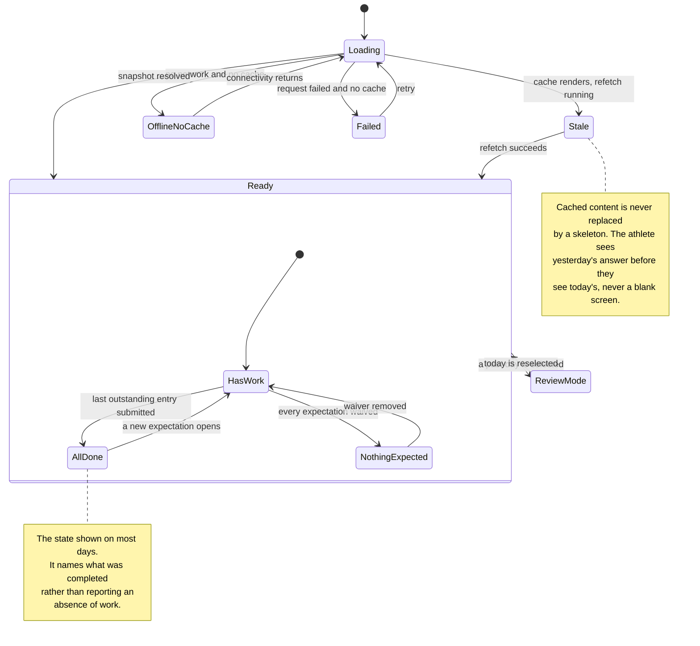

# Screen: Today

> **Layout status**: provisional. Awaiting client design photographs.

Screen 1 in `02-information-architecture.md` §5. Tab 1 of the athlete shell. Default landing
screen for every athlete session.

Every layout decision below that would normally come from the client's designs is marked
**[Assumed, pending photographs]**. Nothing marked that way is settled.

---

## Purpose

Today answers one question in one screenful: what does this athlete have to do right now.
It lists outstanding entries in priority order with a one-tap route into each, shows the
day's sessions so the athlete knows where to be, and states plainly when their availability
has been restricted. It is the screen the 07:00 wellness push lands on, it is the screen
that carries the entire compliance burden described in `00-product-overview.md` success
criterion 3, and on most days it will be showing the all-done state rather than a task
list. If this screen is slow, ambiguous, or nags, weekly compliance falls below 80% and
every downstream analysis in the product degrades with it.

---

## Roles and access

| Role | Sees this screen | Notes |
|---|---|---|
| Athlete | Yes. It is their default tab. | Own data only. RLS returns nothing for another athlete. |
| Coach / S&C who also holds an athlete profile | Yes, through the shell switcher | `resolveShell()` in `05-architecture.md` §5 puts a dual-role user in the staff shell. They reach Today through the "Switch to my athlete view" control in the staff More tab. The screen behaves identically. |
| Medical who also holds an athlete profile | As above | |
| Admin without an athlete profile | No | `auth_athlete_id()` is null, so the athlete shell is unreachable and the screen has no data source. |
| Staff viewing an athlete | No | Staff read the same underlying data through `athlete-profile.md` (screen 20), which is a different screen with different affordances. Today is never rendered for someone else's athlete id. |

There is no role-conditional content within the screen. An athlete sees their own outstanding
entries, their own sessions, and their own availability. There is no squad information, no
other athlete's name, and no flag that has not been acknowledged by staff
(`01-roles-and-permissions.md` §3, carve-out 2).

---

## Entry points

| Entry point | Context carried | Landing behaviour |
|---|---|---|
| App cold start, athlete shell | none | Today, scrolled to top, date = device-local today |
| App warm start / tab bar tap | none | Today, preserving scroll position if the app has been backgrounded under 5 minutes, otherwise scrolled to top |
| Push `athlete.wellness.prompt` | route `/athlete/today?open=wellness` | Today renders behind, the wellness entry sheet is presented immediately. One tap from lock screen to the first slider, per `08-notifications.md` §3.1. |
| Push `athlete.wellness.nudge` | `/athlete/today?open=wellness` | As above |
| Push `athlete.rpe.prompt` | `/athlete/today?open=rpe&session={session_id}` | Today renders behind, the RPE sheet opens for that session. If the session id no longer resolves, Today renders with a caption "That session is no longer scheduled." |
| Push `athlete.rpe.nudge` | as above | |
| Push `athlete.nutrition.matchday` | `/athlete/programme/nutrition?view=matchday` | Does **not** land here. It opens the matchday plan in `nutrition-guidance.md`. Listed only to record that it does not, because it used to. |
| Push `athlete.session.changed` | `/athlete/today` | Today, with the changed session card highlighted for 3 s using a border pulse, suppressed under reduced motion |
| Push `athlete.programme.assigned` | `/athlete/programme/{assignment_id}` | Does **not** land here. Listed only to record that it does not. |
| Push `athlete.availability.changed` | `/athlete/availability` | Does not land here. The banner on Today reflects the same change. |
| Completion of onboarding | `first_run: true` | Today, with the first-run coach mark on the To do section (`onboarding.md` §walkthrough) |
| Back from wellness / RPE / gym entry | `submitted_entry_id`, `domain` | Today, list re-derived, the completed row animates out over `duration.base` and the confirmation toast shows |
| Back from My Data, Programme, Me tabs | none | Preserved scroll position |
| Realtime `org:{org_id}:schedule` message | session ids | No navigation. Invalidates `qk.today.snapshot(...)` and the schedule section re-renders in place. |

Deep-link parameters accepted by this route:

```
/athlete/today
  ?open = wellness | rpe | gym                       // presents that entry surface
  &session = <uuid>                                  // required when open=rpe or open=gym
  &date = <ISO date>                                 // debug and support only, not user-reachable
```

`open` is consumed once and stripped from the route, so a back gesture out of the sheet does
not re-present it. An `open` value naming a domain with no outstanding expectation still opens
the surface: the athlete asked for it, and the entry screens handle the "already submitted"
case themselves.

---

## Layout

### Web

Not applicable. The athlete client is mobile only in v1. The staff web dashboard has no
athlete shell, per `02-information-architecture.md` O-6 and the recommendation in
`09-security-and-compliance.md` §10.1 that staff surfaces do not cache squad data on a phone.
If athlete web is ever added, this screen is a single 560 pt centred column and nothing else
changes.

### Mobile, default state with work outstanding

**[Assumed, pending photographs]** Region order, banner placement, and the choice of a
horizontal `CalendarStrip` at the top are recommendations, not client decisions.

```
┌──────────────────────────────────────────────┐
│ ●  Wed 5 Aug                    ☁ Up to date │ A  Header, 56 pt + safe area
├──────────────────────────────────────────────┤
│  M   T   W   T   F   S   S                   │ B  CalendarStrip, 56 pt
│  3   4  [5]  6   7   8   9                   │    today ringed, selected filled
│ MD-3 MD-2 MD-1  MD  ·   ·   ·                │    MD-n beneath the numeral
├──────────────────────────────────────────────┤
│ ◑ Modified                                   │ C  Availability banner
│ No contact · No sprinting                    │    (conditional, see States)
│ Speak to medical staff.                  ›   │
├──────────────────────────────────────────────┤
│ To do                                     2  │ D  Section header
│ ┌──────────────────────────────────────────┐ │
│ │ ♥  Wellness                     Due    › │ │ E  Outstanding row, 72 pt
│ │    45 seconds · open since 07:00         │ │
│ ├──────────────────────────────────────────┤ │
│ │ 🏋 Lower A                   3 of 12   › │ │    in-progress gym session
│ │    Started 17:12 · resume                │ │
│ └──────────────────────────────────────────┘ │
├──────────────────────────────────────────────┤
│ Today                                        │ F  Section header
│ ┌──────────────────────────────────────────┐ │
│ │ 17:00  🏋 Lower A              MD-1      │ │ G  SessionCard, 88 pt
│ │        Main gym · 60 min                 │ │
│ ├──────────────────────────────────────────┤ │
│ │ 18:30  🏉 Captain's run        MD-1      │ │
│ │        Pitch 2 · 45 min · RPE due 19:45  │ │
│ └──────────────────────────────────────────┘ │
├──────────────────────────────────────────────┤
│ Something not right?                      ›  │ H  Report a problem row, 56 pt
├──────────────────────────────────────────────┤
│  [Today]   My Data   Programme   Me          │ I  Tab bar, 49 pt + inset
└──────────────────────────────────────────────┘
```

### Mobile, all-done state

This is the state shown on the majority of days once an athlete is in rhythm, so it is
specified first-class rather than as a fallback. It is not an error, it is not an empty list,
and it must not read as either.

```
┌──────────────────────────────────────────────┐
│ ●  Wed 5 Aug                    ☁ Up to date │ A
├──────────────────────────────────────────────┤
│  M   T   W   T   F   S   S                   │ B
│  3   4  [5]  6   7   8   9                   │
├──────────────────────────────────────────────┤
│                                              │
│              ✓ (32 pt glyph)                 │ D' EmptyState kind="allClear"
│           You're up to date.                 │    size="block", status.available
│      Wellness and RPE submitted today.       │    colours
│                                              │
├──────────────────────────────────────────────┤
│ Today                                        │ F
│ ┌──────────────────────────────────────────┐ │
│ │ 17:00  🏋 Lower A              MD-1      │ │ G
│ │        Main gym · 60 min      ✓ Logged   │ │
│ ├──────────────────────────────────────────┤ │
│ │ 18:30  🏉 Captain's run        MD-1      │ │
│ │        Pitch 2 · 45 min       ✓ RPE 6.0  │ │
│ └──────────────────────────────────────────┘ │
├──────────────────────────────────────────────┤
│ Next up                                      │ J  Look-ahead block, all-done only
│ Thu 6 Aug · MD · Kick-off 15:00 v Ashfield   │
├──────────────────────────────────────────────┤
│ Something not right?                      ›  │ H
├──────────────────────────────────────────────┤
│  [Today]   My Data   Programme   Me          │ I
└──────────────────────────────────────────────┘
```

Design rules for the all-done state, all binding:

1. **It states what was completed**, not merely that nothing is outstanding. "Wellness and
   RPE submitted today" is evidence the app received the work. "Nothing to do" invites the
   athlete to wonder whether their submission arrived.
2. **No praise, no streaks, no celebration.** `06-design-system.md` §12.2 bans it and
   `08-notifications.md` §2 bans the notification equivalent. The fixed copy is
   "You're up to date."
3. **It is not a full-screen takeover.** The schedule stays visible beneath it, because the
   athlete's remaining reason to open the app is to check where they need to be. Only the To
   do section collapses to the `allClear` block.
4. **A look-ahead block replaces the To do section**, naming the next fixture or the next
   session with an entry requirement. This gives the screen a purpose on a day with no work,
   which is what stops the athlete concluding the app has nothing for them.
5. **It renders in `status.available` colours with the tick glyph**, the only `EmptyState`
   kind permitted to do so.

### Region descriptions

| Ref | Region | Contents and rules |
|---|---|---|
| A | Header | Date at `title2`, sentence case, "Wed 5 Aug" format per `06-design-system.md` §12.2. Left: a 24 pt avatar or initials, tapping it opens the Me tab. Right: `SyncStatusIndicator` in `chip` variant. The header is not sticky: at 200% dynamic type it scrolls away so it cannot eat the viewport. |
| B | CalendarStrip | 7 days, Monday start, current week. Markers: filled dot for a session, filled square for a fixture, hollow dot for a missing entry on a past day. MD-n beneath the numeral where a fixture anchors the week. Selecting a past day switches the screen into **review mode** (see Interactions). Future days beyond today+7 are not selectable. |
| C | Availability banner | Rendered only when the current `availability.status` is `modified` or `unavailable`. Full-bleed, `status.*` tint background, glyph plus word plus restrictions plus the fixed copy "Speak to medical staff." Tapping opens `/athlete/availability`. Never dismissible: an athlete must not be able to hide a restriction. |
| D | To do section | Header "To do" at `title3` with a count. Contents are outstanding-entry rows in the priority order defined below. Maximum 6 rows; beyond that the list is scrollable within the screen, never truncated with a "show more". |
| E | Outstanding row | 72 pt tall, domain glyph, domain name at `bodyStrong`, a state chip (`Due`, `Overdue`, `Resume`, `Opens 17:00`), a secondary line of context, chevron. Whole row is one target. |
| F | Today section | Header "Today". `SessionCard` per session the athlete is a participant in, ordered by `starts_at`. Past sessions render at `surface.sunken`. |
| G | SessionCard | Time, type glyph, title, MD-n chip, location, duration, and the athlete's own state for that session: outstanding chips, `✓ Logged`, `✓ RPE 6.0`, or `Absent`. |
| H | Report a problem | A single row, `text.secondary`, opening the report-a-problem sheet. Deliberately at the bottom, deliberately quiet, and deliberately always present rather than only when the athlete is injured. It routes to medical per `03-flows.md` §6. |
| I | Tab bar | Standard athlete shell. Today shows a numeric badge equal to the outstanding count, cleared when the count reaches zero. |
| J | Next up | All-done state only. Next fixture, or next session requiring an entry, whichever is sooner within 7 days. Non-interactive text, `bodyCompact`. |

### Priority order for outstanding entries

Deterministic, implemented once in `packages/core/today.ts`, tested against fixtures. Sort
ascending by the tuple below, ties broken by `expectation_date` then domain name.

| Rank | Item | Condition |
|---|---|---|
| 1 | Wellness, overdue | Expectation for a past date, still inside the 14-day backdating window (`05-architecture.md` §6) |
| 2 | Wellness, today | Expectation for today, prompt time passed |
| 3 | RPE, overdue | Session ended on a previous day, expectation open |
| 4 | Gym session in progress | `gym_session_logs.status = 'in_progress'` for today |
| 5 | RPE, due now | Session ended over 30 minutes ago today |
| 6 | Gym session not started | Programme session scheduled today, no log |
| 7 | Wellness, today, not yet open | Expectation exists, prompt time not reached. Rendered disabled with "Opens 07:00" |
| 8 | RPE, not yet due | Session has not ended, or ended under 30 minutes ago. Rendered disabled with "Opens 19:45" |

**Nutrition never appears in this list.** Athletes do not log nutrition, no `'nutrition'`
expectation is generated (`04-data-model.md` §11), and there is nothing for an athlete to do.
Fuelling for today is reference content, reached from the Programme tab and from the "Fuelling
for today" card, and it is never an outstanding task. See `nutrition-guidance.md`.

Rationale for wellness first in every case: it is the only entry whose value depends on being
taken in the morning, and it is the input to the flag engine that changes today's session.
Rationale for showing not-yet-open items disabled rather than hiding them: an athlete who
opens the app at 06:40 and sees nothing concludes there is nothing to do today.

### Screen state machine



---

## Components

| Component | Source | Purpose here |
|---|---|---|
| `SyncStatusIndicator` | `06-design-system.md` §6.17 | Header chip. States the queue is safe without ever showing a network error. `banner` variant is used instead when state is `offline` or `blocked`. |
| `CalendarStrip` | §6.15 | Week navigation, MD-n labels, per-day markers, entry into review mode |
| `AvailabilityPill` | §6.5 | Inside the availability banner, `size="md"`, `variant="tint"`, `editable={false}` |
| `SessionCard` | §6.14 | Each of today's sessions. `attendance` and `outstanding` props are populated from the athlete's own state. |
| `EmptyState` | §6.16 | `allClear` for the all-done state, `noData` for a day with no expectations and no sessions, `offline` for a cold cache, `error` for a failed snapshot |
| `ComplianceRing` | §6.6 | Optional, in the all-done state's look-ahead block, showing this week's completed fraction. **[Assumed, pending photographs]** and gated by O-405. |
| `MetricTile` | §6.2 | Not used on this screen in v1. Recorded here so it is not added casually: Today is a task list, not a dashboard, and a readiness number at the top invites the athlete to optimise the number. |
| `BottomSheet` | §6.19 | Host for the wellness, RPE, and report-a-problem surfaces presented over Today |
| `ConfirmSheet` | §6.18 | Confirming discard of an in-progress entry when the athlete swipes the sheet away |
| `FlagBadge` | §6.4 | Not used in v1. See O-404. |

Outstanding-entry rows are a screen-local composition (`OutstandingRow`), not a shared
component, because nothing else in the product needs them. It is built from the primitives in
`packages/ui`, respects `density.comfortable`, and lives in
`apps/mobile/src/features/today/`.

---

## Data requirements

### Fields

| Field | Source | Transformation |
|---|---|---|
| `date` | device clock | Device-local calendar date. Never server date: only the athlete knows which day they mean (`05-architecture.md` §6). |
| `md_offset` | `sessions.md_offset`, else computed | Rendered as "MD-3", "MD", "MD+1". Null renders as `·`, never blank. |
| Outstanding domain | `compliance_expectations.domain` | Filtered to `is_required = true` and `waived_reason is null` |
| Outstanding date | `compliance_expectations.expectation_date` | Included where `expectation_date` between `today - 14` and `today` |
| Entry present | `wellness_entries_current.id` etc | Left join on `(athlete_id, entry_date)` with `superseded_by is null` (ADR-005 rule 3). Also unioned against local SQLite so a pending entry counts as done. |
| Wellness open time | `organisations.settings.notifications.wellness_prompt_at` | Resolved to the organisation timezone, compared with device local time |
| RPE due time | `sessions.starts_at + duration_min minutes + 30 minutes` | Per `08-notifications.md` §3.2. Null `duration_min` uses the org default, O-50 in that document. |
| Session list | `sessions` | Where the athlete is a participant directly or through a group membership live on that date, `deleted_at is null`, `status <> 'cancelled'` unless cancelled today (see Edge cases) |
| Session attendance | `session_attendance.attendance` | `absent` and `excused` suppress the RPE expectation for that session |
| Gym progress | `gym_session_logs.status`, `count(gym_set_logs)` | "3 of 12" is completed sets over resolved prescribed sets from `resolve_programme_session()` |
| Availability status | `availability.status` where `effective_to is null`, latest `effective_from` | Drives the banner |
| Restrictions | `availability.restrictions` | Joined with " · ", truncated to two lines with a "more" affordance |
| Availability note | `availability.note` | Non-clinical only. `injury_clinical` is never joined into this query, and the RLS test suite asserts it. |
| Next fixture | `fixtures.kickoff_at`, `opponent`, `home_away` | Nearest future fixture within 7 days |
| Sync state | local SQLite `outbox` | `count(*) where status in ('queued','inflight')`, plus `parked` count |

### Server contract

One RPC, not six queries. Today must be interactive within the 2.0 s p50 cold-start budget in
`05-architecture.md` §11, on a phone that may be on 3G in a car park.

```sql
-- Returns everything Today needs in one round trip.
-- security invoker: RLS applies exactly as it does to a direct table read.
create or replace function public.get_athlete_today(
  p_athlete_id uuid,
  p_date       date,
  p_lookback   int default 14
)
returns jsonb
language sql
stable
security invoker
as $$
  with expectations as (
    select ce.expectation_date, ce.domain, ce.session_id, ce.is_required
    from public.compliance_expectations ce
    where ce.athlete_id = p_athlete_id
      and ce.expectation_date between p_date - p_lookback and p_date
      and ce.is_required
      and ce.waived_reason is null
  ),
  submitted as (
    select w.entry_date, 'wellness'::public.compliance_domain as domain, null::uuid as session_id
      from public.wellness_entries_current w
     where w.athlete_id = p_athlete_id and w.entry_date >= p_date - p_lookback
    union all
    -- no 'nutrition' branch: nothing is logged and no nutrition expectation is
    -- ever generated, so there is nothing to match. See 04-data-model.md §11.
    select t.entry_date, 'training_rpe', t.session_id
      from public.training_entries_current t
     where t.athlete_id = p_athlete_id and t.entry_date >= p_date - p_lookback
    union all
    select g.entry_date, 'gym', g.session_id
      from public.gym_session_logs g
     where g.athlete_id = p_athlete_id and g.entry_date >= p_date - p_lookback
       and g.status = 'complete'
  ),
  outstanding as (
    select e.*
    from expectations e
    left join submitted s
      on s.entry_date = e.expectation_date
     and s.domain     = e.domain
     and (s.session_id is not distinct from e.session_id)
    where s.entry_date is null
  ),
  todays_sessions as (
    select s.id, s.session_type, s.title, s.starts_at, s.duration_min, s.location,
           s.md_offset, s.status, s.requires_rpe,
           sa.attendance,
           gl.id as gym_log_id, gl.status as gym_log_status
    from public.sessions s
    left join public.session_attendance sa
           on sa.session_id = s.id and sa.athlete_id = p_athlete_id
    left join public.gym_session_logs gl
           on gl.session_id = s.id and gl.athlete_id = p_athlete_id
    where s.deleted_at is null
      and (s.starts_at at time zone public.org_timezone(s.org_id))::date = p_date
      and public.athlete_in_session(p_athlete_id, s.id)   -- direct or via live group membership
  ),
  current_availability as (
    select a.status, a.restrictions, a.reason_category, a.effective_from, a.note
    from public.availability a
    where a.athlete_id = p_athlete_id and a.effective_to is null
    order by a.effective_from desc
    limit 1
  ),
  next_fixture as (
    select f.id, f.opponent, f.kickoff_at, f.home_away, f.competition
    from public.fixtures f
    where f.deleted_at is null
      and f.status = 'scheduled'
      and f.kickoff_at >= now()
    order by f.kickoff_at
    limit 1
  )
  select jsonb_build_object(
    'date',          p_date,
    'outstanding',   coalesce((select jsonb_agg(to_jsonb(o)) from outstanding o), '[]'::jsonb),
    'sessions',      coalesce((select jsonb_agg(to_jsonb(t) order by t.starts_at)
                                 from todays_sessions t), '[]'::jsonb),
    'availability',  (select to_jsonb(c) from current_availability c),
    'next_fixture',  (select to_jsonb(n) from next_fixture n),
    'generated_at',  now()
  );
$$;
```

Notes on the contract:

- `athlete_in_session()` resolves both `session_participants.athlete_id` and
  `session_participants.group_id` against `group_memberships` live on `p_date`, so an athlete
  added to Forwards yesterday sees the forwards session today and does not retroactively
  appear in last month's.
- `org_timezone()` reads `organisations.timezone`. Session day boundaries are organisation
  local, entry dates are device local. These differ for an athlete abroad, which is handled
  under Edge cases.
- The function never touches `injuries`, `injury_clinical`, `flags`, or any other athlete's
  rows. A change that adds such a join fails the cross-tenant and carve-out assertions in
  `09-security-and-compliance.md` §8.2.

### Hook

Additions to the key factory in `05-architecture.md` §9, which is the only permitted way to
build a key:

```ts
// packages/queries/keys.ts, added to qk
today: {
  all: (orgId: string) => [...qk.org(orgId), 'today'] as const,
  snapshot: (orgId: string, athleteId: string, date: string) =>
    [...qk.today.all(orgId), 'snapshot', athleteId, date] as const,
},
```

```ts
// packages/queries/today.ts
export type TodaySnapshot = {
  date: string;
  outstanding: OutstandingItem[];
  sessions: TodaySession[];
  availability: CurrentAvailability | null;
  nextFixture: NextFixture | null;
  generatedAt: string;
};

export function useTodaySnapshot(args: {
  orgId: string;
  athleteId: string;
  date: string;             // ISO date, device local
}): UseQueryResult<TodaySnapshot>;
```

```ts
// apps/mobile/src/features/today/useToday.ts
export function useToday(): {
  snapshot: TodaySnapshot | undefined;
  outstanding: OutstandingItem[];   // server snapshot reconciled against local SQLite
  status: 'loading' | 'ready' | 'stale' | 'error' | 'offlineNoCache';
  lastUpdatedAt: string | null;
  refresh: () => Promise<void>;
};
```

Query options, per the freshness policy in `05-architecture.md` §9:

| Option | Value | Reason |
|---|---|---|
| `staleTime` | `60_000` | The set of outstanding entries changes at prompt boundaries, not continuously |
| `gcTime` | `24 * 60 * 60_000` | Persisted, so the screen renders offline on the next cold start |
| `refetchOnWindowFocus` | `true` | The athlete backgrounds the app during a session and returns |
| `refetchInterval` | `false` | Polling a task list wastes battery. Time-based transitions are computed on the client from a 60 s ticker. |
| `persister` | AsyncStorage, key-scoped by `orgId` | |
| `networkMode` | `'offlineFirst'` | The screen is fully functional from cache |

**The client owns the clock, not the server.** `generated_at` is a snapshot moment; whether
the 07:00 wellness window has opened, whether an RPE became due at 19:45, and whether a
disabled row should become enabled are recomputed locally every 60 seconds while the screen is
focused, and on every foreground transition. Refetching to learn that a minute has passed is
wrong on a phone in a changing room.

### Local reconciliation

The server snapshot is authoritative for expectations, sessions, and availability. SQLite is
authoritative for whether an entry exists (`05-architecture.md` §9). Reconciliation:

```ts
// A locally submitted entry removes its outstanding row immediately,
// before any sync has occurred. Never wait for the server to agree.
const outstanding = snapshot.outstanding.filter(
  (o) => !localEntries.has(`${o.domain}:${o.expectationDate}:${o.sessionId ?? ''}`),
);
```

A locally submitted entry that is later `rejected` by `sync-push` (for example
`date_too_old`) reappears as outstanding with the state chip "Not submitted" and a tap opens
the sync status screen rather than the entry form. It is never silently dropped.

---

## States

### Default

At least one outstanding item. The To do section renders, the tab badge shows the count, and
the first row is the highest-priority item.

### Loading

| Condition | What the athlete sees |
|---|---|
| Cold start, no persisted cache | Header renders with the date. `CalendarStrip` renders complete (it needs no server data). To do and Today sections render skeletons: two 72 pt blocks and two 88 pt blocks, `surface.skeleton`, no shimmer under reduced motion. Skeletons appear after 150 ms and stay a minimum of 400 ms (`06-design-system.md` §11.1). |
| Cold start, persisted cache present | Cached content renders immediately. A 2 pt indeterminate bar sits under the header while revalidating. **The screen is never replaced by a skeleton when cached data exists.** |
| Pull to refresh | Platform refresh control. Content stays. |

### Empty, distinguished by cause

`06-design-system.md` §11.2 requires the reasons to be distinguished, because the right
message differs.

| Cause | Kind | Copy |
|---|---|---|
| All expectations met today | `allClear` | Title "You're up to date." Body names what was submitted: "Wellness and RPE submitted today." |
| No expectations and no sessions (rest day per the week template) | `noData` | Title "Nothing scheduled today." Body "No entries are expected. Next: Thu 6 Aug, kick-off 15:00." No action. |
| Expectations exist but none are open yet (athlete opens the app at 06:15) | `notStarted` | Title "Nothing open yet." Body "Wellness opens at 07:00." The disabled row is still listed beneath. |
| Athlete has no assignments at all, first day after onboarding | `notStarted` | Title "You're set up." Body "Your first wellness entry opens at 07:00 tomorrow. Your programme appears here when your coach assigns one." |
| Athlete unavailable and every expectation waived | `allClear` with `compliance.waived` colouring | Title "Nothing expected today." Body "Your entries are paused while you are unavailable." Availability banner is still shown above. |

### Error

Errors render at the smallest scope that failed (`06-design-system.md` §11.3).

| Failure | Behaviour |
|---|---|
| `get_athlete_today` fails, cache present | Cached content stays. A caption under the header reads "Last updated 07:12." with a retry affordance. No red, no modal. |
| `get_athlete_today` fails, no cache | `EmptyState` kind `error`, size `screen`: "Could not load today. Check your connection and try again." with a "Try again" action. The tab bar and the report-a-problem row remain reachable. |
| Availability sub-object missing but the rest loaded | Banner is not rendered and a caption under the header reads "Availability could not be loaded." Never guess a status, never render "Available" by default (`06-design-system.md` §6.5). |
| Sessions failed, expectations loaded | To do renders normally, Today section shows a one-line caption "Schedule unavailable." |
| Athlete id resolves but returns zero rows for everything | Treated as `noData`, not as an error. A new athlete legitimately has nothing. |
| 401 during refetch | Silent token refresh. On refresh failure, the screen keeps rendering from cache and `SyncStatusIndicator` moves to `blocked` with "Sign in again to sync". Nothing is lost. |

An athlete never sees an HTTP status code, a correlation id in the headline, or the word
"error" in relation to a submission. Correlation ids live behind "Details" on the sync status
screen only.

### Offline

Offline is a normal operating mode (`00-product-overview.md` design principle 3).

| Sub-state | Behaviour |
|---|---|
| Offline, cache present | Everything renders. `SyncStatusIndicator` shows `offline`: "Offline. Your entries are saved." Entry surfaces open and submit normally. A caption under the header states the cache age when older than 4 hours: "Last updated 07:12." |
| Offline, no cache (fresh install, no signal) | `EmptyState` kind `offline`, size `screen`: "You're offline. This will load when you reconnect." The report-a-problem row is disabled with the explanation "Available when you reconnect", because it must reach medical staff and cannot be queued meaningfully. |
| Offline with queued entries | `SyncStatusIndicator` shows `pending` with the count: "2 entries will sync." Tapping opens the queue sheet. |
| Reconnect | Sync fires, the indicator moves `syncing` then `synced`, and `qk.today.snapshot` is invalidated. No toast, no interruption. |
| Parked ops present | Indicator stays `pending` and a single caption appears above the To do section: "1 entry has not been sent. Open sync status." This is the only place a sync failure is surfaced (`05-architecture.md` §6). |

### Availability states

| `availability.status` | Banner | Effect on the rest of the screen |
|---|---|---|
| `available`, or no row | No banner | None |
| `modified` | `status.modified` tint, glyph `availability-part`, word "Modified", restrictions listed, fixed copy "Speak to medical staff." | None. A modified athlete still submits everything. |
| `unavailable` | `status.unavailable` tint, glyph `availability-none`, word "Unavailable", restrictions, expected return date when set: "Review 8 August." | Expectations may be waived by staff, in which case those rows do not appear. The screen does not decide this: `compliance_expectations.waived_reason` does. |
| Status changed within the last 24 h | Banner carries a "Changed 2 hours ago" caption at `caption` size | Draws attention to a new restriction without an interstitial |

The banner never shows a diagnosis, a body area beyond what `availability.restrictions`
contains, or any text from `injury_clinical`. That is enforced by the query, not by the
template.

### Review mode (a past day selected)

Selecting a past day in `CalendarStrip` switches the screen to a read-only view of that day:
sessions as they were, entries as submitted with their values, and missing entries shown with
the `compliance.missing` glyph and the word "Missing", never a zero
(`06-design-system.md` §5.4). The To do section is replaced by "That day" and, where the day
is inside the 14-day backdating window and the expectation is still open, a single action
"Submit for Mon 3 Aug" which opens the relevant entry surface with `entry_date` pinned. Beyond
14 days the action is absent and a caption states "Too late to submit for this day."

### Notification permission blocked

When `users.push_blocked_at` is set, a dismissible banner appears above the To do section at
most once every 14 days (`08-notifications.md` §8.5): "Notifications are off. You will not get
the morning wellness reminder." with a "Turn on" action opening OS settings. It never blocks
content and it never appears twice in a fortnight.

### Notifications paused by the athlete

When `users.notifications_paused_until` is in the future, a quiet caption sits in the header
area: "Notifications paused until 12 Aug." No banner, no action. The athlete chose this
(`08-notifications.md` §5.2).

---

## Interactions

| Gesture | Target | Result |
|---|---|---|
| Tap | Outstanding row | Presents the matching entry surface as a bottom sheet over Today. Wellness and RPE are sheets; gym logging is a full screen push, because it is a long session-length task and a sheet over a dimmed Today is the wrong frame for 40 minutes of work. |
| Tap | Outstanding row in the disabled "not yet open" state | No navigation. A 2 s inline caption appears beneath the row: "Opens at 07:00." One `impactAsync(Soft)` haptic. |
| Tap | `SessionCard` | Pushes the athlete session detail screen: full prescription, location, notes, and the entry actions for that session. Carries `session_id`. |
| Tap | Availability banner | Pushes `/athlete/availability`: current status, restrictions, expected return, rehab plan link if assigned. Never clinical notes. |
| Tap | Header sync chip | Presents the sync status sheet: queued count, last sync time, parked items with plain-language reasons and a "Try again" action. |
| Tap | Avatar | Switches to the Me tab. |
| Tap | Report a problem row | Presents the report-a-problem sheet: body area picker, free text, optional "I cannot train today" toggle. Submitting notifies medical immediately per `08-notifications.md` (`staff.injury.reported`, P1, bypasses quiet hours). Confirmation copy: "Sent to medical staff." |
| Tap | Day in `CalendarStrip` | Selects that day. Today re-renders in review mode for past days. Future days beyond today are not selectable and render at 0.4 opacity. |
| Swipe horizontally | `CalendarStrip` | Moves by whole weeks, snapping. Cannot scroll beyond the season start or beyond today + 7 days. |
| Pull down | Screen body | Refresh. Refetches the snapshot and triggers a sync attempt. Spinner is retained under reduced motion but shortened. |
| Swipe down | An open entry sheet with unsaved input | Presents `ConfirmSheet`: "Discard this entry? Nothing is saved." Cancel is first and wider. With no input entered, the sheet dismisses without confirmation. |
| Long press | `SessionCard` | Nothing in v1. Recorded so it is not assigned casually; a hidden action on the athlete's most-tapped card is a discoverability failure. |
| Tap | Tab bar Today while already on Today | Scrolls to top. A second tap within 1 s selects today's date if a past day was selected. |
| System back (Android) | Screen root | Exits the app, standard tab-root behaviour. Never navigates between tabs. |
| Deep link arrival while the screen is mounted | route params | Presents the requested sheet over the existing screen without a re-mount, so scroll position and any in-progress state survive. |

Transitions on this screen are capped at `duration.base` (200 ms), and any transition into the
wellness flow is capped at `duration.fast` (120 ms) per `06-design-system.md` §1.1.

Haptics: `impactAsync(Light)` on an outstanding row tap, `impactAsync(Soft)` on a disabled row
tap, `notificationAsync(Success)` once when a returning entry submission removes the last
outstanding row. No haptic on scroll, on refresh, or on tab change.

---

## Validation rules

Today has no free input. The rules that apply are gating rules on what the screen offers.

| Rule | Behaviour on breach |
|---|---|
| An entry surface may only be opened for a date within `[today - 14, today]` | The row is not rendered for older dates and the review-mode action is absent, with the caption "Too late to submit for this day." |
| An entry surface may not be opened for a future date | Future days are not selectable in `CalendarStrip`. A deep link carrying a future `date` is clamped to today and the parameter is ignored. |
| RPE may only be submitted for a session the athlete attended | Sessions with `attendance` of `absent` or `excused` produce no RPE row. If attendance is unrecorded, the row is shown: not recording attendance is a staff omission and must not cost the athlete their entry. |
| Gym logging may only start against a resolvable programme session | If `resolve_programme_session()` returns zero exercises (every one exempt), the row reads "No gym work prescribed today" and is not tappable. |
| Report a problem requires a body area or free text | The submit button stays disabled with the count "Add a body area or a note". |
| Report a problem free text limited to 500 characters | Counter appears at 450. Input is hard-stopped at 500. |
| Report a problem requires connectivity | Offline, the action is disabled with "Available when you reconnect". It is the one athlete action that is not queued, because a delayed injury report is a safety problem, not a data problem. |

---

## Edge cases

1. **The athlete opens the app at 06:15, before the prompt time.** Wellness appears as a
   disabled row reading "Opens 07:00", not hidden and not enabled. Hiding it produces "the app
   had nothing for me"; enabling it produces a wellness entry taken at 06:15 by an athlete who
   has not slept the night the entry is about.
2. **The org prompt time is 07:00 and the athlete is in a different timezone on tour.** The
   prompt time resolves in the organisation timezone, the entry date resolves on the device.
   An athlete in Dublin sees the row open at 07:00 Dublin time only if the org is Irish. The
   screen shows the resolved local open time explicitly ("Opens 08:00") rather than an
   abstract "opens later", so a discrepancy is visible rather than mysterious.
3. **Device clock is wrong by a day.** `sync-push` measures skew (`05-architecture.md` §6). At
   over 10 minutes of skew the screen keeps using the device date for `entry_date` but shows a
   caption: "Your device clock looks wrong. Entries may be dated incorrectly." Beyond 24 hours
   of skew the entry surfaces still open, because refusing to let an athlete submit is worse
   than a mis-dated entry that the server range checks will reject and surface.
4. **A session is cancelled while the athlete is looking at the screen.** The realtime
   schedule broadcast invalidates the snapshot. The card animates to the cancelled style
   (strikethrough title, "Cancelled" chip) in place. It is not removed: an athlete who is
   already driving to the ground needs to see that it was cancelled, not find an empty list.
   It disappears at the next cold start of a later day.
5. **A session is cancelled after the athlete logged its RPE.** The entry is retained
   (`05-architecture.md` §6 conflict rules). The compliance expectation is waived. The card
   shows "Cancelled" and "✓ RPE 6.0" together.
6. **Two sessions end within 90 minutes of each other.** One combined RPE row appears, reading
   "RPE for 2 sessions", opening a sheet that collects a rating for each in one flow. This
   mirrors the single combined notification in `08-notifications.md` §3.2.
7. **A session has no `duration_min`.** RPE due time uses the organisation default (O-50 in
   `08-notifications.md`). The row's secondary line says "Opens 30 minutes after the session"
   rather than a specific time, because a fabricated precise time is worse than an honest
   relative one.
8. **An evening fixture ends after 21:00.** No RPE row appears that night. It appears the next
   morning at the top of the To do list as "RPE, yesterday's fixture" with rank 3, matching
   the notification rule.
9. **The athlete is made unavailable at 06:50 and wellness is waived at 07:00.** The wellness
   row disappears between two renders. A caption replaces it for the remainder of the day:
   "Wellness is paused while you are unavailable." Silently removing a task the athlete saw
   ten minutes ago reads as a bug.
10. **The athlete is made available mid-morning and expectations are un-waived.** The rows
    appear. No notification fires from this screen; the availability change notification
    already went out.
11. **An athlete belongs to two groups that are both assigned to the same session.** The
    session appears once. `athlete_in_session()` returns a boolean, and the session list is
    distinct on `sessions.id`.
12. **An athlete is removed from a group mid-day.** Membership is evaluated as at the session
    date, and `group_memberships` is history-preserving. A session already logged stays
    visible; a future session for that group disappears at the next refetch.
13. **Backdated expectation appears after the fact.** Staff generate expectations for a past
    day (a session was added retrospectively). It appears in To do labelled with its date,
    "Wellness, Mon 3 Aug", ranked 1, and is submittable within the 14-day window.
14. **The wellness entry was submitted on another device.** The pull phase brings the server
    row down and the row disappears on next refetch. Until then the athlete may open the
    entry surface, which detects the existing entry and offers the correction flow instead of
    a duplicate (`wellness-entry.md` §Edge cases).
15. **A queued entry is rejected as `date_too_old`.** The row returns to To do with the chip
    "Not submitted", and tapping opens the sync status sheet with the plain-language reason,
    not the entry form. Re-opening the form would invite an athlete to fill it in twice and
    fail twice.
16. **An in-progress gym log from yesterday.** `close_stale_gym_logs` marks it `abandoned`
    after 24 hours (`05-architecture.md` §7). Before that job runs, it appears under To do as
    "Lower A, started yesterday, resume". Afterwards it disappears from To do and shows in My
    Data as abandoned with its logged sets intact. Sets are never discarded.
17. **The athlete has 6 or more outstanding items** (returning from a week away). The section
    scrolls internally. No "show more" affordance, no truncation, and no aggregate row. A
    truncated list of unmet obligations is how an athlete decides the app is unmanageable, so
    the priority order does the work instead.
18. **Zero sessions, zero expectations, and the athlete is available.** `noData` state naming
    the next scheduled thing. If nothing is scheduled within 7 days, the body reads "Nothing
    scheduled this week."
19. **Availability row exists with `effective_from` in the future.** It is not the current
    status. The banner shows the currently effective row only, and a caption states "Changes
    to Modified on 8 August" when a future-dated row exists.
20. **Two availability rows with `effective_to is null`.** A data defect. The screen takes the
    latest `effective_from`, renders normally, and reports the condition to Sentry as a data
    integrity warning with identifiers only. It never renders two banners.
21. **The athlete has no `user_id` linked yet.** Unreachable: without a user there is no
    session. Recorded because `athletes.user_id` is nullable and it is easy to assume otherwise.
22. **The athlete is a dual-role coach viewing their own Today.** Identical screen. The group
    filter does not apply: Today displays exactly one athlete, and `GroupFilter` is absent
    rather than disabled, because a filter control on a single-athlete screen has no meaning.
23. **Dynamic type at 200%.** Header scrolls away, `CalendarStrip` day cells grow to 44 by
    72 pt and the MD-n line drops, outstanding rows wrap to three lines and grow, `SessionCard`
    moves the trailing chips to their own line. Nothing clips and nothing is removed.
24. **A locked-on-lock-screen deep link into wellness when the entry already exists.** The
    entry surface opens and immediately renders its already-submitted state with the
    correction option, rather than an empty form.
25. **Cold start with a 400-item outbox** (a phone that has been offline for weeks). The
    screen renders from cache immediately. Sync drains in batches of 200
    (`05-architecture.md` §6) in the background. The count in the sync chip is exact, not
    capped at 99.

---

## Performance notes

| Path | Budget | How it is met |
|---|---|---|
| Cold start to Today interactive | 2.0 s p50, 3.5 s p95 (`05-architecture.md` §11) | Render order: shell and header from constants, `CalendarStrip` from local computation, then persisted cache, then network. Nothing on this screen waits on the network to paint. |
| Warm start to Today | 800 ms p95 | Query cache is in memory; the screen re-renders from it synchronously |
| `get_athlete_today` server time | 150 ms p95 | One RPC, indexed on `(athlete_id, entry_date desc)` for every entry table and `(org_id, starts_at)` for sessions, per `04-data-model.md` §15. No materialised view needed: this is a single-athlete, single-day query. |
| Tap outstanding row to entry surface visible | 200 ms p95 | Entry surfaces are pre-registered routes. The wellness sheet's component tree is prefetched on Today mount, because it is opened on most days. |
| Time-based row transitions | Under one frame | A single 60 s interval ticker drives all of them. No per-row timers. |

Additional rules:

- **The snapshot is one request.** Six parallel queries on a cold 3G start cost six TLS
  handshakes on a connection that may complete none of them.
- **Do not subscribe to Realtime before first paint.** The schedule channel is subscribed
  after the screen is interactive, and torn down on background
  (`05-architecture.md` §8).
- **The list is not virtualised.** Maximum realistic size is around 6 outstanding rows and 4
  session cards. A `FlatList` here costs more than it saves.
- **No animation on data refresh** (`06-design-system.md` §8.6 principle applied generally).
  Rows appearing after a refetch fade in at `duration.fast`; nothing moves.
- Image loading: the avatar is the only image, cached, and its absence renders initials
  immediately rather than a placeholder box.

---

## Accessibility

| Element | Label pattern | Example |
|---|---|---|
| Screen | `accessibilityRole="header"` on the date | "Wednesday 5 August" |
| Outstanding row | `{domain}. {state}. {context}` plus role button | "Wellness. Due. Takes about 45 seconds. Button." |
| Disabled outstanding row | `{domain}. Opens at {time}.` with `accessibilityState={{ disabled: true }}` | "Wellness. Opens at 07:00. Dimmed." |
| Availability banner | Pattern from `06-design-system.md` §10.3 | "Modified. No contact, no sprinting. Speak to medical staff. Button." |
| `SessionCard` | `{time}. {title}. {type}. {md}. {location}. {athlete state}` | "17:00. Lower A. Gym session. MD minus 1. Main gym. Not yet logged. Button." |
| `CalendarStrip` day | `{weekday} {date}. {markers}. {selected}` | "Wednesday 5 August. Two sessions. Selected. Today." |
| Sync chip | Full state sentence | "Offline. Two entries saved and will sync. Button." |
| All-clear state | Title and body read as one | "You're up to date. Wellness and RPE submitted today." |
| Tab badge | Merged into the tab label, not announced separately | "Today, 2 items outstanding. Tab 1 of 4." |
| Report a problem | Verb-first | "Report a problem to medical staff. Button." |

Requirements:

- **Touch targets**: every row is at least 56 pt tall and full width minus insets. Calendar
  day cells are 44 by 56 pt. The sync chip is visually 28 pt tall with hit slop to 44 pt. The
  48 pt floor in `06-design-system.md` §10.1 applies to every `Pressable` and is asserted by
  the component test suite.
- **Focus order** follows visual order: header, calendar, availability banner, To do rows,
  session cards, report a problem, tab bar. The availability banner is placed before the task
  list deliberately so a screen reader user hears a restriction before they hear about work.
- **Dynamic type** 85% to 200% supported. No fixed heights on any container holding text.
  Verified at 100%, 150%, 200%.
- **Live regions**: the outstanding count and the sync state are announced on change, politely.
  A row disappearing after a submission announces "Wellness submitted. 1 item outstanding."
- **Reduced motion**: row removal is an instant layout change, the refresh spinner is retained
  but shortened, the session-changed highlight is a static border rather than a pulse, and no
  skeleton shimmers.
- **Colour is never the sole channel**: the availability banner carries a glyph and a word,
  outstanding state chips carry words, and calendar markers differ in shape as well as colour
  (`06-design-system.md` §4.1, §6.15).
- **No time limits**: nothing on this screen expires while the athlete is reading it. A
  session that expires mid-view preserves state and re-authenticates afterwards.

---

## Open questions

- **O-404** Should acknowledged flags appear on Today? `01-roles-and-permissions.md` carve-out
  2 makes a flag visible to the athlete once staff acknowledge it, and
  `08-notifications.md` has `athlete.flag.shared` defaulting to off. I have deliberately kept
  flags off this screen: Today is a task list, and a red badge telling an athlete their sleep
  has been flagged is the conversation the carve-out exists to keep human. The alternative is
  a quiet "Note from your coach" card beneath the availability banner. Decide which, because
  it changes what the athlete learns from the app rather than from a person.
- **O-405** Should the all-done state show weekly compliance? A `ComplianceRing` reading "4 of 5
  this week" gives the screen substance on a completed day and is honest feedback rather than
  praise. It also turns a task list into a score, which is exactly the pressure that makes
  self-report dishonest. My assumption is **no ring in v1**. Confirm.
- **O-406** How far back should an athlete be able to submit? `05-architecture.md` §6 rejects
  entries older than 14 days at the sync layer, and I have used the same window for the review
  mode action. Fourteen days of backfill after a holiday is a lot of low-quality retrospective
  data. A shorter window, 3 days for wellness and 2 days for RPE, would produce better data and
  more missing days. Your call on which is worse.
- **O-407** Should Today show tomorrow? The look-ahead block names the next fixture. A club with
  early travel may want tomorrow's full schedule on the screen the night before. Adding it
  costs a second section and risks the athlete reading tomorrow's session as today's. My
  assumption is the single "Next up" line only.
- **O-408** Is "Something not right?" the right label for the report-a-problem action? It is
  deliberately soft to lower the barrier to reporting a niggle early, which is the behaviour
  worth encouraging. A physio may prefer "Report an injury", which is clearer and will be used
  less often. This is a clinical judgement about reporting culture at your target clubs.
- **O-409** Does the athlete need a manual "mark as not training today" control on Today?
  Currently only medical can change availability, and an athlete who is ill can only report a
  problem. That is correct for availability, but it means an ill athlete has no way to signal
  "I am not coming in" other than a phone call. A non-clinical "I am not training today, with
  a reason" that notifies coaching staff and waives that day's session expectations may be
  worth having. It is a new concept, not a layout change, so I have not assumed it.

---

## Related documents

- Athlete navigation and tab structure → `02-information-architecture.md` §3
- The daily loop this screen sits in → `03-flows.md` §1
- Offline and queue behaviour → `05-architecture.md` §6, ADR-004
- Component definitions → `06-design-system.md` §6
- Prompt and nudge rules → `08-notifications.md` §3
- Entry surfaces reached from here → `wellness-entry.md`, `training-entry.md`, `gym-logging.md`
- Nutrition guidance, which is read-only and is not an entry surface → `nutrition-guidance.md`
