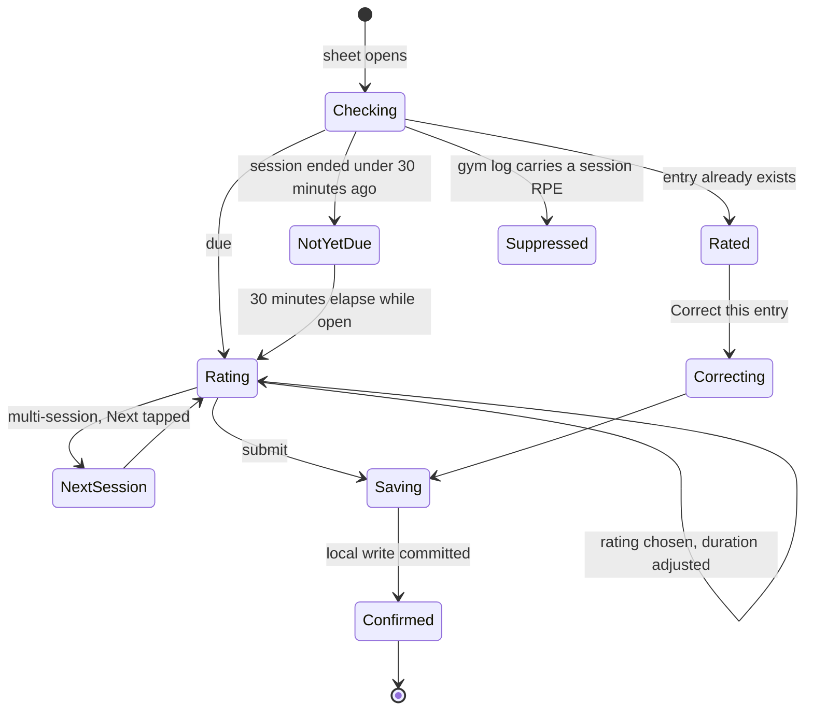

# Screen: Training RPE entry

> **Layout status**: provisional. Awaiting client design photographs.

Screen 5 in `02-information-architecture.md` §5. Presented as a bottom sheet over Today.

Every layout decision below that would normally come from the client's designs is marked
**[Assumed, pending photographs]**. Nothing marked that way is settled.

---

## Purpose

This screen collects one number and confirms a second. The number is session RPE on the Borg
CR10 scale, and multiplied by the session duration it produces `session_load`, which is the
input to every acute-to-chronic workload calculation in the product and therefore to the single
most useful flag Fydr raises. It is the cheapest high-value data collection in sports science:
one rating, thirty seconds, and a coach can see whether a squad's loading pattern is escalating.

It fires **30 minutes after the session ends**, and that delay is not a scheduling convenience.
RPE taken immediately after a session is biased by the final drill: a hard finisher inflates
the rating and a cool-down deflates it (`04-data-model.md` §5, `08-notifications.md` §3.2). The
30 minutes is enforced by the notification scheduler and by this screen, and it is not
configurable downwards.

Target completion time: **under 20 seconds** for a single session, including the duration
confirmation.

---

## Roles and access

| Role | Access |
|---|---|
| Athlete | Full, for themselves. Writes `training_entries` with `source = 'self_report'`. |
| Coach / S&C | Cannot use this screen. Staff record RPE on behalf of an athlete from the web dashboard with `source = 'staff_entered'`, which the athlete's own entry supersedes if they later submit one (`05-architecture.md` §6 conflict rules). |
| Medical | As coach. |
| Admin | No access. |

Content does not vary by role. It varies by how many sessions are outstanding and by whether
the session's duration is known.

---

## Entry points

| Entry point | Context carried | Landing behaviour |
|---|---|---|
| Push `athlete.rpe.prompt` | `/athlete/today?open=rpe&session={session_id}` | Today mounts behind, sheet opens on that session's rating |
| Push `athlete.rpe.nudge` | as above | Identical |
| Today, To do row "RPE" | `session_id` or, for a combined row, a list of session ids | Sheet opens. With more than one session, the multi-session flow. |
| Today, `SessionCard` for a completed session | `session_id` | Same |
| Today, review mode, a past day inside the backdating window | `session_id`, `entry_date` | Opens with the date banner. Date and session are pinned. |
| My Data, training tab, an entry row, "Correct this entry" | `original_entry_id` | Correction mode |
| Gym logging summary | none | Does **not** open this screen. See O-255 in `gym-logging.md`: a gym session that already carries `gym_session_logs.session_rpe` suppresses this prompt for the same `session_id`. |

There is no entry point for a session the athlete did not attend, and no entry point for a
session that has not yet ended.

---

## Layout

### Web

Not applicable in v1.

### Why not a slider

The five-stop `SliderInput` is the right control for the 1 to 5 wellness scales and the wrong one
here. Ten stops across a 358 pt track gives 39.8 pt between centres. The specification in
`06-design-system.md` §7.4 requires a 60 pt tap target per stop, and §10.1 sets a 48 pt floor.
Neither fits. A ten-stop slider would either overlap its targets or demand precision from a
thumb, and this screen is used by someone who has just finished a rugby session.

**Therefore: a vertical list of ten rows, tapped directly.** It is the classic Borg chart
orientation, every anchor word is visible simultaneously, every row is a full-width 48 pt
target, and selection is a single tap with no drag. It costs vertical space, which this screen
has, because it collects one value.

### Mobile wireframe, single session

**[Assumed, pending photographs]** Row order (10 at the top), the position of the duration
confirmation, and the anchor wording are recommendations. The anchor wording in particular
should be reviewed by whoever runs your sports science, raised as O-410.

```
┌──────────────────────────────────────────────┐
│                   ▁▁▁▁▁                      │ A  Grab handle
│ ✕        How hard was it?          Wed 5 Aug │ B  Header, 56 pt
├──────────────────────────────────────────────┤
│ Captain's run · 18:30 to 19:15 · MD-1        │ C  Session context, 44 pt
├──────────────────────────────────────────────┤
│ Rate the whole session, not the hardest bit. │ D  Instruction, 24 pt
│                                              │
│  ┌────────────────────────────────────────┐  │ E  CR10 list, 10 × 48 pt
│  │ 10   Maximal                           │  │
│  │  9   Extremely hard                    │  │
│  │  8   Very hard                          │  │
│  │  7   Hard                              │  │
│  │  6   ·                                 │  │
│  │  5   Somewhat hard              [ ◉ ]  │  │  selected: accent tint,
│  │  4   ·                                 │  │  2 pt border, tick
│  │  3   Moderate                          │  │
│  │  2   Easy                              │  │
│  │  1   Very easy                         │  │
│  └────────────────────────────────────────┘  │
├──────────────────────────────────────────────┤
│ How long were you training?                  │ F  Duration, 88 pt
│        ⊖             45              ⊕       │
│                    minutes                   │
│        Scheduled for 45 min                  │
├──────────────────────────────────────────────┤
│ ⌄ Add a note                                 │ G  Collapsed optional, 56 pt
├──────────────────────────────────────────────┤
│ ┌──────────────────────────────────────────┐ │ H  Pinned submit, 76 pt
│ │              Submit rating               │ │
│ └──────────────────────────────────────────┘ │
└──────────────────────────────────────────────┘
```

### Mobile wireframe, two sessions

One sheet, one submission, two ratings. The athlete does not get two notifications and must not
get two forms (`08-notifications.md` §3.2).

```
┌──────────────────────────────────────────────┐
│ ✕        How hard were they?       Wed 5 Aug │
├──────────────────────────────────────────────┤
│  ● Lower A          ○ Captain's run          │  progress dots, 2 steps
├──────────────────────────────────────────────┤
│ Lower A · 17:00 to 18:00 · gym               │
│ ... CR10 list ...                            │
│ ... duration ...                             │
├──────────────────────────────────────────────┤
│ │            Next: Captain's run           │ │  becomes "Submit both"
└──────────────────────────────────────────────┘  on the last session
```

The two sessions are steps within one sheet, advanced by the primary button. This is the one
place a step pattern is right, because each step is a complete unit of work with a clear name,
and there is no horizontal control to conflict with a swipe.

### Region descriptions

| Ref | Region | Rules |
|---|---|---|
| A | Grab handle | Drag to dismiss, with discard confirmation once a rating is chosen |
| B | Header | Close on the left. Title "How hard was it?" for one session, "How hard were they?" for several. Date on the right showing the entry date. |
| C | Session context | Title, start and end time, session type glyph, MD-n chip. Present so the athlete is certain which session they are rating, which matters on a double-session day. |
| D | Instruction | Fixed copy: "Rate the whole session, not the hardest bit." This one sentence is the main defence against the recency bias the 30-minute delay also targets. |
| E | CR10 list | Ten rows, 10 at the top descending to 1. Number at `metricM` on the left in a fixed-width column, anchor word at `body`. Unlabelled values render `·` in `text.tertiary`, never blank. Selected row: `accent.bg`, 2 pt `accent.border`, tick glyph. |
| F | Duration | `NumberStepper`, minutes, step 5, min 5, max 240, pre-filled from `sessions.duration_min`. Caption states the source: "Scheduled for 45 min" or "No scheduled length". |
| G | Optional note | Collapsed, 500 characters, last so the keyboard never covers the list |
| H | Submit | Pinned, disabled until a rating is chosen, labelled "Submit rating" or "Next: {session}" |

### Scale placement and reach

Rows 5 to 8 carry most real answers for a squad session. In the list above they sit between
roughly 40% and 62% of the scroll area's height, inside the stretch zone rather than the easy
zone (`06-design-system.md` §9.5). That is acceptable because selection is a single tap rather
than a drag, and because the alternative, ordering 1 at the top, puts the same rows in the same
place while contradicting every printed Borg chart an athlete has seen.

### The CR10 anchors

**[Assumed, pending sports science review, O-410.]** Modified Borg CR10 as used for session RPE,
with anchors on the values athletes actually distinguish.

| Value | Anchor | Shown |
|---|---|---|
| 10 | Maximal | Always |
| 9 | Extremely hard | Always |
| 8 | Very hard | Always |
| 7 | Hard | Always |
| 6 | (unlabelled) | `·` |
| 5 | Somewhat hard | Always |
| 4 | (unlabelled) | `·` |
| 3 | Moderate | Always |
| 2 | Easy | Always |
| 1 | Very easy | Always |

Half values are **not** offered on this screen even though `training_entries.rpe` is
`numeric(3,1)`. A ten-point scale with half steps is a twenty-point scale, and athletes do not
discriminate at that resolution on a whole-session rating. The column stays numeric so that
staff-entered values and imported values can carry decimals, and so that the gym per-set RPE
control, which does use half steps, shares the type.

---

## Components

| Component | Source | Purpose here |
|---|---|---|
| `BottomSheet` | `06-design-system.md` §6.19 | Host. `snapPoints={['content', 0.9]}`. |
| `NumberStepper` | §6.11 | Duration confirmation |
| `ConfirmSheet` | §6.18 | Discard, correction confirmation, and the long-duration confirmation |
| `SessionCard` | §6.14 | `compact` variant for the session context row |
| `EmptyState` | §6.16 | `allClear` for the already-rated state |
| `Numeric` | §5.2 | Duration, and the derived load if ever shown |
| `SliderInput` | §6.10 | **Not used.** Recorded so it is not substituted in: see the geometry argument above. |

Screen-local compositions in `apps/mobile/src/features/training/`:

| Composition | Purpose |
|---|---|
| `CR10List` | The ten-row rating control |
| `DurationConfirm` | Stepper plus the provenance caption |
| `SessionStepper` | The multi-session progress dots and step navigation |

---

## Data requirements

### Fields

| Field | Source | Required | Transformation |
|---|---|---|---|
| `id` | client UUID | yes | Generated on sheet open per session |
| `org_id`, `athlete_id` | JWT claims | yes | Overwritten server-side, never trusted from the payload |
| `session_id` | route or Today context | no | Null for an unscheduled session, which is permitted by the schema |
| `entry_date` | `sessions.starts_at` in org local time, else device-local today | yes | The date the session happened, not the date it was rated. A 22:00 fixture rated at 07:00 the next morning is filed against the fixture's day. |
| `rpe` | CR10 list | yes | `numeric(3,1)`, integers 1 to 10 from this screen |
| `duration_min` | stepper, pre-filled from `sessions.duration_min` | yes | int minutes |
| `session_load` | computed | n/a | `rpe × duration_min`, computed server-side on write and locally for offline display |
| `comment` | optional text | no | Trimmed, 500 characters |
| `source` | fixed | yes | `self_report` |
| `revision_of` | correction mode | conditional | |

### Reads

| What | Source | Purpose |
|---|---|---|
| Outstanding RPE expectations | `compliance_expectations` where `domain = 'training_rpe'`, unmatched | Which sessions to rate |
| Session detail | `sessions.title`, `starts_at`, `duration_min`, `session_type`, `md_offset` | Context row and the duration pre-fill |
| Attendance | `session_attendance.attendance` | `absent` and `excused` produce no expectation and no screen |
| Existing entry | local SQLite, then `training_entries_current` | Already-rated state |
| Gym log for the same session | `gym_session_logs.session_rpe` | Suppression per O-255 in `gym-logging.md` |
| Org default session length | `organisations.settings.sessions.default_duration_min` | Used when `sessions.duration_min` is null (O-50 in `08-notifications.md`) |

```ts
// packages/queries/keys.ts additions
training: {
  all: (orgId: string) => [...qk.org(orgId), 'training'] as const,
  outstanding: (orgId: string, athleteId: string, date: string) =>
    [...qk.training.all(orgId), 'outstanding', athleteId, date] as const,
  entryForSession: (orgId: string, athleteId: string, sessionId: string) =>
    [...qk.training.all(orgId), 'entry', athleteId, sessionId] as const,
},
```

```ts
// packages/queries/training.ts
export function useOutstandingRpe(args: {
  orgId: string; athleteId: string; date: string;
}): UseQueryResult<Array<{
  sessionId: string | null;
  title: string;
  startsAt: string;
  endsAt: string | null;
  durationMin: number | null;
  durationSource: 'scheduled' | 'org_default' | 'unknown';
  sessionType: SessionType;
  mdOffset: number | null;
  dueAt: string;                 // starts_at + duration + 30 min
}>>;
```

### Availability of the duration

`duration_min` is required by the schema and is the multiplier in `session_load`, so it must
never be guessed silently. Three cases, each with different copy:

| Case | Pre-fill | Caption | Confirmation |
|---|---|---|---|
| `sessions.duration_min` is set | That value | "Scheduled for 45 min" | None. The athlete adjusts if they left early or stayed late. |
| `sessions.duration_min` is null, org default exists | Org default | "We have assumed 90 min. Change it if that is wrong." | None, but the caption is emphasised in `severity.medium` |
| No session at all (unscheduled work) | Empty | "How long were you training?" | Submit disabled until set |

An adjusted duration is recorded as given. It is never reconciled back against the schedule, and
staff see the athlete's duration alongside the scheduled one on the session detail screen, which
is exactly the discrepancy a coach wants to know about.

### Writes

Identical mechanism to the other entry screens: a local SQLite transaction plus an outbox
enqueue, no network in the confirmation path.

```ts
export async function submitTrainingEntry(input: TrainingEntryInput): Promise<void>;
```

```ts
// packages/validation/entries.ts
export const TrainingEntryInput = z.object({
  id:           z.string().uuid(),
  session_id:   z.string().uuid().nullable(),
  entry_date:   z.string().date(),
  rpe:          z.number().min(1).max(10),
  duration_min: z.number().int().min(1).max(600),
  comment:      z.string().trim().max(500).nullable().optional(),
  revision_of:  z.string().uuid().nullable().optional(),
});
```

```sql
alter table training_entries
  add constraint training_rpe_range      check (rpe          between 1 and 10),
  add constraint training_duration_range check (duration_min between 1 and 600),
  add constraint training_comment_length check (char_length(comment) <= 500);
```

Multi-session submission enqueues one op per session, in session start order. They are
independent: one rejection does not block the other.

---

## States



### Not yet due

Reached only by a deep link or by an athlete who opens the row early. The list is rendered
disabled at 0.5 opacity with a message above it:

> **Not quite yet.**
> Rate this session at 19:45, 30 minutes after it ends. A rating taken straight away is
> influenced by the last drill.

A countdown is **not** shown. A visible countdown turns a deliberate delay into a waiting game.
The screen updates to the rating state automatically when the time passes while it is open.

### Rating

Nothing selected, submit disabled and labelled "Choose a rating". No default position, for the
same reasons as the wellness sliders (`06-design-system.md` §7.3): a pre-selected 5 anchors
responses and makes "did not answer" indistinguishable from "answered 5".

### Saving and confirmed

Local write, then the fixed confirmation copy: "Saved." online, "Saved. Will sync when you're
back online." offline. One `notificationAsync(Success)`. Auto-dismiss after 1.5 s.

**The session load is not shown.** An athlete who learns that 8 × 60 is a load of 480 will
start rating to produce a number, and the number is the input to the flag that protects them.

### Already rated

`EmptyState` kind `allClear` with the submitted values summarised:

```
✓ Rated at 19:52.
Captain's run · RPE 6 · 45 min
[ Correct this entry ]
```

### Suppressed by a gym rating

When the same `session_id` already carries `gym_session_logs.session_rpe` (per O-93 in
`gym-logging.md`):

```
✓ Already rated.
You rated Lower A when you finished logging it. RPE 7.
```

No correction action here: the correction is made in the gym log, where the value lives.

### Correcting

Entries are immutable (ADR-005). The correction flow is identical to `wellness-entry.md`:
`ConfirmSheet` with the fixed copy "This creates a correction. The original entry is kept.", then
the form pre-filled, then a `revise` op carrying `revision_of`. `session_id` and `entry_date`
cannot be changed by a correction.

### Loading

Effectively none: the sheet renders from route context and cached session data. If the session
title is not yet resolved it renders the type and time only ("Training, 18:30") rather than a
skeleton, because a skeleton over a label that is already partly known is slower to read than the
partial label.

### Error

| Failure | Behaviour |
|---|---|
| Session lookup fails | The context row shows the time only. Rating proceeds. `session_id` is still submitted from the route. |
| Duration unavailable and no org default | Stepper opens empty and submit requires a value. No guess. |
| Local write fails | Values preserved, inline retry, Sentry with identifiers only |
| Sync rejection | Surfaced on Today as "Not submitted", never here |

### Offline

Fully functional. The session context comes from the persisted schedule cache, which athletes
carry offline by design (`05-architecture.md` §6).

---

## Interactions

| Gesture | Target | Result |
|---|---|---|
| Tap | A CR10 row | Selects it. `impactAsync(Light)`. Previous selection clears. Row gains `accent.bg`, a 2 pt border, and a tick. Submit enables. |
| Tap | The selected row again | No change, no haptic. Not a toggle: an athlete cannot accidentally clear their answer. |
| Scroll | The list | Standard. The list does not scroll independently of the sheet: the whole sheet body is one scroll view, so a flick never gets captured by an inner container. |
| Tap ⊖ / ⊕ | Duration stepper | ±5 minutes. `impactAsync(Light)`. Min 5, max 240 from this control. |
| Long press ⊖ / ⊕ | Duration stepper | Accelerates after 500 ms |
| Tap | Duration value | Numeric keypad. Permitted because a duration far from the scheduled value is faster typed. |
| Tap | Optional note row | Expands. Keyboard appears. Submit bar rides above it. |
| Tap | Submit, no rating | Disabled, no action. The label already says "Choose a rating". |
| Tap | Submit, single session | Local write, confirmation, dismissal |
| Tap | "Next: Captain's run" | Advances to the next session's step. The previous step's values are held in form state and written only on final submission, so a partial multi-session submission cannot exist. |
| Tap | Progress dot | Jumps to that session's step. Values are preserved. |
| Swipe horizontally | Sheet body, multi-session | Nothing. Steps are advanced by the button only. A horizontal swipe on a screen with a full-width tappable list is too easy to trigger by accident. |
| Tap ✕ / swipe down | With a rating chosen | `ConfirmSheet`: "Discard this rating? Nothing is saved." |
| Tap ✕ / swipe down | With nothing chosen | Dismisses immediately |
| Tap | Session context row | Pushes the athlete session detail screen. The sheet stays mounted underneath and its state is preserved. |

Haptics:

| Event | Feedback |
|---|---|
| Rating row selected | `impactAsync(Light)` |
| Stepper tap | `impactAsync(Light)` |
| Stepper at min or max | none |
| Step advanced in the multi-session flow | `selectionAsync()` |
| Submitted | `notificationAsync(Success)`, once |
| Submit blocked | `notificationAsync(Warning)`, once |

---

## Validation rules

| Field | Rule | Message |
|---|---|---|
| `rpe` | Required, integer 1 to 10 | Submit disabled, labelled "Choose a rating" |
| `duration_min` | Required, 1 to 600, entered in steps of 5 | Submit disabled, labelled "Add a duration" |
| `duration_min` above 180 | Confirmed once | "3 hours 10 minutes. Is that right?" [Yes] [Change] |
| `duration_min` more than 50% from the scheduled value | Confirmed once | "That is well over the scheduled 45 minutes. Is that right?" Never blocked: a session that overran is exactly what a coach needs to see. |
| `duration_min` of 0 | Not permitted | The stepper floor is 5. An athlete who did nothing was absent, which is an attendance record, not an RPE of 0. |
| `comment` | 500 characters | Counter at 450 |
| `entry_date` | Today minus 14 to today | Unreachable outside the window |
| Timing | Session end plus 30 minutes | The rating list is disabled before that point |
| Duplicate | One live entry per `(athlete_id, session_id)` | A second submission becomes a revision |

---

## Edge cases

1. **The session has no `duration_min` and the org has no default.** The stepper opens empty and
   the submission is blocked until the athlete supplies a value. This is the only field on any
   athlete screen that blocks on a missing server value, and it does so because `session_load`
   is meaningless without it.
2. **The athlete left the session at half time.** They adjust the duration down. The entry
   records what they did. Attendance stays whatever staff recorded; the two are separate facts
   and the discrepancy is visible to the coach.
3. **The session overran by 40 minutes.** Confirmed once, then recorded.
4. **Two sessions ended 20 minutes apart.** One prompt, one sheet, two steps
   (`08-notifications.md` §3.2). Both entries are written on the final submission.
5. **Two sessions ended 4 hours apart.** Two prompts, two sheets, in the order they ended. The
   Today list shows them as separate rows.
6. **A fixture ends at 21:30.** No prompt that night. The row appears the next morning ranked
   above today's nutrition, with `entry_date` set to the fixture's date, not to the morning it
   was rated.
7. **The athlete was marked `absent`.** No expectation, no Today row, no prompt, and the screen
   is unreachable for that session. If attendance is recorded as absent **after** the athlete has
   already submitted a rating, the entry is retained and the expectation is waived. Deleting an
   athlete's own record of work they say they did is not the app's decision.
8. **Attendance was never recorded.** The expectation stands and the athlete is prompted. Staff
   not recording attendance must not cost an athlete their entry.
9. **The session is cancelled after the athlete rated it.** Entry retained, expectation waived
   (`05-architecture.md` §6).
10. **The athlete rates a gym session that they also logged set by set.** Suppressed per O-93. If
    the suppression setting is turned off, both values are collected and the two are stored in
    different tables against the same `session_id`, which is legitimate but needs the analytics
    layer to pick one. That is the reason the suppression default exists.
11. **The athlete rates an unscheduled session.** `session_id` null, `entry_date` today,
    duration entered manually. Reached from My Data rather than from Today, because Today only
    lists expectations. This covers a run on a rest day, which is exactly the load a coach is
    otherwise blind to.
12. **Device is offline for three days.** Three prompts arrive when connectivity returns, subject
    to `max_delay_minutes`: an RPE prompt held past its usefulness is discarded rather than
    delivered late (`08-notifications.md` §5.3). The Today rows persist regardless, because they
    come from expectations, not from notifications. The athlete can still submit within the
    14-day window.
13. **The athlete submits an RPE of 10 for every session for two weeks.** Nothing on this screen
    reacts. A threshold on RPE variability is a staff-side concern and belongs in
    `thresholds.md`, not in a nudge on an athlete's form.
14. **The athlete corrects a rating a week later after a conversation with the coach.** Permitted
    at any time — ADR-005 itself rejected a bounded correction window (its "Immutable with a
    correction window" alternative, §4), specifically because offline entries can arrive hours
    late and "within N minutes/days" has no unambiguous meaning once device time and server time
    can disagree. Recorded as a revision, both rows kept. Not yet visible as "Edited" anywhere
    staff-side — a real, separate, still-open gap (`ADR-005` open question O-28) this doc used to
    describe as already built.
15. **The 30-minute rule and a very short session.** A 20-minute recovery session prompts at
    50 minutes past its start. The rule is applied to session end, not to session length, so a
    short session is not treated differently.
16. **The org changes the default session length.** Only affects future prompts. Entries already
    submitted keep the duration that was recorded.
17. **200% dynamic type.** The CR10 rows grow to fit two lines and the list scrolls; the number
    column stays fixed width so the numerals remain aligned. The duration stepper stacks its
    caption beneath. Nothing is removed.
18. **VoiceOver.** The list is a radio group. Each row announces "5. Somewhat hard. 6 of 10. Not
    selected." Selection announces the change. The submit button announces its blocked reason.
19. **The athlete taps two rows quickly.** The second wins. Selection is idempotent and there is
    no animation to interrupt.
20. **A staff-entered RPE exists for the same session.** The athlete's own entry supersedes it
    for display and analytics, and the staff row is retained as a superseded revision with
    `source = 'staff_entered'` (`05-architecture.md` §6). The screen shows the rating form
    normally, not the already-rated state, because the athlete has not rated it.

---

## Performance notes

| Path | Budget | How |
|---|---|---|
| Push tap to rating list visible | 3 s cold, 800 ms warm | The sheet renders from route context; session detail fills in from the persisted schedule cache |
| Row tap to selection rendered | Under one frame | Local state, ten memoised rows |
| Submit to confirmation | 300 ms p95 | Local write only |
| Whole entry, open to submitted | Under 20 s median | Measured with the same span pattern as the wellness form, reported as `training.rpe.entry` |

Rules:

- The ten rows are memoised. Selecting one must not re-render the other nine.
- No countdown timer runs in the not-yet-due state: a single check on mount and a single timer
  scheduled for the transition moment.
- The session context is read from cache, never fetched on open. A rating form that waits on the
  network to name a session the athlete just finished is a rating form that does not get filled
  in.

---

## Accessibility

| Element | Label pattern | Example |
|---|---|---|
| Sheet | Title as header | "How hard was it? Wednesday 5 August." |
| Session context | Full sentence | "Captain's run. 18:30 to 19:15. Training session. MD minus 1. Button, open session." |
| Instruction | Read before the list | "Rate the whole session, not the hardest bit." |
| List | `accessibilityRole="radiogroup"`, labelled | "Session rating, 1 to 10." |
| Row | Value, anchor, position, state | "7. Hard. 4 of 10. Not selected. Button." |
| Unlabelled row | Number only, no filler | "6. 5 of 10. Not selected." |
| Duration | Source stated | "Training length. 45 minutes. Scheduled for 45 minutes. Decrease. Increase." |
| Not yet due | Reason given, not just a block | "Not yet. Rate this session at 19:45, 30 minutes after it ends." |
| Submit, blocked | Reason in the label | "Choose a rating. Dimmed." |
| Multi-session step | Position stated | "Lower A. Session 1 of 2." |
| Confirmation | Live region | "Saved." |

Requirements:

- Every CR10 row is a full-width 48 pt target with 0 pt gaps and a divider, so a mis-tap selects
  an adjacent value rather than nothing. That is the right failure mode here: an adjacent value on
  a ten-point scale is a small error, and a tap that does nothing costs a second attempt.
- Focus moves to the list on open and to the submit button after a selection, so a screen reader
  user can select and submit without traversing back.
- Reduced motion: selection is an instant style change, step advancement is a cross-fade, and the
  sheet fades rather than sliding.
- Colour is never the only channel: the selected row carries a tick, a border, and a background,
  and its screen reader state says "selected".
- Dynamic type 85% to 200%, verified at 100%, 150%, 200%.

---

## Open questions

- **O-410** The CR10 anchor wording needs a sports science review. I have used a modified Borg
  CR10 with anchors on 1, 2, 3, 5, 7, 8, 9 and 10, leaving 4 and 6 unlabelled. Some
  practitioners label every value, some use a 0 to 10 scale with 0 meaning "rest", and the
  schema currently constrains to 1 to 10. If you want a 0, that is a schema change as well as a
  copy change, so decide now.
- **O-411** Should half values be offered? I have restricted this screen to integers while
  leaving the column numeric. Half-point session RPE is common in some systems and produces a
  finer load figure. My view is that whole-session discrimination at 0.5 resolution is
  illusory, but this is your judgement, not mine.
- **O-412** Is the 30-minute delay right for a gym session? The evidence for it concerns
  field-based sessions. For a gym session the athlete is already in the app logging sets and
  will rate it on the summary screen at the moment they finish, which is 30 minutes early by
  this rule. That inconsistency is currently resolved by O-255 in `gym-logging.md` (the gym
  rating suppresses this prompt). Confirm that you accept an immediate rating for gym work and a
  delayed one for pitch work, or say that gym sessions should also wait.
- **O-413** Should the athlete confirm the duration at all, or should the scheduled value be
  taken silently? Confirming adds an interaction to every rating and produces a materially better
  `session_load`, because scheduled and actual durations diverge constantly. I have kept the
  confirmation. If you want it removed, the load figure becomes a plan figure rather than a
  performed figure, and every ACWR in the product inherits that.
- **O-414** Does a rating need to be per session, or per day? Per session is what the schema and
  the schedule support, and it is what a coach needs in order to attribute load to a session
  type. A single daily rating would be faster and would lose the attribution. I have assumed per
  session. Confirm, because a club running three sessions on a Tuesday will feel the difference.

---

## Related documents

- Why the rating waits 30 minutes → `04-data-model.md` §5, `08-notifications.md` §3.2
- Prompt, nudge, and combination rules → `08-notifications.md` §3.2, §3.6
- The other session rating → `gym-logging.md`, and O-255 there
- Immutability and corrections → `docs/decisions/adr-005-immutable-entries.md`
- Where this screen is opened from → `today.md`
- Load and ACWR consumption of `session_load` → `04-data-model.md` §12
