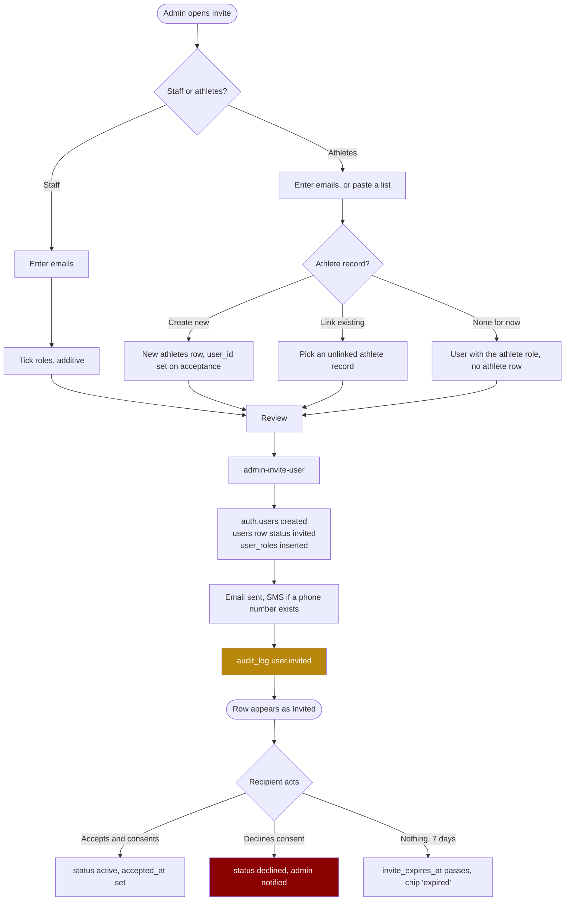

# Screen: User management

> **Layout status**: provisional. Awaiting client design photographs.

Screen 32 in the inventory (`02-information-architecture.md` §5). File: `docs/screens/user-management.md`.

**Admin only.** This is the only screen in Fydr restricted to a single role.

---

## Purpose

Who can sign in to this organisation, what they are allowed to do, and which of them is an
athlete.

Four jobs:

1. **Invite people.** Staff and athletes, by email, with the role or roles they will hold.
2. **Assign roles.** Roles are additive. A user can be both coach and medical and gets the union
   of both permission sets (`01-roles-and-permissions.md` §1). This is not modelled as a fifth
   role and must not be.
3. **Deactivate and reactivate.** Nobody is deleted. A departing coach is deactivated, their
   audit trail intact.
4. **Link a user account to an athlete record.** `athletes.user_id` is nullable on purpose: a
   squad member exists in Fydr before they have downloaded anything (`04-data-model.md` §3).
   Linking is the moment those two records become one person.

Every role change is written to the audit log. That is a mandatory audit event
(`09-security-and-compliance.md` §8.5), not a nice-to-have, and it is the reason this screen
exists as a controlled surface rather than a settings sub-page.

---

## Roles and access

| Role | Access |
|---|---|
| Admin / Club owner | Full access. The only role with any access. |
| Coach / S&C | None. Deep link renders `EmptyState` kind `noPermission`: "User accounts are managed by an administrator." |
| Medical / Physio | None. |
| Athlete | None. |

Enforced in three places, because this is the screen that grants access to everything else:

1. **RLS**: `user_roles`, and every write to `users`, are gated by
   `auth_has_any_role(array['admin'])`.
2. **Edge Function**: role changes go through `admin-set-role`, which re-checks the caller's role
   server-side and never trusts a client-supplied role (`CLAUDE.md` §2 rule 2).
3. **Route guard**: the client hides the screen. This is presentation only and grants nothing
   (`05-architecture.md` §5).

An admin cannot see athlete performance data from this screen, and linking a user to an athlete
does not grant them any. An admin who needs squad data holds the coach role as well, which is
the deliberate friction in `01-roles-and-permissions.md` §1.

---

## Entry points

| From | Route | Notes |
|---|---|---|
| More, Settings, Users | `/settings/users` | Primary path. |
| Web sidebar, Settings, then Users | `/settings/users` | |
| Onboarding checklist, "Invite your staff" | `/settings/users/invite?type=staff` | |
| Onboarding checklist, "Invite your squad" | `/settings/users/invite?type=athlete` | |
| Squad list, an athlete with no account, "Invite" | `/settings/users/invite?athlete={athlete_id}` | Prefills the invite and pre-links the athlete record. Visible to admins only. |
| Email "Invite declined" | `/settings/users/{user_id}` | Sent when an athlete declines consent (`03-flows.md` §2). |
| Audit log, a `user_roles.changed` row | `/settings/users/{user_id}` | |

---

## Layout

### User list, web

```
+----------------------------------------------------------------------------------------+
| Users                                                     [Export]  [ + Invite people ] |
+----------------------------------------------------------------------------------------+
| [ Search name or email        ]  [Role v] [Status v] [ ] Show deactivated               |
| 34 users. 4 staff, 30 athletes. 3 invites pending, 1 expired.                            |
+----------------------------------------------------------------------------------------+
| Name              | Email                | Roles            | Athlete record | Status    |
+-------------------+----------------------+------------------+----------------+-----------+
| Anna Bell         | anna@club.example    | Coach, Admin     | not linked     | Active    |
| Priya Shah        | priya@club.example   | Medical, Coach   | not linked     | Active    |
| Dan Ives          | dan@club.example     | Coach            | not linked     | Invited   |
|                   |                      |                  |                | 2 days ago|
| Ellis Marsh       | ellis@mail.example   | Athlete          | # 4 Ellis Marsh| Active    |
| Ryan Doherty      | ryan@mail.example    | Athlete          | # 2 Ryan Doher.| Invited   |
|                   |                      |                  |                | expired   |
| Tom Reeve         | tom@mail.example     | Athlete          | # 12 Tom Reeve | Declined  |
| Jack Whitlow      | -                    | -                | # 8 Jack Whit. | No account|
| Sara Nunn         | sara@club.example    | Coach            | not linked     | Deactivat.|
+----------------------------------------------------------------------------------------+
| 2 athlete records have no account.                                       [Invite them]  |
+----------------------------------------------------------------------------------------+
```

The row for Jack Whitlow is important: it is an **athlete record with no user row at all**. The
list merges `users` with unlinked `athletes` so an admin can see the whole picture in one place
and act on it. Without that merge, the two most common onboarding states (a squad member with no
account, and an account with no squad record) are invisible.

### User detail, web

```
+----------------------------------------------------------------------------------------+
| <  Priya Shah                                        [Resend invite] [Deactivate] [...] |
|    priya@club.example    Active    Last seen 5 Aug 08:12                                |
+---------------------------------------------+------------------------------------------+
| ROLES                                       |  ATHLETE RECORD                           |
|  [x] Athlete                                |   Not linked                              |
|  [x] Coach          granted 12 Jul, A Bell  |   This user has no athlete record.        |
|  [x] Medical        granted 3 Aug, A Bell   |   [ Link to an athlete ]                  |
|  [ ] Admin                                  |                                           |
|                                             |  ACCOUNT                                  |
|  Roles are additive. This user has the      |   Created      12 Jul 2026                |
|  union of Coach and Medical permissions.    |   Invited by   A Bell                     |
|                                             |   Accepted     13 Jul 2026                |
|  (!) Removing a role signs this user out    |   Last seen    5 Aug 08:12                |
|      of every device immediately.           |   Consent      v2, 13 Jul 2026            |
|                                             |   MFA          Not enrolled               |
|  [ Save roles ]                             |                                           |
|                                             |  NOTIFICATIONS                            |
| WHAT THIS USER CAN SEE                      |   Push enabled on 1 device                |
|  Squad performance data       yes           |                                           |
|  Clinical detail              yes           |  DANGER ZONE                              |
|  Availability, set            yes           |   [ Deactivate user ]                     |
|  Users and billing            no            |   Signs them out and blocks sign in.      |
|  Own data only                no            |   Nothing is deleted.                     |
+---------------------------------------------+------------------------------------------+
| ROLE HISTORY                                                                            |
|  3 Aug 2026 09:14   Medical granted        by A Bell    from 82.14.x.x                  |
| 12 Jul 2026 11:02   Coach granted          by A Bell    from 82.14.x.x                  |
| 12 Jul 2026 11:02   User invited           by A Bell                                    |
+----------------------------------------------------------------------------------------+
```

### Invite flow, mobile

```
+------------------------------------------------------+
| <  Invite people                                      |
+------------------------------------------------------+
| Who are you inviting?                                 |
|  (o) Staff        coach, medical, admin               |
|  ( ) Athletes     squad members                       |
+------------------------------------------------------+
| Email addresses                                       |
| [ dan@club.example                              ]     |
| [ + Add another ]         or  [ Paste a list ]        |
+------------------------------------------------------+
| Roles                                                 |
|  [x] Coach                                            |
|  [ ] Medical                                          |
|  [ ] Admin                                            |
|  [ ] Athlete                                          |
|  Roles are additive. Tick everything that applies.    |
+------------------------------------------------------+
| Link to an athlete record            (athletes only)  |
|  ( ) Create a new athlete record                      |
|  (o) Link to an existing record                       |
|      [ Search squad          ]                        |
|      # 8  Jack Whitlow                    [linked]    |
|  ( ) No athlete record for now                        |
+------------------------------------------------------+
| Message (optional)                                    |
| [ Pre-season starts 12 August.                  ]     |
+------------------------------------------------------+
| They will receive an email and, if you have a mobile  |
| number on the athlete record, an SMS.                 |
+------------------------------------------------------+
|  [ Send 1 invite ]                                    |
+------------------------------------------------------+
```

### Bulk invite

```
+------------------------------------------------------+
| <  Invite athletes                                    |
+------------------------------------------------------+
| Paste one email per line, or upload a CSV.            |
| +--------------------------------------------------+  |
| | ellis@mail.example, Ellis, Marsh, 4               | |
| | ryan@mail.example, Ryan, Doherty, 2               | |
| | tom@mail.example, Tom, Reeve, 12                  | |
| +--------------------------------------------------+  |
| Columns: email, first name, last name, squad number   |
+------------------------------------------------------+
| PREVIEW                                     28 rows   |
|  24 new athlete records will be created               |
|   3 will link to existing records by name             |
|   1 error, line 17: not a valid email                 |
+------------------------------------------------------+
|  [ Fix errors ]              [ Send 27 invites ]      |
+------------------------------------------------------+
```

---

## Components

| Component | Source | Purpose |
|---|---|---|
| `UserTable` | **New** | Merged list of users and unlinked athlete records. Dense on web, list on mobile. |
| `RoleCheckboxGroup` | **New** | Four additive checkboxes with grant provenance beside each. Not a dropdown: a dropdown implies one choice. |
| `PermissionSummary` | **New** | Plain-language "what this user can see", computed from the ticked roles. |
| `InviteWizard` | **New** | Type, addresses, roles, athlete linking, optional message, review. |
| `BulkInvitePaste` | **New** | Paste or CSV, with a parsed preview and per-row errors. Reuses the import preview pattern from `07-integrations.md`. |
| `AthleteLinkPicker` | **New** | Search unlinked athlete records, or create one. |
| `StatusPill` | **New** | Invited, Active, Suspended, Deactivated, Declined, No account. Word plus glyph, never colour alone (`06-design-system.md` §4.1). |
| `RoleHistoryList` | **New** | Reverse chronological role changes, read from `audit_log`. |
| `ConfirmSheet` | §6.18 | Role removal, deactivation, invite revocation. `requireTyped` for removing the last admin. |
| `EmptyState` | §6.16 | No users, no results, no permission. |
| `SearchField` | **New**, shared with `squad-list.md` | |
| `GroupFilter` | §6.7 | **Absent.** This screen is not filtered by squad group: it lists staff as well as athletes, and staff are not in groups. Stated explicitly so nobody adds it to satisfy `CLAUDE.md` §3 by reflex. The rule applies to multi-athlete screens; this is a multi-user screen. |

---

## Data requirements

### Fields

| Field | Source | Transformation |
|---|---|---|
| User id | `users.id` | Mirrors `auth.users.id`. |
| Full name | `users.full_name` | |
| Email | `users.email` | `citext`, unique per organisation. |
| Phone | `users.phone` | Used for the SMS half of the invite. |
| Status | `users.status` | `invited` \| `active` \| `suspended` \| `deactivated`. |
| Last seen | `users.last_seen_at` | Relative within 7 days, absolute after (§12.2). |
| Roles | `user_roles.role` | Array. Additive. |
| Role granted by, at | `user_roles.granted_by`, `granted_at` | Shown beside each role. |
| Linked athlete | `athletes.user_id = users.id` | One athlete at most, enforced by `athletes.user_id unique`. |
| Athlete record without an account | `athletes` where `user_id is null` | Merged into the list. |
| Consent | `athletes.consent_given_at`, `consent_version` | Athletes only. Drives the Declined status. |
| Invite sent at, by | see the schema gap below | |
| Role history | `audit_log` where `action in ('user_roles.granted','user_roles.revoked','user.invited','user.deactivated','user.reactivated')` | |

### Schema gaps this screen needs closed

Three things the current model does not carry.

**1. `users.claims_version`.** The auth hook in `05-architecture.md` §5 reads
`u.claims_version` and the claim-staleness controls depend on it, but the `users` table in
`04-data-model.md` §3 has no such column. It must be added, with the trigger that bumps it on
every `user_roles` change:

```sql
alter table users add column claims_version int not null default 1;

create or replace function bump_claims_version() returns trigger
language plpgsql security definer as $$
begin
  update users set claims_version = claims_version + 1, updated_at = now()
  where id = coalesce(new.user_id, old.user_id);
  return coalesce(new, old);
end $$;

create trigger user_roles_bump_claims
  after insert or update or delete on user_roles
  for each row execute function bump_claims_version();
```

Raised as O-415.

**2. Invitation state.** `users.status = 'invited'` says an invite exists. It does not say when it
was sent, by whom, how many times, or whether it has expired. Every one of those is on the screen
above. Recommended, raised as O-416:

```sql
alter table users add column invited_at    timestamptz;
alter table users add column invited_by    uuid references users(id);
alter table users add column invite_sent_count int not null default 0;
alter table users add column invite_expires_at timestamptz;
alter table users add column accepted_at   timestamptz;
alter table users add column deactivated_at timestamptz;
alter table users add column deactivated_by uuid references users(id);
```

The invite token itself lives in Supabase Auth, not in `users`. Fydr stores the state, never the
secret.

**3. A `declined` user status.** `03-flows.md` §2 says an athlete who declines consent gets an
inactive account and the admin is told. `user_status` has no value for that, and reusing
`suspended` conflates a disciplinary action with a consent decision. Recommended: add `declined`
to the `user_status` enum. Raised as O-417.

### The primary query

```sql
-- Users and unlinked athlete records, merged.
-- :q string search, :roles app_role[], :statuses user_status[], :include_deactivated bool

with staff_and_users as (
  select
    u.id                                as user_id,
    u.full_name,
    u.email::text                       as email,
    u.phone,
    u.status::text                      as status,
    u.last_seen_at,
    u.invited_at, u.invited_by, u.invite_expires_at, u.accepted_at,
    coalesce(
      (select array_agg(ur.role order by ur.role)
       from user_roles ur where ur.user_id = u.id), '{}'::app_role[]) as roles,
    a.id           as athlete_id,
    a.squad_number as athlete_squad_number,
    a.first_name   as athlete_first_name,
    a.last_name    as athlete_last_name,
    false          as is_unlinked_athlete
  from users u
  left join athletes a on a.user_id = u.id and a.deleted_at is null
  where u.org_id = auth_org_id()
    and u.deleted_at is null
    and (:include_deactivated or u.status <> 'deactivated')
),
unlinked_athletes as (
  select
    null::uuid                          as user_id,
    (a.first_name || ' ' || a.last_name) as full_name,
    null::text                          as email,
    null::text                          as phone,
    'no_account'                        as status,
    null::timestamptz                   as last_seen_at,
    null::timestamptz, null::uuid, null::timestamptz, null::timestamptz,
    '{}'::app_role[]                    as roles,
    a.id, a.squad_number, a.first_name, a.last_name,
    true                                as is_unlinked_athlete
  from athletes a
  where a.org_id = auth_org_id()
    and a.deleted_at is null
    and a.user_id is null
    and a.status <> 'left_club'
),
merged as (
  select * from staff_and_users
  union all
  select * from unlinked_athletes
)
select *
from merged
where (:q = '' or full_name ilike '%'||:q||'%' or coalesce(email,'') ilike '%'||:q||'%')
  and (cardinality(:roles::app_role[]) = 0 or roles && :roles)
  and (cardinality(:statuses::text[])  = 0 or status = any(:statuses))
order by
  case when 'admin'   = any(roles) then 0
       when 'coach'   = any(roles) or 'medical' = any(roles) then 1
       else 2 end,
  full_name;
```

Role history for one user:

```sql
select al.occurred_at, al.action, al.actor_id, au.full_name as actor_name,
       al.metadata->>'role' as role, al.ip_address
from audit_log al
left join users au on au.id = al.actor_id
where al.org_id = auth_org_id()
  and al.entity_type = 'user'
  and al.entity_id = :user_id
  and al.action in ('user_roles.granted','user_roles.revoked','user.invited',
                    'user.invite_resent','user.invite_revoked','user.deactivated',
                    'user.reactivated','user.athlete_linked','user.athlete_unlinked')
order by al.occurred_at desc
limit 100;
```

### Writes

Every write on this screen goes through the `admin-set-role` Edge Function or its siblings, never
through a direct PostgREST call. The reason is in `05-architecture.md` §5: role removal must also
sign the user out of every session through the Auth admin API, which requires the service role,
which must never be in a client bundle.

| Action | Function | What it does |
|---|---|---|
| Invite | `admin-invite-user` | Creates the `auth.users` row through the Auth admin API, inserts `users` with `status = 'invited'`, inserts `user_roles`, optionally creates or links an `athletes` row, sends the email (`invite-staff` or `invite-athlete` template, `08-notifications.md` §9.2) and optional SMS, writes `audit_log` action `user.invited`. |
| Resend invite | `admin-invite-user` with `resend: true` | Regenerates the invite link, increments `invite_sent_count`, resets `invite_expires_at`, writes `user.invite_resent`. Rate limited to 3 per user per 24 hours. |
| Revoke invite | `admin-revoke-invite` | Deletes the pending `auth.users` row, sets `users.status = 'deactivated'`, writes `user.invite_revoked`. The `users` row is kept. |
| Grant a role | `admin-set-role` | Inserts `user_roles`, bumps `claims_version`, broadcasts on `user:{user_id}` so the client refreshes its token, writes `user_roles.granted`. **Does not** force sign-out. |
| Revoke a role | `admin-set-role` | Deletes the `user_roles` row, bumps `claims_version`, **signs the user out of all sessions** through the Auth admin API, writes `user_roles.revoked`. |
| Deactivate | `admin-deactivate-user` | Sets `users.status = 'deactivated'`, records `deactivated_at` and `deactivated_by`, signs out all sessions, writes `user.deactivated`. Roles are kept so reactivation restores them. |
| Reactivate | `admin-deactivate-user` with `reactivate: true` | Sets status back to `active`, writes `user.reactivated`. The user signs in normally; no new invite is needed if they had accepted before. |
| Link to an athlete | `admin-link-athlete` | Sets `athletes.user_id`, grants the `athlete` role if absent, bumps `claims_version` so `athlete_id` enters the JWT, writes `user.athlete_linked`. |
| Unlink | `admin-link-athlete` with `unlink: true` | Sets `athletes.user_id = null`, revokes the `athlete` role, signs the user out (a role was removed), writes `user.athlete_unlinked`. All of the athlete's data stays on the `athletes` row. |

**Role addition does not force sign-out. Role removal does.** This asymmetry is specified in
`05-architecture.md` §5 and the reason is worth repeating on the screen itself: a stale token
missing a new ability is an annoyance; a stale token keeping a removed ability is an incident.
The UI states it beside the role checkboxes, so an admin removing a role is not surprised when
the person they are sitting next to gets logged out.

### The audit requirement

Every role change writes one `audit_log` row. Non-negotiable
(`09-security-and-compliance.md` §8.5, `04-data-model.md` §13).

```sql
-- Written by a security definer function so the actor cannot suppress their own entry.
select log_audit_event(
  p_action      => 'user_roles.granted',
  p_entity_type => 'user',
  p_entity_id   => :target_user_id,
  p_athlete_id  => null,
  p_metadata    => jsonb_build_object(
                     'role', 'medical',
                     'granted_by_role', 'admin',
                     'previous_roles', to_jsonb(array['coach']),
                     'new_roles',      to_jsonb(array['coach','medical'])),
  p_ip_address  => :ip
);
```

Rules:

1. **One row per role, not one per save.** Ticking Medical and Admin and pressing Save writes two
   rows. A single "roles changed" row loses which role was granted and which was revoked.
2. **`actor_id` is the admin, `entity_id` is the target user.** Both are always populated.
3. **`metadata` holds the before and after role arrays**, so the log is readable without joining
   to a point-in-time reconstruction.
4. **No values beyond identifiers and role names.** No email, no name. Names are resolved at
   display time by joining `users` (§8.5: log the fact, never the payload).
5. **The table is append-only**, enforced by the trigger in `09-security-and-compliance.md` §8.5.
   The role history panel on this screen is a read of that table and nothing else.
6. **A failed audit write fails the role change.** The audit insert and the `user_roles` write are
   in one transaction. A role change that succeeds without a log entry is worse than a role change
   that fails.

---

## States

| State | Rendering |
|---|---|
| **List, default** | Merged table, summary line, pending-invite counts. |
| **List, empty** | Only reachable in a brand-new organisation with one admin. `EmptyState` kind `notStarted`: "Only you have an account." Actions "Invite staff", "Invite your squad". |
| **List, filtered empty** | `noResults` naming the filters. |
| **Loading** | 8 skeleton rows. |
| **Error** | "Could not load users. Check your connection and try again." with Retry. |
| **Offline** | Read-only from cache. Every action disabled with the standard offline copy. Inviting someone while offline is not queued: an invite is an email to a third party and must not be sent twice or sent late by a queue drain. |
| **Status: No account** | Athlete record with no user row. Row shows the athlete number and name, no email, and a single action "Invite". |
| **Status: Invited** | "Invited 2 days ago". Actions Resend, Revoke. |
| **Status: Invited, expired** | `severity.medium` chip "expired". Copy "Invite expired on 1 Aug." Action Resend. |
| **Status: Declined** | `severity.medium` chip. Copy "Consent declined 14 Jul. The account is inactive." No resend action; per `03-flows.md` §2 the next step is a conversation, not another email. Action "Invite again" exists behind a confirm that says so. |
| **Status: Active** | Last seen shown. |
| **Status: Active, never opened the app** | "Accepted 13 Jul, never signed in." Prompts the admin to check the person actually finished setup. |
| **Status: Suspended** | Sign-in blocked, data intact. |
| **Status: Deactivated** | Hidden by default. Behind the toggle, rendered at 60% opacity with "Deactivated 3 Aug by A Bell" and a Reactivate action. |
| **Detail, self** | An admin viewing their own record cannot remove their own admin role. The checkbox is disabled with "You cannot remove your own admin role. Ask another admin." |
| **Detail, last admin** | Removing the last admin role in the organisation is blocked outright: "This is the only administrator. Grant admin to someone else first." |
| **Saving roles** | Save button busy. On success, a toast stating exactly what happened: "Medical granted. Coach unchanged." If a role was removed, the toast adds "Priya Shah has been signed out of all devices." |
| **Role change failed** | Checkboxes revert to the server state, inline error, nothing partially applied. |
| **Bulk invite, parsing** | Preview table with per-row status and errors. |
| **Bulk invite, sending** | Progress with a per-row result list. Partial success is reported honestly: "25 sent, 2 failed. Retry the 2." |
| **Rate limited** | "3 invites have been sent to this address in the last 24 hours. Try again tomorrow." |

---

## Interactions

### Inviting



| Detail | Behaviour |
|---|---|
| Invite expiry | 7 days. Configurable per organisation is O-418. |
| Duplicate email | Blocked by `unique (org_id, email)`. Message: "priya@club.example already has an account." with a link to it. |
| Email in another organisation | Permitted. A user belongs to exactly one organisation in v1 (`01-roles-and-permissions.md` §6), so the same address in a different club is a different user. The invite email states which club it is for. |
| Athletes with no email | Supported. Create the athlete record without a user and invite later. The list shows them as "No account". |
| SMS | Sent alongside the email when the athlete record has a phone number, per `03-flows.md` §2. |
| Optional message | Included in the email body, plain text, 0 to 300 characters, HTML-escaped. |
| Bulk paste | Parsed as `email, first name, last name, squad number`. Matching to existing athlete records is by exact name, and every proposed match is shown for confirmation. Fuzzy auto-matching is not done: silently attaching an account to the wrong athlete record is a data-protection incident, not a convenience bug. |
| Bulk CSV | Same columns. Errors are per row, and a file with errors can still be partially sent after review. |

### Assigning roles

| Detail | Behaviour |
|---|---|
| Control | Four checkboxes: Athlete, Coach, Medical, Admin. Never a dropdown. |
| Copy beside them | "Roles are additive. Tick everything that applies. A user who is both a coach and a physio gets both sets of permissions." |
| Live permission summary | Updates as boxes are ticked, in plain language, from a single source shared with the permission matrix. |
| Grant provenance | Each ticked role shows "granted 3 Aug, A Bell". |
| Save | One button. Computes the diff and applies grants and revocations in one transaction. |
| Revocation warning | Shown before saving, not after: "Removing Coach will sign Priya Shah out of every device." |
| Athlete role and the athlete record | Ticking Athlete without a linked record prompts: "This user has no athlete record. Link one, or create one?" A user with the athlete role and no `athletes` row has a null `athlete_id` claim and sees an empty athlete shell, which is a confusing state to leave someone in. |
| Removing the athlete role | Prompts to unlink the athlete record too, and explains that the athlete's data stays on the record either way. |
| Self-demotion | Blocked for admin. Other roles can be removed from oneself. |
| Last admin | Blocked, with `requireTyped` confirmation if the club ever needs an override path (they do not, in v1). |

### Linking a user to an athlete record

This is the join that makes `athletes.user_id` nullable worth the trouble.

| Case | Flow |
|---|---|
| Athlete record exists, no account | From the squad list or this screen: Invite, with the record pre-linked. On acceptance, `athletes.user_id` is set and every entry they submit attaches to the existing record, including the history staff recorded on their behalf. |
| Account exists, no athlete record | User detail, "Link to an athlete", pick an unlinked record or create one. |
| Both exist, separately | Same picker. The confirm names both: "Link ellis@mail.example to athlete record #4 Ellis Marsh? Their entries will attach to that record." |
| Wrong link made | Unlink. `athletes.user_id` is cleared, the athlete role is revoked, the user is signed out. **Entries already submitted stay on the athlete record**, because they were submitted about that athlete. The confirm says so, and the action is audited. |
| Athlete record already linked | Not offered in the picker. The picker lists only `user_id is null` records. |
| One user, two athlete records | Impossible: `athletes.user_id` is unique. The picker enforces it and the constraint backs it. |

### Deactivation

| Detail | Behaviour |
|---|---|
| Trigger | "Deactivate user" in the danger zone. |
| Confirm copy | "Deactivate Sara Nunn? They will be signed out and cannot sign in. Nothing is deleted, and their entries, notes, and audit history are kept." |
| Effect | `users.status = 'deactivated'`, all sessions signed out, the auth hook then issues tokens with no authority at all if they somehow reach it (`05-architecture.md` §5). |
| Roles | Kept, so reactivation is one tap. |
| Athlete link | Kept. A deactivated athlete's data stays attached to their record and still appears in historical squad analysis, which is correct: they were in the squad in March. |
| Reactivate | One action, audited, no new invite needed if they had already accepted. |
| Deletion | Not offered. Erasure is a separate, explicitly audited process under `09-security-and-compliance.md` §6, run from Settings, not from here. This screen says so where a delete button would otherwise be expected. |

---

## Validation rules

| Rule | Enforcement | Message |
|---|---|---|
| Email required and valid | Zod, `citext` | "Enter a valid email address." |
| Email unique per organisation | `unique (org_id, email)` | "That address already has an account." |
| Full name required for staff invites, 1 to 120 characters | Zod | "Enter their name." |
| At least one role per invite | Client and server | "Choose at least one role." |
| Role values from the `app_role` enum | Zod, enum, server-resolved | Client-supplied roles are never trusted (`CLAUDE.md` §2 rule 2). |
| Only an admin may change roles | RLS and Edge Function | 403, rendered as `noPermission`. |
| An admin may not remove their own admin role | Server | "You cannot remove your own admin role." |
| The last admin role may not be removed | Server | "This is the only administrator." |
| Athlete role plus a linked record: at most one athlete per user | `athletes.user_id unique` | |
| Invite message 0 to 300 characters | Zod | |
| Bulk invite maximum 100 rows per submission | Client and server | "Invite up to 100 people at a time." |
| Bulk CSV maximum 1 MB | Server | Matches the upload limits in `09-security-and-compliance.md` §9.2. |
| CSV is parsed, never evaluated. Leading `=`, `+`, `-`, `@` are neutralised on export | Server | CSV injection guard, §9.2. |
| Resend limited to 3 per user per 24 hours | Server | "3 invites have already been sent to this address today." |
| Deactivating the last admin | Blocked | "Grant admin to someone else first." |
| Phone, when present, is E.164 | Zod | "Enter the number in international format, for example +447700900000." |
| Every role change writes an audit row | Transaction | A failed audit write rolls back the role change. |

---

## Edge cases

| Case | Behaviour |
|---|---|
| **Athlete record exists before the account** | The normal case, not an edge case. `athletes.user_id` is null, the row shows "No account", staff can already record data against them, and inviting them links the two. |
| **User accepts an invite from a different device than the link was sent to** | Supported. The deep link resumes after install (`03-flows.md` §2). |
| **Invite email bounces** | The email provider's webhook marks the invite as undeliverable and the row shows "Email bounced" with a Resend action and a prompt to check the address. Requires a bounce webhook, raised as O-419. |
| **Athlete declines consent** | `users.status` becomes `declined`, the admin is emailed and sees the status. The account grants nothing. No data is collected. Re-inviting is possible but confirmed, because the right next step is a conversation. |
| **Athlete accepts, then withdraws consent later** | Handled by the rights process in `09-security-and-compliance.md` §6, not from this screen. This screen shows the resulting status and links to it. |
| **Admin removes their own coach role** | Permitted, signs them out, they sign back in with fewer permissions. The confirm says so. |
| **Two admins editing the same user simultaneously** | The role save sends the computed diff, not the full desired state, so two admins granting different roles both succeed. A grant and a revoke of the same role in the same second resolve last-write-wins, and both appear in the audit log with timestamps. |
| **Role changed while the user is mid-session** | Grant: their client receives the `user:{user_id}` broadcast and refreshes the token within about 5 seconds. Revoke: they are signed out immediately. An athlete mid-entry keeps their queued outbox, which survives re-authentication (`05-architecture.md` §6). |
| **Role changed while the user is offline** | The revocation applies at the Auth layer, so their next token refresh fails and they must sign in again. Their queued entries are preserved and sync after re-authentication. |
| **Deactivated user's queued entries** | Preserved on the device. They cannot sync while deactivated. On reactivation they sync normally. Nothing is discarded. |
| **User linked to an athlete who then leaves the club** | `athletes.status = 'left_club'`. The user account is not deactivated automatically, because leaving a squad and losing an account are different decisions. The list shows the linked athlete with a "left club" chip and prompts the admin. |
| **Athlete record soft-deleted while linked** | Blocked. Unlink first. |
| **User with no roles at all** | Possible if every role is revoked without deactivating. `resolveShell` returns `blocked` and they see a "Your account has no access. Contact your club administrator." screen. The list flags them with a `severity.medium` chip "No roles". |
| **Bulk invite where two rows share an email** | The duplicate is reported per row and only one invite is sent. |
| **Bulk invite where a name matches two athlete records** | Both shown, neither auto-selected, the row is marked "needs a choice" and is not sent until resolved. |
| **Invite to an address that later joins a different club** | Out of scope: one user, one organisation in v1. If the address is invited by another club, that is a separate `auth.users` identity question and it is O-420. |
| **Organisation at its subscription seat limit** | The invite is blocked with "Your plan covers 40 athletes. You have 40." and a link to billing. Requires seat counting, which the schema does not carry. O-421. |
| **Support access** | `platform_support` is outside the organisation model (`01-roles-and-permissions.md` §7) and never appears in this list. Support grants are shown in Settings, Security, with their own audit trail. |
| **Audit log write fails** | The whole role change fails and the UI says "The change was not saved because it could not be recorded. Try again." An unlogged permission change is not acceptable. |

---

## Performance notes

1. **One query for the merged list.** The `union all` of users and unlinked athletes runs in a
   single statement. At a few dozen rows this is trivial, and it stays trivial at 200.
2. **Role aggregation is a correlated subquery per user**, which is fine at this scale and is
   covered by the primary key on `user_roles (user_id, role)`. Add
   `create index on user_roles (user_id)` if the unique constraint's index does not already serve
   it.
3. **Role history reads `audit_log (org_id, occurred_at desc)`**, which exists
   (`04-data-model.md` §15), with an added filter on `entity_id`. Add
   `create index on audit_log (entity_type, entity_id, occurred_at desc)` because this screen is
   the only place that queries the audit log by entity and a sequential scan over a year of audit
   rows would be slow and would get slower.
4. **Invites are sent by an Edge Function, one email per recipient**, dispatched with concurrency
   of 5 and a per-row result. Never a single request per invite from the client: 30 invites would
   be 30 round trips and a partial failure nobody can reconstruct.
5. **The list is not realtime.** `staleTime` 60 seconds and a refetch on focus. Nobody needs to
   watch invites accept live.
6. **`claims_version` bumps are cheap** but they invalidate a token, so batch a multi-role save
   into one transaction and one bump rather than one per role.
7. **Budget**: list interactive under 400 ms warm. Invite send under 2 s for a single invite,
   under 15 s for 30. Role change under 1 s including the sign-out call.

---

## Accessibility

- The role control is a `group` of `checkbox`es, labelled "Roles for Priya Shah", with a
  description explaining additivity that is read by the screen reader before the options.
- Each role checkbox announces its provenance: "Coach, checked, granted 12 July by Anna Bell".
- The revocation warning is announced before the save is committed, in an `aria-live="assertive"`
  region, because it is consequential and a polite region can be missed.
- The permission summary is a definition list, so "Clinical detail, yes" is announced as a pair,
  not as two unrelated words.
- Status is always a word plus a glyph. "Invited", "Expired", "Declined", "Deactivated", "No
  account". Colour alone never distinguishes them (§4.1).
- The user table is a real `table` with `th` headers and `aria-sort`.
- The bulk invite preview is a table with a per-row status column in text, and errors are
  associated with their row through `aria-describedby`, not shown only as red text.
- The danger zone is a `region` labelled "Danger zone" containing only irreversible or
  consequential actions, and every button in it carries a verb: "Deactivate user", never "OK".
- `ConfirmSheet` for removing the last admin uses `requireTyped`, whose input is properly labelled
  and whose requirement is stated in text, not only in a placeholder.
- Focus returns to the triggering control after every sheet closes.
- Email addresses are rendered with `lang="en"` and are not truncated mid-address in the
  accessible name, even where the visual cell truncates.
- Dynamic type to 200%: the table drops to a stacked card list; the role checkboxes never shrink.
- Touch targets 48 px, including the checkbox rows, which are the primary control on this screen.
- Reduced motion: no row animation on invite send.

---

## Open questions

- **O-415** `users.claims_version` is read by the auth hook in `05-architecture.md` §5 but does
  not exist in the `users` table in `04-data-model.md` §3. It must be added along with the trigger
  that bumps it on every `user_roles` change. This is a specification inconsistency, not a
  preference: without it, role changes never propagate to live sessions.
- **O-416** Invitation state columns (`invited_at`, `invited_by`, `invite_sent_count`,
  `invite_expires_at`, `accepted_at`, `deactivated_at`, `deactivated_by`). Every one of them is on
  this screen and none exists. Confirm the columns, or an `invitations` table if you would rather
  keep `users` narrow.
- **O-417** A `declined` value on the `user_status` enum. `03-flows.md` §2 requires the state and
  the enum has no value for it. Reusing `suspended` would conflate a consent decision with a
  disciplinary one, which matters when an admin is looking at the list.
- **O-418** Invite expiry. I have set 7 days. Pre-season is exactly when a club sends 30 invites
  and half the squad opens them the following weekend. 14 days may be more realistic.
- **O-419** Bounce handling. Showing "Email bounced" needs a webhook from the email provider into
  an Edge Function. Worth it: silently failed invites are the most common cause of an athlete
  never onboarding, and the admin currently has no way to see it.
- **O-420** One user, one organisation. `01-roles-and-permissions.md` §6 fixes this for v1. A
  physio contracting to three clubs is a real case in the target market and will be asked for.
  Confirming it stays out of scope, because it changes the JWT claim shape and every RLS policy.
- **O-421** Seat limits. Billing is out of band in v1 (`00-product-overview.md`), so nothing
  enforces the per-athlete subscription. Should this screen block an invite that exceeds the
  plan, warn, or ignore it? Blocking needs a seat count on `organisations`.
- **O-422** Should coaches be able to invite athletes? I have kept every invite admin-only, per
  the permission matrix. In a small club the head coach is the only person who ever opens the
  app, and making them switch to an admin account to add a player will be resented. An
  alternative is a coach-scoped "invite athlete" that cannot grant staff roles.
- **O-423** Two-factor authentication for admins. `09-security-and-compliance.md` §8.1 covers
  authentication generally. This screen used to show an "MFA: not enrolled" line that was true
  for every user unconditionally — a hardcoded string, not a read of anything — and nothing
  required it. Login-security checklist item 3 made the line real (`UserDetailPanel.tsx` now
  reads `supabase.auth.admin.mfa.listFactors()`) and added a "Remove MFA factor" admin action
  for the no-recovery-codes case, but did not resolve this question's actual ask: the original
  recommendation of mandatory MFA for admin is implemented as a strong, undismissable Settings
  prompt (`MfaEnrollment.tsx`), not as something that blocks sign-in or app use — the RLS-level
  enforcement (`auth_is_aal2()`, migration 0049) that would make it a real, unbypassable
  requirement is deliberately not wired into any policy yet, for reasons recorded in that
  migration's own header and in `09-security-and-compliance.md`'s implementation-status note.
  Still open: whether "prompted" is an acceptable permanent answer for admin specifically,
  given the same "can grant medical access to anyone" argument this question opened with, or
  whether admin is where the RLS follow-up should land first, ahead of coach/medical.

---

## Related documents

- Role definitions and the permission matrix → `01-roles-and-permissions.md`
- Claim model, token staleness, forced sign-out → `05-architecture.md` §5
- Audit logging requirements → `09-security-and-compliance.md` §8.5
- Invite and consent flow → `03-flows.md` §2
- Invite email templates → `08-notifications.md` §9.2
- Athlete records without accounts → `04-data-model.md` §3
- Erasure and retention → `09-security-and-compliance.md` §6, §7
