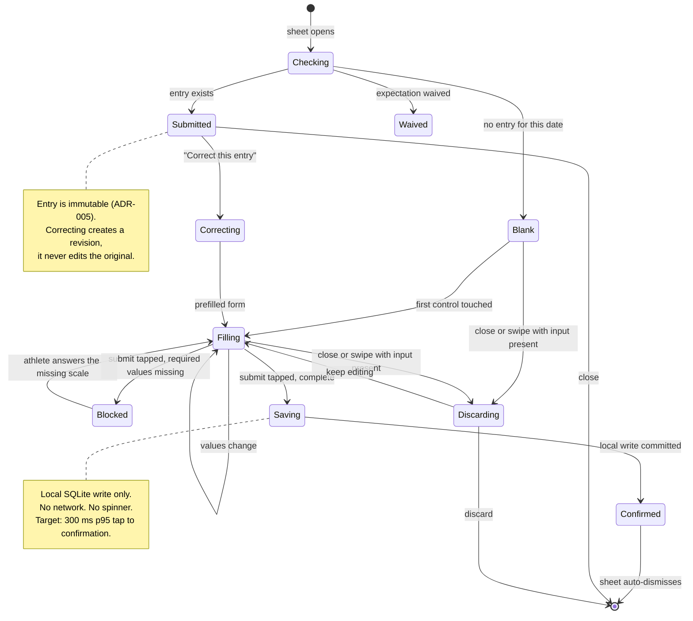

# Screen: Wellness entry

> **Layout status**: provisional. Awaiting client design photographs.

Screen 2 in `02-information-architecture.md` §5. Presented as a bottom sheet over Today.

Every layout decision below that would normally come from the client's designs is marked
**[Assumed, pending photographs]**. Nothing marked that way is settled.

---

## Purpose

This is the screen the product lives or dies on. An athlete opens it once a day, most days,
for a season, standing in a bedroom or a changing room, one-handed, often before they are
properly awake. It collects seven required values and up to four optional ones, and it must
be finished in **under 45 seconds median, measured in-app**
(`00-product-overview.md` success criterion 2). Every other design decision on the athlete
side is subordinate to that number, because an athlete who finds this screen slow stops
submitting within three weeks, and a product with no wellness data has no flags, no
baselines, no readiness trend, and no cross-domain correlation to sell.

It also has a second job that pulls against the first: the data has to be honest. That is why
there are no default slider positions, no praise, no streaks, and no visible score.

---

## Roles and access

| Role | Access |
|---|---|
| Athlete | Full. Submits for themselves only. `wellness_athlete_insert` in `04-data-model.md` §14 constrains `athlete_id = auth_athlete_id()` and `source = 'self_report'`. |
| Coach / S&C | Cannot use this screen. Staff entry on behalf of an athlete is a different surface on the staff web dashboard, writing `source = 'staff_entered'`. |
| Medical | As coach. |
| Admin | No access to wellness data at all (`01-roles-and-permissions.md` §2). |
| Dual-role staff with an athlete profile | Uses this screen for their own entry, identically. |

No content on this screen varies by role. It varies by **data state** (nothing submitted,
already submitted, correcting) and by **org configuration** (which optional fields are shown).

The athlete never sees their own `readiness_score` on this screen. It is computed on write and
displayed in My Data as a trend. Showing a live score while the sliders move turns an honest
self-report into a target.

---

## Entry points

| Entry point | Context carried | Landing behaviour |
|---|---|---|
| Today, To do row "Wellness" | `entry_date` = the expectation's date | Sheet opens at snap point `content`, first control focused for a screen reader, nothing pre-filled |
| Push `athlete.wellness.prompt` | `/athlete/today?open=wellness` | Today mounts behind, sheet presents in the same frame. Target from lock-screen tap to first slider visible: 3 s cold, 800 ms warm. |
| Push `athlete.wellness.nudge` | as above | Identical |
| Today, review mode, past day inside the backdating window | `entry_date` = selected day | Sheet opens with a header banner: "Submitting for Mon 3 Aug." The date is pinned and cannot be changed from inside the sheet. |
| My Data, wellness history row, "Correct this entry" | `original_entry_id` | Opens in **correction mode**: all values pre-filled from the entry being corrected, correction banner shown |
| Onboarding, guided first entry | `first_run: true`, `guided: true` | Opens with the walkthrough coach marks (`onboarding.md`). Identical form, additional overlay. |
| Deep link `/athlete/today?open=wellness` from any other screen | none | Today is pushed as the underlying screen so the back gesture lands somewhere sensible, then the sheet presents |

Not an entry point, deliberately: there is no "add entry" affordance in My Data for a date
with no expectation, and no way to submit two entries for one day. Both are handled by the
correction flow instead.

---

## Layout

### Web

Not applicable. Athlete surfaces are mobile only in v1.

### The paging decision, stated before the wireframe

**One scrolling form. Not one question per screen. Not a pager.**

The one-question-per-screen pattern is common in wellness apps and it is wrong here:

1. **It costs a transition per question.** Five transitions at even 120 ms each is 600 ms of
   the 45-second budget spent on animation, and on a mid-range Android it is closer to 1.5 s.
2. **It removes review.** An athlete who wants to check what they put for fatigue before
   submitting has to page backwards, and paging backwards through a form is where people
   abandon.
3. **It hides progress.** A single form with five visible sliders tells the athlete at a glance
   how much is left. A pager tells them "3 of 5", which is the same information delivered more
   slowly.
4. **It multiplies gesture ambiguity.** A horizontal pager and a horizontal slider on the same
   screen compete for the same drag. That is a genuine usability failure, not a preference:
   a slightly diagonal drag either changes the value or turns the page, and the athlete cannot
   predict which.

Point 4 alone settles it. The five sliders are horizontal controls, so the container must not
be a horizontal pager.

**Vertical scrolling is permitted but minimised.** Measured content height against viewport,
at 100% dynamic type, using the geometry in `06-design-system.md` §7.4:

| Device class | Safe viewport | Header + submit bar | Scroll area | Required content | Scroll needed |
|---|---|---|---|---|---|
| 320 to 359 pt (`xs`, iPhone SE 1st gen) | 548 pt | 128 pt | 420 pt | 664 pt at `bodyCompact` | 244 pt, two flicks |
| 375 pt (iPhone SE 3rd gen) | 647 pt | 132 pt | 515 pt | 728 pt | 213 pt, one flick |
| 390 pt (design target) | 763 pt | 132 pt | 631 pt | 728 pt | **97 pt, one short flick** |
| 430 pt (Pro Max) | 851 pt | 132 pt | 719 pt | 728 pt | 9 pt, effectively none |

Required content is: scale-direction line 24 pt, sleep hours row 88 pt, five slider rows at
104 pt with 20 pt gaps (600 pt), bottom padding 16 pt.

At the 390 pt design target the athlete scrolls once, by about a quarter of a screen, after
answering the first two or three sliders. That is acceptable under
`06-design-system.md` §1.1 ("no more than one scroll"). It is not ideal, and O-425 offers the
alternative.

The optional block and the comment sit below that, collapsed, and are reached by a further
scroll that most athletes never perform.

### Mobile wireframe, default state

**[Assumed, pending photographs]** Sheet presentation, field order, the position of the
scale-direction line, and the collapsed optional block are recommendations.

```
┌──────────────────────────────────────────────┐
│                   ▁▁▁▁▁                      │ A  Grab handle
│ ✕      Morning check-in            Wed 5 Aug │ B  Sheet header, 56 pt
├──────────────────────────────────────────────┤
│ On every scale, 5 is the best you can feel.  │ C  Direction line, 24 pt
├──────────────────────────────────────────────┤
│ Sleep                              7.5 h     │ D  Sleep hours, 88 pt
│        ⊖              7.5              ⊕     │
│                       hours                  │
│        [ Last night's entry: 8.0 ]           │    lastValue chip
├──────────────────────────────────────────────┤
│ Sleep quality                     Not set    │ E  SliderInput, 104 pt
│  ○────○────○────○────○                       │
│ Very poor                         Very good  │
│                                              │
│ Fatigue                          Fresh · 4   │ F  SliderInput, answered
│  ●━━━━●━━━━●━━━━◉────○                       │
│ Exhausted                        Very fresh  │
│                                              │
│ Soreness                          Sore · 2   │ G  SliderInput + body map
│  ●━━━━◉────○────○────○                       │
│ Very sore                       No soreness  │
│  [ + Where? ]                                │    body map affordance
│                                              │
│ Stress                            Not set    │ H
│  ○────○────○────○────○                       │
│ Very stressed                  Very relaxed  │
│                                              │
│ Mood                              Not set    │ I
│  ○────○────○────○────○                       │
│ Very low                          Very good  │
├──────────────────────────────────────────────┤
│ ⌄ Add heart rate, weight or a note           │ J  Collapsed optional, 56 pt
├──────────────────────────────────────────────┤
│ ┌──────────────────────────────────────────┐ │ K  Pinned submit bar, 76 pt
│ │        Submit entry · 3 to go            │ │    + bottom safe area
│ └──────────────────────────────────────────┘ │
└──────────────────────────────────────────────┘
```

### Optional block, expanded

```
├──────────────────────────────────────────────┤
│ ⌃ Optional                                   │
│                                              │
│ Resting heart rate                           │
│        ⊖              52               ⊕     │  NumberStepper, keyboard allowed
│                       bpm                    │
│        [ Last: 54 ]                          │
│                                              │
│ Body mass                                    │
│        ⊖             88.4              ⊕     │  step 0.1
│                        kg                    │
│        [ Last: 88.6 · 3 days ago ]           │
│                                              │
│ Anything else?                               │
│ ┌──────────────────────────────────────────┐ │
│ │ Optional. Your coach reads this.         │ │  multiline, 3 lines, 500 chars
│ └──────────────────────────────────────────┘ │
├──────────────────────────────────────────────┤
```

### Soreness body map

Opened from the "+ Where?" affordance beneath the soreness slider, as a nested sheet at snap
point 0.7.

```
┌──────────────────────────────────────────────┐
│                   ▁▁▁▁▁                      │
│ ‹ Back        Where is it sore?          Done│
├──────────────────────────────────────────────┤
│   [ Front ]  |  Back            (segmented)  │
│                                              │
│              ___                             │
│             (   )   ← head/neck              │
│           __|   |__                          │
│          |  shoulder |                       │
│          |   chest   |    tappable regions,  │
│          |   arm     |    minimum 44×44 pt   │
│          |   trunk   |    each               │
│          |___|   |___|                       │
│            | quad |                          │
│            | knee |                          │
│            | calf |                          │
│            |ankle |                          │
│                                              │
├──────────────────────────────────────────────┤
│ Selected: Left hamstring · Lower back        │
│ [ Left hamstring ×] [ Lower back ×]          │  chips, tappable to remove
├──────────────────────────────────────────────┤
│              [    Done    ]                  │
└──────────────────────────────────────────────┘
```

**[Assumed, pending photographs]** The silhouette illustration is not designed. Until the
client supplies artwork, the body map ships as the **chip grid fallback** described under
States: a two-column grid of 44 pt region chips grouped by front and back. The silhouette is
the target, the chip grid is what is buildable today, and both write identical values.

### Region descriptions

| Ref | Region | Rules |
|---|---|---|
| A | Grab handle | Always visible. The sheet is dismissible by drag, which triggers the discard confirmation when input exists. |
| B | Header | Close control on the left (not the right: the right is where a thumb rests and this is a destructive action, per `06-design-system.md` §9.5 rule 3). Title "Morning check-in". Date on the right at `caption`, showing the entry date, not today, so a backdated entry is never ambiguous. |
| C | Direction line | The fixed sentence "On every scale, 5 is the best you can feel." at `label` size, `text.secondary`. Stated once per screen, never per slider (`06-design-system.md` §7.2). |
| D | Sleep hours | `NumberStepper`, `metric="sleep_hours"`, min 0, max 14, step 0.5, `allowKeyboard={false}`, `lastValue` from the previous entry. Placed first because it is the most concrete question and it is the one the athlete has an actual answer to on waking. |
| E to I | Five subjective scales | `SliderInput`, in the fixed order sleep quality, fatigue, soreness, stress, mood. Order is fixed and must not be randomised: a consistent order is faster after week one, and randomisation to reduce order effects would cost more compliance than it buys in data quality. |
| G | Soreness affordance | "+ Where?" chip appears beneath the soreness slider **only once soreness has been answered**, and is emphasised when the value is 3 or below. Optional at every value. |
| J | Optional block | Collapsed by default, 56 pt row. Expanding it is the only way to summon a keyboard on this screen, and it is last for exactly that reason (`06-design-system.md` §9.4). |
| K | Submit bar | Pinned at `insets.bottom + space[2]`, full width minus insets, 56 pt tall inside a 76 pt bar. Never scrolls away. Label carries the remaining count while incomplete. |

The five sliders occupy roughly 30% to 88% of the vertical space in the scroll area, inside the
easy and stretch thumb zones. The submit action is bottom-pinned in the easy zone. The close
control is in the hard zone, which is deliberate.

---

## Components

| Component | Source | Purpose here |
|---|---|---|
| `BottomSheet` | `06-design-system.md` §6.19 | Host. `snapPoints={['content', 0.95]}`, `dismissible` true at rest and false during submission. Sticky `footer` carries the submit bar. |
| `SliderInput` | §6.10, specified in full in §7 | The five subjective scales. Five instances, identical configuration except labels. |
| `NumberStepper` | §6.11 | Sleep hours, resting heart rate, body mass |
| `ConfirmSheet` | §6.18 | Discard confirmation, and the correction confirmation |
| `EmptyState` | §6.16 | Not used in the form. Used in the already-submitted state, kind `allClear`. |
| `SyncStatusIndicator` | §6.17 | Inline in the confirmation state only, `chip` variant |
| `Numeric` | §5.2 | Every number rendered on this screen, including the stepper values and the "last entry" chips |

Screen-local compositions, in `apps/mobile/src/features/wellness/`:

| Composition | Purpose |
|---|---|
| `BodyMapPicker` | The soreness area selector. Silhouette when artwork exists, chip grid until then. |
| `OptionalBlock` | The collapsible group holding resting HR, body mass, and comment |
| `CorrectionBanner` | The explanatory banner in correction mode |
| `SubmitBar` | Pinned action with the remaining-count label |

Slider configuration, verbatim from `06-design-system.md` §7.2, because getting a single
anchor wrong inverts a metric:

```ts
export const WELLNESS_SCALES = [
  { key: 'sleep_quality', label: 'Sleep quality',
    lowLabel: 'Very poor',      highLabel: 'Very good',
    stopLabels: ['Very poor', 'Poor', 'OK', 'Good', 'Very good'] },
  { key: 'fatigue',       label: 'Fatigue',
    lowLabel: 'Exhausted',      highLabel: 'Very fresh',
    stopLabels: ['Exhausted', 'Tired', 'OK', 'Fresh', 'Very fresh'] },
  { key: 'soreness',      label: 'Soreness',
    lowLabel: 'Very sore',      highLabel: 'No soreness',
    stopLabels: ['Very sore', 'Sore', 'Some soreness', 'Slight', 'No soreness'] },
  { key: 'stress',        label: 'Stress',
    lowLabel: 'Very stressed',  highLabel: 'Very relaxed',
    stopLabels: ['Very stressed', 'Stressed', 'OK', 'Relaxed', 'Very relaxed'] },
  { key: 'mood',          label: 'Mood',
    lowLabel: 'Very low',       highLabel: 'Very good',
    stopLabels: ['Very low', 'Low', 'OK', 'Good', 'Very good'] },
] as const;
```

**The soreness scale is the trap.** 5 means no soreness. It is counter-intuitive, it is the
most likely source of an inverted-data bug in the product, and it is fixed this way so that
`readiness_score` is a simple sum and every chart points the same direction
(`04-data-model.md` §5). Mitigations that are mandatory on this screen:

1. Both anchors are always visible beneath the ends of the track. Never truncated, never
   revealed on interaction, never abbreviated to "Low" and "High".
2. The selected stop's **word** is shown above the track at `title3`, larger than the numeral.
   The athlete reads "Sore", not "2".
3. The numeral is secondary, at `caption`, after a middle dot: "Sore · 2".
4. A unit test asserts that `stopLabels[4]` for soreness is exactly "No soreness" and that the
   track fill increases towards it. An inverted implementation fails the test rather than
   shipping.
5. The track fills in one colour, `accent.solid`, at every value. No red-to-green ramp
   (`06-design-system.md` §7.5).

---

## Data requirements

### Fields

| Field | Source | Required | Control | Transformation |
|---|---|---|---|---|
| `id` | client | yes | none | `crypto.randomUUID()` generated on sheet open, so the operation is idempotent across a crash (`05-architecture.md` §6) |
| `org_id` | JWT claim | yes | none | Never taken from the client payload. `sync-push` overwrites it from `claims.org_id`. |
| `athlete_id` | JWT claim | yes | none | Overwritten server-side from `claims.athlete_id` |
| `entry_date` | route param, default device-local today | yes | none | ISO date. Device local, never server local. |
| `sleep_hours` | athlete | yes (see O-424) | `NumberStepper` 0 to 14, step 0.5 | `numeric(3,1)`. Stored as hours, not minutes. |
| `sleep_quality` | athlete | yes | `SliderInput` | int 1 to 5 |
| `fatigue` | athlete | yes | `SliderInput` | int 1 to 5, 5 = fresh |
| `soreness` | athlete | yes | `SliderInput` | int 1 to 5, 5 = no soreness |
| `soreness_areas` | athlete | no | `BodyMapPicker` | `text[]`, values from the fixed region list below. Empty array is stored as null, not `{}`. |
| `stress` | athlete | yes | `SliderInput` | int 1 to 5, 5 = relaxed |
| `mood` | athlete | yes | `SliderInput` | int 1 to 5, 5 = very positive |
| `resting_hr` | athlete | no | `NumberStepper` 25 to 120, step 1, keyboard allowed | int bpm |
| `body_mass_kg` | athlete | no | `NumberStepper` 30 to 200, step 0.1, keyboard allowed | `numeric(5,2)` kg. Metric only, per `06-design-system.md` O-38. |
| `comment` | athlete | no | multiline text, 500 chars | Trimmed. Empty string stored as null. |
| `readiness_score` | computed | n/a | none | `(sleep_quality + fatigue + soreness + stress + mood) / 25 * 100`. Computed **server-side on write**, and locally for offline display only. Never editable, never shown on this screen. |
| `source` | fixed | yes | none | Always `self_report` from this screen. RLS rejects anything else. |
| `submitted_at` | device clock at submit, then server clock on acceptance | yes | none | Both retained: `client_submitted_at` travels in the sync op for skew detection |
| `revision_of` | correction mode only | conditional | none | The id of the entry being corrected |

**Body area values** must match the `body_area` enum used by `injuries`
(`04-data-model.md` §9), so that a soreness area and an injury body area can be compared
without a mapping table. The picker exposes, per side where the region is bilateral:

```
neck, shoulder, upper_arm, elbow, forearm, wrist_hand,
chest, upper_back, lower_back, abdomen, hip, groin,
quadriceps, hamstring, knee, calf, achilles, ankle, foot
```

Bilateral regions are stored with a side prefix in the array element, for example
`left_hamstring`. Non-bilateral regions (`lower_back`, `neck`, `chest`, `abdomen`) carry no
prefix. This is a display-layer convention over a `text[]`; it is documented here because the
array has no constraint enforcing it, and O-427 asks whether it should become an enum.

### Validation schema

Defined once, in `packages/validation/entries.ts`, and imported by the client, the Edge
Function, and the test suite. Client validation is user experience; the server revalidates
(`09-security-and-compliance.md` §9.1).

```ts
import { z } from 'zod';

const scale = z.number().int().min(1).max(5);

export const WellnessEntryInput = z.object({
  id:             z.string().uuid(),
  entry_date:     z.string().date(),
  sleep_hours:    z.number().min(0).max(14).multipleOf(0.5),
  sleep_quality:  scale,
  fatigue:        scale,
  soreness:       scale,
  soreness_areas: z.array(z.string().max(40)).max(12).nullable().optional(),
  stress:         scale,
  mood:           scale,
  resting_hr:     z.number().int().min(25).max(120).nullable().optional(),
  body_mass_kg:   z.number().min(30).max(200).multipleOf(0.1).nullable().optional(),
  comment:        z.string().trim().max(500).nullable().optional(),
  revision_of:    z.string().uuid().nullable().optional(),
});
export type WellnessEntryInput = z.infer<typeof WellnessEntryInput>;
```

Matching database `check` constraints, because data also arrives through imports and RPCs
(`09-security-and-compliance.md` §9.1):

```sql
alter table wellness_entries
  add constraint wellness_sleep_hours_range   check (sleep_hours   between 0 and 14),
  add constraint wellness_sleep_quality_range check (sleep_quality between 1 and 5),
  add constraint wellness_fatigue_range       check (fatigue       between 1 and 5),
  add constraint wellness_soreness_range      check (soreness      between 1 and 5),
  add constraint wellness_stress_range        check (stress        between 1 and 5),
  add constraint wellness_mood_range          check (mood          between 1 and 5),
  add constraint wellness_resting_hr_range    check (resting_hr    between 25 and 120),
  add constraint wellness_body_mass_range     check (body_mass_kg  between 30 and 200),
  add constraint wellness_comment_length      check (char_length(comment) <= 500),
  add constraint wellness_areas_length        check (coalesce(array_length(soreness_areas, 1), 0) <= 12);
```

### Reads this screen performs

| What | Source | Why |
|---|---|---|
| Existing entry for `entry_date` | local SQLite first, then `wellness_entries_current` | Determines whether the form opens blank, or in the already-submitted state |
| Previous entry values | local SQLite, most recent `entry_date < entry_date` | Populates the `lastValue` chips on the steppers. Never populates the sliders. |
| Last recorded body mass | `wellness_entries_current.body_mass_kg` union `body_composition.body_mass_kg`, latest | The chip shows the value and its age: "Last: 88.6 · 3 days ago" |
| Optional-field configuration | `organisations.settings.wellness` | Which optional fields are offered. Absent config means all three are offered. |
| Prompt time | `organisations.settings.notifications.wellness_prompt_at` | Only to display "opened at 07:00" in the header caption |

```ts
// packages/queries/keys.ts additions
wellness: {
  // ... existing
  entryForDate: (orgId: string, athleteId: string, date: string) =>
    [...qk.wellness.all(orgId), 'entry', athleteId, date] as const,
  previousEntry: (orgId: string, athleteId: string, before: string) =>
    [...qk.wellness.all(orgId), 'previous', athleteId, before] as const,
},
```

```ts
// packages/queries/wellness.ts
export function useWellnessEntryForDate(args: {
  orgId: string; athleteId: string; date: string;
}): UseQueryResult<WellnessEntry | null>;

export function usePreviousWellnessEntry(args: {
  orgId: string; athleteId: string; before: string;
}): UseQueryResult<Pick<WellnessEntry,
  'sleep_hours' | 'resting_hr' | 'body_mass_kg' | 'entry_date'> | null>;
```

Both read SQLite first and are marked `networkMode: 'offlineFirst'`. The form must open with
no network in under 200 ms.

### Writes

**Submission is not a mutation in the TanStack sense.** It is a local transaction plus an
outbox enqueue (`05-architecture.md` §9). There is no `useMutation`, no `isPending` spinner on
the submit button, and no network in the confirmation path.

```ts
// apps/mobile/src/features/wellness/submit.ts
export async function submitWellnessEntry(
  input: WellnessEntryInput,
): Promise<{ entryId: string }> {
  const parsed = WellnessEntryInput.parse(input);     // throws only on a programming error
  const readiness = computeReadiness(parsed);          // packages/core/readiness.ts, pure

  await db.transaction(async (tx) => {
    await tx.insert('wellness_entries', {
      ...parsed,
      readiness_score: readiness,
      source: 'self_report',
      submitted_at: new Date().toISOString(),
      sync_status: 'pending',
    });
    await tx.insert('outbox', {
      op_id: crypto.randomUUID(),
      entity: 'wellness_entry',
      entity_id: parsed.id,
      operation: parsed.revision_of ? 'revise' : 'insert',
      payload: JSON.stringify(parsed),
      created_at: new Date().toISOString(),
      next_attempt_at: new Date().toISOString(),
      status: 'queued',
    });
  });

  void syncEngine.trigger();                           // fire and forget, never awaited
  queryClient.invalidateQueries({ queryKey: qk.today.all(orgId) });
  return { entryId: parsed.id };
}
```

Server side, the correction path uses the function in ADR-005 rather than a plain insert:

```
insert  → sync-push inserts into wellness_entries with the client-generated id
revise  → sync-push calls revise_wellness_entry(p_original_id, p_new_id, p_payload)
```

Both are idempotent. A replayed insert returns `23505` and is treated as success. A replayed
revise finds `superseded_by` already set and returns `entry_not_revisable`, which the client
maps to `duplicate` when the existing revision's id matches the op's `entity_id`.

---

## States



### Default (blank)

Every slider untouched: track `surface.sunken`, all five stops hollow with `border.subtle`, no
thumb, value area reads "Not set" in `text.tertiary`. Sleep hours reads the missing glyph with
the steppers active from a sensible start (7.5, the median for the population, used only as a
stepper origin and never written unless the athlete commits to it by pressing a stepper or by
tapping the "Last night's entry" chip).

Submit is disabled and labelled with the count: "Submit entry · 6 to go". The count includes
sleep hours. It decrements as values are set.

### Filling

No live validation, no error styling, no score. The only feedback is the selected stop's word
appearing above each track and the submit count decrementing.

### Blocked

Errors appear **only on submit**, never while choosing (`06-design-system.md` §7.7):

- Each untouched required control gets a 2 pt `unavailable.border` outline and the message
  "Choose a value" beneath.
- The form scrolls to the first offending control, instantly under reduced motion.
- One `notificationAsync(Warning)` haptic, at form level.
- The submit label stays as the count. It does not change to "Fix errors".
- Errors clear the moment the control is answered.

### Saving and confirmed

`Saving` is not a visible state on a healthy device: the local write completes in single-digit
milliseconds. If it exceeds 400 ms the submit button shows an in-button spinner, which is the
only spinner permitted on this screen and which never waits on a network.

Confirmation, at snap point `content`, replacing the form for 1.5 s before auto-dismissal:

```
┌──────────────────────────────────────────────┐
│                                              │
│                  ✓                           │
│               Saved.                         │   online
│                                              │
│    or:  Saved. Will sync when you're         │   offline
│         back online.                         │
│                                              │
│              [   Done   ]                    │
└──────────────────────────────────────────────┘
```

Copy is fixed (`06-design-system.md` §12.2) and must not be reworded. One
`notificationAsync(Success)` haptic, fired once at form level. Auto-dismiss after 1.5 s, or
immediately on tapping Done, or immediately on a downward swipe. The athlete lands back on
Today with the wellness row already gone.

**No score is shown in the confirmation.** No "readiness 78", no comparison to yesterday, no
encouragement. The moment a number appears here, the next day's answers start moving towards
it.

### Already submitted

Opening the sheet for a date that already has a live entry does not show a blank form.

```
┌──────────────────────────────────────────────┐
│ ✕      Morning check-in            Wed 5 Aug │
├──────────────────────────────────────────────┤
│                  ✓                           │
│      Wellness submitted at 07:12.            │  allClear EmptyState
│                                              │
│  Sleep          7.5 h                        │  read-only summary,
│  Sleep quality  Good · 4                     │  same formatting rules
│  Fatigue        Fresh · 4                    │  as My Data
│  Soreness       Sore · 2 · left hamstring    │
│  Stress         OK · 3                       │
│  Mood           Good · 4                     │
│  Resting HR     52 bpm                       │
│                                              │
│  ○ Pending sync                              │  when not yet synced
├──────────────────────────────────────────────┤
│         [ Correct this entry ]               │  secondary action
└──────────────────────────────────────────────┘
```

### Correcting

Entries are immutable (`CLAUDE.md` §2 rule 6, ADR-005). A correction is a new row.

Tapping "Correct this entry" presents a `ConfirmSheet` first, with the fixed copy from
`06-design-system.md` §12.2:

> **Correct this entry?**
> This creates a correction. The original entry is kept.
> [ Keep as it is ]  [ Correct entry ]

On confirmation the form opens **pre-filled with the current values**, with a persistent
banner at the top of the scroll area:

```
│ ⓘ Correcting your entry for Wed 5 Aug.       │
│   The original is kept and your coach sees   │
│   the correction.                            │
```

Rules:

1. **Only the current revision may be corrected.** The action is absent on a superseded row.
   Chains are linear (ADR-005 rule 1).
2. **`entry_date` cannot be changed.** An entry filed against the wrong day is not corrected by
   moving it. The athlete corrects the values on that day and submits a separate entry for the
   right day, if it is still inside the backdating window. The date control does not exist in
   the form.
3. **Every field is editable**, including the ones that were left blank. Adding a resting heart
   rate that was originally omitted is a valid correction.
4. **Submit label changes** to "Submit correction". The submit-count behaviour is identical.
5. **The revision is visible.** My Data shows "Edited 07:41" against the entry with the
   previous values available (ADR-005 rule 5). Hiding it would reintroduce the trust problem
   one layer up.
6. **Offline corrections work.** The outbox carries a `revise` operation, which is an insert
   carrying `revision_of`, so there is no update-ordering conflict to resolve
   (`05-architecture.md` §6).
7. **There is no undo.** A correction of a correction is another revision, which is honest, and
   an "undo" that deleted a row would break the chain.

### Waived or unavailable

If the expectation for that date carries a `waived_reason`, the sheet opens showing:

> **Nothing expected today.**
> Your entries are paused while you are unavailable.
> [ Submit anyway ]

The athlete may still submit. A waiver removes the obligation, not the ability. An athlete who
wants to record that they slept badly while injured is producing exactly the data the medical
team wants.

### Loading

The form does not have a loading state worth showing. It renders immediately from local data;
the `lastValue` chips are the only network-influenced content and they render the missing
glyph until resolved, never a skeleton over a control the athlete could already be using.

### Error

| Failure | Behaviour |
|---|---|
| Local SQLite write fails | The only true error path. The sheet stays open, values preserved, and an inline message appears above the submit bar: "Could not save on this device. Try again." with a retry. A Sentry event is raised with identifiers only, never values. If it fails three times the athlete is offered "Copy my answers" so nothing is lost while support looks at it. |
| Sync rejection after submission | Never surfaced here. The sheet has closed. It surfaces on Today as "Not submitted" and on the sync status screen with a plain-language reason (`05-architecture.md` §6). |
| Existing-entry lookup fails | Form opens blank. Submitting then produces a duplicate that the server resolves as a revision by `client_submitted_at` order (`05-architecture.md` §6 conflict rules). Nothing is lost, and a blank form is a better failure than a blocked one. |
| Previous-entry lookup fails | The `lastValue` chips are absent. No message. |

The athlete never sees a network error on this screen, at any point, for any reason
(`03-flows.md` §3).

### Offline

Fully functional. Identical behaviour to online, with two differences: the confirmation copy
is "Saved. Will sync when you're back online." and the entry appears in My Data immediately
with a pending dot. There is no offline banner over the form, no disabled control, and no
warning before submitting.

---

## Interactions

### The five sliders, exhaustively

Three input methods, all producing the same value (`06-design-system.md` §7.1).

| Gesture | Behaviour |
|---|---|
| **Tap a stop** | Value set immediately. `impactAsync(Light)`. Thumb appears at that stop, moving from its previous position at `duration.fast` with `spring.thumb`, instantly under reduced motion. Track fills from stop 1 to the selection. Value word updates in the same frame. Tap target is 60 pt wide by 56 pt tall, centred on the stop, giving 29.5 pt clearance either side at 390 pt width. |
| **Tap the track between stops** | Snaps to the nearest stop. Identical to tapping that stop. |
| **Drag the thumb** | Value updates live during the drag. `selectionAsync()` fires on each crossing into a new stop, and only on crossing. Thumb scales from 32 to 40 pt at `duration.fast`. Hit slop expands to 56 by 56 pt so the drag is not lost by a thumb that drifts vertically. |
| **Drag release** | Snaps to the nearest stop. **No haptic on release**: the crossing already fired one, and a second reads as a double confirmation. |
| **Drag past stop 1 or 5** | Value clamps. `impactAsync(Soft)` once, not repeating while the finger remains beyond the end. |
| **Drag start** | **No haptic.** A haptic on touch-down makes the control feel as though it has already registered a value, which produces accidental entries. |
| **Vertical drag beginning on a slider** | Passed to the scroll view once vertical travel exceeds 8 pt and exceeds horizontal travel. The slider does not capture a scroll. |
| **Second finger** | Ignored. The control is single-touch. |
| **Tap an already-selected stop** | No change, no haptic. Not a toggle: an athlete cannot accidentally clear an answer. |
| **Screen reader adjust** | Increment and decrement by one stop, `accessibilityRole="adjustable"`. |
| **Hardware keyboard (web, future)** | Arrow keys move one stop, Home selects 1, End selects 5, digits 1 to 5 jump directly. |

Once a value is set it cannot be returned to "not set". Changing it to another value is
always possible. There is no clear affordance, because clearing an answer is not a thing an
athlete needs to do and a clear control next to five sliders is five extra ways to lose an
answer.

### Everything else

| Gesture | Target | Result |
|---|---|---|
| Tap ⊖ / ⊕ | Any `NumberStepper` | One step. `impactAsync(Light)`. At min or max the side disables and fires no haptic. |
| Long press ⊖ / ⊕ | Any `NumberStepper` | Accelerates after 500 ms: 1 step per tick, then 2, then 5. Haptic on every tick would be unpleasant, so during acceleration a `selectionAsync()` fires at most every 150 ms. |
| Tap the value | Sleep hours stepper | Nothing. `allowKeyboard={false}`. Summoning a keyboard here costs more time than the steppers do and covers the sliders below. |
| Tap the value | Resting HR, body mass steppers | Opens a numeric keypad with `inputMode="decimal"` and a "Done" accessory bar. Permitted here because these are two-to-three digit values far from any default and the athlete is already in the optional block. |
| Tap `lastValue` chip | Any stepper | Sets that value in one tap. `impactAsync(Light)`. The chip then renders as selected. This is the single largest time saving available on the optional fields. |
| Tap "+ Where?" | Beneath soreness | Presents the body map as a nested sheet at 0.7. The parent sheet stays mounted and the form's state is untouched. |
| Tap a body region | Body map | Toggles selection. `selectionAsync()`. Selected regions render filled with a 2 pt border; on the chip fallback they render as filled chips. Maximum 12 regions, after which further taps are ignored with an `impactAsync(Soft)` and the caption "Up to 12 areas". |
| Tap "Done" | Body map | Closes the nested sheet and returns to the form. Selection is written into form state, not the database. |
| Swipe down | Body map | Same as Done. This selection is additive and there is nothing to discard. |
| Tap the collapsed optional row | Optional block | Expands with a height animation at `duration.base`, instant under reduced motion. The scroll view scrolls the newly revealed content into view. The chevron rotates. |
| Tap the comment field | Optional block | Keyboard appears. `KeyboardAvoidingView` lifts the content, the submit bar rides above the keyboard rather than being covered, and the field scrolls to `space[6]` above the keyboard. |
| Tap outside the comment | Anywhere | `keyboardDismissMode="interactive"`, `keyboardShouldPersistTaps="handled"`. A tap on a slider both dismisses the keyboard and registers the value: it does not require two taps. |
| Tap Submit, incomplete | Submit bar | Blocked state as described above |
| Tap Submit, complete | Submit bar | Local write, confirmation, dismissal |
| Double tap Submit | Submit bar | Second tap is ignored. The button disables on first tap and the entry id was generated at sheet open, so even a duplicated write is idempotent. |
| Tap ✕ | Header, no input entered | Dismisses immediately, no confirmation |
| Tap ✕ | Header, input entered | `ConfirmSheet`: "Discard this entry? Nothing is saved." Cancel ("Keep editing") is first and wider. |
| Swipe down | Sheet, input entered | Same confirmation. The sheet returns to its snap point if cancelled. |
| Swipe down | Sheet, during submission | Ignored. `dismissible` is false for the duration of the write, which is milliseconds. |
| App backgrounded mid-entry | System | In-progress values are written to a draft row in SQLite keyed by `(athlete_id, entry_date)`. Reopening within 12 hours restores them with a caption "Picking up where you left off." Beyond 12 hours the draft is discarded, because a stale draft of this morning's feelings is not this morning's feelings. |
| Device rotated to landscape | System | Two-column layout: sleep and the first two sliders left, the remaining three right, submit bar full width beneath (`06-design-system.md` §9.3). The form never becomes a horizontally scrolling surface. |

### Haptics, complete table

Restated from `06-design-system.md` §7.4 with the additions this screen introduces. All
respect the OS haptic setting and the `haptics` prop.

| Event | Feedback |
|---|---|
| Thumb crosses into a new stop during a drag | `selectionAsync()` |
| Direct tap on a stop | `impactAsync(Light)` |
| Drag release and snap | none |
| Attempt to drag past stop 1 or 5 | `impactAsync(Soft)`, once |
| Stepper tap | `impactAsync(Light)` |
| Stepper acceleration tick | `selectionAsync()`, throttled to 150 ms |
| Stepper at min or max | none |
| `lastValue` chip accepted | `impactAsync(Light)` |
| Body region toggled | `selectionAsync()` |
| Body region limit reached | `impactAsync(Soft)` |
| Form submitted | `notificationAsync(Success)`, once, at form level |
| Submit blocked by validation | `notificationAsync(Warning)`, once |
| Discard confirmed | none |

### Timing instrumentation

The 45-second figure is a product requirement, not an engineering target
(`05-architecture.md` §11), so it is measured rather than assumed.

```ts
// Span opens when the sheet begins presenting, not when the network settles.
const span = Sentry.startInactiveSpan({ name: 'wellness.entry', op: 'ui.form' });
span.setAttribute('entry_mode', mode);          // 'new' | 'correction' | 'backdated'
span.setAttribute('entry_source', source);      // 'push' | 'today_row' | 'deep_link'
// Closed on the submit tap, before the local write, so storage latency is excluded.
span.setAttribute('scales_touched', touchedCount);
span.setAttribute('optional_used', optionalUsed);
span.setAttribute('scroll_events', scrollCount);
span.end();
```

Reported as a product metric: median, p75, p95, and the abandonment rate (sheets opened
without a submission). No entry values are attached to the span, ever
(`05-architecture.md` §10).

---

## Validation rules

| Field | Rule | Message | When shown |
|---|---|---|---|
| `sleep_quality`, `fatigue`, `soreness`, `stress`, `mood` | Required, integer 1 to 5 | "Choose a value" | On submit only |
| `sleep_hours` | Required. 0 to 14, multiples of 0.5 | "Choose a value" | On submit only |
| `sleep_hours` | Above 12 is accepted but confirmed once | "12.5 hours. Is that right?" with [Yes] [Change] | Inline, on the value changing, once per session |
| `sleep_hours` | Value of 0 is accepted without challenge | none | An athlete who did not sleep is reporting something real and must not be argued with |
| `soreness_areas` | Maximum 12 entries | "Up to 12 areas" | Inline in the body map |
| `soreness_areas` | Permitted only when `soreness` is answered | The affordance does not appear until then | n/a |
| `resting_hr` | 25 to 120 bpm | "Enter a value between 25 and 120" | Inline, on blur |
| `resting_hr` | Below 35 or above 100 is accepted with a single confirmation | "32 bpm. Is that right?" | Inline, once |
| `body_mass_kg` | 30 to 200 kg | "Enter a value between 30 and 200" | Inline, on blur |
| `body_mass_kg` | Change of more than 3 kg from the last recorded value is confirmed once | "That is 4.2 kg different from your last entry. Is that right?" | Inline, once. Not blocked: rapid mass change is exactly what a coach needs to see. |
| `comment` | Maximum 500 characters | Counter appears at 450, input hard-stops at 500 | Inline |
| `entry_date` | Between today minus 14 and today | The screen is not reachable outside that range | n/a |
| `entry_date` | A live entry already exists | The form does not open blank; the already-submitted state is shown | On open |
| Correction | Only the current revision may be corrected | The action is absent on superseded rows | n/a |

Range confirmations are **confirmations, not rejections**. Every one of them accepts the value
if the athlete says it is right. A validation rule that refuses to record a genuinely unusual
value is a rule that deletes the most interesting data in the product.

---

## Edge cases

1. **The athlete submits, then realises they misread the soreness scale.** The correction flow
   exists for exactly this. It is one tap from the Today confirmation, and it is discoverable
   from My Data for 14 days after. Copy explicitly says the original is kept.
2. **The athlete submits at 07:05 and again at 07:06 from two devices.** Two rows with different
   ids and the same `(athlete_id, entry_date)`. The server resolves the later
   `client_submitted_at` as a revision of the earlier and links them
   (`05-architecture.md` §6). Nothing is lost, and My Data shows one entry marked "Edited".
3. **The athlete fills the form offline and the app is killed before submitting.** The draft
   row restores on reopening within 12 hours. Beyond that it is discarded.
4. **The athlete fills the form, submits offline, then uninstalls.** The queue is lost. This is
   documented and accepted (`03-flows.md` §10). Nothing on this screen implies otherwise.
5. **Device clock is a day ahead.** `entry_date` is device local, so the entry is filed against
   tomorrow. `sync-push` rejects it with `date_out_of_range`. The entry returns to Today as
   "Not submitted" with the plain-language reason "Your device clock looks wrong". It is not
   silently re-dated: only the athlete knows which day they meant.
6. **The athlete travels and crosses the date line.** Two entries can legitimately exist for
   the same local date across the boundary. The unique constraint
   `(athlete_id, entry_date, revision_of)` permits one original per day, so the second becomes
   a revision. Rare, correct, and it does not lose data.
7. **The prompt fires at 07:00 and the athlete opens the sheet at 23:50.** The entry is
   accepted and filed against today. There is no cut-off inside the day. A late honest entry
   beats a missing one, and the notification system already stops nagging.
8. **The org changes the prompt time mid-season.** No effect on this screen. The prompt time is
   used only for a caption.
9. **The org disables the optional fields.** The optional block is absent entirely, not
   rendered empty and not rendered disabled.
10. **The org enables only the comment.** The block header reads "Add a note" rather than
    "Add heart rate, weight or a note". The label is derived from the enabled set, never
    hard-coded.
11. **The athlete taps "+ Where?" and selects nothing.** Closing the map stores null, not an
    empty array. `?? []` in this path is a lint failure (`06-design-system.md` §5.4).
12. **Soreness is 5, no soreness, and the athlete still selects an area.** Permitted. An
    athlete flagging a niggle that is not yet soreness is useful signal, and refusing it teaches
    them not to bother.
13. **The athlete has an open injury and reports soreness elsewhere.** No interaction. This
    screen does not know about `injuries` and must not: joining injury data here would put
    clinical context in a self-report form.
14. **The soreness threshold fires on submission.** The flag is invisible to the athlete until
    staff acknowledge it (`01-roles-and-permissions.md` §3, carve-out 2). The confirmation on
    this screen never changes based on flag evaluation, and the evaluation is asynchronous
    (`05-architecture.md` §7) so it could not change it even if it were allowed to.
15. **The athlete is made unavailable between opening the sheet and submitting.** The
    submission proceeds. Availability does not gate self-report.
16. **The entry is submitted for a date where the expectation was waived.** Accepted, stored,
    and counted as a submitted entry. Compliance is measured against expectations, so an entry
    with no expectation simply does not affect the rate.
17. **200% dynamic type.** Anchor labels wrap to two lines, slider rows grow to 140 pt, and the
    track never shortens below 240 pt. Below that the slider becomes a vertical five-button
    list with identical semantics (`06-design-system.md` §7.6). The form scrolls further;
    nothing is removed and nothing clips.
18. **VoiceOver user.** Each slider is one adjustable element. The form is traversed top to
    bottom. The submit button announces the remaining count: "Submit entry, 3 to go, dimmed."
    On submission the confirmation is announced through a live region.
19. **Switch Control or an external keyboard.** The adjustable role handles increment and
    decrement. Every control is reachable in order and there is no keyboard trap in the sheet.
20. **The athlete has no previous entry.** All `lastValue` chips are absent. No placeholder, no
    "no previous data" caption. An absent chip needs no explanation.
21. **The previous entry was 40 days ago.** The chip shows the age: "Last: 8.0 · 40 days ago".
    Beyond 14 days the chip is still offered but rendered in `text.tertiary`, because a
    six-week-old body mass is a poor one-tap default.
22. **Body mass is also arriving from HealthKit.** Device data wins for display in analytics
    (`03-flows.md` §7 rule 1), both rows are retained, and this screen does not change. The
    optional body mass field is not hidden when HealthKit is connected, because a morning
    scale reading and a smart-scale sync are not guaranteed to be the same measurement.
23. **A correction is submitted while the original is still queued.** The outbox `depends_on`
    field orders them: the revise op waits for the insert op to be acknowledged. If the insert
    is ultimately rejected, the revise is parked with the reason "The original entry was not
    accepted", not silently dropped.
24. **The athlete corrects an entry from 13 days ago.** Permitted. The correction's
    `entry_date` is the original's date, not today, and the 14-day rule is applied to
    `entry_date`, so a correction on day 15 is refused with "Too old to correct."
25. **`readiness_score` computed locally differs from the server's.** It should not: both use
    `packages/core/readiness.ts`. If it does, the server value wins on the next pull and the
    difference is reported to Sentry as a data integrity warning. The athlete never sees either
    value on this screen, so there is nothing to reconcile visually.
26. **An athlete submits every value at 3 for two weeks.** Nothing on this screen reacts. It is
    a real pattern and it is exactly why there is no default position: with defaults, this
    would be indistinguishable from disengagement, and it would look like a stable, healthy
    athlete on every chart.

---

## Performance notes

| Path | Budget | How it is met |
|---|---|---|
| Today row tap to first slider visible | 200 ms p95 (`05-architecture.md` §11) | The sheet's component tree is prefetched on Today mount. No data fetch blocks the first paint: the form renders from constants and local state. |
| Push tap to first slider visible | 3 s cold, 800 ms warm | The deep link is resolved before the Today query settles; the sheet does not wait for the snapshot. |
| Slider drag frame rate | 60 fps, no dropped frames | Thumb position is a Reanimated shared value on the UI thread. React state updates only on stop crossings, not per pointer event. |
| Submit tap to confirmation | 300 ms p95 (offline) | Local SQLite write inside one transaction, then render. No network in the path. Anything slower is a rendering fault, not a storage one. |
| Whole entry, open to submitted | **under 45 s median** | Measured in-app and reported as a product metric |

Rules:

- **Never `await` the sync trigger.** `void syncEngine.trigger()` after the transaction
  commits. Awaiting it puts the network back on the critical path, which is the specific
  failure this whole design exists to avoid.
- **No decorative animation on the critical path.** Transitions on this flow are capped at
  120 ms (`06-design-system.md` §1.1).
- **The five sliders are memoised.** A value change on one must not re-render the other four,
  or a drag on a mid-range Android drops frames.
- **No layout thrash on keyboard appearance.** The optional block being last means the keyboard
  only ever appears over content the athlete has finished with.
- **Prefetch on the previous screen.** `usePreviousWellnessEntry` is prefetched when Today
  renders the wellness row, so the `lastValue` chips are populated before the sheet opens.
- Bundle: the body map silhouette, when artwork arrives, must be an inline vector, not a
  bitmap, and must not be loaded until the map is first opened.

---

## Accessibility

| Element | Label pattern | Example |
|---|---|---|
| Sheet | `accessibilityViewIsModal`, title as header | "Morning check-in. Wednesday 5 August." |
| Direction line | Read once, before the first control | "On every scale, 5 is the best you can feel." |
| Slider | `accessibilityRole="adjustable"`, hint states both ends | Label "Soreness". Hint "Swipe up or down to change. 1 is very sore, 5 is no soreness." Value "Not set", then "2 of 5, Sore". |
| Stepper | `accessibilityRole="adjustable"` on the value, buttons labelled | "Sleep hours. 7.5 hours. Decrease. Increase." |
| `lastValue` chip | Verb-first | "Use last night's entry, 8.0 hours. Button." |
| Body map region | State included | "Left hamstring. Not selected. Button." then "Left hamstring. Selected." |
| Body map counter | Live region | "2 areas selected." |
| Optional block | Expanded state announced | "Add heart rate, weight or a note. Collapsed. Button." |
| Comment | Visible label, never placeholder alone | "Anything else? Optional. Your coach reads this. 500 characters maximum." |
| Submit, incomplete | Count in the label, disabled state announced | "Submit entry. 3 values still needed. Dimmed." |
| Submit, complete | Verb only | "Submit entry. Button." |
| Validation error | Announced, associated with its field | "Soreness. Choose a value." |
| Confirmation | Live region, polite | "Saved. Will sync when you're back online." |
| Correction banner | Read before the first control | "Correcting your entry for Wednesday 5 August. The original is kept and your coach sees the correction." |

Requirements:

- **Touch targets**: 60 by 56 pt per slider stop, 56 by 56 pt thumb hit slop, 48 by 48 pt
  stepper buttons with 8 pt separation, 44 by 44 pt minimum on every body map region, full-width
  56 pt submit. The 48 pt floor applies at every dynamic type size and is asserted by the
  component test suite.
- **Dynamic type** 85% to 200%, verified at 100%, 150%, 200%. At 200% the slider degrades to a
  vertical five-button list rather than shrinking below a usable track.
- **Reduced motion**: thumb moves instantly and does not scale, the optional block expands
  without animation, the error scroll is instant, the confirmation does not animate in, and the
  sheet fades rather than sliding.
- **Colour is never the only channel**: slider state is carried by fill, thumb presence, and the
  value word; validation errors carry a border, a message, and a haptic, not only a colour.
- **No time limits.** The sheet never expires. A session that expires mid-entry preserves the
  draft and re-authenticates afterwards (`06-design-system.md` §10.5).
- **Focus management**: opening the sheet moves focus to the sheet title. Closing returns focus
  to the row that opened it. Opening the body map moves focus into it and closing returns focus
  to the "+ Where?" affordance, not to the top of the form.
- **The screen reader path must also complete in a reasonable time.** Five adjustable controls
  with clear values is the fastest available structure; a form of five separate radio groups
  would be 25 elements to traverse.

---

## Open questions

- **O-424** Is `sleep_hours` required? I have made it required, because it is a threshold metric
  in `04-data-model.md` §10 and because an optional field in the middle of a required form is
  confusing. The cost is one extra interaction per day per athlete and a slightly higher
  abandonment risk. The alternative is required only on days the week template asks for it.
  Confirm.
- **O-425** Accept one short scroll, or compress the slider row? At the 390 pt design target the
  required content is about 97 pt taller than the scroll area, so the athlete scrolls once.
  Reducing the slider row from 104 pt to 92 pt (by moving the value word onto the label line)
  removes the scroll entirely on 390 pt and above. It makes the selected word smaller and less
  prominent, which works against the anti-inversion mitigations in
  `06-design-system.md` §7.2. My assumption is to keep the row at 104 pt and accept the scroll.
- **O-426** Does the soreness body map earn its place in v1? It is the only optional field with a
  bespoke interface, it needs artwork you have not supplied, and its analytical value depends on
  someone actually looking at soreness by region. If you want it, I need either the silhouette
  artwork or agreement to ship the chip grid. If you do not, the field stays in the schema and
  the affordance is removed.
- **O-427** Should `soreness_areas` become a Postgres enum array rather than `text[]`? An enum
  would guarantee that a soreness area and an injury body area are comparable, which is the
  whole point of collecting it. It costs a migration whenever a region is added. My
  recommendation is to make it an enum array matching `body_area`, with an explicit `side`
  convention, before Phase 0 ships.
- **O-428** "Same as yesterday" prefill. Raised as O-33 in `06-design-system.md` and repeated
  here because this is the screen it lands on. It would cut submission time materially and it is
  honest because the athlete chooses it explicitly. It needs a column on `wellness_entries`
  recording that an entry was prefilled, so that analysis can exclude or weight those entries.
  Without that column it should not be built, because a prefilled entry and a considered one
  would be indistinguishable in the data.
- **O-429** How long should a correction remain possible? I have used 14 days, matching the
  backdating window. A shorter window (48 hours) makes the data more trustworthy and will
  frustrate an athlete who spots a mistake a week later. A longer one lets an athlete tidy up
  a bad fortnight after a coach mentions it, which is the behaviour ADR-005 exists to prevent.
- **O-430** Should the athlete see their own readiness score anywhere? I have kept it off this
  screen entirely and it appears only as a trend in My Data. Some clubs will want it shown as
  immediate feedback. I recommend against it: a visible score that the athlete controls
  becomes a target within a fortnight. This is a sports science and culture decision, not a UI
  one.
- **O-431** Confirmation timing. The confirmation shows for 1.5 s then auto-dismisses. That is
  fast enough to feel efficient and slow enough to read. If athletes report missing the offline
  message, it should become 2.5 s when offline and 1.5 s when online. Worth watching in the
  pilot rather than deciding now.

---

## Related documents

- The control itself, in full → `06-design-system.md` §7
- Scale direction and the readiness composite → `04-data-model.md` §5
- Submission and offline state machine → `03-flows.md` §3
- Outbox, idempotency, and conflict rules → `05-architecture.md` §6
- Why entries cannot be edited → `docs/decisions/adr-005-immutable-entries.md`
- Prompt and nudge behaviour → `08-notifications.md` §3.1, §3.6
- Where this screen is opened from → `today.md`
